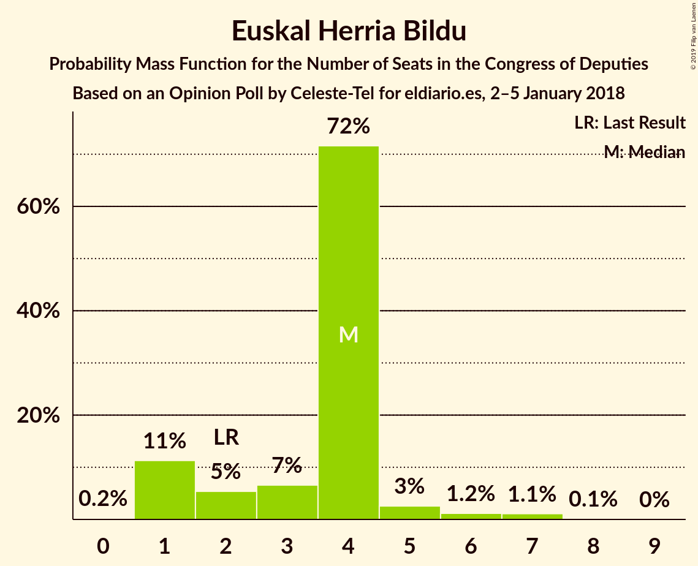
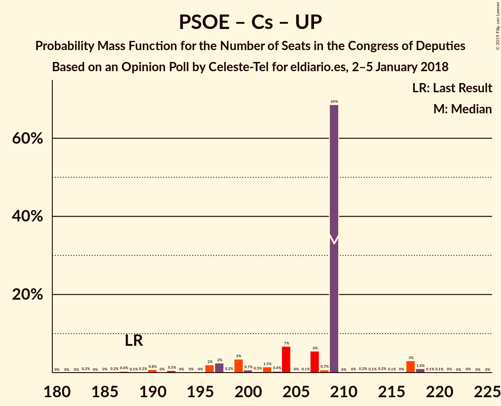

# Opinion Poll by Celeste-Tel for eldiario.es, 2–5 January 2018

<a href="#voting-intentions">Voting Intentions</a> | <a href="#seats">Seats</a> | <a href="#coalitions">Coalitions</a> | <a href="#technical-information">Technical Information</a>

## Voting Intentions

### Confidence Intervals

| Party | Last Result | Poll Result | 80% Confidence Interval | 90% Confidence Interval | 95% Confidence Interval | 99% Confidence Interval |
|:-----:|:-----------:|:-----------:|:-----------------------:|:-----------------------:|:-----------------------:|:-----------------------:|
| Partido Popular | 33.0% | 29.8% | 28.1–31.6% |27.6–32.1% |27.2–32.6% |26.4–33.5% |
| Partido Socialista Obrero Español | 22.6% | 25.1% | 23.5–26.8% |23.0–27.3% |22.6–27.7% |21.9–28.6% |
| Ciudadanos–Partido de la Ciudadanía | 13.1% | 18.6% | 17.2–20.2% |16.8–20.7% |16.4–21.0% |15.8–21.8% |
| Unidos Podemos | 21.2% | 16.9% | 15.5–18.4% |15.1–18.9% |14.8–19.3% |14.2–20.0% |
| Esquerra Republicana de Catalunya–Catalunya Sí | 2.7% | 2.5% | 2.0–3.3% |1.9–3.5% |1.8–3.7% |1.5–4.0% |
| Partit Demòcrata Europeu Català | 2.0% | 1.7% | 1.3–2.3% |1.2–2.5% |1.1–2.7% |0.9–3.0% |
| Euzko Alderdi Jeltzalea/Partido Nacionalista Vasco | 1.2% | 1.2% | 0.9–1.7% |0.8–1.9% |0.7–2.0% |0.6–2.3% |
| Partido Animalista Contra el Maltrato Animal | 1.2% | 1.2% | 0.9–1.7% |0.8–1.9% |0.7–2.0% |0.6–2.3% |
| Euskal Herria Bildu | 0.8% | 0.9% | 0.6–1.4% |0.5–1.5% |0.5–1.7% |0.4–1.9% |
| Coalición Canaria–Partido Nacionalista Canario | 0.3% | 0.3% | 0.2–0.6% |0.1–0.7% |0.1–0.8% |0.1–1.0% |
| Bloque Nacionalista Galego–Nós Candidatura Galega | 0.2% | 0.2% | 0.1–0.5% |0.1–0.6% |0.0–0.7% |0.0–0.9% |

*Note:* The poll result column reflects the actual value used in the calculations. Published results may vary slightly, and in addition be rounded to fewer digits.

## Seats

### Confidence Intervals

| Party | Last Result | Median | 80% Confidence Interval | 90% Confidence Interval | 95% Confidence Interval | 99% Confidence Interval |
|:-----:|:-----------:|:------:|:-----------------------:|:-----------------------:|:-----------------------:|:-----------------------:|
| <a href="#partido-popular">Partido Popular</a> | 137 | 112 | 112–125 |112–128 |110–128 |106–135 |
| <a href="#partido-socialista-obrero-español">Partido Socialista Obrero Español</a> | 85 | 95 | 92–97 |86–97 |82–102 |82–105 |
| <a href="#ciudadanos–partido-de-la-ciudadanía">Ciudadanos–Partido de la Ciudadanía</a> | 32 | 58 | 56–64 |52–67 |52–70 |50–72 |
| <a href="#unidos-podemos">Unidos Podemos</a> | 71 | 56 | 50–56 |44–60 |39–60 |38–60 |
| <a href="#esquerra-republicana-de-catalunya–catalunya-sí">Esquerra Republicana de Catalunya–Catalunya Sí</a> | 9 | 9 | 8–9 |7–11 |7–11 |6–14 |
| <a href="#partit-demòcrata-europeu-català">Partit Demòcrata Europeu Català</a> | 8 | 8 | 6–8 |5–8 |5–9 |3–12 |
| <a href="#euzko-alderdi-jeltzalea/partido-nacionalista-vasco">Euzko Alderdi Jeltzalea/Partido Nacionalista Vasco</a> | 5 | 7 | 4–7 |3–8 |3–8 |3–9 |
| <a href="#partido-animalista-contra-el-maltrato-animal">Partido Animalista Contra el Maltrato Animal</a> | 0 | 0 | 0 |0–1 |0–1 |0–1 |
| <a href="#euskal-herria-bildu">Euskal Herria Bildu</a> | 2 | 4 | 1–4 |1–4 |1–5 |1–7 |
| <a href="#coalición-canaria–partido-nacionalista-canario">Coalición Canaria–Partido Nacionalista Canario</a> | 1 | 1 | 0–1 |0–1 |0–2 |0–3 |
| <a href="#bloque-nacionalista-galego–nós-candidatura-galega">Bloque Nacionalista Galego–Nós Candidatura Galega</a> | 0 | 0 | 0 |0 |0 |0–1 |

### Partido Popular

*For a full overview of the results for this party, see the [Partido Popular](party-partidopopular.html) page.*

| Number of Seats | Probability | Accumulated | Special Marks |
|:---------------:|:-----------:|:-----------:|:-------------:|
| 101 | 0.1% | 100% |  |
| 102 | 0% | 99.9% |  |
| 103 | 0.1% | 99.9% |  |
| 104 | 0% | 99.8% |  |
| 105 | 0% | 99.8% |  |
| 106 | 0.8% | 99.8% |  |
| 107 | 0.1% | 99.0% |  |
| 108 | 0.1% | 98.9% |  |
| 109 | 0.3% | 98.8% |  |
| 110 | 3% | 98.6% |  |
| 111 | 0.1% | 95% |  |
| 112 | 66% | 95% | Median |
| 113 | 0% | 29% |  |
| 114 | 0% | 29% |  |
| 115 | 3% | 29% |  |
| 116 | 0.1% | 26% |  |
| 117 | 0% | 26% |  |
| 118 | 1.4% | 26% |  |
| 119 | 0% | 25% |  |
| 120 | 0.5% | 25% |  |
| 121 | 7% | 24% |  |
| 122 | 6% | 17% |  |
| 123 | 0.7% | 11% |  |
| 124 | 0.1% | 11% |  |
| 125 | 3% | 11% |  |
| 126 | 0.1% | 7% |  |
| 127 | 0.1% | 7% |  |
| 128 | 5% | 7% |  |
| 129 | 0% | 2% |  |
| 130 | 0.1% | 2% |  |
| 131 | 0.3% | 2% |  |
| 132 | 0.2% | 2% |  |
| 133 | 0.1% | 1.4% |  |
| 134 | 0.7% | 1.3% |  |
| 135 | 0.2% | 0.6% |  |
| 136 | 0.1% | 0.4% |  |
| 137 | 0.1% | 0.3% | Last Result |
| 138 | 0.1% | 0.3% |  |
| 139 | 0% | 0.1% |  |
| 140 | 0% | 0.1% |  |
| 141 | 0% | 0.1% |  |
| 142 | 0% | 0.1% |  |
| 143 | 0.1% | 0.1% |  |
| 144 | 0% | 0% |  |

### Partido Socialista Obrero Español

*For a full overview of the results for this party, see the [Partido Socialista Obrero Español](party-partidosocialistaobreroespañol.html) page.*

| Number of Seats | Probability | Accumulated | Special Marks |
|:---------------:|:-----------:|:-----------:|:-------------:|
| 79 | 0% | 100% |  |
| 80 | 0% | 99.9% |  |
| 81 | 0.1% | 99.9% |  |
| 82 | 4% | 99.8% |  |
| 83 | 0% | 96% |  |
| 84 | 0% | 96% |  |
| 85 | 0% | 96% | Last Result |
| 86 | 1.4% | 96% |  |
| 87 | 0.8% | 95% |  |
| 88 | 0.9% | 94% |  |
| 89 | 0.1% | 93% |  |
| 90 | 0.1% | 93% |  |
| 91 | 3% | 93% |  |
| 92 | 1.0% | 90% |  |
| 93 | 1.4% | 89% |  |
| 94 | 3% | 88% |  |
| 95 | 74% | 84% | Median |
| 96 | 0.4% | 11% |  |
| 97 | 6% | 10% |  |
| 98 | 0% | 4% |  |
| 99 | 0.5% | 4% |  |
| 100 | 0.1% | 4% |  |
| 101 | 0.8% | 4% |  |
| 102 | 2% | 3% |  |
| 103 | 0% | 0.8% |  |
| 104 | 0.1% | 0.7% |  |
| 105 | 0.5% | 0.7% |  |
| 106 | 0% | 0.1% |  |
| 107 | 0% | 0.1% |  |
| 108 | 0% | 0.1% |  |
| 109 | 0% | 0.1% |  |
| 110 | 0% | 0% |  |

### Ciudadanos–Partido de la Ciudadanía

*For a full overview of the results for this party, see the [Ciudadanos–Partido de la Ciudadanía](party-ciudadanos–partidodelaciudadanía.html) page.*

| Number of Seats | Probability | Accumulated | Special Marks |
|:---------------:|:-----------:|:-----------:|:-------------:|
| 32 | 0% | 100% | Last Result |
| 33 | 0% | 100% |  |
| 34 | 0% | 100% |  |
| 35 | 0% | 100% |  |
| 36 | 0% | 100% |  |
| 37 | 0% | 100% |  |
| 38 | 0% | 100% |  |
| 39 | 0% | 100% |  |
| 40 | 0% | 100% |  |
| 41 | 0% | 100% |  |
| 42 | 0% | 100% |  |
| 43 | 0% | 100% |  |
| 44 | 0% | 100% |  |
| 45 | 0% | 100% |  |
| 46 | 0.1% | 100% |  |
| 47 | 0.2% | 99.9% |  |
| 48 | 0% | 99.7% |  |
| 49 | 0.1% | 99.7% |  |
| 50 | 0.7% | 99.5% |  |
| 51 | 0.2% | 98.8% |  |
| 52 | 7% | 98.7% |  |
| 53 | 0.7% | 92% |  |
| 54 | 0.4% | 91% |  |
| 55 | 0.1% | 91% |  |
| 56 | 9% | 91% |  |
| 57 | 0.1% | 82% |  |
| 58 | 67% | 82% | Median |
| 59 | 0.3% | 16% |  |
| 60 | 1.2% | 15% |  |
| 61 | 0.7% | 14% |  |
| 62 | 0.2% | 13% |  |
| 63 | 3% | 13% |  |
| 64 | 0.3% | 10% |  |
| 65 | 3% | 10% |  |
| 66 | 0.2% | 7% |  |
| 67 | 3% | 7% |  |
| 68 | 0.4% | 3% |  |
| 69 | 0.1% | 3% |  |
| 70 | 2% | 3% |  |
| 71 | 0.1% | 1.2% |  |
| 72 | 1.1% | 1.1% |  |
| 73 | 0% | 0% |  |

### Unidos Podemos

*For a full overview of the results for this party, see the [Unidos Podemos](party-unidospodemos.html) page.*

| Number of Seats | Probability | Accumulated | Special Marks |
|:---------------:|:-----------:|:-----------:|:-------------:|
| 33 | 0% | 100% |  |
| 34 | 0% | 99.9% |  |
| 35 | 0.1% | 99.9% |  |
| 36 | 0.1% | 99.8% |  |
| 37 | 0% | 99.8% |  |
| 38 | 0.6% | 99.7% |  |
| 39 | 2% | 99.1% |  |
| 40 | 0.2% | 97% |  |
| 41 | 0.8% | 97% |  |
| 42 | 0.1% | 96% |  |
| 43 | 0.1% | 96% |  |
| 44 | 1.3% | 95% |  |
| 45 | 0.5% | 94% |  |
| 46 | 2% | 94% |  |
| 47 | 0.4% | 92% |  |
| 48 | 0% | 92% |  |
| 49 | 1.1% | 92% |  |
| 50 | 5% | 90% |  |
| 51 | 6% | 86% |  |
| 52 | 0% | 80% |  |
| 53 | 4% | 80% |  |
| 54 | 0.1% | 76% |  |
| 55 | 0.1% | 76% |  |
| 56 | 66% | 76% | Median |
| 57 | 0.3% | 9% |  |
| 58 | 0% | 9% |  |
| 59 | 0.1% | 9% |  |
| 60 | 9% | 9% |  |
| 61 | 0% | 0.3% |  |
| 62 | 0.2% | 0.3% |  |
| 63 | 0% | 0% |  |
| 64 | 0% | 0% |  |
| 65 | 0% | 0% |  |
| 66 | 0% | 0% |  |
| 67 | 0% | 0% |  |
| 68 | 0% | 0% |  |
| 69 | 0% | 0% |  |
| 70 | 0% | 0% |  |
| 71 | 0% | 0% | Last Result |

### Esquerra Republicana de Catalunya–Catalunya Sí

*For a full overview of the results for this party, see the [Esquerra Republicana de Catalunya–Catalunya Sí](party-esquerrarepublicanadecatalunya–catalunyasí.html) page.*

| Number of Seats | Probability | Accumulated | Special Marks |
|:---------------:|:-----------:|:-----------:|:-------------:|
| 6 | 0.5% | 100% |  |
| 7 | 8% | 99.5% |  |
| 8 | 11% | 92% |  |
| 9 | 75% | 81% | Last Result, Median |
| 10 | 0.1% | 6% |  |
| 11 | 3% | 6% |  |
| 12 | 1.0% | 2% |  |
| 13 | 0.9% | 1.4% |  |
| 14 | 0.2% | 0.5% |  |
| 15 | 0.1% | 0.3% |  |
| 16 | 0% | 0.2% |  |
| 17 | 0.2% | 0.2% |  |
| 18 | 0% | 0% |  |

### Partit Demòcrata Europeu Català

*For a full overview of the results for this party, see the [Partit Demòcrata Europeu Català](party-partitdemòcrataeuropeucatalà.html) page.*

| Number of Seats | Probability | Accumulated | Special Marks |
|:---------------:|:-----------:|:-----------:|:-------------:|
| 1 | 0.1% | 100% |  |
| 2 | 0.1% | 99.9% |  |
| 3 | 0.8% | 99.8% |  |
| 4 | 1.1% | 99.0% |  |
| 5 | 6% | 98% |  |
| 6 | 8% | 92% |  |
| 7 | 0.6% | 84% |  |
| 8 | 80% | 83% | Last Result, Median |
| 9 | 1.2% | 3% |  |
| 10 | 1.1% | 2% |  |
| 11 | 0.2% | 0.7% |  |
| 12 | 0.1% | 0.5% |  |
| 13 | 0.4% | 0.4% |  |
| 14 | 0% | 0% |  |

### Euzko Alderdi Jeltzalea/Partido Nacionalista Vasco

*For a full overview of the results for this party, see the [Euzko Alderdi Jeltzalea/Partido Nacionalista Vasco](party-euzkoalderdijeltzaleapartidonacionalistavasco.html) page.*

| Number of Seats | Probability | Accumulated | Special Marks |
|:---------------:|:-----------:|:-----------:|:-------------:|
| 1 | 0.1% | 100% |  |
| 2 | 0.3% | 99.9% |  |
| 3 | 9% | 99.6% |  |
| 4 | 0.4% | 90% |  |
| 5 | 2% | 90% | Last Result |
| 6 | 13% | 88% |  |
| 7 | 68% | 75% | Median |
| 8 | 6% | 7% |  |
| 9 | 0.7% | 0.8% |  |
| 10 | 0% | 0% |  |

### Partido Animalista Contra el Maltrato Animal

*For a full overview of the results for this party, see the [Partido Animalista Contra el Maltrato Animal](party-partidoanimalistacontraelmaltratoanimal.html) page.*

| Number of Seats | Probability | Accumulated | Special Marks |
|:---------------:|:-----------:|:-----------:|:-------------:|
| 0 | 94% | 100% | Last Result, Median |
| 1 | 6% | 6% |  |
| 2 | 0% | 0% |  |

### Euskal Herria Bildu

*For a full overview of the results for this party, see the [Euskal Herria Bildu](party-euskalherriabildu.html) page.*

| Number of Seats | Probability | Accumulated | Special Marks |
|:---------------:|:-----------:|:-----------:|:-------------:|
| 0 | 0.2% | 100% |  |
| 1 | 11% | 99.8% |  |
| 2 | 5% | 89% | Last Result |
| 3 | 7% | 83% |  |
| 4 | 72% | 77% | Median |
| 5 | 3% | 5% |  |
| 6 | 1.2% | 2% |  |
| 7 | 1.1% | 1.2% |  |
| 8 | 0.1% | 0.1% |  |
| 9 | 0% | 0% |  |

### Coalición Canaria–Partido Nacionalista Canario

*For a full overview of the results for this party, see the [Coalición Canaria–Partido Nacionalista Canario](party-coalicióncanaria–partidonacionalistacanario.html) page.*

| Number of Seats | Probability | Accumulated | Special Marks |
|:---------------:|:-----------:|:-----------:|:-------------:|
| 0 | 10% | 100% |  |
| 1 | 87% | 90% | Last Result, Median |
| 2 | 0.8% | 3% |  |
| 3 | 2% | 2% |  |
| 4 | 0.2% | 0.2% |  |
| 5 | 0% | 0% |  |

### Bloque Nacionalista Galego–Nós Candidatura Galega

*For a full overview of the results for this party, see the [Bloque Nacionalista Galego–Nós Candidatura Galega](party-bloquenacionalistagalego–nóscandidaturagalega.html) page.*

| Number of Seats | Probability | Accumulated | Special Marks |
|:---------------:|:-----------:|:-----------:|:-------------:|
| 0 | 98% | 100% | Last Result, Median |
| 1 | 1.1% | 2% |  |
| 2 | 0.4% | 0.4% |  |
| 3 | 0% | 0% |  |

## Coalitions

### Confidence Intervals

| Coalition | Last Result | Median | Majority? | 80% Confidence Interval | 90% Confidence Interval | 95% Confidence Interval | 99% Confidence Interval |
|:---------:|:-----------:|:------:|:---------:|:-----------------------:|:-----------------------:|:-----------------------:|:-----------------------:|
| Partido Popular – Partido Socialista Obrero Español – Ciudadanos–Partido de la Ciudadanía | 254 | 265 | 100% | 265–277 | 265–279 | 265–283 | 265–287 |
| Partido Popular – Partido Socialista Obrero Español | 222 | 207 | 100% | 207–218 | 206–223 | 204–227 | 201–229 |
| Partido Socialista Obrero Español – Ciudadanos–Partido de la Ciudadanía – Unidos Podemos | 188 | 209 | 100% | 199–209 | 197–209 | 195–217 | 187–218 |
| Partido Popular – Ciudadanos–Partido de la Ciudadanía – Euzko Alderdi Jeltzalea/Partido Nacionalista Vasco | 174 | 177 | 99.7% | 177–186 | 177–198 | 177–201 | 177–201 |
| Partido Popular – Ciudadanos–Partido de la Ciudadanía – Coalición Canaria–Partido Nacionalista Canario | 170 | 171 | 24% | 171–182 | 171–193 | 171–195 | 171–195 |
| Partido Popular – Ciudadanos–Partido de la Ciudadanía | 169 | 170 | 24% | 170–181 | 170–192 | 170–195 | 170–195 |
| Partido Socialista Obrero Español – Unidos Podemos – Esquerra Republicana de Catalunya–Catalunya Sí – Partit Demòcrata Europeu Català – Euzko Alderdi Jeltzalea/Partido Nacionalista Vasco – Euskal Herria Bildu | 180 | 179 | 70% | 168–179 | 157–179 | 155–179 | 155–179 |
| Partido Socialista Obrero Español – Unidos Podemos – Esquerra Republicana de Catalunya–Catalunya Sí – Partit Demòcrata Europeu Català | 173 | 168 | 0.1% | 158–168 | 148–168 | 148–169 | 147–169 |
| Partido Socialista Obrero Español – Unidos Podemos – Esquerra Republicana de Catalunya–Catalunya Sí – Euskal Herria Bildu | 167 | 164 | 0% | 155–164 | 145–166 | 141–166 | 141–166 |
| Partido Socialista Obrero Español – Unidos Podemos – Euzko Alderdi Jeltzalea/Partido Nacionalista Vasco – Euskal Herria Bildu | 163 | 162 | 0% | 149–162 | 140–162 | 139–162 | 138–162 |
| Partido Socialista Obrero Español – Unidos Podemos – Euzko Alderdi Jeltzalea/Partido Nacionalista Vasco | 161 | 158 | 0% | 144–158 | 138–158 | 138–160 | 135–160 |
| Partido Socialista Obrero Español – Ciudadanos–Partido de la Ciudadanía | 117 | 153 | 0.1% | 149–156 | 147–158 | 147–159 | 139–165 |
| Partido Socialista Obrero Español – Unidos Podemos | 156 | 151 | 0% | 141–151 | 132–155 | 132–155 | 130–155 |
| Partido Popular | 137 | 112 | 0% | 112–125 | 112–128 | 110–128 | 106–135 |
| Partido Socialista Obrero Español | 85 | 95 | 0% | 92–97 | 86–97 | 82–102 | 82–105 |

### Partido Popular – Partido Socialista Obrero Español – Ciudadanos–Partido de la Ciudadanía

| Number of Seats | Probability | Accumulated | Special Marks |
|:---------------:|:-----------:|:-----------:|:-------------:|
| 254 | 0% | 100% | Last Result |
| 255 | 0% | 100% |  |
| 256 | 0% | 100% |  |
| 257 | 0% | 100% |  |
| 258 | 0% | 100% |  |
| 259 | 0% | 100% |  |
| 260 | 0% | 100% |  |
| 261 | 0.1% | 100% |  |
| 262 | 0% | 99.9% |  |
| 263 | 0% | 99.9% |  |
| 264 | 0% | 99.9% |  |
| 265 | 66% | 99.8% | Median |
| 266 | 0.1% | 33% |  |
| 267 | 4% | 33% |  |
| 268 | 0.1% | 30% |  |
| 269 | 6% | 29% |  |
| 270 | 0.2% | 24% |  |
| 271 | 3% | 23% |  |
| 272 | 0.2% | 20% |  |
| 273 | 0.2% | 20% |  |
| 274 | 7% | 20% |  |
| 275 | 1.3% | 13% |  |
| 276 | 0.8% | 12% |  |
| 277 | 4% | 11% |  |
| 278 | 0.2% | 6% |  |
| 279 | 2% | 6% |  |
| 280 | 0.5% | 4% |  |
| 281 | 0.2% | 4% |  |
| 282 | 0.4% | 4% |  |
| 283 | 3% | 3% |  |
| 284 | 0% | 0.8% |  |
| 285 | 0.1% | 0.8% |  |
| 286 | 0% | 0.7% |  |
| 287 | 0.5% | 0.7% |  |
| 288 | 0.1% | 0.2% |  |
| 289 | 0% | 0.1% |  |
| 290 | 0% | 0.1% |  |
| 291 | 0% | 0.1% |  |
| 292 | 0% | 0.1% |  |
| 293 | 0% | 0.1% |  |
| 294 | 0.1% | 0.1% |  |
| 295 | 0% | 0% |  |

### Partido Popular – Partido Socialista Obrero Español

| Number of Seats | Probability | Accumulated | Special Marks |
|:---------------:|:-----------:|:-----------:|:-------------:|
| 196 | 0.1% | 100% |  |
| 197 | 0.1% | 99.9% |  |
| 198 | 0.1% | 99.9% |  |
| 199 | 0.1% | 99.8% |  |
| 200 | 0% | 99.7% |  |
| 201 | 0.8% | 99.7% |  |
| 202 | 0% | 98.8% |  |
| 203 | 0% | 98.8% |  |
| 204 | 3% | 98.8% |  |
| 205 | 0% | 96% |  |
| 206 | 3% | 96% |  |
| 207 | 67% | 93% | Median |
| 208 | 0.2% | 25% |  |
| 209 | 0.2% | 25% |  |
| 210 | 4% | 25% |  |
| 211 | 0.9% | 21% |  |
| 212 | 0.1% | 20% |  |
| 213 | 0.5% | 20% |  |
| 214 | 0.2% | 20% |  |
| 215 | 0% | 20% |  |
| 216 | 0.3% | 20% |  |
| 217 | 6% | 19% |  |
| 218 | 6% | 13% |  |
| 219 | 0% | 7% |  |
| 220 | 0.2% | 7% |  |
| 221 | 0.8% | 7% |  |
| 222 | 0.9% | 6% | Last Result |
| 223 | 1.5% | 5% |  |
| 224 | 0.3% | 4% |  |
| 225 | 0.1% | 4% |  |
| 226 | 0.4% | 3% |  |
| 227 | 2% | 3% |  |
| 228 | 0% | 0.7% |  |
| 229 | 0.5% | 0.6% |  |
| 230 | 0% | 0.2% |  |
| 231 | 0% | 0.1% |  |
| 232 | 0% | 0.1% |  |
| 233 | 0% | 0.1% |  |
| 234 | 0% | 0.1% |  |
| 235 | 0% | 0.1% |  |
| 236 | 0% | 0.1% |  |
| 237 | 0% | 0.1% |  |
| 238 | 0% | 0.1% |  |
| 239 | 0.1% | 0.1% |  |
| 240 | 0% | 0% |  |

### Partido Socialista Obrero Español – Ciudadanos–Partido de la Ciudadanía – Unidos Podemos

| Number of Seats | Probability | Accumulated | Special Marks |
|:---------------:|:-----------:|:-----------:|:-------------:|
| 183 | 0.2% | 100% |  |
| 184 | 0% | 99.8% |  |
| 185 | 0% | 99.8% |  |
| 186 | 0.2% | 99.8% |  |
| 187 | 0.4% | 99.6% |  |
| 188 | 0.1% | 99.2% | Last Result |
| 189 | 0.2% | 99.1% |  |
| 190 | 0.8% | 99.0% |  |
| 191 | 0% | 98% |  |
| 192 | 0.5% | 98% |  |
| 193 | 0% | 98% |  |
| 194 | 0% | 98% |  |
| 195 | 0% | 98% |  |
| 196 | 2% | 97% |  |
| 197 | 2% | 95% |  |
| 198 | 0.2% | 93% |  |
| 199 | 3% | 93% |  |
| 200 | 0.7% | 89% |  |
| 201 | 0.3% | 89% |  |
| 202 | 1.5% | 88% |  |
| 203 | 0.4% | 87% |  |
| 204 | 7% | 87% |  |
| 205 | 0% | 80% |  |
| 206 | 0.1% | 80% |  |
| 207 | 6% | 80% |  |
| 208 | 0.7% | 74% |  |
| 209 | 69% | 73% | Median |
| 210 | 0% | 5% |  |
| 211 | 0% | 5% |  |
| 212 | 0.2% | 5% |  |
| 213 | 0.1% | 5% |  |
| 214 | 0.2% | 5% |  |
| 215 | 0.1% | 4% |  |
| 216 | 0% | 4% |  |
| 217 | 3% | 4% |  |
| 218 | 1.0% | 1.2% |  |
| 219 | 0.1% | 0.2% |  |
| 220 | 0.1% | 0.1% |  |
| 221 | 0% | 0.1% |  |
| 222 | 0% | 0% |  |

### Partido Popular – Ciudadanos–Partido de la Ciudadanía – Euzko Alderdi Jeltzalea/Partido Nacionalista Vasco

| Number of Seats | Probability | Accumulated | Special Marks |
|:---------------:|:-----------:|:-----------:|:-------------:|
| 170 | 0% | 100% |  |
| 171 | 0% | 99.9% |  |
| 172 | 0.1% | 99.9% |  |
| 173 | 0% | 99.9% |  |
| 174 | 0% | 99.8% | Last Result |
| 175 | 0.1% | 99.8% |  |
| 176 | 0% | 99.7% | Majority |
| 177 | 72% | 99.7% | Median |
| 178 | 0% | 28% |  |
| 179 | 3% | 28% |  |
| 180 | 0.3% | 24% |  |
| 181 | 1.0% | 24% |  |
| 182 | 0.4% | 23% |  |
| 183 | 1.0% | 23% |  |
| 184 | 2% | 22% |  |
| 185 | 6% | 19% |  |
| 186 | 3% | 13% |  |
| 187 | 0.5% | 10% |  |
| 188 | 0.1% | 9% |  |
| 189 | 0.3% | 9% |  |
| 190 | 2% | 9% |  |
| 191 | 0.2% | 7% |  |
| 192 | 0% | 7% |  |
| 193 | 0% | 7% |  |
| 194 | 0% | 7% |  |
| 195 | 0.7% | 6% |  |
| 196 | 0.6% | 6% |  |
| 197 | 0.1% | 5% |  |
| 198 | 0.1% | 5% |  |
| 199 | 1.1% | 5% |  |
| 200 | 0.1% | 4% |  |
| 201 | 3% | 4% |  |
| 202 | 0% | 0.3% |  |
| 203 | 0.1% | 0.3% |  |
| 204 | 0% | 0.2% |  |
| 205 | 0% | 0.2% |  |
| 206 | 0% | 0.2% |  |
| 207 | 0.2% | 0.2% |  |
| 208 | 0% | 0% |  |

### Partido Popular – Ciudadanos–Partido de la Ciudadanía – Coalición Canaria–Partido Nacionalista Canario

| Number of Seats | Probability | Accumulated | Special Marks |
|:---------------:|:-----------:|:-----------:|:-------------:|
| 163 | 0% | 100% |  |
| 164 | 0% | 99.9% |  |
| 165 | 0% | 99.9% |  |
| 166 | 0% | 99.9% |  |
| 167 | 0% | 99.9% |  |
| 168 | 0% | 99.9% |  |
| 169 | 0% | 99.9% |  |
| 170 | 0% | 99.9% | Last Result |
| 171 | 66% | 99.9% | Median |
| 172 | 0.2% | 33% |  |
| 173 | 3% | 33% |  |
| 174 | 0.1% | 30% |  |
| 175 | 7% | 30% |  |
| 176 | 1.0% | 24% | Majority |
| 177 | 0.1% | 23% |  |
| 178 | 7% | 23% |  |
| 179 | 0% | 16% |  |
| 180 | 0.1% | 16% |  |
| 181 | 3% | 16% |  |
| 182 | 3% | 12% |  |
| 183 | 0% | 9% |  |
| 184 | 0.1% | 9% |  |
| 185 | 0.2% | 9% |  |
| 186 | 0.2% | 9% |  |
| 187 | 0.1% | 9% |  |
| 188 | 2% | 9% |  |
| 189 | 0.8% | 7% |  |
| 190 | 0.9% | 6% |  |
| 191 | 0.1% | 5% |  |
| 192 | 0.1% | 5% |  |
| 193 | 0.1% | 5% |  |
| 194 | 1.0% | 5% |  |
| 195 | 3% | 4% |  |
| 196 | 0% | 0.4% |  |
| 197 | 0.1% | 0.3% |  |
| 198 | 0% | 0.2% |  |
| 199 | 0% | 0.2% |  |
| 200 | 0% | 0.2% |  |
| 201 | 0% | 0.1% |  |
| 202 | 0.1% | 0.1% |  |
| 203 | 0% | 0% |  |

### Partido Popular – Ciudadanos–Partido de la Ciudadanía

| Number of Seats | Probability | Accumulated | Special Marks |
|:---------------:|:-----------:|:-----------:|:-------------:|
| 162 | 0% | 100% |  |
| 163 | 0% | 99.9% |  |
| 164 | 0% | 99.9% |  |
| 165 | 0% | 99.9% |  |
| 166 | 0% | 99.9% |  |
| 167 | 0% | 99.9% |  |
| 168 | 0% | 99.9% |  |
| 169 | 0.1% | 99.9% | Last Result |
| 170 | 66% | 99.8% | Median |
| 171 | 0.1% | 33% |  |
| 172 | 0.1% | 33% |  |
| 173 | 3% | 33% |  |
| 174 | 6% | 30% |  |
| 175 | 0.3% | 24% |  |
| 176 | 1.1% | 24% | Majority |
| 177 | 6% | 22% |  |
| 178 | 0.8% | 17% |  |
| 179 | 0.1% | 16% |  |
| 180 | 3% | 16% |  |
| 181 | 3% | 12% |  |
| 182 | 0.4% | 9% |  |
| 183 | 0.2% | 9% |  |
| 184 | 0.3% | 9% |  |
| 185 | 0.8% | 9% |  |
| 186 | 0.1% | 8% |  |
| 187 | 1.1% | 8% |  |
| 188 | 1.2% | 7% |  |
| 189 | 0% | 5% |  |
| 190 | 0.2% | 5% |  |
| 191 | 0.1% | 5% |  |
| 192 | 0.1% | 5% |  |
| 193 | 1.1% | 5% |  |
| 194 | 0.1% | 4% |  |
| 195 | 3% | 4% |  |
| 196 | 0% | 0.3% |  |
| 197 | 0.1% | 0.3% |  |
| 198 | 0% | 0.2% |  |
| 199 | 0% | 0.2% |  |
| 200 | 0% | 0.1% |  |
| 201 | 0.1% | 0.1% |  |
| 202 | 0% | 0% |  |

### Partido Socialista Obrero Español – Unidos Podemos – Esquerra Republicana de Catalunya–Catalunya Sí – Partit Demòcrata Europeu Català – Euzko Alderdi Jeltzalea/Partido Nacionalista Vasco – Euskal Herria Bildu

| Number of Seats | Probability | Accumulated | Special Marks |
|:---------------:|:-----------:|:-----------:|:-------------:|
| 148 | 0.1% | 100% |  |
| 149 | 0% | 99.9% |  |
| 150 | 0% | 99.8% |  |
| 151 | 0% | 99.8% |  |
| 152 | 0.1% | 99.8% |  |
| 153 | 0% | 99.7% |  |
| 154 | 0.1% | 99.7% |  |
| 155 | 3% | 99.6% |  |
| 156 | 1.0% | 96% |  |
| 157 | 0.1% | 95% |  |
| 158 | 0.1% | 95% |  |
| 159 | 0.2% | 95% |  |
| 160 | 0.9% | 95% |  |
| 161 | 1.4% | 94% |  |
| 162 | 1.0% | 92% |  |
| 163 | 0.1% | 91% |  |
| 164 | 0.2% | 91% |  |
| 165 | 0.2% | 91% |  |
| 166 | 0.1% | 91% |  |
| 167 | 0% | 91% |  |
| 168 | 4% | 91% |  |
| 169 | 2% | 87% |  |
| 170 | 0.1% | 84% |  |
| 171 | 0% | 84% |  |
| 172 | 7% | 84% |  |
| 173 | 0.1% | 77% |  |
| 174 | 6% | 77% |  |
| 175 | 1.1% | 71% |  |
| 176 | 0.1% | 70% | Majority |
| 177 | 3% | 70% |  |
| 178 | 0.1% | 67% |  |
| 179 | 66% | 67% | Median |
| 180 | 0% | 0.1% | Last Result |
| 181 | 0% | 0.1% |  |
| 182 | 0% | 0.1% |  |
| 183 | 0% | 0.1% |  |
| 184 | 0% | 0.1% |  |
| 185 | 0% | 0.1% |  |
| 186 | 0% | 0.1% |  |
| 187 | 0% | 0.1% |  |
| 188 | 0% | 0% |  |

### Partido Socialista Obrero Español – Unidos Podemos – Esquerra Republicana de Catalunya–Catalunya Sí – Partit Demòcrata Europeu Català

| Number of Seats | Probability | Accumulated | Special Marks |
|:---------------:|:-----------:|:-----------:|:-------------:|
| 139 | 0.1% | 100% |  |
| 140 | 0.1% | 99.9% |  |
| 141 | 0.1% | 99.8% |  |
| 142 | 0% | 99.7% |  |
| 143 | 0% | 99.7% |  |
| 144 | 0% | 99.7% |  |
| 145 | 0.1% | 99.6% |  |
| 146 | 0% | 99.6% |  |
| 147 | 0% | 99.5% |  |
| 148 | 5% | 99.5% |  |
| 149 | 0.1% | 95% |  |
| 150 | 0.3% | 95% |  |
| 151 | 1.1% | 95% |  |
| 152 | 0.6% | 94% |  |
| 153 | 0.8% | 93% |  |
| 154 | 0.8% | 92% |  |
| 155 | 0.2% | 91% |  |
| 156 | 0.3% | 91% |  |
| 157 | 0% | 91% |  |
| 158 | 1.4% | 91% |  |
| 159 | 2% | 89% |  |
| 160 | 3% | 87% |  |
| 161 | 0.6% | 84% |  |
| 162 | 0.1% | 84% |  |
| 163 | 6% | 84% |  |
| 164 | 0.6% | 78% |  |
| 165 | 2% | 78% |  |
| 166 | 0.1% | 76% |  |
| 167 | 0.4% | 76% |  |
| 168 | 72% | 75% | Median |
| 169 | 3% | 3% |  |
| 170 | 0.1% | 0.3% |  |
| 171 | 0% | 0.2% |  |
| 172 | 0% | 0.1% |  |
| 173 | 0% | 0.1% | Last Result |
| 174 | 0% | 0.1% |  |
| 175 | 0% | 0.1% |  |
| 176 | 0% | 0.1% | Majority |
| 177 | 0% | 0% |  |

### Partido Socialista Obrero Español – Unidos Podemos – Esquerra Republicana de Catalunya–Catalunya Sí – Euskal Herria Bildu

| Number of Seats | Probability | Accumulated | Special Marks |
|:---------------:|:-----------:|:-----------:|:-------------:|
| 135 | 0.1% | 100% |  |
| 136 | 0.1% | 99.9% |  |
| 137 | 0% | 99.8% |  |
| 138 | 0% | 99.8% |  |
| 139 | 0% | 99.8% |  |
| 140 | 0.2% | 99.8% |  |
| 141 | 4% | 99.6% |  |
| 142 | 0.1% | 95% |  |
| 143 | 0% | 95% |  |
| 144 | 0% | 95% |  |
| 145 | 0.1% | 95% |  |
| 146 | 0.9% | 95% |  |
| 147 | 0.1% | 94% |  |
| 148 | 0.1% | 94% |  |
| 149 | 1.3% | 94% |  |
| 150 | 0.7% | 93% |  |
| 151 | 1.0% | 92% |  |
| 152 | 0.2% | 91% |  |
| 153 | 0% | 91% |  |
| 154 | 0.3% | 91% |  |
| 155 | 3% | 90% |  |
| 156 | 1.1% | 87% |  |
| 157 | 2% | 86% |  |
| 158 | 6% | 84% |  |
| 159 | 0% | 77% |  |
| 160 | 0.2% | 77% |  |
| 161 | 0.1% | 77% |  |
| 162 | 0.1% | 77% |  |
| 163 | 4% | 77% |  |
| 164 | 66% | 73% | Median |
| 165 | 1.2% | 7% |  |
| 166 | 5% | 6% |  |
| 167 | 0% | 0.2% | Last Result |
| 168 | 0% | 0.2% |  |
| 169 | 0% | 0.2% |  |
| 170 | 0% | 0.1% |  |
| 171 | 0.1% | 0.1% |  |
| 172 | 0% | 0.1% |  |
| 173 | 0% | 0.1% |  |
| 174 | 0% | 0% |  |

### Partido Socialista Obrero Español – Unidos Podemos – Euzko Alderdi Jeltzalea/Partido Nacionalista Vasco – Euskal Herria Bildu

| Number of Seats | Probability | Accumulated | Special Marks |
|:---------------:|:-----------:|:-----------:|:-------------:|
| 133 | 0.1% | 100% |  |
| 134 | 0% | 99.8% |  |
| 135 | 0.1% | 99.8% |  |
| 136 | 0.1% | 99.7% |  |
| 137 | 0% | 99.7% |  |
| 138 | 0.2% | 99.6% |  |
| 139 | 3% | 99.5% |  |
| 140 | 1.0% | 96% |  |
| 141 | 0.2% | 95% |  |
| 142 | 0% | 95% |  |
| 143 | 1.1% | 95% |  |
| 144 | 0.3% | 94% |  |
| 145 | 0.1% | 93% |  |
| 146 | 2% | 93% |  |
| 147 | 1.3% | 92% |  |
| 148 | 0% | 90% |  |
| 149 | 2% | 90% |  |
| 150 | 0.2% | 88% |  |
| 151 | 0% | 88% |  |
| 152 | 0.3% | 88% |  |
| 153 | 0.5% | 88% |  |
| 154 | 3% | 87% |  |
| 155 | 0.2% | 84% |  |
| 156 | 0.7% | 84% |  |
| 157 | 7% | 83% |  |
| 158 | 0.2% | 76% |  |
| 159 | 0.3% | 76% |  |
| 160 | 0.3% | 76% |  |
| 161 | 6% | 75% |  |
| 162 | 69% | 70% | Median |
| 163 | 0% | 0.1% | Last Result |
| 164 | 0% | 0.1% |  |
| 165 | 0% | 0.1% |  |
| 166 | 0% | 0.1% |  |
| 167 | 0% | 0.1% |  |
| 168 | 0% | 0.1% |  |
| 169 | 0% | 0% |  |

### Partido Socialista Obrero Español – Unidos Podemos – Euzko Alderdi Jeltzalea/Partido Nacionalista Vasco

| Number of Seats | Probability | Accumulated | Special Marks |
|:---------------:|:-----------:|:-----------:|:-------------:|
| 126 | 0.1% | 100% |  |
| 127 | 0% | 99.9% |  |
| 128 | 0% | 99.9% |  |
| 129 | 0% | 99.9% |  |
| 130 | 0% | 99.9% |  |
| 131 | 0.2% | 99.9% |  |
| 132 | 0% | 99.7% |  |
| 133 | 0.1% | 99.7% |  |
| 134 | 0.1% | 99.6% |  |
| 135 | 0% | 99.5% |  |
| 136 | 0.2% | 99.5% |  |
| 137 | 0.1% | 99.3% |  |
| 138 | 5% | 99.2% |  |
| 139 | 0.2% | 95% |  |
| 140 | 0.8% | 94% |  |
| 141 | 1.0% | 94% |  |
| 142 | 0.2% | 93% |  |
| 143 | 0.2% | 92% |  |
| 144 | 2% | 92% |  |
| 145 | 2% | 90% |  |
| 146 | 0% | 88% |  |
| 147 | 0% | 88% |  |
| 148 | 0.1% | 88% |  |
| 149 | 0.5% | 88% |  |
| 150 | 3% | 87% |  |
| 151 | 0.2% | 84% |  |
| 152 | 0.1% | 84% |  |
| 153 | 1.2% | 84% |  |
| 154 | 0.1% | 82% |  |
| 155 | 0.9% | 82% |  |
| 156 | 6% | 81% |  |
| 157 | 0.2% | 75% |  |
| 158 | 72% | 75% | Median |
| 159 | 0.2% | 3% |  |
| 160 | 3% | 3% |  |
| 161 | 0.2% | 0.2% | Last Result |
| 162 | 0% | 0.1% |  |
| 163 | 0% | 0.1% |  |
| 164 | 0% | 0.1% |  |
| 165 | 0% | 0.1% |  |
| 166 | 0% | 0.1% |  |
| 167 | 0% | 0% |  |

### Partido Socialista Obrero Español – Ciudadanos–Partido de la Ciudadanía

| Number of Seats | Probability | Accumulated | Special Marks |
|:---------------:|:-----------:|:-----------:|:-------------:|
| 117 | 0% | 100% | Last Result |
| 118 | 0% | 100% |  |
| 119 | 0% | 100% |  |
| 120 | 0% | 100% |  |
| 121 | 0% | 100% |  |
| 122 | 0% | 100% |  |
| 123 | 0% | 100% |  |
| 124 | 0% | 100% |  |
| 125 | 0% | 100% |  |
| 126 | 0% | 100% |  |
| 127 | 0% | 100% |  |
| 128 | 0% | 100% |  |
| 129 | 0% | 100% |  |
| 130 | 0% | 100% |  |
| 131 | 0% | 100% |  |
| 132 | 0% | 100% |  |
| 133 | 0% | 100% |  |
| 134 | 0% | 100% |  |
| 135 | 0% | 100% |  |
| 136 | 0% | 100% |  |
| 137 | 0% | 100% |  |
| 138 | 0.3% | 100% |  |
| 139 | 0.2% | 99.7% |  |
| 140 | 0.8% | 99.4% |  |
| 141 | 0.2% | 98.6% |  |
| 142 | 0.1% | 98% |  |
| 143 | 0.1% | 98% |  |
| 144 | 0.1% | 98% |  |
| 145 | 0% | 98% |  |
| 146 | 0.1% | 98% |  |
| 147 | 7% | 98% |  |
| 148 | 0.1% | 91% |  |
| 149 | 4% | 91% |  |
| 150 | 0.2% | 87% |  |
| 151 | 0.5% | 87% |  |
| 152 | 0.9% | 86% |  |
| 153 | 72% | 85% | Median |
| 154 | 0.7% | 13% |  |
| 155 | 0.2% | 13% |  |
| 156 | 3% | 13% |  |
| 157 | 3% | 10% |  |
| 158 | 4% | 7% |  |
| 159 | 0.3% | 3% |  |
| 160 | 0% | 2% |  |
| 161 | 0.4% | 2% |  |
| 162 | 0.2% | 2% |  |
| 163 | 0.1% | 2% |  |
| 164 | 0.5% | 2% |  |
| 165 | 0.8% | 1.3% |  |
| 166 | 0% | 0.5% |  |
| 167 | 0.1% | 0.5% |  |
| 168 | 0% | 0.3% |  |
| 169 | 0% | 0.3% |  |
| 170 | 0% | 0.3% |  |
| 171 | 0% | 0.3% |  |
| 172 | 0.1% | 0.3% |  |
| 173 | 0.2% | 0.3% |  |
| 174 | 0% | 0.1% |  |
| 175 | 0% | 0.1% |  |
| 176 | 0% | 0.1% | Majority |
| 177 | 0% | 0.1% |  |
| 178 | 0% | 0% |  |

### Partido Socialista Obrero Español – Unidos Podemos

| Number of Seats | Probability | Accumulated | Special Marks |
|:---------------:|:-----------:|:-----------:|:-------------:|
| 122 | 0% | 100% |  |
| 123 | 0% | 99.9% |  |
| 124 | 0% | 99.9% |  |
| 125 | 0.1% | 99.9% |  |
| 126 | 0.1% | 99.7% |  |
| 127 | 0.1% | 99.7% |  |
| 128 | 0% | 99.6% |  |
| 129 | 0% | 99.5% |  |
| 130 | 0.1% | 99.5% |  |
| 131 | 0.2% | 99.5% |  |
| 132 | 4% | 99.3% |  |
| 133 | 0.2% | 95% |  |
| 134 | 0.1% | 95% |  |
| 135 | 0.3% | 94% |  |
| 136 | 1.1% | 94% |  |
| 137 | 1.4% | 93% |  |
| 138 | 0.9% | 92% |  |
| 139 | 0.5% | 91% |  |
| 140 | 0.1% | 90% |  |
| 141 | 2% | 90% |  |
| 142 | 0.8% | 88% |  |
| 143 | 0% | 87% |  |
| 144 | 3% | 87% |  |
| 145 | 0% | 84% |  |
| 146 | 0.7% | 84% |  |
| 147 | 0.1% | 83% |  |
| 148 | 7% | 83% |  |
| 149 | 0.3% | 76% |  |
| 150 | 0.4% | 76% |  |
| 151 | 67% | 76% | Median |
| 152 | 0% | 9% |  |
| 153 | 0.5% | 9% |  |
| 154 | 3% | 9% |  |
| 155 | 5% | 6% |  |
| 156 | 0% | 0.1% | Last Result |
| 157 | 0% | 0.1% |  |
| 158 | 0% | 0.1% |  |
| 159 | 0% | 0.1% |  |
| 160 | 0% | 0.1% |  |
| 161 | 0% | 0% |  |

### Partido Popular

| Number of Seats | Probability | Accumulated | Special Marks |
|:---------------:|:-----------:|:-----------:|:-------------:|
| 101 | 0.1% | 100% |  |
| 102 | 0% | 99.9% |  |
| 103 | 0.1% | 99.9% |  |
| 104 | 0% | 99.8% |  |
| 105 | 0% | 99.8% |  |
| 106 | 0.8% | 99.8% |  |
| 107 | 0.1% | 99.0% |  |
| 108 | 0.1% | 98.9% |  |
| 109 | 0.3% | 98.8% |  |
| 110 | 3% | 98.6% |  |
| 111 | 0.1% | 95% |  |
| 112 | 66% | 95% | Median |
| 113 | 0% | 29% |  |
| 114 | 0% | 29% |  |
| 115 | 3% | 29% |  |
| 116 | 0.1% | 26% |  |
| 117 | 0% | 26% |  |
| 118 | 1.4% | 26% |  |
| 119 | 0% | 25% |  |
| 120 | 0.5% | 25% |  |
| 121 | 7% | 24% |  |
| 122 | 6% | 17% |  |
| 123 | 0.7% | 11% |  |
| 124 | 0.1% | 11% |  |
| 125 | 3% | 11% |  |
| 126 | 0.1% | 7% |  |
| 127 | 0.1% | 7% |  |
| 128 | 5% | 7% |  |
| 129 | 0% | 2% |  |
| 130 | 0.1% | 2% |  |
| 131 | 0.3% | 2% |  |
| 132 | 0.2% | 2% |  |
| 133 | 0.1% | 1.4% |  |
| 134 | 0.7% | 1.3% |  |
| 135 | 0.2% | 0.6% |  |
| 136 | 0.1% | 0.4% |  |
| 137 | 0.1% | 0.3% | Last Result |
| 138 | 0.1% | 0.3% |  |
| 139 | 0% | 0.1% |  |
| 140 | 0% | 0.1% |  |
| 141 | 0% | 0.1% |  |
| 142 | 0% | 0.1% |  |
| 143 | 0.1% | 0.1% |  |
| 144 | 0% | 0% |  |

### Partido Socialista Obrero Español

| Number of Seats | Probability | Accumulated | Special Marks |
|:---------------:|:-----------:|:-----------:|:-------------:|
| 79 | 0% | 100% |  |
| 80 | 0% | 99.9% |  |
| 81 | 0.1% | 99.9% |  |
| 82 | 4% | 99.8% |  |
| 83 | 0% | 96% |  |
| 84 | 0% | 96% |  |
| 85 | 0% | 96% | Last Result |
| 86 | 1.4% | 96% |  |
| 87 | 0.8% | 95% |  |
| 88 | 0.9% | 94% |  |
| 89 | 0.1% | 93% |  |
| 90 | 0.1% | 93% |  |
| 91 | 3% | 93% |  |
| 92 | 1.0% | 90% |  |
| 93 | 1.4% | 89% |  |
| 94 | 3% | 88% |  |
| 95 | 74% | 84% | Median |
| 96 | 0.4% | 11% |  |
| 97 | 6% | 10% |  |
| 98 | 0% | 4% |  |
| 99 | 0.5% | 4% |  |
| 100 | 0.1% | 4% |  |
| 101 | 0.8% | 4% |  |
| 102 | 2% | 3% |  |
| 103 | 0% | 0.8% |  |
| 104 | 0.1% | 0.7% |  |
| 105 | 0.5% | 0.7% |  |
| 106 | 0% | 0.1% |  |
| 107 | 0% | 0.1% |  |
| 108 | 0% | 0.1% |  |
| 109 | 0% | 0.1% |  |
| 110 | 0% | 0% |  |

## Technical Information

### Opinion Poll

+ **Polling firm:** Celeste-Tel
+ **Commissioner(s):** eldiario.es
+ **Fieldwork period:** 2–5 January 2018

### Calculations

+ **Sample size:** 1100
+ **Simulations done:** 131,072
+ **Error estimate:** 1.57%

