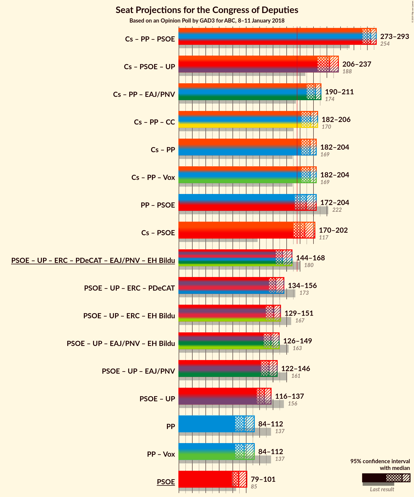
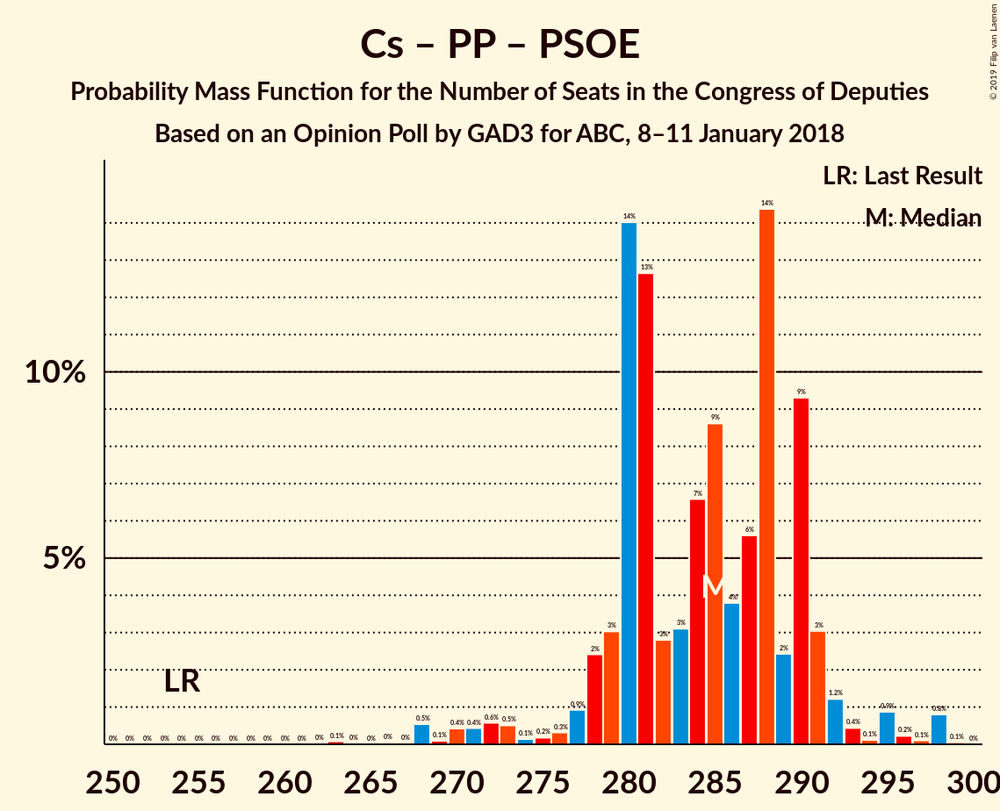
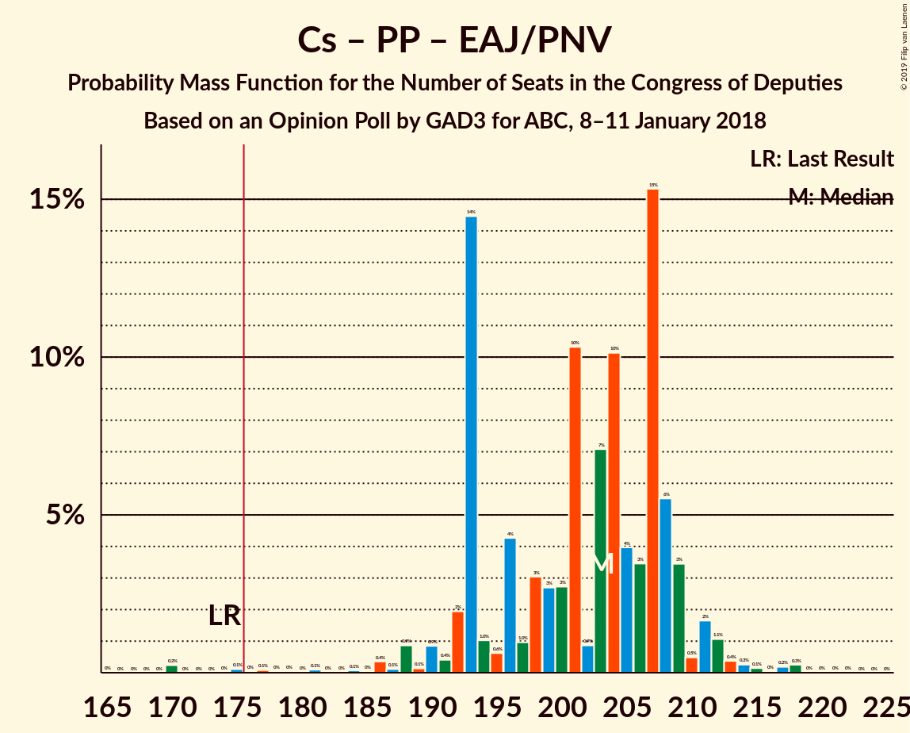

# Opinion Poll by GAD3 for ABC, 8–11 January 2018

<a href="#voting-intentions">Voting Intentions</a> | <a href="#seats">Seats</a> | <a href="#coalitions">Coalitions</a> | <a href="#technical-information">Technical Information</a>

## Voting Intentions

### Confidence Intervals

| Party | Last Result | Poll Result | 80% Confidence Interval | 90% Confidence Interval | 95% Confidence Interval | 99% Confidence Interval |
|:-----:|:-----------:|:-----------:|:-----------------------:|:-----------------------:|:-----------------------:|:-----------------------:|
| Ciudadanos–Partido de la Ciudadanía | 13.1% | 26.2% | 24.3–28.3% |23.8–28.9% |23.3–29.4% |22.4–30.4% |
| Partido Popular | 33.0% | 24.8% | 22.9–26.8% |22.3–27.4% |21.9–27.9% |21.0–28.9% |
| Partido Socialista Obrero Español | 22.6% | 24.2% | 22.4–26.3% |21.9–26.8% |21.4–27.3% |20.5–28.3% |
| Unidos Podemos | 21.2% | 14.8% | 13.2–16.5% |12.8–17.0% |12.5–17.4% |11.8–18.2% |
| Esquerra Republicana de Catalunya–Catalunya Sí | 2.7% | 2.9% | 2.2–3.8% |2.1–4.1% |1.9–4.3% |1.7–4.8% |
| Partit Demòcrata Europeu Català | 2.0% | 1.9% | 1.4–2.7% |1.2–2.9% |1.1–3.1% |0.9–3.5% |
| Euzko Alderdi Jeltzalea/Partido Nacionalista Vasco | 1.2% | 1.2% | 0.9–1.9% |0.8–2.1% |0.7–2.3% |0.5–2.7% |
| Euskal Herria Bildu | 0.8% | 0.8% | 0.5–1.3% |0.4–1.5% |0.4–1.6% |0.2–2.0% |
| Coalición Canaria–Partido Nacionalista Canario | 0.3% | 0.2% | 0.1–0.7% |0.1–0.8% |0.1–0.9% |0.0–1.2% |

*Note:* The poll result column reflects the actual value used in the calculations. Published results may vary slightly, and in addition be rounded to fewer digits.

## Seats

### Confidence Intervals

| Party | Last Result | Median | 80% Confidence Interval | 90% Confidence Interval | 95% Confidence Interval | 99% Confidence Interval |
|:-----:|:-----------:|:------:|:-----------------------:|:-----------------------:|:-----------------------:|:-----------------------:|
| <a href="#ciudadanos–partido-de-la-ciudadanía">Ciudadanos–Partido de la Ciudadanía</a> | 32 | 96 | 88–106 |84–106 |80–112 |75–116 |
| <a href="#partido-popular">Partido Popular</a> | 137 | 97 | 90–110 |85–112 |84–112 |82–118 |
| <a href="#partido-socialista-obrero-español">Partido Socialista Obrero Español</a> | 85 | 89 | 84–98 |83–98 |79–101 |75–107 |
| <a href="#unidos-podemos">Unidos Podemos</a> | 71 | 35 | 31–44 |29–44 |27–46 |24–51 |
| <a href="#esquerra-republicana-de-catalunya–catalunya-sí">Esquerra Republicana de Catalunya–Catalunya Sí</a> | 9 | 11 | 8–14 |7–15 |7–15 |6–17 |
| <a href="#partit-demòcrata-europeu-català">Partit Demòcrata Europeu Català</a> | 8 | 7 | 5–10 |4–10 |4–10 |2–12 |
| <a href="#euzko-alderdi-jeltzalea/partido-nacionalista-vasco">Euzko Alderdi Jeltzalea/Partido Nacionalista Vasco</a> | 5 | 8 | 5–10 |4–10 |3–10 |3–11 |
| <a href="#euskal-herria-bildu">Euskal Herria Bildu</a> | 2 | 2 | 1–6 |1–6 |0–7 |0–8 |
| <a href="#coalición-canaria–partido-nacionalista-canario">Coalición Canaria–Partido Nacionalista Canario</a> | 1 | 1 | 0–2 |0–3 |0–4 |0–4 |

### Ciudadanos–Partido de la Ciudadanía

*For a full overview of the results for this party, see the [Ciudadanos–Partido de la Ciudadanía](party-ciudadanos–partidodelaciudadanía.html) page.*

| Number of Seats | Probability | Accumulated | Special Marks |
|:---------------:|:-----------:|:-----------:|:-------------:|
| 32 | 0% | 100% | Last Result |
| 33 | 0% | 100% |  |
| 34 | 0% | 100% |  |
| 35 | 0% | 100% |  |
| 36 | 0% | 100% |  |
| 37 | 0% | 100% |  |
| 38 | 0% | 100% |  |
| 39 | 0% | 100% |  |
| 40 | 0% | 100% |  |
| 41 | 0% | 100% |  |
| 42 | 0% | 100% |  |
| 43 | 0% | 100% |  |
| 44 | 0% | 100% |  |
| 45 | 0% | 100% |  |
| 46 | 0% | 100% |  |
| 47 | 0% | 100% |  |
| 48 | 0% | 100% |  |
| 49 | 0% | 100% |  |
| 50 | 0% | 100% |  |
| 51 | 0% | 100% |  |
| 52 | 0% | 100% |  |
| 53 | 0% | 100% |  |
| 54 | 0% | 100% |  |
| 55 | 0% | 100% |  |
| 56 | 0% | 100% |  |
| 57 | 0% | 100% |  |
| 58 | 0% | 100% |  |
| 59 | 0% | 100% |  |
| 60 | 0% | 100% |  |
| 61 | 0% | 100% |  |
| 62 | 0% | 100% |  |
| 63 | 0% | 100% |  |
| 64 | 0% | 100% |  |
| 65 | 0% | 100% |  |
| 66 | 0% | 100% |  |
| 67 | 0% | 100% |  |
| 68 | 0% | 100% |  |
| 69 | 0% | 100% |  |
| 70 | 0% | 100% |  |
| 71 | 0.1% | 100% |  |
| 72 | 0% | 99.9% |  |
| 73 | 0% | 99.8% |  |
| 74 | 0% | 99.8% |  |
| 75 | 0.4% | 99.8% |  |
| 76 | 0.9% | 99.4% |  |
| 77 | 0.2% | 98.5% |  |
| 78 | 0.2% | 98% |  |
| 79 | 0.6% | 98% |  |
| 80 | 0.8% | 98% |  |
| 81 | 0.2% | 97% |  |
| 82 | 0.2% | 97% |  |
| 83 | 0.4% | 96% |  |
| 84 | 1.3% | 96% |  |
| 85 | 0.3% | 95% |  |
| 86 | 0.2% | 94% |  |
| 87 | 0.1% | 94% |  |
| 88 | 8% | 94% |  |
| 89 | 0.7% | 86% |  |
| 90 | 1.2% | 86% |  |
| 91 | 14% | 85% |  |
| 92 | 5% | 70% |  |
| 93 | 6% | 65% |  |
| 94 | 3% | 60% |  |
| 95 | 0.7% | 56% |  |
| 96 | 21% | 56% | Median |
| 97 | 1.1% | 35% |  |
| 98 | 2% | 34% |  |
| 99 | 9% | 32% |  |
| 100 | 0.5% | 23% |  |
| 101 | 0.9% | 22% |  |
| 102 | 2% | 21% |  |
| 103 | 2% | 19% |  |
| 104 | 0.3% | 17% |  |
| 105 | 5% | 17% |  |
| 106 | 9% | 12% |  |
| 107 | 0.1% | 4% |  |
| 108 | 0.2% | 4% |  |
| 109 | 0.1% | 3% |  |
| 110 | 0.2% | 3% |  |
| 111 | 0.4% | 3% |  |
| 112 | 0.7% | 3% |  |
| 113 | 1.1% | 2% |  |
| 114 | 0.2% | 0.8% |  |
| 115 | 0.1% | 0.6% |  |
| 116 | 0.2% | 0.6% |  |
| 117 | 0% | 0.3% |  |
| 118 | 0.2% | 0.3% |  |
| 119 | 0% | 0% |  |

### Partido Popular

*For a full overview of the results for this party, see the [Partido Popular](party-partidopopular.html) page.*

| Number of Seats | Probability | Accumulated | Special Marks |
|:---------------:|:-----------:|:-----------:|:-------------:|
| 77 | 0% | 100% |  |
| 78 | 0.1% | 99.9% |  |
| 79 | 0% | 99.8% |  |
| 80 | 0.1% | 99.8% |  |
| 81 | 0.1% | 99.7% |  |
| 82 | 0.4% | 99.6% |  |
| 83 | 1.3% | 99.2% |  |
| 84 | 0.9% | 98% |  |
| 85 | 3% | 97% |  |
| 86 | 0.3% | 94% |  |
| 87 | 0.8% | 94% |  |
| 88 | 1.2% | 93% |  |
| 89 | 1.5% | 92% |  |
| 90 | 0.5% | 90% |  |
| 91 | 6% | 90% |  |
| 92 | 8% | 84% |  |
| 93 | 10% | 76% |  |
| 94 | 2% | 66% |  |
| 95 | 6% | 64% |  |
| 96 | 4% | 58% |  |
| 97 | 10% | 55% | Median |
| 98 | 2% | 44% |  |
| 99 | 2% | 42% |  |
| 100 | 2% | 40% |  |
| 101 | 0.8% | 38% |  |
| 102 | 3% | 38% |  |
| 103 | 7% | 35% |  |
| 104 | 6% | 28% |  |
| 105 | 2% | 22% |  |
| 106 | 2% | 20% |  |
| 107 | 2% | 18% |  |
| 108 | 1.3% | 16% |  |
| 109 | 5% | 15% |  |
| 110 | 3% | 10% |  |
| 111 | 0.6% | 7% |  |
| 112 | 5% | 7% |  |
| 113 | 0.2% | 2% |  |
| 114 | 0.2% | 1.3% |  |
| 115 | 0.1% | 1.1% |  |
| 116 | 0.4% | 1.0% |  |
| 117 | 0.1% | 0.7% |  |
| 118 | 0.2% | 0.6% |  |
| 119 | 0.1% | 0.4% |  |
| 120 | 0.1% | 0.3% |  |
| 121 | 0.1% | 0.2% |  |
| 122 | 0% | 0.1% |  |
| 123 | 0% | 0.1% |  |
| 124 | 0.1% | 0.1% |  |
| 125 | 0% | 0% |  |
| 126 | 0% | 0% |  |
| 127 | 0% | 0% |  |
| 128 | 0% | 0% |  |
| 129 | 0% | 0% |  |
| 130 | 0% | 0% |  |
| 131 | 0% | 0% |  |
| 132 | 0% | 0% |  |
| 133 | 0% | 0% |  |
| 134 | 0% | 0% |  |
| 135 | 0% | 0% |  |
| 136 | 0% | 0% |  |
| 137 | 0% | 0% | Last Result |

### Partido Socialista Obrero Español

*For a full overview of the results for this party, see the [Partido Socialista Obrero Español](party-partidosocialistaobreroespañol.html) page.*

| Number of Seats | Probability | Accumulated | Special Marks |
|:---------------:|:-----------:|:-----------:|:-------------:|
| 72 | 0% | 100% |  |
| 73 | 0.3% | 99.9% |  |
| 74 | 0% | 99.7% |  |
| 75 | 0.2% | 99.6% |  |
| 76 | 0.1% | 99.4% |  |
| 77 | 0.4% | 99.3% |  |
| 78 | 0.6% | 98.8% |  |
| 79 | 0.9% | 98% |  |
| 80 | 0.8% | 97% |  |
| 81 | 0.5% | 97% |  |
| 82 | 0.2% | 96% |  |
| 83 | 3% | 96% |  |
| 84 | 7% | 93% |  |
| 85 | 5% | 86% | Last Result |
| 86 | 2% | 81% |  |
| 87 | 16% | 79% |  |
| 88 | 3% | 63% |  |
| 89 | 10% | 59% | Median |
| 90 | 6% | 49% |  |
| 91 | 5% | 43% |  |
| 92 | 2% | 38% |  |
| 93 | 1.4% | 36% |  |
| 94 | 15% | 35% |  |
| 95 | 3% | 19% |  |
| 96 | 2% | 17% |  |
| 97 | 4% | 15% |  |
| 98 | 6% | 10% |  |
| 99 | 0.3% | 4% |  |
| 100 | 1.2% | 4% |  |
| 101 | 0.2% | 3% |  |
| 102 | 0.1% | 2% |  |
| 103 | 1.0% | 2% |  |
| 104 | 0.1% | 1.3% |  |
| 105 | 0.3% | 1.2% |  |
| 106 | 0.1% | 1.0% |  |
| 107 | 0.4% | 0.9% |  |
| 108 | 0.2% | 0.4% |  |
| 109 | 0% | 0.2% |  |
| 110 | 0% | 0.2% |  |
| 111 | 0% | 0.2% |  |
| 112 | 0% | 0.2% |  |
| 113 | 0% | 0.2% |  |
| 114 | 0% | 0.1% |  |
| 115 | 0% | 0.1% |  |
| 116 | 0.1% | 0.1% |  |
| 117 | 0% | 0% |  |

### Unidos Podemos

*For a full overview of the results for this party, see the [Unidos Podemos](party-unidospodemos.html) page.*

| Number of Seats | Probability | Accumulated | Special Marks |
|:---------------:|:-----------:|:-----------:|:-------------:|
| 23 | 0.1% | 100% |  |
| 24 | 0.8% | 99.9% |  |
| 25 | 0.1% | 99.1% |  |
| 26 | 0.7% | 99.0% |  |
| 27 | 1.0% | 98% |  |
| 28 | 1.3% | 97% |  |
| 29 | 2% | 96% |  |
| 30 | 3% | 94% |  |
| 31 | 5% | 91% |  |
| 32 | 6% | 86% |  |
| 33 | 3% | 80% |  |
| 34 | 20% | 77% |  |
| 35 | 9% | 57% | Median |
| 36 | 4% | 47% |  |
| 37 | 11% | 44% |  |
| 38 | 5% | 32% |  |
| 39 | 11% | 27% |  |
| 40 | 0.3% | 16% |  |
| 41 | 0.2% | 16% |  |
| 42 | 1.2% | 16% |  |
| 43 | 0.1% | 14% |  |
| 44 | 10% | 14% |  |
| 45 | 0.9% | 5% |  |
| 46 | 2% | 4% |  |
| 47 | 0.3% | 2% |  |
| 48 | 0% | 1.3% |  |
| 49 | 0.3% | 1.3% |  |
| 50 | 0.1% | 1.0% |  |
| 51 | 0.4% | 0.8% |  |
| 52 | 0% | 0.4% |  |
| 53 | 0.1% | 0.4% |  |
| 54 | 0% | 0.4% |  |
| 55 | 0.3% | 0.3% |  |
| 56 | 0% | 0.1% |  |
| 57 | 0% | 0% |  |
| 58 | 0% | 0% |  |
| 59 | 0% | 0% |  |
| 60 | 0% | 0% |  |
| 61 | 0% | 0% |  |
| 62 | 0% | 0% |  |
| 63 | 0% | 0% |  |
| 64 | 0% | 0% |  |
| 65 | 0% | 0% |  |
| 66 | 0% | 0% |  |
| 67 | 0% | 0% |  |
| 68 | 0% | 0% |  |
| 69 | 0% | 0% |  |
| 70 | 0% | 0% |  |
| 71 | 0% | 0% | Last Result |

### Esquerra Republicana de Catalunya–Catalunya Sí

*For a full overview of the results for this party, see the [Esquerra Republicana de Catalunya–Catalunya Sí](party-esquerrarepublicanadecatalunya–catalunyasí.html) page.*

| Number of Seats | Probability | Accumulated | Special Marks |
|:---------------:|:-----------:|:-----------:|:-------------:|
| 5 | 0.4% | 100% |  |
| 6 | 0.3% | 99.6% |  |
| 7 | 6% | 99.3% |  |
| 8 | 8% | 93% |  |
| 9 | 26% | 85% | Last Result |
| 10 | 1.1% | 59% |  |
| 11 | 22% | 58% | Median |
| 12 | 9% | 36% |  |
| 13 | 9% | 27% |  |
| 14 | 11% | 18% |  |
| 15 | 4% | 7% |  |
| 16 | 1.0% | 2% |  |
| 17 | 1.0% | 1.5% |  |
| 18 | 0.4% | 0.5% |  |
| 19 | 0% | 0.1% |  |
| 20 | 0.1% | 0.1% |  |
| 21 | 0% | 0% |  |

### Partit Demòcrata Europeu Català

*For a full overview of the results for this party, see the [Partit Demòcrata Europeu Català](party-partitdemòcrataeuropeucatalà.html) page.*

| Number of Seats | Probability | Accumulated | Special Marks |
|:---------------:|:-----------:|:-----------:|:-------------:|
| 1 | 0.4% | 100% |  |
| 2 | 0.1% | 99.6% |  |
| 3 | 0.6% | 99.5% |  |
| 4 | 8% | 98.9% |  |
| 5 | 16% | 91% |  |
| 6 | 16% | 75% |  |
| 7 | 11% | 59% | Median |
| 8 | 24% | 47% | Last Result |
| 9 | 7% | 23% |  |
| 10 | 14% | 16% |  |
| 11 | 0.8% | 2% |  |
| 12 | 0.4% | 0.7% |  |
| 13 | 0.1% | 0.3% |  |
| 14 | 0.1% | 0.2% |  |
| 15 | 0% | 0.1% |  |
| 16 | 0% | 0% |  |

### Euzko Alderdi Jeltzalea/Partido Nacionalista Vasco

*For a full overview of the results for this party, see the [Euzko Alderdi Jeltzalea/Partido Nacionalista Vasco](party-euzkoalderdijeltzaleapartidonacionalistavasco.html) page.*

| Number of Seats | Probability | Accumulated | Special Marks |
|:---------------:|:-----------:|:-----------:|:-------------:|
| 2 | 0.2% | 100% |  |
| 3 | 4% | 99.8% |  |
| 4 | 5% | 96% |  |
| 5 | 2% | 92% | Last Result |
| 6 | 23% | 89% |  |
| 7 | 12% | 66% |  |
| 8 | 34% | 55% | Median |
| 9 | 3% | 20% |  |
| 10 | 16% | 17% |  |
| 11 | 0.5% | 0.7% |  |
| 12 | 0.1% | 0.1% |  |
| 13 | 0% | 0% |  |

### Euskal Herria Bildu

*For a full overview of the results for this party, see the [Euskal Herria Bildu](party-euskalherriabildu.html) page.*

| Number of Seats | Probability | Accumulated | Special Marks |
|:---------------:|:-----------:|:-----------:|:-------------:|
| 0 | 5% | 100% |  |
| 1 | 14% | 95% |  |
| 2 | 37% | 81% | Last Result, Median |
| 3 | 12% | 44% |  |
| 4 | 15% | 31% |  |
| 5 | 4% | 16% |  |
| 6 | 8% | 12% |  |
| 7 | 4% | 4% |  |
| 8 | 0.3% | 0.5% |  |
| 9 | 0.3% | 0.3% |  |
| 10 | 0% | 0% |  |

### Coalición Canaria–Partido Nacionalista Canario

*For a full overview of the results for this party, see the [Coalición Canaria–Partido Nacionalista Canario](party-coalicióncanaria–partidonacionalistacanario.html) page.*

| Number of Seats | Probability | Accumulated | Special Marks |
|:---------------:|:-----------:|:-----------:|:-------------:|
| 0 | 18% | 100% |  |
| 1 | 48% | 82% | Last Result, Median |
| 2 | 27% | 33% |  |
| 3 | 3% | 6% |  |
| 4 | 3% | 4% |  |
| 5 | 0.3% | 0.3% |  |
| 6 | 0% | 0% |  |

## Coalitions

### Confidence Intervals

| Coalition | Last Result | Median | Majority? | 80% Confidence Interval | 90% Confidence Interval | 95% Confidence Interval | 99% Confidence Interval |
|:---------:|:-----------:|:------:|:---------:|:-----------------------:|:-----------------------:|:-----------------------:|:-----------------------:|
| Ciudadanos–Partido de la Ciudadanía – Partido Popular – Partido Socialista Obrero Español | 254 | 285 | 100% | 280–290 | 278–291 | 273–293 | 268–298 |
| Ciudadanos–Partido de la Ciudadanía – Partido Socialista Obrero Español – Unidos Podemos | 188 | 224 | 100% | 211–232 | 210–234 | 206–237 | 203–239 |
| Ciudadanos–Partido de la Ciudadanía – Partido Popular – Euzko Alderdi Jeltzalea/Partido Nacionalista Vasco | 174 | 203 | 99.6% | 193–208 | 192–209 | 190–211 | 177–217 |
| Ciudadanos–Partido de la Ciudadanía – Partido Popular – Coalición Canaria–Partido Nacionalista Canario | 170 | 196 | 99.4% | 185–203 | 184–205 | 182–206 | 174–211 |
| Ciudadanos–Partido de la Ciudadanía – Partido Popular | 169 | 195 | 99.3% | 183–201 | 183–203 | 182–204 | 173–211 |
| Partido Popular – Partido Socialista Obrero Español | 222 | 189 | 96% | 179–197 | 178–200 | 172–204 | 168–209 |
| Ciudadanos–Partido de la Ciudadanía – Partido Socialista Obrero Español | 117 | 187 | 89% | 175–196 | 173–199 | 170–202 | 164–205 |
| Partido Socialista Obrero Español – Unidos Podemos – Esquerra Republicana de Catalunya–Catalunya Sí – Partit Demòcrata Europeu Català – Euzko Alderdi Jeltzalea/Partido Nacionalista Vasco – Euskal Herria Bildu | 180 | 154 | 0.6% | 147–165 | 145–166 | 144–168 | 139–176 |
| Partido Socialista Obrero Español – Unidos Podemos – Esquerra Republicana de Catalunya–Catalunya Sí – Partit Demòcrata Europeu Català | 173 | 144 | 0.3% | 138–154 | 137–154 | 134–156 | 130–168 |
| Partido Socialista Obrero Español – Unidos Podemos – Esquerra Republicana de Catalunya–Catalunya Sí – Euskal Herria Bildu | 167 | 141 | 0% | 134–148 | 131–151 | 129–151 | 127–165 |
| Partido Socialista Obrero Español – Unidos Podemos – Euzko Alderdi Jeltzalea/Partido Nacionalista Vasco – Euskal Herria Bildu | 163 | 137 | 0% | 129–145 | 127–146 | 126–149 | 121–158 |
| Partido Socialista Obrero Español – Unidos Podemos – Euzko Alderdi Jeltzalea/Partido Nacionalista Vasco | 161 | 134 | 0% | 126–143 | 123–143 | 122–146 | 117–154 |
| Partido Socialista Obrero Español – Unidos Podemos | 156 | 127 | 0% | 119–133 | 118–135 | 116–137 | 112–149 |
| Partido Popular | 137 | 97 | 0% | 90–110 | 85–112 | 84–112 | 82–118 |
| Partido Socialista Obrero Español | 85 | 89 | 0% | 84–98 | 83–98 | 79–101 | 75–107 |

### Ciudadanos–Partido de la Ciudadanía – Partido Popular – Partido Socialista Obrero Español

| Number of Seats | Probability | Accumulated | Special Marks |
|:---------------:|:-----------:|:-----------:|:-------------:|
| 254 | 0% | 100% | Last Result |
| 255 | 0% | 100% |  |
| 256 | 0% | 100% |  |
| 257 | 0% | 100% |  |
| 258 | 0% | 100% |  |
| 259 | 0% | 100% |  |
| 260 | 0% | 100% |  |
| 261 | 0% | 100% |  |
| 262 | 0% | 100% |  |
| 263 | 0.1% | 100% |  |
| 264 | 0% | 99.9% |  |
| 265 | 0% | 99.9% |  |
| 266 | 0% | 99.8% |  |
| 267 | 0% | 99.8% |  |
| 268 | 0.5% | 99.8% |  |
| 269 | 0.1% | 99.2% |  |
| 270 | 0.4% | 99.1% |  |
| 271 | 0.4% | 98.7% |  |
| 272 | 0.6% | 98% |  |
| 273 | 0.5% | 98% |  |
| 274 | 0.1% | 97% |  |
| 275 | 0.2% | 97% |  |
| 276 | 0.3% | 97% |  |
| 277 | 0.9% | 97% |  |
| 278 | 2% | 96% |  |
| 279 | 3% | 93% |  |
| 280 | 14% | 90% |  |
| 281 | 13% | 76% |  |
| 282 | 3% | 64% | Median |
| 283 | 3% | 61% |  |
| 284 | 7% | 58% |  |
| 285 | 9% | 51% |  |
| 286 | 4% | 42% |  |
| 287 | 6% | 39% |  |
| 288 | 14% | 33% |  |
| 289 | 2% | 19% |  |
| 290 | 9% | 16% |  |
| 291 | 3% | 7% |  |
| 292 | 1.2% | 4% |  |
| 293 | 0.4% | 3% |  |
| 294 | 0.1% | 2% |  |
| 295 | 0.9% | 2% |  |
| 296 | 0.2% | 1.2% |  |
| 297 | 0.1% | 1.0% |  |
| 298 | 0.8% | 0.9% |  |
| 299 | 0.1% | 0.1% |  |
| 300 | 0% | 0% |  |

### Ciudadanos–Partido de la Ciudadanía – Partido Socialista Obrero Español – Unidos Podemos

| Number of Seats | Probability | Accumulated | Special Marks |
|:---------------:|:-----------:|:-----------:|:-------------:|
| 188 | 0% | 100% | Last Result |
| 189 | 0% | 100% |  |
| 190 | 0% | 100% |  |
| 191 | 0% | 100% |  |
| 192 | 0% | 100% |  |
| 193 | 0% | 100% |  |
| 194 | 0% | 100% |  |
| 195 | 0% | 100% |  |
| 196 | 0.1% | 100% |  |
| 197 | 0% | 99.9% |  |
| 198 | 0% | 99.9% |  |
| 199 | 0.1% | 99.8% |  |
| 200 | 0% | 99.8% |  |
| 201 | 0% | 99.7% |  |
| 202 | 0.2% | 99.7% |  |
| 203 | 0.2% | 99.5% |  |
| 204 | 0.1% | 99.3% |  |
| 205 | 2% | 99.2% |  |
| 206 | 0.2% | 98% |  |
| 207 | 0.3% | 97% |  |
| 208 | 1.3% | 97% |  |
| 209 | 0.4% | 96% |  |
| 210 | 5% | 95% |  |
| 211 | 1.5% | 91% |  |
| 212 | 7% | 89% |  |
| 213 | 1.5% | 82% |  |
| 214 | 3% | 81% |  |
| 215 | 2% | 77% |  |
| 216 | 2% | 75% |  |
| 217 | 2% | 73% |  |
| 218 | 5% | 70% |  |
| 219 | 4% | 65% |  |
| 220 | 3% | 61% | Median |
| 221 | 1.0% | 58% |  |
| 222 | 0.4% | 57% |  |
| 223 | 0.9% | 57% |  |
| 224 | 7% | 56% |  |
| 225 | 5% | 49% |  |
| 226 | 3% | 44% |  |
| 227 | 16% | 41% |  |
| 228 | 0.4% | 25% |  |
| 229 | 13% | 25% |  |
| 230 | 0.4% | 12% |  |
| 231 | 0.6% | 11% |  |
| 232 | 2% | 11% |  |
| 233 | 2% | 9% |  |
| 234 | 2% | 6% |  |
| 235 | 1.4% | 4% |  |
| 236 | 0.1% | 3% |  |
| 237 | 2% | 3% |  |
| 238 | 0% | 0.8% |  |
| 239 | 0.3% | 0.8% |  |
| 240 | 0.1% | 0.5% |  |
| 241 | 0.1% | 0.3% |  |
| 242 | 0.1% | 0.2% |  |
| 243 | 0.1% | 0.1% |  |
| 244 | 0.1% | 0.1% |  |
| 245 | 0% | 0% |  |

### Ciudadanos–Partido de la Ciudadanía – Partido Popular – Euzko Alderdi Jeltzalea/Partido Nacionalista Vasco

| Number of Seats | Probability | Accumulated | Special Marks |
|:---------------:|:-----------:|:-----------:|:-------------:|
| 170 | 0.2% | 100% |  |
| 171 | 0% | 99.7% |  |
| 172 | 0% | 99.7% |  |
| 173 | 0% | 99.7% |  |
| 174 | 0% | 99.7% | Last Result |
| 175 | 0.1% | 99.7% |  |
| 176 | 0% | 99.6% | Majority |
| 177 | 0.1% | 99.6% |  |
| 178 | 0% | 99.5% |  |
| 179 | 0% | 99.5% |  |
| 180 | 0% | 99.4% |  |
| 181 | 0.1% | 99.4% |  |
| 182 | 0% | 99.3% |  |
| 183 | 0% | 99.3% |  |
| 184 | 0.1% | 99.3% |  |
| 185 | 0% | 99.2% |  |
| 186 | 0.4% | 99.1% |  |
| 187 | 0.1% | 98.8% |  |
| 188 | 0.9% | 98.7% |  |
| 189 | 0.1% | 98% |  |
| 190 | 0.9% | 98% |  |
| 191 | 0.4% | 97% |  |
| 192 | 2% | 96% |  |
| 193 | 14% | 94% |  |
| 194 | 1.0% | 80% |  |
| 195 | 0.6% | 79% |  |
| 196 | 4% | 78% |  |
| 197 | 1.0% | 74% |  |
| 198 | 3% | 73% |  |
| 199 | 3% | 70% |  |
| 200 | 3% | 67% |  |
| 201 | 10% | 65% | Median |
| 202 | 0.9% | 54% |  |
| 203 | 7% | 53% |  |
| 204 | 10% | 46% |  |
| 205 | 4% | 36% |  |
| 206 | 3% | 32% |  |
| 207 | 15% | 29% |  |
| 208 | 6% | 13% |  |
| 209 | 3% | 8% |  |
| 210 | 0.5% | 5% |  |
| 211 | 2% | 4% |  |
| 212 | 1.1% | 2% |  |
| 213 | 0.4% | 1.3% |  |
| 214 | 0.3% | 0.9% |  |
| 215 | 0.1% | 0.7% |  |
| 216 | 0% | 0.5% |  |
| 217 | 0.2% | 0.5% |  |
| 218 | 0.3% | 0.3% |  |
| 219 | 0% | 0.1% |  |
| 220 | 0% | 0.1% |  |
| 221 | 0% | 0% |  |

### Ciudadanos–Partido de la Ciudadanía – Partido Popular – Coalición Canaria–Partido Nacionalista Canario

| Number of Seats | Probability | Accumulated | Special Marks |
|:---------------:|:-----------:|:-----------:|:-------------:|
| 165 | 0.2% | 100% |  |
| 166 | 0% | 99.7% |  |
| 167 | 0% | 99.7% |  |
| 168 | 0% | 99.7% |  |
| 169 | 0.1% | 99.7% |  |
| 170 | 0% | 99.6% | Last Result |
| 171 | 0% | 99.6% |  |
| 172 | 0% | 99.6% |  |
| 173 | 0% | 99.6% |  |
| 174 | 0.1% | 99.5% |  |
| 175 | 0% | 99.4% |  |
| 176 | 0% | 99.4% | Majority |
| 177 | 0% | 99.4% |  |
| 178 | 0.1% | 99.3% |  |
| 179 | 0% | 99.2% |  |
| 180 | 0.6% | 99.2% |  |
| 181 | 0.3% | 98.6% |  |
| 182 | 0.9% | 98% |  |
| 183 | 0.6% | 97% |  |
| 184 | 6% | 97% |  |
| 185 | 0.9% | 91% |  |
| 186 | 0.2% | 90% |  |
| 187 | 0.7% | 89% |  |
| 188 | 1.4% | 89% |  |
| 189 | 9% | 87% |  |
| 190 | 0.9% | 78% |  |
| 191 | 1.2% | 77% |  |
| 192 | 3% | 76% |  |
| 193 | 0.9% | 73% |  |
| 194 | 16% | 72% | Median |
| 195 | 2% | 55% |  |
| 196 | 8% | 53% |  |
| 197 | 2% | 45% |  |
| 198 | 5% | 43% |  |
| 199 | 3% | 38% |  |
| 200 | 17% | 35% |  |
| 201 | 6% | 18% |  |
| 202 | 0.4% | 12% |  |
| 203 | 6% | 12% |  |
| 204 | 1.1% | 6% |  |
| 205 | 2% | 5% |  |
| 206 | 0.3% | 3% |  |
| 207 | 1.2% | 2% |  |
| 208 | 0% | 1.1% |  |
| 209 | 0.2% | 1.0% |  |
| 210 | 0.2% | 0.8% |  |
| 211 | 0.1% | 0.6% |  |
| 212 | 0.2% | 0.5% |  |
| 213 | 0.2% | 0.3% |  |
| 214 | 0% | 0.1% |  |
| 215 | 0% | 0.1% |  |
| 216 | 0% | 0% |  |

### Ciudadanos–Partido de la Ciudadanía – Partido Popular

| Number of Seats | Probability | Accumulated | Special Marks |
|:---------------:|:-----------:|:-----------:|:-------------:|
| 165 | 0.2% | 100% |  |
| 166 | 0% | 99.7% |  |
| 167 | 0% | 99.7% |  |
| 168 | 0% | 99.7% |  |
| 169 | 0.2% | 99.7% | Last Result |
| 170 | 0% | 99.6% |  |
| 171 | 0% | 99.6% |  |
| 172 | 0% | 99.5% |  |
| 173 | 0% | 99.5% |  |
| 174 | 0.2% | 99.5% |  |
| 175 | 0% | 99.3% |  |
| 176 | 0% | 99.3% | Majority |
| 177 | 0.1% | 99.3% |  |
| 178 | 0.7% | 99.1% |  |
| 179 | 0% | 98% |  |
| 180 | 0.6% | 98% |  |
| 181 | 0.2% | 98% |  |
| 182 | 2% | 98% |  |
| 183 | 6% | 96% |  |
| 184 | 0.2% | 90% |  |
| 185 | 0.8% | 89% |  |
| 186 | 0.9% | 89% |  |
| 187 | 9% | 88% |  |
| 188 | 1.1% | 79% |  |
| 189 | 2% | 78% |  |
| 190 | 4% | 76% |  |
| 191 | 1.0% | 73% |  |
| 192 | 2% | 72% |  |
| 193 | 10% | 70% | Median |
| 194 | 10% | 60% |  |
| 195 | 3% | 50% |  |
| 196 | 9% | 47% |  |
| 197 | 0.4% | 39% |  |
| 198 | 3% | 38% |  |
| 199 | 14% | 35% |  |
| 200 | 9% | 21% |  |
| 201 | 5% | 12% |  |
| 202 | 1.5% | 7% |  |
| 203 | 1.2% | 5% |  |
| 204 | 2% | 4% |  |
| 205 | 1.0% | 2% |  |
| 206 | 0.1% | 1.3% |  |
| 207 | 0.2% | 1.3% |  |
| 208 | 0.1% | 1.0% |  |
| 209 | 0.4% | 1.0% |  |
| 210 | 0.1% | 0.6% |  |
| 211 | 0.2% | 0.5% |  |
| 212 | 0.2% | 0.3% |  |
| 213 | 0% | 0.1% |  |
| 214 | 0% | 0.1% |  |
| 215 | 0% | 0% |  |

### Partido Popular – Partido Socialista Obrero Español

| Number of Seats | Probability | Accumulated | Special Marks |
|:---------------:|:-----------:|:-----------:|:-------------:|
| 164 | 0.3% | 100% |  |
| 165 | 0.1% | 99.7% |  |
| 166 | 0% | 99.6% |  |
| 167 | 0% | 99.5% |  |
| 168 | 0.2% | 99.5% |  |
| 169 | 0% | 99.3% |  |
| 170 | 0.6% | 99.3% |  |
| 171 | 1.0% | 98.6% |  |
| 172 | 0.6% | 98% |  |
| 173 | 0.3% | 97% |  |
| 174 | 0.5% | 97% |  |
| 175 | 0.3% | 96% |  |
| 176 | 0.2% | 96% | Majority |
| 177 | 0.2% | 96% |  |
| 178 | 1.5% | 96% |  |
| 179 | 5% | 94% |  |
| 180 | 0.6% | 89% |  |
| 181 | 0.3% | 89% |  |
| 182 | 10% | 88% |  |
| 183 | 0.3% | 79% |  |
| 184 | 10% | 78% |  |
| 185 | 5% | 68% |  |
| 186 | 0.3% | 63% | Median |
| 187 | 3% | 62% |  |
| 188 | 6% | 59% |  |
| 189 | 8% | 54% |  |
| 190 | 7% | 45% |  |
| 191 | 4% | 38% |  |
| 192 | 3% | 35% |  |
| 193 | 6% | 32% |  |
| 194 | 6% | 25% |  |
| 195 | 1.2% | 19% |  |
| 196 | 5% | 18% |  |
| 197 | 5% | 13% |  |
| 198 | 0.2% | 8% |  |
| 199 | 2% | 8% |  |
| 200 | 0.4% | 5% |  |
| 201 | 0.1% | 5% |  |
| 202 | 2% | 5% |  |
| 203 | 0.1% | 3% |  |
| 204 | 0.5% | 3% |  |
| 205 | 0.7% | 2% |  |
| 206 | 0.7% | 2% |  |
| 207 | 0.1% | 0.8% |  |
| 208 | 0.2% | 0.7% |  |
| 209 | 0.1% | 0.5% |  |
| 210 | 0.2% | 0.4% |  |
| 211 | 0.1% | 0.2% |  |
| 212 | 0% | 0.2% |  |
| 213 | 0% | 0.2% |  |
| 214 | 0.1% | 0.1% |  |
| 215 | 0% | 0% |  |
| 216 | 0% | 0% |  |
| 217 | 0% | 0% |  |
| 218 | 0% | 0% |  |
| 219 | 0% | 0% |  |
| 220 | 0% | 0% |  |
| 221 | 0% | 0% |  |
| 222 | 0% | 0% | Last Result |

### Ciudadanos–Partido de la Ciudadanía – Partido Socialista Obrero Español

| Number of Seats | Probability | Accumulated | Special Marks |
|:---------------:|:-----------:|:-----------:|:-------------:|
| 117 | 0% | 100% | Last Result |
| 118 | 0% | 100% |  |
| 119 | 0% | 100% |  |
| 120 | 0% | 100% |  |
| 121 | 0% | 100% |  |
| 122 | 0% | 100% |  |
| 123 | 0% | 100% |  |
| 124 | 0% | 100% |  |
| 125 | 0% | 100% |  |
| 126 | 0% | 100% |  |
| 127 | 0% | 100% |  |
| 128 | 0% | 100% |  |
| 129 | 0% | 100% |  |
| 130 | 0% | 100% |  |
| 131 | 0% | 100% |  |
| 132 | 0% | 100% |  |
| 133 | 0% | 100% |  |
| 134 | 0% | 100% |  |
| 135 | 0% | 100% |  |
| 136 | 0% | 100% |  |
| 137 | 0% | 100% |  |
| 138 | 0% | 100% |  |
| 139 | 0% | 100% |  |
| 140 | 0% | 100% |  |
| 141 | 0% | 100% |  |
| 142 | 0% | 100% |  |
| 143 | 0% | 100% |  |
| 144 | 0% | 100% |  |
| 145 | 0% | 100% |  |
| 146 | 0% | 100% |  |
| 147 | 0% | 100% |  |
| 148 | 0% | 100% |  |
| 149 | 0% | 100% |  |
| 150 | 0% | 100% |  |
| 151 | 0% | 100% |  |
| 152 | 0% | 100% |  |
| 153 | 0% | 100% |  |
| 154 | 0% | 100% |  |
| 155 | 0% | 100% |  |
| 156 | 0% | 100% |  |
| 157 | 0% | 100% |  |
| 158 | 0% | 100% |  |
| 159 | 0.1% | 99.9% |  |
| 160 | 0% | 99.8% |  |
| 161 | 0% | 99.8% |  |
| 162 | 0% | 99.8% |  |
| 163 | 0.1% | 99.8% |  |
| 164 | 0.2% | 99.6% |  |
| 165 | 0.2% | 99.5% |  |
| 166 | 0.4% | 99.3% |  |
| 167 | 0.5% | 98.8% |  |
| 168 | 0.2% | 98% |  |
| 169 | 0.2% | 98% |  |
| 170 | 0.5% | 98% |  |
| 171 | 2% | 97% |  |
| 172 | 0% | 95% |  |
| 173 | 4% | 95% |  |
| 174 | 0.2% | 91% |  |
| 175 | 2% | 91% |  |
| 176 | 4% | 89% | Majority |
| 177 | 0.7% | 85% |  |
| 178 | 8% | 84% |  |
| 179 | 0.4% | 77% |  |
| 180 | 4% | 76% |  |
| 181 | 1.4% | 72% |  |
| 182 | 2% | 71% |  |
| 183 | 13% | 69% |  |
| 184 | 0.8% | 56% |  |
| 185 | 0.5% | 56% | Median |
| 186 | 0.9% | 55% |  |
| 187 | 6% | 54% |  |
| 188 | 4% | 48% |  |
| 189 | 9% | 44% |  |
| 190 | 6% | 35% |  |
| 191 | 2% | 29% |  |
| 192 | 2% | 28% |  |
| 193 | 7% | 26% |  |
| 194 | 1.1% | 19% |  |
| 195 | 8% | 18% |  |
| 196 | 1.2% | 10% |  |
| 197 | 2% | 9% |  |
| 198 | 0.4% | 7% |  |
| 199 | 2% | 6% |  |
| 200 | 1.1% | 4% |  |
| 201 | 0.1% | 3% |  |
| 202 | 2% | 3% |  |
| 203 | 0.2% | 1.3% |  |
| 204 | 0.4% | 1.1% |  |
| 205 | 0.6% | 0.7% |  |
| 206 | 0% | 0.2% |  |
| 207 | 0% | 0.1% |  |
| 208 | 0.1% | 0.1% |  |
| 209 | 0% | 0% |  |

### Partido Socialista Obrero Español – Unidos Podemos – Esquerra Republicana de Catalunya–Catalunya Sí – Partit Demòcrata Europeu Català – Euzko Alderdi Jeltzalea/Partido Nacionalista Vasco – Euskal Herria Bildu

| Number of Seats | Probability | Accumulated | Special Marks |
|:---------------:|:-----------:|:-----------:|:-------------:|
| 135 | 0% | 100% |  |
| 136 | 0% | 99.9% |  |
| 137 | 0.2% | 99.9% |  |
| 138 | 0.2% | 99.7% |  |
| 139 | 0.1% | 99.5% |  |
| 140 | 0.2% | 99.4% |  |
| 141 | 0.2% | 99.2% |  |
| 142 | 0% | 99.0% |  |
| 143 | 1.2% | 98.9% |  |
| 144 | 0.3% | 98% |  |
| 145 | 2% | 97% |  |
| 146 | 1.1% | 95% |  |
| 147 | 6% | 94% |  |
| 148 | 0.4% | 88% |  |
| 149 | 6% | 88% |  |
| 150 | 17% | 82% |  |
| 151 | 3% | 65% |  |
| 152 | 5% | 62% | Median |
| 153 | 2% | 57% |  |
| 154 | 8% | 55% |  |
| 155 | 2% | 47% |  |
| 156 | 16% | 45% |  |
| 157 | 0.9% | 28% |  |
| 158 | 3% | 27% |  |
| 159 | 1.2% | 24% |  |
| 160 | 0.9% | 23% |  |
| 161 | 9% | 22% |  |
| 162 | 1.4% | 13% |  |
| 163 | 0.7% | 11% |  |
| 164 | 0.2% | 11% |  |
| 165 | 0.9% | 10% |  |
| 166 | 6% | 9% |  |
| 167 | 0.6% | 3% |  |
| 168 | 0.9% | 3% |  |
| 169 | 0.3% | 2% |  |
| 170 | 0.6% | 1.4% |  |
| 171 | 0% | 0.8% |  |
| 172 | 0.1% | 0.8% |  |
| 173 | 0% | 0.7% |  |
| 174 | 0% | 0.6% |  |
| 175 | 0% | 0.6% |  |
| 176 | 0.1% | 0.6% | Majority |
| 177 | 0% | 0.5% |  |
| 178 | 0% | 0.4% |  |
| 179 | 0% | 0.4% |  |
| 180 | 0% | 0.4% | Last Result |
| 181 | 0.1% | 0.4% |  |
| 182 | 0% | 0.3% |  |
| 183 | 0% | 0.3% |  |
| 184 | 0% | 0.3% |  |
| 185 | 0.2% | 0.3% |  |
| 186 | 0% | 0% |  |

### Partido Socialista Obrero Español – Unidos Podemos – Esquerra Republicana de Catalunya–Catalunya Sí – Partit Demòcrata Europeu Català

| Number of Seats | Probability | Accumulated | Special Marks |
|:---------------:|:-----------:|:-----------:|:-------------:|
| 125 | 0% | 100% |  |
| 126 | 0% | 99.9% |  |
| 127 | 0% | 99.9% |  |
| 128 | 0.3% | 99.9% |  |
| 129 | 0.1% | 99.6% |  |
| 130 | 0.1% | 99.6% |  |
| 131 | 0.1% | 99.4% |  |
| 132 | 1.0% | 99.4% |  |
| 133 | 0.1% | 98% |  |
| 134 | 0.8% | 98% |  |
| 135 | 2% | 97% |  |
| 136 | 0.6% | 96% |  |
| 137 | 2% | 95% |  |
| 138 | 9% | 94% |  |
| 139 | 4% | 85% |  |
| 140 | 8% | 81% |  |
| 141 | 2% | 72% |  |
| 142 | 12% | 70% | Median |
| 143 | 8% | 58% |  |
| 144 | 8% | 50% |  |
| 145 | 4% | 42% |  |
| 146 | 10% | 38% |  |
| 147 | 3% | 28% |  |
| 148 | 2% | 25% |  |
| 149 | 4% | 23% |  |
| 150 | 2% | 20% |  |
| 151 | 6% | 18% |  |
| 152 | 0.7% | 12% |  |
| 153 | 0.3% | 11% |  |
| 154 | 6% | 11% |  |
| 155 | 0.8% | 4% |  |
| 156 | 1.3% | 3% |  |
| 157 | 0.1% | 2% |  |
| 158 | 0.5% | 2% |  |
| 159 | 0.6% | 1.5% |  |
| 160 | 0.1% | 0.9% |  |
| 161 | 0% | 0.8% |  |
| 162 | 0% | 0.7% |  |
| 163 | 0% | 0.7% |  |
| 164 | 0.1% | 0.7% |  |
| 165 | 0% | 0.6% |  |
| 166 | 0% | 0.5% |  |
| 167 | 0% | 0.5% |  |
| 168 | 0% | 0.5% |  |
| 169 | 0.1% | 0.5% |  |
| 170 | 0% | 0.4% |  |
| 171 | 0% | 0.4% |  |
| 172 | 0% | 0.4% |  |
| 173 | 0% | 0.4% | Last Result |
| 174 | 0.1% | 0.4% |  |
| 175 | 0% | 0.3% |  |
| 176 | 0.2% | 0.3% | Majority |
| 177 | 0% | 0% |  |

### Partido Socialista Obrero Español – Unidos Podemos – Esquerra Republicana de Catalunya–Catalunya Sí – Euskal Herria Bildu

| Number of Seats | Probability | Accumulated | Special Marks |
|:---------------:|:-----------:|:-----------:|:-------------:|
| 121 | 0% | 100% |  |
| 122 | 0% | 99.9% |  |
| 123 | 0% | 99.9% |  |
| 124 | 0.1% | 99.9% |  |
| 125 | 0% | 99.8% |  |
| 126 | 0% | 99.8% |  |
| 127 | 1.2% | 99.7% |  |
| 128 | 0.8% | 98.5% |  |
| 129 | 1.4% | 98% |  |
| 130 | 0.6% | 96% |  |
| 131 | 2% | 96% |  |
| 132 | 2% | 94% |  |
| 133 | 0.7% | 92% |  |
| 134 | 16% | 91% |  |
| 135 | 5% | 76% |  |
| 136 | 1.2% | 70% |  |
| 137 | 4% | 69% | Median |
| 138 | 5% | 65% |  |
| 139 | 6% | 60% |  |
| 140 | 3% | 54% |  |
| 141 | 12% | 51% |  |
| 142 | 11% | 39% |  |
| 143 | 0.4% | 28% |  |
| 144 | 2% | 27% |  |
| 145 | 6% | 26% |  |
| 146 | 0.2% | 20% |  |
| 147 | 10% | 20% |  |
| 148 | 1.5% | 10% |  |
| 149 | 2% | 9% |  |
| 150 | 0.8% | 6% |  |
| 151 | 3% | 6% |  |
| 152 | 0.5% | 2% |  |
| 153 | 0.7% | 2% |  |
| 154 | 0.1% | 1.0% |  |
| 155 | 0.1% | 1.0% |  |
| 156 | 0% | 0.9% |  |
| 157 | 0% | 0.9% |  |
| 158 | 0.2% | 0.8% |  |
| 159 | 0% | 0.6% |  |
| 160 | 0% | 0.6% |  |
| 161 | 0% | 0.6% |  |
| 162 | 0% | 0.5% |  |
| 163 | 0% | 0.5% |  |
| 164 | 0% | 0.5% |  |
| 165 | 0% | 0.5% |  |
| 166 | 0% | 0.5% |  |
| 167 | 0.1% | 0.5% | Last Result |
| 168 | 0% | 0.4% |  |
| 169 | 0% | 0.4% |  |
| 170 | 0.1% | 0.4% |  |
| 171 | 0% | 0.3% |  |
| 172 | 0% | 0.3% |  |
| 173 | 0% | 0.3% |  |
| 174 | 0.2% | 0.2% |  |
| 175 | 0% | 0% |  |

### Partido Socialista Obrero Español – Unidos Podemos – Euzko Alderdi Jeltzalea/Partido Nacionalista Vasco – Euskal Herria Bildu

| Number of Seats | Probability | Accumulated | Special Marks |
|:---------------:|:-----------:|:-----------:|:-------------:|
| 116 | 0.1% | 100% |  |
| 117 | 0% | 99.9% |  |
| 118 | 0.2% | 99.8% |  |
| 119 | 0% | 99.6% |  |
| 120 | 0% | 99.6% |  |
| 121 | 0.1% | 99.6% |  |
| 122 | 0.5% | 99.5% |  |
| 123 | 0% | 99.0% |  |
| 124 | 0.7% | 99.0% |  |
| 125 | 0.7% | 98% |  |
| 126 | 2% | 98% |  |
| 127 | 0.8% | 95% |  |
| 128 | 3% | 95% |  |
| 129 | 8% | 91% |  |
| 130 | 6% | 83% |  |
| 131 | 2% | 77% |  |
| 132 | 8% | 75% |  |
| 133 | 9% | 67% |  |
| 134 | 2% | 58% | Median |
| 135 | 2% | 56% |  |
| 136 | 2% | 54% |  |
| 137 | 3% | 52% |  |
| 138 | 2% | 49% |  |
| 139 | 7% | 47% |  |
| 140 | 7% | 40% |  |
| 141 | 11% | 33% |  |
| 142 | 0.3% | 21% |  |
| 143 | 6% | 21% |  |
| 144 | 1.2% | 15% |  |
| 145 | 7% | 14% |  |
| 146 | 4% | 8% |  |
| 147 | 0.1% | 3% |  |
| 148 | 0.4% | 3% |  |
| 149 | 0.8% | 3% |  |
| 150 | 1.0% | 2% |  |
| 151 | 0.1% | 1.1% |  |
| 152 | 0.1% | 1.0% |  |
| 153 | 0.2% | 0.9% |  |
| 154 | 0% | 0.7% |  |
| 155 | 0% | 0.6% |  |
| 156 | 0% | 0.6% |  |
| 157 | 0% | 0.6% |  |
| 158 | 0.1% | 0.6% |  |
| 159 | 0% | 0.5% |  |
| 160 | 0% | 0.4% |  |
| 161 | 0% | 0.4% |  |
| 162 | 0% | 0.4% |  |
| 163 | 0% | 0.4% | Last Result |
| 164 | 0% | 0.4% |  |
| 165 | 0.1% | 0.4% |  |
| 166 | 0% | 0.3% |  |
| 167 | 0.2% | 0.3% |  |
| 168 | 0% | 0% |  |

### Partido Socialista Obrero Español – Unidos Podemos – Euzko Alderdi Jeltzalea/Partido Nacionalista Vasco

| Number of Seats | Probability | Accumulated | Special Marks |
|:---------------:|:-----------:|:-----------:|:-------------:|
| 114 | 0.2% | 100% |  |
| 115 | 0.2% | 99.8% |  |
| 116 | 0% | 99.6% |  |
| 117 | 0.1% | 99.6% |  |
| 118 | 0.1% | 99.5% |  |
| 119 | 0.2% | 99.4% |  |
| 120 | 0.9% | 99.2% |  |
| 121 | 0.6% | 98% |  |
| 122 | 1.5% | 98% |  |
| 123 | 1.3% | 96% |  |
| 124 | 3% | 95% |  |
| 125 | 1.3% | 92% |  |
| 126 | 11% | 91% |  |
| 127 | 1.0% | 80% |  |
| 128 | 5% | 79% |  |
| 129 | 3% | 73% |  |
| 130 | 5% | 71% |  |
| 131 | 8% | 66% |  |
| 132 | 5% | 57% | Median |
| 133 | 0.9% | 52% |  |
| 134 | 2% | 51% |  |
| 135 | 2% | 49% |  |
| 136 | 6% | 47% |  |
| 137 | 2% | 41% |  |
| 138 | 7% | 39% |  |
| 139 | 15% | 32% |  |
| 140 | 5% | 16% |  |
| 141 | 0.5% | 12% |  |
| 142 | 0.5% | 11% |  |
| 143 | 6% | 11% |  |
| 144 | 0.2% | 4% |  |
| 145 | 1.1% | 4% |  |
| 146 | 0.8% | 3% |  |
| 147 | 0.1% | 2% |  |
| 148 | 0.3% | 2% |  |
| 149 | 1.1% | 2% |  |
| 150 | 0.1% | 0.9% |  |
| 151 | 0.1% | 0.8% |  |
| 152 | 0.1% | 0.7% |  |
| 153 | 0% | 0.6% |  |
| 154 | 0.1% | 0.6% |  |
| 155 | 0% | 0.5% |  |
| 156 | 0% | 0.5% |  |
| 157 | 0% | 0.4% |  |
| 158 | 0% | 0.4% |  |
| 159 | 0% | 0.4% |  |
| 160 | 0% | 0.4% |  |
| 161 | 0% | 0.4% | Last Result |
| 162 | 0% | 0.4% |  |
| 163 | 0.2% | 0.4% |  |
| 164 | 0.1% | 0.1% |  |
| 165 | 0% | 0% |  |

### Partido Socialista Obrero Español – Unidos Podemos

| Number of Seats | Probability | Accumulated | Special Marks |
|:---------------:|:-----------:|:-----------:|:-------------:|
| 108 | 0.1% | 100% |  |
| 109 | 0.2% | 99.9% |  |
| 110 | 0% | 99.7% |  |
| 111 | 0% | 99.6% |  |
| 112 | 0.1% | 99.6% |  |
| 113 | 0.6% | 99.5% |  |
| 114 | 0.5% | 98.9% |  |
| 115 | 0.4% | 98% |  |
| 116 | 2% | 98% |  |
| 117 | 0.3% | 96% |  |
| 118 | 3% | 96% |  |
| 119 | 6% | 93% |  |
| 120 | 6% | 87% |  |
| 121 | 3% | 82% |  |
| 122 | 10% | 79% |  |
| 123 | 9% | 69% |  |
| 124 | 6% | 59% | Median |
| 125 | 0.9% | 54% |  |
| 126 | 2% | 53% |  |
| 127 | 4% | 51% |  |
| 128 | 11% | 47% |  |
| 129 | 1.1% | 36% |  |
| 130 | 2% | 35% |  |
| 131 | 11% | 33% |  |
| 132 | 2% | 22% |  |
| 133 | 11% | 20% |  |
| 134 | 3% | 9% |  |
| 135 | 0.7% | 5% |  |
| 136 | 0.9% | 5% |  |
| 137 | 1.3% | 4% |  |
| 138 | 0.2% | 2% |  |
| 139 | 1.1% | 2% |  |
| 140 | 0.2% | 1.1% |  |
| 141 | 0.1% | 0.9% |  |
| 142 | 0.1% | 0.8% |  |
| 143 | 0% | 0.7% |  |
| 144 | 0% | 0.7% |  |
| 145 | 0.1% | 0.7% |  |
| 146 | 0% | 0.6% |  |
| 147 | 0% | 0.6% |  |
| 148 | 0% | 0.6% |  |
| 149 | 0% | 0.5% |  |
| 150 | 0% | 0.5% |  |
| 151 | 0.1% | 0.5% |  |
| 152 | 0% | 0.4% |  |
| 153 | 0% | 0.4% |  |
| 154 | 0% | 0.4% |  |
| 155 | 0% | 0.4% |  |
| 156 | 0% | 0.4% | Last Result |
| 157 | 0% | 0.4% |  |
| 158 | 0.4% | 0.4% |  |
| 159 | 0% | 0% |  |

### Partido Popular

| Number of Seats | Probability | Accumulated | Special Marks |
|:---------------:|:-----------:|:-----------:|:-------------:|
| 77 | 0% | 100% |  |
| 78 | 0.1% | 99.9% |  |
| 79 | 0% | 99.8% |  |
| 80 | 0.1% | 99.8% |  |
| 81 | 0.1% | 99.7% |  |
| 82 | 0.4% | 99.6% |  |
| 83 | 1.3% | 99.2% |  |
| 84 | 0.9% | 98% |  |
| 85 | 3% | 97% |  |
| 86 | 0.3% | 94% |  |
| 87 | 0.8% | 94% |  |
| 88 | 1.2% | 93% |  |
| 89 | 1.5% | 92% |  |
| 90 | 0.5% | 90% |  |
| 91 | 6% | 90% |  |
| 92 | 8% | 84% |  |
| 93 | 10% | 76% |  |
| 94 | 2% | 66% |  |
| 95 | 6% | 64% |  |
| 96 | 4% | 58% |  |
| 97 | 10% | 55% | Median |
| 98 | 2% | 44% |  |
| 99 | 2% | 42% |  |
| 100 | 2% | 40% |  |
| 101 | 0.8% | 38% |  |
| 102 | 3% | 38% |  |
| 103 | 7% | 35% |  |
| 104 | 6% | 28% |  |
| 105 | 2% | 22% |  |
| 106 | 2% | 20% |  |
| 107 | 2% | 18% |  |
| 108 | 1.3% | 16% |  |
| 109 | 5% | 15% |  |
| 110 | 3% | 10% |  |
| 111 | 0.6% | 7% |  |
| 112 | 5% | 7% |  |
| 113 | 0.2% | 2% |  |
| 114 | 0.2% | 1.3% |  |
| 115 | 0.1% | 1.1% |  |
| 116 | 0.4% | 1.0% |  |
| 117 | 0.1% | 0.7% |  |
| 118 | 0.2% | 0.6% |  |
| 119 | 0.1% | 0.4% |  |
| 120 | 0.1% | 0.3% |  |
| 121 | 0.1% | 0.2% |  |
| 122 | 0% | 0.1% |  |
| 123 | 0% | 0.1% |  |
| 124 | 0.1% | 0.1% |  |
| 125 | 0% | 0% |  |
| 126 | 0% | 0% |  |
| 127 | 0% | 0% |  |
| 128 | 0% | 0% |  |
| 129 | 0% | 0% |  |
| 130 | 0% | 0% |  |
| 131 | 0% | 0% |  |
| 132 | 0% | 0% |  |
| 133 | 0% | 0% |  |
| 134 | 0% | 0% |  |
| 135 | 0% | 0% |  |
| 136 | 0% | 0% |  |
| 137 | 0% | 0% | Last Result |

### Partido Socialista Obrero Español

| Number of Seats | Probability | Accumulated | Special Marks |
|:---------------:|:-----------:|:-----------:|:-------------:|
| 72 | 0% | 100% |  |
| 73 | 0.3% | 99.9% |  |
| 74 | 0% | 99.7% |  |
| 75 | 0.2% | 99.6% |  |
| 76 | 0.1% | 99.4% |  |
| 77 | 0.4% | 99.3% |  |
| 78 | 0.6% | 98.8% |  |
| 79 | 0.9% | 98% |  |
| 80 | 0.8% | 97% |  |
| 81 | 0.5% | 97% |  |
| 82 | 0.2% | 96% |  |
| 83 | 3% | 96% |  |
| 84 | 7% | 93% |  |
| 85 | 5% | 86% | Last Result |
| 86 | 2% | 81% |  |
| 87 | 16% | 79% |  |
| 88 | 3% | 63% |  |
| 89 | 10% | 59% | Median |
| 90 | 6% | 49% |  |
| 91 | 5% | 43% |  |
| 92 | 2% | 38% |  |
| 93 | 1.4% | 36% |  |
| 94 | 15% | 35% |  |
| 95 | 3% | 19% |  |
| 96 | 2% | 17% |  |
| 97 | 4% | 15% |  |
| 98 | 6% | 10% |  |
| 99 | 0.3% | 4% |  |
| 100 | 1.2% | 4% |  |
| 101 | 0.2% | 3% |  |
| 102 | 0.1% | 2% |  |
| 103 | 1.0% | 2% |  |
| 104 | 0.1% | 1.3% |  |
| 105 | 0.3% | 1.2% |  |
| 106 | 0.1% | 1.0% |  |
| 107 | 0.4% | 0.9% |  |
| 108 | 0.2% | 0.4% |  |
| 109 | 0% | 0.2% |  |
| 110 | 0% | 0.2% |  |
| 111 | 0% | 0.2% |  |
| 112 | 0% | 0.2% |  |
| 113 | 0% | 0.2% |  |
| 114 | 0% | 0.1% |  |
| 115 | 0% | 0.1% |  |
| 116 | 0.1% | 0.1% |  |
| 117 | 0% | 0% |  |

## Technical Information

### Opinion Poll

+ **Polling firm:** GAD3
+ **Commissioner(s):** ABC
+ **Fieldwork period:** 8–11 January 2018

### Calculations

+ **Sample size:** 800
+ **Simulations done:** 131,072
+ **Error estimate:** 2.83%

