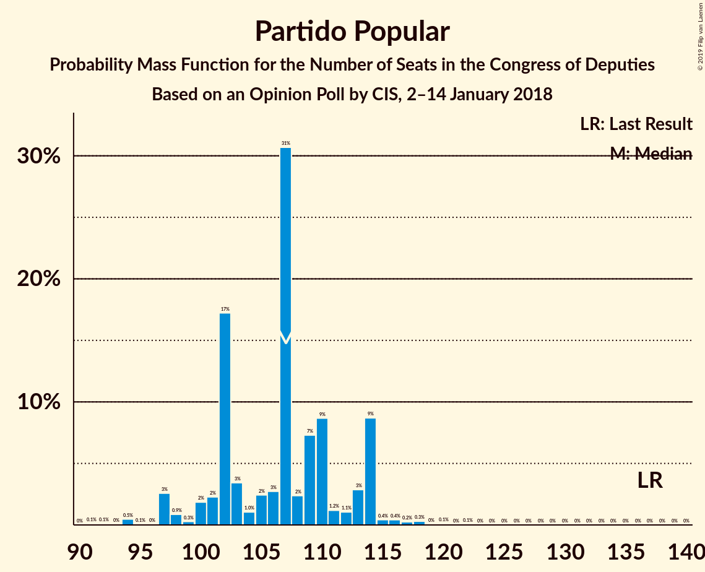

# Opinion Poll by CIS, 2–14 January 2018

<a href="#voting-intentions">Voting Intentions</a> | <a href="#seats">Seats</a> | <a href="#coalitions">Coalitions</a> | <a href="#technical-information">Technical Information</a>

## Voting Intentions

### Confidence Intervals

| Party | Last Result | Poll Result | 80% Confidence Interval | 90% Confidence Interval | 95% Confidence Interval | 99% Confidence Interval |
|:-----:|:-----------:|:-----------:|:-----------------------:|:-----------------------:|:-----------------------:|:-----------------------:|
| Partido Popular | 33.0% | 26.3% | 25.2–27.5% |24.8–27.8% |24.6–28.1% |24.1–28.6% |
| Partido Socialista Obrero Español | 22.6% | 23.1% | 22.0–24.2% |21.7–24.5% |21.5–24.8% |21.0–25.3% |
| Ciudadanos–Partido de la Ciudadanía | 13.1% | 20.7% | 19.7–21.8% |19.4–22.1% |19.2–22.4% |18.7–22.9% |
| Unidos Podemos | 21.2% | 19.0% | 18.0–20.1% |17.8–20.4% |17.5–20.6% |17.1–21.1% |
| Esquerra Republicana de Catalunya–Catalunya Sí | 2.7% | 3.4% | 3.0–3.9% |2.8–4.1% |2.7–4.2% |2.5–4.5% |
| Partit Demòcrata Europeu Català | 2.0% | 2.0% | 1.7–2.4% |1.6–2.6% |1.5–2.7% |1.4–2.9% |
| Euzko Alderdi Jeltzalea/Partido Nacionalista Vasco | 1.2% | 1.2% | 1.0–1.6% |0.9–1.6% |0.8–1.7% |0.7–1.9% |
| Euskal Herria Bildu | 0.8% | 0.8% | 0.6–1.1% |0.6–1.2% |0.5–1.2% |0.4–1.4% |
| Coalición Canaria–Partido Nacionalista Canario | 0.3% | 0.2% | 0.1–0.4% |0.1–0.4% |0.1–0.5% |0.1–0.6% |

*Note:* The poll result column reflects the actual value used in the calculations. Published results may vary slightly, and in addition be rounded to fewer digits.

## Seats

### Confidence Intervals

| Party | Last Result | Median | 80% Confidence Interval | 90% Confidence Interval | 95% Confidence Interval | 99% Confidence Interval |
|:-----:|:-----------:|:------:|:-----------------------:|:-----------------------:|:-----------------------:|:-----------------------:|
| <a href="#partido-popular">Partido Popular</a> | 137 | 101 | 101–104 |101–106 |101–106 |101–117 |
| <a href="#partido-socialista-obrero-español">Partido Socialista Obrero Español</a> | 85 | 92 | 88–92 |86–92 |86–92 |86–92 |
| <a href="#ciudadanos–partido-de-la-ciudadanía">Ciudadanos–Partido de la Ciudadanía</a> | 32 | 66 | 66–70 |66–70 |66–70 |63–70 |
| <a href="#unidos-podemos">Unidos Podemos</a> | 71 | 62 | 59–62 |59–62 |56–63 |53–72 |
| <a href="#esquerra-republicana-de-catalunya–catalunya-sí">Esquerra Republicana de Catalunya–Catalunya Sí</a> | 9 | 13 | 13 |13–15 |13–15 |13–15 |
| <a href="#partit-demòcrata-europeu-català">Partit Demòcrata Europeu Català</a> | 8 | 8 | 7–8 |7–8 |5–8 |4–10 |
| <a href="#euzko-alderdi-jeltzalea/partido-nacionalista-vasco">Euzko Alderdi Jeltzalea/Partido Nacionalista Vasco</a> | 5 | 3 | 3–7 |3–7 |3–7 |3–7 |
| <a href="#euskal-herria-bildu">Euskal Herria Bildu</a> | 2 | 4 | 1–4 |1–4 |1–4 |1–4 |
| <a href="#coalición-canaria–partido-nacionalista-canario">Coalición Canaria–Partido Nacionalista Canario</a> | 1 | 1 | 1 |0–1 |0–1 |0–1 |

### Partido Popular

*For a full overview of the results for this party, see the [Partido Popular](party-partidopopular.html) page.*

| Number of Seats | Probability | Accumulated | Special Marks |
|:---------------:|:-----------:|:-----------:|:-------------:|
| 100 | 0% | 100% |  |
| 101 | 57% | 99.9% | Median |
| 102 | 0.2% | 43% |  |
| 103 | 0% | 43% |  |
| 104 | 38% | 43% |  |
| 105 | 0% | 5% |  |
| 106 | 4% | 5% |  |
| 107 | 0% | 0.8% |  |
| 108 | 0% | 0.8% |  |
| 109 | 0.3% | 0.8% |  |
| 110 | 0% | 0.5% |  |
| 111 | 0% | 0.5% |  |
| 112 | 0% | 0.5% |  |
| 113 | 0% | 0.5% |  |
| 114 | 0% | 0.5% |  |
| 115 | 0% | 0.5% |  |
| 116 | 0% | 0.5% |  |
| 117 | 0.5% | 0.5% |  |
| 118 | 0% | 0% |  |
| 119 | 0% | 0% |  |
| 120 | 0% | 0% |  |
| 121 | 0% | 0% |  |
| 122 | 0% | 0% |  |
| 123 | 0% | 0% |  |
| 124 | 0% | 0% |  |
| 125 | 0% | 0% |  |
| 126 | 0% | 0% |  |
| 127 | 0% | 0% |  |
| 128 | 0% | 0% |  |
| 129 | 0% | 0% |  |
| 130 | 0% | 0% |  |
| 131 | 0% | 0% |  |
| 132 | 0% | 0% |  |
| 133 | 0% | 0% |  |
| 134 | 0% | 0% |  |
| 135 | 0% | 0% |  |
| 136 | 0% | 0% |  |
| 137 | 0% | 0% | Last Result |

### Partido Socialista Obrero Español

*For a full overview of the results for this party, see the [Partido Socialista Obrero Español](party-partidosocialistaobreroespañol.html) page.*

| Number of Seats | Probability | Accumulated | Special Marks |
|:---------------:|:-----------:|:-----------:|:-------------:|
| 78 | 0.3% | 100% |  |
| 79 | 0% | 99.7% |  |
| 80 | 0% | 99.7% |  |
| 81 | 0% | 99.7% |  |
| 82 | 0% | 99.7% |  |
| 83 | 0% | 99.7% |  |
| 84 | 0% | 99.7% |  |
| 85 | 0% | 99.6% | Last Result |
| 86 | 7% | 99.6% |  |
| 87 | 0% | 93% |  |
| 88 | 36% | 93% |  |
| 89 | 0% | 57% |  |
| 90 | 0% | 57% |  |
| 91 | 0% | 57% |  |
| 92 | 57% | 57% | Median |
| 93 | 0% | 0.4% |  |
| 94 | 0% | 0.4% |  |
| 95 | 0.3% | 0.4% |  |
| 96 | 0% | 0% |  |

### Ciudadanos–Partido de la Ciudadanía

*For a full overview of the results for this party, see the [Ciudadanos–Partido de la Ciudadanía](party-ciudadanos–partidodelaciudadanía.html) page.*

| Number of Seats | Probability | Accumulated | Special Marks |
|:---------------:|:-----------:|:-----------:|:-------------:|
| 32 | 0% | 100% | Last Result |
| 33 | 0% | 100% |  |
| 34 | 0% | 100% |  |
| 35 | 0% | 100% |  |
| 36 | 0% | 100% |  |
| 37 | 0% | 100% |  |
| 38 | 0% | 100% |  |
| 39 | 0% | 100% |  |
| 40 | 0% | 100% |  |
| 41 | 0% | 100% |  |
| 42 | 0% | 100% |  |
| 43 | 0% | 100% |  |
| 44 | 0% | 100% |  |
| 45 | 0% | 100% |  |
| 46 | 0% | 100% |  |
| 47 | 0% | 100% |  |
| 48 | 0% | 100% |  |
| 49 | 0% | 100% |  |
| 50 | 0% | 100% |  |
| 51 | 0% | 100% |  |
| 52 | 0% | 100% |  |
| 53 | 0% | 100% |  |
| 54 | 0% | 100% |  |
| 55 | 0% | 100% |  |
| 56 | 0% | 100% |  |
| 57 | 0% | 100% |  |
| 58 | 0% | 100% |  |
| 59 | 0% | 100% |  |
| 60 | 0% | 100% |  |
| 61 | 0% | 100% |  |
| 62 | 0% | 100% |  |
| 63 | 2% | 100% |  |
| 64 | 0% | 98% |  |
| 65 | 0% | 98% |  |
| 66 | 57% | 98% | Median |
| 67 | 0% | 41% |  |
| 68 | 5% | 41% |  |
| 69 | 0% | 36% |  |
| 70 | 36% | 36% |  |
| 71 | 0.3% | 0.4% |  |
| 72 | 0% | 0.1% |  |
| 73 | 0% | 0.1% |  |
| 74 | 0% | 0.1% |  |
| 75 | 0% | 0% |  |

### Unidos Podemos

*For a full overview of the results for this party, see the [Unidos Podemos](party-unidospodemos.html) page.*

| Number of Seats | Probability | Accumulated | Special Marks |
|:---------------:|:-----------:|:-----------:|:-------------:|
| 45 | 0.2% | 100% |  |
| 46 | 0% | 99.8% |  |
| 47 | 0.3% | 99.8% |  |
| 48 | 0% | 99.5% |  |
| 49 | 0% | 99.5% |  |
| 50 | 0% | 99.5% |  |
| 51 | 0% | 99.5% |  |
| 52 | 0% | 99.5% |  |
| 53 | 0% | 99.5% |  |
| 54 | 0% | 99.5% |  |
| 55 | 0% | 99.5% |  |
| 56 | 4% | 99.5% |  |
| 57 | 0% | 95% |  |
| 58 | 0% | 95% |  |
| 59 | 36% | 95% |  |
| 60 | 0% | 59% |  |
| 61 | 0.2% | 59% |  |
| 62 | 57% | 59% | Median |
| 63 | 0% | 3% |  |
| 64 | 0.3% | 2% |  |
| 65 | 0% | 2% |  |
| 66 | 0% | 2% |  |
| 67 | 0% | 2% |  |
| 68 | 0% | 2% |  |
| 69 | 0% | 2% |  |
| 70 | 0% | 2% |  |
| 71 | 0% | 2% | Last Result |
| 72 | 2% | 2% |  |
| 73 | 0% | 0% |  |

### Esquerra Republicana de Catalunya–Catalunya Sí

*For a full overview of the results for this party, see the [Esquerra Republicana de Catalunya–Catalunya Sí](party-esquerrarepublicanadecatalunya–catalunyasí.html) page.*

| Number of Seats | Probability | Accumulated | Special Marks |
|:---------------:|:-----------:|:-----------:|:-------------:|
| 9 | 0.3% | 100% | Last Result |
| 10 | 0% | 99.7% |  |
| 11 | 0% | 99.7% |  |
| 12 | 0% | 99.6% |  |
| 13 | 93% | 99.6% | Median |
| 14 | 0% | 7% |  |
| 15 | 6% | 6% |  |
| 16 | 0% | 0% |  |

### Partit Demòcrata Europeu Català

*For a full overview of the results for this party, see the [Partit Demòcrata Europeu Català](party-partitdemòcrataeuropeucatalà.html) page.*

| Number of Seats | Probability | Accumulated | Special Marks |
|:---------------:|:-----------:|:-----------:|:-------------:|
| 3 | 0.2% | 100% |  |
| 4 | 2% | 99.8% |  |
| 5 | 0.2% | 98% |  |
| 6 | 0% | 97% |  |
| 7 | 36% | 97% |  |
| 8 | 61% | 62% | Last Result, Median |
| 9 | 0% | 0.7% |  |
| 10 | 0.7% | 0.7% |  |
| 11 | 0% | 0% |  |

### Euzko Alderdi Jeltzalea/Partido Nacionalista Vasco

*For a full overview of the results for this party, see the [Euzko Alderdi Jeltzalea/Partido Nacionalista Vasco](party-euzkoalderdijeltzaleapartidonacionalistavasco.html) page.*

| Number of Seats | Probability | Accumulated | Special Marks |
|:---------------:|:-----------:|:-----------:|:-------------:|
| 3 | 59% | 100% | Median |
| 4 | 0% | 41% |  |
| 5 | 0% | 41% | Last Result |
| 6 | 0% | 41% |  |
| 7 | 41% | 41% |  |
| 8 | 0.1% | 0.1% |  |
| 9 | 0% | 0% |  |

### Euskal Herria Bildu

*For a full overview of the results for this party, see the [Euskal Herria Bildu](party-euskalherriabildu.html) page.*

| Number of Seats | Probability | Accumulated | Special Marks |
|:---------------:|:-----------:|:-----------:|:-------------:|
| 1 | 36% | 100% |  |
| 2 | 0.1% | 64% | Last Result |
| 3 | 2% | 64% |  |
| 4 | 61% | 61% | Median |
| 5 | 0% | 0% |  |

### Coalición Canaria–Partido Nacionalista Canario

*For a full overview of the results for this party, see the [Coalición Canaria–Partido Nacionalista Canario](party-coalicióncanaria–partidonacionalistacanario.html) page.*

| Number of Seats | Probability | Accumulated | Special Marks |
|:---------------:|:-----------:|:-----------:|:-------------:|
| 0 | 7% | 100% |  |
| 1 | 93% | 93% | Last Result, Median |
| 2 | 0% | 0% |  |

## Coalitions

### Confidence Intervals

| Coalition | Last Result | Median | Majority? | 80% Confidence Interval | 90% Confidence Interval | 95% Confidence Interval | 99% Confidence Interval |
|:---------:|:-----------:|:------:|:---------:|:-----------------------:|:-----------------------:|:-----------------------:|:-----------------------:|
| Partido Popular – Partido Socialista Obrero Español – Ciudadanos–Partido de la Ciudadanía | 254 | 259 | 100% | 259–262 | 259–262 | 258–262 | 253–267 |
| Partido Socialista Obrero Español – Ciudadanos–Partido de la Ciudadanía – Unidos Podemos | 188 | 220 | 100% | 217–220 | 213–220 | 210–220 | 208–221 |
| Partido Popular – Partido Socialista Obrero Español | 222 | 193 | 100% | 192–193 | 192–193 | 190–193 | 190–202 |
| Partido Socialista Obrero Español – Unidos Podemos – Esquerra Republicana de Catalunya–Catalunya Sí – Partit Demòcrata Europeu Català – Euzko Alderdi Jeltzalea/Partido Nacionalista Vasco – Euskal Herria Bildu | 180 | 182 | 63% | 175–182 | 175–182 | 175–182 | 166–183 |
| Partido Popular – Ciudadanos–Partido de la Ciudadanía – Euzko Alderdi Jeltzalea/Partido Nacionalista Vasco | 174 | 170 | 41% | 170–181 | 170–181 | 170–181 | 170–188 |
| Partido Popular – Ciudadanos–Partido de la Ciudadanía – Coalición Canaria–Partido Nacionalista Canario | 170 | 168 | 0.8% | 168–175 | 168–175 | 168–175 | 167–184 |
| Partido Socialista Obrero Español – Unidos Podemos – Esquerra Republicana de Catalunya–Catalunya Sí – Partit Demòcrata Europeu Català | 173 | 175 | 2% | 167–175 | 165–175 | 165–175 | 158–177 |
| Partido Popular – Ciudadanos–Partido de la Ciudadanía | 169 | 167 | 0.8% | 167–174 | 167–174 | 167–174 | 167–183 |
| Partido Socialista Obrero Español – Unidos Podemos – Esquerra Republicana de Catalunya–Catalunya Sí – Euskal Herria Bildu | 167 | 171 | 2% | 161–171 | 161–171 | 161–171 | 152–176 |
| Partido Socialista Obrero Español – Unidos Podemos – Euzko Alderdi Jeltzalea/Partido Nacionalista Vasco – Euskal Herria Bildu | 163 | 161 | 0% | 155–161 | 153–161 | 153–161 | 147–164 |
| Partido Socialista Obrero Español – Ciudadanos–Partido de la Ciudadanía | 117 | 158 | 0% | 158 | 154–158 | 150–158 | 149–158 |
| Partido Socialista Obrero Español – Unidos Podemos – Euzko Alderdi Jeltzalea/Partido Nacionalista Vasco | 161 | 157 | 0% | 154–157 | 149–157 | 149–157 | 143–161 |
| Partido Socialista Obrero Español – Unidos Podemos | 156 | 154 | 0% | 147–154 | 142–154 | 142–154 | 140–158 |
| Partido Popular | 137 | 101 | 0% | 101–104 | 101–106 | 101–106 | 101–117 |
| Partido Socialista Obrero Español | 85 | 92 | 0% | 88–92 | 86–92 | 86–92 | 86–92 |

### Partido Popular – Partido Socialista Obrero Español – Ciudadanos–Partido de la Ciudadanía

| Number of Seats | Probability | Accumulated | Special Marks |
|:---------------:|:-----------:|:-----------:|:-------------:|
| 253 | 2% | 100% |  |
| 254 | 0% | 98% | Last Result |
| 255 | 0% | 98% |  |
| 256 | 0% | 98% |  |
| 257 | 0% | 98% |  |
| 258 | 0.3% | 98% |  |
| 259 | 57% | 97% | Median |
| 260 | 4% | 41% |  |
| 261 | 0% | 37% |  |
| 262 | 36% | 37% |  |
| 263 | 0.1% | 0.7% |  |
| 264 | 0% | 0.7% |  |
| 265 | 0% | 0.7% |  |
| 266 | 0% | 0.7% |  |
| 267 | 0.2% | 0.7% |  |
| 268 | 0% | 0.5% |  |
| 269 | 0% | 0.5% |  |
| 270 | 0% | 0.5% |  |
| 271 | 0.3% | 0.5% |  |
| 272 | 0% | 0.2% |  |
| 273 | 0% | 0.2% |  |
| 274 | 0% | 0.2% |  |
| 275 | 0% | 0.2% |  |
| 276 | 0% | 0.2% |  |
| 277 | 0% | 0.2% |  |
| 278 | 0% | 0.2% |  |
| 279 | 0% | 0.2% |  |
| 280 | 0.2% | 0.2% |  |
| 281 | 0% | 0% |  |

### Partido Socialista Obrero Español – Ciudadanos–Partido de la Ciudadanía – Unidos Podemos

| Number of Seats | Probability | Accumulated | Special Marks |
|:---------------:|:-----------:|:-----------:|:-------------:|
| 188 | 0% | 100% | Last Result |
| 189 | 0% | 100% |  |
| 190 | 0% | 100% |  |
| 191 | 0% | 100% |  |
| 192 | 0% | 100% |  |
| 193 | 0% | 100% |  |
| 194 | 0% | 100% |  |
| 195 | 0% | 100% |  |
| 196 | 0% | 100% |  |
| 197 | 0% | 100% |  |
| 198 | 0% | 100% |  |
| 199 | 0% | 100% |  |
| 200 | 0% | 100% |  |
| 201 | 0.3% | 100% |  |
| 202 | 0% | 99.7% |  |
| 203 | 0% | 99.7% |  |
| 204 | 0% | 99.7% |  |
| 205 | 0% | 99.7% |  |
| 206 | 0% | 99.7% |  |
| 207 | 0% | 99.7% |  |
| 208 | 0.2% | 99.7% |  |
| 209 | 0% | 99.5% |  |
| 210 | 4% | 99.5% |  |
| 211 | 0% | 95% |  |
| 212 | 0% | 95% |  |
| 213 | 0.3% | 95% |  |
| 214 | 0% | 95% |  |
| 215 | 0% | 95% |  |
| 216 | 0% | 95% |  |
| 217 | 36% | 95% |  |
| 218 | 0% | 59% |  |
| 219 | 0% | 59% |  |
| 220 | 57% | 59% | Median |
| 221 | 2% | 2% |  |
| 222 | 0% | 0.2% |  |
| 223 | 0% | 0.2% |  |
| 224 | 0% | 0.2% |  |
| 225 | 0% | 0.2% |  |
| 226 | 0.2% | 0.2% |  |
| 227 | 0% | 0% |  |

### Partido Popular – Partido Socialista Obrero Español

| Number of Seats | Probability | Accumulated | Special Marks |
|:---------------:|:-----------:|:-----------:|:-------------:|
| 185 | 0% | 100% |  |
| 186 | 0% | 99.9% |  |
| 187 | 0.3% | 99.9% |  |
| 188 | 0% | 99.6% |  |
| 189 | 0% | 99.6% |  |
| 190 | 2% | 99.6% |  |
| 191 | 0% | 97% |  |
| 192 | 40% | 97% |  |
| 193 | 57% | 57% | Median |
| 194 | 0% | 0.7% |  |
| 195 | 0% | 0.7% |  |
| 196 | 0% | 0.7% |  |
| 197 | 0.2% | 0.7% |  |
| 198 | 0% | 0.5% |  |
| 199 | 0% | 0.5% |  |
| 200 | 0% | 0.5% |  |
| 201 | 0% | 0.5% |  |
| 202 | 0% | 0.5% |  |
| 203 | 0.3% | 0.5% |  |
| 204 | 0% | 0.2% |  |
| 205 | 0% | 0.2% |  |
| 206 | 0% | 0.2% |  |
| 207 | 0% | 0.2% |  |
| 208 | 0% | 0.2% |  |
| 209 | 0% | 0.2% |  |
| 210 | 0% | 0.2% |  |
| 211 | 0% | 0.2% |  |
| 212 | 0.2% | 0.2% |  |
| 213 | 0% | 0% |  |
| 214 | 0% | 0% |  |
| 215 | 0% | 0% |  |
| 216 | 0% | 0% |  |
| 217 | 0% | 0% |  |
| 218 | 0% | 0% |  |
| 219 | 0% | 0% |  |
| 220 | 0% | 0% |  |
| 221 | 0% | 0% |  |
| 222 | 0% | 0% | Last Result |

### Partido Socialista Obrero Español – Unidos Podemos – Esquerra Republicana de Catalunya–Catalunya Sí – Partit Demòcrata Europeu Català – Euzko Alderdi Jeltzalea/Partido Nacionalista Vasco – Euskal Herria Bildu

| Number of Seats | Probability | Accumulated | Special Marks |
|:---------------:|:-----------:|:-----------:|:-------------:|
| 164 | 0.3% | 100% |  |
| 165 | 0.2% | 99.7% |  |
| 166 | 0% | 99.5% |  |
| 167 | 0% | 99.5% |  |
| 168 | 0% | 99.5% |  |
| 169 | 0.3% | 99.5% |  |
| 170 | 0% | 99.2% |  |
| 171 | 0% | 99.2% |  |
| 172 | 0% | 99.2% |  |
| 173 | 0% | 99.2% |  |
| 174 | 0% | 99.2% |  |
| 175 | 36% | 99.2% |  |
| 176 | 4% | 63% | Majority |
| 177 | 0% | 59% |  |
| 178 | 0.2% | 59% |  |
| 179 | 0% | 59% |  |
| 180 | 0% | 59% | Last Result |
| 181 | 0% | 59% |  |
| 182 | 57% | 59% | Median |
| 183 | 2% | 2% |  |
| 184 | 0% | 0% |  |

### Partido Popular – Ciudadanos–Partido de la Ciudadanía – Euzko Alderdi Jeltzalea/Partido Nacionalista Vasco

| Number of Seats | Probability | Accumulated | Special Marks |
|:---------------:|:-----------:|:-----------:|:-------------:|
| 170 | 59% | 100% | Median |
| 171 | 0% | 41% |  |
| 172 | 0% | 41% |  |
| 173 | 0% | 41% |  |
| 174 | 0% | 41% | Last Result |
| 175 | 0.2% | 41% |  |
| 176 | 0% | 41% | Majority |
| 177 | 0% | 41% |  |
| 178 | 0% | 41% |  |
| 179 | 0% | 41% |  |
| 180 | 0% | 41% |  |
| 181 | 40% | 41% |  |
| 182 | 0% | 0.8% |  |
| 183 | 0% | 0.8% |  |
| 184 | 0% | 0.8% |  |
| 185 | 0% | 0.8% |  |
| 186 | 0% | 0.8% |  |
| 187 | 0.3% | 0.8% |  |
| 188 | 0.2% | 0.5% |  |
| 189 | 0% | 0.3% |  |
| 190 | 0% | 0.3% |  |
| 191 | 0% | 0.3% |  |
| 192 | 0.3% | 0.3% |  |
| 193 | 0% | 0% |  |

### Partido Popular – Ciudadanos–Partido de la Ciudadanía – Coalición Canaria–Partido Nacionalista Canario

| Number of Seats | Probability | Accumulated | Special Marks |
|:---------------:|:-----------:|:-----------:|:-------------:|
| 167 | 2% | 100% |  |
| 168 | 57% | 98% | Median |
| 169 | 0% | 41% |  |
| 170 | 0% | 41% | Last Result |
| 171 | 0% | 41% |  |
| 172 | 0.2% | 41% |  |
| 173 | 0% | 41% |  |
| 174 | 4% | 41% |  |
| 175 | 36% | 37% |  |
| 176 | 0% | 0.8% | Majority |
| 177 | 0% | 0.8% |  |
| 178 | 0% | 0.8% |  |
| 179 | 0% | 0.8% |  |
| 180 | 0% | 0.8% |  |
| 181 | 0.3% | 0.8% |  |
| 182 | 0% | 0.5% |  |
| 183 | 0% | 0.5% |  |
| 184 | 0% | 0.5% |  |
| 185 | 0.2% | 0.5% |  |
| 186 | 0.3% | 0.3% |  |
| 187 | 0% | 0% |  |

### Partido Socialista Obrero Español – Unidos Podemos – Esquerra Republicana de Catalunya–Catalunya Sí – Partit Demòcrata Europeu Català

| Number of Seats | Probability | Accumulated | Special Marks |
|:---------------:|:-----------:|:-----------:|:-------------:|
| 156 | 0.3% | 100% |  |
| 157 | 0% | 99.7% |  |
| 158 | 0.2% | 99.7% |  |
| 159 | 0% | 99.5% |  |
| 160 | 0% | 99.5% |  |
| 161 | 0.3% | 99.5% |  |
| 162 | 0% | 99.2% |  |
| 163 | 0% | 99.2% |  |
| 164 | 0% | 99.2% |  |
| 165 | 4% | 99.2% |  |
| 166 | 0% | 95% |  |
| 167 | 36% | 95% |  |
| 168 | 0% | 59% |  |
| 169 | 0% | 59% |  |
| 170 | 0% | 59% |  |
| 171 | 0% | 59% |  |
| 172 | 0.2% | 59% |  |
| 173 | 0% | 59% | Last Result |
| 174 | 0% | 59% |  |
| 175 | 57% | 59% | Median |
| 176 | 0% | 2% | Majority |
| 177 | 2% | 2% |  |
| 178 | 0% | 0% |  |

### Partido Popular – Ciudadanos–Partido de la Ciudadanía

| Number of Seats | Probability | Accumulated | Special Marks |
|:---------------:|:-----------:|:-----------:|:-------------:|
| 167 | 59% | 100% | Median |
| 168 | 0% | 41% |  |
| 169 | 0% | 41% | Last Result |
| 170 | 0% | 41% |  |
| 171 | 0% | 41% |  |
| 172 | 0.2% | 41% |  |
| 173 | 0% | 41% |  |
| 174 | 40% | 41% |  |
| 175 | 0% | 0.8% |  |
| 176 | 0% | 0.8% | Majority |
| 177 | 0% | 0.8% |  |
| 178 | 0% | 0.8% |  |
| 179 | 0% | 0.8% |  |
| 180 | 0.3% | 0.8% |  |
| 181 | 0% | 0.5% |  |
| 182 | 0% | 0.5% |  |
| 183 | 0% | 0.5% |  |
| 184 | 0% | 0.5% |  |
| 185 | 0.5% | 0.5% |  |
| 186 | 0% | 0% |  |

### Partido Socialista Obrero Español – Unidos Podemos – Esquerra Republicana de Catalunya–Catalunya Sí – Euskal Herria Bildu

| Number of Seats | Probability | Accumulated | Special Marks |
|:---------------:|:-----------:|:-----------:|:-------------:|
| 147 | 0.3% | 100% |  |
| 148 | 0% | 99.7% |  |
| 149 | 0% | 99.7% |  |
| 150 | 0% | 99.7% |  |
| 151 | 0% | 99.7% |  |
| 152 | 0.3% | 99.7% |  |
| 153 | 0% | 99.4% |  |
| 154 | 0% | 99.4% |  |
| 155 | 0% | 99.4% |  |
| 156 | 0% | 99.4% |  |
| 157 | 0.2% | 99.4% |  |
| 158 | 0% | 99.2% |  |
| 159 | 0% | 99.2% |  |
| 160 | 0% | 99.2% |  |
| 161 | 40% | 99.2% |  |
| 162 | 0% | 59% |  |
| 163 | 0% | 59% |  |
| 164 | 0% | 59% |  |
| 165 | 0% | 59% |  |
| 166 | 0% | 59% |  |
| 167 | 0% | 59% | Last Result |
| 168 | 0% | 59% |  |
| 169 | 0% | 59% |  |
| 170 | 0% | 59% |  |
| 171 | 57% | 59% | Median |
| 172 | 0.2% | 2% |  |
| 173 | 0% | 2% |  |
| 174 | 0% | 2% |  |
| 175 | 0% | 2% |  |
| 176 | 2% | 2% | Majority |
| 177 | 0% | 0% |  |

### Partido Socialista Obrero Español – Unidos Podemos – Euzko Alderdi Jeltzalea/Partido Nacionalista Vasco – Euskal Herria Bildu

| Number of Seats | Probability | Accumulated | Special Marks |
|:---------------:|:-----------:|:-----------:|:-------------:|
| 141 | 0.3% | 100% |  |
| 142 | 0% | 99.7% |  |
| 143 | 0% | 99.7% |  |
| 144 | 0% | 99.7% |  |
| 145 | 0% | 99.7% |  |
| 146 | 0% | 99.7% |  |
| 147 | 0.2% | 99.7% |  |
| 148 | 0% | 99.5% |  |
| 149 | 0% | 99.5% |  |
| 150 | 0.3% | 99.5% |  |
| 151 | 0% | 99.2% |  |
| 152 | 0% | 99.2% |  |
| 153 | 4% | 99.2% |  |
| 154 | 0% | 95% |  |
| 155 | 36% | 95% |  |
| 156 | 0% | 59% |  |
| 157 | 0% | 59% |  |
| 158 | 0% | 59% |  |
| 159 | 0% | 59% |  |
| 160 | 0% | 59% |  |
| 161 | 57% | 59% | Median |
| 162 | 0.2% | 2% |  |
| 163 | 0% | 2% | Last Result |
| 164 | 2% | 2% |  |
| 165 | 0% | 0% |  |

### Partido Socialista Obrero Español – Ciudadanos–Partido de la Ciudadanía

| Number of Seats | Probability | Accumulated | Special Marks |
|:---------------:|:-----------:|:-----------:|:-------------:|
| 117 | 0% | 100% | Last Result |
| 118 | 0% | 100% |  |
| 119 | 0% | 100% |  |
| 120 | 0% | 100% |  |
| 121 | 0% | 100% |  |
| 122 | 0% | 100% |  |
| 123 | 0% | 100% |  |
| 124 | 0% | 100% |  |
| 125 | 0% | 100% |  |
| 126 | 0% | 100% |  |
| 127 | 0% | 100% |  |
| 128 | 0% | 100% |  |
| 129 | 0% | 100% |  |
| 130 | 0% | 100% |  |
| 131 | 0% | 100% |  |
| 132 | 0% | 100% |  |
| 133 | 0% | 100% |  |
| 134 | 0% | 100% |  |
| 135 | 0% | 100% |  |
| 136 | 0% | 100% |  |
| 137 | 0% | 100% |  |
| 138 | 0% | 100% |  |
| 139 | 0% | 100% |  |
| 140 | 0% | 100% |  |
| 141 | 0% | 100% |  |
| 142 | 0% | 100% |  |
| 143 | 0% | 100% |  |
| 144 | 0% | 100% |  |
| 145 | 0% | 100% |  |
| 146 | 0% | 100% |  |
| 147 | 0% | 100% |  |
| 148 | 0% | 100% |  |
| 149 | 2% | 100% |  |
| 150 | 0% | 98% |  |
| 151 | 0% | 97% |  |
| 152 | 0% | 97% |  |
| 153 | 0% | 97% |  |
| 154 | 5% | 97% |  |
| 155 | 0% | 93% |  |
| 156 | 0% | 93% |  |
| 157 | 0% | 93% |  |
| 158 | 92% | 93% | Median |
| 159 | 0% | 0.4% |  |
| 160 | 0% | 0.4% |  |
| 161 | 0% | 0.4% |  |
| 162 | 0% | 0.4% |  |
| 163 | 0.2% | 0.4% |  |
| 164 | 0% | 0.2% |  |
| 165 | 0.2% | 0.2% |  |
| 166 | 0% | 0% |  |

### Partido Socialista Obrero Español – Unidos Podemos – Euzko Alderdi Jeltzalea/Partido Nacionalista Vasco

| Number of Seats | Probability | Accumulated | Special Marks |
|:---------------:|:-----------:|:-----------:|:-------------:|
| 140 | 0.3% | 100% |  |
| 141 | 0% | 99.7% |  |
| 142 | 0% | 99.7% |  |
| 143 | 0.2% | 99.7% |  |
| 144 | 0% | 99.5% |  |
| 145 | 0% | 99.5% |  |
| 146 | 0% | 99.5% |  |
| 147 | 0% | 99.5% |  |
| 148 | 0% | 99.5% |  |
| 149 | 5% | 99.5% |  |
| 150 | 0% | 95% |  |
| 151 | 0% | 95% |  |
| 152 | 0% | 95% |  |
| 153 | 0% | 95% |  |
| 154 | 36% | 95% |  |
| 155 | 0% | 59% |  |
| 156 | 0% | 59% |  |
| 157 | 57% | 59% | Median |
| 158 | 0% | 2% |  |
| 159 | 0.2% | 2% |  |
| 160 | 0% | 2% |  |
| 161 | 2% | 2% | Last Result |
| 162 | 0% | 0% |  |

### Partido Socialista Obrero Español – Unidos Podemos

| Number of Seats | Probability | Accumulated | Special Marks |
|:---------------:|:-----------:|:-----------:|:-------------:|
| 133 | 0.3% | 100% |  |
| 134 | 0% | 99.7% |  |
| 135 | 0% | 99.7% |  |
| 136 | 0% | 99.7% |  |
| 137 | 0% | 99.7% |  |
| 138 | 0% | 99.7% |  |
| 139 | 0% | 99.6% |  |
| 140 | 0.2% | 99.6% |  |
| 141 | 0% | 99.5% |  |
| 142 | 5% | 99.5% |  |
| 143 | 0% | 95% |  |
| 144 | 0% | 95% |  |
| 145 | 0% | 95% |  |
| 146 | 0% | 95% |  |
| 147 | 36% | 95% |  |
| 148 | 0% | 59% |  |
| 149 | 0% | 59% |  |
| 150 | 0% | 59% |  |
| 151 | 0% | 59% |  |
| 152 | 0% | 59% |  |
| 153 | 0% | 59% |  |
| 154 | 57% | 59% | Median |
| 155 | 0% | 2% |  |
| 156 | 0.2% | 2% | Last Result |
| 157 | 0% | 2% |  |
| 158 | 2% | 2% |  |
| 159 | 0% | 0% |  |

### Partido Popular

| Number of Seats | Probability | Accumulated | Special Marks |
|:---------------:|:-----------:|:-----------:|:-------------:|
| 100 | 0% | 100% |  |
| 101 | 57% | 99.9% | Median |
| 102 | 0.2% | 43% |  |
| 103 | 0% | 43% |  |
| 104 | 38% | 43% |  |
| 105 | 0% | 5% |  |
| 106 | 4% | 5% |  |
| 107 | 0% | 0.8% |  |
| 108 | 0% | 0.8% |  |
| 109 | 0.3% | 0.8% |  |
| 110 | 0% | 0.5% |  |
| 111 | 0% | 0.5% |  |
| 112 | 0% | 0.5% |  |
| 113 | 0% | 0.5% |  |
| 114 | 0% | 0.5% |  |
| 115 | 0% | 0.5% |  |
| 116 | 0% | 0.5% |  |
| 117 | 0.5% | 0.5% |  |
| 118 | 0% | 0% |  |
| 119 | 0% | 0% |  |
| 120 | 0% | 0% |  |
| 121 | 0% | 0% |  |
| 122 | 0% | 0% |  |
| 123 | 0% | 0% |  |
| 124 | 0% | 0% |  |
| 125 | 0% | 0% |  |
| 126 | 0% | 0% |  |
| 127 | 0% | 0% |  |
| 128 | 0% | 0% |  |
| 129 | 0% | 0% |  |
| 130 | 0% | 0% |  |
| 131 | 0% | 0% |  |
| 132 | 0% | 0% |  |
| 133 | 0% | 0% |  |
| 134 | 0% | 0% |  |
| 135 | 0% | 0% |  |
| 136 | 0% | 0% |  |
| 137 | 0% | 0% | Last Result |

### Partido Socialista Obrero Español

| Number of Seats | Probability | Accumulated | Special Marks |
|:---------------:|:-----------:|:-----------:|:-------------:|
| 78 | 0.3% | 100% |  |
| 79 | 0% | 99.7% |  |
| 80 | 0% | 99.7% |  |
| 81 | 0% | 99.7% |  |
| 82 | 0% | 99.7% |  |
| 83 | 0% | 99.7% |  |
| 84 | 0% | 99.7% |  |
| 85 | 0% | 99.6% | Last Result |
| 86 | 7% | 99.6% |  |
| 87 | 0% | 93% |  |
| 88 | 36% | 93% |  |
| 89 | 0% | 57% |  |
| 90 | 0% | 57% |  |
| 91 | 0% | 57% |  |
| 92 | 57% | 57% | Median |
| 93 | 0% | 0.4% |  |
| 94 | 0% | 0.4% |  |
| 95 | 0.3% | 0.4% |  |
| 96 | 0% | 0% |  |

## Technical Information

### Opinion Poll

+ **Polling firm:** CIS
+ **Commissioner(s):** —
+ **Fieldwork period:** 2–14 January 2018

### Calculations

+ **Sample size:** 2477
+ **Simulations done:** 1,024
+ **Error estimate:** 1.59%

