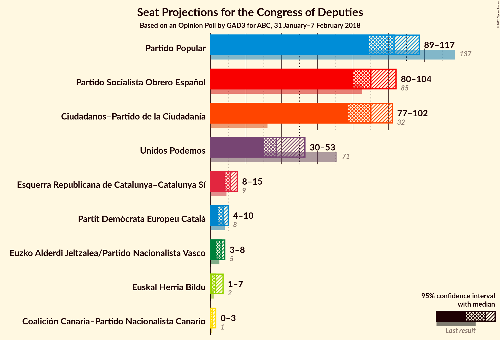
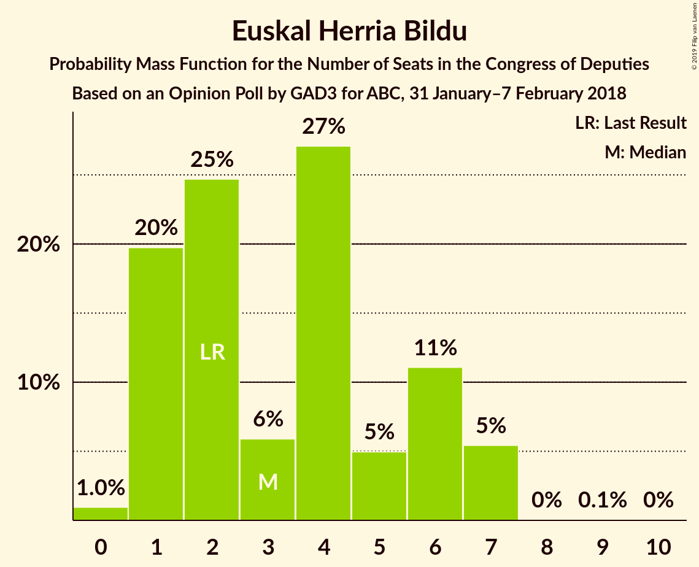
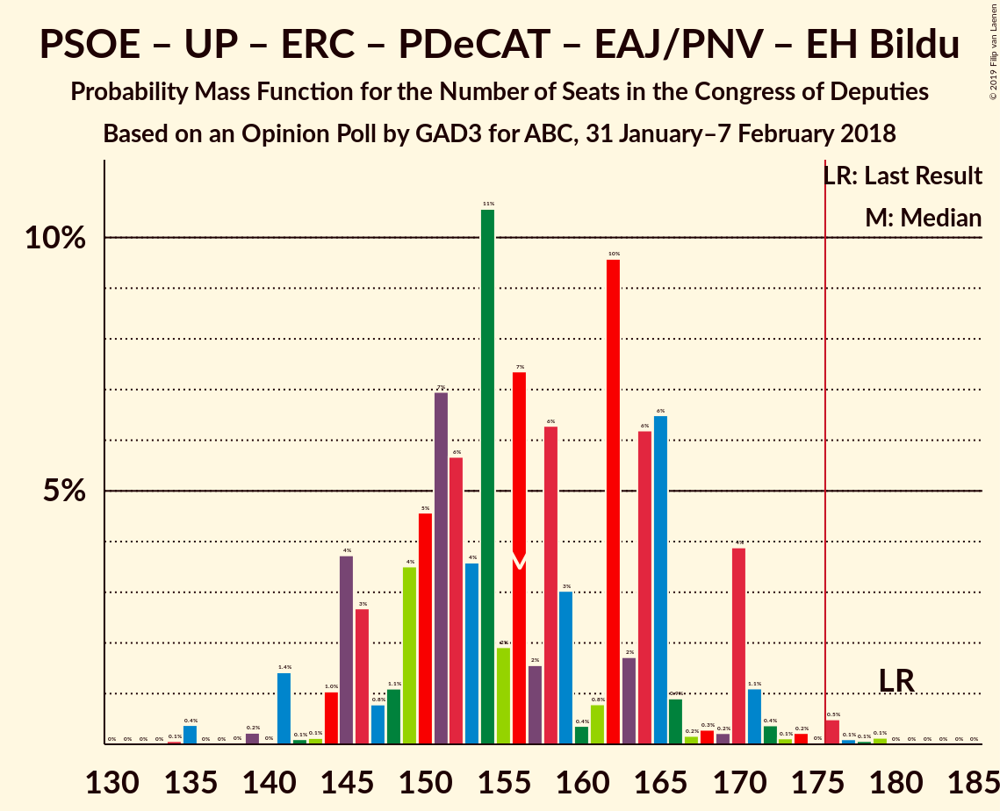
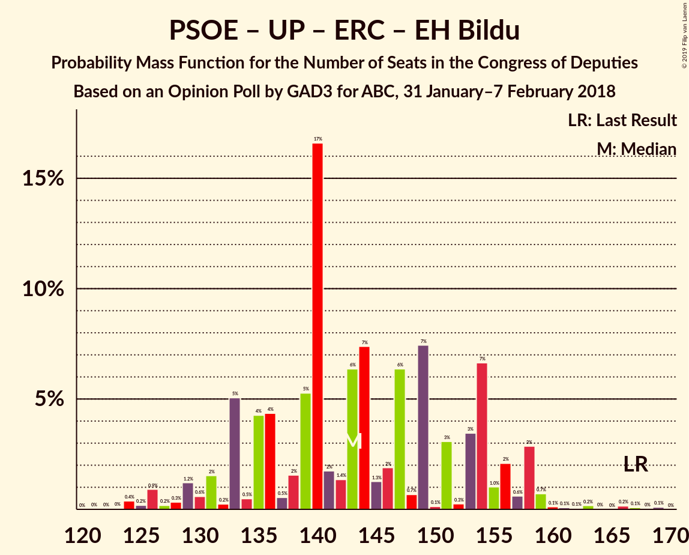
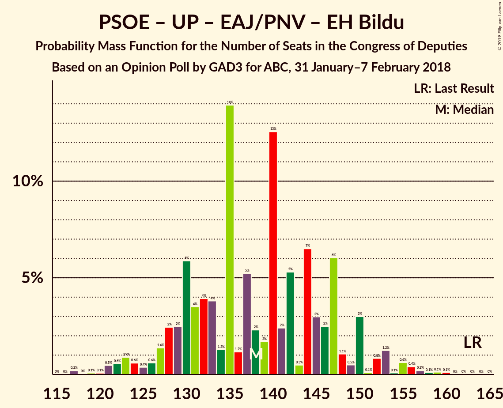
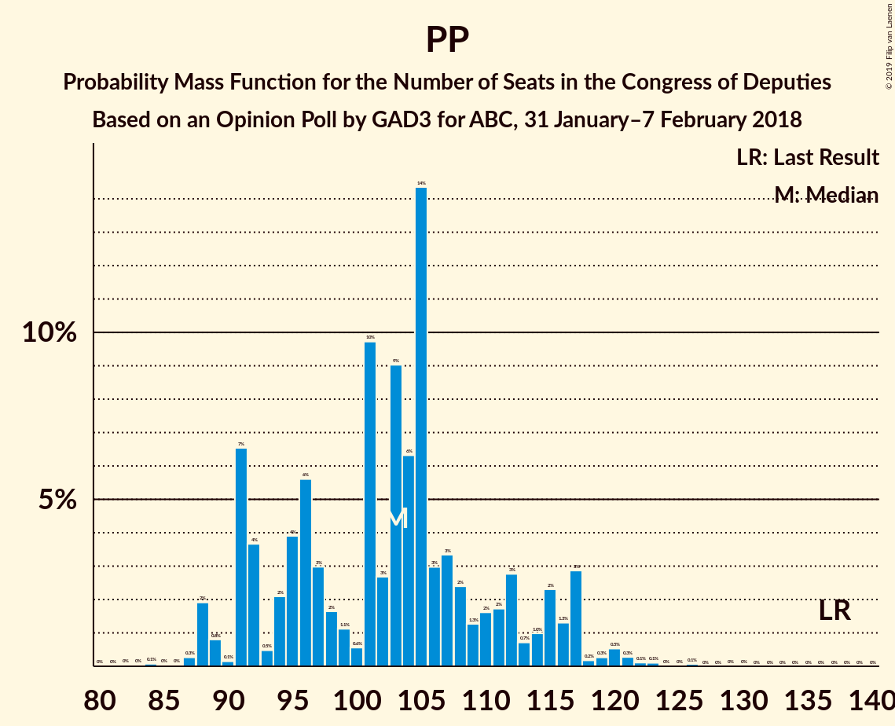

# Opinion Poll by GAD3 for ABC, 31 January–7 February 2018

<a href="#voting-intentions">Voting Intentions</a> | <a href="#seats">Seats</a> | <a href="#coalitions">Coalitions</a> | <a href="#technical-information">Technical Information</a>

## Voting Intentions

### Confidence Intervals

| Party | Last Result | Poll Result | 80% Confidence Interval | 90% Confidence Interval | 95% Confidence Interval | 99% Confidence Interval |
|:-----:|:-----------:|:-----------:|:-----------------------:|:-----------------------:|:-----------------------:|:-----------------------:|
| Partido Popular | 33.0% | 25.8% | 24.1–27.7% |23.6–28.2% |23.2–28.7% |22.4–29.6% |
| Ciudadanos–Partido de la Ciudadanía | 13.1% | 25.6% | 23.9–27.5% |23.5–28.0% |23.0–28.5% |22.2–29.3% |
| Partido Socialista Obrero Español | 22.6% | 23.7% | 22.0–25.4% |21.5–26.0% |21.1–26.4% |20.3–27.3% |
| Unidos Podemos | 21.2% | 14.8% | 13.4–16.3% |13.0–16.7% |12.7–17.1% |12.1–17.9% |
| Esquerra Republicana de Catalunya–Catalunya Sí | 2.7% | 2.9% | 2.3–3.7% |2.1–3.9% |2.0–4.1% |1.8–4.6% |
| Partit Demòcrata Europeu Català | 2.0% | 1.8% | 1.4–2.5% |1.2–2.7% |1.1–2.8% |1.0–3.2% |
| Euzko Alderdi Jeltzalea/Partido Nacionalista Vasco | 1.2% | 1.2% | 0.9–1.8% |0.8–1.9% |0.7–2.1% |0.5–2.4% |
| Euskal Herria Bildu | 0.8% | 0.8% | 0.5–1.3% |0.5–1.4% |0.4–1.6% |0.3–1.8% |
| Coalición Canaria–Partido Nacionalista Canario | 0.3% | 0.3% | 0.2–0.7% |0.1–0.8% |0.1–0.9% |0.1–1.1% |

*Note:* The poll result column reflects the actual value used in the calculations. Published results may vary slightly, and in addition be rounded to fewer digits.

## Seats

### Confidence Intervals

| Party | Last Result | Median | 80% Confidence Interval | 90% Confidence Interval | 95% Confidence Interval | 99% Confidence Interval |
|:-----:|:-----------:|:------:|:-----------------------:|:-----------------------:|:-----------------------:|:-----------------------:|
| <a href="#partido-popular">Partido Popular</a> | 137 | 111 | 98–118 |98–118 |98–118 |87–124 |
| <a href="#ciudadanos–partido-de-la-ciudadanía">Ciudadanos–Partido de la Ciudadanía</a> | 32 | 92 | 76–105 |76–105 |76–105 |66–105 |
| <a href="#partido-socialista-obrero-español">Partido Socialista Obrero Español</a> | 85 | 83 | 80–90 |80–90 |80–90 |80–96 |
| <a href="#unidos-podemos">Unidos Podemos</a> | 71 | 33 | 33–38 |31–38 |31–38 |31–41 |
| <a href="#esquerra-republicana-de-catalunya–catalunya-sí">Esquerra Republicana de Catalunya–Catalunya Sí</a> | 9 | 12 | 12–18 |12–18 |12–18 |7–18 |
| <a href="#partit-demòcrata-europeu-català">Partit Demòcrata Europeu Català</a> | 8 | 7 | 6–7 |6–8 |6–8 |4–13 |
| <a href="#euzko-alderdi-jeltzalea/partido-nacionalista-vasco">Euzko Alderdi Jeltzalea/Partido Nacionalista Vasco</a> | 5 | 6 | 6–8 |6–10 |6–10 |2–10 |
| <a href="#euskal-herria-bildu">Euskal Herria Bildu</a> | 2 | 4 | 1–4 |1–4 |1–5 |1–11 |
| <a href="#coalición-canaria–partido-nacionalista-canario">Coalición Canaria–Partido Nacionalista Canario</a> | 1 | 2 | 0–2 |0–2 |0–2 |0–4 |

### Partido Popular

*For a full overview of the results for this party, see the [Partido Popular](party-partidopopular.html) page.*

| Number of Seats | Probability | Accumulated | Special Marks |
|:---------------:|:-----------:|:-----------:|:-------------:|
| 84 | 0.1% | 100% |  |
| 85 | 0% | 99.9% |  |
| 86 | 0% | 99.9% |  |
| 87 | 0.5% | 99.9% |  |
| 88 | 0% | 99.4% |  |
| 89 | 0% | 99.4% |  |
| 90 | 0% | 99.4% |  |
| 91 | 0% | 99.4% |  |
| 92 | 0.1% | 99.4% |  |
| 93 | 0% | 99.3% |  |
| 94 | 0% | 99.3% |  |
| 95 | 0% | 99.3% |  |
| 96 | 0% | 99.3% |  |
| 97 | 0% | 99.3% |  |
| 98 | 19% | 99.3% |  |
| 99 | 0.2% | 80% |  |
| 100 | 0% | 80% |  |
| 101 | 0.1% | 80% |  |
| 102 | 0% | 80% |  |
| 103 | 0.1% | 80% |  |
| 104 | 6% | 80% |  |
| 105 | 0% | 73% |  |
| 106 | 0% | 73% |  |
| 107 | 0.6% | 73% |  |
| 108 | 0% | 73% |  |
| 109 | 0% | 73% |  |
| 110 | 0% | 73% |  |
| 111 | 49% | 73% | Median |
| 112 | 1.1% | 23% |  |
| 113 | 0% | 22% |  |
| 114 | 0% | 22% |  |
| 115 | 0% | 22% |  |
| 116 | 0% | 22% |  |
| 117 | 0% | 22% |  |
| 118 | 21% | 22% |  |
| 119 | 0.1% | 1.0% |  |
| 120 | 0% | 0.9% |  |
| 121 | 0% | 0.9% |  |
| 122 | 0% | 0.9% |  |
| 123 | 0% | 0.9% |  |
| 124 | 0.9% | 0.9% |  |
| 125 | 0% | 0% |  |
| 126 | 0% | 0% |  |
| 127 | 0% | 0% |  |
| 128 | 0% | 0% |  |
| 129 | 0% | 0% |  |
| 130 | 0% | 0% |  |
| 131 | 0% | 0% |  |
| 132 | 0% | 0% |  |
| 133 | 0% | 0% |  |
| 134 | 0% | 0% |  |
| 135 | 0% | 0% |  |
| 136 | 0% | 0% |  |
| 137 | 0% | 0% | Last Result |

### Ciudadanos–Partido de la Ciudadanía

*For a full overview of the results for this party, see the [Ciudadanos–Partido de la Ciudadanía](party-ciudadanos–partidodelaciudadanía.html) page.*

| Number of Seats | Probability | Accumulated | Special Marks |
|:---------------:|:-----------:|:-----------:|:-------------:|
| 32 | 0% | 100% | Last Result |
| 33 | 0% | 100% |  |
| 34 | 0% | 100% |  |
| 35 | 0% | 100% |  |
| 36 | 0% | 100% |  |
| 37 | 0% | 100% |  |
| 38 | 0% | 100% |  |
| 39 | 0% | 100% |  |
| 40 | 0% | 100% |  |
| 41 | 0% | 100% |  |
| 42 | 0% | 100% |  |
| 43 | 0% | 100% |  |
| 44 | 0% | 100% |  |
| 45 | 0% | 100% |  |
| 46 | 0% | 100% |  |
| 47 | 0% | 100% |  |
| 48 | 0% | 100% |  |
| 49 | 0% | 100% |  |
| 50 | 0% | 100% |  |
| 51 | 0% | 100% |  |
| 52 | 0% | 100% |  |
| 53 | 0% | 100% |  |
| 54 | 0% | 100% |  |
| 55 | 0% | 100% |  |
| 56 | 0% | 100% |  |
| 57 | 0% | 100% |  |
| 58 | 0% | 100% |  |
| 59 | 0% | 100% |  |
| 60 | 0% | 100% |  |
| 61 | 0% | 100% |  |
| 62 | 0% | 100% |  |
| 63 | 0% | 100% |  |
| 64 | 0% | 100% |  |
| 65 | 0% | 100% |  |
| 66 | 0.8% | 100% |  |
| 67 | 0% | 99.2% |  |
| 68 | 0% | 99.2% |  |
| 69 | 0% | 99.2% |  |
| 70 | 0% | 99.2% |  |
| 71 | 0% | 99.2% |  |
| 72 | 0% | 99.2% |  |
| 73 | 0% | 99.2% |  |
| 74 | 0% | 99.2% |  |
| 75 | 0% | 99.2% |  |
| 76 | 21% | 99.2% |  |
| 77 | 0.1% | 78% |  |
| 78 | 0% | 78% |  |
| 79 | 0% | 78% |  |
| 80 | 0% | 78% |  |
| 81 | 0.1% | 78% |  |
| 82 | 0% | 78% |  |
| 83 | 0% | 78% |  |
| 84 | 0.3% | 78% |  |
| 85 | 0.6% | 77% |  |
| 86 | 1.2% | 77% |  |
| 87 | 0% | 76% |  |
| 88 | 0% | 76% |  |
| 89 | 0% | 76% |  |
| 90 | 0.6% | 76% |  |
| 91 | 0.2% | 75% |  |
| 92 | 49% | 75% | Median |
| 93 | 0% | 25% |  |
| 94 | 0% | 25% |  |
| 95 | 0% | 25% |  |
| 96 | 0% | 25% |  |
| 97 | 0% | 25% |  |
| 98 | 0% | 25% |  |
| 99 | 0.1% | 25% |  |
| 100 | 0% | 25% |  |
| 101 | 0% | 25% |  |
| 102 | 6% | 25% |  |
| 103 | 0% | 19% |  |
| 104 | 0% | 19% |  |
| 105 | 19% | 19% |  |
| 106 | 0% | 0% |  |

### Partido Socialista Obrero Español

*For a full overview of the results for this party, see the [Partido Socialista Obrero Español](party-partidosocialistaobreroespañol.html) page.*

| Number of Seats | Probability | Accumulated | Special Marks |
|:---------------:|:-----------:|:-----------:|:-------------:|
| 80 | 19% | 100% |  |
| 81 | 6% | 81% |  |
| 82 | 0.2% | 75% |  |
| 83 | 49% | 75% | Median |
| 84 | 1.1% | 25% |  |
| 85 | 0.1% | 24% | Last Result |
| 86 | 0.1% | 24% |  |
| 87 | 0.2% | 24% |  |
| 88 | 0% | 24% |  |
| 89 | 0.2% | 24% |  |
| 90 | 22% | 24% |  |
| 91 | 0.8% | 2% |  |
| 92 | 0% | 0.9% |  |
| 93 | 0% | 0.9% |  |
| 94 | 0% | 0.9% |  |
| 95 | 0.2% | 0.9% |  |
| 96 | 0.6% | 0.7% |  |
| 97 | 0% | 0.1% |  |
| 98 | 0% | 0.1% |  |
| 99 | 0% | 0.1% |  |
| 100 | 0% | 0.1% |  |
| 101 | 0.1% | 0.1% |  |
| 102 | 0% | 0% |  |

### Unidos Podemos

*For a full overview of the results for this party, see the [Unidos Podemos](party-unidospodemos.html) page.*

| Number of Seats | Probability | Accumulated | Special Marks |
|:---------------:|:-----------:|:-----------:|:-------------:|
| 31 | 6% | 100% |  |
| 32 | 0% | 94% |  |
| 33 | 69% | 94% | Median |
| 34 | 0.1% | 25% |  |
| 35 | 0.4% | 25% |  |
| 36 | 0% | 25% |  |
| 37 | 0.1% | 25% |  |
| 38 | 23% | 25% |  |
| 39 | 0.6% | 2% |  |
| 40 | 0% | 1.0% |  |
| 41 | 0.9% | 1.0% |  |
| 42 | 0% | 0.1% |  |
| 43 | 0.1% | 0.1% |  |
| 44 | 0% | 0% |  |
| 45 | 0% | 0% |  |
| 46 | 0% | 0% |  |
| 47 | 0% | 0% |  |
| 48 | 0% | 0% |  |
| 49 | 0% | 0% |  |
| 50 | 0% | 0% |  |
| 51 | 0% | 0% |  |
| 52 | 0% | 0% |  |
| 53 | 0% | 0% |  |
| 54 | 0% | 0% |  |
| 55 | 0% | 0% |  |
| 56 | 0% | 0% |  |
| 57 | 0% | 0% |  |
| 58 | 0% | 0% |  |
| 59 | 0% | 0% |  |
| 60 | 0% | 0% |  |
| 61 | 0% | 0% |  |
| 62 | 0% | 0% |  |
| 63 | 0% | 0% |  |
| 64 | 0% | 0% |  |
| 65 | 0% | 0% |  |
| 66 | 0% | 0% |  |
| 67 | 0% | 0% |  |
| 68 | 0% | 0% |  |
| 69 | 0% | 0% |  |
| 70 | 0% | 0% |  |
| 71 | 0% | 0% | Last Result |

### Esquerra Republicana de Catalunya–Catalunya Sí

*For a full overview of the results for this party, see the [Esquerra Republicana de Catalunya–Catalunya Sí](party-esquerrarepublicanadecatalunya–catalunyasí.html) page.*

| Number of Seats | Probability | Accumulated | Special Marks |
|:---------------:|:-----------:|:-----------:|:-------------:|
| 6 | 0.1% | 100% |  |
| 7 | 1.1% | 99.9% |  |
| 8 | 0% | 98.7% |  |
| 9 | 0.1% | 98.7% | Last Result |
| 10 | 0% | 98.6% |  |
| 11 | 0.2% | 98.6% |  |
| 12 | 56% | 98% | Median |
| 13 | 23% | 43% |  |
| 14 | 0.2% | 20% |  |
| 15 | 0.1% | 19% |  |
| 16 | 0% | 19% |  |
| 17 | 0% | 19% |  |
| 18 | 19% | 19% |  |
| 19 | 0% | 0.1% |  |
| 20 | 0.1% | 0.1% |  |
| 21 | 0% | 0% |  |

### Partit Demòcrata Europeu Català

*For a full overview of the results for this party, see the [Partit Demòcrata Europeu Català](party-partitdemòcrataeuropeucatalà.html) page.*

| Number of Seats | Probability | Accumulated | Special Marks |
|:---------------:|:-----------:|:-----------:|:-------------:|
| 1 | 0.1% | 100% |  |
| 2 | 0% | 99.9% |  |
| 3 | 0% | 99.9% |  |
| 4 | 0.7% | 99.9% |  |
| 5 | 0.9% | 99.2% |  |
| 6 | 41% | 98% |  |
| 7 | 49% | 58% | Median |
| 8 | 6% | 8% | Last Result |
| 9 | 0.1% | 2% |  |
| 10 | 1.1% | 2% |  |
| 11 | 0% | 0.9% |  |
| 12 | 0% | 0.9% |  |
| 13 | 0.5% | 0.9% |  |
| 14 | 0.3% | 0.4% |  |
| 15 | 0.1% | 0.1% |  |
| 16 | 0% | 0% |  |

### Euzko Alderdi Jeltzalea/Partido Nacionalista Vasco

*For a full overview of the results for this party, see the [Euzko Alderdi Jeltzalea/Partido Nacionalista Vasco](party-euzkoalderdijeltzaleapartidonacionalistavasco.html) page.*

| Number of Seats | Probability | Accumulated | Special Marks |
|:---------------:|:-----------:|:-----------:|:-------------:|
| 2 | 0.6% | 100% |  |
| 3 | 1.2% | 99.4% |  |
| 4 | 0% | 98% |  |
| 5 | 0.1% | 98% | Last Result |
| 6 | 50% | 98% | Median |
| 7 | 0.6% | 48% |  |
| 8 | 41% | 47% |  |
| 9 | 0.3% | 6% |  |
| 10 | 6% | 6% |  |
| 11 | 0.1% | 0.1% |  |
| 12 | 0% | 0% |  |

### Euskal Herria Bildu

*For a full overview of the results for this party, see the [Euskal Herria Bildu](party-euskalherriabildu.html) page.*

| Number of Seats | Probability | Accumulated | Special Marks |
|:---------------:|:-----------:|:-----------:|:-------------:|
| 0 | 0.1% | 100% |  |
| 1 | 41% | 99.9% |  |
| 2 | 7% | 59% | Last Result |
| 3 | 0% | 52% |  |
| 4 | 50% | 52% | Median |
| 5 | 0.5% | 3% |  |
| 6 | 1.1% | 2% |  |
| 7 | 0% | 0.9% |  |
| 8 | 0% | 0.8% |  |
| 9 | 0.2% | 0.8% |  |
| 10 | 0% | 0.6% |  |
| 11 | 0.6% | 0.6% |  |
| 12 | 0% | 0% |  |

### Coalición Canaria–Partido Nacionalista Canario

*For a full overview of the results for this party, see the [Coalición Canaria–Partido Nacionalista Canario](party-coalicióncanaria–partidonacionalistacanario.html) page.*

| Number of Seats | Probability | Accumulated | Special Marks |
|:---------------:|:-----------:|:-----------:|:-------------:|
| 0 | 28% | 100% |  |
| 1 | 20% | 72% | Last Result |
| 2 | 50% | 52% | Median |
| 3 | 0% | 1.3% |  |
| 4 | 1.1% | 1.3% |  |
| 5 | 0.2% | 0.2% |  |
| 6 | 0% | 0% |  |

## Coalitions

### Confidence Intervals

| Coalition | Last Result | Median | Majority? | 80% Confidence Interval | 90% Confidence Interval | 95% Confidence Interval | 99% Confidence Interval |
|:---------:|:-----------:|:------:|:---------:|:-----------------------:|:-----------------------:|:-----------------------:|:-----------------------:|
| Partido Popular – Ciudadanos–Partido de la Ciudadanía – Partido Socialista Obrero Español | 254 | 286 | 100% | 283–286 | 283–287 | 282–287 | 273–287 |
| Ciudadanos–Partido de la Ciudadanía – Partido Socialista Obrero Español – Unidos Podemos | 188 | 208 | 100% | 204–218 | 204–218 | 204–218 | 198–225 |
| Partido Popular – Partido Socialista Obrero Español | 222 | 194 | 100% | 178–208 | 178–208 | 178–208 | 178–215 |
| Partido Popular – Ciudadanos–Partido de la Ciudadanía – Coalición Canaria–Partido Nacionalista Canario | 170 | 205 | 100% | 194–205 | 194–206 | 193–206 | 178–206 |
| Partido Popular – Ciudadanos–Partido de la Ciudadanía | 169 | 203 | 100% | 194–203 | 194–206 | 192–206 | 177–206 |
| Ciudadanos–Partido de la Ciudadanía – Partido Socialista Obrero Español | 117 | 175 | 26% | 166–185 | 166–185 | 166–185 | 157–186 |
| Partido Socialista Obrero Español – Unidos Podemos – Esquerra Republicana de Catalunya–Catalunya Sí – Partit Demòcrata Europeu Català – Euzko Alderdi Jeltzalea/Partido Nacionalista Vasco – Euskal Herria Bildu | 180 | 145 | 0% | 145–156 | 144–156 | 144–157 | 144–172 |
| Partido Socialista Obrero Español – Unidos Podemos – Esquerra Republicana de Catalunya–Catalunya Sí – Partit Demòcrata Europeu Català | 173 | 135 | 0% | 135–147 | 132–147 | 132–147 | 132–160 |
| Partido Socialista Obrero Español – Unidos Podemos – Esquerra Republicana de Catalunya–Catalunya Sí – Euskal Herria Bildu | 167 | 132 | 0% | 132–142 | 126–142 | 126–142 | 126–152 |
| Partido Socialista Obrero Español – Unidos Podemos – Euzko Alderdi Jeltzalea/Partido Nacionalista Vasco – Euskal Herria Bildu | 163 | 126 | 0% | 122–137 | 122–137 | 122–137 | 122–147 |
| Partido Socialista Obrero Español – Unidos Podemos | 156 | 116 | 0% | 113–128 | 112–128 | 112–128 | 112–135 |
| Partido Popular | 137 | 111 | 0% | 98–118 | 98–118 | 98–118 | 87–124 |
| Partido Socialista Obrero Español | 85 | 83 | 0% | 80–90 | 80–90 | 80–90 | 80–96 |

### Partido Popular – Ciudadanos–Partido de la Ciudadanía – Partido Socialista Obrero Español

| Number of Seats | Probability | Accumulated | Special Marks |
|:---------------:|:-----------:|:-----------:|:-------------:|
| 254 | 0% | 100% | Last Result |
| 255 | 0% | 100% |  |
| 256 | 0% | 100% |  |
| 257 | 0% | 100% |  |
| 258 | 0% | 100% |  |
| 259 | 0% | 100% |  |
| 260 | 0% | 100% |  |
| 261 | 0% | 100% |  |
| 262 | 0% | 100% |  |
| 263 | 0% | 100% |  |
| 264 | 0% | 100% |  |
| 265 | 0% | 100% |  |
| 266 | 0% | 100% |  |
| 267 | 0% | 100% |  |
| 268 | 0% | 100% |  |
| 269 | 0% | 100% |  |
| 270 | 0% | 100% |  |
| 271 | 0% | 100% |  |
| 272 | 0% | 100% |  |
| 273 | 0.5% | 100% |  |
| 274 | 0% | 99.5% |  |
| 275 | 0% | 99.5% |  |
| 276 | 0.1% | 99.5% |  |
| 277 | 0.3% | 99.3% |  |
| 278 | 0.3% | 99.1% |  |
| 279 | 0.1% | 98.8% |  |
| 280 | 0% | 98.7% |  |
| 281 | 0.9% | 98.7% |  |
| 282 | 2% | 98% |  |
| 283 | 19% | 96% |  |
| 284 | 21% | 77% |  |
| 285 | 0% | 55% |  |
| 286 | 49% | 55% | Median |
| 287 | 6% | 6% |  |
| 288 | 0% | 0.1% |  |
| 289 | 0% | 0.1% |  |
| 290 | 0.1% | 0.1% |  |
| 291 | 0% | 0% |  |

### Ciudadanos–Partido de la Ciudadanía – Partido Socialista Obrero Español – Unidos Podemos

| Number of Seats | Probability | Accumulated | Special Marks |
|:---------------:|:-----------:|:-----------:|:-------------:|
| 188 | 0% | 100% | Last Result |
| 189 | 0% | 100% |  |
| 190 | 0% | 100% |  |
| 191 | 0% | 100% |  |
| 192 | 0% | 100% |  |
| 193 | 0% | 100% |  |
| 194 | 0% | 100% |  |
| 195 | 0% | 100% |  |
| 196 | 0% | 100% |  |
| 197 | 0% | 100% |  |
| 198 | 0.8% | 100% |  |
| 199 | 0% | 99.2% |  |
| 200 | 0.1% | 99.2% |  |
| 201 | 0% | 99.1% |  |
| 202 | 0% | 99.0% |  |
| 203 | 0% | 99.0% |  |
| 204 | 21% | 99.0% |  |
| 205 | 0.1% | 78% |  |
| 206 | 0% | 78% |  |
| 207 | 0.2% | 78% |  |
| 208 | 51% | 78% | Median |
| 209 | 0% | 27% |  |
| 210 | 0.1% | 27% |  |
| 211 | 0% | 27% |  |
| 212 | 0% | 27% |  |
| 213 | 0.6% | 27% |  |
| 214 | 6% | 26% |  |
| 215 | 0% | 20% |  |
| 216 | 0% | 20% |  |
| 217 | 0.2% | 20% |  |
| 218 | 19% | 20% |  |
| 219 | 0% | 0.7% |  |
| 220 | 0% | 0.7% |  |
| 221 | 0% | 0.7% |  |
| 222 | 0% | 0.7% |  |
| 223 | 0% | 0.7% |  |
| 224 | 0% | 0.7% |  |
| 225 | 0.5% | 0.7% |  |
| 226 | 0% | 0.2% |  |
| 227 | 0% | 0.2% |  |
| 228 | 0.1% | 0.2% |  |
| 229 | 0% | 0.1% |  |
| 230 | 0% | 0.1% |  |
| 231 | 0% | 0.1% |  |
| 232 | 0% | 0.1% |  |
| 233 | 0% | 0.1% |  |
| 234 | 0% | 0.1% |  |
| 235 | 0% | 0.1% |  |
| 236 | 0.1% | 0.1% |  |
| 237 | 0% | 0% |  |

### Partido Popular – Partido Socialista Obrero Español

| Number of Seats | Probability | Accumulated | Special Marks |
|:---------------:|:-----------:|:-----------:|:-------------:|
| 178 | 19% | 100% |  |
| 179 | 0% | 81% |  |
| 180 | 0.1% | 81% |  |
| 181 | 0% | 81% |  |
| 182 | 0% | 81% |  |
| 183 | 0.5% | 81% |  |
| 184 | 0% | 80% |  |
| 185 | 6% | 80% |  |
| 186 | 0.1% | 74% |  |
| 187 | 0.1% | 74% |  |
| 188 | 0% | 74% |  |
| 189 | 0% | 74% |  |
| 190 | 0.1% | 74% |  |
| 191 | 0.2% | 74% |  |
| 192 | 0% | 74% |  |
| 193 | 0.1% | 74% |  |
| 194 | 50% | 73% | Median |
| 195 | 0% | 24% |  |
| 196 | 1.1% | 24% |  |
| 197 | 0.6% | 23% |  |
| 198 | 0% | 22% |  |
| 199 | 0% | 22% |  |
| 200 | 0% | 22% |  |
| 201 | 0% | 22% |  |
| 202 | 0% | 22% |  |
| 203 | 0% | 22% |  |
| 204 | 0% | 22% |  |
| 205 | 0.1% | 22% |  |
| 206 | 0% | 22% |  |
| 207 | 0% | 22% |  |
| 208 | 21% | 22% |  |
| 209 | 0.1% | 0.9% |  |
| 210 | 0% | 0.8% |  |
| 211 | 0% | 0.8% |  |
| 212 | 0% | 0.8% |  |
| 213 | 0% | 0.8% |  |
| 214 | 0% | 0.8% |  |
| 215 | 0.8% | 0.8% |  |
| 216 | 0% | 0% |  |
| 217 | 0% | 0% |  |
| 218 | 0% | 0% |  |
| 219 | 0% | 0% |  |
| 220 | 0% | 0% |  |
| 221 | 0% | 0% |  |
| 222 | 0% | 0% | Last Result |

### Partido Popular – Ciudadanos–Partido de la Ciudadanía – Coalición Canaria–Partido Nacionalista Canario

| Number of Seats | Probability | Accumulated | Special Marks |
|:---------------:|:-----------:|:-----------:|:-------------:|
| 170 | 0% | 100% | Last Result |
| 171 | 0% | 100% |  |
| 172 | 0% | 100% |  |
| 173 | 0% | 100% |  |
| 174 | 0% | 100% |  |
| 175 | 0% | 100% |  |
| 176 | 0.1% | 100% | Majority |
| 177 | 0% | 99.9% |  |
| 178 | 0.5% | 99.9% |  |
| 179 | 0% | 99.4% |  |
| 180 | 0% | 99.4% |  |
| 181 | 0% | 99.4% |  |
| 182 | 0% | 99.4% |  |
| 183 | 0.1% | 99.4% |  |
| 184 | 0% | 99.3% |  |
| 185 | 0% | 99.3% |  |
| 186 | 0% | 99.3% |  |
| 187 | 0% | 99.3% |  |
| 188 | 0.2% | 99.3% |  |
| 189 | 0% | 99.1% |  |
| 190 | 0% | 99.1% |  |
| 191 | 0% | 99.1% |  |
| 192 | 2% | 99.1% |  |
| 193 | 0.1% | 98% |  |
| 194 | 21% | 97% |  |
| 195 | 0.1% | 76% |  |
| 196 | 0% | 76% |  |
| 197 | 0.1% | 76% |  |
| 198 | 0% | 76% |  |
| 199 | 0% | 76% |  |
| 200 | 0% | 76% |  |
| 201 | 0% | 76% |  |
| 202 | 1.1% | 76% |  |
| 203 | 0% | 75% |  |
| 204 | 19% | 75% |  |
| 205 | 49% | 55% | Median |
| 206 | 6% | 6% |  |
| 207 | 0.1% | 0.1% |  |
| 208 | 0% | 0% |  |

### Partido Popular – Ciudadanos–Partido de la Ciudadanía

| Number of Seats | Probability | Accumulated | Special Marks |
|:---------------:|:-----------:|:-----------:|:-------------:|
| 169 | 0% | 100% | Last Result |
| 170 | 0% | 100% |  |
| 171 | 0% | 100% |  |
| 172 | 0% | 100% |  |
| 173 | 0% | 100% |  |
| 174 | 0% | 100% |  |
| 175 | 0% | 100% |  |
| 176 | 0.1% | 100% | Majority |
| 177 | 0.5% | 99.9% |  |
| 178 | 0% | 99.4% |  |
| 179 | 0% | 99.4% |  |
| 180 | 0% | 99.4% |  |
| 181 | 0% | 99.4% |  |
| 182 | 0% | 99.4% |  |
| 183 | 0.3% | 99.4% |  |
| 184 | 0% | 99.1% |  |
| 185 | 0% | 99.1% |  |
| 186 | 0% | 99.1% |  |
| 187 | 0% | 99.1% |  |
| 188 | 0% | 99.1% |  |
| 189 | 0% | 99.1% |  |
| 190 | 1.0% | 99.1% |  |
| 191 | 0% | 98% |  |
| 192 | 0.7% | 98% |  |
| 193 | 0% | 97% |  |
| 194 | 21% | 97% |  |
| 195 | 0% | 76% |  |
| 196 | 0.1% | 76% |  |
| 197 | 0% | 76% |  |
| 198 | 1.1% | 76% |  |
| 199 | 0% | 75% |  |
| 200 | 0% | 75% |  |
| 201 | 0% | 75% |  |
| 202 | 0% | 75% |  |
| 203 | 69% | 75% | Median |
| 204 | 0% | 6% |  |
| 205 | 0.1% | 6% |  |
| 206 | 6% | 6% |  |
| 207 | 0% | 0% |  |

### Ciudadanos–Partido de la Ciudadanía – Partido Socialista Obrero Español

| Number of Seats | Probability | Accumulated | Special Marks |
|:---------------:|:-----------:|:-----------:|:-------------:|
| 117 | 0% | 100% | Last Result |
| 118 | 0% | 100% |  |
| 119 | 0% | 100% |  |
| 120 | 0% | 100% |  |
| 121 | 0% | 100% |  |
| 122 | 0% | 100% |  |
| 123 | 0% | 100% |  |
| 124 | 0% | 100% |  |
| 125 | 0% | 100% |  |
| 126 | 0% | 100% |  |
| 127 | 0% | 100% |  |
| 128 | 0% | 100% |  |
| 129 | 0% | 100% |  |
| 130 | 0% | 100% |  |
| 131 | 0% | 100% |  |
| 132 | 0% | 100% |  |
| 133 | 0% | 100% |  |
| 134 | 0% | 100% |  |
| 135 | 0% | 100% |  |
| 136 | 0% | 100% |  |
| 137 | 0% | 100% |  |
| 138 | 0% | 100% |  |
| 139 | 0% | 100% |  |
| 140 | 0% | 100% |  |
| 141 | 0% | 100% |  |
| 142 | 0% | 100% |  |
| 143 | 0% | 100% |  |
| 144 | 0% | 100% |  |
| 145 | 0% | 100% |  |
| 146 | 0% | 100% |  |
| 147 | 0% | 100% |  |
| 148 | 0% | 100% |  |
| 149 | 0% | 100% |  |
| 150 | 0% | 100% |  |
| 151 | 0% | 100% |  |
| 152 | 0% | 100% |  |
| 153 | 0% | 100% |  |
| 154 | 0% | 100% |  |
| 155 | 0% | 100% |  |
| 156 | 0% | 100% |  |
| 157 | 0.8% | 100% |  |
| 158 | 0% | 99.2% |  |
| 159 | 0% | 99.2% |  |
| 160 | 0% | 99.2% |  |
| 161 | 0% | 99.2% |  |
| 162 | 0% | 99.2% |  |
| 163 | 0.1% | 99.2% |  |
| 164 | 0% | 99.1% |  |
| 165 | 0% | 99.1% |  |
| 166 | 21% | 99.0% |  |
| 167 | 0% | 78% |  |
| 168 | 0% | 78% |  |
| 169 | 0% | 78% |  |
| 170 | 1.1% | 78% |  |
| 171 | 0% | 77% |  |
| 172 | 0.1% | 77% |  |
| 173 | 0.2% | 76% |  |
| 174 | 0% | 76% |  |
| 175 | 50% | 76% | Median |
| 176 | 0% | 26% | Majority |
| 177 | 0% | 26% |  |
| 178 | 0% | 26% |  |
| 179 | 0.2% | 26% |  |
| 180 | 0.1% | 26% |  |
| 181 | 0% | 26% |  |
| 182 | 0% | 26% |  |
| 183 | 6% | 26% |  |
| 184 | 0% | 20% |  |
| 185 | 19% | 20% |  |
| 186 | 0.5% | 0.6% |  |
| 187 | 0% | 0.1% |  |
| 188 | 0% | 0.1% |  |
| 189 | 0% | 0.1% |  |
| 190 | 0% | 0.1% |  |
| 191 | 0% | 0.1% |  |
| 192 | 0% | 0.1% |  |
| 193 | 0% | 0.1% |  |
| 194 | 0% | 0.1% |  |
| 195 | 0.1% | 0.1% |  |
| 196 | 0% | 0% |  |

### Partido Socialista Obrero Español – Unidos Podemos – Esquerra Republicana de Catalunya–Catalunya Sí – Partit Demòcrata Europeu Català – Euzko Alderdi Jeltzalea/Partido Nacionalista Vasco – Euskal Herria Bildu

| Number of Seats | Probability | Accumulated | Special Marks |
|:---------------:|:-----------:|:-----------:|:-------------:|
| 143 | 0.1% | 100% |  |
| 144 | 6% | 99.9% |  |
| 145 | 49% | 94% | Median |
| 146 | 19% | 45% |  |
| 147 | 0% | 25% |  |
| 148 | 1.1% | 25% |  |
| 149 | 0% | 24% |  |
| 150 | 0% | 24% |  |
| 151 | 0% | 24% |  |
| 152 | 0% | 24% |  |
| 153 | 0.1% | 24% |  |
| 154 | 0% | 24% |  |
| 155 | 0.1% | 24% |  |
| 156 | 21% | 24% |  |
| 157 | 0.1% | 3% |  |
| 158 | 2% | 2% |  |
| 159 | 0% | 0.9% |  |
| 160 | 0% | 0.9% |  |
| 161 | 0% | 0.9% |  |
| 162 | 0.2% | 0.9% |  |
| 163 | 0% | 0.7% |  |
| 164 | 0% | 0.7% |  |
| 165 | 0% | 0.7% |  |
| 166 | 0% | 0.7% |  |
| 167 | 0.1% | 0.7% |  |
| 168 | 0% | 0.6% |  |
| 169 | 0% | 0.6% |  |
| 170 | 0% | 0.6% |  |
| 171 | 0% | 0.6% |  |
| 172 | 0.5% | 0.6% |  |
| 173 | 0% | 0.1% |  |
| 174 | 0.1% | 0.1% |  |
| 175 | 0% | 0% |  |
| 176 | 0% | 0% | Majority |
| 177 | 0% | 0% |  |
| 178 | 0% | 0% |  |
| 179 | 0% | 0% |  |
| 180 | 0% | 0% | Last Result |

### Partido Socialista Obrero Español – Unidos Podemos – Esquerra Republicana de Catalunya–Catalunya Sí – Partit Demòcrata Europeu Català

| Number of Seats | Probability | Accumulated | Special Marks |
|:---------------:|:-----------:|:-----------:|:-------------:|
| 132 | 6% | 100% |  |
| 133 | 0% | 94% |  |
| 134 | 0.1% | 94% |  |
| 135 | 49% | 94% | Median |
| 136 | 0% | 45% |  |
| 137 | 19% | 45% |  |
| 138 | 0% | 25% |  |
| 139 | 1.2% | 25% |  |
| 140 | 0.1% | 24% |  |
| 141 | 0% | 24% |  |
| 142 | 0% | 24% |  |
| 143 | 0% | 24% |  |
| 144 | 0.1% | 24% |  |
| 145 | 0.6% | 24% |  |
| 146 | 0% | 23% |  |
| 147 | 21% | 23% |  |
| 148 | 0.1% | 2% |  |
| 149 | 0% | 2% |  |
| 150 | 0.8% | 2% |  |
| 151 | 0% | 0.9% |  |
| 152 | 0.2% | 0.9% |  |
| 153 | 0% | 0.7% |  |
| 154 | 0% | 0.7% |  |
| 155 | 0% | 0.7% |  |
| 156 | 0% | 0.7% |  |
| 157 | 0% | 0.7% |  |
| 158 | 0.1% | 0.7% |  |
| 159 | 0% | 0.6% |  |
| 160 | 0.5% | 0.6% |  |
| 161 | 0% | 0.1% |  |
| 162 | 0% | 0.1% |  |
| 163 | 0% | 0.1% |  |
| 164 | 0% | 0.1% |  |
| 165 | 0% | 0.1% |  |
| 166 | 0% | 0.1% |  |
| 167 | 0% | 0.1% |  |
| 168 | 0% | 0.1% |  |
| 169 | 0.1% | 0.1% |  |
| 170 | 0% | 0% |  |
| 171 | 0% | 0% |  |
| 172 | 0% | 0% |  |
| 173 | 0% | 0% | Last Result |

### Partido Socialista Obrero Español – Unidos Podemos – Esquerra Republicana de Catalunya–Catalunya Sí – Euskal Herria Bildu

| Number of Seats | Probability | Accumulated | Special Marks |
|:---------------:|:-----------:|:-----------:|:-------------:|
| 126 | 6% | 100% |  |
| 127 | 0% | 94% |  |
| 128 | 0% | 94% |  |
| 129 | 0% | 94% |  |
| 130 | 0% | 94% |  |
| 131 | 0% | 94% |  |
| 132 | 69% | 94% | Median |
| 133 | 0.1% | 25% |  |
| 134 | 0% | 25% |  |
| 135 | 1.3% | 25% |  |
| 136 | 0% | 24% |  |
| 137 | 0% | 24% |  |
| 138 | 0% | 24% |  |
| 139 | 0.1% | 24% |  |
| 140 | 0.1% | 24% |  |
| 141 | 0% | 24% |  |
| 142 | 21% | 24% |  |
| 143 | 0% | 2% |  |
| 144 | 0.1% | 2% |  |
| 145 | 0% | 2% |  |
| 146 | 0.1% | 2% |  |
| 147 | 0.8% | 2% |  |
| 148 | 0% | 1.4% |  |
| 149 | 0% | 1.4% |  |
| 150 | 0.2% | 1.4% |  |
| 151 | 0% | 1.2% |  |
| 152 | 1.1% | 1.2% |  |
| 153 | 0% | 0.1% |  |
| 154 | 0% | 0.1% |  |
| 155 | 0% | 0.1% |  |
| 156 | 0% | 0.1% |  |
| 157 | 0% | 0.1% |  |
| 158 | 0% | 0.1% |  |
| 159 | 0% | 0.1% |  |
| 160 | 0% | 0.1% |  |
| 161 | 0% | 0.1% |  |
| 162 | 0% | 0.1% |  |
| 163 | 0% | 0.1% |  |
| 164 | 0% | 0.1% |  |
| 165 | 0% | 0.1% |  |
| 166 | 0.1% | 0.1% |  |
| 167 | 0% | 0% | Last Result |

### Partido Socialista Obrero Español – Unidos Podemos – Euzko Alderdi Jeltzalea/Partido Nacionalista Vasco – Euskal Herria Bildu

| Number of Seats | Probability | Accumulated | Special Marks |
|:---------------:|:-----------:|:-----------:|:-------------:|
| 122 | 19% | 100% |  |
| 123 | 0% | 81% |  |
| 124 | 6% | 81% |  |
| 125 | 0% | 75% |  |
| 126 | 49% | 75% | Median |
| 127 | 0% | 25% |  |
| 128 | 0% | 25% |  |
| 129 | 0% | 25% |  |
| 130 | 0% | 25% |  |
| 131 | 1.1% | 25% |  |
| 132 | 0.1% | 24% |  |
| 133 | 0.2% | 24% |  |
| 134 | 0% | 24% |  |
| 135 | 0% | 24% |  |
| 136 | 0.1% | 24% |  |
| 137 | 21% | 24% |  |
| 138 | 0% | 2% |  |
| 139 | 0% | 2% |  |
| 140 | 0.8% | 2% |  |
| 141 | 0.6% | 2% |  |
| 142 | 0% | 0.9% |  |
| 143 | 0.2% | 0.9% |  |
| 144 | 0% | 0.7% |  |
| 145 | 0% | 0.7% |  |
| 146 | 0.1% | 0.7% |  |
| 147 | 0.5% | 0.6% |  |
| 148 | 0% | 0.1% |  |
| 149 | 0.1% | 0.1% |  |
| 150 | 0% | 0% |  |
| 151 | 0% | 0% |  |
| 152 | 0% | 0% |  |
| 153 | 0% | 0% |  |
| 154 | 0% | 0% |  |
| 155 | 0% | 0% |  |
| 156 | 0% | 0% |  |
| 157 | 0% | 0% |  |
| 158 | 0% | 0% |  |
| 159 | 0% | 0% |  |
| 160 | 0% | 0% |  |
| 161 | 0% | 0% |  |
| 162 | 0% | 0% |  |
| 163 | 0% | 0% | Last Result |

### Partido Socialista Obrero Español – Unidos Podemos

| Number of Seats | Probability | Accumulated | Special Marks |
|:---------------:|:-----------:|:-----------:|:-------------:|
| 112 | 6% | 100% |  |
| 113 | 19% | 94% |  |
| 114 | 0% | 75% |  |
| 115 | 0% | 75% |  |
| 116 | 49% | 75% | Median |
| 117 | 0.1% | 25% |  |
| 118 | 0% | 25% |  |
| 119 | 0.1% | 25% |  |
| 120 | 0% | 25% |  |
| 121 | 0% | 25% |  |
| 122 | 1.2% | 25% |  |
| 123 | 0.1% | 24% |  |
| 124 | 0.1% | 24% |  |
| 125 | 0% | 24% |  |
| 126 | 0% | 24% |  |
| 127 | 0.1% | 24% |  |
| 128 | 22% | 24% |  |
| 129 | 0% | 2% |  |
| 130 | 0% | 2% |  |
| 131 | 0% | 2% |  |
| 132 | 0.8% | 2% |  |
| 133 | 0.2% | 0.9% |  |
| 134 | 0% | 0.7% |  |
| 135 | 0.5% | 0.7% |  |
| 136 | 0% | 0.2% |  |
| 137 | 0.1% | 0.2% |  |
| 138 | 0% | 0.1% |  |
| 139 | 0% | 0.1% |  |
| 140 | 0% | 0.1% |  |
| 141 | 0% | 0.1% |  |
| 142 | 0% | 0.1% |  |
| 143 | 0% | 0.1% |  |
| 144 | 0.1% | 0.1% |  |
| 145 | 0% | 0% |  |
| 146 | 0% | 0% |  |
| 147 | 0% | 0% |  |
| 148 | 0% | 0% |  |
| 149 | 0% | 0% |  |
| 150 | 0% | 0% |  |
| 151 | 0% | 0% |  |
| 152 | 0% | 0% |  |
| 153 | 0% | 0% |  |
| 154 | 0% | 0% |  |
| 155 | 0% | 0% |  |
| 156 | 0% | 0% | Last Result |

### Partido Popular

| Number of Seats | Probability | Accumulated | Special Marks |
|:---------------:|:-----------:|:-----------:|:-------------:|
| 84 | 0.1% | 100% |  |
| 85 | 0% | 99.9% |  |
| 86 | 0% | 99.9% |  |
| 87 | 0.5% | 99.9% |  |
| 88 | 0% | 99.4% |  |
| 89 | 0% | 99.4% |  |
| 90 | 0% | 99.4% |  |
| 91 | 0% | 99.4% |  |
| 92 | 0.1% | 99.4% |  |
| 93 | 0% | 99.3% |  |
| 94 | 0% | 99.3% |  |
| 95 | 0% | 99.3% |  |
| 96 | 0% | 99.3% |  |
| 97 | 0% | 99.3% |  |
| 98 | 19% | 99.3% |  |
| 99 | 0.2% | 80% |  |
| 100 | 0% | 80% |  |
| 101 | 0.1% | 80% |  |
| 102 | 0% | 80% |  |
| 103 | 0.1% | 80% |  |
| 104 | 6% | 80% |  |
| 105 | 0% | 73% |  |
| 106 | 0% | 73% |  |
| 107 | 0.6% | 73% |  |
| 108 | 0% | 73% |  |
| 109 | 0% | 73% |  |
| 110 | 0% | 73% |  |
| 111 | 49% | 73% | Median |
| 112 | 1.1% | 23% |  |
| 113 | 0% | 22% |  |
| 114 | 0% | 22% |  |
| 115 | 0% | 22% |  |
| 116 | 0% | 22% |  |
| 117 | 0% | 22% |  |
| 118 | 21% | 22% |  |
| 119 | 0.1% | 1.0% |  |
| 120 | 0% | 0.9% |  |
| 121 | 0% | 0.9% |  |
| 122 | 0% | 0.9% |  |
| 123 | 0% | 0.9% |  |
| 124 | 0.9% | 0.9% |  |
| 125 | 0% | 0% |  |
| 126 | 0% | 0% |  |
| 127 | 0% | 0% |  |
| 128 | 0% | 0% |  |
| 129 | 0% | 0% |  |
| 130 | 0% | 0% |  |
| 131 | 0% | 0% |  |
| 132 | 0% | 0% |  |
| 133 | 0% | 0% |  |
| 134 | 0% | 0% |  |
| 135 | 0% | 0% |  |
| 136 | 0% | 0% |  |
| 137 | 0% | 0% | Last Result |

### Partido Socialista Obrero Español

| Number of Seats | Probability | Accumulated | Special Marks |
|:---------------:|:-----------:|:-----------:|:-------------:|
| 80 | 19% | 100% |  |
| 81 | 6% | 81% |  |
| 82 | 0.2% | 75% |  |
| 83 | 49% | 75% | Median |
| 84 | 1.1% | 25% |  |
| 85 | 0.1% | 24% | Last Result |
| 86 | 0.1% | 24% |  |
| 87 | 0.2% | 24% |  |
| 88 | 0% | 24% |  |
| 89 | 0.2% | 24% |  |
| 90 | 22% | 24% |  |
| 91 | 0.8% | 2% |  |
| 92 | 0% | 0.9% |  |
| 93 | 0% | 0.9% |  |
| 94 | 0% | 0.9% |  |
| 95 | 0.2% | 0.9% |  |
| 96 | 0.6% | 0.7% |  |
| 97 | 0% | 0.1% |  |
| 98 | 0% | 0.1% |  |
| 99 | 0% | 0.1% |  |
| 100 | 0% | 0.1% |  |
| 101 | 0.1% | 0.1% |  |
| 102 | 0% | 0% |  |

## Technical Information

### Opinion Poll

+ **Polling firm:** GAD3
+ **Commissioner(s):** ABC
+ **Fieldwork period:** 31 January–7 February 2018

### Calculations

+ **Sample size:** 1002
+ **Simulations done:** 1,024
+ **Error estimate:** 3.20%

