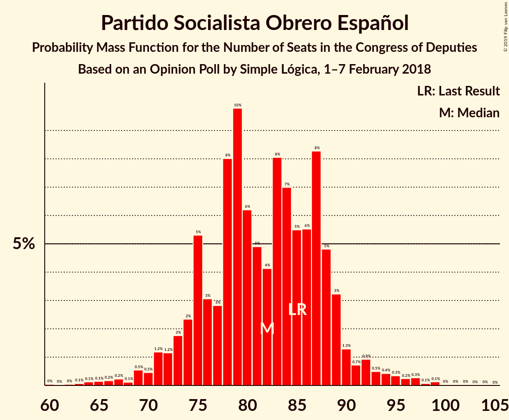
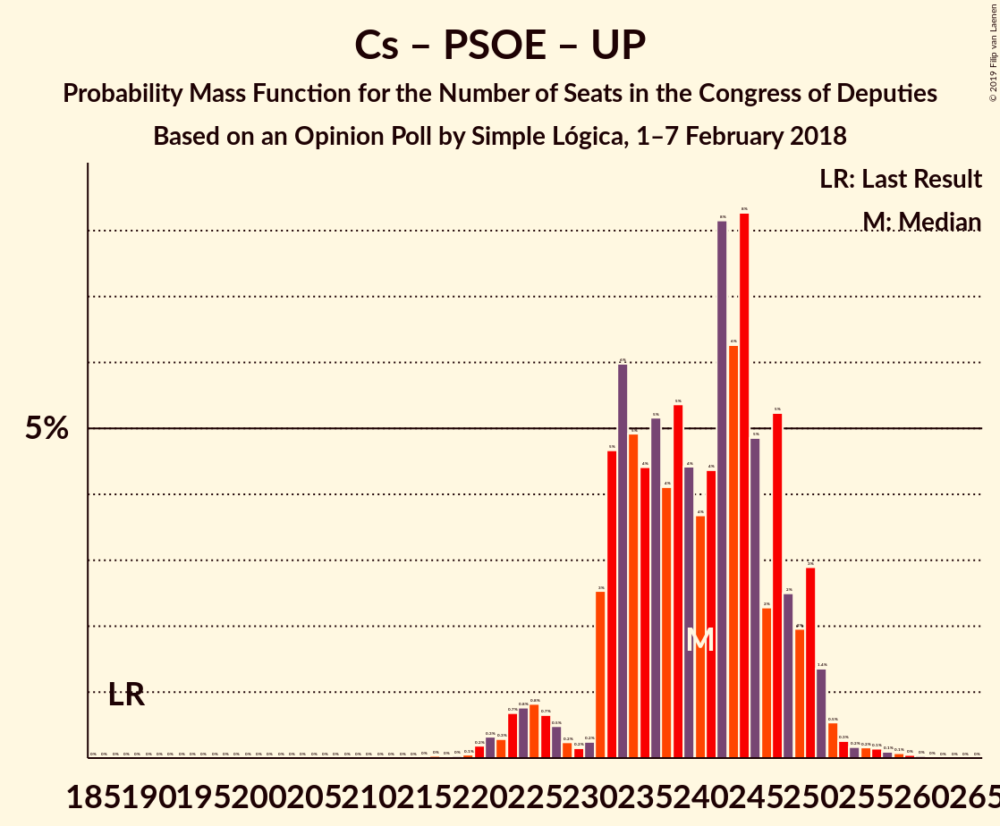

# Opinion Poll by Simple Lógica, 1–7 February 2018

<a href="#voting-intentions">Voting Intentions</a> | <a href="#seats">Seats</a> | <a href="#coalitions">Coalitions</a> | <a href="#technical-information">Technical Information</a>

## Voting Intentions

### Confidence Intervals

| Party | Last Result | Poll Result | 80% Confidence Interval | 90% Confidence Interval | 95% Confidence Interval | 99% Confidence Interval |
|:-----:|:-----------:|:-----------:|:-----------------------:|:-----------------------:|:-----------------------:|:-----------------------:|
| Ciudadanos–Partido de la Ciudadanía | 13.1% | 28.7% | 27.0–30.6% |26.5–31.1% |26.1–31.5% |25.3–32.4% |
| Partido Popular | 33.0% | 22.2% | 20.6–23.9% |20.1–24.3% |19.8–24.8% |19.0–25.6% |
| Partido Socialista Obrero Español | 22.6% | 21.4% | 19.9–23.1% |19.4–23.6% |19.0–24.0% |18.3–24.8% |
| Unidos Podemos | 21.2% | 17.0% | 15.6–18.5% |15.2–19.0% |14.9–19.4% |14.2–20.1% |

*Note:* The poll result column reflects the actual value used in the calculations. Published results may vary slightly, and in addition be rounded to fewer digits.

## Seats

### Confidence Intervals

| Party | Last Result | Median | 80% Confidence Interval | 90% Confidence Interval | 95% Confidence Interval | 99% Confidence Interval |
|:-----:|:-----------:|:------:|:-----------------------:|:-----------------------:|:-----------------------:|:-----------------------:|
| <a href="#ciudadanos–partido-de-la-ciudadanía">Ciudadanos–Partido de la Ciudadanía</a> | 32 | 109 | 100–117 |96–119 |94–120 |90–123 |
| <a href="#partido-popular">Partido Popular</a> | 137 | 83 | 77–91 |75–98 |74–99 |72–101 |
| <a href="#partido-socialista-obrero-español">Partido Socialista Obrero Español</a> | 85 | 82 | 75–88 |72–90 |71–92 |65–95 |
| <a href="#unidos-podemos">Unidos Podemos</a> | 71 | 50 | 40–59 |39–61 |39–64 |37–67 |

### Ciudadanos–Partido de la Ciudadanía

*For a full overview of the results for this party, see the [Ciudadanos–Partido de la Ciudadanía](party-ciudadanos–partidodelaciudadanía.html) page.*

| Number of Seats | Probability | Accumulated | Special Marks |
|:---------------:|:-----------:|:-----------:|:-------------:|
| 32 | 0% | 100% | Last Result |
| 33 | 0% | 100% |  |
| 34 | 0% | 100% |  |
| 35 | 0% | 100% |  |
| 36 | 0% | 100% |  |
| 37 | 0% | 100% |  |
| 38 | 0% | 100% |  |
| 39 | 0% | 100% |  |
| 40 | 0% | 100% |  |
| 41 | 0% | 100% |  |
| 42 | 0% | 100% |  |
| 43 | 0% | 100% |  |
| 44 | 0% | 100% |  |
| 45 | 0% | 100% |  |
| 46 | 0% | 100% |  |
| 47 | 0% | 100% |  |
| 48 | 0% | 100% |  |
| 49 | 0% | 100% |  |
| 50 | 0% | 100% |  |
| 51 | 0% | 100% |  |
| 52 | 0% | 100% |  |
| 53 | 0% | 100% |  |
| 54 | 0% | 100% |  |
| 55 | 0% | 100% |  |
| 56 | 0% | 100% |  |
| 57 | 0% | 100% |  |
| 58 | 0% | 100% |  |
| 59 | 0% | 100% |  |
| 60 | 0% | 100% |  |
| 61 | 0% | 100% |  |
| 62 | 0% | 100% |  |
| 63 | 0% | 100% |  |
| 64 | 0% | 100% |  |
| 65 | 0% | 100% |  |
| 66 | 0% | 100% |  |
| 67 | 0% | 100% |  |
| 68 | 0% | 100% |  |
| 69 | 0% | 100% |  |
| 70 | 0% | 100% |  |
| 71 | 0% | 100% |  |
| 72 | 0% | 100% |  |
| 73 | 0% | 100% |  |
| 74 | 0% | 100% |  |
| 75 | 0% | 100% |  |
| 76 | 0% | 100% |  |
| 77 | 0% | 100% |  |
| 78 | 0% | 100% |  |
| 79 | 0% | 100% |  |
| 80 | 0% | 100% |  |
| 81 | 0% | 100% |  |
| 82 | 0% | 100% |  |
| 83 | 0% | 100% |  |
| 84 | 0% | 99.9% |  |
| 85 | 0% | 99.9% |  |
| 86 | 0% | 99.9% |  |
| 87 | 0.1% | 99.8% |  |
| 88 | 0% | 99.7% |  |
| 89 | 0.2% | 99.7% |  |
| 90 | 0.2% | 99.5% |  |
| 91 | 0.7% | 99.3% |  |
| 92 | 0.3% | 98.6% |  |
| 93 | 0.6% | 98% |  |
| 94 | 1.1% | 98% |  |
| 95 | 0.7% | 97% |  |
| 96 | 1.0% | 96% |  |
| 97 | 2% | 95% |  |
| 98 | 1.5% | 93% |  |
| 99 | 2% | 92% |  |
| 100 | 2% | 90% |  |
| 101 | 2% | 88% |  |
| 102 | 3% | 86% |  |
| 103 | 4% | 83% |  |
| 104 | 5% | 79% |  |
| 105 | 5% | 74% |  |
| 106 | 5% | 70% |  |
| 107 | 4% | 64% |  |
| 108 | 8% | 60% |  |
| 109 | 8% | 52% | Median |
| 110 | 6% | 44% |  |
| 111 | 6% | 37% |  |
| 112 | 3% | 32% |  |
| 113 | 4% | 28% |  |
| 114 | 5% | 24% |  |
| 115 | 5% | 19% |  |
| 116 | 3% | 14% |  |
| 117 | 0.7% | 10% |  |
| 118 | 3% | 10% |  |
| 119 | 2% | 6% |  |
| 120 | 2% | 4% |  |
| 121 | 1.0% | 2% |  |
| 122 | 0.1% | 0.8% |  |
| 123 | 0.3% | 0.7% |  |
| 124 | 0.1% | 0.3% |  |
| 125 | 0.1% | 0.2% |  |
| 126 | 0% | 0.1% |  |
| 127 | 0% | 0.1% |  |
| 128 | 0% | 0.1% |  |
| 129 | 0% | 0% |  |

### Partido Popular

*For a full overview of the results for this party, see the [Partido Popular](party-partidopopular.html) page.*

| Number of Seats | Probability | Accumulated | Special Marks |
|:---------------:|:-----------:|:-----------:|:-------------:|
| 63 | 0% | 100% |  |
| 64 | 0% | 99.9% |  |
| 65 | 0% | 99.9% |  |
| 66 | 0% | 99.9% |  |
| 67 | 0.1% | 99.8% |  |
| 68 | 0.1% | 99.8% |  |
| 69 | 0.1% | 99.7% |  |
| 70 | 0.1% | 99.7% |  |
| 71 | 0.1% | 99.6% |  |
| 72 | 0.4% | 99.5% |  |
| 73 | 0.5% | 99.1% |  |
| 74 | 3% | 98.6% |  |
| 75 | 1.4% | 95% |  |
| 76 | 3% | 94% |  |
| 77 | 2% | 91% |  |
| 78 | 6% | 89% |  |
| 79 | 3% | 84% |  |
| 80 | 5% | 80% |  |
| 81 | 9% | 75% |  |
| 82 | 10% | 66% |  |
| 83 | 8% | 56% | Median |
| 84 | 5% | 48% |  |
| 85 | 2% | 43% |  |
| 86 | 6% | 41% |  |
| 87 | 4% | 35% |  |
| 88 | 4% | 31% |  |
| 89 | 6% | 27% |  |
| 90 | 9% | 21% |  |
| 91 | 5% | 12% |  |
| 92 | 0.1% | 7% |  |
| 93 | 0% | 7% |  |
| 94 | 0.1% | 7% |  |
| 95 | 0.2% | 7% |  |
| 96 | 0.2% | 7% |  |
| 97 | 2% | 7% |  |
| 98 | 1.1% | 5% |  |
| 99 | 3% | 4% |  |
| 100 | 0.7% | 1.3% |  |
| 101 | 0.1% | 0.6% |  |
| 102 | 0.1% | 0.5% |  |
| 103 | 0.1% | 0.3% |  |
| 104 | 0% | 0.2% |  |
| 105 | 0% | 0.2% |  |
| 106 | 0.1% | 0.2% |  |
| 107 | 0.1% | 0.1% |  |
| 108 | 0% | 0% |  |
| 109 | 0% | 0% |  |
| 110 | 0% | 0% |  |
| 111 | 0% | 0% |  |
| 112 | 0% | 0% |  |
| 113 | 0% | 0% |  |
| 114 | 0% | 0% |  |
| 115 | 0% | 0% |  |
| 116 | 0% | 0% |  |
| 117 | 0% | 0% |  |
| 118 | 0% | 0% |  |
| 119 | 0% | 0% |  |
| 120 | 0% | 0% |  |
| 121 | 0% | 0% |  |
| 122 | 0% | 0% |  |
| 123 | 0% | 0% |  |
| 124 | 0% | 0% |  |
| 125 | 0% | 0% |  |
| 126 | 0% | 0% |  |
| 127 | 0% | 0% |  |
| 128 | 0% | 0% |  |
| 129 | 0% | 0% |  |
| 130 | 0% | 0% |  |
| 131 | 0% | 0% |  |
| 132 | 0% | 0% |  |
| 133 | 0% | 0% |  |
| 134 | 0% | 0% |  |
| 135 | 0% | 0% |  |
| 136 | 0% | 0% |  |
| 137 | 0% | 0% | Last Result |

### Partido Socialista Obrero Español

*For a full overview of the results for this party, see the [Partido Socialista Obrero Español](party-partidosocialistaobreroespañol.html) page.*

| Number of Seats | Probability | Accumulated | Special Marks |
|:---------------:|:-----------:|:-----------:|:-------------:|
| 60 | 0% | 100% |  |
| 61 | 0% | 99.9% |  |
| 62 | 0% | 99.9% |  |
| 63 | 0.1% | 99.9% |  |
| 64 | 0.2% | 99.8% |  |
| 65 | 0.3% | 99.6% |  |
| 66 | 0.1% | 99.3% |  |
| 67 | 0.1% | 99.2% |  |
| 68 | 0% | 99.2% |  |
| 69 | 0.4% | 99.1% |  |
| 70 | 0.2% | 98.8% |  |
| 71 | 2% | 98.6% |  |
| 72 | 2% | 97% |  |
| 73 | 3% | 95% |  |
| 74 | 2% | 92% |  |
| 75 | 4% | 90% |  |
| 76 | 3% | 86% |  |
| 77 | 2% | 83% |  |
| 78 | 11% | 82% |  |
| 79 | 10% | 71% |  |
| 80 | 6% | 61% |  |
| 81 | 5% | 55% |  |
| 82 | 2% | 50% | Median |
| 83 | 7% | 48% |  |
| 84 | 7% | 41% |  |
| 85 | 5% | 34% | Last Result |
| 86 | 6% | 29% |  |
| 87 | 11% | 23% |  |
| 88 | 5% | 12% |  |
| 89 | 2% | 7% |  |
| 90 | 1.1% | 6% |  |
| 91 | 0.8% | 4% |  |
| 92 | 2% | 4% |  |
| 93 | 0.6% | 2% |  |
| 94 | 0.5% | 1.2% |  |
| 95 | 0.3% | 0.7% |  |
| 96 | 0.1% | 0.5% |  |
| 97 | 0.1% | 0.4% |  |
| 98 | 0% | 0.3% |  |
| 99 | 0.2% | 0.3% |  |
| 100 | 0% | 0.1% |  |
| 101 | 0% | 0.1% |  |
| 102 | 0% | 0% |  |

### Unidos Podemos

*For a full overview of the results for this party, see the [Unidos Podemos](party-unidospodemos.html) page.*

| Number of Seats | Probability | Accumulated | Special Marks |
|:---------------:|:-----------:|:-----------:|:-------------:|
| 34 | 0.1% | 100% |  |
| 35 | 0.2% | 99.9% |  |
| 36 | 0.2% | 99.7% |  |
| 37 | 0.2% | 99.5% |  |
| 38 | 0.2% | 99.3% |  |
| 39 | 8% | 99.1% |  |
| 40 | 3% | 91% |  |
| 41 | 2% | 88% |  |
| 42 | 4% | 86% |  |
| 43 | 1.4% | 82% |  |
| 44 | 4% | 81% |  |
| 45 | 7% | 77% |  |
| 46 | 5% | 70% |  |
| 47 | 6% | 65% |  |
| 48 | 5% | 59% |  |
| 49 | 1.1% | 53% |  |
| 50 | 4% | 52% | Median |
| 51 | 3% | 48% |  |
| 52 | 9% | 45% |  |
| 53 | 4% | 36% |  |
| 54 | 5% | 33% |  |
| 55 | 5% | 28% |  |
| 56 | 6% | 23% |  |
| 57 | 2% | 17% |  |
| 58 | 3% | 15% |  |
| 59 | 2% | 12% |  |
| 60 | 3% | 10% |  |
| 61 | 3% | 7% |  |
| 62 | 0.7% | 4% |  |
| 63 | 0.9% | 3% |  |
| 64 | 1.0% | 3% |  |
| 65 | 0.4% | 2% |  |
| 66 | 0.6% | 1.2% |  |
| 67 | 0.2% | 0.6% |  |
| 68 | 0.2% | 0.4% |  |
| 69 | 0.1% | 0.3% |  |
| 70 | 0.1% | 0.2% |  |
| 71 | 0% | 0.1% | Last Result |
| 72 | 0% | 0% |  |

## Coalitions

### Confidence Intervals

| Coalition | Last Result | Median | Majority? | 80% Confidence Interval | 90% Confidence Interval | 95% Confidence Interval | 99% Confidence Interval |
|:---------:|:-----------:|:------:|:---------:|:-----------------------:|:-----------------------:|:-----------------------:|:-----------------------:|
| Ciudadanos–Partido de la Ciudadanía – Partido Popular – Partido Socialista Obrero Español | 254 | 275 | 100% | 265–284 | 263–285 | 261–285 | 258–286 |
| Ciudadanos–Partido de la Ciudadanía – Partido Socialista Obrero Español – Unidos Podemos | 188 | 241 | 100% | 233–247 | 227–250 | 225–251 | 223–253 |
| Ciudadanos–Partido de la Ciudadanía – Partido Popular | 169 | 193 | 99.2% | 183–202 | 181–205 | 178–206 | 174–209 |
| Ciudadanos–Partido de la Ciudadanía – Partido Socialista Obrero Español | 117 | 190 | 97% | 181–199 | 178–201 | 175–203 | 169–207 |
| Partido Popular – Partido Socialista Obrero Español | 222 | 166 | 15% | 157–177 | 155–179 | 153–183 | 148–187 |
| Partido Socialista Obrero Español – Unidos Podemos | 156 | 132 | 0% | 122–142 | 118–144 | 117–147 | 114–151 |
| Partido Popular | 137 | 83 | 0% | 77–91 | 75–98 | 74–99 | 72–101 |
| Partido Socialista Obrero Español | 85 | 82 | 0% | 75–88 | 72–90 | 71–92 | 65–95 |

### Ciudadanos–Partido de la Ciudadanía – Partido Popular – Partido Socialista Obrero Español

| Number of Seats | Probability | Accumulated | Special Marks |
|:---------------:|:-----------:|:-----------:|:-------------:|
| 253 | 0% | 100% |  |
| 254 | 0.1% | 99.9% | Last Result |
| 255 | 0.1% | 99.9% |  |
| 256 | 0.1% | 99.8% |  |
| 257 | 0.1% | 99.7% |  |
| 258 | 0.6% | 99.5% |  |
| 259 | 0.3% | 98.9% |  |
| 260 | 0.5% | 98.6% |  |
| 261 | 1.0% | 98% |  |
| 262 | 0.8% | 97% |  |
| 263 | 2% | 96% |  |
| 264 | 4% | 94% |  |
| 265 | 2% | 91% |  |
| 266 | 2% | 89% |  |
| 267 | 4% | 87% |  |
| 268 | 5% | 83% |  |
| 269 | 4% | 79% |  |
| 270 | 4% | 75% |  |
| 271 | 5% | 71% |  |
| 272 | 5% | 66% |  |
| 273 | 7% | 61% |  |
| 274 | 3% | 53% | Median |
| 275 | 3% | 50% |  |
| 276 | 3% | 47% |  |
| 277 | 6% | 44% |  |
| 278 | 6% | 38% |  |
| 279 | 2% | 32% |  |
| 280 | 7% | 29% |  |
| 281 | 6% | 22% |  |
| 282 | 2% | 17% |  |
| 283 | 4% | 15% |  |
| 284 | 1.5% | 10% |  |
| 285 | 7% | 9% |  |
| 286 | 2% | 2% |  |
| 287 | 0.2% | 0.4% |  |
| 288 | 0.1% | 0.2% |  |
| 289 | 0% | 0.1% |  |
| 290 | 0% | 0% |  |

### Ciudadanos–Partido de la Ciudadanía – Partido Socialista Obrero Español – Unidos Podemos

| Number of Seats | Probability | Accumulated | Special Marks |
|:---------------:|:-----------:|:-----------:|:-------------:|
| 188 | 0% | 100% | Last Result |
| 189 | 0% | 100% |  |
| 190 | 0% | 100% |  |
| 191 | 0% | 100% |  |
| 192 | 0% | 100% |  |
| 193 | 0% | 100% |  |
| 194 | 0% | 100% |  |
| 195 | 0% | 100% |  |
| 196 | 0% | 100% |  |
| 197 | 0% | 100% |  |
| 198 | 0% | 100% |  |
| 199 | 0% | 100% |  |
| 200 | 0% | 100% |  |
| 201 | 0% | 100% |  |
| 202 | 0% | 100% |  |
| 203 | 0% | 100% |  |
| 204 | 0% | 100% |  |
| 205 | 0% | 100% |  |
| 206 | 0% | 100% |  |
| 207 | 0% | 100% |  |
| 208 | 0% | 100% |  |
| 209 | 0% | 100% |  |
| 210 | 0% | 100% |  |
| 211 | 0% | 100% |  |
| 212 | 0% | 100% |  |
| 213 | 0% | 100% |  |
| 214 | 0% | 100% |  |
| 215 | 0% | 100% |  |
| 216 | 0% | 100% |  |
| 217 | 0% | 99.9% |  |
| 218 | 0% | 99.9% |  |
| 219 | 0% | 99.8% |  |
| 220 | 0% | 99.8% |  |
| 221 | 0.1% | 99.8% |  |
| 222 | 0.2% | 99.7% |  |
| 223 | 0.4% | 99.5% |  |
| 224 | 1.2% | 99.1% |  |
| 225 | 2% | 98% |  |
| 226 | 1.4% | 96% |  |
| 227 | 1.4% | 95% |  |
| 228 | 0.5% | 94% |  |
| 229 | 0.2% | 93% |  |
| 230 | 0.2% | 93% |  |
| 231 | 0.1% | 93% |  |
| 232 | 0.1% | 93% |  |
| 233 | 3% | 92% |  |
| 234 | 8% | 89% |  |
| 235 | 7% | 81% |  |
| 236 | 5% | 75% |  |
| 237 | 4% | 70% |  |
| 238 | 7% | 66% |  |
| 239 | 2% | 59% |  |
| 240 | 3% | 57% |  |
| 241 | 5% | 54% | Median |
| 242 | 10% | 49% |  |
| 243 | 8% | 38% |  |
| 244 | 7% | 30% |  |
| 245 | 6% | 23% |  |
| 246 | 2% | 17% |  |
| 247 | 6% | 16% |  |
| 248 | 2% | 10% |  |
| 249 | 2% | 8% |  |
| 250 | 2% | 5% |  |
| 251 | 2% | 4% |  |
| 252 | 0.5% | 1.4% |  |
| 253 | 0.4% | 0.9% |  |
| 254 | 0.1% | 0.5% |  |
| 255 | 0.1% | 0.4% |  |
| 256 | 0.1% | 0.3% |  |
| 257 | 0.1% | 0.3% |  |
| 258 | 0.1% | 0.2% |  |
| 259 | 0% | 0.2% |  |
| 260 | 0% | 0.1% |  |
| 261 | 0% | 0.1% |  |
| 262 | 0% | 0.1% |  |
| 263 | 0% | 0% |  |

### Ciudadanos–Partido de la Ciudadanía – Partido Popular

| Number of Seats | Probability | Accumulated | Special Marks |
|:---------------:|:-----------:|:-----------:|:-------------:|
| 169 | 0% | 100% | Last Result |
| 170 | 0% | 100% |  |
| 171 | 0.1% | 99.9% |  |
| 172 | 0% | 99.8% |  |
| 173 | 0.1% | 99.8% |  |
| 174 | 0.2% | 99.7% |  |
| 175 | 0.3% | 99.5% |  |
| 176 | 0.2% | 99.2% | Majority |
| 177 | 0.9% | 99.0% |  |
| 178 | 0.7% | 98% |  |
| 179 | 0.8% | 97% |  |
| 180 | 1.0% | 97% |  |
| 181 | 1.2% | 96% |  |
| 182 | 1.4% | 95% |  |
| 183 | 4% | 93% |  |
| 184 | 4% | 90% |  |
| 185 | 5% | 86% |  |
| 186 | 4% | 81% |  |
| 187 | 5% | 77% |  |
| 188 | 2% | 72% |  |
| 189 | 2% | 70% |  |
| 190 | 6% | 68% |  |
| 191 | 5% | 62% |  |
| 192 | 3% | 56% | Median |
| 193 | 7% | 53% |  |
| 194 | 3% | 47% |  |
| 195 | 3% | 43% |  |
| 196 | 4% | 40% |  |
| 197 | 5% | 36% |  |
| 198 | 6% | 31% |  |
| 199 | 6% | 25% |  |
| 200 | 5% | 19% |  |
| 201 | 2% | 14% |  |
| 202 | 5% | 13% |  |
| 203 | 2% | 8% |  |
| 204 | 1.2% | 6% |  |
| 205 | 2% | 5% |  |
| 206 | 0.7% | 3% |  |
| 207 | 1.1% | 2% |  |
| 208 | 0.6% | 1.2% |  |
| 209 | 0.2% | 0.6% |  |
| 210 | 0.1% | 0.5% |  |
| 211 | 0.1% | 0.4% |  |
| 212 | 0.1% | 0.3% |  |
| 213 | 0.1% | 0.2% |  |
| 214 | 0.1% | 0.2% |  |
| 215 | 0.1% | 0.1% |  |
| 216 | 0% | 0% |  |

### Ciudadanos–Partido de la Ciudadanía – Partido Socialista Obrero Español

| Number of Seats | Probability | Accumulated | Special Marks |
|:---------------:|:-----------:|:-----------:|:-------------:|
| 117 | 0% | 100% | Last Result |
| 118 | 0% | 100% |  |
| 119 | 0% | 100% |  |
| 120 | 0% | 100% |  |
| 121 | 0% | 100% |  |
| 122 | 0% | 100% |  |
| 123 | 0% | 100% |  |
| 124 | 0% | 100% |  |
| 125 | 0% | 100% |  |
| 126 | 0% | 100% |  |
| 127 | 0% | 100% |  |
| 128 | 0% | 100% |  |
| 129 | 0% | 100% |  |
| 130 | 0% | 100% |  |
| 131 | 0% | 100% |  |
| 132 | 0% | 100% |  |
| 133 | 0% | 100% |  |
| 134 | 0% | 100% |  |
| 135 | 0% | 100% |  |
| 136 | 0% | 100% |  |
| 137 | 0% | 100% |  |
| 138 | 0% | 100% |  |
| 139 | 0% | 100% |  |
| 140 | 0% | 100% |  |
| 141 | 0% | 100% |  |
| 142 | 0% | 100% |  |
| 143 | 0% | 100% |  |
| 144 | 0% | 100% |  |
| 145 | 0% | 100% |  |
| 146 | 0% | 100% |  |
| 147 | 0% | 100% |  |
| 148 | 0% | 100% |  |
| 149 | 0% | 100% |  |
| 150 | 0% | 100% |  |
| 151 | 0% | 100% |  |
| 152 | 0% | 100% |  |
| 153 | 0% | 100% |  |
| 154 | 0% | 100% |  |
| 155 | 0% | 100% |  |
| 156 | 0% | 100% |  |
| 157 | 0% | 100% |  |
| 158 | 0% | 100% |  |
| 159 | 0% | 100% |  |
| 160 | 0% | 100% |  |
| 161 | 0% | 100% |  |
| 162 | 0% | 100% |  |
| 163 | 0% | 100% |  |
| 164 | 0% | 100% |  |
| 165 | 0% | 100% |  |
| 166 | 0% | 99.9% |  |
| 167 | 0% | 99.9% |  |
| 168 | 0.1% | 99.9% |  |
| 169 | 0.4% | 99.7% |  |
| 170 | 0.2% | 99.4% |  |
| 171 | 0.1% | 99.2% |  |
| 172 | 0.1% | 99.0% |  |
| 173 | 0.2% | 98.9% |  |
| 174 | 0.6% | 98.7% |  |
| 175 | 1.3% | 98% |  |
| 176 | 0.8% | 97% | Majority |
| 177 | 0.5% | 96% |  |
| 178 | 1.1% | 96% |  |
| 179 | 0.6% | 94% |  |
| 180 | 2% | 94% |  |
| 181 | 2% | 92% |  |
| 182 | 2% | 89% |  |
| 183 | 4% | 87% |  |
| 184 | 3% | 84% |  |
| 185 | 5% | 81% |  |
| 186 | 4% | 76% |  |
| 187 | 8% | 72% |  |
| 188 | 2% | 63% |  |
| 189 | 6% | 61% |  |
| 190 | 6% | 56% |  |
| 191 | 5% | 50% | Median |
| 192 | 9% | 45% |  |
| 193 | 5% | 37% |  |
| 194 | 3% | 31% |  |
| 195 | 6% | 29% |  |
| 196 | 5% | 23% |  |
| 197 | 7% | 18% |  |
| 198 | 1.4% | 12% |  |
| 199 | 4% | 10% |  |
| 200 | 2% | 7% |  |
| 201 | 1.3% | 5% |  |
| 202 | 1.2% | 4% |  |
| 203 | 0.5% | 3% |  |
| 204 | 0.7% | 2% |  |
| 205 | 0.7% | 1.5% |  |
| 206 | 0.2% | 0.8% |  |
| 207 | 0.3% | 0.5% |  |
| 208 | 0.1% | 0.2% |  |
| 209 | 0% | 0.1% |  |
| 210 | 0% | 0.1% |  |
| 211 | 0% | 0.1% |  |
| 212 | 0% | 0% |  |

### Partido Popular – Partido Socialista Obrero Español

| Number of Seats | Probability | Accumulated | Special Marks |
|:---------------:|:-----------:|:-----------:|:-------------:|
| 145 | 0% | 100% |  |
| 146 | 0% | 99.9% |  |
| 147 | 0.2% | 99.9% |  |
| 148 | 0.3% | 99.7% |  |
| 149 | 0.2% | 99.4% |  |
| 150 | 0.2% | 99.2% |  |
| 151 | 0.6% | 99.0% |  |
| 152 | 0.3% | 98% |  |
| 153 | 1.3% | 98% |  |
| 154 | 0.6% | 97% |  |
| 155 | 3% | 96% |  |
| 156 | 2% | 93% |  |
| 157 | 3% | 91% |  |
| 158 | 3% | 89% |  |
| 159 | 6% | 86% |  |
| 160 | 6% | 80% |  |
| 161 | 3% | 74% |  |
| 162 | 10% | 71% |  |
| 163 | 6% | 61% |  |
| 164 | 1.5% | 55% |  |
| 165 | 2% | 53% | Median |
| 166 | 3% | 51% |  |
| 167 | 7% | 49% |  |
| 168 | 7% | 41% |  |
| 169 | 3% | 34% |  |
| 170 | 5% | 31% |  |
| 171 | 3% | 26% |  |
| 172 | 3% | 23% |  |
| 173 | 0.6% | 19% |  |
| 174 | 2% | 19% |  |
| 175 | 3% | 17% |  |
| 176 | 4% | 15% | Majority |
| 177 | 3% | 11% |  |
| 178 | 2% | 8% |  |
| 179 | 2% | 6% |  |
| 180 | 0.3% | 4% |  |
| 181 | 0.5% | 4% |  |
| 182 | 0.9% | 4% |  |
| 183 | 1.4% | 3% |  |
| 184 | 0.4% | 1.4% |  |
| 185 | 0.2% | 1.0% |  |
| 186 | 0.3% | 0.8% |  |
| 187 | 0.2% | 0.6% |  |
| 188 | 0.1% | 0.4% |  |
| 189 | 0.1% | 0.2% |  |
| 190 | 0% | 0.1% |  |
| 191 | 0.1% | 0.1% |  |
| 192 | 0% | 0% |  |
| 193 | 0% | 0% |  |
| 194 | 0% | 0% |  |
| 195 | 0% | 0% |  |
| 196 | 0% | 0% |  |
| 197 | 0% | 0% |  |
| 198 | 0% | 0% |  |
| 199 | 0% | 0% |  |
| 200 | 0% | 0% |  |
| 201 | 0% | 0% |  |
| 202 | 0% | 0% |  |
| 203 | 0% | 0% |  |
| 204 | 0% | 0% |  |
| 205 | 0% | 0% |  |
| 206 | 0% | 0% |  |
| 207 | 0% | 0% |  |
| 208 | 0% | 0% |  |
| 209 | 0% | 0% |  |
| 210 | 0% | 0% |  |
| 211 | 0% | 0% |  |
| 212 | 0% | 0% |  |
| 213 | 0% | 0% |  |
| 214 | 0% | 0% |  |
| 215 | 0% | 0% |  |
| 216 | 0% | 0% |  |
| 217 | 0% | 0% |  |
| 218 | 0% | 0% |  |
| 219 | 0% | 0% |  |
| 220 | 0% | 0% |  |
| 221 | 0% | 0% |  |
| 222 | 0% | 0% | Last Result |

### Partido Socialista Obrero Español – Unidos Podemos

| Number of Seats | Probability | Accumulated | Special Marks |
|:---------------:|:-----------:|:-----------:|:-------------:|
| 108 | 0% | 100% |  |
| 109 | 0.1% | 99.9% |  |
| 110 | 0.1% | 99.9% |  |
| 111 | 0.1% | 99.8% |  |
| 112 | 0.1% | 99.7% |  |
| 113 | 0.1% | 99.6% |  |
| 114 | 0% | 99.5% |  |
| 115 | 0.3% | 99.5% |  |
| 116 | 1.3% | 99.2% |  |
| 117 | 0.7% | 98% |  |
| 118 | 2% | 97% |  |
| 119 | 0.7% | 95% |  |
| 120 | 2% | 94% |  |
| 121 | 3% | 93% |  |
| 122 | 3% | 90% |  |
| 123 | 1.4% | 87% |  |
| 124 | 4% | 86% |  |
| 125 | 6% | 82% |  |
| 126 | 5% | 76% |  |
| 127 | 6% | 71% |  |
| 128 | 3% | 65% |  |
| 129 | 4% | 62% |  |
| 130 | 3% | 59% |  |
| 131 | 3% | 55% |  |
| 132 | 7% | 52% | Median |
| 133 | 2% | 45% |  |
| 134 | 9% | 42% |  |
| 135 | 3% | 34% |  |
| 136 | 2% | 31% |  |
| 137 | 1.1% | 29% |  |
| 138 | 6% | 28% |  |
| 139 | 5% | 22% |  |
| 140 | 4% | 17% |  |
| 141 | 3% | 13% |  |
| 142 | 3% | 10% |  |
| 143 | 1.4% | 7% |  |
| 144 | 1.0% | 5% |  |
| 145 | 1.2% | 4% |  |
| 146 | 0.6% | 3% |  |
| 147 | 0.7% | 3% |  |
| 148 | 0.8% | 2% |  |
| 149 | 0.2% | 1.0% |  |
| 150 | 0.3% | 0.8% |  |
| 151 | 0.2% | 0.5% |  |
| 152 | 0.1% | 0.3% |  |
| 153 | 0% | 0.2% |  |
| 154 | 0.1% | 0.2% |  |
| 155 | 0% | 0.1% |  |
| 156 | 0% | 0% | Last Result |

### Partido Popular

| Number of Seats | Probability | Accumulated | Special Marks |
|:---------------:|:-----------:|:-----------:|:-------------:|
| 63 | 0% | 100% |  |
| 64 | 0% | 99.9% |  |
| 65 | 0% | 99.9% |  |
| 66 | 0% | 99.9% |  |
| 67 | 0.1% | 99.8% |  |
| 68 | 0.1% | 99.8% |  |
| 69 | 0.1% | 99.7% |  |
| 70 | 0.1% | 99.7% |  |
| 71 | 0.1% | 99.6% |  |
| 72 | 0.4% | 99.5% |  |
| 73 | 0.5% | 99.1% |  |
| 74 | 3% | 98.6% |  |
| 75 | 1.4% | 95% |  |
| 76 | 3% | 94% |  |
| 77 | 2% | 91% |  |
| 78 | 6% | 89% |  |
| 79 | 3% | 84% |  |
| 80 | 5% | 80% |  |
| 81 | 9% | 75% |  |
| 82 | 10% | 66% |  |
| 83 | 8% | 56% | Median |
| 84 | 5% | 48% |  |
| 85 | 2% | 43% |  |
| 86 | 6% | 41% |  |
| 87 | 4% | 35% |  |
| 88 | 4% | 31% |  |
| 89 | 6% | 27% |  |
| 90 | 9% | 21% |  |
| 91 | 5% | 12% |  |
| 92 | 0.1% | 7% |  |
| 93 | 0% | 7% |  |
| 94 | 0.1% | 7% |  |
| 95 | 0.2% | 7% |  |
| 96 | 0.2% | 7% |  |
| 97 | 2% | 7% |  |
| 98 | 1.1% | 5% |  |
| 99 | 3% | 4% |  |
| 100 | 0.7% | 1.3% |  |
| 101 | 0.1% | 0.6% |  |
| 102 | 0.1% | 0.5% |  |
| 103 | 0.1% | 0.3% |  |
| 104 | 0% | 0.2% |  |
| 105 | 0% | 0.2% |  |
| 106 | 0.1% | 0.2% |  |
| 107 | 0.1% | 0.1% |  |
| 108 | 0% | 0% |  |
| 109 | 0% | 0% |  |
| 110 | 0% | 0% |  |
| 111 | 0% | 0% |  |
| 112 | 0% | 0% |  |
| 113 | 0% | 0% |  |
| 114 | 0% | 0% |  |
| 115 | 0% | 0% |  |
| 116 | 0% | 0% |  |
| 117 | 0% | 0% |  |
| 118 | 0% | 0% |  |
| 119 | 0% | 0% |  |
| 120 | 0% | 0% |  |
| 121 | 0% | 0% |  |
| 122 | 0% | 0% |  |
| 123 | 0% | 0% |  |
| 124 | 0% | 0% |  |
| 125 | 0% | 0% |  |
| 126 | 0% | 0% |  |
| 127 | 0% | 0% |  |
| 128 | 0% | 0% |  |
| 129 | 0% | 0% |  |
| 130 | 0% | 0% |  |
| 131 | 0% | 0% |  |
| 132 | 0% | 0% |  |
| 133 | 0% | 0% |  |
| 134 | 0% | 0% |  |
| 135 | 0% | 0% |  |
| 136 | 0% | 0% |  |
| 137 | 0% | 0% | Last Result |

### Partido Socialista Obrero Español

| Number of Seats | Probability | Accumulated | Special Marks |
|:---------------:|:-----------:|:-----------:|:-------------:|
| 60 | 0% | 100% |  |
| 61 | 0% | 99.9% |  |
| 62 | 0% | 99.9% |  |
| 63 | 0.1% | 99.9% |  |
| 64 | 0.2% | 99.8% |  |
| 65 | 0.3% | 99.6% |  |
| 66 | 0.1% | 99.3% |  |
| 67 | 0.1% | 99.2% |  |
| 68 | 0% | 99.2% |  |
| 69 | 0.4% | 99.1% |  |
| 70 | 0.2% | 98.8% |  |
| 71 | 2% | 98.6% |  |
| 72 | 2% | 97% |  |
| 73 | 3% | 95% |  |
| 74 | 2% | 92% |  |
| 75 | 4% | 90% |  |
| 76 | 3% | 86% |  |
| 77 | 2% | 83% |  |
| 78 | 11% | 82% |  |
| 79 | 10% | 71% |  |
| 80 | 6% | 61% |  |
| 81 | 5% | 55% |  |
| 82 | 2% | 50% | Median |
| 83 | 7% | 48% |  |
| 84 | 7% | 41% |  |
| 85 | 5% | 34% | Last Result |
| 86 | 6% | 29% |  |
| 87 | 11% | 23% |  |
| 88 | 5% | 12% |  |
| 89 | 2% | 7% |  |
| 90 | 1.1% | 6% |  |
| 91 | 0.8% | 4% |  |
| 92 | 2% | 4% |  |
| 93 | 0.6% | 2% |  |
| 94 | 0.5% | 1.2% |  |
| 95 | 0.3% | 0.7% |  |
| 96 | 0.1% | 0.5% |  |
| 97 | 0.1% | 0.4% |  |
| 98 | 0% | 0.3% |  |
| 99 | 0.2% | 0.3% |  |
| 100 | 0% | 0.1% |  |
| 101 | 0% | 0.1% |  |
| 102 | 0% | 0% |  |

## Technical Information

### Opinion Poll

+ **Polling firm:** Simple Lógica
+ **Commissioner(s):** —
+ **Fieldwork period:** 1–7 February 2018

### Calculations

+ **Sample size:** 1065
+ **Simulations done:** 32,768
+ **Error estimate:** 1.48%

