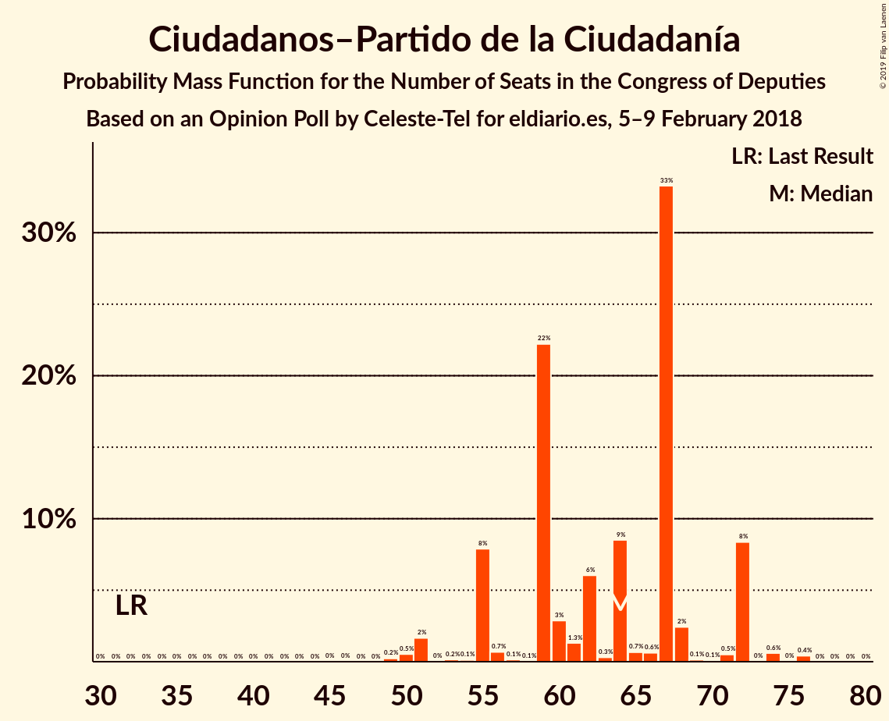
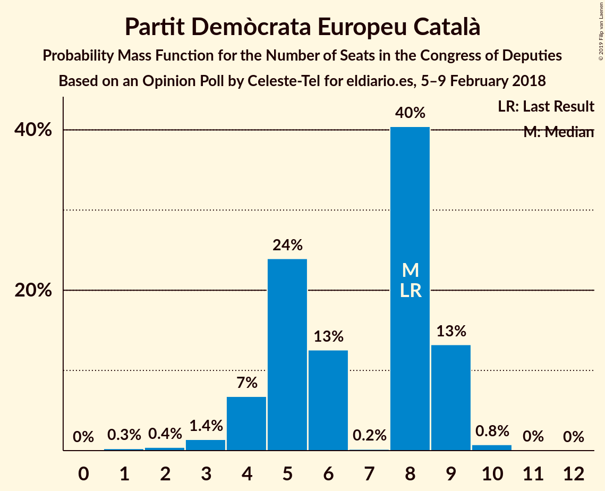
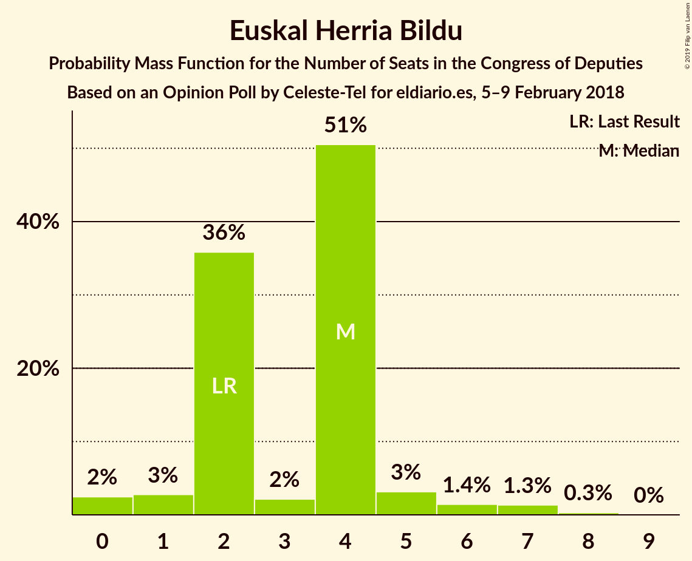

# Opinion Poll by Celeste-Tel for eldiario.es, 5–9 February 2018

<a href="#voting-intentions">Voting Intentions</a> | <a href="#seats">Seats</a> | <a href="#coalitions">Coalitions</a> | <a href="#technical-information">Technical Information</a>

## Voting Intentions

### Confidence Intervals

| Party | Last Result | Poll Result | 80% Confidence Interval | 90% Confidence Interval | 95% Confidence Interval | 99% Confidence Interval |
|:-----:|:-----------:|:-----------:|:-----------------------:|:-----------------------:|:-----------------------:|:-----------------------:|
| Partido Popular | 33.0% | 28.9% | 27.2–30.7% |26.7–31.2% |26.3–31.7% |25.5–32.5% |
| Partido Socialista Obrero Español | 22.6% | 25.5% | 23.9–27.3% |23.4–27.8% |23.0–28.2% |22.3–29.1% |
| Ciudadanos–Partido de la Ciudadanía | 13.1% | 19.3% | 17.8–20.9% |17.4–21.3% |17.0–21.7% |16.4–22.5% |
| Unidos Podemos | 21.2% | 16.5% | 15.2–18.1% |14.8–18.5% |14.5–18.9% |13.8–19.6% |
| Esquerra Republicana de Catalunya–Catalunya Sí | 2.7% | 2.7% | 2.2–3.5% |2.0–3.7% |1.9–3.9% |1.7–4.3% |
| Partit Demòcrata Europeu Català | 2.0% | 1.6% | 1.2–2.3% |1.1–2.4% |1.0–2.6% |0.9–2.9% |
| Euzko Alderdi Jeltzalea/Partido Nacionalista Vasco | 1.2% | 1.3% | 0.9–1.8% |0.8–2.0% |0.8–2.1% |0.6–2.4% |
| Partido Animalista Contra el Maltrato Animal | 1.2% | 1.2% | 0.9–1.7% |0.8–1.9% |0.7–2.0% |0.6–2.3% |
| Euskal Herria Bildu | 0.8% | 0.9% | 0.6–1.4% |0.5–1.5% |0.5–1.7% |0.4–1.9% |
| Coalición Canaria–Partido Nacionalista Canario | 0.3% | 0.3% | 0.2–0.6% |0.1–0.7% |0.1–0.8% |0.1–1.0% |
| Bloque Nacionalista Galego–Nós Candidatura Galega | 0.2% | 0.2% | 0.1–0.5% |0.1–0.6% |0.0–0.7% |0.0–0.9% |

*Note:* The poll result column reflects the actual value used in the calculations. Published results may vary slightly, and in addition be rounded to fewer digits.

## Seats

### Confidence Intervals

| Party | Last Result | Median | 80% Confidence Interval | 90% Confidence Interval | 95% Confidence Interval | 99% Confidence Interval |
|:-----:|:-----------:|:------:|:-----------------------:|:-----------------------:|:-----------------------:|:-----------------------:|
| <a href="#partido-popular">Partido Popular</a> | 137 | 133 | 117–133 |117–136 |106–136 |101–136 |
| <a href="#partido-socialista-obrero-español">Partido Socialista Obrero Español</a> | 85 | 80 | 80–98 |80–98 |80–110 |80–118 |
| <a href="#ciudadanos–partido-de-la-ciudadanía">Ciudadanos–Partido de la Ciudadanía</a> | 32 | 67 | 62–67 |47–67 |47–67 |47–67 |
| <a href="#unidos-podemos">Unidos Podemos</a> | 71 | 38 | 36–38 |36–39 |36–39 |34–39 |
| <a href="#esquerra-republicana-de-catalunya–catalunya-sí">Esquerra Republicana de Catalunya–Catalunya Sí</a> | 9 | 13 | 11–13 |10–13 |10–14 |10–14 |
| <a href="#partit-demòcrata-europeu-català">Partit Demòcrata Europeu Català</a> | 8 | 5 | 5–12 |5–12 |5–12 |5–12 |
| <a href="#euzko-alderdi-jeltzalea/partido-nacionalista-vasco">Euzko Alderdi Jeltzalea/Partido Nacionalista Vasco</a> | 5 | 7 | 7 |3–7 |3–7 |3–8 |
| <a href="#partido-animalista-contra-el-maltrato-animal">Partido Animalista Contra el Maltrato Animal</a> | 0 | 0 | 0 |0 |0 |0 |
| <a href="#euskal-herria-bildu">Euskal Herria Bildu</a> | 2 | 5 | 5–6 |5–7 |5–7 |4–7 |
| <a href="#coalición-canaria–partido-nacionalista-canario">Coalición Canaria–Partido Nacionalista Canario</a> | 1 | 0 | 0 |0–3 |0–3 |0–3 |
| <a href="#bloque-nacionalista-galego–nós-candidatura-galega">Bloque Nacionalista Galego–Nós Candidatura Galega</a> | 0 | 2 | 1–2 |0–2 |0–2 |0–2 |

### Partido Popular

*For a full overview of the results for this party, see the [Partido Popular](party-partidopopular.html) page.*

| Number of Seats | Probability | Accumulated | Special Marks |
|:---------------:|:-----------:|:-----------:|:-------------:|
| 101 | 2% | 100% |  |
| 102 | 0% | 98% |  |
| 103 | 0% | 98% |  |
| 104 | 0% | 98% |  |
| 105 | 0% | 98% |  |
| 106 | 2% | 98% |  |
| 107 | 0% | 96% |  |
| 108 | 0% | 96% |  |
| 109 | 0% | 96% |  |
| 110 | 0% | 96% |  |
| 111 | 0% | 96% |  |
| 112 | 0% | 96% |  |
| 113 | 0% | 96% |  |
| 114 | 0% | 96% |  |
| 115 | 0% | 96% |  |
| 116 | 0% | 96% |  |
| 117 | 20% | 96% |  |
| 118 | 0% | 76% |  |
| 119 | 0% | 76% |  |
| 120 | 0% | 76% |  |
| 121 | 0% | 76% |  |
| 122 | 0% | 76% |  |
| 123 | 0% | 76% |  |
| 124 | 0% | 76% |  |
| 125 | 0% | 76% |  |
| 126 | 0% | 76% |  |
| 127 | 0% | 76% |  |
| 128 | 0% | 76% |  |
| 129 | 0% | 76% |  |
| 130 | 0% | 76% |  |
| 131 | 0% | 76% |  |
| 132 | 0% | 76% |  |
| 133 | 70% | 76% | Median |
| 134 | 0% | 5% |  |
| 135 | 0% | 5% |  |
| 136 | 5% | 5% |  |
| 137 | 0% | 0% | Last Result |

### Partido Socialista Obrero Español

*For a full overview of the results for this party, see the [Partido Socialista Obrero Español](party-partidosocialistaobreroespañol.html) page.*

| Number of Seats | Probability | Accumulated | Special Marks |
|:---------------:|:-----------:|:-----------:|:-------------:|
| 80 | 70% | 100% | Median |
| 81 | 0% | 30% |  |
| 82 | 0% | 30% |  |
| 83 | 0% | 30% |  |
| 84 | 0% | 30% |  |
| 85 | 0% | 30% | Last Result |
| 86 | 0% | 30% |  |
| 87 | 0% | 30% |  |
| 88 | 0% | 30% |  |
| 89 | 0% | 30% |  |
| 90 | 0% | 30% |  |
| 91 | 0% | 30% |  |
| 92 | 0% | 30% |  |
| 93 | 0% | 29% |  |
| 94 | 0% | 29% |  |
| 95 | 0% | 29% |  |
| 96 | 0% | 29% |  |
| 97 | 5% | 29% |  |
| 98 | 20% | 24% |  |
| 99 | 0% | 4% |  |
| 100 | 0% | 4% |  |
| 101 | 0% | 4% |  |
| 102 | 0% | 4% |  |
| 103 | 0% | 4% |  |
| 104 | 0% | 4% |  |
| 105 | 0% | 4% |  |
| 106 | 0% | 4% |  |
| 107 | 0% | 4% |  |
| 108 | 0% | 4% |  |
| 109 | 0% | 4% |  |
| 110 | 2% | 4% |  |
| 111 | 0% | 2% |  |
| 112 | 0% | 2% |  |
| 113 | 0% | 2% |  |
| 114 | 0% | 2% |  |
| 115 | 0% | 2% |  |
| 116 | 0% | 2% |  |
| 117 | 0% | 2% |  |
| 118 | 2% | 2% |  |
| 119 | 0% | 0% |  |

### Ciudadanos–Partido de la Ciudadanía

*For a full overview of the results for this party, see the [Ciudadanos–Partido de la Ciudadanía](party-ciudadanos–partidodelaciudadanía.html) page.*

| Number of Seats | Probability | Accumulated | Special Marks |
|:---------------:|:-----------:|:-----------:|:-------------:|
| 32 | 0% | 100% | Last Result |
| 33 | 0% | 100% |  |
| 34 | 0% | 100% |  |
| 35 | 0% | 100% |  |
| 36 | 0% | 100% |  |
| 37 | 0% | 100% |  |
| 38 | 0% | 100% |  |
| 39 | 0% | 100% |  |
| 40 | 0% | 100% |  |
| 41 | 0% | 100% |  |
| 42 | 0% | 100% |  |
| 43 | 0% | 100% |  |
| 44 | 0% | 100% |  |
| 45 | 0% | 100% |  |
| 46 | 0% | 100% |  |
| 47 | 5% | 100% |  |
| 48 | 0% | 95% |  |
| 49 | 0% | 95% |  |
| 50 | 0% | 95% |  |
| 51 | 0% | 95% |  |
| 52 | 0% | 95% |  |
| 53 | 0% | 95% |  |
| 54 | 0% | 95% |  |
| 55 | 0% | 95% |  |
| 56 | 0% | 95% |  |
| 57 | 0% | 95% |  |
| 58 | 0% | 95% |  |
| 59 | 0% | 95% |  |
| 60 | 0% | 95% |  |
| 61 | 2% | 95% |  |
| 62 | 20% | 93% |  |
| 63 | 2% | 73% |  |
| 64 | 0% | 70% |  |
| 65 | 0% | 70% |  |
| 66 | 0% | 70% |  |
| 67 | 70% | 70% | Median |
| 68 | 0% | 0% |  |

### Unidos Podemos

*For a full overview of the results for this party, see the [Unidos Podemos](party-unidospodemos.html) page.*

| Number of Seats | Probability | Accumulated | Special Marks |
|:---------------:|:-----------:|:-----------:|:-------------:|
| 34 | 2% | 100% |  |
| 35 | 0% | 98% |  |
| 36 | 20% | 98% |  |
| 37 | 2% | 78% |  |
| 38 | 70% | 76% | Median |
| 39 | 5% | 5% |  |
| 40 | 0% | 0% |  |
| 41 | 0% | 0% |  |
| 42 | 0% | 0% |  |
| 43 | 0% | 0% |  |
| 44 | 0% | 0% |  |
| 45 | 0% | 0% |  |
| 46 | 0% | 0% |  |
| 47 | 0% | 0% |  |
| 48 | 0% | 0% |  |
| 49 | 0% | 0% |  |
| 50 | 0% | 0% |  |
| 51 | 0% | 0% |  |
| 52 | 0% | 0% |  |
| 53 | 0% | 0% |  |
| 54 | 0% | 0% |  |
| 55 | 0% | 0% |  |
| 56 | 0% | 0% |  |
| 57 | 0% | 0% |  |
| 58 | 0% | 0% |  |
| 59 | 0% | 0% |  |
| 60 | 0% | 0% |  |
| 61 | 0% | 0% |  |
| 62 | 0% | 0% |  |
| 63 | 0% | 0% |  |
| 64 | 0% | 0% |  |
| 65 | 0% | 0% |  |
| 66 | 0% | 0% |  |
| 67 | 0% | 0% |  |
| 68 | 0% | 0% |  |
| 69 | 0% | 0% |  |
| 70 | 0% | 0% |  |
| 71 | 0% | 0% | Last Result |

### Esquerra Republicana de Catalunya–Catalunya Sí

*For a full overview of the results for this party, see the [Esquerra Republicana de Catalunya–Catalunya Sí](party-esquerrarepublicanadecatalunya–catalunyasí.html) page.*

| Number of Seats | Probability | Accumulated | Special Marks |
|:---------------:|:-----------:|:-----------:|:-------------:|
| 8 | 0% | 100% |  |
| 9 | 0% | 99.9% | Last Result |
| 10 | 5% | 99.9% |  |
| 11 | 20% | 95% |  |
| 12 | 0% | 74% |  |
| 13 | 70% | 74% | Median |
| 14 | 4% | 4% |  |
| 15 | 0% | 0% |  |

### Partit Demòcrata Europeu Català

*For a full overview of the results for this party, see the [Partit Demòcrata Europeu Català](party-partitdemòcrataeuropeucatalà.html) page.*

| Number of Seats | Probability | Accumulated | Special Marks |
|:---------------:|:-----------:|:-----------:|:-------------:|
| 5 | 70% | 100% | Median |
| 6 | 0% | 30% |  |
| 7 | 0% | 30% |  |
| 8 | 9% | 30% | Last Result |
| 9 | 0% | 20% |  |
| 10 | 0% | 20% |  |
| 11 | 0% | 20% |  |
| 12 | 20% | 20% |  |
| 13 | 0% | 0% |  |

### Euzko Alderdi Jeltzalea/Partido Nacionalista Vasco

*For a full overview of the results for this party, see the [Euzko Alderdi Jeltzalea/Partido Nacionalista Vasco](party-euzkoalderdijeltzaleapartidonacionalistavasco.html) page.*

| Number of Seats | Probability | Accumulated | Special Marks |
|:---------------:|:-----------:|:-----------:|:-------------:|
| 3 | 5% | 100% |  |
| 4 | 0% | 95% |  |
| 5 | 0% | 95% | Last Result |
| 6 | 0% | 95% |  |
| 7 | 93% | 95% | Median |
| 8 | 2% | 2% |  |
| 9 | 0% | 0% |  |

### Partido Animalista Contra el Maltrato Animal

*For a full overview of the results for this party, see the [Partido Animalista Contra el Maltrato Animal](party-partidoanimalistacontraelmaltratoanimal.html) page.*

| Number of Seats | Probability | Accumulated | Special Marks |
|:---------------:|:-----------:|:-----------:|:-------------:|
| 0 | 100% | 100% | Last Result, Median |

### Euskal Herria Bildu

*For a full overview of the results for this party, see the [Euskal Herria Bildu](party-euskalherriabildu.html) page.*

| Number of Seats | Probability | Accumulated | Special Marks |
|:---------------:|:-----------:|:-----------:|:-------------:|
| 2 | 0% | 100% | Last Result |
| 3 | 0% | 100% |  |
| 4 | 2% | 100% |  |
| 5 | 72% | 98% | Median |
| 6 | 20% | 26% |  |
| 7 | 5% | 5% |  |
| 8 | 0% | 0% |  |

### Coalición Canaria–Partido Nacionalista Canario

*For a full overview of the results for this party, see the [Coalición Canaria–Partido Nacionalista Canario](party-coalicióncanaria–partidonacionalistacanario.html) page.*

| Number of Seats | Probability | Accumulated | Special Marks |
|:---------------:|:-----------:|:-----------:|:-------------:|
| 0 | 91% | 100% | Median |
| 1 | 4% | 9% | Last Result |
| 2 | 0% | 5% |  |
| 3 | 5% | 5% |  |
| 4 | 0% | 0% |  |

### Bloque Nacionalista Galego–Nós Candidatura Galega

*For a full overview of the results for this party, see the [Bloque Nacionalista Galego–Nós Candidatura Galega](party-bloquenacionalistagalego–nóscandidaturagalega.html) page.*

| Number of Seats | Probability | Accumulated | Special Marks |
|:---------------:|:-----------:|:-----------:|:-------------:|
| 0 | 9% | 100% | Last Result |
| 1 | 20% | 91% |  |
| 2 | 70% | 70% | Median |
| 3 | 0% | 0% |  |

## Coalitions

### Confidence Intervals

| Coalition | Last Result | Median | Majority? | 80% Confidence Interval | 90% Confidence Interval | 95% Confidence Interval | 99% Confidence Interval |
|:---------:|:-----------:|:------:|:---------:|:-----------------------:|:-----------------------:|:-----------------------:|:-----------------------:|
| Partido Popular – Partido Socialista Obrero Español – Ciudadanos–Partido de la Ciudadanía | 254 | 280 | 100% | 277–280 | 277–280 | 277–280 | 277–282 |
| Partido Popular – Partido Socialista Obrero Español | 222 | 213 | 100% | 213–215 | 213–233 | 213–233 | 213–233 |
| Partido Socialista Obrero Español – Ciudadanos–Partido de la Ciudadanía – Unidos Podemos | 188 | 185 | 100% | 185–196 | 183–196 | 183–208 | 183–215 |
| Partido Popular – Ciudadanos–Partido de la Ciudadanía – Coalición Canaria–Partido Nacionalista Canario | 170 | 200 | 96% | 179–200 | 179–200 | 168–200 | 165–200 |
| Partido Popular – Ciudadanos–Partido de la Ciudadanía | 169 | 200 | 96% | 179–200 | 179–200 | 167–200 | 164–200 |
| Partido Socialista Obrero Español – Unidos Podemos – Esquerra Republicana de Catalunya–Catalunya Sí – Partit Demòcrata Europeu Català – Euzko Alderdi Jeltzalea/Partido Nacionalista Vasco – Euskal Herria Bildu | 180 | 148 | 4% | 148–170 | 148–170 | 148–182 | 148–185 |
| Partido Socialista Obrero Español – Ciudadanos–Partido de la Ciudadanía | 117 | 147 | 2% | 147–160 | 144–160 | 144–171 | 144–181 |
| Partido Socialista Obrero Español – Unidos Podemos – Esquerra Republicana de Catalunya–Catalunya Sí – Partit Demòcrata Europeu Català | 173 | 136 | 0% | 136–157 | 136–157 | 136–169 | 136–174 |
| Partido Socialista Obrero Español – Unidos Podemos – Esquerra Republicana de Catalunya–Catalunya Sí – Euskal Herria Bildu | 167 | 136 | 0% | 136–151 | 136–153 | 136–166 | 136–170 |
| Partido Socialista Obrero Español – Unidos Podemos – Euzko Alderdi Jeltzalea/Partido Nacionalista Vasco – Euskal Herria Bildu | 163 | 130 | 0% | 130–147 | 130–147 | 130–160 | 130–163 |
| Partido Socialista Obrero Español – Unidos Podemos | 156 | 118 | 0% | 118–134 | 118–136 | 118–147 | 118–152 |
| Partido Popular | 137 | 133 | 0% | 117–133 | 117–136 | 106–136 | 101–136 |
| Partido Socialista Obrero Español | 85 | 80 | 0% | 80–98 | 80–98 | 80–110 | 80–118 |

### Partido Popular – Partido Socialista Obrero Español – Ciudadanos–Partido de la Ciudadanía

| Number of Seats | Probability | Accumulated | Special Marks |
|:---------------:|:-----------:|:-----------:|:-------------:|
| 254 | 0% | 100% | Last Result |
| 255 | 0% | 100% |  |
| 256 | 0% | 100% |  |
| 257 | 0% | 100% |  |
| 258 | 0% | 100% |  |
| 259 | 0% | 100% |  |
| 260 | 0% | 100% |  |
| 261 | 0% | 100% |  |
| 262 | 0% | 100% |  |
| 263 | 0% | 100% |  |
| 264 | 0% | 100% |  |
| 265 | 0% | 100% |  |
| 266 | 0% | 100% |  |
| 267 | 0% | 100% |  |
| 268 | 0% | 100% |  |
| 269 | 0% | 100% |  |
| 270 | 0% | 100% |  |
| 271 | 0% | 100% |  |
| 272 | 0% | 100% |  |
| 273 | 0% | 100% |  |
| 274 | 0% | 100% |  |
| 275 | 0% | 100% |  |
| 276 | 0% | 100% |  |
| 277 | 22% | 100% |  |
| 278 | 0% | 78% |  |
| 279 | 0% | 78% |  |
| 280 | 76% | 78% | Median |
| 281 | 0% | 2% |  |
| 282 | 2% | 2% |  |
| 283 | 0% | 0% |  |

### Partido Popular – Partido Socialista Obrero Español

| Number of Seats | Probability | Accumulated | Special Marks |
|:---------------:|:-----------:|:-----------:|:-------------:|
| 213 | 70% | 100% | Median |
| 214 | 0% | 30% |  |
| 215 | 20% | 30% |  |
| 216 | 2% | 9% |  |
| 217 | 0% | 7% |  |
| 218 | 0% | 7% |  |
| 219 | 2% | 7% |  |
| 220 | 0% | 5% |  |
| 221 | 0% | 5% |  |
| 222 | 0% | 5% | Last Result |
| 223 | 0% | 5% |  |
| 224 | 0% | 5% |  |
| 225 | 0% | 5% |  |
| 226 | 0% | 5% |  |
| 227 | 0% | 5% |  |
| 228 | 0% | 5% |  |
| 229 | 0% | 5% |  |
| 230 | 0% | 5% |  |
| 231 | 0% | 5% |  |
| 232 | 0% | 5% |  |
| 233 | 5% | 5% |  |
| 234 | 0% | 0% |  |

### Partido Socialista Obrero Español – Ciudadanos–Partido de la Ciudadanía – Unidos Podemos

| Number of Seats | Probability | Accumulated | Special Marks |
|:---------------:|:-----------:|:-----------:|:-------------:|
| 183 | 5% | 100% |  |
| 184 | 0% | 95% |  |
| 185 | 70% | 95% | Median |
| 186 | 0% | 24% |  |
| 187 | 0% | 24% |  |
| 188 | 0% | 24% | Last Result |
| 189 | 0% | 24% |  |
| 190 | 0% | 24% |  |
| 191 | 0% | 24% |  |
| 192 | 0% | 24% |  |
| 193 | 0% | 24% |  |
| 194 | 0% | 24% |  |
| 195 | 0% | 24% |  |
| 196 | 20% | 24% |  |
| 197 | 0% | 4% |  |
| 198 | 0% | 4% |  |
| 199 | 0% | 4% |  |
| 200 | 0% | 4% |  |
| 201 | 0% | 4% |  |
| 202 | 0% | 4% |  |
| 203 | 0% | 4% |  |
| 204 | 0% | 4% |  |
| 205 | 0% | 4% |  |
| 206 | 0% | 4% |  |
| 207 | 0% | 4% |  |
| 208 | 2% | 4% |  |
| 209 | 0% | 2% |  |
| 210 | 0% | 2% |  |
| 211 | 0% | 2% |  |
| 212 | 0% | 2% |  |
| 213 | 0% | 2% |  |
| 214 | 0% | 2% |  |
| 215 | 2% | 2% |  |
| 216 | 0% | 0% |  |

### Partido Popular – Ciudadanos–Partido de la Ciudadanía – Coalición Canaria–Partido Nacionalista Canario

| Number of Seats | Probability | Accumulated | Special Marks |
|:---------------:|:-----------:|:-----------:|:-------------:|
| 165 | 2% | 100% |  |
| 166 | 0% | 98% |  |
| 167 | 0% | 98% |  |
| 168 | 2% | 98% |  |
| 169 | 0% | 96% |  |
| 170 | 0% | 96% | Last Result |
| 171 | 0% | 96% |  |
| 172 | 0% | 96% |  |
| 173 | 0% | 96% |  |
| 174 | 0% | 96% |  |
| 175 | 0% | 96% |  |
| 176 | 0% | 96% | Majority |
| 177 | 0% | 96% |  |
| 178 | 0% | 96% |  |
| 179 | 20% | 96% |  |
| 180 | 0% | 76% |  |
| 181 | 0% | 76% |  |
| 182 | 0% | 76% |  |
| 183 | 0% | 76% |  |
| 184 | 0% | 76% |  |
| 185 | 0% | 76% |  |
| 186 | 5% | 76% |  |
| 187 | 0% | 70% |  |
| 188 | 0% | 70% |  |
| 189 | 0% | 70% |  |
| 190 | 0% | 70% |  |
| 191 | 0% | 70% |  |
| 192 | 0% | 70% |  |
| 193 | 0% | 70% |  |
| 194 | 0% | 70% |  |
| 195 | 0% | 70% |  |
| 196 | 0% | 70% |  |
| 197 | 0% | 70% |  |
| 198 | 0% | 70% |  |
| 199 | 0% | 70% |  |
| 200 | 70% | 70% | Median |
| 201 | 0% | 0% |  |

### Partido Popular – Ciudadanos–Partido de la Ciudadanía

| Number of Seats | Probability | Accumulated | Special Marks |
|:---------------:|:-----------:|:-----------:|:-------------:|
| 164 | 2% | 100% |  |
| 165 | 0% | 98% |  |
| 166 | 0% | 98% |  |
| 167 | 2% | 98% |  |
| 168 | 0% | 96% |  |
| 169 | 0% | 96% | Last Result |
| 170 | 0% | 96% |  |
| 171 | 0% | 96% |  |
| 172 | 0% | 96% |  |
| 173 | 0% | 96% |  |
| 174 | 0% | 96% |  |
| 175 | 0% | 96% |  |
| 176 | 0% | 96% | Majority |
| 177 | 0% | 96% |  |
| 178 | 0% | 96% |  |
| 179 | 20% | 96% |  |
| 180 | 0% | 76% |  |
| 181 | 0% | 76% |  |
| 182 | 0% | 76% |  |
| 183 | 5% | 76% |  |
| 184 | 0% | 70% |  |
| 185 | 0% | 70% |  |
| 186 | 0% | 70% |  |
| 187 | 0% | 70% |  |
| 188 | 0% | 70% |  |
| 189 | 0% | 70% |  |
| 190 | 0% | 70% |  |
| 191 | 0% | 70% |  |
| 192 | 0% | 70% |  |
| 193 | 0% | 70% |  |
| 194 | 0% | 70% |  |
| 195 | 0% | 70% |  |
| 196 | 0% | 70% |  |
| 197 | 0% | 70% |  |
| 198 | 0% | 70% |  |
| 199 | 0% | 70% |  |
| 200 | 70% | 70% | Median |
| 201 | 0% | 0% |  |

### Partido Socialista Obrero Español – Unidos Podemos – Esquerra Republicana de Catalunya–Catalunya Sí – Partit Demòcrata Europeu Català – Euzko Alderdi Jeltzalea/Partido Nacionalista Vasco – Euskal Herria Bildu

| Number of Seats | Probability | Accumulated | Special Marks |
|:---------------:|:-----------:|:-----------:|:-------------:|
| 148 | 70% | 100% | Median |
| 149 | 0% | 30% |  |
| 150 | 0% | 30% |  |
| 151 | 0% | 30% |  |
| 152 | 0% | 30% |  |
| 153 | 0% | 30% |  |
| 154 | 0% | 30% |  |
| 155 | 0% | 30% |  |
| 156 | 0% | 30% |  |
| 157 | 0% | 30% |  |
| 158 | 0% | 30% |  |
| 159 | 0% | 30% |  |
| 160 | 0% | 30% |  |
| 161 | 0% | 30% |  |
| 162 | 0% | 30% |  |
| 163 | 0% | 30% |  |
| 164 | 5% | 30% |  |
| 165 | 0% | 24% |  |
| 166 | 0% | 24% |  |
| 167 | 0% | 24% |  |
| 168 | 0% | 24% |  |
| 169 | 0% | 24% |  |
| 170 | 20% | 24% |  |
| 171 | 0% | 4% |  |
| 172 | 0% | 4% |  |
| 173 | 0% | 4% |  |
| 174 | 0% | 4% |  |
| 175 | 0% | 4% |  |
| 176 | 0% | 4% | Majority |
| 177 | 0% | 4% |  |
| 178 | 0% | 4% |  |
| 179 | 0% | 4% |  |
| 180 | 0% | 4% | Last Result |
| 181 | 0% | 4% |  |
| 182 | 2% | 4% |  |
| 183 | 0% | 2% |  |
| 184 | 0% | 2% |  |
| 185 | 2% | 2% |  |
| 186 | 0% | 0% |  |

### Partido Socialista Obrero Español – Ciudadanos–Partido de la Ciudadanía

| Number of Seats | Probability | Accumulated | Special Marks |
|:---------------:|:-----------:|:-----------:|:-------------:|
| 117 | 0% | 100% | Last Result |
| 118 | 0% | 100% |  |
| 119 | 0% | 100% |  |
| 120 | 0% | 100% |  |
| 121 | 0% | 100% |  |
| 122 | 0% | 100% |  |
| 123 | 0% | 100% |  |
| 124 | 0% | 100% |  |
| 125 | 0% | 100% |  |
| 126 | 0% | 100% |  |
| 127 | 0% | 100% |  |
| 128 | 0% | 100% |  |
| 129 | 0% | 100% |  |
| 130 | 0% | 100% |  |
| 131 | 0% | 100% |  |
| 132 | 0% | 100% |  |
| 133 | 0% | 100% |  |
| 134 | 0% | 100% |  |
| 135 | 0% | 100% |  |
| 136 | 0% | 100% |  |
| 137 | 0% | 100% |  |
| 138 | 0% | 100% |  |
| 139 | 0% | 100% |  |
| 140 | 0% | 100% |  |
| 141 | 0% | 100% |  |
| 142 | 0% | 100% |  |
| 143 | 0% | 100% |  |
| 144 | 5% | 100% |  |
| 145 | 0% | 95% |  |
| 146 | 0% | 95% |  |
| 147 | 70% | 95% | Median |
| 148 | 0% | 24% |  |
| 149 | 0% | 24% |  |
| 150 | 0% | 24% |  |
| 151 | 0% | 24% |  |
| 152 | 0% | 24% |  |
| 153 | 0% | 24% |  |
| 154 | 0% | 24% |  |
| 155 | 0% | 24% |  |
| 156 | 0% | 24% |  |
| 157 | 0% | 24% |  |
| 158 | 0% | 24% |  |
| 159 | 0% | 24% |  |
| 160 | 20% | 24% |  |
| 161 | 0% | 4% |  |
| 162 | 0% | 4% |  |
| 163 | 0% | 4% |  |
| 164 | 0% | 4% |  |
| 165 | 0% | 4% |  |
| 166 | 0% | 4% |  |
| 167 | 0% | 4% |  |
| 168 | 0% | 4% |  |
| 169 | 0% | 4% |  |
| 170 | 0% | 4% |  |
| 171 | 2% | 4% |  |
| 172 | 0% | 2% |  |
| 173 | 0% | 2% |  |
| 174 | 0% | 2% |  |
| 175 | 0% | 2% |  |
| 176 | 0% | 2% | Majority |
| 177 | 0% | 2% |  |
| 178 | 0% | 2% |  |
| 179 | 0% | 2% |  |
| 180 | 0% | 2% |  |
| 181 | 2% | 2% |  |
| 182 | 0% | 0% |  |

### Partido Socialista Obrero Español – Unidos Podemos – Esquerra Republicana de Catalunya–Catalunya Sí – Partit Demòcrata Europeu Català

| Number of Seats | Probability | Accumulated | Special Marks |
|:---------------:|:-----------:|:-----------:|:-------------:|
| 136 | 70% | 100% | Median |
| 137 | 0% | 30% |  |
| 138 | 0% | 30% |  |
| 139 | 0% | 30% |  |
| 140 | 0% | 30% |  |
| 141 | 0% | 30% |  |
| 142 | 0% | 30% |  |
| 143 | 0% | 30% |  |
| 144 | 0% | 30% |  |
| 145 | 0% | 30% |  |
| 146 | 0% | 30% |  |
| 147 | 0% | 30% |  |
| 148 | 0% | 30% |  |
| 149 | 0% | 30% |  |
| 150 | 0% | 30% |  |
| 151 | 0% | 30% |  |
| 152 | 0% | 30% |  |
| 153 | 0% | 30% |  |
| 154 | 5% | 30% |  |
| 155 | 0% | 24% |  |
| 156 | 0% | 24% |  |
| 157 | 20% | 24% |  |
| 158 | 0% | 4% |  |
| 159 | 0% | 4% |  |
| 160 | 0% | 4% |  |
| 161 | 0% | 4% |  |
| 162 | 0% | 4% |  |
| 163 | 0% | 4% |  |
| 164 | 0% | 4% |  |
| 165 | 0% | 4% |  |
| 166 | 0% | 4% |  |
| 167 | 0% | 4% |  |
| 168 | 0% | 4% |  |
| 169 | 2% | 4% |  |
| 170 | 0% | 2% |  |
| 171 | 0% | 2% |  |
| 172 | 0% | 2% |  |
| 173 | 0% | 2% | Last Result |
| 174 | 2% | 2% |  |
| 175 | 0% | 0% |  |

### Partido Socialista Obrero Español – Unidos Podemos – Esquerra Republicana de Catalunya–Catalunya Sí – Euskal Herria Bildu

| Number of Seats | Probability | Accumulated | Special Marks |
|:---------------:|:-----------:|:-----------:|:-------------:|
| 136 | 70% | 100% | Median |
| 137 | 0% | 30% |  |
| 138 | 0% | 30% |  |
| 139 | 0% | 30% |  |
| 140 | 0% | 30% |  |
| 141 | 0% | 30% |  |
| 142 | 0% | 30% |  |
| 143 | 0% | 30% |  |
| 144 | 0% | 30% |  |
| 145 | 0% | 30% |  |
| 146 | 0% | 30% |  |
| 147 | 0% | 30% |  |
| 148 | 0% | 30% |  |
| 149 | 0% | 30% |  |
| 150 | 0% | 30% |  |
| 151 | 20% | 30% |  |
| 152 | 0% | 9% |  |
| 153 | 5% | 9% |  |
| 154 | 0% | 4% |  |
| 155 | 0% | 4% |  |
| 156 | 0% | 4% |  |
| 157 | 0% | 4% |  |
| 158 | 0% | 4% |  |
| 159 | 0% | 4% |  |
| 160 | 0% | 4% |  |
| 161 | 0% | 4% |  |
| 162 | 0% | 4% |  |
| 163 | 0% | 4% |  |
| 164 | 0% | 4% |  |
| 165 | 0% | 4% |  |
| 166 | 2% | 4% |  |
| 167 | 0% | 2% | Last Result |
| 168 | 0% | 2% |  |
| 169 | 0% | 2% |  |
| 170 | 2% | 2% |  |
| 171 | 0% | 0% |  |

### Partido Socialista Obrero Español – Unidos Podemos – Euzko Alderdi Jeltzalea/Partido Nacionalista Vasco – Euskal Herria Bildu

| Number of Seats | Probability | Accumulated | Special Marks |
|:---------------:|:-----------:|:-----------:|:-------------:|
| 130 | 70% | 100% | Median |
| 131 | 0% | 30% |  |
| 132 | 0% | 30% |  |
| 133 | 0% | 30% |  |
| 134 | 0% | 30% |  |
| 135 | 0% | 30% |  |
| 136 | 0% | 30% |  |
| 137 | 0% | 30% |  |
| 138 | 0% | 30% |  |
| 139 | 0% | 30% |  |
| 140 | 0% | 30% |  |
| 141 | 0% | 30% |  |
| 142 | 0% | 30% |  |
| 143 | 0% | 30% |  |
| 144 | 0% | 30% |  |
| 145 | 0% | 30% |  |
| 146 | 5% | 30% |  |
| 147 | 20% | 24% |  |
| 148 | 0% | 4% |  |
| 149 | 0% | 4% |  |
| 150 | 0% | 4% |  |
| 151 | 0% | 4% |  |
| 152 | 0% | 4% |  |
| 153 | 0% | 4% |  |
| 154 | 0% | 4% |  |
| 155 | 0% | 4% |  |
| 156 | 0% | 4% |  |
| 157 | 0% | 4% |  |
| 158 | 0% | 4% |  |
| 159 | 0% | 4% |  |
| 160 | 2% | 4% |  |
| 161 | 0% | 2% |  |
| 162 | 0% | 2% |  |
| 163 | 2% | 2% | Last Result |
| 164 | 0% | 0% |  |

### Partido Socialista Obrero Español – Unidos Podemos

| Number of Seats | Probability | Accumulated | Special Marks |
|:---------------:|:-----------:|:-----------:|:-------------:|
| 118 | 70% | 100% | Median |
| 119 | 0% | 30% |  |
| 120 | 0% | 30% |  |
| 121 | 0% | 30% |  |
| 122 | 0% | 30% |  |
| 123 | 0% | 30% |  |
| 124 | 0% | 30% |  |
| 125 | 0% | 30% |  |
| 126 | 0% | 30% |  |
| 127 | 0% | 30% |  |
| 128 | 0% | 30% |  |
| 129 | 0% | 30% |  |
| 130 | 0% | 30% |  |
| 131 | 0% | 30% |  |
| 132 | 0% | 30% |  |
| 133 | 0% | 30% |  |
| 134 | 20% | 30% |  |
| 135 | 0% | 9% |  |
| 136 | 5% | 9% |  |
| 137 | 0% | 4% |  |
| 138 | 0% | 4% |  |
| 139 | 0% | 4% |  |
| 140 | 0% | 4% |  |
| 141 | 0% | 4% |  |
| 142 | 0% | 4% |  |
| 143 | 0% | 4% |  |
| 144 | 0% | 4% |  |
| 145 | 0% | 4% |  |
| 146 | 0% | 4% |  |
| 147 | 2% | 4% |  |
| 148 | 0% | 2% |  |
| 149 | 0% | 2% |  |
| 150 | 0% | 2% |  |
| 151 | 0% | 2% |  |
| 152 | 2% | 2% |  |
| 153 | 0% | 0% |  |
| 154 | 0% | 0% |  |
| 155 | 0% | 0% |  |
| 156 | 0% | 0% | Last Result |

### Partido Popular

| Number of Seats | Probability | Accumulated | Special Marks |
|:---------------:|:-----------:|:-----------:|:-------------:|
| 101 | 2% | 100% |  |
| 102 | 0% | 98% |  |
| 103 | 0% | 98% |  |
| 104 | 0% | 98% |  |
| 105 | 0% | 98% |  |
| 106 | 2% | 98% |  |
| 107 | 0% | 96% |  |
| 108 | 0% | 96% |  |
| 109 | 0% | 96% |  |
| 110 | 0% | 96% |  |
| 111 | 0% | 96% |  |
| 112 | 0% | 96% |  |
| 113 | 0% | 96% |  |
| 114 | 0% | 96% |  |
| 115 | 0% | 96% |  |
| 116 | 0% | 96% |  |
| 117 | 20% | 96% |  |
| 118 | 0% | 76% |  |
| 119 | 0% | 76% |  |
| 120 | 0% | 76% |  |
| 121 | 0% | 76% |  |
| 122 | 0% | 76% |  |
| 123 | 0% | 76% |  |
| 124 | 0% | 76% |  |
| 125 | 0% | 76% |  |
| 126 | 0% | 76% |  |
| 127 | 0% | 76% |  |
| 128 | 0% | 76% |  |
| 129 | 0% | 76% |  |
| 130 | 0% | 76% |  |
| 131 | 0% | 76% |  |
| 132 | 0% | 76% |  |
| 133 | 70% | 76% | Median |
| 134 | 0% | 5% |  |
| 135 | 0% | 5% |  |
| 136 | 5% | 5% |  |
| 137 | 0% | 0% | Last Result |

### Partido Socialista Obrero Español

| Number of Seats | Probability | Accumulated | Special Marks |
|:---------------:|:-----------:|:-----------:|:-------------:|
| 80 | 70% | 100% | Median |
| 81 | 0% | 30% |  |
| 82 | 0% | 30% |  |
| 83 | 0% | 30% |  |
| 84 | 0% | 30% |  |
| 85 | 0% | 30% | Last Result |
| 86 | 0% | 30% |  |
| 87 | 0% | 30% |  |
| 88 | 0% | 30% |  |
| 89 | 0% | 30% |  |
| 90 | 0% | 30% |  |
| 91 | 0% | 30% |  |
| 92 | 0% | 30% |  |
| 93 | 0% | 29% |  |
| 94 | 0% | 29% |  |
| 95 | 0% | 29% |  |
| 96 | 0% | 29% |  |
| 97 | 5% | 29% |  |
| 98 | 20% | 24% |  |
| 99 | 0% | 4% |  |
| 100 | 0% | 4% |  |
| 101 | 0% | 4% |  |
| 102 | 0% | 4% |  |
| 103 | 0% | 4% |  |
| 104 | 0% | 4% |  |
| 105 | 0% | 4% |  |
| 106 | 0% | 4% |  |
| 107 | 0% | 4% |  |
| 108 | 0% | 4% |  |
| 109 | 0% | 4% |  |
| 110 | 2% | 4% |  |
| 111 | 0% | 2% |  |
| 112 | 0% | 2% |  |
| 113 | 0% | 2% |  |
| 114 | 0% | 2% |  |
| 115 | 0% | 2% |  |
| 116 | 0% | 2% |  |
| 117 | 0% | 2% |  |
| 118 | 2% | 2% |  |
| 119 | 0% | 0% |  |

## Technical Information

### Opinion Poll

+ **Polling firm:** Celeste-Tel
+ **Commissioner(s):** eldiario.es
+ **Fieldwork period:** 5–9 February 2018

### Calculations

+ **Sample size:** 1100
+ **Simulations done:** 1,024
+ **Error estimate:** 4.36%

