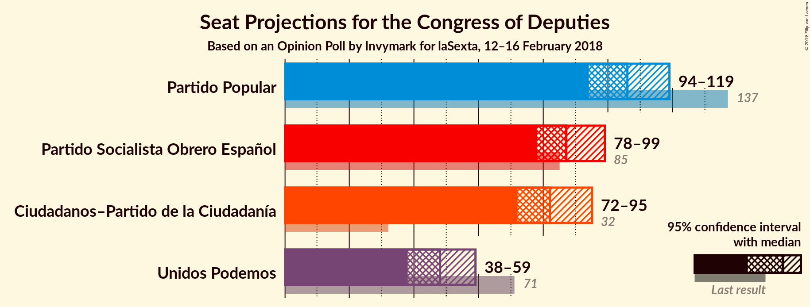
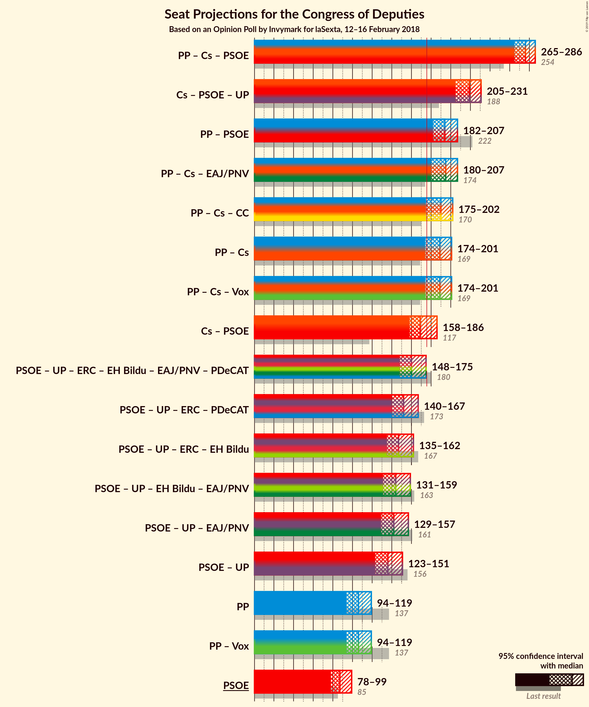

# Opinion Poll by Invymark for laSexta, 12–16 February 2018

<a href="#voting-intentions">Voting Intentions</a> | <a href="#seats">Seats</a> | <a href="#coalitions">Coalitions</a> | <a href="#technical-information">Technical Information</a>

## Voting Intentions

### Confidence Intervals

| Party | Last Result | Poll Result | 80% Confidence Interval | 90% Confidence Interval | 95% Confidence Interval | 99% Confidence Interval |
|:-----:|:-----------:|:-----------:|:-----------------------:|:-----------------------:|:-----------------------:|:-----------------------:|
| Partido Popular | 33.0% | 25.9% | 24.3–27.6% |23.9–28.1% |23.5–28.5% |22.8–29.3% |
| Ciudadanos–Partido de la Ciudadanía | 13.1% | 23.8% | 22.3–25.5% |21.9–25.9% |21.5–26.3% |20.8–27.1% |
| Partido Socialista Obrero Español | 22.6% | 22.8% | 21.3–24.4% |20.9–24.9% |20.5–25.3% |19.8–26.1% |
| Unidos Podemos | 21.2% | 16.5% | 15.2–18.0% |14.8–18.4% |14.5–18.7% |13.9–19.4% |

*Note:* The poll result column reflects the actual value used in the calculations. Published results may vary slightly, and in addition be rounded to fewer digits.

## Seats

### Confidence Intervals

| Party | Last Result | Median | 80% Confidence Interval | 90% Confidence Interval | 95% Confidence Interval | 99% Confidence Interval |
|:-----:|:-----------:|:------:|:-----------------------:|:-----------------------:|:-----------------------:|:-----------------------:|
| <a href="#partido-popular">Partido Popular</a> | 137 | 106 | 98–115 |96–117 |94–119 |91–122 |
| <a href="#ciudadanos–partido-de-la-ciudadanía">Ciudadanos–Partido de la Ciudadanía</a> | 32 | 82 | 74–91 |73–94 |72–95 |70–99 |
| <a href="#partido-socialista-obrero-español">Partido Socialista Obrero Español</a> | 85 | 87 | 83–94 |80–96 |78–99 |76–103 |
| <a href="#unidos-podemos">Unidos Podemos</a> | 71 | 48 | 39–57 |39–58 |38–59 |35–62 |

### Partido Popular

*For a full overview of the results for this party, see the [Partido Popular](party-partidopopular.html) page.*

| Number of Seats | Probability | Accumulated | Special Marks |
|:---------------:|:-----------:|:-----------:|:-------------:|
| 84 | 0% | 100% |  |
| 85 | 0% | 99.9% |  |
| 86 | 0% | 99.9% |  |
| 87 | 0.1% | 99.9% |  |
| 88 | 0.1% | 99.8% |  |
| 89 | 0.1% | 99.8% |  |
| 90 | 0.1% | 99.7% |  |
| 91 | 0.2% | 99.6% |  |
| 92 | 0.5% | 99.4% |  |
| 93 | 0.8% | 98.9% |  |
| 94 | 1.0% | 98% |  |
| 95 | 2% | 97% |  |
| 96 | 3% | 95% |  |
| 97 | 2% | 93% |  |
| 98 | 3% | 90% |  |
| 99 | 6% | 87% |  |
| 100 | 3% | 81% |  |
| 101 | 5% | 79% |  |
| 102 | 3% | 73% |  |
| 103 | 6% | 70% |  |
| 104 | 7% | 64% |  |
| 105 | 5% | 57% |  |
| 106 | 5% | 52% | Median |
| 107 | 5% | 47% |  |
| 108 | 7% | 42% |  |
| 109 | 6% | 35% |  |
| 110 | 4% | 30% |  |
| 111 | 4% | 26% |  |
| 112 | 4% | 22% |  |
| 113 | 3% | 18% |  |
| 114 | 4% | 15% |  |
| 115 | 3% | 11% |  |
| 116 | 3% | 8% |  |
| 117 | 2% | 6% |  |
| 118 | 1.0% | 4% |  |
| 119 | 1.0% | 3% |  |
| 120 | 1.1% | 2% |  |
| 121 | 0.5% | 1.0% |  |
| 122 | 0.2% | 0.5% |  |
| 123 | 0.1% | 0.3% |  |
| 124 | 0.1% | 0.2% |  |
| 125 | 0% | 0.1% |  |
| 126 | 0% | 0.1% |  |
| 127 | 0% | 0% |  |
| 128 | 0% | 0% |  |
| 129 | 0% | 0% |  |
| 130 | 0% | 0% |  |
| 131 | 0% | 0% |  |
| 132 | 0% | 0% |  |
| 133 | 0% | 0% |  |
| 134 | 0% | 0% |  |
| 135 | 0% | 0% |  |
| 136 | 0% | 0% |  |
| 137 | 0% | 0% | Last Result |

### Ciudadanos–Partido de la Ciudadanía

*For a full overview of the results for this party, see the [Ciudadanos–Partido de la Ciudadanía](party-ciudadanos–partidodelaciudadanía.html) page.*

| Number of Seats | Probability | Accumulated | Special Marks |
|:---------------:|:-----------:|:-----------:|:-------------:|
| 32 | 0% | 100% | Last Result |
| 33 | 0% | 100% |  |
| 34 | 0% | 100% |  |
| 35 | 0% | 100% |  |
| 36 | 0% | 100% |  |
| 37 | 0% | 100% |  |
| 38 | 0% | 100% |  |
| 39 | 0% | 100% |  |
| 40 | 0% | 100% |  |
| 41 | 0% | 100% |  |
| 42 | 0% | 100% |  |
| 43 | 0% | 100% |  |
| 44 | 0% | 100% |  |
| 45 | 0% | 100% |  |
| 46 | 0% | 100% |  |
| 47 | 0% | 100% |  |
| 48 | 0% | 100% |  |
| 49 | 0% | 100% |  |
| 50 | 0% | 100% |  |
| 51 | 0% | 100% |  |
| 52 | 0% | 100% |  |
| 53 | 0% | 100% |  |
| 54 | 0% | 100% |  |
| 55 | 0% | 100% |  |
| 56 | 0% | 100% |  |
| 57 | 0% | 100% |  |
| 58 | 0% | 100% |  |
| 59 | 0% | 100% |  |
| 60 | 0% | 100% |  |
| 61 | 0% | 100% |  |
| 62 | 0% | 100% |  |
| 63 | 0% | 100% |  |
| 64 | 0% | 100% |  |
| 65 | 0% | 100% |  |
| 66 | 0% | 100% |  |
| 67 | 0.1% | 99.9% |  |
| 68 | 0.2% | 99.9% |  |
| 69 | 0.2% | 99.7% |  |
| 70 | 0.4% | 99.5% |  |
| 71 | 0.7% | 99.1% |  |
| 72 | 3% | 98% |  |
| 73 | 4% | 95% |  |
| 74 | 4% | 92% |  |
| 75 | 5% | 88% |  |
| 76 | 5% | 82% |  |
| 77 | 6% | 77% |  |
| 78 | 5% | 71% |  |
| 79 | 7% | 66% |  |
| 80 | 4% | 60% |  |
| 81 | 5% | 55% |  |
| 82 | 3% | 50% | Median |
| 83 | 5% | 47% |  |
| 84 | 5% | 42% |  |
| 85 | 5% | 37% |  |
| 86 | 3% | 32% |  |
| 87 | 3% | 30% |  |
| 88 | 6% | 26% |  |
| 89 | 4% | 21% |  |
| 90 | 4% | 17% |  |
| 91 | 3% | 13% |  |
| 92 | 3% | 10% |  |
| 93 | 2% | 7% |  |
| 94 | 2% | 5% |  |
| 95 | 0.9% | 3% |  |
| 96 | 1.0% | 2% |  |
| 97 | 0.4% | 1.2% |  |
| 98 | 0.3% | 0.8% |  |
| 99 | 0.1% | 0.5% |  |
| 100 | 0.1% | 0.4% |  |
| 101 | 0.1% | 0.2% |  |
| 102 | 0.1% | 0.2% |  |
| 103 | 0% | 0.1% |  |
| 104 | 0% | 0.1% |  |
| 105 | 0% | 0.1% |  |
| 106 | 0% | 0% |  |

### Partido Socialista Obrero Español

*For a full overview of the results for this party, see the [Partido Socialista Obrero Español](party-partidosocialistaobreroespañol.html) page.*

| Number of Seats | Probability | Accumulated | Special Marks |
|:---------------:|:-----------:|:-----------:|:-------------:|
| 71 | 0% | 100% |  |
| 72 | 0.1% | 99.9% |  |
| 73 | 0.1% | 99.9% |  |
| 74 | 0.1% | 99.8% |  |
| 75 | 0.2% | 99.7% |  |
| 76 | 0.5% | 99.6% |  |
| 77 | 0.7% | 99.0% |  |
| 78 | 1.3% | 98% |  |
| 79 | 1.2% | 97% |  |
| 80 | 1.4% | 96% |  |
| 81 | 2% | 94% |  |
| 82 | 2% | 93% |  |
| 83 | 2% | 91% |  |
| 84 | 6% | 89% |  |
| 85 | 12% | 83% | Last Result |
| 86 | 11% | 71% |  |
| 87 | 10% | 60% | Median |
| 88 | 10% | 49% |  |
| 89 | 9% | 39% |  |
| 90 | 8% | 30% |  |
| 91 | 4% | 23% |  |
| 92 | 4% | 19% |  |
| 93 | 4% | 15% |  |
| 94 | 3% | 11% |  |
| 95 | 2% | 8% |  |
| 96 | 2% | 6% |  |
| 97 | 1.2% | 5% |  |
| 98 | 0.8% | 4% |  |
| 99 | 0.5% | 3% |  |
| 100 | 0.8% | 2% |  |
| 101 | 0.5% | 2% |  |
| 102 | 0.5% | 1.1% |  |
| 103 | 0.2% | 0.6% |  |
| 104 | 0.1% | 0.4% |  |
| 105 | 0.1% | 0.3% |  |
| 106 | 0.1% | 0.1% |  |
| 107 | 0% | 0.1% |  |
| 108 | 0% | 0.1% |  |
| 109 | 0% | 0.1% |  |
| 110 | 0% | 0% |  |

### Unidos Podemos

*For a full overview of the results for this party, see the [Unidos Podemos](party-unidospodemos.html) page.*

| Number of Seats | Probability | Accumulated | Special Marks |
|:---------------:|:-----------:|:-----------:|:-------------:|
| 33 | 0.1% | 100% |  |
| 34 | 0.1% | 99.9% |  |
| 35 | 0.3% | 99.8% |  |
| 36 | 0.5% | 99.4% |  |
| 37 | 0.5% | 98.9% |  |
| 38 | 1.2% | 98% |  |
| 39 | 11% | 97% |  |
| 40 | 3% | 86% |  |
| 41 | 5% | 83% |  |
| 42 | 3% | 78% |  |
| 43 | 4% | 74% |  |
| 44 | 2% | 71% |  |
| 45 | 3% | 68% |  |
| 46 | 6% | 65% |  |
| 47 | 5% | 59% |  |
| 48 | 4% | 54% | Median |
| 49 | 7% | 50% |  |
| 50 | 3% | 43% |  |
| 51 | 6% | 40% |  |
| 52 | 4% | 33% |  |
| 53 | 4% | 30% |  |
| 54 | 4% | 26% |  |
| 55 | 6% | 21% |  |
| 56 | 5% | 15% |  |
| 57 | 3% | 10% |  |
| 58 | 3% | 8% |  |
| 59 | 2% | 4% |  |
| 60 | 1.0% | 2% |  |
| 61 | 0.7% | 1.3% |  |
| 62 | 0.2% | 0.6% |  |
| 63 | 0.2% | 0.4% |  |
| 64 | 0.1% | 0.2% |  |
| 65 | 0.1% | 0.2% |  |
| 66 | 0% | 0.1% |  |
| 67 | 0% | 0.1% |  |
| 68 | 0% | 0% |  |
| 69 | 0% | 0% |  |
| 70 | 0% | 0% |  |
| 71 | 0% | 0% | Last Result |

## Coalitions

### Confidence Intervals

| Coalition | Last Result | Median | Majority? | 80% Confidence Interval | 90% Confidence Interval | 95% Confidence Interval | 99% Confidence Interval |
|:---------:|:-----------:|:------:|:---------:|:-----------------------:|:-----------------------:|:-----------------------:|:-----------------------:|
| Partido Popular – Ciudadanos–Partido de la Ciudadanía – Partido Socialista Obrero Español | 254 | 276 | 100% | 268–285 | 266–286 | 265–286 | 262–287 |
| Ciudadanos–Partido de la Ciudadanía – Partido Socialista Obrero Español – Unidos Podemos | 188 | 219 | 100% | 209–227 | 207–229 | 205–231 | 202–234 |
| Partido Popular – Partido Socialista Obrero Español | 222 | 194 | 99.7% | 186–203 | 184–205 | 182–207 | 177–211 |
| Partido Popular – Ciudadanos–Partido de la Ciudadanía | 169 | 189 | 96% | 178–198 | 176–200 | 174–201 | 171–205 |
| Ciudadanos–Partido de la Ciudadanía – Partido Socialista Obrero Español | 117 | 169 | 25% | 161–180 | 159–183 | 158–186 | 154–190 |
| Partido Socialista Obrero Español – Unidos Podemos | 156 | 136 | 0% | 126–146 | 124–149 | 123–151 | 119–154 |
| Partido Popular | 137 | 106 | 0% | 98–115 | 96–117 | 94–119 | 91–122 |
| Partido Socialista Obrero Español | 85 | 87 | 0% | 83–94 | 80–96 | 78–99 | 76–103 |

### Partido Popular – Ciudadanos–Partido de la Ciudadanía – Partido Socialista Obrero Español

| Number of Seats | Probability | Accumulated | Special Marks |
|:---------------:|:-----------:|:-----------:|:-------------:|
| 254 | 0% | 100% | Last Result |
| 255 | 0% | 100% |  |
| 256 | 0% | 100% |  |
| 257 | 0% | 100% |  |
| 258 | 0% | 99.9% |  |
| 259 | 0.1% | 99.9% |  |
| 260 | 0.1% | 99.9% |  |
| 261 | 0.1% | 99.8% |  |
| 262 | 0.2% | 99.6% |  |
| 263 | 0.5% | 99.4% |  |
| 264 | 0.8% | 98.8% |  |
| 265 | 2% | 98% |  |
| 266 | 2% | 96% |  |
| 267 | 3% | 94% |  |
| 268 | 4% | 91% |  |
| 269 | 6% | 88% |  |
| 270 | 4% | 81% |  |
| 271 | 4% | 77% |  |
| 272 | 5% | 73% |  |
| 273 | 3% | 69% |  |
| 274 | 7% | 65% |  |
| 275 | 5% | 58% | Median |
| 276 | 5% | 53% |  |
| 277 | 5% | 49% |  |
| 278 | 5% | 44% |  |
| 279 | 6% | 39% |  |
| 280 | 3% | 33% |  |
| 281 | 3% | 30% |  |
| 282 | 5% | 27% |  |
| 283 | 4% | 22% |  |
| 284 | 4% | 18% |  |
| 285 | 8% | 14% |  |
| 286 | 4% | 5% |  |
| 287 | 0.8% | 1.2% |  |
| 288 | 0.3% | 0.4% |  |
| 289 | 0.1% | 0.2% |  |
| 290 | 0% | 0.1% |  |
| 291 | 0% | 0% |  |

### Ciudadanos–Partido de la Ciudadanía – Partido Socialista Obrero Español – Unidos Podemos

| Number of Seats | Probability | Accumulated | Special Marks |
|:---------------:|:-----------:|:-----------:|:-------------:|
| 188 | 0% | 100% | Last Result |
| 189 | 0% | 100% |  |
| 190 | 0% | 100% |  |
| 191 | 0% | 100% |  |
| 192 | 0% | 100% |  |
| 193 | 0% | 100% |  |
| 194 | 0% | 100% |  |
| 195 | 0% | 100% |  |
| 196 | 0% | 100% |  |
| 197 | 0% | 100% |  |
| 198 | 0% | 99.9% |  |
| 199 | 0.1% | 99.9% |  |
| 200 | 0.1% | 99.8% |  |
| 201 | 0.1% | 99.7% |  |
| 202 | 0.3% | 99.6% |  |
| 203 | 0.5% | 99.3% |  |
| 204 | 1.1% | 98.8% |  |
| 205 | 0.9% | 98% |  |
| 206 | 1.3% | 97% |  |
| 207 | 2% | 95% |  |
| 208 | 3% | 94% |  |
| 209 | 3% | 91% |  |
| 210 | 3% | 88% |  |
| 211 | 4% | 85% |  |
| 212 | 3% | 82% |  |
| 213 | 4% | 79% |  |
| 214 | 4% | 75% |  |
| 215 | 5% | 71% |  |
| 216 | 6% | 66% |  |
| 217 | 6% | 61% | Median |
| 218 | 4% | 55% |  |
| 219 | 6% | 50% |  |
| 220 | 5% | 45% |  |
| 221 | 6% | 39% |  |
| 222 | 4% | 34% |  |
| 223 | 4% | 30% |  |
| 224 | 5% | 25% |  |
| 225 | 3% | 21% |  |
| 226 | 5% | 18% |  |
| 227 | 3% | 13% |  |
| 228 | 2% | 9% |  |
| 229 | 3% | 7% |  |
| 230 | 2% | 5% |  |
| 231 | 1.0% | 3% |  |
| 232 | 0.8% | 2% |  |
| 233 | 0.5% | 1.1% |  |
| 234 | 0.2% | 0.6% |  |
| 235 | 0.1% | 0.4% |  |
| 236 | 0.1% | 0.3% |  |
| 237 | 0.1% | 0.2% |  |
| 238 | 0.1% | 0.2% |  |
| 239 | 0% | 0.1% |  |
| 240 | 0% | 0.1% |  |
| 241 | 0% | 0.1% |  |
| 242 | 0% | 0% |  |

### Partido Popular – Partido Socialista Obrero Español

| Number of Seats | Probability | Accumulated | Special Marks |
|:---------------:|:-----------:|:-----------:|:-------------:|
| 171 | 0% | 100% |  |
| 172 | 0% | 99.9% |  |
| 173 | 0% | 99.9% |  |
| 174 | 0.1% | 99.9% |  |
| 175 | 0.1% | 99.8% |  |
| 176 | 0.1% | 99.7% | Majority |
| 177 | 0.1% | 99.6% |  |
| 178 | 0.2% | 99.5% |  |
| 179 | 0.3% | 99.3% |  |
| 180 | 0.2% | 99.0% |  |
| 181 | 0.4% | 98.8% |  |
| 182 | 1.0% | 98% |  |
| 183 | 2% | 97% |  |
| 184 | 2% | 96% |  |
| 185 | 2% | 94% |  |
| 186 | 5% | 92% |  |
| 187 | 5% | 87% |  |
| 188 | 4% | 83% |  |
| 189 | 4% | 78% |  |
| 190 | 3% | 74% |  |
| 191 | 6% | 70% |  |
| 192 | 5% | 64% |  |
| 193 | 5% | 59% | Median |
| 194 | 10% | 54% |  |
| 195 | 8% | 43% |  |
| 196 | 4% | 35% |  |
| 197 | 4% | 31% |  |
| 198 | 2% | 27% |  |
| 199 | 4% | 25% |  |
| 200 | 3% | 21% |  |
| 201 | 5% | 18% |  |
| 202 | 2% | 13% |  |
| 203 | 4% | 11% |  |
| 204 | 2% | 7% |  |
| 205 | 2% | 6% |  |
| 206 | 0.8% | 4% |  |
| 207 | 0.8% | 3% |  |
| 208 | 0.9% | 2% |  |
| 209 | 0.6% | 2% |  |
| 210 | 0.3% | 0.9% |  |
| 211 | 0.3% | 0.6% |  |
| 212 | 0.1% | 0.3% |  |
| 213 | 0.1% | 0.1% |  |
| 214 | 0% | 0.1% |  |
| 215 | 0% | 0% |  |
| 216 | 0% | 0% |  |
| 217 | 0% | 0% |  |
| 218 | 0% | 0% |  |
| 219 | 0% | 0% |  |
| 220 | 0% | 0% |  |
| 221 | 0% | 0% |  |
| 222 | 0% | 0% | Last Result |

### Partido Popular – Ciudadanos–Partido de la Ciudadanía

| Number of Seats | Probability | Accumulated | Special Marks |
|:---------------:|:-----------:|:-----------:|:-------------:|
| 167 | 0% | 100% |  |
| 168 | 0.1% | 99.9% |  |
| 169 | 0.1% | 99.9% | Last Result |
| 170 | 0.2% | 99.8% |  |
| 171 | 0.2% | 99.7% |  |
| 172 | 0.3% | 99.4% |  |
| 173 | 0.9% | 99.1% |  |
| 174 | 0.9% | 98% |  |
| 175 | 2% | 97% |  |
| 176 | 2% | 96% | Majority |
| 177 | 1.3% | 94% |  |
| 178 | 3% | 93% |  |
| 179 | 3% | 90% |  |
| 180 | 3% | 87% |  |
| 181 | 3% | 84% |  |
| 182 | 4% | 81% |  |
| 183 | 4% | 77% |  |
| 184 | 3% | 73% |  |
| 185 | 5% | 70% |  |
| 186 | 5% | 65% |  |
| 187 | 5% | 60% |  |
| 188 | 4% | 55% | Median |
| 189 | 7% | 51% |  |
| 190 | 4% | 44% |  |
| 191 | 5% | 41% |  |
| 192 | 5% | 35% |  |
| 193 | 4% | 31% |  |
| 194 | 5% | 27% |  |
| 195 | 3% | 22% |  |
| 196 | 4% | 19% |  |
| 197 | 2% | 15% |  |
| 198 | 4% | 13% |  |
| 199 | 2% | 9% |  |
| 200 | 3% | 7% |  |
| 201 | 2% | 4% |  |
| 202 | 0.5% | 2% |  |
| 203 | 0.6% | 1.4% |  |
| 204 | 0.3% | 0.8% |  |
| 205 | 0.2% | 0.5% |  |
| 206 | 0.1% | 0.4% |  |
| 207 | 0.1% | 0.2% |  |
| 208 | 0% | 0.1% |  |
| 209 | 0% | 0.1% |  |
| 210 | 0% | 0% |  |

### Ciudadanos–Partido de la Ciudadanía – Partido Socialista Obrero Español

| Number of Seats | Probability | Accumulated | Special Marks |
|:---------------:|:-----------:|:-----------:|:-------------:|
| 117 | 0% | 100% | Last Result |
| 118 | 0% | 100% |  |
| 119 | 0% | 100% |  |
| 120 | 0% | 100% |  |
| 121 | 0% | 100% |  |
| 122 | 0% | 100% |  |
| 123 | 0% | 100% |  |
| 124 | 0% | 100% |  |
| 125 | 0% | 100% |  |
| 126 | 0% | 100% |  |
| 127 | 0% | 100% |  |
| 128 | 0% | 100% |  |
| 129 | 0% | 100% |  |
| 130 | 0% | 100% |  |
| 131 | 0% | 100% |  |
| 132 | 0% | 100% |  |
| 133 | 0% | 100% |  |
| 134 | 0% | 100% |  |
| 135 | 0% | 100% |  |
| 136 | 0% | 100% |  |
| 137 | 0% | 100% |  |
| 138 | 0% | 100% |  |
| 139 | 0% | 100% |  |
| 140 | 0% | 100% |  |
| 141 | 0% | 100% |  |
| 142 | 0% | 100% |  |
| 143 | 0% | 100% |  |
| 144 | 0% | 100% |  |
| 145 | 0% | 100% |  |
| 146 | 0% | 100% |  |
| 147 | 0% | 100% |  |
| 148 | 0% | 100% |  |
| 149 | 0.1% | 100% |  |
| 150 | 0% | 99.9% |  |
| 151 | 0.1% | 99.9% |  |
| 152 | 0.1% | 99.8% |  |
| 153 | 0.1% | 99.7% |  |
| 154 | 0.2% | 99.5% |  |
| 155 | 0.2% | 99.4% |  |
| 156 | 0.6% | 99.2% |  |
| 157 | 0.9% | 98.6% |  |
| 158 | 1.2% | 98% |  |
| 159 | 2% | 96% |  |
| 160 | 3% | 95% |  |
| 161 | 3% | 92% |  |
| 162 | 4% | 89% |  |
| 163 | 4% | 85% |  |
| 164 | 6% | 81% |  |
| 165 | 5% | 75% |  |
| 166 | 5% | 70% |  |
| 167 | 4% | 65% |  |
| 168 | 5% | 61% |  |
| 169 | 7% | 56% | Median |
| 170 | 3% | 49% |  |
| 171 | 5% | 46% |  |
| 172 | 4% | 41% |  |
| 173 | 5% | 38% |  |
| 174 | 4% | 33% |  |
| 175 | 4% | 29% |  |
| 176 | 5% | 25% | Majority |
| 177 | 3% | 20% |  |
| 178 | 2% | 17% |  |
| 179 | 3% | 15% |  |
| 180 | 3% | 11% |  |
| 181 | 2% | 9% |  |
| 182 | 1.4% | 7% |  |
| 183 | 1.2% | 6% |  |
| 184 | 1.1% | 4% |  |
| 185 | 0.7% | 3% |  |
| 186 | 0.6% | 3% |  |
| 187 | 0.5% | 2% |  |
| 188 | 0.4% | 2% |  |
| 189 | 0.4% | 1.1% |  |
| 190 | 0.4% | 0.8% |  |
| 191 | 0.1% | 0.4% |  |
| 192 | 0.1% | 0.3% |  |
| 193 | 0% | 0.1% |  |
| 194 | 0% | 0.1% |  |
| 195 | 0% | 0% |  |

### Partido Socialista Obrero Español – Unidos Podemos

| Number of Seats | Probability | Accumulated | Special Marks |
|:---------------:|:-----------:|:-----------:|:-------------:|
| 114 | 0% | 100% |  |
| 115 | 0% | 99.9% |  |
| 116 | 0.1% | 99.9% |  |
| 117 | 0.2% | 99.8% |  |
| 118 | 0.1% | 99.6% |  |
| 119 | 0.3% | 99.5% |  |
| 120 | 0.5% | 99.3% |  |
| 121 | 0.5% | 98.8% |  |
| 122 | 0.7% | 98% |  |
| 123 | 2% | 98% |  |
| 124 | 3% | 96% |  |
| 125 | 2% | 92% |  |
| 126 | 2% | 91% |  |
| 127 | 3% | 88% |  |
| 128 | 3% | 86% |  |
| 129 | 3% | 82% |  |
| 130 | 4% | 79% |  |
| 131 | 4% | 76% |  |
| 132 | 5% | 72% |  |
| 133 | 5% | 66% |  |
| 134 | 5% | 62% |  |
| 135 | 4% | 57% | Median |
| 136 | 7% | 53% |  |
| 137 | 3% | 47% |  |
| 138 | 5% | 43% |  |
| 139 | 6% | 39% |  |
| 140 | 4% | 33% |  |
| 141 | 3% | 29% |  |
| 142 | 5% | 26% |  |
| 143 | 2% | 21% |  |
| 144 | 4% | 18% |  |
| 145 | 3% | 15% |  |
| 146 | 3% | 12% |  |
| 147 | 2% | 9% |  |
| 148 | 1.0% | 7% |  |
| 149 | 2% | 6% |  |
| 150 | 2% | 4% |  |
| 151 | 0.9% | 3% |  |
| 152 | 0.8% | 2% |  |
| 153 | 0.3% | 0.8% |  |
| 154 | 0.2% | 0.5% |  |
| 155 | 0.2% | 0.3% |  |
| 156 | 0.1% | 0.2% | Last Result |
| 157 | 0.1% | 0.1% |  |
| 158 | 0% | 0.1% |  |
| 159 | 0% | 0% |  |

### Partido Popular

| Number of Seats | Probability | Accumulated | Special Marks |
|:---------------:|:-----------:|:-----------:|:-------------:|
| 84 | 0% | 100% |  |
| 85 | 0% | 99.9% |  |
| 86 | 0% | 99.9% |  |
| 87 | 0.1% | 99.9% |  |
| 88 | 0.1% | 99.8% |  |
| 89 | 0.1% | 99.8% |  |
| 90 | 0.1% | 99.7% |  |
| 91 | 0.2% | 99.6% |  |
| 92 | 0.5% | 99.4% |  |
| 93 | 0.8% | 98.9% |  |
| 94 | 1.0% | 98% |  |
| 95 | 2% | 97% |  |
| 96 | 3% | 95% |  |
| 97 | 2% | 93% |  |
| 98 | 3% | 90% |  |
| 99 | 6% | 87% |  |
| 100 | 3% | 81% |  |
| 101 | 5% | 79% |  |
| 102 | 3% | 73% |  |
| 103 | 6% | 70% |  |
| 104 | 7% | 64% |  |
| 105 | 5% | 57% |  |
| 106 | 5% | 52% | Median |
| 107 | 5% | 47% |  |
| 108 | 7% | 42% |  |
| 109 | 6% | 35% |  |
| 110 | 4% | 30% |  |
| 111 | 4% | 26% |  |
| 112 | 4% | 22% |  |
| 113 | 3% | 18% |  |
| 114 | 4% | 15% |  |
| 115 | 3% | 11% |  |
| 116 | 3% | 8% |  |
| 117 | 2% | 6% |  |
| 118 | 1.0% | 4% |  |
| 119 | 1.0% | 3% |  |
| 120 | 1.1% | 2% |  |
| 121 | 0.5% | 1.0% |  |
| 122 | 0.2% | 0.5% |  |
| 123 | 0.1% | 0.3% |  |
| 124 | 0.1% | 0.2% |  |
| 125 | 0% | 0.1% |  |
| 126 | 0% | 0.1% |  |
| 127 | 0% | 0% |  |
| 128 | 0% | 0% |  |
| 129 | 0% | 0% |  |
| 130 | 0% | 0% |  |
| 131 | 0% | 0% |  |
| 132 | 0% | 0% |  |
| 133 | 0% | 0% |  |
| 134 | 0% | 0% |  |
| 135 | 0% | 0% |  |
| 136 | 0% | 0% |  |
| 137 | 0% | 0% | Last Result |

### Partido Socialista Obrero Español

| Number of Seats | Probability | Accumulated | Special Marks |
|:---------------:|:-----------:|:-----------:|:-------------:|
| 71 | 0% | 100% |  |
| 72 | 0.1% | 99.9% |  |
| 73 | 0.1% | 99.9% |  |
| 74 | 0.1% | 99.8% |  |
| 75 | 0.2% | 99.7% |  |
| 76 | 0.5% | 99.6% |  |
| 77 | 0.7% | 99.0% |  |
| 78 | 1.3% | 98% |  |
| 79 | 1.2% | 97% |  |
| 80 | 1.4% | 96% |  |
| 81 | 2% | 94% |  |
| 82 | 2% | 93% |  |
| 83 | 2% | 91% |  |
| 84 | 6% | 89% |  |
| 85 | 12% | 83% | Last Result |
| 86 | 11% | 71% |  |
| 87 | 10% | 60% | Median |
| 88 | 10% | 49% |  |
| 89 | 9% | 39% |  |
| 90 | 8% | 30% |  |
| 91 | 4% | 23% |  |
| 92 | 4% | 19% |  |
| 93 | 4% | 15% |  |
| 94 | 3% | 11% |  |
| 95 | 2% | 8% |  |
| 96 | 2% | 6% |  |
| 97 | 1.2% | 5% |  |
| 98 | 0.8% | 4% |  |
| 99 | 0.5% | 3% |  |
| 100 | 0.8% | 2% |  |
| 101 | 0.5% | 2% |  |
| 102 | 0.5% | 1.1% |  |
| 103 | 0.2% | 0.6% |  |
| 104 | 0.1% | 0.4% |  |
| 105 | 0.1% | 0.3% |  |
| 106 | 0.1% | 0.1% |  |
| 107 | 0% | 0.1% |  |
| 108 | 0% | 0.1% |  |
| 109 | 0% | 0.1% |  |
| 110 | 0% | 0% |  |

## Technical Information

### Opinion Poll

+ **Polling firm:** Invymark
+ **Commissioner(s):** laSexta
+ **Fieldwork period:** 12–16 February 2018

### Calculations

+ **Sample size:** 1200
+ **Simulations done:** 131,072
+ **Error estimate:** 0.35%

