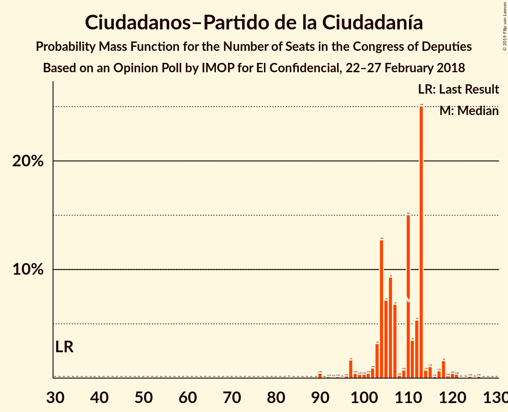
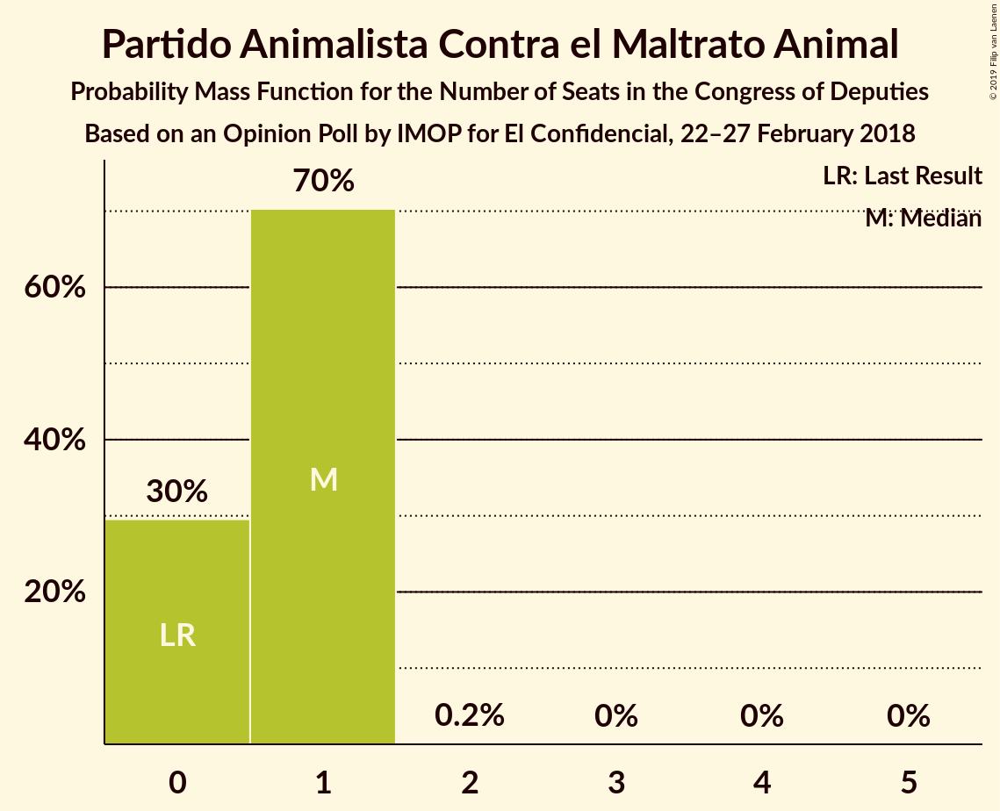
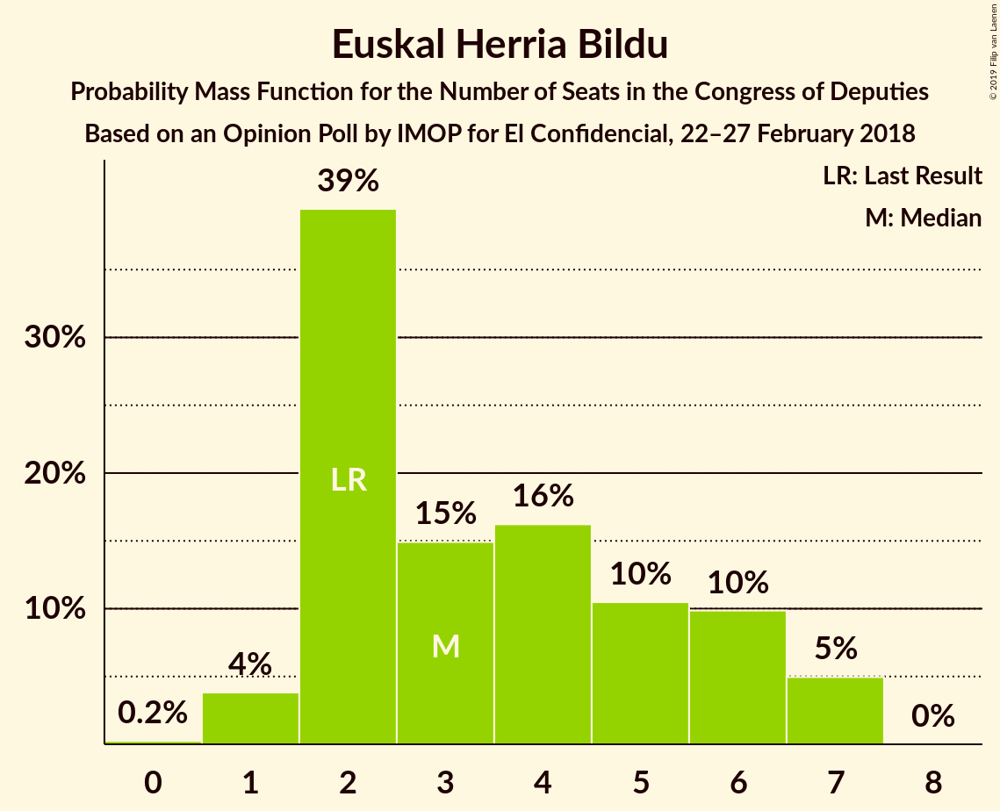
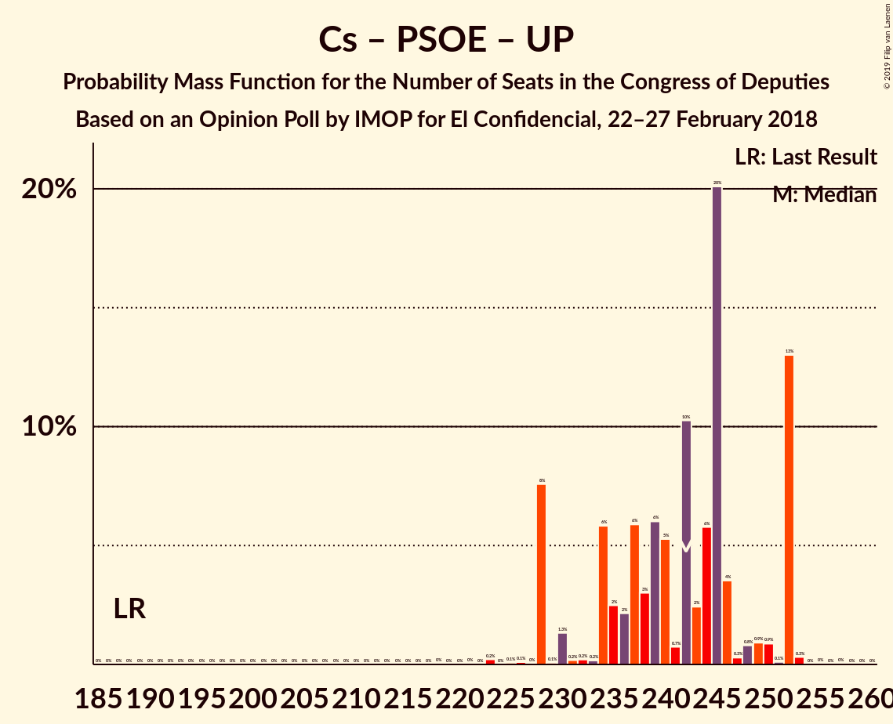
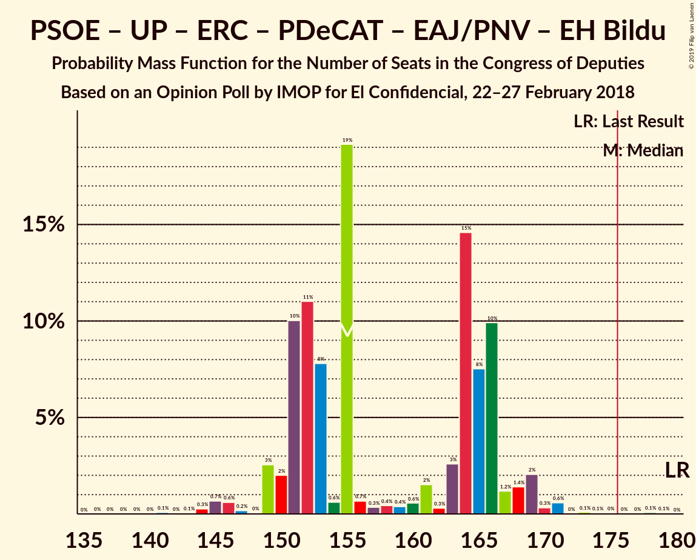
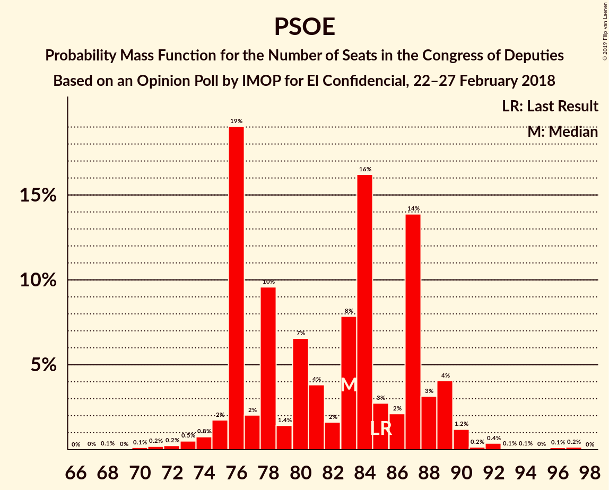

# Opinion Poll by IMOP for El Confidencial, 22–27 February 2018

<a href="#voting-intentions">Voting Intentions</a> | <a href="#seats">Seats</a> | <a href="#coalitions">Coalitions</a> | <a href="#technical-information">Technical Information</a>

## Voting Intentions

### Confidence Intervals

| Party | Last Result | Poll Result | 80% Confidence Interval | 90% Confidence Interval | 95% Confidence Interval | 99% Confidence Interval |
|:-----:|:-----------:|:-----------:|:-----------------------:|:-----------------------:|:-----------------------:|:-----------------------:|
| Ciudadanos–Partido de la Ciudadanía | 13.1% | 28.5% | 27.0–30.1% |26.6–30.6% |26.2–31.0% |25.5–31.7% |
| Partido Socialista Obrero Español | 22.6% | 21.5% | 20.1–22.9% |19.7–23.4% |19.4–23.7% |18.8–24.4% |
| Partido Popular | 33.0% | 21.4% | 20.0–22.9% |19.6–23.3% |19.3–23.6% |18.7–24.3% |
| Unidos Podemos | 21.2% | 17.0% | 15.7–18.3% |15.4–18.7% |15.1–19.0% |14.5–19.7% |
| Esquerra Republicana de Catalunya–Catalunya Sí | 2.7% | 3.0% | 2.5–3.7% |2.3–3.9% |2.2–4.0% |2.0–4.4% |
| Partido Animalista Contra el Maltrato Animal | 1.2% | 2.0% | 1.6–2.6% |1.5–2.7% |1.4–2.9% |1.2–3.2% |
| Partit Demòcrata Europeu Català | 2.0% | 1.7% | 1.3–2.3% |1.2–2.4% |1.1–2.5% |1.0–2.8% |
| Euzko Alderdi Jeltzalea/Partido Nacionalista Vasco | 1.2% | 1.1% | 0.8–1.5% |0.7–1.6% |0.6–1.8% |0.5–2.0% |
| Euskal Herria Bildu | 0.8% | 0.8% | 0.5–1.2% |0.5–1.3% |0.4–1.4% |0.4–1.6% |

*Note:* The poll result column reflects the actual value used in the calculations. Published results may vary slightly, and in addition be rounded to fewer digits.

## Seats

### Confidence Intervals

| Party | Last Result | Median | 80% Confidence Interval | 90% Confidence Interval | 95% Confidence Interval | 99% Confidence Interval |
|:-----:|:-----------:|:------:|:-----------------------:|:-----------------------:|:-----------------------:|:-----------------------:|
| <a href="#ciudadanos–partido-de-la-ciudadanía">Ciudadanos–Partido de la Ciudadanía</a> | 32 | 110 | 104–113 |102–114 |97–118 |90–121 |
| <a href="#partido-socialista-obrero-español">Partido Socialista Obrero Español</a> | 85 | 83 | 76–87 |76–89 |75–89 |72–92 |
| <a href="#partido-popular">Partido Popular</a> | 137 | 80 | 74–91 |74–91 |74–92 |72–96 |
| <a href="#unidos-podemos">Unidos Podemos</a> | 71 | 52 | 41–58 |39–59 |39–60 |38–65 |
| <a href="#esquerra-republicana-de-catalunya–catalunya-sí">Esquerra Republicana de Catalunya–Catalunya Sí</a> | 9 | 11 | 9–14 |9–14 |9–14 |7–15 |
| <a href="#partido-animalista-contra-el-maltrato-animal">Partido Animalista Contra el Maltrato Animal</a> | 0 | 1 | 0–1 |0–1 |0–1 |0–1 |
| <a href="#partit-demòcrata-europeu-català">Partit Demòcrata Europeu Català</a> | 8 | 6 | 4–8 |4–8 |4–8 |3–10 |
| <a href="#euzko-alderdi-jeltzalea/partido-nacionalista-vasco">Euzko Alderdi Jeltzalea/Partido Nacionalista Vasco</a> | 5 | 5 | 3–7 |3–7 |3–7 |2–8 |
| <a href="#euskal-herria-bildu">Euskal Herria Bildu</a> | 2 | 3 | 2–6 |2–6 |1–7 |1–7 |

### Ciudadanos–Partido de la Ciudadanía

*For a full overview of the results for this party, see the [Ciudadanos–Partido de la Ciudadanía](party-ciudadanos–partidodelaciudadanía.html) page.*

| Number of Seats | Probability | Accumulated | Special Marks |
|:---------------:|:-----------:|:-----------:|:-------------:|
| 32 | 0% | 100% | Last Result |
| 33 | 0% | 100% |  |
| 34 | 0% | 100% |  |
| 35 | 0% | 100% |  |
| 36 | 0% | 100% |  |
| 37 | 0% | 100% |  |
| 38 | 0% | 100% |  |
| 39 | 0% | 100% |  |
| 40 | 0% | 100% |  |
| 41 | 0% | 100% |  |
| 42 | 0% | 100% |  |
| 43 | 0% | 100% |  |
| 44 | 0% | 100% |  |
| 45 | 0% | 100% |  |
| 46 | 0% | 100% |  |
| 47 | 0% | 100% |  |
| 48 | 0% | 100% |  |
| 49 | 0% | 100% |  |
| 50 | 0% | 100% |  |
| 51 | 0% | 100% |  |
| 52 | 0% | 100% |  |
| 53 | 0% | 100% |  |
| 54 | 0% | 100% |  |
| 55 | 0% | 100% |  |
| 56 | 0% | 100% |  |
| 57 | 0% | 100% |  |
| 58 | 0% | 100% |  |
| 59 | 0% | 100% |  |
| 60 | 0% | 100% |  |
| 61 | 0% | 100% |  |
| 62 | 0% | 100% |  |
| 63 | 0% | 100% |  |
| 64 | 0% | 100% |  |
| 65 | 0% | 100% |  |
| 66 | 0% | 100% |  |
| 67 | 0% | 100% |  |
| 68 | 0% | 100% |  |
| 69 | 0% | 100% |  |
| 70 | 0% | 100% |  |
| 71 | 0% | 100% |  |
| 72 | 0% | 100% |  |
| 73 | 0% | 100% |  |
| 74 | 0% | 100% |  |
| 75 | 0% | 100% |  |
| 76 | 0% | 100% |  |
| 77 | 0% | 100% |  |
| 78 | 0% | 100% |  |
| 79 | 0% | 100% |  |
| 80 | 0% | 100% |  |
| 81 | 0% | 100% |  |
| 82 | 0% | 100% |  |
| 83 | 0% | 100% |  |
| 84 | 0% | 100% |  |
| 85 | 0% | 99.9% |  |
| 86 | 0% | 99.9% |  |
| 87 | 0% | 99.9% |  |
| 88 | 0% | 99.9% |  |
| 89 | 0% | 99.9% |  |
| 90 | 0.5% | 99.9% |  |
| 91 | 0% | 99.5% |  |
| 92 | 0.1% | 99.4% |  |
| 93 | 0.1% | 99.3% |  |
| 94 | 0.1% | 99.2% |  |
| 95 | 0% | 99.1% |  |
| 96 | 0.2% | 99.0% |  |
| 97 | 2% | 98.8% |  |
| 98 | 0.4% | 97% |  |
| 99 | 0.3% | 97% |  |
| 100 | 0.3% | 96% |  |
| 101 | 0.4% | 96% |  |
| 102 | 0.9% | 96% |  |
| 103 | 3% | 95% |  |
| 104 | 13% | 92% |  |
| 105 | 7% | 79% |  |
| 106 | 9% | 72% |  |
| 107 | 7% | 62% |  |
| 108 | 0.3% | 56% |  |
| 109 | 0.7% | 55% |  |
| 110 | 15% | 55% | Median |
| 111 | 3% | 40% |  |
| 112 | 5% | 36% |  |
| 113 | 25% | 31% |  |
| 114 | 0.7% | 6% |  |
| 115 | 1.1% | 5% |  |
| 116 | 0.1% | 4% |  |
| 117 | 0.7% | 4% |  |
| 118 | 2% | 3% |  |
| 119 | 0.2% | 1.5% |  |
| 120 | 0.4% | 1.2% |  |
| 121 | 0.4% | 0.8% |  |
| 122 | 0% | 0.5% |  |
| 123 | 0% | 0.4% |  |
| 124 | 0.2% | 0.4% |  |
| 125 | 0% | 0.2% |  |
| 126 | 0.2% | 0.2% |  |
| 127 | 0% | 0% |  |

### Partido Socialista Obrero Español

*For a full overview of the results for this party, see the [Partido Socialista Obrero Español](party-partidosocialistaobreroespañol.html) page.*

| Number of Seats | Probability | Accumulated | Special Marks |
|:---------------:|:-----------:|:-----------:|:-------------:|
| 67 | 0% | 100% |  |
| 68 | 0.1% | 99.9% |  |
| 69 | 0% | 99.9% |  |
| 70 | 0.1% | 99.8% |  |
| 71 | 0.2% | 99.7% |  |
| 72 | 0.2% | 99.5% |  |
| 73 | 0.5% | 99.3% |  |
| 74 | 0.8% | 98.8% |  |
| 75 | 2% | 98% |  |
| 76 | 19% | 96% |  |
| 77 | 2% | 77% |  |
| 78 | 10% | 75% |  |
| 79 | 1.4% | 66% |  |
| 80 | 7% | 64% |  |
| 81 | 4% | 58% |  |
| 82 | 2% | 54% |  |
| 83 | 8% | 52% | Median |
| 84 | 16% | 44% |  |
| 85 | 3% | 28% | Last Result |
| 86 | 2% | 25% |  |
| 87 | 14% | 23% |  |
| 88 | 3% | 9% |  |
| 89 | 4% | 6% |  |
| 90 | 1.2% | 2% |  |
| 91 | 0.2% | 1.0% |  |
| 92 | 0.4% | 0.8% |  |
| 93 | 0.1% | 0.4% |  |
| 94 | 0.1% | 0.4% |  |
| 95 | 0% | 0.3% |  |
| 96 | 0.1% | 0.3% |  |
| 97 | 0.2% | 0.2% |  |
| 98 | 0% | 0% |  |

### Partido Popular

*For a full overview of the results for this party, see the [Partido Popular](party-partidopopular.html) page.*

| Number of Seats | Probability | Accumulated | Special Marks |
|:---------------:|:-----------:|:-----------:|:-------------:|
| 67 | 0% | 100% |  |
| 68 | 0% | 99.9% |  |
| 69 | 0% | 99.9% |  |
| 70 | 0.1% | 99.9% |  |
| 71 | 0.3% | 99.8% |  |
| 72 | 0.9% | 99.6% |  |
| 73 | 0.3% | 98.6% |  |
| 74 | 14% | 98% |  |
| 75 | 0.2% | 84% |  |
| 76 | 0.6% | 84% |  |
| 77 | 0.9% | 83% |  |
| 78 | 3% | 82% |  |
| 79 | 12% | 80% |  |
| 80 | 25% | 68% | Median |
| 81 | 3% | 43% |  |
| 82 | 6% | 39% |  |
| 83 | 0.5% | 33% |  |
| 84 | 7% | 33% |  |
| 85 | 4% | 25% |  |
| 86 | 3% | 22% |  |
| 87 | 0.2% | 19% |  |
| 88 | 6% | 19% |  |
| 89 | 0.2% | 12% |  |
| 90 | 0.5% | 12% |  |
| 91 | 8% | 12% |  |
| 92 | 2% | 3% |  |
| 93 | 0.1% | 1.3% |  |
| 94 | 0.3% | 1.2% |  |
| 95 | 0.2% | 0.9% |  |
| 96 | 0.3% | 0.7% |  |
| 97 | 0.2% | 0.4% |  |
| 98 | 0% | 0.1% |  |
| 99 | 0% | 0.1% |  |
| 100 | 0% | 0.1% |  |
| 101 | 0% | 0.1% |  |
| 102 | 0% | 0.1% |  |
| 103 | 0% | 0.1% |  |
| 104 | 0% | 0% |  |
| 105 | 0% | 0% |  |
| 106 | 0% | 0% |  |
| 107 | 0% | 0% |  |
| 108 | 0% | 0% |  |
| 109 | 0% | 0% |  |
| 110 | 0% | 0% |  |
| 111 | 0% | 0% |  |
| 112 | 0% | 0% |  |
| 113 | 0% | 0% |  |
| 114 | 0% | 0% |  |
| 115 | 0% | 0% |  |
| 116 | 0% | 0% |  |
| 117 | 0% | 0% |  |
| 118 | 0% | 0% |  |
| 119 | 0% | 0% |  |
| 120 | 0% | 0% |  |
| 121 | 0% | 0% |  |
| 122 | 0% | 0% |  |
| 123 | 0% | 0% |  |
| 124 | 0% | 0% |  |
| 125 | 0% | 0% |  |
| 126 | 0% | 0% |  |
| 127 | 0% | 0% |  |
| 128 | 0% | 0% |  |
| 129 | 0% | 0% |  |
| 130 | 0% | 0% |  |
| 131 | 0% | 0% |  |
| 132 | 0% | 0% |  |
| 133 | 0% | 0% |  |
| 134 | 0% | 0% |  |
| 135 | 0% | 0% |  |
| 136 | 0% | 0% |  |
| 137 | 0% | 0% | Last Result |

### Unidos Podemos

*For a full overview of the results for this party, see the [Unidos Podemos](party-unidospodemos.html) page.*

| Number of Seats | Probability | Accumulated | Special Marks |
|:---------------:|:-----------:|:-----------:|:-------------:|
| 36 | 0.2% | 100% |  |
| 37 | 0.1% | 99.8% |  |
| 38 | 0.4% | 99.7% |  |
| 39 | 4% | 99.3% |  |
| 40 | 3% | 95% |  |
| 41 | 3% | 92% |  |
| 42 | 5% | 89% |  |
| 43 | 1.1% | 84% |  |
| 44 | 9% | 83% |  |
| 45 | 0.4% | 74% |  |
| 46 | 0.7% | 73% |  |
| 47 | 7% | 73% |  |
| 48 | 0.3% | 66% |  |
| 49 | 0.2% | 66% |  |
| 50 | 2% | 65% |  |
| 51 | 13% | 64% |  |
| 52 | 2% | 51% | Median |
| 53 | 7% | 49% |  |
| 54 | 0.8% | 42% |  |
| 55 | 0.5% | 42% |  |
| 56 | 19% | 41% |  |
| 57 | 0.5% | 22% |  |
| 58 | 14% | 21% |  |
| 59 | 4% | 7% |  |
| 60 | 0.4% | 3% |  |
| 61 | 1.0% | 2% |  |
| 62 | 0.5% | 1.2% |  |
| 63 | 0% | 0.8% |  |
| 64 | 0.1% | 0.7% |  |
| 65 | 0.3% | 0.6% |  |
| 66 | 0% | 0.3% |  |
| 67 | 0% | 0.3% |  |
| 68 | 0% | 0.2% |  |
| 69 | 0.2% | 0.2% |  |
| 70 | 0% | 0% |  |
| 71 | 0% | 0% | Last Result |

### Esquerra Republicana de Catalunya–Catalunya Sí

*For a full overview of the results for this party, see the [Esquerra Republicana de Catalunya–Catalunya Sí](party-esquerrarepublicanadecatalunya–catalunyasí.html) page.*

| Number of Seats | Probability | Accumulated | Special Marks |
|:---------------:|:-----------:|:-----------:|:-------------:|
| 7 | 1.2% | 100% |  |
| 8 | 1.2% | 98.8% |  |
| 9 | 34% | 98% | Last Result |
| 10 | 4% | 64% |  |
| 11 | 25% | 60% | Median |
| 12 | 11% | 35% |  |
| 13 | 8% | 24% |  |
| 14 | 16% | 17% |  |
| 15 | 0.7% | 0.8% |  |
| 16 | 0% | 0.1% |  |
| 17 | 0% | 0% |  |

### Partido Animalista Contra el Maltrato Animal

*For a full overview of the results for this party, see the [Partido Animalista Contra el Maltrato Animal](party-partidoanimalistacontraelmaltratoanimal.html) page.*

| Number of Seats | Probability | Accumulated | Special Marks |
|:---------------:|:-----------:|:-----------:|:-------------:|
| 0 | 30% | 100% | Last Result |
| 1 | 70% | 70% | Median |
| 2 | 0.2% | 0.2% |  |
| 3 | 0% | 0% |  |

### Partit Demòcrata Europeu Català

*For a full overview of the results for this party, see the [Partit Demòcrata Europeu Català](party-partitdemòcrataeuropeucatalà.html) page.*

| Number of Seats | Probability | Accumulated | Special Marks |
|:---------------:|:-----------:|:-----------:|:-------------:|
| 2 | 0.2% | 100% |  |
| 3 | 1.1% | 99.7% |  |
| 4 | 21% | 98.6% |  |
| 5 | 4% | 78% |  |
| 6 | 47% | 74% | Median |
| 7 | 16% | 27% |  |
| 8 | 9% | 11% | Last Result |
| 9 | 0.4% | 2% |  |
| 10 | 1.2% | 1.3% |  |
| 11 | 0.1% | 0.1% |  |
| 12 | 0% | 0% |  |

### Euzko Alderdi Jeltzalea/Partido Nacionalista Vasco

*For a full overview of the results for this party, see the [Euzko Alderdi Jeltzalea/Partido Nacionalista Vasco](party-euzkoalderdijeltzaleapartidonacionalistavasco.html) page.*

| Number of Seats | Probability | Accumulated | Special Marks |
|:---------------:|:-----------:|:-----------:|:-------------:|
| 1 | 0.1% | 100% |  |
| 2 | 1.4% | 99.9% |  |
| 3 | 12% | 98.5% |  |
| 4 | 34% | 86% |  |
| 5 | 10% | 52% | Last Result, Median |
| 6 | 29% | 42% |  |
| 7 | 12% | 13% |  |
| 8 | 0.7% | 1.2% |  |
| 9 | 0.2% | 0.4% |  |
| 10 | 0.3% | 0.3% |  |
| 11 | 0% | 0% |  |

### Euskal Herria Bildu

*For a full overview of the results for this party, see the [Euskal Herria Bildu](party-euskalherriabildu.html) page.*

| Number of Seats | Probability | Accumulated | Special Marks |
|:---------------:|:-----------:|:-----------:|:-------------:|
| 0 | 0.2% | 100% |  |
| 1 | 4% | 99.8% |  |
| 2 | 39% | 96% | Last Result |
| 3 | 15% | 56% | Median |
| 4 | 16% | 42% |  |
| 5 | 10% | 25% |  |
| 6 | 10% | 15% |  |
| 7 | 5% | 5% |  |
| 8 | 0% | 0% |  |

## Coalitions

### Confidence Intervals

| Coalition | Last Result | Median | Majority? | 80% Confidence Interval | 90% Confidence Interval | 95% Confidence Interval | 99% Confidence Interval |
|:---------:|:-----------:|:------:|:---------:|:-----------------------:|:-----------------------:|:-----------------------:|:-----------------------:|
| Ciudadanos–Partido de la Ciudadanía – Partido Socialista Obrero Español – Partido Popular | 254 | 270 | 100% | 268–280 | 265–283 | 263–285 | 258–286 |
| Ciudadanos–Partido de la Ciudadanía – Partido Socialista Obrero Español – Unidos Podemos | 188 | 242 | 100% | 233–252 | 228–252 | 228–252 | 227–252 |
| Ciudadanos–Partido de la Ciudadanía – Partido Socialista Obrero Español | 117 | 191 | 99.6% | 184–198 | 183–200 | 181–200 | 177–203 |
| Ciudadanos–Partido de la Ciudadanía – Partido Popular | 169 | 193 | 99.7% | 183–197 | 181–199 | 179–199 | 177–204 |
| Partido Socialista Obrero Español – Partido Popular | 222 | 165 | 2% | 156–169 | 156–174 | 155–174 | 153–181 |
| Partido Socialista Obrero Español – Unidos Podemos – Esquerra Republicana de Catalunya–Catalunya Sí – Partit Demòcrata Europeu Català – Euzko Alderdi Jeltzalea/Partido Nacionalista Vasco – Euskal Herria Bildu | 180 | 155 | 0.2% | 151–166 | 150–167 | 149–169 | 144–171 |
| Partido Socialista Obrero Español – Unidos Podemos – Esquerra Republicana de Catalunya–Catalunya Sí – Partit Demòcrata Europeu Català | 173 | 149 | 0% | 141–157 | 140–159 | 139–162 | 136–163 |
| Partido Socialista Obrero Español – Unidos Podemos – Esquerra Republicana de Catalunya–Catalunya Sí – Euskal Herria Bildu | 167 | 145 | 0% | 138–155 | 138–158 | 137–158 | 134–161 |
| Partido Socialista Obrero Español – Unidos Podemos – Euzko Alderdi Jeltzalea/Partido Nacionalista Vasco – Euskal Herria Bildu | 163 | 138 | 0% | 132–150 | 132–150 | 131–152 | 126–155 |
| Partido Socialista Obrero Español – Unidos Podemos | 156 | 132 | 0% | 122–142 | 122–142 | 122–145 | 119–146 |
| Partido Popular | 137 | 80 | 0% | 74–91 | 74–91 | 74–92 | 72–96 |
| Partido Socialista Obrero Español | 85 | 83 | 0% | 76–87 | 76–89 | 75–89 | 72–92 |

### Ciudadanos–Partido de la Ciudadanía – Partido Socialista Obrero Español – Partido Popular

| Number of Seats | Probability | Accumulated | Special Marks |
|:---------------:|:-----------:|:-----------:|:-------------:|
| 254 | 0% | 100% | Last Result |
| 255 | 0% | 100% |  |
| 256 | 0.1% | 99.9% |  |
| 257 | 0.3% | 99.9% |  |
| 258 | 0.2% | 99.6% |  |
| 259 | 0.2% | 99.4% |  |
| 260 | 0.1% | 99.1% |  |
| 261 | 0.3% | 99.1% |  |
| 262 | 0.2% | 98.8% |  |
| 263 | 1.3% | 98.6% |  |
| 264 | 0.7% | 97% |  |
| 265 | 3% | 97% |  |
| 266 | 0.4% | 94% |  |
| 267 | 3% | 93% |  |
| 268 | 13% | 90% |  |
| 269 | 22% | 77% |  |
| 270 | 12% | 55% |  |
| 271 | 3% | 43% |  |
| 272 | 4% | 40% |  |
| 273 | 0.3% | 37% | Median |
| 274 | 2% | 37% |  |
| 275 | 15% | 35% |  |
| 276 | 2% | 20% |  |
| 277 | 0.6% | 18% |  |
| 278 | 0.7% | 17% |  |
| 279 | 6% | 17% |  |
| 280 | 2% | 11% |  |
| 281 | 1.1% | 9% |  |
| 282 | 3% | 8% |  |
| 283 | 0.5% | 5% |  |
| 284 | 0.3% | 5% |  |
| 285 | 3% | 4% |  |
| 286 | 0.7% | 1.0% |  |
| 287 | 0% | 0.3% |  |
| 288 | 0.2% | 0.3% |  |
| 289 | 0.1% | 0.1% |  |
| 290 | 0% | 0% |  |

### Ciudadanos–Partido de la Ciudadanía – Partido Socialista Obrero Español – Unidos Podemos

| Number of Seats | Probability | Accumulated | Special Marks |
|:---------------:|:-----------:|:-----------:|:-------------:|
| 188 | 0% | 100% | Last Result |
| 189 | 0% | 100% |  |
| 190 | 0% | 100% |  |
| 191 | 0% | 100% |  |
| 192 | 0% | 100% |  |
| 193 | 0% | 100% |  |
| 194 | 0% | 100% |  |
| 195 | 0% | 100% |  |
| 196 | 0% | 100% |  |
| 197 | 0% | 100% |  |
| 198 | 0% | 100% |  |
| 199 | 0% | 100% |  |
| 200 | 0% | 100% |  |
| 201 | 0% | 100% |  |
| 202 | 0% | 100% |  |
| 203 | 0% | 100% |  |
| 204 | 0% | 100% |  |
| 205 | 0% | 100% |  |
| 206 | 0% | 100% |  |
| 207 | 0% | 100% |  |
| 208 | 0% | 100% |  |
| 209 | 0% | 100% |  |
| 210 | 0% | 100% |  |
| 211 | 0% | 100% |  |
| 212 | 0% | 100% |  |
| 213 | 0% | 100% |  |
| 214 | 0% | 100% |  |
| 215 | 0% | 100% |  |
| 216 | 0% | 100% |  |
| 217 | 0% | 100% |  |
| 218 | 0% | 100% |  |
| 219 | 0% | 100% |  |
| 220 | 0% | 100% |  |
| 221 | 0% | 99.9% |  |
| 222 | 0% | 99.9% |  |
| 223 | 0.2% | 99.9% |  |
| 224 | 0% | 99.7% |  |
| 225 | 0.1% | 99.7% |  |
| 226 | 0.1% | 99.6% |  |
| 227 | 0% | 99.5% |  |
| 228 | 8% | 99.5% |  |
| 229 | 0.1% | 92% |  |
| 230 | 1.3% | 92% |  |
| 231 | 0.2% | 90% |  |
| 232 | 0.2% | 90% |  |
| 233 | 0.2% | 90% |  |
| 234 | 6% | 90% |  |
| 235 | 2% | 84% |  |
| 236 | 2% | 82% |  |
| 237 | 6% | 79% |  |
| 238 | 3% | 74% |  |
| 239 | 6% | 71% |  |
| 240 | 5% | 65% |  |
| 241 | 0.7% | 59% |  |
| 242 | 10% | 59% |  |
| 243 | 2% | 48% |  |
| 244 | 6% | 46% |  |
| 245 | 20% | 40% | Median |
| 246 | 4% | 20% |  |
| 247 | 0.3% | 16% |  |
| 248 | 0.8% | 16% |  |
| 249 | 0.9% | 15% |  |
| 250 | 0.9% | 14% |  |
| 251 | 0.1% | 14% |  |
| 252 | 13% | 13% |  |
| 253 | 0.3% | 0.4% |  |
| 254 | 0% | 0.1% |  |
| 255 | 0% | 0.1% |  |
| 256 | 0% | 0.1% |  |
| 257 | 0% | 0.1% |  |
| 258 | 0% | 0% |  |

### Ciudadanos–Partido de la Ciudadanía – Partido Socialista Obrero Español

| Number of Seats | Probability | Accumulated | Special Marks |
|:---------------:|:-----------:|:-----------:|:-------------:|
| 117 | 0% | 100% | Last Result |
| 118 | 0% | 100% |  |
| 119 | 0% | 100% |  |
| 120 | 0% | 100% |  |
| 121 | 0% | 100% |  |
| 122 | 0% | 100% |  |
| 123 | 0% | 100% |  |
| 124 | 0% | 100% |  |
| 125 | 0% | 100% |  |
| 126 | 0% | 100% |  |
| 127 | 0% | 100% |  |
| 128 | 0% | 100% |  |
| 129 | 0% | 100% |  |
| 130 | 0% | 100% |  |
| 131 | 0% | 100% |  |
| 132 | 0% | 100% |  |
| 133 | 0% | 100% |  |
| 134 | 0% | 100% |  |
| 135 | 0% | 100% |  |
| 136 | 0% | 100% |  |
| 137 | 0% | 100% |  |
| 138 | 0% | 100% |  |
| 139 | 0% | 100% |  |
| 140 | 0% | 100% |  |
| 141 | 0% | 100% |  |
| 142 | 0% | 100% |  |
| 143 | 0% | 100% |  |
| 144 | 0% | 100% |  |
| 145 | 0% | 100% |  |
| 146 | 0% | 100% |  |
| 147 | 0% | 100% |  |
| 148 | 0% | 100% |  |
| 149 | 0% | 100% |  |
| 150 | 0% | 100% |  |
| 151 | 0% | 100% |  |
| 152 | 0% | 100% |  |
| 153 | 0% | 100% |  |
| 154 | 0% | 100% |  |
| 155 | 0% | 100% |  |
| 156 | 0% | 100% |  |
| 157 | 0% | 100% |  |
| 158 | 0% | 100% |  |
| 159 | 0% | 100% |  |
| 160 | 0% | 100% |  |
| 161 | 0% | 100% |  |
| 162 | 0% | 100% |  |
| 163 | 0% | 100% |  |
| 164 | 0% | 100% |  |
| 165 | 0% | 100% |  |
| 166 | 0% | 100% |  |
| 167 | 0% | 100% |  |
| 168 | 0.1% | 100% |  |
| 169 | 0.1% | 99.9% |  |
| 170 | 0% | 99.8% |  |
| 171 | 0.1% | 99.8% |  |
| 172 | 0% | 99.7% |  |
| 173 | 0% | 99.7% |  |
| 174 | 0% | 99.7% |  |
| 175 | 0% | 99.7% |  |
| 176 | 0.1% | 99.6% | Majority |
| 177 | 0.7% | 99.6% |  |
| 178 | 0.2% | 98.9% |  |
| 179 | 0.4% | 98.7% |  |
| 180 | 0.6% | 98% |  |
| 181 | 0.7% | 98% |  |
| 182 | 0.1% | 97% |  |
| 183 | 4% | 97% |  |
| 184 | 9% | 93% |  |
| 185 | 0.4% | 84% |  |
| 186 | 0.5% | 84% |  |
| 187 | 10% | 83% |  |
| 188 | 2% | 73% |  |
| 189 | 19% | 71% |  |
| 190 | 0.9% | 52% |  |
| 191 | 11% | 51% |  |
| 192 | 3% | 40% |  |
| 193 | 4% | 37% | Median |
| 194 | 15% | 33% |  |
| 195 | 6% | 17% |  |
| 196 | 0.9% | 11% |  |
| 197 | 0.2% | 10% |  |
| 198 | 4% | 10% |  |
| 199 | 0.4% | 6% |  |
| 200 | 4% | 6% |  |
| 201 | 0.7% | 2% |  |
| 202 | 0.2% | 1.1% |  |
| 203 | 0.4% | 0.9% |  |
| 204 | 0.1% | 0.4% |  |
| 205 | 0.1% | 0.4% |  |
| 206 | 0.1% | 0.3% |  |
| 207 | 0% | 0.2% |  |
| 208 | 0% | 0.1% |  |
| 209 | 0% | 0.1% |  |
| 210 | 0.1% | 0.1% |  |
| 211 | 0% | 0% |  |

### Ciudadanos–Partido de la Ciudadanía – Partido Popular

| Number of Seats | Probability | Accumulated | Special Marks |
|:---------------:|:-----------:|:-----------:|:-------------:|
| 169 | 0% | 100% | Last Result |
| 170 | 0% | 99.9% |  |
| 171 | 0.1% | 99.9% |  |
| 172 | 0% | 99.8% |  |
| 173 | 0.1% | 99.8% |  |
| 174 | 0% | 99.8% |  |
| 175 | 0.1% | 99.8% |  |
| 176 | 0.1% | 99.7% | Majority |
| 177 | 0.4% | 99.6% |  |
| 178 | 0.3% | 99.2% |  |
| 179 | 2% | 98.9% |  |
| 180 | 0.5% | 97% |  |
| 181 | 2% | 97% |  |
| 182 | 0.7% | 95% |  |
| 183 | 12% | 94% |  |
| 184 | 20% | 82% |  |
| 185 | 0.1% | 62% |  |
| 186 | 3% | 62% |  |
| 187 | 1.4% | 59% |  |
| 188 | 0.3% | 58% |  |
| 189 | 0.8% | 58% |  |
| 190 | 0.5% | 57% | Median |
| 191 | 0.3% | 56% |  |
| 192 | 0.3% | 56% |  |
| 193 | 19% | 56% |  |
| 194 | 0.4% | 36% |  |
| 195 | 8% | 36% |  |
| 196 | 9% | 28% |  |
| 197 | 13% | 19% |  |
| 198 | 0.4% | 7% |  |
| 199 | 4% | 6% |  |
| 200 | 0.1% | 2% |  |
| 201 | 0.1% | 2% |  |
| 202 | 0.7% | 2% |  |
| 203 | 0.6% | 1.2% |  |
| 204 | 0.3% | 0.6% |  |
| 205 | 0.1% | 0.3% |  |
| 206 | 0% | 0.2% |  |
| 207 | 0.1% | 0.2% |  |
| 208 | 0% | 0.1% |  |
| 209 | 0% | 0.1% |  |
| 210 | 0% | 0% |  |

### Partido Socialista Obrero Español – Partido Popular

| Number of Seats | Probability | Accumulated | Special Marks |
|:---------------:|:-----------:|:-----------:|:-------------:|
| 145 | 0.2% | 100% |  |
| 146 | 0% | 99.8% |  |
| 147 | 0% | 99.8% |  |
| 148 | 0% | 99.8% |  |
| 149 | 0% | 99.8% |  |
| 150 | 0% | 99.7% |  |
| 151 | 0% | 99.7% |  |
| 152 | 0% | 99.7% |  |
| 153 | 0.7% | 99.6% |  |
| 154 | 0.6% | 98.9% |  |
| 155 | 0.9% | 98% |  |
| 156 | 19% | 97% |  |
| 157 | 2% | 78% |  |
| 158 | 15% | 76% |  |
| 159 | 0.6% | 61% |  |
| 160 | 0.9% | 61% |  |
| 161 | 2% | 60% |  |
| 162 | 2% | 58% |  |
| 163 | 0.2% | 56% | Median |
| 164 | 3% | 56% |  |
| 165 | 5% | 53% |  |
| 166 | 8% | 48% |  |
| 167 | 13% | 40% |  |
| 168 | 8% | 28% |  |
| 169 | 10% | 19% |  |
| 170 | 2% | 9% |  |
| 171 | 0.6% | 7% |  |
| 172 | 0.5% | 6% |  |
| 173 | 0.4% | 6% |  |
| 174 | 4% | 6% |  |
| 175 | 0.2% | 2% |  |
| 176 | 0.2% | 2% | Majority |
| 177 | 0.1% | 1.5% |  |
| 178 | 0.1% | 1.4% |  |
| 179 | 0.1% | 1.3% |  |
| 180 | 0.3% | 1.1% |  |
| 181 | 0.6% | 0.8% |  |
| 182 | 0.1% | 0.2% |  |
| 183 | 0% | 0.2% |  |
| 184 | 0% | 0.1% |  |
| 185 | 0.1% | 0.1% |  |
| 186 | 0% | 0.1% |  |
| 187 | 0% | 0.1% |  |
| 188 | 0% | 0.1% |  |
| 189 | 0% | 0% |  |
| 190 | 0% | 0% |  |
| 191 | 0% | 0% |  |
| 192 | 0% | 0% |  |
| 193 | 0% | 0% |  |
| 194 | 0% | 0% |  |
| 195 | 0% | 0% |  |
| 196 | 0% | 0% |  |
| 197 | 0% | 0% |  |
| 198 | 0% | 0% |  |
| 199 | 0% | 0% |  |
| 200 | 0% | 0% |  |
| 201 | 0% | 0% |  |
| 202 | 0% | 0% |  |
| 203 | 0% | 0% |  |
| 204 | 0% | 0% |  |
| 205 | 0% | 0% |  |
| 206 | 0% | 0% |  |
| 207 | 0% | 0% |  |
| 208 | 0% | 0% |  |
| 209 | 0% | 0% |  |
| 210 | 0% | 0% |  |
| 211 | 0% | 0% |  |
| 212 | 0% | 0% |  |
| 213 | 0% | 0% |  |
| 214 | 0% | 0% |  |
| 215 | 0% | 0% |  |
| 216 | 0% | 0% |  |
| 217 | 0% | 0% |  |
| 218 | 0% | 0% |  |
| 219 | 0% | 0% |  |
| 220 | 0% | 0% |  |
| 221 | 0% | 0% |  |
| 222 | 0% | 0% | Last Result |

### Partido Socialista Obrero Español – Unidos Podemos – Esquerra Republicana de Catalunya–Catalunya Sí – Partit Demòcrata Europeu Català – Euzko Alderdi Jeltzalea/Partido Nacionalista Vasco – Euskal Herria Bildu

| Number of Seats | Probability | Accumulated | Special Marks |
|:---------------:|:-----------:|:-----------:|:-------------:|
| 139 | 0% | 100% |  |
| 140 | 0% | 99.9% |  |
| 141 | 0.1% | 99.9% |  |
| 142 | 0% | 99.8% |  |
| 143 | 0.1% | 99.8% |  |
| 144 | 0.3% | 99.7% |  |
| 145 | 0.7% | 99.5% |  |
| 146 | 0.6% | 98.8% |  |
| 147 | 0.2% | 98% |  |
| 148 | 0% | 98% |  |
| 149 | 3% | 98% |  |
| 150 | 2% | 95% |  |
| 151 | 10% | 93% |  |
| 152 | 11% | 83% |  |
| 153 | 8% | 72% |  |
| 154 | 0.6% | 65% |  |
| 155 | 19% | 64% |  |
| 156 | 0.7% | 45% |  |
| 157 | 0.3% | 44% |  |
| 158 | 0.4% | 44% |  |
| 159 | 0.4% | 43% |  |
| 160 | 0.6% | 43% | Median |
| 161 | 2% | 42% |  |
| 162 | 0.3% | 41% |  |
| 163 | 3% | 41% |  |
| 164 | 15% | 38% |  |
| 165 | 8% | 23% |  |
| 166 | 10% | 16% |  |
| 167 | 1.2% | 6% |  |
| 168 | 1.4% | 5% |  |
| 169 | 2% | 3% |  |
| 170 | 0.3% | 1.3% |  |
| 171 | 0.6% | 1.0% |  |
| 172 | 0% | 0.4% |  |
| 173 | 0.1% | 0.4% |  |
| 174 | 0.1% | 0.3% |  |
| 175 | 0% | 0.2% |  |
| 176 | 0% | 0.2% | Majority |
| 177 | 0% | 0.2% |  |
| 178 | 0.1% | 0.2% |  |
| 179 | 0.1% | 0.1% |  |
| 180 | 0% | 0% | Last Result |

### Partido Socialista Obrero Español – Unidos Podemos – Esquerra Republicana de Catalunya–Catalunya Sí – Partit Demòcrata Europeu Català

| Number of Seats | Probability | Accumulated | Special Marks |
|:---------------:|:-----------:|:-----------:|:-------------:|
| 131 | 0.1% | 100% |  |
| 132 | 0% | 99.9% |  |
| 133 | 0% | 99.8% |  |
| 134 | 0.1% | 99.8% |  |
| 135 | 0.1% | 99.7% |  |
| 136 | 0.3% | 99.6% |  |
| 137 | 0.1% | 99.3% |  |
| 138 | 1.2% | 99.2% |  |
| 139 | 2% | 98% |  |
| 140 | 2% | 96% |  |
| 141 | 8% | 94% |  |
| 142 | 1.0% | 86% |  |
| 143 | 8% | 85% |  |
| 144 | 6% | 77% |  |
| 145 | 6% | 71% |  |
| 146 | 0.7% | 65% |  |
| 147 | 0.6% | 64% |  |
| 148 | 0.1% | 63% |  |
| 149 | 20% | 63% |  |
| 150 | 0.3% | 43% |  |
| 151 | 0.3% | 43% |  |
| 152 | 0.2% | 43% | Median |
| 153 | 2% | 42% |  |
| 154 | 11% | 41% |  |
| 155 | 3% | 29% |  |
| 156 | 3% | 26% |  |
| 157 | 18% | 23% |  |
| 158 | 0.5% | 6% |  |
| 159 | 0.7% | 5% |  |
| 160 | 1.3% | 4% |  |
| 161 | 0.1% | 3% |  |
| 162 | 2% | 3% |  |
| 163 | 0.3% | 0.7% |  |
| 164 | 0% | 0.4% |  |
| 165 | 0.1% | 0.4% |  |
| 166 | 0% | 0.3% |  |
| 167 | 0.1% | 0.2% |  |
| 168 | 0% | 0.2% |  |
| 169 | 0% | 0.1% |  |
| 170 | 0.1% | 0.1% |  |
| 171 | 0% | 0.1% |  |
| 172 | 0% | 0% |  |
| 173 | 0% | 0% | Last Result |

### Partido Socialista Obrero Español – Unidos Podemos – Esquerra Republicana de Catalunya–Catalunya Sí – Euskal Herria Bildu

| Number of Seats | Probability | Accumulated | Special Marks |
|:---------------:|:-----------:|:-----------:|:-------------:|
| 128 | 0% | 100% |  |
| 129 | 0% | 99.9% |  |
| 130 | 0.1% | 99.9% |  |
| 131 | 0% | 99.8% |  |
| 132 | 0.1% | 99.8% |  |
| 133 | 0.1% | 99.7% |  |
| 134 | 0.4% | 99.6% |  |
| 135 | 0.6% | 99.2% |  |
| 136 | 0.8% | 98.5% |  |
| 137 | 0.7% | 98% |  |
| 138 | 10% | 97% |  |
| 139 | 2% | 87% |  |
| 140 | 5% | 85% |  |
| 141 | 5% | 81% |  |
| 142 | 0.3% | 75% |  |
| 143 | 6% | 75% |  |
| 144 | 0.1% | 69% |  |
| 145 | 24% | 69% |  |
| 146 | 0.9% | 45% |  |
| 147 | 0.4% | 44% |  |
| 148 | 0.5% | 43% |  |
| 149 | 1.0% | 43% | Median |
| 150 | 0.1% | 42% |  |
| 151 | 2% | 42% |  |
| 152 | 8% | 39% |  |
| 153 | 5% | 31% |  |
| 154 | 14% | 26% |  |
| 155 | 5% | 12% |  |
| 156 | 2% | 7% |  |
| 157 | 0.2% | 5% |  |
| 158 | 3% | 5% |  |
| 159 | 0.3% | 2% |  |
| 160 | 0% | 2% |  |
| 161 | 1.1% | 2% |  |
| 162 | 0.1% | 0.4% |  |
| 163 | 0.1% | 0.3% |  |
| 164 | 0.1% | 0.3% |  |
| 165 | 0.1% | 0.2% |  |
| 166 | 0% | 0.1% |  |
| 167 | 0% | 0.1% | Last Result |
| 168 | 0% | 0.1% |  |
| 169 | 0% | 0% |  |

### Partido Socialista Obrero Español – Unidos Podemos – Euzko Alderdi Jeltzalea/Partido Nacionalista Vasco – Euskal Herria Bildu

| Number of Seats | Probability | Accumulated | Special Marks |
|:---------------:|:-----------:|:-----------:|:-------------:|
| 121 | 0% | 100% |  |
| 122 | 0.1% | 99.9% |  |
| 123 | 0% | 99.9% |  |
| 124 | 0.1% | 99.8% |  |
| 125 | 0% | 99.8% |  |
| 126 | 0.3% | 99.7% |  |
| 127 | 0% | 99.5% |  |
| 128 | 0% | 99.4% |  |
| 129 | 0.6% | 99.4% |  |
| 130 | 0% | 98.8% |  |
| 131 | 2% | 98.8% |  |
| 132 | 10% | 97% |  |
| 133 | 3% | 86% |  |
| 134 | 6% | 83% |  |
| 135 | 7% | 78% |  |
| 136 | 2% | 71% |  |
| 137 | 4% | 69% |  |
| 138 | 21% | 65% |  |
| 139 | 0.3% | 44% |  |
| 140 | 0.1% | 43% |  |
| 141 | 0.5% | 43% |  |
| 142 | 1.2% | 43% |  |
| 143 | 0.1% | 42% | Median |
| 144 | 0.4% | 41% |  |
| 145 | 2% | 41% |  |
| 146 | 0.5% | 39% |  |
| 147 | 0.3% | 38% |  |
| 148 | 6% | 38% |  |
| 149 | 15% | 32% |  |
| 150 | 13% | 17% |  |
| 151 | 1.2% | 4% |  |
| 152 | 2% | 3% |  |
| 153 | 0.3% | 1.2% |  |
| 154 | 0.1% | 0.9% |  |
| 155 | 0.4% | 0.8% |  |
| 156 | 0.1% | 0.3% |  |
| 157 | 0% | 0.2% |  |
| 158 | 0% | 0.2% |  |
| 159 | 0.1% | 0.2% |  |
| 160 | 0% | 0.1% |  |
| 161 | 0% | 0.1% |  |
| 162 | 0% | 0.1% |  |
| 163 | 0% | 0.1% | Last Result |
| 164 | 0.1% | 0.1% |  |
| 165 | 0% | 0% |  |

### Partido Socialista Obrero Español – Unidos Podemos

| Number of Seats | Probability | Accumulated | Special Marks |
|:---------------:|:-----------:|:-----------:|:-------------:|
| 111 | 0% | 100% |  |
| 112 | 0.1% | 99.9% |  |
| 113 | 0% | 99.9% |  |
| 114 | 0% | 99.9% |  |
| 115 | 0% | 99.8% |  |
| 116 | 0% | 99.8% |  |
| 117 | 0% | 99.8% |  |
| 118 | 0% | 99.8% |  |
| 119 | 0.4% | 99.7% |  |
| 120 | 0.3% | 99.3% |  |
| 121 | 1.5% | 99.0% |  |
| 122 | 11% | 98% |  |
| 123 | 0.9% | 87% |  |
| 124 | 0.4% | 86% |  |
| 125 | 8% | 86% |  |
| 126 | 0.5% | 78% |  |
| 127 | 8% | 77% |  |
| 128 | 3% | 69% |  |
| 129 | 0.5% | 66% |  |
| 130 | 0.8% | 65% |  |
| 131 | 2% | 65% |  |
| 132 | 20% | 63% |  |
| 133 | 0.3% | 43% |  |
| 134 | 1.3% | 42% |  |
| 135 | 0.2% | 41% | Median |
| 136 | 0.3% | 41% |  |
| 137 | 2% | 41% |  |
| 138 | 11% | 38% |  |
| 139 | 4% | 28% |  |
| 140 | 3% | 23% |  |
| 141 | 0.1% | 20% |  |
| 142 | 16% | 20% |  |
| 143 | 1.2% | 4% |  |
| 144 | 0.4% | 3% |  |
| 145 | 2% | 3% |  |
| 146 | 0.4% | 0.8% |  |
| 147 | 0% | 0.4% |  |
| 148 | 0.1% | 0.4% |  |
| 149 | 0% | 0.3% |  |
| 150 | 0% | 0.3% |  |
| 151 | 0.2% | 0.3% |  |
| 152 | 0% | 0.1% |  |
| 153 | 0% | 0.1% |  |
| 154 | 0% | 0.1% |  |
| 155 | 0% | 0.1% |  |
| 156 | 0% | 0% | Last Result |

### Partido Popular

| Number of Seats | Probability | Accumulated | Special Marks |
|:---------------:|:-----------:|:-----------:|:-------------:|
| 67 | 0% | 100% |  |
| 68 | 0% | 99.9% |  |
| 69 | 0% | 99.9% |  |
| 70 | 0.1% | 99.9% |  |
| 71 | 0.3% | 99.8% |  |
| 72 | 0.9% | 99.6% |  |
| 73 | 0.3% | 98.6% |  |
| 74 | 14% | 98% |  |
| 75 | 0.2% | 84% |  |
| 76 | 0.6% | 84% |  |
| 77 | 0.9% | 83% |  |
| 78 | 3% | 82% |  |
| 79 | 12% | 80% |  |
| 80 | 25% | 68% | Median |
| 81 | 3% | 43% |  |
| 82 | 6% | 39% |  |
| 83 | 0.5% | 33% |  |
| 84 | 7% | 33% |  |
| 85 | 4% | 25% |  |
| 86 | 3% | 22% |  |
| 87 | 0.2% | 19% |  |
| 88 | 6% | 19% |  |
| 89 | 0.2% | 12% |  |
| 90 | 0.5% | 12% |  |
| 91 | 8% | 12% |  |
| 92 | 2% | 3% |  |
| 93 | 0.1% | 1.3% |  |
| 94 | 0.3% | 1.2% |  |
| 95 | 0.2% | 0.9% |  |
| 96 | 0.3% | 0.7% |  |
| 97 | 0.2% | 0.4% |  |
| 98 | 0% | 0.1% |  |
| 99 | 0% | 0.1% |  |
| 100 | 0% | 0.1% |  |
| 101 | 0% | 0.1% |  |
| 102 | 0% | 0.1% |  |
| 103 | 0% | 0.1% |  |
| 104 | 0% | 0% |  |
| 105 | 0% | 0% |  |
| 106 | 0% | 0% |  |
| 107 | 0% | 0% |  |
| 108 | 0% | 0% |  |
| 109 | 0% | 0% |  |
| 110 | 0% | 0% |  |
| 111 | 0% | 0% |  |
| 112 | 0% | 0% |  |
| 113 | 0% | 0% |  |
| 114 | 0% | 0% |  |
| 115 | 0% | 0% |  |
| 116 | 0% | 0% |  |
| 117 | 0% | 0% |  |
| 118 | 0% | 0% |  |
| 119 | 0% | 0% |  |
| 120 | 0% | 0% |  |
| 121 | 0% | 0% |  |
| 122 | 0% | 0% |  |
| 123 | 0% | 0% |  |
| 124 | 0% | 0% |  |
| 125 | 0% | 0% |  |
| 126 | 0% | 0% |  |
| 127 | 0% | 0% |  |
| 128 | 0% | 0% |  |
| 129 | 0% | 0% |  |
| 130 | 0% | 0% |  |
| 131 | 0% | 0% |  |
| 132 | 0% | 0% |  |
| 133 | 0% | 0% |  |
| 134 | 0% | 0% |  |
| 135 | 0% | 0% |  |
| 136 | 0% | 0% |  |
| 137 | 0% | 0% | Last Result |

### Partido Socialista Obrero Español

| Number of Seats | Probability | Accumulated | Special Marks |
|:---------------:|:-----------:|:-----------:|:-------------:|
| 67 | 0% | 100% |  |
| 68 | 0.1% | 99.9% |  |
| 69 | 0% | 99.9% |  |
| 70 | 0.1% | 99.8% |  |
| 71 | 0.2% | 99.7% |  |
| 72 | 0.2% | 99.5% |  |
| 73 | 0.5% | 99.3% |  |
| 74 | 0.8% | 98.8% |  |
| 75 | 2% | 98% |  |
| 76 | 19% | 96% |  |
| 77 | 2% | 77% |  |
| 78 | 10% | 75% |  |
| 79 | 1.4% | 66% |  |
| 80 | 7% | 64% |  |
| 81 | 4% | 58% |  |
| 82 | 2% | 54% |  |
| 83 | 8% | 52% | Median |
| 84 | 16% | 44% |  |
| 85 | 3% | 28% | Last Result |
| 86 | 2% | 25% |  |
| 87 | 14% | 23% |  |
| 88 | 3% | 9% |  |
| 89 | 4% | 6% |  |
| 90 | 1.2% | 2% |  |
| 91 | 0.2% | 1.0% |  |
| 92 | 0.4% | 0.8% |  |
| 93 | 0.1% | 0.4% |  |
| 94 | 0.1% | 0.4% |  |
| 95 | 0% | 0.3% |  |
| 96 | 0.1% | 0.3% |  |
| 97 | 0.2% | 0.2% |  |
| 98 | 0% | 0% |  |

## Technical Information

### Opinion Poll

+ **Polling firm:** IMOP
+ **Commissioner(s):** El Confidencial
+ **Fieldwork period:** 22–27 February 2018

### Calculations

+ **Sample size:** 1402
+ **Simulations done:** 131,072
+ **Error estimate:** 2.96%

