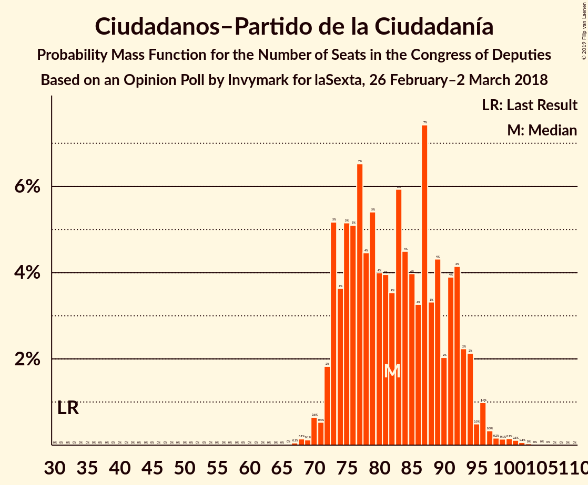
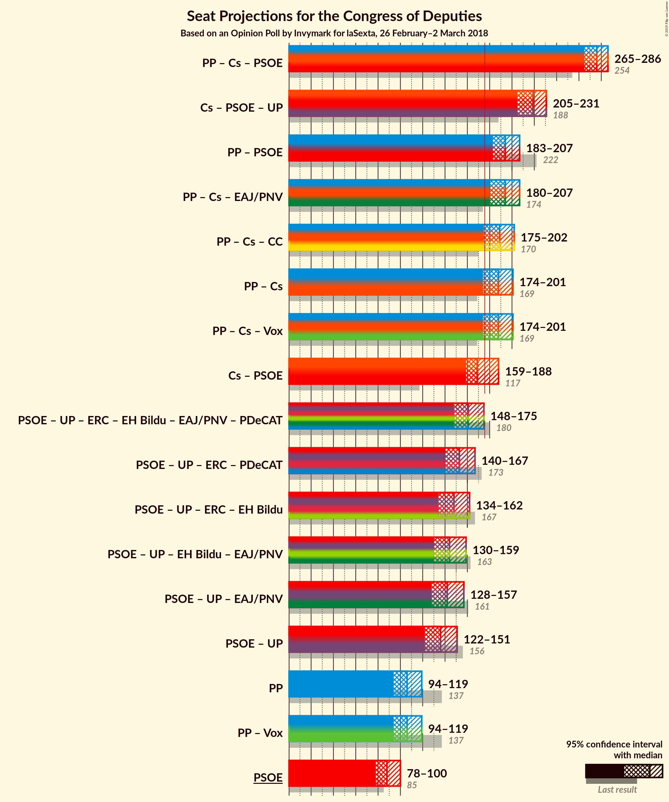

# Opinion Poll by Invymark for laSexta, 26 February–2 March 2018

<a href="#voting-intentions">Voting Intentions</a> | <a href="#seats">Seats</a> | <a href="#coalitions">Coalitions</a> | <a href="#technical-information">Technical Information</a>

## Voting Intentions

### Confidence Intervals

| Party | Last Result | Poll Result | 80% Confidence Interval | 90% Confidence Interval | 95% Confidence Interval | 99% Confidence Interval |
|:-----:|:-----------:|:-----------:|:-----------------------:|:-----------------------:|:-----------------------:|:-----------------------:|
| Partido Popular | 33.0% | 26.0% | 24.4–27.7% |24.0–28.2% |23.6–28.6% |22.8–29.4% |
| Ciudadanos–Partido de la Ciudadanía | 13.1% | 24.0% | 22.5–25.6% |22.0–26.1% |21.7–26.5% |20.9–27.3% |
| Partido Socialista Obrero Español | 22.6% | 23.1% | 21.6–24.7% |21.1–25.2% |20.8–25.6% |20.1–26.4% |
| Unidos Podemos | 21.2% | 16.5% | 15.2–18.0% |14.8–18.4% |14.5–18.7% |13.9–19.4% |

*Note:* The poll result column reflects the actual value used in the calculations. Published results may vary slightly, and in addition be rounded to fewer digits.

## Seats

### Confidence Intervals

| Party | Last Result | Median | 80% Confidence Interval | 90% Confidence Interval | 95% Confidence Interval | 99% Confidence Interval |
|:-----:|:-----------:|:------:|:-----------------------:|:-----------------------:|:-----------------------:|:-----------------------:|
| <a href="#partido-popular">Partido Popular</a> | 137 | 107 | 94–118 |92–119 |92–119 |92–119 |
| <a href="#ciudadanos–partido-de-la-ciudadanía">Ciudadanos–Partido de la Ciudadanía</a> | 32 | 84 | 73–89 |72–93 |71–99 |71–100 |
| <a href="#partido-socialista-obrero-español">Partido Socialista Obrero Español</a> | 85 | 88 | 86–94 |78–102 |78–102 |74–102 |
| <a href="#unidos-podemos">Unidos Podemos</a> | 71 | 44 | 39–58 |39–59 |39–59 |36–59 |

### Partido Popular

*For a full overview of the results for this party, see the [Partido Popular](party-partidopopular.html) page.*

| Number of Seats | Probability | Accumulated | Special Marks |
|:---------------:|:-----------:|:-----------:|:-------------:|
| 91 | 0% | 100% |  |
| 92 | 9% | 99.9% |  |
| 93 | 0.1% | 91% |  |
| 94 | 3% | 91% |  |
| 95 | 2% | 87% |  |
| 96 | 0.7% | 85% |  |
| 97 | 0.3% | 84% |  |
| 98 | 0% | 84% |  |
| 99 | 0% | 84% |  |
| 100 | 0% | 84% |  |
| 101 | 0% | 84% |  |
| 102 | 0% | 84% |  |
| 103 | 7% | 84% |  |
| 104 | 17% | 77% |  |
| 105 | 10% | 60% |  |
| 106 | 0.2% | 50% |  |
| 107 | 0.2% | 50% | Median |
| 108 | 0.1% | 50% |  |
| 109 | 38% | 50% |  |
| 110 | 0% | 12% |  |
| 111 | 0% | 12% |  |
| 112 | 0% | 12% |  |
| 113 | 0% | 12% |  |
| 114 | 0.1% | 12% |  |
| 115 | 0.4% | 12% |  |
| 116 | 0% | 11% |  |
| 117 | 1.0% | 11% |  |
| 118 | 3% | 10% |  |
| 119 | 7% | 7% |  |
| 120 | 0.1% | 0.2% |  |
| 121 | 0% | 0% |  |
| 122 | 0% | 0% |  |
| 123 | 0% | 0% |  |
| 124 | 0% | 0% |  |
| 125 | 0% | 0% |  |
| 126 | 0% | 0% |  |
| 127 | 0% | 0% |  |
| 128 | 0% | 0% |  |
| 129 | 0% | 0% |  |
| 130 | 0% | 0% |  |
| 131 | 0% | 0% |  |
| 132 | 0% | 0% |  |
| 133 | 0% | 0% |  |
| 134 | 0% | 0% |  |
| 135 | 0% | 0% |  |
| 136 | 0% | 0% |  |
| 137 | 0% | 0% | Last Result |

### Ciudadanos–Partido de la Ciudadanía

*For a full overview of the results for this party, see the [Ciudadanos–Partido de la Ciudadanía](party-ciudadanos–partidodelaciudadanía.html) page.*

| Number of Seats | Probability | Accumulated | Special Marks |
|:---------------:|:-----------:|:-----------:|:-------------:|
| 32 | 0% | 100% | Last Result |
| 33 | 0% | 100% |  |
| 34 | 0% | 100% |  |
| 35 | 0% | 100% |  |
| 36 | 0% | 100% |  |
| 37 | 0% | 100% |  |
| 38 | 0% | 100% |  |
| 39 | 0% | 100% |  |
| 40 | 0% | 100% |  |
| 41 | 0% | 100% |  |
| 42 | 0% | 100% |  |
| 43 | 0% | 100% |  |
| 44 | 0% | 100% |  |
| 45 | 0% | 100% |  |
| 46 | 0% | 100% |  |
| 47 | 0% | 100% |  |
| 48 | 0% | 100% |  |
| 49 | 0% | 100% |  |
| 50 | 0% | 100% |  |
| 51 | 0% | 100% |  |
| 52 | 0% | 100% |  |
| 53 | 0% | 100% |  |
| 54 | 0% | 100% |  |
| 55 | 0% | 100% |  |
| 56 | 0% | 100% |  |
| 57 | 0% | 100% |  |
| 58 | 0% | 100% |  |
| 59 | 0% | 100% |  |
| 60 | 0% | 100% |  |
| 61 | 0% | 100% |  |
| 62 | 0% | 100% |  |
| 63 | 0% | 100% |  |
| 64 | 0% | 100% |  |
| 65 | 0% | 100% |  |
| 66 | 0% | 100% |  |
| 67 | 0% | 100% |  |
| 68 | 0% | 100% |  |
| 69 | 0% | 100% |  |
| 70 | 0% | 100% |  |
| 71 | 5% | 100% |  |
| 72 | 1.5% | 95% |  |
| 73 | 6% | 94% |  |
| 74 | 3% | 87% |  |
| 75 | 0.3% | 85% |  |
| 76 | 13% | 84% |  |
| 77 | 6% | 71% |  |
| 78 | 4% | 65% |  |
| 79 | 0.1% | 61% |  |
| 80 | 0% | 61% |  |
| 81 | 0% | 61% |  |
| 82 | 5% | 61% |  |
| 83 | 5% | 56% |  |
| 84 | 3% | 51% | Median |
| 85 | 5% | 48% |  |
| 86 | 0% | 43% |  |
| 87 | 0% | 43% |  |
| 88 | 0% | 43% |  |
| 89 | 38% | 43% |  |
| 90 | 0% | 5% |  |
| 91 | 0% | 5% |  |
| 92 | 0% | 5% |  |
| 93 | 0.4% | 5% |  |
| 94 | 0.2% | 5% |  |
| 95 | 0.3% | 4% |  |
| 96 | 0.1% | 4% |  |
| 97 | 0.5% | 4% |  |
| 98 | 0.9% | 4% |  |
| 99 | 2% | 3% |  |
| 100 | 0.6% | 0.7% |  |
| 101 | 0% | 0% |  |

### Partido Socialista Obrero Español

*For a full overview of the results for this party, see the [Partido Socialista Obrero Español](party-partidosocialistaobreroespañol.html) page.*

| Number of Seats | Probability | Accumulated | Special Marks |
|:---------------:|:-----------:|:-----------:|:-------------:|
| 71 | 0.1% | 100% |  |
| 72 | 0.4% | 99.9% |  |
| 73 | 0% | 99.5% |  |
| 74 | 0.1% | 99.5% |  |
| 75 | 0% | 99.5% |  |
| 76 | 0% | 99.4% |  |
| 77 | 0% | 99.4% |  |
| 78 | 5% | 99.4% |  |
| 79 | 0.4% | 95% |  |
| 80 | 0.1% | 94% |  |
| 81 | 0% | 94% |  |
| 82 | 0% | 94% |  |
| 83 | 1.4% | 94% |  |
| 84 | 0.8% | 93% |  |
| 85 | 2% | 92% | Last Result |
| 86 | 24% | 90% |  |
| 87 | 13% | 67% |  |
| 88 | 31% | 53% | Median |
| 89 | 0.1% | 23% |  |
| 90 | 0% | 23% |  |
| 91 | 0% | 23% |  |
| 92 | 4% | 23% |  |
| 93 | 0% | 19% |  |
| 94 | 9% | 19% |  |
| 95 | 0% | 10% |  |
| 96 | 0% | 10% |  |
| 97 | 0% | 10% |  |
| 98 | 0% | 10% |  |
| 99 | 0.5% | 10% |  |
| 100 | 0% | 9% |  |
| 101 | 0.6% | 9% |  |
| 102 | 9% | 9% |  |
| 103 | 0% | 0.1% |  |
| 104 | 0% | 0.1% |  |
| 105 | 0% | 0.1% |  |
| 106 | 0% | 0.1% |  |
| 107 | 0% | 0.1% |  |
| 108 | 0% | 0% |  |

### Unidos Podemos

*For a full overview of the results for this party, see the [Unidos Podemos](party-unidospodemos.html) page.*

| Number of Seats | Probability | Accumulated | Special Marks |
|:---------------:|:-----------:|:-----------:|:-------------:|
| 34 | 0.1% | 100% |  |
| 35 | 0% | 99.8% |  |
| 36 | 0.4% | 99.8% |  |
| 37 | 0.5% | 99.4% |  |
| 38 | 0.7% | 98.9% |  |
| 39 | 38% | 98% |  |
| 40 | 0.1% | 60% |  |
| 41 | 5% | 60% |  |
| 42 | 0% | 55% |  |
| 43 | 3% | 55% |  |
| 44 | 6% | 52% | Median |
| 45 | 0.4% | 46% |  |
| 46 | 4% | 45% |  |
| 47 | 0.3% | 42% |  |
| 48 | 3% | 41% |  |
| 49 | 1.0% | 38% |  |
| 50 | 0.5% | 37% |  |
| 51 | 0% | 36% |  |
| 52 | 0% | 36% |  |
| 53 | 0.1% | 36% |  |
| 54 | 0.5% | 36% |  |
| 55 | 3% | 36% |  |
| 56 | 4% | 32% |  |
| 57 | 15% | 29% |  |
| 58 | 7% | 13% |  |
| 59 | 6% | 7% |  |
| 60 | 0.1% | 0.1% |  |
| 61 | 0% | 0.1% |  |
| 62 | 0.1% | 0.1% |  |
| 63 | 0% | 0% |  |
| 64 | 0% | 0% |  |
| 65 | 0% | 0% |  |
| 66 | 0% | 0% |  |
| 67 | 0% | 0% |  |
| 68 | 0% | 0% |  |
| 69 | 0% | 0% |  |
| 70 | 0% | 0% |  |
| 71 | 0% | 0% | Last Result |

## Coalitions

### Confidence Intervals

| Coalition | Last Result | Median | Majority? | 80% Confidence Interval | 90% Confidence Interval | 95% Confidence Interval | 99% Confidence Interval |
|:---------:|:-----------:|:------:|:---------:|:-----------------------:|:-----------------------:|:-----------------------:|:-----------------------:|
| Partido Popular – Ciudadanos–Partido de la Ciudadanía – Partido Socialista Obrero Español | 254 | 280 | 100% | 266–286 | 265–286 | 265–286 | 265–287 |
| Ciudadanos–Partido de la Ciudadanía – Partido Socialista Obrero Español – Unidos Podemos | 188 | 217 | 100% | 207–231 | 205–233 | 204–233 | 204–233 |
| Partido Popular – Partido Socialista Obrero Español | 222 | 196 | 99.6% | 186–207 | 186–207 | 180–207 | 178–207 |
| Partido Popular – Ciudadanos–Partido de la Ciudadanía | 169 | 189 | 91% | 178–198 | 174–204 | 174–204 | 174–204 |
| Ciudadanos–Partido de la Ciudadanía – Partido Socialista Obrero Español | 117 | 176 | 57% | 162–177 | 160–177 | 159–183 | 159–192 |
| Partido Socialista Obrero Español – Unidos Podemos | 156 | 136 | 0% | 126–147 | 120–151 | 119–151 | 119–151 |
| Partido Popular | 137 | 107 | 0% | 94–118 | 92–119 | 92–119 | 92–119 |
| Partido Socialista Obrero Español | 85 | 88 | 0% | 86–94 | 78–102 | 78–102 | 74–102 |

### Partido Popular – Ciudadanos–Partido de la Ciudadanía – Partido Socialista Obrero Español

| Number of Seats | Probability | Accumulated | Special Marks |
|:---------------:|:-----------:|:-----------:|:-------------:|
| 254 | 0% | 100% | Last Result |
| 255 | 0% | 100% |  |
| 256 | 0% | 100% |  |
| 257 | 0% | 100% |  |
| 258 | 0% | 100% |  |
| 259 | 0% | 100% |  |
| 260 | 0% | 100% |  |
| 261 | 0.1% | 100% |  |
| 262 | 0% | 99.9% |  |
| 263 | 0% | 99.9% |  |
| 264 | 0.1% | 99.9% |  |
| 265 | 6% | 99.9% |  |
| 266 | 7% | 93% |  |
| 267 | 6% | 87% |  |
| 268 | 9% | 81% |  |
| 269 | 4% | 71% |  |
| 270 | 4% | 68% |  |
| 271 | 0.2% | 64% |  |
| 272 | 0% | 64% |  |
| 273 | 0% | 64% |  |
| 274 | 0.5% | 64% |  |
| 275 | 0% | 63% |  |
| 276 | 1.0% | 63% |  |
| 277 | 3% | 62% |  |
| 278 | 0.3% | 59% |  |
| 279 | 4% | 58% | Median |
| 280 | 6% | 54% |  |
| 281 | 3% | 48% |  |
| 282 | 5% | 45% |  |
| 283 | 0.5% | 41% |  |
| 284 | 0.5% | 40% |  |
| 285 | 14% | 40% |  |
| 286 | 25% | 26% |  |
| 287 | 0.6% | 0.7% |  |
| 288 | 0% | 0.2% |  |
| 289 | 0.1% | 0.2% |  |
| 290 | 0% | 0% |  |

### Ciudadanos–Partido de la Ciudadanía – Partido Socialista Obrero Español – Unidos Podemos

| Number of Seats | Probability | Accumulated | Special Marks |
|:---------------:|:-----------:|:-----------:|:-------------:|
| 188 | 0% | 100% | Last Result |
| 189 | 0% | 100% |  |
| 190 | 0% | 100% |  |
| 191 | 0% | 100% |  |
| 192 | 0% | 100% |  |
| 193 | 0% | 100% |  |
| 194 | 0% | 100% |  |
| 195 | 0% | 100% |  |
| 196 | 0% | 100% |  |
| 197 | 0% | 100% |  |
| 198 | 0% | 100% |  |
| 199 | 0% | 100% |  |
| 200 | 0% | 100% |  |
| 201 | 0% | 100% |  |
| 202 | 0% | 100% |  |
| 203 | 0% | 100% |  |
| 204 | 5% | 99.9% |  |
| 205 | 0.4% | 95% |  |
| 206 | 1.5% | 95% |  |
| 207 | 3% | 93% |  |
| 208 | 1.0% | 90% |  |
| 209 | 0.5% | 89% |  |
| 210 | 0% | 88% |  |
| 211 | 0% | 88% |  |
| 212 | 0% | 88% |  |
| 213 | 0% | 88% |  |
| 214 | 0.2% | 88% |  |
| 215 | 13% | 88% |  |
| 216 | 25% | 75% | Median |
| 217 | 0.2% | 50% |  |
| 218 | 0.9% | 50% |  |
| 219 | 9% | 49% |  |
| 220 | 13% | 40% |  |
| 221 | 11% | 27% |  |
| 222 | 0% | 16% |  |
| 223 | 0% | 16% |  |
| 224 | 0% | 16% |  |
| 225 | 0% | 16% |  |
| 226 | 0% | 16% |  |
| 227 | 0.1% | 16% |  |
| 228 | 0.7% | 16% |  |
| 229 | 0.6% | 15% |  |
| 230 | 2% | 14% |  |
| 231 | 3% | 13% |  |
| 232 | 0.1% | 9% |  |
| 233 | 9% | 9% |  |
| 234 | 0% | 0.1% |  |
| 235 | 0% | 0% |  |

### Partido Popular – Partido Socialista Obrero Español

| Number of Seats | Probability | Accumulated | Special Marks |
|:---------------:|:-----------:|:-----------:|:-------------:|
| 175 | 0.4% | 100% |  |
| 176 | 0% | 99.6% | Majority |
| 177 | 0% | 99.6% |  |
| 178 | 0.1% | 99.6% |  |
| 179 | 0.9% | 99.5% |  |
| 180 | 2% | 98.6% |  |
| 181 | 0% | 97% |  |
| 182 | 0% | 97% |  |
| 183 | 0% | 97% |  |
| 184 | 0% | 97% |  |
| 185 | 0% | 97% |  |
| 186 | 12% | 97% |  |
| 187 | 1.0% | 85% |  |
| 188 | 1.1% | 84% |  |
| 189 | 7% | 83% |  |
| 190 | 17% | 76% |  |
| 191 | 0% | 60% |  |
| 192 | 0% | 60% |  |
| 193 | 0% | 60% |  |
| 194 | 0.4% | 60% |  |
| 195 | 0.4% | 59% | Median |
| 196 | 13% | 59% |  |
| 197 | 29% | 45% |  |
| 198 | 0.3% | 16% |  |
| 199 | 0% | 16% |  |
| 200 | 0.1% | 16% |  |
| 201 | 0% | 16% |  |
| 202 | 0% | 16% |  |
| 203 | 0.4% | 16% |  |
| 204 | 0% | 15% |  |
| 205 | 1.0% | 15% |  |
| 206 | 4% | 14% |  |
| 207 | 10% | 10% |  |
| 208 | 0.3% | 0.3% |  |
| 209 | 0% | 0% |  |
| 210 | 0% | 0% |  |
| 211 | 0% | 0% |  |
| 212 | 0% | 0% |  |
| 213 | 0% | 0% |  |
| 214 | 0% | 0% |  |
| 215 | 0% | 0% |  |
| 216 | 0% | 0% |  |
| 217 | 0% | 0% |  |
| 218 | 0% | 0% |  |
| 219 | 0% | 0% |  |
| 220 | 0% | 0% |  |
| 221 | 0% | 0% |  |
| 222 | 0% | 0% | Last Result |

### Partido Popular – Ciudadanos–Partido de la Ciudadanía

| Number of Seats | Probability | Accumulated | Special Marks |
|:---------------:|:-----------:|:-----------:|:-------------:|
| 169 | 0% | 100% | Last Result |
| 170 | 0% | 100% |  |
| 171 | 0% | 100% |  |
| 172 | 0% | 99.9% |  |
| 173 | 0% | 99.9% |  |
| 174 | 5% | 99.9% |  |
| 175 | 4% | 95% |  |
| 176 | 0% | 91% | Majority |
| 177 | 0% | 91% |  |
| 178 | 10% | 91% |  |
| 179 | 9% | 81% |  |
| 180 | 7% | 72% |  |
| 181 | 6% | 65% |  |
| 182 | 4% | 59% |  |
| 183 | 0.1% | 55% |  |
| 184 | 0% | 55% |  |
| 185 | 0% | 55% |  |
| 186 | 0.4% | 55% |  |
| 187 | 0.1% | 54% |  |
| 188 | 1.4% | 54% |  |
| 189 | 3% | 53% |  |
| 190 | 0.2% | 49% |  |
| 191 | 2% | 49% | Median |
| 192 | 0% | 48% |  |
| 193 | 0.3% | 48% |  |
| 194 | 1.4% | 48% |  |
| 195 | 0.6% | 46% |  |
| 196 | 0.3% | 46% |  |
| 197 | 0% | 45% |  |
| 198 | 39% | 45% |  |
| 199 | 0.1% | 7% |  |
| 200 | 0% | 7% |  |
| 201 | 0.2% | 7% |  |
| 202 | 0.3% | 6% |  |
| 203 | 0.6% | 6% |  |
| 204 | 5% | 5% |  |
| 205 | 0.1% | 0.2% |  |
| 206 | 0% | 0.1% |  |
| 207 | 0% | 0.1% |  |
| 208 | 0% | 0.1% |  |
| 209 | 0% | 0.1% |  |
| 210 | 0% | 0.1% |  |
| 211 | 0% | 0.1% |  |
| 212 | 0% | 0.1% |  |
| 213 | 0.1% | 0.1% |  |
| 214 | 0% | 0% |  |

### Ciudadanos–Partido de la Ciudadanía – Partido Socialista Obrero Español

| Number of Seats | Probability | Accumulated | Special Marks |
|:---------------:|:-----------:|:-----------:|:-------------:|
| 117 | 0% | 100% | Last Result |
| 118 | 0% | 100% |  |
| 119 | 0% | 100% |  |
| 120 | 0% | 100% |  |
| 121 | 0% | 100% |  |
| 122 | 0% | 100% |  |
| 123 | 0% | 100% |  |
| 124 | 0% | 100% |  |
| 125 | 0% | 100% |  |
| 126 | 0% | 100% |  |
| 127 | 0% | 100% |  |
| 128 | 0% | 100% |  |
| 129 | 0% | 100% |  |
| 130 | 0% | 100% |  |
| 131 | 0% | 100% |  |
| 132 | 0% | 100% |  |
| 133 | 0% | 100% |  |
| 134 | 0% | 100% |  |
| 135 | 0% | 100% |  |
| 136 | 0% | 100% |  |
| 137 | 0% | 100% |  |
| 138 | 0% | 100% |  |
| 139 | 0% | 100% |  |
| 140 | 0% | 100% |  |
| 141 | 0% | 100% |  |
| 142 | 0% | 100% |  |
| 143 | 0% | 100% |  |
| 144 | 0% | 100% |  |
| 145 | 0% | 100% |  |
| 146 | 0% | 100% |  |
| 147 | 0.1% | 100% |  |
| 148 | 0% | 99.9% |  |
| 149 | 0% | 99.9% |  |
| 150 | 0% | 99.9% |  |
| 151 | 0% | 99.9% |  |
| 152 | 0% | 99.9% |  |
| 153 | 0% | 99.9% |  |
| 154 | 0% | 99.9% |  |
| 155 | 0% | 99.9% |  |
| 156 | 0% | 99.9% |  |
| 157 | 0% | 99.9% |  |
| 158 | 0% | 99.9% |  |
| 159 | 5% | 99.9% |  |
| 160 | 1.4% | 95% |  |
| 161 | 0.1% | 94% |  |
| 162 | 13% | 94% |  |
| 163 | 11% | 80% |  |
| 164 | 4% | 70% |  |
| 165 | 0.2% | 65% |  |
| 166 | 0% | 65% |  |
| 167 | 0.3% | 65% |  |
| 168 | 0.1% | 65% |  |
| 169 | 0% | 65% |  |
| 170 | 0% | 65% |  |
| 171 | 0% | 65% |  |
| 172 | 0% | 65% | Median |
| 173 | 0% | 65% |  |
| 174 | 0.4% | 65% |  |
| 175 | 7% | 64% |  |
| 176 | 24% | 57% | Majority |
| 177 | 28% | 33% |  |
| 178 | 0% | 5% |  |
| 179 | 0% | 5% |  |
| 180 | 0.3% | 5% |  |
| 181 | 1.0% | 4% |  |
| 182 | 0.3% | 3% |  |
| 183 | 0.7% | 3% |  |
| 184 | 1.1% | 2% |  |
| 185 | 0.6% | 1.2% |  |
| 186 | 0% | 0.6% |  |
| 187 | 0% | 0.6% |  |
| 188 | 0% | 0.6% |  |
| 189 | 0% | 0.6% |  |
| 190 | 0% | 0.6% |  |
| 191 | 0% | 0.6% |  |
| 192 | 0.4% | 0.6% |  |
| 193 | 0.1% | 0.2% |  |
| 194 | 0% | 0% |  |

### Partido Socialista Obrero Español – Unidos Podemos

| Number of Seats | Probability | Accumulated | Special Marks |
|:---------------:|:-----------:|:-----------:|:-------------:|
| 110 | 0.1% | 100% |  |
| 111 | 0% | 99.9% |  |
| 112 | 0% | 99.9% |  |
| 113 | 0% | 99.9% |  |
| 114 | 0% | 99.9% |  |
| 115 | 0% | 99.9% |  |
| 116 | 0% | 99.9% |  |
| 117 | 0% | 99.9% |  |
| 118 | 0% | 99.9% |  |
| 119 | 5% | 99.9% |  |
| 120 | 0.9% | 95% |  |
| 121 | 0.6% | 94% |  |
| 122 | 0.2% | 94% |  |
| 123 | 0% | 93% |  |
| 124 | 0% | 93% |  |
| 125 | 0.4% | 93% |  |
| 126 | 14% | 93% |  |
| 127 | 25% | 79% |  |
| 128 | 0% | 55% |  |
| 129 | 0.3% | 55% |  |
| 130 | 0.6% | 54% |  |
| 131 | 1.4% | 54% |  |
| 132 | 0.3% | 52% | Median |
| 133 | 0.1% | 52% |  |
| 134 | 2% | 52% |  |
| 135 | 0.4% | 51% |  |
| 136 | 3% | 50% |  |
| 137 | 1.0% | 47% |  |
| 138 | 0.4% | 46% |  |
| 139 | 0% | 45% |  |
| 140 | 0% | 45% |  |
| 141 | 0% | 45% |  |
| 142 | 0.3% | 45% |  |
| 143 | 10% | 45% |  |
| 144 | 7% | 35% |  |
| 145 | 9% | 28% |  |
| 146 | 6% | 19% |  |
| 147 | 3% | 13% |  |
| 148 | 0% | 9% |  |
| 149 | 0% | 9% |  |
| 150 | 4% | 9% |  |
| 151 | 5% | 5% |  |
| 152 | 0% | 0.1% |  |
| 153 | 0% | 0.1% |  |
| 154 | 0% | 0% |  |
| 155 | 0% | 0% |  |
| 156 | 0% | 0% | Last Result |

### Partido Popular

| Number of Seats | Probability | Accumulated | Special Marks |
|:---------------:|:-----------:|:-----------:|:-------------:|
| 91 | 0% | 100% |  |
| 92 | 9% | 99.9% |  |
| 93 | 0.1% | 91% |  |
| 94 | 3% | 91% |  |
| 95 | 2% | 87% |  |
| 96 | 0.7% | 85% |  |
| 97 | 0.3% | 84% |  |
| 98 | 0% | 84% |  |
| 99 | 0% | 84% |  |
| 100 | 0% | 84% |  |
| 101 | 0% | 84% |  |
| 102 | 0% | 84% |  |
| 103 | 7% | 84% |  |
| 104 | 17% | 77% |  |
| 105 | 10% | 60% |  |
| 106 | 0.2% | 50% |  |
| 107 | 0.2% | 50% | Median |
| 108 | 0.1% | 50% |  |
| 109 | 38% | 50% |  |
| 110 | 0% | 12% |  |
| 111 | 0% | 12% |  |
| 112 | 0% | 12% |  |
| 113 | 0% | 12% |  |
| 114 | 0.1% | 12% |  |
| 115 | 0.4% | 12% |  |
| 116 | 0% | 11% |  |
| 117 | 1.0% | 11% |  |
| 118 | 3% | 10% |  |
| 119 | 7% | 7% |  |
| 120 | 0.1% | 0.2% |  |
| 121 | 0% | 0% |  |
| 122 | 0% | 0% |  |
| 123 | 0% | 0% |  |
| 124 | 0% | 0% |  |
| 125 | 0% | 0% |  |
| 126 | 0% | 0% |  |
| 127 | 0% | 0% |  |
| 128 | 0% | 0% |  |
| 129 | 0% | 0% |  |
| 130 | 0% | 0% |  |
| 131 | 0% | 0% |  |
| 132 | 0% | 0% |  |
| 133 | 0% | 0% |  |
| 134 | 0% | 0% |  |
| 135 | 0% | 0% |  |
| 136 | 0% | 0% |  |
| 137 | 0% | 0% | Last Result |

### Partido Socialista Obrero Español

| Number of Seats | Probability | Accumulated | Special Marks |
|:---------------:|:-----------:|:-----------:|:-------------:|
| 71 | 0.1% | 100% |  |
| 72 | 0.4% | 99.9% |  |
| 73 | 0% | 99.5% |  |
| 74 | 0.1% | 99.5% |  |
| 75 | 0% | 99.5% |  |
| 76 | 0% | 99.4% |  |
| 77 | 0% | 99.4% |  |
| 78 | 5% | 99.4% |  |
| 79 | 0.4% | 95% |  |
| 80 | 0.1% | 94% |  |
| 81 | 0% | 94% |  |
| 82 | 0% | 94% |  |
| 83 | 1.4% | 94% |  |
| 84 | 0.8% | 93% |  |
| 85 | 2% | 92% | Last Result |
| 86 | 24% | 90% |  |
| 87 | 13% | 67% |  |
| 88 | 31% | 53% | Median |
| 89 | 0.1% | 23% |  |
| 90 | 0% | 23% |  |
| 91 | 0% | 23% |  |
| 92 | 4% | 23% |  |
| 93 | 0% | 19% |  |
| 94 | 9% | 19% |  |
| 95 | 0% | 10% |  |
| 96 | 0% | 10% |  |
| 97 | 0% | 10% |  |
| 98 | 0% | 10% |  |
| 99 | 0.5% | 10% |  |
| 100 | 0% | 9% |  |
| 101 | 0.6% | 9% |  |
| 102 | 9% | 9% |  |
| 103 | 0% | 0.1% |  |
| 104 | 0% | 0.1% |  |
| 105 | 0% | 0.1% |  |
| 106 | 0% | 0.1% |  |
| 107 | 0% | 0.1% |  |
| 108 | 0% | 0% |  |

## Technical Information

### Opinion Poll

+ **Polling firm:** Invymark
+ **Commissioner(s):** laSexta
+ **Fieldwork period:** 26 February–2 March 2018

### Calculations

+ **Sample size:** 1200
+ **Simulations done:** 1,024
+ **Error estimate:** 3.87%

