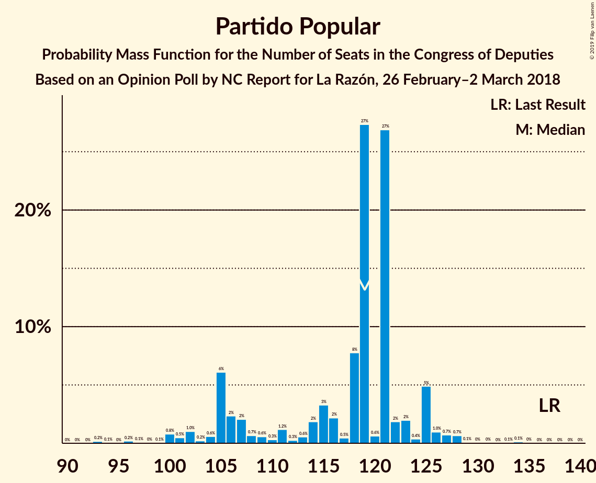
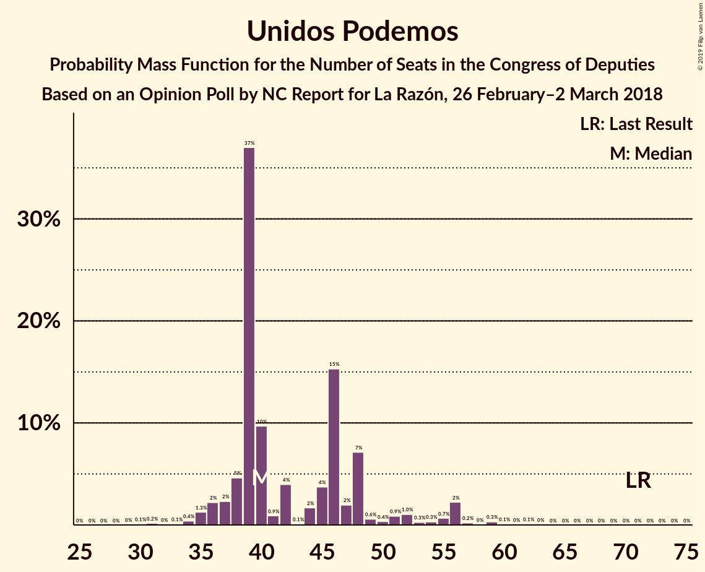
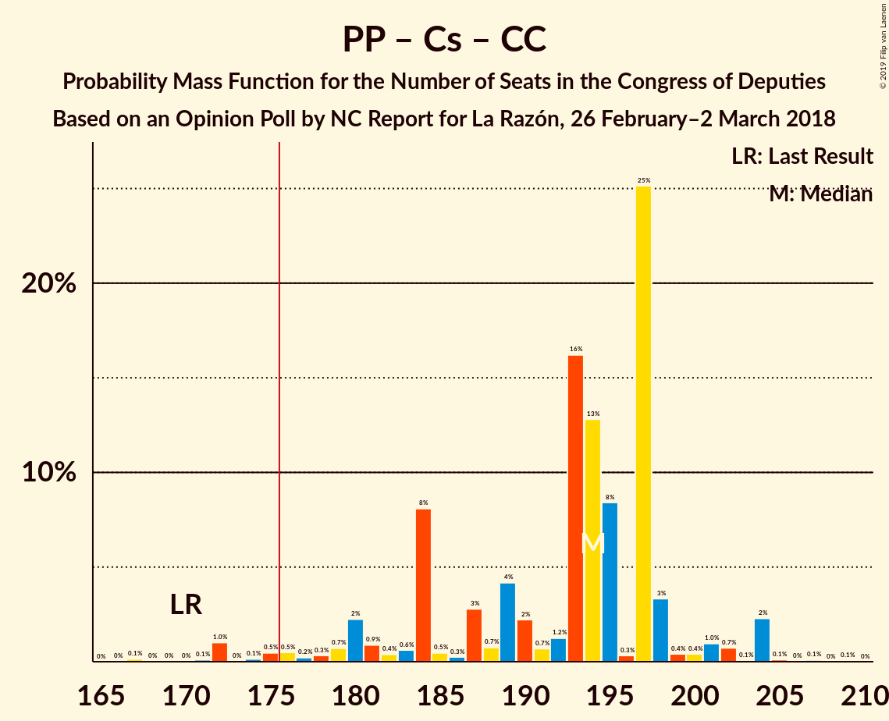
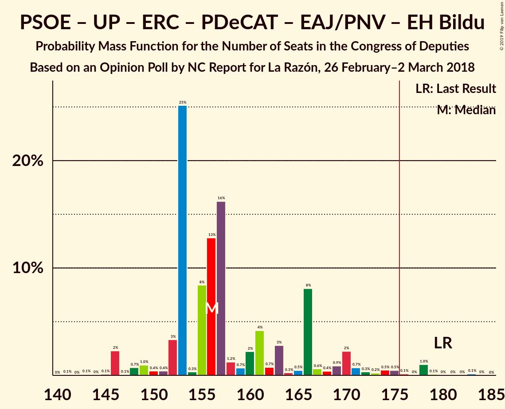
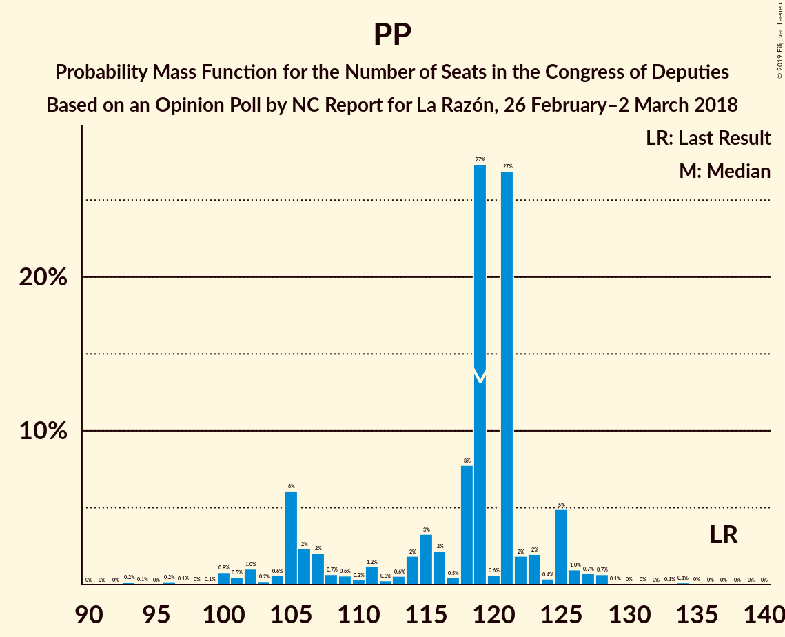
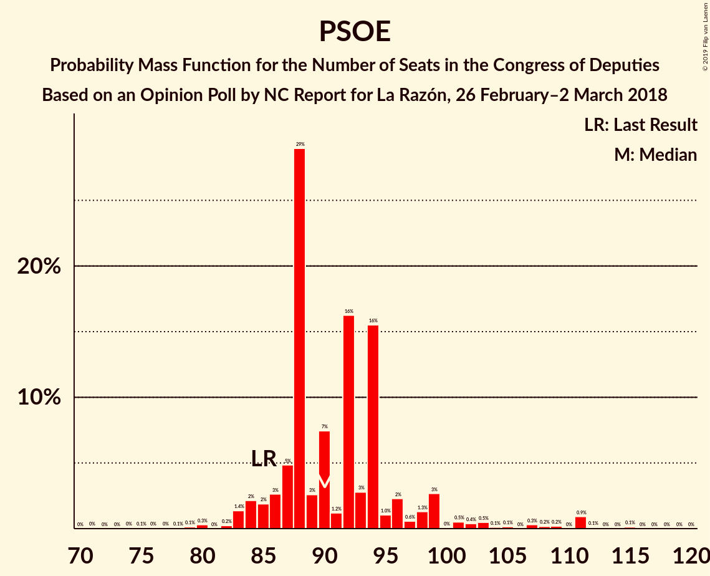

# Opinion Poll by NC Report for La Razón, 26 February–2 March 2018

<a href="#voting-intentions">Voting Intentions</a> | <a href="#seats">Seats</a> | <a href="#coalitions">Coalitions</a> | <a href="#technical-information">Technical Information</a>

## Voting Intentions

### Confidence Intervals

| Party | Last Result | Poll Result | 80% Confidence Interval | 90% Confidence Interval | 95% Confidence Interval | 99% Confidence Interval |
|:-----:|:-----------:|:-----------:|:-----------------------:|:-----------------------:|:-----------------------:|:-----------------------:|
| Partido Popular | 33.0% | 27.9% | 26.1–29.8% |25.6–30.3% |25.2–30.8% |24.4–31.7% |
| Partido Socialista Obrero Español | 22.6% | 24.0% | 22.3–25.8% |21.9–26.3% |21.4–26.7% |20.7–27.6% |
| Ciudadanos–Partido de la Ciudadanía | 13.1% | 22.1% | 20.5–23.9% |20.0–24.4% |19.6–24.8% |18.9–25.6% |
| Unidos Podemos | 21.2% | 15.8% | 14.4–17.4% |14.0–17.8% |13.7–18.2% |13.0–19.0% |
| Esquerra Republicana de Catalunya–Catalunya Sí | 2.7% | 2.8% | 2.2–3.6% |2.1–3.8% |1.9–4.0% |1.7–4.4% |
| Partit Demòcrata Europeu Català | 2.0% | 1.5% | 1.1–2.1% |1.0–2.3% |0.9–2.5% |0.7–2.8% |
| Euzko Alderdi Jeltzalea/Partido Nacionalista Vasco | 1.2% | 1.2% | 0.9–1.8% |0.8–1.9% |0.7–2.1% |0.5–2.4% |
| Euskal Herria Bildu | 0.8% | 0.8% | 0.5–1.3% |0.5–1.4% |0.4–1.6% |0.3–1.9% |
| Coalición Canaria–Partido Nacionalista Canario | 0.3% | 0.3% | 0.2–0.7% |0.1–0.8% |0.1–0.9% |0.1–1.1% |

*Note:* The poll result column reflects the actual value used in the calculations. Published results may vary slightly, and in addition be rounded to fewer digits.

## Seats

### Confidence Intervals

| Party | Last Result | Median | 80% Confidence Interval | 90% Confidence Interval | 95% Confidence Interval | 99% Confidence Interval |
|:-----:|:-----------:|:------:|:-----------------------:|:-----------------------:|:-----------------------:|:-----------------------:|
| <a href="#partido-popular">Partido Popular</a> | 137 | 121 | 121–130 |113–130 |111–130 |97–130 |
| <a href="#partido-socialista-obrero-español">Partido Socialista Obrero Español</a> | 85 | 88 | 76–93 |76–106 |76–106 |76–108 |
| <a href="#ciudadanos–partido-de-la-ciudadanía">Ciudadanos–Partido de la Ciudadanía</a> | 32 | 69 | 58–70 |58–70 |57–75 |57–79 |
| <a href="#unidos-podemos">Unidos Podemos</a> | 71 | 45 | 36–54 |36–54 |36–54 |36–54 |
| <a href="#esquerra-republicana-de-catalunya–catalunya-sí">Esquerra Republicana de Catalunya–Catalunya Sí</a> | 9 | 12 | 10–15 |9–15 |9–15 |9–15 |
| <a href="#partit-demòcrata-europeu-català">Partit Demòcrata Europeu Català</a> | 8 | 6 | 3–10 |3–10 |3–10 |3–10 |
| <a href="#euzko-alderdi-jeltzalea/partido-nacionalista-vasco">Euzko Alderdi Jeltzalea/Partido Nacionalista Vasco</a> | 5 | 7 | 7–8 |6–8 |6–8 |5–11 |
| <a href="#euskal-herria-bildu">Euskal Herria Bildu</a> | 2 | 4 | 1–5 |1–5 |1–5 |0–7 |
| <a href="#coalición-canaria–partido-nacionalista-canario">Coalición Canaria–Partido Nacionalista Canario</a> | 1 | 1 | 0–1 |0–1 |0–1 |0–2 |

### Partido Popular

*For a full overview of the results for this party, see the [Partido Popular](party-partidopopular.html) page.*

| Number of Seats | Probability | Accumulated | Special Marks |
|:---------------:|:-----------:|:-----------:|:-------------:|
| 97 | 1.0% | 100% |  |
| 98 | 0% | 99.0% |  |
| 99 | 0% | 99.0% |  |
| 100 | 0% | 99.0% |  |
| 101 | 0% | 99.0% |  |
| 102 | 0% | 98.9% |  |
| 103 | 0% | 98.9% |  |
| 104 | 0% | 98.9% |  |
| 105 | 0% | 98.9% |  |
| 106 | 0% | 98.9% |  |
| 107 | 0% | 98.9% |  |
| 108 | 0% | 98.9% |  |
| 109 | 0% | 98.9% |  |
| 110 | 0% | 98.9% |  |
| 111 | 2% | 98.9% |  |
| 112 | 0.1% | 97% |  |
| 113 | 5% | 97% |  |
| 114 | 0% | 92% |  |
| 115 | 0% | 92% |  |
| 116 | 0% | 92% |  |
| 117 | 0% | 92% |  |
| 118 | 0% | 92% |  |
| 119 | 0% | 92% |  |
| 120 | 0.1% | 92% |  |
| 121 | 54% | 92% | Median |
| 122 | 0% | 38% |  |
| 123 | 0% | 38% |  |
| 124 | 0% | 38% |  |
| 125 | 0% | 38% |  |
| 126 | 0% | 38% |  |
| 127 | 0% | 38% |  |
| 128 | 0% | 38% |  |
| 129 | 0% | 38% |  |
| 130 | 38% | 38% |  |
| 131 | 0% | 0% |  |
| 132 | 0% | 0% |  |
| 133 | 0% | 0% |  |
| 134 | 0% | 0% |  |
| 135 | 0% | 0% |  |
| 136 | 0% | 0% |  |
| 137 | 0% | 0% | Last Result |

### Partido Socialista Obrero Español

*For a full overview of the results for this party, see the [Partido Socialista Obrero Español](party-partidosocialistaobreroespañol.html) page.*

| Number of Seats | Probability | Accumulated | Special Marks |
|:---------------:|:-----------:|:-----------:|:-------------:|
| 76 | 38% | 100% |  |
| 77 | 0% | 62% |  |
| 78 | 0% | 62% |  |
| 79 | 0% | 62% |  |
| 80 | 0% | 62% |  |
| 81 | 0% | 62% |  |
| 82 | 0% | 62% |  |
| 83 | 0% | 62% |  |
| 84 | 0% | 62% |  |
| 85 | 0% | 62% | Last Result |
| 86 | 0% | 62% |  |
| 87 | 2% | 62% |  |
| 88 | 32% | 60% | Median |
| 89 | 0% | 29% |  |
| 90 | 0% | 29% |  |
| 91 | 0% | 29% |  |
| 92 | 0% | 29% |  |
| 93 | 22% | 29% |  |
| 94 | 0% | 6% |  |
| 95 | 0% | 6% |  |
| 96 | 0% | 6% |  |
| 97 | 0% | 6% |  |
| 98 | 0% | 6% |  |
| 99 | 0% | 6% |  |
| 100 | 0.1% | 6% |  |
| 101 | 0% | 6% |  |
| 102 | 0% | 6% |  |
| 103 | 0% | 6% |  |
| 104 | 0% | 6% |  |
| 105 | 0.1% | 6% |  |
| 106 | 5% | 6% |  |
| 107 | 0% | 1.0% |  |
| 108 | 1.0% | 1.0% |  |
| 109 | 0% | 0% |  |

### Ciudadanos–Partido de la Ciudadanía

*For a full overview of the results for this party, see the [Ciudadanos–Partido de la Ciudadanía](party-ciudadanos–partidodelaciudadanía.html) page.*

| Number of Seats | Probability | Accumulated | Special Marks |
|:---------------:|:-----------:|:-----------:|:-------------:|
| 32 | 0% | 100% | Last Result |
| 33 | 0% | 100% |  |
| 34 | 0% | 100% |  |
| 35 | 0% | 100% |  |
| 36 | 0% | 100% |  |
| 37 | 0% | 100% |  |
| 38 | 0% | 100% |  |
| 39 | 0% | 100% |  |
| 40 | 0% | 100% |  |
| 41 | 0% | 100% |  |
| 42 | 0% | 100% |  |
| 43 | 0% | 100% |  |
| 44 | 0% | 100% |  |
| 45 | 0% | 100% |  |
| 46 | 0% | 100% |  |
| 47 | 0% | 100% |  |
| 48 | 0% | 100% |  |
| 49 | 0% | 100% |  |
| 50 | 0% | 100% |  |
| 51 | 0% | 100% |  |
| 52 | 0% | 100% |  |
| 53 | 0% | 100% |  |
| 54 | 0% | 100% |  |
| 55 | 0% | 100% |  |
| 56 | 0% | 100% |  |
| 57 | 5% | 100% |  |
| 58 | 22% | 95% |  |
| 59 | 0% | 73% |  |
| 60 | 0.1% | 73% |  |
| 61 | 0% | 73% |  |
| 62 | 0.1% | 73% |  |
| 63 | 0% | 72% |  |
| 64 | 0% | 72% |  |
| 65 | 0% | 72% |  |
| 66 | 0% | 72% |  |
| 67 | 0% | 72% |  |
| 68 | 0% | 72% |  |
| 69 | 52% | 72% | Median |
| 70 | 18% | 20% |  |
| 71 | 0% | 3% |  |
| 72 | 0% | 3% |  |
| 73 | 0% | 3% |  |
| 74 | 0% | 3% |  |
| 75 | 1.1% | 3% |  |
| 76 | 0.4% | 2% |  |
| 77 | 0% | 1.2% |  |
| 78 | 0% | 1.2% |  |
| 79 | 1.2% | 1.2% |  |
| 80 | 0% | 0% |  |

### Unidos Podemos

*For a full overview of the results for this party, see the [Unidos Podemos](party-unidospodemos.html) page.*

| Number of Seats | Probability | Accumulated | Special Marks |
|:---------------:|:-----------:|:-----------:|:-------------:|
| 34 | 0% | 100% |  |
| 35 | 0% | 99.9% |  |
| 36 | 33% | 99.9% |  |
| 37 | 0.1% | 67% |  |
| 38 | 0.1% | 67% |  |
| 39 | 0% | 67% |  |
| 40 | 0% | 67% |  |
| 41 | 0% | 67% |  |
| 42 | 0% | 67% |  |
| 43 | 0% | 67% |  |
| 44 | 5% | 67% |  |
| 45 | 38% | 62% | Median |
| 46 | 0% | 24% |  |
| 47 | 0% | 24% |  |
| 48 | 2% | 24% |  |
| 49 | 0% | 23% |  |
| 50 | 0% | 23% |  |
| 51 | 0% | 23% |  |
| 52 | 0% | 23% |  |
| 53 | 0% | 23% |  |
| 54 | 22% | 23% |  |
| 55 | 0% | 0.1% |  |
| 56 | 0% | 0.1% |  |
| 57 | 0% | 0.1% |  |
| 58 | 0% | 0.1% |  |
| 59 | 0% | 0.1% |  |
| 60 | 0% | 0% |  |
| 61 | 0% | 0% |  |
| 62 | 0% | 0% |  |
| 63 | 0% | 0% |  |
| 64 | 0% | 0% |  |
| 65 | 0% | 0% |  |
| 66 | 0% | 0% |  |
| 67 | 0% | 0% |  |
| 68 | 0% | 0% |  |
| 69 | 0% | 0% |  |
| 70 | 0% | 0% |  |
| 71 | 0% | 0% | Last Result |

### Esquerra Republicana de Catalunya–Catalunya Sí

*For a full overview of the results for this party, see the [Esquerra Republicana de Catalunya–Catalunya Sí](party-esquerrarepublicanadecatalunya–catalunyasí.html) page.*

| Number of Seats | Probability | Accumulated | Special Marks |
|:---------------:|:-----------:|:-----------:|:-------------:|
| 8 | 0.1% | 100% |  |
| 9 | 8% | 99.9% | Last Result |
| 10 | 31% | 92% |  |
| 11 | 0% | 61% |  |
| 12 | 23% | 61% | Median |
| 13 | 1.1% | 38% |  |
| 14 | 11% | 37% |  |
| 15 | 26% | 26% |  |
| 16 | 0% | 0.1% |  |
| 17 | 0% | 0.1% |  |
| 18 | 0% | 0.1% |  |
| 19 | 0% | 0.1% |  |
| 20 | 0.1% | 0.1% |  |
| 21 | 0% | 0% |  |

### Partit Demòcrata Europeu Català

*For a full overview of the results for this party, see the [Partit Demòcrata Europeu Català](party-partitdemòcrataeuropeucatalà.html) page.*

| Number of Seats | Probability | Accumulated | Special Marks |
|:---------------:|:-----------:|:-----------:|:-------------:|
| 3 | 24% | 100% |  |
| 4 | 0.1% | 76% |  |
| 5 | 0.2% | 76% |  |
| 6 | 38% | 76% | Median |
| 7 | 5% | 38% |  |
| 8 | 0.1% | 33% | Last Result |
| 9 | 1.0% | 33% |  |
| 10 | 32% | 32% |  |
| 11 | 0% | 0% |  |

### Euzko Alderdi Jeltzalea/Partido Nacionalista Vasco

*For a full overview of the results for this party, see the [Euzko Alderdi Jeltzalea/Partido Nacionalista Vasco](party-euzkoalderdijeltzaleapartidonacionalistavasco.html) page.*

| Number of Seats | Probability | Accumulated | Special Marks |
|:---------------:|:-----------:|:-----------:|:-------------:|
| 5 | 1.1% | 100% | Last Result |
| 6 | 5% | 98.9% |  |
| 7 | 54% | 94% | Median |
| 8 | 38% | 40% |  |
| 9 | 0% | 2% |  |
| 10 | 0% | 2% |  |
| 11 | 2% | 2% |  |
| 12 | 0% | 0% |  |

### Euskal Herria Bildu

*For a full overview of the results for this party, see the [Euskal Herria Bildu](party-euskalherriabildu.html) page.*

| Number of Seats | Probability | Accumulated | Special Marks |
|:---------------:|:-----------:|:-----------:|:-------------:|
| 0 | 2% | 100% |  |
| 1 | 27% | 98% |  |
| 2 | 0% | 71% | Last Result |
| 3 | 0% | 71% |  |
| 4 | 32% | 71% | Median |
| 5 | 38% | 39% |  |
| 6 | 0.1% | 1.2% |  |
| 7 | 1.0% | 1.0% |  |
| 8 | 0% | 0% |  |

### Coalición Canaria–Partido Nacionalista Canario

*For a full overview of the results for this party, see the [Coalición Canaria–Partido Nacionalista Canario](party-coalicióncanaria–partidonacionalistacanario.html) page.*

| Number of Seats | Probability | Accumulated | Special Marks |
|:---------------:|:-----------:|:-----------:|:-------------:|
| 0 | 33% | 100% |  |
| 1 | 65% | 67% | Last Result, Median |
| 2 | 2% | 2% |  |
| 3 | 0% | 0.1% |  |
| 4 | 0.1% | 0.1% |  |
| 5 | 0% | 0% |  |

## Coalitions

### Confidence Intervals

| Coalition | Last Result | Median | Majority? | 80% Confidence Interval | 90% Confidence Interval | 95% Confidence Interval | 99% Confidence Interval |
|:---------:|:-----------:|:------:|:---------:|:-----------------------:|:-----------------------:|:-----------------------:|:-----------------------:|
| Partido Popular – Partido Socialista Obrero Español – Ciudadanos–Partido de la Ciudadanía | 254 | 275 | 100% | 272–279 | 272–279 | 272–279 | 272–280 |
| Partido Popular – Partido Socialista Obrero Español | 222 | 209 | 100% | 206–214 | 206–217 | 205–219 | 198–219 |
| Partido Socialista Obrero Español – Ciudadanos–Partido de la Ciudadanía – Unidos Podemos | 188 | 193 | 100% | 190–205 | 190–207 | 190–211 | 190–219 |
| Partido Popular – Ciudadanos–Partido de la Ciudadanía – Coalición Canaria–Partido Nacionalista Canario | 170 | 191 | 94% | 180–200 | 172–201 | 171–201 | 171–201 |
| Partido Popular – Ciudadanos–Partido de la Ciudadanía | 169 | 190 | 94% | 179–199 | 172–200 | 170–200 | 170–200 |
| Partido Socialista Obrero Español – Unidos Podemos – Esquerra Republicana de Catalunya–Catalunya Sí – Partit Demòcrata Europeu Català – Euzko Alderdi Jeltzalea/Partido Nacionalista Vasco – Euskal Herria Bildu | 180 | 159 | 6% | 150–170 | 149–178 | 149–179 | 149–179 |
| Partido Socialista Obrero Español – Unidos Podemos – Esquerra Republicana de Catalunya–Catalunya Sí – Partit Demòcrata Europeu Català | 173 | 148 | 0% | 137–162 | 136–166 | 136–172 | 136–172 |
| Partido Socialista Obrero Español – Unidos Podemos – Esquerra Republicana de Catalunya–Catalunya Sí – Euskal Herria Bildu | 167 | 143 | 0% | 136–160 | 135–164 | 135–166 | 135–166 |
| Partido Socialista Obrero Español – Ciudadanos–Partido de la Ciudadanía | 117 | 151 | 1.0% | 145–158 | 145–163 | 145–163 | 145–183 |
| Partido Socialista Obrero Español – Unidos Podemos – Euzko Alderdi Jeltzalea/Partido Nacionalista Vasco – Euskal Herria Bildu | 163 | 135 | 0% | 134–155 | 134–156 | 134–157 | 134–157 |
| Partido Socialista Obrero Español – Unidos Podemos | 156 | 124 | 0% | 121–147 | 121–147 | 121–150 | 121–150 |
| Partido Popular | 137 | 121 | 0% | 121–130 | 113–130 | 111–130 | 97–130 |
| Partido Socialista Obrero Español | 85 | 88 | 0% | 76–93 | 76–106 | 76–106 | 76–108 |

### Partido Popular – Partido Socialista Obrero Español – Ciudadanos–Partido de la Ciudadanía

| Number of Seats | Probability | Accumulated | Special Marks |
|:---------------:|:-----------:|:-----------:|:-------------:|
| 254 | 0% | 100% | Last Result |
| 255 | 0% | 100% |  |
| 256 | 0% | 100% |  |
| 257 | 0% | 100% |  |
| 258 | 0% | 100% |  |
| 259 | 0% | 100% |  |
| 260 | 0% | 100% |  |
| 261 | 0% | 100% |  |
| 262 | 0% | 100% |  |
| 263 | 0% | 100% |  |
| 264 | 0% | 100% |  |
| 265 | 0% | 100% |  |
| 266 | 0% | 100% |  |
| 267 | 0% | 100% |  |
| 268 | 0% | 100% |  |
| 269 | 0% | 100% |  |
| 270 | 0% | 99.9% |  |
| 271 | 0% | 99.9% |  |
| 272 | 22% | 99.9% |  |
| 273 | 0% | 78% |  |
| 274 | 0.4% | 78% |  |
| 275 | 31% | 77% |  |
| 276 | 11% | 46% |  |
| 277 | 1.3% | 34% |  |
| 278 | 21% | 33% | Median |
| 279 | 11% | 12% |  |
| 280 | 1.0% | 1.2% |  |
| 281 | 0% | 0.2% |  |
| 282 | 0.1% | 0.2% |  |
| 283 | 0% | 0.1% |  |
| 284 | 0% | 0.1% |  |
| 285 | 0% | 0.1% |  |
| 286 | 0.1% | 0.1% |  |
| 287 | 0% | 0% |  |

### Partido Popular – Partido Socialista Obrero Español

| Number of Seats | Probability | Accumulated | Special Marks |
|:---------------:|:-----------:|:-----------:|:-------------:|
| 193 | 0.1% | 100% |  |
| 194 | 0% | 99.9% |  |
| 195 | 0% | 99.9% |  |
| 196 | 0% | 99.9% |  |
| 197 | 0% | 99.9% |  |
| 198 | 2% | 99.9% |  |
| 199 | 0% | 98% |  |
| 200 | 0% | 98% |  |
| 201 | 0% | 98% |  |
| 202 | 0% | 98% |  |
| 203 | 0% | 98% |  |
| 204 | 0% | 98% |  |
| 205 | 1.0% | 98% |  |
| 206 | 38% | 97% |  |
| 207 | 0% | 59% |  |
| 208 | 0% | 59% |  |
| 209 | 32% | 59% | Median |
| 210 | 0% | 28% |  |
| 211 | 0% | 28% |  |
| 212 | 0% | 28% |  |
| 213 | 0% | 28% |  |
| 214 | 22% | 28% |  |
| 215 | 0% | 5% |  |
| 216 | 0% | 5% |  |
| 217 | 0.1% | 5% |  |
| 218 | 0% | 5% |  |
| 219 | 5% | 5% |  |
| 220 | 0.1% | 0.1% |  |
| 221 | 0% | 0% |  |
| 222 | 0% | 0% | Last Result |

### Partido Socialista Obrero Español – Ciudadanos–Partido de la Ciudadanía – Unidos Podemos

| Number of Seats | Probability | Accumulated | Special Marks |
|:---------------:|:-----------:|:-----------:|:-------------:|
| 187 | 0% | 100% |  |
| 188 | 0% | 99.9% | Last Result |
| 189 | 0% | 99.9% |  |
| 190 | 31% | 99.9% |  |
| 191 | 7% | 69% |  |
| 192 | 0% | 62% |  |
| 193 | 21% | 62% |  |
| 194 | 11% | 41% |  |
| 195 | 0% | 30% |  |
| 196 | 0% | 30% |  |
| 197 | 0% | 30% |  |
| 198 | 0% | 30% |  |
| 199 | 0.1% | 30% |  |
| 200 | 0% | 30% |  |
| 201 | 0% | 30% |  |
| 202 | 0% | 30% | Median |
| 203 | 0.1% | 30% |  |
| 204 | 0% | 30% |  |
| 205 | 22% | 30% |  |
| 206 | 0% | 8% |  |
| 207 | 5% | 8% |  |
| 208 | 0% | 3% |  |
| 209 | 0% | 3% |  |
| 210 | 0% | 3% |  |
| 211 | 0.4% | 3% |  |
| 212 | 0% | 2% |  |
| 213 | 0% | 2% |  |
| 214 | 1.2% | 2% |  |
| 215 | 0% | 1.1% |  |
| 216 | 0% | 1.1% |  |
| 217 | 0% | 1.1% |  |
| 218 | 0% | 1.1% |  |
| 219 | 1.0% | 1.1% |  |
| 220 | 0% | 0.1% |  |
| 221 | 0% | 0.1% |  |
| 222 | 0% | 0.1% |  |
| 223 | 0% | 0.1% |  |
| 224 | 0% | 0.1% |  |
| 225 | 0% | 0.1% |  |
| 226 | 0% | 0% |  |

### Partido Popular – Ciudadanos–Partido de la Ciudadanía – Coalición Canaria–Partido Nacionalista Canario

| Number of Seats | Probability | Accumulated | Special Marks |
|:---------------:|:-----------:|:-----------:|:-------------:|
| 170 | 0% | 100% | Last Result |
| 171 | 5% | 100% |  |
| 172 | 1.1% | 95% |  |
| 173 | 0% | 94% |  |
| 174 | 0.1% | 94% |  |
| 175 | 0% | 94% |  |
| 176 | 0% | 94% | Majority |
| 177 | 0% | 94% |  |
| 178 | 0% | 94% |  |
| 179 | 0% | 94% |  |
| 180 | 22% | 94% |  |
| 181 | 0.1% | 72% |  |
| 182 | 0% | 71% |  |
| 183 | 0.1% | 71% |  |
| 184 | 0% | 71% |  |
| 185 | 0% | 71% |  |
| 186 | 0% | 71% |  |
| 187 | 0% | 71% |  |
| 188 | 0% | 71% |  |
| 189 | 0.4% | 71% |  |
| 190 | 21% | 71% |  |
| 191 | 11% | 50% | Median |
| 192 | 1.2% | 39% |  |
| 193 | 0% | 38% |  |
| 194 | 0% | 38% |  |
| 195 | 0% | 38% |  |
| 196 | 0% | 38% |  |
| 197 | 0% | 38% |  |
| 198 | 0% | 38% |  |
| 199 | 0% | 38% |  |
| 200 | 31% | 38% |  |
| 201 | 7% | 7% |  |
| 202 | 0% | 0% |  |

### Partido Popular – Ciudadanos–Partido de la Ciudadanía

| Number of Seats | Probability | Accumulated | Special Marks |
|:---------------:|:-----------:|:-----------:|:-------------:|
| 169 | 0% | 100% | Last Result |
| 170 | 5% | 100% |  |
| 171 | 0% | 95% |  |
| 172 | 1.1% | 95% |  |
| 173 | 0% | 94% |  |
| 174 | 0% | 94% |  |
| 175 | 0% | 94% |  |
| 176 | 0% | 94% | Majority |
| 177 | 0.1% | 94% |  |
| 178 | 0% | 94% |  |
| 179 | 22% | 94% |  |
| 180 | 0% | 71% |  |
| 181 | 0% | 71% |  |
| 182 | 0.1% | 71% |  |
| 183 | 0% | 71% |  |
| 184 | 0% | 71% |  |
| 185 | 0% | 71% |  |
| 186 | 0% | 71% |  |
| 187 | 0.4% | 71% |  |
| 188 | 0% | 71% |  |
| 189 | 0% | 71% |  |
| 190 | 22% | 71% | Median |
| 191 | 11% | 49% |  |
| 192 | 0% | 38% |  |
| 193 | 0% | 38% |  |
| 194 | 0% | 38% |  |
| 195 | 0% | 38% |  |
| 196 | 0% | 38% |  |
| 197 | 0% | 38% |  |
| 198 | 0% | 38% |  |
| 199 | 31% | 38% |  |
| 200 | 7% | 7% |  |
| 201 | 0% | 0.1% |  |
| 202 | 0% | 0% |  |

### Partido Socialista Obrero Español – Unidos Podemos – Esquerra Republicana de Catalunya–Catalunya Sí – Partit Demòcrata Europeu Català – Euzko Alderdi Jeltzalea/Partido Nacionalista Vasco – Euskal Herria Bildu

| Number of Seats | Probability | Accumulated | Special Marks |
|:---------------:|:-----------:|:-----------:|:-------------:|
| 149 | 7% | 100% |  |
| 150 | 31% | 93% |  |
| 151 | 0% | 62% |  |
| 152 | 0% | 62% |  |
| 153 | 0% | 62% |  |
| 154 | 0% | 62% |  |
| 155 | 0% | 62% |  |
| 156 | 0% | 62% |  |
| 157 | 0% | 62% |  |
| 158 | 1.2% | 62% |  |
| 159 | 11% | 61% |  |
| 160 | 21% | 50% |  |
| 161 | 0.4% | 29% |  |
| 162 | 0% | 29% | Median |
| 163 | 0% | 29% |  |
| 164 | 0% | 29% |  |
| 165 | 0% | 29% |  |
| 166 | 0% | 29% |  |
| 167 | 0.1% | 29% |  |
| 168 | 0% | 29% |  |
| 169 | 0.1% | 29% |  |
| 170 | 22% | 28% |  |
| 171 | 0% | 6% |  |
| 172 | 0% | 6% |  |
| 173 | 0% | 6% |  |
| 174 | 0% | 6% |  |
| 175 | 0% | 6% |  |
| 176 | 0.1% | 6% | Majority |
| 177 | 0% | 6% |  |
| 178 | 1.1% | 6% |  |
| 179 | 5% | 5% |  |
| 180 | 0% | 0% | Last Result |

### Partido Socialista Obrero Español – Unidos Podemos – Esquerra Republicana de Catalunya–Catalunya Sí – Partit Demòcrata Europeu Català

| Number of Seats | Probability | Accumulated | Special Marks |
|:---------------:|:-----------:|:-----------:|:-------------:|
| 136 | 7% | 100% |  |
| 137 | 31% | 93% |  |
| 138 | 0% | 62% |  |
| 139 | 0% | 62% |  |
| 140 | 0% | 62% |  |
| 141 | 0% | 62% |  |
| 142 | 0% | 62% |  |
| 143 | 0% | 62% |  |
| 144 | 0% | 62% |  |
| 145 | 0% | 62% |  |
| 146 | 0% | 62% |  |
| 147 | 1.2% | 62% |  |
| 148 | 11% | 61% |  |
| 149 | 21% | 50% |  |
| 150 | 0.4% | 29% |  |
| 151 | 0% | 29% | Median |
| 152 | 0% | 29% |  |
| 153 | 0% | 29% |  |
| 154 | 0% | 29% |  |
| 155 | 0% | 29% |  |
| 156 | 0% | 29% |  |
| 157 | 0% | 29% |  |
| 158 | 0% | 29% |  |
| 159 | 0% | 29% |  |
| 160 | 0% | 29% |  |
| 161 | 0.1% | 29% |  |
| 162 | 22% | 29% |  |
| 163 | 0.1% | 6% |  |
| 164 | 0% | 6% |  |
| 165 | 0% | 6% |  |
| 166 | 1.0% | 6% |  |
| 167 | 0% | 5% |  |
| 168 | 0% | 5% |  |
| 169 | 0% | 5% |  |
| 170 | 0% | 5% |  |
| 171 | 0% | 5% |  |
| 172 | 5% | 5% |  |
| 173 | 0% | 0% | Last Result |

### Partido Socialista Obrero Español – Unidos Podemos – Esquerra Republicana de Catalunya–Catalunya Sí – Euskal Herria Bildu

| Number of Seats | Probability | Accumulated | Special Marks |
|:---------------:|:-----------:|:-----------:|:-------------:|
| 135 | 7% | 100% |  |
| 136 | 31% | 93% |  |
| 137 | 0% | 62% |  |
| 138 | 0% | 62% |  |
| 139 | 0% | 62% |  |
| 140 | 0% | 62% |  |
| 141 | 0% | 62% |  |
| 142 | 11% | 62% |  |
| 143 | 21% | 51% |  |
| 144 | 1.2% | 30% |  |
| 145 | 0% | 29% |  |
| 146 | 0% | 29% |  |
| 147 | 0.4% | 29% |  |
| 148 | 0% | 29% |  |
| 149 | 0% | 29% | Median |
| 150 | 0% | 29% |  |
| 151 | 0% | 29% |  |
| 152 | 0% | 29% |  |
| 153 | 0% | 29% |  |
| 154 | 0% | 29% |  |
| 155 | 0% | 29% |  |
| 156 | 0% | 29% |  |
| 157 | 0.1% | 29% |  |
| 158 | 0% | 29% |  |
| 159 | 0% | 29% |  |
| 160 | 22% | 29% |  |
| 161 | 0% | 6% |  |
| 162 | 0% | 6% |  |
| 163 | 0% | 6% |  |
| 164 | 1.1% | 6% |  |
| 165 | 0.1% | 5% |  |
| 166 | 5% | 5% |  |
| 167 | 0% | 0% | Last Result |

### Partido Socialista Obrero Español – Ciudadanos–Partido de la Ciudadanía

| Number of Seats | Probability | Accumulated | Special Marks |
|:---------------:|:-----------:|:-----------:|:-------------:|
| 117 | 0% | 100% | Last Result |
| 118 | 0% | 100% |  |
| 119 | 0% | 100% |  |
| 120 | 0% | 100% |  |
| 121 | 0% | 100% |  |
| 122 | 0% | 100% |  |
| 123 | 0% | 100% |  |
| 124 | 0% | 100% |  |
| 125 | 0% | 100% |  |
| 126 | 0% | 100% |  |
| 127 | 0% | 100% |  |
| 128 | 0% | 100% |  |
| 129 | 0% | 100% |  |
| 130 | 0% | 100% |  |
| 131 | 0% | 100% |  |
| 132 | 0% | 100% |  |
| 133 | 0% | 100% |  |
| 134 | 0% | 100% |  |
| 135 | 0% | 100% |  |
| 136 | 0% | 100% |  |
| 137 | 0% | 100% |  |
| 138 | 0% | 100% |  |
| 139 | 0% | 100% |  |
| 140 | 0% | 100% |  |
| 141 | 0% | 100% |  |
| 142 | 0% | 100% |  |
| 143 | 0% | 100% |  |
| 144 | 0% | 100% |  |
| 145 | 31% | 100% |  |
| 146 | 7% | 69% |  |
| 147 | 0% | 62% |  |
| 148 | 0% | 62% |  |
| 149 | 0% | 62% |  |
| 150 | 0% | 62% |  |
| 151 | 22% | 62% |  |
| 152 | 0% | 40% |  |
| 153 | 0% | 40% |  |
| 154 | 0% | 40% |  |
| 155 | 0% | 40% |  |
| 156 | 0% | 40% |  |
| 157 | 21% | 40% | Median |
| 158 | 11% | 19% |  |
| 159 | 0% | 8% |  |
| 160 | 0% | 8% |  |
| 161 | 0% | 8% |  |
| 162 | 0.1% | 8% |  |
| 163 | 5% | 8% |  |
| 164 | 0% | 2% |  |
| 165 | 0.1% | 2% |  |
| 166 | 1.2% | 2% |  |
| 167 | 0% | 1.1% |  |
| 168 | 0% | 1.1% |  |
| 169 | 0% | 1.1% |  |
| 170 | 0% | 1.1% |  |
| 171 | 0% | 1.1% |  |
| 172 | 0% | 1.0% |  |
| 173 | 0% | 1.0% |  |
| 174 | 0% | 1.0% |  |
| 175 | 0% | 1.0% |  |
| 176 | 0% | 1.0% | Majority |
| 177 | 0% | 1.0% |  |
| 178 | 0% | 1.0% |  |
| 179 | 0% | 1.0% |  |
| 180 | 0% | 1.0% |  |
| 181 | 0% | 1.0% |  |
| 182 | 0% | 1.0% |  |
| 183 | 1.0% | 1.0% |  |
| 184 | 0% | 0% |  |

### Partido Socialista Obrero Español – Unidos Podemos – Euzko Alderdi Jeltzalea/Partido Nacionalista Vasco – Euskal Herria Bildu

| Number of Seats | Probability | Accumulated | Special Marks |
|:---------------:|:-----------:|:-----------:|:-------------:|
| 124 | 0% | 100% |  |
| 125 | 0% | 99.9% |  |
| 126 | 0% | 99.9% |  |
| 127 | 0% | 99.9% |  |
| 128 | 0% | 99.9% |  |
| 129 | 0% | 99.9% |  |
| 130 | 0% | 99.9% |  |
| 131 | 0% | 99.9% |  |
| 132 | 0% | 99.9% |  |
| 133 | 0% | 99.9% |  |
| 134 | 38% | 99.9% |  |
| 135 | 32% | 62% |  |
| 136 | 0% | 30% |  |
| 137 | 0% | 30% |  |
| 138 | 0% | 30% |  |
| 139 | 0% | 30% |  |
| 140 | 0% | 30% |  |
| 141 | 0% | 30% |  |
| 142 | 0% | 30% |  |
| 143 | 0.1% | 30% |  |
| 144 | 0% | 30% | Median |
| 145 | 0% | 30% |  |
| 146 | 2% | 30% |  |
| 147 | 0% | 29% |  |
| 148 | 0% | 29% |  |
| 149 | 0% | 29% |  |
| 150 | 0% | 29% |  |
| 151 | 0% | 29% |  |
| 152 | 0% | 29% |  |
| 153 | 0% | 29% |  |
| 154 | 0% | 29% |  |
| 155 | 22% | 29% |  |
| 156 | 1.2% | 6% |  |
| 157 | 5% | 5% |  |
| 158 | 0% | 0% |  |
| 159 | 0% | 0% |  |
| 160 | 0% | 0% |  |
| 161 | 0% | 0% |  |
| 162 | 0% | 0% |  |
| 163 | 0% | 0% | Last Result |

### Partido Socialista Obrero Español – Unidos Podemos

| Number of Seats | Probability | Accumulated | Special Marks |
|:---------------:|:-----------:|:-----------:|:-------------:|
| 113 | 0% | 100% |  |
| 114 | 0% | 99.9% |  |
| 115 | 0% | 99.9% |  |
| 116 | 0% | 99.9% |  |
| 117 | 0% | 99.9% |  |
| 118 | 0% | 99.9% |  |
| 119 | 0% | 99.9% |  |
| 120 | 0% | 99.9% |  |
| 121 | 38% | 99.9% |  |
| 122 | 0% | 62% |  |
| 123 | 0% | 62% |  |
| 124 | 32% | 62% |  |
| 125 | 0% | 30% |  |
| 126 | 0% | 30% |  |
| 127 | 0% | 30% |  |
| 128 | 0% | 30% |  |
| 129 | 0% | 30% |  |
| 130 | 0% | 30% |  |
| 131 | 0% | 30% |  |
| 132 | 0% | 30% |  |
| 133 | 0% | 30% | Median |
| 134 | 0% | 30% |  |
| 135 | 2% | 30% |  |
| 136 | 0% | 29% |  |
| 137 | 0.1% | 29% |  |
| 138 | 0% | 29% |  |
| 139 | 0% | 29% |  |
| 140 | 0% | 29% |  |
| 141 | 0% | 29% |  |
| 142 | 0% | 29% |  |
| 143 | 0.1% | 29% |  |
| 144 | 1.0% | 28% |  |
| 145 | 0% | 27% |  |
| 146 | 0% | 27% |  |
| 147 | 22% | 27% |  |
| 148 | 0% | 5% |  |
| 149 | 0% | 5% |  |
| 150 | 5% | 5% |  |
| 151 | 0% | 0% |  |
| 152 | 0% | 0% |  |
| 153 | 0% | 0% |  |
| 154 | 0% | 0% |  |
| 155 | 0% | 0% |  |
| 156 | 0% | 0% | Last Result |

### Partido Popular

| Number of Seats | Probability | Accumulated | Special Marks |
|:---------------:|:-----------:|:-----------:|:-------------:|
| 97 | 1.0% | 100% |  |
| 98 | 0% | 99.0% |  |
| 99 | 0% | 99.0% |  |
| 100 | 0% | 99.0% |  |
| 101 | 0% | 99.0% |  |
| 102 | 0% | 98.9% |  |
| 103 | 0% | 98.9% |  |
| 104 | 0% | 98.9% |  |
| 105 | 0% | 98.9% |  |
| 106 | 0% | 98.9% |  |
| 107 | 0% | 98.9% |  |
| 108 | 0% | 98.9% |  |
| 109 | 0% | 98.9% |  |
| 110 | 0% | 98.9% |  |
| 111 | 2% | 98.9% |  |
| 112 | 0.1% | 97% |  |
| 113 | 5% | 97% |  |
| 114 | 0% | 92% |  |
| 115 | 0% | 92% |  |
| 116 | 0% | 92% |  |
| 117 | 0% | 92% |  |
| 118 | 0% | 92% |  |
| 119 | 0% | 92% |  |
| 120 | 0.1% | 92% |  |
| 121 | 54% | 92% | Median |
| 122 | 0% | 38% |  |
| 123 | 0% | 38% |  |
| 124 | 0% | 38% |  |
| 125 | 0% | 38% |  |
| 126 | 0% | 38% |  |
| 127 | 0% | 38% |  |
| 128 | 0% | 38% |  |
| 129 | 0% | 38% |  |
| 130 | 38% | 38% |  |
| 131 | 0% | 0% |  |
| 132 | 0% | 0% |  |
| 133 | 0% | 0% |  |
| 134 | 0% | 0% |  |
| 135 | 0% | 0% |  |
| 136 | 0% | 0% |  |
| 137 | 0% | 0% | Last Result |

### Partido Socialista Obrero Español

| Number of Seats | Probability | Accumulated | Special Marks |
|:---------------:|:-----------:|:-----------:|:-------------:|
| 76 | 38% | 100% |  |
| 77 | 0% | 62% |  |
| 78 | 0% | 62% |  |
| 79 | 0% | 62% |  |
| 80 | 0% | 62% |  |
| 81 | 0% | 62% |  |
| 82 | 0% | 62% |  |
| 83 | 0% | 62% |  |
| 84 | 0% | 62% |  |
| 85 | 0% | 62% | Last Result |
| 86 | 0% | 62% |  |
| 87 | 2% | 62% |  |
| 88 | 32% | 60% | Median |
| 89 | 0% | 29% |  |
| 90 | 0% | 29% |  |
| 91 | 0% | 29% |  |
| 92 | 0% | 29% |  |
| 93 | 22% | 29% |  |
| 94 | 0% | 6% |  |
| 95 | 0% | 6% |  |
| 96 | 0% | 6% |  |
| 97 | 0% | 6% |  |
| 98 | 0% | 6% |  |
| 99 | 0% | 6% |  |
| 100 | 0.1% | 6% |  |
| 101 | 0% | 6% |  |
| 102 | 0% | 6% |  |
| 103 | 0% | 6% |  |
| 104 | 0% | 6% |  |
| 105 | 0.1% | 6% |  |
| 106 | 5% | 6% |  |
| 107 | 0% | 1.0% |  |
| 108 | 1.0% | 1.0% |  |
| 109 | 0% | 0% |  |

## Technical Information

### Opinion Poll

+ **Polling firm:** NC Report
+ **Commissioner(s):** La Razón
+ **Fieldwork period:** 26 February–2 March 2018

### Calculations

+ **Sample size:** 1000
+ **Simulations done:** 1,024
+ **Error estimate:** 4.16%

