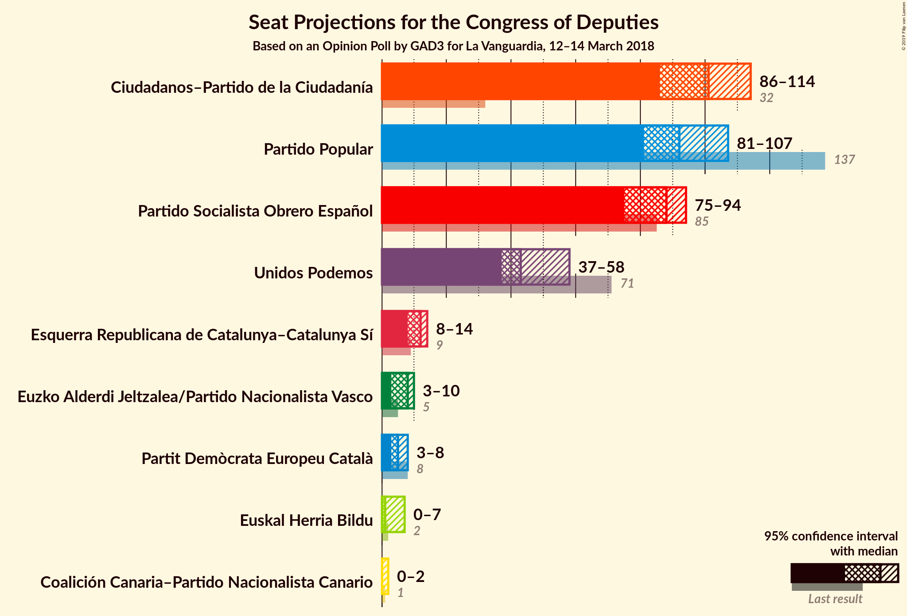
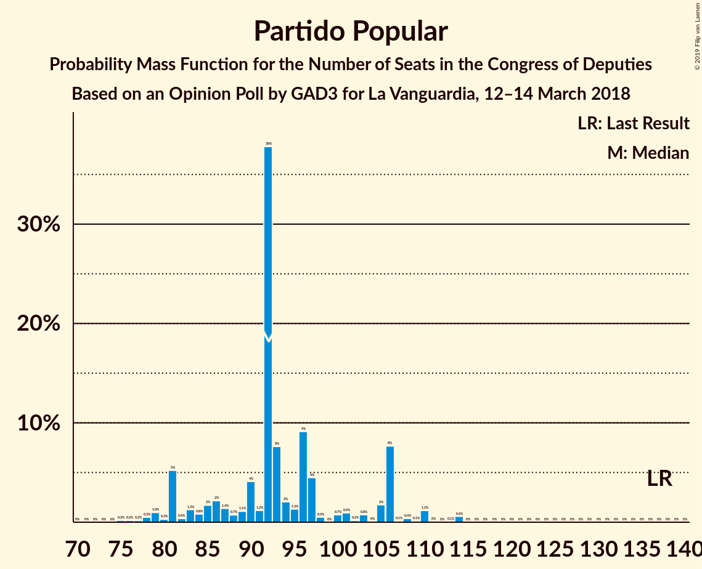
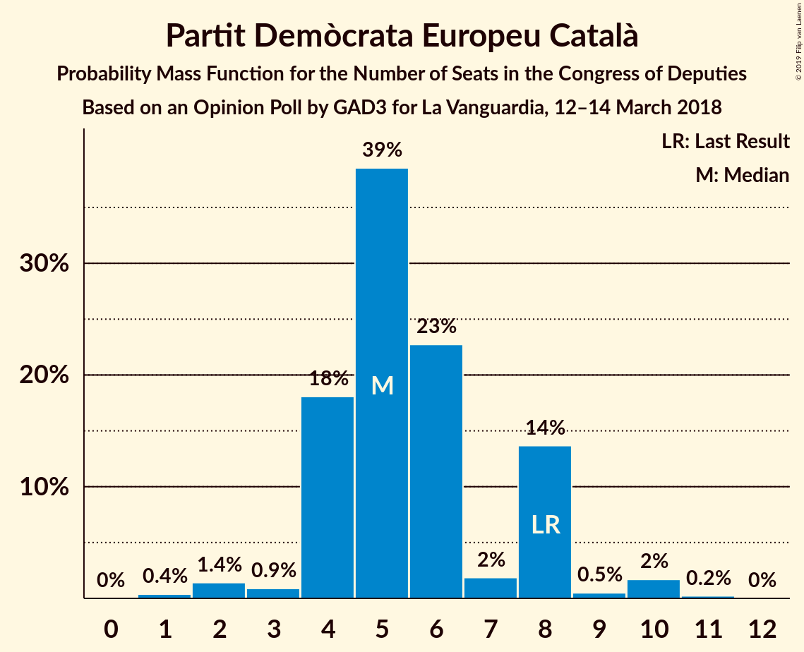
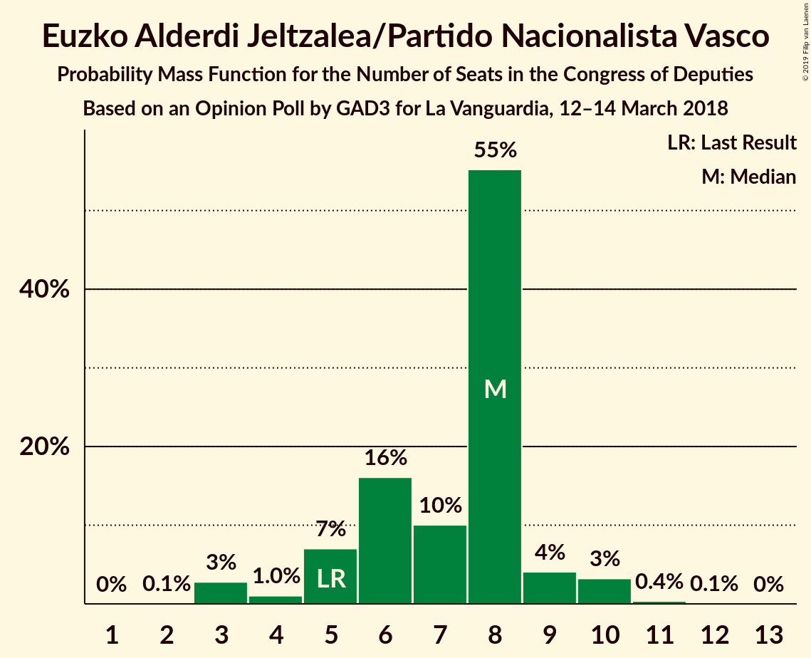
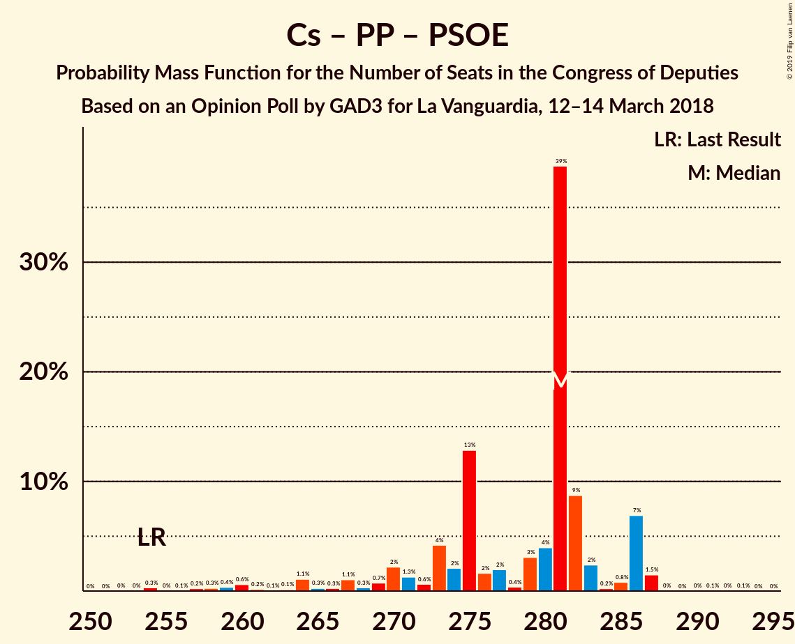
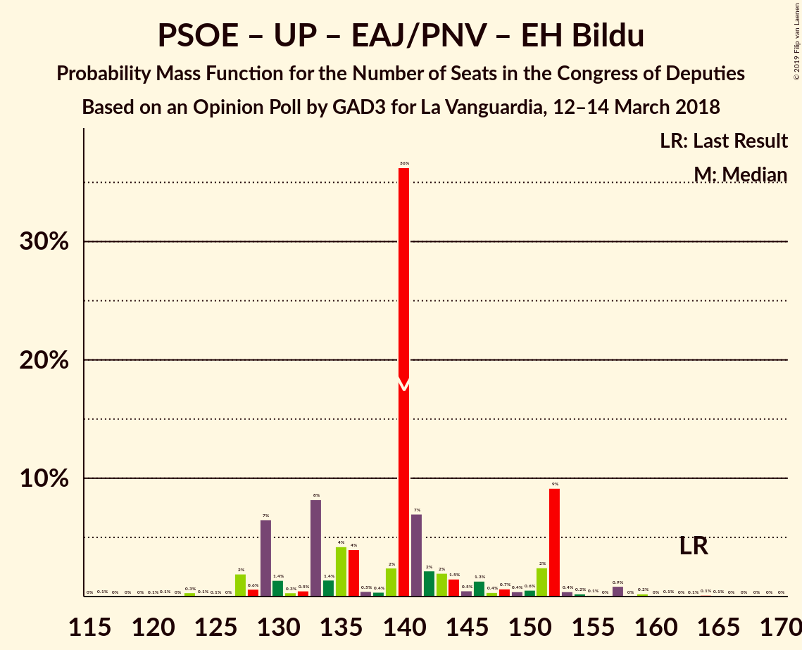

# Opinion Poll by GAD3 for La Vanguardia, 12–14 March 2018

<a href="#voting-intentions">Voting Intentions</a> | <a href="#seats">Seats</a> | <a href="#coalitions">Coalitions</a> | <a href="#technical-information">Technical Information</a>

## Voting Intentions

### Confidence Intervals

| Party | Last Result | Poll Result | 80% Confidence Interval | 90% Confidence Interval | 95% Confidence Interval | 99% Confidence Interval |
|:-----:|:-----------:|:-----------:|:-----------------------:|:-----------------------:|:-----------------------:|:-----------------------:|
| Ciudadanos–Partido de la Ciudadanía | 13.1% | 27.3% | 25.5–29.1% |25.0–29.7% |24.6–30.1% |23.8–31.0% |
| Partido Popular | 33.0% | 23.8% | 22.1–25.6% |21.7–26.1% |21.3–26.6% |20.5–27.4% |
| Partido Socialista Obrero Español | 22.6% | 22.1% | 20.5–23.9% |20.1–24.4% |19.7–24.8% |18.9–25.7% |
| Unidos Podemos | 21.2% | 16.7% | 15.2–18.3% |14.8–18.7% |14.5–19.1% |13.8–19.9% |
| Esquerra Republicana de Catalunya–Catalunya Sí | 2.7% | 2.9% | 2.3–3.7% |2.1–3.9% |2.0–4.1% |1.8–4.5% |
| Partit Demòcrata Europeu Català | 2.0% | 1.6% | 1.2–2.2% |1.1–2.4% |1.0–2.6% |0.8–2.9% |
| Euzko Alderdi Jeltzalea/Partido Nacionalista Vasco | 1.2% | 1.4% | 1.0–2.0% |0.9–2.2% |0.8–2.3% |0.7–2.7% |
| Euskal Herria Bildu | 0.8% | 0.6% | 0.4–1.1% |0.3–1.2% |0.3–1.3% |0.2–1.6% |
| Coalición Canaria–Partido Nacionalista Canario | 0.3% | 0.3% | 0.2–0.7% |0.1–0.8% |0.1–0.9% |0.1–1.1% |

*Note:* The poll result column reflects the actual value used in the calculations. Published results may vary slightly, and in addition be rounded to fewer digits.

## Seats

### Confidence Intervals

| Party | Last Result | Median | 80% Confidence Interval | 90% Confidence Interval | 95% Confidence Interval | 99% Confidence Interval |
|:-----:|:-----------:|:------:|:-----------------------:|:-----------------------:|:-----------------------:|:-----------------------:|
| <a href="#ciudadanos–partido-de-la-ciudadanía">Ciudadanos–Partido de la Ciudadanía</a> | 32 | 101 | 86–110 |86–114 |86–114 |81–118 |
| <a href="#partido-popular">Partido Popular</a> | 137 | 92 | 84–106 |81–106 |81–107 |77–114 |
| <a href="#partido-socialista-obrero-español">Partido Socialista Obrero Español</a> | 85 | 88 | 78–93 |76–93 |75–94 |68–97 |
| <a href="#unidos-podemos">Unidos Podemos</a> | 71 | 43 | 39–51 |39–55 |37–58 |36–67 |
| <a href="#esquerra-republicana-de-catalunya–catalunya-sí">Esquerra Republicana de Catalunya–Catalunya Sí</a> | 9 | 12 | 9–13 |9–14 |8–14 |6–16 |
| <a href="#partit-demòcrata-europeu-català">Partit Demòcrata Europeu Català</a> | 8 | 5 | 4–8 |4–8 |3–8 |2–10 |
| <a href="#euzko-alderdi-jeltzalea/partido-nacionalista-vasco">Euzko Alderdi Jeltzalea/Partido Nacionalista Vasco</a> | 5 | 8 | 5–8 |5–9 |3–10 |3–10 |
| <a href="#euskal-herria-bildu">Euskal Herria Bildu</a> | 2 | 1 | 0–4 |0–6 |0–7 |0–7 |
| <a href="#coalición-canaria–partido-nacionalista-canario">Coalición Canaria–Partido Nacionalista Canario</a> | 1 | 0 | 0–2 |0–2 |0–2 |0–4 |

### Ciudadanos–Partido de la Ciudadanía

*For a full overview of the results for this party, see the [Ciudadanos–Partido de la Ciudadanía](party-ciudadanos–partidodelaciudadanía.html) page.*

| Number of Seats | Probability | Accumulated | Special Marks |
|:---------------:|:-----------:|:-----------:|:-------------:|
| 32 | 0% | 100% | Last Result |
| 33 | 0% | 100% |  |
| 34 | 0% | 100% |  |
| 35 | 0% | 100% |  |
| 36 | 0% | 100% |  |
| 37 | 0% | 100% |  |
| 38 | 0% | 100% |  |
| 39 | 0% | 100% |  |
| 40 | 0% | 100% |  |
| 41 | 0% | 100% |  |
| 42 | 0% | 100% |  |
| 43 | 0% | 100% |  |
| 44 | 0% | 100% |  |
| 45 | 0% | 100% |  |
| 46 | 0% | 100% |  |
| 47 | 0% | 100% |  |
| 48 | 0% | 100% |  |
| 49 | 0% | 100% |  |
| 50 | 0% | 100% |  |
| 51 | 0% | 100% |  |
| 52 | 0% | 100% |  |
| 53 | 0% | 100% |  |
| 54 | 0% | 100% |  |
| 55 | 0% | 100% |  |
| 56 | 0% | 100% |  |
| 57 | 0% | 100% |  |
| 58 | 0% | 100% |  |
| 59 | 0% | 100% |  |
| 60 | 0% | 100% |  |
| 61 | 0% | 100% |  |
| 62 | 0% | 100% |  |
| 63 | 0% | 100% |  |
| 64 | 0% | 100% |  |
| 65 | 0% | 100% |  |
| 66 | 0% | 100% |  |
| 67 | 0% | 100% |  |
| 68 | 0% | 100% |  |
| 69 | 0% | 100% |  |
| 70 | 0% | 100% |  |
| 71 | 0% | 100% |  |
| 72 | 0% | 100% |  |
| 73 | 0% | 100% |  |
| 74 | 0% | 100% |  |
| 75 | 0% | 100% |  |
| 76 | 0% | 100% |  |
| 77 | 0.1% | 100% |  |
| 78 | 0.1% | 99.9% |  |
| 79 | 0.2% | 99.8% |  |
| 80 | 0% | 99.7% |  |
| 81 | 1.2% | 99.6% |  |
| 82 | 0% | 98% |  |
| 83 | 0% | 98% |  |
| 84 | 0.6% | 98% |  |
| 85 | 0.1% | 98% |  |
| 86 | 8% | 98% |  |
| 87 | 0.5% | 90% |  |
| 88 | 2% | 89% |  |
| 89 | 0.2% | 87% |  |
| 90 | 0.3% | 87% |  |
| 91 | 4% | 87% |  |
| 92 | 2% | 83% |  |
| 93 | 2% | 81% |  |
| 94 | 8% | 79% |  |
| 95 | 0.1% | 72% |  |
| 96 | 2% | 71% |  |
| 97 | 2% | 70% |  |
| 98 | 1.0% | 67% |  |
| 99 | 4% | 66% |  |
| 100 | 2% | 62% |  |
| 101 | 38% | 60% | Median |
| 102 | 0.3% | 22% |  |
| 103 | 1.3% | 22% |  |
| 104 | 0.7% | 21% |  |
| 105 | 1.2% | 20% |  |
| 106 | 0.6% | 19% |  |
| 107 | 0.8% | 18% |  |
| 108 | 1.2% | 17% |  |
| 109 | 5% | 16% |  |
| 110 | 3% | 11% |  |
| 111 | 0.6% | 7% |  |
| 112 | 0.6% | 7% |  |
| 113 | 0.8% | 6% |  |
| 114 | 4% | 5% |  |
| 115 | 0.1% | 1.2% |  |
| 116 | 0.2% | 1.1% |  |
| 117 | 0.3% | 0.9% |  |
| 118 | 0.4% | 0.6% |  |
| 119 | 0% | 0.1% |  |
| 120 | 0% | 0.1% |  |
| 121 | 0% | 0.1% |  |
| 122 | 0% | 0% |  |

### Partido Popular

*For a full overview of the results for this party, see the [Partido Popular](party-partidopopular.html) page.*

| Number of Seats | Probability | Accumulated | Special Marks |
|:---------------:|:-----------:|:-----------:|:-------------:|
| 75 | 0.2% | 100% |  |
| 76 | 0.2% | 99.8% |  |
| 77 | 0.2% | 99.6% |  |
| 78 | 0.5% | 99.4% |  |
| 79 | 1.0% | 98.9% |  |
| 80 | 0.3% | 98% |  |
| 81 | 5% | 98% |  |
| 82 | 0.4% | 92% |  |
| 83 | 1.3% | 92% |  |
| 84 | 0.8% | 91% |  |
| 85 | 2% | 90% |  |
| 86 | 2% | 88% |  |
| 87 | 1.4% | 86% |  |
| 88 | 0.7% | 85% |  |
| 89 | 1.1% | 84% |  |
| 90 | 4% | 83% |  |
| 91 | 1.2% | 79% |  |
| 92 | 38% | 78% | Median |
| 93 | 8% | 40% |  |
| 94 | 2% | 32% |  |
| 95 | 1.3% | 30% |  |
| 96 | 9% | 29% |  |
| 97 | 4% | 20% |  |
| 98 | 0.5% | 15% |  |
| 99 | 0% | 15% |  |
| 100 | 0.7% | 15% |  |
| 101 | 0.9% | 14% |  |
| 102 | 0.2% | 13% |  |
| 103 | 0.8% | 13% |  |
| 104 | 0% | 12% |  |
| 105 | 2% | 12% |  |
| 106 | 8% | 10% |  |
| 107 | 0.1% | 3% |  |
| 108 | 0.4% | 2% |  |
| 109 | 0.1% | 2% |  |
| 110 | 1.2% | 2% |  |
| 111 | 0% | 0.8% |  |
| 112 | 0% | 0.7% |  |
| 113 | 0.1% | 0.7% |  |
| 114 | 0.6% | 0.7% |  |
| 115 | 0% | 0.1% |  |
| 116 | 0% | 0.1% |  |
| 117 | 0% | 0% |  |
| 118 | 0% | 0% |  |
| 119 | 0% | 0% |  |
| 120 | 0% | 0% |  |
| 121 | 0% | 0% |  |
| 122 | 0% | 0% |  |
| 123 | 0% | 0% |  |
| 124 | 0% | 0% |  |
| 125 | 0% | 0% |  |
| 126 | 0% | 0% |  |
| 127 | 0% | 0% |  |
| 128 | 0% | 0% |  |
| 129 | 0% | 0% |  |
| 130 | 0% | 0% |  |
| 131 | 0% | 0% |  |
| 132 | 0% | 0% |  |
| 133 | 0% | 0% |  |
| 134 | 0% | 0% |  |
| 135 | 0% | 0% |  |
| 136 | 0% | 0% |  |
| 137 | 0% | 0% | Last Result |

### Partido Socialista Obrero Español

*For a full overview of the results for this party, see the [Partido Socialista Obrero Español](party-partidosocialistaobreroespañol.html) page.*

| Number of Seats | Probability | Accumulated | Special Marks |
|:---------------:|:-----------:|:-----------:|:-------------:|
| 62 | 0.1% | 100% |  |
| 63 | 0% | 99.9% |  |
| 64 | 0% | 99.9% |  |
| 65 | 0% | 99.9% |  |
| 66 | 0% | 99.9% |  |
| 67 | 0% | 99.9% |  |
| 68 | 0.4% | 99.8% |  |
| 69 | 0.1% | 99.5% |  |
| 70 | 0.1% | 99.4% |  |
| 71 | 0.5% | 99.3% |  |
| 72 | 0.3% | 98.8% |  |
| 73 | 0% | 98.6% |  |
| 74 | 0% | 98.5% |  |
| 75 | 2% | 98% |  |
| 76 | 2% | 97% |  |
| 77 | 0.6% | 94% |  |
| 78 | 5% | 94% |  |
| 79 | 1.0% | 88% |  |
| 80 | 6% | 87% |  |
| 81 | 5% | 82% |  |
| 82 | 0.2% | 76% |  |
| 83 | 1.4% | 76% |  |
| 84 | 2% | 75% |  |
| 85 | 2% | 73% | Last Result |
| 86 | 7% | 71% |  |
| 87 | 8% | 63% |  |
| 88 | 37% | 55% | Median |
| 89 | 1.4% | 18% |  |
| 90 | 3% | 17% |  |
| 91 | 2% | 14% |  |
| 92 | 0.3% | 12% |  |
| 93 | 8% | 11% |  |
| 94 | 1.4% | 3% |  |
| 95 | 0.3% | 2% |  |
| 96 | 0.4% | 1.5% |  |
| 97 | 0.7% | 1.1% |  |
| 98 | 0% | 0.4% |  |
| 99 | 0.1% | 0.3% |  |
| 100 | 0.1% | 0.3% |  |
| 101 | 0% | 0.2% |  |
| 102 | 0% | 0.2% |  |
| 103 | 0.1% | 0.2% |  |
| 104 | 0% | 0.1% |  |
| 105 | 0% | 0% |  |

### Unidos Podemos

*For a full overview of the results for this party, see the [Unidos Podemos](party-unidospodemos.html) page.*

| Number of Seats | Probability | Accumulated | Special Marks |
|:---------------:|:-----------:|:-----------:|:-------------:|
| 31 | 0.1% | 100% |  |
| 32 | 0% | 99.9% |  |
| 33 | 0.1% | 99.9% |  |
| 34 | 0.1% | 99.8% |  |
| 35 | 0.1% | 99.7% |  |
| 36 | 0.3% | 99.6% |  |
| 37 | 2% | 99.4% |  |
| 38 | 1.4% | 97% |  |
| 39 | 11% | 96% |  |
| 40 | 1.0% | 84% |  |
| 41 | 8% | 83% |  |
| 42 | 0.4% | 75% |  |
| 43 | 36% | 75% | Median |
| 44 | 2% | 39% |  |
| 45 | 0.4% | 37% |  |
| 46 | 13% | 37% |  |
| 47 | 0.3% | 24% |  |
| 48 | 2% | 23% |  |
| 49 | 2% | 21% |  |
| 50 | 9% | 20% |  |
| 51 | 1.4% | 11% |  |
| 52 | 1.5% | 9% |  |
| 53 | 0.3% | 8% |  |
| 54 | 2% | 7% |  |
| 55 | 0.7% | 6% |  |
| 56 | 1.1% | 5% |  |
| 57 | 0.1% | 4% |  |
| 58 | 1.3% | 4% |  |
| 59 | 0.5% | 2% |  |
| 60 | 0.5% | 2% |  |
| 61 | 0.1% | 1.5% |  |
| 62 | 0.1% | 1.3% |  |
| 63 | 0.2% | 1.2% |  |
| 64 | 0.2% | 1.0% |  |
| 65 | 0% | 0.8% |  |
| 66 | 0.3% | 0.8% |  |
| 67 | 0% | 0.5% |  |
| 68 | 0% | 0.5% |  |
| 69 | 0.4% | 0.5% |  |
| 70 | 0% | 0.1% |  |
| 71 | 0.1% | 0.1% | Last Result |
| 72 | 0% | 0% |  |

### Esquerra Republicana de Catalunya–Catalunya Sí

*For a full overview of the results for this party, see the [Esquerra Republicana de Catalunya–Catalunya Sí](party-esquerrarepublicanadecatalunya–catalunyasí.html) page.*

| Number of Seats | Probability | Accumulated | Special Marks |
|:---------------:|:-----------:|:-----------:|:-------------:|
| 6 | 0.5% | 100% |  |
| 7 | 0.7% | 99.5% |  |
| 8 | 3% | 98.8% |  |
| 9 | 18% | 96% | Last Result |
| 10 | 1.3% | 78% |  |
| 11 | 12% | 77% |  |
| 12 | 46% | 65% | Median |
| 13 | 12% | 18% |  |
| 14 | 5% | 6% |  |
| 15 | 0.9% | 2% |  |
| 16 | 0.4% | 0.8% |  |
| 17 | 0.4% | 0.5% |  |
| 18 | 0% | 0.1% |  |
| 19 | 0% | 0% |  |

### Partit Demòcrata Europeu Català

*For a full overview of the results for this party, see the [Partit Demòcrata Europeu Català](party-partitdemòcrataeuropeucatalà.html) page.*

| Number of Seats | Probability | Accumulated | Special Marks |
|:---------------:|:-----------:|:-----------:|:-------------:|
| 1 | 0.4% | 100% |  |
| 2 | 1.4% | 99.6% |  |
| 3 | 0.9% | 98% |  |
| 4 | 18% | 97% |  |
| 5 | 39% | 79% | Median |
| 6 | 23% | 41% |  |
| 7 | 2% | 18% |  |
| 8 | 14% | 16% | Last Result |
| 9 | 0.5% | 2% |  |
| 10 | 2% | 2% |  |
| 11 | 0.2% | 0.3% |  |
| 12 | 0% | 0% |  |

### Euzko Alderdi Jeltzalea/Partido Nacionalista Vasco

*For a full overview of the results for this party, see the [Euzko Alderdi Jeltzalea/Partido Nacionalista Vasco](party-euzkoalderdijeltzaleapartidonacionalistavasco.html) page.*

| Number of Seats | Probability | Accumulated | Special Marks |
|:---------------:|:-----------:|:-----------:|:-------------:|
| 2 | 0.1% | 100% |  |
| 3 | 3% | 99.9% |  |
| 4 | 1.0% | 97% |  |
| 5 | 7% | 96% | Last Result |
| 6 | 16% | 89% |  |
| 7 | 10% | 73% |  |
| 8 | 55% | 63% | Median |
| 9 | 4% | 8% |  |
| 10 | 3% | 4% |  |
| 11 | 0.4% | 0.4% |  |
| 12 | 0.1% | 0.1% |  |
| 13 | 0% | 0% |  |

### Euskal Herria Bildu

*For a full overview of the results for this party, see the [Euskal Herria Bildu](party-euskalherriabildu.html) page.*

| Number of Seats | Probability | Accumulated | Special Marks |
|:---------------:|:-----------:|:-----------:|:-------------:|
| 0 | 13% | 100% |  |
| 1 | 53% | 87% | Median |
| 2 | 15% | 34% | Last Result |
| 3 | 2% | 19% |  |
| 4 | 9% | 17% |  |
| 5 | 2% | 7% |  |
| 6 | 2% | 5% |  |
| 7 | 3% | 3% |  |
| 8 | 0% | 0% |  |

### Coalición Canaria–Partido Nacionalista Canario

*For a full overview of the results for this party, see the [Coalición Canaria–Partido Nacionalista Canario](party-coalicióncanaria–partidonacionalistacanario.html) page.*

| Number of Seats | Probability | Accumulated | Special Marks |
|:---------------:|:-----------:|:-----------:|:-------------:|
| 0 | 50% | 100% | Median |
| 1 | 38% | 50% | Last Result |
| 2 | 10% | 12% |  |
| 3 | 1.4% | 2% |  |
| 4 | 1.0% | 1.0% |  |
| 5 | 0% | 0% |  |

## Coalitions

### Confidence Intervals

| Coalition | Last Result | Median | Majority? | 80% Confidence Interval | 90% Confidence Interval | 95% Confidence Interval | 99% Confidence Interval |
|:---------:|:-----------:|:------:|:---------:|:-----------------------:|:-----------------------:|:-----------------------:|:-----------------------:|
| Ciudadanos–Partido de la Ciudadanía – Partido Popular – Partido Socialista Obrero Español | 254 | 281 | 100% | 272–283 | 268–286 | 264–286 | 257–287 |
| Ciudadanos–Partido de la Ciudadanía – Partido Socialista Obrero Español – Unidos Podemos | 188 | 232 | 100% | 219–238 | 219–240 | 214–244 | 208–249 |
| Ciudadanos–Partido de la Ciudadanía – Partido Popular – Coalición Canaria–Partido Nacionalista Canario | 170 | 193 | 98% | 183–203 | 183–203 | 180–205 | 172–208 |
| Ciudadanos–Partido de la Ciudadanía – Partido Popular | 169 | 193 | 98% | 182–201 | 182–202 | 179–204 | 171–207 |
| Ciudadanos–Partido de la Ciudadanía – Partido Socialista Obrero Español | 117 | 189 | 91% | 177–192 | 172–193 | 167–197 | 163–203 |
| Partido Popular – Partido Socialista Obrero Español | 222 | 180 | 75% | 167–189 | 159–192 | 159–192 | 156–199 |
| Partido Socialista Obrero Español – Unidos Podemos – Esquerra Republicana de Catalunya–Catalunya Sí – Partit Demòcrata Europeu Català – Euzko Alderdi Jeltzalea/Partido Nacionalista Vasco – Euskal Herria Bildu | 180 | 157 | 2% | 147–167 | 147–167 | 145–170 | 142–178 |
| Partido Socialista Obrero Español – Unidos Podemos – Esquerra Republicana de Catalunya–Catalunya Sí – Partit Demòcrata Europeu Català | 173 | 148 | 0% | 139–158 | 138–158 | 136–162 | 134–168 |
| Partido Socialista Obrero Español – Unidos Podemos – Esquerra Republicana de Catalunya–Catalunya Sí – Euskal Herria Bildu | 167 | 144 | 0% | 135–153 | 135–153 | 132–159 | 127–166 |
| Partido Socialista Obrero Español – Unidos Podemos – Euzko Alderdi Jeltzalea/Partido Nacionalista Vasco – Euskal Herria Bildu | 163 | 140 | 0% | 130–152 | 129–152 | 127–152 | 123–159 |
| Partido Socialista Obrero Español – Unidos Podemos | 156 | 131 | 0% | 121–143 | 121–143 | 120–145 | 115–149 |
| Partido Popular | 137 | 92 | 0% | 84–106 | 81–106 | 81–107 | 77–114 |
| Partido Socialista Obrero Español | 85 | 88 | 0% | 78–93 | 76–93 | 75–94 | 68–97 |

### Ciudadanos–Partido de la Ciudadanía – Partido Popular – Partido Socialista Obrero Español

| Number of Seats | Probability | Accumulated | Special Marks |
|:---------------:|:-----------:|:-----------:|:-------------:|
| 254 | 0.3% | 100% | Last Result |
| 255 | 0% | 99.6% |  |
| 256 | 0.1% | 99.6% |  |
| 257 | 0.2% | 99.6% |  |
| 258 | 0.3% | 99.3% |  |
| 259 | 0.4% | 99.0% |  |
| 260 | 0.6% | 98.7% |  |
| 261 | 0.2% | 98% |  |
| 262 | 0.1% | 98% |  |
| 263 | 0.1% | 98% |  |
| 264 | 1.1% | 98% |  |
| 265 | 0.3% | 97% |  |
| 266 | 0.3% | 96% |  |
| 267 | 1.1% | 96% |  |
| 268 | 0.3% | 95% |  |
| 269 | 0.7% | 95% |  |
| 270 | 2% | 94% |  |
| 271 | 1.3% | 92% |  |
| 272 | 0.6% | 90% |  |
| 273 | 4% | 90% |  |
| 274 | 2% | 86% |  |
| 275 | 13% | 84% |  |
| 276 | 2% | 71% |  |
| 277 | 2% | 69% |  |
| 278 | 0.4% | 67% |  |
| 279 | 3% | 67% |  |
| 280 | 4% | 64% |  |
| 281 | 39% | 60% | Median |
| 282 | 9% | 21% |  |
| 283 | 2% | 12% |  |
| 284 | 0.2% | 10% |  |
| 285 | 0.8% | 9% |  |
| 286 | 7% | 9% |  |
| 287 | 1.5% | 2% |  |
| 288 | 0% | 0.2% |  |
| 289 | 0% | 0.2% |  |
| 290 | 0% | 0.2% |  |
| 291 | 0.1% | 0.2% |  |
| 292 | 0% | 0.1% |  |
| 293 | 0.1% | 0.1% |  |
| 294 | 0% | 0% |  |

### Ciudadanos–Partido de la Ciudadanía – Partido Socialista Obrero Español – Unidos Podemos

| Number of Seats | Probability | Accumulated | Special Marks |
|:---------------:|:-----------:|:-----------:|:-------------:|
| 188 | 0% | 100% | Last Result |
| 189 | 0% | 100% |  |
| 190 | 0% | 100% |  |
| 191 | 0% | 100% |  |
| 192 | 0% | 100% |  |
| 193 | 0% | 100% |  |
| 194 | 0% | 100% |  |
| 195 | 0% | 100% |  |
| 196 | 0% | 100% |  |
| 197 | 0% | 100% |  |
| 198 | 0% | 100% |  |
| 199 | 0% | 100% |  |
| 200 | 0% | 100% |  |
| 201 | 0% | 100% |  |
| 202 | 0% | 100% |  |
| 203 | 0% | 100% |  |
| 204 | 0% | 100% |  |
| 205 | 0% | 100% |  |
| 206 | 0% | 100% |  |
| 207 | 0.2% | 100% |  |
| 208 | 0.5% | 99.7% |  |
| 209 | 0% | 99.3% |  |
| 210 | 0% | 99.3% |  |
| 211 | 0.1% | 99.2% |  |
| 212 | 0% | 99.1% |  |
| 213 | 0.1% | 99.1% |  |
| 214 | 3% | 99.0% |  |
| 215 | 0.1% | 96% |  |
| 216 | 0% | 96% |  |
| 217 | 0.1% | 96% |  |
| 218 | 0.5% | 96% |  |
| 219 | 7% | 96% |  |
| 220 | 2% | 89% |  |
| 221 | 0.4% | 87% |  |
| 222 | 0.3% | 86% |  |
| 223 | 0.4% | 86% |  |
| 224 | 3% | 85% |  |
| 225 | 0.6% | 82% |  |
| 226 | 2% | 82% |  |
| 227 | 3% | 80% |  |
| 228 | 3% | 77% |  |
| 229 | 10% | 74% |  |
| 230 | 7% | 64% |  |
| 231 | 1.1% | 57% |  |
| 232 | 35% | 55% | Median |
| 233 | 3% | 20% |  |
| 234 | 0.3% | 17% |  |
| 235 | 0.4% | 17% |  |
| 236 | 0.2% | 17% |  |
| 237 | 4% | 16% |  |
| 238 | 4% | 13% |  |
| 239 | 2% | 8% |  |
| 240 | 2% | 6% |  |
| 241 | 0.4% | 4% |  |
| 242 | 0% | 4% |  |
| 243 | 0.9% | 4% |  |
| 244 | 0.7% | 3% |  |
| 245 | 1.0% | 2% |  |
| 246 | 0.3% | 1.3% |  |
| 247 | 0% | 1.0% |  |
| 248 | 0.2% | 0.9% |  |
| 249 | 0.3% | 0.7% |  |
| 250 | 0.2% | 0.4% |  |
| 251 | 0.2% | 0.2% |  |
| 252 | 0% | 0% |  |

### Ciudadanos–Partido de la Ciudadanía – Partido Popular – Coalición Canaria–Partido Nacionalista Canario

| Number of Seats | Probability | Accumulated | Special Marks |
|:---------------:|:-----------:|:-----------:|:-------------:|
| 168 | 0% | 100% |  |
| 169 | 0% | 99.9% |  |
| 170 | 0.1% | 99.9% | Last Result |
| 171 | 0.1% | 99.8% |  |
| 172 | 0.3% | 99.7% |  |
| 173 | 0% | 99.5% |  |
| 174 | 0.9% | 99.4% |  |
| 175 | 0% | 98% |  |
| 176 | 0.1% | 98% | Majority |
| 177 | 0% | 98% |  |
| 178 | 0.2% | 98% |  |
| 179 | 0.5% | 98% |  |
| 180 | 0.9% | 98% |  |
| 181 | 0.4% | 97% |  |
| 182 | 0.6% | 96% |  |
| 183 | 10% | 96% |  |
| 184 | 0.6% | 86% |  |
| 185 | 0.5% | 85% |  |
| 186 | 0.2% | 85% |  |
| 187 | 0.6% | 85% |  |
| 188 | 3% | 84% |  |
| 189 | 3% | 81% |  |
| 190 | 1.1% | 78% |  |
| 191 | 2% | 77% |  |
| 192 | 3% | 75% |  |
| 193 | 38% | 72% | Median |
| 194 | 3% | 34% |  |
| 195 | 0.3% | 30% |  |
| 196 | 5% | 30% |  |
| 197 | 0.1% | 25% |  |
| 198 | 2% | 25% |  |
| 199 | 0.5% | 23% |  |
| 200 | 7% | 23% |  |
| 201 | 5% | 16% |  |
| 202 | 0.3% | 10% |  |
| 203 | 6% | 10% |  |
| 204 | 0.3% | 4% |  |
| 205 | 0.9% | 3% |  |
| 206 | 2% | 2% |  |
| 207 | 0.3% | 0.9% |  |
| 208 | 0.2% | 0.6% |  |
| 209 | 0.1% | 0.4% |  |
| 210 | 0.1% | 0.3% |  |
| 211 | 0% | 0.3% |  |
| 212 | 0.1% | 0.2% |  |
| 213 | 0% | 0.2% |  |
| 214 | 0.1% | 0.1% |  |
| 215 | 0% | 0% |  |

### Ciudadanos–Partido de la Ciudadanía – Partido Popular

| Number of Seats | Probability | Accumulated | Special Marks |
|:---------------:|:-----------:|:-----------:|:-------------:|
| 168 | 0% | 100% |  |
| 169 | 0.1% | 99.9% | Last Result |
| 170 | 0.1% | 99.8% |  |
| 171 | 0.3% | 99.7% |  |
| 172 | 0.1% | 99.4% |  |
| 173 | 0.9% | 99.4% |  |
| 174 | 0.1% | 98.5% |  |
| 175 | 0% | 98% |  |
| 176 | 0% | 98% | Majority |
| 177 | 0.2% | 98% |  |
| 178 | 0.5% | 98% |  |
| 179 | 0.7% | 98% |  |
| 180 | 0.4% | 97% |  |
| 181 | 0.3% | 97% |  |
| 182 | 10% | 96% |  |
| 183 | 0.4% | 86% |  |
| 184 | 0.8% | 86% |  |
| 185 | 0.5% | 85% |  |
| 186 | 2% | 84% |  |
| 187 | 1.0% | 83% |  |
| 188 | 5% | 82% |  |
| 189 | 0.4% | 77% |  |
| 190 | 2% | 76% |  |
| 191 | 3% | 74% |  |
| 192 | 4% | 71% |  |
| 193 | 37% | 68% | Median |
| 194 | 1.1% | 31% |  |
| 195 | 5% | 30% |  |
| 196 | 0.4% | 25% |  |
| 197 | 0.5% | 25% |  |
| 198 | 2% | 24% |  |
| 199 | 1.4% | 23% |  |
| 200 | 11% | 21% |  |
| 201 | 0.8% | 10% |  |
| 202 | 6% | 10% |  |
| 203 | 0.1% | 4% |  |
| 204 | 2% | 4% |  |
| 205 | 0.7% | 2% |  |
| 206 | 0.2% | 0.8% |  |
| 207 | 0.3% | 0.6% |  |
| 208 | 0.1% | 0.3% |  |
| 209 | 0% | 0.3% |  |
| 210 | 0% | 0.3% |  |
| 211 | 0.1% | 0.2% |  |
| 212 | 0% | 0.2% |  |
| 213 | 0.1% | 0.1% |  |
| 214 | 0% | 0.1% |  |
| 215 | 0% | 0% |  |

### Ciudadanos–Partido de la Ciudadanía – Partido Socialista Obrero Español

| Number of Seats | Probability | Accumulated | Special Marks |
|:---------------:|:-----------:|:-----------:|:-------------:|
| 117 | 0% | 100% | Last Result |
| 118 | 0% | 100% |  |
| 119 | 0% | 100% |  |
| 120 | 0% | 100% |  |
| 121 | 0% | 100% |  |
| 122 | 0% | 100% |  |
| 123 | 0% | 100% |  |
| 124 | 0% | 100% |  |
| 125 | 0% | 100% |  |
| 126 | 0% | 100% |  |
| 127 | 0% | 100% |  |
| 128 | 0% | 100% |  |
| 129 | 0% | 100% |  |
| 130 | 0% | 100% |  |
| 131 | 0% | 100% |  |
| 132 | 0% | 100% |  |
| 133 | 0% | 100% |  |
| 134 | 0% | 100% |  |
| 135 | 0% | 100% |  |
| 136 | 0% | 100% |  |
| 137 | 0% | 100% |  |
| 138 | 0% | 100% |  |
| 139 | 0% | 100% |  |
| 140 | 0% | 100% |  |
| 141 | 0% | 100% |  |
| 142 | 0% | 100% |  |
| 143 | 0% | 100% |  |
| 144 | 0% | 100% |  |
| 145 | 0% | 100% |  |
| 146 | 0% | 100% |  |
| 147 | 0% | 100% |  |
| 148 | 0% | 100% |  |
| 149 | 0% | 100% |  |
| 150 | 0% | 100% |  |
| 151 | 0% | 100% |  |
| 152 | 0% | 100% |  |
| 153 | 0% | 100% |  |
| 154 | 0% | 100% |  |
| 155 | 0% | 100% |  |
| 156 | 0% | 100% |  |
| 157 | 0% | 100% |  |
| 158 | 0.1% | 100% |  |
| 159 | 0% | 99.9% |  |
| 160 | 0% | 99.9% |  |
| 161 | 0.1% | 99.9% |  |
| 162 | 0% | 99.8% |  |
| 163 | 0.5% | 99.8% |  |
| 164 | 1.1% | 99.3% |  |
| 165 | 0.2% | 98% |  |
| 166 | 0.4% | 98% |  |
| 167 | 0.5% | 98% |  |
| 168 | 0.2% | 97% |  |
| 169 | 0.8% | 97% |  |
| 170 | 0.1% | 96% |  |
| 171 | 0.3% | 96% |  |
| 172 | 1.1% | 96% |  |
| 173 | 0.1% | 95% |  |
| 174 | 2% | 94% |  |
| 175 | 0.8% | 92% |  |
| 176 | 0.1% | 91% | Majority |
| 177 | 1.4% | 91% |  |
| 178 | 4% | 90% |  |
| 179 | 10% | 86% |  |
| 180 | 8% | 76% |  |
| 181 | 1.1% | 69% |  |
| 182 | 1.4% | 68% |  |
| 183 | 0.9% | 66% |  |
| 184 | 1.2% | 65% |  |
| 185 | 2% | 64% |  |
| 186 | 0.1% | 62% |  |
| 187 | 0.5% | 62% |  |
| 188 | 3% | 61% |  |
| 189 | 42% | 59% | Median |
| 190 | 0.5% | 17% |  |
| 191 | 3% | 16% |  |
| 192 | 7% | 13% |  |
| 193 | 1.1% | 6% |  |
| 194 | 2% | 5% |  |
| 195 | 0.1% | 3% |  |
| 196 | 0.2% | 3% |  |
| 197 | 0.6% | 3% |  |
| 198 | 0.3% | 2% |  |
| 199 | 0.5% | 2% |  |
| 200 | 0.5% | 1.4% |  |
| 201 | 0.2% | 0.9% |  |
| 202 | 0.2% | 0.7% |  |
| 203 | 0.3% | 0.5% |  |
| 204 | 0% | 0.2% |  |
| 205 | 0% | 0.2% |  |
| 206 | 0% | 0.2% |  |
| 207 | 0.2% | 0.2% |  |
| 208 | 0% | 0% |  |

### Partido Popular – Partido Socialista Obrero Español

| Number of Seats | Probability | Accumulated | Special Marks |
|:---------------:|:-----------:|:-----------:|:-------------:|
| 153 | 0.1% | 100% |  |
| 154 | 0.2% | 99.9% |  |
| 155 | 0.1% | 99.7% |  |
| 156 | 0.2% | 99.6% |  |
| 157 | 0.1% | 99.4% |  |
| 158 | 0.1% | 99.3% |  |
| 159 | 5% | 99.2% |  |
| 160 | 0.2% | 94% |  |
| 161 | 0% | 94% |  |
| 162 | 0.3% | 94% |  |
| 163 | 0.1% | 94% |  |
| 164 | 0.3% | 94% |  |
| 165 | 1.1% | 93% |  |
| 166 | 0.9% | 92% |  |
| 167 | 2% | 91% |  |
| 168 | 0.3% | 90% |  |
| 169 | 0.7% | 90% |  |
| 170 | 1.0% | 89% |  |
| 171 | 3% | 88% |  |
| 172 | 1.2% | 84% |  |
| 173 | 7% | 83% |  |
| 174 | 0.5% | 76% |  |
| 175 | 1.1% | 76% |  |
| 176 | 0.7% | 75% | Majority |
| 177 | 0.5% | 74% |  |
| 178 | 1.4% | 73% |  |
| 179 | 3% | 72% |  |
| 180 | 39% | 69% | Median |
| 181 | 0.4% | 30% |  |
| 182 | 0.3% | 30% |  |
| 183 | 4% | 30% |  |
| 184 | 5% | 25% |  |
| 185 | 0.4% | 20% |  |
| 186 | 1.3% | 20% |  |
| 187 | 0.3% | 19% |  |
| 188 | 0.3% | 18% |  |
| 189 | 9% | 18% |  |
| 190 | 0.1% | 9% |  |
| 191 | 0.4% | 9% |  |
| 192 | 6% | 8% |  |
| 193 | 0.7% | 2% |  |
| 194 | 0.1% | 0.9% |  |
| 195 | 0.2% | 0.9% |  |
| 196 | 0% | 0.7% |  |
| 197 | 0% | 0.6% |  |
| 198 | 0% | 0.6% |  |
| 199 | 0.5% | 0.6% |  |
| 200 | 0% | 0.1% |  |
| 201 | 0.1% | 0.1% |  |
| 202 | 0% | 0% |  |
| 203 | 0% | 0% |  |
| 204 | 0% | 0% |  |
| 205 | 0% | 0% |  |
| 206 | 0% | 0% |  |
| 207 | 0% | 0% |  |
| 208 | 0% | 0% |  |
| 209 | 0% | 0% |  |
| 210 | 0% | 0% |  |
| 211 | 0% | 0% |  |
| 212 | 0% | 0% |  |
| 213 | 0% | 0% |  |
| 214 | 0% | 0% |  |
| 215 | 0% | 0% |  |
| 216 | 0% | 0% |  |
| 217 | 0% | 0% |  |
| 218 | 0% | 0% |  |
| 219 | 0% | 0% |  |
| 220 | 0% | 0% |  |
| 221 | 0% | 0% |  |
| 222 | 0% | 0% | Last Result |

### Partido Socialista Obrero Español – Unidos Podemos – Esquerra Republicana de Catalunya–Catalunya Sí – Partit Demòcrata Europeu Català – Euzko Alderdi Jeltzalea/Partido Nacionalista Vasco – Euskal Herria Bildu

| Number of Seats | Probability | Accumulated | Special Marks |
|:---------------:|:-----------:|:-----------:|:-------------:|
| 136 | 0.1% | 100% |  |
| 137 | 0% | 99.9% |  |
| 138 | 0.1% | 99.8% |  |
| 139 | 0% | 99.8% |  |
| 140 | 0.1% | 99.7% |  |
| 141 | 0.1% | 99.7% |  |
| 142 | 0.2% | 99.6% |  |
| 143 | 0.3% | 99.4% |  |
| 144 | 2% | 99.1% |  |
| 145 | 0.9% | 98% |  |
| 146 | 0.3% | 97% |  |
| 147 | 6% | 96% |  |
| 148 | 0.3% | 90% |  |
| 149 | 5% | 90% |  |
| 150 | 7% | 84% |  |
| 151 | 0.5% | 77% |  |
| 152 | 2% | 77% |  |
| 153 | 0.1% | 75% |  |
| 154 | 5% | 75% |  |
| 155 | 0.3% | 70% |  |
| 156 | 3% | 70% |  |
| 157 | 38% | 66% | Median |
| 158 | 3% | 28% |  |
| 159 | 2% | 25% |  |
| 160 | 1.1% | 23% |  |
| 161 | 3% | 22% |  |
| 162 | 3% | 19% |  |
| 163 | 0.6% | 16% |  |
| 164 | 0.2% | 15% |  |
| 165 | 0.5% | 15% |  |
| 166 | 0.6% | 15% |  |
| 167 | 10% | 14% |  |
| 168 | 0.6% | 4% |  |
| 169 | 0.4% | 4% |  |
| 170 | 0.9% | 3% |  |
| 171 | 0.5% | 2% |  |
| 172 | 0.2% | 2% |  |
| 173 | 0% | 2% |  |
| 174 | 0.1% | 2% |  |
| 175 | 0% | 2% |  |
| 176 | 0.9% | 2% | Majority |
| 177 | 0% | 0.6% |  |
| 178 | 0.3% | 0.5% |  |
| 179 | 0.1% | 0.3% |  |
| 180 | 0.1% | 0.2% | Last Result |
| 181 | 0% | 0.1% |  |
| 182 | 0% | 0.1% |  |
| 183 | 0% | 0% |  |

### Partido Socialista Obrero Español – Unidos Podemos – Esquerra Republicana de Catalunya–Catalunya Sí – Partit Demòcrata Europeu Català

| Number of Seats | Probability | Accumulated | Special Marks |
|:---------------:|:-----------:|:-----------:|:-------------:|
| 126 | 0% | 100% |  |
| 127 | 0.1% | 99.9% |  |
| 128 | 0% | 99.8% |  |
| 129 | 0% | 99.8% |  |
| 130 | 0% | 99.7% |  |
| 131 | 0% | 99.7% |  |
| 132 | 0.1% | 99.7% |  |
| 133 | 0% | 99.6% |  |
| 134 | 0.4% | 99.6% |  |
| 135 | 0.3% | 99.2% |  |
| 136 | 1.4% | 98.9% |  |
| 137 | 1.0% | 97% |  |
| 138 | 2% | 96% |  |
| 139 | 6% | 95% |  |
| 140 | 4% | 89% |  |
| 141 | 0.8% | 85% |  |
| 142 | 8% | 84% |  |
| 143 | 4% | 76% |  |
| 144 | 0.5% | 72% |  |
| 145 | 3% | 72% |  |
| 146 | 4% | 68% |  |
| 147 | 0.8% | 65% |  |
| 148 | 36% | 64% | Median |
| 149 | 3% | 28% |  |
| 150 | 1.2% | 24% |  |
| 151 | 2% | 23% |  |
| 152 | 2% | 22% |  |
| 153 | 4% | 20% |  |
| 154 | 0.3% | 15% |  |
| 155 | 0.4% | 15% |  |
| 156 | 0.1% | 15% |  |
| 157 | 0.7% | 15% |  |
| 158 | 10% | 14% |  |
| 159 | 0.3% | 4% |  |
| 160 | 0.3% | 3% |  |
| 161 | 0.6% | 3% |  |
| 162 | 0.4% | 3% |  |
| 163 | 0.1% | 2% |  |
| 164 | 0.3% | 2% |  |
| 165 | 0% | 2% |  |
| 166 | 0.1% | 2% |  |
| 167 | 0.3% | 1.5% |  |
| 168 | 0.9% | 1.2% |  |
| 169 | 0% | 0.3% |  |
| 170 | 0.1% | 0.3% |  |
| 171 | 0.1% | 0.2% |  |
| 172 | 0.1% | 0.1% |  |
| 173 | 0% | 0% | Last Result |

### Partido Socialista Obrero Español – Unidos Podemos – Esquerra Republicana de Catalunya–Catalunya Sí – Euskal Herria Bildu

| Number of Seats | Probability | Accumulated | Special Marks |
|:---------------:|:-----------:|:-----------:|:-------------:|
| 121 | 0% | 100% |  |
| 122 | 0% | 99.9% |  |
| 123 | 0.1% | 99.9% |  |
| 124 | 0% | 99.8% |  |
| 125 | 0.1% | 99.8% |  |
| 126 | 0% | 99.7% |  |
| 127 | 0.2% | 99.7% |  |
| 128 | 0.1% | 99.5% |  |
| 129 | 0.1% | 99.4% |  |
| 130 | 0% | 99.3% |  |
| 131 | 0.7% | 99.3% |  |
| 132 | 2% | 98.5% |  |
| 133 | 0.6% | 97% |  |
| 134 | 0.7% | 96% |  |
| 135 | 6% | 96% |  |
| 136 | 0.9% | 90% |  |
| 137 | 1.0% | 89% |  |
| 138 | 8% | 88% |  |
| 139 | 5% | 80% |  |
| 140 | 4% | 75% |  |
| 141 | 1.0% | 71% |  |
| 142 | 3% | 70% |  |
| 143 | 3% | 67% |  |
| 144 | 36% | 65% | Median |
| 145 | 2% | 29% |  |
| 146 | 1.2% | 27% |  |
| 147 | 7% | 26% |  |
| 148 | 1.1% | 19% |  |
| 149 | 0.4% | 18% |  |
| 150 | 1.2% | 17% |  |
| 151 | 1.4% | 16% |  |
| 152 | 2% | 15% |  |
| 153 | 8% | 13% |  |
| 154 | 0.4% | 5% |  |
| 155 | 0.4% | 4% |  |
| 156 | 0.1% | 4% |  |
| 157 | 0.4% | 4% |  |
| 158 | 0.7% | 3% |  |
| 159 | 0.7% | 3% |  |
| 160 | 0.2% | 2% |  |
| 161 | 0% | 2% |  |
| 162 | 0.2% | 2% |  |
| 163 | 0% | 2% |  |
| 164 | 0.9% | 2% |  |
| 165 | 0% | 0.6% |  |
| 166 | 0.1% | 0.6% |  |
| 167 | 0.3% | 0.5% | Last Result |
| 168 | 0% | 0.2% |  |
| 169 | 0% | 0.2% |  |
| 170 | 0.1% | 0.2% |  |
| 171 | 0.1% | 0.1% |  |
| 172 | 0% | 0% |  |

### Partido Socialista Obrero Español – Unidos Podemos – Euzko Alderdi Jeltzalea/Partido Nacionalista Vasco – Euskal Herria Bildu

| Number of Seats | Probability | Accumulated | Special Marks |
|:---------------:|:-----------:|:-----------:|:-------------:|
| 116 | 0.1% | 100% |  |
| 117 | 0% | 99.9% |  |
| 118 | 0% | 99.9% |  |
| 119 | 0% | 99.9% |  |
| 120 | 0.1% | 99.8% |  |
| 121 | 0.1% | 99.8% |  |
| 122 | 0% | 99.7% |  |
| 123 | 0.3% | 99.7% |  |
| 124 | 0.1% | 99.4% |  |
| 125 | 0.1% | 99.3% |  |
| 126 | 0% | 99.2% |  |
| 127 | 2% | 99.2% |  |
| 128 | 0.6% | 97% |  |
| 129 | 7% | 97% |  |
| 130 | 1.4% | 90% |  |
| 131 | 0.3% | 89% |  |
| 132 | 0.5% | 88% |  |
| 133 | 8% | 88% |  |
| 134 | 1.4% | 80% |  |
| 135 | 4% | 78% |  |
| 136 | 4% | 74% |  |
| 137 | 0.5% | 70% |  |
| 138 | 0.4% | 70% |  |
| 139 | 2% | 69% |  |
| 140 | 36% | 67% | Median |
| 141 | 7% | 31% |  |
| 142 | 2% | 24% |  |
| 143 | 2% | 21% |  |
| 144 | 1.5% | 19% |  |
| 145 | 0.5% | 18% |  |
| 146 | 1.3% | 17% |  |
| 147 | 0.4% | 16% |  |
| 148 | 0.7% | 16% |  |
| 149 | 0.4% | 15% |  |
| 150 | 0.6% | 15% |  |
| 151 | 2% | 14% |  |
| 152 | 9% | 12% |  |
| 153 | 0.4% | 2% |  |
| 154 | 0.2% | 2% |  |
| 155 | 0.1% | 2% |  |
| 156 | 0% | 2% |  |
| 157 | 0.9% | 2% |  |
| 158 | 0% | 0.7% |  |
| 159 | 0.2% | 0.6% |  |
| 160 | 0% | 0.4% |  |
| 161 | 0.1% | 0.4% |  |
| 162 | 0% | 0.3% |  |
| 163 | 0.1% | 0.3% | Last Result |
| 164 | 0.1% | 0.2% |  |
| 165 | 0.1% | 0.1% |  |
| 166 | 0% | 0% |  |

### Partido Socialista Obrero Español – Unidos Podemos

| Number of Seats | Probability | Accumulated | Special Marks |
|:---------------:|:-----------:|:-----------:|:-------------:|
| 107 | 0.1% | 100% |  |
| 108 | 0% | 99.9% |  |
| 109 | 0.1% | 99.9% |  |
| 110 | 0% | 99.8% |  |
| 111 | 0% | 99.8% |  |
| 112 | 0% | 99.7% |  |
| 113 | 0% | 99.7% |  |
| 114 | 0.1% | 99.7% |  |
| 115 | 0.2% | 99.5% |  |
| 116 | 0.1% | 99.3% |  |
| 117 | 0% | 99.2% |  |
| 118 | 0.2% | 99.1% |  |
| 119 | 1.3% | 98.9% |  |
| 120 | 2% | 98% |  |
| 121 | 7% | 96% |  |
| 122 | 1.4% | 89% |  |
| 123 | 0.3% | 88% |  |
| 124 | 4% | 87% |  |
| 125 | 7% | 83% |  |
| 126 | 2% | 76% |  |
| 127 | 4% | 74% |  |
| 128 | 3% | 70% |  |
| 129 | 3% | 67% |  |
| 130 | 1.0% | 64% |  |
| 131 | 35% | 63% | Median |
| 132 | 0.9% | 28% |  |
| 133 | 6% | 27% |  |
| 134 | 2% | 21% |  |
| 135 | 2% | 20% |  |
| 136 | 2% | 18% |  |
| 137 | 0.2% | 16% |  |
| 138 | 0.3% | 16% |  |
| 139 | 0.4% | 15% |  |
| 140 | 0.6% | 15% |  |
| 141 | 1.0% | 14% |  |
| 142 | 2% | 13% |  |
| 143 | 8% | 11% |  |
| 144 | 0.2% | 3% |  |
| 145 | 0.6% | 3% |  |
| 146 | 0.4% | 2% |  |
| 147 | 0.1% | 2% |  |
| 148 | 0.2% | 2% |  |
| 149 | 0.9% | 1.3% |  |
| 150 | 0.1% | 0.4% |  |
| 151 | 0% | 0.4% |  |
| 152 | 0.1% | 0.3% |  |
| 153 | 0% | 0.3% |  |
| 154 | 0.1% | 0.3% |  |
| 155 | 0% | 0.1% |  |
| 156 | 0.1% | 0.1% | Last Result |
| 157 | 0.1% | 0.1% |  |
| 158 | 0% | 0% |  |

### Partido Popular

| Number of Seats | Probability | Accumulated | Special Marks |
|:---------------:|:-----------:|:-----------:|:-------------:|
| 75 | 0.2% | 100% |  |
| 76 | 0.2% | 99.8% |  |
| 77 | 0.2% | 99.6% |  |
| 78 | 0.5% | 99.4% |  |
| 79 | 1.0% | 98.9% |  |
| 80 | 0.3% | 98% |  |
| 81 | 5% | 98% |  |
| 82 | 0.4% | 92% |  |
| 83 | 1.3% | 92% |  |
| 84 | 0.8% | 91% |  |
| 85 | 2% | 90% |  |
| 86 | 2% | 88% |  |
| 87 | 1.4% | 86% |  |
| 88 | 0.7% | 85% |  |
| 89 | 1.1% | 84% |  |
| 90 | 4% | 83% |  |
| 91 | 1.2% | 79% |  |
| 92 | 38% | 78% | Median |
| 93 | 8% | 40% |  |
| 94 | 2% | 32% |  |
| 95 | 1.3% | 30% |  |
| 96 | 9% | 29% |  |
| 97 | 4% | 20% |  |
| 98 | 0.5% | 15% |  |
| 99 | 0% | 15% |  |
| 100 | 0.7% | 15% |  |
| 101 | 0.9% | 14% |  |
| 102 | 0.2% | 13% |  |
| 103 | 0.8% | 13% |  |
| 104 | 0% | 12% |  |
| 105 | 2% | 12% |  |
| 106 | 8% | 10% |  |
| 107 | 0.1% | 3% |  |
| 108 | 0.4% | 2% |  |
| 109 | 0.1% | 2% |  |
| 110 | 1.2% | 2% |  |
| 111 | 0% | 0.8% |  |
| 112 | 0% | 0.7% |  |
| 113 | 0.1% | 0.7% |  |
| 114 | 0.6% | 0.7% |  |
| 115 | 0% | 0.1% |  |
| 116 | 0% | 0.1% |  |
| 117 | 0% | 0% |  |
| 118 | 0% | 0% |  |
| 119 | 0% | 0% |  |
| 120 | 0% | 0% |  |
| 121 | 0% | 0% |  |
| 122 | 0% | 0% |  |
| 123 | 0% | 0% |  |
| 124 | 0% | 0% |  |
| 125 | 0% | 0% |  |
| 126 | 0% | 0% |  |
| 127 | 0% | 0% |  |
| 128 | 0% | 0% |  |
| 129 | 0% | 0% |  |
| 130 | 0% | 0% |  |
| 131 | 0% | 0% |  |
| 132 | 0% | 0% |  |
| 133 | 0% | 0% |  |
| 134 | 0% | 0% |  |
| 135 | 0% | 0% |  |
| 136 | 0% | 0% |  |
| 137 | 0% | 0% | Last Result |

### Partido Socialista Obrero Español

| Number of Seats | Probability | Accumulated | Special Marks |
|:---------------:|:-----------:|:-----------:|:-------------:|
| 62 | 0.1% | 100% |  |
| 63 | 0% | 99.9% |  |
| 64 | 0% | 99.9% |  |
| 65 | 0% | 99.9% |  |
| 66 | 0% | 99.9% |  |
| 67 | 0% | 99.9% |  |
| 68 | 0.4% | 99.8% |  |
| 69 | 0.1% | 99.5% |  |
| 70 | 0.1% | 99.4% |  |
| 71 | 0.5% | 99.3% |  |
| 72 | 0.3% | 98.8% |  |
| 73 | 0% | 98.6% |  |
| 74 | 0% | 98.5% |  |
| 75 | 2% | 98% |  |
| 76 | 2% | 97% |  |
| 77 | 0.6% | 94% |  |
| 78 | 5% | 94% |  |
| 79 | 1.0% | 88% |  |
| 80 | 6% | 87% |  |
| 81 | 5% | 82% |  |
| 82 | 0.2% | 76% |  |
| 83 | 1.4% | 76% |  |
| 84 | 2% | 75% |  |
| 85 | 2% | 73% | Last Result |
| 86 | 7% | 71% |  |
| 87 | 8% | 63% |  |
| 88 | 37% | 55% | Median |
| 89 | 1.4% | 18% |  |
| 90 | 3% | 17% |  |
| 91 | 2% | 14% |  |
| 92 | 0.3% | 12% |  |
| 93 | 8% | 11% |  |
| 94 | 1.4% | 3% |  |
| 95 | 0.3% | 2% |  |
| 96 | 0.4% | 1.5% |  |
| 97 | 0.7% | 1.1% |  |
| 98 | 0% | 0.4% |  |
| 99 | 0.1% | 0.3% |  |
| 100 | 0.1% | 0.3% |  |
| 101 | 0% | 0.2% |  |
| 102 | 0% | 0.2% |  |
| 103 | 0.1% | 0.2% |  |
| 104 | 0% | 0.1% |  |
| 105 | 0% | 0% |  |

## Technical Information

### Opinion Poll

+ **Polling firm:** GAD3
+ **Commissioner(s):** La Vanguardia
+ **Fieldwork period:** 12–14 March 2018

### Calculations

+ **Sample size:** 1008
+ **Simulations done:** 131,072
+ **Error estimate:** 1.72%

