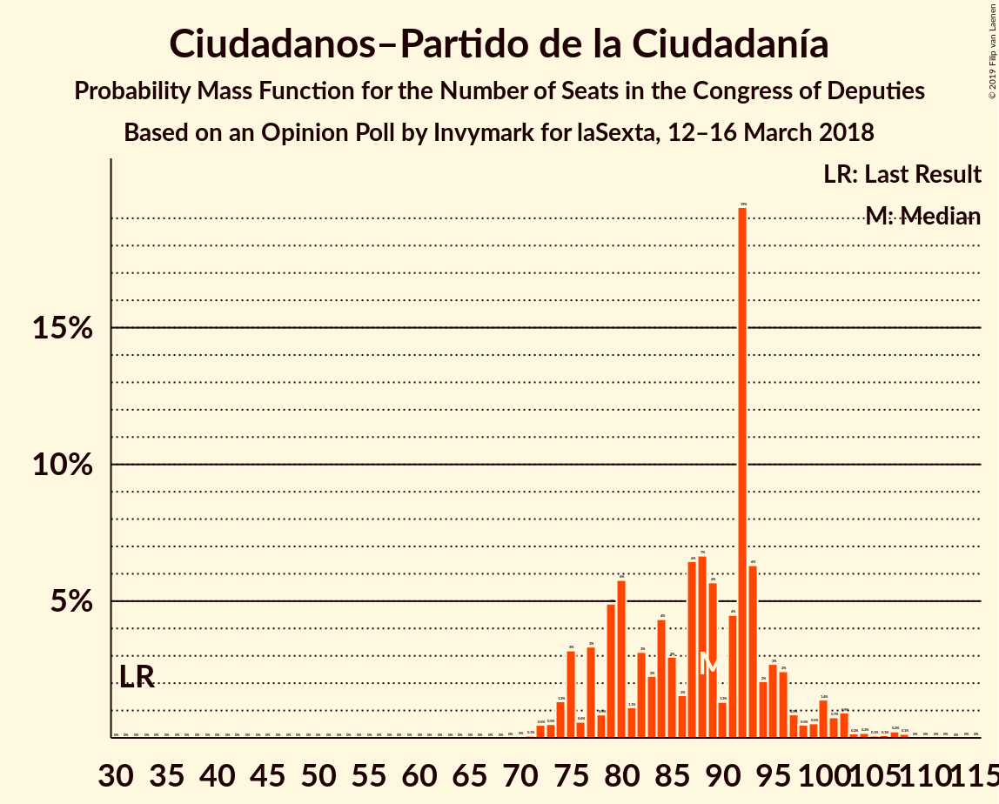
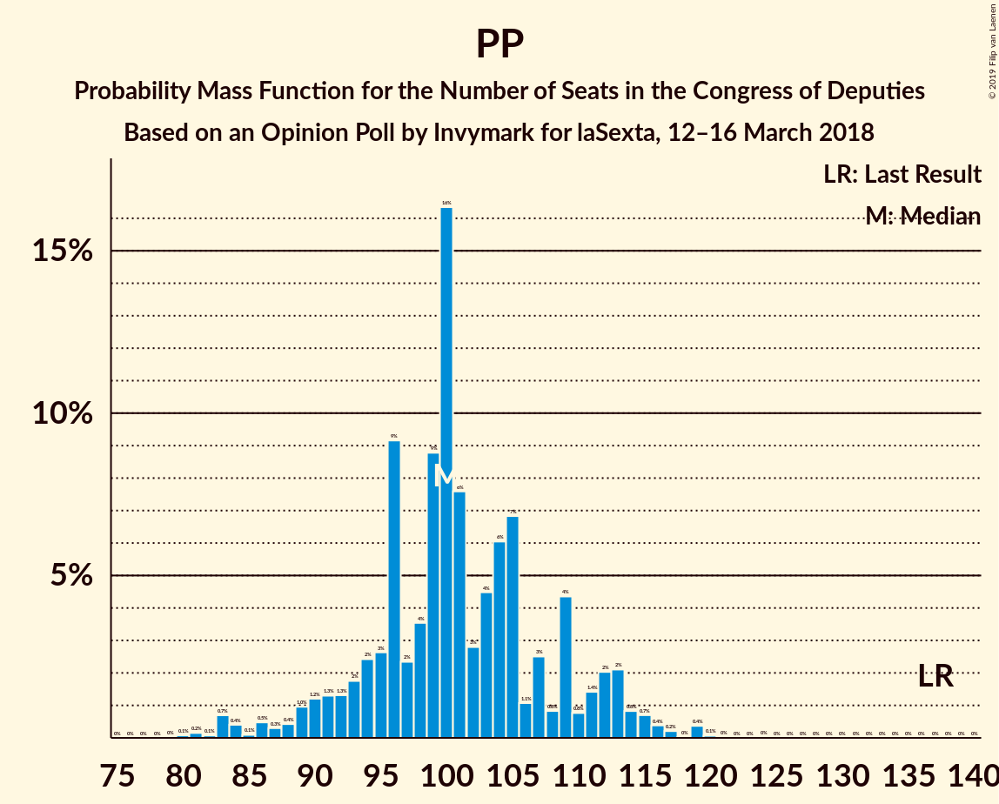

# Opinion Poll by Invymark for laSexta, 12–16 March 2018

<a href="#voting-intentions">Voting Intentions</a> | <a href="#seats">Seats</a> | <a href="#coalitions">Coalitions</a> | <a href="#technical-information">Technical Information</a>

## Voting Intentions

### Confidence Intervals

| Party | Last Result | Poll Result | 80% Confidence Interval | 90% Confidence Interval | 95% Confidence Interval | 99% Confidence Interval |
|:-----:|:-----------:|:-----------:|:-----------------------:|:-----------------------:|:-----------------------:|:-----------------------:|
| Partido Popular | 33.0% | 25.1% | 23.5–26.7% |23.1–27.2% |22.7–27.6% |22.0–28.4% |
| Ciudadanos–Partido de la Ciudadanía | 13.1% | 25.0% | 23.4–26.7% |23.0–27.1% |22.6–27.5% |21.9–28.3% |
| Partido Socialista Obrero Español | 22.6% | 22.6% | 21.1–24.2% |20.7–24.6% |20.3–25.0% |19.6–25.8% |
| Unidos Podemos | 21.2% | 16.8% | 15.5–18.3% |15.1–18.7% |14.8–19.1% |14.2–19.8% |
| Esquerra Republicana de Catalunya–Catalunya Sí | 2.7% | 2.4% | 1.9–3.1% |1.8–3.3% |1.7–3.5% |1.5–3.8% |
| Partit Demòcrata Europeu Català | 2.0% | 2.4% | 1.9–3.1% |1.8–3.3% |1.7–3.5% |1.5–3.8% |
| Euzko Alderdi Jeltzalea/Partido Nacionalista Vasco | 1.2% | 1.2% | 0.9–1.7% |0.8–1.8% |0.7–2.0% |0.6–2.2% |

*Note:* The poll result column reflects the actual value used in the calculations. Published results may vary slightly, and in addition be rounded to fewer digits.

## Seats

### Confidence Intervals

| Party | Last Result | Median | 80% Confidence Interval | 90% Confidence Interval | 95% Confidence Interval | 99% Confidence Interval |
|:-----:|:-----------:|:------:|:-----------------------:|:-----------------------:|:-----------------------:|:-----------------------:|
| <a href="#partido-popular">Partido Popular</a> | 137 | 97 | 92–102 |92–105 |88–109 |76–120 |
| <a href="#ciudadanos–partido-de-la-ciudadanía">Ciudadanos–Partido de la Ciudadanía</a> | 32 | 94 | 79–94 |79–94 |78–96 |75–96 |
| <a href="#partido-socialista-obrero-español">Partido Socialista Obrero Español</a> | 85 | 87 | 83–88 |77–89 |77–93 |67–93 |
| <a href="#unidos-podemos">Unidos Podemos</a> | 71 | 49 | 49–61 |46–61 |46–61 |41–61 |
| <a href="#esquerra-republicana-de-catalunya–catalunya-sí">Esquerra Republicana de Catalunya–Catalunya Sí</a> | 9 | 6 | 6–10 |6–10 |4–11 |4–12 |
| <a href="#partit-demòcrata-europeu-català">Partit Demòcrata Europeu Català</a> | 8 | 10 | 10–12 |6–14 |5–14 |5–14 |
| <a href="#euzko-alderdi-jeltzalea/partido-nacionalista-vasco">Euzko Alderdi Jeltzalea/Partido Nacionalista Vasco</a> | 5 | 3 | 3–6 |3–7 |3–7 |3–9 |

### Partido Popular

*For a full overview of the results for this party, see the [Partido Popular](party-partidopopular.html) page.*

| Number of Seats | Probability | Accumulated | Special Marks |
|:---------------:|:-----------:|:-----------:|:-------------:|
| 76 | 0.7% | 100% |  |
| 77 | 0% | 99.3% |  |
| 78 | 0% | 99.3% |  |
| 79 | 0% | 99.3% |  |
| 80 | 0.2% | 99.3% |  |
| 81 | 0% | 99.2% |  |
| 82 | 0% | 99.2% |  |
| 83 | 0% | 99.2% |  |
| 84 | 0% | 99.2% |  |
| 85 | 0% | 99.1% |  |
| 86 | 0% | 99.1% |  |
| 87 | 0% | 99.1% |  |
| 88 | 2% | 99.1% |  |
| 89 | 0% | 97% |  |
| 90 | 0% | 97% |  |
| 91 | 0% | 97% |  |
| 92 | 8% | 97% |  |
| 93 | 0% | 89% |  |
| 94 | 0.1% | 89% |  |
| 95 | 0% | 89% |  |
| 96 | 0% | 89% |  |
| 97 | 70% | 89% | Median |
| 98 | 0.7% | 19% |  |
| 99 | 0.1% | 18% |  |
| 100 | 0% | 18% |  |
| 101 | 0% | 18% |  |
| 102 | 13% | 18% |  |
| 103 | 0% | 5% |  |
| 104 | 0% | 5% |  |
| 105 | 2% | 5% |  |
| 106 | 0% | 4% |  |
| 107 | 0% | 4% |  |
| 108 | 0% | 4% |  |
| 109 | 3% | 4% |  |
| 110 | 0% | 0.9% |  |
| 111 | 0% | 0.9% |  |
| 112 | 0% | 0.9% |  |
| 113 | 0% | 0.9% |  |
| 114 | 0% | 0.9% |  |
| 115 | 0% | 0.9% |  |
| 116 | 0% | 0.9% |  |
| 117 | 0% | 0.9% |  |
| 118 | 0% | 0.9% |  |
| 119 | 0% | 0.9% |  |
| 120 | 0.6% | 0.9% |  |
| 121 | 0% | 0.4% |  |
| 122 | 0% | 0.4% |  |
| 123 | 0% | 0.4% |  |
| 124 | 0.3% | 0.4% |  |
| 125 | 0% | 0% |  |
| 126 | 0% | 0% |  |
| 127 | 0% | 0% |  |
| 128 | 0% | 0% |  |
| 129 | 0% | 0% |  |
| 130 | 0% | 0% |  |
| 131 | 0% | 0% |  |
| 132 | 0% | 0% |  |
| 133 | 0% | 0% |  |
| 134 | 0% | 0% |  |
| 135 | 0% | 0% |  |
| 136 | 0% | 0% |  |
| 137 | 0% | 0% | Last Result |

### Ciudadanos–Partido de la Ciudadanía

*For a full overview of the results for this party, see the [Ciudadanos–Partido de la Ciudadanía](party-ciudadanos–partidodelaciudadanía.html) page.*

| Number of Seats | Probability | Accumulated | Special Marks |
|:---------------:|:-----------:|:-----------:|:-------------:|
| 32 | 0% | 100% | Last Result |
| 33 | 0% | 100% |  |
| 34 | 0% | 100% |  |
| 35 | 0% | 100% |  |
| 36 | 0% | 100% |  |
| 37 | 0% | 100% |  |
| 38 | 0% | 100% |  |
| 39 | 0% | 100% |  |
| 40 | 0% | 100% |  |
| 41 | 0% | 100% |  |
| 42 | 0% | 100% |  |
| 43 | 0% | 100% |  |
| 44 | 0% | 100% |  |
| 45 | 0% | 100% |  |
| 46 | 0% | 100% |  |
| 47 | 0% | 100% |  |
| 48 | 0% | 100% |  |
| 49 | 0% | 100% |  |
| 50 | 0% | 100% |  |
| 51 | 0% | 100% |  |
| 52 | 0% | 100% |  |
| 53 | 0% | 100% |  |
| 54 | 0% | 100% |  |
| 55 | 0% | 100% |  |
| 56 | 0% | 100% |  |
| 57 | 0% | 100% |  |
| 58 | 0% | 100% |  |
| 59 | 0% | 100% |  |
| 60 | 0% | 100% |  |
| 61 | 0% | 100% |  |
| 62 | 0% | 100% |  |
| 63 | 0% | 100% |  |
| 64 | 0% | 100% |  |
| 65 | 0% | 100% |  |
| 66 | 0% | 100% |  |
| 67 | 0% | 100% |  |
| 68 | 0% | 100% |  |
| 69 | 0% | 100% |  |
| 70 | 0% | 100% |  |
| 71 | 0% | 100% |  |
| 72 | 0% | 100% |  |
| 73 | 0.1% | 100% |  |
| 74 | 0.1% | 99.9% |  |
| 75 | 0.4% | 99.8% |  |
| 76 | 0% | 99.4% |  |
| 77 | 0% | 99.4% |  |
| 78 | 3% | 99.4% |  |
| 79 | 10% | 97% |  |
| 80 | 0% | 87% |  |
| 81 | 0% | 87% |  |
| 82 | 0% | 87% |  |
| 83 | 0% | 87% |  |
| 84 | 0% | 87% |  |
| 85 | 0% | 87% |  |
| 86 | 1.4% | 87% |  |
| 87 | 0% | 85% |  |
| 88 | 0.5% | 85% |  |
| 89 | 0% | 85% |  |
| 90 | 0.1% | 85% |  |
| 91 | 7% | 85% |  |
| 92 | 5% | 78% |  |
| 93 | 0% | 73% |  |
| 94 | 71% | 73% | Median |
| 95 | 0% | 3% |  |
| 96 | 2% | 3% |  |
| 97 | 0% | 0.2% |  |
| 98 | 0% | 0.2% |  |
| 99 | 0% | 0.2% |  |
| 100 | 0% | 0.2% |  |
| 101 | 0% | 0.2% |  |
| 102 | 0.1% | 0.2% |  |
| 103 | 0.1% | 0.1% |  |
| 104 | 0% | 0.1% |  |
| 105 | 0% | 0% |  |

### Partido Socialista Obrero Español

*For a full overview of the results for this party, see the [Partido Socialista Obrero Español](party-partidosocialistaobreroespañol.html) page.*

| Number of Seats | Probability | Accumulated | Special Marks |
|:---------------:|:-----------:|:-----------:|:-------------:|
| 67 | 0.5% | 100% |  |
| 68 | 0% | 99.4% |  |
| 69 | 0% | 99.4% |  |
| 70 | 0% | 99.4% |  |
| 71 | 0% | 99.4% |  |
| 72 | 0% | 99.4% |  |
| 73 | 0% | 99.4% |  |
| 74 | 0% | 99.4% |  |
| 75 | 0% | 99.4% |  |
| 76 | 0% | 99.4% |  |
| 77 | 6% | 99.4% |  |
| 78 | 0% | 94% |  |
| 79 | 0% | 94% |  |
| 80 | 1.4% | 94% |  |
| 81 | 0.1% | 92% |  |
| 82 | 0% | 92% |  |
| 83 | 10% | 92% |  |
| 84 | 0.1% | 82% |  |
| 85 | 0% | 82% | Last Result |
| 86 | 0.1% | 82% |  |
| 87 | 70% | 82% | Median |
| 88 | 2% | 12% |  |
| 89 | 7% | 10% |  |
| 90 | 0% | 3% |  |
| 91 | 0% | 3% |  |
| 92 | 0% | 3% |  |
| 93 | 2% | 3% |  |
| 94 | 0% | 0.2% |  |
| 95 | 0% | 0.2% |  |
| 96 | 0% | 0.2% |  |
| 97 | 0% | 0.2% |  |
| 98 | 0% | 0.2% |  |
| 99 | 0% | 0.2% |  |
| 100 | 0% | 0.1% |  |
| 101 | 0.1% | 0.1% |  |
| 102 | 0% | 0% |  |

### Unidos Podemos

*For a full overview of the results for this party, see the [Unidos Podemos](party-unidospodemos.html) page.*

| Number of Seats | Probability | Accumulated | Special Marks |
|:---------------:|:-----------:|:-----------:|:-------------:|
| 36 | 0% | 100% |  |
| 37 | 0.1% | 99.9% |  |
| 38 | 0.1% | 99.8% |  |
| 39 | 0% | 99.8% |  |
| 40 | 0.1% | 99.8% |  |
| 41 | 0.3% | 99.7% |  |
| 42 | 0% | 99.4% |  |
| 43 | 0% | 99.4% |  |
| 44 | 0% | 99.4% |  |
| 45 | 0% | 99.4% |  |
| 46 | 8% | 99.4% |  |
| 47 | 0% | 91% |  |
| 48 | 0.7% | 91% |  |
| 49 | 70% | 91% | Median |
| 50 | 0.7% | 21% |  |
| 51 | 0% | 20% |  |
| 52 | 3% | 20% |  |
| 53 | 4% | 17% |  |
| 54 | 0% | 13% |  |
| 55 | 0% | 13% |  |
| 56 | 0% | 13% |  |
| 57 | 0% | 13% |  |
| 58 | 0% | 13% |  |
| 59 | 0% | 13% |  |
| 60 | 0% | 13% |  |
| 61 | 13% | 13% |  |
| 62 | 0.2% | 0.3% |  |
| 63 | 0% | 0.1% |  |
| 64 | 0% | 0.1% |  |
| 65 | 0% | 0.1% |  |
| 66 | 0% | 0.1% |  |
| 67 | 0% | 0.1% |  |
| 68 | 0% | 0.1% |  |
| 69 | 0% | 0.1% |  |
| 70 | 0.1% | 0.1% |  |
| 71 | 0% | 0% | Last Result |

### Esquerra Republicana de Catalunya–Catalunya Sí

*For a full overview of the results for this party, see the [Esquerra Republicana de Catalunya–Catalunya Sí](party-esquerrarepublicanadecatalunya–catalunyasí.html) page.*

| Number of Seats | Probability | Accumulated | Special Marks |
|:---------------:|:-----------:|:-----------:|:-------------:|
| 3 | 0.2% | 100% |  |
| 4 | 2% | 99.8% |  |
| 5 | 0% | 97% |  |
| 6 | 83% | 97% | Median |
| 7 | 0.1% | 15% |  |
| 8 | 0.1% | 14% |  |
| 9 | 0.1% | 14% | Last Result |
| 10 | 10% | 14% |  |
| 11 | 3% | 4% |  |
| 12 | 0.6% | 0.7% |  |
| 13 | 0% | 0.2% |  |
| 14 | 0% | 0.1% |  |
| 15 | 0.1% | 0.1% |  |
| 16 | 0% | 0% |  |

### Partit Demòcrata Europeu Català

*For a full overview of the results for this party, see the [Partit Demòcrata Europeu Català](party-partitdemòcrataeuropeucatalà.html) page.*

| Number of Seats | Probability | Accumulated | Special Marks |
|:---------------:|:-----------:|:-----------:|:-------------:|
| 4 | 0.1% | 100% |  |
| 5 | 4% | 99.9% |  |
| 6 | 0.6% | 95% |  |
| 7 | 0.1% | 95% |  |
| 8 | 3% | 95% | Last Result |
| 9 | 0% | 92% |  |
| 10 | 80% | 92% | Median |
| 11 | 0% | 12% |  |
| 12 | 3% | 12% |  |
| 13 | 0% | 8% |  |
| 14 | 8% | 8% |  |
| 15 | 0% | 0.1% |  |
| 16 | 0% | 0% |  |

### Euzko Alderdi Jeltzalea/Partido Nacionalista Vasco

*For a full overview of the results for this party, see the [Euzko Alderdi Jeltzalea/Partido Nacionalista Vasco](party-euzkoalderdijeltzaleapartidonacionalistavasco.html) page.*

| Number of Seats | Probability | Accumulated | Special Marks |
|:---------------:|:-----------:|:-----------:|:-------------:|
| 3 | 73% | 100% | Median |
| 4 | 8% | 27% |  |
| 5 | 0% | 18% | Last Result |
| 6 | 13% | 18% |  |
| 7 | 4% | 6% |  |
| 8 | 0.2% | 2% |  |
| 9 | 1.4% | 1.5% |  |
| 10 | 0% | 0% |  |

## Coalitions

### Confidence Intervals

| Coalition | Last Result | Median | Majority? | 80% Confidence Interval | 90% Confidence Interval | 95% Confidence Interval | 99% Confidence Interval |
|:---------:|:-----------:|:------:|:---------:|:-----------------------:|:-----------------------:|:-----------------------:|:-----------------------:|
| Partido Popular – Ciudadanos–Partido de la Ciudadanía – Partido Socialista Obrero Español | 254 | 278 | 100% | 264–278 | 264–278 | 264–278 | 264–281 |
| Ciudadanos–Partido de la Ciudadanía – Partido Socialista Obrero Español – Unidos Podemos | 188 | 230 | 100% | 223–230 | 218–230 | 216–239 | 203–242 |
| Partido Popular – Ciudadanos–Partido de la Ciudadanía – Euzko Alderdi Jeltzalea/Partido Nacionalista Vasco | 174 | 194 | 99.8% | 187–194 | 187–200 | 187–201 | 179–214 |
| Partido Popular – Ciudadanos–Partido de la Ciudadanía | 169 | 191 | 99.1% | 181–191 | 181–191 | 181–194 | 172–208 |
| Ciudadanos–Partido de la Ciudadanía – Partido Socialista Obrero Español | 117 | 181 | 82% | 162–181 | 162–181 | 155–189 | 155–189 |
| Partido Popular – Partido Socialista Obrero Español | 222 | 184 | 99.3% | 181–185 | 180–185 | 179–186 | 169–187 |
| Partido Socialista Obrero Español – Unidos Podemos – Esquerra Republicana de Catalunya–Catalunya Sí – Partit Demòcrata Europeu Català | 173 | 152 | 0% | 152–160 | 147–160 | 146–160 | 133–168 |
| Partido Socialista Obrero Español – Unidos Podemos – Euzko Alderdi Jeltzalea/Partido Nacionalista Vasco | 161 | 139 | 0% | 139–150 | 138–150 | 137–151 | 121–153 |
| Partido Socialista Obrero Español – Unidos Podemos | 156 | 136 | 0% | 135–144 | 132–144 | 130–145 | 115–146 |
| Partido Popular | 137 | 97 | 0% | 92–102 | 92–105 | 88–109 | 76–120 |
| Partido Socialista Obrero Español | 85 | 87 | 0% | 83–88 | 77–89 | 77–93 | 67–93 |

### Partido Popular – Ciudadanos–Partido de la Ciudadanía – Partido Socialista Obrero Español

| Number of Seats | Probability | Accumulated | Special Marks |
|:---------------:|:-----------:|:-----------:|:-------------:|
| 254 | 0% | 100% | Last Result |
| 255 | 0% | 100% |  |
| 256 | 0% | 100% |  |
| 257 | 0.1% | 100% |  |
| 258 | 0.1% | 99.9% |  |
| 259 | 0% | 99.8% |  |
| 260 | 0% | 99.8% |  |
| 261 | 0% | 99.8% |  |
| 262 | 0% | 99.8% |  |
| 263 | 0% | 99.8% |  |
| 264 | 13% | 99.8% |  |
| 265 | 0.7% | 87% |  |
| 266 | 0% | 86% |  |
| 267 | 0% | 86% |  |
| 268 | 0% | 86% |  |
| 269 | 0% | 86% |  |
| 270 | 0% | 86% |  |
| 271 | 5% | 86% |  |
| 272 | 8% | 82% |  |
| 273 | 0% | 74% |  |
| 274 | 0% | 74% |  |
| 275 | 0.5% | 74% |  |
| 276 | 0% | 73% |  |
| 277 | 2% | 73% |  |
| 278 | 70% | 71% | Median |
| 279 | 0% | 1.2% |  |
| 280 | 0% | 1.2% |  |
| 281 | 0.8% | 1.2% |  |
| 282 | 0% | 0.4% |  |
| 283 | 0% | 0.4% |  |
| 284 | 0% | 0.4% |  |
| 285 | 0% | 0.4% |  |
| 286 | 0.3% | 0.4% |  |
| 287 | 0% | 0.1% |  |
| 288 | 0.1% | 0.1% |  |
| 289 | 0% | 0% |  |

### Ciudadanos–Partido de la Ciudadanía – Partido Socialista Obrero Español – Unidos Podemos

| Number of Seats | Probability | Accumulated | Special Marks |
|:---------------:|:-----------:|:-----------:|:-------------:|
| 188 | 0% | 100% | Last Result |
| 189 | 0% | 100% |  |
| 190 | 0% | 100% |  |
| 191 | 0% | 100% |  |
| 192 | 0% | 100% |  |
| 193 | 0% | 100% |  |
| 194 | 0% | 100% |  |
| 195 | 0% | 100% |  |
| 196 | 0% | 100% |  |
| 197 | 0% | 100% |  |
| 198 | 0% | 100% |  |
| 199 | 0% | 100% |  |
| 200 | 0% | 100% |  |
| 201 | 0% | 100% |  |
| 202 | 0.1% | 100% |  |
| 203 | 0.8% | 99.9% |  |
| 204 | 0% | 99.1% |  |
| 205 | 0% | 99.1% |  |
| 206 | 0% | 99.1% |  |
| 207 | 0% | 99.1% |  |
| 208 | 0% | 99.1% |  |
| 209 | 0% | 99.1% |  |
| 210 | 0% | 99.1% |  |
| 211 | 0% | 99.1% |  |
| 212 | 0% | 99.1% |  |
| 213 | 0% | 99.1% |  |
| 214 | 0% | 99.0% |  |
| 215 | 0% | 99.0% |  |
| 216 | 3% | 99.0% |  |
| 217 | 0% | 96% |  |
| 218 | 1.4% | 96% |  |
| 219 | 0% | 95% |  |
| 220 | 0% | 95% |  |
| 221 | 0.1% | 95% |  |
| 222 | 3% | 95% |  |
| 223 | 10% | 92% |  |
| 224 | 0.1% | 82% |  |
| 225 | 0.1% | 82% |  |
| 226 | 8% | 82% |  |
| 227 | 0% | 73% |  |
| 228 | 0% | 73% |  |
| 229 | 0.1% | 73% |  |
| 230 | 70% | 73% | Median |
| 231 | 0% | 3% |  |
| 232 | 0% | 3% |  |
| 233 | 0.7% | 3% |  |
| 234 | 0% | 3% |  |
| 235 | 0% | 3% |  |
| 236 | 0% | 3% |  |
| 237 | 0% | 3% |  |
| 238 | 0% | 3% |  |
| 239 | 0.2% | 3% |  |
| 240 | 0% | 2% |  |
| 241 | 2% | 2% |  |
| 242 | 0.7% | 0.7% |  |
| 243 | 0% | 0% |  |

### Partido Popular – Ciudadanos–Partido de la Ciudadanía – Euzko Alderdi Jeltzalea/Partido Nacionalista Vasco

| Number of Seats | Probability | Accumulated | Special Marks |
|:---------------:|:-----------:|:-----------:|:-------------:|
| 173 | 0% | 100% |  |
| 174 | 0% | 99.9% | Last Result |
| 175 | 0.1% | 99.9% |  |
| 176 | 0% | 99.8% | Majority |
| 177 | 0% | 99.8% |  |
| 178 | 0.1% | 99.8% |  |
| 179 | 0.6% | 99.7% |  |
| 180 | 0% | 99.1% |  |
| 181 | 0% | 99.1% |  |
| 182 | 0% | 99.1% |  |
| 183 | 0.1% | 99.1% |  |
| 184 | 0% | 99.0% |  |
| 185 | 0% | 99.0% |  |
| 186 | 0% | 99.0% |  |
| 187 | 17% | 98.9% |  |
| 188 | 2% | 82% |  |
| 189 | 0% | 81% |  |
| 190 | 4% | 81% |  |
| 191 | 0% | 76% |  |
| 192 | 0% | 76% |  |
| 193 | 0% | 76% |  |
| 194 | 70% | 76% | Median |
| 195 | 0.7% | 6% |  |
| 196 | 0% | 6% |  |
| 197 | 0% | 6% |  |
| 198 | 0% | 6% |  |
| 199 | 0% | 6% |  |
| 200 | 1.4% | 6% |  |
| 201 | 3% | 4% |  |
| 202 | 0% | 1.1% |  |
| 203 | 0.1% | 1.1% |  |
| 204 | 0% | 1.0% |  |
| 205 | 0.3% | 1.0% |  |
| 206 | 0% | 0.6% |  |
| 207 | 0% | 0.6% |  |
| 208 | 0% | 0.6% |  |
| 209 | 0% | 0.6% |  |
| 210 | 0% | 0.6% |  |
| 211 | 0% | 0.6% |  |
| 212 | 0% | 0.6% |  |
| 213 | 0.1% | 0.6% |  |
| 214 | 0.5% | 0.6% |  |
| 215 | 0% | 0% |  |

### Partido Popular – Ciudadanos–Partido de la Ciudadanía

| Number of Seats | Probability | Accumulated | Special Marks |
|:---------------:|:-----------:|:-----------:|:-------------:|
| 165 | 0% | 100% |  |
| 166 | 0% | 99.9% |  |
| 167 | 0% | 99.9% |  |
| 168 | 0% | 99.9% |  |
| 169 | 0% | 99.9% | Last Result |
| 170 | 0.1% | 99.9% |  |
| 171 | 0% | 99.8% |  |
| 172 | 0.7% | 99.8% |  |
| 173 | 0% | 99.1% |  |
| 174 | 0% | 99.1% |  |
| 175 | 0% | 99.1% |  |
| 176 | 0.1% | 99.1% | Majority |
| 177 | 0% | 99.0% |  |
| 178 | 0% | 99.0% |  |
| 179 | 0% | 99.0% |  |
| 180 | 0% | 99.0% |  |
| 181 | 10% | 98.9% |  |
| 182 | 0% | 89% |  |
| 183 | 7% | 89% |  |
| 184 | 3% | 82% |  |
| 185 | 0% | 79% |  |
| 186 | 0% | 79% |  |
| 187 | 3% | 79% |  |
| 188 | 0% | 76% |  |
| 189 | 0% | 76% |  |
| 190 | 0% | 76% |  |
| 191 | 71% | 76% | Median |
| 192 | 0.7% | 5% |  |
| 193 | 0% | 4% |  |
| 194 | 3% | 4% |  |
| 195 | 0% | 1.1% |  |
| 196 | 0% | 1.1% |  |
| 197 | 0.1% | 1.1% |  |
| 198 | 0% | 1.0% |  |
| 199 | 0.3% | 1.0% |  |
| 200 | 0% | 0.6% |  |
| 201 | 0% | 0.6% |  |
| 202 | 0% | 0.6% |  |
| 203 | 0% | 0.6% |  |
| 204 | 0% | 0.6% |  |
| 205 | 0% | 0.6% |  |
| 206 | 0% | 0.6% |  |
| 207 | 0.1% | 0.6% |  |
| 208 | 0.5% | 0.6% |  |
| 209 | 0% | 0% |  |

### Ciudadanos–Partido de la Ciudadanía – Partido Socialista Obrero Español

| Number of Seats | Probability | Accumulated | Special Marks |
|:---------------:|:-----------:|:-----------:|:-------------:|
| 117 | 0% | 100% | Last Result |
| 118 | 0% | 100% |  |
| 119 | 0% | 100% |  |
| 120 | 0% | 100% |  |
| 121 | 0% | 100% |  |
| 122 | 0% | 100% |  |
| 123 | 0% | 100% |  |
| 124 | 0% | 100% |  |
| 125 | 0% | 100% |  |
| 126 | 0% | 100% |  |
| 127 | 0% | 100% |  |
| 128 | 0% | 100% |  |
| 129 | 0% | 100% |  |
| 130 | 0% | 100% |  |
| 131 | 0% | 100% |  |
| 132 | 0% | 100% |  |
| 133 | 0% | 100% |  |
| 134 | 0% | 100% |  |
| 135 | 0% | 100% |  |
| 136 | 0% | 100% |  |
| 137 | 0% | 100% |  |
| 138 | 0% | 100% |  |
| 139 | 0% | 100% |  |
| 140 | 0% | 100% |  |
| 141 | 0% | 100% |  |
| 142 | 0% | 100% |  |
| 143 | 0% | 100% |  |
| 144 | 0% | 100% |  |
| 145 | 0% | 100% |  |
| 146 | 0% | 100% |  |
| 147 | 0% | 100% |  |
| 148 | 0% | 100% |  |
| 149 | 0% | 100% |  |
| 150 | 0% | 100% |  |
| 151 | 0% | 100% |  |
| 152 | 0% | 100% |  |
| 153 | 0% | 100% |  |
| 154 | 0% | 100% |  |
| 155 | 3% | 100% |  |
| 156 | 0% | 97% |  |
| 157 | 0% | 97% |  |
| 158 | 0% | 97% |  |
| 159 | 0.1% | 97% |  |
| 160 | 0% | 97% |  |
| 161 | 0% | 97% |  |
| 162 | 10% | 97% |  |
| 163 | 0.1% | 86% |  |
| 164 | 0% | 86% |  |
| 165 | 0% | 86% |  |
| 166 | 1.4% | 86% |  |
| 167 | 0% | 85% |  |
| 168 | 0% | 85% |  |
| 169 | 3% | 85% |  |
| 170 | 0% | 82% |  |
| 171 | 0% | 82% |  |
| 172 | 0% | 82% |  |
| 173 | 0% | 82% |  |
| 174 | 0% | 82% |  |
| 175 | 0% | 82% |  |
| 176 | 0% | 82% | Majority |
| 177 | 0% | 82% |  |
| 178 | 0% | 82% |  |
| 179 | 0% | 82% |  |
| 180 | 8% | 82% |  |
| 181 | 70% | 73% | Median |
| 182 | 0% | 3% |  |
| 183 | 0.7% | 3% |  |
| 184 | 0% | 3% |  |
| 185 | 0% | 3% |  |
| 186 | 0% | 3% |  |
| 187 | 0.1% | 3% |  |
| 188 | 0% | 3% |  |
| 189 | 2% | 3% |  |
| 190 | 0% | 0.2% |  |
| 191 | 0.1% | 0.2% |  |
| 192 | 0% | 0% |  |

### Partido Popular – Partido Socialista Obrero Español

| Number of Seats | Probability | Accumulated | Special Marks |
|:---------------:|:-----------:|:-----------:|:-------------:|
| 169 | 0.6% | 100% |  |
| 170 | 0% | 99.3% |  |
| 171 | 0% | 99.3% |  |
| 172 | 0% | 99.3% |  |
| 173 | 0% | 99.3% |  |
| 174 | 0% | 99.3% |  |
| 175 | 0% | 99.3% |  |
| 176 | 0% | 99.3% | Majority |
| 177 | 0% | 99.3% |  |
| 178 | 0.1% | 99.3% |  |
| 179 | 3% | 99.2% |  |
| 180 | 2% | 96% |  |
| 181 | 8% | 94% |  |
| 182 | 0% | 86% |  |
| 183 | 0% | 86% |  |
| 184 | 70% | 86% | Median |
| 185 | 12% | 16% |  |
| 186 | 3% | 4% |  |
| 187 | 1.3% | 2% |  |
| 188 | 0% | 0.5% |  |
| 189 | 0% | 0.5% |  |
| 190 | 0% | 0.5% |  |
| 191 | 0.1% | 0.5% |  |
| 192 | 0% | 0.4% |  |
| 193 | 0% | 0.4% |  |
| 194 | 0% | 0.4% |  |
| 195 | 0% | 0.4% |  |
| 196 | 0% | 0.4% |  |
| 197 | 0% | 0.4% |  |
| 198 | 0% | 0.4% |  |
| 199 | 0% | 0.4% |  |
| 200 | 0% | 0.4% |  |
| 201 | 0% | 0.4% |  |
| 202 | 0% | 0.4% |  |
| 203 | 0% | 0.4% |  |
| 204 | 0% | 0.4% |  |
| 205 | 0% | 0.4% |  |
| 206 | 0% | 0.4% |  |
| 207 | 0% | 0.4% |  |
| 208 | 0% | 0.4% |  |
| 209 | 0% | 0.4% |  |
| 210 | 0% | 0.4% |  |
| 211 | 0.3% | 0.4% |  |
| 212 | 0% | 0% |  |
| 213 | 0% | 0% |  |
| 214 | 0% | 0% |  |
| 215 | 0% | 0% |  |
| 216 | 0% | 0% |  |
| 217 | 0% | 0% |  |
| 218 | 0% | 0% |  |
| 219 | 0% | 0% |  |
| 220 | 0% | 0% |  |
| 221 | 0% | 0% |  |
| 222 | 0% | 0% | Last Result |

### Partido Socialista Obrero Español – Unidos Podemos – Esquerra Republicana de Catalunya–Catalunya Sí – Partit Demòcrata Europeu Català

| Number of Seats | Probability | Accumulated | Special Marks |
|:---------------:|:-----------:|:-----------:|:-------------:|
| 133 | 0.5% | 100% |  |
| 134 | 0.1% | 99.4% |  |
| 135 | 0% | 99.4% |  |
| 136 | 0% | 99.4% |  |
| 137 | 0% | 99.4% |  |
| 138 | 0% | 99.4% |  |
| 139 | 0% | 99.4% |  |
| 140 | 0% | 99.4% |  |
| 141 | 0% | 99.4% |  |
| 142 | 0.3% | 99.4% |  |
| 143 | 0% | 99.0% |  |
| 144 | 0.1% | 99.0% |  |
| 145 | 0% | 98.9% |  |
| 146 | 3% | 98.9% |  |
| 147 | 1.4% | 96% |  |
| 148 | 0% | 94% |  |
| 149 | 0% | 94% |  |
| 150 | 0% | 94% |  |
| 151 | 0.7% | 94% |  |
| 152 | 70% | 94% | Median |
| 153 | 0% | 24% |  |
| 154 | 0% | 24% |  |
| 155 | 0% | 24% |  |
| 156 | 3% | 24% |  |
| 157 | 2% | 21% |  |
| 158 | 2% | 19% |  |
| 159 | 7% | 18% |  |
| 160 | 10% | 11% |  |
| 161 | 0% | 1.1% |  |
| 162 | 0% | 1.0% |  |
| 163 | 0% | 1.0% |  |
| 164 | 0.1% | 1.0% |  |
| 165 | 0% | 0.9% |  |
| 166 | 0% | 0.9% |  |
| 167 | 0% | 0.9% |  |
| 168 | 0.6% | 0.9% |  |
| 169 | 0.1% | 0.3% |  |
| 170 | 0% | 0.2% |  |
| 171 | 0% | 0.2% |  |
| 172 | 0.1% | 0.2% |  |
| 173 | 0% | 0.1% | Last Result |
| 174 | 0% | 0.1% |  |
| 175 | 0% | 0% |  |

### Partido Socialista Obrero Español – Unidos Podemos – Euzko Alderdi Jeltzalea/Partido Nacionalista Vasco

| Number of Seats | Probability | Accumulated | Special Marks |
|:---------------:|:-----------:|:-----------:|:-------------:|
| 121 | 0.5% | 100% |  |
| 122 | 0% | 99.4% |  |
| 123 | 0% | 99.4% |  |
| 124 | 0% | 99.4% |  |
| 125 | 0.1% | 99.4% |  |
| 126 | 0% | 99.4% |  |
| 127 | 0.1% | 99.4% |  |
| 128 | 0% | 99.3% |  |
| 129 | 0% | 99.3% |  |
| 130 | 0% | 99.3% |  |
| 131 | 0% | 99.3% |  |
| 132 | 0% | 99.2% |  |
| 133 | 0.1% | 99.2% |  |
| 134 | 0.3% | 99.1% |  |
| 135 | 0% | 98.9% |  |
| 136 | 0% | 98.9% |  |
| 137 | 3% | 98.9% |  |
| 138 | 2% | 96% |  |
| 139 | 76% | 94% | Median |
| 140 | 0% | 18% |  |
| 141 | 4% | 18% |  |
| 142 | 0.7% | 14% |  |
| 143 | 0% | 13% |  |
| 144 | 0% | 13% |  |
| 145 | 0% | 13% |  |
| 146 | 0% | 13% |  |
| 147 | 0% | 13% |  |
| 148 | 0% | 13% |  |
| 149 | 0% | 13% |  |
| 150 | 10% | 13% |  |
| 151 | 2% | 3% |  |
| 152 | 0.1% | 1.1% |  |
| 153 | 0.6% | 1.0% |  |
| 154 | 0% | 0.4% |  |
| 155 | 0% | 0.4% |  |
| 156 | 0% | 0.4% |  |
| 157 | 0.1% | 0.4% |  |
| 158 | 0.1% | 0.2% |  |
| 159 | 0.1% | 0.1% |  |
| 160 | 0% | 0.1% |  |
| 161 | 0% | 0% | Last Result |

### Partido Socialista Obrero Español – Unidos Podemos

| Number of Seats | Probability | Accumulated | Special Marks |
|:---------------:|:-----------:|:-----------:|:-------------:|
| 115 | 0.5% | 100% |  |
| 116 | 0% | 99.4% |  |
| 117 | 0% | 99.4% |  |
| 118 | 0% | 99.4% |  |
| 119 | 0.1% | 99.4% |  |
| 120 | 0% | 99.4% |  |
| 121 | 0.1% | 99.4% |  |
| 122 | 0% | 99.3% |  |
| 123 | 0% | 99.3% |  |
| 124 | 0% | 99.3% |  |
| 125 | 0% | 99.3% |  |
| 126 | 0% | 99.2% |  |
| 127 | 0.1% | 99.2% |  |
| 128 | 0.3% | 99.1% |  |
| 129 | 0% | 98.9% |  |
| 130 | 3% | 98.8% |  |
| 131 | 0% | 96% |  |
| 132 | 1.4% | 96% |  |
| 133 | 0% | 94% |  |
| 134 | 2% | 94% |  |
| 135 | 7% | 93% |  |
| 136 | 70% | 86% | Median |
| 137 | 0% | 16% |  |
| 138 | 3% | 16% |  |
| 139 | 0.7% | 13% |  |
| 140 | 0% | 13% |  |
| 141 | 0% | 13% |  |
| 142 | 0% | 13% |  |
| 143 | 0% | 13% |  |
| 144 | 10% | 13% |  |
| 145 | 2% | 3% |  |
| 146 | 0.7% | 1.1% |  |
| 147 | 0% | 0.4% |  |
| 148 | 0% | 0.4% |  |
| 149 | 0.1% | 0.4% |  |
| 150 | 0% | 0.2% |  |
| 151 | 0.1% | 0.2% |  |
| 152 | 0% | 0.1% |  |
| 153 | 0% | 0.1% |  |
| 154 | 0% | 0.1% |  |
| 155 | 0% | 0.1% |  |
| 156 | 0.1% | 0.1% | Last Result |
| 157 | 0% | 0.1% |  |
| 158 | 0% | 0% |  |

### Partido Popular

| Number of Seats | Probability | Accumulated | Special Marks |
|:---------------:|:-----------:|:-----------:|:-------------:|
| 76 | 0.7% | 100% |  |
| 77 | 0% | 99.3% |  |
| 78 | 0% | 99.3% |  |
| 79 | 0% | 99.3% |  |
| 80 | 0.2% | 99.3% |  |
| 81 | 0% | 99.2% |  |
| 82 | 0% | 99.2% |  |
| 83 | 0% | 99.2% |  |
| 84 | 0% | 99.2% |  |
| 85 | 0% | 99.1% |  |
| 86 | 0% | 99.1% |  |
| 87 | 0% | 99.1% |  |
| 88 | 2% | 99.1% |  |
| 89 | 0% | 97% |  |
| 90 | 0% | 97% |  |
| 91 | 0% | 97% |  |
| 92 | 8% | 97% |  |
| 93 | 0% | 89% |  |
| 94 | 0.1% | 89% |  |
| 95 | 0% | 89% |  |
| 96 | 0% | 89% |  |
| 97 | 70% | 89% | Median |
| 98 | 0.7% | 19% |  |
| 99 | 0.1% | 18% |  |
| 100 | 0% | 18% |  |
| 101 | 0% | 18% |  |
| 102 | 13% | 18% |  |
| 103 | 0% | 5% |  |
| 104 | 0% | 5% |  |
| 105 | 2% | 5% |  |
| 106 | 0% | 4% |  |
| 107 | 0% | 4% |  |
| 108 | 0% | 4% |  |
| 109 | 3% | 4% |  |
| 110 | 0% | 0.9% |  |
| 111 | 0% | 0.9% |  |
| 112 | 0% | 0.9% |  |
| 113 | 0% | 0.9% |  |
| 114 | 0% | 0.9% |  |
| 115 | 0% | 0.9% |  |
| 116 | 0% | 0.9% |  |
| 117 | 0% | 0.9% |  |
| 118 | 0% | 0.9% |  |
| 119 | 0% | 0.9% |  |
| 120 | 0.6% | 0.9% |  |
| 121 | 0% | 0.4% |  |
| 122 | 0% | 0.4% |  |
| 123 | 0% | 0.4% |  |
| 124 | 0.3% | 0.4% |  |
| 125 | 0% | 0% |  |
| 126 | 0% | 0% |  |
| 127 | 0% | 0% |  |
| 128 | 0% | 0% |  |
| 129 | 0% | 0% |  |
| 130 | 0% | 0% |  |
| 131 | 0% | 0% |  |
| 132 | 0% | 0% |  |
| 133 | 0% | 0% |  |
| 134 | 0% | 0% |  |
| 135 | 0% | 0% |  |
| 136 | 0% | 0% |  |
| 137 | 0% | 0% | Last Result |

### Partido Socialista Obrero Español

| Number of Seats | Probability | Accumulated | Special Marks |
|:---------------:|:-----------:|:-----------:|:-------------:|
| 67 | 0.5% | 100% |  |
| 68 | 0% | 99.4% |  |
| 69 | 0% | 99.4% |  |
| 70 | 0% | 99.4% |  |
| 71 | 0% | 99.4% |  |
| 72 | 0% | 99.4% |  |
| 73 | 0% | 99.4% |  |
| 74 | 0% | 99.4% |  |
| 75 | 0% | 99.4% |  |
| 76 | 0% | 99.4% |  |
| 77 | 6% | 99.4% |  |
| 78 | 0% | 94% |  |
| 79 | 0% | 94% |  |
| 80 | 1.4% | 94% |  |
| 81 | 0.1% | 92% |  |
| 82 | 0% | 92% |  |
| 83 | 10% | 92% |  |
| 84 | 0.1% | 82% |  |
| 85 | 0% | 82% | Last Result |
| 86 | 0.1% | 82% |  |
| 87 | 70% | 82% | Median |
| 88 | 2% | 12% |  |
| 89 | 7% | 10% |  |
| 90 | 0% | 3% |  |
| 91 | 0% | 3% |  |
| 92 | 0% | 3% |  |
| 93 | 2% | 3% |  |
| 94 | 0% | 0.2% |  |
| 95 | 0% | 0.2% |  |
| 96 | 0% | 0.2% |  |
| 97 | 0% | 0.2% |  |
| 98 | 0% | 0.2% |  |
| 99 | 0% | 0.2% |  |
| 100 | 0% | 0.1% |  |
| 101 | 0.1% | 0.1% |  |
| 102 | 0% | 0% |  |

## Technical Information

### Opinion Poll

+ **Polling firm:** Invymark
+ **Commissioner(s):** laSexta
+ **Fieldwork period:** 12–16 March 2018

### Calculations

+ **Sample size:** 1200
+ **Simulations done:** 1,024
+ **Error estimate:** 2.83%

