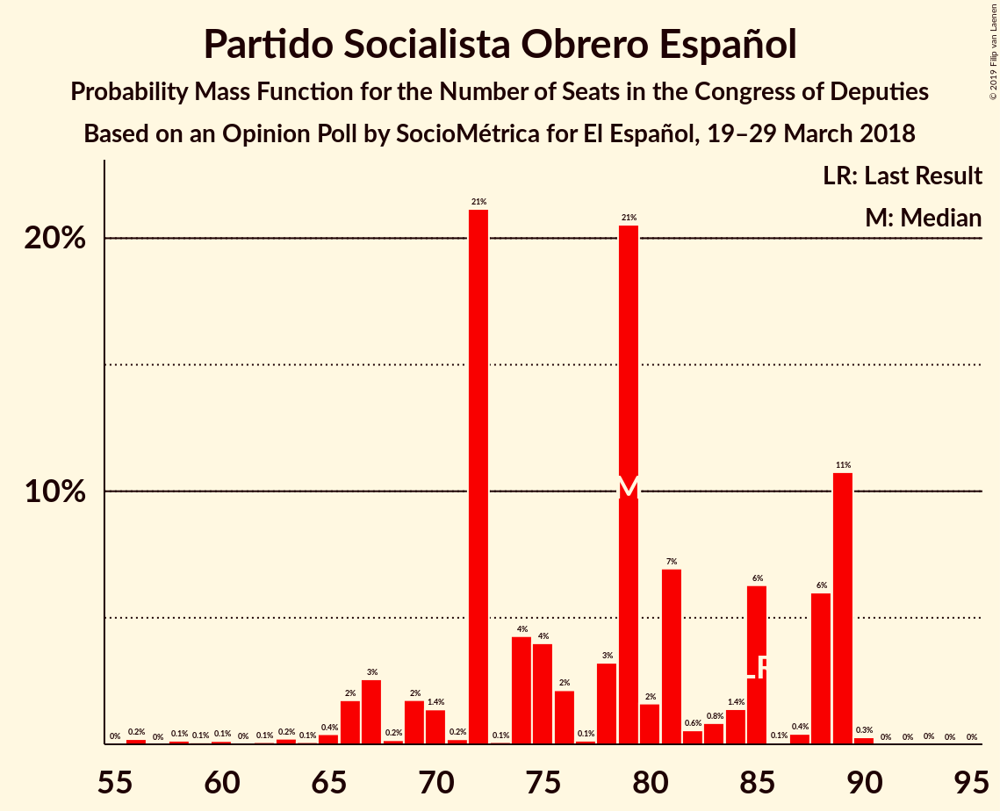
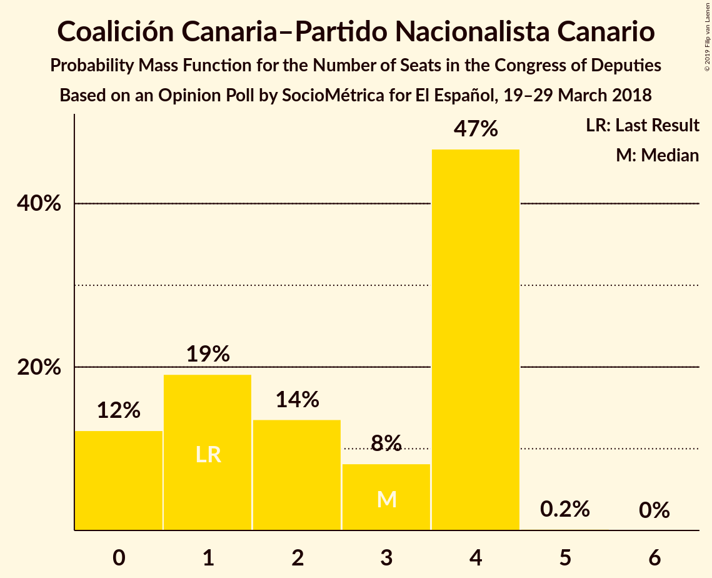
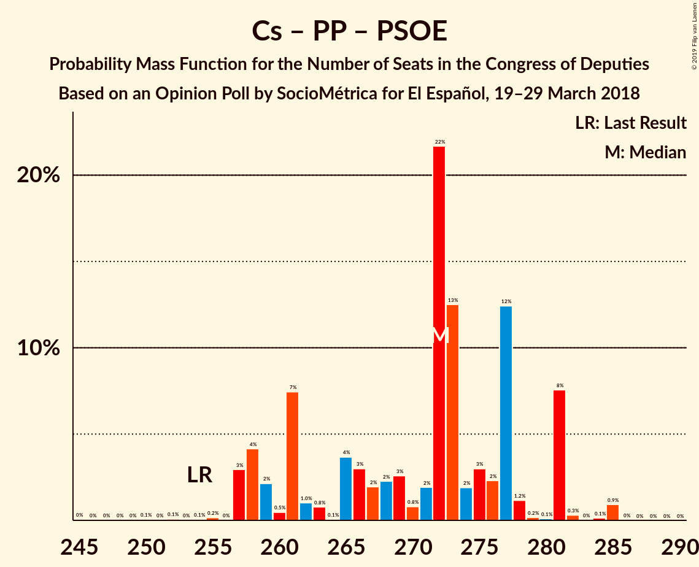
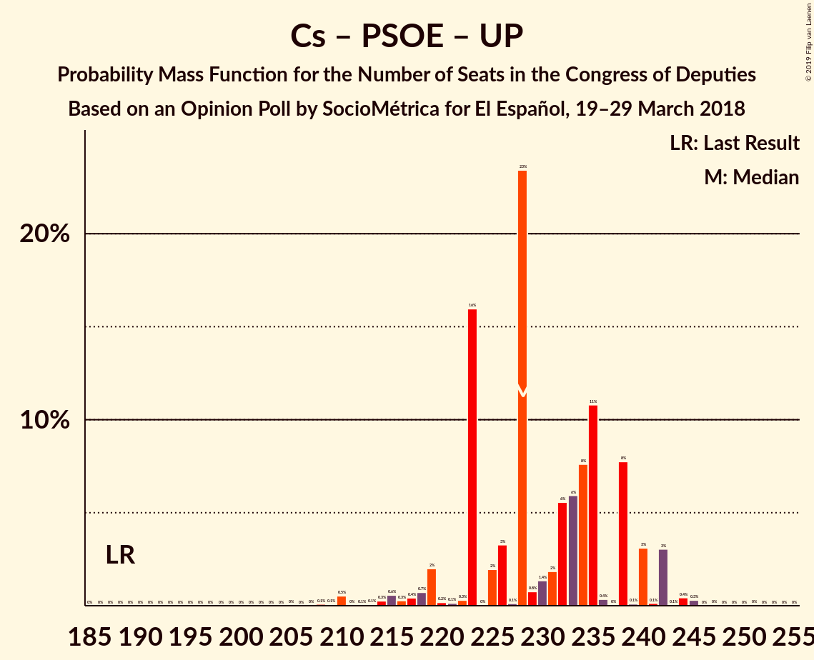
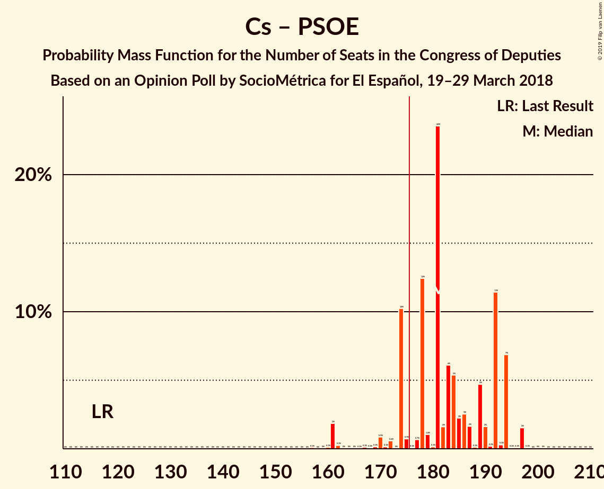
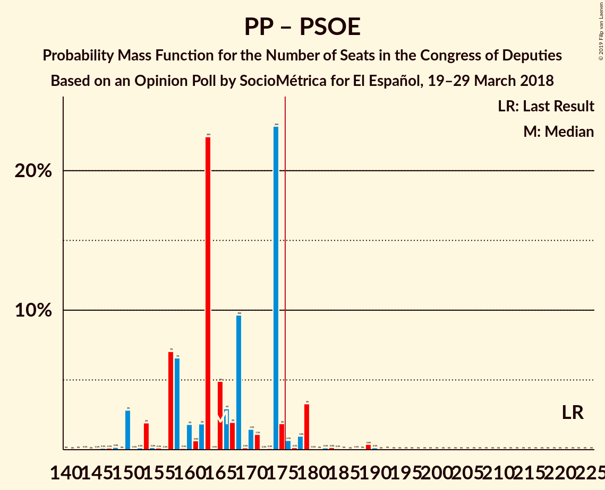
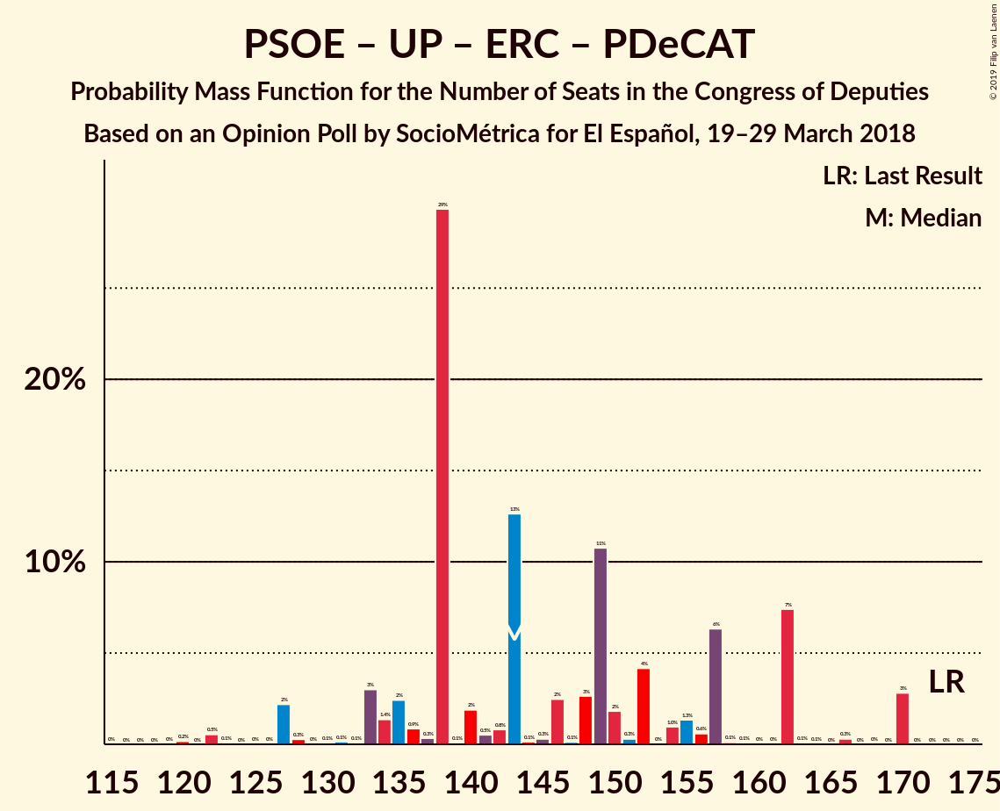
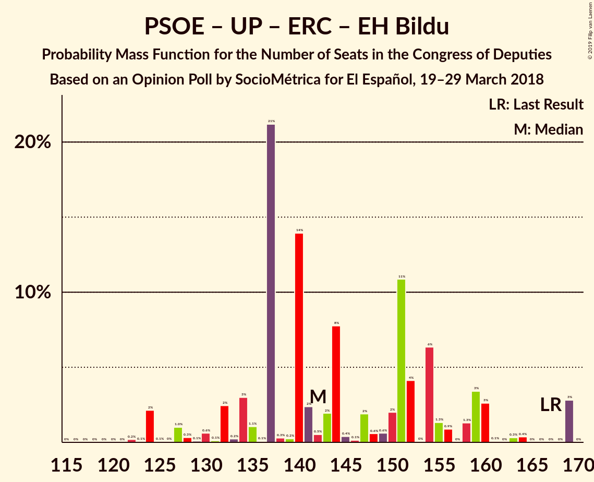
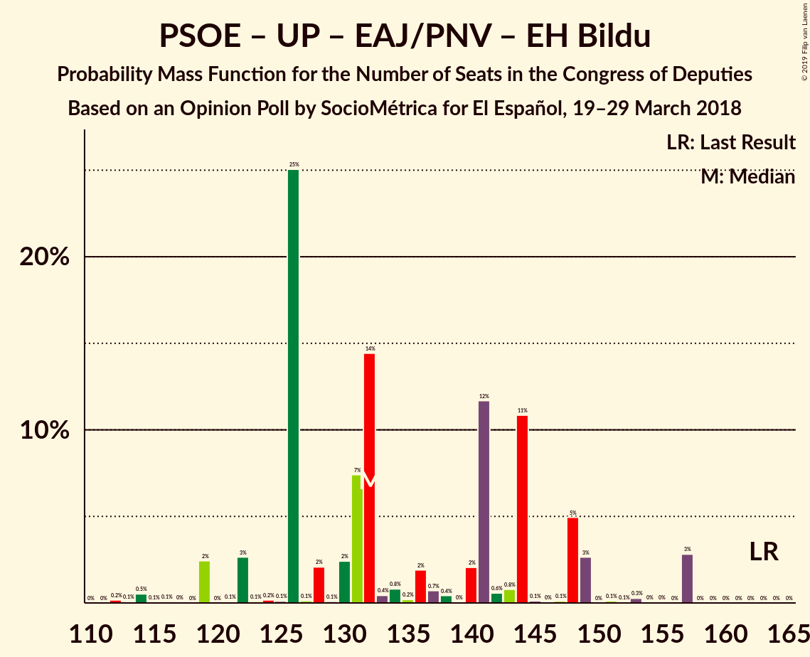
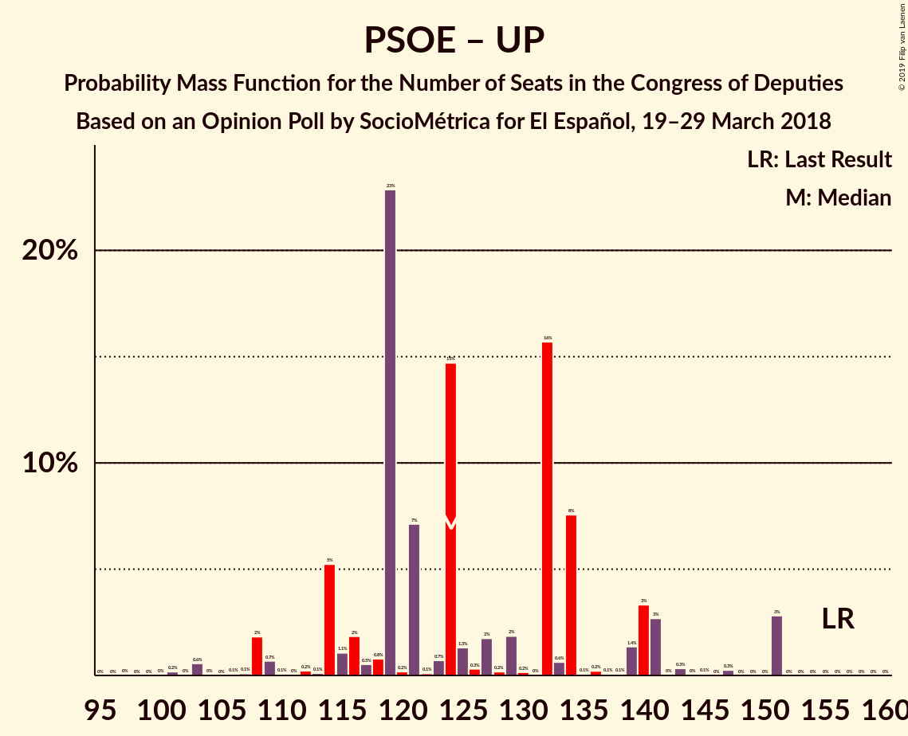

# Opinion Poll by SocioMétrica for El Español, 19–29 March 2018

<a href="#voting-intentions">Voting Intentions</a> | <a href="#seats">Seats</a> | <a href="#coalitions">Coalitions</a> | <a href="#technical-information">Technical Information</a>

## Voting Intentions

### Confidence Intervals

| Party | Last Result | Poll Result | 80% Confidence Interval | 90% Confidence Interval | 95% Confidence Interval | 99% Confidence Interval |
|:-----:|:-----------:|:-----------:|:-----------------------:|:-----------------------:|:-----------------------:|:-----------------------:|
| Ciudadanos–Partido de la Ciudadanía | 13.1% | 27.4% | 25.6–29.3% |25.1–29.8% |24.7–30.3% |23.9–31.2% |
| Partido Popular | 33.0% | 21.9% | 20.3–23.7% |19.8–24.1% |19.4–24.6% |18.7–25.4% |
| Partido Socialista Obrero Español | 22.6% | 19.4% | 17.9–21.1% |17.4–21.6% |17.1–22.0% |16.4–22.8% |
| Unidos Podemos | 21.2% | 16.2% | 14.8–17.8% |14.4–18.2% |14.0–18.6% |13.4–19.4% |
| Esquerra Republicana de Catalunya–Catalunya Sí | 2.7% | 4.0% | 3.3–4.9% |3.1–5.2% |2.9–5.4% |2.7–5.9% |
| Partit Demòcrata Europeu Català | 2.0% | 1.5% | 1.1–2.1% |1.0–2.3% |0.9–2.5% |0.7–2.8% |
| Vox | 0.2% | 1.5% | 1.1–2.1% |1.0–2.3% |0.9–2.5% |0.7–2.8% |
| Euzko Alderdi Jeltzalea/Partido Nacionalista Vasco | 1.2% | 1.1% | 0.8–1.7% |0.7–1.8% |0.6–2.0% |0.5–2.3% |
| Euskal Herria Bildu | 0.8% | 0.9% | 0.6–1.4% |0.5–1.6% |0.5–1.7% |0.4–2.0% |
| Coalición Canaria–Partido Nacionalista Canario | 0.3% | 0.5% | 0.3–0.9% |0.3–1.1% |0.2–1.2% |0.2–1.4% |

*Note:* The poll result column reflects the actual value used in the calculations. Published results may vary slightly, and in addition be rounded to fewer digits.

## Seats

### Confidence Intervals

| Party | Last Result | Median | 80% Confidence Interval | 90% Confidence Interval | 95% Confidence Interval | 99% Confidence Interval |
|:-----:|:-----------:|:------:|:-----------------------:|:-----------------------:|:-----------------------:|:-----------------------:|
| <a href="#ciudadanos–partido-de-la-ciudadanía">Ciudadanos–Partido de la Ciudadanía</a> | 32 | 104 | 95–113 |89–119 |86–120 |86–123 |
| <a href="#partido-popular">Partido Popular</a> | 137 | 88 | 78–95 |78–96 |77–98 |77–108 |
| <a href="#partido-socialista-obrero-español">Partido Socialista Obrero Español</a> | 85 | 79 | 72–89 |67–89 |66–89 |59–89 |
| <a href="#unidos-podemos">Unidos Podemos</a> | 71 | 47 | 40–58 |39–58 |36–66 |33–66 |
| <a href="#esquerra-republicana-de-catalunya–catalunya-sí">Esquerra Republicana de Catalunya–Catalunya Sí</a> | 9 | 15 | 13–19 |13–19 |12–20 |11–20 |
| <a href="#partit-demòcrata-europeu-català">Partit Demòcrata Europeu Català</a> | 8 | 4 | 1–6 |1–7 |1–8 |1–10 |
| <a href="#vox">Vox</a> | 0 | 1 | 1 |1–2 |0–2 |0–2 |
| <a href="#euzko-alderdi-jeltzalea/partido-nacionalista-vasco">Euzko Alderdi Jeltzalea/Partido Nacionalista Vasco</a> | 5 | 6 | 3–7 |3–8 |3–9 |1–10 |
| <a href="#euskal-herria-bildu">Euskal Herria Bildu</a> | 2 | 3 | 1–7 |1–7 |1–7 |1–8 |
| <a href="#coalición-canaria–partido-nacionalista-canario">Coalición Canaria–Partido Nacionalista Canario</a> | 1 | 3 | 0–4 |0–4 |0–4 |0–4 |

### Ciudadanos–Partido de la Ciudadanía

*For a full overview of the results for this party, see the [Ciudadanos–Partido de la Ciudadanía](party-ciudadanos–partidodelaciudadanía.html) page.*

| Number of Seats | Probability | Accumulated | Special Marks |
|:---------------:|:-----------:|:-----------:|:-------------:|
| 32 | 0% | 100% | Last Result |
| 33 | 0% | 100% |  |
| 34 | 0% | 100% |  |
| 35 | 0% | 100% |  |
| 36 | 0% | 100% |  |
| 37 | 0% | 100% |  |
| 38 | 0% | 100% |  |
| 39 | 0% | 100% |  |
| 40 | 0% | 100% |  |
| 41 | 0% | 100% |  |
| 42 | 0% | 100% |  |
| 43 | 0% | 100% |  |
| 44 | 0% | 100% |  |
| 45 | 0% | 100% |  |
| 46 | 0% | 100% |  |
| 47 | 0% | 100% |  |
| 48 | 0% | 100% |  |
| 49 | 0% | 100% |  |
| 50 | 0% | 100% |  |
| 51 | 0% | 100% |  |
| 52 | 0% | 100% |  |
| 53 | 0% | 100% |  |
| 54 | 0% | 100% |  |
| 55 | 0% | 100% |  |
| 56 | 0% | 100% |  |
| 57 | 0% | 100% |  |
| 58 | 0% | 100% |  |
| 59 | 0% | 100% |  |
| 60 | 0% | 100% |  |
| 61 | 0% | 100% |  |
| 62 | 0% | 100% |  |
| 63 | 0% | 100% |  |
| 64 | 0% | 100% |  |
| 65 | 0% | 100% |  |
| 66 | 0% | 100% |  |
| 67 | 0% | 100% |  |
| 68 | 0% | 100% |  |
| 69 | 0% | 100% |  |
| 70 | 0% | 100% |  |
| 71 | 0% | 100% |  |
| 72 | 0% | 100% |  |
| 73 | 0% | 100% |  |
| 74 | 0% | 100% |  |
| 75 | 0% | 100% |  |
| 76 | 0% | 100% |  |
| 77 | 0% | 100% |  |
| 78 | 0% | 100% |  |
| 79 | 0% | 100% |  |
| 80 | 0% | 100% |  |
| 81 | 0% | 100% |  |
| 82 | 0% | 99.9% |  |
| 83 | 0.1% | 99.9% |  |
| 84 | 0% | 99.8% |  |
| 85 | 0% | 99.8% |  |
| 86 | 3% | 99.8% |  |
| 87 | 0% | 97% |  |
| 88 | 0.1% | 97% |  |
| 89 | 3% | 96% |  |
| 90 | 0.6% | 94% |  |
| 91 | 0.8% | 93% |  |
| 92 | 2% | 92% |  |
| 93 | 0% | 90% |  |
| 94 | 0.1% | 90% |  |
| 95 | 0.4% | 90% |  |
| 96 | 2% | 90% |  |
| 97 | 0.1% | 87% |  |
| 98 | 1.5% | 87% |  |
| 99 | 14% | 86% |  |
| 100 | 5% | 72% |  |
| 101 | 4% | 67% |  |
| 102 | 0.2% | 64% |  |
| 103 | 11% | 64% |  |
| 104 | 6% | 53% | Median |
| 105 | 0.7% | 46% |  |
| 106 | 0.3% | 46% |  |
| 107 | 0.7% | 45% |  |
| 108 | 0.3% | 45% |  |
| 109 | 27% | 44% |  |
| 110 | 0.4% | 17% |  |
| 111 | 0.6% | 17% |  |
| 112 | 0.2% | 16% |  |
| 113 | 7% | 16% |  |
| 114 | 0.6% | 9% |  |
| 115 | 1.4% | 8% |  |
| 116 | 0.1% | 7% |  |
| 117 | 2% | 7% |  |
| 118 | 0.1% | 5% |  |
| 119 | 3% | 5% |  |
| 120 | 0.6% | 3% |  |
| 121 | 0.2% | 2% |  |
| 122 | 0% | 2% |  |
| 123 | 2% | 2% |  |
| 124 | 0% | 0.1% |  |
| 125 | 0% | 0% |  |

### Partido Popular

*For a full overview of the results for this party, see the [Partido Popular](party-partidopopular.html) page.*

| Number of Seats | Probability | Accumulated | Special Marks |
|:---------------:|:-----------:|:-----------:|:-------------:|
| 70 | 0% | 100% |  |
| 71 | 0.1% | 99.9% |  |
| 72 | 0% | 99.9% |  |
| 73 | 0% | 99.9% |  |
| 74 | 0% | 99.9% |  |
| 75 | 0.2% | 99.8% |  |
| 76 | 0.2% | 99.7% |  |
| 77 | 4% | 99.5% |  |
| 78 | 6% | 95% |  |
| 79 | 1.2% | 89% |  |
| 80 | 2% | 88% |  |
| 81 | 0.7% | 86% |  |
| 82 | 2% | 85% |  |
| 83 | 5% | 83% |  |
| 84 | 4% | 78% |  |
| 85 | 11% | 73% |  |
| 86 | 2% | 62% |  |
| 87 | 10% | 60% |  |
| 88 | 1.1% | 50% | Median |
| 89 | 0.3% | 49% |  |
| 90 | 2% | 49% |  |
| 91 | 28% | 47% |  |
| 92 | 0.8% | 19% |  |
| 93 | 0.1% | 18% |  |
| 94 | 0.1% | 18% |  |
| 95 | 13% | 18% |  |
| 96 | 0.6% | 5% |  |
| 97 | 0.8% | 5% |  |
| 98 | 2% | 4% |  |
| 99 | 0% | 2% |  |
| 100 | 0.1% | 2% |  |
| 101 | 0.4% | 2% |  |
| 102 | 0% | 2% |  |
| 103 | 0.1% | 2% |  |
| 104 | 0.4% | 1.5% |  |
| 105 | 0.1% | 1.1% |  |
| 106 | 0% | 1.0% |  |
| 107 | 0.3% | 1.0% |  |
| 108 | 0.5% | 0.7% |  |
| 109 | 0.1% | 0.2% |  |
| 110 | 0% | 0.1% |  |
| 111 | 0.1% | 0.1% |  |
| 112 | 0% | 0% |  |
| 113 | 0% | 0% |  |
| 114 | 0% | 0% |  |
| 115 | 0% | 0% |  |
| 116 | 0% | 0% |  |
| 117 | 0% | 0% |  |
| 118 | 0% | 0% |  |
| 119 | 0% | 0% |  |
| 120 | 0% | 0% |  |
| 121 | 0% | 0% |  |
| 122 | 0% | 0% |  |
| 123 | 0% | 0% |  |
| 124 | 0% | 0% |  |
| 125 | 0% | 0% |  |
| 126 | 0% | 0% |  |
| 127 | 0% | 0% |  |
| 128 | 0% | 0% |  |
| 129 | 0% | 0% |  |
| 130 | 0% | 0% |  |
| 131 | 0% | 0% |  |
| 132 | 0% | 0% |  |
| 133 | 0% | 0% |  |
| 134 | 0% | 0% |  |
| 135 | 0% | 0% |  |
| 136 | 0% | 0% |  |
| 137 | 0% | 0% | Last Result |

### Partido Socialista Obrero Español

*For a full overview of the results for this party, see the [Partido Socialista Obrero Español](party-partidosocialistaobreroespañol.html) page.*

| Number of Seats | Probability | Accumulated | Special Marks |
|:---------------:|:-----------:|:-----------:|:-------------:|
| 55 | 0% | 100% |  |
| 56 | 0.2% | 99.9% |  |
| 57 | 0% | 99.7% |  |
| 58 | 0.1% | 99.7% |  |
| 59 | 0.1% | 99.6% |  |
| 60 | 0.1% | 99.5% |  |
| 61 | 0% | 99.4% |  |
| 62 | 0.1% | 99.3% |  |
| 63 | 0.2% | 99.2% |  |
| 64 | 0.1% | 99.0% |  |
| 65 | 0.4% | 98.9% |  |
| 66 | 2% | 98.5% |  |
| 67 | 3% | 97% |  |
| 68 | 0.2% | 94% |  |
| 69 | 2% | 94% |  |
| 70 | 1.4% | 92% |  |
| 71 | 0.2% | 91% |  |
| 72 | 21% | 91% |  |
| 73 | 0.1% | 70% |  |
| 74 | 4% | 69% |  |
| 75 | 4% | 65% |  |
| 76 | 2% | 61% |  |
| 77 | 0.1% | 59% |  |
| 78 | 3% | 59% |  |
| 79 | 21% | 56% | Median |
| 80 | 2% | 35% |  |
| 81 | 7% | 34% |  |
| 82 | 0.6% | 27% |  |
| 83 | 0.8% | 26% |  |
| 84 | 1.4% | 25% |  |
| 85 | 6% | 24% | Last Result |
| 86 | 0.1% | 18% |  |
| 87 | 0.4% | 18% |  |
| 88 | 6% | 17% |  |
| 89 | 11% | 11% |  |
| 90 | 0.3% | 0.3% |  |
| 91 | 0% | 0.1% |  |
| 92 | 0% | 0.1% |  |
| 93 | 0% | 0.1% |  |
| 94 | 0% | 0% |  |

### Unidos Podemos

*For a full overview of the results for this party, see the [Unidos Podemos](party-unidospodemos.html) page.*

| Number of Seats | Probability | Accumulated | Special Marks |
|:---------------:|:-----------:|:-----------:|:-------------:|
| 32 | 0.1% | 100% |  |
| 33 | 0.6% | 99.9% |  |
| 34 | 0.1% | 99.4% |  |
| 35 | 0.1% | 99.3% |  |
| 36 | 2% | 99.2% |  |
| 37 | 0.2% | 97% |  |
| 38 | 0.6% | 97% |  |
| 39 | 4% | 96% |  |
| 40 | 8% | 92% |  |
| 41 | 2% | 84% |  |
| 42 | 2% | 82% |  |
| 43 | 11% | 81% |  |
| 44 | 3% | 69% |  |
| 45 | 13% | 67% |  |
| 46 | 0.2% | 54% |  |
| 47 | 24% | 54% | Median |
| 48 | 2% | 30% |  |
| 49 | 0.3% | 28% |  |
| 50 | 2% | 28% |  |
| 51 | 0.1% | 26% |  |
| 52 | 4% | 26% |  |
| 53 | 4% | 22% |  |
| 54 | 1.4% | 18% |  |
| 55 | 6% | 17% |  |
| 56 | 0.2% | 11% |  |
| 57 | 0.4% | 11% |  |
| 58 | 6% | 10% |  |
| 59 | 0.4% | 4% |  |
| 60 | 0.1% | 4% |  |
| 61 | 0.1% | 4% |  |
| 62 | 0.1% | 4% |  |
| 63 | 0.1% | 3% |  |
| 64 | 0% | 3% |  |
| 65 | 0.3% | 3% |  |
| 66 | 3% | 3% |  |
| 67 | 0.1% | 0.2% |  |
| 68 | 0% | 0.1% |  |
| 69 | 0% | 0.1% |  |
| 70 | 0% | 0.1% |  |
| 71 | 0% | 0% | Last Result |

### Esquerra Republicana de Catalunya–Catalunya Sí

*For a full overview of the results for this party, see the [Esquerra Republicana de Catalunya–Catalunya Sí](party-esquerrarepublicanadecatalunya–catalunyasí.html) page.*

| Number of Seats | Probability | Accumulated | Special Marks |
|:---------------:|:-----------:|:-----------:|:-------------:|
| 9 | 0.3% | 100% | Last Result |
| 10 | 0.2% | 99.7% |  |
| 11 | 2% | 99.5% |  |
| 12 | 1.2% | 98% |  |
| 13 | 12% | 97% |  |
| 14 | 23% | 85% |  |
| 15 | 32% | 62% | Median |
| 16 | 8% | 30% |  |
| 17 | 3% | 22% |  |
| 18 | 8% | 19% |  |
| 19 | 8% | 11% |  |
| 20 | 3% | 4% |  |
| 21 | 0.4% | 0.4% |  |
| 22 | 0% | 0% |  |

### Partit Demòcrata Europeu Català

*For a full overview of the results for this party, see the [Partit Demòcrata Europeu Català](party-partitdemòcrataeuropeucatalà.html) page.*

| Number of Seats | Probability | Accumulated | Special Marks |
|:---------------:|:-----------:|:-----------:|:-------------:|
| 1 | 10% | 100% |  |
| 2 | 0.2% | 90% |  |
| 3 | 6% | 90% |  |
| 4 | 48% | 83% | Median |
| 5 | 16% | 35% |  |
| 6 | 11% | 19% |  |
| 7 | 5% | 8% |  |
| 8 | 2% | 3% | Last Result |
| 9 | 0.3% | 1.0% |  |
| 10 | 0.7% | 0.7% |  |
| 11 | 0% | 0% |  |

### Vox

*For a full overview of the results for this party, see the [Vox](party-vox.html) page.*

| Number of Seats | Probability | Accumulated | Special Marks |
|:---------------:|:-----------:|:-----------:|:-------------:|
| 0 | 5% | 100% | Last Result |
| 1 | 89% | 95% | Median |
| 2 | 6% | 6% |  |
| 3 | 0% | 0% |  |

### Euzko Alderdi Jeltzalea/Partido Nacionalista Vasco

*For a full overview of the results for this party, see the [Euzko Alderdi Jeltzalea/Partido Nacionalista Vasco](party-euzkoalderdijeltzaleapartidonacionalistavasco.html) page.*

| Number of Seats | Probability | Accumulated | Special Marks |
|:---------------:|:-----------:|:-----------:|:-------------:|
| 1 | 0.5% | 100% |  |
| 2 | 0.8% | 99.5% |  |
| 3 | 19% | 98.7% |  |
| 4 | 22% | 80% |  |
| 5 | 3% | 58% | Last Result |
| 6 | 35% | 55% | Median |
| 7 | 14% | 20% |  |
| 8 | 3% | 6% |  |
| 9 | 2% | 3% |  |
| 10 | 1.3% | 1.4% |  |
| 11 | 0.1% | 0.1% |  |
| 12 | 0% | 0% |  |

### Euskal Herria Bildu

*For a full overview of the results for this party, see the [Euskal Herria Bildu](party-euskalherriabildu.html) page.*

| Number of Seats | Probability | Accumulated | Special Marks |
|:---------------:|:-----------:|:-----------:|:-------------:|
| 0 | 0.2% | 100% |  |
| 1 | 12% | 99.8% |  |
| 2 | 20% | 88% | Last Result |
| 3 | 30% | 68% | Median |
| 4 | 3% | 38% |  |
| 5 | 9% | 35% |  |
| 6 | 16% | 26% |  |
| 7 | 9% | 10% |  |
| 8 | 0.8% | 1.0% |  |
| 9 | 0.1% | 0.2% |  |
| 10 | 0% | 0.1% |  |
| 11 | 0% | 0% |  |

### Coalición Canaria–Partido Nacionalista Canario

*For a full overview of the results for this party, see the [Coalición Canaria–Partido Nacionalista Canario](party-coalicióncanaria–partidonacionalistacanario.html) page.*

| Number of Seats | Probability | Accumulated | Special Marks |
|:---------------:|:-----------:|:-----------:|:-------------:|
| 0 | 12% | 100% |  |
| 1 | 19% | 88% | Last Result |
| 2 | 14% | 69% |  |
| 3 | 8% | 55% | Median |
| 4 | 47% | 47% |  |
| 5 | 0.2% | 0.2% |  |
| 6 | 0% | 0% |  |

## Coalitions

### Confidence Intervals

| Coalition | Last Result | Median | Majority? | 80% Confidence Interval | 90% Confidence Interval | 95% Confidence Interval | 99% Confidence Interval |
|:---------:|:-----------:|:------:|:---------:|:-----------------------:|:-----------------------:|:-----------------------:|:-----------------------:|
| Ciudadanos–Partido de la Ciudadanía – Partido Popular – Partido Socialista Obrero Español | 254 | 272 | 100% | 260–278 | 258–281 | 257–281 | 255–285 |
| Ciudadanos–Partido de la Ciudadanía – Partido Socialista Obrero Español – Unidos Podemos | 188 | 228 | 100% | 223–238 | 219–240 | 217–242 | 210–244 |
| Ciudadanos–Partido de la Ciudadanía – Partido Popular – Euzko Alderdi Jeltzalea/Partido Nacionalista Vasco | 174 | 200 | 97% | 184–207 | 181–210 | 175–217 | 175–219 |
| Ciudadanos–Partido de la Ciudadanía – Partido Popular – Coalición Canaria–Partido Nacionalista Canario | 170 | 198 | 97% | 179–204 | 179–206 | 174–211 | 174–216 |
| Ciudadanos–Partido de la Ciudadanía – Partido Popular – Vox | 169 | 195 | 97% | 179–201 | 178–204 | 172–211 | 172–216 |
| Ciudadanos–Partido de la Ciudadanía – Partido Popular | 169 | 194 | 97% | 178–200 | 177–203 | 172–210 | 172–215 |
| Ciudadanos–Partido de la Ciudadanía – Partido Socialista Obrero Español | 117 | 181 | 85% | 174–192 | 174–194 | 165–194 | 161–197 |
| Partido Popular – Partido Socialista Obrero Español | 222 | 165 | 6% | 157–174 | 153–178 | 150–179 | 148–189 |
| Partido Socialista Obrero Español – Unidos Podemos – Esquerra Republicana de Catalunya–Catalunya Sí – Partit Demòcrata Europeu Català – Euzko Alderdi Jeltzalea/Partido Nacionalista Vasco – Euskal Herria Bildu | 180 | 151 | 3% | 145–170 | 143–170 | 138–176 | 133–176 |
| Partido Socialista Obrero Español – Unidos Podemos – Esquerra Republicana de Catalunya–Catalunya Sí – Partit Demòcrata Europeu Català | 173 | 143 | 0% | 135–162 | 133–162 | 127–170 | 122–170 |
| Partido Socialista Obrero Español – Unidos Podemos – Esquerra Republicana de Catalunya–Catalunya Sí – Euskal Herria Bildu | 167 | 142 | 0% | 134–158 | 132–160 | 125–169 | 124–169 |
| Partido Socialista Obrero Español – Unidos Podemos – Euzko Alderdi Jeltzalea/Partido Nacionalista Vasco – Euskal Herria Bildu | 163 | 132 | 0% | 126–148 | 122–149 | 119–157 | 114–157 |
| Partido Socialista Obrero Español – Unidos Podemos – Euzko Alderdi Jeltzalea/Partido Nacionalista Vasco | 161 | 130 | 0% | 123–144 | 119–147 | 117–154 | 107–154 |
| Partido Socialista Obrero Español – Unidos Podemos | 156 | 124 | 0% | 115–139 | 114–141 | 108–151 | 103–151 |
| Partido Popular – Vox | 137 | 89 | 0% | 79–96 | 79–98 | 78–100 | 78–109 |
| Partido Popular | 137 | 88 | 0% | 78–95 | 78–96 | 77–98 | 77–108 |
| Partido Socialista Obrero Español | 85 | 79 | 0% | 72–89 | 67–89 | 66–89 | 59–89 |

### Ciudadanos–Partido de la Ciudadanía – Partido Popular – Partido Socialista Obrero Español

| Number of Seats | Probability | Accumulated | Special Marks |
|:---------------:|:-----------:|:-----------:|:-------------:|
| 245 | 0% | 100% |  |
| 246 | 0% | 99.9% |  |
| 247 | 0% | 99.9% |  |
| 248 | 0% | 99.9% |  |
| 249 | 0% | 99.9% |  |
| 250 | 0.1% | 99.9% |  |
| 251 | 0% | 99.8% |  |
| 252 | 0.1% | 99.8% |  |
| 253 | 0% | 99.7% |  |
| 254 | 0.1% | 99.7% | Last Result |
| 255 | 0.2% | 99.6% |  |
| 256 | 0% | 99.5% |  |
| 257 | 3% | 99.4% |  |
| 258 | 4% | 96% |  |
| 259 | 2% | 92% |  |
| 260 | 0.5% | 90% |  |
| 261 | 7% | 90% |  |
| 262 | 1.0% | 82% |  |
| 263 | 0.8% | 81% |  |
| 264 | 0.1% | 80% |  |
| 265 | 4% | 80% |  |
| 266 | 3% | 77% |  |
| 267 | 2% | 74% |  |
| 268 | 2% | 72% |  |
| 269 | 3% | 70% |  |
| 270 | 0.8% | 67% |  |
| 271 | 2% | 66% | Median |
| 272 | 22% | 64% |  |
| 273 | 13% | 43% |  |
| 274 | 2% | 30% |  |
| 275 | 3% | 28% |  |
| 276 | 2% | 25% |  |
| 277 | 12% | 23% |  |
| 278 | 1.2% | 10% |  |
| 279 | 0.2% | 9% |  |
| 280 | 0.1% | 9% |  |
| 281 | 8% | 9% |  |
| 282 | 0.3% | 1.4% |  |
| 283 | 0% | 1.1% |  |
| 284 | 0.1% | 1.1% |  |
| 285 | 0.9% | 0.9% |  |
| 286 | 0% | 0% |  |

### Ciudadanos–Partido de la Ciudadanía – Partido Socialista Obrero Español – Unidos Podemos

| Number of Seats | Probability | Accumulated | Special Marks |
|:---------------:|:-----------:|:-----------:|:-------------:|
| 188 | 0% | 100% | Last Result |
| 189 | 0% | 100% |  |
| 190 | 0% | 100% |  |
| 191 | 0% | 100% |  |
| 192 | 0% | 100% |  |
| 193 | 0% | 100% |  |
| 194 | 0% | 100% |  |
| 195 | 0% | 100% |  |
| 196 | 0% | 100% |  |
| 197 | 0% | 100% |  |
| 198 | 0% | 100% |  |
| 199 | 0% | 100% |  |
| 200 | 0% | 100% |  |
| 201 | 0% | 100% |  |
| 202 | 0% | 100% |  |
| 203 | 0% | 100% |  |
| 204 | 0% | 99.9% |  |
| 205 | 0% | 99.9% |  |
| 206 | 0% | 99.9% |  |
| 207 | 0% | 99.9% |  |
| 208 | 0.1% | 99.8% |  |
| 209 | 0.1% | 99.7% |  |
| 210 | 0.5% | 99.7% |  |
| 211 | 0% | 99.1% |  |
| 212 | 0.1% | 99.1% |  |
| 213 | 0.1% | 99.0% |  |
| 214 | 0.3% | 99.0% |  |
| 215 | 0.6% | 98.7% |  |
| 216 | 0.3% | 98% |  |
| 217 | 0.4% | 98% |  |
| 218 | 0.7% | 97% |  |
| 219 | 2% | 97% |  |
| 220 | 0.2% | 95% |  |
| 221 | 0.1% | 95% |  |
| 222 | 0.3% | 94% |  |
| 223 | 16% | 94% |  |
| 224 | 0% | 78% |  |
| 225 | 2% | 78% |  |
| 226 | 3% | 76% |  |
| 227 | 0.1% | 73% |  |
| 228 | 23% | 73% |  |
| 229 | 0.8% | 49% |  |
| 230 | 1.4% | 49% | Median |
| 231 | 2% | 47% |  |
| 232 | 6% | 45% |  |
| 233 | 6% | 40% |  |
| 234 | 8% | 34% |  |
| 235 | 11% | 26% |  |
| 236 | 0.4% | 15% |  |
| 237 | 0% | 15% |  |
| 238 | 8% | 15% |  |
| 239 | 0.1% | 7% |  |
| 240 | 3% | 7% |  |
| 241 | 0.1% | 4% |  |
| 242 | 3% | 4% |  |
| 243 | 0.1% | 0.9% |  |
| 244 | 0.4% | 0.8% |  |
| 245 | 0.3% | 0.4% |  |
| 246 | 0% | 0.1% |  |
| 247 | 0% | 0.1% |  |
| 248 | 0% | 0.1% |  |
| 249 | 0% | 0.1% |  |
| 250 | 0% | 0.1% |  |
| 251 | 0% | 0% |  |

### Ciudadanos–Partido de la Ciudadanía – Partido Popular – Euzko Alderdi Jeltzalea/Partido Nacionalista Vasco

| Number of Seats | Probability | Accumulated | Special Marks |
|:---------------:|:-----------:|:-----------:|:-------------:|
| 174 | 0% | 100% | Last Result |
| 175 | 3% | 100% |  |
| 176 | 0% | 97% | Majority |
| 177 | 0.1% | 97% |  |
| 178 | 0% | 97% |  |
| 179 | 0.3% | 97% |  |
| 180 | 0% | 97% |  |
| 181 | 3% | 97% |  |
| 182 | 0.1% | 94% |  |
| 183 | 2% | 94% |  |
| 184 | 3% | 92% |  |
| 185 | 0.2% | 89% |  |
| 186 | 0.8% | 89% |  |
| 187 | 5% | 88% |  |
| 188 | 6% | 83% |  |
| 189 | 0.2% | 77% |  |
| 190 | 1.4% | 77% |  |
| 191 | 0% | 76% |  |
| 192 | 0.7% | 76% |  |
| 193 | 0.1% | 75% |  |
| 194 | 13% | 75% |  |
| 195 | 0.2% | 62% |  |
| 196 | 1.0% | 62% |  |
| 197 | 4% | 61% |  |
| 198 | 0.7% | 57% | Median |
| 199 | 0.2% | 57% |  |
| 200 | 12% | 56% |  |
| 201 | 0.1% | 44% |  |
| 202 | 0.7% | 44% |  |
| 203 | 8% | 43% |  |
| 204 | 23% | 35% |  |
| 205 | 0.8% | 12% |  |
| 206 | 0.4% | 11% |  |
| 207 | 5% | 11% |  |
| 208 | 0.2% | 5% |  |
| 209 | 0% | 5% |  |
| 210 | 0.2% | 5% |  |
| 211 | 0.2% | 5% |  |
| 212 | 0% | 5% |  |
| 213 | 1.3% | 5% |  |
| 214 | 0.6% | 3% |  |
| 215 | 0% | 3% |  |
| 216 | 0.1% | 3% |  |
| 217 | 0.1% | 3% |  |
| 218 | 0% | 2% |  |
| 219 | 2% | 2% |  |
| 220 | 0.2% | 0.3% |  |
| 221 | 0% | 0.1% |  |
| 222 | 0% | 0% |  |

### Ciudadanos–Partido de la Ciudadanía – Partido Popular – Coalición Canaria–Partido Nacionalista Canario

| Number of Seats | Probability | Accumulated | Special Marks |
|:---------------:|:-----------:|:-----------:|:-------------:|
| 170 | 0% | 100% | Last Result |
| 171 | 0% | 100% |  |
| 172 | 0% | 100% |  |
| 173 | 0% | 100% |  |
| 174 | 3% | 99.9% |  |
| 175 | 0% | 97% |  |
| 176 | 0.3% | 97% | Majority |
| 177 | 0.1% | 97% |  |
| 178 | 1.3% | 97% |  |
| 179 | 6% | 95% |  |
| 180 | 0.2% | 90% |  |
| 181 | 0.1% | 89% |  |
| 182 | 0% | 89% |  |
| 183 | 0.4% | 89% |  |
| 184 | 1.3% | 89% |  |
| 185 | 6% | 88% |  |
| 186 | 0.3% | 81% |  |
| 187 | 1.4% | 81% |  |
| 188 | 17% | 80% |  |
| 189 | 0.3% | 63% |  |
| 190 | 0.1% | 62% |  |
| 191 | 3% | 62% |  |
| 192 | 0.1% | 60% |  |
| 193 | 0.3% | 60% |  |
| 194 | 0.4% | 59% |  |
| 195 | 2% | 59% | Median |
| 196 | 0.5% | 57% |  |
| 197 | 0% | 56% |  |
| 198 | 16% | 56% |  |
| 199 | 0.4% | 41% |  |
| 200 | 1.0% | 40% |  |
| 201 | 7% | 39% |  |
| 202 | 0.3% | 32% |  |
| 203 | 0.2% | 32% |  |
| 204 | 25% | 32% |  |
| 205 | 0.1% | 6% |  |
| 206 | 2% | 6% |  |
| 207 | 0.1% | 4% |  |
| 208 | 0.2% | 4% |  |
| 209 | 0.2% | 3% |  |
| 210 | 0.1% | 3% |  |
| 211 | 2% | 3% |  |
| 212 | 0.7% | 2% |  |
| 213 | 0% | 0.9% |  |
| 214 | 0.1% | 0.9% |  |
| 215 | 0% | 0.8% |  |
| 216 | 0.6% | 0.8% |  |
| 217 | 0% | 0.2% |  |
| 218 | 0.2% | 0.2% |  |
| 219 | 0% | 0% |  |

### Ciudadanos–Partido de la Ciudadanía – Partido Popular – Vox

| Number of Seats | Probability | Accumulated | Special Marks |
|:---------------:|:-----------:|:-----------:|:-------------:|
| 169 | 0% | 100% | Last Result |
| 170 | 0% | 100% |  |
| 171 | 0% | 100% |  |
| 172 | 3% | 100% |  |
| 173 | 0% | 97% |  |
| 174 | 0% | 97% |  |
| 175 | 0% | 97% |  |
| 176 | 0% | 97% | Majority |
| 177 | 1.3% | 97% |  |
| 178 | 4% | 96% |  |
| 179 | 3% | 92% |  |
| 180 | 0.1% | 89% |  |
| 181 | 0.9% | 89% |  |
| 182 | 0.1% | 88% |  |
| 183 | 6% | 88% |  |
| 184 | 0.8% | 82% |  |
| 185 | 5% | 81% |  |
| 186 | 0.3% | 76% |  |
| 187 | 2% | 76% |  |
| 188 | 0.5% | 74% |  |
| 189 | 11% | 73% |  |
| 190 | 0.2% | 62% |  |
| 191 | 0.5% | 62% |  |
| 192 | 4% | 61% |  |
| 193 | 0.7% | 58% | Median |
| 194 | 0.1% | 57% |  |
| 195 | 13% | 57% |  |
| 196 | 0.7% | 44% |  |
| 197 | 2% | 44% |  |
| 198 | 0.8% | 42% |  |
| 199 | 2% | 41% |  |
| 200 | 0.5% | 39% |  |
| 201 | 31% | 39% |  |
| 202 | 0.1% | 8% |  |
| 203 | 3% | 8% |  |
| 204 | 1.2% | 5% |  |
| 205 | 0.1% | 4% |  |
| 206 | 0.2% | 4% |  |
| 207 | 0.2% | 4% |  |
| 208 | 0.1% | 3% |  |
| 209 | 0.2% | 3% |  |
| 210 | 0% | 3% |  |
| 211 | 2% | 3% |  |
| 212 | 0.6% | 1.5% |  |
| 213 | 0% | 0.8% |  |
| 214 | 0% | 0.8% |  |
| 215 | 0.2% | 0.8% |  |
| 216 | 0.5% | 0.6% |  |
| 217 | 0% | 0% |  |

### Ciudadanos–Partido de la Ciudadanía – Partido Popular

| Number of Seats | Probability | Accumulated | Special Marks |
|:---------------:|:-----------:|:-----------:|:-------------:|
| 169 | 0% | 100% | Last Result |
| 170 | 0% | 100% |  |
| 171 | 0% | 100% |  |
| 172 | 3% | 99.9% |  |
| 173 | 0% | 97% |  |
| 174 | 0% | 97% |  |
| 175 | 0% | 97% |  |
| 176 | 2% | 97% | Majority |
| 177 | 3% | 95% |  |
| 178 | 3% | 92% |  |
| 179 | 0.1% | 89% |  |
| 180 | 0.5% | 89% |  |
| 181 | 0.4% | 89% |  |
| 182 | 6% | 88% |  |
| 183 | 0.8% | 82% |  |
| 184 | 6% | 81% |  |
| 185 | 0.3% | 76% |  |
| 186 | 2% | 76% |  |
| 187 | 0.1% | 73% |  |
| 188 | 11% | 73% |  |
| 189 | 0.2% | 62% |  |
| 190 | 2% | 62% |  |
| 191 | 2% | 60% |  |
| 192 | 0.1% | 57% | Median |
| 193 | 0.1% | 57% |  |
| 194 | 13% | 57% |  |
| 195 | 0.6% | 44% |  |
| 196 | 2% | 44% |  |
| 197 | 2% | 42% |  |
| 198 | 0.2% | 39% |  |
| 199 | 0.3% | 39% |  |
| 200 | 31% | 39% |  |
| 201 | 0.1% | 8% |  |
| 202 | 3% | 8% |  |
| 203 | 1.2% | 5% |  |
| 204 | 0.2% | 4% |  |
| 205 | 0.1% | 4% |  |
| 206 | 0.2% | 4% |  |
| 207 | 0.3% | 3% |  |
| 208 | 0% | 3% |  |
| 209 | 0% | 3% |  |
| 210 | 2% | 3% |  |
| 211 | 0.7% | 1.5% |  |
| 212 | 0% | 0.8% |  |
| 213 | 0% | 0.8% |  |
| 214 | 0.2% | 0.8% |  |
| 215 | 0.6% | 0.6% |  |
| 216 | 0% | 0% |  |

### Ciudadanos–Partido de la Ciudadanía – Partido Socialista Obrero Español

| Number of Seats | Probability | Accumulated | Special Marks |
|:---------------:|:-----------:|:-----------:|:-------------:|
| 117 | 0% | 100% | Last Result |
| 118 | 0% | 100% |  |
| 119 | 0% | 100% |  |
| 120 | 0% | 100% |  |
| 121 | 0% | 100% |  |
| 122 | 0% | 100% |  |
| 123 | 0% | 100% |  |
| 124 | 0% | 100% |  |
| 125 | 0% | 100% |  |
| 126 | 0% | 100% |  |
| 127 | 0% | 100% |  |
| 128 | 0% | 100% |  |
| 129 | 0% | 100% |  |
| 130 | 0% | 100% |  |
| 131 | 0% | 100% |  |
| 132 | 0% | 100% |  |
| 133 | 0% | 100% |  |
| 134 | 0% | 100% |  |
| 135 | 0% | 100% |  |
| 136 | 0% | 100% |  |
| 137 | 0% | 100% |  |
| 138 | 0% | 100% |  |
| 139 | 0% | 100% |  |
| 140 | 0% | 100% |  |
| 141 | 0% | 100% |  |
| 142 | 0% | 100% |  |
| 143 | 0% | 100% |  |
| 144 | 0% | 100% |  |
| 145 | 0% | 100% |  |
| 146 | 0% | 100% |  |
| 147 | 0% | 100% |  |
| 148 | 0% | 100% |  |
| 149 | 0% | 100% |  |
| 150 | 0% | 100% |  |
| 151 | 0% | 100% |  |
| 152 | 0% | 100% |  |
| 153 | 0% | 100% |  |
| 154 | 0% | 100% |  |
| 155 | 0% | 100% |  |
| 156 | 0% | 100% |  |
| 157 | 0.1% | 99.9% |  |
| 158 | 0% | 99.8% |  |
| 159 | 0% | 99.8% |  |
| 160 | 0.1% | 99.8% |  |
| 161 | 2% | 99.7% |  |
| 162 | 0.3% | 98% |  |
| 163 | 0% | 98% |  |
| 164 | 0% | 98% |  |
| 165 | 0% | 98% |  |
| 166 | 0.1% | 97% |  |
| 167 | 0.1% | 97% |  |
| 168 | 0.1% | 97% |  |
| 169 | 0.1% | 97% |  |
| 170 | 0.9% | 97% |  |
| 171 | 0.1% | 96% |  |
| 172 | 0.6% | 96% |  |
| 173 | 0% | 96% |  |
| 174 | 10% | 95% |  |
| 175 | 0.7% | 85% |  |
| 176 | 0.1% | 85% | Majority |
| 177 | 0.7% | 84% |  |
| 178 | 12% | 84% |  |
| 179 | 1.0% | 71% |  |
| 180 | 0.1% | 70% |  |
| 181 | 24% | 70% |  |
| 182 | 2% | 47% |  |
| 183 | 6% | 45% | Median |
| 184 | 5% | 39% |  |
| 185 | 2% | 34% |  |
| 186 | 3% | 31% |  |
| 187 | 2% | 29% |  |
| 188 | 0.1% | 27% |  |
| 189 | 5% | 27% |  |
| 190 | 2% | 22% |  |
| 191 | 0.2% | 21% |  |
| 192 | 11% | 20% |  |
| 193 | 0.3% | 9% |  |
| 194 | 7% | 9% |  |
| 195 | 0.1% | 2% |  |
| 196 | 0.1% | 2% |  |
| 197 | 2% | 2% |  |
| 198 | 0.1% | 0.2% |  |
| 199 | 0% | 0.1% |  |
| 200 | 0% | 0.1% |  |
| 201 | 0% | 0.1% |  |
| 202 | 0% | 0% |  |

### Partido Popular – Partido Socialista Obrero Español

| Number of Seats | Probability | Accumulated | Special Marks |
|:---------------:|:-----------:|:-----------:|:-------------:|
| 140 | 0% | 100% |  |
| 141 | 0% | 99.9% |  |
| 142 | 0% | 99.9% |  |
| 143 | 0.1% | 99.9% |  |
| 144 | 0% | 99.9% |  |
| 145 | 0.1% | 99.9% |  |
| 146 | 0.1% | 99.8% |  |
| 147 | 0.1% | 99.7% |  |
| 148 | 0.2% | 99.6% |  |
| 149 | 0% | 99.4% |  |
| 150 | 3% | 99.4% |  |
| 151 | 0.1% | 97% |  |
| 152 | 0.1% | 96% |  |
| 153 | 2% | 96% |  |
| 154 | 0.2% | 94% |  |
| 155 | 0.1% | 94% |  |
| 156 | 0.1% | 94% |  |
| 157 | 7% | 94% |  |
| 158 | 7% | 87% |  |
| 159 | 0.1% | 80% |  |
| 160 | 2% | 80% |  |
| 161 | 0.6% | 79% |  |
| 162 | 2% | 78% |  |
| 163 | 22% | 76% |  |
| 164 | 0.1% | 54% |  |
| 165 | 5% | 54% |  |
| 166 | 3% | 49% |  |
| 167 | 2% | 46% | Median |
| 168 | 10% | 44% |  |
| 169 | 0.1% | 34% |  |
| 170 | 1.5% | 34% |  |
| 171 | 1.1% | 33% |  |
| 172 | 0.1% | 31% |  |
| 173 | 0.1% | 31% |  |
| 174 | 23% | 31% |  |
| 175 | 2% | 8% |  |
| 176 | 0.7% | 6% | Majority |
| 177 | 0.1% | 6% |  |
| 178 | 1.0% | 5% |  |
| 179 | 3% | 4% |  |
| 180 | 0.1% | 1.1% |  |
| 181 | 0% | 1.1% |  |
| 182 | 0.1% | 1.0% |  |
| 183 | 0.2% | 0.9% |  |
| 184 | 0.1% | 0.7% |  |
| 185 | 0% | 0.7% |  |
| 186 | 0% | 0.6% |  |
| 187 | 0.1% | 0.6% |  |
| 188 | 0% | 0.6% |  |
| 189 | 0.4% | 0.5% |  |
| 190 | 0.1% | 0.2% |  |
| 191 | 0% | 0% |  |
| 192 | 0% | 0% |  |
| 193 | 0% | 0% |  |
| 194 | 0% | 0% |  |
| 195 | 0% | 0% |  |
| 196 | 0% | 0% |  |
| 197 | 0% | 0% |  |
| 198 | 0% | 0% |  |
| 199 | 0% | 0% |  |
| 200 | 0% | 0% |  |
| 201 | 0% | 0% |  |
| 202 | 0% | 0% |  |
| 203 | 0% | 0% |  |
| 204 | 0% | 0% |  |
| 205 | 0% | 0% |  |
| 206 | 0% | 0% |  |
| 207 | 0% | 0% |  |
| 208 | 0% | 0% |  |
| 209 | 0% | 0% |  |
| 210 | 0% | 0% |  |
| 211 | 0% | 0% |  |
| 212 | 0% | 0% |  |
| 213 | 0% | 0% |  |
| 214 | 0% | 0% |  |
| 215 | 0% | 0% |  |
| 216 | 0% | 0% |  |
| 217 | 0% | 0% |  |
| 218 | 0% | 0% |  |
| 219 | 0% | 0% |  |
| 220 | 0% | 0% |  |
| 221 | 0% | 0% |  |
| 222 | 0% | 0% | Last Result |

### Partido Socialista Obrero Español – Unidos Podemos – Esquerra Republicana de Catalunya–Catalunya Sí – Partit Demòcrata Europeu Català – Euzko Alderdi Jeltzalea/Partido Nacionalista Vasco – Euskal Herria Bildu

| Number of Seats | Probability | Accumulated | Special Marks |
|:---------------:|:-----------:|:-----------:|:-------------:|
| 131 | 0.2% | 100% |  |
| 132 | 0% | 99.8% |  |
| 133 | 0.5% | 99.8% |  |
| 134 | 0.1% | 99.2% |  |
| 135 | 0% | 99.2% |  |
| 136 | 0.1% | 99.2% |  |
| 137 | 0.6% | 99.1% |  |
| 138 | 2% | 98.5% |  |
| 139 | 0.3% | 97% |  |
| 140 | 0% | 97% |  |
| 141 | 0.2% | 97% |  |
| 142 | 0.1% | 96% |  |
| 143 | 3% | 96% |  |
| 144 | 0.2% | 94% |  |
| 145 | 25% | 94% |  |
| 146 | 0.2% | 69% |  |
| 147 | 0.2% | 68% |  |
| 148 | 7% | 68% |  |
| 149 | 0.9% | 61% |  |
| 150 | 2% | 60% |  |
| 151 | 14% | 58% |  |
| 152 | 0.3% | 44% |  |
| 153 | 0.4% | 44% |  |
| 154 | 2% | 43% | Median |
| 155 | 0.4% | 41% |  |
| 156 | 0.3% | 41% |  |
| 157 | 2% | 40% |  |
| 158 | 0.2% | 38% |  |
| 159 | 0.1% | 38% |  |
| 160 | 0.8% | 38% |  |
| 161 | 17% | 37% |  |
| 162 | 1.4% | 20% |  |
| 163 | 0.3% | 19% |  |
| 164 | 6% | 19% |  |
| 165 | 1.3% | 12% |  |
| 166 | 0% | 11% |  |
| 167 | 0.3% | 11% |  |
| 168 | 0.1% | 11% |  |
| 169 | 0.2% | 11% |  |
| 170 | 6% | 10% |  |
| 171 | 1.3% | 5% |  |
| 172 | 0.3% | 3% |  |
| 173 | 0% | 3% |  |
| 174 | 0% | 3% |  |
| 175 | 0% | 3% |  |
| 176 | 3% | 3% | Majority |
| 177 | 0% | 0% |  |
| 178 | 0% | 0% |  |
| 179 | 0% | 0% |  |
| 180 | 0% | 0% | Last Result |

### Partido Socialista Obrero Español – Unidos Podemos – Esquerra Republicana de Catalunya–Catalunya Sí – Partit Demòcrata Europeu Català

| Number of Seats | Probability | Accumulated | Special Marks |
|:---------------:|:-----------:|:-----------:|:-------------:|
| 120 | 0.2% | 100% |  |
| 121 | 0% | 99.8% |  |
| 122 | 0.5% | 99.8% |  |
| 123 | 0.1% | 99.2% |  |
| 124 | 0% | 99.2% |  |
| 125 | 0% | 99.1% |  |
| 126 | 0% | 99.1% |  |
| 127 | 2% | 99.1% |  |
| 128 | 0.3% | 97% |  |
| 129 | 0% | 97% |  |
| 130 | 0.1% | 97% |  |
| 131 | 0.1% | 97% |  |
| 132 | 0.1% | 96% |  |
| 133 | 3% | 96% |  |
| 134 | 1.4% | 93% |  |
| 135 | 2% | 92% |  |
| 136 | 0.9% | 89% |  |
| 137 | 0.3% | 89% |  |
| 138 | 29% | 88% |  |
| 139 | 0.1% | 59% |  |
| 140 | 2% | 59% |  |
| 141 | 0.5% | 57% |  |
| 142 | 0.8% | 56% |  |
| 143 | 13% | 56% |  |
| 144 | 0.1% | 43% |  |
| 145 | 0.3% | 43% | Median |
| 146 | 2% | 43% |  |
| 147 | 0.1% | 40% |  |
| 148 | 3% | 40% |  |
| 149 | 11% | 37% |  |
| 150 | 2% | 26% |  |
| 151 | 0.3% | 25% |  |
| 152 | 4% | 24% |  |
| 153 | 0% | 20% |  |
| 154 | 1.0% | 20% |  |
| 155 | 1.3% | 19% |  |
| 156 | 0.6% | 18% |  |
| 157 | 6% | 17% |  |
| 158 | 0.1% | 11% |  |
| 159 | 0.1% | 11% |  |
| 160 | 0% | 11% |  |
| 161 | 0% | 11% |  |
| 162 | 7% | 11% |  |
| 163 | 0.1% | 3% |  |
| 164 | 0.1% | 3% |  |
| 165 | 0% | 3% |  |
| 166 | 0.3% | 3% |  |
| 167 | 0% | 3% |  |
| 168 | 0% | 3% |  |
| 169 | 0% | 3% |  |
| 170 | 3% | 3% |  |
| 171 | 0% | 0% |  |
| 172 | 0% | 0% |  |
| 173 | 0% | 0% | Last Result |

### Partido Socialista Obrero Español – Unidos Podemos – Esquerra Republicana de Catalunya–Catalunya Sí – Euskal Herria Bildu

| Number of Seats | Probability | Accumulated | Special Marks |
|:---------------:|:-----------:|:-----------:|:-------------:|
| 119 | 0% | 100% |  |
| 120 | 0% | 99.9% |  |
| 121 | 0% | 99.9% |  |
| 122 | 0.2% | 99.9% |  |
| 123 | 0.1% | 99.7% |  |
| 124 | 2% | 99.7% |  |
| 125 | 0.1% | 98% |  |
| 126 | 0% | 97% |  |
| 127 | 1.0% | 97% |  |
| 128 | 0.3% | 96% |  |
| 129 | 0.1% | 96% |  |
| 130 | 0.6% | 96% |  |
| 131 | 0.1% | 95% |  |
| 132 | 2% | 95% |  |
| 133 | 0.2% | 93% |  |
| 134 | 3% | 93% |  |
| 135 | 1.1% | 90% |  |
| 136 | 0.1% | 89% |  |
| 137 | 21% | 88% |  |
| 138 | 0.3% | 67% |  |
| 139 | 0.2% | 67% |  |
| 140 | 14% | 67% |  |
| 141 | 2% | 53% |  |
| 142 | 0.5% | 50% |  |
| 143 | 2% | 50% |  |
| 144 | 8% | 48% | Median |
| 145 | 0.4% | 40% |  |
| 146 | 0.1% | 40% |  |
| 147 | 2% | 40% |  |
| 148 | 0.6% | 38% |  |
| 149 | 0.6% | 37% |  |
| 150 | 2% | 37% |  |
| 151 | 11% | 35% |  |
| 152 | 4% | 24% |  |
| 153 | 0% | 20% |  |
| 154 | 6% | 20% |  |
| 155 | 1.3% | 13% |  |
| 156 | 0.9% | 12% |  |
| 157 | 0% | 11% |  |
| 158 | 1.3% | 11% |  |
| 159 | 3% | 10% |  |
| 160 | 3% | 6% |  |
| 161 | 0.1% | 4% |  |
| 162 | 0% | 4% |  |
| 163 | 0.3% | 4% |  |
| 164 | 0.4% | 3% |  |
| 165 | 0% | 3% |  |
| 166 | 0% | 3% |  |
| 167 | 0% | 3% | Last Result |
| 168 | 0% | 3% |  |
| 169 | 3% | 3% |  |
| 170 | 0% | 0% |  |

### Partido Socialista Obrero Español – Unidos Podemos – Euzko Alderdi Jeltzalea/Partido Nacionalista Vasco – Euskal Herria Bildu

| Number of Seats | Probability | Accumulated | Special Marks |
|:---------------:|:-----------:|:-----------:|:-------------:|
| 110 | 0% | 100% |  |
| 111 | 0% | 99.9% |  |
| 112 | 0.2% | 99.9% |  |
| 113 | 0.1% | 99.8% |  |
| 114 | 0.5% | 99.7% |  |
| 115 | 0.1% | 99.1% |  |
| 116 | 0.1% | 99.1% |  |
| 117 | 0% | 99.0% |  |
| 118 | 0% | 99.0% |  |
| 119 | 2% | 99.0% |  |
| 120 | 0% | 97% |  |
| 121 | 0.1% | 97% |  |
| 122 | 3% | 96% |  |
| 123 | 0.1% | 94% |  |
| 124 | 0.2% | 94% |  |
| 125 | 0.1% | 94% |  |
| 126 | 25% | 93% |  |
| 127 | 0.1% | 68% |  |
| 128 | 2% | 68% |  |
| 129 | 0.1% | 66% |  |
| 130 | 2% | 66% |  |
| 131 | 7% | 64% |  |
| 132 | 14% | 56% |  |
| 133 | 0.4% | 42% |  |
| 134 | 0.8% | 41% |  |
| 135 | 0.2% | 41% | Median |
| 136 | 2% | 40% |  |
| 137 | 0.7% | 38% |  |
| 138 | 0.4% | 38% |  |
| 139 | 0% | 37% |  |
| 140 | 2% | 37% |  |
| 141 | 12% | 35% |  |
| 142 | 0.6% | 23% |  |
| 143 | 0.8% | 23% |  |
| 144 | 11% | 22% |  |
| 145 | 0.1% | 11% |  |
| 146 | 0% | 11% |  |
| 147 | 0.1% | 11% |  |
| 148 | 5% | 11% |  |
| 149 | 3% | 6% |  |
| 150 | 0% | 3% |  |
| 151 | 0.1% | 3% |  |
| 152 | 0.1% | 3% |  |
| 153 | 0.3% | 3% |  |
| 154 | 0% | 3% |  |
| 155 | 0% | 3% |  |
| 156 | 0% | 3% |  |
| 157 | 3% | 3% |  |
| 158 | 0% | 0% |  |
| 159 | 0% | 0% |  |
| 160 | 0% | 0% |  |
| 161 | 0% | 0% |  |
| 162 | 0% | 0% |  |
| 163 | 0% | 0% | Last Result |

### Partido Socialista Obrero Español – Unidos Podemos – Euzko Alderdi Jeltzalea/Partido Nacionalista Vasco

| Number of Seats | Probability | Accumulated | Special Marks |
|:---------------:|:-----------:|:-----------:|:-------------:|
| 105 | 0% | 100% |  |
| 106 | 0.1% | 99.9% |  |
| 107 | 0.7% | 99.9% |  |
| 108 | 0% | 99.2% |  |
| 109 | 0.1% | 99.2% |  |
| 110 | 0% | 99.1% |  |
| 111 | 0% | 99.1% |  |
| 112 | 0.6% | 99.1% |  |
| 113 | 0% | 98% |  |
| 114 | 0.3% | 98% |  |
| 115 | 0.1% | 98% |  |
| 116 | 0.2% | 98% |  |
| 117 | 2% | 98% |  |
| 118 | 0.1% | 96% |  |
| 119 | 3% | 96% |  |
| 120 | 0.2% | 94% |  |
| 121 | 3% | 93% |  |
| 122 | 0.3% | 90% |  |
| 123 | 23% | 90% |  |
| 124 | 7% | 67% |  |
| 125 | 1.5% | 60% |  |
| 126 | 2% | 59% |  |
| 127 | 0.8% | 57% |  |
| 128 | 0.1% | 56% |  |
| 129 | 0.3% | 56% |  |
| 130 | 15% | 55% |  |
| 131 | 1.1% | 41% |  |
| 132 | 0.2% | 40% | Median |
| 133 | 0.3% | 39% |  |
| 134 | 2% | 39% |  |
| 135 | 5% | 37% |  |
| 136 | 0% | 32% |  |
| 137 | 2% | 32% |  |
| 138 | 11% | 30% |  |
| 139 | 0.2% | 19% |  |
| 140 | 8% | 19% |  |
| 141 | 0% | 11% |  |
| 142 | 0.1% | 11% |  |
| 143 | 0.1% | 11% |  |
| 144 | 3% | 11% |  |
| 145 | 0.5% | 8% |  |
| 146 | 1.4% | 8% |  |
| 147 | 3% | 7% |  |
| 148 | 0% | 3% |  |
| 149 | 0% | 3% |  |
| 150 | 0.3% | 3% |  |
| 151 | 0% | 3% |  |
| 152 | 0% | 3% |  |
| 153 | 0% | 3% |  |
| 154 | 3% | 3% |  |
| 155 | 0% | 0% |  |
| 156 | 0% | 0% |  |
| 157 | 0% | 0% |  |
| 158 | 0% | 0% |  |
| 159 | 0% | 0% |  |
| 160 | 0% | 0% |  |
| 161 | 0% | 0% | Last Result |

### Partido Socialista Obrero Español – Unidos Podemos

| Number of Seats | Probability | Accumulated | Special Marks |
|:---------------:|:-----------:|:-----------:|:-------------:|
| 99 | 0% | 100% |  |
| 100 | 0% | 99.9% |  |
| 101 | 0.2% | 99.9% |  |
| 102 | 0% | 99.7% |  |
| 103 | 0.6% | 99.7% |  |
| 104 | 0% | 99.1% |  |
| 105 | 0% | 99.1% |  |
| 106 | 0.1% | 99.1% |  |
| 107 | 0.1% | 99.0% |  |
| 108 | 2% | 98.9% |  |
| 109 | 0.7% | 97% |  |
| 110 | 0.1% | 96% |  |
| 111 | 0% | 96% |  |
| 112 | 0.2% | 96% |  |
| 113 | 0.1% | 96% |  |
| 114 | 5% | 96% |  |
| 115 | 1.1% | 91% |  |
| 116 | 2% | 90% |  |
| 117 | 0.5% | 88% |  |
| 118 | 0.8% | 87% |  |
| 119 | 23% | 87% |  |
| 120 | 0.2% | 64% |  |
| 121 | 7% | 63% |  |
| 122 | 0.1% | 56% |  |
| 123 | 0.7% | 56% |  |
| 124 | 15% | 56% |  |
| 125 | 1.3% | 41% |  |
| 126 | 0.3% | 40% | Median |
| 127 | 2% | 39% |  |
| 128 | 0.2% | 37% |  |
| 129 | 2% | 37% |  |
| 130 | 0.2% | 35% |  |
| 131 | 0% | 35% |  |
| 132 | 16% | 35% |  |
| 133 | 0.6% | 20% |  |
| 134 | 8% | 19% |  |
| 135 | 0.1% | 11% |  |
| 136 | 0.2% | 11% |  |
| 137 | 0.1% | 11% |  |
| 138 | 0.1% | 11% |  |
| 139 | 1.4% | 11% |  |
| 140 | 3% | 10% |  |
| 141 | 3% | 6% |  |
| 142 | 0% | 4% |  |
| 143 | 0.3% | 4% |  |
| 144 | 0% | 3% |  |
| 145 | 0.1% | 3% |  |
| 146 | 0% | 3% |  |
| 147 | 0.3% | 3% |  |
| 148 | 0% | 3% |  |
| 149 | 0% | 3% |  |
| 150 | 0% | 3% |  |
| 151 | 3% | 3% |  |
| 152 | 0% | 0% |  |
| 153 | 0% | 0% |  |
| 154 | 0% | 0% |  |
| 155 | 0% | 0% |  |
| 156 | 0% | 0% | Last Result |

### Partido Popular – Vox

| Number of Seats | Probability | Accumulated | Special Marks |
|:---------------:|:-----------:|:-----------:|:-------------:|
| 71 | 0% | 100% |  |
| 72 | 0% | 99.9% |  |
| 73 | 0% | 99.9% |  |
| 74 | 0% | 99.9% |  |
| 75 | 0% | 99.9% |  |
| 76 | 0.1% | 99.8% |  |
| 77 | 0.2% | 99.7% |  |
| 78 | 4% | 99.5% |  |
| 79 | 6% | 95% |  |
| 80 | 2% | 89% |  |
| 81 | 0.1% | 88% |  |
| 82 | 2% | 88% |  |
| 83 | 5% | 85% |  |
| 84 | 2% | 80% |  |
| 85 | 4% | 78% |  |
| 86 | 11% | 73% |  |
| 87 | 1.4% | 62% |  |
| 88 | 11% | 61% |  |
| 89 | 1.1% | 50% | Median |
| 90 | 0.4% | 49% |  |
| 91 | 2% | 49% |  |
| 92 | 28% | 47% |  |
| 93 | 0.9% | 19% |  |
| 94 | 0% | 18% |  |
| 95 | 0.1% | 18% |  |
| 96 | 13% | 18% |  |
| 97 | 0.3% | 5% |  |
| 98 | 1.1% | 5% |  |
| 99 | 0.1% | 4% |  |
| 100 | 2% | 4% |  |
| 101 | 0% | 2% |  |
| 102 | 0.1% | 2% |  |
| 103 | 0.3% | 2% |  |
| 104 | 0.5% | 2% |  |
| 105 | 0% | 1.1% |  |
| 106 | 0% | 1.1% |  |
| 107 | 0.2% | 1.0% |  |
| 108 | 0.1% | 0.8% |  |
| 109 | 0.5% | 0.7% |  |
| 110 | 0.1% | 0.1% |  |
| 111 | 0% | 0.1% |  |
| 112 | 0% | 0.1% |  |
| 113 | 0% | 0% |  |
| 114 | 0% | 0% |  |
| 115 | 0% | 0% |  |
| 116 | 0% | 0% |  |
| 117 | 0% | 0% |  |
| 118 | 0% | 0% |  |
| 119 | 0% | 0% |  |
| 120 | 0% | 0% |  |
| 121 | 0% | 0% |  |
| 122 | 0% | 0% |  |
| 123 | 0% | 0% |  |
| 124 | 0% | 0% |  |
| 125 | 0% | 0% |  |
| 126 | 0% | 0% |  |
| 127 | 0% | 0% |  |
| 128 | 0% | 0% |  |
| 129 | 0% | 0% |  |
| 130 | 0% | 0% |  |
| 131 | 0% | 0% |  |
| 132 | 0% | 0% |  |
| 133 | 0% | 0% |  |
| 134 | 0% | 0% |  |
| 135 | 0% | 0% |  |
| 136 | 0% | 0% |  |
| 137 | 0% | 0% | Last Result |

### Partido Popular

| Number of Seats | Probability | Accumulated | Special Marks |
|:---------------:|:-----------:|:-----------:|:-------------:|
| 70 | 0% | 100% |  |
| 71 | 0.1% | 99.9% |  |
| 72 | 0% | 99.9% |  |
| 73 | 0% | 99.9% |  |
| 74 | 0% | 99.9% |  |
| 75 | 0.2% | 99.8% |  |
| 76 | 0.2% | 99.7% |  |
| 77 | 4% | 99.5% |  |
| 78 | 6% | 95% |  |
| 79 | 1.2% | 89% |  |
| 80 | 2% | 88% |  |
| 81 | 0.7% | 86% |  |
| 82 | 2% | 85% |  |
| 83 | 5% | 83% |  |
| 84 | 4% | 78% |  |
| 85 | 11% | 73% |  |
| 86 | 2% | 62% |  |
| 87 | 10% | 60% |  |
| 88 | 1.1% | 50% | Median |
| 89 | 0.3% | 49% |  |
| 90 | 2% | 49% |  |
| 91 | 28% | 47% |  |
| 92 | 0.8% | 19% |  |
| 93 | 0.1% | 18% |  |
| 94 | 0.1% | 18% |  |
| 95 | 13% | 18% |  |
| 96 | 0.6% | 5% |  |
| 97 | 0.8% | 5% |  |
| 98 | 2% | 4% |  |
| 99 | 0% | 2% |  |
| 100 | 0.1% | 2% |  |
| 101 | 0.4% | 2% |  |
| 102 | 0% | 2% |  |
| 103 | 0.1% | 2% |  |
| 104 | 0.4% | 1.5% |  |
| 105 | 0.1% | 1.1% |  |
| 106 | 0% | 1.0% |  |
| 107 | 0.3% | 1.0% |  |
| 108 | 0.5% | 0.7% |  |
| 109 | 0.1% | 0.2% |  |
| 110 | 0% | 0.1% |  |
| 111 | 0.1% | 0.1% |  |
| 112 | 0% | 0% |  |
| 113 | 0% | 0% |  |
| 114 | 0% | 0% |  |
| 115 | 0% | 0% |  |
| 116 | 0% | 0% |  |
| 117 | 0% | 0% |  |
| 118 | 0% | 0% |  |
| 119 | 0% | 0% |  |
| 120 | 0% | 0% |  |
| 121 | 0% | 0% |  |
| 122 | 0% | 0% |  |
| 123 | 0% | 0% |  |
| 124 | 0% | 0% |  |
| 125 | 0% | 0% |  |
| 126 | 0% | 0% |  |
| 127 | 0% | 0% |  |
| 128 | 0% | 0% |  |
| 129 | 0% | 0% |  |
| 130 | 0% | 0% |  |
| 131 | 0% | 0% |  |
| 132 | 0% | 0% |  |
| 133 | 0% | 0% |  |
| 134 | 0% | 0% |  |
| 135 | 0% | 0% |  |
| 136 | 0% | 0% |  |
| 137 | 0% | 0% | Last Result |

### Partido Socialista Obrero Español

| Number of Seats | Probability | Accumulated | Special Marks |
|:---------------:|:-----------:|:-----------:|:-------------:|
| 55 | 0% | 100% |  |
| 56 | 0.2% | 99.9% |  |
| 57 | 0% | 99.7% |  |
| 58 | 0.1% | 99.7% |  |
| 59 | 0.1% | 99.6% |  |
| 60 | 0.1% | 99.5% |  |
| 61 | 0% | 99.4% |  |
| 62 | 0.1% | 99.3% |  |
| 63 | 0.2% | 99.2% |  |
| 64 | 0.1% | 99.0% |  |
| 65 | 0.4% | 98.9% |  |
| 66 | 2% | 98.5% |  |
| 67 | 3% | 97% |  |
| 68 | 0.2% | 94% |  |
| 69 | 2% | 94% |  |
| 70 | 1.4% | 92% |  |
| 71 | 0.2% | 91% |  |
| 72 | 21% | 91% |  |
| 73 | 0.1% | 70% |  |
| 74 | 4% | 69% |  |
| 75 | 4% | 65% |  |
| 76 | 2% | 61% |  |
| 77 | 0.1% | 59% |  |
| 78 | 3% | 59% |  |
| 79 | 21% | 56% | Median |
| 80 | 2% | 35% |  |
| 81 | 7% | 34% |  |
| 82 | 0.6% | 27% |  |
| 83 | 0.8% | 26% |  |
| 84 | 1.4% | 25% |  |
| 85 | 6% | 24% | Last Result |
| 86 | 0.1% | 18% |  |
| 87 | 0.4% | 18% |  |
| 88 | 6% | 17% |  |
| 89 | 11% | 11% |  |
| 90 | 0.3% | 0.3% |  |
| 91 | 0% | 0.1% |  |
| 92 | 0% | 0.1% |  |
| 93 | 0% | 0.1% |  |
| 94 | 0% | 0% |  |

## Technical Information

### Opinion Poll

+ **Polling firm:** SocioMétrica
+ **Commissioner(s):** El Español
+ **Fieldwork period:** 19–29 March 2018

### Calculations

+ **Sample size:** 1000
+ **Simulations done:** 131,072
+ **Error estimate:** 3.19%

