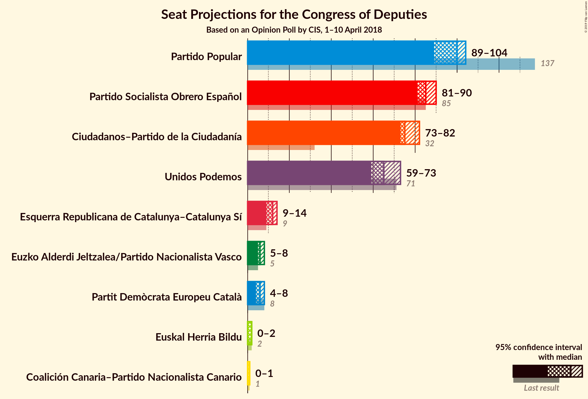
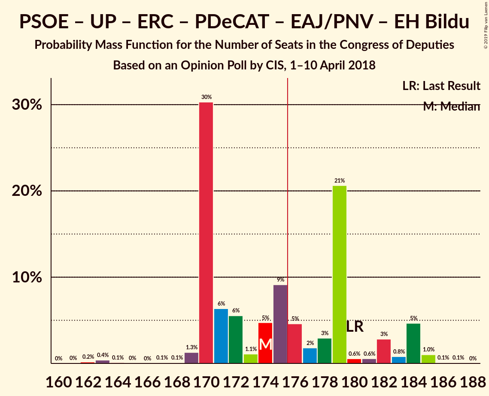
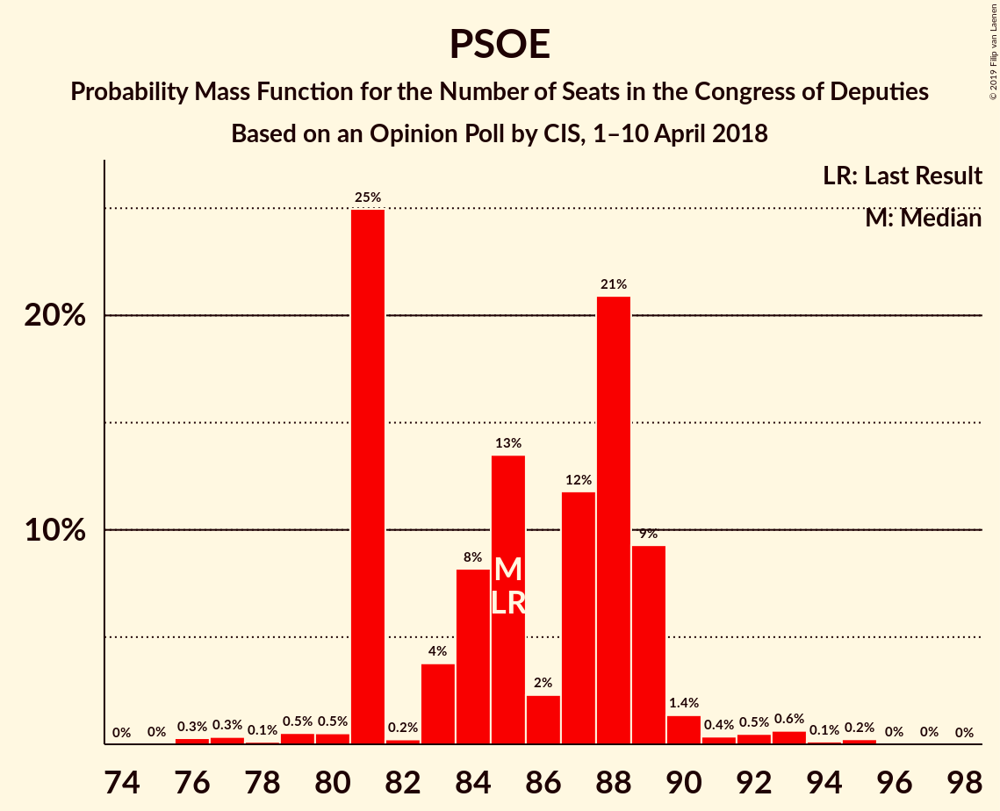

# Opinion Poll by CIS, 1–10 April 2018

<a href="#voting-intentions">Voting Intentions</a> | <a href="#seats">Seats</a> | <a href="#coalitions">Coalitions</a> | <a href="#technical-information">Technical Information</a>

## Voting Intentions

### Confidence Intervals

| Party | Last Result | Poll Result | 80% Confidence Interval | 90% Confidence Interval | 95% Confidence Interval | 99% Confidence Interval |
|:-----:|:-----------:|:-----------:|:-----------------------:|:-----------------------:|:-----------------------:|:-----------------------:|
| Partido Popular | 33.0% | 24.0% | 22.9–25.1% |22.6–25.5% |22.4–25.7% |21.8–26.3% |
| Ciudadanos–Partido de la Ciudadanía | 13.1% | 22.4% | 21.3–23.5% |21.0–23.8% |20.8–24.1% |20.3–24.6% |
| Partido Socialista Obrero Español | 22.6% | 22.0% | 21.0–23.1% |20.7–23.4% |20.4–23.7% |19.9–24.2% |
| Unidos Podemos | 21.2% | 19.6% | 18.6–20.7% |18.3–20.9% |18.1–21.2% |17.6–21.7% |
| Esquerra Republicana de Catalunya–Catalunya Sí | 2.7% | 3.0% | 2.6–3.5% |2.5–3.6% |2.4–3.8% |2.2–4.0% |
| Partit Demòcrata Europeu Català | 2.0% | 1.7% | 1.4–2.1% |1.3–2.2% |1.2–2.3% |1.1–2.5% |
| Euzko Alderdi Jeltzalea/Partido Nacionalista Vasco | 1.2% | 1.3% | 1.0–1.6% |1.0–1.8% |0.9–1.8% |0.8–2.0% |
| Euskal Herria Bildu | 0.8% | 0.6% | 0.4–0.9% |0.4–0.9% |0.4–1.0% |0.3–1.1% |
| Coalición Canaria–Partido Nacionalista Canario | 0.3% | 0.3% | 0.2–0.5% |0.2–0.5% |0.1–0.6% |0.1–0.7% |

*Note:* The poll result column reflects the actual value used in the calculations. Published results may vary slightly, and in addition be rounded to fewer digits.

## Seats

### Confidence Intervals

| Party | Last Result | Median | 80% Confidence Interval | 90% Confidence Interval | 95% Confidence Interval | 99% Confidence Interval |
|:-----:|:-----------:|:------:|:-----------------------:|:-----------------------:|:-----------------------:|:-----------------------:|
| <a href="#partido-popular">Partido Popular</a> | 137 | 100 | 92–103 |90–104 |89–104 |88–105 |
| <a href="#ciudadanos–partido-de-la-ciudadanía">Ciudadanos–Partido de la Ciudadanía</a> | 32 | 75 | 73–80 |73–81 |73–82 |69–85 |
| <a href="#partido-socialista-obrero-español">Partido Socialista Obrero Español</a> | 85 | 85 | 81–89 |81–89 |81–90 |77–93 |
| <a href="#unidos-podemos">Unidos Podemos</a> | 71 | 65 | 59–69 |59–71 |59–73 |57–73 |
| <a href="#esquerra-republicana-de-catalunya–catalunya-sí">Esquerra Republicana de Catalunya–Catalunya Sí</a> | 9 | 12 | 10–13 |9–13 |9–14 |9–14 |
| <a href="#partit-demòcrata-europeu-català">Partit Demòcrata Europeu Català</a> | 8 | 6 | 5–8 |5–8 |4–8 |4–8 |
| <a href="#euzko-alderdi-jeltzalea/partido-nacionalista-vasco">Euzko Alderdi Jeltzalea/Partido Nacionalista Vasco</a> | 5 | 6 | 5–7 |5–7 |5–8 |3–9 |
| <a href="#euskal-herria-bildu">Euskal Herria Bildu</a> | 2 | 2 | 1–2 |1–2 |0–2 |0–4 |
| <a href="#coalición-canaria–partido-nacionalista-canario">Coalición Canaria–Partido Nacionalista Canario</a> | 1 | 1 | 0–1 |0–1 |0–1 |0–2 |

### Partido Popular

*For a full overview of the results for this party, see the [Partido Popular](party-partidopopular.html) page.*

| Number of Seats | Probability | Accumulated | Special Marks |
|:---------------:|:-----------:|:-----------:|:-------------:|
| 83 | 0.1% | 100% |  |
| 84 | 0.1% | 99.9% |  |
| 85 | 0% | 99.9% |  |
| 86 | 0.1% | 99.8% |  |
| 87 | 0.1% | 99.7% |  |
| 88 | 1.2% | 99.6% |  |
| 89 | 3% | 98% |  |
| 90 | 4% | 95% |  |
| 91 | 0.5% | 91% |  |
| 92 | 3% | 91% |  |
| 93 | 2% | 88% |  |
| 94 | 3% | 86% |  |
| 95 | 1.2% | 83% |  |
| 96 | 0.1% | 82% |  |
| 97 | 23% | 82% |  |
| 98 | 7% | 60% |  |
| 99 | 0.8% | 52% |  |
| 100 | 2% | 52% | Median |
| 101 | 8% | 49% |  |
| 102 | 5% | 41% |  |
| 103 | 27% | 36% |  |
| 104 | 8% | 9% |  |
| 105 | 0.4% | 0.8% |  |
| 106 | 0.1% | 0.4% |  |
| 107 | 0.2% | 0.3% |  |
| 108 | 0.1% | 0.2% |  |
| 109 | 0% | 0.1% |  |
| 110 | 0% | 0.1% |  |
| 111 | 0% | 0% |  |
| 112 | 0% | 0% |  |
| 113 | 0% | 0% |  |
| 114 | 0% | 0% |  |
| 115 | 0% | 0% |  |
| 116 | 0% | 0% |  |
| 117 | 0% | 0% |  |
| 118 | 0% | 0% |  |
| 119 | 0% | 0% |  |
| 120 | 0% | 0% |  |
| 121 | 0% | 0% |  |
| 122 | 0% | 0% |  |
| 123 | 0% | 0% |  |
| 124 | 0% | 0% |  |
| 125 | 0% | 0% |  |
| 126 | 0% | 0% |  |
| 127 | 0% | 0% |  |
| 128 | 0% | 0% |  |
| 129 | 0% | 0% |  |
| 130 | 0% | 0% |  |
| 131 | 0% | 0% |  |
| 132 | 0% | 0% |  |
| 133 | 0% | 0% |  |
| 134 | 0% | 0% |  |
| 135 | 0% | 0% |  |
| 136 | 0% | 0% |  |
| 137 | 0% | 0% | Last Result |

### Ciudadanos–Partido de la Ciudadanía

*For a full overview of the results for this party, see the [Ciudadanos–Partido de la Ciudadanía](party-ciudadanos–partidodelaciudadanía.html) page.*

| Number of Seats | Probability | Accumulated | Special Marks |
|:---------------:|:-----------:|:-----------:|:-------------:|
| 32 | 0% | 100% | Last Result |
| 33 | 0% | 100% |  |
| 34 | 0% | 100% |  |
| 35 | 0% | 100% |  |
| 36 | 0% | 100% |  |
| 37 | 0% | 100% |  |
| 38 | 0% | 100% |  |
| 39 | 0% | 100% |  |
| 40 | 0% | 100% |  |
| 41 | 0% | 100% |  |
| 42 | 0% | 100% |  |
| 43 | 0% | 100% |  |
| 44 | 0% | 100% |  |
| 45 | 0% | 100% |  |
| 46 | 0% | 100% |  |
| 47 | 0% | 100% |  |
| 48 | 0% | 100% |  |
| 49 | 0% | 100% |  |
| 50 | 0% | 100% |  |
| 51 | 0% | 100% |  |
| 52 | 0% | 100% |  |
| 53 | 0% | 100% |  |
| 54 | 0% | 100% |  |
| 55 | 0% | 100% |  |
| 56 | 0% | 100% |  |
| 57 | 0% | 100% |  |
| 58 | 0% | 100% |  |
| 59 | 0% | 100% |  |
| 60 | 0% | 100% |  |
| 61 | 0% | 100% |  |
| 62 | 0% | 100% |  |
| 63 | 0% | 100% |  |
| 64 | 0% | 100% |  |
| 65 | 0% | 100% |  |
| 66 | 0% | 100% |  |
| 67 | 0.2% | 100% |  |
| 68 | 0.1% | 99.8% |  |
| 69 | 0.4% | 99.7% |  |
| 70 | 0.1% | 99.4% |  |
| 71 | 1.1% | 99.3% |  |
| 72 | 0.6% | 98% |  |
| 73 | 35% | 98% |  |
| 74 | 9% | 63% |  |
| 75 | 5% | 54% | Median |
| 76 | 28% | 49% |  |
| 77 | 4% | 21% |  |
| 78 | 1.0% | 17% |  |
| 79 | 0.8% | 16% |  |
| 80 | 9% | 16% |  |
| 81 | 2% | 6% |  |
| 82 | 2% | 4% |  |
| 83 | 1.5% | 2% |  |
| 84 | 0% | 0.9% |  |
| 85 | 0.4% | 0.9% |  |
| 86 | 0% | 0.5% |  |
| 87 | 0.2% | 0.4% |  |
| 88 | 0.1% | 0.2% |  |
| 89 | 0.1% | 0.1% |  |
| 90 | 0% | 0% |  |

### Partido Socialista Obrero Español

*For a full overview of the results for this party, see the [Partido Socialista Obrero Español](party-partidosocialistaobreroespañol.html) page.*

| Number of Seats | Probability | Accumulated | Special Marks |
|:---------------:|:-----------:|:-----------:|:-------------:|
| 76 | 0.3% | 100% |  |
| 77 | 0.3% | 99.7% |  |
| 78 | 0.1% | 99.3% |  |
| 79 | 0.5% | 99.2% |  |
| 80 | 0.5% | 98.7% |  |
| 81 | 25% | 98% |  |
| 82 | 0.2% | 73% |  |
| 83 | 4% | 73% |  |
| 84 | 8% | 69% |  |
| 85 | 13% | 61% | Last Result, Median |
| 86 | 2% | 48% |  |
| 87 | 12% | 45% |  |
| 88 | 21% | 33% |  |
| 89 | 9% | 13% |  |
| 90 | 1.4% | 3% |  |
| 91 | 0.4% | 2% |  |
| 92 | 0.5% | 2% |  |
| 93 | 0.6% | 1.0% |  |
| 94 | 0.1% | 0.4% |  |
| 95 | 0.2% | 0.3% |  |
| 96 | 0% | 0.1% |  |
| 97 | 0% | 0% |  |

### Unidos Podemos

*For a full overview of the results for this party, see the [Unidos Podemos](party-unidospodemos.html) page.*

| Number of Seats | Probability | Accumulated | Special Marks |
|:---------------:|:-----------:|:-----------:|:-------------:|
| 54 | 0% | 100% |  |
| 55 | 0% | 99.9% |  |
| 56 | 0.1% | 99.9% |  |
| 57 | 0.3% | 99.8% |  |
| 58 | 0.5% | 99.5% |  |
| 59 | 13% | 99.0% |  |
| 60 | 7% | 86% |  |
| 61 | 10% | 79% |  |
| 62 | 5% | 68% |  |
| 63 | 2% | 63% |  |
| 64 | 1.2% | 61% |  |
| 65 | 27% | 60% | Median |
| 66 | 0.9% | 33% |  |
| 67 | 18% | 32% |  |
| 68 | 0.9% | 14% |  |
| 69 | 7% | 13% |  |
| 70 | 0.5% | 7% |  |
| 71 | 2% | 6% | Last Result |
| 72 | 0.3% | 4% |  |
| 73 | 3% | 4% |  |
| 74 | 0.4% | 0.5% |  |
| 75 | 0% | 0.1% |  |
| 76 | 0% | 0.1% |  |
| 77 | 0% | 0% |  |

### Esquerra Republicana de Catalunya–Catalunya Sí

*For a full overview of the results for this party, see the [Esquerra Republicana de Catalunya–Catalunya Sí](party-esquerrarepublicanadecatalunya–catalunyasí.html) page.*

| Number of Seats | Probability | Accumulated | Special Marks |
|:---------------:|:-----------:|:-----------:|:-------------:|
| 7 | 0.1% | 100% |  |
| 8 | 0.1% | 99.9% |  |
| 9 | 5% | 99.8% | Last Result |
| 10 | 13% | 94% |  |
| 11 | 7% | 82% |  |
| 12 | 61% | 75% | Median |
| 13 | 11% | 14% |  |
| 14 | 3% | 3% |  |
| 15 | 0.4% | 0.5% |  |
| 16 | 0.1% | 0.1% |  |
| 17 | 0% | 0% |  |

### Partit Demòcrata Europeu Català

*For a full overview of the results for this party, see the [Partit Demòcrata Europeu Català](party-partitdemòcrataeuropeucatalà.html) page.*

| Number of Seats | Probability | Accumulated | Special Marks |
|:---------------:|:-----------:|:-----------:|:-------------:|
| 3 | 0.2% | 100% |  |
| 4 | 4% | 99.8% |  |
| 5 | 42% | 95% |  |
| 6 | 27% | 54% | Median |
| 7 | 13% | 26% |  |
| 8 | 12% | 13% | Last Result |
| 9 | 0.3% | 0.4% |  |
| 10 | 0.1% | 0.1% |  |
| 11 | 0% | 0% |  |

### Euzko Alderdi Jeltzalea/Partido Nacionalista Vasco

*For a full overview of the results for this party, see the [Euzko Alderdi Jeltzalea/Partido Nacionalista Vasco](party-euzkoalderdijeltzaleapartidonacionalistavasco.html) page.*

| Number of Seats | Probability | Accumulated | Special Marks |
|:---------------:|:-----------:|:-----------:|:-------------:|
| 3 | 1.0% | 100% |  |
| 4 | 0.8% | 99.0% |  |
| 5 | 14% | 98% | Last Result |
| 6 | 59% | 84% | Median |
| 7 | 22% | 26% |  |
| 8 | 3% | 4% |  |
| 9 | 0.7% | 0.7% |  |
| 10 | 0.1% | 0.1% |  |
| 11 | 0% | 0% |  |

### Euskal Herria Bildu

*For a full overview of the results for this party, see the [Euskal Herria Bildu](party-euskalherriabildu.html) page.*

| Number of Seats | Probability | Accumulated | Special Marks |
|:---------------:|:-----------:|:-----------:|:-------------:|
| 0 | 4% | 100% |  |
| 1 | 43% | 96% |  |
| 2 | 51% | 54% | Last Result, Median |
| 3 | 0.8% | 2% |  |
| 4 | 1.4% | 1.5% |  |
| 5 | 0.1% | 0.1% |  |
| 6 | 0% | 0% |  |

### Coalición Canaria–Partido Nacionalista Canario

*For a full overview of the results for this party, see the [Coalición Canaria–Partido Nacionalista Canario](party-coalicióncanaria–partidonacionalistacanario.html) page.*

| Number of Seats | Probability | Accumulated | Special Marks |
|:---------------:|:-----------:|:-----------:|:-------------:|
| 0 | 14% | 100% |  |
| 1 | 84% | 86% | Last Result, Median |
| 2 | 2% | 2% |  |
| 3 | 0% | 0% |  |

## Coalitions

### Confidence Intervals

| Coalition | Last Result | Median | Majority? | 80% Confidence Interval | 90% Confidence Interval | 95% Confidence Interval | 99% Confidence Interval |
|:---------:|:-----------:|:------:|:---------:|:-----------------------:|:-----------------------:|:-----------------------:|:-----------------------:|
| Partido Popular – Ciudadanos–Partido de la Ciudadanía – Partido Socialista Obrero Español | 254 | 260 | 100% | 255–264 | 252–265 | 250–265 | 250–269 |
| Ciudadanos–Partido de la Ciudadanía – Partido Socialista Obrero Español – Unidos Podemos | 188 | 223 | 100% | 220–231 | 220–234 | 218–235 | 217–238 |
| Partido Popular – Partido Socialista Obrero Español | 222 | 184 | 93% | 179–190 | 175–191 | 174–192 | 172–192 |
| Partido Popular – Ciudadanos–Partido de la Ciudadanía – Euzko Alderdi Jeltzalea/Partido Nacionalista Vasco | 174 | 181 | 77% | 174–185 | 174–185 | 171–186 | 170–192 |
| Partido Socialista Obrero Español – Unidos Podemos – Esquerra Republicana de Catalunya–Catalunya Sí – Partit Demòcrata Europeu Català – Euzko Alderdi Jeltzalea/Partido Nacionalista Vasco – Euskal Herria Bildu | 180 | 174 | 41% | 170–181 | 170–184 | 170–184 | 163–185 |
| Partido Popular – Ciudadanos–Partido de la Ciudadanía – Coalición Canaria–Partido Nacionalista Canario | 170 | 176 | 50% | 169–180 | 166–180 | 166–180 | 165–187 |
| Partido Popular – Ciudadanos–Partido de la Ciudadanía | 169 | 175 | 50% | 168–179 | 166–179 | 165–179 | 164–186 |
| Partido Socialista Obrero Español – Unidos Podemos – Esquerra Republicana de Catalunya–Catalunya Sí – Partit Demòcrata Europeu Català | 173 | 166 | 6% | 163–173 | 162–176 | 161–176 | 156–178 |
| Partido Socialista Obrero Español – Unidos Podemos – Esquerra Republicana de Catalunya–Catalunya Sí – Euskal Herria Bildu | 167 | 162 | 0.2% | 158–167 | 157–170 | 157–172 | 151–174 |
| Ciudadanos–Partido de la Ciudadanía – Partido Socialista Obrero Español | 117 | 161 | 0.1% | 157–166 | 157–168 | 157–171 | 155–173 |
| Partido Socialista Obrero Español – Unidos Podemos – Euzko Alderdi Jeltzalea/Partido Nacionalista Vasco – Euskal Herria Bildu | 163 | 157 | 0% | 153–162 | 151–166 | 151–166 | 147–169 |
| Partido Socialista Obrero Español – Unidos Podemos – Euzko Alderdi Jeltzalea/Partido Nacionalista Vasco | 161 | 155 | 0% | 151–161 | 149–164 | 149–166 | 146–167 |
| Partido Socialista Obrero Español – Unidos Podemos | 156 | 149 | 0% | 145–156 | 143–158 | 143–158 | 139–160 |
| Partido Popular | 137 | 100 | 0% | 92–103 | 90–104 | 89–104 | 88–105 |
| Partido Socialista Obrero Español | 85 | 85 | 0% | 81–89 | 81–89 | 81–90 | 77–93 |

### Partido Popular – Ciudadanos–Partido de la Ciudadanía – Partido Socialista Obrero Español

| Number of Seats | Probability | Accumulated | Special Marks |
|:---------------:|:-----------:|:-----------:|:-------------:|
| 247 | 0% | 100% |  |
| 248 | 0% | 99.9% |  |
| 249 | 0.3% | 99.9% |  |
| 250 | 3% | 99.6% |  |
| 251 | 0.6% | 97% |  |
| 252 | 3% | 96% |  |
| 253 | 2% | 94% |  |
| 254 | 0.5% | 91% | Last Result |
| 255 | 7% | 91% |  |
| 256 | 0.7% | 83% |  |
| 257 | 4% | 83% |  |
| 258 | 13% | 78% |  |
| 259 | 2% | 65% |  |
| 260 | 26% | 64% | Median |
| 261 | 4% | 37% |  |
| 262 | 10% | 33% |  |
| 263 | 8% | 22% |  |
| 264 | 7% | 15% |  |
| 265 | 5% | 7% |  |
| 266 | 0.5% | 2% |  |
| 267 | 0.5% | 2% |  |
| 268 | 0% | 1.1% |  |
| 269 | 1.0% | 1.1% |  |
| 270 | 0% | 0.1% |  |
| 271 | 0% | 0% |  |

### Ciudadanos–Partido de la Ciudadanía – Partido Socialista Obrero Español – Unidos Podemos

| Number of Seats | Probability | Accumulated | Special Marks |
|:---------------:|:-----------:|:-----------:|:-------------:|
| 188 | 0% | 100% | Last Result |
| 189 | 0% | 100% |  |
| 190 | 0% | 100% |  |
| 191 | 0% | 100% |  |
| 192 | 0% | 100% |  |
| 193 | 0% | 100% |  |
| 194 | 0% | 100% |  |
| 195 | 0% | 100% |  |
| 196 | 0% | 100% |  |
| 197 | 0% | 100% |  |
| 198 | 0% | 100% |  |
| 199 | 0% | 100% |  |
| 200 | 0% | 100% |  |
| 201 | 0% | 100% |  |
| 202 | 0% | 100% |  |
| 203 | 0% | 100% |  |
| 204 | 0% | 100% |  |
| 205 | 0% | 100% |  |
| 206 | 0% | 100% |  |
| 207 | 0% | 100% |  |
| 208 | 0% | 100% |  |
| 209 | 0% | 100% |  |
| 210 | 0% | 100% |  |
| 211 | 0% | 100% |  |
| 212 | 0% | 100% |  |
| 213 | 0% | 100% |  |
| 214 | 0% | 100% |  |
| 215 | 0% | 99.9% |  |
| 216 | 0.2% | 99.9% |  |
| 217 | 0.4% | 99.7% |  |
| 218 | 2% | 99.3% |  |
| 219 | 1.3% | 97% |  |
| 220 | 9% | 96% |  |
| 221 | 0.8% | 88% |  |
| 222 | 33% | 87% |  |
| 223 | 11% | 54% |  |
| 224 | 0.2% | 43% |  |
| 225 | 9% | 43% | Median |
| 226 | 2% | 34% |  |
| 227 | 1.0% | 32% |  |
| 228 | 10% | 31% |  |
| 229 | 4% | 21% |  |
| 230 | 3% | 18% |  |
| 231 | 5% | 14% |  |
| 232 | 2% | 10% |  |
| 233 | 1.1% | 8% |  |
| 234 | 3% | 6% |  |
| 235 | 1.4% | 4% |  |
| 236 | 0.3% | 2% |  |
| 237 | 0.8% | 2% |  |
| 238 | 1.0% | 1.2% |  |
| 239 | 0.1% | 0.2% |  |
| 240 | 0% | 0.1% |  |
| 241 | 0% | 0.1% |  |
| 242 | 0% | 0.1% |  |
| 243 | 0% | 0.1% |  |
| 244 | 0.1% | 0.1% |  |
| 245 | 0% | 0% |  |

### Partido Popular – Partido Socialista Obrero Español

| Number of Seats | Probability | Accumulated | Special Marks |
|:---------------:|:-----------:|:-----------:|:-------------:|
| 169 | 0.1% | 100% |  |
| 170 | 0% | 99.9% |  |
| 171 | 0.3% | 99.9% |  |
| 172 | 0.4% | 99.6% |  |
| 173 | 0.3% | 99.2% |  |
| 174 | 2% | 98.8% |  |
| 175 | 3% | 97% |  |
| 176 | 0.7% | 93% | Majority |
| 177 | 2% | 93% |  |
| 178 | 0.4% | 91% |  |
| 179 | 3% | 90% |  |
| 180 | 1.0% | 88% |  |
| 181 | 3% | 87% |  |
| 182 | 14% | 84% |  |
| 183 | 2% | 70% |  |
| 184 | 30% | 68% |  |
| 185 | 12% | 38% | Median |
| 186 | 2% | 26% |  |
| 187 | 4% | 25% |  |
| 188 | 2% | 21% |  |
| 189 | 1.5% | 19% |  |
| 190 | 12% | 18% |  |
| 191 | 0.3% | 5% |  |
| 192 | 4% | 5% |  |
| 193 | 0% | 0.4% |  |
| 194 | 0.1% | 0.4% |  |
| 195 | 0% | 0.3% |  |
| 196 | 0.2% | 0.2% |  |
| 197 | 0% | 0% |  |
| 198 | 0% | 0% |  |
| 199 | 0% | 0% |  |
| 200 | 0% | 0% |  |
| 201 | 0% | 0% |  |
| 202 | 0% | 0% |  |
| 203 | 0% | 0% |  |
| 204 | 0% | 0% |  |
| 205 | 0% | 0% |  |
| 206 | 0% | 0% |  |
| 207 | 0% | 0% |  |
| 208 | 0% | 0% |  |
| 209 | 0% | 0% |  |
| 210 | 0% | 0% |  |
| 211 | 0% | 0% |  |
| 212 | 0% | 0% |  |
| 213 | 0% | 0% |  |
| 214 | 0% | 0% |  |
| 215 | 0% | 0% |  |
| 216 | 0% | 0% |  |
| 217 | 0% | 0% |  |
| 218 | 0% | 0% |  |
| 219 | 0% | 0% |  |
| 220 | 0% | 0% |  |
| 221 | 0% | 0% |  |
| 222 | 0% | 0% | Last Result |

### Partido Popular – Ciudadanos–Partido de la Ciudadanía – Euzko Alderdi Jeltzalea/Partido Nacionalista Vasco

| Number of Seats | Probability | Accumulated | Special Marks |
|:---------------:|:-----------:|:-----------:|:-------------:|
| 168 | 0.1% | 100% |  |
| 169 | 0.1% | 99.9% |  |
| 170 | 0.7% | 99.8% |  |
| 171 | 3% | 99.1% |  |
| 172 | 0.2% | 96% |  |
| 173 | 0.3% | 96% |  |
| 174 | 5% | 95% | Last Result |
| 175 | 13% | 90% |  |
| 176 | 1.4% | 77% | Majority |
| 177 | 9% | 76% |  |
| 178 | 3% | 67% |  |
| 179 | 2% | 64% |  |
| 180 | 10% | 62% |  |
| 181 | 3% | 53% | Median |
| 182 | 2% | 50% |  |
| 183 | 9% | 48% |  |
| 184 | 6% | 39% |  |
| 185 | 30% | 33% |  |
| 186 | 1.1% | 3% |  |
| 187 | 1.2% | 2% |  |
| 188 | 0.1% | 0.9% |  |
| 189 | 0.1% | 0.8% |  |
| 190 | 0.1% | 0.8% |  |
| 191 | 0.1% | 0.7% |  |
| 192 | 0.4% | 0.6% |  |
| 193 | 0.2% | 0.3% |  |
| 194 | 0% | 0% |  |

### Partido Socialista Obrero Español – Unidos Podemos – Esquerra Republicana de Catalunya–Catalunya Sí – Partit Demòcrata Europeu Català – Euzko Alderdi Jeltzalea/Partido Nacionalista Vasco – Euskal Herria Bildu

| Number of Seats | Probability | Accumulated | Special Marks |
|:---------------:|:-----------:|:-----------:|:-------------:|
| 162 | 0.2% | 100% |  |
| 163 | 0.4% | 99.8% |  |
| 164 | 0.1% | 99.4% |  |
| 165 | 0% | 99.3% |  |
| 166 | 0% | 99.2% |  |
| 167 | 0.1% | 99.2% |  |
| 168 | 0.1% | 99.1% |  |
| 169 | 1.3% | 99.1% |  |
| 170 | 30% | 98% |  |
| 171 | 6% | 67% |  |
| 172 | 6% | 61% |  |
| 173 | 1.1% | 56% |  |
| 174 | 5% | 54% |  |
| 175 | 9% | 50% |  |
| 176 | 5% | 41% | Median, Majority |
| 177 | 2% | 36% |  |
| 178 | 3% | 34% |  |
| 179 | 21% | 31% |  |
| 180 | 0.6% | 11% | Last Result |
| 181 | 0.6% | 10% |  |
| 182 | 3% | 10% |  |
| 183 | 0.8% | 7% |  |
| 184 | 5% | 6% |  |
| 185 | 1.0% | 1.2% |  |
| 186 | 0.1% | 0.2% |  |
| 187 | 0.1% | 0.1% |  |
| 188 | 0% | 0% |  |

### Partido Popular – Ciudadanos–Partido de la Ciudadanía – Coalición Canaria–Partido Nacionalista Canario

| Number of Seats | Probability | Accumulated | Special Marks |
|:---------------:|:-----------:|:-----------:|:-------------:|
| 163 | 0.1% | 100% |  |
| 164 | 0.1% | 99.9% |  |
| 165 | 1.0% | 99.8% |  |
| 166 | 5% | 98.8% |  |
| 167 | 0.8% | 94% |  |
| 168 | 3% | 93% |  |
| 169 | 0.6% | 90% |  |
| 170 | 0.6% | 90% | Last Result |
| 171 | 21% | 89% |  |
| 172 | 3% | 69% |  |
| 173 | 2% | 66% |  |
| 174 | 5% | 64% |  |
| 175 | 9% | 59% |  |
| 176 | 5% | 50% | Median, Majority |
| 177 | 1.1% | 46% |  |
| 178 | 6% | 44% |  |
| 179 | 6% | 39% |  |
| 180 | 30% | 33% |  |
| 181 | 1.3% | 2% |  |
| 182 | 0.1% | 0.9% |  |
| 183 | 0.1% | 0.9% |  |
| 184 | 0% | 0.8% |  |
| 185 | 0% | 0.8% |  |
| 186 | 0.1% | 0.7% |  |
| 187 | 0.4% | 0.6% |  |
| 188 | 0.2% | 0.2% |  |
| 189 | 0% | 0% |  |

### Partido Popular – Ciudadanos–Partido de la Ciudadanía

| Number of Seats | Probability | Accumulated | Special Marks |
|:---------------:|:-----------:|:-----------:|:-------------:|
| 162 | 0.1% | 100% |  |
| 163 | 0.1% | 99.9% |  |
| 164 | 0.7% | 99.8% |  |
| 165 | 3% | 99.0% |  |
| 166 | 2% | 96% |  |
| 167 | 3% | 94% |  |
| 168 | 0.6% | 90% |  |
| 169 | 0.6% | 90% | Last Result |
| 170 | 21% | 89% |  |
| 171 | 2% | 68% |  |
| 172 | 2% | 66% |  |
| 173 | 2% | 64% |  |
| 174 | 12% | 63% |  |
| 175 | 1.1% | 51% | Median |
| 176 | 6% | 50% | Majority |
| 177 | 5% | 44% |  |
| 178 | 7% | 39% |  |
| 179 | 30% | 32% |  |
| 180 | 1.1% | 2% |  |
| 181 | 0.3% | 1.2% |  |
| 182 | 0.1% | 0.9% |  |
| 183 | 0.1% | 0.8% |  |
| 184 | 0% | 0.7% |  |
| 185 | 0.1% | 0.7% |  |
| 186 | 0.4% | 0.6% |  |
| 187 | 0.2% | 0.2% |  |
| 188 | 0% | 0% |  |

### Partido Socialista Obrero Español – Unidos Podemos – Esquerra Republicana de Catalunya–Catalunya Sí – Partit Demòcrata Europeu Català

| Number of Seats | Probability | Accumulated | Special Marks |
|:---------------:|:-----------:|:-----------:|:-------------:|
| 154 | 0% | 100% |  |
| 155 | 0.2% | 99.9% |  |
| 156 | 0.4% | 99.7% |  |
| 157 | 0% | 99.3% |  |
| 158 | 0% | 99.2% |  |
| 159 | 0.1% | 99.2% |  |
| 160 | 0.5% | 99.2% |  |
| 161 | 1.4% | 98.7% |  |
| 162 | 5% | 97% |  |
| 163 | 31% | 93% |  |
| 164 | 6% | 61% |  |
| 165 | 0.4% | 56% |  |
| 166 | 8% | 55% |  |
| 167 | 7% | 48% |  |
| 168 | 3% | 41% | Median |
| 169 | 5% | 38% |  |
| 170 | 8% | 33% |  |
| 171 | 2% | 25% |  |
| 172 | 10% | 23% |  |
| 173 | 4% | 13% | Last Result |
| 174 | 3% | 9% |  |
| 175 | 0.4% | 6% |  |
| 176 | 4% | 6% | Majority |
| 177 | 0.9% | 1.5% |  |
| 178 | 0.5% | 0.6% |  |
| 179 | 0.1% | 0.1% |  |
| 180 | 0% | 0% |  |

### Partido Socialista Obrero Español – Unidos Podemos – Esquerra Republicana de Catalunya–Catalunya Sí – Euskal Herria Bildu

| Number of Seats | Probability | Accumulated | Special Marks |
|:---------------:|:-----------:|:-----------:|:-------------:|
| 151 | 0.5% | 100% |  |
| 152 | 0.1% | 99.5% |  |
| 153 | 0.1% | 99.4% |  |
| 154 | 0.1% | 99.2% |  |
| 155 | 0.1% | 99.2% |  |
| 156 | 0.1% | 99.1% |  |
| 157 | 6% | 98.9% |  |
| 158 | 3% | 93% |  |
| 159 | 29% | 90% |  |
| 160 | 7% | 61% |  |
| 161 | 0.3% | 54% |  |
| 162 | 6% | 53% |  |
| 163 | 0.5% | 47% |  |
| 164 | 11% | 47% | Median |
| 165 | 2% | 36% |  |
| 166 | 9% | 34% |  |
| 167 | 15% | 24% | Last Result |
| 168 | 2% | 9% |  |
| 169 | 0.9% | 7% |  |
| 170 | 3% | 6% |  |
| 171 | 0.3% | 4% |  |
| 172 | 2% | 4% |  |
| 173 | 0.5% | 1.3% |  |
| 174 | 0.3% | 0.7% |  |
| 175 | 0.2% | 0.4% |  |
| 176 | 0.2% | 0.2% | Majority |
| 177 | 0% | 0% |  |

### Ciudadanos–Partido de la Ciudadanía – Partido Socialista Obrero Español

| Number of Seats | Probability | Accumulated | Special Marks |
|:---------------:|:-----------:|:-----------:|:-------------:|
| 117 | 0% | 100% | Last Result |
| 118 | 0% | 100% |  |
| 119 | 0% | 100% |  |
| 120 | 0% | 100% |  |
| 121 | 0% | 100% |  |
| 122 | 0% | 100% |  |
| 123 | 0% | 100% |  |
| 124 | 0% | 100% |  |
| 125 | 0% | 100% |  |
| 126 | 0% | 100% |  |
| 127 | 0% | 100% |  |
| 128 | 0% | 100% |  |
| 129 | 0% | 100% |  |
| 130 | 0% | 100% |  |
| 131 | 0% | 100% |  |
| 132 | 0% | 100% |  |
| 133 | 0% | 100% |  |
| 134 | 0% | 100% |  |
| 135 | 0% | 100% |  |
| 136 | 0% | 100% |  |
| 137 | 0% | 100% |  |
| 138 | 0% | 100% |  |
| 139 | 0% | 100% |  |
| 140 | 0% | 100% |  |
| 141 | 0% | 100% |  |
| 142 | 0% | 100% |  |
| 143 | 0% | 100% |  |
| 144 | 0% | 100% |  |
| 145 | 0% | 100% |  |
| 146 | 0% | 100% |  |
| 147 | 0% | 100% |  |
| 148 | 0% | 100% |  |
| 149 | 0% | 100% |  |
| 150 | 0% | 100% |  |
| 151 | 0.1% | 100% |  |
| 152 | 0.1% | 99.9% |  |
| 153 | 0% | 99.8% |  |
| 154 | 0.2% | 99.8% |  |
| 155 | 0.2% | 99.6% |  |
| 156 | 0.5% | 99.5% |  |
| 157 | 27% | 98.9% |  |
| 158 | 12% | 72% |  |
| 159 | 0.7% | 59% |  |
| 160 | 4% | 59% | Median |
| 161 | 21% | 54% |  |
| 162 | 14% | 33% |  |
| 163 | 0.5% | 19% |  |
| 164 | 7% | 18% |  |
| 165 | 0.9% | 12% |  |
| 166 | 1.4% | 11% |  |
| 167 | 3% | 10% |  |
| 168 | 2% | 6% |  |
| 169 | 1.0% | 4% |  |
| 170 | 0.5% | 3% |  |
| 171 | 0.8% | 3% |  |
| 172 | 1.0% | 2% |  |
| 173 | 0.4% | 0.7% |  |
| 174 | 0.1% | 0.3% |  |
| 175 | 0.1% | 0.2% |  |
| 176 | 0.1% | 0.1% | Majority |
| 177 | 0% | 0.1% |  |
| 178 | 0% | 0% |  |

### Partido Socialista Obrero Español – Unidos Podemos – Euzko Alderdi Jeltzalea/Partido Nacionalista Vasco – Euskal Herria Bildu

| Number of Seats | Probability | Accumulated | Special Marks |
|:---------------:|:-----------:|:-----------:|:-------------:|
| 143 | 0.3% | 100% |  |
| 144 | 0% | 99.7% |  |
| 145 | 0% | 99.7% |  |
| 146 | 0.2% | 99.7% |  |
| 147 | 0.1% | 99.5% |  |
| 148 | 0.3% | 99.4% |  |
| 149 | 0.2% | 99.1% |  |
| 150 | 0.1% | 98.9% |  |
| 151 | 6% | 98.8% |  |
| 152 | 1.2% | 93% |  |
| 153 | 30% | 92% |  |
| 154 | 2% | 62% |  |
| 155 | 6% | 60% |  |
| 156 | 3% | 54% |  |
| 157 | 12% | 51% |  |
| 158 | 2% | 39% | Median |
| 159 | 1.2% | 37% |  |
| 160 | 0.9% | 36% |  |
| 161 | 9% | 35% |  |
| 162 | 16% | 25% |  |
| 163 | 1.2% | 9% | Last Result |
| 164 | 1.4% | 8% |  |
| 165 | 0.8% | 7% |  |
| 166 | 4% | 6% |  |
| 167 | 0.9% | 2% |  |
| 168 | 0.3% | 0.8% |  |
| 169 | 0.4% | 0.5% |  |
| 170 | 0% | 0.1% |  |
| 171 | 0% | 0.1% |  |
| 172 | 0% | 0% |  |

### Partido Socialista Obrero Español – Unidos Podemos – Euzko Alderdi Jeltzalea/Partido Nacionalista Vasco

| Number of Seats | Probability | Accumulated | Special Marks |
|:---------------:|:-----------:|:-----------:|:-------------:|
| 142 | 0.3% | 100% |  |
| 143 | 0% | 99.7% |  |
| 144 | 0.1% | 99.7% |  |
| 145 | 0% | 99.5% |  |
| 146 | 0.2% | 99.5% |  |
| 147 | 0.4% | 99.3% |  |
| 148 | 0.1% | 98.9% |  |
| 149 | 6% | 98.8% |  |
| 150 | 1.2% | 93% |  |
| 151 | 4% | 92% |  |
| 152 | 27% | 88% |  |
| 153 | 5% | 60% |  |
| 154 | 1.3% | 55% |  |
| 155 | 10% | 54% |  |
| 156 | 7% | 44% | Median |
| 157 | 0.9% | 37% |  |
| 158 | 0.8% | 36% |  |
| 159 | 9% | 35% |  |
| 160 | 10% | 25% |  |
| 161 | 7% | 15% | Last Result |
| 162 | 0.7% | 8% |  |
| 163 | 1.4% | 8% |  |
| 164 | 3% | 6% |  |
| 165 | 0.7% | 4% |  |
| 166 | 2% | 3% |  |
| 167 | 0.4% | 0.6% |  |
| 168 | 0.1% | 0.2% |  |
| 169 | 0% | 0.1% |  |
| 170 | 0.1% | 0.1% |  |
| 171 | 0% | 0% |  |

### Partido Socialista Obrero Español – Unidos Podemos

| Number of Seats | Probability | Accumulated | Special Marks |
|:---------------:|:-----------:|:-----------:|:-------------:|
| 136 | 0.3% | 100% |  |
| 137 | 0% | 99.7% |  |
| 138 | 0.1% | 99.7% |  |
| 139 | 0.1% | 99.5% |  |
| 140 | 0.1% | 99.5% |  |
| 141 | 0.4% | 99.3% |  |
| 142 | 0.1% | 98.9% |  |
| 143 | 6% | 98.8% |  |
| 144 | 1.2% | 93% |  |
| 145 | 6% | 91% |  |
| 146 | 25% | 85% |  |
| 147 | 5% | 60% |  |
| 148 | 3% | 55% |  |
| 149 | 13% | 52% |  |
| 150 | 3% | 40% | Median |
| 151 | 0.7% | 37% |  |
| 152 | 9% | 36% |  |
| 153 | 1.2% | 27% |  |
| 154 | 4% | 26% |  |
| 155 | 11% | 22% |  |
| 156 | 4% | 11% | Last Result |
| 157 | 0.4% | 7% |  |
| 158 | 4% | 6% |  |
| 159 | 1.1% | 2% |  |
| 160 | 0.3% | 0.8% |  |
| 161 | 0.2% | 0.5% |  |
| 162 | 0.1% | 0.3% |  |
| 163 | 0.1% | 0.1% |  |
| 164 | 0.1% | 0.1% |  |
| 165 | 0% | 0% |  |

### Partido Popular

| Number of Seats | Probability | Accumulated | Special Marks |
|:---------------:|:-----------:|:-----------:|:-------------:|
| 83 | 0.1% | 100% |  |
| 84 | 0.1% | 99.9% |  |
| 85 | 0% | 99.9% |  |
| 86 | 0.1% | 99.8% |  |
| 87 | 0.1% | 99.7% |  |
| 88 | 1.2% | 99.6% |  |
| 89 | 3% | 98% |  |
| 90 | 4% | 95% |  |
| 91 | 0.5% | 91% |  |
| 92 | 3% | 91% |  |
| 93 | 2% | 88% |  |
| 94 | 3% | 86% |  |
| 95 | 1.2% | 83% |  |
| 96 | 0.1% | 82% |  |
| 97 | 23% | 82% |  |
| 98 | 7% | 60% |  |
| 99 | 0.8% | 52% |  |
| 100 | 2% | 52% | Median |
| 101 | 8% | 49% |  |
| 102 | 5% | 41% |  |
| 103 | 27% | 36% |  |
| 104 | 8% | 9% |  |
| 105 | 0.4% | 0.8% |  |
| 106 | 0.1% | 0.4% |  |
| 107 | 0.2% | 0.3% |  |
| 108 | 0.1% | 0.2% |  |
| 109 | 0% | 0.1% |  |
| 110 | 0% | 0.1% |  |
| 111 | 0% | 0% |  |
| 112 | 0% | 0% |  |
| 113 | 0% | 0% |  |
| 114 | 0% | 0% |  |
| 115 | 0% | 0% |  |
| 116 | 0% | 0% |  |
| 117 | 0% | 0% |  |
| 118 | 0% | 0% |  |
| 119 | 0% | 0% |  |
| 120 | 0% | 0% |  |
| 121 | 0% | 0% |  |
| 122 | 0% | 0% |  |
| 123 | 0% | 0% |  |
| 124 | 0% | 0% |  |
| 125 | 0% | 0% |  |
| 126 | 0% | 0% |  |
| 127 | 0% | 0% |  |
| 128 | 0% | 0% |  |
| 129 | 0% | 0% |  |
| 130 | 0% | 0% |  |
| 131 | 0% | 0% |  |
| 132 | 0% | 0% |  |
| 133 | 0% | 0% |  |
| 134 | 0% | 0% |  |
| 135 | 0% | 0% |  |
| 136 | 0% | 0% |  |
| 137 | 0% | 0% | Last Result |

### Partido Socialista Obrero Español

| Number of Seats | Probability | Accumulated | Special Marks |
|:---------------:|:-----------:|:-----------:|:-------------:|
| 76 | 0.3% | 100% |  |
| 77 | 0.3% | 99.7% |  |
| 78 | 0.1% | 99.3% |  |
| 79 | 0.5% | 99.2% |  |
| 80 | 0.5% | 98.7% |  |
| 81 | 25% | 98% |  |
| 82 | 0.2% | 73% |  |
| 83 | 4% | 73% |  |
| 84 | 8% | 69% |  |
| 85 | 13% | 61% | Last Result, Median |
| 86 | 2% | 48% |  |
| 87 | 12% | 45% |  |
| 88 | 21% | 33% |  |
| 89 | 9% | 13% |  |
| 90 | 1.4% | 3% |  |
| 91 | 0.4% | 2% |  |
| 92 | 0.5% | 2% |  |
| 93 | 0.6% | 1.0% |  |
| 94 | 0.1% | 0.4% |  |
| 95 | 0.2% | 0.3% |  |
| 96 | 0% | 0.1% |  |
| 97 | 0% | 0% |  |

## Technical Information

### Opinion Poll

+ **Polling firm:** CIS
+ **Commissioner(s):** —
+ **Fieldwork period:** 1–10 April 2018

### Calculations

+ **Sample size:** 2466
+ **Simulations done:** 131,072
+ **Error estimate:** 2.67%

