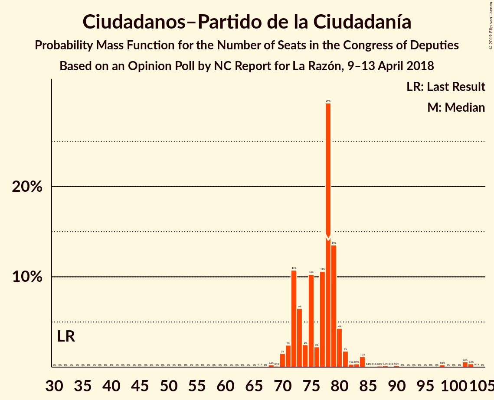
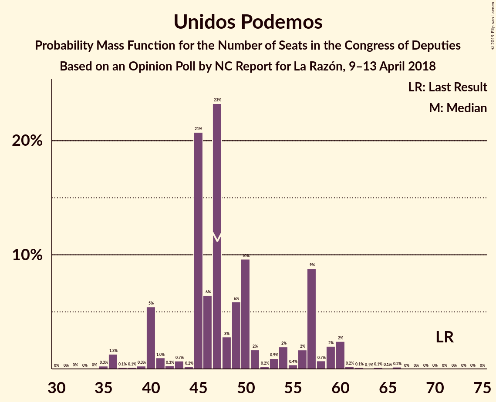
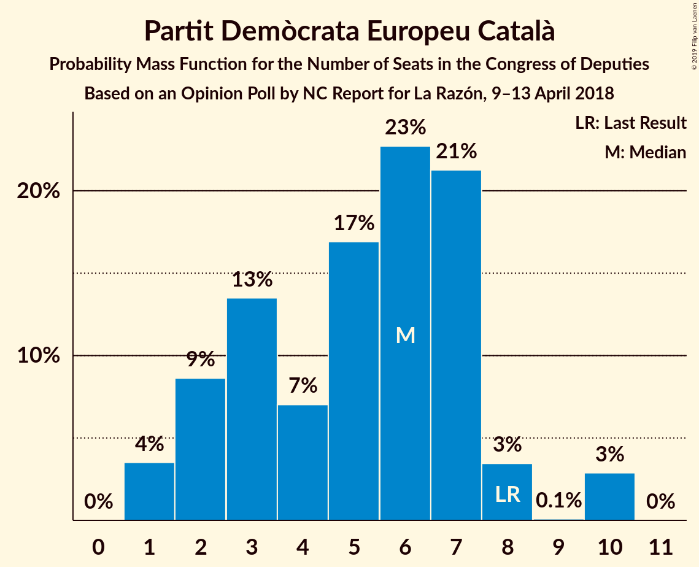
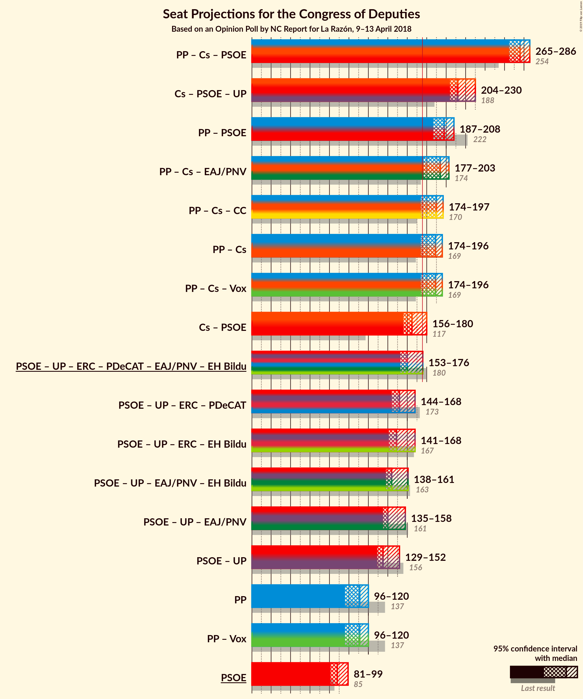
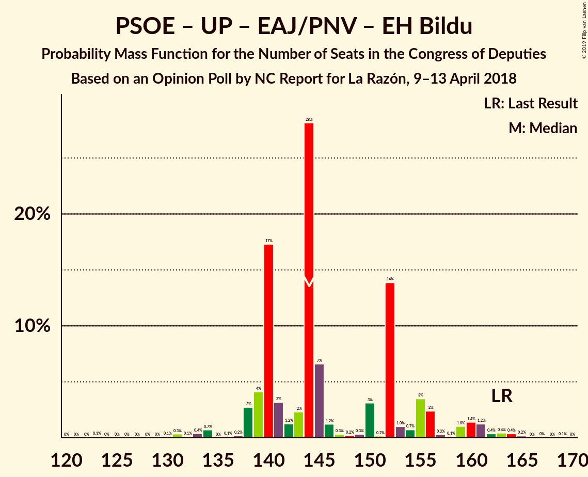
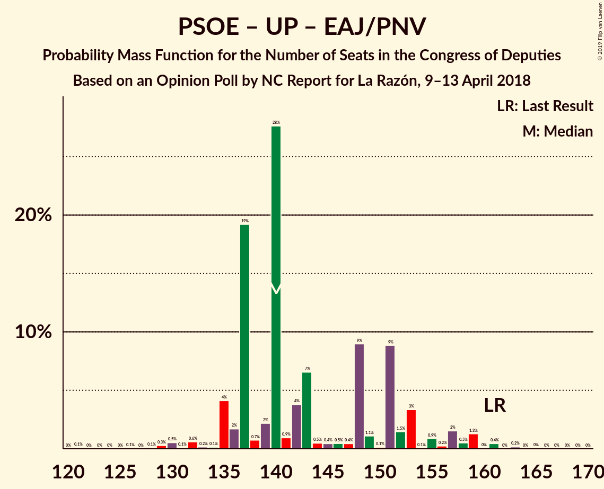
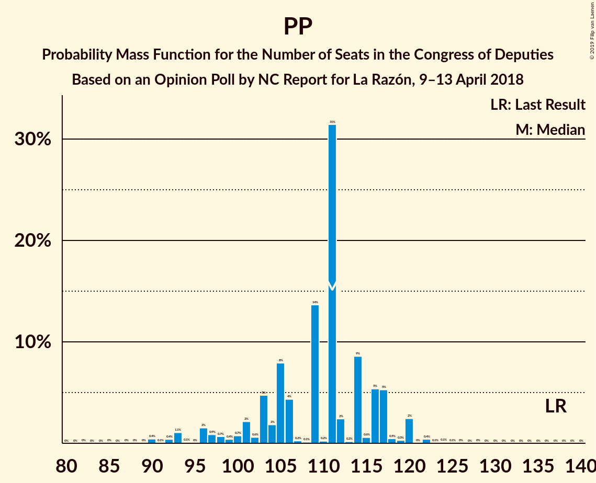
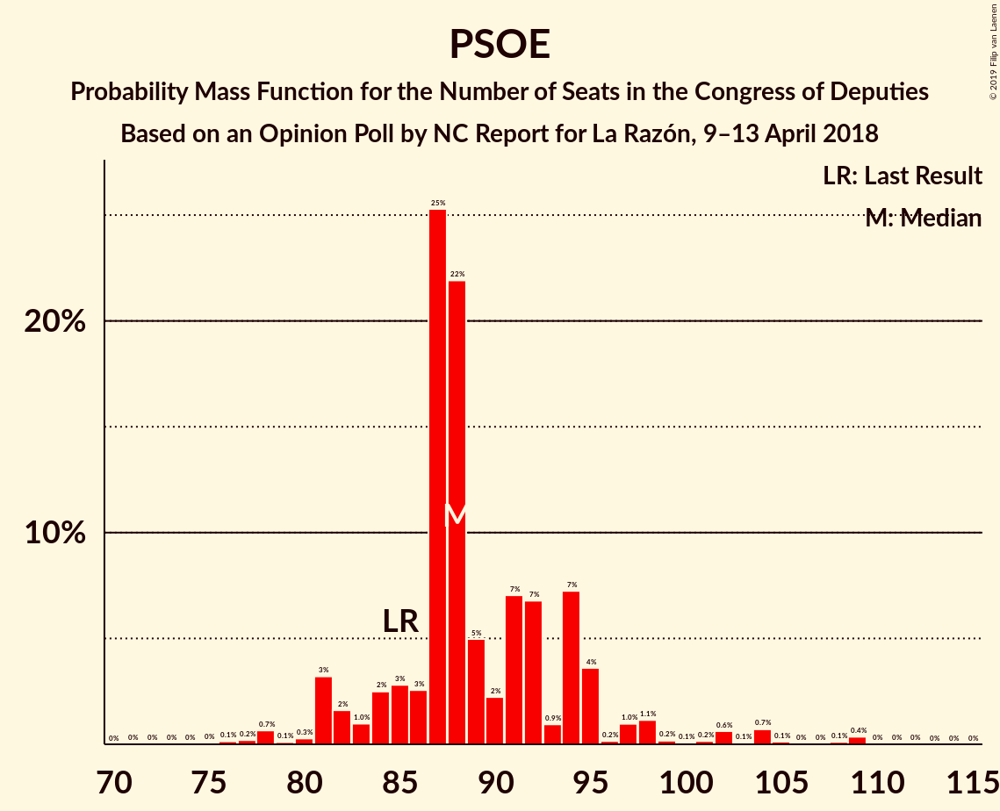

# Opinion Poll by NC Report for La Razón, 9–13 April 2018

<a href="#voting-intentions">Voting Intentions</a> | <a href="#seats">Seats</a> | <a href="#coalitions">Coalitions</a> | <a href="#technical-information">Technical Information</a>

## Voting Intentions

### Confidence Intervals

| Party | Last Result | Poll Result | 80% Confidence Interval | 90% Confidence Interval | 95% Confidence Interval | 99% Confidence Interval |
|:-----:|:-----------:|:-----------:|:-----------------------:|:-----------------------:|:-----------------------:|:-----------------------:|
| Partido Popular | 33.0% | 26.3% | 24.6–28.2% |24.1–28.7% |23.7–29.1% |22.8–30.0% |
| Ciudadanos–Partido de la Ciudadanía | 13.1% | 24.3% | 22.6–26.1% |22.1–26.6% |21.7–27.1% |21.0–27.9% |
| Partido Socialista Obrero Español | 22.6% | 23.5% | 21.8–25.3% |21.4–25.8% |21.0–26.2% |20.2–27.1% |
| Unidos Podemos | 21.2% | 16.2% | 14.8–17.8% |14.4–18.2% |14.0–18.6% |13.4–19.4% |
| Esquerra Republicana de Catalunya–Catalunya Sí | 2.7% | 2.9% | 2.3–3.7% |2.2–3.9% |2.0–4.1% |1.8–4.6% |
| Partit Demòcrata Europeu Català | 2.0% | 1.4% | 1.0–2.0% |0.9–2.2% |0.8–2.3% |0.7–2.7% |
| Euzko Alderdi Jeltzalea/Partido Nacionalista Vasco | 1.2% | 1.1% | 0.8–1.7% |0.7–1.8% |0.6–2.0% |0.5–2.3% |
| Euskal Herria Bildu | 0.8% | 0.8% | 0.5–1.3% |0.5–1.4% |0.4–1.6% |0.3–1.9% |
| Coalición Canaria–Partido Nacionalista Canario | 0.3% | 0.3% | 0.2–0.7% |0.1–0.8% |0.1–0.9% |0.1–1.1% |

*Note:* The poll result column reflects the actual value used in the calculations. Published results may vary slightly, and in addition be rounded to fewer digits.

## Seats

### Confidence Intervals

| Party | Last Result | Median | 80% Confidence Interval | 90% Confidence Interval | 95% Confidence Interval | 99% Confidence Interval |
|:-----:|:-----------:|:------:|:-----------------------:|:-----------------------:|:-----------------------:|:-----------------------:|
| <a href="#partido-popular">Partido Popular</a> | 137 | 111 | 103–116 |98–117 |96–120 |90–122 |
| <a href="#ciudadanos–partido-de-la-ciudadanía">Ciudadanos–Partido de la Ciudadanía</a> | 32 | 78 | 72–80 |72–81 |71–84 |70–102 |
| <a href="#partido-socialista-obrero-español">Partido Socialista Obrero Español</a> | 85 | 88 | 85–94 |82–95 |81–99 |78–108 |
| <a href="#unidos-podemos">Unidos Podemos</a> | 71 | 47 | 45–57 |40–59 |40–60 |36–62 |
| <a href="#esquerra-republicana-de-catalunya–catalunya-sí">Esquerra Republicana de Catalunya–Catalunya Sí</a> | 9 | 12 | 8–14 |8–15 |8–16 |7–17 |
| <a href="#partit-demòcrata-europeu-català">Partit Demòcrata Europeu Català</a> | 8 | 6 | 2–7 |2–8 |1–10 |1–10 |
| <a href="#euzko-alderdi-jeltzalea/partido-nacionalista-vasco">Euzko Alderdi Jeltzalea/Partido Nacionalista Vasco</a> | 5 | 6 | 3–6 |3–7 |3–8 |2–8 |
| <a href="#euskal-herria-bildu">Euskal Herria Bildu</a> | 2 | 3 | 1–4 |1–5 |1–6 |1–7 |
| <a href="#coalición-canaria–partido-nacionalista-canario">Coalición Canaria–Partido Nacionalista Canario</a> | 1 | 1 | 0–2 |0–2 |0–3 |0–4 |

### Partido Popular

*For a full overview of the results for this party, see the [Partido Popular](party-partidopopular.html) page.*

| Number of Seats | Probability | Accumulated | Special Marks |
|:---------------:|:-----------:|:-----------:|:-------------:|
| 84 | 0% | 100% |  |
| 85 | 0% | 99.9% |  |
| 86 | 0% | 99.9% |  |
| 87 | 0% | 99.9% |  |
| 88 | 0% | 99.9% |  |
| 89 | 0% | 99.9% |  |
| 90 | 0.4% | 99.8% |  |
| 91 | 0.1% | 99.4% |  |
| 92 | 0.4% | 99.4% |  |
| 93 | 1.1% | 99.0% |  |
| 94 | 0.1% | 98% |  |
| 95 | 0% | 98% |  |
| 96 | 2% | 98% |  |
| 97 | 0.9% | 96% |  |
| 98 | 0.7% | 95% |  |
| 99 | 0.4% | 95% |  |
| 100 | 0.7% | 94% |  |
| 101 | 2% | 94% |  |
| 102 | 0.6% | 91% |  |
| 103 | 5% | 91% |  |
| 104 | 2% | 86% |  |
| 105 | 8% | 84% |  |
| 106 | 4% | 76% |  |
| 107 | 0.2% | 72% |  |
| 108 | 0.1% | 72% |  |
| 109 | 14% | 72% |  |
| 110 | 0.2% | 58% |  |
| 111 | 31% | 58% | Median |
| 112 | 2% | 26% |  |
| 113 | 0.2% | 24% |  |
| 114 | 9% | 24% |  |
| 115 | 0.6% | 15% |  |
| 116 | 5% | 15% |  |
| 117 | 5% | 9% |  |
| 118 | 0.5% | 4% |  |
| 119 | 0.3% | 3% |  |
| 120 | 2% | 3% |  |
| 121 | 0% | 0.7% |  |
| 122 | 0.4% | 0.6% |  |
| 123 | 0.1% | 0.2% |  |
| 124 | 0.1% | 0.2% |  |
| 125 | 0.1% | 0.1% |  |
| 126 | 0% | 0.1% |  |
| 127 | 0% | 0% |  |
| 128 | 0% | 0% |  |
| 129 | 0% | 0% |  |
| 130 | 0% | 0% |  |
| 131 | 0% | 0% |  |
| 132 | 0% | 0% |  |
| 133 | 0% | 0% |  |
| 134 | 0% | 0% |  |
| 135 | 0% | 0% |  |
| 136 | 0% | 0% |  |
| 137 | 0% | 0% | Last Result |

### Ciudadanos–Partido de la Ciudadanía

*For a full overview of the results for this party, see the [Ciudadanos–Partido de la Ciudadanía](party-ciudadanos–partidodelaciudadanía.html) page.*

| Number of Seats | Probability | Accumulated | Special Marks |
|:---------------:|:-----------:|:-----------:|:-------------:|
| 32 | 0% | 100% | Last Result |
| 33 | 0% | 100% |  |
| 34 | 0% | 100% |  |
| 35 | 0% | 100% |  |
| 36 | 0% | 100% |  |
| 37 | 0% | 100% |  |
| 38 | 0% | 100% |  |
| 39 | 0% | 100% |  |
| 40 | 0% | 100% |  |
| 41 | 0% | 100% |  |
| 42 | 0% | 100% |  |
| 43 | 0% | 100% |  |
| 44 | 0% | 100% |  |
| 45 | 0% | 100% |  |
| 46 | 0% | 100% |  |
| 47 | 0% | 100% |  |
| 48 | 0% | 100% |  |
| 49 | 0% | 100% |  |
| 50 | 0% | 100% |  |
| 51 | 0% | 100% |  |
| 52 | 0% | 100% |  |
| 53 | 0% | 100% |  |
| 54 | 0% | 100% |  |
| 55 | 0% | 100% |  |
| 56 | 0% | 100% |  |
| 57 | 0% | 100% |  |
| 58 | 0% | 100% |  |
| 59 | 0% | 100% |  |
| 60 | 0% | 100% |  |
| 61 | 0% | 100% |  |
| 62 | 0% | 100% |  |
| 63 | 0% | 100% |  |
| 64 | 0% | 100% |  |
| 65 | 0% | 100% |  |
| 66 | 0.1% | 100% |  |
| 67 | 0% | 99.9% |  |
| 68 | 0.2% | 99.9% |  |
| 69 | 0.1% | 99.7% |  |
| 70 | 2% | 99.6% |  |
| 71 | 2% | 98% |  |
| 72 | 11% | 96% |  |
| 73 | 6% | 85% |  |
| 74 | 2% | 78% |  |
| 75 | 10% | 76% |  |
| 76 | 2% | 66% |  |
| 77 | 11% | 63% |  |
| 78 | 29% | 53% | Median |
| 79 | 14% | 24% |  |
| 80 | 4% | 10% |  |
| 81 | 2% | 6% |  |
| 82 | 0.3% | 4% |  |
| 83 | 0.4% | 4% |  |
| 84 | 1.2% | 3% |  |
| 85 | 0.1% | 2% |  |
| 86 | 0.1% | 2% |  |
| 87 | 0.1% | 2% |  |
| 88 | 0.2% | 2% |  |
| 89 | 0.1% | 2% |  |
| 90 | 0.2% | 2% |  |
| 91 | 0% | 1.5% |  |
| 92 | 0% | 1.5% |  |
| 93 | 0% | 1.4% |  |
| 94 | 0% | 1.4% |  |
| 95 | 0% | 1.4% |  |
| 96 | 0% | 1.4% |  |
| 97 | 0% | 1.4% |  |
| 98 | 0.3% | 1.4% |  |
| 99 | 0% | 1.1% |  |
| 100 | 0% | 1.1% |  |
| 101 | 0% | 1.1% |  |
| 102 | 0.6% | 1.1% |  |
| 103 | 0.4% | 0.5% |  |
| 104 | 0.1% | 0.1% |  |
| 105 | 0% | 0% |  |

### Partido Socialista Obrero Español

*For a full overview of the results for this party, see the [Partido Socialista Obrero Español](party-partidosocialistaobreroespañol.html) page.*

| Number of Seats | Probability | Accumulated | Special Marks |
|:---------------:|:-----------:|:-----------:|:-------------:|
| 72 | 0% | 100% |  |
| 73 | 0% | 99.9% |  |
| 74 | 0% | 99.9% |  |
| 75 | 0% | 99.9% |  |
| 76 | 0.1% | 99.9% |  |
| 77 | 0.2% | 99.7% |  |
| 78 | 0.7% | 99.5% |  |
| 79 | 0.1% | 98.9% |  |
| 80 | 0.3% | 98.8% |  |
| 81 | 3% | 98% |  |
| 82 | 2% | 95% |  |
| 83 | 1.0% | 94% |  |
| 84 | 2% | 93% |  |
| 85 | 3% | 90% | Last Result |
| 86 | 3% | 87% |  |
| 87 | 25% | 85% |  |
| 88 | 22% | 60% | Median |
| 89 | 5% | 38% |  |
| 90 | 2% | 33% |  |
| 91 | 7% | 30% |  |
| 92 | 7% | 23% |  |
| 93 | 0.9% | 17% |  |
| 94 | 7% | 16% |  |
| 95 | 4% | 8% |  |
| 96 | 0.2% | 5% |  |
| 97 | 1.0% | 5% |  |
| 98 | 1.1% | 4% |  |
| 99 | 0.2% | 3% |  |
| 100 | 0.1% | 2% |  |
| 101 | 0.2% | 2% |  |
| 102 | 0.6% | 2% |  |
| 103 | 0.1% | 1.5% |  |
| 104 | 0.7% | 1.4% |  |
| 105 | 0.1% | 0.7% |  |
| 106 | 0% | 0.6% |  |
| 107 | 0% | 0.5% |  |
| 108 | 0.1% | 0.5% |  |
| 109 | 0.4% | 0.4% |  |
| 110 | 0% | 0.1% |  |
| 111 | 0% | 0% |  |

### Unidos Podemos

*For a full overview of the results for this party, see the [Unidos Podemos](party-unidospodemos.html) page.*

| Number of Seats | Probability | Accumulated | Special Marks |
|:---------------:|:-----------:|:-----------:|:-------------:|
| 32 | 0% | 100% |  |
| 33 | 0% | 99.9% |  |
| 34 | 0% | 99.9% |  |
| 35 | 0.3% | 99.9% |  |
| 36 | 1.3% | 99.6% |  |
| 37 | 0.1% | 98% |  |
| 38 | 0.1% | 98% |  |
| 39 | 0.3% | 98% |  |
| 40 | 5% | 98% |  |
| 41 | 1.0% | 92% |  |
| 42 | 0.3% | 91% |  |
| 43 | 0.7% | 91% |  |
| 44 | 0.2% | 90% |  |
| 45 | 21% | 90% |  |
| 46 | 6% | 69% |  |
| 47 | 23% | 63% | Median |
| 48 | 3% | 40% |  |
| 49 | 6% | 37% |  |
| 50 | 10% | 31% |  |
| 51 | 2% | 21% |  |
| 52 | 0.2% | 20% |  |
| 53 | 0.9% | 20% |  |
| 54 | 2% | 19% |  |
| 55 | 0.4% | 17% |  |
| 56 | 2% | 16% |  |
| 57 | 9% | 15% |  |
| 58 | 0.7% | 6% |  |
| 59 | 2% | 5% |  |
| 60 | 2% | 3% |  |
| 61 | 0.2% | 0.8% |  |
| 62 | 0.1% | 0.6% |  |
| 63 | 0.1% | 0.4% |  |
| 64 | 0.1% | 0.4% |  |
| 65 | 0.1% | 0.3% |  |
| 66 | 0.2% | 0.2% |  |
| 67 | 0% | 0% |  |
| 68 | 0% | 0% |  |
| 69 | 0% | 0% |  |
| 70 | 0% | 0% |  |
| 71 | 0% | 0% | Last Result |

### Esquerra Republicana de Catalunya–Catalunya Sí

*For a full overview of the results for this party, see the [Esquerra Republicana de Catalunya–Catalunya Sí](party-esquerrarepublicanadecatalunya–catalunyasí.html) page.*

| Number of Seats | Probability | Accumulated | Special Marks |
|:---------------:|:-----------:|:-----------:|:-------------:|
| 6 | 0.1% | 100% |  |
| 7 | 2% | 99.8% |  |
| 8 | 17% | 98% |  |
| 9 | 5% | 82% | Last Result |
| 10 | 2% | 77% |  |
| 11 | 10% | 75% |  |
| 12 | 26% | 65% | Median |
| 13 | 29% | 39% |  |
| 14 | 6% | 11% |  |
| 15 | 1.1% | 5% |  |
| 16 | 2% | 4% |  |
| 17 | 2% | 2% |  |
| 18 | 0.1% | 0.1% |  |
| 19 | 0% | 0% |  |

### Partit Demòcrata Europeu Català

*For a full overview of the results for this party, see the [Partit Demòcrata Europeu Català](party-partitdemòcrataeuropeucatalà.html) page.*

| Number of Seats | Probability | Accumulated | Special Marks |
|:---------------:|:-----------:|:-----------:|:-------------:|
| 1 | 4% | 100% |  |
| 2 | 9% | 96% |  |
| 3 | 13% | 88% |  |
| 4 | 7% | 74% |  |
| 5 | 17% | 67% |  |
| 6 | 23% | 50% | Median |
| 7 | 21% | 28% |  |
| 8 | 3% | 6% | Last Result |
| 9 | 0.1% | 3% |  |
| 10 | 3% | 3% |  |
| 11 | 0% | 0% |  |

### Euzko Alderdi Jeltzalea/Partido Nacionalista Vasco

*For a full overview of the results for this party, see the [Euzko Alderdi Jeltzalea/Partido Nacionalista Vasco](party-euzkoalderdijeltzaleapartidonacionalistavasco.html) page.*

| Number of Seats | Probability | Accumulated | Special Marks |
|:---------------:|:-----------:|:-----------:|:-------------:|
| 1 | 0.1% | 100% |  |
| 2 | 2% | 99.9% |  |
| 3 | 9% | 98% |  |
| 4 | 0.5% | 89% |  |
| 5 | 35% | 89% | Last Result |
| 6 | 47% | 54% | Median |
| 7 | 3% | 7% |  |
| 8 | 3% | 3% |  |
| 9 | 0.2% | 0.3% |  |
| 10 | 0.1% | 0.1% |  |
| 11 | 0% | 0% |  |

### Euskal Herria Bildu

*For a full overview of the results for this party, see the [Euskal Herria Bildu](party-euskalherriabildu.html) page.*

| Number of Seats | Probability | Accumulated | Special Marks |
|:---------------:|:-----------:|:-----------:|:-------------:|
| 0 | 0.3% | 100% |  |
| 1 | 12% | 99.7% |  |
| 2 | 19% | 87% | Last Result |
| 3 | 21% | 68% | Median |
| 4 | 41% | 47% |  |
| 5 | 0.9% | 5% |  |
| 6 | 3% | 4% |  |
| 7 | 0.7% | 0.8% |  |
| 8 | 0.1% | 0.2% |  |
| 9 | 0.1% | 0.1% |  |
| 10 | 0% | 0% |  |

### Coalición Canaria–Partido Nacionalista Canario

*For a full overview of the results for this party, see the [Coalición Canaria–Partido Nacionalista Canario](party-coalicióncanaria–partidonacionalistacanario.html) page.*

| Number of Seats | Probability | Accumulated | Special Marks |
|:---------------:|:-----------:|:-----------:|:-------------:|
| 0 | 22% | 100% |  |
| 1 | 51% | 78% | Last Result, Median |
| 2 | 24% | 27% |  |
| 3 | 2% | 3% |  |
| 4 | 0.7% | 0.7% |  |
| 5 | 0% | 0% |  |

## Coalitions

### Confidence Intervals

| Coalition | Last Result | Median | Majority? | 80% Confidence Interval | 90% Confidence Interval | 95% Confidence Interval | 99% Confidence Interval |
|:---------:|:-----------:|:------:|:---------:|:-----------------------:|:-----------------------:|:-----------------------:|:-----------------------:|
| Partido Popular – Ciudadanos–Partido de la Ciudadanía – Partido Socialista Obrero Español | 254 | 276 | 100% | 269–279 | 267–280 | 265–286 | 262–291 |
| Ciudadanos–Partido de la Ciudadanía – Partido Socialista Obrero Español – Unidos Podemos | 188 | 212 | 100% | 208–223 | 206–227 | 204–230 | 201–233 |
| Partido Popular – Partido Socialista Obrero Español | 222 | 198 | 99.9% | 193–202 | 189–207 | 187–208 | 182–212 |
| Partido Popular – Ciudadanos–Partido de la Ciudadanía – Euzko Alderdi Jeltzalea/Partido Nacionalista Vasco | 174 | 194 | 98.7% | 183–198 | 180–201 | 177–203 | 171–207 |
| Partido Popular – Ciudadanos–Partido de la Ciudadanía – Coalición Canaria–Partido Nacionalista Canario | 170 | 190 | 95% | 179–193 | 175–196 | 174–197 | 169–202 |
| Partido Popular – Ciudadanos–Partido de la Ciudadanía | 169 | 189 | 94% | 178–192 | 174–196 | 174–196 | 168–201 |
| Ciudadanos–Partido de la Ciudadanía – Partido Socialista Obrero Español | 117 | 165 | 5% | 160–172 | 157–175 | 156–180 | 153–195 |
| Partido Socialista Obrero Español – Unidos Podemos – Esquerra Republicana de Catalunya–Catalunya Sí – Partit Demòcrata Europeu Català – Euzko Alderdi Jeltzalea/Partido Nacionalista Vasco – Euskal Herria Bildu | 180 | 160 | 4% | 157–171 | 154–175 | 153–176 | 148–181 |
| Partido Socialista Obrero Español – Unidos Podemos – Esquerra Republicana de Catalunya–Catalunya Sí – Partit Demòcrata Europeu Català | 173 | 152 | 0.1% | 147–163 | 145–167 | 144–168 | 140–174 |
| Partido Socialista Obrero Español – Unidos Podemos – Esquerra Republicana de Catalunya–Catalunya Sí – Euskal Herria Bildu | 167 | 149 | 0.1% | 147–161 | 145–166 | 141–168 | 138–172 |
| Partido Socialista Obrero Español – Unidos Podemos – Euzko Alderdi Jeltzalea/Partido Nacionalista Vasco – Euskal Herria Bildu | 163 | 144 | 0% | 140–155 | 139–159 | 138–161 | 131–164 |
| Partido Socialista Obrero Español – Unidos Podemos – Euzko Alderdi Jeltzalea/Partido Nacionalista Vasco | 161 | 140 | 0% | 137–152 | 135–155 | 135–158 | 129–161 |
| Partido Socialista Obrero Español – Unidos Podemos | 156 | 135 | 0% | 131–146 | 130–151 | 129–152 | 123–157 |
| Partido Popular | 137 | 111 | 0% | 103–116 | 98–117 | 96–120 | 90–122 |
| Partido Socialista Obrero Español | 85 | 88 | 0% | 85–94 | 82–95 | 81–99 | 78–108 |

### Partido Popular – Ciudadanos–Partido de la Ciudadanía – Partido Socialista Obrero Español

| Number of Seats | Probability | Accumulated | Special Marks |
|:---------------:|:-----------:|:-----------:|:-------------:|
| 254 | 0% | 100% | Last Result |
| 255 | 0% | 100% |  |
| 256 | 0% | 100% |  |
| 257 | 0% | 100% |  |
| 258 | 0% | 100% |  |
| 259 | 0% | 99.9% |  |
| 260 | 0.1% | 99.9% |  |
| 261 | 0.2% | 99.8% |  |
| 262 | 0.7% | 99.7% |  |
| 263 | 0.4% | 98.9% |  |
| 264 | 0.4% | 98.6% |  |
| 265 | 1.0% | 98% |  |
| 266 | 0.7% | 97% |  |
| 267 | 2% | 96% |  |
| 268 | 2% | 95% |  |
| 269 | 7% | 93% |  |
| 270 | 2% | 86% |  |
| 271 | 1.3% | 84% |  |
| 272 | 1.1% | 82% |  |
| 273 | 6% | 81% |  |
| 274 | 11% | 75% |  |
| 275 | 6% | 64% |  |
| 276 | 17% | 58% |  |
| 277 | 4% | 41% | Median |
| 278 | 21% | 37% |  |
| 279 | 10% | 16% |  |
| 280 | 0.9% | 6% |  |
| 281 | 1.2% | 5% |  |
| 282 | 0% | 4% |  |
| 283 | 0% | 4% |  |
| 284 | 0.1% | 4% |  |
| 285 | 0.6% | 4% |  |
| 286 | 1.2% | 3% |  |
| 287 | 0.3% | 2% |  |
| 288 | 0% | 1.5% |  |
| 289 | 0.7% | 1.4% |  |
| 290 | 0.1% | 0.7% |  |
| 291 | 0.6% | 0.6% |  |
| 292 | 0% | 0.1% |  |
| 293 | 0% | 0% |  |

### Ciudadanos–Partido de la Ciudadanía – Partido Socialista Obrero Español – Unidos Podemos

| Number of Seats | Probability | Accumulated | Special Marks |
|:---------------:|:-----------:|:-----------:|:-------------:|
| 188 | 0% | 100% | Last Result |
| 189 | 0% | 100% |  |
| 190 | 0% | 100% |  |
| 191 | 0% | 100% |  |
| 192 | 0% | 100% |  |
| 193 | 0% | 100% |  |
| 194 | 0% | 100% |  |
| 195 | 0% | 100% |  |
| 196 | 0.1% | 100% |  |
| 197 | 0% | 99.9% |  |
| 198 | 0.1% | 99.9% |  |
| 199 | 0.1% | 99.8% |  |
| 200 | 0.3% | 99.8% |  |
| 201 | 0.1% | 99.5% |  |
| 202 | 0.1% | 99.4% |  |
| 203 | 0.1% | 99.3% |  |
| 204 | 3% | 99.2% |  |
| 205 | 0.2% | 96% |  |
| 206 | 2% | 96% |  |
| 207 | 3% | 94% |  |
| 208 | 1.3% | 91% |  |
| 209 | 2% | 90% |  |
| 210 | 21% | 88% |  |
| 211 | 2% | 67% |  |
| 212 | 18% | 64% |  |
| 213 | 1.0% | 47% | Median |
| 214 | 14% | 46% |  |
| 215 | 0.6% | 32% |  |
| 216 | 1.1% | 31% |  |
| 217 | 7% | 30% |  |
| 218 | 0.3% | 23% |  |
| 219 | 7% | 23% |  |
| 220 | 0.5% | 15% |  |
| 221 | 3% | 15% |  |
| 222 | 0.3% | 12% |  |
| 223 | 2% | 12% |  |
| 224 | 1.4% | 9% |  |
| 225 | 0.2% | 8% |  |
| 226 | 2% | 8% |  |
| 227 | 2% | 6% |  |
| 228 | 0.3% | 4% |  |
| 229 | 0.7% | 4% |  |
| 230 | 0.5% | 3% |  |
| 231 | 1.0% | 2% |  |
| 232 | 0.3% | 1.4% |  |
| 233 | 0.8% | 1.0% |  |
| 234 | 0.1% | 0.2% |  |
| 235 | 0% | 0.2% |  |
| 236 | 0.1% | 0.2% |  |
| 237 | 0% | 0.1% |  |
| 238 | 0% | 0.1% |  |
| 239 | 0% | 0.1% |  |
| 240 | 0% | 0% |  |

### Partido Popular – Partido Socialista Obrero Español

| Number of Seats | Probability | Accumulated | Special Marks |
|:---------------:|:-----------:|:-----------:|:-------------:|
| 170 | 0% | 100% |  |
| 171 | 0% | 99.9% |  |
| 172 | 0% | 99.9% |  |
| 173 | 0% | 99.9% |  |
| 174 | 0% | 99.9% |  |
| 175 | 0% | 99.9% |  |
| 176 | 0% | 99.9% | Majority |
| 177 | 0% | 99.9% |  |
| 178 | 0.1% | 99.9% |  |
| 179 | 0% | 99.8% |  |
| 180 | 0% | 99.8% |  |
| 181 | 0.2% | 99.8% |  |
| 182 | 0.3% | 99.6% |  |
| 183 | 0.2% | 99.3% |  |
| 184 | 0.2% | 99.0% |  |
| 185 | 0.5% | 98.8% |  |
| 186 | 0.7% | 98% |  |
| 187 | 0.7% | 98% |  |
| 188 | 1.0% | 97% |  |
| 189 | 1.1% | 96% |  |
| 190 | 1.4% | 95% |  |
| 191 | 1.2% | 93% |  |
| 192 | 2% | 92% |  |
| 193 | 2% | 90% |  |
| 194 | 0.1% | 88% |  |
| 195 | 0.2% | 88% |  |
| 196 | 0.2% | 88% |  |
| 197 | 18% | 88% |  |
| 198 | 21% | 69% |  |
| 199 | 15% | 48% | Median |
| 200 | 12% | 33% |  |
| 201 | 9% | 21% |  |
| 202 | 2% | 12% |  |
| 203 | 0.1% | 9% |  |
| 204 | 0.1% | 9% |  |
| 205 | 2% | 9% |  |
| 206 | 2% | 8% |  |
| 207 | 3% | 6% |  |
| 208 | 0.3% | 3% |  |
| 209 | 0.5% | 2% |  |
| 210 | 0.1% | 2% |  |
| 211 | 1.1% | 2% |  |
| 212 | 0.4% | 0.6% |  |
| 213 | 0% | 0.2% |  |
| 214 | 0% | 0.2% |  |
| 215 | 0% | 0.2% |  |
| 216 | 0.1% | 0.1% |  |
| 217 | 0% | 0% |  |
| 218 | 0% | 0% |  |
| 219 | 0% | 0% |  |
| 220 | 0% | 0% |  |
| 221 | 0% | 0% |  |
| 222 | 0% | 0% | Last Result |

### Partido Popular – Ciudadanos–Partido de la Ciudadanía – Euzko Alderdi Jeltzalea/Partido Nacionalista Vasco

| Number of Seats | Probability | Accumulated | Special Marks |
|:---------------:|:-----------:|:-----------:|:-------------:|
| 167 | 0% | 100% |  |
| 168 | 0% | 99.9% |  |
| 169 | 0% | 99.9% |  |
| 170 | 0.1% | 99.9% |  |
| 171 | 0.4% | 99.9% |  |
| 172 | 0.1% | 99.5% |  |
| 173 | 0% | 99.4% |  |
| 174 | 0.5% | 99.3% | Last Result |
| 175 | 0.1% | 98.8% |  |
| 176 | 0.4% | 98.7% | Majority |
| 177 | 1.1% | 98% |  |
| 178 | 0.2% | 97% |  |
| 179 | 0.9% | 97% |  |
| 180 | 4% | 96% |  |
| 181 | 0.3% | 92% |  |
| 182 | 0.4% | 92% |  |
| 183 | 4% | 92% |  |
| 184 | 1.0% | 88% |  |
| 185 | 0.1% | 87% |  |
| 186 | 0.7% | 87% |  |
| 187 | 7% | 86% |  |
| 188 | 8% | 78% |  |
| 189 | 0.5% | 71% |  |
| 190 | 10% | 70% |  |
| 191 | 2% | 60% |  |
| 192 | 0.9% | 58% |  |
| 193 | 1.5% | 57% |  |
| 194 | 18% | 55% |  |
| 195 | 15% | 38% | Median |
| 196 | 4% | 23% |  |
| 197 | 2% | 19% |  |
| 198 | 10% | 17% |  |
| 199 | 0.9% | 7% |  |
| 200 | 0.3% | 6% |  |
| 201 | 3% | 6% |  |
| 202 | 0% | 3% |  |
| 203 | 0.4% | 3% |  |
| 204 | 0.9% | 2% |  |
| 205 | 0.3% | 1.2% |  |
| 206 | 0% | 0.9% |  |
| 207 | 0.6% | 0.8% |  |
| 208 | 0% | 0.3% |  |
| 209 | 0% | 0.2% |  |
| 210 | 0% | 0.2% |  |
| 211 | 0% | 0.2% |  |
| 212 | 0.1% | 0.2% |  |
| 213 | 0% | 0.1% |  |
| 214 | 0% | 0.1% |  |
| 215 | 0% | 0.1% |  |
| 216 | 0.1% | 0.1% |  |
| 217 | 0% | 0% |  |

### Partido Popular – Ciudadanos–Partido de la Ciudadanía – Coalición Canaria–Partido Nacionalista Canario

| Number of Seats | Probability | Accumulated | Special Marks |
|:---------------:|:-----------:|:-----------:|:-------------:|
| 166 | 0.1% | 100% |  |
| 167 | 0% | 99.9% |  |
| 168 | 0% | 99.9% |  |
| 169 | 0.9% | 99.8% |  |
| 170 | 0.1% | 98.9% | Last Result |
| 171 | 0.1% | 98.9% |  |
| 172 | 0% | 98.8% |  |
| 173 | 0.7% | 98.7% |  |
| 174 | 2% | 98% |  |
| 175 | 2% | 96% |  |
| 176 | 0.5% | 95% | Majority |
| 177 | 0.4% | 94% |  |
| 178 | 0.5% | 94% |  |
| 179 | 3% | 93% |  |
| 180 | 2% | 90% |  |
| 181 | 8% | 88% |  |
| 182 | 0.5% | 79% |  |
| 183 | 9% | 79% |  |
| 184 | 0.4% | 70% |  |
| 185 | 5% | 70% |  |
| 186 | 6% | 65% |  |
| 187 | 2% | 59% |  |
| 188 | 2% | 57% |  |
| 189 | 0.4% | 55% |  |
| 190 | 19% | 54% | Median |
| 191 | 3% | 35% |  |
| 192 | 14% | 32% |  |
| 193 | 9% | 17% |  |
| 194 | 0.2% | 8% |  |
| 195 | 1.1% | 8% |  |
| 196 | 4% | 7% |  |
| 197 | 1.1% | 3% |  |
| 198 | 0% | 2% |  |
| 199 | 1.3% | 2% |  |
| 200 | 0% | 1.0% |  |
| 201 | 0.4% | 1.0% |  |
| 202 | 0.2% | 0.6% |  |
| 203 | 0% | 0.3% |  |
| 204 | 0% | 0.3% |  |
| 205 | 0.1% | 0.3% |  |
| 206 | 0.1% | 0.2% |  |
| 207 | 0% | 0.1% |  |
| 208 | 0% | 0.1% |  |
| 209 | 0% | 0.1% |  |
| 210 | 0% | 0.1% |  |
| 211 | 0% | 0.1% |  |
| 212 | 0.1% | 0.1% |  |
| 213 | 0% | 0% |  |

### Partido Popular – Ciudadanos–Partido de la Ciudadanía

| Number of Seats | Probability | Accumulated | Special Marks |
|:---------------:|:-----------:|:-----------:|:-------------:|
| 164 | 0% | 100% |  |
| 165 | 0% | 99.9% |  |
| 166 | 0% | 99.9% |  |
| 167 | 0.1% | 99.9% |  |
| 168 | 0.9% | 99.8% |  |
| 169 | 0% | 98.9% | Last Result |
| 170 | 0.1% | 98.9% |  |
| 171 | 0.3% | 98.8% |  |
| 172 | 0.3% | 98% |  |
| 173 | 0.6% | 98% |  |
| 174 | 3% | 98% |  |
| 175 | 0.3% | 94% |  |
| 176 | 0.7% | 94% | Majority |
| 177 | 0.4% | 93% |  |
| 178 | 3% | 93% |  |
| 179 | 0.3% | 90% |  |
| 180 | 3% | 89% |  |
| 181 | 8% | 87% |  |
| 182 | 7% | 79% |  |
| 183 | 2% | 72% |  |
| 184 | 11% | 69% |  |
| 185 | 1.2% | 59% |  |
| 186 | 0.7% | 58% |  |
| 187 | 1.3% | 57% |  |
| 188 | 1.3% | 56% |  |
| 189 | 21% | 54% | Median |
| 190 | 15% | 34% |  |
| 191 | 2% | 19% |  |
| 192 | 8% | 17% |  |
| 193 | 0.9% | 9% |  |
| 194 | 0.1% | 8% |  |
| 195 | 2% | 8% |  |
| 196 | 3% | 5% |  |
| 197 | 0.1% | 2% |  |
| 198 | 1.2% | 2% |  |
| 199 | 0% | 0.9% |  |
| 200 | 0% | 0.9% |  |
| 201 | 0.5% | 0.8% |  |
| 202 | 0% | 0.3% |  |
| 203 | 0% | 0.3% |  |
| 204 | 0.1% | 0.3% |  |
| 205 | 0% | 0.2% |  |
| 206 | 0% | 0.2% |  |
| 207 | 0% | 0.1% |  |
| 208 | 0% | 0.1% |  |
| 209 | 0% | 0.1% |  |
| 210 | 0% | 0.1% |  |
| 211 | 0.1% | 0.1% |  |
| 212 | 0% | 0% |  |

### Ciudadanos–Partido de la Ciudadanía – Partido Socialista Obrero Español

| Number of Seats | Probability | Accumulated | Special Marks |
|:---------------:|:-----------:|:-----------:|:-------------:|
| 117 | 0% | 100% | Last Result |
| 118 | 0% | 100% |  |
| 119 | 0% | 100% |  |
| 120 | 0% | 100% |  |
| 121 | 0% | 100% |  |
| 122 | 0% | 100% |  |
| 123 | 0% | 100% |  |
| 124 | 0% | 100% |  |
| 125 | 0% | 100% |  |
| 126 | 0% | 100% |  |
| 127 | 0% | 100% |  |
| 128 | 0% | 100% |  |
| 129 | 0% | 100% |  |
| 130 | 0% | 100% |  |
| 131 | 0% | 100% |  |
| 132 | 0% | 100% |  |
| 133 | 0% | 100% |  |
| 134 | 0% | 100% |  |
| 135 | 0% | 100% |  |
| 136 | 0% | 100% |  |
| 137 | 0% | 100% |  |
| 138 | 0% | 100% |  |
| 139 | 0% | 100% |  |
| 140 | 0% | 100% |  |
| 141 | 0% | 100% |  |
| 142 | 0% | 100% |  |
| 143 | 0% | 100% |  |
| 144 | 0% | 100% |  |
| 145 | 0% | 100% |  |
| 146 | 0% | 100% |  |
| 147 | 0% | 100% |  |
| 148 | 0% | 100% |  |
| 149 | 0% | 100% |  |
| 150 | 0% | 99.9% |  |
| 151 | 0% | 99.9% |  |
| 152 | 0% | 99.9% |  |
| 153 | 0.6% | 99.9% |  |
| 154 | 0% | 99.2% |  |
| 155 | 0.2% | 99.2% |  |
| 156 | 2% | 99.0% |  |
| 157 | 4% | 97% |  |
| 158 | 0.1% | 93% |  |
| 159 | 2% | 93% |  |
| 160 | 7% | 91% |  |
| 161 | 4% | 84% |  |
| 162 | 2% | 80% |  |
| 163 | 2% | 78% |  |
| 164 | 3% | 75% |  |
| 165 | 26% | 73% |  |
| 166 | 9% | 47% | Median |
| 167 | 15% | 38% |  |
| 168 | 0.2% | 23% |  |
| 169 | 7% | 23% |  |
| 170 | 3% | 15% |  |
| 171 | 0.8% | 12% |  |
| 172 | 5% | 11% |  |
| 173 | 1.3% | 7% |  |
| 174 | 0.1% | 5% |  |
| 175 | 0.6% | 5% |  |
| 176 | 0.4% | 5% | Majority |
| 177 | 0% | 4% |  |
| 178 | 0.1% | 4% |  |
| 179 | 1.3% | 4% |  |
| 180 | 0.7% | 3% |  |
| 181 | 0.4% | 2% |  |
| 182 | 0% | 2% |  |
| 183 | 0.1% | 2% |  |
| 184 | 0% | 2% |  |
| 185 | 0% | 1.5% |  |
| 186 | 0.4% | 1.4% |  |
| 187 | 0% | 1.0% |  |
| 188 | 0% | 1.0% |  |
| 189 | 0% | 1.0% |  |
| 190 | 0% | 1.0% |  |
| 191 | 0.4% | 1.0% |  |
| 192 | 0% | 0.6% |  |
| 193 | 0% | 0.6% |  |
| 194 | 0% | 0.6% |  |
| 195 | 0.6% | 0.6% |  |
| 196 | 0% | 0% |  |

### Partido Socialista Obrero Español – Unidos Podemos – Esquerra Republicana de Catalunya–Catalunya Sí – Partit Demòcrata Europeu Català – Euzko Alderdi Jeltzalea/Partido Nacionalista Vasco – Euskal Herria Bildu

| Number of Seats | Probability | Accumulated | Special Marks |
|:---------------:|:-----------:|:-----------:|:-------------:|
| 138 | 0.1% | 100% |  |
| 139 | 0% | 99.9% |  |
| 140 | 0% | 99.9% |  |
| 141 | 0% | 99.9% |  |
| 142 | 0% | 99.9% |  |
| 143 | 0% | 99.9% |  |
| 144 | 0.1% | 99.9% |  |
| 145 | 0.1% | 99.8% |  |
| 146 | 0% | 99.7% |  |
| 147 | 0% | 99.7% |  |
| 148 | 0.2% | 99.7% |  |
| 149 | 0.4% | 99.4% |  |
| 150 | 0% | 99.0% |  |
| 151 | 1.3% | 99.0% |  |
| 152 | 0% | 98% |  |
| 153 | 1.1% | 98% |  |
| 154 | 4% | 97% |  |
| 155 | 1.1% | 93% |  |
| 156 | 0.2% | 92% |  |
| 157 | 9% | 92% |  |
| 158 | 14% | 83% |  |
| 159 | 3% | 68% |  |
| 160 | 19% | 65% |  |
| 161 | 0.4% | 46% |  |
| 162 | 2% | 45% | Median |
| 163 | 2% | 43% |  |
| 164 | 6% | 41% |  |
| 165 | 5% | 35% |  |
| 166 | 0.4% | 30% |  |
| 167 | 9% | 30% |  |
| 168 | 0.5% | 21% |  |
| 169 | 8% | 21% |  |
| 170 | 2% | 12% |  |
| 171 | 3% | 10% |  |
| 172 | 0.5% | 7% |  |
| 173 | 0.4% | 6% |  |
| 174 | 0.5% | 6% |  |
| 175 | 2% | 5% |  |
| 176 | 2% | 4% | Majority |
| 177 | 0.7% | 2% |  |
| 178 | 0% | 1.3% |  |
| 179 | 0.1% | 1.2% |  |
| 180 | 0.1% | 1.1% | Last Result |
| 181 | 0.9% | 1.1% |  |
| 182 | 0% | 0.2% |  |
| 183 | 0% | 0.1% |  |
| 184 | 0.1% | 0.1% |  |
| 185 | 0% | 0% |  |

### Partido Socialista Obrero Español – Unidos Podemos – Esquerra Republicana de Catalunya–Catalunya Sí – Partit Demòcrata Europeu Català

| Number of Seats | Probability | Accumulated | Special Marks |
|:---------------:|:-----------:|:-----------:|:-------------:|
| 131 | 0.1% | 100% |  |
| 132 | 0% | 99.9% |  |
| 133 | 0% | 99.9% |  |
| 134 | 0.1% | 99.9% |  |
| 135 | 0% | 99.8% |  |
| 136 | 0% | 99.8% |  |
| 137 | 0% | 99.8% |  |
| 138 | 0.1% | 99.8% |  |
| 139 | 0.2% | 99.7% |  |
| 140 | 0.5% | 99.5% |  |
| 141 | 0% | 99.0% |  |
| 142 | 0.6% | 99.0% |  |
| 143 | 0.8% | 98% |  |
| 144 | 0.6% | 98% |  |
| 145 | 3% | 97% |  |
| 146 | 0.1% | 94% |  |
| 147 | 8% | 94% |  |
| 148 | 0.7% | 85% |  |
| 149 | 14% | 85% |  |
| 150 | 2% | 71% |  |
| 151 | 4% | 68% |  |
| 152 | 20% | 64% |  |
| 153 | 2% | 44% | Median |
| 154 | 0.3% | 42% |  |
| 155 | 5% | 42% |  |
| 156 | 6% | 36% |  |
| 157 | 9% | 30% |  |
| 158 | 0.7% | 22% |  |
| 159 | 0% | 21% |  |
| 160 | 0.7% | 21% |  |
| 161 | 0.8% | 20% |  |
| 162 | 9% | 19% |  |
| 163 | 0.6% | 10% |  |
| 164 | 2% | 10% |  |
| 165 | 0.6% | 7% |  |
| 166 | 0.2% | 7% |  |
| 167 | 3% | 7% |  |
| 168 | 2% | 4% |  |
| 169 | 0.5% | 2% |  |
| 170 | 0.2% | 1.1% |  |
| 171 | 0.2% | 1.0% |  |
| 172 | 0% | 0.8% |  |
| 173 | 0.2% | 0.7% | Last Result |
| 174 | 0.1% | 0.6% |  |
| 175 | 0.4% | 0.5% |  |
| 176 | 0% | 0.1% | Majority |
| 177 | 0% | 0.1% |  |
| 178 | 0% | 0% |  |

### Partido Socialista Obrero Español – Unidos Podemos – Esquerra Republicana de Catalunya–Catalunya Sí – Euskal Herria Bildu

| Number of Seats | Probability | Accumulated | Special Marks |
|:---------------:|:-----------:|:-----------:|:-------------:|
| 128 | 0.1% | 100% |  |
| 129 | 0% | 99.9% |  |
| 130 | 0% | 99.9% |  |
| 131 | 0% | 99.9% |  |
| 132 | 0% | 99.9% |  |
| 133 | 0% | 99.9% |  |
| 134 | 0% | 99.8% |  |
| 135 | 0.1% | 99.8% |  |
| 136 | 0.1% | 99.7% |  |
| 137 | 0.1% | 99.7% |  |
| 138 | 0.4% | 99.6% |  |
| 139 | 0.2% | 99.2% |  |
| 140 | 0.5% | 99.0% |  |
| 141 | 2% | 98.5% |  |
| 142 | 0% | 96% |  |
| 143 | 0.1% | 96% |  |
| 144 | 0.8% | 96% |  |
| 145 | 2% | 96% |  |
| 146 | 3% | 93% |  |
| 147 | 14% | 90% |  |
| 148 | 23% | 76% |  |
| 149 | 8% | 53% |  |
| 150 | 0.5% | 45% | Median |
| 151 | 0.7% | 45% |  |
| 152 | 11% | 44% |  |
| 153 | 0.5% | 33% |  |
| 154 | 3% | 32% |  |
| 155 | 1.2% | 29% |  |
| 156 | 1.1% | 28% |  |
| 157 | 0.2% | 27% |  |
| 158 | 14% | 27% |  |
| 159 | 0.3% | 13% |  |
| 160 | 2% | 13% |  |
| 161 | 2% | 11% |  |
| 162 | 0.4% | 9% |  |
| 163 | 1.0% | 9% |  |
| 164 | 0.3% | 8% |  |
| 165 | 1.4% | 8% |  |
| 166 | 3% | 6% |  |
| 167 | 0.4% | 3% | Last Result |
| 168 | 0.2% | 3% |  |
| 169 | 0.7% | 2% |  |
| 170 | 0.4% | 2% |  |
| 171 | 0.2% | 1.3% |  |
| 172 | 0.9% | 1.1% |  |
| 173 | 0% | 0.2% |  |
| 174 | 0% | 0.2% |  |
| 175 | 0% | 0.1% |  |
| 176 | 0% | 0.1% | Majority |
| 177 | 0% | 0.1% |  |
| 178 | 0% | 0% |  |

### Partido Socialista Obrero Español – Unidos Podemos – Euzko Alderdi Jeltzalea/Partido Nacionalista Vasco – Euskal Herria Bildu

| Number of Seats | Probability | Accumulated | Special Marks |
|:---------------:|:-----------:|:-----------:|:-------------:|
| 123 | 0.1% | 100% |  |
| 124 | 0% | 99.9% |  |
| 125 | 0% | 99.9% |  |
| 126 | 0% | 99.9% |  |
| 127 | 0% | 99.9% |  |
| 128 | 0% | 99.9% |  |
| 129 | 0% | 99.9% |  |
| 130 | 0.1% | 99.8% |  |
| 131 | 0.3% | 99.8% |  |
| 132 | 0.1% | 99.4% |  |
| 133 | 0.4% | 99.3% |  |
| 134 | 0.7% | 98.9% |  |
| 135 | 0% | 98% |  |
| 136 | 0.1% | 98% |  |
| 137 | 0.2% | 98% |  |
| 138 | 3% | 98% |  |
| 139 | 4% | 95% |  |
| 140 | 17% | 91% |  |
| 141 | 3% | 74% |  |
| 142 | 1.2% | 71% |  |
| 143 | 2% | 69% |  |
| 144 | 28% | 67% | Median |
| 145 | 7% | 39% |  |
| 146 | 1.2% | 32% |  |
| 147 | 0.3% | 31% |  |
| 148 | 0.2% | 31% |  |
| 149 | 0.3% | 31% |  |
| 150 | 3% | 30% |  |
| 151 | 0.2% | 27% |  |
| 152 | 14% | 27% |  |
| 153 | 1.0% | 13% |  |
| 154 | 0.7% | 12% |  |
| 155 | 3% | 11% |  |
| 156 | 2% | 8% |  |
| 157 | 0.3% | 6% |  |
| 158 | 0.1% | 5% |  |
| 159 | 1.0% | 5% |  |
| 160 | 1.4% | 4% |  |
| 161 | 1.2% | 3% |  |
| 162 | 0.4% | 1.5% |  |
| 163 | 0.4% | 1.1% | Last Result |
| 164 | 0.4% | 0.7% |  |
| 165 | 0.2% | 0.3% |  |
| 166 | 0% | 0.1% |  |
| 167 | 0% | 0.1% |  |
| 168 | 0% | 0.1% |  |
| 169 | 0.1% | 0.1% |  |
| 170 | 0% | 0% |  |

### Partido Socialista Obrero Español – Unidos Podemos – Euzko Alderdi Jeltzalea/Partido Nacionalista Vasco

| Number of Seats | Probability | Accumulated | Special Marks |
|:---------------:|:-----------:|:-----------:|:-------------:|
| 121 | 0.1% | 100% |  |
| 122 | 0% | 99.9% |  |
| 123 | 0% | 99.9% |  |
| 124 | 0% | 99.9% |  |
| 125 | 0% | 99.9% |  |
| 126 | 0.1% | 99.8% |  |
| 127 | 0% | 99.8% |  |
| 128 | 0.1% | 99.8% |  |
| 129 | 0.3% | 99.7% |  |
| 130 | 0.5% | 99.4% |  |
| 131 | 0.1% | 98.9% |  |
| 132 | 0.6% | 98.8% |  |
| 133 | 0.2% | 98% |  |
| 134 | 0.1% | 98% |  |
| 135 | 4% | 98% |  |
| 136 | 2% | 94% |  |
| 137 | 19% | 92% |  |
| 138 | 0.7% | 73% |  |
| 139 | 2% | 72% |  |
| 140 | 28% | 70% |  |
| 141 | 0.9% | 42% | Median |
| 142 | 4% | 41% |  |
| 143 | 7% | 38% |  |
| 144 | 0.5% | 31% |  |
| 145 | 0.4% | 30% |  |
| 146 | 0.5% | 30% |  |
| 147 | 0.4% | 30% |  |
| 148 | 9% | 29% |  |
| 149 | 1.1% | 20% |  |
| 150 | 0.1% | 19% |  |
| 151 | 9% | 19% |  |
| 152 | 1.5% | 10% |  |
| 153 | 3% | 9% |  |
| 154 | 0.1% | 5% |  |
| 155 | 0.9% | 5% |  |
| 156 | 0.2% | 4% |  |
| 157 | 2% | 4% |  |
| 158 | 0.5% | 3% |  |
| 159 | 1.3% | 2% |  |
| 160 | 0% | 0.7% |  |
| 161 | 0.4% | 0.7% | Last Result |
| 162 | 0% | 0.3% |  |
| 163 | 0.2% | 0.2% |  |
| 164 | 0% | 0.1% |  |
| 165 | 0% | 0.1% |  |
| 166 | 0% | 0% |  |

### Partido Socialista Obrero Español – Unidos Podemos

| Number of Seats | Probability | Accumulated | Special Marks |
|:---------------:|:-----------:|:-----------:|:-------------:|
| 116 | 0.1% | 100% |  |
| 117 | 0% | 99.9% |  |
| 118 | 0% | 99.9% |  |
| 119 | 0% | 99.9% |  |
| 120 | 0.1% | 99.8% |  |
| 121 | 0% | 99.8% |  |
| 122 | 0% | 99.8% |  |
| 123 | 0.3% | 99.7% |  |
| 124 | 0.5% | 99.4% |  |
| 125 | 0.1% | 98.9% |  |
| 126 | 0% | 98.8% |  |
| 127 | 0.2% | 98.7% |  |
| 128 | 0.2% | 98% |  |
| 129 | 1.3% | 98% |  |
| 130 | 6% | 97% |  |
| 131 | 2% | 91% |  |
| 132 | 17% | 89% |  |
| 133 | 2% | 73% |  |
| 134 | 14% | 71% |  |
| 135 | 16% | 57% | Median |
| 136 | 2% | 41% |  |
| 137 | 8% | 39% |  |
| 138 | 1.0% | 32% |  |
| 139 | 0.1% | 31% |  |
| 140 | 2% | 31% |  |
| 141 | 0.6% | 28% |  |
| 142 | 7% | 28% |  |
| 143 | 1.0% | 21% |  |
| 144 | 0.4% | 20% |  |
| 145 | 7% | 19% |  |
| 146 | 2% | 12% |  |
| 147 | 0.7% | 10% |  |
| 148 | 0.4% | 9% |  |
| 149 | 0.6% | 9% |  |
| 150 | 2% | 8% |  |
| 151 | 3% | 6% |  |
| 152 | 1.1% | 3% |  |
| 153 | 1.2% | 2% |  |
| 154 | 0.2% | 1.1% |  |
| 155 | 0.3% | 1.0% |  |
| 156 | 0% | 0.7% | Last Result |
| 157 | 0.1% | 0.6% |  |
| 158 | 0.4% | 0.5% |  |
| 159 | 0% | 0.1% |  |
| 160 | 0% | 0.1% |  |
| 161 | 0% | 0.1% |  |
| 162 | 0% | 0% |  |

### Partido Popular

| Number of Seats | Probability | Accumulated | Special Marks |
|:---------------:|:-----------:|:-----------:|:-------------:|
| 84 | 0% | 100% |  |
| 85 | 0% | 99.9% |  |
| 86 | 0% | 99.9% |  |
| 87 | 0% | 99.9% |  |
| 88 | 0% | 99.9% |  |
| 89 | 0% | 99.9% |  |
| 90 | 0.4% | 99.8% |  |
| 91 | 0.1% | 99.4% |  |
| 92 | 0.4% | 99.4% |  |
| 93 | 1.1% | 99.0% |  |
| 94 | 0.1% | 98% |  |
| 95 | 0% | 98% |  |
| 96 | 2% | 98% |  |
| 97 | 0.9% | 96% |  |
| 98 | 0.7% | 95% |  |
| 99 | 0.4% | 95% |  |
| 100 | 0.7% | 94% |  |
| 101 | 2% | 94% |  |
| 102 | 0.6% | 91% |  |
| 103 | 5% | 91% |  |
| 104 | 2% | 86% |  |
| 105 | 8% | 84% |  |
| 106 | 4% | 76% |  |
| 107 | 0.2% | 72% |  |
| 108 | 0.1% | 72% |  |
| 109 | 14% | 72% |  |
| 110 | 0.2% | 58% |  |
| 111 | 31% | 58% | Median |
| 112 | 2% | 26% |  |
| 113 | 0.2% | 24% |  |
| 114 | 9% | 24% |  |
| 115 | 0.6% | 15% |  |
| 116 | 5% | 15% |  |
| 117 | 5% | 9% |  |
| 118 | 0.5% | 4% |  |
| 119 | 0.3% | 3% |  |
| 120 | 2% | 3% |  |
| 121 | 0% | 0.7% |  |
| 122 | 0.4% | 0.6% |  |
| 123 | 0.1% | 0.2% |  |
| 124 | 0.1% | 0.2% |  |
| 125 | 0.1% | 0.1% |  |
| 126 | 0% | 0.1% |  |
| 127 | 0% | 0% |  |
| 128 | 0% | 0% |  |
| 129 | 0% | 0% |  |
| 130 | 0% | 0% |  |
| 131 | 0% | 0% |  |
| 132 | 0% | 0% |  |
| 133 | 0% | 0% |  |
| 134 | 0% | 0% |  |
| 135 | 0% | 0% |  |
| 136 | 0% | 0% |  |
| 137 | 0% | 0% | Last Result |

### Partido Socialista Obrero Español

| Number of Seats | Probability | Accumulated | Special Marks |
|:---------------:|:-----------:|:-----------:|:-------------:|
| 72 | 0% | 100% |  |
| 73 | 0% | 99.9% |  |
| 74 | 0% | 99.9% |  |
| 75 | 0% | 99.9% |  |
| 76 | 0.1% | 99.9% |  |
| 77 | 0.2% | 99.7% |  |
| 78 | 0.7% | 99.5% |  |
| 79 | 0.1% | 98.9% |  |
| 80 | 0.3% | 98.8% |  |
| 81 | 3% | 98% |  |
| 82 | 2% | 95% |  |
| 83 | 1.0% | 94% |  |
| 84 | 2% | 93% |  |
| 85 | 3% | 90% | Last Result |
| 86 | 3% | 87% |  |
| 87 | 25% | 85% |  |
| 88 | 22% | 60% | Median |
| 89 | 5% | 38% |  |
| 90 | 2% | 33% |  |
| 91 | 7% | 30% |  |
| 92 | 7% | 23% |  |
| 93 | 0.9% | 17% |  |
| 94 | 7% | 16% |  |
| 95 | 4% | 8% |  |
| 96 | 0.2% | 5% |  |
| 97 | 1.0% | 5% |  |
| 98 | 1.1% | 4% |  |
| 99 | 0.2% | 3% |  |
| 100 | 0.1% | 2% |  |
| 101 | 0.2% | 2% |  |
| 102 | 0.6% | 2% |  |
| 103 | 0.1% | 1.5% |  |
| 104 | 0.7% | 1.4% |  |
| 105 | 0.1% | 0.7% |  |
| 106 | 0% | 0.6% |  |
| 107 | 0% | 0.5% |  |
| 108 | 0.1% | 0.5% |  |
| 109 | 0.4% | 0.4% |  |
| 110 | 0% | 0.1% |  |
| 111 | 0% | 0% |  |

## Technical Information

### Opinion Poll

+ **Polling firm:** NC Report
+ **Commissioner(s):** La Razón
+ **Fieldwork period:** 9–13 April 2018

### Calculations

+ **Sample size:** 1000
+ **Simulations done:** 131,072
+ **Error estimate:** 1.84%

