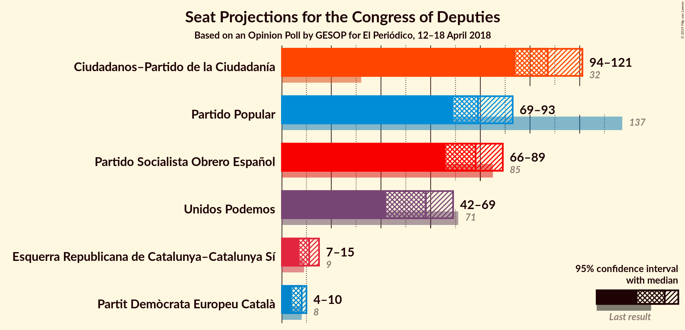
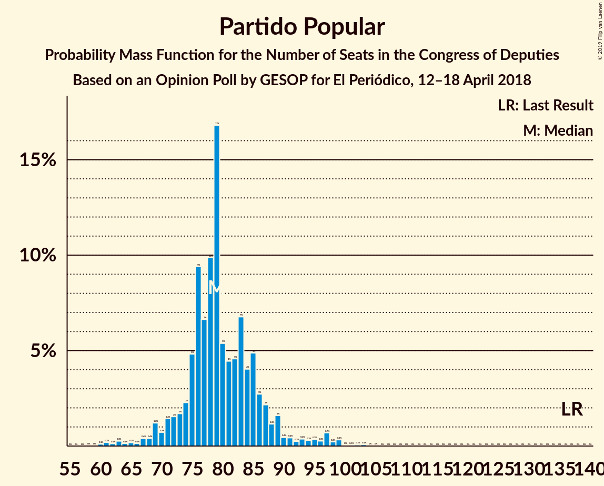
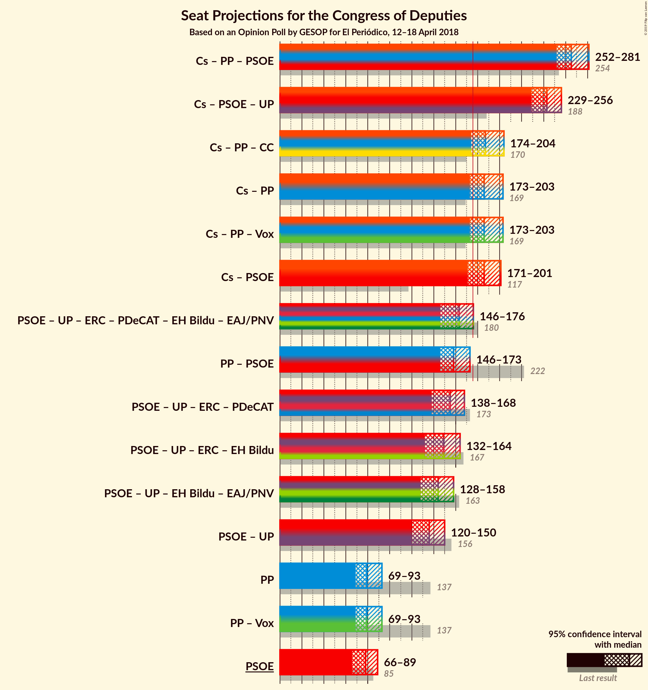
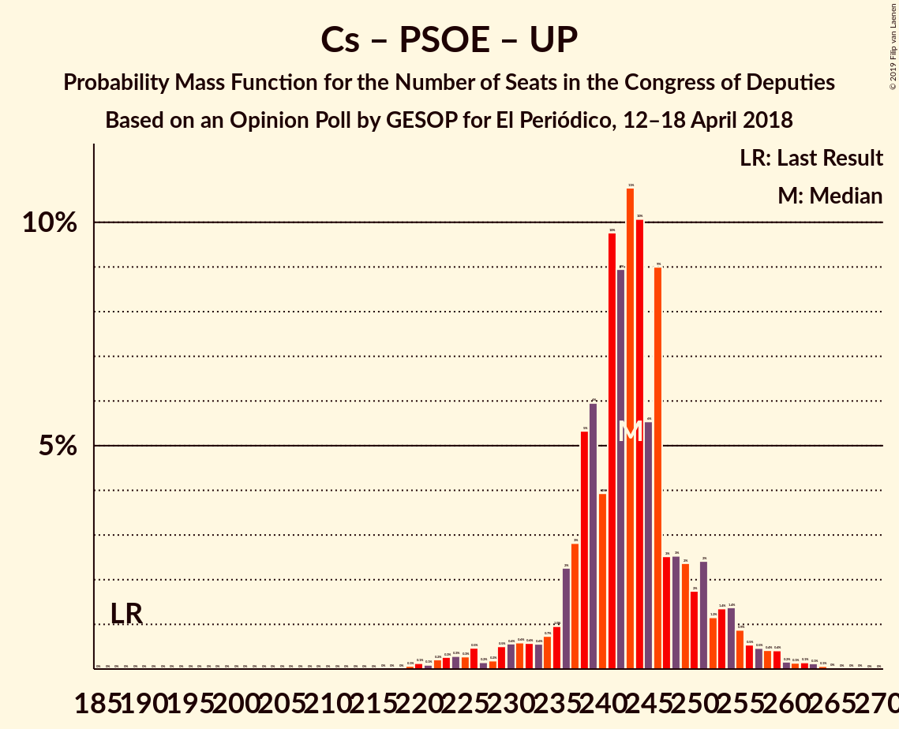
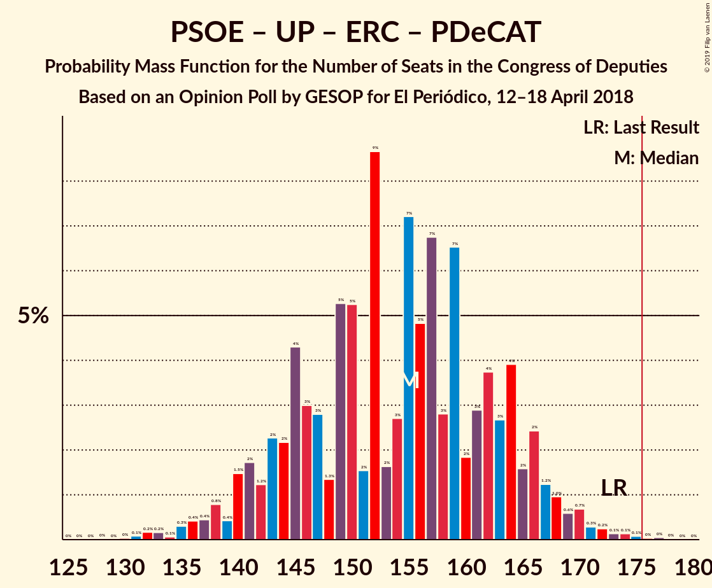

# Opinion Poll by GESOP for El Periódico, 12–18 April 2018

<a href="#voting-intentions">Voting Intentions</a> | <a href="#seats">Seats</a> | <a href="#coalitions">Coalitions</a> | <a href="#technical-information">Technical Information</a>

## Voting Intentions

### Confidence Intervals

| Party | Last Result | Poll Result | 80% Confidence Interval | 90% Confidence Interval | 95% Confidence Interval | 99% Confidence Interval |
|:-----:|:-----------:|:-----------:|:-----------------------:|:-----------------------:|:-----------------------:|:-----------------------:|
| Ciudadanos–Partido de la Ciudadanía | 13.1% | 28.5% | 26.7–30.4% |26.2–30.9% |25.8–31.4% |25.0–32.3% |
| Partido Popular | 33.0% | 21.0% | 19.4–22.7% |19.0–23.2% |18.6–23.6% |17.8–24.5% |
| Partido Socialista Obrero Español | 22.6% | 20.5% | 18.9–22.2% |18.5–22.7% |18.1–23.1% |17.4–24.0% |
| Unidos Podemos | 21.2% | 18.1% | 16.6–19.7% |16.2–20.2% |15.8–20.6% |15.2–21.4% |
| Esquerra Republicana de Catalunya–Catalunya Sí | 2.7% | 3.0% | 2.4–3.8% |2.2–4.1% |2.1–4.3% |1.9–4.7% |
| Partit Demòcrata Europeu Català | 2.0% | 2.0% | 1.5–2.7% |1.4–2.9% |1.3–3.1% |1.1–3.4% |

*Note:* The poll result column reflects the actual value used in the calculations. Published results may vary slightly, and in addition be rounded to fewer digits.

## Seats

### Confidence Intervals

| Party | Last Result | Median | 80% Confidence Interval | 90% Confidence Interval | 95% Confidence Interval | 99% Confidence Interval |
|:-----:|:-----------:|:------:|:-----------------------:|:-----------------------:|:-----------------------:|:-----------------------:|
| <a href="#ciudadanos–partido-de-la-ciudadanía">Ciudadanos–Partido de la Ciudadanía</a> | 32 | 101 | 101–108 |101–125 |101–125 |101–125 |
| <a href="#partido-popular">Partido Popular</a> | 137 | 83 | 74–83 |73–93 |73–93 |66–93 |
| <a href="#partido-socialista-obrero-español">Partido Socialista Obrero Español</a> | 85 | 88 | 71–88 |67–88 |67–88 |67–88 |
| <a href="#unidos-podemos">Unidos Podemos</a> | 71 | 52 | 52–60 |52–60 |52–60 |37–61 |
| <a href="#esquerra-republicana-de-catalunya–catalunya-sí">Esquerra Republicana de Catalunya–Catalunya Sí</a> | 9 | 11 | 11–15 |11–15 |11–15 |9–15 |
| <a href="#partit-demòcrata-europeu-català">Partit Demòcrata Europeu Català</a> | 8 | 6 | 6–7 |6–10 |6–10 |3–10 |

### Ciudadanos–Partido de la Ciudadanía

*For a full overview of the results for this party, see the [Ciudadanos–Partido de la Ciudadanía](party-ciudadanos–partidodelaciudadanía.html) page.*

| Number of Seats | Probability | Accumulated | Special Marks |
|:---------------:|:-----------:|:-----------:|:-------------:|
| 32 | 0% | 100% | Last Result |
| 33 | 0% | 100% |  |
| 34 | 0% | 100% |  |
| 35 | 0% | 100% |  |
| 36 | 0% | 100% |  |
| 37 | 0% | 100% |  |
| 38 | 0% | 100% |  |
| 39 | 0% | 100% |  |
| 40 | 0% | 100% |  |
| 41 | 0% | 100% |  |
| 42 | 0% | 100% |  |
| 43 | 0% | 100% |  |
| 44 | 0% | 100% |  |
| 45 | 0% | 100% |  |
| 46 | 0% | 100% |  |
| 47 | 0% | 100% |  |
| 48 | 0% | 100% |  |
| 49 | 0% | 100% |  |
| 50 | 0% | 100% |  |
| 51 | 0% | 100% |  |
| 52 | 0% | 100% |  |
| 53 | 0% | 100% |  |
| 54 | 0% | 100% |  |
| 55 | 0% | 100% |  |
| 56 | 0% | 100% |  |
| 57 | 0% | 100% |  |
| 58 | 0% | 100% |  |
| 59 | 0% | 100% |  |
| 60 | 0% | 100% |  |
| 61 | 0% | 100% |  |
| 62 | 0% | 100% |  |
| 63 | 0% | 100% |  |
| 64 | 0% | 100% |  |
| 65 | 0% | 100% |  |
| 66 | 0% | 100% |  |
| 67 | 0% | 100% |  |
| 68 | 0% | 100% |  |
| 69 | 0% | 100% |  |
| 70 | 0% | 100% |  |
| 71 | 0% | 100% |  |
| 72 | 0% | 100% |  |
| 73 | 0% | 100% |  |
| 74 | 0% | 100% |  |
| 75 | 0% | 100% |  |
| 76 | 0% | 100% |  |
| 77 | 0% | 100% |  |
| 78 | 0% | 100% |  |
| 79 | 0% | 100% |  |
| 80 | 0% | 100% |  |
| 81 | 0% | 100% |  |
| 82 | 0% | 100% |  |
| 83 | 0% | 100% |  |
| 84 | 0% | 100% |  |
| 85 | 0% | 100% |  |
| 86 | 0% | 100% |  |
| 87 | 0% | 100% |  |
| 88 | 0% | 100% |  |
| 89 | 0% | 100% |  |
| 90 | 0% | 100% |  |
| 91 | 0% | 100% |  |
| 92 | 0% | 100% |  |
| 93 | 0.2% | 100% |  |
| 94 | 0% | 99.8% |  |
| 95 | 0% | 99.8% |  |
| 96 | 0% | 99.8% |  |
| 97 | 0% | 99.8% |  |
| 98 | 0% | 99.8% |  |
| 99 | 0.2% | 99.8% |  |
| 100 | 0% | 99.6% |  |
| 101 | 71% | 99.6% | Median |
| 102 | 6% | 28% |  |
| 103 | 0% | 22% |  |
| 104 | 0% | 22% |  |
| 105 | 0% | 22% |  |
| 106 | 0.3% | 22% |  |
| 107 | 0% | 22% |  |
| 108 | 15% | 22% |  |
| 109 | 0% | 7% |  |
| 110 | 0% | 7% |  |
| 111 | 0% | 7% |  |
| 112 | 0% | 7% |  |
| 113 | 0% | 7% |  |
| 114 | 0% | 7% |  |
| 115 | 0% | 7% |  |
| 116 | 0.4% | 7% |  |
| 117 | 0% | 6% |  |
| 118 | 0% | 6% |  |
| 119 | 0.4% | 6% |  |
| 120 | 0.1% | 6% |  |
| 121 | 0% | 6% |  |
| 122 | 0% | 6% |  |
| 123 | 0% | 6% |  |
| 124 | 0% | 6% |  |
| 125 | 5% | 6% |  |
| 126 | 0.4% | 0.4% |  |
| 127 | 0% | 0% |  |

### Partido Popular

*For a full overview of the results for this party, see the [Partido Popular](party-partidopopular.html) page.*

| Number of Seats | Probability | Accumulated | Special Marks |
|:---------------:|:-----------:|:-----------:|:-------------:|
| 59 | 0% | 100% |  |
| 60 | 0% | 99.9% |  |
| 61 | 0.1% | 99.9% |  |
| 62 | 0% | 99.9% |  |
| 63 | 0% | 99.9% |  |
| 64 | 0% | 99.9% |  |
| 65 | 0.3% | 99.9% |  |
| 66 | 0.1% | 99.6% |  |
| 67 | 0% | 99.5% |  |
| 68 | 0% | 99.5% |  |
| 69 | 0% | 99.5% |  |
| 70 | 0% | 99.5% |  |
| 71 | 0% | 99.5% |  |
| 72 | 0% | 99.5% |  |
| 73 | 6% | 99.4% |  |
| 74 | 14% | 93% |  |
| 75 | 0% | 79% |  |
| 76 | 0% | 79% |  |
| 77 | 0% | 79% |  |
| 78 | 0% | 79% |  |
| 79 | 0.2% | 79% |  |
| 80 | 0% | 79% |  |
| 81 | 0.4% | 79% |  |
| 82 | 0% | 79% |  |
| 83 | 71% | 79% | Median |
| 84 | 0% | 7% |  |
| 85 | 0.4% | 7% |  |
| 86 | 0% | 7% |  |
| 87 | 0.3% | 7% |  |
| 88 | 0.2% | 7% |  |
| 89 | 0% | 6% |  |
| 90 | 0% | 6% |  |
| 91 | 0% | 6% |  |
| 92 | 0% | 6% |  |
| 93 | 6% | 6% |  |
| 94 | 0.2% | 0.5% |  |
| 95 | 0.1% | 0.3% |  |
| 96 | 0.2% | 0.2% |  |
| 97 | 0% | 0% |  |
| 98 | 0% | 0% |  |
| 99 | 0% | 0% |  |
| 100 | 0% | 0% |  |
| 101 | 0% | 0% |  |
| 102 | 0% | 0% |  |
| 103 | 0% | 0% |  |
| 104 | 0% | 0% |  |
| 105 | 0% | 0% |  |
| 106 | 0% | 0% |  |
| 107 | 0% | 0% |  |
| 108 | 0% | 0% |  |
| 109 | 0% | 0% |  |
| 110 | 0% | 0% |  |
| 111 | 0% | 0% |  |
| 112 | 0% | 0% |  |
| 113 | 0% | 0% |  |
| 114 | 0% | 0% |  |
| 115 | 0% | 0% |  |
| 116 | 0% | 0% |  |
| 117 | 0% | 0% |  |
| 118 | 0% | 0% |  |
| 119 | 0% | 0% |  |
| 120 | 0% | 0% |  |
| 121 | 0% | 0% |  |
| 122 | 0% | 0% |  |
| 123 | 0% | 0% |  |
| 124 | 0% | 0% |  |
| 125 | 0% | 0% |  |
| 126 | 0% | 0% |  |
| 127 | 0% | 0% |  |
| 128 | 0% | 0% |  |
| 129 | 0% | 0% |  |
| 130 | 0% | 0% |  |
| 131 | 0% | 0% |  |
| 132 | 0% | 0% |  |
| 133 | 0% | 0% |  |
| 134 | 0% | 0% |  |
| 135 | 0% | 0% |  |
| 136 | 0% | 0% |  |
| 137 | 0% | 0% | Last Result |

### Partido Socialista Obrero Español

*For a full overview of the results for this party, see the [Partido Socialista Obrero Español](party-partidosocialistaobreroespañol.html) page.*

| Number of Seats | Probability | Accumulated | Special Marks |
|:---------------:|:-----------:|:-----------:|:-------------:|
| 60 | 0.3% | 100% |  |
| 61 | 0% | 99.7% |  |
| 62 | 0% | 99.7% |  |
| 63 | 0% | 99.7% |  |
| 64 | 0% | 99.7% |  |
| 65 | 0% | 99.7% |  |
| 66 | 0% | 99.7% |  |
| 67 | 5% | 99.7% |  |
| 68 | 0.7% | 95% |  |
| 69 | 0% | 94% |  |
| 70 | 0% | 94% |  |
| 71 | 6% | 94% |  |
| 72 | 0% | 88% |  |
| 73 | 0% | 88% |  |
| 74 | 0% | 88% |  |
| 75 | 0% | 88% |  |
| 76 | 0% | 88% |  |
| 77 | 0.2% | 88% |  |
| 78 | 15% | 88% |  |
| 79 | 0% | 73% |  |
| 80 | 0.6% | 73% |  |
| 81 | 0% | 73% |  |
| 82 | 0% | 73% |  |
| 83 | 0% | 73% |  |
| 84 | 0% | 73% |  |
| 85 | 0% | 73% | Last Result |
| 86 | 0% | 73% |  |
| 87 | 0% | 73% |  |
| 88 | 72% | 73% | Median |
| 89 | 0% | 0.1% |  |
| 90 | 0% | 0.1% |  |
| 91 | 0% | 0% |  |

### Unidos Podemos

*For a full overview of the results for this party, see the [Unidos Podemos](party-unidospodemos.html) page.*

| Number of Seats | Probability | Accumulated | Special Marks |
|:---------------:|:-----------:|:-----------:|:-------------:|
| 37 | 0.7% | 100% |  |
| 38 | 0% | 99.3% |  |
| 39 | 0% | 99.3% |  |
| 40 | 0% | 99.3% |  |
| 41 | 0% | 99.3% |  |
| 42 | 0% | 99.3% |  |
| 43 | 0.2% | 99.3% |  |
| 44 | 0.1% | 99.1% |  |
| 45 | 0.3% | 99.0% |  |
| 46 | 0.1% | 98.7% |  |
| 47 | 0% | 98.6% |  |
| 48 | 0% | 98.6% |  |
| 49 | 0% | 98.6% |  |
| 50 | 0% | 98.6% |  |
| 51 | 0% | 98.6% |  |
| 52 | 77% | 98.6% | Median |
| 53 | 0.4% | 21% |  |
| 54 | 0% | 21% |  |
| 55 | 0% | 21% |  |
| 56 | 0% | 21% |  |
| 57 | 0.8% | 21% |  |
| 58 | 5% | 20% |  |
| 59 | 0% | 15% |  |
| 60 | 14% | 15% |  |
| 61 | 0.7% | 1.1% |  |
| 62 | 0% | 0.4% |  |
| 63 | 0.2% | 0.4% |  |
| 64 | 0% | 0.2% |  |
| 65 | 0% | 0.2% |  |
| 66 | 0% | 0.2% |  |
| 67 | 0% | 0.2% |  |
| 68 | 0.2% | 0.2% |  |
| 69 | 0% | 0% |  |
| 70 | 0% | 0% |  |
| 71 | 0% | 0% | Last Result |

### Esquerra Republicana de Catalunya–Catalunya Sí

*For a full overview of the results for this party, see the [Esquerra Republicana de Catalunya–Catalunya Sí](party-esquerrarepublicanadecatalunya–catalunyasí.html) page.*

| Number of Seats | Probability | Accumulated | Special Marks |
|:---------------:|:-----------:|:-----------:|:-------------:|
| 6 | 0.2% | 100% |  |
| 7 | 0% | 99.8% |  |
| 8 | 0% | 99.8% |  |
| 9 | 0.4% | 99.8% | Last Result |
| 10 | 0.4% | 99.4% |  |
| 11 | 77% | 98.9% | Median |
| 12 | 0.4% | 22% |  |
| 13 | 6% | 22% |  |
| 14 | 0.1% | 16% |  |
| 15 | 15% | 15% |  |
| 16 | 0% | 0% |  |

### Partit Demòcrata Europeu Català

*For a full overview of the results for this party, see the [Partit Demòcrata Europeu Català](party-partitdemòcrataeuropeucatalà.html) page.*

| Number of Seats | Probability | Accumulated | Special Marks |
|:---------------:|:-----------:|:-----------:|:-------------:|
| 1 | 0.2% | 100% |  |
| 2 | 0% | 99.8% |  |
| 3 | 0.4% | 99.8% |  |
| 4 | 0% | 99.4% |  |
| 5 | 0.4% | 99.4% |  |
| 6 | 86% | 99.0% | Median |
| 7 | 6% | 13% |  |
| 8 | 0.4% | 7% | Last Result |
| 9 | 0% | 6% |  |
| 10 | 6% | 6% |  |
| 11 | 0% | 0.2% |  |
| 12 | 0.2% | 0.2% |  |
| 13 | 0% | 0% |  |

## Coalitions

### Confidence Intervals

| Coalition | Last Result | Median | Majority? | 80% Confidence Interval | 90% Confidence Interval | 95% Confidence Interval | 99% Confidence Interval |
|:---------:|:-----------:|:------:|:---------:|:-----------------------:|:-----------------------:|:-----------------------:|:-----------------------:|
| Ciudadanos–Partido de la Ciudadanía – Partido Popular – Partido Socialista Obrero Español | 254 | 272 | 100% | 260–272 | 260–272 | 260–272 | 259–284 |
| Ciudadanos–Partido de la Ciudadanía – Partido Socialista Obrero Español – Unidos Podemos | 188 | 241 | 100% | 241–246 | 225–250 | 225–250 | 225–258 |
| Ciudadanos–Partido de la Ciudadanía – Partido Popular | 169 | 184 | 99.9% | 182–195 | 182–198 | 182–198 | 181–204 |
| Ciudadanos–Partido de la Ciudadanía – Partido Socialista Obrero Español | 117 | 189 | 94% | 186–189 | 173–192 | 173–192 | 173–202 |
| Partido Popular – Partido Socialista Obrero Español | 222 | 171 | 0% | 152–171 | 141–171 | 140–171 | 140–171 |
| Partido Socialista Obrero Español – Unidos Podemos – Esquerra Republicana de Catalunya–Catalunya Sí – Partit Demòcrata Europeu Català | 173 | 157 | 0% | 146–159 | 143–159 | 143–159 | 136–160 |
| Partido Socialista Obrero Español – Unidos Podemos | 156 | 140 | 0% | 125–140 | 123–140 | 123–140 | 117–141 |
| Partido Popular | 137 | 83 | 0% | 74–83 | 73–93 | 73–93 | 66–93 |
| Partido Socialista Obrero Español | 85 | 88 | 0% | 71–88 | 67–88 | 67–88 | 67–88 |

### Ciudadanos–Partido de la Ciudadanía – Partido Popular – Partido Socialista Obrero Español

| Number of Seats | Probability | Accumulated | Special Marks |
|:---------------:|:-----------:|:-----------:|:-------------:|
| 254 | 0% | 100% | Last Result |
| 255 | 0.2% | 100% |  |
| 256 | 0% | 99.8% |  |
| 257 | 0% | 99.8% |  |
| 258 | 0% | 99.8% |  |
| 259 | 0.6% | 99.8% |  |
| 260 | 14% | 99.2% |  |
| 261 | 0% | 85% |  |
| 262 | 0% | 85% |  |
| 263 | 0% | 85% |  |
| 264 | 0% | 85% |  |
| 265 | 5% | 85% |  |
| 266 | 6% | 80% |  |
| 267 | 0% | 73% |  |
| 268 | 0% | 73% |  |
| 269 | 0% | 73% |  |
| 270 | 0.2% | 73% |  |
| 271 | 0.4% | 73% |  |
| 272 | 71% | 73% | Median |
| 273 | 0% | 1.4% |  |
| 274 | 0% | 1.4% |  |
| 275 | 0.1% | 1.3% |  |
| 276 | 0% | 1.2% |  |
| 277 | 0% | 1.2% |  |
| 278 | 0% | 1.2% |  |
| 279 | 0.3% | 1.2% |  |
| 280 | 0.1% | 1.0% |  |
| 281 | 0.3% | 0.9% |  |
| 282 | 0% | 0.5% |  |
| 283 | 0% | 0.5% |  |
| 284 | 0.5% | 0.5% |  |
| 285 | 0% | 0% |  |

### Ciudadanos–Partido de la Ciudadanía – Partido Socialista Obrero Español – Unidos Podemos

| Number of Seats | Probability | Accumulated | Special Marks |
|:---------------:|:-----------:|:-----------:|:-------------:|
| 188 | 0% | 100% | Last Result |
| 189 | 0% | 100% |  |
| 190 | 0% | 100% |  |
| 191 | 0% | 100% |  |
| 192 | 0% | 100% |  |
| 193 | 0% | 100% |  |
| 194 | 0% | 100% |  |
| 195 | 0% | 100% |  |
| 196 | 0% | 100% |  |
| 197 | 0% | 100% |  |
| 198 | 0% | 100% |  |
| 199 | 0% | 100% |  |
| 200 | 0% | 100% |  |
| 201 | 0% | 100% |  |
| 202 | 0% | 100% |  |
| 203 | 0% | 100% |  |
| 204 | 0% | 100% |  |
| 205 | 0% | 100% |  |
| 206 | 0% | 100% |  |
| 207 | 0% | 100% |  |
| 208 | 0% | 100% |  |
| 209 | 0% | 100% |  |
| 210 | 0% | 100% |  |
| 211 | 0% | 100% |  |
| 212 | 0% | 100% |  |
| 213 | 0% | 100% |  |
| 214 | 0% | 100% |  |
| 215 | 0% | 100% |  |
| 216 | 0% | 100% |  |
| 217 | 0% | 100% |  |
| 218 | 0% | 100% |  |
| 219 | 0% | 100% |  |
| 220 | 0% | 100% |  |
| 221 | 0% | 100% |  |
| 222 | 0% | 100% |  |
| 223 | 0% | 100% |  |
| 224 | 0% | 100% |  |
| 225 | 6% | 100% |  |
| 226 | 0.1% | 94% |  |
| 227 | 0.2% | 94% |  |
| 228 | 0% | 94% |  |
| 229 | 0% | 94% |  |
| 230 | 0% | 94% |  |
| 231 | 0.3% | 94% |  |
| 232 | 0% | 94% |  |
| 233 | 0.1% | 94% |  |
| 234 | 0.1% | 93% |  |
| 235 | 0% | 93% |  |
| 236 | 0.4% | 93% |  |
| 237 | 0% | 93% |  |
| 238 | 0% | 93% |  |
| 239 | 0.2% | 93% |  |
| 240 | 0% | 93% |  |
| 241 | 71% | 93% | Median |
| 242 | 0% | 21% |  |
| 243 | 0.4% | 21% |  |
| 244 | 0.2% | 21% |  |
| 245 | 0% | 21% |  |
| 246 | 14% | 21% |  |
| 247 | 0.6% | 7% |  |
| 248 | 0% | 6% |  |
| 249 | 0% | 6% |  |
| 250 | 5% | 6% |  |
| 251 | 0% | 0.5% |  |
| 252 | 0% | 0.5% |  |
| 253 | 0% | 0.5% |  |
| 254 | 0% | 0.5% |  |
| 255 | 0% | 0.5% |  |
| 256 | 0% | 0.5% |  |
| 257 | 0% | 0.5% |  |
| 258 | 0.1% | 0.5% |  |
| 259 | 0.3% | 0.4% |  |
| 260 | 0% | 0.1% |  |
| 261 | 0% | 0.1% |  |
| 262 | 0% | 0.1% |  |
| 263 | 0% | 0.1% |  |
| 264 | 0% | 0.1% |  |
| 265 | 0% | 0% |  |

### Ciudadanos–Partido de la Ciudadanía – Partido Popular

| Number of Seats | Probability | Accumulated | Special Marks |
|:---------------:|:-----------:|:-----------:|:-------------:|
| 169 | 0% | 100% | Last Result |
| 170 | 0% | 99.9% |  |
| 171 | 0% | 99.9% |  |
| 172 | 0% | 99.9% |  |
| 173 | 0% | 99.9% |  |
| 174 | 0% | 99.9% |  |
| 175 | 0% | 99.9% |  |
| 176 | 0% | 99.9% | Majority |
| 177 | 0% | 99.9% |  |
| 178 | 0.2% | 99.9% |  |
| 179 | 0% | 99.7% |  |
| 180 | 0% | 99.7% |  |
| 181 | 0.6% | 99.7% |  |
| 182 | 14% | 99.0% |  |
| 183 | 0.4% | 85% |  |
| 184 | 71% | 84% | Median |
| 185 | 0% | 13% |  |
| 186 | 0% | 13% |  |
| 187 | 0% | 13% |  |
| 188 | 0% | 13% |  |
| 189 | 0.2% | 13% |  |
| 190 | 0% | 13% |  |
| 191 | 0.3% | 13% |  |
| 192 | 0.1% | 13% |  |
| 193 | 0.3% | 12% |  |
| 194 | 0% | 12% |  |
| 195 | 6% | 12% |  |
| 196 | 0% | 6% |  |
| 197 | 0% | 6% |  |
| 198 | 5% | 6% |  |
| 199 | 0% | 0.8% |  |
| 200 | 0% | 0.8% |  |
| 201 | 0% | 0.8% |  |
| 202 | 0% | 0.8% |  |
| 203 | 0% | 0.8% |  |
| 204 | 0.5% | 0.8% |  |
| 205 | 0% | 0.3% |  |
| 206 | 0% | 0.3% |  |
| 207 | 0% | 0.3% |  |
| 208 | 0% | 0.3% |  |
| 209 | 0% | 0.3% |  |
| 210 | 0.2% | 0.3% |  |
| 211 | 0% | 0.1% |  |
| 212 | 0% | 0.1% |  |
| 213 | 0% | 0.1% |  |
| 214 | 0% | 0.1% |  |
| 215 | 0.1% | 0.1% |  |
| 216 | 0% | 0% |  |

### Ciudadanos–Partido de la Ciudadanía – Partido Socialista Obrero Español

| Number of Seats | Probability | Accumulated | Special Marks |
|:---------------:|:-----------:|:-----------:|:-------------:|
| 117 | 0% | 100% | Last Result |
| 118 | 0% | 100% |  |
| 119 | 0% | 100% |  |
| 120 | 0% | 100% |  |
| 121 | 0% | 100% |  |
| 122 | 0% | 100% |  |
| 123 | 0% | 100% |  |
| 124 | 0% | 100% |  |
| 125 | 0% | 100% |  |
| 126 | 0% | 100% |  |
| 127 | 0% | 100% |  |
| 128 | 0% | 100% |  |
| 129 | 0% | 100% |  |
| 130 | 0% | 100% |  |
| 131 | 0% | 100% |  |
| 132 | 0% | 100% |  |
| 133 | 0% | 100% |  |
| 134 | 0% | 100% |  |
| 135 | 0% | 100% |  |
| 136 | 0% | 100% |  |
| 137 | 0% | 100% |  |
| 138 | 0% | 100% |  |
| 139 | 0% | 100% |  |
| 140 | 0% | 100% |  |
| 141 | 0% | 100% |  |
| 142 | 0% | 100% |  |
| 143 | 0% | 100% |  |
| 144 | 0% | 100% |  |
| 145 | 0% | 100% |  |
| 146 | 0% | 100% |  |
| 147 | 0% | 100% |  |
| 148 | 0% | 100% |  |
| 149 | 0% | 100% |  |
| 150 | 0% | 100% |  |
| 151 | 0% | 100% |  |
| 152 | 0% | 100% |  |
| 153 | 0% | 100% |  |
| 154 | 0% | 100% |  |
| 155 | 0% | 100% |  |
| 156 | 0% | 100% |  |
| 157 | 0% | 100% |  |
| 158 | 0% | 100% |  |
| 159 | 0% | 100% |  |
| 160 | 0% | 100% |  |
| 161 | 0% | 100% |  |
| 162 | 0% | 100% |  |
| 163 | 0% | 100% |  |
| 164 | 0.2% | 100% |  |
| 165 | 0% | 99.8% |  |
| 166 | 0% | 99.8% |  |
| 167 | 0% | 99.8% |  |
| 168 | 0% | 99.8% |  |
| 169 | 0% | 99.8% |  |
| 170 | 0% | 99.8% |  |
| 171 | 0% | 99.8% |  |
| 172 | 0% | 99.8% |  |
| 173 | 6% | 99.8% |  |
| 174 | 0% | 94% |  |
| 175 | 0% | 94% |  |
| 176 | 0.4% | 94% | Majority |
| 177 | 0% | 94% |  |
| 178 | 0% | 94% |  |
| 179 | 0% | 94% |  |
| 180 | 0.1% | 94% |  |
| 181 | 0% | 93% |  |
| 182 | 0% | 93% |  |
| 183 | 0% | 93% |  |
| 184 | 0% | 93% |  |
| 185 | 0% | 93% |  |
| 186 | 15% | 93% |  |
| 187 | 0% | 79% |  |
| 188 | 0% | 79% |  |
| 189 | 71% | 79% | Median |
| 190 | 0.4% | 7% |  |
| 191 | 0% | 7% |  |
| 192 | 5% | 7% |  |
| 193 | 0.6% | 2% |  |
| 194 | 0.3% | 1.4% |  |
| 195 | 0% | 1.1% |  |
| 196 | 0.2% | 1.1% |  |
| 197 | 0% | 0.9% |  |
| 198 | 0% | 0.9% |  |
| 199 | 0.4% | 0.9% |  |
| 200 | 0% | 0.5% |  |
| 201 | 0% | 0.5% |  |
| 202 | 0% | 0.5% |  |
| 203 | 0% | 0.5% |  |
| 204 | 0% | 0.5% |  |
| 205 | 0% | 0.4% |  |
| 206 | 0% | 0.4% |  |
| 207 | 0% | 0.4% |  |
| 208 | 0% | 0.4% |  |
| 209 | 0% | 0.4% |  |
| 210 | 0% | 0.4% |  |
| 211 | 0% | 0.4% |  |
| 212 | 0% | 0.4% |  |
| 213 | 0% | 0.4% |  |
| 214 | 0.4% | 0.4% |  |
| 215 | 0% | 0% |  |

### Partido Popular – Partido Socialista Obrero Español

| Number of Seats | Probability | Accumulated | Special Marks |
|:---------------:|:-----------:|:-----------:|:-------------:|
| 140 | 5% | 100% |  |
| 141 | 0.6% | 95% |  |
| 142 | 0% | 95% |  |
| 143 | 0% | 95% |  |
| 144 | 0% | 95% |  |
| 145 | 0% | 95% |  |
| 146 | 0% | 95% |  |
| 147 | 0% | 95% |  |
| 148 | 0% | 94% |  |
| 149 | 0% | 94% |  |
| 150 | 0% | 94% |  |
| 151 | 0.7% | 94% |  |
| 152 | 14% | 94% |  |
| 153 | 0.3% | 79% |  |
| 154 | 0.3% | 79% |  |
| 155 | 0.1% | 79% |  |
| 156 | 0.2% | 79% |  |
| 157 | 0% | 79% |  |
| 158 | 0% | 79% |  |
| 159 | 0% | 79% |  |
| 160 | 0% | 79% |  |
| 161 | 0% | 79% |  |
| 162 | 0% | 79% |  |
| 163 | 0% | 79% |  |
| 164 | 6% | 79% |  |
| 165 | 0.4% | 73% |  |
| 166 | 0% | 72% |  |
| 167 | 0.2% | 72% |  |
| 168 | 0.2% | 72% |  |
| 169 | 0.4% | 72% |  |
| 170 | 0% | 72% |  |
| 171 | 71% | 72% | Median |
| 172 | 0% | 0.3% |  |
| 173 | 0% | 0.3% |  |
| 174 | 0% | 0.3% |  |
| 175 | 0.3% | 0.3% |  |
| 176 | 0% | 0% | Majority |
| 177 | 0% | 0% |  |
| 178 | 0% | 0% |  |
| 179 | 0% | 0% |  |
| 180 | 0% | 0% |  |
| 181 | 0% | 0% |  |
| 182 | 0% | 0% |  |
| 183 | 0% | 0% |  |
| 184 | 0% | 0% |  |
| 185 | 0% | 0% |  |
| 186 | 0% | 0% |  |
| 187 | 0% | 0% |  |
| 188 | 0% | 0% |  |
| 189 | 0% | 0% |  |
| 190 | 0% | 0% |  |
| 191 | 0% | 0% |  |
| 192 | 0% | 0% |  |
| 193 | 0% | 0% |  |
| 194 | 0% | 0% |  |
| 195 | 0% | 0% |  |
| 196 | 0% | 0% |  |
| 197 | 0% | 0% |  |
| 198 | 0% | 0% |  |
| 199 | 0% | 0% |  |
| 200 | 0% | 0% |  |
| 201 | 0% | 0% |  |
| 202 | 0% | 0% |  |
| 203 | 0% | 0% |  |
| 204 | 0% | 0% |  |
| 205 | 0% | 0% |  |
| 206 | 0% | 0% |  |
| 207 | 0% | 0% |  |
| 208 | 0% | 0% |  |
| 209 | 0% | 0% |  |
| 210 | 0% | 0% |  |
| 211 | 0% | 0% |  |
| 212 | 0% | 0% |  |
| 213 | 0% | 0% |  |
| 214 | 0% | 0% |  |
| 215 | 0% | 0% |  |
| 216 | 0% | 0% |  |
| 217 | 0% | 0% |  |
| 218 | 0% | 0% |  |
| 219 | 0% | 0% |  |
| 220 | 0% | 0% |  |
| 221 | 0% | 0% |  |
| 222 | 0% | 0% | Last Result |

### Partido Socialista Obrero Español – Unidos Podemos – Esquerra Republicana de Catalunya–Catalunya Sí – Partit Demòcrata Europeu Català

| Number of Seats | Probability | Accumulated | Special Marks |
|:---------------:|:-----------:|:-----------:|:-------------:|
| 126 | 0.1% | 100% |  |
| 127 | 0% | 99.9% |  |
| 128 | 0% | 99.9% |  |
| 129 | 0% | 99.9% |  |
| 130 | 0% | 99.9% |  |
| 131 | 0.2% | 99.9% |  |
| 132 | 0% | 99.7% |  |
| 133 | 0% | 99.7% |  |
| 134 | 0% | 99.7% |  |
| 135 | 0% | 99.7% |  |
| 136 | 0.4% | 99.7% |  |
| 137 | 0.2% | 99.3% |  |
| 138 | 0% | 99.2% |  |
| 139 | 0% | 99.2% |  |
| 140 | 0% | 99.2% |  |
| 141 | 0% | 99.2% |  |
| 142 | 0% | 99.2% |  |
| 143 | 5% | 99.2% |  |
| 144 | 0% | 94% |  |
| 145 | 0% | 94% |  |
| 146 | 6% | 94% |  |
| 147 | 0% | 88% |  |
| 148 | 0.3% | 88% |  |
| 149 | 0.1% | 88% |  |
| 150 | 0.3% | 87% |  |
| 151 | 0% | 87% |  |
| 152 | 0.2% | 87% |  |
| 153 | 0% | 87% |  |
| 154 | 0% | 87% |  |
| 155 | 0% | 87% |  |
| 156 | 0% | 87% |  |
| 157 | 71% | 87% | Median |
| 158 | 0.4% | 16% |  |
| 159 | 14% | 15% |  |
| 160 | 0.6% | 1.0% |  |
| 161 | 0% | 0.3% |  |
| 162 | 0% | 0.3% |  |
| 163 | 0.2% | 0.3% |  |
| 164 | 0% | 0.1% |  |
| 165 | 0% | 0.1% |  |
| 166 | 0% | 0.1% |  |
| 167 | 0% | 0.1% |  |
| 168 | 0% | 0.1% |  |
| 169 | 0% | 0.1% |  |
| 170 | 0% | 0.1% |  |
| 171 | 0% | 0.1% |  |
| 172 | 0% | 0.1% |  |
| 173 | 0% | 0% | Last Result |

### Partido Socialista Obrero Español – Unidos Podemos

| Number of Seats | Probability | Accumulated | Special Marks |
|:---------------:|:-----------:|:-----------:|:-------------:|
| 106 | 0.1% | 100% |  |
| 107 | 0% | 99.9% |  |
| 108 | 0% | 99.9% |  |
| 109 | 0% | 99.9% |  |
| 110 | 0% | 99.9% |  |
| 111 | 0% | 99.9% |  |
| 112 | 0% | 99.9% |  |
| 113 | 0% | 99.9% |  |
| 114 | 0% | 99.9% |  |
| 115 | 0% | 99.9% |  |
| 116 | 0% | 99.9% |  |
| 117 | 0.5% | 99.9% |  |
| 118 | 0.1% | 99.4% |  |
| 119 | 0% | 99.3% |  |
| 120 | 0% | 99.3% |  |
| 121 | 0% | 99.3% |  |
| 122 | 0% | 99.3% |  |
| 123 | 6% | 99.3% |  |
| 124 | 0% | 93% |  |
| 125 | 6% | 93% |  |
| 126 | 0% | 88% |  |
| 127 | 0% | 88% |  |
| 128 | 0% | 88% |  |
| 129 | 0% | 88% |  |
| 130 | 0% | 88% |  |
| 131 | 0% | 88% |  |
| 132 | 0.1% | 88% |  |
| 133 | 0.3% | 87% |  |
| 134 | 0.2% | 87% |  |
| 135 | 0% | 87% |  |
| 136 | 0% | 87% |  |
| 137 | 0% | 87% |  |
| 138 | 14% | 87% |  |
| 139 | 0.6% | 73% |  |
| 140 | 71% | 72% | Median |
| 141 | 0.4% | 0.7% |  |
| 142 | 0% | 0.3% |  |
| 143 | 0% | 0.3% |  |
| 144 | 0% | 0.3% |  |
| 145 | 0.2% | 0.3% |  |
| 146 | 0% | 0.1% |  |
| 147 | 0% | 0.1% |  |
| 148 | 0% | 0.1% |  |
| 149 | 0% | 0.1% |  |
| 150 | 0% | 0.1% |  |
| 151 | 0% | 0.1% |  |
| 152 | 0% | 0.1% |  |
| 153 | 0% | 0.1% |  |
| 154 | 0% | 0% |  |
| 155 | 0% | 0% |  |
| 156 | 0% | 0% | Last Result |

### Partido Popular

| Number of Seats | Probability | Accumulated | Special Marks |
|:---------------:|:-----------:|:-----------:|:-------------:|
| 59 | 0% | 100% |  |
| 60 | 0% | 99.9% |  |
| 61 | 0.1% | 99.9% |  |
| 62 | 0% | 99.9% |  |
| 63 | 0% | 99.9% |  |
| 64 | 0% | 99.9% |  |
| 65 | 0.3% | 99.9% |  |
| 66 | 0.1% | 99.6% |  |
| 67 | 0% | 99.5% |  |
| 68 | 0% | 99.5% |  |
| 69 | 0% | 99.5% |  |
| 70 | 0% | 99.5% |  |
| 71 | 0% | 99.5% |  |
| 72 | 0% | 99.5% |  |
| 73 | 6% | 99.4% |  |
| 74 | 14% | 93% |  |
| 75 | 0% | 79% |  |
| 76 | 0% | 79% |  |
| 77 | 0% | 79% |  |
| 78 | 0% | 79% |  |
| 79 | 0.2% | 79% |  |
| 80 | 0% | 79% |  |
| 81 | 0.4% | 79% |  |
| 82 | 0% | 79% |  |
| 83 | 71% | 79% | Median |
| 84 | 0% | 7% |  |
| 85 | 0.4% | 7% |  |
| 86 | 0% | 7% |  |
| 87 | 0.3% | 7% |  |
| 88 | 0.2% | 7% |  |
| 89 | 0% | 6% |  |
| 90 | 0% | 6% |  |
| 91 | 0% | 6% |  |
| 92 | 0% | 6% |  |
| 93 | 6% | 6% |  |
| 94 | 0.2% | 0.5% |  |
| 95 | 0.1% | 0.3% |  |
| 96 | 0.2% | 0.2% |  |
| 97 | 0% | 0% |  |
| 98 | 0% | 0% |  |
| 99 | 0% | 0% |  |
| 100 | 0% | 0% |  |
| 101 | 0% | 0% |  |
| 102 | 0% | 0% |  |
| 103 | 0% | 0% |  |
| 104 | 0% | 0% |  |
| 105 | 0% | 0% |  |
| 106 | 0% | 0% |  |
| 107 | 0% | 0% |  |
| 108 | 0% | 0% |  |
| 109 | 0% | 0% |  |
| 110 | 0% | 0% |  |
| 111 | 0% | 0% |  |
| 112 | 0% | 0% |  |
| 113 | 0% | 0% |  |
| 114 | 0% | 0% |  |
| 115 | 0% | 0% |  |
| 116 | 0% | 0% |  |
| 117 | 0% | 0% |  |
| 118 | 0% | 0% |  |
| 119 | 0% | 0% |  |
| 120 | 0% | 0% |  |
| 121 | 0% | 0% |  |
| 122 | 0% | 0% |  |
| 123 | 0% | 0% |  |
| 124 | 0% | 0% |  |
| 125 | 0% | 0% |  |
| 126 | 0% | 0% |  |
| 127 | 0% | 0% |  |
| 128 | 0% | 0% |  |
| 129 | 0% | 0% |  |
| 130 | 0% | 0% |  |
| 131 | 0% | 0% |  |
| 132 | 0% | 0% |  |
| 133 | 0% | 0% |  |
| 134 | 0% | 0% |  |
| 135 | 0% | 0% |  |
| 136 | 0% | 0% |  |
| 137 | 0% | 0% | Last Result |

### Partido Socialista Obrero Español

| Number of Seats | Probability | Accumulated | Special Marks |
|:---------------:|:-----------:|:-----------:|:-------------:|
| 60 | 0.3% | 100% |  |
| 61 | 0% | 99.7% |  |
| 62 | 0% | 99.7% |  |
| 63 | 0% | 99.7% |  |
| 64 | 0% | 99.7% |  |
| 65 | 0% | 99.7% |  |
| 66 | 0% | 99.7% |  |
| 67 | 5% | 99.7% |  |
| 68 | 0.7% | 95% |  |
| 69 | 0% | 94% |  |
| 70 | 0% | 94% |  |
| 71 | 6% | 94% |  |
| 72 | 0% | 88% |  |
| 73 | 0% | 88% |  |
| 74 | 0% | 88% |  |
| 75 | 0% | 88% |  |
| 76 | 0% | 88% |  |
| 77 | 0.2% | 88% |  |
| 78 | 15% | 88% |  |
| 79 | 0% | 73% |  |
| 80 | 0.6% | 73% |  |
| 81 | 0% | 73% |  |
| 82 | 0% | 73% |  |
| 83 | 0% | 73% |  |
| 84 | 0% | 73% |  |
| 85 | 0% | 73% | Last Result |
| 86 | 0% | 73% |  |
| 87 | 0% | 73% |  |
| 88 | 72% | 73% | Median |
| 89 | 0% | 0.1% |  |
| 90 | 0% | 0.1% |  |
| 91 | 0% | 0% |  |

## Technical Information

### Opinion Poll

+ **Polling firm:** GESOP
+ **Commissioner(s):** El Periódico
+ **Fieldwork period:** 12–18 April 2018

### Calculations

+ **Sample size:** 1000
+ **Simulations done:** 1,024
+ **Error estimate:** 3.03%

