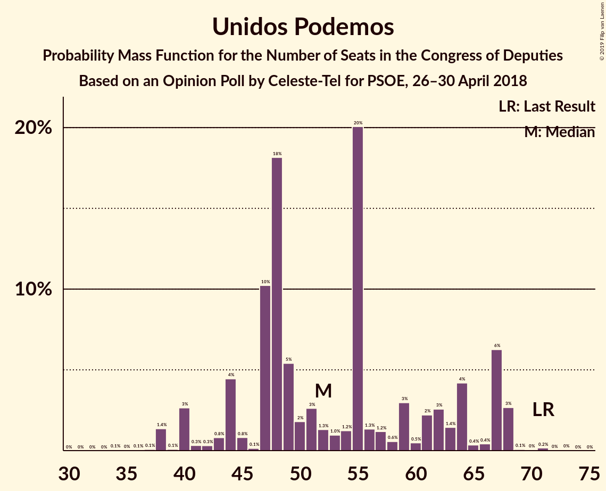
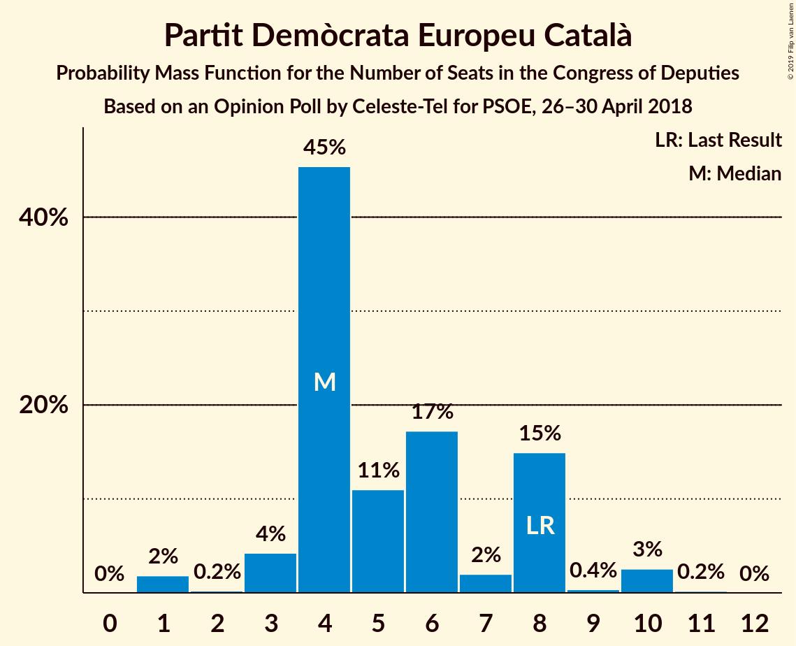
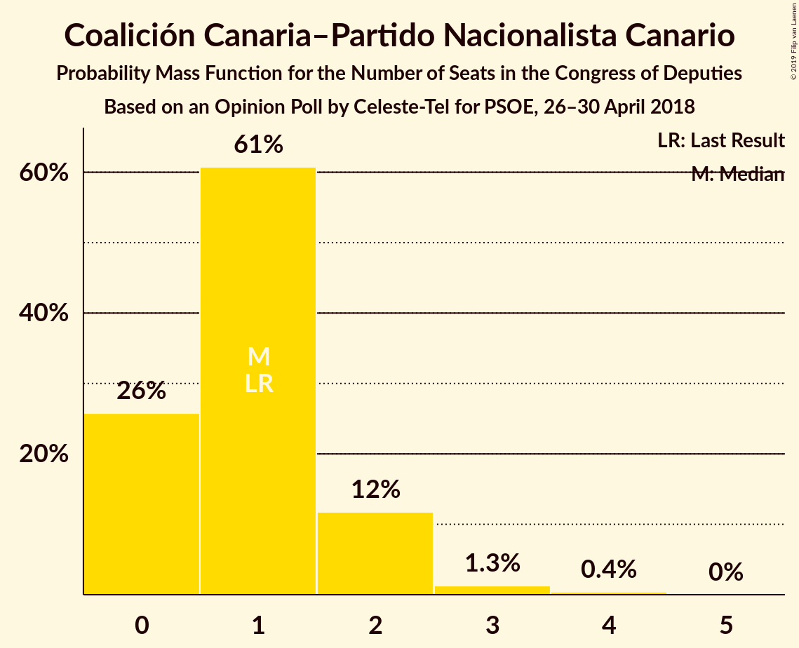
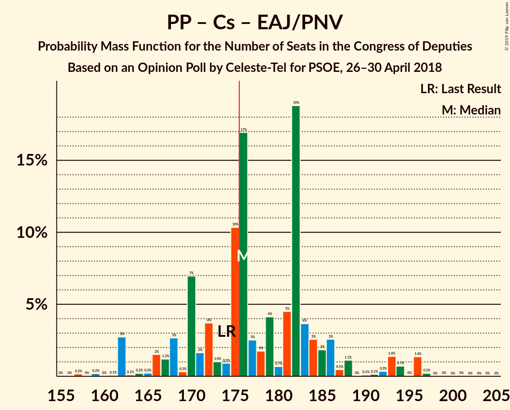
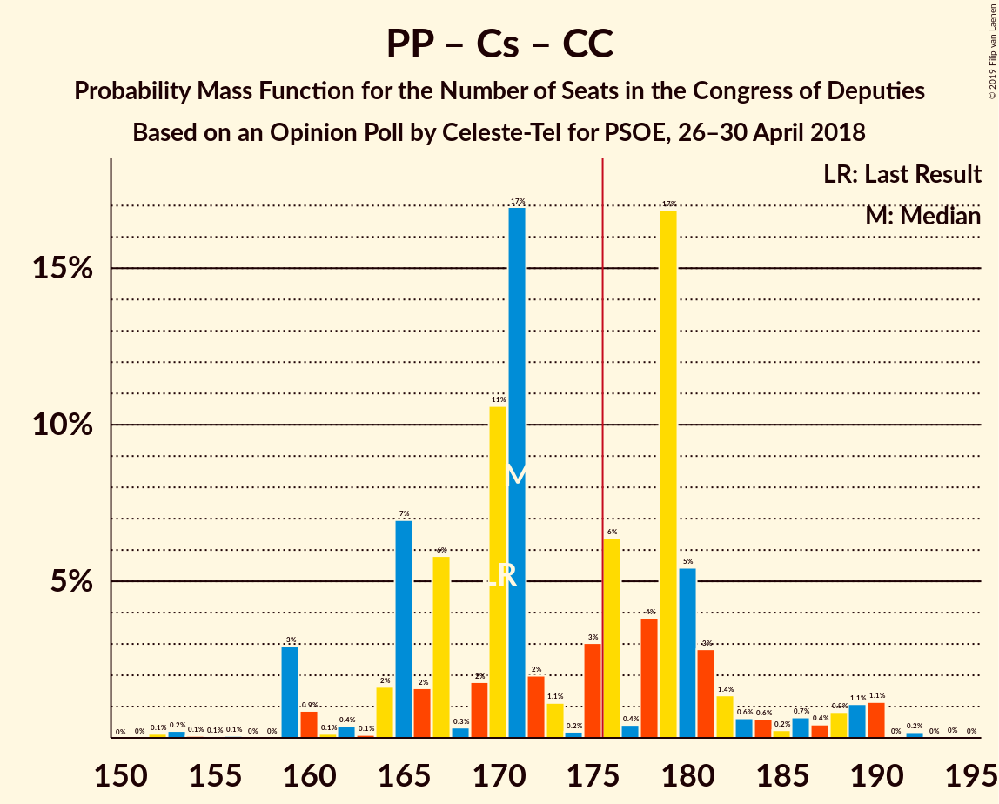
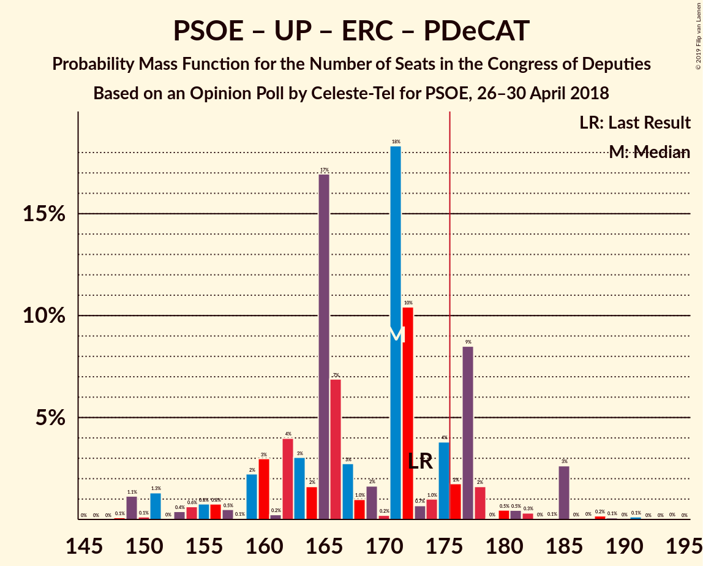

# Opinion Poll by Celeste-Tel for PSOE, 26–30 April 2018

<a href="#voting-intentions">Voting Intentions</a> | <a href="#seats">Seats</a> | <a href="#coalitions">Coalitions</a> | <a href="#technical-information">Technical Information</a>

## Voting Intentions

### Confidence Intervals

| Party | Last Result | Poll Result | 80% Confidence Interval | 90% Confidence Interval | 95% Confidence Interval | 99% Confidence Interval |
|:-----:|:-----------:|:-----------:|:-----------------------:|:-----------------------:|:-----------------------:|:-----------------------:|
| Partido Popular | 33.0% | 26.0% | 24.3–27.8% |23.8–28.4% |23.4–28.8% |22.6–29.7% |
| Partido Socialista Obrero Español | 22.6% | 24.9% | 23.2–26.7% |22.7–27.2% |22.3–27.7% |21.5–28.6% |
| Ciudadanos–Partido de la Ciudadanía | 13.1% | 19.7% | 18.2–21.4% |17.7–21.9% |17.3–22.3% |16.6–23.1% |
| Unidos Podemos | 21.2% | 17.7% | 16.2–19.3% |15.8–19.8% |15.5–20.2% |14.8–21.0% |
| Esquerra Republicana de Catalunya–Catalunya Sí | 2.7% | 3.6% | 2.9–4.5% |2.8–4.7% |2.6–5.0% |2.3–5.4% |
| Partit Demòcrata Europeu Català | 2.0% | 1.5% | 1.1–2.1% |1.0–2.3% |0.9–2.5% |0.7–2.8% |
| Euzko Alderdi Jeltzalea/Partido Nacionalista Vasco | 1.2% | 1.2% | 0.9–1.8% |0.8–1.9% |0.7–2.1% |0.5–2.4% |
| Euskal Herria Bildu | 0.8% | 0.8% | 0.5–1.3% |0.5–1.4% |0.4–1.6% |0.3–1.9% |
| Coalición Canaria–Partido Nacionalista Canario | 0.3% | 0.3% | 0.2–0.7% |0.1–0.8% |0.1–0.9% |0.1–1.1% |

*Note:* The poll result column reflects the actual value used in the calculations. Published results may vary slightly, and in addition be rounded to fewer digits.

## Seats

### Confidence Intervals

| Party | Last Result | Median | 80% Confidence Interval | 90% Confidence Interval | 95% Confidence Interval | 99% Confidence Interval |
|:-----:|:-----------:|:------:|:-----------------------:|:-----------------------:|:-----------------------:|:-----------------------:|
| <a href="#partido-popular">Partido Popular</a> | 137 | 106 | 99–116 |99–117 |96–120 |91–122 |
| <a href="#partido-socialista-obrero-español">Partido Socialista Obrero Español</a> | 85 | 93 | 91–101 |90–107 |87–107 |83–111 |
| <a href="#ciudadanos–partido-de-la-ciudadanía">Ciudadanos–Partido de la Ciudadanía</a> | 32 | 65 | 63–70 |61–70 |58–72 |57–77 |
| <a href="#unidos-podemos">Unidos Podemos</a> | 71 | 55 | 44–65 |44–67 |40–67 |38–67 |
| <a href="#esquerra-republicana-de-catalunya–catalunya-sí">Esquerra Republicana de Catalunya–Catalunya Sí</a> | 9 | 15 | 11–18 |10–18 |9–18 |9–20 |
| <a href="#partit-demòcrata-europeu-català">Partit Demòcrata Europeu Català</a> | 8 | 4 | 4–6 |4–8 |1–8 |1–9 |
| <a href="#euzko-alderdi-jeltzalea/partido-nacionalista-vasco">Euzko Alderdi Jeltzalea/Partido Nacionalista Vasco</a> | 5 | 6 | 3–6 |3–7 |3–7 |2–8 |
| <a href="#euskal-herria-bildu">Euskal Herria Bildu</a> | 2 | 3 | 2–4 |2–5 |1–6 |0–7 |
| <a href="#coalición-canaria–partido-nacionalista-canario">Coalición Canaria–Partido Nacionalista Canario</a> | 1 | 1 | 0–2 |0–2 |0–2 |0–3 |

### Partido Popular

*For a full overview of the results for this party, see the [Partido Popular](party-partidopopular.html) page.*

| Number of Seats | Probability | Accumulated | Special Marks |
|:---------------:|:-----------:|:-----------:|:-------------:|
| 85 | 0% | 100% |  |
| 86 | 0.2% | 99.9% |  |
| 87 | 0% | 99.8% |  |
| 88 | 0.1% | 99.8% |  |
| 89 | 0% | 99.7% |  |
| 90 | 0.1% | 99.7% |  |
| 91 | 0.5% | 99.6% |  |
| 92 | 0.1% | 99.2% |  |
| 93 | 0% | 99.1% |  |
| 94 | 0.1% | 99.1% |  |
| 95 | 0.2% | 99.0% |  |
| 96 | 1.3% | 98.8% |  |
| 97 | 0.5% | 97% |  |
| 98 | 0.6% | 97% |  |
| 99 | 12% | 96% |  |
| 100 | 26% | 84% |  |
| 101 | 0.2% | 58% |  |
| 102 | 2% | 58% |  |
| 103 | 0.5% | 56% |  |
| 104 | 0.4% | 55% |  |
| 105 | 0.1% | 55% |  |
| 106 | 7% | 55% | Median |
| 107 | 3% | 48% |  |
| 108 | 0.3% | 45% |  |
| 109 | 2% | 45% |  |
| 110 | 0.8% | 43% |  |
| 111 | 1.1% | 42% |  |
| 112 | 4% | 41% |  |
| 113 | 0.4% | 37% |  |
| 114 | 0.3% | 36% |  |
| 115 | 0.4% | 36% |  |
| 116 | 26% | 35% |  |
| 117 | 5% | 9% |  |
| 118 | 0.2% | 4% |  |
| 119 | 1.0% | 4% |  |
| 120 | 2% | 3% |  |
| 121 | 0% | 1.0% |  |
| 122 | 0.7% | 1.0% |  |
| 123 | 0% | 0.4% |  |
| 124 | 0.1% | 0.3% |  |
| 125 | 0% | 0.3% |  |
| 126 | 0.3% | 0.3% |  |
| 127 | 0% | 0% |  |
| 128 | 0% | 0% |  |
| 129 | 0% | 0% |  |
| 130 | 0% | 0% |  |
| 131 | 0% | 0% |  |
| 132 | 0% | 0% |  |
| 133 | 0% | 0% |  |
| 134 | 0% | 0% |  |
| 135 | 0% | 0% |  |
| 136 | 0% | 0% |  |
| 137 | 0% | 0% | Last Result |

### Partido Socialista Obrero Español

*For a full overview of the results for this party, see the [Partido Socialista Obrero Español](party-partidosocialistaobreroespañol.html) page.*

| Number of Seats | Probability | Accumulated | Special Marks |
|:---------------:|:-----------:|:-----------:|:-------------:|
| 77 | 0.2% | 100% |  |
| 78 | 0% | 99.8% |  |
| 79 | 0% | 99.8% |  |
| 80 | 0% | 99.8% |  |
| 81 | 0% | 99.8% |  |
| 82 | 0.1% | 99.8% |  |
| 83 | 0.2% | 99.7% |  |
| 84 | 0% | 99.4% |  |
| 85 | 2% | 99.4% | Last Result |
| 86 | 0.2% | 98% |  |
| 87 | 1.2% | 98% |  |
| 88 | 0.6% | 96% |  |
| 89 | 0.2% | 96% |  |
| 90 | 4% | 96% |  |
| 91 | 38% | 92% |  |
| 92 | 3% | 54% |  |
| 93 | 8% | 51% | Median |
| 94 | 0.4% | 43% |  |
| 95 | 3% | 42% |  |
| 96 | 3% | 40% |  |
| 97 | 1.4% | 36% |  |
| 98 | 0.2% | 35% |  |
| 99 | 0.2% | 34% |  |
| 100 | 0% | 34% |  |
| 101 | 25% | 34% |  |
| 102 | 0.3% | 9% |  |
| 103 | 0.1% | 9% |  |
| 104 | 0.1% | 9% |  |
| 105 | 0.1% | 9% |  |
| 106 | 0.2% | 8% |  |
| 107 | 7% | 8% |  |
| 108 | 0% | 2% |  |
| 109 | 0.7% | 2% |  |
| 110 | 0.1% | 1.0% |  |
| 111 | 0.6% | 0.9% |  |
| 112 | 0% | 0.3% |  |
| 113 | 0.2% | 0.3% |  |
| 114 | 0% | 0.1% |  |
| 115 | 0% | 0.1% |  |
| 116 | 0% | 0.1% |  |
| 117 | 0% | 0.1% |  |
| 118 | 0% | 0% |  |

### Ciudadanos–Partido de la Ciudadanía

*For a full overview of the results for this party, see the [Ciudadanos–Partido de la Ciudadanía](party-ciudadanos–partidodelaciudadanía.html) page.*

| Number of Seats | Probability | Accumulated | Special Marks |
|:---------------:|:-----------:|:-----------:|:-------------:|
| 32 | 0% | 100% | Last Result |
| 33 | 0% | 100% |  |
| 34 | 0% | 100% |  |
| 35 | 0% | 100% |  |
| 36 | 0% | 100% |  |
| 37 | 0% | 100% |  |
| 38 | 0% | 100% |  |
| 39 | 0% | 100% |  |
| 40 | 0% | 100% |  |
| 41 | 0% | 100% |  |
| 42 | 0% | 100% |  |
| 43 | 0% | 100% |  |
| 44 | 0% | 100% |  |
| 45 | 0% | 100% |  |
| 46 | 0% | 100% |  |
| 47 | 0% | 100% |  |
| 48 | 0% | 100% |  |
| 49 | 0% | 99.9% |  |
| 50 | 0% | 99.9% |  |
| 51 | 0.1% | 99.9% |  |
| 52 | 0% | 99.8% |  |
| 53 | 0% | 99.8% |  |
| 54 | 0% | 99.8% |  |
| 55 | 0% | 99.7% |  |
| 56 | 0.1% | 99.7% |  |
| 57 | 0.9% | 99.6% |  |
| 58 | 1.4% | 98.7% |  |
| 59 | 0.6% | 97% |  |
| 60 | 0.2% | 97% |  |
| 61 | 5% | 97% |  |
| 62 | 0.2% | 92% |  |
| 63 | 28% | 92% |  |
| 64 | 0.2% | 64% |  |
| 65 | 16% | 64% | Median |
| 66 | 3% | 48% |  |
| 67 | 0.9% | 45% |  |
| 68 | 5% | 44% |  |
| 69 | 8% | 39% |  |
| 70 | 26% | 30% |  |
| 71 | 1.2% | 4% |  |
| 72 | 1.2% | 3% |  |
| 73 | 0.3% | 2% |  |
| 74 | 0.1% | 1.4% |  |
| 75 | 0.3% | 1.3% |  |
| 76 | 0.1% | 1.0% |  |
| 77 | 0.7% | 0.9% |  |
| 78 | 0% | 0.2% |  |
| 79 | 0% | 0.2% |  |
| 80 | 0% | 0.2% |  |
| 81 | 0% | 0.1% |  |
| 82 | 0% | 0.1% |  |
| 83 | 0% | 0.1% |  |
| 84 | 0% | 0.1% |  |
| 85 | 0% | 0% |  |

### Unidos Podemos

*For a full overview of the results for this party, see the [Unidos Podemos](party-unidospodemos.html) page.*

| Number of Seats | Probability | Accumulated | Special Marks |
|:---------------:|:-----------:|:-----------:|:-------------:|
| 37 | 0.1% | 100% |  |
| 38 | 2% | 99.9% |  |
| 39 | 0.1% | 98% |  |
| 40 | 1.4% | 98% |  |
| 41 | 0.3% | 96% |  |
| 42 | 0.1% | 96% |  |
| 43 | 0.6% | 96% |  |
| 44 | 7% | 95% |  |
| 45 | 0% | 89% |  |
| 46 | 0.1% | 89% |  |
| 47 | 1.1% | 89% |  |
| 48 | 29% | 88% |  |
| 49 | 3% | 59% |  |
| 50 | 0.7% | 56% |  |
| 51 | 1.2% | 55% |  |
| 52 | 2% | 54% |  |
| 53 | 0.2% | 52% |  |
| 54 | 1.3% | 52% |  |
| 55 | 27% | 50% | Median |
| 56 | 1.0% | 24% |  |
| 57 | 0.2% | 23% |  |
| 58 | 0.3% | 22% |  |
| 59 | 0.8% | 22% |  |
| 60 | 0.6% | 21% |  |
| 61 | 3% | 21% |  |
| 62 | 4% | 18% |  |
| 63 | 2% | 14% |  |
| 64 | 1.2% | 11% |  |
| 65 | 0.3% | 10% |  |
| 66 | 0% | 10% |  |
| 67 | 9% | 10% |  |
| 68 | 0% | 0.3% |  |
| 69 | 0.1% | 0.3% |  |
| 70 | 0.1% | 0.2% |  |
| 71 | 0% | 0.1% | Last Result |
| 72 | 0% | 0.1% |  |
| 73 | 0.1% | 0.1% |  |
| 74 | 0% | 0% |  |

### Esquerra Republicana de Catalunya–Catalunya Sí

*For a full overview of the results for this party, see the [Esquerra Republicana de Catalunya–Catalunya Sí](party-esquerrarepublicanadecatalunya–catalunyasí.html) page.*

| Number of Seats | Probability | Accumulated | Special Marks |
|:---------------:|:-----------:|:-----------:|:-------------:|
| 7 | 0.1% | 100% |  |
| 8 | 0% | 99.9% |  |
| 9 | 3% | 99.9% | Last Result |
| 10 | 6% | 97% |  |
| 11 | 6% | 91% |  |
| 12 | 4% | 85% |  |
| 13 | 3% | 81% |  |
| 14 | 3% | 78% |  |
| 15 | 42% | 75% | Median |
| 16 | 2% | 32% |  |
| 17 | 4% | 31% |  |
| 18 | 25% | 27% |  |
| 19 | 0.1% | 2% |  |
| 20 | 2% | 2% |  |
| 21 | 0% | 0% |  |

### Partit Demòcrata Europeu Català

*For a full overview of the results for this party, see the [Partit Demòcrata Europeu Català](party-partitdemòcrataeuropeucatalà.html) page.*

| Number of Seats | Probability | Accumulated | Special Marks |
|:---------------:|:-----------:|:-----------:|:-------------:|
| 1 | 3% | 100% |  |
| 2 | 0% | 97% |  |
| 3 | 2% | 97% |  |
| 4 | 68% | 96% | Median |
| 5 | 11% | 28% |  |
| 6 | 9% | 17% |  |
| 7 | 2% | 8% |  |
| 8 | 5% | 6% | Last Result |
| 9 | 0.4% | 0.9% |  |
| 10 | 0.3% | 0.5% |  |
| 11 | 0.2% | 0.2% |  |
| 12 | 0% | 0% |  |

### Euzko Alderdi Jeltzalea/Partido Nacionalista Vasco

*For a full overview of the results for this party, see the [Euzko Alderdi Jeltzalea/Partido Nacionalista Vasco](party-euzkoalderdijeltzaleapartidonacionalistavasco.html) page.*

| Number of Seats | Probability | Accumulated | Special Marks |
|:---------------:|:-----------:|:-----------:|:-------------:|
| 1 | 0.1% | 100% |  |
| 2 | 0.9% | 99.9% |  |
| 3 | 34% | 98.9% |  |
| 4 | 7% | 65% |  |
| 5 | 2% | 58% | Last Result |
| 6 | 49% | 56% | Median |
| 7 | 5% | 7% |  |
| 8 | 2% | 2% |  |
| 9 | 0.1% | 0.2% |  |
| 10 | 0.2% | 0.2% |  |
| 11 | 0% | 0% |  |

### Euskal Herria Bildu

*For a full overview of the results for this party, see the [Euskal Herria Bildu](party-euskalherriabildu.html) page.*

| Number of Seats | Probability | Accumulated | Special Marks |
|:---------------:|:-----------:|:-----------:|:-------------:|
| 0 | 1.4% | 100% |  |
| 1 | 3% | 98.6% |  |
| 2 | 42% | 96% | Last Result |
| 3 | 30% | 54% | Median |
| 4 | 18% | 23% |  |
| 5 | 1.2% | 5% |  |
| 6 | 2% | 4% |  |
| 7 | 2% | 2% |  |
| 8 | 0% | 0.1% |  |
| 9 | 0% | 0% |  |

### Coalición Canaria–Partido Nacionalista Canario

*For a full overview of the results for this party, see the [Coalición Canaria–Partido Nacionalista Canario](party-coalicióncanaria–partidonacionalistacanario.html) page.*

| Number of Seats | Probability | Accumulated | Special Marks |
|:---------------:|:-----------:|:-----------:|:-------------:|
| 0 | 34% | 100% |  |
| 1 | 55% | 66% | Last Result, Median |
| 2 | 9% | 11% |  |
| 3 | 2% | 2% |  |
| 4 | 0.2% | 0.2% |  |
| 5 | 0% | 0% |  |

## Coalitions

### Confidence Intervals

| Coalition | Last Result | Median | Majority? | 80% Confidence Interval | 90% Confidence Interval | 95% Confidence Interval | 99% Confidence Interval |
|:---------:|:-----------:|:------:|:---------:|:-----------------------:|:-----------------------:|:-----------------------:|:-----------------------:|
| Partido Popular – Partido Socialista Obrero Español – Ciudadanos–Partido de la Ciudadanía | 254 | 270 | 100% | 256–277 | 255–282 | 255–282 | 254–284 |
| Partido Socialista Obrero Español – Ciudadanos–Partido de la Ciudadanía – Unidos Podemos | 188 | 219 | 100% | 204–223 | 202–224 | 200–224 | 195–231 |
| Partido Popular – Partido Socialista Obrero Español | 222 | 202 | 100% | 190–213 | 190–213 | 188–214 | 186–219 |
| Partido Popular – Ciudadanos–Partido de la Ciudadanía – Euzko Alderdi Jeltzalea/Partido Nacionalista Vasco | 174 | 179 | 80% | 170–184 | 168–188 | 168–194 | 164–196 |
| Partido Popular – Ciudadanos–Partido de la Ciudadanía – Coalición Canaria–Partido Nacionalista Canario | 170 | 175 | 48% | 165–180 | 165–183 | 164–188 | 160–190 |
| Partido Popular – Ciudadanos–Partido de la Ciudadanía | 169 | 174 | 41% | 164–179 | 164–182 | 164–188 | 159–189 |
| Partido Socialista Obrero Español – Unidos Podemos – Esquerra Republicana de Catalunya–Catalunya Sí – Partit Demòcrata Europeu Català – Euzko Alderdi Jeltzalea/Partido Nacionalista Vasco – Euskal Herria Bildu | 180 | 175 | 48% | 170–185 | 167–185 | 162–186 | 160–190 |
| Partido Socialista Obrero Español – Unidos Podemos – Esquerra Republicana de Catalunya–Catalunya Sí – Partit Demòcrata Europeu Català | 173 | 167 | 16% | 160–177 | 156–177 | 153–177 | 149–182 |
| Partido Socialista Obrero Español – Unidos Podemos – Esquerra Republicana de Catalunya–Catalunya Sí – Euskal Herria Bildu | 167 | 165 | 5% | 157–175 | 156–176 | 151–177 | 147–180 |
| Partido Socialista Obrero Español – Ciudadanos–Partido de la Ciudadanía | 117 | 157 | 8% | 154–171 | 154–176 | 152–176 | 146–176 |
| Partido Socialista Obrero Español – Unidos Podemos – Euzko Alderdi Jeltzalea/Partido Nacionalista Vasco – Euskal Herria Bildu | 163 | 157 | 0.2% | 149–166 | 147–166 | 144–166 | 142–170 |
| Partido Socialista Obrero Español – Unidos Podemos – Euzko Alderdi Jeltzalea/Partido Nacionalista Vasco | 161 | 155 | 0.1% | 147–164 | 144–164 | 141–164 | 138–167 |
| Partido Socialista Obrero Español – Unidos Podemos | 156 | 149 | 0% | 141–158 | 137–158 | 135–158 | 131–161 |
| Partido Popular | 137 | 106 | 0% | 99–116 | 99–117 | 96–120 | 91–122 |
| Partido Socialista Obrero Español | 85 | 93 | 0% | 91–101 | 90–107 | 87–107 | 83–111 |

### Partido Popular – Partido Socialista Obrero Español – Ciudadanos–Partido de la Ciudadanía

| Number of Seats | Probability | Accumulated | Special Marks |
|:---------------:|:-----------:|:-----------:|:-------------:|
| 250 | 0% | 100% |  |
| 251 | 0% | 99.9% |  |
| 252 | 0.1% | 99.9% |  |
| 253 | 0% | 99.9% |  |
| 254 | 0.4% | 99.9% | Last Result |
| 255 | 9% | 99.4% |  |
| 256 | 2% | 90% |  |
| 257 | 0.2% | 88% |  |
| 258 | 0.9% | 88% |  |
| 259 | 1.1% | 87% |  |
| 260 | 0.1% | 86% |  |
| 261 | 3% | 86% |  |
| 262 | 0.4% | 83% |  |
| 263 | 1.4% | 83% |  |
| 264 | 1.0% | 81% | Median |
| 265 | 3% | 80% |  |
| 266 | 0% | 77% |  |
| 267 | 4% | 77% |  |
| 268 | 4% | 74% |  |
| 269 | 0.9% | 70% |  |
| 270 | 26% | 69% |  |
| 271 | 29% | 43% |  |
| 272 | 0.5% | 14% |  |
| 273 | 0.3% | 13% |  |
| 274 | 0.5% | 13% |  |
| 275 | 1.2% | 13% |  |
| 276 | 1.2% | 11% |  |
| 277 | 0.9% | 10% |  |
| 278 | 0.5% | 9% |  |
| 279 | 0.1% | 9% |  |
| 280 | 0% | 9% |  |
| 281 | 0.1% | 9% |  |
| 282 | 8% | 9% |  |
| 283 | 0% | 0.6% |  |
| 284 | 0.5% | 0.6% |  |
| 285 | 0.1% | 0.2% |  |
| 286 | 0% | 0.1% |  |
| 287 | 0% | 0.1% |  |
| 288 | 0.1% | 0.1% |  |
| 289 | 0% | 0% |  |

### Partido Socialista Obrero Español – Ciudadanos–Partido de la Ciudadanía – Unidos Podemos

| Number of Seats | Probability | Accumulated | Special Marks |
|:---------------:|:-----------:|:-----------:|:-------------:|
| 188 | 0% | 100% | Last Result |
| 189 | 0% | 100% |  |
| 190 | 0% | 100% |  |
| 191 | 0% | 100% |  |
| 192 | 0% | 100% |  |
| 193 | 0.3% | 100% |  |
| 194 | 0.2% | 99.7% |  |
| 195 | 0.1% | 99.5% |  |
| 196 | 0% | 99.5% |  |
| 197 | 0% | 99.5% |  |
| 198 | 0.9% | 99.4% |  |
| 199 | 0.1% | 98.5% |  |
| 200 | 2% | 98% |  |
| 201 | 0% | 97% |  |
| 202 | 4% | 97% |  |
| 203 | 0.3% | 92% |  |
| 204 | 4% | 92% |  |
| 205 | 0.7% | 88% |  |
| 206 | 0.2% | 87% |  |
| 207 | 0.2% | 87% |  |
| 208 | 0.3% | 87% |  |
| 209 | 28% | 86% |  |
| 210 | 0.2% | 58% |  |
| 211 | 0.3% | 58% |  |
| 212 | 0.1% | 58% |  |
| 213 | 0.5% | 58% | Median |
| 214 | 1.2% | 57% |  |
| 215 | 0.1% | 56% |  |
| 216 | 0.7% | 56% |  |
| 217 | 0.4% | 55% |  |
| 218 | 0.9% | 55% |  |
| 219 | 27% | 54% |  |
| 220 | 7% | 27% |  |
| 221 | 1.3% | 20% |  |
| 222 | 2% | 19% |  |
| 223 | 10% | 16% |  |
| 224 | 4% | 6% |  |
| 225 | 0.9% | 2% |  |
| 226 | 0.1% | 1.0% |  |
| 227 | 0% | 0.9% |  |
| 228 | 0.4% | 0.9% |  |
| 229 | 0% | 0.6% |  |
| 230 | 0% | 0.5% |  |
| 231 | 0.1% | 0.5% |  |
| 232 | 0% | 0.5% |  |
| 233 | 0.3% | 0.4% |  |
| 234 | 0% | 0.2% |  |
| 235 | 0% | 0.1% |  |
| 236 | 0% | 0.1% |  |
| 237 | 0% | 0.1% |  |
| 238 | 0% | 0% |  |

### Partido Popular – Partido Socialista Obrero Español

| Number of Seats | Probability | Accumulated | Special Marks |
|:---------------:|:-----------:|:-----------:|:-------------:|
| 182 | 0% | 100% |  |
| 183 | 0% | 99.9% |  |
| 184 | 0.2% | 99.9% |  |
| 185 | 0.1% | 99.7% |  |
| 186 | 0.3% | 99.7% |  |
| 187 | 0.8% | 99.4% |  |
| 188 | 1.4% | 98.5% |  |
| 189 | 0.4% | 97% |  |
| 190 | 10% | 97% |  |
| 191 | 0.9% | 87% |  |
| 192 | 0.2% | 86% |  |
| 193 | 0.1% | 86% |  |
| 194 | 0.1% | 86% |  |
| 195 | 4% | 86% |  |
| 196 | 0.2% | 82% |  |
| 197 | 0% | 81% |  |
| 198 | 0.6% | 81% |  |
| 199 | 1.0% | 81% | Median |
| 200 | 4% | 80% |  |
| 201 | 25% | 75% |  |
| 202 | 3% | 50% |  |
| 203 | 1.0% | 47% |  |
| 204 | 1.2% | 46% |  |
| 205 | 1.2% | 45% |  |
| 206 | 0.2% | 43% |  |
| 207 | 27% | 43% |  |
| 208 | 0% | 16% |  |
| 209 | 0.8% | 16% |  |
| 210 | 4% | 15% |  |
| 211 | 0.8% | 12% |  |
| 212 | 0.1% | 11% |  |
| 213 | 8% | 11% |  |
| 214 | 1.1% | 3% |  |
| 215 | 0.1% | 2% |  |
| 216 | 0% | 2% |  |
| 217 | 0% | 2% |  |
| 218 | 0% | 1.5% |  |
| 219 | 1.2% | 1.5% |  |
| 220 | 0% | 0.2% |  |
| 221 | 0.1% | 0.2% |  |
| 222 | 0% | 0.1% | Last Result |
| 223 | 0% | 0.1% |  |
| 224 | 0.1% | 0.1% |  |
| 225 | 0% | 0% |  |

### Partido Popular – Ciudadanos–Partido de la Ciudadanía – Euzko Alderdi Jeltzalea/Partido Nacionalista Vasco

| Number of Seats | Probability | Accumulated | Special Marks |
|:---------------:|:-----------:|:-----------:|:-------------:|
| 159 | 0.1% | 100% |  |
| 160 | 0% | 99.9% |  |
| 161 | 0.1% | 99.8% |  |
| 162 | 0% | 99.8% |  |
| 163 | 0.1% | 99.7% |  |
| 164 | 0.1% | 99.6% |  |
| 165 | 0.3% | 99.5% |  |
| 166 | 0.3% | 99.2% |  |
| 167 | 0.3% | 98.9% |  |
| 168 | 4% | 98.6% |  |
| 169 | 0.2% | 95% |  |
| 170 | 11% | 95% |  |
| 171 | 2% | 84% |  |
| 172 | 0.1% | 82% |  |
| 173 | 0.7% | 82% |  |
| 174 | 0.1% | 81% | Last Result |
| 175 | 1.0% | 81% |  |
| 176 | 26% | 80% | Majority |
| 177 | 3% | 55% | Median |
| 178 | 0.9% | 52% |  |
| 179 | 7% | 51% |  |
| 180 | 0.9% | 44% |  |
| 181 | 3% | 43% |  |
| 182 | 27% | 41% |  |
| 183 | 3% | 14% |  |
| 184 | 4% | 11% |  |
| 185 | 0.4% | 7% |  |
| 186 | 0.5% | 7% |  |
| 187 | 0.1% | 6% |  |
| 188 | 2% | 6% |  |
| 189 | 0% | 4% |  |
| 190 | 0.1% | 4% |  |
| 191 | 0.1% | 4% |  |
| 192 | 0.3% | 4% |  |
| 193 | 0.6% | 4% |  |
| 194 | 1.0% | 3% |  |
| 195 | 0% | 2% |  |
| 196 | 2% | 2% |  |
| 197 | 0.2% | 0.3% |  |
| 198 | 0% | 0.1% |  |
| 199 | 0% | 0.1% |  |
| 200 | 0% | 0.1% |  |
| 201 | 0.1% | 0.1% |  |
| 202 | 0% | 0% |  |

### Partido Popular – Ciudadanos–Partido de la Ciudadanía – Coalición Canaria–Partido Nacionalista Canario

| Number of Seats | Probability | Accumulated | Special Marks |
|:---------------:|:-----------:|:-----------:|:-------------:|
| 153 | 0% | 100% |  |
| 154 | 0.1% | 99.9% |  |
| 155 | 0.1% | 99.9% |  |
| 156 | 0% | 99.8% |  |
| 157 | 0% | 99.8% |  |
| 158 | 0% | 99.7% |  |
| 159 | 0.2% | 99.7% |  |
| 160 | 0.4% | 99.5% |  |
| 161 | 0% | 99.1% |  |
| 162 | 0.2% | 99.1% |  |
| 163 | 0% | 98.9% |  |
| 164 | 1.4% | 98.9% |  |
| 165 | 9% | 97% |  |
| 166 | 1.2% | 88% |  |
| 167 | 3% | 87% |  |
| 168 | 0.3% | 83% |  |
| 169 | 2% | 83% |  |
| 170 | 0.4% | 82% | Last Result |
| 171 | 25% | 81% |  |
| 172 | 2% | 56% | Median |
| 173 | 1.5% | 54% |  |
| 174 | 0.2% | 53% |  |
| 175 | 5% | 52% |  |
| 176 | 7% | 48% | Majority |
| 177 | 0.1% | 41% |  |
| 178 | 3% | 41% |  |
| 179 | 27% | 37% |  |
| 180 | 4% | 11% |  |
| 181 | 0.5% | 7% |  |
| 182 | 0.3% | 6% |  |
| 183 | 0.9% | 6% |  |
| 184 | 0.7% | 5% |  |
| 185 | 0.3% | 4% |  |
| 186 | 0.1% | 4% |  |
| 187 | 0.6% | 4% |  |
| 188 | 1.0% | 3% |  |
| 189 | 0% | 2% |  |
| 190 | 2% | 2% |  |
| 191 | 0% | 0.3% |  |
| 192 | 0.2% | 0.3% |  |
| 193 | 0% | 0.1% |  |
| 194 | 0% | 0.1% |  |
| 195 | 0% | 0% |  |

### Partido Popular – Ciudadanos–Partido de la Ciudadanía

| Number of Seats | Probability | Accumulated | Special Marks |
|:---------------:|:-----------:|:-----------:|:-------------:|
| 152 | 0% | 100% |  |
| 153 | 0% | 99.9% |  |
| 154 | 0.1% | 99.9% |  |
| 155 | 0.1% | 99.9% |  |
| 156 | 0% | 99.8% |  |
| 157 | 0% | 99.8% |  |
| 158 | 0.2% | 99.7% |  |
| 159 | 0.4% | 99.5% |  |
| 160 | 0.2% | 99.1% |  |
| 161 | 0.2% | 98.9% |  |
| 162 | 0% | 98.7% |  |
| 163 | 0% | 98.7% |  |
| 164 | 11% | 98.7% |  |
| 165 | 4% | 88% |  |
| 166 | 0.5% | 84% |  |
| 167 | 0.9% | 83% |  |
| 168 | 1.1% | 83% |  |
| 169 | 0.4% | 81% | Last Result |
| 170 | 26% | 81% |  |
| 171 | 0.4% | 55% | Median |
| 172 | 2% | 55% |  |
| 173 | 0.3% | 53% |  |
| 174 | 3% | 53% |  |
| 175 | 9% | 49% |  |
| 176 | 0.2% | 41% | Majority |
| 177 | 3% | 40% |  |
| 178 | 4% | 37% |  |
| 179 | 27% | 33% |  |
| 180 | 0% | 6% |  |
| 181 | 0.3% | 6% |  |
| 182 | 0.9% | 6% |  |
| 183 | 0.7% | 5% |  |
| 184 | 0.1% | 4% |  |
| 185 | 0.4% | 4% |  |
| 186 | 0% | 4% |  |
| 187 | 0.6% | 4% |  |
| 188 | 1.0% | 3% |  |
| 189 | 2% | 2% |  |
| 190 | 0% | 0.3% |  |
| 191 | 0.2% | 0.3% |  |
| 192 | 0% | 0.1% |  |
| 193 | 0.1% | 0.1% |  |
| 194 | 0% | 0% |  |

### Partido Socialista Obrero Español – Unidos Podemos – Esquerra Republicana de Catalunya–Catalunya Sí – Partit Demòcrata Europeu Català – Euzko Alderdi Jeltzalea/Partido Nacionalista Vasco – Euskal Herria Bildu

| Number of Seats | Probability | Accumulated | Special Marks |
|:---------------:|:-----------:|:-----------:|:-------------:|
| 156 | 0% | 100% |  |
| 157 | 0% | 99.9% |  |
| 158 | 0.2% | 99.9% |  |
| 159 | 0% | 99.7% |  |
| 160 | 2% | 99.7% |  |
| 161 | 0% | 98% |  |
| 162 | 1.0% | 98% |  |
| 163 | 0.6% | 97% |  |
| 164 | 0.1% | 96% |  |
| 165 | 0.3% | 96% |  |
| 166 | 0.7% | 96% |  |
| 167 | 0.9% | 95% |  |
| 168 | 0.3% | 94% |  |
| 169 | 0.5% | 94% |  |
| 170 | 4% | 93% |  |
| 171 | 27% | 89% |  |
| 172 | 3% | 63% |  |
| 173 | 0.1% | 59% |  |
| 174 | 7% | 59% |  |
| 175 | 5% | 52% |  |
| 176 | 0.2% | 48% | Median, Majority |
| 177 | 1.5% | 47% |  |
| 178 | 2% | 46% |  |
| 179 | 25% | 44% |  |
| 180 | 0.4% | 19% | Last Result |
| 181 | 2% | 18% |  |
| 182 | 0.3% | 17% |  |
| 183 | 3% | 17% |  |
| 184 | 1.2% | 13% |  |
| 185 | 9% | 12% |  |
| 186 | 1.4% | 3% |  |
| 187 | 0% | 1.1% |  |
| 188 | 0.2% | 1.1% |  |
| 189 | 0% | 0.9% |  |
| 190 | 0.4% | 0.9% |  |
| 191 | 0.2% | 0.5% |  |
| 192 | 0% | 0.3% |  |
| 193 | 0% | 0.3% |  |
| 194 | 0% | 0.2% |  |
| 195 | 0.1% | 0.2% |  |
| 196 | 0.1% | 0.1% |  |
| 197 | 0% | 0.1% |  |
| 198 | 0% | 0% |  |

### Partido Socialista Obrero Español – Unidos Podemos – Esquerra Republicana de Catalunya–Catalunya Sí – Partit Demòcrata Europeu Català

| Number of Seats | Probability | Accumulated | Special Marks |
|:---------------:|:-----------:|:-----------:|:-------------:|
| 145 | 0% | 100% |  |
| 146 | 0% | 99.9% |  |
| 147 | 0% | 99.9% |  |
| 148 | 0% | 99.9% |  |
| 149 | 2% | 99.9% |  |
| 150 | 0.2% | 98% |  |
| 151 | 0% | 98% |  |
| 152 | 0% | 98% |  |
| 153 | 0.5% | 98% |  |
| 154 | 0.4% | 97% |  |
| 155 | 0.9% | 97% |  |
| 156 | 1.1% | 96% |  |
| 157 | 0.8% | 95% |  |
| 158 | 0% | 94% |  |
| 159 | 0.2% | 94% |  |
| 160 | 4% | 94% |  |
| 161 | 0.3% | 90% |  |
| 162 | 3% | 89% |  |
| 163 | 0.3% | 86% |  |
| 164 | 0.3% | 86% |  |
| 165 | 27% | 85% |  |
| 166 | 8% | 59% |  |
| 167 | 3% | 51% | Median |
| 168 | 1.2% | 48% |  |
| 169 | 1.0% | 47% |  |
| 170 | 0.2% | 46% |  |
| 171 | 28% | 46% |  |
| 172 | 0.5% | 18% |  |
| 173 | 0.1% | 18% | Last Result |
| 174 | 0.9% | 18% |  |
| 175 | 0.5% | 17% |  |
| 176 | 1.0% | 16% | Majority |
| 177 | 13% | 15% |  |
| 178 | 0.6% | 2% |  |
| 179 | 0% | 1.1% |  |
| 180 | 0.1% | 1.1% |  |
| 181 | 0.3% | 1.0% |  |
| 182 | 0.4% | 0.7% |  |
| 183 | 0% | 0.3% |  |
| 184 | 0% | 0.2% |  |
| 185 | 0% | 0.2% |  |
| 186 | 0% | 0.2% |  |
| 187 | 0% | 0.2% |  |
| 188 | 0.1% | 0.1% |  |
| 189 | 0.1% | 0.1% |  |
| 190 | 0% | 0% |  |

### Partido Socialista Obrero Español – Unidos Podemos – Esquerra Republicana de Catalunya–Catalunya Sí – Euskal Herria Bildu

| Number of Seats | Probability | Accumulated | Special Marks |
|:---------------:|:-----------:|:-----------:|:-------------:|
| 144 | 0% | 100% |  |
| 145 | 0% | 99.9% |  |
| 146 | 0% | 99.9% |  |
| 147 | 2% | 99.9% |  |
| 148 | 0.2% | 98% |  |
| 149 | 0.1% | 98% |  |
| 150 | 0% | 98% |  |
| 151 | 1.0% | 98% |  |
| 152 | 0.1% | 97% |  |
| 153 | 0.4% | 97% |  |
| 154 | 0.1% | 96% |  |
| 155 | 0.6% | 96% |  |
| 156 | 5% | 96% |  |
| 157 | 0.8% | 90% |  |
| 158 | 0.2% | 90% |  |
| 159 | 0% | 90% |  |
| 160 | 4% | 89% |  |
| 161 | 0.3% | 86% |  |
| 162 | 0% | 86% |  |
| 163 | 0.4% | 85% |  |
| 164 | 27% | 85% |  |
| 165 | 9% | 58% |  |
| 166 | 3% | 49% | Median |
| 167 | 0.2% | 46% | Last Result |
| 168 | 1.2% | 46% |  |
| 169 | 25% | 44% |  |
| 170 | 1.1% | 19% |  |
| 171 | 0.5% | 18% |  |
| 172 | 3% | 18% |  |
| 173 | 0.2% | 15% |  |
| 174 | 0.1% | 15% |  |
| 175 | 10% | 15% |  |
| 176 | 3% | 5% | Majority |
| 177 | 0.7% | 3% |  |
| 178 | 0.8% | 2% |  |
| 179 | 0.3% | 1.0% |  |
| 180 | 0.5% | 0.8% |  |
| 181 | 0.1% | 0.3% |  |
| 182 | 0% | 0.2% |  |
| 183 | 0.1% | 0.2% |  |
| 184 | 0% | 0.2% |  |
| 185 | 0% | 0.1% |  |
| 186 | 0% | 0.1% |  |
| 187 | 0% | 0.1% |  |
| 188 | 0% | 0.1% |  |
| 189 | 0% | 0% |  |

### Partido Socialista Obrero Español – Ciudadanos–Partido de la Ciudadanía

| Number of Seats | Probability | Accumulated | Special Marks |
|:---------------:|:-----------:|:-----------:|:-------------:|
| 117 | 0% | 100% | Last Result |
| 118 | 0% | 100% |  |
| 119 | 0% | 100% |  |
| 120 | 0% | 100% |  |
| 121 | 0% | 100% |  |
| 122 | 0% | 100% |  |
| 123 | 0% | 100% |  |
| 124 | 0% | 100% |  |
| 125 | 0% | 100% |  |
| 126 | 0% | 100% |  |
| 127 | 0% | 100% |  |
| 128 | 0% | 100% |  |
| 129 | 0% | 100% |  |
| 130 | 0% | 100% |  |
| 131 | 0% | 100% |  |
| 132 | 0% | 100% |  |
| 133 | 0% | 100% |  |
| 134 | 0% | 100% |  |
| 135 | 0% | 100% |  |
| 136 | 0% | 100% |  |
| 137 | 0% | 100% |  |
| 138 | 0% | 100% |  |
| 139 | 0% | 100% |  |
| 140 | 0.2% | 100% |  |
| 141 | 0% | 99.8% |  |
| 142 | 0% | 99.8% |  |
| 143 | 0.1% | 99.8% |  |
| 144 | 0% | 99.7% |  |
| 145 | 0% | 99.6% |  |
| 146 | 0.2% | 99.6% |  |
| 147 | 0.1% | 99.4% |  |
| 148 | 0% | 99.4% |  |
| 149 | 0% | 99.4% |  |
| 150 | 0.5% | 99.3% |  |
| 151 | 0.8% | 98.8% |  |
| 152 | 0.6% | 98% |  |
| 153 | 2% | 97% |  |
| 154 | 30% | 96% |  |
| 155 | 4% | 66% |  |
| 156 | 11% | 62% |  |
| 157 | 0.9% | 51% |  |
| 158 | 2% | 50% | Median |
| 159 | 0.2% | 48% |  |
| 160 | 1.5% | 48% |  |
| 161 | 3% | 46% |  |
| 162 | 6% | 43% |  |
| 163 | 1.4% | 37% |  |
| 164 | 0.2% | 36% |  |
| 165 | 0.2% | 35% |  |
| 166 | 0.5% | 35% |  |
| 167 | 0.8% | 35% |  |
| 168 | 0.1% | 34% |  |
| 169 | 0% | 34% |  |
| 170 | 0.6% | 34% |  |
| 171 | 25% | 33% |  |
| 172 | 0.1% | 8% |  |
| 173 | 0.1% | 8% |  |
| 174 | 0.4% | 8% |  |
| 175 | 0% | 8% |  |
| 176 | 7% | 8% | Majority |
| 177 | 0% | 0.4% |  |
| 178 | 0% | 0.4% |  |
| 179 | 0.1% | 0.4% |  |
| 180 | 0% | 0.3% |  |
| 181 | 0.1% | 0.3% |  |
| 182 | 0% | 0.1% |  |
| 183 | 0% | 0.1% |  |
| 184 | 0% | 0.1% |  |
| 185 | 0% | 0.1% |  |
| 186 | 0% | 0% |  |

### Partido Socialista Obrero Español – Unidos Podemos – Euzko Alderdi Jeltzalea/Partido Nacionalista Vasco – Euskal Herria Bildu

| Number of Seats | Probability | Accumulated | Special Marks |
|:---------------:|:-----------:|:-----------:|:-------------:|
| 136 | 0% | 100% |  |
| 137 | 0.2% | 99.9% |  |
| 138 | 0% | 99.8% |  |
| 139 | 0% | 99.7% |  |
| 140 | 0% | 99.7% |  |
| 141 | 0% | 99.7% |  |
| 142 | 2% | 99.7% |  |
| 143 | 0.1% | 98% |  |
| 144 | 1.1% | 98% |  |
| 145 | 0.3% | 97% |  |
| 146 | 0.8% | 96% |  |
| 147 | 2% | 96% |  |
| 148 | 0.6% | 94% |  |
| 149 | 3% | 93% |  |
| 150 | 0% | 90% |  |
| 151 | 4% | 90% |  |
| 152 | 26% | 86% |  |
| 153 | 0% | 59% |  |
| 154 | 1.1% | 59% |  |
| 155 | 0.1% | 58% |  |
| 156 | 1.1% | 58% |  |
| 157 | 26% | 57% | Median |
| 158 | 2% | 31% |  |
| 159 | 7% | 29% |  |
| 160 | 0.7% | 22% |  |
| 161 | 0.8% | 21% |  |
| 162 | 3% | 21% |  |
| 163 | 0.8% | 17% | Last Result |
| 164 | 3% | 16% |  |
| 165 | 2% | 13% |  |
| 166 | 10% | 11% |  |
| 167 | 0.3% | 2% |  |
| 168 | 0.6% | 2% |  |
| 169 | 0.3% | 0.9% |  |
| 170 | 0.2% | 0.6% |  |
| 171 | 0.1% | 0.4% |  |
| 172 | 0% | 0.3% |  |
| 173 | 0.1% | 0.3% |  |
| 174 | 0% | 0.2% |  |
| 175 | 0% | 0.2% |  |
| 176 | 0.1% | 0.2% | Majority |
| 177 | 0% | 0.1% |  |
| 178 | 0% | 0.1% |  |
| 179 | 0% | 0% |  |

### Partido Socialista Obrero Español – Unidos Podemos – Euzko Alderdi Jeltzalea/Partido Nacionalista Vasco

| Number of Seats | Probability | Accumulated | Special Marks |
|:---------------:|:-----------:|:-----------:|:-------------:|
| 134 | 0% | 100% |  |
| 135 | 0.2% | 99.9% |  |
| 136 | 0% | 99.7% |  |
| 137 | 0% | 99.7% |  |
| 138 | 2% | 99.7% |  |
| 139 | 0% | 98% |  |
| 140 | 0% | 98% |  |
| 141 | 1.2% | 98% |  |
| 142 | 0.7% | 97% |  |
| 143 | 0.7% | 96% |  |
| 144 | 1.2% | 95% |  |
| 145 | 4% | 94% |  |
| 146 | 0% | 90% |  |
| 147 | 4% | 90% |  |
| 148 | 0.3% | 86% |  |
| 149 | 27% | 86% |  |
| 150 | 0.3% | 59% |  |
| 151 | 0.6% | 58% |  |
| 152 | 0.8% | 58% |  |
| 153 | 0.4% | 57% |  |
| 154 | 1.1% | 56% | Median |
| 155 | 31% | 55% |  |
| 156 | 0.6% | 24% |  |
| 157 | 3% | 24% |  |
| 158 | 0.3% | 21% |  |
| 159 | 2% | 21% |  |
| 160 | 3% | 19% |  |
| 161 | 3% | 16% | Last Result |
| 162 | 0.7% | 13% |  |
| 163 | 2% | 12% |  |
| 164 | 10% | 11% |  |
| 165 | 0.2% | 1.0% |  |
| 166 | 0% | 0.9% |  |
| 167 | 0.3% | 0.8% |  |
| 168 | 0.2% | 0.5% |  |
| 169 | 0% | 0.3% |  |
| 170 | 0% | 0.3% |  |
| 171 | 0.1% | 0.3% |  |
| 172 | 0% | 0.2% |  |
| 173 | 0% | 0.2% |  |
| 174 | 0% | 0.2% |  |
| 175 | 0.1% | 0.1% |  |
| 176 | 0.1% | 0.1% | Majority |
| 177 | 0% | 0% |  |

### Partido Socialista Obrero Español – Unidos Podemos

| Number of Seats | Probability | Accumulated | Special Marks |
|:---------------:|:-----------:|:-----------:|:-------------:|
| 128 | 0% | 100% |  |
| 129 | 0.2% | 99.9% |  |
| 130 | 0% | 99.7% |  |
| 131 | 2% | 99.7% |  |
| 132 | 0% | 98% |  |
| 133 | 0% | 98% |  |
| 134 | 0.3% | 98% |  |
| 135 | 1.0% | 98% |  |
| 136 | 0% | 97% |  |
| 137 | 2% | 97% |  |
| 138 | 1.2% | 95% |  |
| 139 | 4% | 94% |  |
| 140 | 0% | 90% |  |
| 141 | 4% | 90% |  |
| 142 | 0.1% | 86% |  |
| 143 | 0.2% | 86% |  |
| 144 | 0.1% | 86% |  |
| 145 | 0.7% | 86% |  |
| 146 | 28% | 85% |  |
| 147 | 0.7% | 57% |  |
| 148 | 1.1% | 57% | Median |
| 149 | 25% | 56% |  |
| 150 | 0.5% | 31% |  |
| 151 | 8% | 30% |  |
| 152 | 0.3% | 23% |  |
| 153 | 0.3% | 22% |  |
| 154 | 5% | 22% |  |
| 155 | 0% | 17% |  |
| 156 | 2% | 17% | Last Result |
| 157 | 0.9% | 16% |  |
| 158 | 13% | 15% |  |
| 159 | 0.8% | 2% |  |
| 160 | 0.3% | 1.0% |  |
| 161 | 0.3% | 0.7% |  |
| 162 | 0.1% | 0.4% |  |
| 163 | 0% | 0.4% |  |
| 164 | 0% | 0.3% |  |
| 165 | 0.1% | 0.3% |  |
| 166 | 0% | 0.2% |  |
| 167 | 0% | 0.2% |  |
| 168 | 0.1% | 0.2% |  |
| 169 | 0% | 0.1% |  |
| 170 | 0% | 0.1% |  |
| 171 | 0% | 0.1% |  |
| 172 | 0.1% | 0.1% |  |
| 173 | 0% | 0% |  |

### Partido Popular

| Number of Seats | Probability | Accumulated | Special Marks |
|:---------------:|:-----------:|:-----------:|:-------------:|
| 85 | 0% | 100% |  |
| 86 | 0.2% | 99.9% |  |
| 87 | 0% | 99.8% |  |
| 88 | 0.1% | 99.8% |  |
| 89 | 0% | 99.7% |  |
| 90 | 0.1% | 99.7% |  |
| 91 | 0.5% | 99.6% |  |
| 92 | 0.1% | 99.2% |  |
| 93 | 0% | 99.1% |  |
| 94 | 0.1% | 99.1% |  |
| 95 | 0.2% | 99.0% |  |
| 96 | 1.3% | 98.8% |  |
| 97 | 0.5% | 97% |  |
| 98 | 0.6% | 97% |  |
| 99 | 12% | 96% |  |
| 100 | 26% | 84% |  |
| 101 | 0.2% | 58% |  |
| 102 | 2% | 58% |  |
| 103 | 0.5% | 56% |  |
| 104 | 0.4% | 55% |  |
| 105 | 0.1% | 55% |  |
| 106 | 7% | 55% | Median |
| 107 | 3% | 48% |  |
| 108 | 0.3% | 45% |  |
| 109 | 2% | 45% |  |
| 110 | 0.8% | 43% |  |
| 111 | 1.1% | 42% |  |
| 112 | 4% | 41% |  |
| 113 | 0.4% | 37% |  |
| 114 | 0.3% | 36% |  |
| 115 | 0.4% | 36% |  |
| 116 | 26% | 35% |  |
| 117 | 5% | 9% |  |
| 118 | 0.2% | 4% |  |
| 119 | 1.0% | 4% |  |
| 120 | 2% | 3% |  |
| 121 | 0% | 1.0% |  |
| 122 | 0.7% | 1.0% |  |
| 123 | 0% | 0.4% |  |
| 124 | 0.1% | 0.3% |  |
| 125 | 0% | 0.3% |  |
| 126 | 0.3% | 0.3% |  |
| 127 | 0% | 0% |  |
| 128 | 0% | 0% |  |
| 129 | 0% | 0% |  |
| 130 | 0% | 0% |  |
| 131 | 0% | 0% |  |
| 132 | 0% | 0% |  |
| 133 | 0% | 0% |  |
| 134 | 0% | 0% |  |
| 135 | 0% | 0% |  |
| 136 | 0% | 0% |  |
| 137 | 0% | 0% | Last Result |

### Partido Socialista Obrero Español

| Number of Seats | Probability | Accumulated | Special Marks |
|:---------------:|:-----------:|:-----------:|:-------------:|
| 77 | 0.2% | 100% |  |
| 78 | 0% | 99.8% |  |
| 79 | 0% | 99.8% |  |
| 80 | 0% | 99.8% |  |
| 81 | 0% | 99.8% |  |
| 82 | 0.1% | 99.8% |  |
| 83 | 0.2% | 99.7% |  |
| 84 | 0% | 99.4% |  |
| 85 | 2% | 99.4% | Last Result |
| 86 | 0.2% | 98% |  |
| 87 | 1.2% | 98% |  |
| 88 | 0.6% | 96% |  |
| 89 | 0.2% | 96% |  |
| 90 | 4% | 96% |  |
| 91 | 38% | 92% |  |
| 92 | 3% | 54% |  |
| 93 | 8% | 51% | Median |
| 94 | 0.4% | 43% |  |
| 95 | 3% | 42% |  |
| 96 | 3% | 40% |  |
| 97 | 1.4% | 36% |  |
| 98 | 0.2% | 35% |  |
| 99 | 0.2% | 34% |  |
| 100 | 0% | 34% |  |
| 101 | 25% | 34% |  |
| 102 | 0.3% | 9% |  |
| 103 | 0.1% | 9% |  |
| 104 | 0.1% | 9% |  |
| 105 | 0.1% | 9% |  |
| 106 | 0.2% | 8% |  |
| 107 | 7% | 8% |  |
| 108 | 0% | 2% |  |
| 109 | 0.7% | 2% |  |
| 110 | 0.1% | 1.0% |  |
| 111 | 0.6% | 0.9% |  |
| 112 | 0% | 0.3% |  |
| 113 | 0.2% | 0.3% |  |
| 114 | 0% | 0.1% |  |
| 115 | 0% | 0.1% |  |
| 116 | 0% | 0.1% |  |
| 117 | 0% | 0.1% |  |
| 118 | 0% | 0% |  |

## Technical Information

### Opinion Poll

+ **Polling firm:** Celeste-Tel
+ **Commissioner(s):** PSOE
+ **Fieldwork period:** 26–30 April 2018

### Calculations

+ **Sample size:** 1000
+ **Simulations done:** 65,536
+ **Error estimate:** 2.77%

