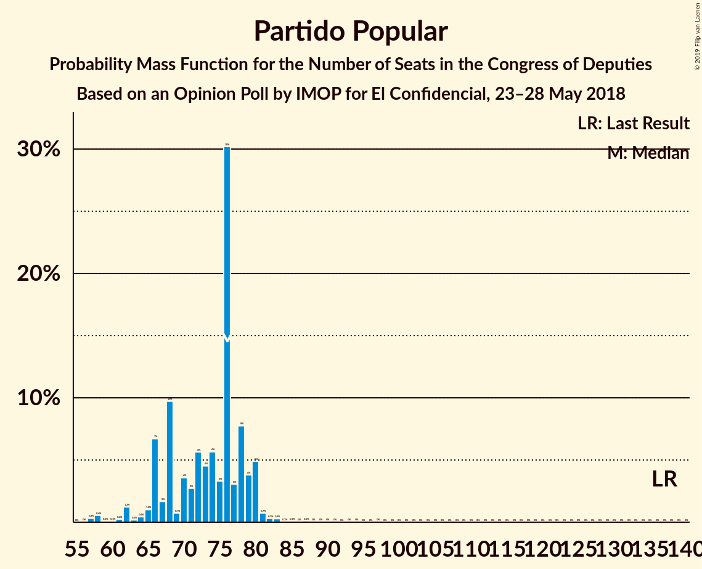
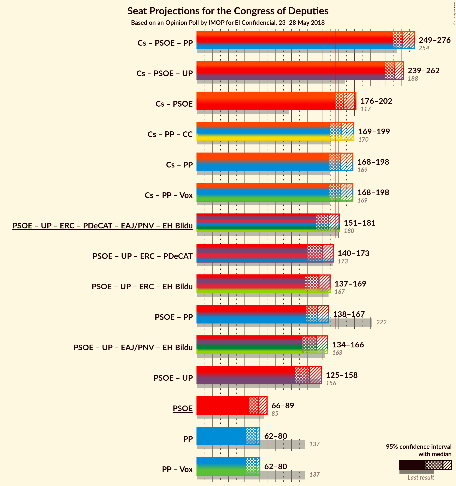

# Opinion Poll by IMOP for El Confidencial, 23–28 May 2018

<a href="#voting-intentions">Voting Intentions</a> | <a href="#seats">Seats</a> | <a href="#coalitions">Coalitions</a> | <a href="#technical-information">Technical Information</a>

## Voting Intentions

### Confidence Intervals

| Party | Last Result | Poll Result | 80% Confidence Interval | 90% Confidence Interval | 95% Confidence Interval | 99% Confidence Interval |
|:-----:|:-----------:|:-----------:|:-----------------------:|:-----------------------:|:-----------------------:|:-----------------------:|
| Ciudadanos–Partido de la Ciudadanía | 13.1% | 28.6% | 26.8–30.5% |26.3–31.0% |25.9–31.4% |25.0–32.3% |
| Partido Socialista Obrero Español | 22.6% | 20.6% | 19.0–22.3% |18.6–22.8% |18.2–23.2% |17.5–24.0% |
| Unidos Podemos | 21.2% | 19.7% | 18.2–21.4% |17.7–21.9% |17.4–22.3% |16.7–23.1% |
| Partido Popular | 33.0% | 19.6% | 18.1–21.3% |17.6–21.7% |17.3–22.2% |16.6–23.0% |
| Esquerra Republicana de Catalunya–Catalunya Sí | 2.7% | 2.4% | 1.9–3.1% |1.7–3.3% |1.6–3.5% |1.4–3.9% |
| Partido Animalista Contra el Maltrato Animal | 1.2% | 2.0% | 1.5–2.7% |1.4–2.9% |1.3–3.0% |1.1–3.4% |
| Partit Demòcrata Europeu Català | 2.0% | 1.8% | 1.3–2.4% |1.2–2.6% |1.1–2.8% |0.9–3.1% |
| Euzko Alderdi Jeltzalea/Partido Nacionalista Vasco | 1.2% | 1.2% | 0.8–1.8% |0.7–1.9% |0.7–2.1% |0.5–2.4% |
| Euskal Herria Bildu | 0.8% | 0.7% | 0.5–1.2% |0.4–1.3% |0.3–1.4% |0.2–1.7% |

*Note:* The poll result column reflects the actual value used in the calculations. Published results may vary slightly, and in addition be rounded to fewer digits.

## Seats

### Confidence Intervals

| Party | Last Result | Median | 80% Confidence Interval | 90% Confidence Interval | 95% Confidence Interval | 99% Confidence Interval |
|:-----:|:-----------:|:------:|:-----------------------:|:-----------------------:|:-----------------------:|:-----------------------:|
| <a href="#ciudadanos–partido-de-la-ciudadanía">Ciudadanos–Partido de la Ciudadanía</a> | 32 | 107 | 98–118 |96–120 |94–121 |89–122 |
| <a href="#partido-socialista-obrero-español">Partido Socialista Obrero Español</a> | 85 | 78 | 70–85 |69–88 |66–89 |63–90 |
| <a href="#unidos-podemos">Unidos Podemos</a> | 71 | 64 | 57–73 |53–74 |49–76 |45–80 |
| <a href="#partido-popular">Partido Popular</a> | 137 | 76 | 66–79 |66–80 |62–80 |58–83 |
| <a href="#esquerra-republicana-de-catalunya–catalunya-sí">Esquerra Republicana de Catalunya–Catalunya Sí</a> | 9 | 9 | 7–12 |6–12 |6–13 |5–14 |
| <a href="#partido-animalista-contra-el-maltrato-animal">Partido Animalista Contra el Maltrato Animal</a> | 0 | 0 | 0–1 |0–1 |0–1 |0–1 |
| <a href="#partit-demòcrata-europeu-català">Partit Demòcrata Europeu Català</a> | 8 | 6 | 4–8 |4–10 |4–10 |3–12 |
| <a href="#euzko-alderdi-jeltzalea/partido-nacionalista-vasco">Euzko Alderdi Jeltzalea/Partido Nacionalista Vasco</a> | 5 | 6 | 3–7 |3–8 |3–9 |2–10 |
| <a href="#euskal-herria-bildu">Euskal Herria Bildu</a> | 2 | 2 | 1–5 |0–6 |0–6 |0–7 |

### Ciudadanos–Partido de la Ciudadanía

*For a full overview of the results for this party, see the [Ciudadanos–Partido de la Ciudadanía](party-ciudadanos–partidodelaciudadanía.html) page.*

| Number of Seats | Probability | Accumulated | Special Marks |
|:---------------:|:-----------:|:-----------:|:-------------:|
| 32 | 0% | 100% | Last Result |
| 33 | 0% | 100% |  |
| 34 | 0% | 100% |  |
| 35 | 0% | 100% |  |
| 36 | 0% | 100% |  |
| 37 | 0% | 100% |  |
| 38 | 0% | 100% |  |
| 39 | 0% | 100% |  |
| 40 | 0% | 100% |  |
| 41 | 0% | 100% |  |
| 42 | 0% | 100% |  |
| 43 | 0% | 100% |  |
| 44 | 0% | 100% |  |
| 45 | 0% | 100% |  |
| 46 | 0% | 100% |  |
| 47 | 0% | 100% |  |
| 48 | 0% | 100% |  |
| 49 | 0% | 100% |  |
| 50 | 0% | 100% |  |
| 51 | 0% | 100% |  |
| 52 | 0% | 100% |  |
| 53 | 0% | 100% |  |
| 54 | 0% | 100% |  |
| 55 | 0% | 100% |  |
| 56 | 0% | 100% |  |
| 57 | 0% | 100% |  |
| 58 | 0% | 100% |  |
| 59 | 0% | 100% |  |
| 60 | 0% | 100% |  |
| 61 | 0% | 100% |  |
| 62 | 0% | 100% |  |
| 63 | 0% | 100% |  |
| 64 | 0% | 100% |  |
| 65 | 0% | 100% |  |
| 66 | 0% | 100% |  |
| 67 | 0% | 100% |  |
| 68 | 0% | 100% |  |
| 69 | 0% | 100% |  |
| 70 | 0% | 100% |  |
| 71 | 0% | 100% |  |
| 72 | 0% | 100% |  |
| 73 | 0% | 100% |  |
| 74 | 0% | 100% |  |
| 75 | 0% | 100% |  |
| 76 | 0% | 100% |  |
| 77 | 0% | 100% |  |
| 78 | 0% | 100% |  |
| 79 | 0% | 100% |  |
| 80 | 0% | 100% |  |
| 81 | 0% | 100% |  |
| 82 | 0% | 100% |  |
| 83 | 0% | 100% |  |
| 84 | 0% | 100% |  |
| 85 | 0% | 100% |  |
| 86 | 0% | 99.9% |  |
| 87 | 0% | 99.9% |  |
| 88 | 0% | 99.9% |  |
| 89 | 0.5% | 99.9% |  |
| 90 | 0% | 99.4% |  |
| 91 | 0.2% | 99.4% |  |
| 92 | 0.1% | 99.2% |  |
| 93 | 0.2% | 99.0% |  |
| 94 | 1.3% | 98.8% |  |
| 95 | 1.4% | 97% |  |
| 96 | 4% | 96% |  |
| 97 | 0.7% | 92% |  |
| 98 | 2% | 91% |  |
| 99 | 3% | 89% |  |
| 100 | 15% | 86% |  |
| 101 | 1.2% | 72% |  |
| 102 | 4% | 71% |  |
| 103 | 5% | 67% |  |
| 104 | 4% | 62% |  |
| 105 | 0.3% | 58% |  |
| 106 | 3% | 57% |  |
| 107 | 10% | 55% | Median |
| 108 | 0.1% | 45% |  |
| 109 | 0.2% | 45% |  |
| 110 | 0.5% | 45% |  |
| 111 | 2% | 44% |  |
| 112 | 2% | 42% |  |
| 113 | 2% | 40% |  |
| 114 | 1.3% | 38% |  |
| 115 | 8% | 36% |  |
| 116 | 9% | 29% |  |
| 117 | 6% | 19% |  |
| 118 | 4% | 14% |  |
| 119 | 3% | 9% |  |
| 120 | 1.3% | 6% |  |
| 121 | 3% | 5% |  |
| 122 | 1.0% | 1.4% |  |
| 123 | 0.1% | 0.4% |  |
| 124 | 0.1% | 0.3% |  |
| 125 | 0.1% | 0.2% |  |
| 126 | 0% | 0.1% |  |
| 127 | 0% | 0.1% |  |
| 128 | 0% | 0.1% |  |
| 129 | 0% | 0.1% |  |
| 130 | 0% | 0% |  |

### Partido Socialista Obrero Español

*For a full overview of the results for this party, see the [Partido Socialista Obrero Español](party-partidosocialistaobreroespañol.html) page.*

| Number of Seats | Probability | Accumulated | Special Marks |
|:---------------:|:-----------:|:-----------:|:-------------:|
| 59 | 0% | 100% |  |
| 60 | 0% | 99.9% |  |
| 61 | 0% | 99.9% |  |
| 62 | 0% | 99.9% |  |
| 63 | 0.8% | 99.9% |  |
| 64 | 0.1% | 99.1% |  |
| 65 | 1.2% | 99.0% |  |
| 66 | 0.4% | 98% |  |
| 67 | 0% | 97% |  |
| 68 | 0.2% | 97% |  |
| 69 | 3% | 97% |  |
| 70 | 5% | 94% |  |
| 71 | 1.0% | 89% |  |
| 72 | 0.9% | 88% |  |
| 73 | 2% | 87% |  |
| 74 | 6% | 85% |  |
| 75 | 4% | 80% |  |
| 76 | 4% | 76% |  |
| 77 | 2% | 72% |  |
| 78 | 23% | 71% | Median |
| 79 | 18% | 48% |  |
| 80 | 2% | 30% |  |
| 81 | 9% | 29% |  |
| 82 | 5% | 20% |  |
| 83 | 2% | 15% |  |
| 84 | 0.4% | 12% |  |
| 85 | 2% | 12% | Last Result |
| 86 | 2% | 10% |  |
| 87 | 3% | 8% |  |
| 88 | 2% | 5% |  |
| 89 | 3% | 3% |  |
| 90 | 0.3% | 0.7% |  |
| 91 | 0.1% | 0.4% |  |
| 92 | 0.1% | 0.3% |  |
| 93 | 0.1% | 0.2% |  |
| 94 | 0% | 0.1% |  |
| 95 | 0% | 0% |  |

### Unidos Podemos

*For a full overview of the results for this party, see the [Unidos Podemos](party-unidospodemos.html) page.*

| Number of Seats | Probability | Accumulated | Special Marks |
|:---------------:|:-----------:|:-----------:|:-------------:|
| 42 | 0% | 100% |  |
| 43 | 0% | 99.9% |  |
| 44 | 0% | 99.9% |  |
| 45 | 0.4% | 99.9% |  |
| 46 | 0.3% | 99.5% |  |
| 47 | 0% | 99.2% |  |
| 48 | 1.2% | 99.2% |  |
| 49 | 2% | 98% |  |
| 50 | 0% | 96% |  |
| 51 | 0.3% | 96% |  |
| 52 | 0.1% | 96% |  |
| 53 | 0.7% | 96% |  |
| 54 | 2% | 95% |  |
| 55 | 1.0% | 92% |  |
| 56 | 1.2% | 91% |  |
| 57 | 2% | 90% |  |
| 58 | 1.3% | 88% |  |
| 59 | 0.7% | 87% |  |
| 60 | 3% | 86% |  |
| 61 | 4% | 83% |  |
| 62 | 6% | 80% |  |
| 63 | 17% | 74% |  |
| 64 | 9% | 57% | Median |
| 65 | 10% | 49% |  |
| 66 | 2% | 39% |  |
| 67 | 2% | 36% |  |
| 68 | 0.4% | 35% |  |
| 69 | 4% | 34% |  |
| 70 | 3% | 31% |  |
| 71 | 5% | 28% | Last Result |
| 72 | 3% | 23% |  |
| 73 | 13% | 20% |  |
| 74 | 2% | 6% |  |
| 75 | 1.1% | 4% |  |
| 76 | 2% | 3% |  |
| 77 | 0.3% | 1.1% |  |
| 78 | 0.1% | 0.8% |  |
| 79 | 0.2% | 0.8% |  |
| 80 | 0.2% | 0.6% |  |
| 81 | 0.2% | 0.4% |  |
| 82 | 0% | 0.1% |  |
| 83 | 0% | 0.1% |  |
| 84 | 0.1% | 0.1% |  |
| 85 | 0% | 0.1% |  |
| 86 | 0% | 0% |  |

### Partido Popular

*For a full overview of the results for this party, see the [Partido Popular](party-partidopopular.html) page.*

| Number of Seats | Probability | Accumulated | Special Marks |
|:---------------:|:-----------:|:-----------:|:-------------:|
| 56 | 0% | 100% |  |
| 57 | 0.3% | 99.9% |  |
| 58 | 0.6% | 99.6% |  |
| 59 | 0.1% | 99.1% |  |
| 60 | 0.1% | 99.0% |  |
| 61 | 0.2% | 98.9% |  |
| 62 | 1.2% | 98.7% |  |
| 63 | 0.2% | 97% |  |
| 64 | 0.4% | 97% |  |
| 65 | 1.0% | 97% |  |
| 66 | 7% | 96% |  |
| 67 | 2% | 89% |  |
| 68 | 10% | 87% |  |
| 69 | 0.7% | 78% |  |
| 70 | 4% | 77% |  |
| 71 | 3% | 73% |  |
| 72 | 6% | 71% |  |
| 73 | 5% | 65% |  |
| 74 | 6% | 60% |  |
| 75 | 3% | 55% |  |
| 76 | 30% | 52% | Median |
| 77 | 3% | 21% |  |
| 78 | 8% | 18% |  |
| 79 | 4% | 11% |  |
| 80 | 5% | 7% |  |
| 81 | 0.7% | 2% |  |
| 82 | 0.3% | 1.1% |  |
| 83 | 0.3% | 0.8% |  |
| 84 | 0.1% | 0.5% |  |
| 85 | 0.1% | 0.4% |  |
| 86 | 0% | 0.3% |  |
| 87 | 0.1% | 0.3% |  |
| 88 | 0% | 0.2% |  |
| 89 | 0% | 0.2% |  |
| 90 | 0% | 0.2% |  |
| 91 | 0% | 0.1% |  |
| 92 | 0% | 0.1% |  |
| 93 | 0% | 0.1% |  |
| 94 | 0% | 0% |  |
| 95 | 0% | 0% |  |
| 96 | 0% | 0% |  |
| 97 | 0% | 0% |  |
| 98 | 0% | 0% |  |
| 99 | 0% | 0% |  |
| 100 | 0% | 0% |  |
| 101 | 0% | 0% |  |
| 102 | 0% | 0% |  |
| 103 | 0% | 0% |  |
| 104 | 0% | 0% |  |
| 105 | 0% | 0% |  |
| 106 | 0% | 0% |  |
| 107 | 0% | 0% |  |
| 108 | 0% | 0% |  |
| 109 | 0% | 0% |  |
| 110 | 0% | 0% |  |
| 111 | 0% | 0% |  |
| 112 | 0% | 0% |  |
| 113 | 0% | 0% |  |
| 114 | 0% | 0% |  |
| 115 | 0% | 0% |  |
| 116 | 0% | 0% |  |
| 117 | 0% | 0% |  |
| 118 | 0% | 0% |  |
| 119 | 0% | 0% |  |
| 120 | 0% | 0% |  |
| 121 | 0% | 0% |  |
| 122 | 0% | 0% |  |
| 123 | 0% | 0% |  |
| 124 | 0% | 0% |  |
| 125 | 0% | 0% |  |
| 126 | 0% | 0% |  |
| 127 | 0% | 0% |  |
| 128 | 0% | 0% |  |
| 129 | 0% | 0% |  |
| 130 | 0% | 0% |  |
| 131 | 0% | 0% |  |
| 132 | 0% | 0% |  |
| 133 | 0% | 0% |  |
| 134 | 0% | 0% |  |
| 135 | 0% | 0% |  |
| 136 | 0% | 0% |  |
| 137 | 0% | 0% | Last Result |

### Esquerra Republicana de Catalunya–Catalunya Sí

*For a full overview of the results for this party, see the [Esquerra Republicana de Catalunya–Catalunya Sí](party-esquerrarepublicanadecatalunya–catalunyasí.html) page.*

| Number of Seats | Probability | Accumulated | Special Marks |
|:---------------:|:-----------:|:-----------:|:-------------:|
| 4 | 0.1% | 100% |  |
| 5 | 1.0% | 99.9% |  |
| 6 | 9% | 98.9% |  |
| 7 | 24% | 90% |  |
| 8 | 13% | 66% |  |
| 9 | 14% | 53% | Last Result, Median |
| 10 | 13% | 39% |  |
| 11 | 12% | 26% |  |
| 12 | 11% | 14% |  |
| 13 | 2% | 3% |  |
| 14 | 0.9% | 1.1% |  |
| 15 | 0.1% | 0.2% |  |
| 16 | 0% | 0% |  |

### Partido Animalista Contra el Maltrato Animal

*For a full overview of the results for this party, see the [Partido Animalista Contra el Maltrato Animal](party-partidoanimalistacontraelmaltratoanimal.html) page.*

| Number of Seats | Probability | Accumulated | Special Marks |
|:---------------:|:-----------:|:-----------:|:-------------:|
| 0 | 51% | 100% | Last Result, Median |
| 1 | 48% | 49% |  |
| 2 | 0.3% | 0.3% |  |
| 3 | 0% | 0% |  |

### Partit Demòcrata Europeu Català

*For a full overview of the results for this party, see the [Partit Demòcrata Europeu Català](party-partitdemòcrataeuropeucatalà.html) page.*

| Number of Seats | Probability | Accumulated | Special Marks |
|:---------------:|:-----------:|:-----------:|:-------------:|
| 1 | 0.1% | 100% |  |
| 2 | 0.2% | 99.9% |  |
| 3 | 2% | 99.7% |  |
| 4 | 9% | 98% |  |
| 5 | 13% | 88% |  |
| 6 | 28% | 75% | Median |
| 7 | 17% | 47% |  |
| 8 | 21% | 30% | Last Result |
| 9 | 1.3% | 9% |  |
| 10 | 5% | 7% |  |
| 11 | 1.3% | 2% |  |
| 12 | 0.7% | 0.9% |  |
| 13 | 0.1% | 0.2% |  |
| 14 | 0% | 0% |  |

### Euzko Alderdi Jeltzalea/Partido Nacionalista Vasco

*For a full overview of the results for this party, see the [Euzko Alderdi Jeltzalea/Partido Nacionalista Vasco](party-euzkoalderdijeltzaleapartidonacionalistavasco.html) page.*

| Number of Seats | Probability | Accumulated | Special Marks |
|:---------------:|:-----------:|:-----------:|:-------------:|
| 1 | 0.1% | 100% |  |
| 2 | 2% | 99.9% |  |
| 3 | 28% | 98% |  |
| 4 | 2% | 70% |  |
| 5 | 8% | 68% | Last Result |
| 6 | 32% | 60% | Median |
| 7 | 20% | 29% |  |
| 8 | 5% | 8% |  |
| 9 | 2% | 3% |  |
| 10 | 0.8% | 0.9% |  |
| 11 | 0.1% | 0.1% |  |
| 12 | 0% | 0% |  |

### Euskal Herria Bildu

*For a full overview of the results for this party, see the [Euskal Herria Bildu](party-euskalherriabildu.html) page.*

| Number of Seats | Probability | Accumulated | Special Marks |
|:---------------:|:-----------:|:-----------:|:-------------:|
| 0 | 5% | 100% |  |
| 1 | 9% | 95% |  |
| 2 | 47% | 85% | Last Result, Median |
| 3 | 13% | 38% |  |
| 4 | 12% | 25% |  |
| 5 | 6% | 13% |  |
| 6 | 6% | 7% |  |
| 7 | 2% | 2% |  |
| 8 | 0.1% | 0.1% |  |
| 9 | 0% | 0% |  |

## Coalitions

### Confidence Intervals

| Coalition | Last Result | Median | Majority? | 80% Confidence Interval | 90% Confidence Interval | 95% Confidence Interval | 99% Confidence Interval |
|:---------:|:-----------:|:------:|:---------:|:-----------------------:|:-----------------------:|:-----------------------:|:-----------------------:|
| Ciudadanos–Partido de la Ciudadanía – Partido Socialista Obrero Español – Partido Popular | 254 | 261 | 100% | 253–267 | 252–272 | 249–276 | 245–279 |
| Ciudadanos–Partido de la Ciudadanía – Partido Socialista Obrero Español – Unidos Podemos | 188 | 251 | 100% | 245–260 | 241–262 | 239–262 | 239–269 |
| Ciudadanos–Partido de la Ciudadanía – Partido Socialista Obrero Español | 117 | 186 | 98% | 177–197 | 177–198 | 176–202 | 172–207 |
| Ciudadanos–Partido de la Ciudadanía – Partido Popular | 169 | 182 | 82% | 173–193 | 169–194 | 168–198 | 163–200 |
| Partido Socialista Obrero Español – Unidos Podemos – Esquerra Republicana de Catalunya–Catalunya Sí – Partit Demòcrata Europeu Català – Euzko Alderdi Jeltzalea/Partido Nacionalista Vasco – Euskal Herria Bildu | 180 | 167 | 9% | 155–175 | 154–180 | 151–181 | 149–186 |
| Partido Socialista Obrero Español – Unidos Podemos – Esquerra Republicana de Catalunya–Catalunya Sí – Partit Demòcrata Europeu Català | 173 | 159 | 1.2% | 147–168 | 145–172 | 140–173 | 140–178 |
| Partido Socialista Obrero Español – Unidos Podemos – Esquerra Republicana de Catalunya–Catalunya Sí – Euskal Herria Bildu | 167 | 155 | 0.9% | 143–164 | 142–167 | 137–169 | 136–177 |
| Partido Socialista Obrero Español – Partido Popular | 222 | 153 | 0.1% | 146–159 | 139–160 | 138–167 | 133–169 |
| Partido Socialista Obrero Español – Unidos Podemos – Euzko Alderdi Jeltzalea/Partido Nacionalista Vasco – Euskal Herria Bildu | 163 | 152 | 0% | 141–161 | 138–164 | 134–166 | 132–170 |
| Partido Socialista Obrero Español – Unidos Podemos | 156 | 143 | 0% | 133–153 | 130–157 | 125–158 | 124–163 |
| Partido Socialista Obrero Español | 85 | 78 | 0% | 70–85 | 69–88 | 66–89 | 63–90 |
| Partido Popular | 137 | 76 | 0% | 66–79 | 66–80 | 62–80 | 58–83 |

### Ciudadanos–Partido de la Ciudadanía – Partido Socialista Obrero Español – Partido Popular

| Number of Seats | Probability | Accumulated | Special Marks |
|:---------------:|:-----------:|:-----------:|:-------------:|
| 240 | 0.1% | 100% |  |
| 241 | 0% | 99.9% |  |
| 242 | 0% | 99.9% |  |
| 243 | 0% | 99.8% |  |
| 244 | 0.1% | 99.8% |  |
| 245 | 0.3% | 99.7% |  |
| 246 | 0% | 99.4% |  |
| 247 | 0.2% | 99.4% |  |
| 248 | 0.7% | 99.2% |  |
| 249 | 1.2% | 98.6% |  |
| 250 | 0.2% | 97% |  |
| 251 | 1.1% | 97% |  |
| 252 | 3% | 96% |  |
| 253 | 6% | 93% |  |
| 254 | 16% | 87% | Last Result |
| 255 | 4% | 71% |  |
| 256 | 5% | 67% |  |
| 257 | 4% | 62% |  |
| 258 | 3% | 59% |  |
| 259 | 3% | 56% |  |
| 260 | 0.4% | 54% |  |
| 261 | 10% | 53% | Median |
| 262 | 10% | 43% |  |
| 263 | 13% | 34% |  |
| 264 | 4% | 20% |  |
| 265 | 0.8% | 16% |  |
| 266 | 3% | 15% |  |
| 267 | 3% | 12% |  |
| 268 | 1.4% | 10% |  |
| 269 | 2% | 8% |  |
| 270 | 0.1% | 6% |  |
| 271 | 0.4% | 6% |  |
| 272 | 2% | 6% |  |
| 273 | 0.4% | 4% |  |
| 274 | 0.1% | 4% |  |
| 275 | 0.7% | 4% |  |
| 276 | 2% | 3% |  |
| 277 | 0% | 1.2% |  |
| 278 | 0% | 1.2% |  |
| 279 | 1.1% | 1.2% |  |
| 280 | 0% | 0.1% |  |
| 281 | 0% | 0.1% |  |
| 282 | 0% | 0.1% |  |
| 283 | 0% | 0% |  |

### Ciudadanos–Partido de la Ciudadanía – Partido Socialista Obrero Español – Unidos Podemos

| Number of Seats | Probability | Accumulated | Special Marks |
|:---------------:|:-----------:|:-----------:|:-------------:|
| 188 | 0% | 100% | Last Result |
| 189 | 0% | 100% |  |
| 190 | 0% | 100% |  |
| 191 | 0% | 100% |  |
| 192 | 0% | 100% |  |
| 193 | 0% | 100% |  |
| 194 | 0% | 100% |  |
| 195 | 0% | 100% |  |
| 196 | 0% | 100% |  |
| 197 | 0% | 100% |  |
| 198 | 0% | 100% |  |
| 199 | 0% | 100% |  |
| 200 | 0% | 100% |  |
| 201 | 0% | 100% |  |
| 202 | 0% | 100% |  |
| 203 | 0% | 100% |  |
| 204 | 0% | 100% |  |
| 205 | 0% | 100% |  |
| 206 | 0% | 100% |  |
| 207 | 0% | 100% |  |
| 208 | 0% | 100% |  |
| 209 | 0% | 100% |  |
| 210 | 0% | 100% |  |
| 211 | 0% | 100% |  |
| 212 | 0% | 100% |  |
| 213 | 0% | 100% |  |
| 214 | 0% | 100% |  |
| 215 | 0% | 100% |  |
| 216 | 0% | 100% |  |
| 217 | 0% | 100% |  |
| 218 | 0% | 100% |  |
| 219 | 0% | 100% |  |
| 220 | 0% | 100% |  |
| 221 | 0% | 100% |  |
| 222 | 0% | 100% |  |
| 223 | 0% | 100% |  |
| 224 | 0% | 100% |  |
| 225 | 0% | 100% |  |
| 226 | 0% | 100% |  |
| 227 | 0% | 100% |  |
| 228 | 0% | 100% |  |
| 229 | 0% | 100% |  |
| 230 | 0% | 99.9% |  |
| 231 | 0% | 99.9% |  |
| 232 | 0% | 99.9% |  |
| 233 | 0% | 99.9% |  |
| 234 | 0% | 99.9% |  |
| 235 | 0.1% | 99.8% |  |
| 236 | 0% | 99.7% |  |
| 237 | 0% | 99.7% |  |
| 238 | 0.1% | 99.7% |  |
| 239 | 4% | 99.6% |  |
| 240 | 0.4% | 96% |  |
| 241 | 1.4% | 95% |  |
| 242 | 0.8% | 94% |  |
| 243 | 2% | 93% |  |
| 244 | 0.7% | 91% |  |
| 245 | 2% | 90% |  |
| 246 | 5% | 89% |  |
| 247 | 4% | 84% |  |
| 248 | 13% | 80% |  |
| 249 | 2% | 67% | Median |
| 250 | 9% | 65% |  |
| 251 | 15% | 56% |  |
| 252 | 9% | 41% |  |
| 253 | 2% | 32% |  |
| 254 | 3% | 30% |  |
| 255 | 2% | 27% |  |
| 256 | 0.4% | 25% |  |
| 257 | 3% | 24% |  |
| 258 | 10% | 21% |  |
| 259 | 0.8% | 11% |  |
| 260 | 0.7% | 11% |  |
| 261 | 0.8% | 10% |  |
| 262 | 7% | 9% |  |
| 263 | 1.1% | 2% |  |
| 264 | 0.2% | 1.2% |  |
| 265 | 0% | 1.0% |  |
| 266 | 0.1% | 1.0% |  |
| 267 | 0.1% | 0.8% |  |
| 268 | 0% | 0.7% |  |
| 269 | 0.3% | 0.7% |  |
| 270 | 0.4% | 0.5% |  |
| 271 | 0% | 0.1% |  |
| 272 | 0% | 0% |  |

### Ciudadanos–Partido de la Ciudadanía – Partido Socialista Obrero Español

| Number of Seats | Probability | Accumulated | Special Marks |
|:---------------:|:-----------:|:-----------:|:-------------:|
| 117 | 0% | 100% | Last Result |
| 118 | 0% | 100% |  |
| 119 | 0% | 100% |  |
| 120 | 0% | 100% |  |
| 121 | 0% | 100% |  |
| 122 | 0% | 100% |  |
| 123 | 0% | 100% |  |
| 124 | 0% | 100% |  |
| 125 | 0% | 100% |  |
| 126 | 0% | 100% |  |
| 127 | 0% | 100% |  |
| 128 | 0% | 100% |  |
| 129 | 0% | 100% |  |
| 130 | 0% | 100% |  |
| 131 | 0% | 100% |  |
| 132 | 0% | 100% |  |
| 133 | 0% | 100% |  |
| 134 | 0% | 100% |  |
| 135 | 0% | 100% |  |
| 136 | 0% | 100% |  |
| 137 | 0% | 100% |  |
| 138 | 0% | 100% |  |
| 139 | 0% | 100% |  |
| 140 | 0% | 100% |  |
| 141 | 0% | 100% |  |
| 142 | 0% | 100% |  |
| 143 | 0% | 100% |  |
| 144 | 0% | 100% |  |
| 145 | 0% | 100% |  |
| 146 | 0% | 100% |  |
| 147 | 0% | 100% |  |
| 148 | 0% | 100% |  |
| 149 | 0% | 100% |  |
| 150 | 0% | 100% |  |
| 151 | 0% | 100% |  |
| 152 | 0% | 100% |  |
| 153 | 0% | 100% |  |
| 154 | 0% | 100% |  |
| 155 | 0% | 100% |  |
| 156 | 0% | 100% |  |
| 157 | 0% | 100% |  |
| 158 | 0% | 100% |  |
| 159 | 0% | 100% |  |
| 160 | 0% | 100% |  |
| 161 | 0% | 100% |  |
| 162 | 0% | 99.9% |  |
| 163 | 0% | 99.9% |  |
| 164 | 0% | 99.9% |  |
| 165 | 0% | 99.9% |  |
| 166 | 0% | 99.9% |  |
| 167 | 0% | 99.9% |  |
| 168 | 0.1% | 99.8% |  |
| 169 | 0% | 99.8% |  |
| 170 | 0.1% | 99.8% |  |
| 171 | 0.1% | 99.7% |  |
| 172 | 0.3% | 99.6% |  |
| 173 | 0.6% | 99.3% |  |
| 174 | 0.5% | 98.7% |  |
| 175 | 0.2% | 98% |  |
| 176 | 1.4% | 98% | Majority |
| 177 | 7% | 97% |  |
| 178 | 16% | 89% |  |
| 179 | 1.3% | 73% |  |
| 180 | 2% | 72% |  |
| 181 | 4% | 70% |  |
| 182 | 2% | 66% |  |
| 183 | 0.3% | 64% |  |
| 184 | 3% | 64% |  |
| 185 | 9% | 61% | Median |
| 186 | 3% | 52% |  |
| 187 | 11% | 49% |  |
| 188 | 4% | 38% |  |
| 189 | 2% | 34% |  |
| 190 | 4% | 32% |  |
| 191 | 2% | 28% |  |
| 192 | 1.0% | 26% |  |
| 193 | 0.4% | 25% |  |
| 194 | 7% | 25% |  |
| 195 | 3% | 18% |  |
| 196 | 0.4% | 15% |  |
| 197 | 9% | 14% |  |
| 198 | 2% | 5% |  |
| 199 | 0% | 3% |  |
| 200 | 0.3% | 3% |  |
| 201 | 0.1% | 3% |  |
| 202 | 1.1% | 3% |  |
| 203 | 0% | 2% |  |
| 204 | 0.1% | 2% |  |
| 205 | 0.1% | 2% |  |
| 206 | 0.5% | 2% |  |
| 207 | 1.1% | 1.3% |  |
| 208 | 0% | 0.1% |  |
| 209 | 0% | 0.1% |  |
| 210 | 0% | 0.1% |  |
| 211 | 0% | 0% |  |

### Ciudadanos–Partido de la Ciudadanía – Partido Popular

| Number of Seats | Probability | Accumulated | Special Marks |
|:---------------:|:-----------:|:-----------:|:-------------:|
| 160 | 0.1% | 100% |  |
| 161 | 0.1% | 99.9% |  |
| 162 | 0.2% | 99.8% |  |
| 163 | 0.1% | 99.5% |  |
| 164 | 0.4% | 99.5% |  |
| 165 | 0.8% | 99.1% |  |
| 166 | 0.2% | 98% |  |
| 167 | 0.2% | 98% |  |
| 168 | 2% | 98% |  |
| 169 | 2% | 96% | Last Result |
| 170 | 0.6% | 94% |  |
| 171 | 1.0% | 93% |  |
| 172 | 0.3% | 92% |  |
| 173 | 3% | 92% |  |
| 174 | 4% | 89% |  |
| 175 | 3% | 85% |  |
| 176 | 13% | 82% | Majority |
| 177 | 2% | 69% |  |
| 178 | 2% | 67% |  |
| 179 | 5% | 64% |  |
| 180 | 2% | 59% |  |
| 181 | 3% | 57% |  |
| 182 | 10% | 54% |  |
| 183 | 15% | 44% | Median |
| 184 | 0.3% | 29% |  |
| 185 | 4% | 29% |  |
| 186 | 1.2% | 25% |  |
| 187 | 1.3% | 24% |  |
| 188 | 7% | 23% |  |
| 189 | 0.1% | 16% |  |
| 190 | 1.3% | 16% |  |
| 191 | 0.9% | 15% |  |
| 192 | 2% | 14% |  |
| 193 | 7% | 12% |  |
| 194 | 0.7% | 5% |  |
| 195 | 0.1% | 5% |  |
| 196 | 0.3% | 5% |  |
| 197 | 2% | 4% |  |
| 198 | 0.2% | 3% |  |
| 199 | 0% | 2% |  |
| 200 | 2% | 2% |  |
| 201 | 0.1% | 0.2% |  |
| 202 | 0% | 0.1% |  |
| 203 | 0% | 0.1% |  |
| 204 | 0% | 0.1% |  |
| 205 | 0% | 0.1% |  |
| 206 | 0% | 0% |  |

### Partido Socialista Obrero Español – Unidos Podemos – Esquerra Republicana de Catalunya–Catalunya Sí – Partit Demòcrata Europeu Català – Euzko Alderdi Jeltzalea/Partido Nacionalista Vasco – Euskal Herria Bildu

| Number of Seats | Probability | Accumulated | Special Marks |
|:---------------:|:-----------:|:-----------:|:-------------:|
| 143 | 0% | 100% |  |
| 144 | 0% | 99.9% |  |
| 145 | 0% | 99.9% |  |
| 146 | 0% | 99.9% |  |
| 147 | 0.1% | 99.9% |  |
| 148 | 0.1% | 99.8% |  |
| 149 | 2% | 99.7% |  |
| 150 | 0% | 98% |  |
| 151 | 0.2% | 98% |  |
| 152 | 2% | 97% |  |
| 153 | 0.3% | 96% |  |
| 154 | 0.6% | 95% |  |
| 155 | 5% | 95% |  |
| 156 | 3% | 90% |  |
| 157 | 2% | 87% |  |
| 158 | 1.2% | 85% |  |
| 159 | 0.2% | 84% |  |
| 160 | 4% | 84% |  |
| 161 | 4% | 80% |  |
| 162 | 1.2% | 76% |  |
| 163 | 1.5% | 75% |  |
| 164 | 3% | 74% |  |
| 165 | 0.1% | 71% | Median |
| 166 | 18% | 71% |  |
| 167 | 8% | 52% |  |
| 168 | 3% | 44% |  |
| 169 | 6% | 42% |  |
| 170 | 1.3% | 36% |  |
| 171 | 1.4% | 35% |  |
| 172 | 15% | 33% |  |
| 173 | 1.3% | 18% |  |
| 174 | 5% | 17% |  |
| 175 | 3% | 12% |  |
| 176 | 0.8% | 9% | Majority |
| 177 | 0.9% | 8% |  |
| 178 | 1.0% | 7% |  |
| 179 | 0.1% | 6% |  |
| 180 | 2% | 6% | Last Result |
| 181 | 2% | 4% |  |
| 182 | 0.3% | 2% |  |
| 183 | 0.1% | 2% |  |
| 184 | 0.8% | 2% |  |
| 185 | 0.4% | 0.9% |  |
| 186 | 0.1% | 0.5% |  |
| 187 | 0.2% | 0.4% |  |
| 188 | 0.1% | 0.2% |  |
| 189 | 0.1% | 0.1% |  |
| 190 | 0% | 0% |  |

### Partido Socialista Obrero Español – Unidos Podemos – Esquerra Republicana de Catalunya–Catalunya Sí – Partit Demòcrata Europeu Català

| Number of Seats | Probability | Accumulated | Special Marks |
|:---------------:|:-----------:|:-----------:|:-------------:|
| 136 | 0% | 100% |  |
| 137 | 0% | 99.9% |  |
| 138 | 0% | 99.9% |  |
| 139 | 0.1% | 99.9% |  |
| 140 | 2% | 99.8% |  |
| 141 | 0.2% | 97% |  |
| 142 | 0.6% | 97% |  |
| 143 | 0.2% | 97% |  |
| 144 | 0.1% | 96% |  |
| 145 | 3% | 96% |  |
| 146 | 0.6% | 94% |  |
| 147 | 6% | 93% |  |
| 148 | 0.8% | 87% |  |
| 149 | 2% | 87% |  |
| 150 | 3% | 85% |  |
| 151 | 3% | 82% |  |
| 152 | 0.9% | 79% |  |
| 153 | 2% | 78% |  |
| 154 | 0.5% | 76% |  |
| 155 | 0.8% | 76% |  |
| 156 | 4% | 75% |  |
| 157 | 17% | 71% | Median |
| 158 | 1.2% | 54% |  |
| 159 | 3% | 53% |  |
| 160 | 8% | 50% |  |
| 161 | 7% | 42% |  |
| 162 | 3% | 35% |  |
| 163 | 4% | 32% |  |
| 164 | 2% | 28% |  |
| 165 | 0.6% | 26% |  |
| 166 | 2% | 26% |  |
| 167 | 13% | 24% |  |
| 168 | 2% | 10% |  |
| 169 | 0.2% | 8% |  |
| 170 | 0.7% | 8% |  |
| 171 | 1.1% | 7% |  |
| 172 | 2% | 6% |  |
| 173 | 2% | 4% | Last Result |
| 174 | 0.2% | 2% |  |
| 175 | 0.5% | 2% |  |
| 176 | 0.2% | 1.2% | Majority |
| 177 | 0% | 1.0% |  |
| 178 | 0.7% | 1.0% |  |
| 179 | 0.1% | 0.3% |  |
| 180 | 0.1% | 0.1% |  |
| 181 | 0% | 0% |  |

### Partido Socialista Obrero Español – Unidos Podemos – Esquerra Republicana de Catalunya–Catalunya Sí – Euskal Herria Bildu

| Number of Seats | Probability | Accumulated | Special Marks |
|:---------------:|:-----------:|:-----------:|:-------------:|
| 130 | 0% | 100% |  |
| 131 | 0% | 99.9% |  |
| 132 | 0% | 99.9% |  |
| 133 | 0% | 99.9% |  |
| 134 | 0% | 99.8% |  |
| 135 | 0% | 99.8% |  |
| 136 | 2% | 99.8% |  |
| 137 | 0.4% | 98% |  |
| 138 | 0% | 97% |  |
| 139 | 0.5% | 97% |  |
| 140 | 0.2% | 97% |  |
| 141 | 0.8% | 97% |  |
| 142 | 6% | 96% |  |
| 143 | 3% | 90% |  |
| 144 | 0.7% | 87% |  |
| 145 | 2% | 87% |  |
| 146 | 0.1% | 85% |  |
| 147 | 1.3% | 85% |  |
| 148 | 0.3% | 84% |  |
| 149 | 2% | 83% |  |
| 150 | 10% | 82% |  |
| 151 | 1.2% | 72% |  |
| 152 | 11% | 71% |  |
| 153 | 1.4% | 60% | Median |
| 154 | 5% | 59% |  |
| 155 | 12% | 54% |  |
| 156 | 0.7% | 42% |  |
| 157 | 0.8% | 41% |  |
| 158 | 7% | 40% |  |
| 159 | 1.0% | 33% |  |
| 160 | 6% | 32% |  |
| 161 | 0.7% | 26% |  |
| 162 | 0.9% | 25% |  |
| 163 | 12% | 24% |  |
| 164 | 3% | 12% |  |
| 165 | 2% | 9% |  |
| 166 | 0.5% | 7% |  |
| 167 | 2% | 7% | Last Result |
| 168 | 2% | 4% |  |
| 169 | 0.3% | 3% |  |
| 170 | 0.8% | 2% |  |
| 171 | 0.1% | 2% |  |
| 172 | 0% | 2% |  |
| 173 | 0.2% | 1.5% |  |
| 174 | 0.3% | 1.3% |  |
| 175 | 0% | 1.0% |  |
| 176 | 0.1% | 0.9% | Majority |
| 177 | 0.7% | 0.8% |  |
| 178 | 0.1% | 0.1% |  |
| 179 | 0% | 0% |  |

### Partido Socialista Obrero Español – Partido Popular

| Number of Seats | Probability | Accumulated | Special Marks |
|:---------------:|:-----------:|:-----------:|:-------------:|
| 126 | 0% | 100% |  |
| 127 | 0% | 99.9% |  |
| 128 | 0% | 99.9% |  |
| 129 | 0% | 99.9% |  |
| 130 | 0.2% | 99.9% |  |
| 131 | 0% | 99.7% |  |
| 132 | 0.1% | 99.7% |  |
| 133 | 0.2% | 99.6% |  |
| 134 | 0.8% | 99.4% |  |
| 135 | 0% | 98.5% |  |
| 136 | 0% | 98.5% |  |
| 137 | 0.9% | 98% |  |
| 138 | 0.1% | 98% |  |
| 139 | 3% | 97% |  |
| 140 | 0.5% | 94% |  |
| 141 | 0.4% | 94% |  |
| 142 | 0.1% | 93% |  |
| 143 | 0.9% | 93% |  |
| 144 | 1.4% | 92% |  |
| 145 | 0.5% | 91% |  |
| 146 | 7% | 90% |  |
| 147 | 14% | 84% |  |
| 148 | 1.0% | 69% |  |
| 149 | 0.7% | 68% |  |
| 150 | 7% | 68% |  |
| 151 | 4% | 61% |  |
| 152 | 3% | 57% |  |
| 153 | 7% | 54% |  |
| 154 | 24% | 47% | Median |
| 155 | 2% | 23% |  |
| 156 | 3% | 21% |  |
| 157 | 2% | 18% |  |
| 158 | 1.0% | 16% |  |
| 159 | 6% | 15% |  |
| 160 | 5% | 10% |  |
| 161 | 0.1% | 5% |  |
| 162 | 0.5% | 5% |  |
| 163 | 0.7% | 4% |  |
| 164 | 0.3% | 4% |  |
| 165 | 0.2% | 3% |  |
| 166 | 0.5% | 3% |  |
| 167 | 0.8% | 3% |  |
| 168 | 1.1% | 2% |  |
| 169 | 0.4% | 0.6% |  |
| 170 | 0% | 0.2% |  |
| 171 | 0% | 0.2% |  |
| 172 | 0% | 0.2% |  |
| 173 | 0% | 0.2% |  |
| 174 | 0% | 0.2% |  |
| 175 | 0% | 0.1% |  |
| 176 | 0% | 0.1% | Majority |
| 177 | 0% | 0.1% |  |
| 178 | 0% | 0.1% |  |
| 179 | 0% | 0.1% |  |
| 180 | 0% | 0% |  |
| 181 | 0% | 0% |  |
| 182 | 0% | 0% |  |
| 183 | 0% | 0% |  |
| 184 | 0% | 0% |  |
| 185 | 0% | 0% |  |
| 186 | 0% | 0% |  |
| 187 | 0% | 0% |  |
| 188 | 0% | 0% |  |
| 189 | 0% | 0% |  |
| 190 | 0% | 0% |  |
| 191 | 0% | 0% |  |
| 192 | 0% | 0% |  |
| 193 | 0% | 0% |  |
| 194 | 0% | 0% |  |
| 195 | 0% | 0% |  |
| 196 | 0% | 0% |  |
| 197 | 0% | 0% |  |
| 198 | 0% | 0% |  |
| 199 | 0% | 0% |  |
| 200 | 0% | 0% |  |
| 201 | 0% | 0% |  |
| 202 | 0% | 0% |  |
| 203 | 0% | 0% |  |
| 204 | 0% | 0% |  |
| 205 | 0% | 0% |  |
| 206 | 0% | 0% |  |
| 207 | 0% | 0% |  |
| 208 | 0% | 0% |  |
| 209 | 0% | 0% |  |
| 210 | 0% | 0% |  |
| 211 | 0% | 0% |  |
| 212 | 0% | 0% |  |
| 213 | 0% | 0% |  |
| 214 | 0% | 0% |  |
| 215 | 0% | 0% |  |
| 216 | 0% | 0% |  |
| 217 | 0% | 0% |  |
| 218 | 0% | 0% |  |
| 219 | 0% | 0% |  |
| 220 | 0% | 0% |  |
| 221 | 0% | 0% |  |
| 222 | 0% | 0% | Last Result |

### Partido Socialista Obrero Español – Unidos Podemos – Euzko Alderdi Jeltzalea/Partido Nacionalista Vasco – Euskal Herria Bildu

| Number of Seats | Probability | Accumulated | Special Marks |
|:---------------:|:-----------:|:-----------:|:-------------:|
| 128 | 0% | 100% |  |
| 129 | 0% | 99.9% |  |
| 130 | 0.1% | 99.9% |  |
| 131 | 0.1% | 99.8% |  |
| 132 | 0.4% | 99.8% |  |
| 133 | 0.1% | 99.3% |  |
| 134 | 2% | 99.2% |  |
| 135 | 0% | 97% |  |
| 136 | 0.5% | 97% |  |
| 137 | 1.2% | 97% |  |
| 138 | 1.0% | 95% |  |
| 139 | 0.8% | 94% |  |
| 140 | 0.2% | 94% |  |
| 141 | 5% | 93% |  |
| 142 | 1.0% | 88% |  |
| 143 | 4% | 87% |  |
| 144 | 4% | 84% |  |
| 145 | 0.1% | 80% |  |
| 146 | 4% | 80% |  |
| 147 | 4% | 76% |  |
| 148 | 1.0% | 72% |  |
| 149 | 0.9% | 71% |  |
| 150 | 10% | 70% | Median |
| 151 | 0.3% | 59% |  |
| 152 | 11% | 59% |  |
| 153 | 11% | 48% |  |
| 154 | 6% | 37% |  |
| 155 | 1.2% | 31% |  |
| 156 | 13% | 30% |  |
| 157 | 0.1% | 16% |  |
| 158 | 3% | 16% |  |
| 159 | 2% | 14% |  |
| 160 | 1.4% | 12% |  |
| 161 | 0.9% | 10% |  |
| 162 | 2% | 9% |  |
| 163 | 1.1% | 7% | Last Result |
| 164 | 1.5% | 6% |  |
| 165 | 0.3% | 5% |  |
| 166 | 3% | 5% |  |
| 167 | 0.1% | 2% |  |
| 168 | 0.5% | 2% |  |
| 169 | 0.1% | 1.2% |  |
| 170 | 0.7% | 1.1% |  |
| 171 | 0.1% | 0.4% |  |
| 172 | 0.1% | 0.3% |  |
| 173 | 0.2% | 0.2% |  |
| 174 | 0% | 0.1% |  |
| 175 | 0% | 0% |  |

### Partido Socialista Obrero Español – Unidos Podemos

| Number of Seats | Probability | Accumulated | Special Marks |
|:---------------:|:-----------:|:-----------:|:-------------:|
| 118 | 0% | 100% |  |
| 119 | 0% | 99.9% |  |
| 120 | 0% | 99.9% |  |
| 121 | 0% | 99.9% |  |
| 122 | 0.1% | 99.8% |  |
| 123 | 0.1% | 99.8% |  |
| 124 | 0.3% | 99.6% |  |
| 125 | 2% | 99.3% |  |
| 126 | 0.8% | 97% |  |
| 127 | 0.1% | 96% |  |
| 128 | 0.2% | 96% |  |
| 129 | 0.1% | 96% |  |
| 130 | 3% | 96% |  |
| 131 | 0.3% | 93% |  |
| 132 | 0.3% | 93% |  |
| 133 | 6% | 93% |  |
| 134 | 4% | 86% |  |
| 135 | 0.3% | 82% |  |
| 136 | 4% | 82% |  |
| 137 | 0.3% | 78% |  |
| 138 | 1.5% | 78% |  |
| 139 | 3% | 76% |  |
| 140 | 2% | 74% |  |
| 141 | 13% | 72% |  |
| 142 | 0.1% | 59% | Median |
| 143 | 12% | 59% |  |
| 144 | 0.7% | 47% |  |
| 145 | 8% | 46% |  |
| 146 | 7% | 38% |  |
| 147 | 0.9% | 31% |  |
| 148 | 2% | 30% |  |
| 149 | 1.3% | 28% |  |
| 150 | 2% | 27% |  |
| 151 | 13% | 25% |  |
| 152 | 0.2% | 12% |  |
| 153 | 3% | 12% |  |
| 154 | 2% | 9% |  |
| 155 | 1.1% | 7% |  |
| 156 | 0.3% | 6% | Last Result |
| 157 | 1.3% | 6% |  |
| 158 | 3% | 5% |  |
| 159 | 0.5% | 2% |  |
| 160 | 0.1% | 1.2% |  |
| 161 | 0.1% | 1.1% |  |
| 162 | 0.2% | 1.0% |  |
| 163 | 0.3% | 0.8% |  |
| 164 | 0.4% | 0.5% |  |
| 165 | 0% | 0.1% |  |
| 166 | 0% | 0.1% |  |
| 167 | 0% | 0% |  |

### Partido Socialista Obrero Español

| Number of Seats | Probability | Accumulated | Special Marks |
|:---------------:|:-----------:|:-----------:|:-------------:|
| 59 | 0% | 100% |  |
| 60 | 0% | 99.9% |  |
| 61 | 0% | 99.9% |  |
| 62 | 0% | 99.9% |  |
| 63 | 0.8% | 99.9% |  |
| 64 | 0.1% | 99.1% |  |
| 65 | 1.2% | 99.0% |  |
| 66 | 0.4% | 98% |  |
| 67 | 0% | 97% |  |
| 68 | 0.2% | 97% |  |
| 69 | 3% | 97% |  |
| 70 | 5% | 94% |  |
| 71 | 1.0% | 89% |  |
| 72 | 0.9% | 88% |  |
| 73 | 2% | 87% |  |
| 74 | 6% | 85% |  |
| 75 | 4% | 80% |  |
| 76 | 4% | 76% |  |
| 77 | 2% | 72% |  |
| 78 | 23% | 71% | Median |
| 79 | 18% | 48% |  |
| 80 | 2% | 30% |  |
| 81 | 9% | 29% |  |
| 82 | 5% | 20% |  |
| 83 | 2% | 15% |  |
| 84 | 0.4% | 12% |  |
| 85 | 2% | 12% | Last Result |
| 86 | 2% | 10% |  |
| 87 | 3% | 8% |  |
| 88 | 2% | 5% |  |
| 89 | 3% | 3% |  |
| 90 | 0.3% | 0.7% |  |
| 91 | 0.1% | 0.4% |  |
| 92 | 0.1% | 0.3% |  |
| 93 | 0.1% | 0.2% |  |
| 94 | 0% | 0.1% |  |
| 95 | 0% | 0% |  |

### Partido Popular

| Number of Seats | Probability | Accumulated | Special Marks |
|:---------------:|:-----------:|:-----------:|:-------------:|
| 56 | 0% | 100% |  |
| 57 | 0.3% | 99.9% |  |
| 58 | 0.6% | 99.6% |  |
| 59 | 0.1% | 99.1% |  |
| 60 | 0.1% | 99.0% |  |
| 61 | 0.2% | 98.9% |  |
| 62 | 1.2% | 98.7% |  |
| 63 | 0.2% | 97% |  |
| 64 | 0.4% | 97% |  |
| 65 | 1.0% | 97% |  |
| 66 | 7% | 96% |  |
| 67 | 2% | 89% |  |
| 68 | 10% | 87% |  |
| 69 | 0.7% | 78% |  |
| 70 | 4% | 77% |  |
| 71 | 3% | 73% |  |
| 72 | 6% | 71% |  |
| 73 | 5% | 65% |  |
| 74 | 6% | 60% |  |
| 75 | 3% | 55% |  |
| 76 | 30% | 52% | Median |
| 77 | 3% | 21% |  |
| 78 | 8% | 18% |  |
| 79 | 4% | 11% |  |
| 80 | 5% | 7% |  |
| 81 | 0.7% | 2% |  |
| 82 | 0.3% | 1.1% |  |
| 83 | 0.3% | 0.8% |  |
| 84 | 0.1% | 0.5% |  |
| 85 | 0.1% | 0.4% |  |
| 86 | 0% | 0.3% |  |
| 87 | 0.1% | 0.3% |  |
| 88 | 0% | 0.2% |  |
| 89 | 0% | 0.2% |  |
| 90 | 0% | 0.2% |  |
| 91 | 0% | 0.1% |  |
| 92 | 0% | 0.1% |  |
| 93 | 0% | 0.1% |  |
| 94 | 0% | 0% |  |
| 95 | 0% | 0% |  |
| 96 | 0% | 0% |  |
| 97 | 0% | 0% |  |
| 98 | 0% | 0% |  |
| 99 | 0% | 0% |  |
| 100 | 0% | 0% |  |
| 101 | 0% | 0% |  |
| 102 | 0% | 0% |  |
| 103 | 0% | 0% |  |
| 104 | 0% | 0% |  |
| 105 | 0% | 0% |  |
| 106 | 0% | 0% |  |
| 107 | 0% | 0% |  |
| 108 | 0% | 0% |  |
| 109 | 0% | 0% |  |
| 110 | 0% | 0% |  |
| 111 | 0% | 0% |  |
| 112 | 0% | 0% |  |
| 113 | 0% | 0% |  |
| 114 | 0% | 0% |  |
| 115 | 0% | 0% |  |
| 116 | 0% | 0% |  |
| 117 | 0% | 0% |  |
| 118 | 0% | 0% |  |
| 119 | 0% | 0% |  |
| 120 | 0% | 0% |  |
| 121 | 0% | 0% |  |
| 122 | 0% | 0% |  |
| 123 | 0% | 0% |  |
| 124 | 0% | 0% |  |
| 125 | 0% | 0% |  |
| 126 | 0% | 0% |  |
| 127 | 0% | 0% |  |
| 128 | 0% | 0% |  |
| 129 | 0% | 0% |  |
| 130 | 0% | 0% |  |
| 131 | 0% | 0% |  |
| 132 | 0% | 0% |  |
| 133 | 0% | 0% |  |
| 134 | 0% | 0% |  |
| 135 | 0% | 0% |  |
| 136 | 0% | 0% |  |
| 137 | 0% | 0% | Last Result |

## Technical Information

### Opinion Poll

+ **Polling firm:** IMOP
+ **Commissioner(s):** El Confidencial
+ **Fieldwork period:** 23–28 May 2018

### Calculations

+ **Sample size:** 1015
+ **Simulations done:** 131,072
+ **Error estimate:** 1.92%

