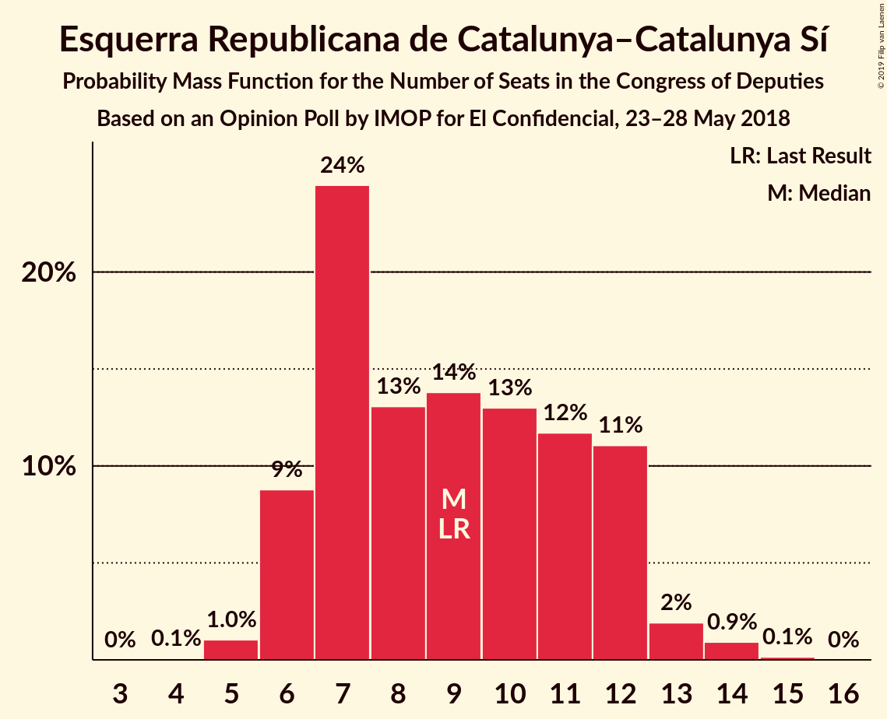
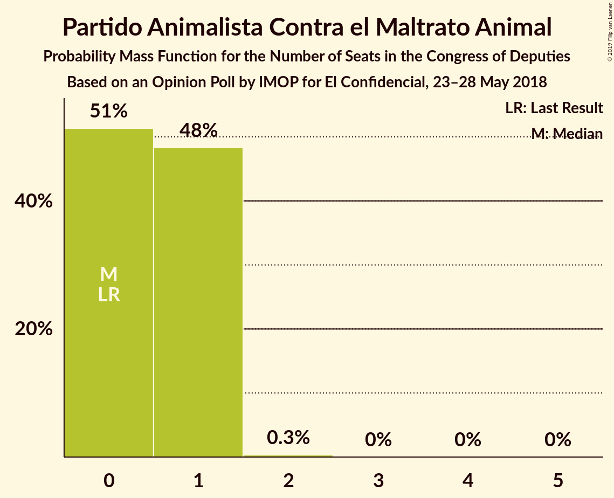
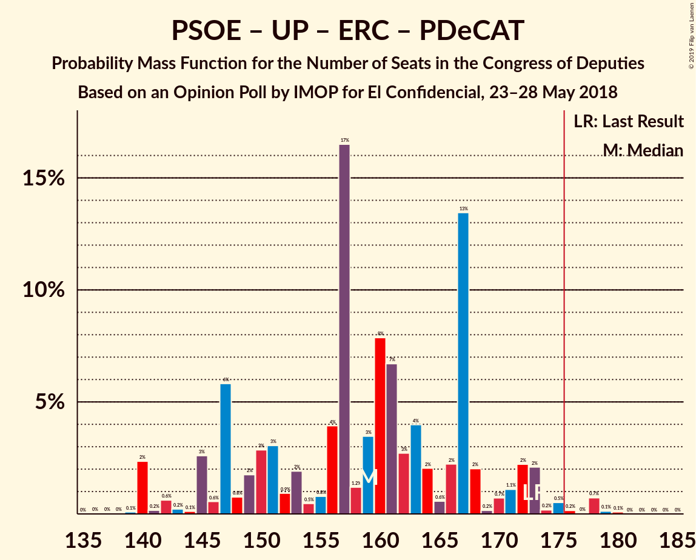

# Opinion Poll by IMOP for El Confidencial, 23–28 May 2018

<a href="#voting-intentions">Voting Intentions</a> | <a href="#seats">Seats</a> | <a href="#coalitions">Coalitions</a> | <a href="#technical-information">Technical Information</a>

## Voting Intentions

### Confidence Intervals

| Party | Last Result | Poll Result | 80% Confidence Interval | 90% Confidence Interval | 95% Confidence Interval | 99% Confidence Interval |
|:-----:|:-----------:|:-----------:|:-----------------------:|:-----------------------:|:-----------------------:|:-----------------------:|
| Ciudadanos–Partido de la Ciudadanía | 13.1% | 28.6% | 26.8–30.5% |26.3–31.0% |25.9–31.4% |25.0–32.3% |
| Partido Socialista Obrero Español | 22.6% | 20.6% | 19.0–22.3% |18.6–22.8% |18.2–23.2% |17.5–24.0% |
| Unidos Podemos | 21.2% | 19.7% | 18.2–21.4% |17.7–21.9% |17.4–22.3% |16.7–23.1% |
| Partido Popular | 33.0% | 19.6% | 18.1–21.3% |17.6–21.7% |17.3–22.2% |16.6–23.0% |
| Esquerra Republicana de Catalunya–Catalunya Sí | 2.7% | 2.4% | 1.9–3.1% |1.7–3.3% |1.6–3.5% |1.4–3.9% |
| Partido Animalista Contra el Maltrato Animal | 1.2% | 2.0% | 1.5–2.7% |1.4–2.9% |1.3–3.0% |1.1–3.4% |
| Partit Demòcrata Europeu Català | 2.0% | 1.8% | 1.3–2.4% |1.2–2.6% |1.1–2.8% |0.9–3.1% |
| Euzko Alderdi Jeltzalea/Partido Nacionalista Vasco | 1.2% | 1.2% | 0.8–1.8% |0.7–1.9% |0.7–2.1% |0.5–2.4% |
| Euskal Herria Bildu | 0.8% | 0.7% | 0.5–1.2% |0.4–1.3% |0.3–1.4% |0.2–1.7% |

*Note:* The poll result column reflects the actual value used in the calculations. Published results may vary slightly, and in addition be rounded to fewer digits.

## Seats

### Confidence Intervals

| Party | Last Result | Median | 80% Confidence Interval | 90% Confidence Interval | 95% Confidence Interval | 99% Confidence Interval |
|:-----:|:-----------:|:------:|:-----------------------:|:-----------------------:|:-----------------------:|:-----------------------:|
| <a href="#ciudadanos–partido-de-la-ciudadanía">Ciudadanos–Partido de la Ciudadanía</a> | 32 | 113 | 98–121 |93–121 |93–121 |93–121 |
| <a href="#partido-socialista-obrero-español">Partido Socialista Obrero Español</a> | 85 | 75 | 71–77 |71–81 |71–81 |71–89 |
| <a href="#unidos-podemos">Unidos Podemos</a> | 71 | 57 | 55–73 |55–73 |55–74 |51–74 |
| <a href="#partido-popular">Partido Popular</a> | 137 | 77 | 75–80 |73–80 |73–80 |71–80 |
| <a href="#esquerra-republicana-de-catalunya–catalunya-sí">Esquerra Republicana de Catalunya–Catalunya Sí</a> | 9 | 7 | 7–15 |7–15 |7–15 |7–15 |
| <a href="#partido-animalista-contra-el-maltrato-animal">Partido Animalista Contra el Maltrato Animal</a> | 0 | 0 | 0–1 |0–1 |0–1 |0–1 |
| <a href="#partit-demòcrata-europeu-català">Partit Demòcrata Europeu Català</a> | 8 | 12 | 6–12 |6–12 |2–12 |2–12 |
| <a href="#euzko-alderdi-jeltzalea/partido-nacionalista-vasco">Euzko Alderdi Jeltzalea/Partido Nacionalista Vasco</a> | 5 | 5 | 2–5 |2–6 |2–6 |2–9 |
| <a href="#euskal-herria-bildu">Euskal Herria Bildu</a> | 2 | 3 | 2–3 |2–3 |2–4 |2–7 |

### Ciudadanos–Partido de la Ciudadanía

*For a full overview of the results for this party, see the [Ciudadanos–Partido de la Ciudadanía](party-ciudadanos–partidodelaciudadanía.html) page.*

| Number of Seats | Probability | Accumulated | Special Marks |
|:---------------:|:-----------:|:-----------:|:-------------:|
| 32 | 0% | 100% | Last Result |
| 33 | 0% | 100% |  |
| 34 | 0% | 100% |  |
| 35 | 0% | 100% |  |
| 36 | 0% | 100% |  |
| 37 | 0% | 100% |  |
| 38 | 0% | 100% |  |
| 39 | 0% | 100% |  |
| 40 | 0% | 100% |  |
| 41 | 0% | 100% |  |
| 42 | 0% | 100% |  |
| 43 | 0% | 100% |  |
| 44 | 0% | 100% |  |
| 45 | 0% | 100% |  |
| 46 | 0% | 100% |  |
| 47 | 0% | 100% |  |
| 48 | 0% | 100% |  |
| 49 | 0% | 100% |  |
| 50 | 0% | 100% |  |
| 51 | 0% | 100% |  |
| 52 | 0% | 100% |  |
| 53 | 0% | 100% |  |
| 54 | 0% | 100% |  |
| 55 | 0% | 100% |  |
| 56 | 0% | 100% |  |
| 57 | 0% | 100% |  |
| 58 | 0% | 100% |  |
| 59 | 0% | 100% |  |
| 60 | 0% | 100% |  |
| 61 | 0% | 100% |  |
| 62 | 0% | 100% |  |
| 63 | 0% | 100% |  |
| 64 | 0% | 100% |  |
| 65 | 0% | 100% |  |
| 66 | 0% | 100% |  |
| 67 | 0% | 100% |  |
| 68 | 0% | 100% |  |
| 69 | 0% | 100% |  |
| 70 | 0% | 100% |  |
| 71 | 0% | 100% |  |
| 72 | 0% | 100% |  |
| 73 | 0% | 100% |  |
| 74 | 0% | 100% |  |
| 75 | 0% | 100% |  |
| 76 | 0% | 100% |  |
| 77 | 0% | 100% |  |
| 78 | 0% | 100% |  |
| 79 | 0% | 100% |  |
| 80 | 0% | 100% |  |
| 81 | 0% | 100% |  |
| 82 | 0% | 100% |  |
| 83 | 0% | 100% |  |
| 84 | 0% | 100% |  |
| 85 | 0% | 100% |  |
| 86 | 0% | 100% |  |
| 87 | 0% | 100% |  |
| 88 | 0% | 100% |  |
| 89 | 0% | 100% |  |
| 90 | 0% | 100% |  |
| 91 | 0% | 100% |  |
| 92 | 0% | 100% |  |
| 93 | 8% | 100% |  |
| 94 | 0% | 92% |  |
| 95 | 0% | 92% |  |
| 96 | 0% | 92% |  |
| 97 | 0% | 92% |  |
| 98 | 3% | 92% |  |
| 99 | 0% | 89% |  |
| 100 | 0% | 89% |  |
| 101 | 0% | 89% |  |
| 102 | 0% | 89% |  |
| 103 | 0.1% | 89% |  |
| 104 | 0% | 89% |  |
| 105 | 0% | 89% |  |
| 106 | 0.2% | 89% |  |
| 107 | 0.7% | 89% |  |
| 108 | 0% | 88% |  |
| 109 | 0% | 88% |  |
| 110 | 0% | 88% |  |
| 111 | 0% | 88% |  |
| 112 | 0% | 88% |  |
| 113 | 63% | 88% | Median |
| 114 | 0% | 25% |  |
| 115 | 0% | 25% |  |
| 116 | 0% | 25% |  |
| 117 | 0% | 25% |  |
| 118 | 0% | 25% |  |
| 119 | 0% | 25% |  |
| 120 | 0% | 25% |  |
| 121 | 25% | 25% |  |
| 122 | 0% | 0% |  |

### Partido Socialista Obrero Español

*For a full overview of the results for this party, see the [Partido Socialista Obrero Español](party-partidosocialistaobreroespañol.html) page.*

| Number of Seats | Probability | Accumulated | Special Marks |
|:---------------:|:-----------:|:-----------:|:-------------:|
| 70 | 0% | 100% |  |
| 71 | 24% | 99.9% |  |
| 72 | 0% | 76% |  |
| 73 | 0% | 76% |  |
| 74 | 0% | 76% |  |
| 75 | 63% | 76% | Median |
| 76 | 0% | 13% |  |
| 77 | 4% | 13% |  |
| 78 | 0% | 9% |  |
| 79 | 0% | 9% |  |
| 80 | 0.1% | 9% |  |
| 81 | 8% | 9% |  |
| 82 | 0% | 1.0% |  |
| 83 | 0% | 1.0% |  |
| 84 | 0% | 1.0% |  |
| 85 | 0% | 0.9% | Last Result |
| 86 | 0% | 0.9% |  |
| 87 | 0.2% | 0.9% |  |
| 88 | 0% | 0.7% |  |
| 89 | 0.7% | 0.7% |  |
| 90 | 0% | 0% |  |

### Unidos Podemos

*For a full overview of the results for this party, see the [Unidos Podemos](party-unidospodemos.html) page.*

| Number of Seats | Probability | Accumulated | Special Marks |
|:---------------:|:-----------:|:-----------:|:-------------:|
| 44 | 0.1% | 100% |  |
| 45 | 0% | 99.9% |  |
| 46 | 0% | 99.9% |  |
| 47 | 0% | 99.9% |  |
| 48 | 0.1% | 99.9% |  |
| 49 | 0% | 99.8% |  |
| 50 | 0% | 99.8% |  |
| 51 | 0.7% | 99.8% |  |
| 52 | 1.5% | 99.1% |  |
| 53 | 0% | 98% |  |
| 54 | 0% | 98% |  |
| 55 | 24% | 98% |  |
| 56 | 0% | 74% |  |
| 57 | 63% | 74% | Median |
| 58 | 0% | 11% |  |
| 59 | 0% | 11% |  |
| 60 | 0% | 11% |  |
| 61 | 0% | 11% |  |
| 62 | 0% | 11% |  |
| 63 | 0% | 11% |  |
| 64 | 0% | 11% |  |
| 65 | 0% | 11% |  |
| 66 | 0% | 11% |  |
| 67 | 0% | 11% |  |
| 68 | 0.2% | 11% |  |
| 69 | 0% | 11% |  |
| 70 | 0% | 11% |  |
| 71 | 0% | 11% | Last Result |
| 72 | 0% | 11% |  |
| 73 | 8% | 11% |  |
| 74 | 3% | 3% |  |
| 75 | 0% | 0% |  |

### Partido Popular

*For a full overview of the results for this party, see the [Partido Popular](party-partidopopular.html) page.*

| Number of Seats | Probability | Accumulated | Special Marks |
|:---------------:|:-----------:|:-----------:|:-------------:|
| 59 | 0.2% | 100% |  |
| 60 | 0% | 99.8% |  |
| 61 | 0% | 99.8% |  |
| 62 | 0% | 99.8% |  |
| 63 | 0% | 99.8% |  |
| 64 | 0% | 99.8% |  |
| 65 | 0% | 99.8% |  |
| 66 | 0% | 99.8% |  |
| 67 | 0% | 99.8% |  |
| 68 | 0% | 99.8% |  |
| 69 | 0% | 99.8% |  |
| 70 | 0% | 99.8% |  |
| 71 | 1.5% | 99.8% |  |
| 72 | 0% | 98% |  |
| 73 | 8% | 98% |  |
| 74 | 0% | 91% |  |
| 75 | 4% | 91% |  |
| 76 | 0% | 87% |  |
| 77 | 63% | 87% | Median |
| 78 | 0% | 24% |  |
| 79 | 0% | 24% |  |
| 80 | 24% | 24% |  |
| 81 | 0% | 0.3% |  |
| 82 | 0% | 0.2% |  |
| 83 | 0% | 0.2% |  |
| 84 | 0% | 0.2% |  |
| 85 | 0% | 0.2% |  |
| 86 | 0% | 0.2% |  |
| 87 | 0% | 0.2% |  |
| 88 | 0% | 0.2% |  |
| 89 | 0% | 0.2% |  |
| 90 | 0% | 0.1% |  |
| 91 | 0% | 0.1% |  |
| 92 | 0% | 0.1% |  |
| 93 | 0% | 0.1% |  |
| 94 | 0% | 0.1% |  |
| 95 | 0.1% | 0.1% |  |
| 96 | 0% | 0% |  |
| 97 | 0% | 0% |  |
| 98 | 0% | 0% |  |
| 99 | 0% | 0% |  |
| 100 | 0% | 0% |  |
| 101 | 0% | 0% |  |
| 102 | 0% | 0% |  |
| 103 | 0% | 0% |  |
| 104 | 0% | 0% |  |
| 105 | 0% | 0% |  |
| 106 | 0% | 0% |  |
| 107 | 0% | 0% |  |
| 108 | 0% | 0% |  |
| 109 | 0% | 0% |  |
| 110 | 0% | 0% |  |
| 111 | 0% | 0% |  |
| 112 | 0% | 0% |  |
| 113 | 0% | 0% |  |
| 114 | 0% | 0% |  |
| 115 | 0% | 0% |  |
| 116 | 0% | 0% |  |
| 117 | 0% | 0% |  |
| 118 | 0% | 0% |  |
| 119 | 0% | 0% |  |
| 120 | 0% | 0% |  |
| 121 | 0% | 0% |  |
| 122 | 0% | 0% |  |
| 123 | 0% | 0% |  |
| 124 | 0% | 0% |  |
| 125 | 0% | 0% |  |
| 126 | 0% | 0% |  |
| 127 | 0% | 0% |  |
| 128 | 0% | 0% |  |
| 129 | 0% | 0% |  |
| 130 | 0% | 0% |  |
| 131 | 0% | 0% |  |
| 132 | 0% | 0% |  |
| 133 | 0% | 0% |  |
| 134 | 0% | 0% |  |
| 135 | 0% | 0% |  |
| 136 | 0% | 0% |  |
| 137 | 0% | 0% | Last Result |

### Esquerra Republicana de Catalunya–Catalunya Sí

*For a full overview of the results for this party, see the [Esquerra Republicana de Catalunya–Catalunya Sí](party-esquerrarepublicanadecatalunya–catalunyasí.html) page.*

| Number of Seats | Probability | Accumulated | Special Marks |
|:---------------:|:-----------:|:-----------:|:-------------:|
| 6 | 0.1% | 100% |  |
| 7 | 63% | 99.9% | Median |
| 8 | 24% | 37% |  |
| 9 | 2% | 13% | Last Result |
| 10 | 0% | 11% |  |
| 11 | 0% | 11% |  |
| 12 | 0% | 11% |  |
| 13 | 0% | 11% |  |
| 14 | 0% | 11% |  |
| 15 | 11% | 11% |  |
| 16 | 0% | 0% |  |

### Partido Animalista Contra el Maltrato Animal

*For a full overview of the results for this party, see the [Partido Animalista Contra el Maltrato Animal](party-partidoanimalistacontraelmaltratoanimal.html) page.*

| Number of Seats | Probability | Accumulated | Special Marks |
|:---------------:|:-----------:|:-----------:|:-------------:|
| 0 | 73% | 100% | Last Result, Median |
| 1 | 27% | 27% |  |
| 2 | 0% | 0% |  |

### Partit Demòcrata Europeu Català

*For a full overview of the results for this party, see the [Partit Demòcrata Europeu Català](party-partitdemòcrataeuropeucatalà.html) page.*

| Number of Seats | Probability | Accumulated | Special Marks |
|:---------------:|:-----------:|:-----------:|:-------------:|
| 2 | 3% | 100% |  |
| 3 | 0% | 97% |  |
| 4 | 0% | 97% |  |
| 5 | 0% | 97% |  |
| 6 | 10% | 97% |  |
| 7 | 0% | 87% |  |
| 8 | 24% | 87% | Last Result |
| 9 | 0% | 63% |  |
| 10 | 0.1% | 63% |  |
| 11 | 0% | 63% |  |
| 12 | 63% | 63% | Median |
| 13 | 0% | 0% |  |

### Euzko Alderdi Jeltzalea/Partido Nacionalista Vasco

*For a full overview of the results for this party, see the [Euzko Alderdi Jeltzalea/Partido Nacionalista Vasco](party-euzkoalderdijeltzaleapartidonacionalistavasco.html) page.*

| Number of Seats | Probability | Accumulated | Special Marks |
|:---------------:|:-----------:|:-----------:|:-------------:|
| 2 | 24% | 100% |  |
| 3 | 0.1% | 76% |  |
| 4 | 0.2% | 76% |  |
| 5 | 66% | 76% | Last Result, Median |
| 6 | 8% | 9% |  |
| 7 | 0% | 2% |  |
| 8 | 0% | 2% |  |
| 9 | 2% | 2% |  |
| 10 | 0.1% | 0.1% |  |
| 11 | 0% | 0% |  |

### Euskal Herria Bildu

*For a full overview of the results for this party, see the [Euskal Herria Bildu](party-euskalherriabildu.html) page.*

| Number of Seats | Probability | Accumulated | Special Marks |
|:---------------:|:-----------:|:-----------:|:-------------:|
| 2 | 11% | 100% | Last Result |
| 3 | 87% | 89% | Median |
| 4 | 2% | 3% |  |
| 5 | 0% | 0.9% |  |
| 6 | 0% | 0.9% |  |
| 7 | 0.7% | 0.9% |  |
| 8 | 0% | 0.2% |  |
| 9 | 0% | 0.2% |  |
| 10 | 0.2% | 0.2% |  |
| 11 | 0% | 0% |  |

## Coalitions

### Confidence Intervals

| Coalition | Last Result | Median | Majority? | 80% Confidence Interval | 90% Confidence Interval | 95% Confidence Interval | 99% Confidence Interval |
|:---------:|:-----------:|:------:|:---------:|:-----------------------:|:-----------------------:|:-----------------------:|:-----------------------:|
| Ciudadanos–Partido de la Ciudadanía – Partido Socialista Obrero Español – Partido Popular | 254 | 265 | 100% | 250–272 | 247–272 | 247–272 | 247–272 |
| Ciudadanos–Partido de la Ciudadanía – Partido Socialista Obrero Español – Unidos Podemos | 188 | 245 | 100% | 245–247 | 245–247 | 245–249 | 245–250 |
| Ciudadanos–Partido de la Ciudadanía – Partido Popular | 169 | 190 | 89% | 173–201 | 166–201 | 166–201 | 166–201 |
| Ciudadanos–Partido de la Ciudadanía – Partido Socialista Obrero Español | 117 | 188 | 89% | 175–192 | 174–192 | 174–192 | 174–198 |
| Partido Socialista Obrero Español – Unidos Podemos – Esquerra Republicana de Catalunya–Catalunya Sí – Partit Demòcrata Europeu Català – Euzko Alderdi Jeltzalea/Partido Nacionalista Vasco – Euskal Herria Bildu | 180 | 159 | 8% | 147–175 | 147–183 | 147–183 | 147–183 |
| Partido Socialista Obrero Español – Unidos Podemos – Esquerra Republicana de Catalunya–Catalunya Sí – Partit Demòcrata Europeu Català | 173 | 151 | 0% | 142–168 | 142–175 | 142–175 | 142–175 |
| Partido Socialista Obrero Español – Unidos Podemos – Esquerra Republicana de Catalunya–Catalunya Sí – Euskal Herria Bildu | 167 | 142 | 0% | 137–168 | 137–171 | 137–171 | 137–171 |
| Partido Socialista Obrero Español – Unidos Podemos – Euzko Alderdi Jeltzalea/Partido Nacionalista Vasco – Euskal Herria Bildu | 163 | 140 | 0% | 131–158 | 131–162 | 131–162 | 131–162 |
| Partido Socialista Obrero Español – Partido Popular | 222 | 152 | 0% | 151–152 | 151–154 | 151–154 | 148–164 |
| Partido Socialista Obrero Español – Unidos Podemos | 156 | 132 | 0% | 126–151 | 126–154 | 126–154 | 126–154 |
| Partido Socialista Obrero Español | 85 | 75 | 0% | 71–77 | 71–81 | 71–81 | 71–89 |
| Partido Popular | 137 | 77 | 0% | 75–80 | 73–80 | 73–80 | 71–80 |

### Ciudadanos–Partido de la Ciudadanía – Partido Socialista Obrero Español – Partido Popular

| Number of Seats | Probability | Accumulated | Special Marks |
|:---------------:|:-----------:|:-----------:|:-------------:|
| 247 | 8% | 100% |  |
| 248 | 0% | 92% |  |
| 249 | 0% | 92% |  |
| 250 | 3% | 92% |  |
| 251 | 0% | 89% |  |
| 252 | 0.2% | 89% |  |
| 253 | 0% | 89% |  |
| 254 | 0% | 89% | Last Result |
| 255 | 0% | 89% |  |
| 256 | 0% | 89% |  |
| 257 | 0% | 89% |  |
| 258 | 0% | 89% |  |
| 259 | 0% | 89% |  |
| 260 | 0% | 89% |  |
| 261 | 0% | 89% |  |
| 262 | 0% | 89% |  |
| 263 | 0% | 89% |  |
| 264 | 0% | 89% |  |
| 265 | 63% | 89% | Median |
| 266 | 0% | 26% |  |
| 267 | 0% | 26% |  |
| 268 | 0% | 26% |  |
| 269 | 1.5% | 26% |  |
| 270 | 0% | 25% |  |
| 271 | 0.8% | 25% |  |
| 272 | 24% | 24% |  |
| 273 | 0% | 0.2% |  |
| 274 | 0% | 0.2% |  |
| 275 | 0% | 0.1% |  |
| 276 | 0% | 0.1% |  |
| 277 | 0% | 0.1% |  |
| 278 | 0.1% | 0.1% |  |
| 279 | 0% | 0% |  |

### Ciudadanos–Partido de la Ciudadanía – Partido Socialista Obrero Español – Unidos Podemos

| Number of Seats | Probability | Accumulated | Special Marks |
|:---------------:|:-----------:|:-----------:|:-------------:|
| 188 | 0% | 100% | Last Result |
| 189 | 0% | 100% |  |
| 190 | 0% | 100% |  |
| 191 | 0% | 100% |  |
| 192 | 0% | 100% |  |
| 193 | 0% | 100% |  |
| 194 | 0% | 100% |  |
| 195 | 0% | 100% |  |
| 196 | 0% | 100% |  |
| 197 | 0% | 100% |  |
| 198 | 0% | 100% |  |
| 199 | 0% | 100% |  |
| 200 | 0% | 100% |  |
| 201 | 0% | 100% |  |
| 202 | 0% | 100% |  |
| 203 | 0% | 100% |  |
| 204 | 0% | 100% |  |
| 205 | 0% | 100% |  |
| 206 | 0% | 100% |  |
| 207 | 0% | 100% |  |
| 208 | 0% | 100% |  |
| 209 | 0% | 100% |  |
| 210 | 0% | 100% |  |
| 211 | 0% | 100% |  |
| 212 | 0% | 100% |  |
| 213 | 0% | 100% |  |
| 214 | 0% | 100% |  |
| 215 | 0% | 100% |  |
| 216 | 0% | 100% |  |
| 217 | 0% | 100% |  |
| 218 | 0% | 100% |  |
| 219 | 0% | 100% |  |
| 220 | 0% | 100% |  |
| 221 | 0% | 100% |  |
| 222 | 0% | 100% |  |
| 223 | 0% | 100% |  |
| 224 | 0% | 100% |  |
| 225 | 0% | 100% |  |
| 226 | 0% | 100% |  |
| 227 | 0.1% | 100% |  |
| 228 | 0% | 99.9% |  |
| 229 | 0% | 99.9% |  |
| 230 | 0% | 99.9% |  |
| 231 | 0% | 99.8% |  |
| 232 | 0% | 99.8% |  |
| 233 | 0% | 99.8% |  |
| 234 | 0% | 99.8% |  |
| 235 | 0% | 99.8% |  |
| 236 | 0% | 99.8% |  |
| 237 | 0% | 99.8% |  |
| 238 | 0.1% | 99.8% |  |
| 239 | 0% | 99.7% |  |
| 240 | 0% | 99.7% |  |
| 241 | 0% | 99.7% |  |
| 242 | 0% | 99.7% |  |
| 243 | 0% | 99.7% |  |
| 244 | 0% | 99.7% |  |
| 245 | 63% | 99.7% | Median |
| 246 | 0% | 37% |  |
| 247 | 32% | 37% |  |
| 248 | 0% | 5% |  |
| 249 | 3% | 5% |  |
| 250 | 2% | 2% |  |
| 251 | 0% | 0.2% |  |
| 252 | 0% | 0.2% |  |
| 253 | 0% | 0.2% |  |
| 254 | 0% | 0.2% |  |
| 255 | 0% | 0.2% |  |
| 256 | 0% | 0.2% |  |
| 257 | 0% | 0.2% |  |
| 258 | 0% | 0.2% |  |
| 259 | 0% | 0.2% |  |
| 260 | 0% | 0.2% |  |
| 261 | 0.2% | 0.2% |  |
| 262 | 0% | 0% |  |

### Ciudadanos–Partido de la Ciudadanía – Partido Popular

| Number of Seats | Probability | Accumulated | Special Marks |
|:---------------:|:-----------:|:-----------:|:-------------:|
| 165 | 0.2% | 100% |  |
| 166 | 8% | 99.8% |  |
| 167 | 0% | 92% |  |
| 168 | 0% | 92% |  |
| 169 | 0% | 92% | Last Result |
| 170 | 0% | 92% |  |
| 171 | 0% | 92% |  |
| 172 | 0% | 92% |  |
| 173 | 3% | 92% |  |
| 174 | 0% | 89% |  |
| 175 | 0% | 89% |  |
| 176 | 0% | 89% | Majority |
| 177 | 0% | 89% |  |
| 178 | 0% | 89% |  |
| 179 | 0% | 89% |  |
| 180 | 0% | 89% |  |
| 181 | 0% | 89% |  |
| 182 | 0.7% | 89% |  |
| 183 | 0% | 88% |  |
| 184 | 0% | 88% |  |
| 185 | 0% | 88% |  |
| 186 | 0% | 88% |  |
| 187 | 0.1% | 88% |  |
| 188 | 0% | 88% |  |
| 189 | 0% | 88% |  |
| 190 | 63% | 88% | Median |
| 191 | 0% | 26% |  |
| 192 | 1.5% | 26% |  |
| 193 | 0% | 24% |  |
| 194 | 0% | 24% |  |
| 195 | 0% | 24% |  |
| 196 | 0% | 24% |  |
| 197 | 0% | 24% |  |
| 198 | 0.1% | 24% |  |
| 199 | 0% | 24% |  |
| 200 | 0% | 24% |  |
| 201 | 24% | 24% |  |
| 202 | 0% | 0% |  |

### Ciudadanos–Partido de la Ciudadanía – Partido Socialista Obrero Español

| Number of Seats | Probability | Accumulated | Special Marks |
|:---------------:|:-----------:|:-----------:|:-------------:|
| 117 | 0% | 100% | Last Result |
| 118 | 0% | 100% |  |
| 119 | 0% | 100% |  |
| 120 | 0% | 100% |  |
| 121 | 0% | 100% |  |
| 122 | 0% | 100% |  |
| 123 | 0% | 100% |  |
| 124 | 0% | 100% |  |
| 125 | 0% | 100% |  |
| 126 | 0% | 100% |  |
| 127 | 0% | 100% |  |
| 128 | 0% | 100% |  |
| 129 | 0% | 100% |  |
| 130 | 0% | 100% |  |
| 131 | 0% | 100% |  |
| 132 | 0% | 100% |  |
| 133 | 0% | 100% |  |
| 134 | 0% | 100% |  |
| 135 | 0% | 100% |  |
| 136 | 0% | 100% |  |
| 137 | 0% | 100% |  |
| 138 | 0% | 100% |  |
| 139 | 0% | 100% |  |
| 140 | 0% | 100% |  |
| 141 | 0% | 100% |  |
| 142 | 0% | 100% |  |
| 143 | 0% | 100% |  |
| 144 | 0% | 100% |  |
| 145 | 0% | 100% |  |
| 146 | 0% | 100% |  |
| 147 | 0% | 100% |  |
| 148 | 0% | 100% |  |
| 149 | 0% | 100% |  |
| 150 | 0% | 100% |  |
| 151 | 0% | 100% |  |
| 152 | 0% | 100% |  |
| 153 | 0% | 100% |  |
| 154 | 0% | 100% |  |
| 155 | 0% | 100% |  |
| 156 | 0% | 100% |  |
| 157 | 0% | 100% |  |
| 158 | 0% | 100% |  |
| 159 | 0% | 100% |  |
| 160 | 0% | 100% |  |
| 161 | 0% | 100% |  |
| 162 | 0% | 100% |  |
| 163 | 0% | 100% |  |
| 164 | 0% | 100% |  |
| 165 | 0% | 100% |  |
| 166 | 0% | 100% |  |
| 167 | 0% | 100% |  |
| 168 | 0% | 100% |  |
| 169 | 0% | 100% |  |
| 170 | 0% | 100% |  |
| 171 | 0% | 100% |  |
| 172 | 0% | 100% |  |
| 173 | 0% | 100% |  |
| 174 | 8% | 100% |  |
| 175 | 3% | 92% |  |
| 176 | 0% | 89% | Majority |
| 177 | 0% | 89% |  |
| 178 | 0% | 89% |  |
| 179 | 0% | 89% |  |
| 180 | 0% | 89% |  |
| 181 | 0% | 89% |  |
| 182 | 0% | 89% |  |
| 183 | 0.1% | 89% |  |
| 184 | 0% | 89% |  |
| 185 | 0% | 89% |  |
| 186 | 0% | 89% |  |
| 187 | 0% | 89% |  |
| 188 | 63% | 89% | Median |
| 189 | 0% | 26% |  |
| 190 | 0.1% | 26% |  |
| 191 | 0% | 26% |  |
| 192 | 24% | 26% |  |
| 193 | 0.2% | 2% |  |
| 194 | 0% | 2% |  |
| 195 | 0% | 2% |  |
| 196 | 0.7% | 2% |  |
| 197 | 0% | 2% |  |
| 198 | 1.5% | 2% |  |
| 199 | 0% | 0% |  |

### Partido Socialista Obrero Español – Unidos Podemos – Esquerra Republicana de Catalunya–Catalunya Sí – Partit Demòcrata Europeu Català – Euzko Alderdi Jeltzalea/Partido Nacionalista Vasco – Euskal Herria Bildu

| Number of Seats | Probability | Accumulated | Special Marks |
|:---------------:|:-----------:|:-----------:|:-------------:|
| 147 | 24% | 100% |  |
| 148 | 0% | 76% |  |
| 149 | 0% | 76% |  |
| 150 | 0.1% | 76% |  |
| 151 | 0% | 76% |  |
| 152 | 0% | 76% |  |
| 153 | 0% | 76% |  |
| 154 | 0% | 76% |  |
| 155 | 0% | 76% |  |
| 156 | 0% | 76% |  |
| 157 | 1.5% | 76% |  |
| 158 | 0% | 74% |  |
| 159 | 63% | 74% | Median |
| 160 | 0% | 12% |  |
| 161 | 0% | 12% |  |
| 162 | 0.1% | 12% |  |
| 163 | 0% | 12% |  |
| 164 | 0% | 12% |  |
| 165 | 0% | 12% |  |
| 166 | 0% | 12% |  |
| 167 | 0.7% | 12% |  |
| 168 | 0% | 11% |  |
| 169 | 0% | 11% |  |
| 170 | 0% | 11% |  |
| 171 | 0% | 11% |  |
| 172 | 0% | 11% |  |
| 173 | 0% | 11% |  |
| 174 | 0% | 11% |  |
| 175 | 3% | 11% |  |
| 176 | 0% | 8% | Majority |
| 177 | 0% | 8% |  |
| 178 | 0% | 8% |  |
| 179 | 0% | 8% |  |
| 180 | 0% | 8% | Last Result |
| 181 | 0% | 8% |  |
| 182 | 0% | 8% |  |
| 183 | 8% | 8% |  |
| 184 | 0.2% | 0.2% |  |
| 185 | 0% | 0% |  |

### Partido Socialista Obrero Español – Unidos Podemos – Esquerra Republicana de Catalunya–Catalunya Sí – Partit Demòcrata Europeu Català

| Number of Seats | Probability | Accumulated | Special Marks |
|:---------------:|:-----------:|:-----------:|:-------------:|
| 139 | 0% | 100% |  |
| 140 | 0.1% | 99.9% |  |
| 141 | 0% | 99.9% |  |
| 142 | 24% | 99.8% |  |
| 143 | 0% | 76% |  |
| 144 | 1.5% | 76% |  |
| 145 | 0% | 74% |  |
| 146 | 0% | 74% |  |
| 147 | 0.1% | 74% |  |
| 148 | 0% | 74% |  |
| 149 | 0% | 74% |  |
| 150 | 0% | 74% |  |
| 151 | 63% | 74% | Median |
| 152 | 0% | 12% |  |
| 153 | 0% | 12% |  |
| 154 | 0% | 12% |  |
| 155 | 0.7% | 12% |  |
| 156 | 0% | 11% |  |
| 157 | 0% | 11% |  |
| 158 | 0% | 11% |  |
| 159 | 0% | 11% |  |
| 160 | 0% | 11% |  |
| 161 | 0% | 11% |  |
| 162 | 0% | 11% |  |
| 163 | 0% | 11% |  |
| 164 | 0% | 11% |  |
| 165 | 0% | 11% |  |
| 166 | 0% | 11% |  |
| 167 | 0% | 11% |  |
| 168 | 3% | 11% |  |
| 169 | 0% | 8% |  |
| 170 | 0.2% | 8% |  |
| 171 | 0% | 8% |  |
| 172 | 0% | 8% |  |
| 173 | 0% | 8% | Last Result |
| 174 | 0% | 8% |  |
| 175 | 8% | 8% |  |
| 176 | 0% | 0% | Majority |

### Partido Socialista Obrero Español – Unidos Podemos – Esquerra Republicana de Catalunya–Catalunya Sí – Euskal Herria Bildu

| Number of Seats | Probability | Accumulated | Special Marks |
|:---------------:|:-----------:|:-----------:|:-------------:|
| 134 | 0.1% | 100% |  |
| 135 | 0% | 99.9% |  |
| 136 | 0% | 99.9% |  |
| 137 | 24% | 99.9% |  |
| 138 | 0% | 76% |  |
| 139 | 0% | 76% |  |
| 140 | 0% | 76% |  |
| 141 | 0% | 76% |  |
| 142 | 64% | 76% | Median |
| 143 | 0% | 12% |  |
| 144 | 0% | 12% |  |
| 145 | 0% | 12% |  |
| 146 | 0% | 12% |  |
| 147 | 0% | 12% |  |
| 148 | 0% | 12% |  |
| 149 | 0% | 12% |  |
| 150 | 0% | 12% |  |
| 151 | 0% | 12% |  |
| 152 | 0% | 12% |  |
| 153 | 0% | 12% |  |
| 154 | 0% | 12% |  |
| 155 | 0% | 12% |  |
| 156 | 0.7% | 12% |  |
| 157 | 0% | 11% |  |
| 158 | 0% | 11% |  |
| 159 | 0% | 11% |  |
| 160 | 0% | 11% |  |
| 161 | 0% | 11% |  |
| 162 | 0% | 11% |  |
| 163 | 0% | 11% |  |
| 164 | 0% | 11% |  |
| 165 | 0% | 11% |  |
| 166 | 0% | 11% |  |
| 167 | 0% | 11% | Last Result |
| 168 | 3% | 11% |  |
| 169 | 0% | 8% |  |
| 170 | 0% | 8% |  |
| 171 | 8% | 8% |  |
| 172 | 0.2% | 0.2% |  |
| 173 | 0% | 0% |  |

### Partido Socialista Obrero Español – Unidos Podemos – Euzko Alderdi Jeltzalea/Partido Nacionalista Vasco – Euskal Herria Bildu

| Number of Seats | Probability | Accumulated | Special Marks |
|:---------------:|:-----------:|:-----------:|:-------------:|
| 131 | 24% | 100% |  |
| 132 | 0% | 76% |  |
| 133 | 0% | 76% |  |
| 134 | 0.1% | 76% |  |
| 135 | 0% | 76% |  |
| 136 | 0% | 76% |  |
| 137 | 0% | 76% |  |
| 138 | 0% | 76% |  |
| 139 | 0% | 76% |  |
| 140 | 63% | 76% | Median |
| 141 | 0% | 13% |  |
| 142 | 2% | 13% |  |
| 143 | 0% | 12% |  |
| 144 | 0% | 12% |  |
| 145 | 0% | 12% |  |
| 146 | 0% | 12% |  |
| 147 | 0% | 12% |  |
| 148 | 0% | 12% |  |
| 149 | 0% | 12% |  |
| 150 | 0% | 12% |  |
| 151 | 0% | 12% |  |
| 152 | 0.7% | 12% |  |
| 153 | 0% | 11% |  |
| 154 | 0% | 11% |  |
| 155 | 0% | 11% |  |
| 156 | 0% | 11% |  |
| 157 | 0% | 11% |  |
| 158 | 3% | 11% |  |
| 159 | 0% | 8% |  |
| 160 | 0% | 8% |  |
| 161 | 0% | 8% |  |
| 162 | 8% | 8% |  |
| 163 | 0% | 0.2% | Last Result |
| 164 | 0% | 0.2% |  |
| 165 | 0% | 0.2% |  |
| 166 | 0% | 0.2% |  |
| 167 | 0% | 0.2% |  |
| 168 | 0% | 0.2% |  |
| 169 | 0.2% | 0.2% |  |
| 170 | 0% | 0% |  |

### Partido Socialista Obrero Español – Partido Popular

| Number of Seats | Probability | Accumulated | Special Marks |
|:---------------:|:-----------:|:-----------:|:-------------:|
| 146 | 0.2% | 100% |  |
| 147 | 0% | 99.8% |  |
| 148 | 2% | 99.8% |  |
| 149 | 0% | 98% |  |
| 150 | 0% | 98% |  |
| 151 | 24% | 98% |  |
| 152 | 66% | 74% | Median |
| 153 | 0% | 9% |  |
| 154 | 8% | 9% |  |
| 155 | 0% | 1.0% |  |
| 156 | 0% | 1.0% |  |
| 157 | 0% | 0.9% |  |
| 158 | 0% | 0.9% |  |
| 159 | 0% | 0.9% |  |
| 160 | 0% | 0.9% |  |
| 161 | 0% | 0.9% |  |
| 162 | 0% | 0.9% |  |
| 163 | 0% | 0.9% |  |
| 164 | 0.7% | 0.9% |  |
| 165 | 0% | 0.2% |  |
| 166 | 0% | 0.2% |  |
| 167 | 0% | 0.2% |  |
| 168 | 0% | 0.2% |  |
| 169 | 0% | 0.2% |  |
| 170 | 0% | 0.2% |  |
| 171 | 0% | 0.1% |  |
| 172 | 0% | 0.1% |  |
| 173 | 0% | 0.1% |  |
| 174 | 0% | 0.1% |  |
| 175 | 0.1% | 0.1% |  |
| 176 | 0% | 0% | Majority |
| 177 | 0% | 0% |  |
| 178 | 0% | 0% |  |
| 179 | 0% | 0% |  |
| 180 | 0% | 0% |  |
| 181 | 0% | 0% |  |
| 182 | 0% | 0% |  |
| 183 | 0% | 0% |  |
| 184 | 0% | 0% |  |
| 185 | 0% | 0% |  |
| 186 | 0% | 0% |  |
| 187 | 0% | 0% |  |
| 188 | 0% | 0% |  |
| 189 | 0% | 0% |  |
| 190 | 0% | 0% |  |
| 191 | 0% | 0% |  |
| 192 | 0% | 0% |  |
| 193 | 0% | 0% |  |
| 194 | 0% | 0% |  |
| 195 | 0% | 0% |  |
| 196 | 0% | 0% |  |
| 197 | 0% | 0% |  |
| 198 | 0% | 0% |  |
| 199 | 0% | 0% |  |
| 200 | 0% | 0% |  |
| 201 | 0% | 0% |  |
| 202 | 0% | 0% |  |
| 203 | 0% | 0% |  |
| 204 | 0% | 0% |  |
| 205 | 0% | 0% |  |
| 206 | 0% | 0% |  |
| 207 | 0% | 0% |  |
| 208 | 0% | 0% |  |
| 209 | 0% | 0% |  |
| 210 | 0% | 0% |  |
| 211 | 0% | 0% |  |
| 212 | 0% | 0% |  |
| 213 | 0% | 0% |  |
| 214 | 0% | 0% |  |
| 215 | 0% | 0% |  |
| 216 | 0% | 0% |  |
| 217 | 0% | 0% |  |
| 218 | 0% | 0% |  |
| 219 | 0% | 0% |  |
| 220 | 0% | 0% |  |
| 221 | 0% | 0% |  |
| 222 | 0% | 0% | Last Result |

### Partido Socialista Obrero Español – Unidos Podemos

| Number of Seats | Probability | Accumulated | Special Marks |
|:---------------:|:-----------:|:-----------:|:-------------:|
| 124 | 0.1% | 100% |  |
| 125 | 0% | 99.9% |  |
| 126 | 24% | 99.9% |  |
| 127 | 0% | 76% |  |
| 128 | 0% | 76% |  |
| 129 | 2% | 76% |  |
| 130 | 0% | 74% |  |
| 131 | 0% | 74% |  |
| 132 | 63% | 74% | Median |
| 133 | 0% | 12% |  |
| 134 | 0% | 12% |  |
| 135 | 0% | 12% |  |
| 136 | 0% | 12% |  |
| 137 | 0% | 12% |  |
| 138 | 0% | 12% |  |
| 139 | 0% | 12% |  |
| 140 | 0.7% | 12% |  |
| 141 | 0% | 11% |  |
| 142 | 0% | 11% |  |
| 143 | 0% | 11% |  |
| 144 | 0% | 11% |  |
| 145 | 0% | 11% |  |
| 146 | 0% | 11% |  |
| 147 | 0% | 11% |  |
| 148 | 0% | 11% |  |
| 149 | 0% | 11% |  |
| 150 | 0% | 11% |  |
| 151 | 3% | 11% |  |
| 152 | 0% | 8% |  |
| 153 | 0% | 8% |  |
| 154 | 8% | 8% |  |
| 155 | 0.2% | 0.2% |  |
| 156 | 0% | 0% | Last Result |

### Partido Socialista Obrero Español

| Number of Seats | Probability | Accumulated | Special Marks |
|:---------------:|:-----------:|:-----------:|:-------------:|
| 70 | 0% | 100% |  |
| 71 | 24% | 99.9% |  |
| 72 | 0% | 76% |  |
| 73 | 0% | 76% |  |
| 74 | 0% | 76% |  |
| 75 | 63% | 76% | Median |
| 76 | 0% | 13% |  |
| 77 | 4% | 13% |  |
| 78 | 0% | 9% |  |
| 79 | 0% | 9% |  |
| 80 | 0.1% | 9% |  |
| 81 | 8% | 9% |  |
| 82 | 0% | 1.0% |  |
| 83 | 0% | 1.0% |  |
| 84 | 0% | 1.0% |  |
| 85 | 0% | 0.9% | Last Result |
| 86 | 0% | 0.9% |  |
| 87 | 0.2% | 0.9% |  |
| 88 | 0% | 0.7% |  |
| 89 | 0.7% | 0.7% |  |
| 90 | 0% | 0% |  |

### Partido Popular

| Number of Seats | Probability | Accumulated | Special Marks |
|:---------------:|:-----------:|:-----------:|:-------------:|
| 59 | 0.2% | 100% |  |
| 60 | 0% | 99.8% |  |
| 61 | 0% | 99.8% |  |
| 62 | 0% | 99.8% |  |
| 63 | 0% | 99.8% |  |
| 64 | 0% | 99.8% |  |
| 65 | 0% | 99.8% |  |
| 66 | 0% | 99.8% |  |
| 67 | 0% | 99.8% |  |
| 68 | 0% | 99.8% |  |
| 69 | 0% | 99.8% |  |
| 70 | 0% | 99.8% |  |
| 71 | 1.5% | 99.8% |  |
| 72 | 0% | 98% |  |
| 73 | 8% | 98% |  |
| 74 | 0% | 91% |  |
| 75 | 4% | 91% |  |
| 76 | 0% | 87% |  |
| 77 | 63% | 87% | Median |
| 78 | 0% | 24% |  |
| 79 | 0% | 24% |  |
| 80 | 24% | 24% |  |
| 81 | 0% | 0.3% |  |
| 82 | 0% | 0.2% |  |
| 83 | 0% | 0.2% |  |
| 84 | 0% | 0.2% |  |
| 85 | 0% | 0.2% |  |
| 86 | 0% | 0.2% |  |
| 87 | 0% | 0.2% |  |
| 88 | 0% | 0.2% |  |
| 89 | 0% | 0.2% |  |
| 90 | 0% | 0.1% |  |
| 91 | 0% | 0.1% |  |
| 92 | 0% | 0.1% |  |
| 93 | 0% | 0.1% |  |
| 94 | 0% | 0.1% |  |
| 95 | 0.1% | 0.1% |  |
| 96 | 0% | 0% |  |
| 97 | 0% | 0% |  |
| 98 | 0% | 0% |  |
| 99 | 0% | 0% |  |
| 100 | 0% | 0% |  |
| 101 | 0% | 0% |  |
| 102 | 0% | 0% |  |
| 103 | 0% | 0% |  |
| 104 | 0% | 0% |  |
| 105 | 0% | 0% |  |
| 106 | 0% | 0% |  |
| 107 | 0% | 0% |  |
| 108 | 0% | 0% |  |
| 109 | 0% | 0% |  |
| 110 | 0% | 0% |  |
| 111 | 0% | 0% |  |
| 112 | 0% | 0% |  |
| 113 | 0% | 0% |  |
| 114 | 0% | 0% |  |
| 115 | 0% | 0% |  |
| 116 | 0% | 0% |  |
| 117 | 0% | 0% |  |
| 118 | 0% | 0% |  |
| 119 | 0% | 0% |  |
| 120 | 0% | 0% |  |
| 121 | 0% | 0% |  |
| 122 | 0% | 0% |  |
| 123 | 0% | 0% |  |
| 124 | 0% | 0% |  |
| 125 | 0% | 0% |  |
| 126 | 0% | 0% |  |
| 127 | 0% | 0% |  |
| 128 | 0% | 0% |  |
| 129 | 0% | 0% |  |
| 130 | 0% | 0% |  |
| 131 | 0% | 0% |  |
| 132 | 0% | 0% |  |
| 133 | 0% | 0% |  |
| 134 | 0% | 0% |  |
| 135 | 0% | 0% |  |
| 136 | 0% | 0% |  |
| 137 | 0% | 0% | Last Result |

## Technical Information

### Opinion Poll

+ **Polling firm:** IMOP
+ **Commissioner(s):** El Confidencial
+ **Fieldwork period:** 23–28 May 2018

### Calculations

+ **Sample size:** 1015
+ **Simulations done:** 1,024
+ **Error estimate:** 5.09%

