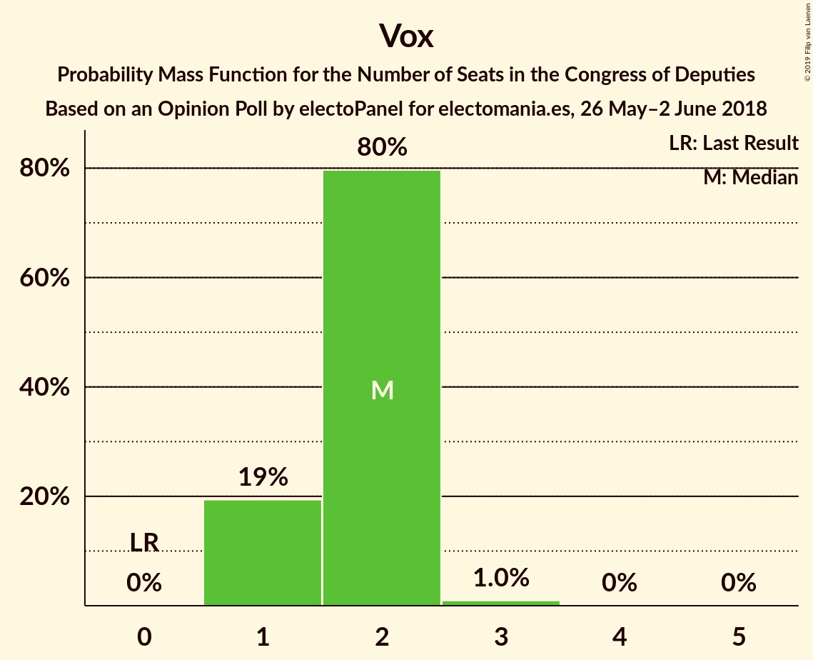
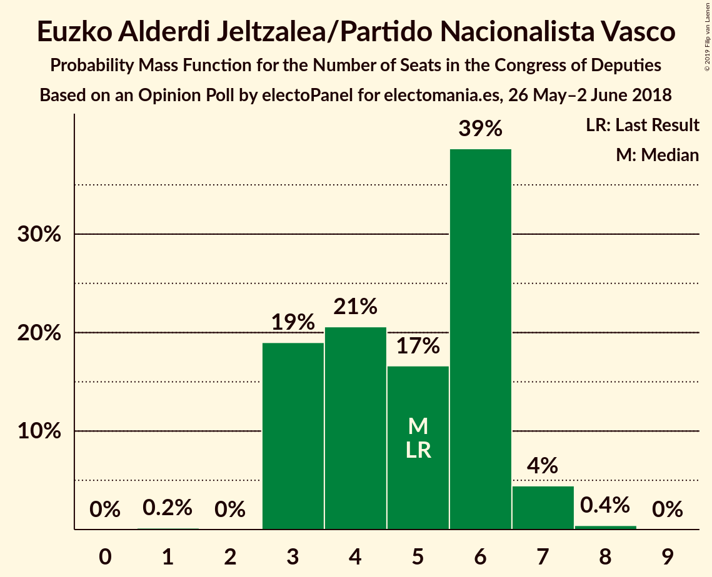
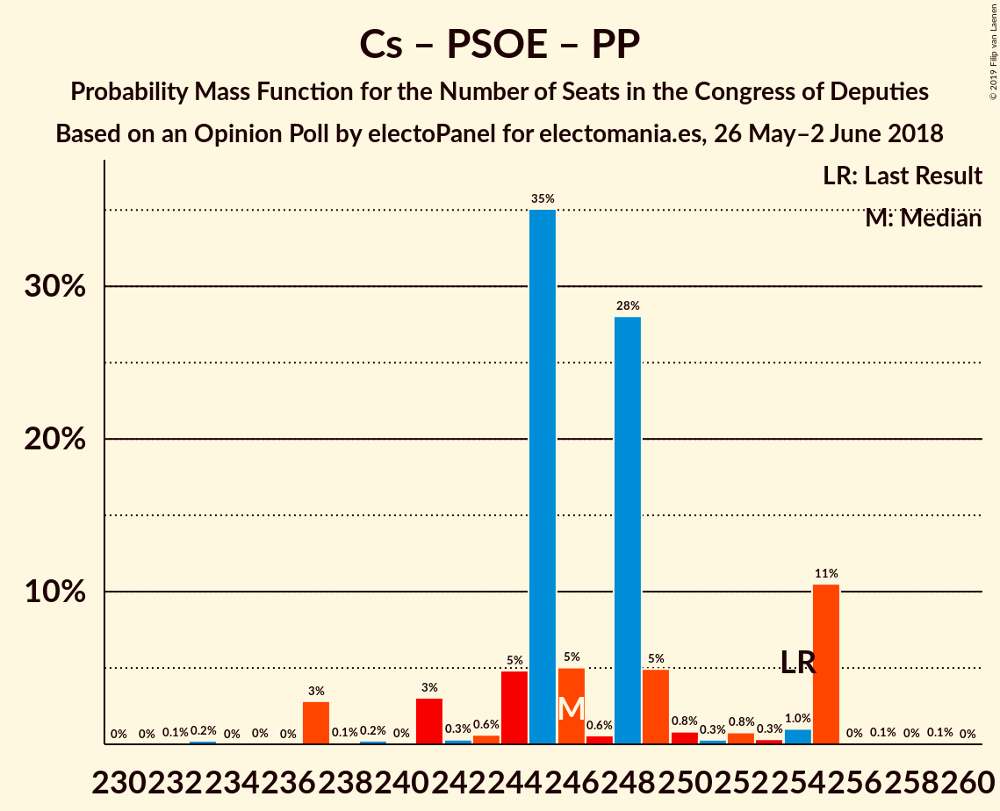
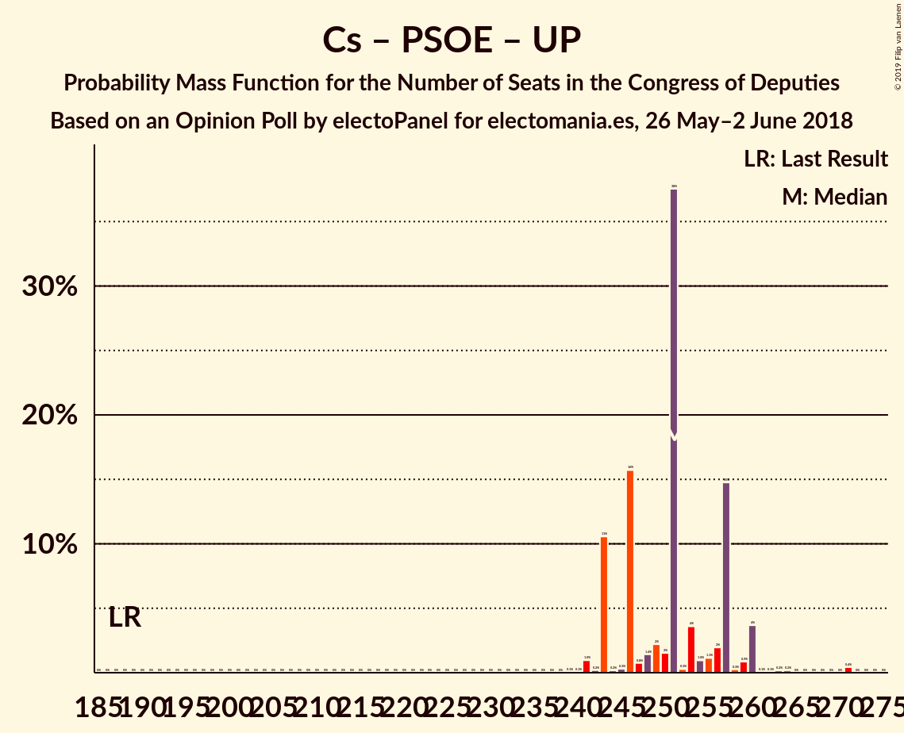

# Opinion Poll by electoPanel for electomania.es, 26 May–2 June 2018

<a href="#voting-intentions">Voting Intentions</a> | <a href="#seats">Seats</a> | <a href="#coalitions">Coalitions</a> | <a href="#technical-information">Technical Information</a>

## Voting Intentions

### Confidence Intervals

| Party | Last Result | Poll Result | 80% Confidence Interval | 90% Confidence Interval | 95% Confidence Interval | 99% Confidence Interval |
|:-----:|:-----------:|:-----------:|:-----------------------:|:-----------------------:|:-----------------------:|:-----------------------:|
| Ciudadanos–Partido de la Ciudadanía | 13.1% | 24.2% | 23.0–25.4% |22.6–25.8% |22.4–26.1% |21.8–26.7% |
| Partido Socialista Obrero Español | 22.6% | 22.0% | 20.8–23.2% |20.5–23.5% |20.2–23.8% |19.7–24.4% |
| Unidos Podemos | 21.2% | 20.9% | 19.8–22.1% |19.5–22.4% |19.2–22.7% |18.7–23.3% |
| Partido Popular | 33.0% | 18.0% | 16.9–19.1% |16.7–19.5% |16.4–19.8% |15.9–20.3% |
| Esquerra Republicana de Catalunya–Catalunya Sí | 2.7% | 2.9% | 2.5–3.4% |2.3–3.6% |2.2–3.7% |2.1–4.0% |
| Vox | 0.2% | 2.5% | 2.1–3.0% |2.0–3.2% |1.9–3.3% |1.7–3.5% |
| Partido Animalista Contra el Maltrato Animal | 1.2% | 2.0% | 1.7–2.5% |1.6–2.6% |1.5–2.7% |1.3–3.0% |
| Partit Demòcrata Europeu Català | 2.0% | 1.4% | 1.1–1.8% |1.1–1.9% |1.0–2.0% |0.9–2.2% |
| Euskal Herria Bildu | 0.8% | 1.3% | 1.1–1.7% |1.0–1.8% |0.9–1.9% |0.8–2.1% |
| Euzko Alderdi Jeltzalea/Partido Nacionalista Vasco | 1.2% | 1.2% | 1.0–1.6% |0.9–1.7% |0.8–1.8% |0.7–2.0% |
| Coalición Canaria–Partido Nacionalista Canario | 0.3% | 0.3% | 0.2–0.5% |0.2–0.6% |0.1–0.6% |0.1–0.8% |

*Note:* The poll result column reflects the actual value used in the calculations. Published results may vary slightly, and in addition be rounded to fewer digits.

## Seats

### Confidence Intervals

| Party | Last Result | Median | 80% Confidence Interval | 90% Confidence Interval | 95% Confidence Interval | 99% Confidence Interval |
|:-----:|:-----------:|:------:|:-----------------------:|:-----------------------:|:-----------------------:|:-----------------------:|
| <a href="#ciudadanos–partido-de-la-ciudadanía">Ciudadanos–Partido de la Ciudadanía</a> | 32 | 94 | 89–94 |86–94 |82–94 |76–94 |
| <a href="#partido-socialista-obrero-español">Partido Socialista Obrero Español</a> | 85 | 79 | 79–87 |79–88 |77–92 |77–97 |
| <a href="#unidos-podemos">Unidos Podemos</a> | 71 | 73 | 67–73 |67–75 |67–77 |67–86 |
| <a href="#partido-popular">Partido Popular</a> | 137 | 75 | 75–79 |72–79 |67–79 |55–79 |
| <a href="#esquerra-republicana-de-catalunya–catalunya-sí">Esquerra Republicana de Catalunya–Catalunya Sí</a> | 9 | 12 | 9–12 |9–13 |9–13 |9–14 |
| <a href="#vox">Vox</a> | 0 | 1 | 1–2 |1–2 |1–2 |1–3 |
| <a href="#partido-animalista-contra-el-maltrato-animal">Partido Animalista Contra el Maltrato Animal</a> | 0 | 0 | 0–1 |0–1 |0–1 |0–1 |
| <a href="#partit-demòcrata-europeu-català">Partit Demòcrata Europeu Català</a> | 8 | 5 | 5–6 |4–6 |4–8 |3–8 |
| <a href="#euskal-herria-bildu">Euskal Herria Bildu</a> | 2 | 6 | 6 |6–7 |6–7 |4–8 |
| <a href="#euzko-alderdi-jeltzalea/partido-nacionalista-vasco">Euzko Alderdi Jeltzalea/Partido Nacionalista Vasco</a> | 5 | 4 | 3–4 |3–4 |3–5 |3–6 |
| <a href="#coalición-canaria–partido-nacionalista-canario">Coalición Canaria–Partido Nacionalista Canario</a> | 1 | 1 | 1 |0–1 |0–1 |0–2 |

### Ciudadanos–Partido de la Ciudadanía

*For a full overview of the results for this party, see the [Ciudadanos–Partido de la Ciudadanía](party-ciudadanos–partidodelaciudadanía.html) page.*

| Number of Seats | Probability | Accumulated | Special Marks |
|:---------------:|:-----------:|:-----------:|:-------------:|
| 32 | 0% | 100% | Last Result |
| 33 | 0% | 100% |  |
| 34 | 0% | 100% |  |
| 35 | 0% | 100% |  |
| 36 | 0% | 100% |  |
| 37 | 0% | 100% |  |
| 38 | 0% | 100% |  |
| 39 | 0% | 100% |  |
| 40 | 0% | 100% |  |
| 41 | 0% | 100% |  |
| 42 | 0% | 100% |  |
| 43 | 0% | 100% |  |
| 44 | 0% | 100% |  |
| 45 | 0% | 100% |  |
| 46 | 0% | 100% |  |
| 47 | 0% | 100% |  |
| 48 | 0% | 100% |  |
| 49 | 0% | 100% |  |
| 50 | 0% | 100% |  |
| 51 | 0% | 100% |  |
| 52 | 0% | 100% |  |
| 53 | 0% | 100% |  |
| 54 | 0% | 100% |  |
| 55 | 0% | 100% |  |
| 56 | 0% | 100% |  |
| 57 | 0% | 100% |  |
| 58 | 0% | 100% |  |
| 59 | 0% | 100% |  |
| 60 | 0% | 100% |  |
| 61 | 0% | 100% |  |
| 62 | 0% | 100% |  |
| 63 | 0% | 100% |  |
| 64 | 0% | 100% |  |
| 65 | 0% | 100% |  |
| 66 | 0% | 100% |  |
| 67 | 0% | 100% |  |
| 68 | 0% | 100% |  |
| 69 | 0% | 100% |  |
| 70 | 0% | 100% |  |
| 71 | 0% | 100% |  |
| 72 | 0% | 100% |  |
| 73 | 0% | 100% |  |
| 74 | 0% | 100% |  |
| 75 | 0% | 100% |  |
| 76 | 0.6% | 100% |  |
| 77 | 0% | 99.3% |  |
| 78 | 0.4% | 99.3% |  |
| 79 | 0.1% | 98.9% |  |
| 80 | 0.1% | 98.8% |  |
| 81 | 0.4% | 98.7% |  |
| 82 | 0.9% | 98% |  |
| 83 | 0% | 97% |  |
| 84 | 0.6% | 97% |  |
| 85 | 0% | 97% |  |
| 86 | 2% | 97% |  |
| 87 | 0.1% | 95% |  |
| 88 | 0.1% | 95% |  |
| 89 | 40% | 95% |  |
| 90 | 0.2% | 55% |  |
| 91 | 0.7% | 55% |  |
| 92 | 0.1% | 54% |  |
| 93 | 0.8% | 54% |  |
| 94 | 53% | 53% | Median |
| 95 | 0% | 0.3% |  |
| 96 | 0% | 0.2% |  |
| 97 | 0% | 0.2% |  |
| 98 | 0% | 0.2% |  |
| 99 | 0% | 0.2% |  |
| 100 | 0% | 0.2% |  |
| 101 | 0.1% | 0.1% |  |
| 102 | 0% | 0% |  |

### Partido Socialista Obrero Español

*For a full overview of the results for this party, see the [Partido Socialista Obrero Español](party-partidosocialistaobreroespañol.html) page.*

| Number of Seats | Probability | Accumulated | Special Marks |
|:---------------:|:-----------:|:-----------:|:-------------:|
| 77 | 3% | 100% |  |
| 78 | 0% | 97% |  |
| 79 | 52% | 97% | Median |
| 80 | 0% | 44% |  |
| 81 | 0% | 44% |  |
| 82 | 0.2% | 44% |  |
| 83 | 0% | 44% |  |
| 84 | 1.1% | 44% |  |
| 85 | 0.7% | 43% | Last Result |
| 86 | 0.1% | 42% |  |
| 87 | 37% | 42% |  |
| 88 | 1.2% | 5% |  |
| 89 | 0.1% | 4% |  |
| 90 | 1.2% | 4% |  |
| 91 | 0% | 3% |  |
| 92 | 0.6% | 3% |  |
| 93 | 2% | 2% |  |
| 94 | 0% | 0.6% |  |
| 95 | 0% | 0.5% |  |
| 96 | 0% | 0.5% |  |
| 97 | 0% | 0.5% |  |
| 98 | 0.1% | 0.5% |  |
| 99 | 0% | 0.4% |  |
| 100 | 0% | 0.4% |  |
| 101 | 0.4% | 0.4% |  |
| 102 | 0% | 0% |  |

### Unidos Podemos

*For a full overview of the results for this party, see the [Unidos Podemos](party-unidospodemos.html) page.*

| Number of Seats | Probability | Accumulated | Special Marks |
|:---------------:|:-----------:|:-----------:|:-------------:|
| 64 | 0% | 100% |  |
| 65 | 0% | 99.9% |  |
| 66 | 0% | 99.9% |  |
| 67 | 37% | 99.9% |  |
| 68 | 0.1% | 63% |  |
| 69 | 0% | 63% |  |
| 70 | 0% | 63% |  |
| 71 | 0.4% | 63% | Last Result |
| 72 | 0.8% | 63% |  |
| 73 | 53% | 62% | Median |
| 74 | 2% | 9% |  |
| 75 | 5% | 8% |  |
| 76 | 0.1% | 3% |  |
| 77 | 0.4% | 3% |  |
| 78 | 0.1% | 2% |  |
| 79 | 0% | 2% |  |
| 80 | 0.9% | 2% |  |
| 81 | 0% | 1.3% |  |
| 82 | 0.6% | 1.3% |  |
| 83 | 0% | 0.6% |  |
| 84 | 0% | 0.6% |  |
| 85 | 0% | 0.6% |  |
| 86 | 0.6% | 0.6% |  |
| 87 | 0% | 0% |  |

### Partido Popular

*For a full overview of the results for this party, see the [Partido Popular](party-partidopopular.html) page.*

| Number of Seats | Probability | Accumulated | Special Marks |
|:---------------:|:-----------:|:-----------:|:-------------:|
| 55 | 0.6% | 100% |  |
| 56 | 0% | 99.4% |  |
| 57 | 0% | 99.4% |  |
| 58 | 0% | 99.3% |  |
| 59 | 0% | 99.3% |  |
| 60 | 0.1% | 99.3% |  |
| 61 | 0% | 99.2% |  |
| 62 | 0.1% | 99.2% |  |
| 63 | 0.1% | 99.1% |  |
| 64 | 1.1% | 99.1% |  |
| 65 | 0% | 98% |  |
| 66 | 0.2% | 98% |  |
| 67 | 0.4% | 98% |  |
| 68 | 0% | 97% |  |
| 69 | 0% | 97% |  |
| 70 | 0.6% | 97% |  |
| 71 | 2% | 97% |  |
| 72 | 0.5% | 95% |  |
| 73 | 0.2% | 95% |  |
| 74 | 0.2% | 94% |  |
| 75 | 56% | 94% | Median |
| 76 | 2% | 38% |  |
| 77 | 0% | 36% |  |
| 78 | 0.2% | 36% |  |
| 79 | 36% | 36% |  |
| 80 | 0.1% | 0.1% |  |
| 81 | 0% | 0% |  |
| 82 | 0% | 0% |  |
| 83 | 0% | 0% |  |
| 84 | 0% | 0% |  |
| 85 | 0% | 0% |  |
| 86 | 0% | 0% |  |
| 87 | 0% | 0% |  |
| 88 | 0% | 0% |  |
| 89 | 0% | 0% |  |
| 90 | 0% | 0% |  |
| 91 | 0% | 0% |  |
| 92 | 0% | 0% |  |
| 93 | 0% | 0% |  |
| 94 | 0% | 0% |  |
| 95 | 0% | 0% |  |
| 96 | 0% | 0% |  |
| 97 | 0% | 0% |  |
| 98 | 0% | 0% |  |
| 99 | 0% | 0% |  |
| 100 | 0% | 0% |  |
| 101 | 0% | 0% |  |
| 102 | 0% | 0% |  |
| 103 | 0% | 0% |  |
| 104 | 0% | 0% |  |
| 105 | 0% | 0% |  |
| 106 | 0% | 0% |  |
| 107 | 0% | 0% |  |
| 108 | 0% | 0% |  |
| 109 | 0% | 0% |  |
| 110 | 0% | 0% |  |
| 111 | 0% | 0% |  |
| 112 | 0% | 0% |  |
| 113 | 0% | 0% |  |
| 114 | 0% | 0% |  |
| 115 | 0% | 0% |  |
| 116 | 0% | 0% |  |
| 117 | 0% | 0% |  |
| 118 | 0% | 0% |  |
| 119 | 0% | 0% |  |
| 120 | 0% | 0% |  |
| 121 | 0% | 0% |  |
| 122 | 0% | 0% |  |
| 123 | 0% | 0% |  |
| 124 | 0% | 0% |  |
| 125 | 0% | 0% |  |
| 126 | 0% | 0% |  |
| 127 | 0% | 0% |  |
| 128 | 0% | 0% |  |
| 129 | 0% | 0% |  |
| 130 | 0% | 0% |  |
| 131 | 0% | 0% |  |
| 132 | 0% | 0% |  |
| 133 | 0% | 0% |  |
| 134 | 0% | 0% |  |
| 135 | 0% | 0% |  |
| 136 | 0% | 0% |  |
| 137 | 0% | 0% | Last Result |

### Esquerra Republicana de Catalunya–Catalunya Sí

*For a full overview of the results for this party, see the [Esquerra Republicana de Catalunya–Catalunya Sí](party-esquerrarepublicanadecatalunya–catalunyasí.html) page.*

| Number of Seats | Probability | Accumulated | Special Marks |
|:---------------:|:-----------:|:-----------:|:-------------:|
| 8 | 0.2% | 100% |  |
| 9 | 41% | 99.8% | Last Result |
| 10 | 0.6% | 59% |  |
| 11 | 0% | 59% |  |
| 12 | 53% | 59% | Median |
| 13 | 4% | 5% |  |
| 14 | 0.9% | 0.9% |  |
| 15 | 0% | 0% |  |

### Vox

*For a full overview of the results for this party, see the [Vox](party-vox.html) page.*

| Number of Seats | Probability | Accumulated | Special Marks |
|:---------------:|:-----------:|:-----------:|:-------------:|
| 0 | 0% | 100% | Last Result |
| 1 | 53% | 100% | Median |
| 2 | 46% | 47% |  |
| 3 | 0.7% | 0.7% |  |
| 4 | 0% | 0% |  |

### Partido Animalista Contra el Maltrato Animal

*For a full overview of the results for this party, see the [Partido Animalista Contra el Maltrato Animal](party-partidoanimalistacontraelmaltratoanimal.html) page.*

| Number of Seats | Probability | Accumulated | Special Marks |
|:---------------:|:-----------:|:-----------:|:-------------:|
| 0 | 61% | 100% | Last Result, Median |
| 1 | 39% | 39% |  |
| 2 | 0% | 0% |  |

### Partit Demòcrata Europeu Català

*For a full overview of the results for this party, see the [Partit Demòcrata Europeu Català](party-partitdemòcrataeuropeucatalà.html) page.*

| Number of Seats | Probability | Accumulated | Special Marks |
|:---------------:|:-----------:|:-----------:|:-------------:|
| 1 | 0.3% | 100% |  |
| 2 | 0% | 99.7% |  |
| 3 | 0.6% | 99.6% |  |
| 4 | 4% | 99.0% |  |
| 5 | 52% | 95% | Median |
| 6 | 39% | 43% |  |
| 7 | 0.1% | 4% |  |
| 8 | 4% | 4% | Last Result |
| 9 | 0% | 0% |  |

### Euskal Herria Bildu

*For a full overview of the results for this party, see the [Euskal Herria Bildu](party-euskalherriabildu.html) page.*

| Number of Seats | Probability | Accumulated | Special Marks |
|:---------------:|:-----------:|:-----------:|:-------------:|
| 2 | 0.2% | 100% | Last Result |
| 3 | 0.2% | 99.8% |  |
| 4 | 0.7% | 99.6% |  |
| 5 | 0.4% | 98.9% |  |
| 6 | 91% | 98.5% | Median |
| 7 | 6% | 7% |  |
| 8 | 0.9% | 0.9% |  |
| 9 | 0% | 0.1% |  |
| 10 | 0% | 0% |  |

### Euzko Alderdi Jeltzalea/Partido Nacionalista Vasco

*For a full overview of the results for this party, see the [Euzko Alderdi Jeltzalea/Partido Nacionalista Vasco](party-euzkoalderdijeltzaleapartidonacionalistavasco.html) page.*

| Number of Seats | Probability | Accumulated | Special Marks |
|:---------------:|:-----------:|:-----------:|:-------------:|
| 2 | 0% | 100% |  |
| 3 | 38% | 99.9% |  |
| 4 | 58% | 62% | Median |
| 5 | 1.3% | 4% | Last Result |
| 6 | 2% | 2% |  |
| 7 | 0.2% | 0.3% |  |
| 8 | 0% | 0.1% |  |
| 9 | 0.1% | 0.1% |  |
| 10 | 0% | 0% |  |

### Coalición Canaria–Partido Nacionalista Canario

*For a full overview of the results for this party, see the [Coalición Canaria–Partido Nacionalista Canario](party-coalicióncanaria–partidonacionalistacanario.html) page.*

| Number of Seats | Probability | Accumulated | Special Marks |
|:---------------:|:-----------:|:-----------:|:-------------:|
| 0 | 6% | 100% |  |
| 1 | 92% | 94% | Last Result, Median |
| 2 | 1.0% | 1.2% |  |
| 3 | 0% | 0.2% |  |
| 4 | 0.2% | 0.2% |  |
| 5 | 0% | 0% |  |

## Coalitions

### Confidence Intervals

| Coalition | Last Result | Median | Majority? | 80% Confidence Interval | 90% Confidence Interval | 95% Confidence Interval | 99% Confidence Interval |
|:---------:|:-----------:|:------:|:---------:|:-----------------------:|:-----------------------:|:-----------------------:|:-----------------------:|
| Ciudadanos–Partido de la Ciudadanía – Partido Socialista Obrero Español – Partido Popular | 254 | 248 | 100% | 248–255 | 242–255 | 241–255 | 233–255 |
| Ciudadanos–Partido de la Ciudadanía – Partido Socialista Obrero Español – Unidos Podemos | 188 | 246 | 100% | 243–246 | 243–250 | 241–253 | 241–264 |
| Partido Socialista Obrero Español – Unidos Podemos – Esquerra Republicana de Catalunya–Catalunya Sí – Partit Demòcrata Europeu Català – Euskal Herria Bildu – Euzko Alderdi Jeltzalea/Partido Nacionalista Vasco | 180 | 179 | 99.9% | 178–184 | 178–190 | 178–192 | 178–198 |
| Partido Socialista Obrero Español – Unidos Podemos – Esquerra Republicana de Catalunya–Catalunya Sí – Euskal Herria Bildu | 167 | 170 | 7% | 169–172 | 169–181 | 169–183 | 169–187 |
| Partido Socialista Obrero Español – Unidos Podemos – Esquerra Republicana de Catalunya–Catalunya Sí – Partit Demòcrata Europeu Català | 173 | 169 | 7% | 169–173 | 169–180 | 169–180 | 169–187 |
| Ciudadanos–Partido de la Ciudadanía – Partido Socialista Obrero Español | 117 | 173 | 41% | 173–176 | 168–178 | 166–179 | 166–182 |
| Partido Socialista Obrero Español – Unidos Podemos – Euskal Herria Bildu – Euzko Alderdi Jeltzalea/Partido Nacionalista Vasco | 163 | 162 | 5% | 162–163 | 162–176 | 162–178 | 162–184 |
| Ciudadanos–Partido de la Ciudadanía – Partido Popular – Euzko Alderdi Jeltzalea/Partido Nacionalista Vasco | 174 | 173 | 0.1% | 168–173 | 161–173 | 159–173 | 154–173 |
| Partido Socialista Obrero Español – Unidos Podemos – Euzko Alderdi Jeltzalea/Partido Nacionalista Vasco | 161 | 156 | 2% | 156–157 | 156–168 | 156–171 | 156–180 |
| Ciudadanos–Partido de la Ciudadanía – Partido Popular – Vox | 169 | 170 | 0% | 166–170 | 159–170 | 157–170 | 150–170 |
| Ciudadanos–Partido de la Ciudadanía – Partido Popular – Coalición Canaria–Partido Nacionalista Canario | 170 | 170 | 0% | 164–170 | 158–170 | 155–170 | 149–170 |
| Ciudadanos–Partido de la Ciudadanía – Partido Popular | 169 | 169 | 0% | 164–169 | 157–169 | 154–169 | 148–169 |
| Partido Socialista Obrero Español – Unidos Podemos | 156 | 152 | 0.4% | 152–154 | 152–164 | 152–167 | 152–174 |
| Partido Socialista Obrero Español – Partido Popular | 222 | 154 | 0% | 154–166 | 154–166 | 152–166 | 140–167 |
| Partido Socialista Obrero Español | 85 | 79 | 0% | 79–87 | 79–88 | 77–92 | 77–97 |
| Partido Popular – Vox | 137 | 76 | 0% | 76–81 | 74–81 | 69–81 | 57–81 |
| Partido Popular | 137 | 75 | 0% | 75–79 | 72–79 | 67–79 | 55–79 |

### Ciudadanos–Partido de la Ciudadanía – Partido Socialista Obrero Español – Partido Popular

| Number of Seats | Probability | Accumulated | Special Marks |
|:---------------:|:-----------:|:-----------:|:-------------:|
| 233 | 0.6% | 100% |  |
| 234 | 0% | 99.4% |  |
| 235 | 0% | 99.4% |  |
| 236 | 0% | 99.4% |  |
| 237 | 0% | 99.4% |  |
| 238 | 0% | 99.4% |  |
| 239 | 0% | 99.4% |  |
| 240 | 0% | 99.3% |  |
| 241 | 4% | 99.3% |  |
| 242 | 0.9% | 96% |  |
| 243 | 1.2% | 95% |  |
| 244 | 0.8% | 93% |  |
| 245 | 0.2% | 93% |  |
| 246 | 1.0% | 92% |  |
| 247 | 0.1% | 91% |  |
| 248 | 52% | 91% | Median |
| 249 | 0.2% | 39% |  |
| 250 | 2% | 39% |  |
| 251 | 0% | 37% |  |
| 252 | 0.2% | 37% |  |
| 253 | 0% | 37% |  |
| 254 | 0.7% | 37% | Last Result |
| 255 | 36% | 36% |  |
| 256 | 0% | 0.1% |  |
| 257 | 0% | 0.1% |  |
| 258 | 0% | 0.1% |  |
| 259 | 0% | 0% |  |

### Ciudadanos–Partido de la Ciudadanía – Partido Socialista Obrero Español – Unidos Podemos

| Number of Seats | Probability | Accumulated | Special Marks |
|:---------------:|:-----------:|:-----------:|:-------------:|
| 188 | 0% | 100% | Last Result |
| 189 | 0% | 100% |  |
| 190 | 0% | 100% |  |
| 191 | 0% | 100% |  |
| 192 | 0% | 100% |  |
| 193 | 0% | 100% |  |
| 194 | 0% | 100% |  |
| 195 | 0% | 100% |  |
| 196 | 0% | 100% |  |
| 197 | 0% | 100% |  |
| 198 | 0% | 100% |  |
| 199 | 0% | 100% |  |
| 200 | 0% | 100% |  |
| 201 | 0% | 100% |  |
| 202 | 0% | 100% |  |
| 203 | 0% | 100% |  |
| 204 | 0% | 100% |  |
| 205 | 0% | 100% |  |
| 206 | 0% | 100% |  |
| 207 | 0% | 100% |  |
| 208 | 0% | 100% |  |
| 209 | 0% | 100% |  |
| 210 | 0% | 100% |  |
| 211 | 0% | 100% |  |
| 212 | 0% | 100% |  |
| 213 | 0% | 100% |  |
| 214 | 0% | 100% |  |
| 215 | 0% | 100% |  |
| 216 | 0% | 100% |  |
| 217 | 0% | 100% |  |
| 218 | 0% | 100% |  |
| 219 | 0% | 100% |  |
| 220 | 0% | 100% |  |
| 221 | 0% | 100% |  |
| 222 | 0% | 100% |  |
| 223 | 0% | 100% |  |
| 224 | 0% | 100% |  |
| 225 | 0% | 100% |  |
| 226 | 0% | 100% |  |
| 227 | 0% | 100% |  |
| 228 | 0% | 100% |  |
| 229 | 0% | 100% |  |
| 230 | 0% | 100% |  |
| 231 | 0% | 100% |  |
| 232 | 0% | 100% |  |
| 233 | 0% | 100% |  |
| 234 | 0% | 100% |  |
| 235 | 0% | 100% |  |
| 236 | 0% | 100% |  |
| 237 | 0% | 100% |  |
| 238 | 0% | 100% |  |
| 239 | 0% | 100% |  |
| 240 | 0.2% | 99.9% |  |
| 241 | 3% | 99.7% |  |
| 242 | 0.1% | 96% |  |
| 243 | 36% | 96% |  |
| 244 | 0.4% | 60% |  |
| 245 | 0.7% | 60% |  |
| 246 | 53% | 59% | Median |
| 247 | 0% | 6% |  |
| 248 | 0% | 6% |  |
| 249 | 0.6% | 6% |  |
| 250 | 1.1% | 5% |  |
| 251 | 0% | 4% |  |
| 252 | 0.1% | 4% |  |
| 253 | 2% | 4% |  |
| 254 | 0.7% | 2% |  |
| 255 | 0% | 2% |  |
| 256 | 0.5% | 2% |  |
| 257 | 0% | 1.0% |  |
| 258 | 0% | 0.9% |  |
| 259 | 0.1% | 0.9% |  |
| 260 | 0.1% | 0.9% |  |
| 261 | 0% | 0.7% |  |
| 262 | 0% | 0.7% |  |
| 263 | 0.1% | 0.7% |  |
| 264 | 0.6% | 0.7% |  |
| 265 | 0% | 0% |  |

### Partido Socialista Obrero Español – Unidos Podemos – Esquerra Republicana de Catalunya–Catalunya Sí – Partit Demòcrata Europeu Català – Euskal Herria Bildu – Euzko Alderdi Jeltzalea/Partido Nacionalista Vasco

| Number of Seats | Probability | Accumulated | Special Marks |
|:---------------:|:-----------:|:-----------:|:-------------:|
| 174 | 0% | 100% |  |
| 175 | 0% | 99.9% |  |
| 176 | 0% | 99.9% | Majority |
| 177 | 0.1% | 99.9% |  |
| 178 | 36% | 99.9% |  |
| 179 | 52% | 64% | Median |
| 180 | 0% | 11% | Last Result |
| 181 | 0.7% | 11% |  |
| 182 | 0% | 11% |  |
| 183 | 0.1% | 11% |  |
| 184 | 4% | 11% |  |
| 185 | 0.2% | 7% |  |
| 186 | 0.1% | 7% |  |
| 187 | 0.2% | 7% |  |
| 188 | 0.1% | 7% |  |
| 189 | 2% | 7% |  |
| 190 | 0.1% | 5% |  |
| 191 | 2% | 5% |  |
| 192 | 0.5% | 3% |  |
| 193 | 0.5% | 2% |  |
| 194 | 0.1% | 2% |  |
| 195 | 0% | 2% |  |
| 196 | 0% | 2% |  |
| 197 | 0.6% | 2% |  |
| 198 | 0.6% | 1.0% |  |
| 199 | 0% | 0.4% |  |
| 200 | 0% | 0.4% |  |
| 201 | 0% | 0.4% |  |
| 202 | 0% | 0.4% |  |
| 203 | 0% | 0.4% |  |
| 204 | 0.4% | 0.4% |  |
| 205 | 0% | 0% |  |

### Partido Socialista Obrero Español – Unidos Podemos – Esquerra Republicana de Catalunya–Catalunya Sí – Euskal Herria Bildu

| Number of Seats | Probability | Accumulated | Special Marks |
|:---------------:|:-----------:|:-----------:|:-------------:|
| 164 | 0.1% | 100% |  |
| 165 | 0% | 99.9% |  |
| 166 | 0.1% | 99.9% |  |
| 167 | 0% | 99.7% | Last Result |
| 168 | 0.1% | 99.7% |  |
| 169 | 36% | 99.7% |  |
| 170 | 52% | 64% | Median |
| 171 | 0% | 11% |  |
| 172 | 4% | 11% |  |
| 173 | 0.1% | 7% |  |
| 174 | 0.1% | 7% |  |
| 175 | 0% | 7% |  |
| 176 | 0.1% | 7% | Majority |
| 177 | 0.1% | 7% |  |
| 178 | 0.2% | 7% |  |
| 179 | 0.2% | 7% |  |
| 180 | 1.1% | 7% |  |
| 181 | 1.5% | 6% |  |
| 182 | 0% | 4% |  |
| 183 | 2% | 4% |  |
| 184 | 0.5% | 2% |  |
| 185 | 0% | 2% |  |
| 186 | 0.7% | 2% |  |
| 187 | 0.7% | 1.1% |  |
| 188 | 0% | 0.4% |  |
| 189 | 0% | 0.4% |  |
| 190 | 0% | 0.4% |  |
| 191 | 0% | 0.4% |  |
| 192 | 0% | 0.4% |  |
| 193 | 0% | 0.4% |  |
| 194 | 0% | 0.4% |  |
| 195 | 0% | 0.4% |  |
| 196 | 0% | 0.4% |  |
| 197 | 0.4% | 0.4% |  |
| 198 | 0% | 0% |  |

### Partido Socialista Obrero Español – Unidos Podemos – Esquerra Republicana de Catalunya–Catalunya Sí – Partit Demòcrata Europeu Català

| Number of Seats | Probability | Accumulated | Special Marks |
|:---------------:|:-----------:|:-----------:|:-------------:|
| 166 | 0.1% | 100% |  |
| 167 | 0.1% | 99.8% |  |
| 168 | 0% | 99.7% |  |
| 169 | 88% | 99.7% | Median |
| 170 | 0% | 11% |  |
| 171 | 0% | 11% |  |
| 172 | 0.8% | 11% |  |
| 173 | 3% | 11% | Last Result |
| 174 | 0% | 7% |  |
| 175 | 0.1% | 7% |  |
| 176 | 0.3% | 7% | Majority |
| 177 | 1.1% | 7% |  |
| 178 | 0.4% | 6% |  |
| 179 | 0.2% | 5% |  |
| 180 | 3% | 5% |  |
| 181 | 0.5% | 2% |  |
| 182 | 0% | 2% |  |
| 183 | 0.1% | 2% |  |
| 184 | 0% | 2% |  |
| 185 | 0.1% | 2% |  |
| 186 | 0.6% | 2% |  |
| 187 | 0.6% | 1.1% |  |
| 188 | 0% | 0.4% |  |
| 189 | 0% | 0.4% |  |
| 190 | 0% | 0.4% |  |
| 191 | 0% | 0.4% |  |
| 192 | 0% | 0.4% |  |
| 193 | 0% | 0.4% |  |
| 194 | 0% | 0.4% |  |
| 195 | 0.4% | 0.4% |  |
| 196 | 0% | 0% |  |

### Ciudadanos–Partido de la Ciudadanía – Partido Socialista Obrero Español

| Number of Seats | Probability | Accumulated | Special Marks |
|:---------------:|:-----------:|:-----------:|:-------------:|
| 117 | 0% | 100% | Last Result |
| 118 | 0% | 100% |  |
| 119 | 0% | 100% |  |
| 120 | 0% | 100% |  |
| 121 | 0% | 100% |  |
| 122 | 0% | 100% |  |
| 123 | 0% | 100% |  |
| 124 | 0% | 100% |  |
| 125 | 0% | 100% |  |
| 126 | 0% | 100% |  |
| 127 | 0% | 100% |  |
| 128 | 0% | 100% |  |
| 129 | 0% | 100% |  |
| 130 | 0% | 100% |  |
| 131 | 0% | 100% |  |
| 132 | 0% | 100% |  |
| 133 | 0% | 100% |  |
| 134 | 0% | 100% |  |
| 135 | 0% | 100% |  |
| 136 | 0% | 100% |  |
| 137 | 0% | 100% |  |
| 138 | 0% | 100% |  |
| 139 | 0% | 100% |  |
| 140 | 0% | 100% |  |
| 141 | 0% | 100% |  |
| 142 | 0% | 100% |  |
| 143 | 0% | 100% |  |
| 144 | 0% | 100% |  |
| 145 | 0% | 100% |  |
| 146 | 0% | 100% |  |
| 147 | 0% | 100% |  |
| 148 | 0% | 100% |  |
| 149 | 0% | 100% |  |
| 150 | 0% | 100% |  |
| 151 | 0% | 100% |  |
| 152 | 0% | 100% |  |
| 153 | 0% | 100% |  |
| 154 | 0% | 100% |  |
| 155 | 0% | 100% |  |
| 156 | 0% | 100% |  |
| 157 | 0% | 100% |  |
| 158 | 0% | 100% |  |
| 159 | 0% | 100% |  |
| 160 | 0% | 100% |  |
| 161 | 0% | 100% |  |
| 162 | 0% | 100% |  |
| 163 | 0% | 100% |  |
| 164 | 0% | 100% |  |
| 165 | 0% | 99.9% |  |
| 166 | 4% | 99.9% |  |
| 167 | 0.1% | 96% |  |
| 168 | 0.8% | 96% |  |
| 169 | 0.4% | 95% |  |
| 170 | 0.1% | 94% |  |
| 171 | 0.1% | 94% |  |
| 172 | 0.1% | 94% |  |
| 173 | 52% | 94% | Median |
| 174 | 0.6% | 42% |  |
| 175 | 0% | 41% |  |
| 176 | 36% | 41% | Majority |
| 177 | 0.1% | 5% |  |
| 178 | 1.3% | 5% |  |
| 179 | 2% | 4% |  |
| 180 | 0% | 1.3% |  |
| 181 | 0% | 1.3% |  |
| 182 | 0.8% | 1.2% |  |
| 183 | 0.2% | 0.5% |  |
| 184 | 0.1% | 0.3% |  |
| 185 | 0% | 0.3% |  |
| 186 | 0% | 0.2% |  |
| 187 | 0% | 0.2% |  |
| 188 | 0.1% | 0.2% |  |
| 189 | 0% | 0.1% |  |
| 190 | 0% | 0% |  |

### Partido Socialista Obrero Español – Unidos Podemos – Euskal Herria Bildu – Euzko Alderdi Jeltzalea/Partido Nacionalista Vasco

| Number of Seats | Probability | Accumulated | Special Marks |
|:---------------:|:-----------:|:-----------:|:-------------:|
| 157 | 0% | 100% |  |
| 158 | 0% | 99.9% |  |
| 159 | 0% | 99.9% |  |
| 160 | 0% | 99.9% |  |
| 161 | 0% | 99.9% |  |
| 162 | 52% | 99.9% | Median |
| 163 | 40% | 48% | Last Result |
| 164 | 0.1% | 8% |  |
| 165 | 0% | 7% |  |
| 166 | 0% | 7% |  |
| 167 | 0.1% | 7% |  |
| 168 | 0.2% | 7% |  |
| 169 | 0.8% | 7% |  |
| 170 | 0.1% | 6% |  |
| 171 | 0.1% | 6% |  |
| 172 | 0.1% | 6% |  |
| 173 | 0.2% | 6% |  |
| 174 | 0.3% | 6% |  |
| 175 | 0.5% | 6% |  |
| 176 | 1.0% | 5% | Majority |
| 177 | 0.7% | 4% |  |
| 178 | 2% | 3% |  |
| 179 | 0% | 2% |  |
| 180 | 0.1% | 2% |  |
| 181 | 0% | 2% |  |
| 182 | 0% | 2% |  |
| 183 | 0.6% | 2% |  |
| 184 | 0.6% | 1.0% |  |
| 185 | 0% | 0.4% |  |
| 186 | 0% | 0.4% |  |
| 187 | 0.4% | 0.4% |  |
| 188 | 0% | 0% |  |

### Ciudadanos–Partido de la Ciudadanía – Partido Popular – Euzko Alderdi Jeltzalea/Partido Nacionalista Vasco

| Number of Seats | Probability | Accumulated | Special Marks |
|:---------------:|:-----------:|:-----------:|:-------------:|
| 145 | 0.4% | 100% |  |
| 146 | 0% | 99.6% |  |
| 147 | 0% | 99.6% |  |
| 148 | 0% | 99.6% |  |
| 149 | 0% | 99.6% |  |
| 150 | 0% | 99.6% |  |
| 151 | 0% | 99.6% |  |
| 152 | 0% | 99.6% |  |
| 153 | 0% | 99.6% |  |
| 154 | 0.7% | 99.6% |  |
| 155 | 0% | 98.9% |  |
| 156 | 0% | 98.9% |  |
| 157 | 0.7% | 98.9% |  |
| 158 | 0.4% | 98% |  |
| 159 | 0.6% | 98% |  |
| 160 | 0.1% | 97% |  |
| 161 | 2% | 97% |  |
| 162 | 1.4% | 95% |  |
| 163 | 0% | 93% |  |
| 164 | 0.2% | 93% |  |
| 165 | 0.1% | 93% |  |
| 166 | 0% | 93% |  |
| 167 | 0.1% | 93% |  |
| 168 | 3% | 93% |  |
| 169 | 0.1% | 89% |  |
| 170 | 0.7% | 89% |  |
| 171 | 36% | 89% |  |
| 172 | 0.1% | 52% |  |
| 173 | 52% | 52% | Median |
| 174 | 0.1% | 0.3% | Last Result |
| 175 | 0.1% | 0.1% |  |
| 176 | 0% | 0.1% | Majority |
| 177 | 0% | 0% |  |

### Partido Socialista Obrero Español – Unidos Podemos – Euzko Alderdi Jeltzalea/Partido Nacionalista Vasco

| Number of Seats | Probability | Accumulated | Special Marks |
|:---------------:|:-----------:|:-----------:|:-------------:|
| 154 | 0% | 100% |  |
| 155 | 0% | 99.9% |  |
| 156 | 56% | 99.9% | Median |
| 157 | 37% | 44% |  |
| 158 | 0% | 8% |  |
| 159 | 0.1% | 8% |  |
| 160 | 0.1% | 8% |  |
| 161 | 0% | 7% | Last Result |
| 162 | 0.1% | 7% |  |
| 163 | 0.7% | 7% |  |
| 164 | 0.1% | 7% |  |
| 165 | 0.1% | 6% |  |
| 166 | 0.1% | 6% |  |
| 167 | 0.4% | 6% |  |
| 168 | 2% | 6% |  |
| 169 | 0.1% | 4% |  |
| 170 | 0.5% | 4% |  |
| 171 | 2% | 4% |  |
| 172 | 0.1% | 2% |  |
| 173 | 0% | 2% |  |
| 174 | 0.1% | 2% |  |
| 175 | 0% | 2% |  |
| 176 | 0% | 2% | Majority |
| 177 | 0.6% | 2% |  |
| 178 | 0% | 1.0% |  |
| 179 | 0% | 1.0% |  |
| 180 | 0.6% | 1.0% |  |
| 181 | 0.4% | 0.4% |  |
| 182 | 0% | 0% |  |

### Ciudadanos–Partido de la Ciudadanía – Partido Popular – Vox

| Number of Seats | Probability | Accumulated | Special Marks |
|:---------------:|:-----------:|:-----------:|:-------------:|
| 144 | 0.4% | 100% |  |
| 145 | 0% | 99.6% |  |
| 146 | 0% | 99.6% |  |
| 147 | 0% | 99.6% |  |
| 148 | 0% | 99.6% |  |
| 149 | 0% | 99.6% |  |
| 150 | 0.6% | 99.6% |  |
| 151 | 0% | 99.0% |  |
| 152 | 0.6% | 99.0% |  |
| 153 | 0% | 98% |  |
| 154 | 0% | 98% |  |
| 155 | 0.6% | 98% |  |
| 156 | 0.1% | 98% |  |
| 157 | 0.6% | 98% |  |
| 158 | 0.4% | 97% |  |
| 159 | 2% | 97% |  |
| 160 | 2% | 95% |  |
| 161 | 0.3% | 93% |  |
| 162 | 0% | 93% |  |
| 163 | 0.2% | 93% |  |
| 164 | 0.2% | 93% |  |
| 165 | 0% | 93% |  |
| 166 | 3% | 93% |  |
| 167 | 0% | 89% |  |
| 168 | 0.1% | 89% |  |
| 169 | 0.8% | 89% | Last Result |
| 170 | 88% | 88% | Median |
| 171 | 0.1% | 0.1% |  |
| 172 | 0% | 0.1% |  |
| 173 | 0% | 0.1% |  |
| 174 | 0% | 0.1% |  |
| 175 | 0% | 0% |  |

### Ciudadanos–Partido de la Ciudadanía – Partido Popular – Coalición Canaria–Partido Nacionalista Canario

| Number of Seats | Probability | Accumulated | Special Marks |
|:---------------:|:-----------:|:-----------:|:-------------:|
| 143 | 0.4% | 100% |  |
| 144 | 0% | 99.6% |  |
| 145 | 0% | 99.6% |  |
| 146 | 0% | 99.6% |  |
| 147 | 0% | 99.6% |  |
| 148 | 0% | 99.6% |  |
| 149 | 0.6% | 99.6% |  |
| 150 | 0% | 99.0% |  |
| 151 | 0% | 99.0% |  |
| 152 | 0.7% | 99.0% |  |
| 153 | 0% | 98% |  |
| 154 | 0.7% | 98% |  |
| 155 | 0.5% | 98% |  |
| 156 | 0.1% | 97% |  |
| 157 | 2% | 97% |  |
| 158 | 0% | 95% |  |
| 159 | 2% | 95% |  |
| 160 | 0.2% | 93% |  |
| 161 | 0% | 93% |  |
| 162 | 0.1% | 93% |  |
| 163 | 0.3% | 93% |  |
| 164 | 3% | 93% |  |
| 165 | 0% | 89% |  |
| 166 | 0% | 89% |  |
| 167 | 0.7% | 89% |  |
| 168 | 0% | 89% |  |
| 169 | 36% | 88% |  |
| 170 | 52% | 52% | Last Result, Median |
| 171 | 0% | 0.1% |  |
| 172 | 0% | 0.1% |  |
| 173 | 0% | 0.1% |  |
| 174 | 0% | 0.1% |  |
| 175 | 0% | 0% |  |

### Ciudadanos–Partido de la Ciudadanía – Partido Popular

| Number of Seats | Probability | Accumulated | Special Marks |
|:---------------:|:-----------:|:-----------:|:-------------:|
| 142 | 0.4% | 100% |  |
| 143 | 0% | 99.6% |  |
| 144 | 0% | 99.6% |  |
| 145 | 0% | 99.6% |  |
| 146 | 0% | 99.6% |  |
| 147 | 0% | 99.6% |  |
| 148 | 0.6% | 99.6% |  |
| 149 | 0% | 99.0% |  |
| 150 | 0% | 99.0% |  |
| 151 | 0.7% | 99.0% |  |
| 152 | 0% | 98% |  |
| 153 | 0.5% | 98% |  |
| 154 | 0.7% | 98% |  |
| 155 | 0% | 97% |  |
| 156 | 0.5% | 97% |  |
| 157 | 2% | 97% |  |
| 158 | 2% | 95% |  |
| 159 | 0.4% | 93% |  |
| 160 | 0% | 93% |  |
| 161 | 0.2% | 93% |  |
| 162 | 0.2% | 93% |  |
| 163 | 0% | 93% |  |
| 164 | 3% | 93% |  |
| 165 | 0.1% | 89% |  |
| 166 | 0% | 89% |  |
| 167 | 0.7% | 89% |  |
| 168 | 36% | 88% |  |
| 169 | 52% | 52% | Last Result, Median |
| 170 | 0% | 0.1% |  |
| 171 | 0% | 0.1% |  |
| 172 | 0% | 0.1% |  |
| 173 | 0% | 0.1% |  |
| 174 | 0% | 0% |  |

### Partido Socialista Obrero Español – Unidos Podemos

| Number of Seats | Probability | Accumulated | Special Marks |
|:---------------:|:-----------:|:-----------:|:-------------:|
| 148 | 0% | 100% |  |
| 149 | 0% | 99.9% |  |
| 150 | 0.1% | 99.9% |  |
| 151 | 0% | 99.8% |  |
| 152 | 55% | 99.8% | Median |
| 153 | 0% | 44% |  |
| 154 | 37% | 44% |  |
| 155 | 0.1% | 8% |  |
| 156 | 0% | 7% | Last Result |
| 157 | 0.1% | 7% |  |
| 158 | 0.1% | 7% |  |
| 159 | 0.2% | 7% |  |
| 160 | 0.7% | 7% |  |
| 161 | 0.5% | 6% |  |
| 162 | 0% | 6% |  |
| 163 | 0.6% | 6% |  |
| 164 | 1.0% | 5% |  |
| 165 | 0.7% | 4% |  |
| 166 | 0% | 4% |  |
| 167 | 2% | 4% |  |
| 168 | 0.1% | 2% |  |
| 169 | 0% | 2% |  |
| 170 | 0% | 2% |  |
| 171 | 0.7% | 2% |  |
| 172 | 0% | 1.1% |  |
| 173 | 0% | 1.0% |  |
| 174 | 0.6% | 1.0% |  |
| 175 | 0% | 0.4% |  |
| 176 | 0% | 0.4% | Majority |
| 177 | 0% | 0.4% |  |
| 178 | 0.4% | 0.4% |  |
| 179 | 0% | 0% |  |

### Partido Socialista Obrero Español – Partido Popular

| Number of Seats | Probability | Accumulated | Special Marks |
|:---------------:|:-----------:|:-----------:|:-------------:|
| 140 | 0.6% | 100% |  |
| 141 | 0% | 99.4% |  |
| 142 | 0% | 99.4% |  |
| 143 | 0% | 99.4% |  |
| 144 | 0% | 99.4% |  |
| 145 | 0% | 99.4% |  |
| 146 | 0% | 99.4% |  |
| 147 | 0.1% | 99.3% |  |
| 148 | 0% | 99.2% |  |
| 149 | 0% | 99.2% |  |
| 150 | 0.1% | 99.2% |  |
| 151 | 0.1% | 99.1% |  |
| 152 | 4% | 99.1% |  |
| 153 | 0.1% | 95% |  |
| 154 | 52% | 95% | Median |
| 155 | 0.3% | 43% |  |
| 156 | 0.2% | 43% |  |
| 157 | 0.4% | 42% |  |
| 158 | 0.1% | 42% |  |
| 159 | 0.2% | 42% |  |
| 160 | 2% | 42% |  |
| 161 | 0% | 40% |  |
| 162 | 0% | 40% |  |
| 163 | 0.7% | 40% |  |
| 164 | 2% | 39% |  |
| 165 | 0.4% | 37% |  |
| 166 | 36% | 37% |  |
| 167 | 0.6% | 0.8% |  |
| 168 | 0% | 0.2% |  |
| 169 | 0% | 0.2% |  |
| 170 | 0% | 0.2% |  |
| 171 | 0% | 0.2% |  |
| 172 | 0% | 0.1% |  |
| 173 | 0.1% | 0.1% |  |
| 174 | 0% | 0% |  |
| 175 | 0% | 0% |  |
| 176 | 0% | 0% | Majority |
| 177 | 0% | 0% |  |
| 178 | 0% | 0% |  |
| 179 | 0% | 0% |  |
| 180 | 0% | 0% |  |
| 181 | 0% | 0% |  |
| 182 | 0% | 0% |  |
| 183 | 0% | 0% |  |
| 184 | 0% | 0% |  |
| 185 | 0% | 0% |  |
| 186 | 0% | 0% |  |
| 187 | 0% | 0% |  |
| 188 | 0% | 0% |  |
| 189 | 0% | 0% |  |
| 190 | 0% | 0% |  |
| 191 | 0% | 0% |  |
| 192 | 0% | 0% |  |
| 193 | 0% | 0% |  |
| 194 | 0% | 0% |  |
| 195 | 0% | 0% |  |
| 196 | 0% | 0% |  |
| 197 | 0% | 0% |  |
| 198 | 0% | 0% |  |
| 199 | 0% | 0% |  |
| 200 | 0% | 0% |  |
| 201 | 0% | 0% |  |
| 202 | 0% | 0% |  |
| 203 | 0% | 0% |  |
| 204 | 0% | 0% |  |
| 205 | 0% | 0% |  |
| 206 | 0% | 0% |  |
| 207 | 0% | 0% |  |
| 208 | 0% | 0% |  |
| 209 | 0% | 0% |  |
| 210 | 0% | 0% |  |
| 211 | 0% | 0% |  |
| 212 | 0% | 0% |  |
| 213 | 0% | 0% |  |
| 214 | 0% | 0% |  |
| 215 | 0% | 0% |  |
| 216 | 0% | 0% |  |
| 217 | 0% | 0% |  |
| 218 | 0% | 0% |  |
| 219 | 0% | 0% |  |
| 220 | 0% | 0% |  |
| 221 | 0% | 0% |  |
| 222 | 0% | 0% | Last Result |

### Partido Socialista Obrero Español

| Number of Seats | Probability | Accumulated | Special Marks |
|:---------------:|:-----------:|:-----------:|:-------------:|
| 77 | 3% | 100% |  |
| 78 | 0% | 97% |  |
| 79 | 52% | 97% | Median |
| 80 | 0% | 44% |  |
| 81 | 0% | 44% |  |
| 82 | 0.2% | 44% |  |
| 83 | 0% | 44% |  |
| 84 | 1.1% | 44% |  |
| 85 | 0.7% | 43% | Last Result |
| 86 | 0.1% | 42% |  |
| 87 | 37% | 42% |  |
| 88 | 1.2% | 5% |  |
| 89 | 0.1% | 4% |  |
| 90 | 1.2% | 4% |  |
| 91 | 0% | 3% |  |
| 92 | 0.6% | 3% |  |
| 93 | 2% | 2% |  |
| 94 | 0% | 0.6% |  |
| 95 | 0% | 0.5% |  |
| 96 | 0% | 0.5% |  |
| 97 | 0% | 0.5% |  |
| 98 | 0.1% | 0.5% |  |
| 99 | 0% | 0.4% |  |
| 100 | 0% | 0.4% |  |
| 101 | 0.4% | 0.4% |  |
| 102 | 0% | 0% |  |

### Partido Popular – Vox

| Number of Seats | Probability | Accumulated | Special Marks |
|:---------------:|:-----------:|:-----------:|:-------------:|
| 57 | 0.6% | 100% |  |
| 58 | 0% | 99.4% |  |
| 59 | 0% | 99.4% |  |
| 60 | 0% | 99.3% |  |
| 61 | 0% | 99.3% |  |
| 62 | 0.1% | 99.3% |  |
| 63 | 0% | 99.2% |  |
| 64 | 0.1% | 99.2% |  |
| 65 | 0% | 99.1% |  |
| 66 | 1.1% | 99.1% |  |
| 67 | 0% | 98% |  |
| 68 | 0.2% | 98% |  |
| 69 | 0.4% | 98% |  |
| 70 | 0% | 97% |  |
| 71 | 0.1% | 97% |  |
| 72 | 0% | 97% |  |
| 73 | 2% | 97% |  |
| 74 | 0.5% | 95% |  |
| 75 | 0.1% | 95% |  |
| 76 | 53% | 94% | Median |
| 77 | 4% | 42% |  |
| 78 | 2% | 38% |  |
| 79 | 0.1% | 36% |  |
| 80 | 0% | 36% |  |
| 81 | 36% | 36% |  |
| 82 | 0% | 0.1% |  |
| 83 | 0.1% | 0.1% |  |
| 84 | 0% | 0% |  |
| 85 | 0% | 0% |  |
| 86 | 0% | 0% |  |
| 87 | 0% | 0% |  |
| 88 | 0% | 0% |  |
| 89 | 0% | 0% |  |
| 90 | 0% | 0% |  |
| 91 | 0% | 0% |  |
| 92 | 0% | 0% |  |
| 93 | 0% | 0% |  |
| 94 | 0% | 0% |  |
| 95 | 0% | 0% |  |
| 96 | 0% | 0% |  |
| 97 | 0% | 0% |  |
| 98 | 0% | 0% |  |
| 99 | 0% | 0% |  |
| 100 | 0% | 0% |  |
| 101 | 0% | 0% |  |
| 102 | 0% | 0% |  |
| 103 | 0% | 0% |  |
| 104 | 0% | 0% |  |
| 105 | 0% | 0% |  |
| 106 | 0% | 0% |  |
| 107 | 0% | 0% |  |
| 108 | 0% | 0% |  |
| 109 | 0% | 0% |  |
| 110 | 0% | 0% |  |
| 111 | 0% | 0% |  |
| 112 | 0% | 0% |  |
| 113 | 0% | 0% |  |
| 114 | 0% | 0% |  |
| 115 | 0% | 0% |  |
| 116 | 0% | 0% |  |
| 117 | 0% | 0% |  |
| 118 | 0% | 0% |  |
| 119 | 0% | 0% |  |
| 120 | 0% | 0% |  |
| 121 | 0% | 0% |  |
| 122 | 0% | 0% |  |
| 123 | 0% | 0% |  |
| 124 | 0% | 0% |  |
| 125 | 0% | 0% |  |
| 126 | 0% | 0% |  |
| 127 | 0% | 0% |  |
| 128 | 0% | 0% |  |
| 129 | 0% | 0% |  |
| 130 | 0% | 0% |  |
| 131 | 0% | 0% |  |
| 132 | 0% | 0% |  |
| 133 | 0% | 0% |  |
| 134 | 0% | 0% |  |
| 135 | 0% | 0% |  |
| 136 | 0% | 0% |  |
| 137 | 0% | 0% | Last Result |

### Partido Popular

| Number of Seats | Probability | Accumulated | Special Marks |
|:---------------:|:-----------:|:-----------:|:-------------:|
| 55 | 0.6% | 100% |  |
| 56 | 0% | 99.4% |  |
| 57 | 0% | 99.4% |  |
| 58 | 0% | 99.3% |  |
| 59 | 0% | 99.3% |  |
| 60 | 0.1% | 99.3% |  |
| 61 | 0% | 99.2% |  |
| 62 | 0.1% | 99.2% |  |
| 63 | 0.1% | 99.1% |  |
| 64 | 1.1% | 99.1% |  |
| 65 | 0% | 98% |  |
| 66 | 0.2% | 98% |  |
| 67 | 0.4% | 98% |  |
| 68 | 0% | 97% |  |
| 69 | 0% | 97% |  |
| 70 | 0.6% | 97% |  |
| 71 | 2% | 97% |  |
| 72 | 0.5% | 95% |  |
| 73 | 0.2% | 95% |  |
| 74 | 0.2% | 94% |  |
| 75 | 56% | 94% | Median |
| 76 | 2% | 38% |  |
| 77 | 0% | 36% |  |
| 78 | 0.2% | 36% |  |
| 79 | 36% | 36% |  |
| 80 | 0.1% | 0.1% |  |
| 81 | 0% | 0% |  |
| 82 | 0% | 0% |  |
| 83 | 0% | 0% |  |
| 84 | 0% | 0% |  |
| 85 | 0% | 0% |  |
| 86 | 0% | 0% |  |
| 87 | 0% | 0% |  |
| 88 | 0% | 0% |  |
| 89 | 0% | 0% |  |
| 90 | 0% | 0% |  |
| 91 | 0% | 0% |  |
| 92 | 0% | 0% |  |
| 93 | 0% | 0% |  |
| 94 | 0% | 0% |  |
| 95 | 0% | 0% |  |
| 96 | 0% | 0% |  |
| 97 | 0% | 0% |  |
| 98 | 0% | 0% |  |
| 99 | 0% | 0% |  |
| 100 | 0% | 0% |  |
| 101 | 0% | 0% |  |
| 102 | 0% | 0% |  |
| 103 | 0% | 0% |  |
| 104 | 0% | 0% |  |
| 105 | 0% | 0% |  |
| 106 | 0% | 0% |  |
| 107 | 0% | 0% |  |
| 108 | 0% | 0% |  |
| 109 | 0% | 0% |  |
| 110 | 0% | 0% |  |
| 111 | 0% | 0% |  |
| 112 | 0% | 0% |  |
| 113 | 0% | 0% |  |
| 114 | 0% | 0% |  |
| 115 | 0% | 0% |  |
| 116 | 0% | 0% |  |
| 117 | 0% | 0% |  |
| 118 | 0% | 0% |  |
| 119 | 0% | 0% |  |
| 120 | 0% | 0% |  |
| 121 | 0% | 0% |  |
| 122 | 0% | 0% |  |
| 123 | 0% | 0% |  |
| 124 | 0% | 0% |  |
| 125 | 0% | 0% |  |
| 126 | 0% | 0% |  |
| 127 | 0% | 0% |  |
| 128 | 0% | 0% |  |
| 129 | 0% | 0% |  |
| 130 | 0% | 0% |  |
| 131 | 0% | 0% |  |
| 132 | 0% | 0% |  |
| 133 | 0% | 0% |  |
| 134 | 0% | 0% |  |
| 135 | 0% | 0% |  |
| 136 | 0% | 0% |  |
| 137 | 0% | 0% | Last Result |

## Technical Information

### Opinion Poll

+ **Polling firm:** electoPanel
+ **Commissioner(s):** electomania.es
+ **Fieldwork period:** 26 May–2 June 2018

### Calculations

+ **Sample size:** 2043
+ **Simulations done:** 32,768
+ **Error estimate:** 1.78%

