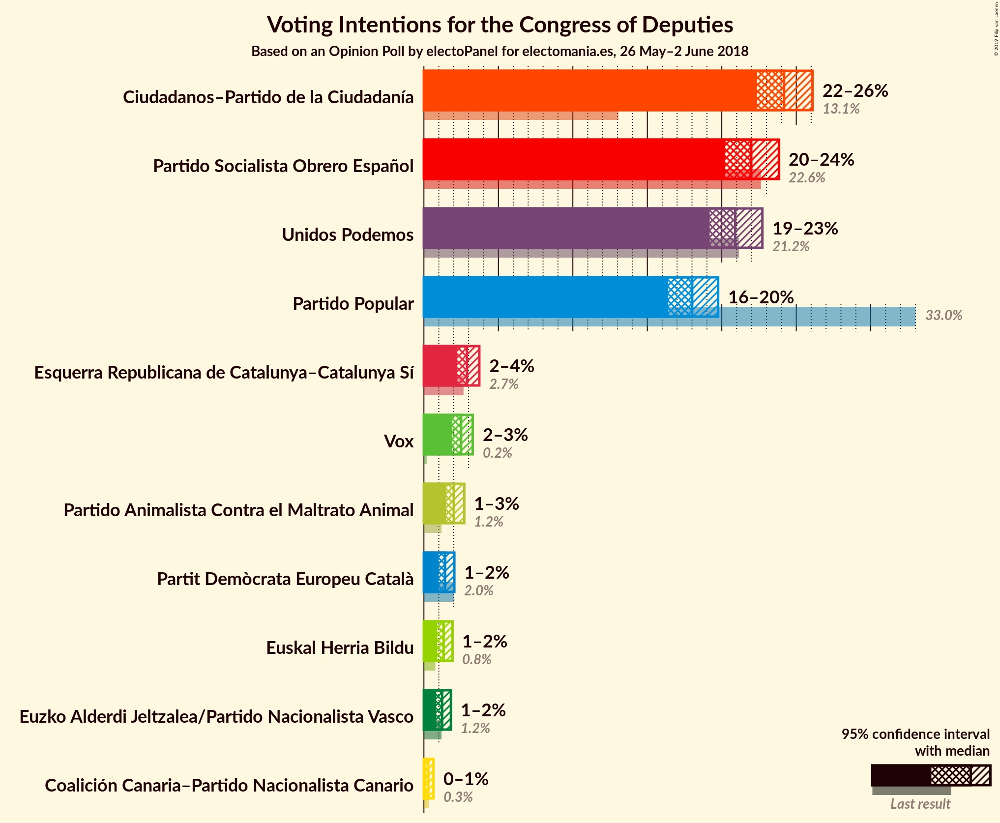
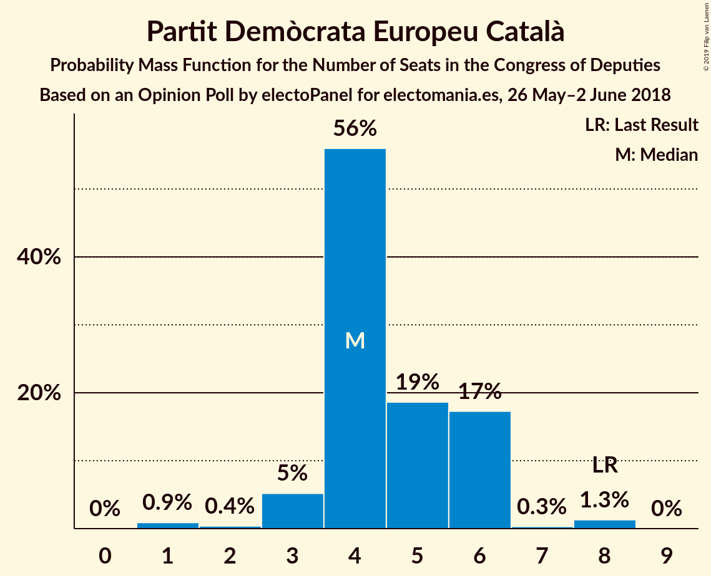
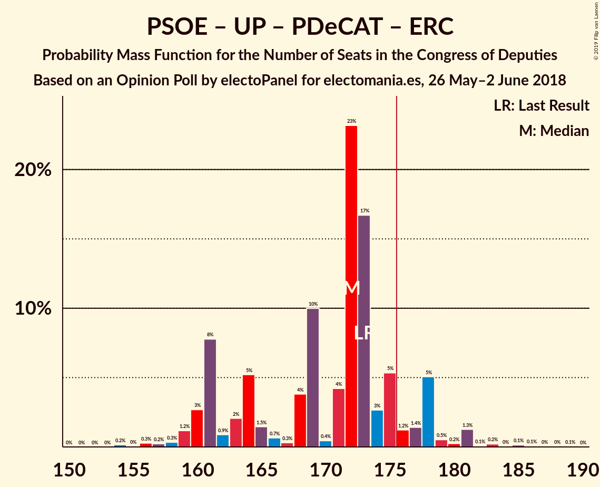
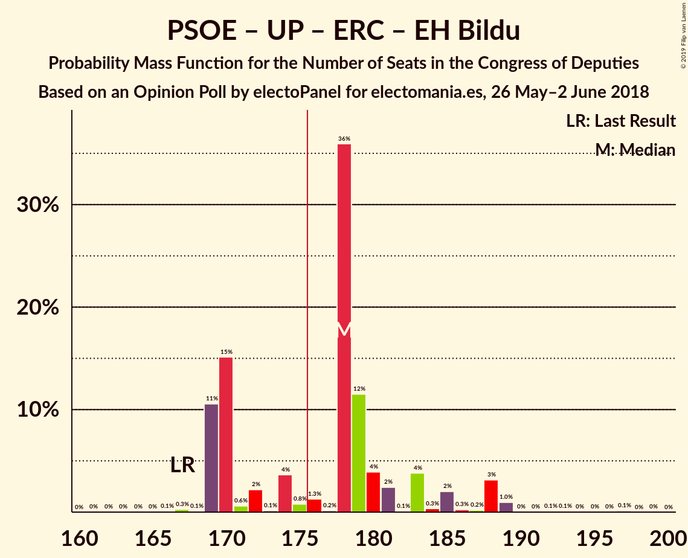

# Opinion Poll by electoPanel for electomania.es, 26 May–2 June 2018

<a href="#voting-intentions">Voting Intentions</a> | <a href="#seats">Seats</a> | <a href="#coalitions">Coalitions</a> | <a href="#technical-information">Technical Information</a>

## Voting Intentions

### Confidence Intervals

| Party | Last Result | Poll Result | 80% Confidence Interval | 90% Confidence Interval | 95% Confidence Interval | 99% Confidence Interval |
|:-----:|:-----------:|:-----------:|:-----------------------:|:-----------------------:|:-----------------------:|:-----------------------:|
| Ciudadanos–Partido de la Ciudadanía | 13.1% | 22.7% | 21.6–23.9% |21.2–24.3% |20.9–24.6% |20.4–25.2% |
| Partido Socialista Obrero Español | 22.6% | 21.6% | 20.4–22.8% |20.1–23.1% |19.8–23.4% |19.3–24.0% |
| Partido Popular | 33.0% | 17.2% | 16.1–18.3% |15.9–18.6% |15.6–18.9% |15.1–19.4% |
| Unidos Podemos | 21.2% | 16.8% | 15.8–17.9% |15.5–18.2% |15.2–18.5% |14.7–19.0% |
| Vox | 0.2% | 4.6% | 4.1–5.3% |3.9–5.4% |3.8–5.6% |3.5–5.9% |
| Partido Animalista Contra el Maltrato Animal | 1.2% | 4.2% | 3.7–4.8% |3.5–5.0% |3.4–5.2% |3.2–5.5% |
| Partit Demòcrata Europeu Català | 2.0% | 4.1% | 3.6–4.7% |3.4–4.9% |3.3–5.1% |3.1–5.4% |
| Esquerra Republicana de Catalunya–Catalunya Sí | 2.7% | 3.3% | 2.8–3.9% |2.7–4.0% |2.6–4.1% |2.4–4.4% |
| Euskal Herria Bildu | 0.8% | 1.4% | 1.1–1.8% |1.1–1.9% |1.0–2.0% |0.9–2.2% |

*Note:* The poll result column reflects the actual value used in the calculations. Published results may vary slightly, and in addition be rounded to fewer digits.

## Seats

### Confidence Intervals

| Party | Last Result | Median | 80% Confidence Interval | 90% Confidence Interval | 95% Confidence Interval | 99% Confidence Interval |
|:-----:|:-----------:|:------:|:-----------------------:|:-----------------------:|:-----------------------:|:-----------------------:|
| <a href="#ciudadanos–partido-de-la-ciudadanía">Ciudadanos–Partido de la Ciudadanía</a> | 32 | 87 | 81–94 |79–96 |76–98 |75–101 |
| <a href="#partido-socialista-obrero-español">Partido Socialista Obrero Español</a> | 85 | 91 | 87–93 |86–95 |85–95 |79–101 |
| <a href="#partido-popular">Partido Popular</a> | 137 | 73 | 64–75 |64–78 |63–79 |57–84 |
| <a href="#unidos-podemos">Unidos Podemos</a> | 71 | 56 | 49–61 |48–65 |47–65 |41–68 |
| <a href="#vox">Vox</a> | 0 | 6 | 3–6 |3–6 |3–8 |3–10 |
| <a href="#partido-animalista-contra-el-maltrato-animal">Partido Animalista Contra el Maltrato Animal</a> | 0 | 2 | 2–4 |2–4 |2–4 |2–5 |
| <a href="#partit-demòcrata-europeu-català">Partit Demòcrata Europeu Català</a> | 8 | 15 | 13–17 |12–17 |11–17 |10–18 |
| <a href="#esquerra-republicana-de-catalunya–catalunya-sí">Esquerra Republicana de Catalunya–Catalunya Sí</a> | 9 | 9 | 9–12 |8–14 |7–14 |7–15 |
| <a href="#euskal-herria-bildu">Euskal Herria Bildu</a> | 2 | 7 | 6–8 |5–8 |5–8 |3–10 |

### Ciudadanos–Partido de la Ciudadanía

*For a full overview of the results for this party, see the [Ciudadanos–Partido de la Ciudadanía](party-ciudadanos–partidodelaciudadanía.html) page.*

| Number of Seats | Probability | Accumulated | Special Marks |
|:---------------:|:-----------:|:-----------:|:-------------:|
| 32 | 0% | 100% | Last Result |
| 33 | 0% | 100% |  |
| 34 | 0% | 100% |  |
| 35 | 0% | 100% |  |
| 36 | 0% | 100% |  |
| 37 | 0% | 100% |  |
| 38 | 0% | 100% |  |
| 39 | 0% | 100% |  |
| 40 | 0% | 100% |  |
| 41 | 0% | 100% |  |
| 42 | 0% | 100% |  |
| 43 | 0% | 100% |  |
| 44 | 0% | 100% |  |
| 45 | 0% | 100% |  |
| 46 | 0% | 100% |  |
| 47 | 0% | 100% |  |
| 48 | 0% | 100% |  |
| 49 | 0% | 100% |  |
| 50 | 0% | 100% |  |
| 51 | 0% | 100% |  |
| 52 | 0% | 100% |  |
| 53 | 0% | 100% |  |
| 54 | 0% | 100% |  |
| 55 | 0% | 100% |  |
| 56 | 0% | 100% |  |
| 57 | 0% | 100% |  |
| 58 | 0% | 100% |  |
| 59 | 0% | 100% |  |
| 60 | 0% | 100% |  |
| 61 | 0% | 100% |  |
| 62 | 0% | 100% |  |
| 63 | 0% | 100% |  |
| 64 | 0% | 100% |  |
| 65 | 0% | 100% |  |
| 66 | 0% | 100% |  |
| 67 | 0% | 100% |  |
| 68 | 0% | 100% |  |
| 69 | 0% | 100% |  |
| 70 | 0% | 100% |  |
| 71 | 0% | 100% |  |
| 72 | 0.1% | 100% |  |
| 73 | 0.1% | 99.9% |  |
| 74 | 0.3% | 99.8% |  |
| 75 | 2% | 99.6% |  |
| 76 | 0.3% | 98% |  |
| 77 | 0.4% | 97% |  |
| 78 | 0.8% | 97% |  |
| 79 | 2% | 96% |  |
| 80 | 2% | 94% |  |
| 81 | 3% | 92% |  |
| 82 | 1.2% | 89% |  |
| 83 | 14% | 88% |  |
| 84 | 16% | 74% |  |
| 85 | 1.5% | 59% |  |
| 86 | 4% | 57% |  |
| 87 | 16% | 54% | Median |
| 88 | 8% | 38% |  |
| 89 | 1.0% | 30% |  |
| 90 | 5% | 29% |  |
| 91 | 0.6% | 23% |  |
| 92 | 1.0% | 23% |  |
| 93 | 0.4% | 22% |  |
| 94 | 14% | 21% |  |
| 95 | 0.6% | 7% |  |
| 96 | 2% | 7% |  |
| 97 | 0.2% | 5% |  |
| 98 | 3% | 5% |  |
| 99 | 0.2% | 2% |  |
| 100 | 0.2% | 1.3% |  |
| 101 | 1.1% | 1.2% |  |
| 102 | 0% | 0.1% |  |
| 103 | 0% | 0.1% |  |
| 104 | 0% | 0.1% |  |
| 105 | 0% | 0% |  |

### Partido Socialista Obrero Español

*For a full overview of the results for this party, see the [Partido Socialista Obrero Español](party-partidosocialistaobreroespañol.html) page.*

| Number of Seats | Probability | Accumulated | Special Marks |
|:---------------:|:-----------:|:-----------:|:-------------:|
| 74 | 0.1% | 100% |  |
| 75 | 0% | 99.9% |  |
| 76 | 0% | 99.9% |  |
| 77 | 0% | 99.9% |  |
| 78 | 0% | 99.8% |  |
| 79 | 0.5% | 99.8% |  |
| 80 | 0% | 99.3% |  |
| 81 | 0.1% | 99.3% |  |
| 82 | 0.6% | 99.2% |  |
| 83 | 0.2% | 98.6% |  |
| 84 | 0.6% | 98% |  |
| 85 | 1.2% | 98% | Last Result |
| 86 | 3% | 97% |  |
| 87 | 19% | 93% |  |
| 88 | 5% | 74% |  |
| 89 | 0.8% | 69% |  |
| 90 | 8% | 69% |  |
| 91 | 38% | 60% | Median |
| 92 | 10% | 22% |  |
| 93 | 4% | 13% |  |
| 94 | 3% | 9% |  |
| 95 | 4% | 6% |  |
| 96 | 0.2% | 2% |  |
| 97 | 0.1% | 2% |  |
| 98 | 0.1% | 2% |  |
| 99 | 1.1% | 2% |  |
| 100 | 0.3% | 1.0% |  |
| 101 | 0.3% | 0.7% |  |
| 102 | 0.1% | 0.4% |  |
| 103 | 0.1% | 0.3% |  |
| 104 | 0% | 0.2% |  |
| 105 | 0.1% | 0.2% |  |
| 106 | 0% | 0.1% |  |
| 107 | 0% | 0% |  |

### Partido Popular

*For a full overview of the results for this party, see the [Partido Popular](party-partidopopular.html) page.*

| Number of Seats | Probability | Accumulated | Special Marks |
|:---------------:|:-----------:|:-----------:|:-------------:|
| 56 | 0.1% | 100% |  |
| 57 | 0.5% | 99.9% |  |
| 58 | 0% | 99.4% |  |
| 59 | 0.7% | 99.4% |  |
| 60 | 0.2% | 98.7% |  |
| 61 | 0.2% | 98% |  |
| 62 | 0.2% | 98% |  |
| 63 | 2% | 98% |  |
| 64 | 8% | 96% |  |
| 65 | 1.3% | 88% |  |
| 66 | 0.2% | 87% |  |
| 67 | 2% | 87% |  |
| 68 | 0.5% | 84% |  |
| 69 | 2% | 84% |  |
| 70 | 2% | 82% |  |
| 71 | 4% | 80% |  |
| 72 | 2% | 76% |  |
| 73 | 53% | 74% | Median |
| 74 | 9% | 21% |  |
| 75 | 4% | 13% |  |
| 76 | 1.4% | 9% |  |
| 77 | 0.5% | 7% |  |
| 78 | 3% | 7% |  |
| 79 | 2% | 3% |  |
| 80 | 0.6% | 1.3% |  |
| 81 | 0% | 0.8% |  |
| 82 | 0.2% | 0.8% |  |
| 83 | 0% | 0.6% |  |
| 84 | 0.3% | 0.6% |  |
| 85 | 0.2% | 0.3% |  |
| 86 | 0.1% | 0.1% |  |
| 87 | 0% | 0% |  |
| 88 | 0% | 0% |  |
| 89 | 0% | 0% |  |
| 90 | 0% | 0% |  |
| 91 | 0% | 0% |  |
| 92 | 0% | 0% |  |
| 93 | 0% | 0% |  |
| 94 | 0% | 0% |  |
| 95 | 0% | 0% |  |
| 96 | 0% | 0% |  |
| 97 | 0% | 0% |  |
| 98 | 0% | 0% |  |
| 99 | 0% | 0% |  |
| 100 | 0% | 0% |  |
| 101 | 0% | 0% |  |
| 102 | 0% | 0% |  |
| 103 | 0% | 0% |  |
| 104 | 0% | 0% |  |
| 105 | 0% | 0% |  |
| 106 | 0% | 0% |  |
| 107 | 0% | 0% |  |
| 108 | 0% | 0% |  |
| 109 | 0% | 0% |  |
| 110 | 0% | 0% |  |
| 111 | 0% | 0% |  |
| 112 | 0% | 0% |  |
| 113 | 0% | 0% |  |
| 114 | 0% | 0% |  |
| 115 | 0% | 0% |  |
| 116 | 0% | 0% |  |
| 117 | 0% | 0% |  |
| 118 | 0% | 0% |  |
| 119 | 0% | 0% |  |
| 120 | 0% | 0% |  |
| 121 | 0% | 0% |  |
| 122 | 0% | 0% |  |
| 123 | 0% | 0% |  |
| 124 | 0% | 0% |  |
| 125 | 0% | 0% |  |
| 126 | 0% | 0% |  |
| 127 | 0% | 0% |  |
| 128 | 0% | 0% |  |
| 129 | 0% | 0% |  |
| 130 | 0% | 0% |  |
| 131 | 0% | 0% |  |
| 132 | 0% | 0% |  |
| 133 | 0% | 0% |  |
| 134 | 0% | 0% |  |
| 135 | 0% | 0% |  |
| 136 | 0% | 0% |  |
| 137 | 0% | 0% | Last Result |

### Unidos Podemos

*For a full overview of the results for this party, see the [Unidos Podemos](party-unidospodemos.html) page.*

| Number of Seats | Probability | Accumulated | Special Marks |
|:---------------:|:-----------:|:-----------:|:-------------:|
| 37 | 0% | 100% |  |
| 38 | 0% | 99.9% |  |
| 39 | 0.1% | 99.9% |  |
| 40 | 0.4% | 99.9% |  |
| 41 | 0% | 99.5% |  |
| 42 | 0.1% | 99.5% |  |
| 43 | 0.1% | 99.3% |  |
| 44 | 0.1% | 99.2% |  |
| 45 | 0.3% | 99.2% |  |
| 46 | 0.1% | 98.9% |  |
| 47 | 1.3% | 98.7% |  |
| 48 | 4% | 97% |  |
| 49 | 11% | 94% |  |
| 50 | 6% | 83% |  |
| 51 | 0.7% | 77% |  |
| 52 | 3% | 76% |  |
| 53 | 1.0% | 73% |  |
| 54 | 2% | 72% |  |
| 55 | 6% | 70% |  |
| 56 | 25% | 64% | Median |
| 57 | 18% | 39% |  |
| 58 | 8% | 21% |  |
| 59 | 2% | 14% |  |
| 60 | 1.4% | 12% |  |
| 61 | 0.8% | 10% |  |
| 62 | 0.4% | 9% |  |
| 63 | 1.0% | 9% |  |
| 64 | 0.2% | 8% |  |
| 65 | 6% | 8% |  |
| 66 | 0.6% | 2% |  |
| 67 | 0.4% | 2% |  |
| 68 | 0.8% | 1.1% |  |
| 69 | 0.3% | 0.3% |  |
| 70 | 0% | 0% |  |
| 71 | 0% | 0% | Last Result |

### Vox

*For a full overview of the results for this party, see the [Vox](party-vox.html) page.*

| Number of Seats | Probability | Accumulated | Special Marks |
|:---------------:|:-----------:|:-----------:|:-------------:|
| 0 | 0% | 100% | Last Result |
| 1 | 0% | 100% |  |
| 2 | 0% | 100% |  |
| 3 | 15% | 100% |  |
| 4 | 19% | 85% |  |
| 5 | 1.5% | 67% |  |
| 6 | 61% | 65% | Median |
| 7 | 0.9% | 4% |  |
| 8 | 2% | 4% |  |
| 9 | 0.1% | 2% |  |
| 10 | 2% | 2% |  |
| 11 | 0.1% | 0.1% |  |
| 12 | 0% | 0% |  |

### Partido Animalista Contra el Maltrato Animal

*For a full overview of the results for this party, see the [Partido Animalista Contra el Maltrato Animal](party-partidoanimalistacontraelmaltratoanimal.html) page.*

| Number of Seats | Probability | Accumulated | Special Marks |
|:---------------:|:-----------:|:-----------:|:-------------:|
| 0 | 0% | 100% | Last Result |
| 1 | 0.5% | 100% |  |
| 2 | 70% | 99.5% | Median |
| 3 | 15% | 29% |  |
| 4 | 13% | 14% |  |
| 5 | 0.9% | 1.2% |  |
| 6 | 0.3% | 0.3% |  |
| 7 | 0% | 0.1% |  |
| 8 | 0% | 0% |  |

### Partit Demòcrata Europeu Català

*For a full overview of the results for this party, see the [Partit Demòcrata Europeu Català](party-partitdemòcrataeuropeucatalà.html) page.*

| Number of Seats | Probability | Accumulated | Special Marks |
|:---------------:|:-----------:|:-----------:|:-------------:|
| 8 | 0% | 100% | Last Result |
| 9 | 0% | 100% |  |
| 10 | 0.8% | 100% |  |
| 11 | 3% | 99.2% |  |
| 12 | 6% | 96% |  |
| 13 | 12% | 90% |  |
| 14 | 16% | 78% |  |
| 15 | 34% | 62% | Median |
| 16 | 9% | 29% |  |
| 17 | 19% | 20% |  |
| 18 | 0.7% | 0.7% |  |
| 19 | 0% | 0% |  |

### Esquerra Republicana de Catalunya–Catalunya Sí

*For a full overview of the results for this party, see the [Esquerra Republicana de Catalunya–Catalunya Sí](party-esquerrarepublicanadecatalunya–catalunyasí.html) page.*

| Number of Seats | Probability | Accumulated | Special Marks |
|:---------------:|:-----------:|:-----------:|:-------------:|
| 7 | 4% | 100% |  |
| 8 | 4% | 96% |  |
| 9 | 48% | 92% | Last Result, Median |
| 10 | 11% | 44% |  |
| 11 | 20% | 34% |  |
| 12 | 7% | 14% |  |
| 13 | 2% | 7% |  |
| 14 | 5% | 6% |  |
| 15 | 0.8% | 0.8% |  |
| 16 | 0% | 0% |  |

### Euskal Herria Bildu

*For a full overview of the results for this party, see the [Euskal Herria Bildu](party-euskalherriabildu.html) page.*

| Number of Seats | Probability | Accumulated | Special Marks |
|:---------------:|:-----------:|:-----------:|:-------------:|
| 2 | 0.3% | 100% | Last Result |
| 3 | 0.4% | 99.7% |  |
| 4 | 0.4% | 99.3% |  |
| 5 | 5% | 98.9% |  |
| 6 | 43% | 94% |  |
| 7 | 35% | 51% | Median |
| 8 | 14% | 17% |  |
| 9 | 0.4% | 2% |  |
| 10 | 2% | 2% |  |
| 11 | 0.1% | 0.1% |  |
| 12 | 0% | 0% |  |

## Coalitions

### Confidence Intervals

| Coalition | Last Result | Median | Majority? | 80% Confidence Interval | 90% Confidence Interval | 95% Confidence Interval | 99% Confidence Interval |
|:---------:|:-----------:|:------:|:---------:|:-----------------------:|:-----------------------:|:-----------------------:|:-----------------------:|
| Ciudadanos–Partido de la Ciudadanía – Partido Socialista Obrero Español – Partido Popular | 254 | 249 | 100% | 242–255 | 239–256 | 239–256 | 238–263 |
| Ciudadanos–Partido de la Ciudadanía – Partido Socialista Obrero Español – Unidos Podemos | 188 | 231 | 100% | 229–240 | 226–241 | 225–243 | 221–245 |
| Ciudadanos–Partido de la Ciudadanía – Partido Socialista Obrero Español | 117 | 178 | 54% | 171–182 | 169–187 | 166–188 | 163–193 |
| Partido Socialista Obrero Español – Unidos Podemos – Partit Demòcrata Europeu Català – Esquerra Republicana de Catalunya–Catalunya Sí | 173 | 172 | 10% | 161–176 | 161–178 | 160–179 | 157–183 |
| Ciudadanos–Partido de la Ciudadanía – Partido Popular – Vox | 169 | 163 | 2% | 158–173 | 158–174 | 156–174 | 153–177 |
| Partido Socialista Obrero Español – Partido Popular | 222 | 164 | 0.3% | 153–167 | 151–169 | 151–173 | 148–175 |
| Partido Socialista Obrero Español – Unidos Podemos – Esquerra Republicana de Catalunya–Catalunya Sí – Euskal Herria Bildu | 167 | 163 | 0.4% | 154–168 | 153–168 | 152–172 | 149–174 |
| Ciudadanos–Partido de la Ciudadanía – Partido Popular | 169 | 158 | 0% | 152–168 | 152–168 | 151–169 | 147–171 |
| Partido Socialista Obrero Español – Unidos Podemos | 156 | 147 | 0% | 136–151 | 136–152 | 135–154 | 132–159 |
| Partido Socialista Obrero Español | 85 | 91 | 0% | 87–93 | 86–95 | 85–95 | 79–101 |
| Partido Popular – Vox | 137 | 79 | 0% | 70–81 | 69–84 | 68–85 | 65–90 |
| Partido Popular | 137 | 73 | 0% | 64–75 | 64–78 | 63–79 | 57–84 |

### Ciudadanos–Partido de la Ciudadanía – Partido Socialista Obrero Español – Partido Popular

| Number of Seats | Probability | Accumulated | Special Marks |
|:---------------:|:-----------:|:-----------:|:-------------:|
| 235 | 0% | 100% |  |
| 236 | 0.1% | 99.9% |  |
| 237 | 0.3% | 99.9% |  |
| 238 | 0.9% | 99.6% |  |
| 239 | 7% | 98.8% |  |
| 240 | 2% | 92% |  |
| 241 | 0.3% | 90% |  |
| 242 | 2% | 90% |  |
| 243 | 0.7% | 88% |  |
| 244 | 3% | 88% |  |
| 245 | 0.7% | 85% |  |
| 246 | 0.4% | 84% |  |
| 247 | 8% | 84% |  |
| 248 | 25% | 76% |  |
| 249 | 5% | 51% |  |
| 250 | 2% | 46% |  |
| 251 | 19% | 44% | Median |
| 252 | 0.5% | 25% |  |
| 253 | 2% | 24% |  |
| 254 | 7% | 22% | Last Result |
| 255 | 10% | 15% |  |
| 256 | 3% | 5% |  |
| 257 | 1.4% | 2% |  |
| 258 | 0.3% | 1.0% |  |
| 259 | 0.1% | 0.7% |  |
| 260 | 0% | 0.7% |  |
| 261 | 0% | 0.7% |  |
| 262 | 0.1% | 0.6% |  |
| 263 | 0% | 0.5% |  |
| 264 | 0% | 0.5% |  |
| 265 | 0.1% | 0.5% |  |
| 266 | 0.1% | 0.4% |  |
| 267 | 0.3% | 0.3% |  |
| 268 | 0% | 0% |  |

### Ciudadanos–Partido de la Ciudadanía – Partido Socialista Obrero Español – Unidos Podemos

| Number of Seats | Probability | Accumulated | Special Marks |
|:---------------:|:-----------:|:-----------:|:-------------:|
| 188 | 0% | 100% | Last Result |
| 189 | 0% | 100% |  |
| 190 | 0% | 100% |  |
| 191 | 0% | 100% |  |
| 192 | 0% | 100% |  |
| 193 | 0% | 100% |  |
| 194 | 0% | 100% |  |
| 195 | 0% | 100% |  |
| 196 | 0% | 100% |  |
| 197 | 0% | 100% |  |
| 198 | 0% | 100% |  |
| 199 | 0% | 100% |  |
| 200 | 0% | 100% |  |
| 201 | 0% | 100% |  |
| 202 | 0% | 100% |  |
| 203 | 0% | 100% |  |
| 204 | 0% | 100% |  |
| 205 | 0% | 100% |  |
| 206 | 0% | 100% |  |
| 207 | 0% | 100% |  |
| 208 | 0% | 100% |  |
| 209 | 0% | 100% |  |
| 210 | 0% | 100% |  |
| 211 | 0% | 100% |  |
| 212 | 0% | 100% |  |
| 213 | 0% | 100% |  |
| 214 | 0% | 100% |  |
| 215 | 0% | 100% |  |
| 216 | 0% | 100% |  |
| 217 | 0.1% | 100% |  |
| 218 | 0.2% | 99.9% |  |
| 219 | 0% | 99.7% |  |
| 220 | 0.1% | 99.7% |  |
| 221 | 0.4% | 99.7% |  |
| 222 | 0.5% | 99.2% |  |
| 223 | 0.2% | 98.7% |  |
| 224 | 0.8% | 98% |  |
| 225 | 0.4% | 98% |  |
| 226 | 4% | 97% |  |
| 227 | 0.6% | 94% |  |
| 228 | 2% | 93% |  |
| 229 | 11% | 91% |  |
| 230 | 11% | 80% |  |
| 231 | 28% | 69% |  |
| 232 | 2% | 41% |  |
| 233 | 0.9% | 39% |  |
| 234 | 3% | 38% | Median |
| 235 | 15% | 35% |  |
| 236 | 4% | 20% |  |
| 237 | 1.0% | 16% |  |
| 238 | 3% | 15% |  |
| 239 | 0.1% | 12% |  |
| 240 | 7% | 12% |  |
| 241 | 2% | 5% |  |
| 242 | 0.5% | 3% |  |
| 243 | 2% | 3% |  |
| 244 | 0.5% | 1.2% |  |
| 245 | 0.3% | 0.8% |  |
| 246 | 0.2% | 0.5% |  |
| 247 | 0.1% | 0.3% |  |
| 248 | 0.1% | 0.2% |  |
| 249 | 0% | 0.1% |  |
| 250 | 0.1% | 0.1% |  |
| 251 | 0% | 0% |  |

### Ciudadanos–Partido de la Ciudadanía – Partido Socialista Obrero Español

| Number of Seats | Probability | Accumulated | Special Marks |
|:---------------:|:-----------:|:-----------:|:-------------:|
| 117 | 0% | 100% | Last Result |
| 118 | 0% | 100% |  |
| 119 | 0% | 100% |  |
| 120 | 0% | 100% |  |
| 121 | 0% | 100% |  |
| 122 | 0% | 100% |  |
| 123 | 0% | 100% |  |
| 124 | 0% | 100% |  |
| 125 | 0% | 100% |  |
| 126 | 0% | 100% |  |
| 127 | 0% | 100% |  |
| 128 | 0% | 100% |  |
| 129 | 0% | 100% |  |
| 130 | 0% | 100% |  |
| 131 | 0% | 100% |  |
| 132 | 0% | 100% |  |
| 133 | 0% | 100% |  |
| 134 | 0% | 100% |  |
| 135 | 0% | 100% |  |
| 136 | 0% | 100% |  |
| 137 | 0% | 100% |  |
| 138 | 0% | 100% |  |
| 139 | 0% | 100% |  |
| 140 | 0% | 100% |  |
| 141 | 0% | 100% |  |
| 142 | 0% | 100% |  |
| 143 | 0% | 100% |  |
| 144 | 0% | 100% |  |
| 145 | 0% | 100% |  |
| 146 | 0% | 100% |  |
| 147 | 0% | 100% |  |
| 148 | 0% | 100% |  |
| 149 | 0% | 100% |  |
| 150 | 0% | 100% |  |
| 151 | 0% | 100% |  |
| 152 | 0% | 100% |  |
| 153 | 0% | 100% |  |
| 154 | 0% | 100% |  |
| 155 | 0% | 100% |  |
| 156 | 0% | 100% |  |
| 157 | 0% | 100% |  |
| 158 | 0% | 100% |  |
| 159 | 0% | 100% |  |
| 160 | 0% | 100% |  |
| 161 | 0% | 99.9% |  |
| 162 | 0% | 99.9% |  |
| 163 | 0.6% | 99.9% |  |
| 164 | 0.7% | 99.3% |  |
| 165 | 0.3% | 98.6% |  |
| 166 | 2% | 98% |  |
| 167 | 0.7% | 97% |  |
| 168 | 0.4% | 96% |  |
| 169 | 3% | 95% |  |
| 170 | 1.3% | 93% |  |
| 171 | 2% | 91% |  |
| 172 | 2% | 90% |  |
| 173 | 0.2% | 88% |  |
| 174 | 7% | 88% |  |
| 175 | 27% | 80% |  |
| 176 | 1.4% | 54% | Majority |
| 177 | 0.9% | 52% |  |
| 178 | 19% | 51% | Median |
| 179 | 0.3% | 32% |  |
| 180 | 2% | 32% |  |
| 181 | 17% | 30% |  |
| 182 | 3% | 13% |  |
| 183 | 0.4% | 9% |  |
| 184 | 1.5% | 9% |  |
| 185 | 0.7% | 8% |  |
| 186 | 2% | 7% |  |
| 187 | 2% | 5% |  |
| 188 | 3% | 4% |  |
| 189 | 0% | 0.9% |  |
| 190 | 0.3% | 0.9% |  |
| 191 | 0% | 0.6% |  |
| 192 | 0.1% | 0.6% |  |
| 193 | 0.1% | 0.5% |  |
| 194 | 0.1% | 0.4% |  |
| 195 | 0% | 0.4% |  |
| 196 | 0.3% | 0.4% |  |
| 197 | 0% | 0.1% |  |
| 198 | 0% | 0% |  |

### Partido Socialista Obrero Español – Unidos Podemos – Partit Demòcrata Europeu Català – Esquerra Republicana de Catalunya–Catalunya Sí

| Number of Seats | Probability | Accumulated | Special Marks |
|:---------------:|:-----------:|:-----------:|:-------------:|
| 154 | 0.2% | 100% |  |
| 155 | 0% | 99.8% |  |
| 156 | 0.3% | 99.8% |  |
| 157 | 0.2% | 99.5% |  |
| 158 | 0.3% | 99.3% |  |
| 159 | 1.2% | 99.0% |  |
| 160 | 3% | 98% |  |
| 161 | 8% | 95% |  |
| 162 | 0.9% | 87% |  |
| 163 | 2% | 86% |  |
| 164 | 5% | 84% |  |
| 165 | 1.5% | 79% |  |
| 166 | 0.7% | 78% |  |
| 167 | 0.3% | 77% |  |
| 168 | 4% | 77% |  |
| 169 | 10% | 73% |  |
| 170 | 0.4% | 63% |  |
| 171 | 4% | 62% | Median |
| 172 | 23% | 58% |  |
| 173 | 17% | 35% | Last Result |
| 174 | 3% | 18% |  |
| 175 | 5% | 16% |  |
| 176 | 1.2% | 10% | Majority |
| 177 | 1.4% | 9% |  |
| 178 | 5% | 8% |  |
| 179 | 0.5% | 3% |  |
| 180 | 0.2% | 2% |  |
| 181 | 1.3% | 2% |  |
| 182 | 0.1% | 0.6% |  |
| 183 | 0.2% | 0.6% |  |
| 184 | 0% | 0.4% |  |
| 185 | 0.1% | 0.3% |  |
| 186 | 0.1% | 0.2% |  |
| 187 | 0% | 0.1% |  |
| 188 | 0% | 0.1% |  |
| 189 | 0.1% | 0.1% |  |
| 190 | 0% | 0% |  |

### Ciudadanos–Partido de la Ciudadanía – Partido Popular – Vox

| Number of Seats | Probability | Accumulated | Special Marks |
|:---------------:|:-----------:|:-----------:|:-------------:|
| 146 | 0.1% | 100% |  |
| 147 | 0% | 99.9% |  |
| 148 | 0% | 99.9% |  |
| 149 | 0.1% | 99.9% |  |
| 150 | 0.1% | 99.8% |  |
| 151 | 0% | 99.7% |  |
| 152 | 0% | 99.7% |  |
| 153 | 0.2% | 99.6% |  |
| 154 | 1.3% | 99.4% |  |
| 155 | 0.1% | 98% |  |
| 156 | 0.7% | 98% |  |
| 157 | 1.2% | 97% |  |
| 158 | 6% | 96% |  |
| 159 | 2% | 90% |  |
| 160 | 3% | 88% |  |
| 161 | 15% | 84% |  |
| 162 | 14% | 70% |  |
| 163 | 15% | 56% |  |
| 164 | 7% | 41% |  |
| 165 | 4% | 34% |  |
| 166 | 2% | 30% | Median |
| 167 | 5% | 28% |  |
| 168 | 0.4% | 23% |  |
| 169 | 4% | 22% | Last Result |
| 170 | 1.0% | 18% |  |
| 171 | 2% | 17% |  |
| 172 | 0.3% | 15% |  |
| 173 | 5% | 15% |  |
| 174 | 8% | 10% |  |
| 175 | 0.3% | 2% |  |
| 176 | 1.2% | 2% | Majority |
| 177 | 0.3% | 0.5% |  |
| 178 | 0% | 0.2% |  |
| 179 | 0.1% | 0.2% |  |
| 180 | 0% | 0.1% |  |
| 181 | 0.1% | 0.1% |  |
| 182 | 0% | 0% |  |

### Partido Socialista Obrero Español – Partido Popular

| Number of Seats | Probability | Accumulated | Special Marks |
|:---------------:|:-----------:|:-----------:|:-------------:|
| 144 | 0.1% | 100% |  |
| 145 | 0% | 99.9% |  |
| 146 | 0.1% | 99.9% |  |
| 147 | 0.3% | 99.8% |  |
| 148 | 0.1% | 99.6% |  |
| 149 | 0.7% | 99.5% |  |
| 150 | 0.5% | 98.8% |  |
| 151 | 5% | 98% |  |
| 152 | 1.0% | 93% |  |
| 153 | 2% | 92% |  |
| 154 | 2% | 90% |  |
| 155 | 4% | 88% |  |
| 156 | 2% | 85% |  |
| 157 | 1.0% | 83% |  |
| 158 | 0.8% | 82% |  |
| 159 | 1.1% | 81% |  |
| 160 | 2% | 80% |  |
| 161 | 11% | 78% |  |
| 162 | 6% | 67% |  |
| 163 | 5% | 61% |  |
| 164 | 34% | 56% | Median |
| 165 | 10% | 22% |  |
| 166 | 1.4% | 12% |  |
| 167 | 1.1% | 10% |  |
| 168 | 3% | 9% |  |
| 169 | 1.3% | 6% |  |
| 170 | 0.2% | 5% |  |
| 171 | 2% | 5% |  |
| 172 | 0.3% | 3% |  |
| 173 | 2% | 3% |  |
| 174 | 0.2% | 0.8% |  |
| 175 | 0.3% | 0.6% |  |
| 176 | 0% | 0.3% | Majority |
| 177 | 0% | 0.3% |  |
| 178 | 0.2% | 0.3% |  |
| 179 | 0.1% | 0.1% |  |
| 180 | 0% | 0% |  |
| 181 | 0% | 0% |  |
| 182 | 0% | 0% |  |
| 183 | 0% | 0% |  |
| 184 | 0% | 0% |  |
| 185 | 0% | 0% |  |
| 186 | 0% | 0% |  |
| 187 | 0% | 0% |  |
| 188 | 0% | 0% |  |
| 189 | 0% | 0% |  |
| 190 | 0% | 0% |  |
| 191 | 0% | 0% |  |
| 192 | 0% | 0% |  |
| 193 | 0% | 0% |  |
| 194 | 0% | 0% |  |
| 195 | 0% | 0% |  |
| 196 | 0% | 0% |  |
| 197 | 0% | 0% |  |
| 198 | 0% | 0% |  |
| 199 | 0% | 0% |  |
| 200 | 0% | 0% |  |
| 201 | 0% | 0% |  |
| 202 | 0% | 0% |  |
| 203 | 0% | 0% |  |
| 204 | 0% | 0% |  |
| 205 | 0% | 0% |  |
| 206 | 0% | 0% |  |
| 207 | 0% | 0% |  |
| 208 | 0% | 0% |  |
| 209 | 0% | 0% |  |
| 210 | 0% | 0% |  |
| 211 | 0% | 0% |  |
| 212 | 0% | 0% |  |
| 213 | 0% | 0% |  |
| 214 | 0% | 0% |  |
| 215 | 0% | 0% |  |
| 216 | 0% | 0% |  |
| 217 | 0% | 0% |  |
| 218 | 0% | 0% |  |
| 219 | 0% | 0% |  |
| 220 | 0% | 0% |  |
| 221 | 0% | 0% |  |
| 222 | 0% | 0% | Last Result |

### Partido Socialista Obrero Español – Unidos Podemos – Esquerra Republicana de Catalunya–Catalunya Sí – Euskal Herria Bildu

| Number of Seats | Probability | Accumulated | Special Marks |
|:---------------:|:-----------:|:-----------:|:-------------:|
| 146 | 0.2% | 100% |  |
| 147 | 0% | 99.8% |  |
| 148 | 0.1% | 99.7% |  |
| 149 | 0.3% | 99.6% |  |
| 150 | 0.2% | 99.3% |  |
| 151 | 1.1% | 99.1% |  |
| 152 | 3% | 98% |  |
| 153 | 0.3% | 95% |  |
| 154 | 10% | 95% |  |
| 155 | 4% | 85% |  |
| 156 | 1.0% | 81% |  |
| 157 | 0.9% | 80% |  |
| 158 | 2% | 80% |  |
| 159 | 2% | 78% |  |
| 160 | 4% | 76% |  |
| 161 | 4% | 72% |  |
| 162 | 16% | 67% |  |
| 163 | 3% | 51% | Median |
| 164 | 14% | 48% |  |
| 165 | 12% | 34% |  |
| 166 | 7% | 22% |  |
| 167 | 2% | 15% | Last Result |
| 168 | 8% | 13% |  |
| 169 | 0.4% | 5% |  |
| 170 | 1.3% | 5% |  |
| 171 | 0.6% | 3% |  |
| 172 | 0.5% | 3% |  |
| 173 | 1.1% | 2% |  |
| 174 | 0.7% | 1.1% |  |
| 175 | 0% | 0.4% |  |
| 176 | 0.1% | 0.4% | Majority |
| 177 | 0.1% | 0.3% |  |
| 178 | 0% | 0.2% |  |
| 179 | 0% | 0.1% |  |
| 180 | 0% | 0.1% |  |
| 181 | 0% | 0.1% |  |
| 182 | 0% | 0% |  |

### Ciudadanos–Partido de la Ciudadanía – Partido Popular

| Number of Seats | Probability | Accumulated | Special Marks |
|:---------------:|:-----------:|:-----------:|:-------------:|
| 140 | 0% | 100% |  |
| 141 | 0% | 99.9% |  |
| 142 | 0% | 99.9% |  |
| 143 | 0.1% | 99.9% |  |
| 144 | 0.1% | 99.8% |  |
| 145 | 0% | 99.7% |  |
| 146 | 0.1% | 99.7% |  |
| 147 | 0.2% | 99.6% |  |
| 148 | 0.7% | 99.4% |  |
| 149 | 0.2% | 98.6% |  |
| 150 | 0.4% | 98% |  |
| 151 | 3% | 98% |  |
| 152 | 6% | 95% |  |
| 153 | 2% | 90% |  |
| 154 | 3% | 87% |  |
| 155 | 0.4% | 84% |  |
| 156 | 14% | 84% |  |
| 157 | 18% | 70% |  |
| 158 | 6% | 52% |  |
| 159 | 4% | 46% |  |
| 160 | 15% | 42% | Median |
| 161 | 5% | 27% |  |
| 162 | 0.7% | 23% |  |
| 163 | 4% | 22% |  |
| 164 | 0.7% | 18% |  |
| 165 | 2% | 17% |  |
| 166 | 0.5% | 15% |  |
| 167 | 2% | 15% |  |
| 168 | 8% | 13% |  |
| 169 | 3% | 5% | Last Result |
| 170 | 1.3% | 2% |  |
| 171 | 0.3% | 0.7% |  |
| 172 | 0.1% | 0.3% |  |
| 173 | 0.1% | 0.3% |  |
| 174 | 0.1% | 0.2% |  |
| 175 | 0.1% | 0.1% |  |
| 176 | 0% | 0% | Majority |

### Partido Socialista Obrero Español – Unidos Podemos

| Number of Seats | Probability | Accumulated | Special Marks |
|:---------------:|:-----------:|:-----------:|:-------------:|
| 129 | 0.1% | 100% |  |
| 130 | 0.2% | 99.9% |  |
| 131 | 0% | 99.7% |  |
| 132 | 0.3% | 99.7% |  |
| 133 | 0% | 99.4% |  |
| 134 | 2% | 99.4% |  |
| 135 | 0.3% | 98% |  |
| 136 | 11% | 97% |  |
| 137 | 0.5% | 87% |  |
| 138 | 2% | 86% |  |
| 139 | 0.1% | 84% |  |
| 140 | 1.5% | 84% |  |
| 141 | 5% | 82% |  |
| 142 | 2% | 78% |  |
| 143 | 4% | 75% |  |
| 144 | 2% | 71% |  |
| 145 | 2% | 69% |  |
| 146 | 8% | 67% |  |
| 147 | 14% | 58% | Median |
| 148 | 23% | 44% |  |
| 149 | 5% | 21% |  |
| 150 | 4% | 16% |  |
| 151 | 3% | 13% |  |
| 152 | 6% | 9% |  |
| 153 | 0.9% | 4% |  |
| 154 | 0.6% | 3% |  |
| 155 | 0.1% | 2% |  |
| 156 | 0.2% | 2% | Last Result |
| 157 | 1.1% | 2% |  |
| 158 | 0.1% | 0.6% |  |
| 159 | 0.2% | 0.5% |  |
| 160 | 0% | 0.4% |  |
| 161 | 0.1% | 0.3% |  |
| 162 | 0% | 0.2% |  |
| 163 | 0% | 0.2% |  |
| 164 | 0.1% | 0.2% |  |
| 165 | 0.1% | 0.1% |  |
| 166 | 0% | 0% |  |

### Partido Socialista Obrero Español

| Number of Seats | Probability | Accumulated | Special Marks |
|:---------------:|:-----------:|:-----------:|:-------------:|
| 74 | 0.1% | 100% |  |
| 75 | 0% | 99.9% |  |
| 76 | 0% | 99.9% |  |
| 77 | 0% | 99.9% |  |
| 78 | 0% | 99.8% |  |
| 79 | 0.5% | 99.8% |  |
| 80 | 0% | 99.3% |  |
| 81 | 0.1% | 99.3% |  |
| 82 | 0.6% | 99.2% |  |
| 83 | 0.2% | 98.6% |  |
| 84 | 0.6% | 98% |  |
| 85 | 1.2% | 98% | Last Result |
| 86 | 3% | 97% |  |
| 87 | 19% | 93% |  |
| 88 | 5% | 74% |  |
| 89 | 0.8% | 69% |  |
| 90 | 8% | 69% |  |
| 91 | 38% | 60% | Median |
| 92 | 10% | 22% |  |
| 93 | 4% | 13% |  |
| 94 | 3% | 9% |  |
| 95 | 4% | 6% |  |
| 96 | 0.2% | 2% |  |
| 97 | 0.1% | 2% |  |
| 98 | 0.1% | 2% |  |
| 99 | 1.1% | 2% |  |
| 100 | 0.3% | 1.0% |  |
| 101 | 0.3% | 0.7% |  |
| 102 | 0.1% | 0.4% |  |
| 103 | 0.1% | 0.3% |  |
| 104 | 0% | 0.2% |  |
| 105 | 0.1% | 0.2% |  |
| 106 | 0% | 0.1% |  |
| 107 | 0% | 0% |  |

### Partido Popular – Vox

| Number of Seats | Probability | Accumulated | Special Marks |
|:---------------:|:-----------:|:-----------:|:-------------:|
| 61 | 0% | 100% |  |
| 62 | 0% | 99.9% |  |
| 63 | 0.3% | 99.9% |  |
| 64 | 0% | 99.5% |  |
| 65 | 0.4% | 99.5% |  |
| 66 | 0.1% | 99.1% |  |
| 67 | 0.7% | 99.0% |  |
| 68 | 2% | 98% |  |
| 69 | 2% | 96% |  |
| 70 | 7% | 95% |  |
| 71 | 0.5% | 88% |  |
| 72 | 0.2% | 88% |  |
| 73 | 4% | 87% |  |
| 74 | 1.0% | 83% |  |
| 75 | 2% | 82% |  |
| 76 | 13% | 80% |  |
| 77 | 16% | 67% |  |
| 78 | 0.6% | 51% |  |
| 79 | 31% | 50% | Median |
| 80 | 10% | 20% |  |
| 81 | 0.9% | 10% |  |
| 82 | 3% | 9% |  |
| 83 | 0.3% | 6% |  |
| 84 | 2% | 5% |  |
| 85 | 2% | 4% |  |
| 86 | 0.5% | 2% |  |
| 87 | 0% | 1.2% |  |
| 88 | 0.6% | 1.2% |  |
| 89 | 0.1% | 0.6% |  |
| 90 | 0.4% | 0.5% |  |
| 91 | 0.1% | 0.2% |  |
| 92 | 0.1% | 0.1% |  |
| 93 | 0% | 0% |  |
| 94 | 0% | 0% |  |
| 95 | 0% | 0% |  |
| 96 | 0% | 0% |  |
| 97 | 0% | 0% |  |
| 98 | 0% | 0% |  |
| 99 | 0% | 0% |  |
| 100 | 0% | 0% |  |
| 101 | 0% | 0% |  |
| 102 | 0% | 0% |  |
| 103 | 0% | 0% |  |
| 104 | 0% | 0% |  |
| 105 | 0% | 0% |  |
| 106 | 0% | 0% |  |
| 107 | 0% | 0% |  |
| 108 | 0% | 0% |  |
| 109 | 0% | 0% |  |
| 110 | 0% | 0% |  |
| 111 | 0% | 0% |  |
| 112 | 0% | 0% |  |
| 113 | 0% | 0% |  |
| 114 | 0% | 0% |  |
| 115 | 0% | 0% |  |
| 116 | 0% | 0% |  |
| 117 | 0% | 0% |  |
| 118 | 0% | 0% |  |
| 119 | 0% | 0% |  |
| 120 | 0% | 0% |  |
| 121 | 0% | 0% |  |
| 122 | 0% | 0% |  |
| 123 | 0% | 0% |  |
| 124 | 0% | 0% |  |
| 125 | 0% | 0% |  |
| 126 | 0% | 0% |  |
| 127 | 0% | 0% |  |
| 128 | 0% | 0% |  |
| 129 | 0% | 0% |  |
| 130 | 0% | 0% |  |
| 131 | 0% | 0% |  |
| 132 | 0% | 0% |  |
| 133 | 0% | 0% |  |
| 134 | 0% | 0% |  |
| 135 | 0% | 0% |  |
| 136 | 0% | 0% |  |
| 137 | 0% | 0% | Last Result |

### Partido Popular

| Number of Seats | Probability | Accumulated | Special Marks |
|:---------------:|:-----------:|:-----------:|:-------------:|
| 56 | 0.1% | 100% |  |
| 57 | 0.5% | 99.9% |  |
| 58 | 0% | 99.4% |  |
| 59 | 0.7% | 99.4% |  |
| 60 | 0.2% | 98.7% |  |
| 61 | 0.2% | 98% |  |
| 62 | 0.2% | 98% |  |
| 63 | 2% | 98% |  |
| 64 | 8% | 96% |  |
| 65 | 1.3% | 88% |  |
| 66 | 0.2% | 87% |  |
| 67 | 2% | 87% |  |
| 68 | 0.5% | 84% |  |
| 69 | 2% | 84% |  |
| 70 | 2% | 82% |  |
| 71 | 4% | 80% |  |
| 72 | 2% | 76% |  |
| 73 | 53% | 74% | Median |
| 74 | 9% | 21% |  |
| 75 | 4% | 13% |  |
| 76 | 1.4% | 9% |  |
| 77 | 0.5% | 7% |  |
| 78 | 3% | 7% |  |
| 79 | 2% | 3% |  |
| 80 | 0.6% | 1.3% |  |
| 81 | 0% | 0.8% |  |
| 82 | 0.2% | 0.8% |  |
| 83 | 0% | 0.6% |  |
| 84 | 0.3% | 0.6% |  |
| 85 | 0.2% | 0.3% |  |
| 86 | 0.1% | 0.1% |  |
| 87 | 0% | 0% |  |
| 88 | 0% | 0% |  |
| 89 | 0% | 0% |  |
| 90 | 0% | 0% |  |
| 91 | 0% | 0% |  |
| 92 | 0% | 0% |  |
| 93 | 0% | 0% |  |
| 94 | 0% | 0% |  |
| 95 | 0% | 0% |  |
| 96 | 0% | 0% |  |
| 97 | 0% | 0% |  |
| 98 | 0% | 0% |  |
| 99 | 0% | 0% |  |
| 100 | 0% | 0% |  |
| 101 | 0% | 0% |  |
| 102 | 0% | 0% |  |
| 103 | 0% | 0% |  |
| 104 | 0% | 0% |  |
| 105 | 0% | 0% |  |
| 106 | 0% | 0% |  |
| 107 | 0% | 0% |  |
| 108 | 0% | 0% |  |
| 109 | 0% | 0% |  |
| 110 | 0% | 0% |  |
| 111 | 0% | 0% |  |
| 112 | 0% | 0% |  |
| 113 | 0% | 0% |  |
| 114 | 0% | 0% |  |
| 115 | 0% | 0% |  |
| 116 | 0% | 0% |  |
| 117 | 0% | 0% |  |
| 118 | 0% | 0% |  |
| 119 | 0% | 0% |  |
| 120 | 0% | 0% |  |
| 121 | 0% | 0% |  |
| 122 | 0% | 0% |  |
| 123 | 0% | 0% |  |
| 124 | 0% | 0% |  |
| 125 | 0% | 0% |  |
| 126 | 0% | 0% |  |
| 127 | 0% | 0% |  |
| 128 | 0% | 0% |  |
| 129 | 0% | 0% |  |
| 130 | 0% | 0% |  |
| 131 | 0% | 0% |  |
| 132 | 0% | 0% |  |
| 133 | 0% | 0% |  |
| 134 | 0% | 0% |  |
| 135 | 0% | 0% |  |
| 136 | 0% | 0% |  |
| 137 | 0% | 0% | Last Result |

## Technical Information

### Opinion Poll

+ **Polling firm:** electoPanel
+ **Commissioner(s):** electomania.es
+ **Fieldwork period:** 26 May–2 June 2018

### Calculations

+ **Sample size:** 2043
+ **Simulations done:** 131,072
+ **Error estimate:** 0.94%

