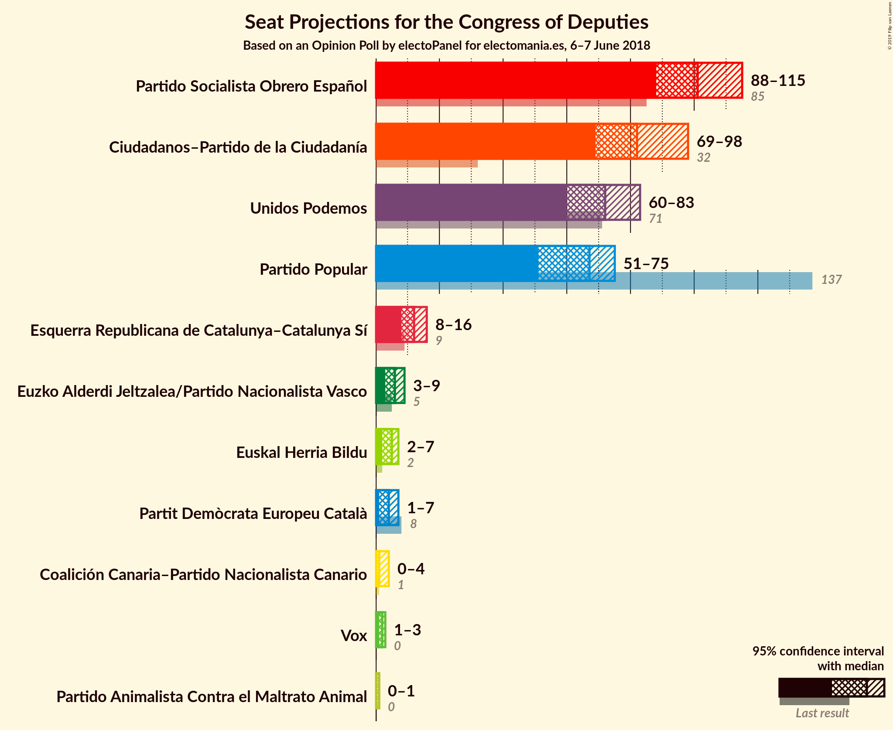
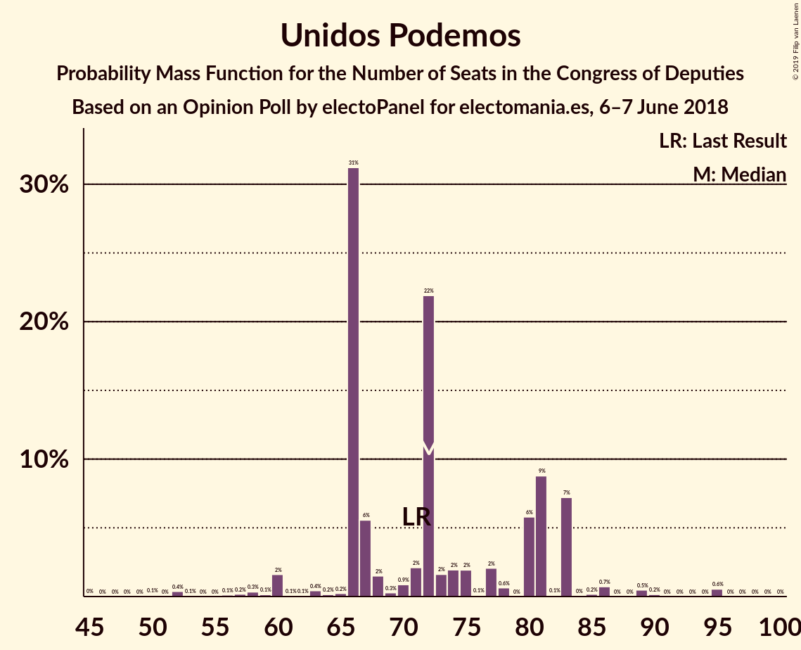
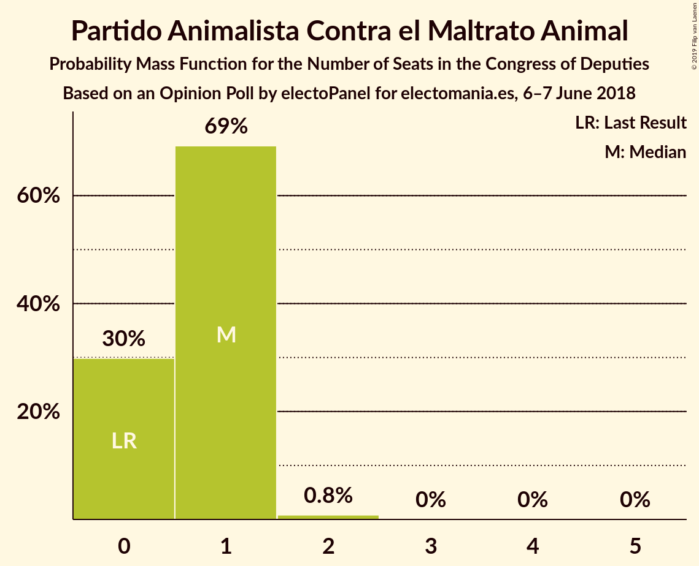
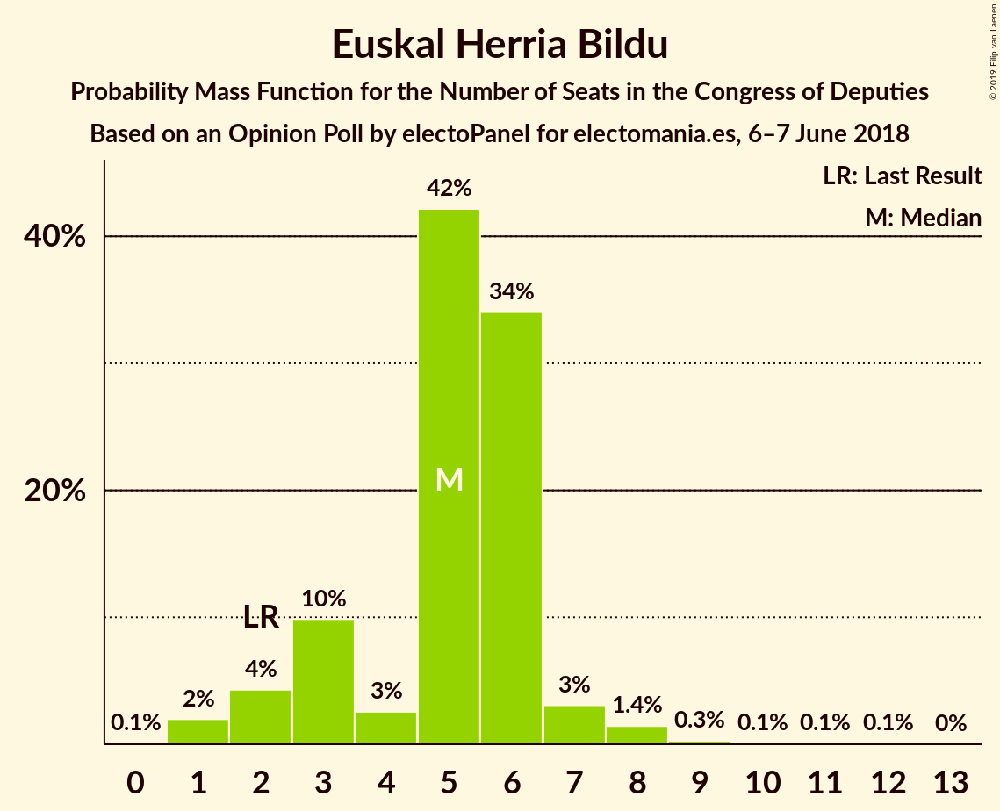
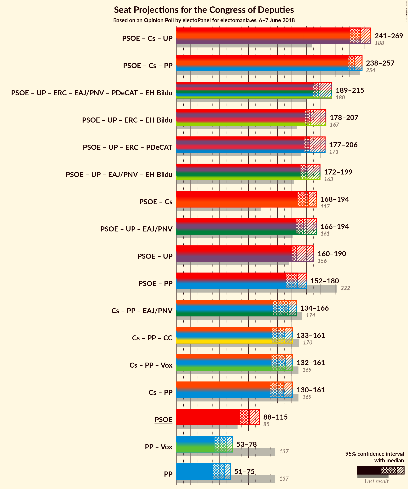
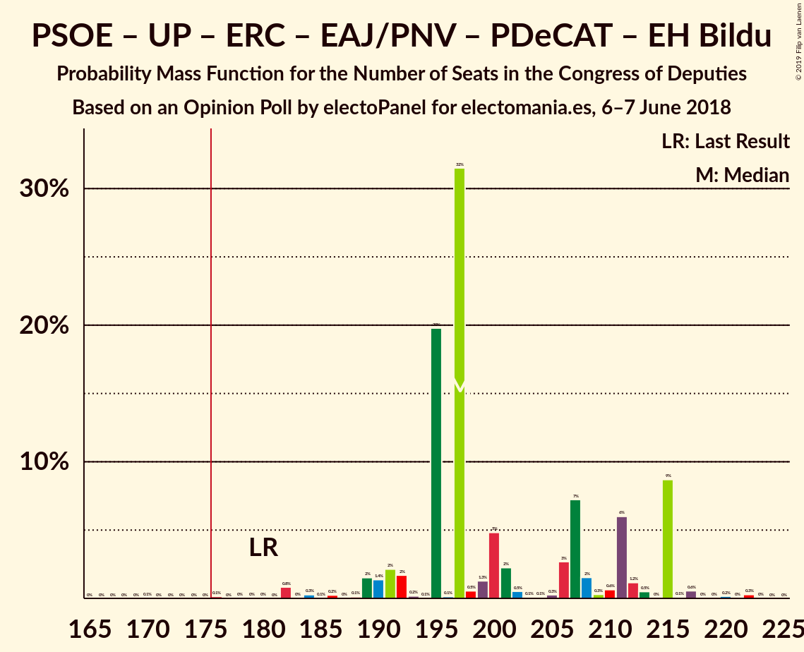
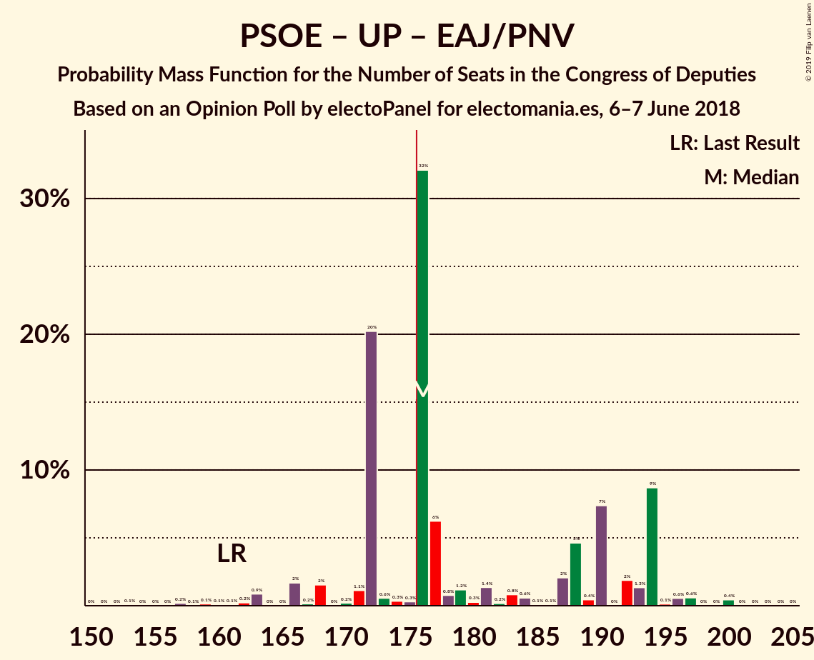
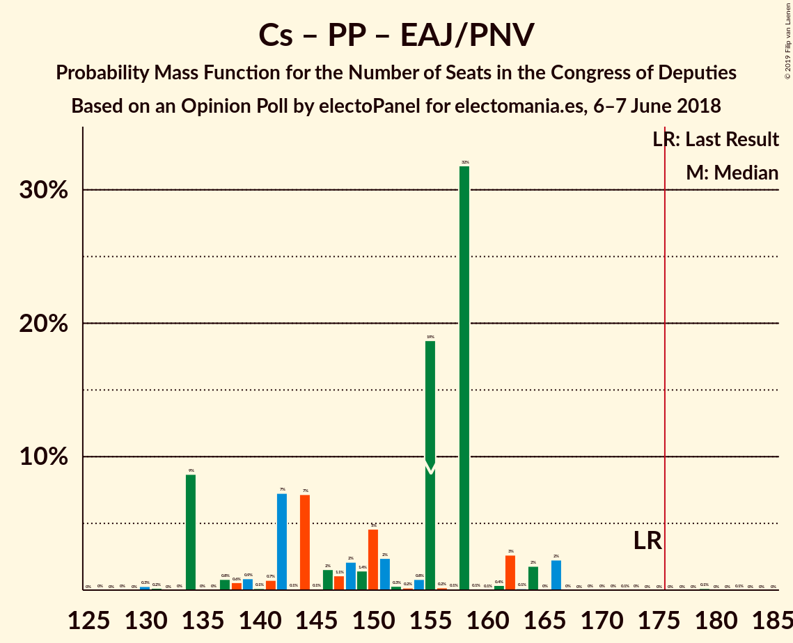

# Opinion Poll by electoPanel for electomania.es, 6–7 June 2018

<a href="#voting-intentions">Voting Intentions</a> | <a href="#seats">Seats</a> | <a href="#coalitions">Coalitions</a> | <a href="#technical-information">Technical Information</a>

## Voting Intentions

### Confidence Intervals

| Party | Last Result | Poll Result | 80% Confidence Interval | 90% Confidence Interval | 95% Confidence Interval | 99% Confidence Interval |
|:-----:|:-----------:|:-----------:|:-----------------------:|:-----------------------:|:-----------------------:|:-----------------------:|
| Partido Socialista Obrero Español | 22.6% | 25.2% | 23.3–27.2% |22.8–27.7% |22.4–28.2% |21.5–29.2% |
| Ciudadanos–Partido de la Ciudadanía | 13.1% | 22.5% | 20.7–24.4% |20.2–24.9% |19.8–25.4% |18.9–26.3% |
| Unidos Podemos | 21.2% | 20.4% | 18.7–22.3% |18.3–22.8% |17.9–23.3% |17.1–24.2% |
| Partido Popular | 33.0% | 17.1% | 15.6–18.9% |15.1–19.4% |14.7–19.8% |14.0–20.7% |
| Esquerra Republicana de Catalunya–Catalunya Sí | 2.7% | 3.0% | 2.3–3.9% |2.1–4.1% |2.0–4.3% |1.7–4.8% |
| Partido Animalista Contra el Maltrato Animal | 1.2% | 2.1% | 1.6–2.9% |1.5–3.1% |1.3–3.3% |1.1–3.8% |
| Vox | 0.2% | 2.1% | 1.6–2.9% |1.5–3.1% |1.3–3.3% |1.1–3.8% |
| Partit Demòcrata Europeu Català | 2.0% | 1.3% | 0.9–2.0% |0.8–2.1% |0.7–2.3% |0.6–2.7% |
| Euzko Alderdi Jeltzalea/Partido Nacionalista Vasco | 1.2% | 1.3% | 0.9–2.0% |0.8–2.1% |0.7–2.3% |0.6–2.7% |
| Euskal Herria Bildu | 0.8% | 1.2% | 0.8–1.8% |0.7–2.0% |0.6–2.2% |0.5–2.5% |
| Coalición Canaria–Partido Nacionalista Canario | 0.3% | 0.4% | 0.2–0.8% |0.2–0.9% |0.1–1.0% |0.1–1.3% |

*Note:* The poll result column reflects the actual value used in the calculations. Published results may vary slightly, and in addition be rounded to fewer digits.

## Seats

### Confidence Intervals

| Party | Last Result | Median | 80% Confidence Interval | 90% Confidence Interval | 95% Confidence Interval | 99% Confidence Interval |
|:-----:|:-----------:|:------:|:-----------------------:|:-----------------------:|:-----------------------:|:-----------------------:|
| <a href="#partido-socialista-obrero-español">Partido Socialista Obrero Español</a> | 85 | 101 | 94–109 |94–109 |91–112 |85–121 |
| <a href="#ciudadanos–partido-de-la-ciudadanía">Ciudadanos–Partido de la Ciudadanía</a> | 32 | 82 | 71–91 |71–91 |71–91 |68–97 |
| <a href="#unidos-podemos">Unidos Podemos</a> | 71 | 72 | 66–83 |66–83 |66–83 |52–95 |
| <a href="#partido-popular">Partido Popular</a> | 137 | 67 | 51–67 |51–70 |51–73 |51–75 |
| <a href="#esquerra-republicana-de-catalunya–catalunya-sí">Esquerra Republicana de Catalunya–Catalunya Sí</a> | 9 | 10 | 8–13 |8–13 |8–14 |6–16 |
| <a href="#partido-animalista-contra-el-maltrato-animal">Partido Animalista Contra el Maltrato Animal</a> | 0 | 1 | 0–1 |0–1 |0–1 |0–1 |
| <a href="#vox">Vox</a> | 0 | 2 | 2 |2 |1–2 |1–3 |
| <a href="#partit-demòcrata-europeu-català">Partit Demòcrata Europeu Català</a> | 8 | 6 | 4–6 |3–7 |1–7 |1–10 |
| <a href="#euzko-alderdi-jeltzalea/partido-nacionalista-vasco">Euzko Alderdi Jeltzalea/Partido Nacionalista Vasco</a> | 5 | 6 | 4–9 |3–9 |3–9 |2–9 |
| <a href="#euskal-herria-bildu">Euskal Herria Bildu</a> | 2 | 5 | 3–6 |3–6 |2–7 |1–9 |
| <a href="#coalición-canaria–partido-nacionalista-canario">Coalición Canaria–Partido Nacionalista Canario</a> | 1 | 2 | 1–3 |1–3 |1–4 |0–4 |

### Partido Socialista Obrero Español

*For a full overview of the results for this party, see the [Partido Socialista Obrero Español](party-partidosocialistaobreroespañol.html) page.*

| Number of Seats | Probability | Accumulated | Special Marks |
|:---------------:|:-----------:|:-----------:|:-------------:|
| 83 | 0.5% | 100% |  |
| 84 | 0% | 99.5% |  |
| 85 | 0.2% | 99.5% | Last Result |
| 86 | 0% | 99.3% |  |
| 87 | 0.2% | 99.3% |  |
| 88 | 0.4% | 99.1% |  |
| 89 | 0.3% | 98.7% |  |
| 90 | 0.9% | 98% |  |
| 91 | 1.4% | 98% |  |
| 92 | 0.2% | 96% |  |
| 93 | 0.7% | 96% |  |
| 94 | 5% | 95% |  |
| 95 | 22% | 90% |  |
| 96 | 0% | 68% |  |
| 97 | 0.7% | 68% |  |
| 98 | 1.4% | 67% |  |
| 99 | 0.1% | 65% |  |
| 100 | 0.1% | 65% |  |
| 101 | 46% | 65% | Median |
| 102 | 1.0% | 19% |  |
| 103 | 0.3% | 18% |  |
| 104 | 0.8% | 18% |  |
| 105 | 0.8% | 17% |  |
| 106 | 0.1% | 16% |  |
| 107 | 2% | 16% |  |
| 108 | 0.2% | 15% |  |
| 109 | 11% | 14% |  |
| 110 | 0.1% | 4% |  |
| 111 | 0% | 3% |  |
| 112 | 2% | 3% |  |
| 113 | 0.3% | 2% |  |
| 114 | 0% | 1.4% |  |
| 115 | 0% | 1.4% |  |
| 116 | 0% | 1.4% |  |
| 117 | 0.1% | 1.4% |  |
| 118 | 0.6% | 1.3% |  |
| 119 | 0% | 0.7% |  |
| 120 | 0% | 0.6% |  |
| 121 | 0.5% | 0.6% |  |
| 122 | 0% | 0.2% |  |
| 123 | 0% | 0.2% |  |
| 124 | 0% | 0.2% |  |
| 125 | 0% | 0.2% |  |
| 126 | 0% | 0.2% |  |
| 127 | 0% | 0.2% |  |
| 128 | 0.1% | 0.2% |  |
| 129 | 0% | 0% |  |

### Ciudadanos–Partido de la Ciudadanía

*For a full overview of the results for this party, see the [Ciudadanos–Partido de la Ciudadanía](party-ciudadanos–partidodelaciudadanía.html) page.*

| Number of Seats | Probability | Accumulated | Special Marks |
|:---------------:|:-----------:|:-----------:|:-------------:|
| 32 | 0% | 100% | Last Result |
| 33 | 0% | 100% |  |
| 34 | 0% | 100% |  |
| 35 | 0% | 100% |  |
| 36 | 0% | 100% |  |
| 37 | 0% | 100% |  |
| 38 | 0% | 100% |  |
| 39 | 0% | 100% |  |
| 40 | 0% | 100% |  |
| 41 | 0% | 100% |  |
| 42 | 0% | 100% |  |
| 43 | 0% | 100% |  |
| 44 | 0% | 100% |  |
| 45 | 0% | 100% |  |
| 46 | 0% | 100% |  |
| 47 | 0% | 100% |  |
| 48 | 0% | 100% |  |
| 49 | 0% | 100% |  |
| 50 | 0% | 100% |  |
| 51 | 0% | 100% |  |
| 52 | 0% | 100% |  |
| 53 | 0% | 100% |  |
| 54 | 0% | 100% |  |
| 55 | 0% | 100% |  |
| 56 | 0% | 100% |  |
| 57 | 0% | 100% |  |
| 58 | 0% | 100% |  |
| 59 | 0% | 100% |  |
| 60 | 0% | 100% |  |
| 61 | 0% | 100% |  |
| 62 | 0% | 100% |  |
| 63 | 0% | 100% |  |
| 64 | 0% | 100% |  |
| 65 | 0% | 100% |  |
| 66 | 0% | 100% |  |
| 67 | 0% | 100% |  |
| 68 | 0.7% | 100% |  |
| 69 | 0.3% | 99.3% |  |
| 70 | 0.5% | 99.0% |  |
| 71 | 9% | 98.5% |  |
| 72 | 0.3% | 90% |  |
| 73 | 0.5% | 89% |  |
| 74 | 2% | 89% |  |
| 75 | 0.2% | 87% |  |
| 76 | 0.7% | 87% |  |
| 77 | 0.1% | 86% |  |
| 78 | 2% | 86% |  |
| 79 | 11% | 85% |  |
| 80 | 0.1% | 74% |  |
| 81 | 2% | 74% |  |
| 82 | 38% | 72% | Median |
| 83 | 1.0% | 34% |  |
| 84 | 0.6% | 33% |  |
| 85 | 0.4% | 33% |  |
| 86 | 0.1% | 32% |  |
| 87 | 3% | 32% |  |
| 88 | 0.2% | 29% |  |
| 89 | 5% | 29% |  |
| 90 | 0.1% | 23% |  |
| 91 | 22% | 23% |  |
| 92 | 0% | 0.7% |  |
| 93 | 0% | 0.7% |  |
| 94 | 0% | 0.7% |  |
| 95 | 0.1% | 0.7% |  |
| 96 | 0% | 0.6% |  |
| 97 | 0.3% | 0.6% |  |
| 98 | 0% | 0.3% |  |
| 99 | 0.2% | 0.3% |  |
| 100 | 0% | 0.1% |  |
| 101 | 0% | 0.1% |  |
| 102 | 0.1% | 0.1% |  |
| 103 | 0% | 0% |  |

### Unidos Podemos

*For a full overview of the results for this party, see the [Unidos Podemos](party-unidospodemos.html) page.*

| Number of Seats | Probability | Accumulated | Special Marks |
|:---------------:|:-----------:|:-----------:|:-------------:|
| 45 | 0.1% | 100% |  |
| 46 | 0% | 99.9% |  |
| 47 | 0% | 99.9% |  |
| 48 | 0% | 99.9% |  |
| 49 | 0% | 99.9% |  |
| 50 | 0.1% | 99.9% |  |
| 51 | 0% | 99.8% |  |
| 52 | 0.4% | 99.8% |  |
| 53 | 0% | 99.4% |  |
| 54 | 0% | 99.4% |  |
| 55 | 0% | 99.4% |  |
| 56 | 0.1% | 99.4% |  |
| 57 | 0.2% | 99.2% |  |
| 58 | 0% | 99.0% |  |
| 59 | 0.1% | 99.0% |  |
| 60 | 0.1% | 98.8% |  |
| 61 | 0% | 98.8% |  |
| 62 | 0% | 98.8% |  |
| 63 | 0.3% | 98.7% |  |
| 64 | 0.1% | 98% |  |
| 65 | 0.3% | 98% |  |
| 66 | 38% | 98% |  |
| 67 | 0.7% | 60% |  |
| 68 | 2% | 60% |  |
| 69 | 0% | 58% |  |
| 70 | 0.4% | 58% |  |
| 71 | 2% | 57% | Last Result |
| 72 | 22% | 55% | Median |
| 73 | 0.8% | 33% |  |
| 74 | 0.5% | 32% |  |
| 75 | 2% | 31% |  |
| 76 | 0% | 30% |  |
| 77 | 0.7% | 30% |  |
| 78 | 0.1% | 29% |  |
| 79 | 0% | 29% |  |
| 80 | 7% | 29% |  |
| 81 | 11% | 22% |  |
| 82 | 0% | 11% |  |
| 83 | 9% | 11% |  |
| 84 | 0% | 2% |  |
| 85 | 0.2% | 2% |  |
| 86 | 0.8% | 2% |  |
| 87 | 0% | 1.3% |  |
| 88 | 0% | 1.3% |  |
| 89 | 0.6% | 1.3% |  |
| 90 | 0% | 0.7% |  |
| 91 | 0% | 0.7% |  |
| 92 | 0% | 0.7% |  |
| 93 | 0% | 0.7% |  |
| 94 | 0% | 0.7% |  |
| 95 | 0.7% | 0.7% |  |
| 96 | 0% | 0% |  |

### Partido Popular

*For a full overview of the results for this party, see the [Partido Popular](party-partidopopular.html) page.*

| Number of Seats | Probability | Accumulated | Special Marks |
|:---------------:|:-----------:|:-----------:|:-------------:|
| 49 | 0.1% | 100% |  |
| 50 | 0.3% | 99.8% |  |
| 51 | 13% | 99.6% |  |
| 52 | 0% | 87% |  |
| 53 | 0% | 87% |  |
| 54 | 0.3% | 87% |  |
| 55 | 0% | 87% |  |
| 56 | 0.2% | 87% |  |
| 57 | 0.6% | 86% |  |
| 58 | 7% | 86% |  |
| 59 | 22% | 79% |  |
| 60 | 0.2% | 56% |  |
| 61 | 0.2% | 56% |  |
| 62 | 0.2% | 56% |  |
| 63 | 0.5% | 56% |  |
| 64 | 0% | 55% |  |
| 65 | 1.4% | 55% |  |
| 66 | 1.0% | 54% |  |
| 67 | 47% | 53% | Median |
| 68 | 0% | 6% |  |
| 69 | 0.2% | 6% |  |
| 70 | 2% | 6% |  |
| 71 | 0% | 4% |  |
| 72 | 1.3% | 4% |  |
| 73 | 0.4% | 3% |  |
| 74 | 1.4% | 2% |  |
| 75 | 0.5% | 0.9% |  |
| 76 | 0% | 0.4% |  |
| 77 | 0% | 0.4% |  |
| 78 | 0% | 0.4% |  |
| 79 | 0% | 0.4% |  |
| 80 | 0% | 0.4% |  |
| 81 | 0% | 0.3% |  |
| 82 | 0% | 0.3% |  |
| 83 | 0% | 0.3% |  |
| 84 | 0% | 0.3% |  |
| 85 | 0% | 0.2% |  |
| 86 | 0.1% | 0.2% |  |
| 87 | 0% | 0.2% |  |
| 88 | 0.1% | 0.1% |  |
| 89 | 0% | 0% |  |
| 90 | 0% | 0% |  |
| 91 | 0% | 0% |  |
| 92 | 0% | 0% |  |
| 93 | 0% | 0% |  |
| 94 | 0% | 0% |  |
| 95 | 0% | 0% |  |
| 96 | 0% | 0% |  |
| 97 | 0% | 0% |  |
| 98 | 0% | 0% |  |
| 99 | 0% | 0% |  |
| 100 | 0% | 0% |  |
| 101 | 0% | 0% |  |
| 102 | 0% | 0% |  |
| 103 | 0% | 0% |  |
| 104 | 0% | 0% |  |
| 105 | 0% | 0% |  |
| 106 | 0% | 0% |  |
| 107 | 0% | 0% |  |
| 108 | 0% | 0% |  |
| 109 | 0% | 0% |  |
| 110 | 0% | 0% |  |
| 111 | 0% | 0% |  |
| 112 | 0% | 0% |  |
| 113 | 0% | 0% |  |
| 114 | 0% | 0% |  |
| 115 | 0% | 0% |  |
| 116 | 0% | 0% |  |
| 117 | 0% | 0% |  |
| 118 | 0% | 0% |  |
| 119 | 0% | 0% |  |
| 120 | 0% | 0% |  |
| 121 | 0% | 0% |  |
| 122 | 0% | 0% |  |
| 123 | 0% | 0% |  |
| 124 | 0% | 0% |  |
| 125 | 0% | 0% |  |
| 126 | 0% | 0% |  |
| 127 | 0% | 0% |  |
| 128 | 0% | 0% |  |
| 129 | 0% | 0% |  |
| 130 | 0% | 0% |  |
| 131 | 0% | 0% |  |
| 132 | 0% | 0% |  |
| 133 | 0% | 0% |  |
| 134 | 0% | 0% |  |
| 135 | 0% | 0% |  |
| 136 | 0% | 0% |  |
| 137 | 0% | 0% | Last Result |

### Esquerra Republicana de Catalunya–Catalunya Sí

*For a full overview of the results for this party, see the [Esquerra Republicana de Catalunya–Catalunya Sí](party-esquerrarepublicanadecatalunya–catalunyasí.html) page.*

| Number of Seats | Probability | Accumulated | Special Marks |
|:---------------:|:-----------:|:-----------:|:-------------:|
| 6 | 1.0% | 100% |  |
| 7 | 1.1% | 99.0% |  |
| 8 | 9% | 98% |  |
| 9 | 3% | 89% | Last Result |
| 10 | 38% | 86% | Median |
| 11 | 0.2% | 48% |  |
| 12 | 16% | 48% |  |
| 13 | 29% | 32% |  |
| 14 | 3% | 4% |  |
| 15 | 0.2% | 0.9% |  |
| 16 | 0.4% | 0.8% |  |
| 17 | 0.2% | 0.4% |  |
| 18 | 0.1% | 0.1% |  |
| 19 | 0% | 0% |  |

### Partido Animalista Contra el Maltrato Animal

*For a full overview of the results for this party, see the [Partido Animalista Contra el Maltrato Animal](party-partidoanimalistacontraelmaltratoanimal.html) page.*

| Number of Seats | Probability | Accumulated | Special Marks |
|:---------------:|:-----------:|:-----------:|:-------------:|
| 0 | 23% | 100% | Last Result |
| 1 | 76% | 77% | Median |
| 2 | 0.2% | 0.2% |  |
| 3 | 0% | 0% |  |

### Vox

*For a full overview of the results for this party, see the [Vox](party-vox.html) page.*

| Number of Seats | Probability | Accumulated | Special Marks |
|:---------------:|:-----------:|:-----------:|:-------------:|
| 0 | 0.1% | 100% | Last Result |
| 1 | 5% | 99.9% |  |
| 2 | 93% | 95% | Median |
| 3 | 2% | 2% |  |
| 4 | 0% | 0% |  |

### Partit Demòcrata Europeu Català

*For a full overview of the results for this party, see the [Partit Demòcrata Europeu Català](party-partitdemòcrataeuropeucatalà.html) page.*

| Number of Seats | Probability | Accumulated | Special Marks |
|:---------------:|:-----------:|:-----------:|:-------------:|
| 1 | 3% | 100% |  |
| 2 | 1.4% | 97% |  |
| 3 | 2% | 96% |  |
| 4 | 40% | 94% |  |
| 5 | 0.8% | 54% |  |
| 6 | 48% | 53% | Median |
| 7 | 4% | 5% |  |
| 8 | 0.5% | 2% | Last Result |
| 9 | 0.4% | 1.3% |  |
| 10 | 0.9% | 0.9% |  |
| 11 | 0% | 0.1% |  |
| 12 | 0.1% | 0.1% |  |
| 13 | 0% | 0% |  |

### Euzko Alderdi Jeltzalea/Partido Nacionalista Vasco

*For a full overview of the results for this party, see the [Euzko Alderdi Jeltzalea/Partido Nacionalista Vasco](party-euzkoalderdijeltzaleapartidonacionalistavasco.html) page.*

| Number of Seats | Probability | Accumulated | Special Marks |
|:---------------:|:-----------:|:-----------:|:-------------:|
| 1 | 0.3% | 100% |  |
| 2 | 0.5% | 99.7% |  |
| 3 | 9% | 99.2% |  |
| 4 | 13% | 91% |  |
| 5 | 24% | 77% | Last Result |
| 6 | 12% | 54% | Median |
| 7 | 2% | 42% |  |
| 8 | 0.2% | 40% |  |
| 9 | 39% | 39% |  |
| 10 | 0.3% | 0.4% |  |
| 11 | 0% | 0% |  |

### Euskal Herria Bildu

*For a full overview of the results for this party, see the [Euskal Herria Bildu](party-euskalherriabildu.html) page.*

| Number of Seats | Probability | Accumulated | Special Marks |
|:---------------:|:-----------:|:-----------:|:-------------:|
| 0 | 0.1% | 100% |  |
| 1 | 1.2% | 99.9% |  |
| 2 | 3% | 98.7% | Last Result |
| 3 | 10% | 96% |  |
| 4 | 2% | 86% |  |
| 5 | 50% | 84% | Median |
| 6 | 30% | 33% |  |
| 7 | 0.9% | 3% |  |
| 8 | 2% | 2% |  |
| 9 | 0.3% | 0.6% |  |
| 10 | 0.1% | 0.3% |  |
| 11 | 0% | 0.2% |  |
| 12 | 0.1% | 0.1% |  |
| 13 | 0% | 0% |  |

### Coalición Canaria–Partido Nacionalista Canario

*For a full overview of the results for this party, see the [Coalición Canaria–Partido Nacionalista Canario](party-coalicióncanaria–partidonacionalistacanario.html) page.*

| Number of Seats | Probability | Accumulated | Special Marks |
|:---------------:|:-----------:|:-----------:|:-------------:|
| 0 | 1.2% | 100% |  |
| 1 | 48% | 98.8% | Last Result |
| 2 | 38% | 51% | Median |
| 3 | 11% | 13% |  |
| 4 | 3% | 3% |  |
| 5 | 0% | 0% |  |

## Coalitions

### Confidence Intervals

| Coalition | Last Result | Median | Majority? | 80% Confidence Interval | 90% Confidence Interval | 95% Confidence Interval | 99% Confidence Interval |
|:---------:|:-----------:|:------:|:---------:|:-----------------------:|:-----------------------:|:-----------------------:|:-----------------------:|
| Partido Socialista Obrero Español – Ciudadanos–Partido de la Ciudadanía – Unidos Podemos | 188 | 255 | 100% | 249–269 | 249–269 | 248–269 | 239–269 |
| Partido Socialista Obrero Español – Ciudadanos–Partido de la Ciudadanía – Partido Popular | 254 | 245 | 100% | 239–250 | 239–250 | 238–254 | 231–265 |
| Partido Socialista Obrero Español – Unidos Podemos – Esquerra Republicana de Catalunya–Catalunya Sí – Euzko Alderdi Jeltzalea/Partido Nacionalista Vasco – Partit Demòcrata Europeu Català – Euskal Herria Bildu | 180 | 197 | 99.9% | 195–215 | 195–215 | 190–215 | 184–215 |
| Partido Socialista Obrero Español – Unidos Podemos – Esquerra Republicana de Catalunya–Catalunya Sí – Euskal Herria Bildu | 167 | 186 | 99.1% | 182–207 | 182–207 | 180–207 | 173–207 |
| Partido Socialista Obrero Español – Unidos Podemos – Esquerra Republicana de Catalunya–Catalunya Sí – Partit Demòcrata Europeu Català | 173 | 184 | 99.1% | 183–206 | 183–206 | 180–206 | 173–206 |
| Partido Socialista Obrero Español – Unidos Podemos – Euzko Alderdi Jeltzalea/Partido Nacionalista Vasco – Euskal Herria Bildu | 163 | 181 | 97% | 178–199 | 178–199 | 175–199 | 165–202 |
| Partido Socialista Obrero Español – Unidos Podemos – Euzko Alderdi Jeltzalea/Partido Nacionalista Vasco | 161 | 176 | 73% | 172–194 | 172–194 | 171–194 | 159–196 |
| Partido Socialista Obrero Español – Ciudadanos–Partido de la Ciudadanía | 117 | 183 | 88% | 172–188 | 172–190 | 167–194 | 160–198 |
| Partido Socialista Obrero Español – Unidos Podemos | 156 | 167 | 27% | 167–190 | 167–190 | 162–190 | 154–192 |
| Partido Socialista Obrero Español – Partido Popular | 222 | 168 | 2% | 154–168 | 152–170 | 152–174 | 152–190 |
| Ciudadanos–Partido de la Ciudadanía – Partido Popular – Euzko Alderdi Jeltzalea/Partido Nacionalista Vasco | 174 | 155 | 0.2% | 134–158 | 134–158 | 134–163 | 134–166 |
| Ciudadanos–Partido de la Ciudadanía – Partido Popular – Coalición Canaria–Partido Nacionalista Canario | 170 | 150 | 0.1% | 133–152 | 133–152 | 133–158 | 133–163 |
| Ciudadanos–Partido de la Ciudadanía – Partido Popular – Vox | 169 | 151 | 0.1% | 132–152 | 132–152 | 132–158 | 132–163 |
| Ciudadanos–Partido de la Ciudadanía – Partido Popular | 169 | 149 | 0% | 130–150 | 130–150 | 130–156 | 130–161 |
| Partido Socialista Obrero Español | 85 | 101 | 0% | 94–109 | 94–109 | 91–112 | 85–121 |
| Partido Popular – Vox | 137 | 69 | 0% | 53–69 | 53–71 | 53–75 | 53–78 |
| Partido Popular | 137 | 67 | 0% | 51–67 | 51–70 | 51–73 | 51–75 |

### Partido Socialista Obrero Español – Ciudadanos–Partido de la Ciudadanía – Unidos Podemos

| Number of Seats | Probability | Accumulated | Special Marks |
|:---------------:|:-----------:|:-----------:|:-------------:|
| 188 | 0% | 100% | Last Result |
| 189 | 0% | 100% |  |
| 190 | 0% | 100% |  |
| 191 | 0% | 100% |  |
| 192 | 0% | 100% |  |
| 193 | 0% | 100% |  |
| 194 | 0% | 100% |  |
| 195 | 0% | 100% |  |
| 196 | 0% | 100% |  |
| 197 | 0% | 100% |  |
| 198 | 0% | 100% |  |
| 199 | 0% | 100% |  |
| 200 | 0% | 100% |  |
| 201 | 0% | 100% |  |
| 202 | 0% | 100% |  |
| 203 | 0% | 100% |  |
| 204 | 0% | 100% |  |
| 205 | 0% | 100% |  |
| 206 | 0% | 100% |  |
| 207 | 0% | 100% |  |
| 208 | 0% | 100% |  |
| 209 | 0% | 100% |  |
| 210 | 0% | 100% |  |
| 211 | 0% | 100% |  |
| 212 | 0% | 100% |  |
| 213 | 0% | 100% |  |
| 214 | 0% | 100% |  |
| 215 | 0% | 100% |  |
| 216 | 0% | 100% |  |
| 217 | 0% | 100% |  |
| 218 | 0% | 100% |  |
| 219 | 0% | 100% |  |
| 220 | 0% | 100% |  |
| 221 | 0% | 100% |  |
| 222 | 0% | 100% |  |
| 223 | 0% | 100% |  |
| 224 | 0% | 100% |  |
| 225 | 0% | 100% |  |
| 226 | 0% | 100% |  |
| 227 | 0% | 100% |  |
| 228 | 0% | 100% |  |
| 229 | 0% | 100% |  |
| 230 | 0% | 100% |  |
| 231 | 0% | 100% |  |
| 232 | 0.1% | 100% |  |
| 233 | 0% | 99.9% |  |
| 234 | 0% | 99.9% |  |
| 235 | 0.2% | 99.8% |  |
| 236 | 0% | 99.6% |  |
| 237 | 0% | 99.6% |  |
| 238 | 0% | 99.6% |  |
| 239 | 0.2% | 99.5% |  |
| 240 | 0% | 99.3% |  |
| 241 | 0.4% | 99.3% |  |
| 242 | 0% | 98.9% |  |
| 243 | 0.5% | 98.8% |  |
| 244 | 0.3% | 98% |  |
| 245 | 0.3% | 98% |  |
| 246 | 0.1% | 98% |  |
| 247 | 0% | 98% |  |
| 248 | 0.6% | 98% |  |
| 249 | 39% | 97% |  |
| 250 | 0.8% | 58% |  |
| 251 | 0% | 57% |  |
| 252 | 0.5% | 57% |  |
| 253 | 0.2% | 56% |  |
| 254 | 0% | 56% |  |
| 255 | 9% | 56% | Median |
| 256 | 1.1% | 47% |  |
| 257 | 0% | 46% |  |
| 258 | 22% | 46% |  |
| 259 | 1.4% | 24% |  |
| 260 | 0.7% | 22% |  |
| 261 | 0.2% | 22% |  |
| 262 | 2% | 22% |  |
| 263 | 6% | 19% |  |
| 264 | 0.3% | 14% |  |
| 265 | 2% | 14% |  |
| 266 | 0.1% | 12% |  |
| 267 | 0.3% | 12% |  |
| 268 | 0% | 12% |  |
| 269 | 11% | 11% |  |
| 270 | 0% | 0.2% |  |
| 271 | 0% | 0.2% |  |
| 272 | 0.1% | 0.2% |  |
| 273 | 0% | 0% |  |

### Partido Socialista Obrero Español – Ciudadanos–Partido de la Ciudadanía – Partido Popular

| Number of Seats | Probability | Accumulated | Special Marks |
|:---------------:|:-----------:|:-----------:|:-------------:|
| 231 | 0.7% | 100% |  |
| 232 | 0.3% | 99.2% |  |
| 233 | 0.4% | 98.9% |  |
| 234 | 0.8% | 98% |  |
| 235 | 0% | 98% |  |
| 236 | 0% | 98% |  |
| 237 | 0% | 98% |  |
| 238 | 0.3% | 98% |  |
| 239 | 19% | 97% |  |
| 240 | 0.8% | 78% |  |
| 241 | 5% | 77% |  |
| 242 | 0.5% | 72% |  |
| 243 | 0% | 71% |  |
| 244 | 2% | 71% |  |
| 245 | 24% | 70% |  |
| 246 | 1.0% | 46% |  |
| 247 | 0% | 45% |  |
| 248 | 3% | 45% |  |
| 249 | 0.6% | 42% |  |
| 250 | 38% | 41% | Median |
| 251 | 0.1% | 3% |  |
| 252 | 0% | 3% |  |
| 253 | 0.3% | 3% |  |
| 254 | 0.1% | 3% | Last Result |
| 255 | 0% | 2% |  |
| 256 | 0% | 2% |  |
| 257 | 1.0% | 2% |  |
| 258 | 0% | 1.4% |  |
| 259 | 0.1% | 1.3% |  |
| 260 | 0.2% | 1.2% |  |
| 261 | 0% | 1.1% |  |
| 262 | 0.1% | 1.1% |  |
| 263 | 0.1% | 1.0% |  |
| 264 | 0% | 0.9% |  |
| 265 | 0.5% | 0.9% |  |
| 266 | 0.2% | 0.4% |  |
| 267 | 0% | 0.2% |  |
| 268 | 0% | 0.1% |  |
| 269 | 0% | 0.1% |  |
| 270 | 0% | 0.1% |  |
| 271 | 0% | 0.1% |  |
| 272 | 0.1% | 0.1% |  |
| 273 | 0% | 0% |  |

### Partido Socialista Obrero Español – Unidos Podemos – Esquerra Republicana de Catalunya–Catalunya Sí – Euzko Alderdi Jeltzalea/Partido Nacionalista Vasco – Partit Demòcrata Europeu Català – Euskal Herria Bildu

| Number of Seats | Probability | Accumulated | Special Marks |
|:---------------:|:-----------:|:-----------:|:-------------:|
| 170 | 0.1% | 100% |  |
| 171 | 0% | 99.9% |  |
| 172 | 0% | 99.9% |  |
| 173 | 0% | 99.9% |  |
| 174 | 0% | 99.9% |  |
| 175 | 0% | 99.9% |  |
| 176 | 0.2% | 99.9% | Majority |
| 177 | 0% | 99.8% |  |
| 178 | 0% | 99.8% |  |
| 179 | 0% | 99.7% |  |
| 180 | 0% | 99.7% | Last Result |
| 181 | 0% | 99.7% |  |
| 182 | 0% | 99.7% |  |
| 183 | 0% | 99.7% |  |
| 184 | 0.2% | 99.7% |  |
| 185 | 0% | 99.4% |  |
| 186 | 0.3% | 99.4% |  |
| 187 | 0% | 99.1% |  |
| 188 | 0% | 99.1% |  |
| 189 | 0.1% | 99.1% |  |
| 190 | 2% | 99.0% |  |
| 191 | 1.4% | 97% |  |
| 192 | 0% | 96% |  |
| 193 | 0.1% | 96% |  |
| 194 | 0% | 96% |  |
| 195 | 22% | 96% |  |
| 196 | 0.1% | 73% |  |
| 197 | 38% | 73% |  |
| 198 | 0.2% | 35% |  |
| 199 | 2% | 35% |  |
| 200 | 5% | 33% | Median |
| 201 | 2% | 28% |  |
| 202 | 0.6% | 26% |  |
| 203 | 0.1% | 25% |  |
| 204 | 0% | 25% |  |
| 205 | 0.2% | 25% |  |
| 206 | 2% | 25% |  |
| 207 | 9% | 23% |  |
| 208 | 0% | 15% |  |
| 209 | 0.3% | 15% |  |
| 210 | 0.3% | 14% |  |
| 211 | 2% | 14% |  |
| 212 | 1.4% | 13% |  |
| 213 | 0.1% | 11% |  |
| 214 | 0% | 11% |  |
| 215 | 11% | 11% |  |
| 216 | 0% | 0.4% |  |
| 217 | 0% | 0.4% |  |
| 218 | 0% | 0.4% |  |
| 219 | 0% | 0.4% |  |
| 220 | 0% | 0.4% |  |
| 221 | 0% | 0.4% |  |
| 222 | 0.3% | 0.4% |  |
| 223 | 0% | 0% |  |

### Partido Socialista Obrero Español – Unidos Podemos – Esquerra Republicana de Catalunya–Catalunya Sí – Euskal Herria Bildu

| Number of Seats | Probability | Accumulated | Special Marks |
|:---------------:|:-----------:|:-----------:|:-------------:|
| 155 | 0.1% | 100% |  |
| 156 | 0% | 99.9% |  |
| 157 | 0% | 99.9% |  |
| 158 | 0% | 99.9% |  |
| 159 | 0% | 99.9% |  |
| 160 | 0% | 99.9% |  |
| 161 | 0% | 99.9% |  |
| 162 | 0.2% | 99.9% |  |
| 163 | 0% | 99.8% |  |
| 164 | 0% | 99.8% |  |
| 165 | 0% | 99.8% |  |
| 166 | 0% | 99.8% |  |
| 167 | 0% | 99.8% | Last Result |
| 168 | 0% | 99.8% |  |
| 169 | 0% | 99.8% |  |
| 170 | 0% | 99.7% |  |
| 171 | 0% | 99.7% |  |
| 172 | 0% | 99.7% |  |
| 173 | 0.2% | 99.7% |  |
| 174 | 0% | 99.5% |  |
| 175 | 0.4% | 99.4% |  |
| 176 | 0.3% | 99.1% | Majority |
| 177 | 0% | 98.8% |  |
| 178 | 0% | 98.7% |  |
| 179 | 0% | 98.7% |  |
| 180 | 2% | 98.7% |  |
| 181 | 0% | 97% |  |
| 182 | 38% | 97% |  |
| 183 | 0% | 59% |  |
| 184 | 1.3% | 59% |  |
| 185 | 0.1% | 58% |  |
| 186 | 22% | 58% |  |
| 187 | 0.6% | 36% |  |
| 188 | 0.6% | 35% | Median |
| 189 | 1.0% | 34% |  |
| 190 | 0% | 33% |  |
| 191 | 0% | 33% |  |
| 192 | 0.5% | 33% |  |
| 193 | 6% | 33% |  |
| 194 | 0% | 27% |  |
| 195 | 11% | 27% |  |
| 196 | 1.5% | 16% |  |
| 197 | 0.2% | 15% |  |
| 198 | 2% | 15% |  |
| 199 | 0.2% | 13% |  |
| 200 | 0% | 13% |  |
| 201 | 0.3% | 13% |  |
| 202 | 1.3% | 12% |  |
| 203 | 0% | 11% |  |
| 204 | 0% | 11% |  |
| 205 | 0.1% | 11% |  |
| 206 | 0% | 11% |  |
| 207 | 11% | 11% |  |
| 208 | 0% | 0% |  |

### Partido Socialista Obrero Español – Unidos Podemos – Esquerra Republicana de Catalunya–Catalunya Sí – Partit Demòcrata Europeu Català

| Number of Seats | Probability | Accumulated | Special Marks |
|:---------------:|:-----------:|:-----------:|:-------------:|
| 161 | 0.1% | 100% |  |
| 162 | 0% | 99.9% |  |
| 163 | 0% | 99.9% |  |
| 164 | 0% | 99.9% |  |
| 165 | 0% | 99.9% |  |
| 166 | 0% | 99.9% |  |
| 167 | 0% | 99.9% |  |
| 168 | 0.2% | 99.9% |  |
| 169 | 0% | 99.7% |  |
| 170 | 0% | 99.7% |  |
| 171 | 0% | 99.7% |  |
| 172 | 0% | 99.7% |  |
| 173 | 0.2% | 99.7% | Last Result |
| 174 | 0% | 99.4% |  |
| 175 | 0.3% | 99.4% |  |
| 176 | 0% | 99.1% | Majority |
| 177 | 1.5% | 99.1% |  |
| 178 | 0% | 98% |  |
| 179 | 0.1% | 98% |  |
| 180 | 0.1% | 98% |  |
| 181 | 0.2% | 97% |  |
| 182 | 0.1% | 97% |  |
| 183 | 39% | 97% |  |
| 184 | 22% | 58% |  |
| 185 | 0% | 36% |  |
| 186 | 0.3% | 36% |  |
| 187 | 0.4% | 36% |  |
| 188 | 0% | 35% |  |
| 189 | 0.9% | 35% | Median |
| 190 | 0% | 34% |  |
| 191 | 7% | 34% |  |
| 192 | 1.4% | 27% |  |
| 193 | 0.7% | 26% |  |
| 194 | 1.5% | 25% |  |
| 195 | 0.1% | 24% |  |
| 196 | 0.2% | 24% |  |
| 197 | 0.2% | 23% |  |
| 198 | 9% | 23% |  |
| 199 | 0.2% | 15% |  |
| 200 | 0.4% | 14% |  |
| 201 | 0.3% | 14% |  |
| 202 | 0.1% | 14% |  |
| 203 | 2% | 14% |  |
| 204 | 0% | 12% |  |
| 205 | 0% | 12% |  |
| 206 | 11% | 12% |  |
| 207 | 0% | 0.4% |  |
| 208 | 0% | 0.4% |  |
| 209 | 0% | 0.4% |  |
| 210 | 0% | 0.4% |  |
| 211 | 0% | 0.4% |  |
| 212 | 0.4% | 0.4% |  |
| 213 | 0% | 0% |  |

### Partido Socialista Obrero Español – Unidos Podemos – Euzko Alderdi Jeltzalea/Partido Nacionalista Vasco – Euskal Herria Bildu

| Number of Seats | Probability | Accumulated | Special Marks |
|:---------------:|:-----------:|:-----------:|:-------------:|
| 155 | 0.1% | 100% |  |
| 156 | 0% | 99.9% |  |
| 157 | 0% | 99.9% |  |
| 158 | 0% | 99.9% |  |
| 159 | 0% | 99.9% |  |
| 160 | 0% | 99.9% |  |
| 161 | 0.4% | 99.9% |  |
| 162 | 0% | 99.6% |  |
| 163 | 0% | 99.5% | Last Result |
| 164 | 0% | 99.5% |  |
| 165 | 0% | 99.5% |  |
| 166 | 0% | 99.5% |  |
| 167 | 0% | 99.5% |  |
| 168 | 0% | 99.4% |  |
| 169 | 0.1% | 99.4% |  |
| 170 | 0% | 99.3% |  |
| 171 | 0.2% | 99.3% |  |
| 172 | 0.1% | 99.0% |  |
| 173 | 0.4% | 99.0% |  |
| 174 | 0.1% | 98.6% |  |
| 175 | 2% | 98% |  |
| 176 | 0.1% | 97% | Majority |
| 177 | 0% | 97% |  |
| 178 | 22% | 97% |  |
| 179 | 0.4% | 75% |  |
| 180 | 0.5% | 74% |  |
| 181 | 39% | 74% |  |
| 182 | 1.1% | 35% |  |
| 183 | 5% | 34% |  |
| 184 | 0.9% | 28% | Median |
| 185 | 0.1% | 27% |  |
| 186 | 0.1% | 27% |  |
| 187 | 3% | 27% |  |
| 188 | 0.1% | 24% |  |
| 189 | 0.2% | 24% |  |
| 190 | 0% | 24% |  |
| 191 | 0.2% | 24% |  |
| 192 | 0.2% | 23% |  |
| 193 | 9% | 23% |  |
| 194 | 0.3% | 14% |  |
| 195 | 2% | 14% |  |
| 196 | 0.1% | 12% |  |
| 197 | 0.1% | 12% |  |
| 198 | 0.7% | 12% |  |
| 199 | 11% | 11% |  |
| 200 | 0% | 0.5% |  |
| 201 | 0% | 0.5% |  |
| 202 | 0.1% | 0.5% |  |
| 203 | 0% | 0.4% |  |
| 204 | 0% | 0.4% |  |
| 205 | 0.3% | 0.4% |  |
| 206 | 0% | 0% |  |

### Partido Socialista Obrero Español – Unidos Podemos – Euzko Alderdi Jeltzalea/Partido Nacionalista Vasco

| Number of Seats | Probability | Accumulated | Special Marks |
|:---------------:|:-----------:|:-----------:|:-------------:|
| 153 | 0.1% | 100% |  |
| 154 | 0% | 99.9% |  |
| 155 | 0% | 99.9% |  |
| 156 | 0% | 99.9% |  |
| 157 | 0.2% | 99.9% |  |
| 158 | 0% | 99.7% |  |
| 159 | 0.2% | 99.7% |  |
| 160 | 0% | 99.5% |  |
| 161 | 0.1% | 99.5% | Last Result |
| 162 | 0.2% | 99.4% |  |
| 163 | 0.1% | 99.1% |  |
| 164 | 0% | 99.1% |  |
| 165 | 0% | 99.0% |  |
| 166 | 0% | 99.0% |  |
| 167 | 0.1% | 99.0% |  |
| 168 | 0% | 98.9% |  |
| 169 | 0% | 98.9% |  |
| 170 | 0.1% | 98.9% |  |
| 171 | 1.4% | 98.7% |  |
| 172 | 23% | 97% |  |
| 173 | 0.6% | 75% |  |
| 174 | 0.3% | 74% |  |
| 175 | 0.4% | 74% |  |
| 176 | 39% | 73% | Majority |
| 177 | 6% | 35% |  |
| 178 | 0.2% | 28% |  |
| 179 | 1.4% | 28% | Median |
| 180 | 0.1% | 27% |  |
| 181 | 1.3% | 27% |  |
| 182 | 0.1% | 25% |  |
| 183 | 1.0% | 25% |  |
| 184 | 0.7% | 24% |  |
| 185 | 0% | 24% |  |
| 186 | 0% | 23% |  |
| 187 | 0.6% | 23% |  |
| 188 | 0% | 23% |  |
| 189 | 0.5% | 23% |  |
| 190 | 9% | 22% |  |
| 191 | 0% | 14% |  |
| 192 | 0.4% | 14% |  |
| 193 | 2% | 13% |  |
| 194 | 11% | 12% |  |
| 195 | 0.1% | 1.2% |  |
| 196 | 0.7% | 1.1% |  |
| 197 | 0.1% | 0.5% |  |
| 198 | 0% | 0.4% |  |
| 199 | 0% | 0.4% |  |
| 200 | 0.3% | 0.3% |  |
| 201 | 0% | 0% |  |

### Partido Socialista Obrero Español – Ciudadanos–Partido de la Ciudadanía

| Number of Seats | Probability | Accumulated | Special Marks |
|:---------------:|:-----------:|:-----------:|:-------------:|
| 117 | 0% | 100% | Last Result |
| 118 | 0% | 100% |  |
| 119 | 0% | 100% |  |
| 120 | 0% | 100% |  |
| 121 | 0% | 100% |  |
| 122 | 0% | 100% |  |
| 123 | 0% | 100% |  |
| 124 | 0% | 100% |  |
| 125 | 0% | 100% |  |
| 126 | 0% | 100% |  |
| 127 | 0% | 100% |  |
| 128 | 0% | 100% |  |
| 129 | 0% | 100% |  |
| 130 | 0% | 100% |  |
| 131 | 0% | 100% |  |
| 132 | 0% | 100% |  |
| 133 | 0% | 100% |  |
| 134 | 0% | 100% |  |
| 135 | 0% | 100% |  |
| 136 | 0% | 100% |  |
| 137 | 0% | 100% |  |
| 138 | 0% | 100% |  |
| 139 | 0% | 100% |  |
| 140 | 0% | 100% |  |
| 141 | 0% | 100% |  |
| 142 | 0% | 100% |  |
| 143 | 0% | 100% |  |
| 144 | 0% | 100% |  |
| 145 | 0% | 100% |  |
| 146 | 0% | 100% |  |
| 147 | 0% | 100% |  |
| 148 | 0% | 100% |  |
| 149 | 0% | 100% |  |
| 150 | 0% | 100% |  |
| 151 | 0% | 100% |  |
| 152 | 0% | 100% |  |
| 153 | 0% | 100% |  |
| 154 | 0% | 100% |  |
| 155 | 0% | 100% |  |
| 156 | 0% | 100% |  |
| 157 | 0% | 100% |  |
| 158 | 0% | 100% |  |
| 159 | 0.4% | 100% |  |
| 160 | 0.2% | 99.5% |  |
| 161 | 0.2% | 99.3% |  |
| 162 | 0% | 99.2% |  |
| 163 | 0% | 99.1% |  |
| 164 | 0.8% | 99.1% |  |
| 165 | 0.7% | 98% |  |
| 166 | 0% | 98% |  |
| 167 | 0.4% | 98% |  |
| 168 | 0.1% | 97% |  |
| 169 | 0% | 97% |  |
| 170 | 0.1% | 97% |  |
| 171 | 0.1% | 97% |  |
| 172 | 9% | 97% |  |
| 173 | 0.1% | 88% |  |
| 174 | 0.4% | 88% |  |
| 175 | 0.4% | 88% |  |
| 176 | 0.4% | 88% | Majority |
| 177 | 0% | 87% |  |
| 178 | 1.5% | 87% |  |
| 179 | 1.3% | 86% |  |
| 180 | 0.1% | 84% |  |
| 181 | 0.1% | 84% |  |
| 182 | 0.2% | 84% |  |
| 183 | 43% | 84% | Median |
| 184 | 0.3% | 41% |  |
| 185 | 1.2% | 41% |  |
| 186 | 22% | 39% |  |
| 187 | 0.1% | 17% |  |
| 188 | 11% | 17% |  |
| 189 | 1.1% | 6% |  |
| 190 | 2% | 5% |  |
| 191 | 0.5% | 3% |  |
| 192 | 0.1% | 3% |  |
| 193 | 0% | 3% |  |
| 194 | 2% | 3% |  |
| 195 | 0.3% | 1.0% |  |
| 196 | 0% | 0.6% |  |
| 197 | 0.1% | 0.6% |  |
| 198 | 0% | 0.5% |  |
| 199 | 0% | 0.5% |  |
| 200 | 0.1% | 0.5% |  |
| 201 | 0% | 0.4% |  |
| 202 | 0% | 0.4% |  |
| 203 | 0% | 0.4% |  |
| 204 | 0% | 0.4% |  |
| 205 | 0.1% | 0.4% |  |
| 206 | 0.2% | 0.3% |  |
| 207 | 0% | 0.1% |  |
| 208 | 0% | 0.1% |  |
| 209 | 0% | 0.1% |  |
| 210 | 0% | 0.1% |  |
| 211 | 0% | 0.1% |  |
| 212 | 0% | 0.1% |  |
| 213 | 0% | 0.1% |  |
| 214 | 0% | 0.1% |  |
| 215 | 0% | 0.1% |  |
| 216 | 0.1% | 0.1% |  |
| 217 | 0% | 0% |  |

### Partido Socialista Obrero Español – Unidos Podemos

| Number of Seats | Probability | Accumulated | Special Marks |
|:---------------:|:-----------:|:-----------:|:-------------:|
| 146 | 0.1% | 100% |  |
| 147 | 0% | 99.9% |  |
| 148 | 0% | 99.9% |  |
| 149 | 0% | 99.9% |  |
| 150 | 0% | 99.9% |  |
| 151 | 0% | 99.9% |  |
| 152 | 0.2% | 99.9% |  |
| 153 | 0.2% | 99.7% |  |
| 154 | 0.1% | 99.5% |  |
| 155 | 0% | 99.5% |  |
| 156 | 0% | 99.4% | Last Result |
| 157 | 0% | 99.4% |  |
| 158 | 0.3% | 99.4% |  |
| 159 | 0% | 99.1% |  |
| 160 | 0.1% | 99.1% |  |
| 161 | 0% | 99.0% |  |
| 162 | 1.5% | 98.9% |  |
| 163 | 0.1% | 97% |  |
| 164 | 0% | 97% |  |
| 165 | 0.3% | 97% |  |
| 166 | 0.2% | 97% |  |
| 167 | 60% | 97% |  |
| 168 | 0.1% | 37% |  |
| 169 | 0% | 37% |  |
| 170 | 1.0% | 37% |  |
| 171 | 0.5% | 36% |  |
| 172 | 0.5% | 35% |  |
| 173 | 1.1% | 35% | Median |
| 174 | 5% | 34% |  |
| 175 | 2% | 28% |  |
| 176 | 0.8% | 27% | Majority |
| 177 | 0.2% | 26% |  |
| 178 | 2% | 26% |  |
| 179 | 0.1% | 24% |  |
| 180 | 0.1% | 23% |  |
| 181 | 0% | 23% |  |
| 182 | 0.2% | 23% |  |
| 183 | 0.3% | 23% |  |
| 184 | 9% | 23% |  |
| 185 | 0% | 14% |  |
| 186 | 0.3% | 14% |  |
| 187 | 2% | 13% |  |
| 188 | 0% | 12% |  |
| 189 | 0.1% | 12% |  |
| 190 | 11% | 12% |  |
| 191 | 0% | 1.1% |  |
| 192 | 0.7% | 1.0% |  |
| 193 | 0% | 0.4% |  |
| 194 | 0% | 0.4% |  |
| 195 | 0.3% | 0.4% |  |
| 196 | 0% | 0% |  |

### Partido Socialista Obrero Español – Partido Popular

| Number of Seats | Probability | Accumulated | Special Marks |
|:---------------:|:-----------:|:-----------:|:-------------:|
| 142 | 0.1% | 100% |  |
| 143 | 0% | 99.9% |  |
| 144 | 0% | 99.9% |  |
| 145 | 0% | 99.8% |  |
| 146 | 0% | 99.8% |  |
| 147 | 0% | 99.8% |  |
| 148 | 0% | 99.8% |  |
| 149 | 0% | 99.8% |  |
| 150 | 0% | 99.8% |  |
| 151 | 0% | 99.8% |  |
| 152 | 5% | 99.8% |  |
| 153 | 0% | 94% |  |
| 154 | 22% | 94% |  |
| 155 | 0.9% | 72% |  |
| 156 | 0.2% | 71% |  |
| 157 | 0.9% | 71% |  |
| 158 | 1.4% | 70% |  |
| 159 | 0% | 69% |  |
| 160 | 11% | 69% |  |
| 161 | 2% | 57% |  |
| 162 | 0.6% | 56% |  |
| 163 | 3% | 55% |  |
| 164 | 0% | 53% |  |
| 165 | 0% | 53% |  |
| 166 | 0.4% | 52% |  |
| 167 | 0.1% | 52% |  |
| 168 | 46% | 52% | Median |
| 169 | 0.1% | 6% |  |
| 170 | 2% | 6% |  |
| 171 | 0.2% | 4% |  |
| 172 | 0.6% | 4% |  |
| 173 | 0% | 3% |  |
| 174 | 1.2% | 3% |  |
| 175 | 0.1% | 2% |  |
| 176 | 0% | 2% | Majority |
| 177 | 0.1% | 2% |  |
| 178 | 0.3% | 2% |  |
| 179 | 0.5% | 2% |  |
| 180 | 0.2% | 1.1% |  |
| 181 | 0.1% | 0.9% |  |
| 182 | 0% | 0.8% |  |
| 183 | 0.1% | 0.8% |  |
| 184 | 0.1% | 0.7% |  |
| 185 | 0% | 0.6% |  |
| 186 | 0.1% | 0.6% |  |
| 187 | 0% | 0.6% |  |
| 188 | 0% | 0.5% |  |
| 189 | 0% | 0.5% |  |
| 190 | 0.1% | 0.5% |  |
| 191 | 0% | 0.5% |  |
| 192 | 0.4% | 0.5% |  |
| 193 | 0% | 0% |  |
| 194 | 0% | 0% |  |
| 195 | 0% | 0% |  |
| 196 | 0% | 0% |  |
| 197 | 0% | 0% |  |
| 198 | 0% | 0% |  |
| 199 | 0% | 0% |  |
| 200 | 0% | 0% |  |
| 201 | 0% | 0% |  |
| 202 | 0% | 0% |  |
| 203 | 0% | 0% |  |
| 204 | 0% | 0% |  |
| 205 | 0% | 0% |  |
| 206 | 0% | 0% |  |
| 207 | 0% | 0% |  |
| 208 | 0% | 0% |  |
| 209 | 0% | 0% |  |
| 210 | 0% | 0% |  |
| 211 | 0% | 0% |  |
| 212 | 0% | 0% |  |
| 213 | 0% | 0% |  |
| 214 | 0% | 0% |  |
| 215 | 0% | 0% |  |
| 216 | 0% | 0% |  |
| 217 | 0% | 0% |  |
| 218 | 0% | 0% |  |
| 219 | 0% | 0% |  |
| 220 | 0% | 0% |  |
| 221 | 0% | 0% |  |
| 222 | 0% | 0% | Last Result |

### Ciudadanos–Partido de la Ciudadanía – Partido Popular – Euzko Alderdi Jeltzalea/Partido Nacionalista Vasco

| Number of Seats | Probability | Accumulated | Special Marks |
|:---------------:|:-----------:|:-----------:|:-------------:|
| 130 | 0.3% | 100% |  |
| 131 | 0% | 99.6% |  |
| 132 | 0% | 99.6% |  |
| 133 | 0% | 99.6% |  |
| 134 | 11% | 99.6% |  |
| 135 | 0% | 89% |  |
| 136 | 0% | 89% |  |
| 137 | 0.3% | 89% |  |
| 138 | 0.7% | 89% |  |
| 139 | 0.5% | 88% |  |
| 140 | 0.1% | 88% |  |
| 141 | 0.4% | 87% |  |
| 142 | 3% | 87% |  |
| 143 | 0.1% | 84% |  |
| 144 | 9% | 84% |  |
| 145 | 0% | 75% |  |
| 146 | 0.2% | 75% |  |
| 147 | 1.1% | 75% |  |
| 148 | 0% | 74% |  |
| 149 | 1.5% | 74% |  |
| 150 | 5% | 72% |  |
| 151 | 1.3% | 67% |  |
| 152 | 0.4% | 66% |  |
| 153 | 0% | 65% |  |
| 154 | 0.6% | 65% |  |
| 155 | 23% | 65% | Median |
| 156 | 0.1% | 42% |  |
| 157 | 0% | 42% |  |
| 158 | 39% | 42% |  |
| 159 | 0% | 3% |  |
| 160 | 0% | 3% |  |
| 161 | 0.4% | 3% |  |
| 162 | 0.1% | 3% |  |
| 163 | 0.1% | 3% |  |
| 164 | 0.5% | 2% |  |
| 165 | 0% | 2% |  |
| 166 | 2% | 2% |  |
| 167 | 0% | 0.3% |  |
| 168 | 0% | 0.3% |  |
| 169 | 0% | 0.3% |  |
| 170 | 0% | 0.3% |  |
| 171 | 0% | 0.3% |  |
| 172 | 0% | 0.3% |  |
| 173 | 0% | 0.3% |  |
| 174 | 0% | 0.2% | Last Result |
| 175 | 0% | 0.2% |  |
| 176 | 0% | 0.2% | Majority |
| 177 | 0% | 0.2% |  |
| 178 | 0% | 0.2% |  |
| 179 | 0.2% | 0.2% |  |
| 180 | 0% | 0.1% |  |
| 181 | 0% | 0.1% |  |
| 182 | 0.1% | 0.1% |  |
| 183 | 0% | 0% |  |

### Ciudadanos–Partido de la Ciudadanía – Partido Popular – Coalición Canaria–Partido Nacionalista Canario

| Number of Seats | Probability | Accumulated | Special Marks |
|:---------------:|:-----------:|:-----------:|:-------------:|
| 126 | 0.3% | 100% |  |
| 127 | 0% | 99.6% |  |
| 128 | 0% | 99.6% |  |
| 129 | 0% | 99.6% |  |
| 130 | 0% | 99.6% |  |
| 131 | 0% | 99.6% |  |
| 132 | 0% | 99.6% |  |
| 133 | 11% | 99.6% |  |
| 134 | 0.1% | 89% |  |
| 135 | 1.0% | 89% |  |
| 136 | 0.5% | 88% |  |
| 137 | 0.1% | 87% |  |
| 138 | 2% | 87% |  |
| 139 | 0.5% | 86% |  |
| 140 | 10% | 85% |  |
| 141 | 0.2% | 75% |  |
| 142 | 0.1% | 75% |  |
| 143 | 0.2% | 75% |  |
| 144 | 0.1% | 75% |  |
| 145 | 0.6% | 75% |  |
| 146 | 0% | 74% |  |
| 147 | 2% | 74% |  |
| 148 | 7% | 72% |  |
| 149 | 0.4% | 66% |  |
| 150 | 38% | 65% |  |
| 151 | 0.2% | 27% | Median |
| 152 | 22% | 27% |  |
| 153 | 0% | 4% |  |
| 154 | 0.2% | 4% |  |
| 155 | 0.1% | 4% |  |
| 156 | 1.4% | 4% |  |
| 157 | 0% | 3% |  |
| 158 | 0.2% | 3% |  |
| 159 | 1.4% | 2% |  |
| 160 | 0.1% | 0.9% |  |
| 161 | 0.1% | 0.9% |  |
| 162 | 0.3% | 0.8% |  |
| 163 | 0.2% | 0.6% |  |
| 164 | 0% | 0.3% |  |
| 165 | 0% | 0.3% |  |
| 166 | 0% | 0.3% |  |
| 167 | 0% | 0.3% |  |
| 168 | 0% | 0.3% |  |
| 169 | 0% | 0.3% |  |
| 170 | 0% | 0.3% | Last Result |
| 171 | 0% | 0.2% |  |
| 172 | 0% | 0.2% |  |
| 173 | 0.2% | 0.2% |  |
| 174 | 0% | 0.1% |  |
| 175 | 0% | 0.1% |  |
| 176 | 0% | 0.1% | Majority |
| 177 | 0.1% | 0.1% |  |
| 178 | 0% | 0% |  |

### Ciudadanos–Partido de la Ciudadanía – Partido Popular – Vox

| Number of Seats | Probability | Accumulated | Special Marks |
|:---------------:|:-----------:|:-----------:|:-------------:|
| 127 | 0.3% | 100% |  |
| 128 | 0% | 99.6% |  |
| 129 | 0% | 99.6% |  |
| 130 | 0% | 99.6% |  |
| 131 | 0% | 99.6% |  |
| 132 | 11% | 99.6% |  |
| 133 | 0.3% | 89% |  |
| 134 | 0% | 89% |  |
| 135 | 0.1% | 89% |  |
| 136 | 0.8% | 89% |  |
| 137 | 2% | 88% |  |
| 138 | 0.6% | 86% |  |
| 139 | 0.1% | 85% |  |
| 140 | 9% | 85% |  |
| 141 | 2% | 76% |  |
| 142 | 0.2% | 75% |  |
| 143 | 0.6% | 75% |  |
| 144 | 0% | 74% |  |
| 145 | 0.1% | 74% |  |
| 146 | 0.8% | 74% |  |
| 147 | 0.1% | 73% |  |
| 148 | 2% | 73% |  |
| 149 | 6% | 71% |  |
| 150 | 0.1% | 65% |  |
| 151 | 38% | 65% | Median |
| 152 | 23% | 27% |  |
| 153 | 0.1% | 4% |  |
| 154 | 0% | 4% |  |
| 155 | 0% | 4% |  |
| 156 | 0.4% | 4% |  |
| 157 | 1.1% | 4% |  |
| 158 | 1.5% | 3% |  |
| 159 | 0.2% | 1.1% |  |
| 160 | 0% | 0.8% |  |
| 161 | 0.3% | 0.8% |  |
| 162 | 0% | 0.6% |  |
| 163 | 0.2% | 0.6% |  |
| 164 | 0% | 0.3% |  |
| 165 | 0% | 0.3% |  |
| 166 | 0% | 0.3% |  |
| 167 | 0% | 0.3% |  |
| 168 | 0% | 0.3% |  |
| 169 | 0% | 0.3% | Last Result |
| 170 | 0% | 0.3% |  |
| 171 | 0% | 0.3% |  |
| 172 | 0% | 0.2% |  |
| 173 | 0% | 0.2% |  |
| 174 | 0.2% | 0.2% |  |
| 175 | 0% | 0.1% |  |
| 176 | 0% | 0.1% | Majority |
| 177 | 0.1% | 0.1% |  |
| 178 | 0% | 0% |  |

### Ciudadanos–Partido de la Ciudadanía – Partido Popular

| Number of Seats | Probability | Accumulated | Special Marks |
|:---------------:|:-----------:|:-----------:|:-------------:|
| 125 | 0.3% | 100% |  |
| 126 | 0% | 99.6% |  |
| 127 | 0% | 99.6% |  |
| 128 | 0% | 99.6% |  |
| 129 | 0% | 99.6% |  |
| 130 | 11% | 99.6% |  |
| 131 | 0.3% | 89% |  |
| 132 | 0% | 89% |  |
| 133 | 0.1% | 89% |  |
| 134 | 0.8% | 89% |  |
| 135 | 0.3% | 88% |  |
| 136 | 2% | 87% |  |
| 137 | 0.2% | 85% |  |
| 138 | 10% | 85% |  |
| 139 | 0.4% | 75% |  |
| 140 | 0.2% | 75% |  |
| 141 | 0.6% | 75% |  |
| 142 | 0% | 74% |  |
| 143 | 0.1% | 74% |  |
| 144 | 0.8% | 74% |  |
| 145 | 0.4% | 73% |  |
| 146 | 1.3% | 73% |  |
| 147 | 6% | 71% |  |
| 148 | 0.3% | 65% |  |
| 149 | 38% | 65% | Median |
| 150 | 23% | 27% |  |
| 151 | 0.2% | 4% |  |
| 152 | 0% | 4% |  |
| 153 | 0% | 4% |  |
| 154 | 0.4% | 4% |  |
| 155 | 1.1% | 4% |  |
| 156 | 0.1% | 3% |  |
| 157 | 2% | 2% |  |
| 158 | 0% | 0.8% |  |
| 159 | 0% | 0.8% |  |
| 160 | 0.3% | 0.8% |  |
| 161 | 0.2% | 0.5% |  |
| 162 | 0% | 0.3% |  |
| 163 | 0% | 0.3% |  |
| 164 | 0% | 0.3% |  |
| 165 | 0% | 0.3% |  |
| 166 | 0% | 0.3% |  |
| 167 | 0% | 0.3% |  |
| 168 | 0% | 0.3% |  |
| 169 | 0% | 0.3% | Last Result |
| 170 | 0% | 0.2% |  |
| 171 | 0% | 0.2% |  |
| 172 | 0% | 0.2% |  |
| 173 | 0.2% | 0.2% |  |
| 174 | 0% | 0.1% |  |
| 175 | 0.1% | 0.1% |  |
| 176 | 0% | 0% | Majority |

### Partido Socialista Obrero Español

| Number of Seats | Probability | Accumulated | Special Marks |
|:---------------:|:-----------:|:-----------:|:-------------:|
| 83 | 0.5% | 100% |  |
| 84 | 0% | 99.5% |  |
| 85 | 0.2% | 99.5% | Last Result |
| 86 | 0% | 99.3% |  |
| 87 | 0.2% | 99.3% |  |
| 88 | 0.4% | 99.1% |  |
| 89 | 0.3% | 98.7% |  |
| 90 | 0.9% | 98% |  |
| 91 | 1.4% | 98% |  |
| 92 | 0.2% | 96% |  |
| 93 | 0.7% | 96% |  |
| 94 | 5% | 95% |  |
| 95 | 22% | 90% |  |
| 96 | 0% | 68% |  |
| 97 | 0.7% | 68% |  |
| 98 | 1.4% | 67% |  |
| 99 | 0.1% | 65% |  |
| 100 | 0.1% | 65% |  |
| 101 | 46% | 65% | Median |
| 102 | 1.0% | 19% |  |
| 103 | 0.3% | 18% |  |
| 104 | 0.8% | 18% |  |
| 105 | 0.8% | 17% |  |
| 106 | 0.1% | 16% |  |
| 107 | 2% | 16% |  |
| 108 | 0.2% | 15% |  |
| 109 | 11% | 14% |  |
| 110 | 0.1% | 4% |  |
| 111 | 0% | 3% |  |
| 112 | 2% | 3% |  |
| 113 | 0.3% | 2% |  |
| 114 | 0% | 1.4% |  |
| 115 | 0% | 1.4% |  |
| 116 | 0% | 1.4% |  |
| 117 | 0.1% | 1.4% |  |
| 118 | 0.6% | 1.3% |  |
| 119 | 0% | 0.7% |  |
| 120 | 0% | 0.6% |  |
| 121 | 0.5% | 0.6% |  |
| 122 | 0% | 0.2% |  |
| 123 | 0% | 0.2% |  |
| 124 | 0% | 0.2% |  |
| 125 | 0% | 0.2% |  |
| 126 | 0% | 0.2% |  |
| 127 | 0% | 0.2% |  |
| 128 | 0.1% | 0.2% |  |
| 129 | 0% | 0% |  |

### Partido Popular – Vox

| Number of Seats | Probability | Accumulated | Special Marks |
|:---------------:|:-----------:|:-----------:|:-------------:|
| 51 | 0.1% | 100% |  |
| 52 | 0.3% | 99.8% |  |
| 53 | 11% | 99.6% |  |
| 54 | 1.4% | 88% |  |
| 55 | 0% | 87% |  |
| 56 | 0.3% | 87% |  |
| 57 | 0% | 87% |  |
| 58 | 0.2% | 87% |  |
| 59 | 2% | 86% |  |
| 60 | 5% | 84% |  |
| 61 | 23% | 79% |  |
| 62 | 0.1% | 56% |  |
| 63 | 0.2% | 56% |  |
| 64 | 0.5% | 56% |  |
| 65 | 0.1% | 55% |  |
| 66 | 0.1% | 55% |  |
| 67 | 1.5% | 55% |  |
| 68 | 0.8% | 54% |  |
| 69 | 47% | 53% | Median |
| 70 | 0.1% | 6% |  |
| 71 | 1.5% | 6% |  |
| 72 | 0.8% | 5% |  |
| 73 | 0% | 4% |  |
| 74 | 1.2% | 4% |  |
| 75 | 1.1% | 3% |  |
| 76 | 0.8% | 2% |  |
| 77 | 0% | 0.8% |  |
| 78 | 0.4% | 0.8% |  |
| 79 | 0% | 0.4% |  |
| 80 | 0% | 0.4% |  |
| 81 | 0% | 0.4% |  |
| 82 | 0% | 0.4% |  |
| 83 | 0% | 0.3% |  |
| 84 | 0% | 0.3% |  |
| 85 | 0% | 0.3% |  |
| 86 | 0% | 0.3% |  |
| 87 | 0% | 0.3% |  |
| 88 | 0.1% | 0.2% |  |
| 89 | 0% | 0.2% |  |
| 90 | 0.1% | 0.1% |  |
| 91 | 0% | 0% |  |
| 92 | 0% | 0% |  |
| 93 | 0% | 0% |  |
| 94 | 0% | 0% |  |
| 95 | 0% | 0% |  |
| 96 | 0% | 0% |  |
| 97 | 0% | 0% |  |
| 98 | 0% | 0% |  |
| 99 | 0% | 0% |  |
| 100 | 0% | 0% |  |
| 101 | 0% | 0% |  |
| 102 | 0% | 0% |  |
| 103 | 0% | 0% |  |
| 104 | 0% | 0% |  |
| 105 | 0% | 0% |  |
| 106 | 0% | 0% |  |
| 107 | 0% | 0% |  |
| 108 | 0% | 0% |  |
| 109 | 0% | 0% |  |
| 110 | 0% | 0% |  |
| 111 | 0% | 0% |  |
| 112 | 0% | 0% |  |
| 113 | 0% | 0% |  |
| 114 | 0% | 0% |  |
| 115 | 0% | 0% |  |
| 116 | 0% | 0% |  |
| 117 | 0% | 0% |  |
| 118 | 0% | 0% |  |
| 119 | 0% | 0% |  |
| 120 | 0% | 0% |  |
| 121 | 0% | 0% |  |
| 122 | 0% | 0% |  |
| 123 | 0% | 0% |  |
| 124 | 0% | 0% |  |
| 125 | 0% | 0% |  |
| 126 | 0% | 0% |  |
| 127 | 0% | 0% |  |
| 128 | 0% | 0% |  |
| 129 | 0% | 0% |  |
| 130 | 0% | 0% |  |
| 131 | 0% | 0% |  |
| 132 | 0% | 0% |  |
| 133 | 0% | 0% |  |
| 134 | 0% | 0% |  |
| 135 | 0% | 0% |  |
| 136 | 0% | 0% |  |
| 137 | 0% | 0% | Last Result |

### Partido Popular

| Number of Seats | Probability | Accumulated | Special Marks |
|:---------------:|:-----------:|:-----------:|:-------------:|
| 49 | 0.1% | 100% |  |
| 50 | 0.3% | 99.8% |  |
| 51 | 13% | 99.6% |  |
| 52 | 0% | 87% |  |
| 53 | 0% | 87% |  |
| 54 | 0.3% | 87% |  |
| 55 | 0% | 87% |  |
| 56 | 0.2% | 87% |  |
| 57 | 0.6% | 86% |  |
| 58 | 7% | 86% |  |
| 59 | 22% | 79% |  |
| 60 | 0.2% | 56% |  |
| 61 | 0.2% | 56% |  |
| 62 | 0.2% | 56% |  |
| 63 | 0.5% | 56% |  |
| 64 | 0% | 55% |  |
| 65 | 1.4% | 55% |  |
| 66 | 1.0% | 54% |  |
| 67 | 47% | 53% | Median |
| 68 | 0% | 6% |  |
| 69 | 0.2% | 6% |  |
| 70 | 2% | 6% |  |
| 71 | 0% | 4% |  |
| 72 | 1.3% | 4% |  |
| 73 | 0.4% | 3% |  |
| 74 | 1.4% | 2% |  |
| 75 | 0.5% | 0.9% |  |
| 76 | 0% | 0.4% |  |
| 77 | 0% | 0.4% |  |
| 78 | 0% | 0.4% |  |
| 79 | 0% | 0.4% |  |
| 80 | 0% | 0.4% |  |
| 81 | 0% | 0.3% |  |
| 82 | 0% | 0.3% |  |
| 83 | 0% | 0.3% |  |
| 84 | 0% | 0.3% |  |
| 85 | 0% | 0.2% |  |
| 86 | 0.1% | 0.2% |  |
| 87 | 0% | 0.2% |  |
| 88 | 0.1% | 0.1% |  |
| 89 | 0% | 0% |  |
| 90 | 0% | 0% |  |
| 91 | 0% | 0% |  |
| 92 | 0% | 0% |  |
| 93 | 0% | 0% |  |
| 94 | 0% | 0% |  |
| 95 | 0% | 0% |  |
| 96 | 0% | 0% |  |
| 97 | 0% | 0% |  |
| 98 | 0% | 0% |  |
| 99 | 0% | 0% |  |
| 100 | 0% | 0% |  |
| 101 | 0% | 0% |  |
| 102 | 0% | 0% |  |
| 103 | 0% | 0% |  |
| 104 | 0% | 0% |  |
| 105 | 0% | 0% |  |
| 106 | 0% | 0% |  |
| 107 | 0% | 0% |  |
| 108 | 0% | 0% |  |
| 109 | 0% | 0% |  |
| 110 | 0% | 0% |  |
| 111 | 0% | 0% |  |
| 112 | 0% | 0% |  |
| 113 | 0% | 0% |  |
| 114 | 0% | 0% |  |
| 115 | 0% | 0% |  |
| 116 | 0% | 0% |  |
| 117 | 0% | 0% |  |
| 118 | 0% | 0% |  |
| 119 | 0% | 0% |  |
| 120 | 0% | 0% |  |
| 121 | 0% | 0% |  |
| 122 | 0% | 0% |  |
| 123 | 0% | 0% |  |
| 124 | 0% | 0% |  |
| 125 | 0% | 0% |  |
| 126 | 0% | 0% |  |
| 127 | 0% | 0% |  |
| 128 | 0% | 0% |  |
| 129 | 0% | 0% |  |
| 130 | 0% | 0% |  |
| 131 | 0% | 0% |  |
| 132 | 0% | 0% |  |
| 133 | 0% | 0% |  |
| 134 | 0% | 0% |  |
| 135 | 0% | 0% |  |
| 136 | 0% | 0% |  |
| 137 | 0% | 0% | Last Result |

## Technical Information

### Opinion Poll

+ **Polling firm:** electoPanel
+ **Commissioner(s):** electomania.es
+ **Fieldwork period:** 6–7 June 2018

### Calculations

+ **Sample size:** 846
+ **Simulations done:** 65,536
+ **Error estimate:** 1.72%

