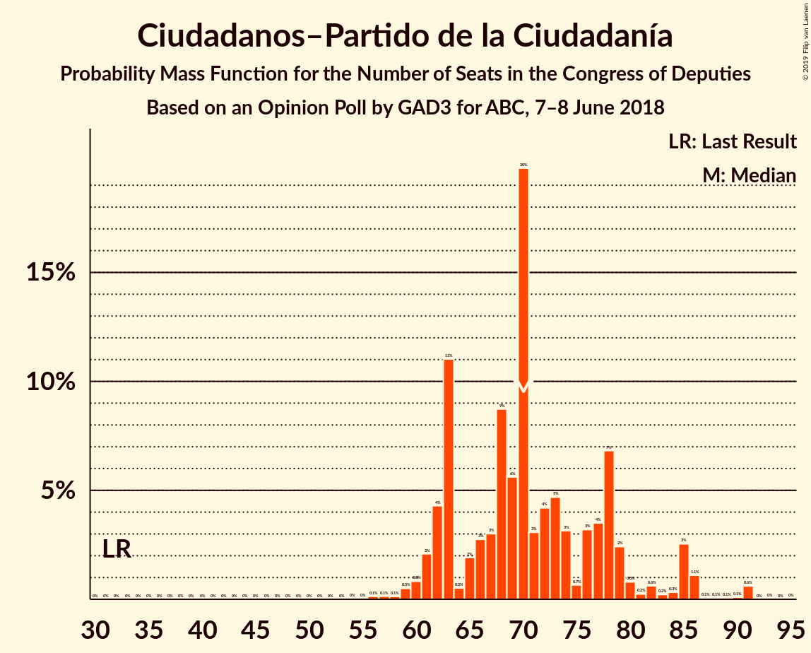
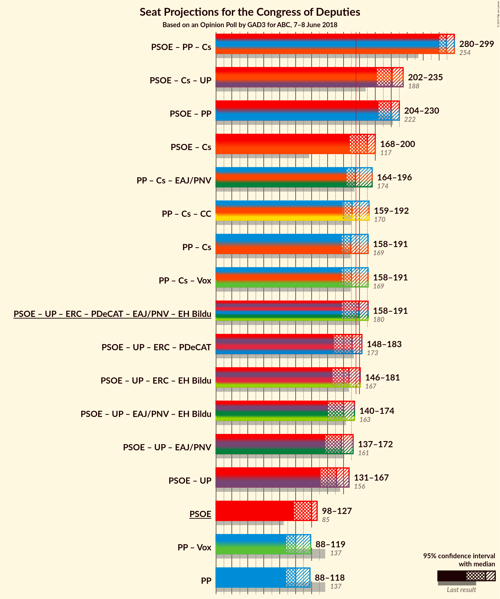
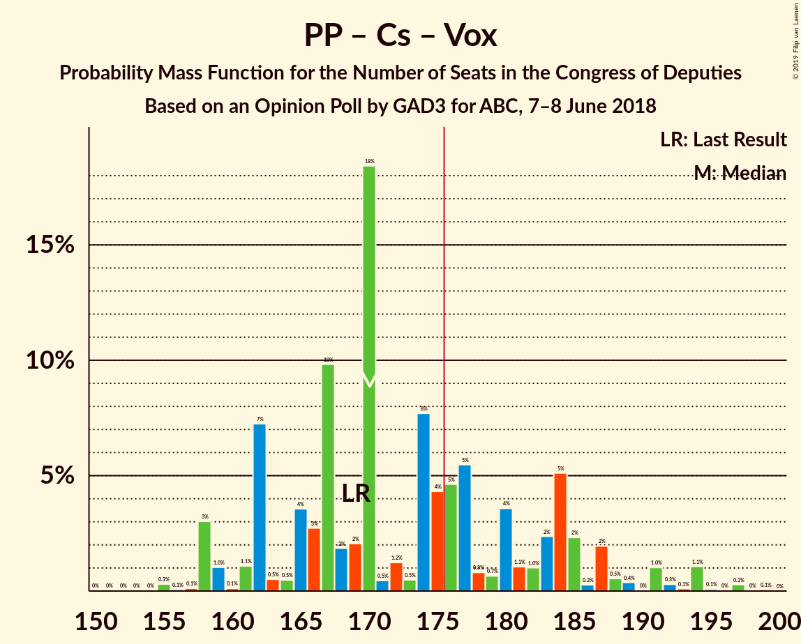

# Opinion Poll by GAD3 for ABC, 7–8 June 2018

<a href="#voting-intentions">Voting Intentions</a> | <a href="#seats">Seats</a> | <a href="#coalitions">Coalitions</a> | <a href="#technical-information">Technical Information</a>

## Voting Intentions

### Confidence Intervals

| Party | Last Result | Poll Result | 80% Confidence Interval | 90% Confidence Interval | 95% Confidence Interval | 99% Confidence Interval |
|:-----:|:-----------:|:-----------:|:-----------------------:|:-----------------------:|:-----------------------:|:-----------------------:|
| Partido Socialista Obrero Español | 22.6% | 28.8% | 26.8–30.9% |26.2–31.5% |25.7–32.0% |24.8–33.0% |
| Partido Popular | 33.0% | 25.6% | 23.7–27.7% |23.2–28.3% |22.7–28.8% |21.8–29.8% |
| Ciudadanos–Partido de la Ciudadanía | 13.1% | 21.1% | 19.4–23.1% |18.9–23.6% |18.4–24.1% |17.6–25.1% |
| Unidos Podemos | 21.2% | 13.1% | 11.7–14.8% |11.3–15.2% |11.0–15.7% |10.3–16.5% |
| Esquerra Republicana de Catalunya–Catalunya Sí | 2.7% | 3.2% | 2.6–4.2% |2.4–4.5% |2.2–4.7% |1.9–5.2% |
| Partit Demòcrata Europeu Català | 2.0% | 1.6% | 1.2–2.4% |1.1–2.6% |0.9–2.8% |0.8–3.2% |
| Partido Animalista Contra el Maltrato Animal | 1.2% | 1.4% | 1.0–2.1% |0.9–2.3% |0.8–2.5% |0.6–2.8% |
| Vox | 0.2% | 1.1% | 0.8–1.8% |0.7–2.0% |0.6–2.1% |0.5–2.5% |
| Euzko Alderdi Jeltzalea/Partido Nacionalista Vasco | 1.2% | 1.0% | 0.7–1.6% |0.6–1.8% |0.5–2.0% |0.4–2.3% |
| Euskal Herria Bildu | 0.8% | 0.8% | 0.5–1.3% |0.4–1.5% |0.4–1.6% |0.2–2.0% |
| Coalición Canaria–Partido Nacionalista Canario | 0.3% | 0.2% | 0.1–0.7% |0.1–0.8% |0.1–0.9% |0.0–1.2% |

*Note:* The poll result column reflects the actual value used in the calculations. Published results may vary slightly, and in addition be rounded to fewer digits.

## Seats

### Confidence Intervals

| Party | Last Result | Median | 80% Confidence Interval | 90% Confidence Interval | 95% Confidence Interval | 99% Confidence Interval |
|:-----:|:-----------:|:------:|:-----------------------:|:-----------------------:|:-----------------------:|:-----------------------:|
| <a href="#partido-socialista-obrero-español">Partido Socialista Obrero Español</a> | 85 | 120 | 106–126 |101–127 |98–127 |95–129 |
| <a href="#partido-popular">Partido Popular</a> | 137 | 100 | 92–111 |90–114 |88–118 |86–122 |
| <a href="#ciudadanos–partido-de-la-ciudadanía">Ciudadanos–Partido de la Ciudadanía</a> | 32 | 70 | 63–78 |62–83 |61–85 |58–91 |
| <a href="#unidos-podemos">Unidos Podemos</a> | 71 | 31 | 25–39 |25–39 |24–41 |23–47 |
| <a href="#esquerra-republicana-de-catalunya–catalunya-sí">Esquerra Republicana de Catalunya–Catalunya Sí</a> | 9 | 14 | 9–16 |9–17 |8–17 |7–19 |
| <a href="#partit-demòcrata-europeu-català">Partit Demòcrata Europeu Català</a> | 8 | 5 | 4–8 |4–10 |3–10 |1–11 |
| <a href="#partido-animalista-contra-el-maltrato-animal">Partido Animalista Contra el Maltrato Animal</a> | 0 | 0 | 0–1 |0–1 |0–1 |0–1 |
| <a href="#vox">Vox</a> | 0 | 1 | 0–1 |0–1 |0–1 |0–2 |
| <a href="#euzko-alderdi-jeltzalea/partido-nacionalista-vasco">Euzko Alderdi Jeltzalea/Partido Nacionalista Vasco</a> | 5 | 6 | 3–7 |3–8 |3–9 |2–10 |
| <a href="#euskal-herria-bildu">Euskal Herria Bildu</a> | 2 | 3 | 2–5 |1–6 |1–7 |0–7 |
| <a href="#coalición-canaria–partido-nacionalista-canario">Coalición Canaria–Partido Nacionalista Canario</a> | 1 | 1 | 0–2 |0–2 |0–2 |0–4 |

### Partido Socialista Obrero Español

*For a full overview of the results for this party, see the [Partido Socialista Obrero Español](party-partidosocialistaobreroespañol.html) page.*

| Number of Seats | Probability | Accumulated | Special Marks |
|:---------------:|:-----------:|:-----------:|:-------------:|
| 85 | 0% | 100% | Last Result |
| 86 | 0% | 100% |  |
| 87 | 0% | 100% |  |
| 88 | 0% | 100% |  |
| 89 | 0% | 100% |  |
| 90 | 0% | 100% |  |
| 91 | 0% | 100% |  |
| 92 | 0.1% | 99.9% |  |
| 93 | 0.2% | 99.8% |  |
| 94 | 0% | 99.6% |  |
| 95 | 0.6% | 99.6% |  |
| 96 | 0.1% | 99.0% |  |
| 97 | 0.3% | 98.9% |  |
| 98 | 1.2% | 98.6% |  |
| 99 | 2% | 97% |  |
| 100 | 0.6% | 96% |  |
| 101 | 0.2% | 95% |  |
| 102 | 0.4% | 95% |  |
| 103 | 0.5% | 94% |  |
| 104 | 1.5% | 94% |  |
| 105 | 0.4% | 92% |  |
| 106 | 3% | 92% |  |
| 107 | 3% | 90% |  |
| 108 | 0.9% | 86% |  |
| 109 | 6% | 85% |  |
| 110 | 1.0% | 79% |  |
| 111 | 2% | 78% |  |
| 112 | 7% | 76% |  |
| 113 | 1.0% | 70% |  |
| 114 | 1.1% | 69% |  |
| 115 | 2% | 67% |  |
| 116 | 2% | 66% |  |
| 117 | 5% | 63% |  |
| 118 | 3% | 59% |  |
| 119 | 0.9% | 56% |  |
| 120 | 10% | 55% | Median |
| 121 | 0.6% | 45% |  |
| 122 | 2% | 44% |  |
| 123 | 8% | 42% |  |
| 124 | 0.4% | 34% |  |
| 125 | 2% | 33% |  |
| 126 | 24% | 31% |  |
| 127 | 5% | 7% |  |
| 128 | 1.0% | 2% |  |
| 129 | 0.4% | 0.7% |  |
| 130 | 0.1% | 0.3% |  |
| 131 | 0.1% | 0.2% |  |
| 132 | 0% | 0.1% |  |
| 133 | 0% | 0.1% |  |
| 134 | 0% | 0.1% |  |
| 135 | 0% | 0.1% |  |
| 136 | 0% | 0.1% |  |
| 137 | 0% | 0% |  |

### Partido Popular

*For a full overview of the results for this party, see the [Partido Popular](party-partidopopular.html) page.*

| Number of Seats | Probability | Accumulated | Special Marks |
|:---------------:|:-----------:|:-----------:|:-------------:|
| 80 | 0% | 100% |  |
| 81 | 0% | 99.9% |  |
| 82 | 0% | 99.9% |  |
| 83 | 0.1% | 99.9% |  |
| 84 | 0% | 99.8% |  |
| 85 | 0.2% | 99.7% |  |
| 86 | 0.2% | 99.5% |  |
| 87 | 0.2% | 99.3% |  |
| 88 | 2% | 99.2% |  |
| 89 | 1.4% | 97% |  |
| 90 | 0.5% | 95% |  |
| 91 | 5% | 95% |  |
| 92 | 2% | 90% |  |
| 93 | 6% | 89% |  |
| 94 | 0.9% | 83% |  |
| 95 | 0.7% | 82% |  |
| 96 | 0.8% | 81% |  |
| 97 | 1.3% | 80% |  |
| 98 | 9% | 79% |  |
| 99 | 20% | 70% |  |
| 100 | 2% | 50% | Median |
| 101 | 5% | 49% |  |
| 102 | 0.9% | 44% |  |
| 103 | 5% | 43% |  |
| 104 | 9% | 37% |  |
| 105 | 0.9% | 28% |  |
| 106 | 5% | 27% |  |
| 107 | 6% | 22% |  |
| 108 | 1.1% | 16% |  |
| 109 | 0.3% | 15% |  |
| 110 | 0.8% | 14% |  |
| 111 | 5% | 14% |  |
| 112 | 0.3% | 9% |  |
| 113 | 3% | 9% |  |
| 114 | 0.7% | 6% |  |
| 115 | 1.4% | 5% |  |
| 116 | 0.2% | 3% |  |
| 117 | 0.4% | 3% |  |
| 118 | 1.0% | 3% |  |
| 119 | 0.4% | 2% |  |
| 120 | 0.6% | 2% |  |
| 121 | 0.4% | 0.9% |  |
| 122 | 0.1% | 0.6% |  |
| 123 | 0.2% | 0.4% |  |
| 124 | 0.1% | 0.2% |  |
| 125 | 0% | 0.2% |  |
| 126 | 0% | 0.1% |  |
| 127 | 0% | 0.1% |  |
| 128 | 0.1% | 0.1% |  |
| 129 | 0% | 0% |  |
| 130 | 0% | 0% |  |
| 131 | 0% | 0% |  |
| 132 | 0% | 0% |  |
| 133 | 0% | 0% |  |
| 134 | 0% | 0% |  |
| 135 | 0% | 0% |  |
| 136 | 0% | 0% |  |
| 137 | 0% | 0% | Last Result |

### Ciudadanos–Partido de la Ciudadanía

*For a full overview of the results for this party, see the [Ciudadanos–Partido de la Ciudadanía](party-ciudadanos–partidodelaciudadanía.html) page.*

| Number of Seats | Probability | Accumulated | Special Marks |
|:---------------:|:-----------:|:-----------:|:-------------:|
| 32 | 0% | 100% | Last Result |
| 33 | 0% | 100% |  |
| 34 | 0% | 100% |  |
| 35 | 0% | 100% |  |
| 36 | 0% | 100% |  |
| 37 | 0% | 100% |  |
| 38 | 0% | 100% |  |
| 39 | 0% | 100% |  |
| 40 | 0% | 100% |  |
| 41 | 0% | 100% |  |
| 42 | 0% | 100% |  |
| 43 | 0% | 100% |  |
| 44 | 0% | 100% |  |
| 45 | 0% | 100% |  |
| 46 | 0% | 100% |  |
| 47 | 0% | 100% |  |
| 48 | 0% | 100% |  |
| 49 | 0% | 100% |  |
| 50 | 0% | 100% |  |
| 51 | 0% | 100% |  |
| 52 | 0% | 100% |  |
| 53 | 0% | 100% |  |
| 54 | 0% | 100% |  |
| 55 | 0% | 99.9% |  |
| 56 | 0.1% | 99.9% |  |
| 57 | 0.1% | 99.8% |  |
| 58 | 0.1% | 99.6% |  |
| 59 | 0.5% | 99.5% |  |
| 60 | 0.8% | 99.0% |  |
| 61 | 2% | 98% |  |
| 62 | 4% | 96% |  |
| 63 | 11% | 92% |  |
| 64 | 0.5% | 81% |  |
| 65 | 2% | 80% |  |
| 66 | 3% | 78% |  |
| 67 | 3% | 76% |  |
| 68 | 9% | 73% |  |
| 69 | 6% | 64% |  |
| 70 | 20% | 58% | Median |
| 71 | 3% | 38% |  |
| 72 | 4% | 35% |  |
| 73 | 5% | 31% |  |
| 74 | 3% | 26% |  |
| 75 | 0.7% | 23% |  |
| 76 | 3% | 23% |  |
| 77 | 4% | 19% |  |
| 78 | 7% | 16% |  |
| 79 | 2% | 9% |  |
| 80 | 0.8% | 7% |  |
| 81 | 0.2% | 6% |  |
| 82 | 0.6% | 6% |  |
| 83 | 0.2% | 5% |  |
| 84 | 0.3% | 5% |  |
| 85 | 3% | 5% |  |
| 86 | 1.1% | 2% |  |
| 87 | 0.1% | 0.9% |  |
| 88 | 0.1% | 0.9% |  |
| 89 | 0.1% | 0.8% |  |
| 90 | 0.1% | 0.7% |  |
| 91 | 0.6% | 0.7% |  |
| 92 | 0% | 0% |  |

### Unidos Podemos

*For a full overview of the results for this party, see the [Unidos Podemos](party-unidospodemos.html) page.*

| Number of Seats | Probability | Accumulated | Special Marks |
|:---------------:|:-----------:|:-----------:|:-------------:|
| 22 | 0.1% | 100% |  |
| 23 | 0.4% | 99.9% |  |
| 24 | 3% | 99.5% |  |
| 25 | 6% | 96% |  |
| 26 | 3% | 90% |  |
| 27 | 20% | 87% |  |
| 28 | 4% | 66% |  |
| 29 | 6% | 62% |  |
| 30 | 5% | 57% |  |
| 31 | 13% | 52% | Median |
| 32 | 8% | 39% |  |
| 33 | 5% | 31% |  |
| 34 | 2% | 25% |  |
| 35 | 5% | 23% |  |
| 36 | 3% | 18% |  |
| 37 | 1.3% | 15% |  |
| 38 | 4% | 14% |  |
| 39 | 6% | 11% |  |
| 40 | 0.9% | 5% |  |
| 41 | 2% | 4% |  |
| 42 | 0.4% | 1.4% |  |
| 43 | 0.2% | 1.0% |  |
| 44 | 0% | 0.8% |  |
| 45 | 0.1% | 0.8% |  |
| 46 | 0% | 0.7% |  |
| 47 | 0.5% | 0.7% |  |
| 48 | 0.1% | 0.2% |  |
| 49 | 0% | 0.1% |  |
| 50 | 0% | 0.1% |  |
| 51 | 0% | 0% |  |
| 52 | 0% | 0% |  |
| 53 | 0% | 0% |  |
| 54 | 0% | 0% |  |
| 55 | 0% | 0% |  |
| 56 | 0% | 0% |  |
| 57 | 0% | 0% |  |
| 58 | 0% | 0% |  |
| 59 | 0% | 0% |  |
| 60 | 0% | 0% |  |
| 61 | 0% | 0% |  |
| 62 | 0% | 0% |  |
| 63 | 0% | 0% |  |
| 64 | 0% | 0% |  |
| 65 | 0% | 0% |  |
| 66 | 0% | 0% |  |
| 67 | 0% | 0% |  |
| 68 | 0% | 0% |  |
| 69 | 0% | 0% |  |
| 70 | 0% | 0% |  |
| 71 | 0% | 0% | Last Result |

### Esquerra Republicana de Catalunya–Catalunya Sí

*For a full overview of the results for this party, see the [Esquerra Republicana de Catalunya–Catalunya Sí](party-esquerrarepublicanadecatalunya–catalunyasí.html) page.*

| Number of Seats | Probability | Accumulated | Special Marks |
|:---------------:|:-----------:|:-----------:|:-------------:|
| 7 | 0.9% | 100% |  |
| 8 | 4% | 99.1% |  |
| 9 | 10% | 95% | Last Result |
| 10 | 2% | 86% |  |
| 11 | 7% | 83% |  |
| 12 | 13% | 76% |  |
| 13 | 6% | 63% |  |
| 14 | 25% | 57% | Median |
| 15 | 22% | 32% |  |
| 16 | 4% | 10% |  |
| 17 | 4% | 6% |  |
| 18 | 0.5% | 2% |  |
| 19 | 0.7% | 1.1% |  |
| 20 | 0.3% | 0.3% |  |
| 21 | 0% | 0% |  |

### Partit Demòcrata Europeu Català

*For a full overview of the results for this party, see the [Partit Demòcrata Europeu Català](party-partitdemòcrataeuropeucatalà.html) page.*

| Number of Seats | Probability | Accumulated | Special Marks |
|:---------------:|:-----------:|:-----------:|:-------------:|
| 1 | 2% | 100% |  |
| 2 | 0.2% | 98% |  |
| 3 | 3% | 98% |  |
| 4 | 37% | 95% |  |
| 5 | 21% | 58% | Median |
| 6 | 8% | 37% |  |
| 7 | 9% | 29% |  |
| 8 | 12% | 20% | Last Result |
| 9 | 1.2% | 8% |  |
| 10 | 6% | 7% |  |
| 11 | 0.3% | 0.5% |  |
| 12 | 0.1% | 0.2% |  |
| 13 | 0.1% | 0.2% |  |
| 14 | 0% | 0% |  |

### Partido Animalista Contra el Maltrato Animal

*For a full overview of the results for this party, see the [Partido Animalista Contra el Maltrato Animal](party-partidoanimalistacontraelmaltratoanimal.html) page.*

| Number of Seats | Probability | Accumulated | Special Marks |
|:---------------:|:-----------:|:-----------:|:-------------:|
| 0 | 71% | 100% | Last Result, Median |
| 1 | 29% | 29% |  |
| 2 | 0% | 0% |  |

### Vox

*For a full overview of the results for this party, see the [Vox](party-vox.html) page.*

| Number of Seats | Probability | Accumulated | Special Marks |
|:---------------:|:-----------:|:-----------:|:-------------:|
| 0 | 35% | 100% | Last Result |
| 1 | 64% | 65% | Median |
| 2 | 1.0% | 1.0% |  |
| 3 | 0% | 0% |  |

### Euzko Alderdi Jeltzalea/Partido Nacionalista Vasco

*For a full overview of the results for this party, see the [Euzko Alderdi Jeltzalea/Partido Nacionalista Vasco](party-euzkoalderdijeltzaleapartidonacionalistavasco.html) page.*

| Number of Seats | Probability | Accumulated | Special Marks |
|:---------------:|:-----------:|:-----------:|:-------------:|
| 1 | 0.2% | 100% |  |
| 2 | 0.6% | 99.8% |  |
| 3 | 10% | 99.2% |  |
| 4 | 11% | 89% |  |
| 5 | 13% | 78% | Last Result |
| 6 | 54% | 64% | Median |
| 7 | 5% | 11% |  |
| 8 | 3% | 6% |  |
| 9 | 2% | 3% |  |
| 10 | 0.8% | 0.9% |  |
| 11 | 0.1% | 0.1% |  |
| 12 | 0% | 0% |  |

### Euskal Herria Bildu

*For a full overview of the results for this party, see the [Euskal Herria Bildu](party-euskalherriabildu.html) page.*

| Number of Seats | Probability | Accumulated | Special Marks |
|:---------------:|:-----------:|:-----------:|:-------------:|
| 0 | 1.4% | 100% |  |
| 1 | 5% | 98.6% |  |
| 2 | 37% | 93% | Last Result |
| 3 | 17% | 56% | Median |
| 4 | 30% | 40% |  |
| 5 | 4% | 10% |  |
| 6 | 2% | 6% |  |
| 7 | 5% | 5% |  |
| 8 | 0.2% | 0.3% |  |
| 9 | 0.1% | 0.1% |  |
| 10 | 0% | 0% |  |

### Coalición Canaria–Partido Nacionalista Canario

*For a full overview of the results for this party, see the [Coalición Canaria–Partido Nacionalista Canario](party-coalicióncanaria–partidonacionalistacanario.html) page.*

| Number of Seats | Probability | Accumulated | Special Marks |
|:---------------:|:-----------:|:-----------:|:-------------:|
| 0 | 31% | 100% |  |
| 1 | 36% | 69% | Last Result, Median |
| 2 | 31% | 33% |  |
| 3 | 0.4% | 1.2% |  |
| 4 | 0.7% | 0.8% |  |
| 5 | 0.1% | 0.1% |  |
| 6 | 0% | 0% |  |

## Coalitions

### Confidence Intervals

| Coalition | Last Result | Median | Majority? | 80% Confidence Interval | 90% Confidence Interval | 95% Confidence Interval | 99% Confidence Interval |
|:---------:|:-----------:|:------:|:---------:|:-----------------------:|:-----------------------:|:-----------------------:|:-----------------------:|
| Partido Socialista Obrero Español – Partido Popular – Ciudadanos–Partido de la Ciudadanía | 254 | 289 | 100% | 283–296 | 282–299 | 280–299 | 276–300 |
| Partido Socialista Obrero Español – Ciudadanos–Partido de la Ciudadanía – Unidos Podemos | 188 | 221 | 100% | 208–232 | 206–233 | 202–235 | 198–238 |
| Partido Socialista Obrero Español – Partido Popular | 222 | 220 | 100% | 208–228 | 205–230 | 204–230 | 201–233 |
| Partido Socialista Obrero Español – Ciudadanos–Partido de la Ciudadanía | 117 | 190 | 94% | 179–196 | 172–199 | 168–200 | 165–201 |
| Partido Popular – Ciudadanos–Partido de la Ciudadanía – Euzko Alderdi Jeltzalea/Partido Nacionalista Vasco | 174 | 175 | 48% | 165–190 | 165–191 | 164–196 | 160–201 |
| Partido Popular – Ciudadanos–Partido de la Ciudadanía – Coalición Canaria–Partido Nacionalista Canario | 170 | 171 | 36% | 162–185 | 161–186 | 159–192 | 156–196 |
| Partido Popular – Ciudadanos–Partido de la Ciudadanía | 169 | 169 | 32% | 161–183 | 160–186 | 158–191 | 155–194 |
| Partido Popular – Ciudadanos–Partido de la Ciudadanía – Vox | 169 | 170 | 33% | 162–184 | 161–187 | 158–191 | 156–195 |
| Partido Socialista Obrero Español – Unidos Podemos – Esquerra Republicana de Catalunya–Catalunya Sí – Partit Demòcrata Europeu Català – Euzko Alderdi Jeltzalea/Partido Nacionalista Vasco – Euskal Herria Bildu | 180 | 179 | 55% | 164–187 | 163–188 | 158–191 | 154–193 |
| Partido Socialista Obrero Español – Unidos Podemos – Esquerra Republicana de Catalunya–Catalunya Sí – Partit Demòcrata Europeu Català | 173 | 171 | 17% | 155–181 | 154–181 | 148–183 | 144–185 |
| Partido Socialista Obrero Español – Unidos Podemos – Esquerra Republicana de Catalunya–Catalunya Sí – Euskal Herria Bildu | 167 | 167 | 12% | 152–177 | 149–179 | 146–181 | 140–182 |
| Partido Socialista Obrero Español – Unidos Podemos – Euzko Alderdi Jeltzalea/Partido Nacionalista Vasco – Euskal Herria Bildu | 163 | 160 | 2% | 146–169 | 142–171 | 140–174 | 133–176 |
| Partido Socialista Obrero Español – Unidos Podemos – Euzko Alderdi Jeltzalea/Partido Nacionalista Vasco | 161 | 157 | 0.1% | 142–164 | 138–169 | 137–172 | 129–174 |
| Partido Socialista Obrero Español – Unidos Podemos | 156 | 151 | 0% | 136–159 | 134–165 | 131–167 | 123–168 |
| Partido Socialista Obrero Español | 85 | 120 | 0% | 106–126 | 101–127 | 98–127 | 95–129 |
| Partido Popular – Vox | 137 | 100 | 0% | 92–112 | 90–115 | 88–119 | 86–123 |
| Partido Popular | 137 | 100 | 0% | 92–111 | 90–114 | 88–118 | 86–122 |

### Partido Socialista Obrero Español – Partido Popular – Ciudadanos–Partido de la Ciudadanía

| Number of Seats | Probability | Accumulated | Special Marks |
|:---------------:|:-----------:|:-----------:|:-------------:|
| 254 | 0% | 100% | Last Result |
| 255 | 0% | 100% |  |
| 256 | 0% | 100% |  |
| 257 | 0% | 100% |  |
| 258 | 0% | 100% |  |
| 259 | 0% | 100% |  |
| 260 | 0% | 100% |  |
| 261 | 0% | 100% |  |
| 262 | 0% | 100% |  |
| 263 | 0% | 100% |  |
| 264 | 0% | 100% |  |
| 265 | 0% | 100% |  |
| 266 | 0% | 100% |  |
| 267 | 0% | 100% |  |
| 268 | 0% | 100% |  |
| 269 | 0% | 100% |  |
| 270 | 0% | 100% |  |
| 271 | 0% | 100% |  |
| 272 | 0.1% | 100% |  |
| 273 | 0% | 99.9% |  |
| 274 | 0.2% | 99.9% |  |
| 275 | 0.1% | 99.7% |  |
| 276 | 0.4% | 99.6% |  |
| 277 | 0.1% | 99.3% |  |
| 278 | 0.4% | 99.2% |  |
| 279 | 0.5% | 98.7% |  |
| 280 | 1.5% | 98% |  |
| 281 | 1.1% | 97% |  |
| 282 | 3% | 96% |  |
| 283 | 4% | 93% |  |
| 284 | 1.4% | 89% |  |
| 285 | 4% | 87% |  |
| 286 | 6% | 83% |  |
| 287 | 16% | 77% |  |
| 288 | 6% | 61% |  |
| 289 | 6% | 55% |  |
| 290 | 8% | 49% | Median |
| 291 | 6% | 41% |  |
| 292 | 5% | 35% |  |
| 293 | 3% | 30% |  |
| 294 | 0.9% | 28% |  |
| 295 | 16% | 27% |  |
| 296 | 0.7% | 11% |  |
| 297 | 1.0% | 10% |  |
| 298 | 3% | 9% |  |
| 299 | 4% | 6% |  |
| 300 | 2% | 2% |  |
| 301 | 0.1% | 0.3% |  |
| 302 | 0.2% | 0.3% |  |
| 303 | 0% | 0% |  |

### Partido Socialista Obrero Español – Ciudadanos–Partido de la Ciudadanía – Unidos Podemos

| Number of Seats | Probability | Accumulated | Special Marks |
|:---------------:|:-----------:|:-----------:|:-------------:|
| 188 | 0% | 100% | Last Result |
| 189 | 0% | 100% |  |
| 190 | 0% | 100% |  |
| 191 | 0% | 100% |  |
| 192 | 0.1% | 100% |  |
| 193 | 0% | 99.9% |  |
| 194 | 0% | 99.9% |  |
| 195 | 0% | 99.8% |  |
| 196 | 0% | 99.8% |  |
| 197 | 0.2% | 99.8% |  |
| 198 | 0.2% | 99.6% |  |
| 199 | 0% | 99.4% |  |
| 200 | 0.4% | 99.4% |  |
| 201 | 0.8% | 98.9% |  |
| 202 | 0.9% | 98% |  |
| 203 | 2% | 97% |  |
| 204 | 0.1% | 95% |  |
| 205 | 0.1% | 95% |  |
| 206 | 5% | 95% |  |
| 207 | 0.5% | 91% |  |
| 208 | 2% | 90% |  |
| 209 | 0.8% | 89% |  |
| 210 | 0.3% | 88% |  |
| 211 | 3% | 87% |  |
| 212 | 3% | 85% |  |
| 213 | 2% | 82% |  |
| 214 | 10% | 80% |  |
| 215 | 2% | 71% |  |
| 216 | 3% | 68% |  |
| 217 | 6% | 65% |  |
| 218 | 3% | 59% |  |
| 219 | 5% | 56% |  |
| 220 | 0.5% | 51% |  |
| 221 | 0.6% | 50% | Median |
| 222 | 9% | 50% |  |
| 223 | 22% | 41% |  |
| 224 | 1.4% | 20% |  |
| 225 | 0.5% | 18% |  |
| 226 | 0.4% | 18% |  |
| 227 | 1.0% | 17% |  |
| 228 | 1.4% | 16% |  |
| 229 | 0.6% | 15% |  |
| 230 | 0.6% | 14% |  |
| 231 | 3% | 14% |  |
| 232 | 2% | 10% |  |
| 233 | 6% | 8% |  |
| 234 | 0% | 3% |  |
| 235 | 0.3% | 3% |  |
| 236 | 0.2% | 2% |  |
| 237 | 0% | 2% |  |
| 238 | 2% | 2% |  |
| 239 | 0.1% | 0.2% |  |
| 240 | 0% | 0.1% |  |
| 241 | 0% | 0.1% |  |
| 242 | 0% | 0.1% |  |
| 243 | 0% | 0% |  |

### Partido Socialista Obrero Español – Partido Popular

| Number of Seats | Probability | Accumulated | Special Marks |
|:---------------:|:-----------:|:-----------:|:-------------:|
| 194 | 0% | 100% |  |
| 195 | 0% | 99.9% |  |
| 196 | 0.2% | 99.9% |  |
| 197 | 0% | 99.8% |  |
| 198 | 0% | 99.7% |  |
| 199 | 0% | 99.7% |  |
| 200 | 0% | 99.7% |  |
| 201 | 0.2% | 99.6% |  |
| 202 | 0.9% | 99.4% |  |
| 203 | 0.5% | 98.6% |  |
| 204 | 0.7% | 98% |  |
| 205 | 3% | 97% |  |
| 206 | 0.4% | 95% |  |
| 207 | 1.2% | 94% |  |
| 208 | 4% | 93% |  |
| 209 | 1.2% | 89% |  |
| 210 | 6% | 88% |  |
| 211 | 0.8% | 82% |  |
| 212 | 1.3% | 81% |  |
| 213 | 6% | 80% |  |
| 214 | 3% | 75% |  |
| 215 | 6% | 72% |  |
| 216 | 1.5% | 66% |  |
| 217 | 2% | 64% |  |
| 218 | 5% | 62% |  |
| 219 | 6% | 57% |  |
| 220 | 0.9% | 51% | Median |
| 221 | 3% | 50% |  |
| 222 | 0.5% | 47% | Last Result |
| 223 | 0.7% | 46% |  |
| 224 | 10% | 45% |  |
| 225 | 17% | 35% |  |
| 226 | 4% | 19% |  |
| 227 | 0.8% | 14% |  |
| 228 | 5% | 14% |  |
| 229 | 2% | 8% |  |
| 230 | 5% | 6% |  |
| 231 | 0.1% | 0.9% |  |
| 232 | 0.3% | 0.8% |  |
| 233 | 0.1% | 0.5% |  |
| 234 | 0.2% | 0.4% |  |
| 235 | 0.1% | 0.2% |  |
| 236 | 0% | 0.1% |  |
| 237 | 0% | 0.1% |  |
| 238 | 0% | 0% |  |

### Partido Socialista Obrero Español – Ciudadanos–Partido de la Ciudadanía

| Number of Seats | Probability | Accumulated | Special Marks |
|:---------------:|:-----------:|:-----------:|:-------------:|
| 117 | 0% | 100% | Last Result |
| 118 | 0% | 100% |  |
| 119 | 0% | 100% |  |
| 120 | 0% | 100% |  |
| 121 | 0% | 100% |  |
| 122 | 0% | 100% |  |
| 123 | 0% | 100% |  |
| 124 | 0% | 100% |  |
| 125 | 0% | 100% |  |
| 126 | 0% | 100% |  |
| 127 | 0% | 100% |  |
| 128 | 0% | 100% |  |
| 129 | 0% | 100% |  |
| 130 | 0% | 100% |  |
| 131 | 0% | 100% |  |
| 132 | 0% | 100% |  |
| 133 | 0% | 100% |  |
| 134 | 0% | 100% |  |
| 135 | 0% | 100% |  |
| 136 | 0% | 100% |  |
| 137 | 0% | 100% |  |
| 138 | 0% | 100% |  |
| 139 | 0% | 100% |  |
| 140 | 0% | 100% |  |
| 141 | 0% | 100% |  |
| 142 | 0% | 100% |  |
| 143 | 0% | 100% |  |
| 144 | 0% | 100% |  |
| 145 | 0% | 100% |  |
| 146 | 0% | 100% |  |
| 147 | 0% | 100% |  |
| 148 | 0% | 100% |  |
| 149 | 0% | 100% |  |
| 150 | 0% | 100% |  |
| 151 | 0% | 100% |  |
| 152 | 0% | 100% |  |
| 153 | 0% | 100% |  |
| 154 | 0% | 100% |  |
| 155 | 0% | 100% |  |
| 156 | 0% | 100% |  |
| 157 | 0% | 100% |  |
| 158 | 0% | 100% |  |
| 159 | 0% | 100% |  |
| 160 | 0% | 100% |  |
| 161 | 0.1% | 99.9% |  |
| 162 | 0.1% | 99.9% |  |
| 163 | 0% | 99.8% |  |
| 164 | 0.1% | 99.8% |  |
| 165 | 0.6% | 99.7% |  |
| 166 | 0.6% | 99.1% |  |
| 167 | 0.8% | 98% |  |
| 168 | 0.6% | 98% |  |
| 169 | 0.3% | 97% |  |
| 170 | 0.6% | 97% |  |
| 171 | 0.3% | 96% |  |
| 172 | 0.8% | 96% |  |
| 173 | 0.4% | 95% |  |
| 174 | 0.1% | 95% |  |
| 175 | 0.5% | 94% |  |
| 176 | 2% | 94% | Majority |
| 177 | 0.3% | 92% |  |
| 178 | 1.4% | 92% |  |
| 179 | 5% | 91% |  |
| 180 | 2% | 85% |  |
| 181 | 2% | 83% |  |
| 182 | 1.0% | 81% |  |
| 183 | 11% | 80% |  |
| 184 | 0.7% | 69% |  |
| 185 | 3% | 69% |  |
| 186 | 5% | 65% |  |
| 187 | 2% | 61% |  |
| 188 | 1.0% | 59% |  |
| 189 | 3% | 58% |  |
| 190 | 9% | 55% | Median |
| 191 | 1.2% | 45% |  |
| 192 | 7% | 44% |  |
| 193 | 0.7% | 37% |  |
| 194 | 7% | 36% |  |
| 195 | 3% | 29% |  |
| 196 | 16% | 26% |  |
| 197 | 4% | 10% |  |
| 198 | 0.8% | 6% |  |
| 199 | 0.8% | 5% |  |
| 200 | 3% | 4% |  |
| 201 | 0.7% | 1.0% |  |
| 202 | 0% | 0.4% |  |
| 203 | 0.1% | 0.3% |  |
| 204 | 0% | 0.2% |  |
| 205 | 0% | 0.1% |  |
| 206 | 0% | 0.1% |  |
| 207 | 0% | 0.1% |  |
| 208 | 0% | 0.1% |  |
| 209 | 0% | 0% |  |

### Partido Popular – Ciudadanos–Partido de la Ciudadanía – Euzko Alderdi Jeltzalea/Partido Nacionalista Vasco

| Number of Seats | Probability | Accumulated | Special Marks |
|:---------------:|:-----------:|:-----------:|:-------------:|
| 155 | 0% | 100% |  |
| 156 | 0% | 99.9% |  |
| 157 | 0.1% | 99.9% |  |
| 158 | 0% | 99.8% |  |
| 159 | 0.1% | 99.8% |  |
| 160 | 0.3% | 99.7% |  |
| 161 | 0.1% | 99.4% |  |
| 162 | 0.2% | 99.3% |  |
| 163 | 0.1% | 99.1% |  |
| 164 | 3% | 99.1% |  |
| 165 | 7% | 96% |  |
| 166 | 2% | 89% |  |
| 167 | 0.9% | 88% |  |
| 168 | 0.5% | 87% |  |
| 169 | 2% | 86% |  |
| 170 | 4% | 84% |  |
| 171 | 0.6% | 80% |  |
| 172 | 1.0% | 79% |  |
| 173 | 12% | 78% |  |
| 174 | 1.4% | 66% | Last Result |
| 175 | 17% | 65% |  |
| 176 | 1.4% | 48% | Median, Majority |
| 177 | 3% | 47% |  |
| 178 | 0.4% | 44% |  |
| 179 | 7% | 44% |  |
| 180 | 1.0% | 37% |  |
| 181 | 11% | 36% |  |
| 182 | 1.2% | 25% |  |
| 183 | 0.7% | 24% |  |
| 184 | 3% | 23% |  |
| 185 | 2% | 20% |  |
| 186 | 0.8% | 18% |  |
| 187 | 4% | 17% |  |
| 188 | 1.3% | 13% |  |
| 189 | 2% | 12% |  |
| 190 | 5% | 10% |  |
| 191 | 0.2% | 5% |  |
| 192 | 0.6% | 5% |  |
| 193 | 0.4% | 4% |  |
| 194 | 1.1% | 4% |  |
| 195 | 0.2% | 3% |  |
| 196 | 0.3% | 3% |  |
| 197 | 0.4% | 2% |  |
| 198 | 0.1% | 2% |  |
| 199 | 0.1% | 2% |  |
| 200 | 1.0% | 2% |  |
| 201 | 0.3% | 0.6% |  |
| 202 | 0.2% | 0.3% |  |
| 203 | 0% | 0.1% |  |
| 204 | 0% | 0% |  |

### Partido Popular – Ciudadanos–Partido de la Ciudadanía – Coalición Canaria–Partido Nacionalista Canario

| Number of Seats | Probability | Accumulated | Special Marks |
|:---------------:|:-----------:|:-----------:|:-------------:|
| 151 | 0% | 100% |  |
| 152 | 0% | 99.9% |  |
| 153 | 0% | 99.9% |  |
| 154 | 0.3% | 99.9% |  |
| 155 | 0% | 99.6% |  |
| 156 | 0.1% | 99.6% |  |
| 157 | 0.1% | 99.5% |  |
| 158 | 0.2% | 99.4% |  |
| 159 | 3% | 99.2% |  |
| 160 | 1.2% | 96% |  |
| 161 | 2% | 95% |  |
| 162 | 6% | 93% |  |
| 163 | 0.5% | 87% |  |
| 164 | 0.3% | 86% |  |
| 165 | 4% | 86% |  |
| 166 | 1.4% | 83% |  |
| 167 | 2% | 81% |  |
| 168 | 2% | 79% |  |
| 169 | 25% | 77% |  |
| 170 | 1.0% | 52% | Last Result |
| 171 | 4% | 51% | Median |
| 172 | 0.5% | 47% |  |
| 173 | 0.9% | 46% |  |
| 174 | 3% | 46% |  |
| 175 | 6% | 43% |  |
| 176 | 7% | 36% | Majority |
| 177 | 0.9% | 29% |  |
| 178 | 5% | 28% |  |
| 179 | 4% | 23% |  |
| 180 | 2% | 20% |  |
| 181 | 0.3% | 17% |  |
| 182 | 0.3% | 17% |  |
| 183 | 2% | 17% |  |
| 184 | 0.4% | 14% |  |
| 185 | 7% | 14% |  |
| 186 | 2% | 7% |  |
| 187 | 0.1% | 5% |  |
| 188 | 1.1% | 5% |  |
| 189 | 0.1% | 3% |  |
| 190 | 0.1% | 3% |  |
| 191 | 0.6% | 3% |  |
| 192 | 0.9% | 3% |  |
| 193 | 0.2% | 2% |  |
| 194 | 0.2% | 2% |  |
| 195 | 0.1% | 1.3% |  |
| 196 | 0.9% | 1.3% |  |
| 197 | 0.3% | 0.4% |  |
| 198 | 0% | 0.1% |  |
| 199 | 0% | 0.1% |  |
| 200 | 0.1% | 0.1% |  |
| 201 | 0% | 0% |  |

### Partido Popular – Ciudadanos–Partido de la Ciudadanía

| Number of Seats | Probability | Accumulated | Special Marks |
|:---------------:|:-----------:|:-----------:|:-------------:|
| 150 | 0% | 100% |  |
| 151 | 0% | 99.9% |  |
| 152 | 0% | 99.9% |  |
| 153 | 0% | 99.9% |  |
| 154 | 0.3% | 99.8% |  |
| 155 | 0% | 99.5% |  |
| 156 | 0.2% | 99.5% |  |
| 157 | 0.2% | 99.3% |  |
| 158 | 4% | 99.2% |  |
| 159 | 0.4% | 96% |  |
| 160 | 0.3% | 95% |  |
| 161 | 8% | 95% |  |
| 162 | 0.3% | 87% |  |
| 163 | 0.7% | 87% |  |
| 164 | 3% | 86% |  |
| 165 | 0.8% | 83% |  |
| 166 | 3% | 82% |  |
| 167 | 10% | 79% |  |
| 168 | 2% | 68% |  |
| 169 | 17% | 67% | Last Result |
| 170 | 3% | 50% | Median |
| 171 | 1.2% | 47% |  |
| 172 | 0.7% | 46% |  |
| 173 | 7% | 45% |  |
| 174 | 2% | 39% |  |
| 175 | 4% | 36% |  |
| 176 | 8% | 32% | Majority |
| 177 | 1.4% | 24% |  |
| 178 | 0.5% | 22% |  |
| 179 | 3% | 22% |  |
| 180 | 1.4% | 18% |  |
| 181 | 0.5% | 17% |  |
| 182 | 2% | 17% |  |
| 183 | 6% | 14% |  |
| 184 | 2% | 9% |  |
| 185 | 0.5% | 7% |  |
| 186 | 2% | 6% |  |
| 187 | 0.2% | 4% |  |
| 188 | 0.3% | 3% |  |
| 189 | 0.2% | 3% |  |
| 190 | 0.3% | 3% |  |
| 191 | 1.1% | 3% |  |
| 192 | 0.1% | 2% |  |
| 193 | 0.1% | 2% |  |
| 194 | 1.0% | 1.5% |  |
| 195 | 0.1% | 0.5% |  |
| 196 | 0.3% | 0.4% |  |
| 197 | 0% | 0.1% |  |
| 198 | 0% | 0.1% |  |
| 199 | 0.1% | 0.1% |  |
| 200 | 0% | 0% |  |

### Partido Popular – Ciudadanos–Partido de la Ciudadanía – Vox

| Number of Seats | Probability | Accumulated | Special Marks |
|:---------------:|:-----------:|:-----------:|:-------------:|
| 150 | 0% | 100% |  |
| 151 | 0% | 99.9% |  |
| 152 | 0% | 99.9% |  |
| 153 | 0% | 99.9% |  |
| 154 | 0% | 99.9% |  |
| 155 | 0.3% | 99.8% |  |
| 156 | 0.1% | 99.5% |  |
| 157 | 0.1% | 99.4% |  |
| 158 | 3% | 99.3% |  |
| 159 | 1.0% | 96% |  |
| 160 | 0.1% | 95% |  |
| 161 | 1.1% | 95% |  |
| 162 | 7% | 94% |  |
| 163 | 0.5% | 87% |  |
| 164 | 0.5% | 86% |  |
| 165 | 4% | 86% |  |
| 166 | 3% | 82% |  |
| 167 | 10% | 80% |  |
| 168 | 2% | 70% |  |
| 169 | 2% | 68% | Last Result |
| 170 | 18% | 66% |  |
| 171 | 0.5% | 47% | Median |
| 172 | 1.2% | 47% |  |
| 173 | 0.5% | 46% |  |
| 174 | 8% | 45% |  |
| 175 | 4% | 37% |  |
| 176 | 5% | 33% | Majority |
| 177 | 5% | 29% |  |
| 178 | 0.8% | 23% |  |
| 179 | 0.7% | 22% |  |
| 180 | 4% | 22% |  |
| 181 | 1.1% | 18% |  |
| 182 | 1.0% | 17% |  |
| 183 | 2% | 16% |  |
| 184 | 5% | 14% |  |
| 185 | 2% | 8% |  |
| 186 | 0.3% | 6% |  |
| 187 | 2% | 6% |  |
| 188 | 0.5% | 4% |  |
| 189 | 0.4% | 3% |  |
| 190 | 0% | 3% |  |
| 191 | 1.0% | 3% |  |
| 192 | 0.3% | 2% |  |
| 193 | 0.1% | 2% |  |
| 194 | 1.1% | 2% |  |
| 195 | 0.1% | 0.5% |  |
| 196 | 0% | 0.4% |  |
| 197 | 0.3% | 0.4% |  |
| 198 | 0% | 0.1% |  |
| 199 | 0.1% | 0.1% |  |
| 200 | 0% | 0% |  |

### Partido Socialista Obrero Español – Unidos Podemos – Esquerra Republicana de Catalunya–Catalunya Sí – Partit Demòcrata Europeu Català – Euzko Alderdi Jeltzalea/Partido Nacionalista Vasco – Euskal Herria Bildu

| Number of Seats | Probability | Accumulated | Special Marks |
|:---------------:|:-----------:|:-----------:|:-------------:|
| 150 | 0.1% | 100% |  |
| 151 | 0% | 99.9% |  |
| 152 | 0.3% | 99.9% |  |
| 153 | 0.1% | 99.6% |  |
| 154 | 0.8% | 99.5% |  |
| 155 | 0.1% | 98.7% |  |
| 156 | 0.3% | 98.6% |  |
| 157 | 0.7% | 98% |  |
| 158 | 0.7% | 98% |  |
| 159 | 0.3% | 97% |  |
| 160 | 0.6% | 97% |  |
| 161 | 0.6% | 96% |  |
| 162 | 0.2% | 96% |  |
| 163 | 2% | 95% |  |
| 164 | 7% | 94% |  |
| 165 | 1.2% | 87% |  |
| 166 | 2% | 86% |  |
| 167 | 0.8% | 84% |  |
| 168 | 0.3% | 83% |  |
| 169 | 2% | 83% |  |
| 170 | 4% | 81% |  |
| 171 | 2% | 77% |  |
| 172 | 5% | 75% |  |
| 173 | 7% | 71% |  |
| 174 | 6% | 64% |  |
| 175 | 3% | 57% |  |
| 176 | 1.2% | 55% | Majority |
| 177 | 0.5% | 54% |  |
| 178 | 2% | 53% |  |
| 179 | 18% | 51% | Median |
| 180 | 2% | 33% | Last Result |
| 181 | 10% | 31% |  |
| 182 | 1.2% | 21% |  |
| 183 | 5% | 20% |  |
| 184 | 0.8% | 15% |  |
| 185 | 0.6% | 14% |  |
| 186 | 0.4% | 14% |  |
| 187 | 6% | 13% |  |
| 188 | 2% | 7% |  |
| 189 | 1.0% | 5% |  |
| 190 | 1.0% | 4% |  |
| 191 | 2% | 3% |  |
| 192 | 0.1% | 0.7% |  |
| 193 | 0.1% | 0.5% |  |
| 194 | 0% | 0.4% |  |
| 195 | 0.3% | 0.4% |  |
| 196 | 0% | 0.1% |  |
| 197 | 0.1% | 0.1% |  |
| 198 | 0% | 0.1% |  |
| 199 | 0% | 0.1% |  |
| 200 | 0% | 0% |  |

### Partido Socialista Obrero Español – Unidos Podemos – Esquerra Republicana de Catalunya–Catalunya Sí – Partit Demòcrata Europeu Català

| Number of Seats | Probability | Accumulated | Special Marks |
|:---------------:|:-----------:|:-----------:|:-------------:|
| 141 | 0% | 100% |  |
| 142 | 0% | 99.9% |  |
| 143 | 0.1% | 99.9% |  |
| 144 | 0.8% | 99.9% |  |
| 145 | 0.3% | 99.0% |  |
| 146 | 0.1% | 98.8% |  |
| 147 | 0.4% | 98.6% |  |
| 148 | 0.8% | 98% |  |
| 149 | 0.2% | 97% |  |
| 150 | 0.6% | 97% |  |
| 151 | 0.3% | 97% |  |
| 152 | 0.7% | 96% |  |
| 153 | 0.5% | 96% |  |
| 154 | 3% | 95% |  |
| 155 | 3% | 92% |  |
| 156 | 4% | 89% |  |
| 157 | 1.3% | 85% |  |
| 158 | 0.5% | 84% |  |
| 159 | 0.9% | 83% |  |
| 160 | 2% | 82% |  |
| 161 | 2% | 80% |  |
| 162 | 0.4% | 78% |  |
| 163 | 7% | 78% |  |
| 164 | 8% | 71% |  |
| 165 | 3% | 63% |  |
| 166 | 5% | 60% |  |
| 167 | 1.3% | 55% |  |
| 168 | 0.8% | 53% |  |
| 169 | 0.8% | 53% |  |
| 170 | 2% | 52% | Median |
| 171 | 26% | 50% |  |
| 172 | 1.4% | 24% |  |
| 173 | 2% | 23% | Last Result |
| 174 | 4% | 21% |  |
| 175 | 0.6% | 17% |  |
| 176 | 2% | 17% | Majority |
| 177 | 2% | 15% |  |
| 178 | 1.0% | 13% |  |
| 179 | 1.2% | 12% |  |
| 180 | 0.5% | 11% |  |
| 181 | 7% | 10% |  |
| 182 | 0.1% | 3% |  |
| 183 | 2% | 3% |  |
| 184 | 0.1% | 0.6% |  |
| 185 | 0.1% | 0.5% |  |
| 186 | 0% | 0.4% |  |
| 187 | 0.3% | 0.4% |  |
| 188 | 0% | 0.1% |  |
| 189 | 0% | 0.1% |  |
| 190 | 0% | 0.1% |  |
| 191 | 0% | 0% |  |

### Partido Socialista Obrero Español – Unidos Podemos – Esquerra Republicana de Catalunya–Catalunya Sí – Euskal Herria Bildu

| Number of Seats | Probability | Accumulated | Special Marks |
|:---------------:|:-----------:|:-----------:|:-------------:|
| 138 | 0% | 100% |  |
| 139 | 0% | 99.9% |  |
| 140 | 1.2% | 99.9% |  |
| 141 | 0.1% | 98.7% |  |
| 142 | 0.1% | 98.6% |  |
| 143 | 0.3% | 98.6% |  |
| 144 | 0.5% | 98% |  |
| 145 | 0.2% | 98% |  |
| 146 | 0.5% | 98% |  |
| 147 | 0.3% | 97% |  |
| 148 | 0.4% | 97% |  |
| 149 | 2% | 96% |  |
| 150 | 0.9% | 94% |  |
| 151 | 1.1% | 93% |  |
| 152 | 3% | 92% |  |
| 153 | 0.2% | 90% |  |
| 154 | 4% | 89% |  |
| 155 | 4% | 85% |  |
| 156 | 2% | 81% |  |
| 157 | 1.5% | 80% |  |
| 158 | 1.0% | 78% |  |
| 159 | 2% | 77% |  |
| 160 | 4% | 75% |  |
| 161 | 1.0% | 71% |  |
| 162 | 3% | 70% |  |
| 163 | 6% | 66% |  |
| 164 | 5% | 60% |  |
| 165 | 3% | 55% |  |
| 166 | 0.8% | 53% |  |
| 167 | 2% | 52% | Last Result |
| 168 | 3% | 50% | Median |
| 169 | 16% | 47% |  |
| 170 | 9% | 31% |  |
| 171 | 0.5% | 21% |  |
| 172 | 2% | 21% |  |
| 173 | 4% | 19% |  |
| 174 | 1.1% | 15% |  |
| 175 | 2% | 14% |  |
| 176 | 1.1% | 12% | Majority |
| 177 | 0.9% | 10% |  |
| 178 | 0.1% | 9% |  |
| 179 | 6% | 9% |  |
| 180 | 0.3% | 4% |  |
| 181 | 2% | 3% |  |
| 182 | 0.7% | 1.1% |  |
| 183 | 0.1% | 0.4% |  |
| 184 | 0.1% | 0.3% |  |
| 185 | 0% | 0.2% |  |
| 186 | 0.1% | 0.2% |  |
| 187 | 0.1% | 0.1% |  |
| 188 | 0% | 0% |  |

### Partido Socialista Obrero Español – Unidos Podemos – Euzko Alderdi Jeltzalea/Partido Nacionalista Vasco – Euskal Herria Bildu

| Number of Seats | Probability | Accumulated | Special Marks |
|:---------------:|:-----------:|:-----------:|:-------------:|
| 130 | 0% | 100% |  |
| 131 | 0.1% | 99.9% |  |
| 132 | 0% | 99.9% |  |
| 133 | 0.8% | 99.9% |  |
| 134 | 0% | 99.0% |  |
| 135 | 0% | 99.0% |  |
| 136 | 0.6% | 99.0% |  |
| 137 | 0.1% | 98% |  |
| 138 | 0.1% | 98% |  |
| 139 | 0.5% | 98% |  |
| 140 | 0.3% | 98% |  |
| 141 | 0.8% | 97% |  |
| 142 | 3% | 97% |  |
| 143 | 0.6% | 94% |  |
| 144 | 2% | 93% |  |
| 145 | 0.4% | 91% |  |
| 146 | 3% | 91% |  |
| 147 | 3% | 88% |  |
| 148 | 0.3% | 85% |  |
| 149 | 2% | 85% |  |
| 150 | 5% | 84% |  |
| 151 | 6% | 79% |  |
| 152 | 0.8% | 73% |  |
| 153 | 2% | 72% |  |
| 154 | 7% | 71% |  |
| 155 | 4% | 63% |  |
| 156 | 0.4% | 59% |  |
| 157 | 4% | 59% |  |
| 158 | 2% | 55% |  |
| 159 | 1.0% | 53% |  |
| 160 | 4% | 52% | Median |
| 161 | 25% | 48% |  |
| 162 | 1.5% | 23% |  |
| 163 | 1.5% | 22% | Last Result |
| 164 | 3% | 20% |  |
| 165 | 1.2% | 18% |  |
| 166 | 2% | 16% |  |
| 167 | 4% | 15% |  |
| 168 | 0.2% | 11% |  |
| 169 | 1.0% | 10% |  |
| 170 | 0.1% | 9% |  |
| 171 | 6% | 9% |  |
| 172 | 0.1% | 4% |  |
| 173 | 0.3% | 4% |  |
| 174 | 0.7% | 3% |  |
| 175 | 0.3% | 2% |  |
| 176 | 2% | 2% | Majority |
| 177 | 0% | 0.1% |  |
| 178 | 0% | 0.1% |  |
| 179 | 0% | 0.1% |  |
| 180 | 0% | 0.1% |  |
| 181 | 0% | 0% |  |

### Partido Socialista Obrero Español – Unidos Podemos – Euzko Alderdi Jeltzalea/Partido Nacionalista Vasco

| Number of Seats | Probability | Accumulated | Special Marks |
|:---------------:|:-----------:|:-----------:|:-------------:|
| 125 | 0% | 100% |  |
| 126 | 0% | 99.9% |  |
| 127 | 0.1% | 99.9% |  |
| 128 | 0% | 99.9% |  |
| 129 | 0.8% | 99.9% |  |
| 130 | 0% | 99.1% |  |
| 131 | 0.1% | 99.0% |  |
| 132 | 0.1% | 98.9% |  |
| 133 | 0.1% | 98.8% |  |
| 134 | 0.4% | 98.7% |  |
| 135 | 0.4% | 98% |  |
| 136 | 0.3% | 98% |  |
| 137 | 0.4% | 98% |  |
| 138 | 3% | 97% |  |
| 139 | 1.3% | 94% |  |
| 140 | 0.3% | 93% |  |
| 141 | 0.3% | 92% |  |
| 142 | 3% | 92% |  |
| 143 | 0.6% | 89% |  |
| 144 | 3% | 88% |  |
| 145 | 0.6% | 85% |  |
| 146 | 4% | 84% |  |
| 147 | 1.5% | 80% |  |
| 148 | 2% | 79% |  |
| 149 | 5% | 76% |  |
| 150 | 9% | 71% |  |
| 151 | 1.2% | 63% |  |
| 152 | 1.4% | 62% |  |
| 153 | 5% | 60% |  |
| 154 | 1.1% | 55% |  |
| 155 | 2% | 54% |  |
| 156 | 0.8% | 53% |  |
| 157 | 11% | 52% | Median |
| 158 | 2% | 40% |  |
| 159 | 16% | 38% |  |
| 160 | 1.1% | 22% |  |
| 161 | 3% | 21% | Last Result |
| 162 | 1.4% | 17% |  |
| 163 | 0.3% | 16% |  |
| 164 | 6% | 16% |  |
| 165 | 0.2% | 10% |  |
| 166 | 0.3% | 10% |  |
| 167 | 0.1% | 9% |  |
| 168 | 0.1% | 9% |  |
| 169 | 6% | 9% |  |
| 170 | 0.8% | 4% |  |
| 171 | 0% | 3% |  |
| 172 | 0.3% | 3% |  |
| 173 | 0.3% | 2% |  |
| 174 | 2% | 2% |  |
| 175 | 0.1% | 0.1% |  |
| 176 | 0% | 0.1% | Majority |
| 177 | 0% | 0% |  |

### Partido Socialista Obrero Español – Unidos Podemos

| Number of Seats | Probability | Accumulated | Special Marks |
|:---------------:|:-----------:|:-----------:|:-------------:|
| 120 | 0% | 100% |  |
| 121 | 0% | 99.9% |  |
| 122 | 0% | 99.9% |  |
| 123 | 0.8% | 99.9% |  |
| 124 | 0.1% | 99.1% |  |
| 125 | 0% | 99.1% |  |
| 126 | 0.2% | 99.0% |  |
| 127 | 0.1% | 98.8% |  |
| 128 | 0.2% | 98.7% |  |
| 129 | 0.4% | 98.5% |  |
| 130 | 0.4% | 98% |  |
| 131 | 0.4% | 98% |  |
| 132 | 0.6% | 97% |  |
| 133 | 0.8% | 97% |  |
| 134 | 3% | 96% |  |
| 135 | 1.0% | 93% |  |
| 136 | 3% | 92% |  |
| 137 | 3% | 90% |  |
| 138 | 2% | 87% |  |
| 139 | 1.1% | 85% |  |
| 140 | 0.9% | 84% |  |
| 141 | 5% | 83% |  |
| 142 | 2% | 79% |  |
| 143 | 2% | 76% |  |
| 144 | 10% | 75% |  |
| 145 | 0.9% | 65% |  |
| 146 | 2% | 64% |  |
| 147 | 2% | 62% |  |
| 148 | 4% | 60% |  |
| 149 | 2% | 56% |  |
| 150 | 1.0% | 54% |  |
| 151 | 12% | 53% | Median |
| 152 | 2% | 41% |  |
| 153 | 16% | 39% |  |
| 154 | 1.3% | 23% |  |
| 155 | 3% | 21% |  |
| 156 | 0.7% | 18% | Last Result |
| 157 | 0.5% | 18% |  |
| 158 | 6% | 17% |  |
| 159 | 2% | 11% |  |
| 160 | 0.3% | 10% |  |
| 161 | 0.2% | 10% |  |
| 162 | 0.4% | 9% |  |
| 163 | 0.7% | 9% |  |
| 164 | 0.1% | 8% |  |
| 165 | 6% | 8% |  |
| 166 | 0% | 3% |  |
| 167 | 0.4% | 3% |  |
| 168 | 2% | 2% |  |
| 169 | 0% | 0.1% |  |
| 170 | 0% | 0.1% |  |
| 171 | 0% | 0% |  |

### Partido Socialista Obrero Español

| Number of Seats | Probability | Accumulated | Special Marks |
|:---------------:|:-----------:|:-----------:|:-------------:|
| 85 | 0% | 100% | Last Result |
| 86 | 0% | 100% |  |
| 87 | 0% | 100% |  |
| 88 | 0% | 100% |  |
| 89 | 0% | 100% |  |
| 90 | 0% | 100% |  |
| 91 | 0% | 100% |  |
| 92 | 0.1% | 99.9% |  |
| 93 | 0.2% | 99.8% |  |
| 94 | 0% | 99.6% |  |
| 95 | 0.6% | 99.6% |  |
| 96 | 0.1% | 99.0% |  |
| 97 | 0.3% | 98.9% |  |
| 98 | 1.2% | 98.6% |  |
| 99 | 2% | 97% |  |
| 100 | 0.6% | 96% |  |
| 101 | 0.2% | 95% |  |
| 102 | 0.4% | 95% |  |
| 103 | 0.5% | 94% |  |
| 104 | 1.5% | 94% |  |
| 105 | 0.4% | 92% |  |
| 106 | 3% | 92% |  |
| 107 | 3% | 90% |  |
| 108 | 0.9% | 86% |  |
| 109 | 6% | 85% |  |
| 110 | 1.0% | 79% |  |
| 111 | 2% | 78% |  |
| 112 | 7% | 76% |  |
| 113 | 1.0% | 70% |  |
| 114 | 1.1% | 69% |  |
| 115 | 2% | 67% |  |
| 116 | 2% | 66% |  |
| 117 | 5% | 63% |  |
| 118 | 3% | 59% |  |
| 119 | 0.9% | 56% |  |
| 120 | 10% | 55% | Median |
| 121 | 0.6% | 45% |  |
| 122 | 2% | 44% |  |
| 123 | 8% | 42% |  |
| 124 | 0.4% | 34% |  |
| 125 | 2% | 33% |  |
| 126 | 24% | 31% |  |
| 127 | 5% | 7% |  |
| 128 | 1.0% | 2% |  |
| 129 | 0.4% | 0.7% |  |
| 130 | 0.1% | 0.3% |  |
| 131 | 0.1% | 0.2% |  |
| 132 | 0% | 0.1% |  |
| 133 | 0% | 0.1% |  |
| 134 | 0% | 0.1% |  |
| 135 | 0% | 0.1% |  |
| 136 | 0% | 0.1% |  |
| 137 | 0% | 0% |  |

### Partido Popular – Vox

| Number of Seats | Probability | Accumulated | Special Marks |
|:---------------:|:-----------:|:-----------:|:-------------:|
| 81 | 0% | 100% |  |
| 82 | 0% | 99.9% |  |
| 83 | 0.1% | 99.9% |  |
| 84 | 0% | 99.8% |  |
| 85 | 0% | 99.8% |  |
| 86 | 0.3% | 99.7% |  |
| 87 | 0.1% | 99.4% |  |
| 88 | 2% | 99.3% |  |
| 89 | 0.4% | 97% |  |
| 90 | 2% | 97% |  |
| 91 | 2% | 95% |  |
| 92 | 5% | 93% |  |
| 93 | 0.6% | 89% |  |
| 94 | 7% | 88% |  |
| 95 | 0.8% | 82% |  |
| 96 | 0.7% | 81% |  |
| 97 | 0.4% | 80% |  |
| 98 | 5% | 80% |  |
| 99 | 5% | 75% |  |
| 100 | 20% | 69% |  |
| 101 | 3% | 50% | Median |
| 102 | 3% | 47% |  |
| 103 | 6% | 43% |  |
| 104 | 9% | 38% |  |
| 105 | 0.9% | 29% |  |
| 106 | 0.9% | 28% |  |
| 107 | 6% | 27% |  |
| 108 | 6% | 21% |  |
| 109 | 0.5% | 15% |  |
| 110 | 0.8% | 15% |  |
| 111 | 0.3% | 14% |  |
| 112 | 5% | 13% |  |
| 113 | 0.4% | 9% |  |
| 114 | 3% | 9% |  |
| 115 | 1.2% | 5% |  |
| 116 | 0.7% | 4% |  |
| 117 | 0.1% | 3% |  |
| 118 | 0.3% | 3% |  |
| 119 | 0.6% | 3% |  |
| 120 | 1.1% | 2% |  |
| 121 | 0.4% | 1.1% |  |
| 122 | 0.2% | 0.7% |  |
| 123 | 0.1% | 0.5% |  |
| 124 | 0.2% | 0.4% |  |
| 125 | 0.1% | 0.2% |  |
| 126 | 0% | 0.2% |  |
| 127 | 0% | 0.1% |  |
| 128 | 0% | 0.1% |  |
| 129 | 0.1% | 0.1% |  |
| 130 | 0% | 0% |  |
| 131 | 0% | 0% |  |
| 132 | 0% | 0% |  |
| 133 | 0% | 0% |  |
| 134 | 0% | 0% |  |
| 135 | 0% | 0% |  |
| 136 | 0% | 0% |  |
| 137 | 0% | 0% | Last Result |

### Partido Popular

| Number of Seats | Probability | Accumulated | Special Marks |
|:---------------:|:-----------:|:-----------:|:-------------:|
| 80 | 0% | 100% |  |
| 81 | 0% | 99.9% |  |
| 82 | 0% | 99.9% |  |
| 83 | 0.1% | 99.9% |  |
| 84 | 0% | 99.8% |  |
| 85 | 0.2% | 99.7% |  |
| 86 | 0.2% | 99.5% |  |
| 87 | 0.2% | 99.3% |  |
| 88 | 2% | 99.2% |  |
| 89 | 1.4% | 97% |  |
| 90 | 0.5% | 95% |  |
| 91 | 5% | 95% |  |
| 92 | 2% | 90% |  |
| 93 | 6% | 89% |  |
| 94 | 0.9% | 83% |  |
| 95 | 0.7% | 82% |  |
| 96 | 0.8% | 81% |  |
| 97 | 1.3% | 80% |  |
| 98 | 9% | 79% |  |
| 99 | 20% | 70% |  |
| 100 | 2% | 50% | Median |
| 101 | 5% | 49% |  |
| 102 | 0.9% | 44% |  |
| 103 | 5% | 43% |  |
| 104 | 9% | 37% |  |
| 105 | 0.9% | 28% |  |
| 106 | 5% | 27% |  |
| 107 | 6% | 22% |  |
| 108 | 1.1% | 16% |  |
| 109 | 0.3% | 15% |  |
| 110 | 0.8% | 14% |  |
| 111 | 5% | 14% |  |
| 112 | 0.3% | 9% |  |
| 113 | 3% | 9% |  |
| 114 | 0.7% | 6% |  |
| 115 | 1.4% | 5% |  |
| 116 | 0.2% | 3% |  |
| 117 | 0.4% | 3% |  |
| 118 | 1.0% | 3% |  |
| 119 | 0.4% | 2% |  |
| 120 | 0.6% | 2% |  |
| 121 | 0.4% | 0.9% |  |
| 122 | 0.1% | 0.6% |  |
| 123 | 0.2% | 0.4% |  |
| 124 | 0.1% | 0.2% |  |
| 125 | 0% | 0.2% |  |
| 126 | 0% | 0.1% |  |
| 127 | 0% | 0.1% |  |
| 128 | 0.1% | 0.1% |  |
| 129 | 0% | 0% |  |
| 130 | 0% | 0% |  |
| 131 | 0% | 0% |  |
| 132 | 0% | 0% |  |
| 133 | 0% | 0% |  |
| 134 | 0% | 0% |  |
| 135 | 0% | 0% |  |
| 136 | 0% | 0% |  |
| 137 | 0% | 0% | Last Result |

## Technical Information

### Opinion Poll

+ **Polling firm:** GAD3
+ **Commissioner(s):** ABC
+ **Fieldwork period:** 7–8 June 2018

### Calculations

+ **Sample size:** 800
+ **Simulations done:** 1,048,576
+ **Error estimate:** 2.07%

