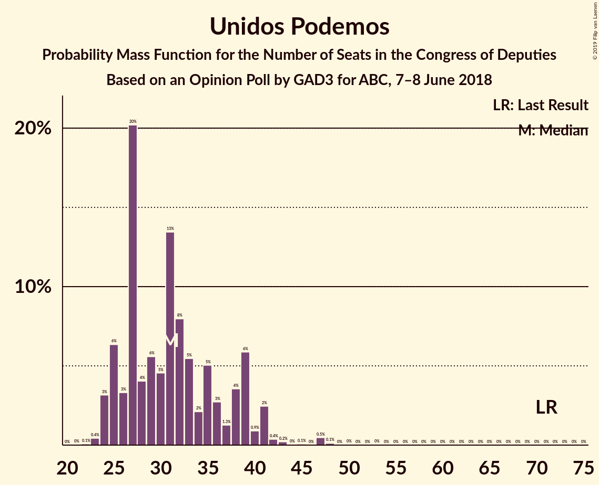
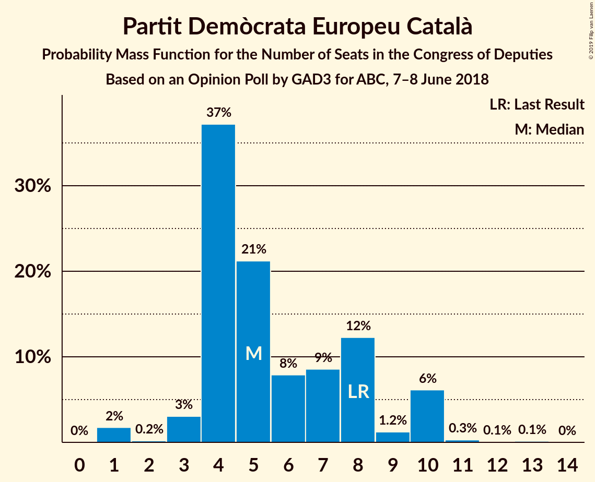
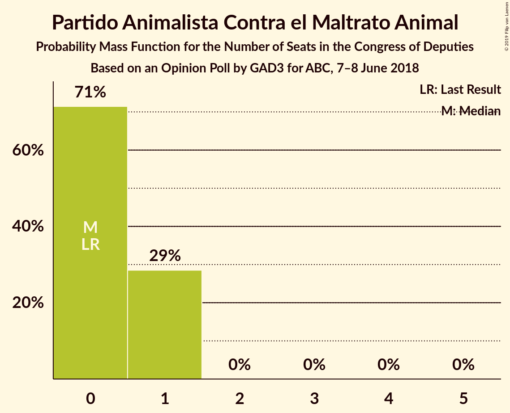
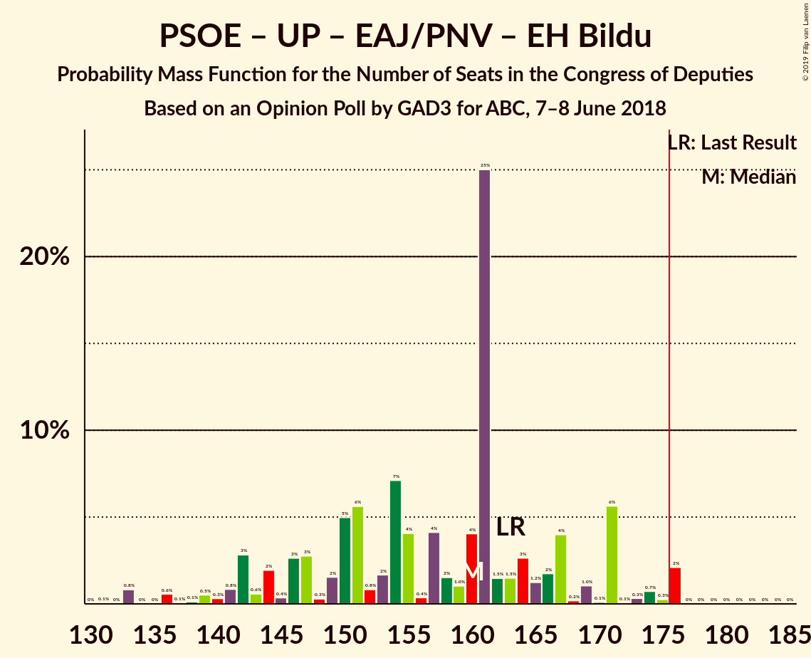

# Opinion Poll by GAD3 for ABC, 7–8 June 2018

<a href="#voting-intentions">Voting Intentions</a> | <a href="#seats">Seats</a> | <a href="#coalitions">Coalitions</a> | <a href="#technical-information">Technical Information</a>

## Voting Intentions

### Confidence Intervals

| Party | Last Result | Poll Result | 80% Confidence Interval | 90% Confidence Interval | 95% Confidence Interval | 99% Confidence Interval |
|:-----:|:-----------:|:-----------:|:-----------------------:|:-----------------------:|:-----------------------:|:-----------------------:|
| Partido Socialista Obrero Español | 22.6% | 28.8% | 26.8–30.9% |26.2–31.5% |25.7–32.0% |24.8–33.0% |
| Partido Popular | 33.0% | 25.6% | 23.7–27.7% |23.2–28.3% |22.7–28.8% |21.8–29.8% |
| Ciudadanos–Partido de la Ciudadanía | 13.1% | 21.1% | 19.4–23.1% |18.9–23.6% |18.4–24.1% |17.6–25.1% |
| Unidos Podemos | 21.2% | 13.1% | 11.7–14.8% |11.3–15.2% |11.0–15.7% |10.3–16.5% |
| Esquerra Republicana de Catalunya–Catalunya Sí | 2.7% | 3.2% | 2.6–4.2% |2.4–4.5% |2.2–4.7% |1.9–5.2% |
| Partit Demòcrata Europeu Català | 2.0% | 1.6% | 1.2–2.4% |1.1–2.6% |0.9–2.8% |0.8–3.2% |
| Partido Animalista Contra el Maltrato Animal | 1.2% | 1.4% | 1.0–2.1% |0.9–2.3% |0.8–2.5% |0.6–2.8% |
| Vox | 0.2% | 1.1% | 0.8–1.8% |0.7–2.0% |0.6–2.1% |0.5–2.5% |
| Euzko Alderdi Jeltzalea/Partido Nacionalista Vasco | 1.2% | 1.0% | 0.7–1.6% |0.6–1.8% |0.5–2.0% |0.4–2.3% |
| Euskal Herria Bildu | 0.8% | 0.8% | 0.5–1.3% |0.4–1.5% |0.4–1.6% |0.2–2.0% |
| Coalición Canaria–Partido Nacionalista Canario | 0.3% | 0.2% | 0.1–0.7% |0.1–0.8% |0.1–0.9% |0.0–1.2% |

*Note:* The poll result column reflects the actual value used in the calculations. Published results may vary slightly, and in addition be rounded to fewer digits.

## Seats

### Confidence Intervals

| Party | Last Result | Median | 80% Confidence Interval | 90% Confidence Interval | 95% Confidence Interval | 99% Confidence Interval |
|:-----:|:-----------:|:------:|:-----------------------:|:-----------------------:|:-----------------------:|:-----------------------:|
| <a href="#partido-socialista-obrero-español">Partido Socialista Obrero Español</a> | 85 | 112 | 91–125 |91–125 |91–125 |91–127 |
| <a href="#partido-popular">Partido Popular</a> | 137 | 98 | 85–125 |85–125 |85–125 |85–125 |
| <a href="#ciudadanos–partido-de-la-ciudadanía">Ciudadanos–Partido de la Ciudadanía</a> | 32 | 65 | 64–71 |64–73 |64–78 |52–80 |
| <a href="#unidos-podemos">Unidos Podemos</a> | 71 | 34 | 32–40 |28–40 |22–40 |20–64 |
| <a href="#esquerra-republicana-de-catalunya–catalunya-sí">Esquerra Republicana de Catalunya–Catalunya Sí</a> | 9 | 14 | 14–16 |13–17 |13–19 |7–19 |
| <a href="#partit-demòcrata-europeu-català">Partit Demòcrata Europeu Català</a> | 8 | 8 | 5–11 |5–11 |3–11 |3–12 |
| <a href="#partido-animalista-contra-el-maltrato-animal">Partido Animalista Contra el Maltrato Animal</a> | 0 | 1 | 0–2 |0–2 |0–2 |0–2 |
| <a href="#vox">Vox</a> | 0 | 0 | 0–1 |0–1 |0–1 |0–2 |
| <a href="#euzko-alderdi-jeltzalea/partido-nacionalista-vasco">Euzko Alderdi Jeltzalea/Partido Nacionalista Vasco</a> | 5 | 7 | 3–7 |3–7 |3–8 |1–10 |
| <a href="#euskal-herria-bildu">Euskal Herria Bildu</a> | 2 | 3 | 3–5 |3–6 |3–9 |2–9 |
| <a href="#coalición-canaria–partido-nacionalista-canario">Coalición Canaria–Partido Nacionalista Canario</a> | 1 | 0 | 0–2 |0–2 |0–4 |0–4 |

### Partido Socialista Obrero Español

*For a full overview of the results for this party, see the [Partido Socialista Obrero Español](party-partidosocialistaobreroespañol.html) page.*

| Number of Seats | Probability | Accumulated | Special Marks |
|:---------------:|:-----------:|:-----------:|:-------------:|
| 85 | 0% | 100% | Last Result |
| 86 | 0% | 100% |  |
| 87 | 0% | 100% |  |
| 88 | 0% | 100% |  |
| 89 | 0% | 100% |  |
| 90 | 0% | 100% |  |
| 91 | 47% | 100% |  |
| 92 | 0% | 53% |  |
| 93 | 0% | 53% |  |
| 94 | 0% | 53% |  |
| 95 | 0% | 53% |  |
| 96 | 0% | 53% |  |
| 97 | 0% | 53% |  |
| 98 | 0% | 53% |  |
| 99 | 0% | 53% |  |
| 100 | 2% | 53% |  |
| 101 | 0.1% | 52% |  |
| 102 | 0% | 52% |  |
| 103 | 0% | 52% |  |
| 104 | 0% | 52% |  |
| 105 | 0% | 52% |  |
| 106 | 0% | 52% |  |
| 107 | 2% | 52% |  |
| 108 | 0% | 50% |  |
| 109 | 0% | 50% |  |
| 110 | 0% | 50% |  |
| 111 | 0% | 50% |  |
| 112 | 0.5% | 50% | Median |
| 113 | 0% | 50% |  |
| 114 | 0% | 50% |  |
| 115 | 11% | 50% |  |
| 116 | 0% | 38% |  |
| 117 | 0% | 38% |  |
| 118 | 2% | 38% |  |
| 119 | 0% | 36% |  |
| 120 | 4% | 36% |  |
| 121 | 0% | 32% |  |
| 122 | 0% | 32% |  |
| 123 | 0% | 32% |  |
| 124 | 0% | 32% |  |
| 125 | 30% | 32% |  |
| 126 | 0.9% | 2% |  |
| 127 | 1.0% | 1.1% |  |
| 128 | 0% | 0.1% |  |
| 129 | 0% | 0.1% |  |
| 130 | 0% | 0.1% |  |
| 131 | 0% | 0.1% |  |
| 132 | 0% | 0.1% |  |
| 133 | 0% | 0.1% |  |
| 134 | 0% | 0.1% |  |
| 135 | 0% | 0.1% |  |
| 136 | 0.1% | 0.1% |  |
| 137 | 0% | 0% |  |

### Partido Popular

*For a full overview of the results for this party, see the [Partido Popular](party-partidopopular.html) page.*

| Number of Seats | Probability | Accumulated | Special Marks |
|:---------------:|:-----------:|:-----------:|:-------------:|
| 77 | 0.3% | 100% |  |
| 78 | 0% | 99.7% |  |
| 79 | 0% | 99.7% |  |
| 80 | 0.1% | 99.7% |  |
| 81 | 0% | 99.6% |  |
| 82 | 0% | 99.6% |  |
| 83 | 0% | 99.6% |  |
| 84 | 0% | 99.6% |  |
| 85 | 30% | 99.6% |  |
| 86 | 0% | 69% |  |
| 87 | 4% | 69% |  |
| 88 | 0% | 65% |  |
| 89 | 2% | 65% |  |
| 90 | 2% | 63% |  |
| 91 | 0% | 62% |  |
| 92 | 0.6% | 62% |  |
| 93 | 0% | 61% |  |
| 94 | 0% | 61% |  |
| 95 | 0% | 61% |  |
| 96 | 0% | 61% |  |
| 97 | 0% | 61% |  |
| 98 | 11% | 61% | Median |
| 99 | 0% | 50% |  |
| 100 | 0% | 50% |  |
| 101 | 0.1% | 50% |  |
| 102 | 0% | 49% |  |
| 103 | 0.1% | 49% |  |
| 104 | 0% | 49% |  |
| 105 | 0% | 49% |  |
| 106 | 0.8% | 49% |  |
| 107 | 0% | 49% |  |
| 108 | 0% | 49% |  |
| 109 | 0% | 49% |  |
| 110 | 0.5% | 49% |  |
| 111 | 0% | 48% |  |
| 112 | 0% | 48% |  |
| 113 | 0% | 48% |  |
| 114 | 0% | 48% |  |
| 115 | 0% | 48% |  |
| 116 | 0% | 48% |  |
| 117 | 0% | 48% |  |
| 118 | 0% | 48% |  |
| 119 | 0% | 48% |  |
| 120 | 1.5% | 48% |  |
| 121 | 0% | 47% |  |
| 122 | 0% | 47% |  |
| 123 | 0% | 47% |  |
| 124 | 0% | 47% |  |
| 125 | 47% | 47% |  |
| 126 | 0% | 0% |  |
| 127 | 0% | 0% |  |
| 128 | 0% | 0% |  |
| 129 | 0% | 0% |  |
| 130 | 0% | 0% |  |
| 131 | 0% | 0% |  |
| 132 | 0% | 0% |  |
| 133 | 0% | 0% |  |
| 134 | 0% | 0% |  |
| 135 | 0% | 0% |  |
| 136 | 0% | 0% |  |
| 137 | 0% | 0% | Last Result |

### Ciudadanos–Partido de la Ciudadanía

*For a full overview of the results for this party, see the [Ciudadanos–Partido de la Ciudadanía](party-ciudadanos–partidodelaciudadanía.html) page.*

| Number of Seats | Probability | Accumulated | Special Marks |
|:---------------:|:-----------:|:-----------:|:-------------:|
| 32 | 0% | 100% | Last Result |
| 33 | 0% | 100% |  |
| 34 | 0% | 100% |  |
| 35 | 0% | 100% |  |
| 36 | 0% | 100% |  |
| 37 | 0% | 100% |  |
| 38 | 0% | 100% |  |
| 39 | 0% | 100% |  |
| 40 | 0% | 100% |  |
| 41 | 0% | 100% |  |
| 42 | 0% | 100% |  |
| 43 | 0% | 100% |  |
| 44 | 0% | 100% |  |
| 45 | 0% | 100% |  |
| 46 | 0% | 100% |  |
| 47 | 0% | 100% |  |
| 48 | 0% | 100% |  |
| 49 | 0% | 100% |  |
| 50 | 0% | 100% |  |
| 51 | 0% | 100% |  |
| 52 | 1.5% | 100% |  |
| 53 | 0% | 98.5% |  |
| 54 | 0% | 98.5% |  |
| 55 | 0% | 98.5% |  |
| 56 | 0% | 98.5% |  |
| 57 | 0% | 98.5% |  |
| 58 | 0% | 98.5% |  |
| 59 | 0% | 98% |  |
| 60 | 0% | 98% |  |
| 61 | 0% | 98% |  |
| 62 | 0% | 98% |  |
| 63 | 0.2% | 98% |  |
| 64 | 47% | 98% |  |
| 65 | 12% | 52% | Median |
| 66 | 0% | 40% |  |
| 67 | 0% | 40% |  |
| 68 | 2% | 40% |  |
| 69 | 0.5% | 37% |  |
| 70 | 0.1% | 37% |  |
| 71 | 30% | 37% |  |
| 72 | 0.1% | 7% |  |
| 73 | 4% | 7% |  |
| 74 | 0.1% | 3% |  |
| 75 | 0% | 3% |  |
| 76 | 0% | 3% |  |
| 77 | 0% | 3% |  |
| 78 | 0.3% | 3% |  |
| 79 | 0% | 2% |  |
| 80 | 2% | 2% |  |
| 81 | 0% | 0.2% |  |
| 82 | 0% | 0.2% |  |
| 83 | 0% | 0.2% |  |
| 84 | 0% | 0.2% |  |
| 85 | 0% | 0.2% |  |
| 86 | 0.1% | 0.2% |  |
| 87 | 0% | 0.1% |  |
| 88 | 0% | 0.1% |  |
| 89 | 0% | 0.1% |  |
| 90 | 0% | 0.1% |  |
| 91 | 0% | 0.1% |  |
| 92 | 0% | 0.1% |  |
| 93 | 0% | 0.1% |  |
| 94 | 0.1% | 0.1% |  |
| 95 | 0% | 0% |  |

### Unidos Podemos

*For a full overview of the results for this party, see the [Unidos Podemos](party-unidospodemos.html) page.*

| Number of Seats | Probability | Accumulated | Special Marks |
|:---------------:|:-----------:|:-----------:|:-------------:|
| 20 | 0.8% | 100% |  |
| 21 | 0% | 99.1% |  |
| 22 | 2% | 99.1% |  |
| 23 | 0% | 97% |  |
| 24 | 0% | 97% |  |
| 25 | 0.5% | 97% |  |
| 26 | 0% | 97% |  |
| 27 | 0.5% | 96% |  |
| 28 | 4% | 96% |  |
| 29 | 0% | 92% |  |
| 30 | 0% | 92% |  |
| 31 | 0% | 92% |  |
| 32 | 30% | 92% |  |
| 33 | 11% | 62% |  |
| 34 | 0.3% | 50% | Median |
| 35 | 0% | 50% |  |
| 36 | 0% | 50% |  |
| 37 | 0% | 50% |  |
| 38 | 0% | 50% |  |
| 39 | 1.5% | 50% |  |
| 40 | 47% | 48% |  |
| 41 | 0% | 2% |  |
| 42 | 0% | 2% |  |
| 43 | 0% | 2% |  |
| 44 | 0% | 2% |  |
| 45 | 0% | 2% |  |
| 46 | 0% | 2% |  |
| 47 | 0.2% | 2% |  |
| 48 | 0% | 2% |  |
| 49 | 0% | 2% |  |
| 50 | 0% | 2% |  |
| 51 | 0% | 2% |  |
| 52 | 0% | 2% |  |
| 53 | 0% | 2% |  |
| 54 | 0% | 2% |  |
| 55 | 0% | 2% |  |
| 56 | 0% | 2% |  |
| 57 | 0% | 2% |  |
| 58 | 0% | 2% |  |
| 59 | 0% | 2% |  |
| 60 | 0% | 2% |  |
| 61 | 0% | 2% |  |
| 62 | 0% | 2% |  |
| 63 | 0% | 2% |  |
| 64 | 2% | 2% |  |
| 65 | 0% | 0% |  |
| 66 | 0% | 0% |  |
| 67 | 0% | 0% |  |
| 68 | 0% | 0% |  |
| 69 | 0% | 0% |  |
| 70 | 0% | 0% |  |
| 71 | 0% | 0% | Last Result |

### Esquerra Republicana de Catalunya–Catalunya Sí

*For a full overview of the results for this party, see the [Esquerra Republicana de Catalunya–Catalunya Sí](party-esquerrarepublicanadecatalunya–catalunyasí.html) page.*

| Number of Seats | Probability | Accumulated | Special Marks |
|:---------------:|:-----------:|:-----------:|:-------------:|
| 7 | 0.5% | 100% |  |
| 8 | 1.0% | 99.5% |  |
| 9 | 0.4% | 98.5% | Last Result |
| 10 | 0% | 98% |  |
| 11 | 0% | 98% |  |
| 12 | 0.2% | 98% |  |
| 13 | 4% | 98% |  |
| 14 | 47% | 94% | Median |
| 15 | 31% | 48% |  |
| 16 | 11% | 17% |  |
| 17 | 1.5% | 5% |  |
| 18 | 0% | 4% |  |
| 19 | 4% | 4% |  |
| 20 | 0% | 0% |  |

### Partit Demòcrata Europeu Català

*For a full overview of the results for this party, see the [Partit Demòcrata Europeu Català](party-partitdemòcrataeuropeucatalà.html) page.*

| Number of Seats | Probability | Accumulated | Special Marks |
|:---------------:|:-----------:|:-----------:|:-------------:|
| 1 | 0.2% | 100% |  |
| 2 | 0% | 99.8% |  |
| 3 | 3% | 99.8% |  |
| 4 | 0% | 97% |  |
| 5 | 47% | 97% |  |
| 6 | 0% | 50% |  |
| 7 | 0% | 50% |  |
| 8 | 4% | 50% | Last Result, Median |
| 9 | 2% | 46% |  |
| 10 | 0.9% | 44% |  |
| 11 | 42% | 43% |  |
| 12 | 0.9% | 1.4% |  |
| 13 | 0% | 0.5% |  |
| 14 | 0% | 0.5% |  |
| 15 | 0.5% | 0.5% |  |
| 16 | 0% | 0% |  |

### Partido Animalista Contra el Maltrato Animal

*For a full overview of the results for this party, see the [Partido Animalista Contra el Maltrato Animal](party-partidoanimalistacontraelmaltratoanimal.html) page.*

| Number of Seats | Probability | Accumulated | Special Marks |
|:---------------:|:-----------:|:-----------:|:-------------:|
| 0 | 39% | 100% | Last Result |
| 1 | 49% | 61% | Median |
| 2 | 12% | 12% |  |
| 3 | 0% | 0% |  |

### Vox

*For a full overview of the results for this party, see the [Vox](party-vox.html) page.*

| Number of Seats | Probability | Accumulated | Special Marks |
|:---------------:|:-----------:|:-----------:|:-------------:|
| 0 | 54% | 100% | Last Result, Median |
| 1 | 46% | 46% |  |
| 2 | 0.5% | 0.5% |  |
| 3 | 0% | 0% |  |

### Euzko Alderdi Jeltzalea/Partido Nacionalista Vasco

*For a full overview of the results for this party, see the [Euzko Alderdi Jeltzalea/Partido Nacionalista Vasco](party-euzkoalderdijeltzaleapartidonacionalistavasco.html) page.*

| Number of Seats | Probability | Accumulated | Special Marks |
|:---------------:|:-----------:|:-----------:|:-------------:|
| 1 | 0.7% | 100% |  |
| 2 | 0.1% | 99.3% |  |
| 3 | 30% | 99.2% |  |
| 4 | 4% | 69% |  |
| 5 | 2% | 65% | Last Result |
| 6 | 13% | 63% |  |
| 7 | 48% | 51% | Median |
| 8 | 0.4% | 3% |  |
| 9 | 0% | 2% |  |
| 10 | 2% | 2% |  |
| 11 | 0% | 0% |  |

### Euskal Herria Bildu

*For a full overview of the results for this party, see the [Euskal Herria Bildu](party-euskalherriabildu.html) page.*

| Number of Seats | Probability | Accumulated | Special Marks |
|:---------------:|:-----------:|:-----------:|:-------------:|
| 1 | 0% | 100% |  |
| 2 | 2% | 99.9% | Last Result |
| 3 | 58% | 98% | Median |
| 4 | 2% | 39% |  |
| 5 | 33% | 38% |  |
| 6 | 0.4% | 5% |  |
| 7 | 0.1% | 5% |  |
| 8 | 0.1% | 5% |  |
| 9 | 4% | 4% |  |
| 10 | 0% | 0% |  |

### Coalición Canaria–Partido Nacionalista Canario

*For a full overview of the results for this party, see the [Coalición Canaria–Partido Nacionalista Canario](party-coalicióncanaria–partidonacionalistacanario.html) page.*

| Number of Seats | Probability | Accumulated | Special Marks |
|:---------------:|:-----------:|:-----------:|:-------------:|
| 0 | 59% | 100% | Median |
| 1 | 7% | 41% | Last Result |
| 2 | 31% | 35% |  |
| 3 | 0.2% | 4% |  |
| 4 | 4% | 4% |  |
| 5 | 0% | 0% |  |

## Coalitions

### Confidence Intervals

| Coalition | Last Result | Median | Majority? | 80% Confidence Interval | 90% Confidence Interval | 95% Confidence Interval | 99% Confidence Interval |
|:---------:|:-----------:|:------:|:---------:|:-----------------------:|:-----------------------:|:-----------------------:|:-----------------------:|
| Partido Socialista Obrero Español – Partido Popular – Ciudadanos–Partido de la Ciudadanía | 254 | 280 | 100% | 278–281 | 278–281 | 278–287 | 258–300 |
| Partido Socialista Obrero Español – Ciudadanos–Partido de la Ciudadanía – Unidos Podemos | 188 | 213 | 100% | 195–228 | 195–228 | 195–228 | 195–237 |
| Partido Socialista Obrero Español – Partido Popular | 222 | 216 | 100% | 210–216 | 207–216 | 207–222 | 190–232 |
| Partido Socialista Obrero Español – Ciudadanos–Partido de la Ciudadanía | 117 | 180 | 50% | 155–196 | 155–196 | 155–198 | 155–204 |
| Partido Socialista Obrero Español – Unidos Podemos – Esquerra Republicana de Catalunya–Catalunya Sí – Partit Demòcrata Europeu Català – Euzko Alderdi Jeltzalea/Partido Nacionalista Vasco – Euskal Herria Bildu | 180 | 177 | 52% | 160–191 | 160–191 | 160–191 | 160–191 |
| Partido Popular – Ciudadanos–Partido de la Ciudadanía – Coalición Canaria–Partido Nacionalista Canario | 170 | 173 | 47% | 158–189 | 158–189 | 158–189 | 158–189 |
| Partido Popular – Ciudadanos–Partido de la Ciudadanía – Vox | 169 | 169 | 47% | 157–189 | 157–189 | 157–189 | 156–189 |
| Partido Popular – Ciudadanos–Partido de la Ciudadanía | 169 | 169 | 47% | 156–189 | 156–189 | 156–189 | 155–189 |
| Partido Socialista Obrero Español – Unidos Podemos – Esquerra Republicana de Catalunya–Catalunya Sí – Partit Demòcrata Europeu Català | 173 | 166 | 33% | 150–183 | 150–183 | 150–183 | 150–183 |
| Partido Socialista Obrero Español – Unidos Podemos – Esquerra Republicana de Catalunya–Catalunya Sí – Euskal Herria Bildu | 167 | 158 | 36% | 148–177 | 148–177 | 148–177 | 148–179 |
| Partido Socialista Obrero Español – Unidos Podemos – Euzko Alderdi Jeltzalea/Partido Nacionalista Vasco – Euskal Herria Bildu | 163 | 155 | 0.2% | 141–165 | 141–165 | 141–166 | 141–174 |
| Partido Socialista Obrero Español – Unidos Podemos | 156 | 146 | 0% | 131–157 | 131–157 | 131–157 | 131–164 |
| Partido Socialista Obrero Español | 85 | 112 | 0% | 91–125 | 91–125 | 91–125 | 91–127 |
| Partido Popular – Vox | 137 | 99 | 0% | 86–125 | 86–125 | 86–125 | 86–125 |
| Partido Popular | 137 | 98 | 0% | 85–125 | 85–125 | 85–125 | 85–125 |

### Partido Socialista Obrero Español – Partido Popular – Ciudadanos–Partido de la Ciudadanía

| Number of Seats | Probability | Accumulated | Special Marks |
|:---------------:|:-----------:|:-----------:|:-------------:|
| 254 | 0% | 100% | Last Result |
| 255 | 0% | 100% |  |
| 256 | 0% | 100% |  |
| 257 | 0% | 100% |  |
| 258 | 2% | 100% |  |
| 259 | 0% | 98% |  |
| 260 | 0% | 98% |  |
| 261 | 0% | 98% |  |
| 262 | 0% | 98% |  |
| 263 | 0% | 98% |  |
| 264 | 0% | 98% |  |
| 265 | 0% | 98% |  |
| 266 | 0% | 98% |  |
| 267 | 0% | 98% |  |
| 268 | 0% | 98% |  |
| 269 | 0% | 98% |  |
| 270 | 0% | 98% |  |
| 271 | 0% | 98% |  |
| 272 | 0% | 98% |  |
| 273 | 0% | 98% |  |
| 274 | 0% | 98% |  |
| 275 | 0% | 98% | Median |
| 276 | 0% | 98% |  |
| 277 | 0% | 98% |  |
| 278 | 11% | 98% |  |
| 279 | 1.5% | 87% |  |
| 280 | 50% | 85% |  |
| 281 | 30% | 35% |  |
| 282 | 0.5% | 5% |  |
| 283 | 0% | 4% |  |
| 284 | 0.4% | 4% |  |
| 285 | 0% | 4% |  |
| 286 | 0.1% | 4% |  |
| 287 | 2% | 4% |  |
| 288 | 0% | 2% |  |
| 289 | 0% | 2% |  |
| 290 | 0% | 1.5% |  |
| 291 | 0.6% | 1.5% |  |
| 292 | 0% | 0.9% |  |
| 293 | 0% | 0.9% |  |
| 294 | 0% | 0.9% |  |
| 295 | 0% | 0.9% |  |
| 296 | 0% | 0.9% |  |
| 297 | 0% | 0.9% |  |
| 298 | 0% | 0.9% |  |
| 299 | 0% | 0.9% |  |
| 300 | 0.8% | 0.9% |  |
| 301 | 0% | 0% |  |

### Partido Socialista Obrero Español – Ciudadanos–Partido de la Ciudadanía – Unidos Podemos

| Number of Seats | Probability | Accumulated | Special Marks |
|:---------------:|:-----------:|:-----------:|:-------------:|
| 188 | 0% | 100% | Last Result |
| 189 | 0% | 100% |  |
| 190 | 0% | 100% |  |
| 191 | 0% | 100% |  |
| 192 | 0% | 100% |  |
| 193 | 0% | 100% |  |
| 194 | 0% | 100% |  |
| 195 | 47% | 100% |  |
| 196 | 0% | 53% |  |
| 197 | 0% | 53% |  |
| 198 | 1.5% | 53% |  |
| 199 | 0% | 52% |  |
| 200 | 0% | 52% |  |
| 201 | 0% | 52% |  |
| 202 | 0% | 52% |  |
| 203 | 0.1% | 52% |  |
| 204 | 0% | 52% |  |
| 205 | 0% | 52% |  |
| 206 | 0.5% | 52% |  |
| 207 | 0% | 51% |  |
| 208 | 0% | 51% |  |
| 209 | 0% | 51% |  |
| 210 | 0% | 51% |  |
| 211 | 0% | 51% | Median |
| 212 | 0% | 51% |  |
| 213 | 11% | 51% |  |
| 214 | 0.8% | 40% |  |
| 215 | 0% | 39% |  |
| 216 | 0% | 39% |  |
| 217 | 0% | 39% |  |
| 218 | 0% | 39% |  |
| 219 | 0.5% | 39% |  |
| 220 | 2% | 39% |  |
| 221 | 4% | 37% |  |
| 222 | 0% | 33% |  |
| 223 | 0% | 33% |  |
| 224 | 0% | 33% |  |
| 225 | 0% | 33% |  |
| 226 | 0% | 33% |  |
| 227 | 0% | 33% |  |
| 228 | 30% | 33% |  |
| 229 | 0% | 2% |  |
| 230 | 0% | 2% |  |
| 231 | 0% | 2% |  |
| 232 | 2% | 2% |  |
| 233 | 0.1% | 0.6% |  |
| 234 | 0% | 0.6% |  |
| 235 | 0% | 0.6% |  |
| 236 | 0% | 0.6% |  |
| 237 | 0.2% | 0.6% |  |
| 238 | 0% | 0.4% |  |
| 239 | 0.3% | 0.3% |  |
| 240 | 0% | 0% |  |

### Partido Socialista Obrero Español – Partido Popular

| Number of Seats | Probability | Accumulated | Special Marks |
|:---------------:|:-----------:|:-----------:|:-------------:|
| 190 | 2% | 100% |  |
| 191 | 0% | 98% |  |
| 192 | 0% | 98% |  |
| 193 | 0% | 98% |  |
| 194 | 0% | 98% |  |
| 195 | 0% | 98% |  |
| 196 | 0% | 98% |  |
| 197 | 0% | 98% |  |
| 198 | 0% | 98% |  |
| 199 | 0% | 98% |  |
| 200 | 0% | 98% |  |
| 201 | 0% | 98% |  |
| 202 | 0% | 98% |  |
| 203 | 0% | 98% |  |
| 204 | 0.4% | 98% |  |
| 205 | 0.1% | 98% |  |
| 206 | 0% | 98% |  |
| 207 | 6% | 98% |  |
| 208 | 0.1% | 92% |  |
| 209 | 0% | 92% |  |
| 210 | 30% | 92% | Median |
| 211 | 0% | 62% |  |
| 212 | 0% | 62% |  |
| 213 | 11% | 62% |  |
| 214 | 0% | 50% |  |
| 215 | 0% | 50% |  |
| 216 | 47% | 50% |  |
| 217 | 0% | 3% |  |
| 218 | 0% | 3% |  |
| 219 | 0.6% | 3% |  |
| 220 | 0% | 3% |  |
| 221 | 0% | 3% |  |
| 222 | 0.5% | 3% | Last Result |
| 223 | 0% | 2% |  |
| 224 | 0% | 2% |  |
| 225 | 0% | 2% |  |
| 226 | 0% | 2% |  |
| 227 | 1.5% | 2% |  |
| 228 | 0% | 0.9% |  |
| 229 | 0% | 0.8% |  |
| 230 | 0% | 0.8% |  |
| 231 | 0% | 0.8% |  |
| 232 | 0.8% | 0.8% |  |
| 233 | 0% | 0% |  |

### Partido Socialista Obrero Español – Ciudadanos–Partido de la Ciudadanía

| Number of Seats | Probability | Accumulated | Special Marks |
|:---------------:|:-----------:|:-----------:|:-------------:|
| 117 | 0% | 100% | Last Result |
| 118 | 0% | 100% |  |
| 119 | 0% | 100% |  |
| 120 | 0% | 100% |  |
| 121 | 0% | 100% |  |
| 122 | 0% | 100% |  |
| 123 | 0% | 100% |  |
| 124 | 0% | 100% |  |
| 125 | 0% | 100% |  |
| 126 | 0% | 100% |  |
| 127 | 0% | 100% |  |
| 128 | 0% | 100% |  |
| 129 | 0% | 100% |  |
| 130 | 0% | 100% |  |
| 131 | 0% | 100% |  |
| 132 | 0% | 100% |  |
| 133 | 0% | 100% |  |
| 134 | 0% | 100% |  |
| 135 | 0% | 100% |  |
| 136 | 0% | 100% |  |
| 137 | 0% | 100% |  |
| 138 | 0% | 100% |  |
| 139 | 0% | 100% |  |
| 140 | 0% | 100% |  |
| 141 | 0% | 100% |  |
| 142 | 0% | 100% |  |
| 143 | 0% | 100% |  |
| 144 | 0% | 100% |  |
| 145 | 0% | 100% |  |
| 146 | 0% | 100% |  |
| 147 | 0% | 100% |  |
| 148 | 0% | 100% |  |
| 149 | 0% | 100% |  |
| 150 | 0% | 100% |  |
| 151 | 0% | 100% |  |
| 152 | 0% | 100% |  |
| 153 | 0% | 100% |  |
| 154 | 0% | 100% |  |
| 155 | 47% | 100% |  |
| 156 | 0% | 53% |  |
| 157 | 0% | 53% |  |
| 158 | 0% | 53% |  |
| 159 | 1.5% | 53% |  |
| 160 | 0% | 52% |  |
| 161 | 0% | 52% |  |
| 162 | 0% | 52% |  |
| 163 | 0% | 52% |  |
| 164 | 0% | 52% |  |
| 165 | 0% | 52% |  |
| 166 | 0% | 52% |  |
| 167 | 0% | 52% |  |
| 168 | 2% | 52% |  |
| 169 | 0% | 50% |  |
| 170 | 0% | 50% |  |
| 171 | 0% | 50% |  |
| 172 | 0% | 50% |  |
| 173 | 0% | 50% |  |
| 174 | 0% | 50% |  |
| 175 | 0.1% | 50% |  |
| 176 | 0% | 50% | Majority |
| 177 | 0% | 50% | Median |
| 178 | 0% | 50% |  |
| 179 | 0% | 50% |  |
| 180 | 11% | 50% |  |
| 181 | 0.5% | 39% |  |
| 182 | 0% | 38% |  |
| 183 | 0% | 38% |  |
| 184 | 0% | 38% |  |
| 185 | 0% | 38% |  |
| 186 | 0% | 38% |  |
| 187 | 0% | 38% |  |
| 188 | 0% | 38% |  |
| 189 | 0% | 38% |  |
| 190 | 0.2% | 38% |  |
| 191 | 0% | 38% |  |
| 192 | 0.4% | 38% |  |
| 193 | 4% | 38% |  |
| 194 | 0.8% | 34% |  |
| 195 | 0% | 33% |  |
| 196 | 30% | 33% |  |
| 197 | 0% | 3% |  |
| 198 | 2% | 3% |  |
| 199 | 0% | 0.6% |  |
| 200 | 0% | 0.6% |  |
| 201 | 0.1% | 0.6% |  |
| 202 | 0% | 0.5% |  |
| 203 | 0% | 0.5% |  |
| 204 | 0.1% | 0.5% |  |
| 205 | 0.4% | 0.4% |  |
| 206 | 0.1% | 0.1% |  |
| 207 | 0% | 0% |  |

### Partido Socialista Obrero Español – Unidos Podemos – Esquerra Republicana de Catalunya–Catalunya Sí – Partit Demòcrata Europeu Català – Euzko Alderdi Jeltzalea/Partido Nacionalista Vasco – Euskal Herria Bildu

| Number of Seats | Probability | Accumulated | Special Marks |
|:---------------:|:-----------:|:-----------:|:-------------:|
| 155 | 0% | 100% |  |
| 156 | 0% | 99.9% |  |
| 157 | 0% | 99.9% |  |
| 158 | 0% | 99.9% |  |
| 159 | 0% | 99.9% |  |
| 160 | 47% | 99.9% |  |
| 161 | 0% | 53% |  |
| 162 | 0% | 53% |  |
| 163 | 0% | 53% |  |
| 164 | 0% | 53% |  |
| 165 | 0% | 53% |  |
| 166 | 0% | 53% |  |
| 167 | 0.1% | 53% |  |
| 168 | 0% | 53% |  |
| 169 | 0.5% | 53% |  |
| 170 | 0% | 53% |  |
| 171 | 0% | 53% |  |
| 172 | 0% | 53% |  |
| 173 | 0.1% | 53% |  |
| 174 | 0.8% | 53% |  |
| 175 | 0% | 52% |  |
| 176 | 0% | 52% | Majority |
| 177 | 4% | 52% |  |
| 178 | 0% | 48% | Median |
| 179 | 0% | 48% |  |
| 180 | 0% | 48% | Last Result |
| 181 | 0% | 48% |  |
| 182 | 0% | 48% |  |
| 183 | 0% | 48% |  |
| 184 | 11% | 48% |  |
| 185 | 0% | 37% |  |
| 186 | 0% | 37% |  |
| 187 | 2% | 37% |  |
| 188 | 4% | 35% |  |
| 189 | 0% | 31% |  |
| 190 | 0% | 31% |  |
| 191 | 31% | 31% |  |
| 192 | 0% | 0.4% |  |
| 193 | 0.3% | 0.4% |  |
| 194 | 0% | 0.1% |  |
| 195 | 0.1% | 0.1% |  |
| 196 | 0% | 0% |  |

### Partido Popular – Ciudadanos–Partido de la Ciudadanía – Coalición Canaria–Partido Nacionalista Canario

| Number of Seats | Probability | Accumulated | Special Marks |
|:---------------:|:-----------:|:-----------:|:-------------:|
| 154 | 0.1% | 100% |  |
| 155 | 0% | 99.9% |  |
| 156 | 0.3% | 99.9% |  |
| 157 | 0% | 99.6% |  |
| 158 | 30% | 99.6% |  |
| 159 | 0.5% | 69% |  |
| 160 | 0% | 69% |  |
| 161 | 4% | 69% |  |
| 162 | 2% | 65% |  |
| 163 | 11% | 63% | Median |
| 164 | 0% | 52% |  |
| 165 | 0% | 52% |  |
| 166 | 0% | 52% |  |
| 167 | 0% | 52% |  |
| 168 | 0% | 52% |  |
| 169 | 0% | 52% |  |
| 170 | 0% | 52% | Last Result |
| 171 | 0% | 52% |  |
| 172 | 0% | 52% |  |
| 173 | 4% | 52% |  |
| 174 | 0% | 48% |  |
| 175 | 0.9% | 48% |  |
| 176 | 0% | 47% | Majority |
| 177 | 0% | 47% |  |
| 178 | 0% | 47% |  |
| 179 | 0.5% | 47% |  |
| 180 | 0% | 47% |  |
| 181 | 0.1% | 47% |  |
| 182 | 0% | 47% |  |
| 183 | 0% | 47% |  |
| 184 | 0% | 47% |  |
| 185 | 0% | 47% |  |
| 186 | 0% | 47% |  |
| 187 | 0% | 47% |  |
| 188 | 0% | 47% |  |
| 189 | 47% | 47% |  |
| 190 | 0% | 0.1% |  |
| 191 | 0% | 0.1% |  |
| 192 | 0% | 0.1% |  |
| 193 | 0% | 0.1% |  |
| 194 | 0% | 0.1% |  |
| 195 | 0% | 0.1% |  |
| 196 | 0% | 0% |  |

### Partido Popular – Ciudadanos–Partido de la Ciudadanía – Vox

| Number of Seats | Probability | Accumulated | Special Marks |
|:---------------:|:-----------:|:-----------:|:-------------:|
| 150 | 0.1% | 100% |  |
| 151 | 0% | 99.9% |  |
| 152 | 0% | 99.9% |  |
| 153 | 0% | 99.9% |  |
| 154 | 0% | 99.9% |  |
| 155 | 0.3% | 99.9% |  |
| 156 | 0.2% | 99.6% |  |
| 157 | 31% | 99.4% |  |
| 158 | 2% | 69% |  |
| 159 | 0% | 67% |  |
| 160 | 0% | 67% |  |
| 161 | 4% | 67% |  |
| 162 | 0% | 63% |  |
| 163 | 0% | 63% | Median |
| 164 | 11% | 63% |  |
| 165 | 0% | 52% |  |
| 166 | 0% | 52% |  |
| 167 | 0% | 52% |  |
| 168 | 0% | 52% |  |
| 169 | 2% | 52% | Last Result |
| 170 | 0% | 50% |  |
| 171 | 0% | 50% |  |
| 172 | 1.5% | 50% |  |
| 173 | 0.1% | 48% |  |
| 174 | 0.8% | 48% |  |
| 175 | 0% | 47% |  |
| 176 | 0% | 47% | Majority |
| 177 | 0% | 47% |  |
| 178 | 0% | 47% |  |
| 179 | 0.1% | 47% |  |
| 180 | 0% | 47% |  |
| 181 | 0.5% | 47% |  |
| 182 | 0% | 47% |  |
| 183 | 0% | 47% |  |
| 184 | 0% | 47% |  |
| 185 | 0.1% | 47% |  |
| 186 | 0% | 47% |  |
| 187 | 0% | 47% |  |
| 188 | 0% | 47% |  |
| 189 | 47% | 47% |  |
| 190 | 0% | 0.1% |  |
| 191 | 0% | 0.1% |  |
| 192 | 0% | 0.1% |  |
| 193 | 0% | 0.1% |  |
| 194 | 0% | 0.1% |  |
| 195 | 0% | 0.1% |  |
| 196 | 0% | 0% |  |

### Partido Popular – Ciudadanos–Partido de la Ciudadanía

| Number of Seats | Probability | Accumulated | Special Marks |
|:---------------:|:-----------:|:-----------:|:-------------:|
| 150 | 0.1% | 100% |  |
| 151 | 0% | 99.9% |  |
| 152 | 0% | 99.9% |  |
| 153 | 0% | 99.9% |  |
| 154 | 0% | 99.9% |  |
| 155 | 0.5% | 99.9% |  |
| 156 | 30% | 99.4% |  |
| 157 | 0.5% | 69% |  |
| 158 | 2% | 69% |  |
| 159 | 0% | 67% |  |
| 160 | 4% | 67% |  |
| 161 | 0% | 63% |  |
| 162 | 0% | 63% |  |
| 163 | 11% | 63% | Median |
| 164 | 0% | 52% |  |
| 165 | 0% | 52% |  |
| 166 | 0% | 52% |  |
| 167 | 0% | 52% |  |
| 168 | 0% | 52% |  |
| 169 | 2% | 52% | Last Result |
| 170 | 0% | 50% |  |
| 171 | 0% | 50% |  |
| 172 | 1.5% | 50% |  |
| 173 | 0.1% | 48% |  |
| 174 | 0.8% | 48% |  |
| 175 | 0% | 47% |  |
| 176 | 0% | 47% | Majority |
| 177 | 0.1% | 47% |  |
| 178 | 0% | 47% |  |
| 179 | 0.5% | 47% |  |
| 180 | 0% | 47% |  |
| 181 | 0% | 47% |  |
| 182 | 0% | 47% |  |
| 183 | 0% | 47% |  |
| 184 | 0% | 47% |  |
| 185 | 0% | 47% |  |
| 186 | 0% | 47% |  |
| 187 | 0% | 47% |  |
| 188 | 0% | 47% |  |
| 189 | 47% | 47% |  |
| 190 | 0% | 0.1% |  |
| 191 | 0% | 0.1% |  |
| 192 | 0% | 0.1% |  |
| 193 | 0% | 0.1% |  |
| 194 | 0% | 0.1% |  |
| 195 | 0% | 0.1% |  |
| 196 | 0% | 0% |  |

### Partido Socialista Obrero Español – Unidos Podemos – Esquerra Republicana de Catalunya–Catalunya Sí – Partit Demòcrata Europeu Català

| Number of Seats | Probability | Accumulated | Special Marks |
|:---------------:|:-----------:|:-----------:|:-------------:|
| 144 | 0% | 100% |  |
| 145 | 0% | 99.9% |  |
| 146 | 0% | 99.9% |  |
| 147 | 0% | 99.9% |  |
| 148 | 0% | 99.9% |  |
| 149 | 0% | 99.9% |  |
| 150 | 47% | 99.9% |  |
| 151 | 0% | 53% |  |
| 152 | 0% | 53% |  |
| 153 | 0% | 53% |  |
| 154 | 0% | 53% |  |
| 155 | 0.1% | 53% |  |
| 156 | 0% | 53% |  |
| 157 | 0% | 53% |  |
| 158 | 0% | 53% |  |
| 159 | 0.5% | 53% |  |
| 160 | 0% | 53% |  |
| 161 | 0% | 53% |  |
| 162 | 2% | 53% |  |
| 163 | 0% | 51% |  |
| 164 | 0.1% | 51% |  |
| 165 | 0% | 51% |  |
| 166 | 2% | 51% |  |
| 167 | 0% | 48% |  |
| 168 | 0% | 48% | Median |
| 169 | 0% | 48% |  |
| 170 | 0% | 48% |  |
| 171 | 0% | 48% |  |
| 172 | 0% | 48% |  |
| 173 | 0% | 48% | Last Result |
| 174 | 0% | 48% |  |
| 175 | 15% | 48% |  |
| 176 | 0% | 33% | Majority |
| 177 | 0% | 33% |  |
| 178 | 0% | 33% |  |
| 179 | 0.4% | 33% |  |
| 180 | 2% | 32% |  |
| 181 | 0% | 31% |  |
| 182 | 0% | 30% |  |
| 183 | 30% | 30% |  |
| 184 | 0.1% | 0.3% |  |
| 185 | 0% | 0.2% |  |
| 186 | 0% | 0.2% |  |
| 187 | 0.2% | 0.2% |  |
| 188 | 0% | 0% |  |

### Partido Socialista Obrero Español – Unidos Podemos – Esquerra Republicana de Catalunya–Catalunya Sí – Euskal Herria Bildu

| Number of Seats | Probability | Accumulated | Special Marks |
|:---------------:|:-----------:|:-----------:|:-------------:|
| 140 | 0.1% | 100% |  |
| 141 | 0% | 99.9% |  |
| 142 | 0% | 99.9% |  |
| 143 | 0% | 99.9% |  |
| 144 | 0% | 99.9% |  |
| 145 | 0% | 99.9% |  |
| 146 | 0% | 99.9% |  |
| 147 | 0% | 99.9% |  |
| 148 | 47% | 99.9% |  |
| 149 | 0% | 53% |  |
| 150 | 0% | 53% |  |
| 151 | 0% | 53% |  |
| 152 | 0% | 53% |  |
| 153 | 0.5% | 53% |  |
| 154 | 0% | 53% |  |
| 155 | 0% | 53% |  |
| 156 | 0.8% | 53% |  |
| 157 | 0% | 52% |  |
| 158 | 2% | 52% |  |
| 159 | 0% | 50% |  |
| 160 | 0% | 50% |  |
| 161 | 0.1% | 50% |  |
| 162 | 0% | 50% |  |
| 163 | 0% | 50% | Median |
| 164 | 0% | 50% |  |
| 165 | 0% | 50% |  |
| 166 | 0% | 50% |  |
| 167 | 13% | 50% | Last Result |
| 168 | 0% | 37% |  |
| 169 | 0% | 37% |  |
| 170 | 0% | 37% |  |
| 171 | 0% | 37% |  |
| 172 | 0% | 37% |  |
| 173 | 0% | 37% |  |
| 174 | 0% | 37% |  |
| 175 | 0.8% | 37% |  |
| 176 | 4% | 36% | Majority |
| 177 | 30% | 32% |  |
| 178 | 0.1% | 2% |  |
| 179 | 2% | 2% |  |
| 180 | 0% | 0.3% |  |
| 181 | 0% | 0.3% |  |
| 182 | 0% | 0.3% |  |
| 183 | 0% | 0.3% |  |
| 184 | 0.1% | 0.3% |  |
| 185 | 0% | 0.2% |  |
| 186 | 0% | 0.2% |  |
| 187 | 0% | 0.2% |  |
| 188 | 0% | 0.2% |  |
| 189 | 0.2% | 0.2% |  |
| 190 | 0% | 0% |  |

### Partido Socialista Obrero Español – Unidos Podemos – Euzko Alderdi Jeltzalea/Partido Nacionalista Vasco – Euskal Herria Bildu

| Number of Seats | Probability | Accumulated | Special Marks |
|:---------------:|:-----------:|:-----------:|:-------------:|
| 136 | 0% | 100% |  |
| 137 | 0% | 99.9% |  |
| 138 | 0% | 99.9% |  |
| 139 | 0% | 99.9% |  |
| 140 | 0% | 99.9% |  |
| 141 | 47% | 99.9% |  |
| 142 | 0% | 53% |  |
| 143 | 0% | 53% |  |
| 144 | 0% | 53% |  |
| 145 | 0% | 53% |  |
| 146 | 0% | 53% |  |
| 147 | 0.5% | 53% |  |
| 148 | 0% | 53% |  |
| 149 | 0% | 53% |  |
| 150 | 0% | 53% |  |
| 151 | 0% | 53% |  |
| 152 | 0% | 53% |  |
| 153 | 0% | 53% |  |
| 154 | 0.8% | 53% |  |
| 155 | 2% | 52% |  |
| 156 | 0% | 50% | Median |
| 157 | 13% | 50% |  |
| 158 | 0% | 37% |  |
| 159 | 0% | 37% |  |
| 160 | 0% | 37% |  |
| 161 | 4% | 37% |  |
| 162 | 0% | 33% |  |
| 163 | 0% | 33% | Last Result |
| 164 | 0% | 33% |  |
| 165 | 30% | 33% |  |
| 166 | 0.5% | 3% |  |
| 167 | 0% | 2% |  |
| 168 | 0% | 2% |  |
| 169 | 0% | 2% |  |
| 170 | 0% | 2% |  |
| 171 | 2% | 2% |  |
| 172 | 0% | 0.6% |  |
| 173 | 0% | 0.6% |  |
| 174 | 0.4% | 0.6% |  |
| 175 | 0% | 0.2% |  |
| 176 | 0% | 0.2% | Majority |
| 177 | 0% | 0.2% |  |
| 178 | 0.2% | 0.2% |  |
| 179 | 0% | 0% |  |

### Partido Socialista Obrero Español – Unidos Podemos

| Number of Seats | Probability | Accumulated | Special Marks |
|:---------------:|:-----------:|:-----------:|:-------------:|
| 125 | 0% | 100% |  |
| 126 | 0% | 99.9% |  |
| 127 | 0% | 99.9% |  |
| 128 | 0% | 99.9% |  |
| 129 | 0.1% | 99.9% |  |
| 130 | 0% | 99.8% |  |
| 131 | 47% | 99.8% |  |
| 132 | 0% | 53% |  |
| 133 | 0% | 53% |  |
| 134 | 0% | 53% |  |
| 135 | 0% | 53% |  |
| 136 | 0% | 53% |  |
| 137 | 0.5% | 53% |  |
| 138 | 0% | 53% |  |
| 139 | 0% | 53% |  |
| 140 | 2% | 53% |  |
| 141 | 0% | 51% |  |
| 142 | 0% | 51% |  |
| 143 | 0% | 51% |  |
| 144 | 0% | 51% |  |
| 145 | 0% | 51% |  |
| 146 | 2% | 51% | Median |
| 147 | 0% | 48% |  |
| 148 | 15% | 48% |  |
| 149 | 0% | 33% |  |
| 150 | 0% | 33% |  |
| 151 | 0% | 33% |  |
| 152 | 0% | 33% |  |
| 153 | 0% | 33% |  |
| 154 | 0.4% | 33% |  |
| 155 | 0% | 32% |  |
| 156 | 0% | 32% | Last Result |
| 157 | 30% | 32% |  |
| 158 | 0% | 2% |  |
| 159 | 0% | 2% |  |
| 160 | 0% | 2% |  |
| 161 | 0.3% | 2% |  |
| 162 | 0% | 2% |  |
| 163 | 0.1% | 2% |  |
| 164 | 2% | 2% |  |
| 165 | 0% | 0.2% |  |
| 166 | 0% | 0.2% |  |
| 167 | 0% | 0.2% |  |
| 168 | 0% | 0.2% |  |
| 169 | 0% | 0.2% |  |
| 170 | 0% | 0.2% |  |
| 171 | 0% | 0.2% |  |
| 172 | 0% | 0.2% |  |
| 173 | 0% | 0.2% |  |
| 174 | 0.2% | 0.2% |  |
| 175 | 0% | 0% |  |

### Partido Socialista Obrero Español

| Number of Seats | Probability | Accumulated | Special Marks |
|:---------------:|:-----------:|:-----------:|:-------------:|
| 85 | 0% | 100% | Last Result |
| 86 | 0% | 100% |  |
| 87 | 0% | 100% |  |
| 88 | 0% | 100% |  |
| 89 | 0% | 100% |  |
| 90 | 0% | 100% |  |
| 91 | 47% | 100% |  |
| 92 | 0% | 53% |  |
| 93 | 0% | 53% |  |
| 94 | 0% | 53% |  |
| 95 | 0% | 53% |  |
| 96 | 0% | 53% |  |
| 97 | 0% | 53% |  |
| 98 | 0% | 53% |  |
| 99 | 0% | 53% |  |
| 100 | 2% | 53% |  |
| 101 | 0.1% | 52% |  |
| 102 | 0% | 52% |  |
| 103 | 0% | 52% |  |
| 104 | 0% | 52% |  |
| 105 | 0% | 52% |  |
| 106 | 0% | 52% |  |
| 107 | 2% | 52% |  |
| 108 | 0% | 50% |  |
| 109 | 0% | 50% |  |
| 110 | 0% | 50% |  |
| 111 | 0% | 50% |  |
| 112 | 0.5% | 50% | Median |
| 113 | 0% | 50% |  |
| 114 | 0% | 50% |  |
| 115 | 11% | 50% |  |
| 116 | 0% | 38% |  |
| 117 | 0% | 38% |  |
| 118 | 2% | 38% |  |
| 119 | 0% | 36% |  |
| 120 | 4% | 36% |  |
| 121 | 0% | 32% |  |
| 122 | 0% | 32% |  |
| 123 | 0% | 32% |  |
| 124 | 0% | 32% |  |
| 125 | 30% | 32% |  |
| 126 | 0.9% | 2% |  |
| 127 | 1.0% | 1.1% |  |
| 128 | 0% | 0.1% |  |
| 129 | 0% | 0.1% |  |
| 130 | 0% | 0.1% |  |
| 131 | 0% | 0.1% |  |
| 132 | 0% | 0.1% |  |
| 133 | 0% | 0.1% |  |
| 134 | 0% | 0.1% |  |
| 135 | 0% | 0.1% |  |
| 136 | 0.1% | 0.1% |  |
| 137 | 0% | 0% |  |

### Partido Popular – Vox

| Number of Seats | Probability | Accumulated | Special Marks |
|:---------------:|:-----------:|:-----------:|:-------------:|
| 77 | 0.3% | 100% |  |
| 78 | 0% | 99.7% |  |
| 79 | 0% | 99.7% |  |
| 80 | 0.1% | 99.7% |  |
| 81 | 0% | 99.6% |  |
| 82 | 0% | 99.6% |  |
| 83 | 0% | 99.6% |  |
| 84 | 0% | 99.6% |  |
| 85 | 0% | 99.6% |  |
| 86 | 30% | 99.6% |  |
| 87 | 0.1% | 69% |  |
| 88 | 4% | 69% |  |
| 89 | 2% | 65% |  |
| 90 | 2% | 63% |  |
| 91 | 0% | 62% |  |
| 92 | 0.4% | 62% |  |
| 93 | 0.2% | 61% |  |
| 94 | 0% | 61% |  |
| 95 | 0% | 61% |  |
| 96 | 0% | 61% |  |
| 97 | 0% | 61% |  |
| 98 | 0% | 61% | Median |
| 99 | 11% | 61% |  |
| 100 | 0% | 50% |  |
| 101 | 0.1% | 50% |  |
| 102 | 0% | 49% |  |
| 103 | 0% | 49% |  |
| 104 | 0% | 49% |  |
| 105 | 0.1% | 49% |  |
| 106 | 0.8% | 49% |  |
| 107 | 0% | 49% |  |
| 108 | 0% | 49% |  |
| 109 | 0% | 49% |  |
| 110 | 0% | 49% |  |
| 111 | 0% | 49% |  |
| 112 | 0.5% | 49% |  |
| 113 | 0% | 48% |  |
| 114 | 0% | 48% |  |
| 115 | 0% | 48% |  |
| 116 | 0% | 48% |  |
| 117 | 0% | 48% |  |
| 118 | 0% | 48% |  |
| 119 | 0% | 48% |  |
| 120 | 1.5% | 48% |  |
| 121 | 0% | 47% |  |
| 122 | 0% | 47% |  |
| 123 | 0% | 47% |  |
| 124 | 0% | 47% |  |
| 125 | 47% | 47% |  |
| 126 | 0% | 0% |  |
| 127 | 0% | 0% |  |
| 128 | 0% | 0% |  |
| 129 | 0% | 0% |  |
| 130 | 0% | 0% |  |
| 131 | 0% | 0% |  |
| 132 | 0% | 0% |  |
| 133 | 0% | 0% |  |
| 134 | 0% | 0% |  |
| 135 | 0% | 0% |  |
| 136 | 0% | 0% |  |
| 137 | 0% | 0% | Last Result |

### Partido Popular

| Number of Seats | Probability | Accumulated | Special Marks |
|:---------------:|:-----------:|:-----------:|:-------------:|
| 77 | 0.3% | 100% |  |
| 78 | 0% | 99.7% |  |
| 79 | 0% | 99.7% |  |
| 80 | 0.1% | 99.7% |  |
| 81 | 0% | 99.6% |  |
| 82 | 0% | 99.6% |  |
| 83 | 0% | 99.6% |  |
| 84 | 0% | 99.6% |  |
| 85 | 30% | 99.6% |  |
| 86 | 0% | 69% |  |
| 87 | 4% | 69% |  |
| 88 | 0% | 65% |  |
| 89 | 2% | 65% |  |
| 90 | 2% | 63% |  |
| 91 | 0% | 62% |  |
| 92 | 0.6% | 62% |  |
| 93 | 0% | 61% |  |
| 94 | 0% | 61% |  |
| 95 | 0% | 61% |  |
| 96 | 0% | 61% |  |
| 97 | 0% | 61% |  |
| 98 | 11% | 61% | Median |
| 99 | 0% | 50% |  |
| 100 | 0% | 50% |  |
| 101 | 0.1% | 50% |  |
| 102 | 0% | 49% |  |
| 103 | 0.1% | 49% |  |
| 104 | 0% | 49% |  |
| 105 | 0% | 49% |  |
| 106 | 0.8% | 49% |  |
| 107 | 0% | 49% |  |
| 108 | 0% | 49% |  |
| 109 | 0% | 49% |  |
| 110 | 0.5% | 49% |  |
| 111 | 0% | 48% |  |
| 112 | 0% | 48% |  |
| 113 | 0% | 48% |  |
| 114 | 0% | 48% |  |
| 115 | 0% | 48% |  |
| 116 | 0% | 48% |  |
| 117 | 0% | 48% |  |
| 118 | 0% | 48% |  |
| 119 | 0% | 48% |  |
| 120 | 1.5% | 48% |  |
| 121 | 0% | 47% |  |
| 122 | 0% | 47% |  |
| 123 | 0% | 47% |  |
| 124 | 0% | 47% |  |
| 125 | 47% | 47% |  |
| 126 | 0% | 0% |  |
| 127 | 0% | 0% |  |
| 128 | 0% | 0% |  |
| 129 | 0% | 0% |  |
| 130 | 0% | 0% |  |
| 131 | 0% | 0% |  |
| 132 | 0% | 0% |  |
| 133 | 0% | 0% |  |
| 134 | 0% | 0% |  |
| 135 | 0% | 0% |  |
| 136 | 0% | 0% |  |
| 137 | 0% | 0% | Last Result |

## Technical Information

### Opinion Poll

+ **Polling firm:** GAD3
+ **Commissioner(s):** ABC
+ **Fieldwork period:** 7–8 June 2018

### Calculations

+ **Sample size:** 800
+ **Simulations done:** 1,024
+ **Error estimate:** 7.39%

