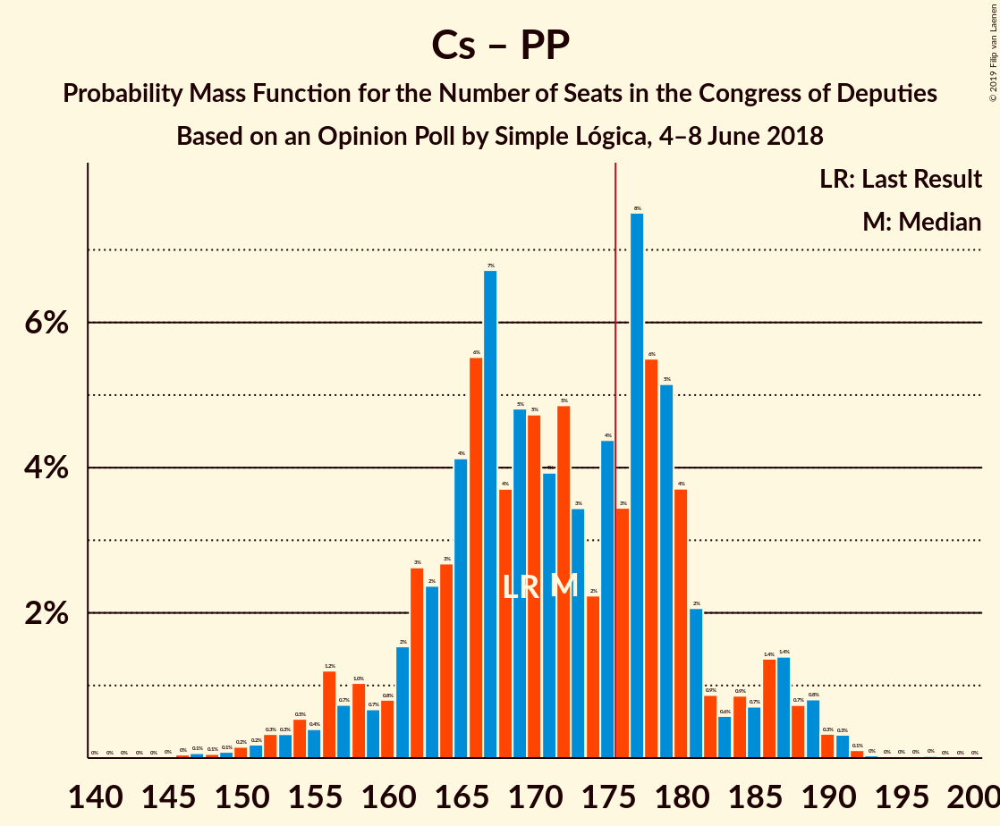

# Opinion Poll by Simple Lógica, 4–8 June 2018

<a href="#voting-intentions">Voting Intentions</a> | <a href="#seats">Seats</a> | <a href="#coalitions">Coalitions</a> | <a href="#technical-information">Technical Information</a>

## Voting Intentions

### Confidence Intervals

| Party | Last Result | Poll Result | 80% Confidence Interval | 90% Confidence Interval | 95% Confidence Interval | 99% Confidence Interval |
|:-----:|:-----------:|:-----------:|:-----------------------:|:-----------------------:|:-----------------------:|:-----------------------:|
| Partido Socialista Obrero Español | 22.6% | 26.7% | 25.0–28.5% |24.5–29.0% |24.1–29.5% |23.3–30.4% |
| Ciudadanos–Partido de la Ciudadanía | 13.1% | 25.7% | 24.0–27.5% |23.6–28.0% |23.2–28.5% |22.4–29.4% |
| Partido Popular | 33.0% | 20.6% | 19.0–22.3% |18.6–22.8% |18.2–23.2% |17.5–24.0% |
| Unidos Podemos | 21.2% | 16.5% | 15.1–18.1% |14.7–18.5% |14.4–18.9% |13.7–19.7% |

*Note:* The poll result column reflects the actual value used in the calculations. Published results may vary slightly, and in addition be rounded to fewer digits.

## Seats

### Confidence Intervals

| Party | Last Result | Median | 80% Confidence Interval | 90% Confidence Interval | 95% Confidence Interval | 99% Confidence Interval |
|:-----:|:-----------:|:------:|:-----------------------:|:-----------------------:|:-----------------------:|:-----------------------:|
| <a href="#partido-socialista-obrero-español">Partido Socialista Obrero Español</a> | 85 | 74 | 67–83 |67–85 |67–85 |65–90 |
| <a href="#ciudadanos–partido-de-la-ciudadanía">Ciudadanos–Partido de la Ciudadanía</a> | 32 | 64 | 63–75 |63–75 |61–76 |58–77 |
| <a href="#partido-popular">Partido Popular</a> | 137 | 62 | 55–65 |54–65 |51–67 |48–67 |
| <a href="#unidos-podemos">Unidos Podemos</a> | 71 | 29 | 25–29 |23–30 |23–31 |22–47 |

### Partido Socialista Obrero Español

*For a full overview of the results for this party, see the [Partido Socialista Obrero Español](party-partidosocialistaobreroespañol.html) page.*

| Number of Seats | Probability | Accumulated | Special Marks |
|:---------------:|:-----------:|:-----------:|:-------------:|
| 62 | 0.1% | 100% |  |
| 63 | 0.2% | 99.9% |  |
| 64 | 0.2% | 99.7% |  |
| 65 | 0.2% | 99.5% |  |
| 66 | 0.5% | 99.3% |  |
| 67 | 12% | 98.8% |  |
| 68 | 13% | 87% |  |
| 69 | 5% | 74% |  |
| 70 | 5% | 69% |  |
| 71 | 0.4% | 64% |  |
| 72 | 5% | 63% |  |
| 73 | 0% | 59% |  |
| 74 | 14% | 59% | Median |
| 75 | 31% | 44% |  |
| 76 | 0.1% | 14% |  |
| 77 | 0% | 14% |  |
| 78 | 0.2% | 14% |  |
| 79 | 0.7% | 13% |  |
| 80 | 0.5% | 13% |  |
| 81 | 0.4% | 12% |  |
| 82 | 0.2% | 12% |  |
| 83 | 2% | 12% |  |
| 84 | 0.7% | 9% |  |
| 85 | 6% | 9% | Last Result |
| 86 | 0.9% | 2% |  |
| 87 | 0% | 1.4% |  |
| 88 | 0% | 1.4% |  |
| 89 | 0.3% | 1.4% |  |
| 90 | 1.0% | 1.0% |  |
| 91 | 0% | 0% |  |

### Ciudadanos–Partido de la Ciudadanía

*For a full overview of the results for this party, see the [Ciudadanos–Partido de la Ciudadanía](party-ciudadanos–partidodelaciudadanía.html) page.*

| Number of Seats | Probability | Accumulated | Special Marks |
|:---------------:|:-----------:|:-----------:|:-------------:|
| 32 | 0% | 100% | Last Result |
| 33 | 0% | 100% |  |
| 34 | 0% | 100% |  |
| 35 | 0% | 100% |  |
| 36 | 0% | 100% |  |
| 37 | 0% | 100% |  |
| 38 | 0% | 100% |  |
| 39 | 0% | 100% |  |
| 40 | 0% | 100% |  |
| 41 | 0% | 100% |  |
| 42 | 0% | 100% |  |
| 43 | 0% | 100% |  |
| 44 | 0% | 100% |  |
| 45 | 0% | 100% |  |
| 46 | 0% | 100% |  |
| 47 | 0% | 100% |  |
| 48 | 0% | 100% |  |
| 49 | 0% | 100% |  |
| 50 | 0% | 100% |  |
| 51 | 0% | 100% |  |
| 52 | 0% | 100% |  |
| 53 | 0% | 100% |  |
| 54 | 0.1% | 100% |  |
| 55 | 0% | 99.9% |  |
| 56 | 0% | 99.8% |  |
| 57 | 0% | 99.8% |  |
| 58 | 1.2% | 99.8% |  |
| 59 | 0.4% | 98.6% |  |
| 60 | 0.4% | 98% |  |
| 61 | 0.8% | 98% |  |
| 62 | 2% | 97% |  |
| 63 | 9% | 95% |  |
| 64 | 42% | 87% | Median |
| 65 | 6% | 44% |  |
| 66 | 1.1% | 39% |  |
| 67 | 2% | 38% |  |
| 68 | 5% | 35% |  |
| 69 | 5% | 31% |  |
| 70 | 0.9% | 26% |  |
| 71 | 0% | 25% |  |
| 72 | 1.2% | 25% |  |
| 73 | 0% | 24% |  |
| 74 | 5% | 24% |  |
| 75 | 14% | 19% |  |
| 76 | 4% | 5% |  |
| 77 | 0.2% | 0.6% |  |
| 78 | 0% | 0.4% |  |
| 79 | 0% | 0.4% |  |
| 80 | 0.2% | 0.4% |  |
| 81 | 0.2% | 0.2% |  |
| 82 | 0% | 0% |  |

### Partido Popular

*For a full overview of the results for this party, see the [Partido Popular](party-partidopopular.html) page.*

| Number of Seats | Probability | Accumulated | Special Marks |
|:---------------:|:-----------:|:-----------:|:-------------:|
| 39 | 0.1% | 100% |  |
| 40 | 0% | 99.9% |  |
| 41 | 0% | 99.9% |  |
| 42 | 0% | 99.8% |  |
| 43 | 0% | 99.8% |  |
| 44 | 0% | 99.8% |  |
| 45 | 0% | 99.8% |  |
| 46 | 0% | 99.8% |  |
| 47 | 0% | 99.8% |  |
| 48 | 0.6% | 99.8% |  |
| 49 | 0.8% | 99.2% |  |
| 50 | 0.7% | 98% |  |
| 51 | 0.5% | 98% |  |
| 52 | 0% | 97% |  |
| 53 | 0% | 97% |  |
| 54 | 3% | 97% |  |
| 55 | 8% | 94% |  |
| 56 | 0.7% | 87% |  |
| 57 | 0% | 86% |  |
| 58 | 6% | 86% |  |
| 59 | 0.6% | 80% |  |
| 60 | 17% | 79% |  |
| 61 | 0% | 62% |  |
| 62 | 32% | 62% | Median |
| 63 | 13% | 30% |  |
| 64 | 6% | 18% |  |
| 65 | 7% | 12% |  |
| 66 | 2% | 5% |  |
| 67 | 2% | 3% |  |
| 68 | 0.1% | 0.3% |  |
| 69 | 0% | 0.2% |  |
| 70 | 0% | 0.2% |  |
| 71 | 0% | 0.1% |  |
| 72 | 0% | 0.1% |  |
| 73 | 0% | 0.1% |  |
| 74 | 0% | 0.1% |  |
| 75 | 0.1% | 0.1% |  |
| 76 | 0% | 0% |  |
| 77 | 0% | 0% |  |
| 78 | 0% | 0% |  |
| 79 | 0% | 0% |  |
| 80 | 0% | 0% |  |
| 81 | 0% | 0% |  |
| 82 | 0% | 0% |  |
| 83 | 0% | 0% |  |
| 84 | 0% | 0% |  |
| 85 | 0% | 0% |  |
| 86 | 0% | 0% |  |
| 87 | 0% | 0% |  |
| 88 | 0% | 0% |  |
| 89 | 0% | 0% |  |
| 90 | 0% | 0% |  |
| 91 | 0% | 0% |  |
| 92 | 0% | 0% |  |
| 93 | 0% | 0% |  |
| 94 | 0% | 0% |  |
| 95 | 0% | 0% |  |
| 96 | 0% | 0% |  |
| 97 | 0% | 0% |  |
| 98 | 0% | 0% |  |
| 99 | 0% | 0% |  |
| 100 | 0% | 0% |  |
| 101 | 0% | 0% |  |
| 102 | 0% | 0% |  |
| 103 | 0% | 0% |  |
| 104 | 0% | 0% |  |
| 105 | 0% | 0% |  |
| 106 | 0% | 0% |  |
| 107 | 0% | 0% |  |
| 108 | 0% | 0% |  |
| 109 | 0% | 0% |  |
| 110 | 0% | 0% |  |
| 111 | 0% | 0% |  |
| 112 | 0% | 0% |  |
| 113 | 0% | 0% |  |
| 114 | 0% | 0% |  |
| 115 | 0% | 0% |  |
| 116 | 0% | 0% |  |
| 117 | 0% | 0% |  |
| 118 | 0% | 0% |  |
| 119 | 0% | 0% |  |
| 120 | 0% | 0% |  |
| 121 | 0% | 0% |  |
| 122 | 0% | 0% |  |
| 123 | 0% | 0% |  |
| 124 | 0% | 0% |  |
| 125 | 0% | 0% |  |
| 126 | 0% | 0% |  |
| 127 | 0% | 0% |  |
| 128 | 0% | 0% |  |
| 129 | 0% | 0% |  |
| 130 | 0% | 0% |  |
| 131 | 0% | 0% |  |
| 132 | 0% | 0% |  |
| 133 | 0% | 0% |  |
| 134 | 0% | 0% |  |
| 135 | 0% | 0% |  |
| 136 | 0% | 0% |  |
| 137 | 0% | 0% | Last Result |

### Unidos Podemos

*For a full overview of the results for this party, see the [Unidos Podemos](party-unidospodemos.html) page.*

| Number of Seats | Probability | Accumulated | Special Marks |
|:---------------:|:-----------:|:-----------:|:-------------:|
| 22 | 0.6% | 100% |  |
| 23 | 7% | 99.4% |  |
| 24 | 2% | 93% |  |
| 25 | 2% | 91% |  |
| 26 | 0.5% | 89% |  |
| 27 | 2% | 89% |  |
| 28 | 35% | 87% |  |
| 29 | 45% | 52% | Median |
| 30 | 3% | 7% |  |
| 31 | 2% | 4% |  |
| 32 | 0% | 2% |  |
| 33 | 0% | 2% |  |
| 34 | 0% | 2% |  |
| 35 | 0% | 2% |  |
| 36 | 0% | 2% |  |
| 37 | 0% | 2% |  |
| 38 | 0% | 2% |  |
| 39 | 0% | 2% |  |
| 40 | 0.1% | 2% |  |
| 41 | 0.5% | 2% |  |
| 42 | 0.2% | 1.3% |  |
| 43 | 0.1% | 1.2% |  |
| 44 | 0.1% | 1.0% |  |
| 45 | 0% | 0.9% |  |
| 46 | 0% | 0.9% |  |
| 47 | 0.8% | 0.9% |  |
| 48 | 0% | 0% |  |
| 49 | 0% | 0% |  |
| 50 | 0% | 0% |  |
| 51 | 0% | 0% |  |
| 52 | 0% | 0% |  |
| 53 | 0% | 0% |  |
| 54 | 0% | 0% |  |
| 55 | 0% | 0% |  |
| 56 | 0% | 0% |  |
| 57 | 0% | 0% |  |
| 58 | 0% | 0% |  |
| 59 | 0% | 0% |  |
| 60 | 0% | 0% |  |
| 61 | 0% | 0% |  |
| 62 | 0% | 0% |  |
| 63 | 0% | 0% |  |
| 64 | 0% | 0% |  |
| 65 | 0% | 0% |  |
| 66 | 0% | 0% |  |
| 67 | 0% | 0% |  |
| 68 | 0% | 0% |  |
| 69 | 0% | 0% |  |
| 70 | 0% | 0% |  |
| 71 | 0% | 0% | Last Result |

## Coalitions

### Confidence Intervals

| Coalition | Last Result | Median | Majority? | 80% Confidence Interval | 90% Confidence Interval | 95% Confidence Interval | 99% Confidence Interval |
|:---------:|:-----------:|:------:|:---------:|:-----------------------:|:-----------------------:|:-----------------------:|:-----------------------:|
| Partido Socialista Obrero Español – Ciudadanos–Partido de la Ciudadanía | 117 | 139 | 0% | 136–148 | 135–150 | 134–151 | 129–156 |
| Ciudadanos–Partido de la Ciudadanía – Partido Popular | 169 | 127 | 0% | 120–135 | 119–135 | 115–135 | 108–137 |
| Partido Socialista Obrero Español – Unidos Podemos | 156 | 103 | 0% | 95–108 | 95–109 | 95–115 | 93–122 |
| Partido Socialista Obrero Español | 85 | 74 | 0% | 67–83 | 67–85 | 67–85 | 65–90 |
| Partido Popular | 137 | 62 | 0% | 55–65 | 54–65 | 51–67 | 48–67 |

### Partido Socialista Obrero Español – Ciudadanos–Partido de la Ciudadanía

| Number of Seats | Probability | Accumulated | Special Marks |
|:---------------:|:-----------:|:-----------:|:-------------:|
| 117 | 0% | 100% | Last Result |
| 118 | 0% | 100% |  |
| 119 | 0% | 100% |  |
| 120 | 0% | 100% |  |
| 121 | 0% | 100% |  |
| 122 | 0% | 100% |  |
| 123 | 0% | 100% |  |
| 124 | 0% | 100% |  |
| 125 | 0.1% | 100% |  |
| 126 | 0% | 99.9% |  |
| 127 | 0% | 99.9% |  |
| 128 | 0% | 99.9% |  |
| 129 | 0.9% | 99.8% |  |
| 130 | 0% | 99.0% |  |
| 131 | 0% | 99.0% |  |
| 132 | 0% | 98.9% |  |
| 133 | 0% | 98.9% |  |
| 134 | 2% | 98.9% |  |
| 135 | 5% | 97% |  |
| 136 | 2% | 92% |  |
| 137 | 8% | 90% |  |
| 138 | 9% | 81% | Median |
| 139 | 35% | 73% |  |
| 140 | 1.3% | 38% |  |
| 141 | 0.6% | 37% |  |
| 142 | 17% | 36% |  |
| 143 | 0.2% | 19% |  |
| 144 | 6% | 19% |  |
| 145 | 0.2% | 13% |  |
| 146 | 0% | 12% |  |
| 147 | 1.0% | 12% |  |
| 148 | 2% | 11% |  |
| 149 | 2% | 9% |  |
| 150 | 4% | 7% |  |
| 151 | 2% | 4% |  |
| 152 | 0% | 2% |  |
| 153 | 0% | 2% |  |
| 154 | 0% | 2% |  |
| 155 | 1.0% | 2% |  |
| 156 | 0.7% | 0.8% |  |
| 157 | 0.1% | 0.1% |  |
| 158 | 0% | 0% |  |

### Ciudadanos–Partido de la Ciudadanía – Partido Popular

| Number of Seats | Probability | Accumulated | Special Marks |
|:---------------:|:-----------:|:-----------:|:-------------:|
| 107 | 0.2% | 100% |  |
| 108 | 0.4% | 99.8% |  |
| 109 | 0.1% | 99.4% |  |
| 110 | 0% | 99.3% |  |
| 111 | 0% | 99.3% |  |
| 112 | 0% | 99.3% |  |
| 113 | 1.5% | 99.2% |  |
| 114 | 0% | 98% |  |
| 115 | 0.8% | 98% |  |
| 116 | 0.1% | 97% |  |
| 117 | 0% | 97% |  |
| 118 | 0% | 97% |  |
| 119 | 3% | 97% |  |
| 120 | 7% | 94% |  |
| 121 | 0.7% | 88% |  |
| 122 | 0.8% | 87% |  |
| 123 | 0.2% | 86% |  |
| 124 | 0.1% | 86% |  |
| 125 | 0.1% | 86% |  |
| 126 | 31% | 86% | Median |
| 127 | 16% | 55% |  |
| 128 | 3% | 39% |  |
| 129 | 0% | 36% |  |
| 130 | 0% | 36% |  |
| 131 | 0.4% | 36% |  |
| 132 | 5% | 35% |  |
| 133 | 5% | 30% |  |
| 134 | 12% | 25% |  |
| 135 | 12% | 13% |  |
| 136 | 0.5% | 1.1% |  |
| 137 | 0.2% | 0.6% |  |
| 138 | 0% | 0.4% |  |
| 139 | 0.2% | 0.4% |  |
| 140 | 0.2% | 0.2% |  |
| 141 | 0% | 0% |  |
| 142 | 0% | 0% |  |
| 143 | 0% | 0% |  |
| 144 | 0% | 0% |  |
| 145 | 0% | 0% |  |
| 146 | 0% | 0% |  |
| 147 | 0% | 0% |  |
| 148 | 0% | 0% |  |
| 149 | 0% | 0% |  |
| 150 | 0% | 0% |  |
| 151 | 0% | 0% |  |
| 152 | 0% | 0% |  |
| 153 | 0% | 0% |  |
| 154 | 0% | 0% |  |
| 155 | 0% | 0% |  |
| 156 | 0% | 0% |  |
| 157 | 0% | 0% |  |
| 158 | 0% | 0% |  |
| 159 | 0% | 0% |  |
| 160 | 0% | 0% |  |
| 161 | 0% | 0% |  |
| 162 | 0% | 0% |  |
| 163 | 0% | 0% |  |
| 164 | 0% | 0% |  |
| 165 | 0% | 0% |  |
| 166 | 0% | 0% |  |
| 167 | 0% | 0% |  |
| 168 | 0% | 0% |  |
| 169 | 0% | 0% | Last Result |

### Partido Socialista Obrero Español – Unidos Podemos

| Number of Seats | Probability | Accumulated | Special Marks |
|:---------------:|:-----------:|:-----------:|:-------------:|
| 90 | 0.2% | 100% |  |
| 91 | 0.2% | 99.8% |  |
| 92 | 0% | 99.6% |  |
| 93 | 0.2% | 99.6% |  |
| 94 | 0.5% | 99.4% |  |
| 95 | 12% | 98.9% |  |
| 96 | 12% | 87% |  |
| 97 | 5% | 75% |  |
| 98 | 5% | 70% |  |
| 99 | 0.3% | 65% |  |
| 100 | 0.1% | 65% |  |
| 101 | 0.5% | 64% |  |
| 102 | 3% | 64% |  |
| 103 | 16% | 61% | Median |
| 104 | 31% | 45% |  |
| 105 | 0.2% | 14% |  |
| 106 | 0.9% | 14% |  |
| 107 | 0.7% | 13% |  |
| 108 | 7% | 12% |  |
| 109 | 3% | 6% |  |
| 110 | 0% | 3% |  |
| 111 | 0% | 3% |  |
| 112 | 0% | 3% |  |
| 113 | 0% | 3% |  |
| 114 | 0.1% | 3% |  |
| 115 | 0.8% | 3% |  |
| 116 | 0% | 2% |  |
| 117 | 1.3% | 2% |  |
| 118 | 0.2% | 0.9% |  |
| 119 | 0% | 0.7% |  |
| 120 | 0% | 0.7% |  |
| 121 | 0.1% | 0.7% |  |
| 122 | 0.4% | 0.6% |  |
| 123 | 0.2% | 0.2% |  |
| 124 | 0% | 0% |  |
| 125 | 0% | 0% |  |
| 126 | 0% | 0% |  |
| 127 | 0% | 0% |  |
| 128 | 0% | 0% |  |
| 129 | 0% | 0% |  |
| 130 | 0% | 0% |  |
| 131 | 0% | 0% |  |
| 132 | 0% | 0% |  |
| 133 | 0% | 0% |  |
| 134 | 0% | 0% |  |
| 135 | 0% | 0% |  |
| 136 | 0% | 0% |  |
| 137 | 0% | 0% |  |
| 138 | 0% | 0% |  |
| 139 | 0% | 0% |  |
| 140 | 0% | 0% |  |
| 141 | 0% | 0% |  |
| 142 | 0% | 0% |  |
| 143 | 0% | 0% |  |
| 144 | 0% | 0% |  |
| 145 | 0% | 0% |  |
| 146 | 0% | 0% |  |
| 147 | 0% | 0% |  |
| 148 | 0% | 0% |  |
| 149 | 0% | 0% |  |
| 150 | 0% | 0% |  |
| 151 | 0% | 0% |  |
| 152 | 0% | 0% |  |
| 153 | 0% | 0% |  |
| 154 | 0% | 0% |  |
| 155 | 0% | 0% |  |
| 156 | 0% | 0% | Last Result |

### Partido Socialista Obrero Español

| Number of Seats | Probability | Accumulated | Special Marks |
|:---------------:|:-----------:|:-----------:|:-------------:|
| 62 | 0.1% | 100% |  |
| 63 | 0.2% | 99.9% |  |
| 64 | 0.2% | 99.7% |  |
| 65 | 0.2% | 99.5% |  |
| 66 | 0.5% | 99.3% |  |
| 67 | 12% | 98.8% |  |
| 68 | 13% | 87% |  |
| 69 | 5% | 74% |  |
| 70 | 5% | 69% |  |
| 71 | 0.4% | 64% |  |
| 72 | 5% | 63% |  |
| 73 | 0% | 59% |  |
| 74 | 14% | 59% | Median |
| 75 | 31% | 44% |  |
| 76 | 0.1% | 14% |  |
| 77 | 0% | 14% |  |
| 78 | 0.2% | 14% |  |
| 79 | 0.7% | 13% |  |
| 80 | 0.5% | 13% |  |
| 81 | 0.4% | 12% |  |
| 82 | 0.2% | 12% |  |
| 83 | 2% | 12% |  |
| 84 | 0.7% | 9% |  |
| 85 | 6% | 9% | Last Result |
| 86 | 0.9% | 2% |  |
| 87 | 0% | 1.4% |  |
| 88 | 0% | 1.4% |  |
| 89 | 0.3% | 1.4% |  |
| 90 | 1.0% | 1.0% |  |
| 91 | 0% | 0% |  |

### Partido Popular

| Number of Seats | Probability | Accumulated | Special Marks |
|:---------------:|:-----------:|:-----------:|:-------------:|
| 39 | 0.1% | 100% |  |
| 40 | 0% | 99.9% |  |
| 41 | 0% | 99.9% |  |
| 42 | 0% | 99.8% |  |
| 43 | 0% | 99.8% |  |
| 44 | 0% | 99.8% |  |
| 45 | 0% | 99.8% |  |
| 46 | 0% | 99.8% |  |
| 47 | 0% | 99.8% |  |
| 48 | 0.6% | 99.8% |  |
| 49 | 0.8% | 99.2% |  |
| 50 | 0.7% | 98% |  |
| 51 | 0.5% | 98% |  |
| 52 | 0% | 97% |  |
| 53 | 0% | 97% |  |
| 54 | 3% | 97% |  |
| 55 | 8% | 94% |  |
| 56 | 0.7% | 87% |  |
| 57 | 0% | 86% |  |
| 58 | 6% | 86% |  |
| 59 | 0.6% | 80% |  |
| 60 | 17% | 79% |  |
| 61 | 0% | 62% |  |
| 62 | 32% | 62% | Median |
| 63 | 13% | 30% |  |
| 64 | 6% | 18% |  |
| 65 | 7% | 12% |  |
| 66 | 2% | 5% |  |
| 67 | 2% | 3% |  |
| 68 | 0.1% | 0.3% |  |
| 69 | 0% | 0.2% |  |
| 70 | 0% | 0.2% |  |
| 71 | 0% | 0.1% |  |
| 72 | 0% | 0.1% |  |
| 73 | 0% | 0.1% |  |
| 74 | 0% | 0.1% |  |
| 75 | 0.1% | 0.1% |  |
| 76 | 0% | 0% |  |
| 77 | 0% | 0% |  |
| 78 | 0% | 0% |  |
| 79 | 0% | 0% |  |
| 80 | 0% | 0% |  |
| 81 | 0% | 0% |  |
| 82 | 0% | 0% |  |
| 83 | 0% | 0% |  |
| 84 | 0% | 0% |  |
| 85 | 0% | 0% |  |
| 86 | 0% | 0% |  |
| 87 | 0% | 0% |  |
| 88 | 0% | 0% |  |
| 89 | 0% | 0% |  |
| 90 | 0% | 0% |  |
| 91 | 0% | 0% |  |
| 92 | 0% | 0% |  |
| 93 | 0% | 0% |  |
| 94 | 0% | 0% |  |
| 95 | 0% | 0% |  |
| 96 | 0% | 0% |  |
| 97 | 0% | 0% |  |
| 98 | 0% | 0% |  |
| 99 | 0% | 0% |  |
| 100 | 0% | 0% |  |
| 101 | 0% | 0% |  |
| 102 | 0% | 0% |  |
| 103 | 0% | 0% |  |
| 104 | 0% | 0% |  |
| 105 | 0% | 0% |  |
| 106 | 0% | 0% |  |
| 107 | 0% | 0% |  |
| 108 | 0% | 0% |  |
| 109 | 0% | 0% |  |
| 110 | 0% | 0% |  |
| 111 | 0% | 0% |  |
| 112 | 0% | 0% |  |
| 113 | 0% | 0% |  |
| 114 | 0% | 0% |  |
| 115 | 0% | 0% |  |
| 116 | 0% | 0% |  |
| 117 | 0% | 0% |  |
| 118 | 0% | 0% |  |
| 119 | 0% | 0% |  |
| 120 | 0% | 0% |  |
| 121 | 0% | 0% |  |
| 122 | 0% | 0% |  |
| 123 | 0% | 0% |  |
| 124 | 0% | 0% |  |
| 125 | 0% | 0% |  |
| 126 | 0% | 0% |  |
| 127 | 0% | 0% |  |
| 128 | 0% | 0% |  |
| 129 | 0% | 0% |  |
| 130 | 0% | 0% |  |
| 131 | 0% | 0% |  |
| 132 | 0% | 0% |  |
| 133 | 0% | 0% |  |
| 134 | 0% | 0% |  |
| 135 | 0% | 0% |  |
| 136 | 0% | 0% |  |
| 137 | 0% | 0% | Last Result |

## Technical Information

### Opinion Poll

+ **Polling firm:** Simple Lógica
+ **Commissioner(s):** —
+ **Fieldwork period:** 4–8 June 2018

### Calculations

+ **Sample size:** 1030
+ **Simulations done:** 1,024
+ **Error estimate:** 1.48%

