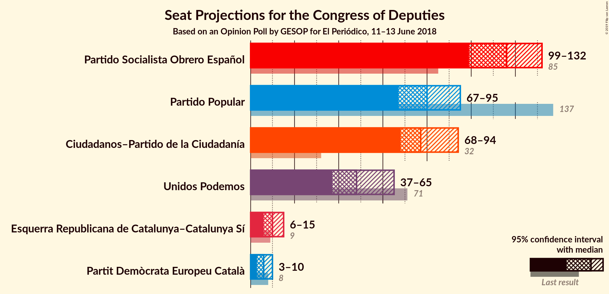
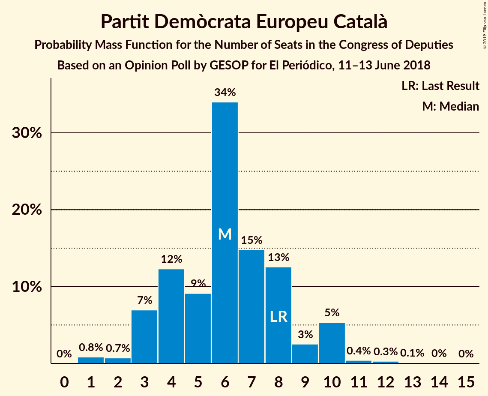
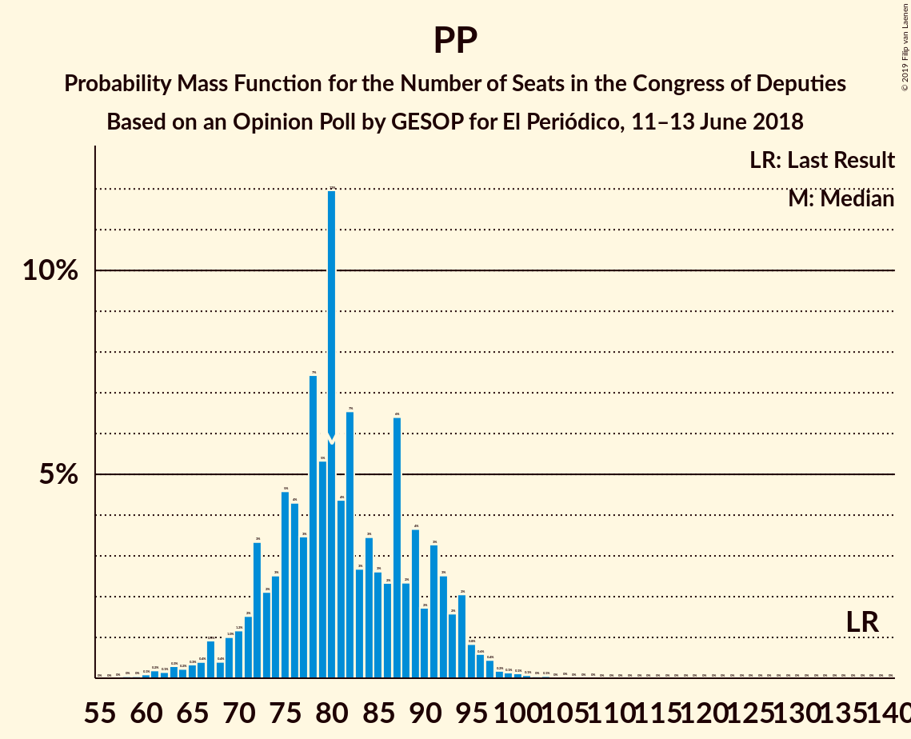

# Opinion Poll by GESOP for El Periódico, 11–13 June 2018

<a href="#voting-intentions">Voting Intentions</a> | <a href="#seats">Seats</a> | <a href="#coalitions">Coalitions</a> | <a href="#technical-information">Technical Information</a>

## Voting Intentions

### Confidence Intervals

| Party | Last Result | Poll Result | 80% Confidence Interval | 90% Confidence Interval | 95% Confidence Interval | 99% Confidence Interval |
|:-----:|:-----------:|:-----------:|:-----------------------:|:-----------------------:|:-----------------------:|:-----------------------:|
| Partido Socialista Obrero Español | 22.6% | 28.6% | 26.6–30.7% |26.1–31.3% |25.6–31.9% |24.7–32.9% |
| Ciudadanos–Partido de la Ciudadanía | 13.1% | 22.8% | 20.9–24.7% |20.4–25.3% |20.0–25.8% |19.1–26.8% |
| Partido Popular | 33.0% | 21.0% | 19.2–22.9% |18.7–23.5% |18.3–24.0% |17.5–24.9% |
| Unidos Podemos | 21.2% | 16.6% | 15.0–18.4% |14.6–18.9% |14.2–19.4% |13.5–20.3% |
| Esquerra Republicana de Catalunya | 2.7% | 2.6% | 2.0–3.5% |1.9–3.8% |1.7–4.0% |1.5–4.5% |
| Partit Demòcrata Europeu Català | 2.0% | 1.6% | 1.2–2.4% |1.1–2.6% |0.9–2.8% |0.8–3.2% |

*Note:* The poll result column reflects the actual value used in the calculations. Published results may vary slightly, and in addition be rounded to fewer digits.

## Seats

### Confidence Intervals

| Party | Last Result | Median | 80% Confidence Interval | 90% Confidence Interval | 95% Confidence Interval | 99% Confidence Interval |
|:-----:|:-----------:|:------:|:-----------------------:|:-----------------------:|:-----------------------:|:-----------------------:|
| <a href="#partido-socialista-obrero-español">Partido Socialista Obrero Español</a> | 85 | 79 | 74–82 |73–82 |70–87 |70–88 |
| <a href="#ciudadanos–partido-de-la-ciudadanía">Ciudadanos–Partido de la Ciudadanía</a> | 32 | 63 | 59–64 |59–64 |57–68 |49–68 |
| <a href="#partido-popular">Partido Popular</a> | 137 | 65 | 59–65 |54–66 |53–73 |46–76 |
| <a href="#unidos-podemos">Unidos Podemos</a> | 71 | 28 | 22–28 |22–30 |22–31 |22–46 |
| <a href="#esquerra-republicana-de-catalunya">Esquerra Republicana de Catalunya</a> | 9 | 0 | 0 |0 |0 |0 |
| <a href="#partit-demòcrata-europeu-català">Partit Demòcrata Europeu Català</a> | 8 | 0 | 0 |0 |0 |0 |

### Partido Socialista Obrero Español

*For a full overview of the results for this party, see the [Partido Socialista Obrero Español](party-partidosocialistaobreroespañol.html) page.*

| Number of Seats | Probability | Accumulated | Special Marks |
|:---------------:|:-----------:|:-----------:|:-------------:|
| 65 | 0.4% | 100% |  |
| 66 | 0% | 99.6% |  |
| 67 | 0% | 99.6% |  |
| 68 | 0% | 99.6% |  |
| 69 | 0% | 99.6% |  |
| 70 | 2% | 99.6% |  |
| 71 | 0.6% | 97% |  |
| 72 | 0.1% | 97% |  |
| 73 | 3% | 97% |  |
| 74 | 27% | 94% |  |
| 75 | 3% | 67% |  |
| 76 | 0.2% | 64% |  |
| 77 | 0% | 64% |  |
| 78 | 0% | 64% |  |
| 79 | 35% | 64% | Median |
| 80 | 0.3% | 29% |  |
| 81 | 0.2% | 28% |  |
| 82 | 24% | 28% |  |
| 83 | 0% | 4% |  |
| 84 | 0% | 4% |  |
| 85 | 0% | 4% | Last Result |
| 86 | 0% | 4% |  |
| 87 | 3% | 4% |  |
| 88 | 0.3% | 0.7% |  |
| 89 | 0% | 0.4% |  |
| 90 | 0% | 0.4% |  |
| 91 | 0% | 0.4% |  |
| 92 | 0% | 0.4% |  |
| 93 | 0% | 0.4% |  |
| 94 | 0% | 0.4% |  |
| 95 | 0% | 0.4% |  |
| 96 | 0% | 0.4% |  |
| 97 | 0.4% | 0.4% |  |
| 98 | 0% | 0% |  |

### Ciudadanos–Partido de la Ciudadanía

*For a full overview of the results for this party, see the [Ciudadanos–Partido de la Ciudadanía](party-ciudadanos–partidodelaciudadanía.html) page.*

| Number of Seats | Probability | Accumulated | Special Marks |
|:---------------:|:-----------:|:-----------:|:-------------:|
| 32 | 0% | 100% | Last Result |
| 33 | 0% | 100% |  |
| 34 | 0% | 100% |  |
| 35 | 0% | 100% |  |
| 36 | 0% | 100% |  |
| 37 | 0% | 100% |  |
| 38 | 0% | 100% |  |
| 39 | 0% | 100% |  |
| 40 | 0% | 100% |  |
| 41 | 0% | 100% |  |
| 42 | 0% | 100% |  |
| 43 | 0% | 100% |  |
| 44 | 0% | 100% |  |
| 45 | 0% | 100% |  |
| 46 | 0% | 100% |  |
| 47 | 0% | 100% |  |
| 48 | 0.4% | 100% |  |
| 49 | 0.6% | 99.6% |  |
| 50 | 0% | 99.0% |  |
| 51 | 0% | 99.0% |  |
| 52 | 0% | 99.0% |  |
| 53 | 0% | 99.0% |  |
| 54 | 0% | 99.0% |  |
| 55 | 0.4% | 99.0% |  |
| 56 | 0.1% | 98.6% |  |
| 57 | 2% | 98.5% |  |
| 58 | 0.5% | 96% |  |
| 59 | 25% | 96% |  |
| 60 | 0% | 71% |  |
| 61 | 0% | 71% |  |
| 62 | 2% | 71% |  |
| 63 | 31% | 69% | Median |
| 64 | 33% | 38% |  |
| 65 | 0% | 5% |  |
| 66 | 0% | 5% |  |
| 67 | 1.1% | 5% |  |
| 68 | 3% | 3% |  |
| 69 | 0.1% | 0.1% |  |
| 70 | 0% | 0% |  |

### Partido Popular

*For a full overview of the results for this party, see the [Partido Popular](party-partidopopular.html) page.*

| Number of Seats | Probability | Accumulated | Special Marks |
|:---------------:|:-----------:|:-----------:|:-------------:|
| 45 | 0.3% | 100% |  |
| 46 | 0.7% | 99.7% |  |
| 47 | 0.1% | 99.0% |  |
| 48 | 0% | 99.0% |  |
| 49 | 0% | 99.0% |  |
| 50 | 0% | 99.0% |  |
| 51 | 0% | 99.0% |  |
| 52 | 0.7% | 99.0% |  |
| 53 | 1.1% | 98% |  |
| 54 | 2% | 97% |  |
| 55 | 0.1% | 95% |  |
| 56 | 2% | 95% |  |
| 57 | 0% | 92% |  |
| 58 | 0% | 92% |  |
| 59 | 34% | 92% |  |
| 60 | 0.4% | 58% |  |
| 61 | 0% | 58% |  |
| 62 | 0% | 58% |  |
| 63 | 0% | 58% |  |
| 64 | 0% | 58% |  |
| 65 | 51% | 58% | Median |
| 66 | 4% | 7% |  |
| 67 | 0% | 3% |  |
| 68 | 0% | 3% |  |
| 69 | 0% | 3% |  |
| 70 | 0% | 3% |  |
| 71 | 0% | 3% |  |
| 72 | 0% | 3% |  |
| 73 | 0.4% | 3% |  |
| 74 | 0% | 2% |  |
| 75 | 0% | 2% |  |
| 76 | 2% | 2% |  |
| 77 | 0.1% | 0.1% |  |
| 78 | 0% | 0% |  |
| 79 | 0% | 0% |  |
| 80 | 0% | 0% |  |
| 81 | 0% | 0% |  |
| 82 | 0% | 0% |  |
| 83 | 0% | 0% |  |
| 84 | 0% | 0% |  |
| 85 | 0% | 0% |  |
| 86 | 0% | 0% |  |
| 87 | 0% | 0% |  |
| 88 | 0% | 0% |  |
| 89 | 0% | 0% |  |
| 90 | 0% | 0% |  |
| 91 | 0% | 0% |  |
| 92 | 0% | 0% |  |
| 93 | 0% | 0% |  |
| 94 | 0% | 0% |  |
| 95 | 0% | 0% |  |
| 96 | 0% | 0% |  |
| 97 | 0% | 0% |  |
| 98 | 0% | 0% |  |
| 99 | 0% | 0% |  |
| 100 | 0% | 0% |  |
| 101 | 0% | 0% |  |
| 102 | 0% | 0% |  |
| 103 | 0% | 0% |  |
| 104 | 0% | 0% |  |
| 105 | 0% | 0% |  |
| 106 | 0% | 0% |  |
| 107 | 0% | 0% |  |
| 108 | 0% | 0% |  |
| 109 | 0% | 0% |  |
| 110 | 0% | 0% |  |
| 111 | 0% | 0% |  |
| 112 | 0% | 0% |  |
| 113 | 0% | 0% |  |
| 114 | 0% | 0% |  |
| 115 | 0% | 0% |  |
| 116 | 0% | 0% |  |
| 117 | 0% | 0% |  |
| 118 | 0% | 0% |  |
| 119 | 0% | 0% |  |
| 120 | 0% | 0% |  |
| 121 | 0% | 0% |  |
| 122 | 0% | 0% |  |
| 123 | 0% | 0% |  |
| 124 | 0% | 0% |  |
| 125 | 0% | 0% |  |
| 126 | 0% | 0% |  |
| 127 | 0% | 0% |  |
| 128 | 0% | 0% |  |
| 129 | 0% | 0% |  |
| 130 | 0% | 0% |  |
| 131 | 0% | 0% |  |
| 132 | 0% | 0% |  |
| 133 | 0% | 0% |  |
| 134 | 0% | 0% |  |
| 135 | 0% | 0% |  |
| 136 | 0% | 0% |  |
| 137 | 0% | 0% | Last Result |

### Unidos Podemos

*For a full overview of the results for this party, see the [Unidos Podemos](party-unidospodemos.html) page.*

| Number of Seats | Probability | Accumulated | Special Marks |
|:---------------:|:-----------:|:-----------:|:-------------:|
| 22 | 25% | 100% |  |
| 23 | 0% | 75% |  |
| 24 | 0.4% | 75% |  |
| 25 | 0.4% | 75% |  |
| 26 | 0% | 75% |  |
| 27 | 5% | 75% |  |
| 28 | 63% | 69% | Median |
| 29 | 1.0% | 6% |  |
| 30 | 0.2% | 5% |  |
| 31 | 3% | 5% |  |
| 32 | 0% | 2% |  |
| 33 | 0% | 2% |  |
| 34 | 0% | 1.5% |  |
| 35 | 0% | 1.5% |  |
| 36 | 0% | 1.5% |  |
| 37 | 0% | 1.5% |  |
| 38 | 0% | 1.5% |  |
| 39 | 0% | 1.5% |  |
| 40 | 0% | 1.5% |  |
| 41 | 0% | 1.5% |  |
| 42 | 0% | 1.5% |  |
| 43 | 0% | 1.5% |  |
| 44 | 0.6% | 1.5% |  |
| 45 | 0% | 0.9% |  |
| 46 | 0.7% | 0.9% |  |
| 47 | 0% | 0.2% |  |
| 48 | 0.1% | 0.2% |  |
| 49 | 0% | 0.1% |  |
| 50 | 0% | 0.1% |  |
| 51 | 0% | 0% |  |
| 52 | 0% | 0% |  |
| 53 | 0% | 0% |  |
| 54 | 0% | 0% |  |
| 55 | 0% | 0% |  |
| 56 | 0% | 0% |  |
| 57 | 0% | 0% |  |
| 58 | 0% | 0% |  |
| 59 | 0% | 0% |  |
| 60 | 0% | 0% |  |
| 61 | 0% | 0% |  |
| 62 | 0% | 0% |  |
| 63 | 0% | 0% |  |
| 64 | 0% | 0% |  |
| 65 | 0% | 0% |  |
| 66 | 0% | 0% |  |
| 67 | 0% | 0% |  |
| 68 | 0% | 0% |  |
| 69 | 0% | 0% |  |
| 70 | 0% | 0% |  |
| 71 | 0% | 0% | Last Result |

### Esquerra Republicana de Catalunya

*For a full overview of the results for this party, see the [Esquerra Republicana de Catalunya](party-esquerrarepublicanadecatalunya.html) page.*

| Number of Seats | Probability | Accumulated | Special Marks |
|:---------------:|:-----------:|:-----------:|:-------------:|
| 0 | 100% | 100% | Median |
| 1 | 0% | 0% |  |
| 2 | 0% | 0% |  |
| 3 | 0% | 0% |  |
| 4 | 0% | 0% |  |
| 5 | 0% | 0% |  |
| 6 | 0% | 0% |  |
| 7 | 0% | 0% |  |
| 8 | 0% | 0% |  |
| 9 | 0% | 0% | Last Result |

### Partit Demòcrata Europeu Català

*For a full overview of the results for this party, see the [Partit Demòcrata Europeu Català](party-partitdemòcrataeuropeucatalà.html) page.*

| Number of Seats | Probability | Accumulated | Special Marks |
|:---------------:|:-----------:|:-----------:|:-------------:|
| 0 | 100% | 100% | Median |
| 1 | 0% | 0% |  |
| 2 | 0% | 0% |  |
| 3 | 0% | 0% |  |
| 4 | 0% | 0% |  |
| 5 | 0% | 0% |  |
| 6 | 0% | 0% |  |
| 7 | 0% | 0% |  |
| 8 | 0% | 0% | Last Result |

## Coalitions

### Confidence Intervals

| Coalition | Last Result | Median | Majority? | 80% Confidence Interval | 90% Confidence Interval | 95% Confidence Interval | 99% Confidence Interval |
|:---------:|:-----------:|:------:|:---------:|:-----------------------:|:-----------------------:|:-----------------------:|:-----------------------:|
| Partido Socialista Obrero Español – Ciudadanos–Partido de la Ciudadanía | 117 | 141 | 0% | 137–143 | 136–143 | 127–149 | 120–155 |
| Ciudadanos–Partido de la Ciudadanía – Partido Popular | 169 | 124 | 0% | 123–128 | 116–129 | 115–133 | 108–133 |
| Partido Socialista Obrero Español – Unidos Podemos | 156 | 104 | 0% | 102–107 | 101–112 | 97–115 | 97–121 |
| Partido Socialista Obrero Español | 85 | 79 | 0% | 74–82 | 73–82 | 70–87 | 70–88 |
| Partido Popular | 137 | 65 | 0% | 59–65 | 54–66 | 53–73 | 46–76 |

### Partido Socialista Obrero Español – Ciudadanos–Partido de la Ciudadanía

| Number of Seats | Probability | Accumulated | Special Marks |
|:---------------:|:-----------:|:-----------:|:-------------:|
| 117 | 0% | 100% | Last Result |
| 118 | 0% | 100% |  |
| 119 | 0% | 100% |  |
| 120 | 0.6% | 100% |  |
| 121 | 0% | 99.4% |  |
| 122 | 0% | 99.4% |  |
| 123 | 0% | 99.4% |  |
| 124 | 0% | 99.4% |  |
| 125 | 0% | 99.4% |  |
| 126 | 0.1% | 99.4% |  |
| 127 | 2% | 99.3% |  |
| 128 | 0.1% | 97% |  |
| 129 | 0.3% | 97% |  |
| 130 | 0% | 97% |  |
| 131 | 0.2% | 97% |  |
| 132 | 0% | 96% |  |
| 133 | 0.5% | 96% |  |
| 134 | 0% | 96% |  |
| 135 | 0% | 96% |  |
| 136 | 3% | 96% |  |
| 137 | 27% | 93% |  |
| 138 | 0% | 66% |  |
| 139 | 0.3% | 66% |  |
| 140 | 0% | 66% |  |
| 141 | 24% | 66% |  |
| 142 | 1.2% | 42% | Median |
| 143 | 35% | 40% |  |
| 144 | 0% | 5% |  |
| 145 | 0.4% | 5% |  |
| 146 | 0.9% | 4% |  |
| 147 | 0% | 4% |  |
| 148 | 0.2% | 4% |  |
| 149 | 2% | 3% |  |
| 150 | 0% | 1.0% |  |
| 151 | 0% | 1.0% |  |
| 152 | 0% | 1.0% |  |
| 153 | 0% | 1.0% |  |
| 154 | 0% | 1.0% |  |
| 155 | 0.7% | 1.0% |  |
| 156 | 0.3% | 0.3% |  |
| 157 | 0% | 0% |  |

### Ciudadanos–Partido de la Ciudadanía – Partido Popular

| Number of Seats | Probability | Accumulated | Special Marks |
|:---------------:|:-----------:|:-----------:|:-------------:|
| 108 | 0.6% | 100% |  |
| 109 | 0% | 99.4% |  |
| 110 | 0.6% | 99.3% |  |
| 111 | 0% | 98.7% |  |
| 112 | 0% | 98.7% |  |
| 113 | 0.3% | 98.7% |  |
| 114 | 0.7% | 98% |  |
| 115 | 0.6% | 98% |  |
| 116 | 2% | 97% |  |
| 117 | 0% | 95% |  |
| 118 | 0% | 95% |  |
| 119 | 0.2% | 95% |  |
| 120 | 0.9% | 95% |  |
| 121 | 0% | 94% |  |
| 122 | 1.2% | 94% |  |
| 123 | 33% | 92% |  |
| 124 | 27% | 59% |  |
| 125 | 0.3% | 33% |  |
| 126 | 0% | 32% |  |
| 127 | 0% | 32% |  |
| 128 | 27% | 32% | Median |
| 129 | 3% | 6% |  |
| 130 | 0% | 3% |  |
| 131 | 0% | 3% |  |
| 132 | 0% | 3% |  |
| 133 | 2% | 3% |  |
| 134 | 0% | 0.4% |  |
| 135 | 0% | 0.4% |  |
| 136 | 0.1% | 0.4% |  |
| 137 | 0.3% | 0.3% |  |
| 138 | 0% | 0% |  |
| 139 | 0% | 0% |  |
| 140 | 0% | 0% |  |
| 141 | 0% | 0% |  |
| 142 | 0% | 0% |  |
| 143 | 0% | 0% |  |
| 144 | 0% | 0% |  |
| 145 | 0% | 0% |  |
| 146 | 0% | 0% |  |
| 147 | 0% | 0% |  |
| 148 | 0% | 0% |  |
| 149 | 0% | 0% |  |
| 150 | 0% | 0% |  |
| 151 | 0% | 0% |  |
| 152 | 0% | 0% |  |
| 153 | 0% | 0% |  |
| 154 | 0% | 0% |  |
| 155 | 0% | 0% |  |
| 156 | 0% | 0% |  |
| 157 | 0% | 0% |  |
| 158 | 0% | 0% |  |
| 159 | 0% | 0% |  |
| 160 | 0% | 0% |  |
| 161 | 0% | 0% |  |
| 162 | 0% | 0% |  |
| 163 | 0% | 0% |  |
| 164 | 0% | 0% |  |
| 165 | 0% | 0% |  |
| 166 | 0% | 0% |  |
| 167 | 0% | 0% |  |
| 168 | 0% | 0% |  |
| 169 | 0% | 0% | Last Result |

### Partido Socialista Obrero Español – Unidos Podemos

| Number of Seats | Probability | Accumulated | Special Marks |
|:---------------:|:-----------:|:-----------:|:-------------:|
| 93 | 0.3% | 100% |  |
| 94 | 0.1% | 99.7% |  |
| 95 | 0.1% | 99.6% |  |
| 96 | 0% | 99.5% |  |
| 97 | 2% | 99.5% |  |
| 98 | 0% | 97% |  |
| 99 | 0% | 97% |  |
| 100 | 0% | 97% |  |
| 101 | 3% | 97% |  |
| 102 | 27% | 94% |  |
| 103 | 0% | 67% |  |
| 104 | 24% | 67% |  |
| 105 | 0% | 43% |  |
| 106 | 4% | 43% |  |
| 107 | 33% | 39% | Median |
| 108 | 0% | 6% |  |
| 109 | 0% | 6% |  |
| 110 | 0.9% | 6% |  |
| 111 | 0.2% | 5% |  |
| 112 | 0.3% | 5% |  |
| 113 | 0% | 5% |  |
| 114 | 2% | 5% |  |
| 115 | 0.7% | 3% |  |
| 116 | 0.7% | 2% |  |
| 117 | 0.3% | 2% |  |
| 118 | 0% | 1.3% |  |
| 119 | 0% | 1.3% |  |
| 120 | 0.1% | 1.3% |  |
| 121 | 0.9% | 1.1% |  |
| 122 | 0.2% | 0.3% |  |
| 123 | 0% | 0% |  |
| 124 | 0% | 0% |  |
| 125 | 0% | 0% |  |
| 126 | 0% | 0% |  |
| 127 | 0% | 0% |  |
| 128 | 0% | 0% |  |
| 129 | 0% | 0% |  |
| 130 | 0% | 0% |  |
| 131 | 0% | 0% |  |
| 132 | 0% | 0% |  |
| 133 | 0% | 0% |  |
| 134 | 0% | 0% |  |
| 135 | 0% | 0% |  |
| 136 | 0% | 0% |  |
| 137 | 0% | 0% |  |
| 138 | 0% | 0% |  |
| 139 | 0% | 0% |  |
| 140 | 0% | 0% |  |
| 141 | 0% | 0% |  |
| 142 | 0% | 0% |  |
| 143 | 0% | 0% |  |
| 144 | 0% | 0% |  |
| 145 | 0% | 0% |  |
| 146 | 0% | 0% |  |
| 147 | 0% | 0% |  |
| 148 | 0% | 0% |  |
| 149 | 0% | 0% |  |
| 150 | 0% | 0% |  |
| 151 | 0% | 0% |  |
| 152 | 0% | 0% |  |
| 153 | 0% | 0% |  |
| 154 | 0% | 0% |  |
| 155 | 0% | 0% |  |
| 156 | 0% | 0% | Last Result |

### Partido Socialista Obrero Español

| Number of Seats | Probability | Accumulated | Special Marks |
|:---------------:|:-----------:|:-----------:|:-------------:|
| 65 | 0.4% | 100% |  |
| 66 | 0% | 99.6% |  |
| 67 | 0% | 99.6% |  |
| 68 | 0% | 99.6% |  |
| 69 | 0% | 99.6% |  |
| 70 | 2% | 99.6% |  |
| 71 | 0.6% | 97% |  |
| 72 | 0.1% | 97% |  |
| 73 | 3% | 97% |  |
| 74 | 27% | 94% |  |
| 75 | 3% | 67% |  |
| 76 | 0.2% | 64% |  |
| 77 | 0% | 64% |  |
| 78 | 0% | 64% |  |
| 79 | 35% | 64% | Median |
| 80 | 0.3% | 29% |  |
| 81 | 0.2% | 28% |  |
| 82 | 24% | 28% |  |
| 83 | 0% | 4% |  |
| 84 | 0% | 4% |  |
| 85 | 0% | 4% | Last Result |
| 86 | 0% | 4% |  |
| 87 | 3% | 4% |  |
| 88 | 0.3% | 0.7% |  |
| 89 | 0% | 0.4% |  |
| 90 | 0% | 0.4% |  |
| 91 | 0% | 0.4% |  |
| 92 | 0% | 0.4% |  |
| 93 | 0% | 0.4% |  |
| 94 | 0% | 0.4% |  |
| 95 | 0% | 0.4% |  |
| 96 | 0% | 0.4% |  |
| 97 | 0.4% | 0.4% |  |
| 98 | 0% | 0% |  |

### Partido Popular

| Number of Seats | Probability | Accumulated | Special Marks |
|:---------------:|:-----------:|:-----------:|:-------------:|
| 45 | 0.3% | 100% |  |
| 46 | 0.7% | 99.7% |  |
| 47 | 0.1% | 99.0% |  |
| 48 | 0% | 99.0% |  |
| 49 | 0% | 99.0% |  |
| 50 | 0% | 99.0% |  |
| 51 | 0% | 99.0% |  |
| 52 | 0.7% | 99.0% |  |
| 53 | 1.1% | 98% |  |
| 54 | 2% | 97% |  |
| 55 | 0.1% | 95% |  |
| 56 | 2% | 95% |  |
| 57 | 0% | 92% |  |
| 58 | 0% | 92% |  |
| 59 | 34% | 92% |  |
| 60 | 0.4% | 58% |  |
| 61 | 0% | 58% |  |
| 62 | 0% | 58% |  |
| 63 | 0% | 58% |  |
| 64 | 0% | 58% |  |
| 65 | 51% | 58% | Median |
| 66 | 4% | 7% |  |
| 67 | 0% | 3% |  |
| 68 | 0% | 3% |  |
| 69 | 0% | 3% |  |
| 70 | 0% | 3% |  |
| 71 | 0% | 3% |  |
| 72 | 0% | 3% |  |
| 73 | 0.4% | 3% |  |
| 74 | 0% | 2% |  |
| 75 | 0% | 2% |  |
| 76 | 2% | 2% |  |
| 77 | 0.1% | 0.1% |  |
| 78 | 0% | 0% |  |
| 79 | 0% | 0% |  |
| 80 | 0% | 0% |  |
| 81 | 0% | 0% |  |
| 82 | 0% | 0% |  |
| 83 | 0% | 0% |  |
| 84 | 0% | 0% |  |
| 85 | 0% | 0% |  |
| 86 | 0% | 0% |  |
| 87 | 0% | 0% |  |
| 88 | 0% | 0% |  |
| 89 | 0% | 0% |  |
| 90 | 0% | 0% |  |
| 91 | 0% | 0% |  |
| 92 | 0% | 0% |  |
| 93 | 0% | 0% |  |
| 94 | 0% | 0% |  |
| 95 | 0% | 0% |  |
| 96 | 0% | 0% |  |
| 97 | 0% | 0% |  |
| 98 | 0% | 0% |  |
| 99 | 0% | 0% |  |
| 100 | 0% | 0% |  |
| 101 | 0% | 0% |  |
| 102 | 0% | 0% |  |
| 103 | 0% | 0% |  |
| 104 | 0% | 0% |  |
| 105 | 0% | 0% |  |
| 106 | 0% | 0% |  |
| 107 | 0% | 0% |  |
| 108 | 0% | 0% |  |
| 109 | 0% | 0% |  |
| 110 | 0% | 0% |  |
| 111 | 0% | 0% |  |
| 112 | 0% | 0% |  |
| 113 | 0% | 0% |  |
| 114 | 0% | 0% |  |
| 115 | 0% | 0% |  |
| 116 | 0% | 0% |  |
| 117 | 0% | 0% |  |
| 118 | 0% | 0% |  |
| 119 | 0% | 0% |  |
| 120 | 0% | 0% |  |
| 121 | 0% | 0% |  |
| 122 | 0% | 0% |  |
| 123 | 0% | 0% |  |
| 124 | 0% | 0% |  |
| 125 | 0% | 0% |  |
| 126 | 0% | 0% |  |
| 127 | 0% | 0% |  |
| 128 | 0% | 0% |  |
| 129 | 0% | 0% |  |
| 130 | 0% | 0% |  |
| 131 | 0% | 0% |  |
| 132 | 0% | 0% |  |
| 133 | 0% | 0% |  |
| 134 | 0% | 0% |  |
| 135 | 0% | 0% |  |
| 136 | 0% | 0% |  |
| 137 | 0% | 0% | Last Result |

## Technical Information

### Opinion Poll

+ **Polling firm:** GESOP
+ **Commissioner(s):** El Periódico
+ **Fieldwork period:** 11–13 June 2018

### Calculations

+ **Sample size:** 800
+ **Simulations done:** 1,024
+ **Error estimate:** 2.48%

