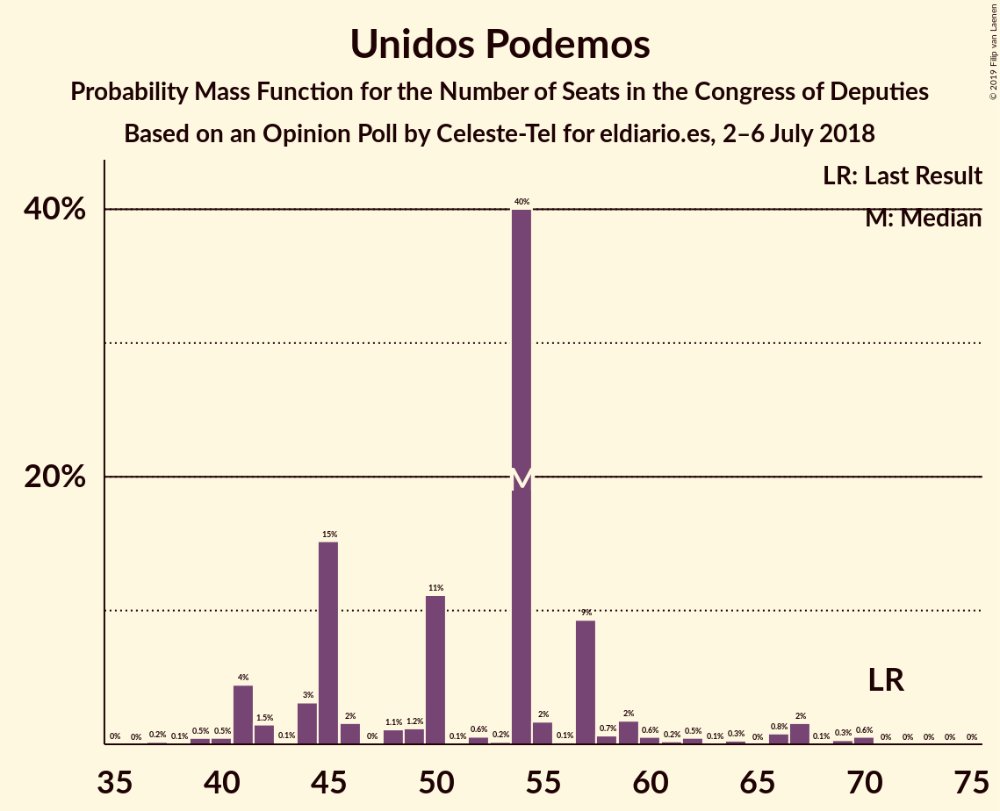
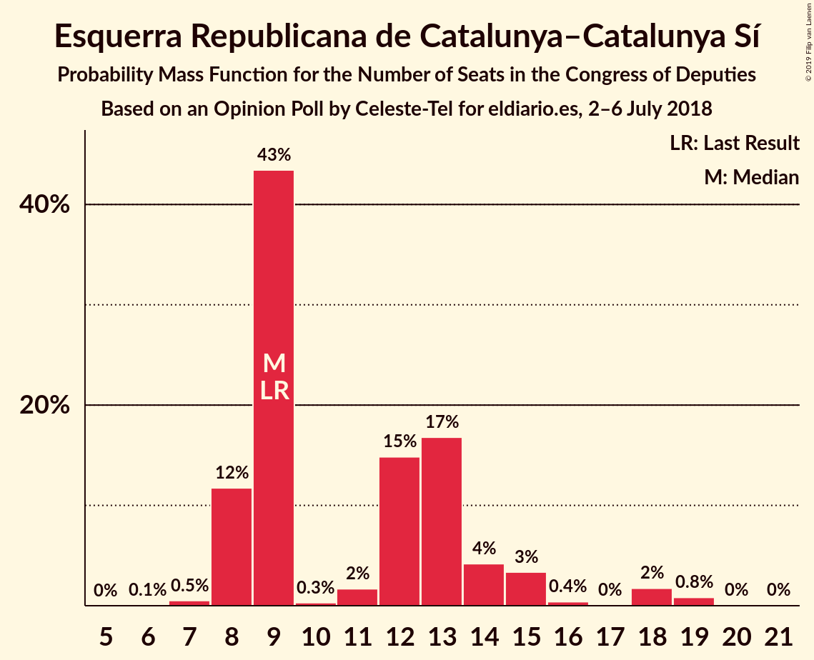
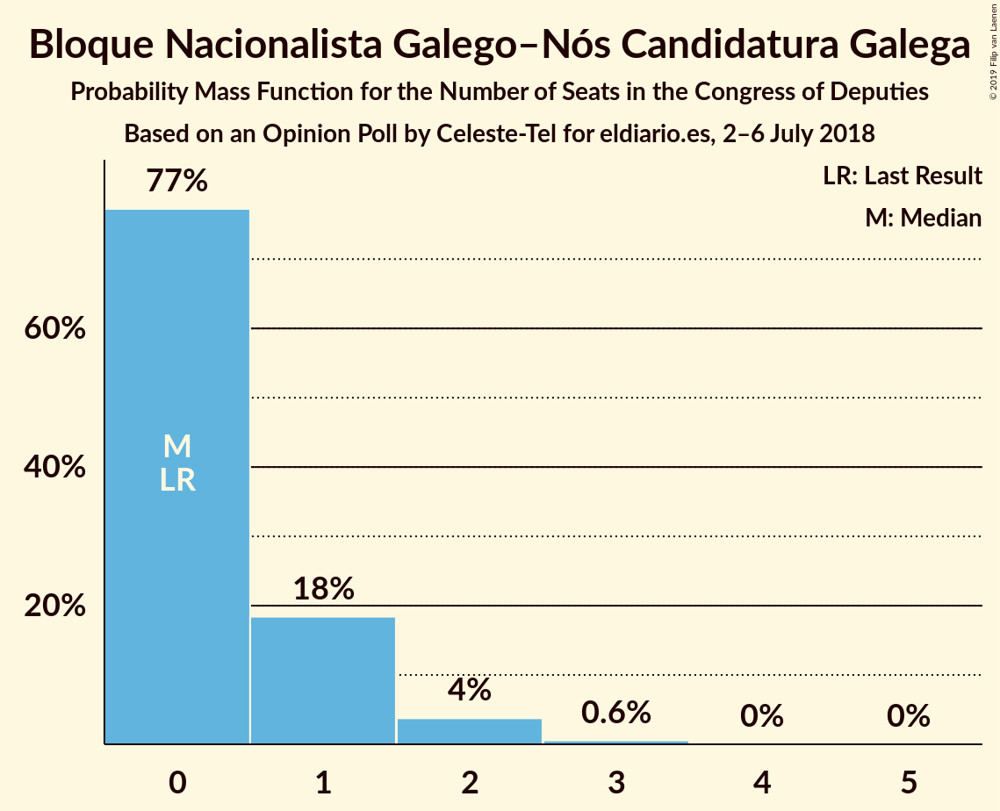
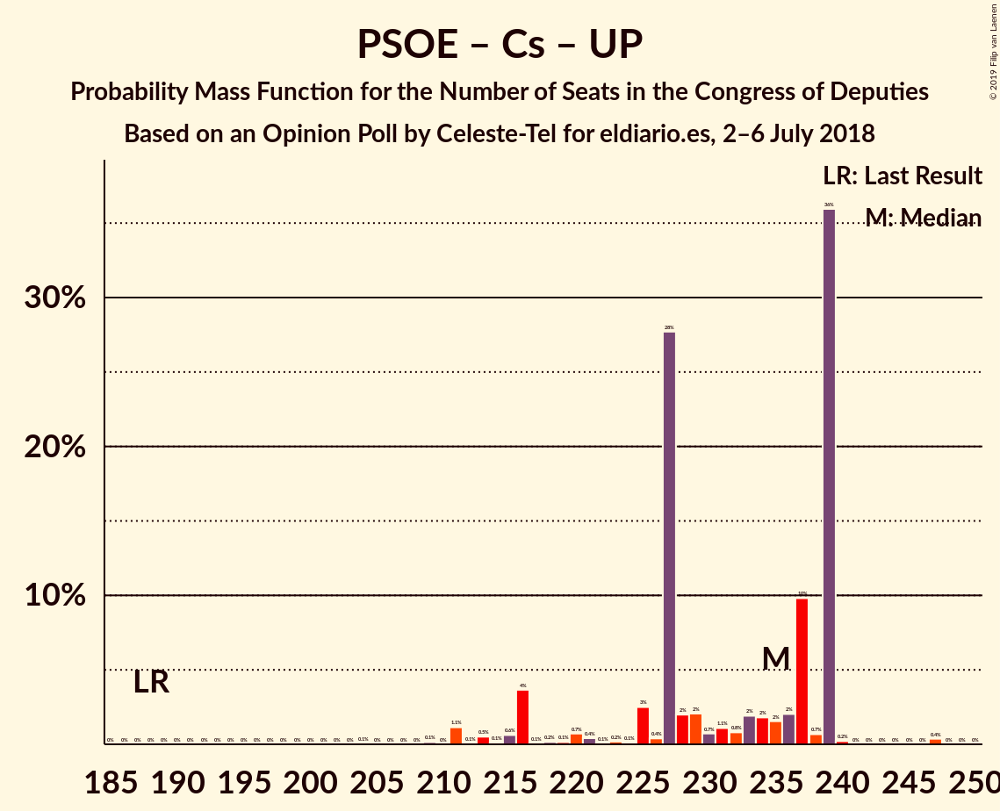
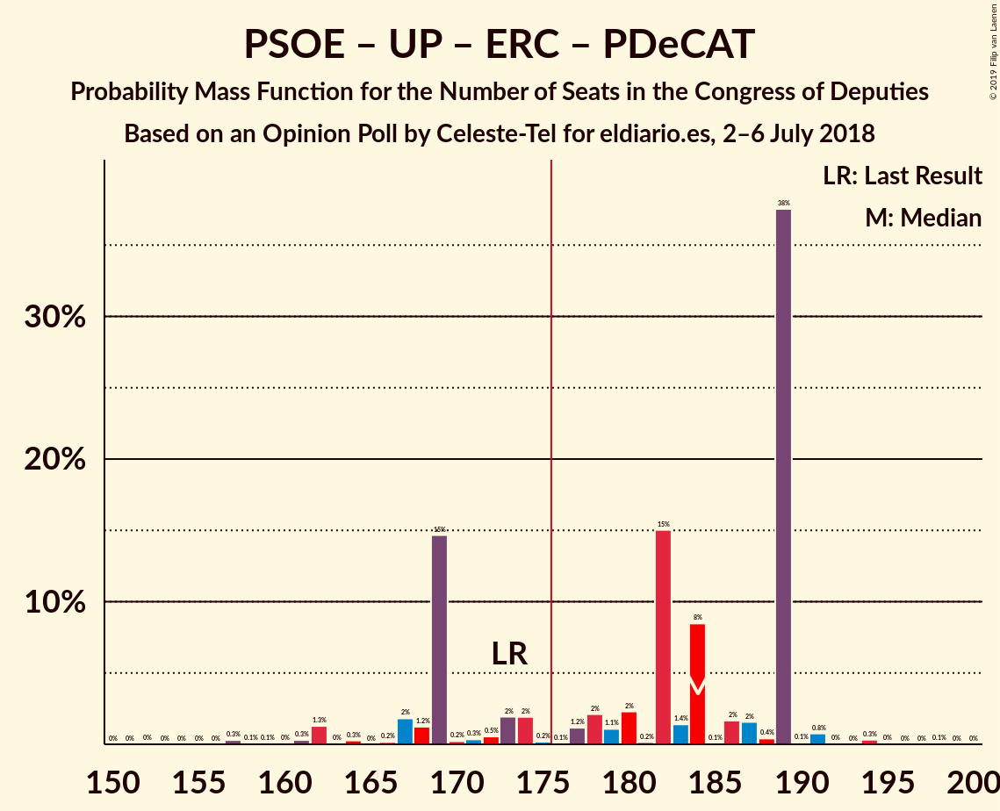

# Opinion Poll by Celeste-Tel for eldiario.es, 2–6 July 2018

<a href="#voting-intentions">Voting Intentions</a> | <a href="#seats">Seats</a> | <a href="#coalitions">Coalitions</a> | <a href="#technical-information">Technical Information</a>

## Voting Intentions

### Confidence Intervals

| Party | Last Result | Poll Result | 80% Confidence Interval | 90% Confidence Interval | 95% Confidence Interval | 99% Confidence Interval |
|:-----:|:-----------:|:-----------:|:-----------------------:|:-----------------------:|:-----------------------:|:-----------------------:|
| Partido Socialista Obrero Español | 22.6% | 27.1% | 25.4–28.9% |25.0–29.4% |24.5–29.8% |23.8–30.7% |
| Partido Popular | 33.0% | 24.2% | 22.6–25.9% |22.1–26.4% |21.7–26.8% |21.0–27.6% |
| Ciudadanos–Partido de la Ciudadanía | 13.1% | 20.6% | 19.1–22.3% |18.7–22.7% |18.3–23.1% |17.6–23.9% |
| Unidos Podemos | 21.2% | 17.7% | 16.3–19.3% |15.9–19.7% |15.6–20.1% |14.9–20.9% |
| Esquerra Republicana de Catalunya–Catalunya Sí | 2.7% | 3.1% | 2.5–3.9% |2.3–4.1% |2.2–4.3% |2.0–4.7% |
| Partit Demòcrata Europeu Català | 2.0% | 1.6% | 1.2–2.3% |1.1–2.4% |1.0–2.6% |0.9–2.9% |
| Euzko Alderdi Jeltzalea/Partido Nacionalista Vasco | 1.2% | 1.1% | 0.8–1.6% |0.7–1.8% |0.6–1.9% |0.5–2.2% |
| Partido Animalista Contra el Maltrato Animal | 1.2% | 1.1% | 0.8–1.6% |0.7–1.8% |0.6–1.9% |0.5–2.2% |
| Euskal Herria Bildu | 0.8% | 0.9% | 0.6–1.4% |0.5–1.5% |0.5–1.7% |0.4–1.9% |
| Coalición Canaria–Partido Nacionalista Canario | 0.3% | 0.3% | 0.2–0.6% |0.1–0.7% |0.1–0.8% |0.1–1.0% |
| Bloque Nacionalista Galego–Nós Candidatura Galega | 0.2% | 0.2% | 0.1–0.5% |0.1–0.6% |0.0–0.7% |0.0–0.9% |

*Note:* The poll result column reflects the actual value used in the calculations. Published results may vary slightly, and in addition be rounded to fewer digits.

## Seats

### Confidence Intervals

| Party | Last Result | Median | 80% Confidence Interval | 90% Confidence Interval | 95% Confidence Interval | 99% Confidence Interval |
|:-----:|:-----------:|:------:|:-----------------------:|:-----------------------:|:-----------------------:|:-----------------------:|
| <a href="#partido-socialista-obrero-español">Partido Socialista Obrero Español</a> | 85 | 116 | 102–118 |95–118 |91–119 |88–123 |
| <a href="#partido-popular">Partido Popular</a> | 137 | 87 | 86–101 |86–104 |83–106 |80–107 |
| <a href="#ciudadanos–partido-de-la-ciudadanía">Ciudadanos–Partido de la Ciudadanía</a> | 32 | 67 | 66–73 |65–75 |61–80 |60–82 |
| <a href="#unidos-podemos">Unidos Podemos</a> | 71 | 54 | 44–57 |41–59 |41–67 |39–70 |
| <a href="#esquerra-republicana-de-catalunya–catalunya-sí">Esquerra Republicana de Catalunya–Catalunya Sí</a> | 9 | 9 | 8–14 |8–15 |8–18 |7–19 |
| <a href="#partit-demòcrata-europeu-català">Partit Demòcrata Europeu Català</a> | 8 | 8 | 3–8 |3–9 |3–10 |2–10 |
| <a href="#euzko-alderdi-jeltzalea/partido-nacionalista-vasco">Euzko Alderdi Jeltzalea/Partido Nacionalista Vasco</a> | 5 | 4 | 3–7 |3–7 |2–7 |2–8 |
| <a href="#partido-animalista-contra-el-maltrato-animal">Partido Animalista Contra el Maltrato Animal</a> | 0 | 0 | 0 |0 |0 |0–1 |
| <a href="#euskal-herria-bildu">Euskal Herria Bildu</a> | 2 | 5 | 1–6 |1–6 |1–7 |1–9 |
| <a href="#coalición-canaria–partido-nacionalista-canario">Coalición Canaria–Partido Nacionalista Canario</a> | 1 | 0 | 0–1 |0–1 |0–2 |0–4 |
| <a href="#bloque-nacionalista-galego–nós-candidatura-galega">Bloque Nacionalista Galego–Nós Candidatura Galega</a> | 0 | 0 | 0–1 |0–1 |0–2 |0–3 |

### Partido Socialista Obrero Español

*For a full overview of the results for this party, see the [Partido Socialista Obrero Español](party-partidosocialistaobreroespañol.html) page.*

| Number of Seats | Probability | Accumulated | Special Marks |
|:---------------:|:-----------:|:-----------:|:-------------:|
| 85 | 0% | 100% | Last Result |
| 86 | 0% | 100% |  |
| 87 | 0.4% | 100% |  |
| 88 | 0.3% | 99.6% |  |
| 89 | 0% | 99.3% |  |
| 90 | 0.1% | 99.3% |  |
| 91 | 2% | 99.2% |  |
| 92 | 0.2% | 97% |  |
| 93 | 1.0% | 97% |  |
| 94 | 0.4% | 96% |  |
| 95 | 0.7% | 95% |  |
| 96 | 0.1% | 95% |  |
| 97 | 0.8% | 95% |  |
| 98 | 0.1% | 94% |  |
| 99 | 2% | 94% |  |
| 100 | 0.2% | 92% |  |
| 101 | 0.1% | 92% |  |
| 102 | 2% | 92% |  |
| 103 | 0.2% | 89% |  |
| 104 | 12% | 89% |  |
| 105 | 0.2% | 77% |  |
| 106 | 2% | 77% |  |
| 107 | 2% | 75% |  |
| 108 | 0.4% | 73% |  |
| 109 | 3% | 73% |  |
| 110 | 2% | 70% |  |
| 111 | 0.1% | 68% |  |
| 112 | 9% | 68% |  |
| 113 | 0.3% | 59% |  |
| 114 | 0% | 58% |  |
| 115 | 2% | 58% |  |
| 116 | 17% | 56% | Median |
| 117 | 0.4% | 40% |  |
| 118 | 36% | 39% |  |
| 119 | 0.9% | 3% |  |
| 120 | 0% | 2% |  |
| 121 | 0% | 2% |  |
| 122 | 2% | 2% |  |
| 123 | 0.4% | 0.7% |  |
| 124 | 0.1% | 0.2% |  |
| 125 | 0% | 0.2% |  |
| 126 | 0% | 0.2% |  |
| 127 | 0.1% | 0.1% |  |
| 128 | 0% | 0% |  |

### Partido Popular

*For a full overview of the results for this party, see the [Partido Popular](party-partidopopular.html) page.*

| Number of Seats | Probability | Accumulated | Special Marks |
|:---------------:|:-----------:|:-----------:|:-------------:|
| 76 | 0.1% | 100% |  |
| 77 | 0% | 99.9% |  |
| 78 | 0% | 99.9% |  |
| 79 | 0.3% | 99.9% |  |
| 80 | 0.2% | 99.6% |  |
| 81 | 0% | 99.3% |  |
| 82 | 0.4% | 99.3% |  |
| 83 | 3% | 98.9% |  |
| 84 | 0.1% | 96% |  |
| 85 | 0.1% | 96% |  |
| 86 | 46% | 96% |  |
| 87 | 2% | 50% | Median |
| 88 | 1.3% | 49% |  |
| 89 | 18% | 47% |  |
| 90 | 1.4% | 29% |  |
| 91 | 2% | 28% |  |
| 92 | 2% | 26% |  |
| 93 | 0.6% | 24% |  |
| 94 | 0.1% | 24% |  |
| 95 | 1.1% | 24% |  |
| 96 | 0.1% | 22% |  |
| 97 | 0.2% | 22% |  |
| 98 | 2% | 22% |  |
| 99 | 2% | 20% |  |
| 100 | 0.4% | 19% |  |
| 101 | 11% | 18% |  |
| 102 | 0.5% | 7% |  |
| 103 | 0.2% | 7% |  |
| 104 | 2% | 6% |  |
| 105 | 0.5% | 4% |  |
| 106 | 3% | 3% |  |
| 107 | 0.1% | 0.6% |  |
| 108 | 0.1% | 0.4% |  |
| 109 | 0% | 0.3% |  |
| 110 | 0.1% | 0.3% |  |
| 111 | 0.1% | 0.3% |  |
| 112 | 0% | 0.2% |  |
| 113 | 0.1% | 0.1% |  |
| 114 | 0% | 0.1% |  |
| 115 | 0% | 0% |  |
| 116 | 0% | 0% |  |
| 117 | 0% | 0% |  |
| 118 | 0% | 0% |  |
| 119 | 0% | 0% |  |
| 120 | 0% | 0% |  |
| 121 | 0% | 0% |  |
| 122 | 0% | 0% |  |
| 123 | 0% | 0% |  |
| 124 | 0% | 0% |  |
| 125 | 0% | 0% |  |
| 126 | 0% | 0% |  |
| 127 | 0% | 0% |  |
| 128 | 0% | 0% |  |
| 129 | 0% | 0% |  |
| 130 | 0% | 0% |  |
| 131 | 0% | 0% |  |
| 132 | 0% | 0% |  |
| 133 | 0% | 0% |  |
| 134 | 0% | 0% |  |
| 135 | 0% | 0% |  |
| 136 | 0% | 0% |  |
| 137 | 0% | 0% | Last Result |

### Ciudadanos–Partido de la Ciudadanía

*For a full overview of the results for this party, see the [Ciudadanos–Partido de la Ciudadanía](party-ciudadanos–partidodelaciudadanía.html) page.*

| Number of Seats | Probability | Accumulated | Special Marks |
|:---------------:|:-----------:|:-----------:|:-------------:|
| 32 | 0% | 100% | Last Result |
| 33 | 0% | 100% |  |
| 34 | 0% | 100% |  |
| 35 | 0% | 100% |  |
| 36 | 0% | 100% |  |
| 37 | 0% | 100% |  |
| 38 | 0% | 100% |  |
| 39 | 0% | 100% |  |
| 40 | 0% | 100% |  |
| 41 | 0% | 100% |  |
| 42 | 0% | 100% |  |
| 43 | 0% | 100% |  |
| 44 | 0% | 100% |  |
| 45 | 0% | 100% |  |
| 46 | 0% | 100% |  |
| 47 | 0% | 100% |  |
| 48 | 0% | 100% |  |
| 49 | 0% | 100% |  |
| 50 | 0% | 100% |  |
| 51 | 0% | 100% |  |
| 52 | 0% | 100% |  |
| 53 | 0% | 99.9% |  |
| 54 | 0% | 99.9% |  |
| 55 | 0% | 99.9% |  |
| 56 | 0.1% | 99.9% |  |
| 57 | 0.1% | 99.8% |  |
| 58 | 0.1% | 99.8% |  |
| 59 | 0% | 99.7% |  |
| 60 | 2% | 99.6% |  |
| 61 | 0.9% | 98% |  |
| 62 | 0.5% | 97% |  |
| 63 | 0.6% | 97% |  |
| 64 | 0% | 96% |  |
| 65 | 2% | 96% |  |
| 66 | 19% | 94% |  |
| 67 | 40% | 76% | Median |
| 68 | 9% | 36% |  |
| 69 | 1.0% | 27% |  |
| 70 | 0.7% | 26% |  |
| 71 | 3% | 25% |  |
| 72 | 0.8% | 22% |  |
| 73 | 15% | 21% |  |
| 74 | 0.6% | 6% |  |
| 75 | 2% | 6% |  |
| 76 | 0% | 4% |  |
| 77 | 0.9% | 4% |  |
| 78 | 0% | 3% |  |
| 79 | 0.3% | 3% |  |
| 80 | 0.9% | 3% |  |
| 81 | 0% | 2% |  |
| 82 | 1.5% | 2% |  |
| 83 | 0% | 0.4% |  |
| 84 | 0.3% | 0.4% |  |
| 85 | 0% | 0% |  |

### Unidos Podemos

*For a full overview of the results for this party, see the [Unidos Podemos](party-unidospodemos.html) page.*

| Number of Seats | Probability | Accumulated | Special Marks |
|:---------------:|:-----------:|:-----------:|:-------------:|
| 36 | 0% | 100% |  |
| 37 | 0.2% | 99.9% |  |
| 38 | 0.1% | 99.8% |  |
| 39 | 0.5% | 99.7% |  |
| 40 | 0.5% | 99.2% |  |
| 41 | 4% | 98.7% |  |
| 42 | 1.5% | 94% |  |
| 43 | 0.1% | 93% |  |
| 44 | 3% | 93% |  |
| 45 | 15% | 90% |  |
| 46 | 2% | 74% |  |
| 47 | 0% | 73% |  |
| 48 | 1.1% | 73% |  |
| 49 | 1.2% | 72% |  |
| 50 | 11% | 70% |  |
| 51 | 0.1% | 59% |  |
| 52 | 0.6% | 59% |  |
| 53 | 0.2% | 59% |  |
| 54 | 40% | 59% | Median |
| 55 | 2% | 18% |  |
| 56 | 0.1% | 17% |  |
| 57 | 9% | 17% |  |
| 58 | 0.7% | 7% |  |
| 59 | 2% | 7% |  |
| 60 | 0.6% | 5% |  |
| 61 | 0.2% | 4% |  |
| 62 | 0.5% | 4% |  |
| 63 | 0.1% | 4% |  |
| 64 | 0.3% | 4% |  |
| 65 | 0% | 3% |  |
| 66 | 0.8% | 3% |  |
| 67 | 2% | 3% |  |
| 68 | 0.1% | 1.0% |  |
| 69 | 0.3% | 0.9% |  |
| 70 | 0.6% | 0.6% |  |
| 71 | 0% | 0% | Last Result |

### Esquerra Republicana de Catalunya–Catalunya Sí

*For a full overview of the results for this party, see the [Esquerra Republicana de Catalunya–Catalunya Sí](party-esquerrarepublicanadecatalunya–catalunyasí.html) page.*

| Number of Seats | Probability | Accumulated | Special Marks |
|:---------------:|:-----------:|:-----------:|:-------------:|
| 6 | 0.1% | 100% |  |
| 7 | 0.5% | 99.9% |  |
| 8 | 12% | 99.4% |  |
| 9 | 43% | 88% | Last Result, Median |
| 10 | 0.3% | 44% |  |
| 11 | 2% | 44% |  |
| 12 | 15% | 42% |  |
| 13 | 17% | 27% |  |
| 14 | 4% | 11% |  |
| 15 | 3% | 6% |  |
| 16 | 0.4% | 3% |  |
| 17 | 0% | 3% |  |
| 18 | 2% | 3% |  |
| 19 | 0.8% | 0.9% |  |
| 20 | 0% | 0.1% |  |
| 21 | 0% | 0% |  |

### Partit Demòcrata Europeu Català

*For a full overview of the results for this party, see the [Partit Demòcrata Europeu Català](party-partitdemòcrataeuropeucatalà.html) page.*

| Number of Seats | Probability | Accumulated | Special Marks |
|:---------------:|:-----------:|:-----------:|:-------------:|
| 1 | 0.1% | 100% |  |
| 2 | 0.8% | 99.9% |  |
| 3 | 10% | 99.1% |  |
| 4 | 3% | 89% |  |
| 5 | 0.7% | 86% |  |
| 6 | 12% | 85% |  |
| 7 | 14% | 74% |  |
| 8 | 54% | 59% | Last Result, Median |
| 9 | 1.2% | 5% |  |
| 10 | 4% | 4% |  |
| 11 | 0.1% | 0.1% |  |
| 12 | 0% | 0% |  |

### Euzko Alderdi Jeltzalea/Partido Nacionalista Vasco

*For a full overview of the results for this party, see the [Euzko Alderdi Jeltzalea/Partido Nacionalista Vasco](party-euzkoalderdijeltzaleapartidonacionalistavasco.html) page.*

| Number of Seats | Probability | Accumulated | Special Marks |
|:---------------:|:-----------:|:-----------:|:-------------:|
| 1 | 0.2% | 100% |  |
| 2 | 4% | 99.8% |  |
| 3 | 46% | 96% |  |
| 4 | 2% | 50% | Median |
| 5 | 5% | 48% | Last Result |
| 6 | 27% | 44% |  |
| 7 | 16% | 17% |  |
| 8 | 1.4% | 1.5% |  |
| 9 | 0% | 0.1% |  |
| 10 | 0.1% | 0.1% |  |
| 11 | 0% | 0% |  |

### Partido Animalista Contra el Maltrato Animal

*For a full overview of the results for this party, see the [Partido Animalista Contra el Maltrato Animal](party-partidoanimalistacontraelmaltratoanimal.html) page.*

| Number of Seats | Probability | Accumulated | Special Marks |
|:---------------:|:-----------:|:-----------:|:-------------:|
| 0 | 98% | 100% | Last Result, Median |
| 1 | 2% | 2% |  |
| 2 | 0% | 0% |  |

### Euskal Herria Bildu

*For a full overview of the results for this party, see the [Euskal Herria Bildu](party-euskalherriabildu.html) page.*

| Number of Seats | Probability | Accumulated | Special Marks |
|:---------------:|:-----------:|:-----------:|:-------------:|
| 0 | 0.1% | 100% |  |
| 1 | 13% | 99.9% |  |
| 2 | 2% | 87% | Last Result |
| 3 | 5% | 85% |  |
| 4 | 23% | 80% |  |
| 5 | 38% | 57% | Median |
| 6 | 15% | 19% |  |
| 7 | 3% | 4% |  |
| 8 | 0.5% | 1.0% |  |
| 9 | 0.5% | 0.5% |  |
| 10 | 0% | 0% |  |

### Coalición Canaria–Partido Nacionalista Canario

*For a full overview of the results for this party, see the [Coalición Canaria–Partido Nacionalista Canario](party-coalicióncanaria–partidonacionalistacanario.html) page.*

| Number of Seats | Probability | Accumulated | Special Marks |
|:---------------:|:-----------:|:-----------:|:-------------:|
| 0 | 62% | 100% | Median |
| 1 | 34% | 38% | Last Result |
| 2 | 2% | 4% |  |
| 3 | 0.9% | 2% |  |
| 4 | 1.3% | 1.3% |  |
| 5 | 0% | 0% |  |

### Bloque Nacionalista Galego–Nós Candidatura Galega

*For a full overview of the results for this party, see the [Bloque Nacionalista Galego–Nós Candidatura Galega](party-bloquenacionalistagalego–nóscandidaturagalega.html) page.*

| Number of Seats | Probability | Accumulated | Special Marks |
|:---------------:|:-----------:|:-----------:|:-------------:|
| 0 | 77% | 100% | Last Result, Median |
| 1 | 18% | 23% |  |
| 2 | 4% | 4% |  |
| 3 | 0.6% | 0.6% |  |
| 4 | 0% | 0% |  |

## Coalitions

### Confidence Intervals

| Coalition | Last Result | Median | Majority? | 80% Confidence Interval | 90% Confidence Interval | 95% Confidence Interval | 99% Confidence Interval |
|:---------:|:-----------:|:------:|:---------:|:-----------------------:|:-----------------------:|:-----------------------:|:-----------------------:|
| Partido Socialista Obrero Español – Partido Popular – Ciudadanos–Partido de la Ciudadanía | 254 | 271 | 100% | 264–278 | 261–281 | 254–282 | 252–284 |
| Partido Socialista Obrero Español – Ciudadanos–Partido de la Ciudadanía – Unidos Podemos | 188 | 235 | 100% | 225–239 | 216–239 | 215–239 | 211–240 |
| Partido Socialista Obrero Español – Partido Popular | 222 | 204 | 100% | 195–205 | 192–212 | 186–215 | 184–215 |
| Partido Socialista Obrero Español – Unidos Podemos – Esquerra Republicana de Catalunya–Catalunya Sí – Partit Demòcrata Europeu Català – Euzko Alderdi Jeltzalea/Partido Nacionalista Vasco – Euskal Herria Bildu | 180 | 193 | 97% | 176–197 | 176–197 | 174–198 | 169–201 |
| Partido Socialista Obrero Español – Ciudadanos–Partido de la Ciudadanía | 117 | 182 | 86% | 172–185 | 166–185 | 159–193 | 157–195 |
| Partido Socialista Obrero Español – Unidos Podemos – Esquerra Republicana de Catalunya–Catalunya Sí – Partit Demòcrata Europeu Català | 173 | 184 | 74% | 169–189 | 168–189 | 164–189 | 159–192 |
| Partido Socialista Obrero Español – Unidos Podemos – Esquerra Republicana de Catalunya–Catalunya Sí – Euskal Herria Bildu | 167 | 184 | 73% | 163–187 | 163–187 | 162–187 | 156–191 |
| Partido Socialista Obrero Español – Unidos Podemos – Euzko Alderdi Jeltzalea/Partido Nacionalista Vasco – Euskal Herria Bildu | 163 | 174 | 49% | 161–180 | 156–181 | 155–181 | 147–181 |
| Partido Popular – Ciudadanos–Partido de la Ciudadanía – Coalición Canaria–Partido Nacionalista Canario | 170 | 156 | 3% | 153–174 | 153–174 | 152–176 | 149–180 |
| Partido Popular – Ciudadanos–Partido de la Ciudadanía | 169 | 155 | 2% | 153–174 | 153–174 | 150–175 | 148–179 |
| Partido Socialista Obrero Español – Unidos Podemos | 156 | 165 | 0.1% | 153–172 | 147–172 | 146–172 | 139–172 |
| Partido Socialista Obrero Español | 85 | 116 | 0% | 102–118 | 95–118 | 91–119 | 88–123 |
| Partido Popular | 137 | 87 | 0% | 86–101 | 86–104 | 83–106 | 80–107 |

### Partido Socialista Obrero Español – Partido Popular – Ciudadanos–Partido de la Ciudadanía

| Number of Seats | Probability | Accumulated | Special Marks |
|:---------------:|:-----------:|:-----------:|:-------------:|
| 250 | 0.1% | 100% |  |
| 251 | 0% | 99.9% |  |
| 252 | 2% | 99.9% |  |
| 253 | 0% | 98% |  |
| 254 | 0.9% | 98% | Last Result |
| 255 | 0.8% | 97% |  |
| 256 | 0% | 97% |  |
| 257 | 0.1% | 97% |  |
| 258 | 0.3% | 96% |  |
| 259 | 0.1% | 96% |  |
| 260 | 0.3% | 96% |  |
| 261 | 1.2% | 96% |  |
| 262 | 0.1% | 94% |  |
| 263 | 3% | 94% |  |
| 264 | 2% | 91% |  |
| 265 | 0.8% | 89% |  |
| 266 | 8% | 89% |  |
| 267 | 0.1% | 80% |  |
| 268 | 0.8% | 80% |  |
| 269 | 2% | 79% |  |
| 270 | 0.4% | 77% | Median |
| 271 | 52% | 77% |  |
| 272 | 1.0% | 25% |  |
| 273 | 1.1% | 24% |  |
| 274 | 1.0% | 23% |  |
| 275 | 4% | 22% |  |
| 276 | 1.4% | 19% |  |
| 277 | 0.1% | 17% |  |
| 278 | 11% | 17% |  |
| 279 | 0.2% | 6% |  |
| 280 | 0.4% | 6% |  |
| 281 | 3% | 5% |  |
| 282 | 0.4% | 3% |  |
| 283 | 0.5% | 2% |  |
| 284 | 2% | 2% |  |
| 285 | 0.2% | 0.4% |  |
| 286 | 0.1% | 0.1% |  |
| 287 | 0% | 0% |  |

### Partido Socialista Obrero Español – Ciudadanos–Partido de la Ciudadanía – Unidos Podemos

| Number of Seats | Probability | Accumulated | Special Marks |
|:---------------:|:-----------:|:-----------:|:-------------:|
| 188 | 0% | 100% | Last Result |
| 189 | 0% | 100% |  |
| 190 | 0% | 100% |  |
| 191 | 0% | 100% |  |
| 192 | 0% | 100% |  |
| 193 | 0% | 100% |  |
| 194 | 0% | 100% |  |
| 195 | 0% | 100% |  |
| 196 | 0% | 100% |  |
| 197 | 0% | 100% |  |
| 198 | 0% | 100% |  |
| 199 | 0% | 100% |  |
| 200 | 0% | 100% |  |
| 201 | 0% | 100% |  |
| 202 | 0% | 100% |  |
| 203 | 0% | 100% |  |
| 204 | 0.1% | 100% |  |
| 205 | 0% | 99.9% |  |
| 206 | 0% | 99.9% |  |
| 207 | 0% | 99.9% |  |
| 208 | 0% | 99.9% |  |
| 209 | 0.1% | 99.9% |  |
| 210 | 0% | 99.7% |  |
| 211 | 1.1% | 99.7% |  |
| 212 | 0.1% | 98.6% |  |
| 213 | 0.5% | 98.5% |  |
| 214 | 0.1% | 98% |  |
| 215 | 0.6% | 98% |  |
| 216 | 4% | 97% |  |
| 217 | 0.1% | 94% |  |
| 218 | 0.2% | 94% |  |
| 219 | 0.1% | 93% |  |
| 220 | 0.7% | 93% |  |
| 221 | 0.4% | 93% |  |
| 222 | 0.1% | 92% |  |
| 223 | 0.2% | 92% |  |
| 224 | 0.1% | 92% |  |
| 225 | 3% | 92% |  |
| 226 | 0.4% | 89% |  |
| 227 | 28% | 89% |  |
| 228 | 2% | 61% |  |
| 229 | 2% | 59% |  |
| 230 | 0.7% | 57% |  |
| 231 | 1.1% | 56% |  |
| 232 | 0.8% | 55% |  |
| 233 | 2% | 54% |  |
| 234 | 2% | 53% |  |
| 235 | 2% | 51% |  |
| 236 | 2% | 49% |  |
| 237 | 10% | 47% | Median |
| 238 | 0.7% | 37% |  |
| 239 | 36% | 37% |  |
| 240 | 0.2% | 0.7% |  |
| 241 | 0% | 0.5% |  |
| 242 | 0% | 0.5% |  |
| 243 | 0% | 0.5% |  |
| 244 | 0% | 0.4% |  |
| 245 | 0% | 0.4% |  |
| 246 | 0% | 0.4% |  |
| 247 | 0.4% | 0.4% |  |
| 248 | 0% | 0% |  |

### Partido Socialista Obrero Español – Partido Popular

| Number of Seats | Probability | Accumulated | Special Marks |
|:---------------:|:-----------:|:-----------:|:-------------:|
| 178 | 0.1% | 100% |  |
| 179 | 0% | 99.9% |  |
| 180 | 0% | 99.8% |  |
| 181 | 0% | 99.8% |  |
| 182 | 0% | 99.8% |  |
| 183 | 0% | 99.8% |  |
| 184 | 0.3% | 99.8% |  |
| 185 | 2% | 99.4% |  |
| 186 | 1.2% | 98% |  |
| 187 | 0.4% | 97% |  |
| 188 | 0.2% | 96% |  |
| 189 | 0% | 96% |  |
| 190 | 0.1% | 96% |  |
| 191 | 0.6% | 96% |  |
| 192 | 2% | 95% |  |
| 193 | 2% | 94% |  |
| 194 | 2% | 92% |  |
| 195 | 3% | 90% |  |
| 196 | 0.4% | 88% |  |
| 197 | 0.5% | 87% |  |
| 198 | 10% | 87% |  |
| 199 | 1.0% | 76% |  |
| 200 | 0.1% | 75% |  |
| 201 | 0.7% | 75% |  |
| 202 | 0.1% | 74% |  |
| 203 | 0.6% | 74% | Median |
| 204 | 39% | 74% |  |
| 205 | 26% | 35% |  |
| 206 | 1.1% | 9% |  |
| 207 | 0.4% | 8% |  |
| 208 | 0.1% | 8% |  |
| 209 | 0.2% | 7% |  |
| 210 | 0.5% | 7% |  |
| 211 | 2% | 7% |  |
| 212 | 1.0% | 5% |  |
| 213 | 0.1% | 4% |  |
| 214 | 0.9% | 4% |  |
| 215 | 3% | 3% |  |
| 216 | 0% | 0.4% |  |
| 217 | 0% | 0.4% |  |
| 218 | 0.3% | 0.3% |  |
| 219 | 0% | 0.1% |  |
| 220 | 0% | 0% |  |
| 221 | 0% | 0% |  |
| 222 | 0% | 0% | Last Result |

### Partido Socialista Obrero Español – Unidos Podemos – Esquerra Republicana de Catalunya–Catalunya Sí – Partit Demòcrata Europeu Català – Euzko Alderdi Jeltzalea/Partido Nacionalista Vasco – Euskal Herria Bildu

| Number of Seats | Probability | Accumulated | Special Marks |
|:---------------:|:-----------:|:-----------:|:-------------:|
| 163 | 0% | 100% |  |
| 164 | 0% | 99.9% |  |
| 165 | 0% | 99.9% |  |
| 166 | 0.1% | 99.9% |  |
| 167 | 0.3% | 99.8% |  |
| 168 | 0% | 99.5% |  |
| 169 | 0% | 99.5% |  |
| 170 | 1.3% | 99.5% |  |
| 171 | 0.5% | 98% |  |
| 172 | 0.1% | 98% |  |
| 173 | 0% | 98% |  |
| 174 | 0.2% | 98% |  |
| 175 | 0% | 97% |  |
| 176 | 13% | 97% | Majority |
| 177 | 1.5% | 85% |  |
| 178 | 4% | 83% |  |
| 179 | 0% | 79% |  |
| 180 | 0.4% | 79% | Last Result |
| 181 | 0.6% | 79% |  |
| 182 | 0.9% | 78% |  |
| 183 | 0.2% | 77% |  |
| 184 | 0.1% | 77% |  |
| 185 | 3% | 77% |  |
| 186 | 2% | 74% |  |
| 187 | 2% | 73% |  |
| 188 | 0.1% | 71% |  |
| 189 | 3% | 71% |  |
| 190 | 0.5% | 67% |  |
| 191 | 3% | 67% |  |
| 192 | 0.9% | 64% |  |
| 193 | 15% | 63% |  |
| 194 | 0.1% | 49% |  |
| 195 | 2% | 49% |  |
| 196 | 8% | 47% | Median |
| 197 | 36% | 39% |  |
| 198 | 0.9% | 3% |  |
| 199 | 0% | 2% |  |
| 200 | 0.2% | 2% |  |
| 201 | 2% | 2% |  |
| 202 | 0.1% | 0.2% |  |
| 203 | 0% | 0.1% |  |
| 204 | 0% | 0.1% |  |
| 205 | 0% | 0.1% |  |
| 206 | 0.1% | 0.1% |  |
| 207 | 0% | 0% |  |

### Partido Socialista Obrero Español – Ciudadanos–Partido de la Ciudadanía

| Number of Seats | Probability | Accumulated | Special Marks |
|:---------------:|:-----------:|:-----------:|:-------------:|
| 117 | 0% | 100% | Last Result |
| 118 | 0% | 100% |  |
| 119 | 0% | 100% |  |
| 120 | 0% | 100% |  |
| 121 | 0% | 100% |  |
| 122 | 0% | 100% |  |
| 123 | 0% | 100% |  |
| 124 | 0% | 100% |  |
| 125 | 0% | 100% |  |
| 126 | 0% | 100% |  |
| 127 | 0% | 100% |  |
| 128 | 0% | 100% |  |
| 129 | 0% | 100% |  |
| 130 | 0% | 100% |  |
| 131 | 0% | 100% |  |
| 132 | 0% | 100% |  |
| 133 | 0% | 100% |  |
| 134 | 0% | 100% |  |
| 135 | 0% | 100% |  |
| 136 | 0% | 100% |  |
| 137 | 0% | 100% |  |
| 138 | 0% | 100% |  |
| 139 | 0% | 100% |  |
| 140 | 0% | 100% |  |
| 141 | 0% | 100% |  |
| 142 | 0% | 100% |  |
| 143 | 0% | 100% |  |
| 144 | 0% | 100% |  |
| 145 | 0% | 100% |  |
| 146 | 0% | 100% |  |
| 147 | 0% | 100% |  |
| 148 | 0% | 100% |  |
| 149 | 0% | 100% |  |
| 150 | 0% | 100% |  |
| 151 | 0% | 100% |  |
| 152 | 0% | 100% |  |
| 153 | 0% | 100% |  |
| 154 | 0% | 99.9% |  |
| 155 | 0% | 99.9% |  |
| 156 | 0.1% | 99.9% |  |
| 157 | 1.2% | 99.8% |  |
| 158 | 0.2% | 98.6% |  |
| 159 | 1.2% | 98% |  |
| 160 | 0.2% | 97% |  |
| 161 | 0.3% | 97% |  |
| 162 | 0% | 97% |  |
| 163 | 0.1% | 97% |  |
| 164 | 0.5% | 97% |  |
| 165 | 0.7% | 96% |  |
| 166 | 4% | 95% |  |
| 167 | 0% | 91% |  |
| 168 | 0% | 91% |  |
| 169 | 0% | 91% |  |
| 170 | 0.1% | 91% |  |
| 171 | 0.4% | 91% |  |
| 172 | 0.6% | 90% |  |
| 173 | 1.0% | 90% |  |
| 174 | 0.2% | 89% |  |
| 175 | 3% | 89% |  |
| 176 | 0.8% | 86% | Majority |
| 177 | 11% | 85% |  |
| 178 | 0.3% | 74% |  |
| 179 | 0.1% | 73% |  |
| 180 | 11% | 73% |  |
| 181 | 0.9% | 62% |  |
| 182 | 16% | 61% |  |
| 183 | 4% | 45% | Median |
| 184 | 2% | 41% |  |
| 185 | 36% | 40% |  |
| 186 | 0% | 4% |  |
| 187 | 0% | 4% |  |
| 188 | 0% | 4% |  |
| 189 | 0.1% | 3% |  |
| 190 | 0.3% | 3% |  |
| 191 | 0% | 3% |  |
| 192 | 0% | 3% |  |
| 193 | 0.9% | 3% |  |
| 194 | 0.4% | 2% |  |
| 195 | 2% | 2% |  |
| 196 | 0% | 0.2% |  |
| 197 | 0% | 0.1% |  |
| 198 | 0.1% | 0.1% |  |
| 199 | 0% | 0% |  |

### Partido Socialista Obrero Español – Unidos Podemos – Esquerra Republicana de Catalunya–Catalunya Sí – Partit Demòcrata Europeu Català

| Number of Seats | Probability | Accumulated | Special Marks |
|:---------------:|:-----------:|:-----------:|:-------------:|
| 152 | 0% | 100% |  |
| 153 | 0% | 99.9% |  |
| 154 | 0% | 99.9% |  |
| 155 | 0% | 99.9% |  |
| 156 | 0% | 99.9% |  |
| 157 | 0.3% | 99.9% |  |
| 158 | 0.1% | 99.6% |  |
| 159 | 0.1% | 99.5% |  |
| 160 | 0% | 99.4% |  |
| 161 | 0.3% | 99.4% |  |
| 162 | 1.3% | 99.1% |  |
| 163 | 0% | 98% |  |
| 164 | 0.3% | 98% |  |
| 165 | 0% | 97% |  |
| 166 | 0.2% | 97% |  |
| 167 | 2% | 97% |  |
| 168 | 1.2% | 96% |  |
| 169 | 15% | 94% |  |
| 170 | 0.2% | 80% |  |
| 171 | 0.3% | 79% |  |
| 172 | 0.5% | 79% |  |
| 173 | 2% | 78% | Last Result |
| 174 | 2% | 77% |  |
| 175 | 0.2% | 75% |  |
| 176 | 0.1% | 74% | Majority |
| 177 | 1.2% | 74% |  |
| 178 | 2% | 73% |  |
| 179 | 1.1% | 71% |  |
| 180 | 2% | 70% |  |
| 181 | 0.2% | 68% |  |
| 182 | 15% | 68% |  |
| 183 | 1.4% | 52% |  |
| 184 | 8% | 51% |  |
| 185 | 0.1% | 43% |  |
| 186 | 2% | 43% |  |
| 187 | 2% | 41% | Median |
| 188 | 0.4% | 39% |  |
| 189 | 38% | 39% |  |
| 190 | 0.1% | 1.4% |  |
| 191 | 0.8% | 1.3% |  |
| 192 | 0% | 0.5% |  |
| 193 | 0% | 0.5% |  |
| 194 | 0.3% | 0.5% |  |
| 195 | 0% | 0.1% |  |
| 196 | 0% | 0.1% |  |
| 197 | 0% | 0.1% |  |
| 198 | 0.1% | 0.1% |  |
| 199 | 0% | 0% |  |

### Partido Socialista Obrero Español – Unidos Podemos – Esquerra Republicana de Catalunya–Catalunya Sí – Euskal Herria Bildu

| Number of Seats | Probability | Accumulated | Special Marks |
|:---------------:|:-----------:|:-----------:|:-------------:|
| 150 | 0.1% | 100% |  |
| 151 | 0% | 99.9% |  |
| 152 | 0% | 99.8% |  |
| 153 | 0% | 99.8% |  |
| 154 | 0.3% | 99.8% |  |
| 155 | 0% | 99.5% |  |
| 156 | 0.1% | 99.5% |  |
| 157 | 0.1% | 99.5% |  |
| 158 | 0.3% | 99.4% |  |
| 159 | 0.4% | 99.1% |  |
| 160 | 0.1% | 98.7% |  |
| 161 | 1.1% | 98.7% |  |
| 162 | 0.1% | 98% |  |
| 163 | 11% | 97% |  |
| 164 | 3% | 86% |  |
| 165 | 3% | 84% |  |
| 166 | 0.3% | 81% |  |
| 167 | 1.5% | 81% | Last Result |
| 168 | 0.1% | 79% |  |
| 169 | 0.3% | 79% |  |
| 170 | 0.7% | 79% |  |
| 171 | 0.4% | 78% |  |
| 172 | 0.2% | 78% |  |
| 173 | 2% | 77% |  |
| 174 | 0.8% | 75% |  |
| 175 | 2% | 74% |  |
| 176 | 2% | 73% | Majority |
| 177 | 1.2% | 71% |  |
| 178 | 16% | 70% |  |
| 179 | 0.8% | 53% |  |
| 180 | 0.1% | 53% |  |
| 181 | 0% | 52% |  |
| 182 | 0.1% | 52% |  |
| 183 | 0.5% | 52% |  |
| 184 | 3% | 52% | Median |
| 185 | 0% | 49% |  |
| 186 | 39% | 49% |  |
| 187 | 8% | 10% |  |
| 188 | 0% | 2% |  |
| 189 | 0% | 2% |  |
| 190 | 2% | 2% |  |
| 191 | 0.4% | 0.6% |  |
| 192 | 0.1% | 0.2% |  |
| 193 | 0% | 0.1% |  |
| 194 | 0.1% | 0.1% |  |
| 195 | 0% | 0% |  |

### Partido Socialista Obrero Español – Unidos Podemos – Euzko Alderdi Jeltzalea/Partido Nacionalista Vasco – Euskal Herria Bildu

| Number of Seats | Probability | Accumulated | Special Marks |
|:---------------:|:-----------:|:-----------:|:-------------:|
| 144 | 0% | 100% |  |
| 145 | 0% | 99.9% |  |
| 146 | 0.4% | 99.9% |  |
| 147 | 0.1% | 99.6% |  |
| 148 | 0% | 99.5% |  |
| 149 | 0% | 99.5% |  |
| 150 | 0% | 99.5% |  |
| 151 | 0.3% | 99.4% |  |
| 152 | 0.3% | 99.1% |  |
| 153 | 0% | 98.8% |  |
| 154 | 1.2% | 98.8% |  |
| 155 | 3% | 98% |  |
| 156 | 0.2% | 95% |  |
| 157 | 1.4% | 95% |  |
| 158 | 0% | 93% |  |
| 159 | 3% | 93% |  |
| 160 | 0.1% | 91% |  |
| 161 | 11% | 91% |  |
| 162 | 0.9% | 79% |  |
| 163 | 0.2% | 78% | Last Result |
| 164 | 0.5% | 78% |  |
| 165 | 0.1% | 78% |  |
| 166 | 2% | 77% |  |
| 167 | 1.0% | 76% |  |
| 168 | 2% | 75% |  |
| 169 | 1.2% | 73% |  |
| 170 | 4% | 72% |  |
| 171 | 0.1% | 68% |  |
| 172 | 16% | 68% |  |
| 173 | 0.5% | 52% |  |
| 174 | 3% | 51% |  |
| 175 | 0% | 49% |  |
| 176 | 0.1% | 49% | Majority |
| 177 | 1.3% | 48% |  |
| 178 | 0.7% | 47% |  |
| 179 | 0.8% | 46% | Median |
| 180 | 36% | 46% |  |
| 181 | 9% | 10% |  |
| 182 | 0% | 0.3% |  |
| 183 | 0.1% | 0.2% |  |
| 184 | 0% | 0.2% |  |
| 185 | 0% | 0.1% |  |
| 186 | 0% | 0.1% |  |
| 187 | 0% | 0.1% |  |
| 188 | 0.1% | 0.1% |  |
| 189 | 0% | 0% |  |

### Partido Popular – Ciudadanos–Partido de la Ciudadanía – Coalición Canaria–Partido Nacionalista Canario

| Number of Seats | Probability | Accumulated | Special Marks |
|:---------------:|:-----------:|:-----------:|:-------------:|
| 144 | 0.1% | 100% |  |
| 145 | 0% | 99.9% |  |
| 146 | 0% | 99.9% |  |
| 147 | 0% | 99.9% |  |
| 148 | 0% | 99.9% |  |
| 149 | 2% | 99.8% |  |
| 150 | 0.2% | 98% |  |
| 151 | 0% | 98% |  |
| 152 | 0.9% | 98% |  |
| 153 | 36% | 97% |  |
| 154 | 9% | 61% | Median |
| 155 | 0% | 51% |  |
| 156 | 15% | 51% |  |
| 157 | 0.9% | 37% |  |
| 158 | 0% | 36% |  |
| 159 | 3% | 36% |  |
| 160 | 1.0% | 33% |  |
| 161 | 3% | 32% |  |
| 162 | 2% | 29% |  |
| 163 | 3% | 27% |  |
| 164 | 1.2% | 25% |  |
| 165 | 1.0% | 23% |  |
| 166 | 0.1% | 22% |  |
| 167 | 0.5% | 22% |  |
| 168 | 0.3% | 22% |  |
| 169 | 0.3% | 21% |  |
| 170 | 0.4% | 21% | Last Result |
| 171 | 1.2% | 21% |  |
| 172 | 3% | 19% |  |
| 173 | 1.4% | 17% |  |
| 174 | 13% | 15% |  |
| 175 | 0% | 3% |  |
| 176 | 0.2% | 3% | Majority |
| 177 | 0% | 2% |  |
| 178 | 0.4% | 2% |  |
| 179 | 0.5% | 2% |  |
| 180 | 1.0% | 2% |  |
| 181 | 0% | 0.5% |  |
| 182 | 0% | 0.5% |  |
| 183 | 0.3% | 0.5% |  |
| 184 | 0.1% | 0.2% |  |
| 185 | 0% | 0.1% |  |
| 186 | 0% | 0.1% |  |
| 187 | 0% | 0.1% |  |
| 188 | 0% | 0% |  |

### Partido Popular – Ciudadanos–Partido de la Ciudadanía

| Number of Seats | Probability | Accumulated | Special Marks |
|:---------------:|:-----------:|:-----------:|:-------------:|
| 143 | 0.1% | 100% |  |
| 144 | 0% | 99.9% |  |
| 145 | 0% | 99.9% |  |
| 146 | 0% | 99.9% |  |
| 147 | 0.1% | 99.9% |  |
| 148 | 2% | 99.8% |  |
| 149 | 0.1% | 98% |  |
| 150 | 0.6% | 98% |  |
| 151 | 0% | 97% |  |
| 152 | 0.9% | 97% |  |
| 153 | 37% | 97% |  |
| 154 | 8% | 59% | Median |
| 155 | 15% | 51% |  |
| 156 | 0.9% | 37% |  |
| 157 | 1.2% | 36% |  |
| 158 | 2% | 35% |  |
| 159 | 0.7% | 32% |  |
| 160 | 2% | 31% |  |
| 161 | 1.2% | 29% |  |
| 162 | 3% | 28% |  |
| 163 | 1.3% | 25% |  |
| 164 | 1.3% | 23% |  |
| 165 | 0.1% | 22% |  |
| 166 | 0.1% | 22% |  |
| 167 | 0.3% | 22% |  |
| 168 | 0.2% | 21% |  |
| 169 | 0.5% | 21% | Last Result |
| 170 | 1.2% | 21% |  |
| 171 | 0.1% | 19% |  |
| 172 | 4% | 19% |  |
| 173 | 1.5% | 15% |  |
| 174 | 11% | 14% |  |
| 175 | 0.1% | 3% |  |
| 176 | 0.2% | 2% | Majority |
| 177 | 0.2% | 2% |  |
| 178 | 0.6% | 2% |  |
| 179 | 1.0% | 2% |  |
| 180 | 0% | 0.5% |  |
| 181 | 0.1% | 0.5% |  |
| 182 | 0% | 0.4% |  |
| 183 | 0.3% | 0.4% |  |
| 184 | 0% | 0.1% |  |
| 185 | 0% | 0.1% |  |
| 186 | 0% | 0.1% |  |
| 187 | 0% | 0.1% |  |
| 188 | 0% | 0% |  |

### Partido Socialista Obrero Español – Unidos Podemos

| Number of Seats | Probability | Accumulated | Special Marks |
|:---------------:|:-----------:|:-----------:|:-------------:|
| 133 | 0% | 100% |  |
| 134 | 0% | 99.9% |  |
| 135 | 0% | 99.9% |  |
| 136 | 0.3% | 99.9% |  |
| 137 | 0% | 99.6% |  |
| 138 | 0.1% | 99.6% |  |
| 139 | 0.1% | 99.6% |  |
| 140 | 0% | 99.5% |  |
| 141 | 0.1% | 99.4% |  |
| 142 | 0.3% | 99.4% |  |
| 143 | 0.3% | 99.1% |  |
| 144 | 0.1% | 98.8% |  |
| 145 | 1.2% | 98.7% |  |
| 146 | 2% | 98% |  |
| 147 | 1.1% | 96% |  |
| 148 | 1.5% | 95% |  |
| 149 | 0.3% | 93% |  |
| 150 | 2% | 93% |  |
| 151 | 0.6% | 91% |  |
| 152 | 0.1% | 90% |  |
| 153 | 0.3% | 90% |  |
| 154 | 13% | 90% |  |
| 155 | 0.2% | 77% |  |
| 156 | 0.4% | 77% | Last Result |
| 157 | 0.3% | 76% |  |
| 158 | 3% | 76% |  |
| 159 | 0.4% | 73% |  |
| 160 | 0.1% | 73% |  |
| 161 | 15% | 73% |  |
| 162 | 2% | 58% |  |
| 163 | 3% | 56% |  |
| 164 | 2% | 54% |  |
| 165 | 2% | 52% |  |
| 166 | 2% | 50% |  |
| 167 | 0% | 48% |  |
| 168 | 0.9% | 48% |  |
| 169 | 10% | 47% |  |
| 170 | 0.3% | 37% | Median |
| 171 | 0% | 37% |  |
| 172 | 37% | 37% |  |
| 173 | 0% | 0.5% |  |
| 174 | 0.3% | 0.5% |  |
| 175 | 0% | 0.1% |  |
| 176 | 0% | 0.1% | Majority |
| 177 | 0% | 0.1% |  |
| 178 | 0% | 0.1% |  |
| 179 | 0% | 0.1% |  |
| 180 | 0.1% | 0.1% |  |
| 181 | 0% | 0% |  |

### Partido Socialista Obrero Español

| Number of Seats | Probability | Accumulated | Special Marks |
|:---------------:|:-----------:|:-----------:|:-------------:|
| 85 | 0% | 100% | Last Result |
| 86 | 0% | 100% |  |
| 87 | 0.4% | 100% |  |
| 88 | 0.3% | 99.6% |  |
| 89 | 0% | 99.3% |  |
| 90 | 0.1% | 99.3% |  |
| 91 | 2% | 99.2% |  |
| 92 | 0.2% | 97% |  |
| 93 | 1.0% | 97% |  |
| 94 | 0.4% | 96% |  |
| 95 | 0.7% | 95% |  |
| 96 | 0.1% | 95% |  |
| 97 | 0.8% | 95% |  |
| 98 | 0.1% | 94% |  |
| 99 | 2% | 94% |  |
| 100 | 0.2% | 92% |  |
| 101 | 0.1% | 92% |  |
| 102 | 2% | 92% |  |
| 103 | 0.2% | 89% |  |
| 104 | 12% | 89% |  |
| 105 | 0.2% | 77% |  |
| 106 | 2% | 77% |  |
| 107 | 2% | 75% |  |
| 108 | 0.4% | 73% |  |
| 109 | 3% | 73% |  |
| 110 | 2% | 70% |  |
| 111 | 0.1% | 68% |  |
| 112 | 9% | 68% |  |
| 113 | 0.3% | 59% |  |
| 114 | 0% | 58% |  |
| 115 | 2% | 58% |  |
| 116 | 17% | 56% | Median |
| 117 | 0.4% | 40% |  |
| 118 | 36% | 39% |  |
| 119 | 0.9% | 3% |  |
| 120 | 0% | 2% |  |
| 121 | 0% | 2% |  |
| 122 | 2% | 2% |  |
| 123 | 0.4% | 0.7% |  |
| 124 | 0.1% | 0.2% |  |
| 125 | 0% | 0.2% |  |
| 126 | 0% | 0.2% |  |
| 127 | 0.1% | 0.1% |  |
| 128 | 0% | 0% |  |

### Partido Popular

| Number of Seats | Probability | Accumulated | Special Marks |
|:---------------:|:-----------:|:-----------:|:-------------:|
| 76 | 0.1% | 100% |  |
| 77 | 0% | 99.9% |  |
| 78 | 0% | 99.9% |  |
| 79 | 0.3% | 99.9% |  |
| 80 | 0.2% | 99.6% |  |
| 81 | 0% | 99.3% |  |
| 82 | 0.4% | 99.3% |  |
| 83 | 3% | 98.9% |  |
| 84 | 0.1% | 96% |  |
| 85 | 0.1% | 96% |  |
| 86 | 46% | 96% |  |
| 87 | 2% | 50% | Median |
| 88 | 1.3% | 49% |  |
| 89 | 18% | 47% |  |
| 90 | 1.4% | 29% |  |
| 91 | 2% | 28% |  |
| 92 | 2% | 26% |  |
| 93 | 0.6% | 24% |  |
| 94 | 0.1% | 24% |  |
| 95 | 1.1% | 24% |  |
| 96 | 0.1% | 22% |  |
| 97 | 0.2% | 22% |  |
| 98 | 2% | 22% |  |
| 99 | 2% | 20% |  |
| 100 | 0.4% | 19% |  |
| 101 | 11% | 18% |  |
| 102 | 0.5% | 7% |  |
| 103 | 0.2% | 7% |  |
| 104 | 2% | 6% |  |
| 105 | 0.5% | 4% |  |
| 106 | 3% | 3% |  |
| 107 | 0.1% | 0.6% |  |
| 108 | 0.1% | 0.4% |  |
| 109 | 0% | 0.3% |  |
| 110 | 0.1% | 0.3% |  |
| 111 | 0.1% | 0.3% |  |
| 112 | 0% | 0.2% |  |
| 113 | 0.1% | 0.1% |  |
| 114 | 0% | 0.1% |  |
| 115 | 0% | 0% |  |
| 116 | 0% | 0% |  |
| 117 | 0% | 0% |  |
| 118 | 0% | 0% |  |
| 119 | 0% | 0% |  |
| 120 | 0% | 0% |  |
| 121 | 0% | 0% |  |
| 122 | 0% | 0% |  |
| 123 | 0% | 0% |  |
| 124 | 0% | 0% |  |
| 125 | 0% | 0% |  |
| 126 | 0% | 0% |  |
| 127 | 0% | 0% |  |
| 128 | 0% | 0% |  |
| 129 | 0% | 0% |  |
| 130 | 0% | 0% |  |
| 131 | 0% | 0% |  |
| 132 | 0% | 0% |  |
| 133 | 0% | 0% |  |
| 134 | 0% | 0% |  |
| 135 | 0% | 0% |  |
| 136 | 0% | 0% |  |
| 137 | 0% | 0% | Last Result |

## Technical Information

### Opinion Poll

+ **Polling firm:** Celeste-Tel
+ **Commissioner(s):** eldiario.es
+ **Fieldwork period:** 2–6 July 2018

### Calculations

+ **Sample size:** 1100
+ **Simulations done:** 131,072
+ **Error estimate:** 1.43%

