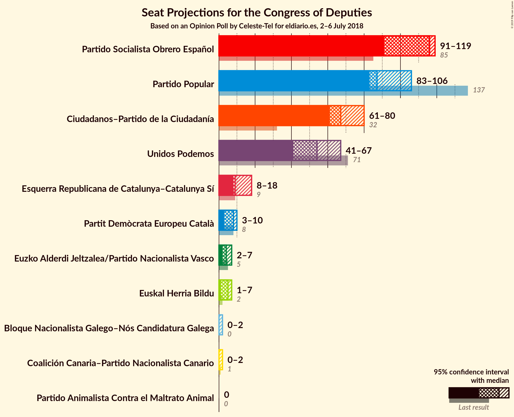
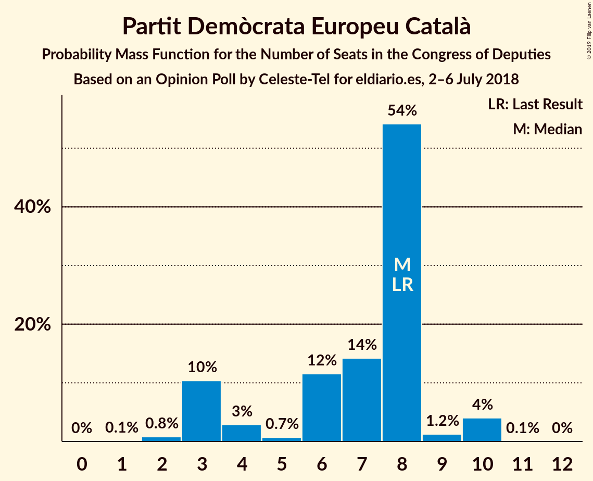
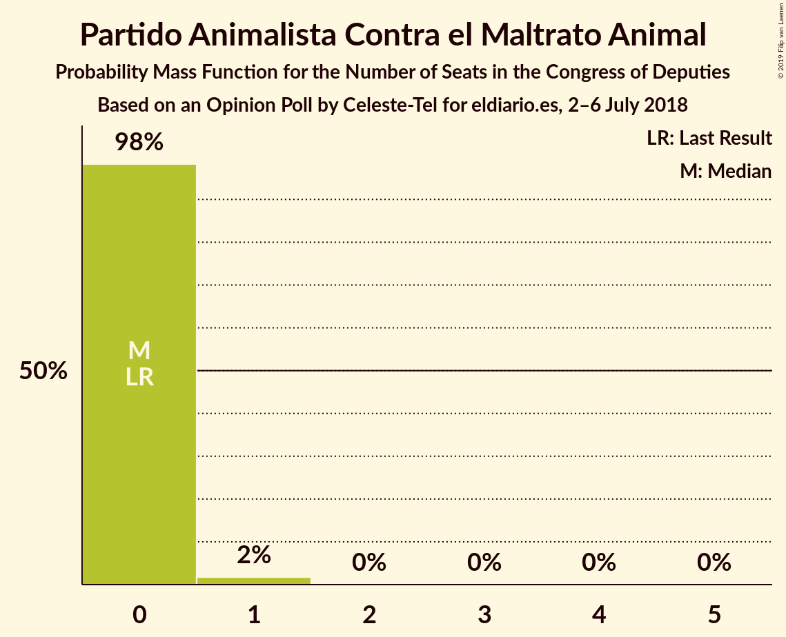
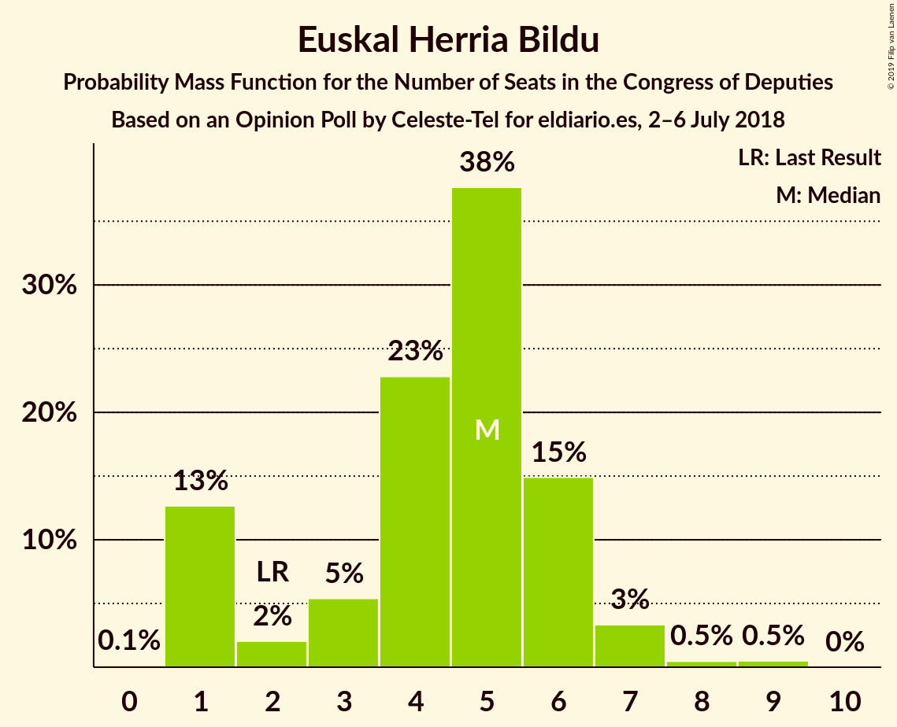
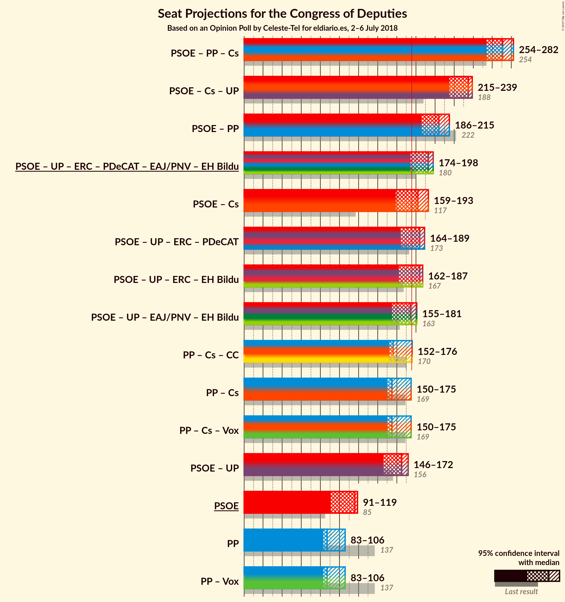
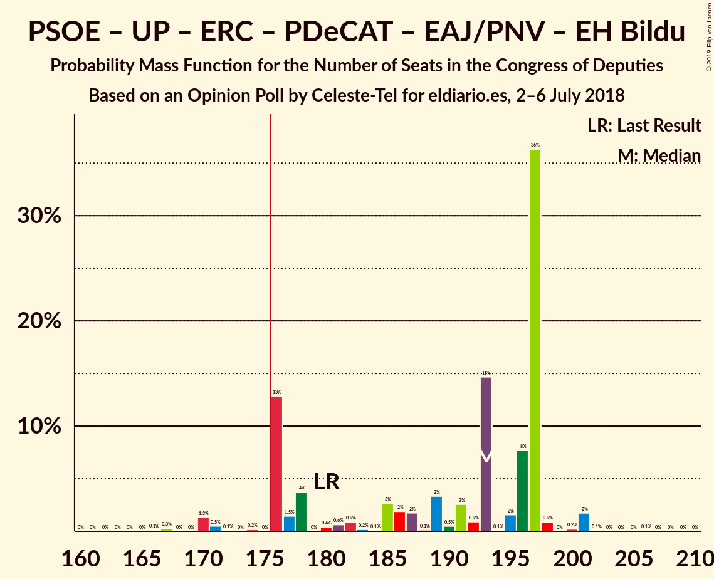
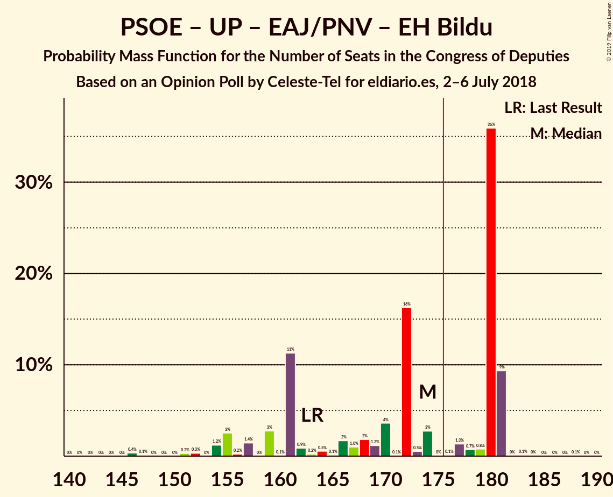
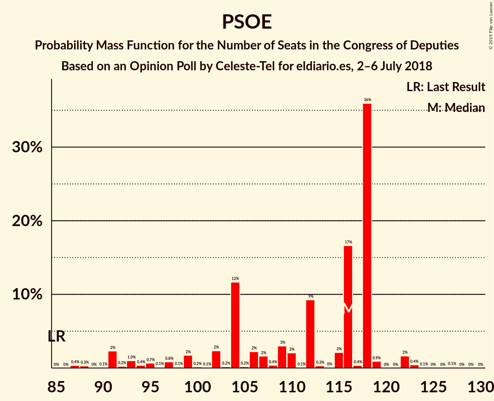

# Opinion Poll by Celeste-Tel for eldiario.es, 2–6 July 2018

<a href="#voting-intentions">Voting Intentions</a> | <a href="#seats">Seats</a> | <a href="#coalitions">Coalitions</a> | <a href="#technical-information">Technical Information</a>

## Voting Intentions

### Confidence Intervals

| Party | Last Result | Poll Result | 80% Confidence Interval | 90% Confidence Interval | 95% Confidence Interval | 99% Confidence Interval |
|:-----:|:-----------:|:-----------:|:-----------------------:|:-----------------------:|:-----------------------:|:-----------------------:|
| Partido Socialista Obrero Español | 22.6% | 27.1% | 25.4–28.9% |25.0–29.4% |24.5–29.8% |23.8–30.7% |
| Partido Popular | 33.0% | 24.2% | 22.6–25.9% |22.1–26.4% |21.7–26.8% |21.0–27.6% |
| Ciudadanos–Partido de la Ciudadanía | 13.1% | 20.6% | 19.1–22.3% |18.7–22.7% |18.3–23.1% |17.6–23.9% |
| Unidos Podemos | 21.2% | 17.7% | 16.3–19.3% |15.9–19.7% |15.6–20.1% |14.9–20.9% |
| Esquerra Republicana de Catalunya–Catalunya Sí | 2.7% | 3.1% | 2.5–3.9% |2.3–4.1% |2.2–4.3% |2.0–4.7% |
| Partit Demòcrata Europeu Català | 2.0% | 1.6% | 1.2–2.3% |1.1–2.4% |1.0–2.6% |0.9–2.9% |
| Euzko Alderdi Jeltzalea/Partido Nacionalista Vasco | 1.2% | 1.1% | 0.8–1.6% |0.7–1.8% |0.6–1.9% |0.5–2.2% |
| Partido Animalista Contra el Maltrato Animal | 1.2% | 1.1% | 0.8–1.6% |0.7–1.8% |0.6–1.9% |0.5–2.2% |
| Euskal Herria Bildu | 0.8% | 0.9% | 0.6–1.4% |0.5–1.5% |0.5–1.7% |0.4–1.9% |
| Coalición Canaria–Partido Nacionalista Canario | 0.3% | 0.3% | 0.2–0.6% |0.1–0.7% |0.1–0.8% |0.1–1.0% |
| Bloque Nacionalista Galego–Nós Candidatura Galega | 0.2% | 0.2% | 0.1–0.5% |0.1–0.6% |0.0–0.7% |0.0–0.9% |

*Note:* The poll result column reflects the actual value used in the calculations. Published results may vary slightly, and in addition be rounded to fewer digits.

## Seats

### Confidence Intervals

| Party | Last Result | Median | 80% Confidence Interval | 90% Confidence Interval | 95% Confidence Interval | 99% Confidence Interval |
|:-----:|:-----------:|:------:|:-----------------------:|:-----------------------:|:-----------------------:|:-----------------------:|
| <a href="#partido-socialista-obrero-español">Partido Socialista Obrero Español</a> | 85 | 99 | 99–110 |99–110 |99–110 |99–123 |
| <a href="#partido-popular">Partido Popular</a> | 137 | 104 | 92–104 |92–104 |92–104 |90–113 |
| <a href="#ciudadanos–partido-de-la-ciudadanía">Ciudadanos–Partido de la Ciudadanía</a> | 32 | 59 | 59–66 |59–66 |59–67 |59–71 |
| <a href="#unidos-podemos">Unidos Podemos</a> | 71 | 62 | 43–62 |43–62 |43–62 |35–62 |
| <a href="#esquerra-republicana-de-catalunya–catalunya-sí">Esquerra Republicana de Catalunya–Catalunya Sí</a> | 9 | 11 | 11–14 |11–14 |11–14 |10–15 |
| <a href="#partit-demòcrata-europeu-català">Partit Demòcrata Europeu Català</a> | 8 | 3 | 3–10 |3–10 |3–10 |3–10 |
| <a href="#euzko-alderdi-jeltzalea/partido-nacionalista-vasco">Euzko Alderdi Jeltzalea/Partido Nacionalista Vasco</a> | 5 | 6 | 6 |6 |6 |1–6 |
| <a href="#partido-animalista-contra-el-maltrato-animal">Partido Animalista Contra el Maltrato Animal</a> | 0 | 0 | 0 |0 |0 |0–1 |
| <a href="#euskal-herria-bildu">Euskal Herria Bildu</a> | 2 | 2 | 2–6 |2–6 |2–6 |2–7 |
| <a href="#coalición-canaria–partido-nacionalista-canario">Coalición Canaria–Partido Nacionalista Canario</a> | 1 | 4 | 3–4 |3–4 |2–4 |1–4 |
| <a href="#bloque-nacionalista-galego–nós-candidatura-galega">Bloque Nacionalista Galego–Nós Candidatura Galega</a> | 0 | 0 | 0 |0 |0 |0–4 |

### Partido Socialista Obrero Español

*For a full overview of the results for this party, see the [Partido Socialista Obrero Español](party-partidosocialistaobreroespañol.html) page.*

| Number of Seats | Probability | Accumulated | Special Marks |
|:---------------:|:-----------:|:-----------:|:-------------:|
| 84 | 0.2% | 100% |  |
| 85 | 0% | 99.8% | Last Result |
| 86 | 0% | 99.8% |  |
| 87 | 0% | 99.8% |  |
| 88 | 0% | 99.8% |  |
| 89 | 0.1% | 99.8% |  |
| 90 | 0% | 99.6% |  |
| 91 | 0% | 99.6% |  |
| 92 | 0% | 99.6% |  |
| 93 | 0% | 99.6% |  |
| 94 | 0% | 99.6% |  |
| 95 | 0% | 99.6% |  |
| 96 | 0% | 99.6% |  |
| 97 | 0% | 99.6% |  |
| 98 | 0% | 99.6% |  |
| 99 | 76% | 99.6% | Median |
| 100 | 0.9% | 23% |  |
| 101 | 0% | 22% |  |
| 102 | 0% | 22% |  |
| 103 | 0% | 22% |  |
| 104 | 0% | 22% |  |
| 105 | 0% | 22% |  |
| 106 | 0.3% | 22% |  |
| 107 | 0% | 22% |  |
| 108 | 0% | 22% |  |
| 109 | 0% | 22% |  |
| 110 | 21% | 22% |  |
| 111 | 0% | 1.4% |  |
| 112 | 0% | 1.4% |  |
| 113 | 0% | 1.4% |  |
| 114 | 0% | 1.4% |  |
| 115 | 0% | 1.4% |  |
| 116 | 0% | 1.4% |  |
| 117 | 0% | 1.3% |  |
| 118 | 0% | 1.3% |  |
| 119 | 0% | 1.3% |  |
| 120 | 0% | 1.3% |  |
| 121 | 0% | 1.3% |  |
| 122 | 0% | 1.3% |  |
| 123 | 1.2% | 1.3% |  |
| 124 | 0% | 0.1% |  |
| 125 | 0% | 0.1% |  |
| 126 | 0.1% | 0.1% |  |
| 127 | 0% | 0% |  |

### Partido Popular

*For a full overview of the results for this party, see the [Partido Popular](party-partidopopular.html) page.*

| Number of Seats | Probability | Accumulated | Special Marks |
|:---------------:|:-----------:|:-----------:|:-------------:|
| 89 | 0.1% | 100% |  |
| 90 | 1.2% | 99.9% |  |
| 91 | 0% | 98.7% |  |
| 92 | 21% | 98.7% |  |
| 93 | 0% | 78% |  |
| 94 | 0% | 78% |  |
| 95 | 0% | 78% |  |
| 96 | 0.1% | 78% |  |
| 97 | 0% | 78% |  |
| 98 | 0% | 78% |  |
| 99 | 0% | 78% |  |
| 100 | 0% | 78% |  |
| 101 | 0% | 78% |  |
| 102 | 0% | 78% |  |
| 103 | 0% | 78% |  |
| 104 | 76% | 78% | Median |
| 105 | 0% | 1.4% |  |
| 106 | 0% | 1.4% |  |
| 107 | 0% | 1.4% |  |
| 108 | 0% | 1.4% |  |
| 109 | 0.9% | 1.4% |  |
| 110 | 0% | 0.5% |  |
| 111 | 0% | 0.5% |  |
| 112 | 0% | 0.5% |  |
| 113 | 0.3% | 0.5% |  |
| 114 | 0% | 0.2% |  |
| 115 | 0% | 0.2% |  |
| 116 | 0% | 0.2% |  |
| 117 | 0% | 0.2% |  |
| 118 | 0% | 0.2% |  |
| 119 | 0% | 0.2% |  |
| 120 | 0.2% | 0.2% |  |
| 121 | 0% | 0% |  |
| 122 | 0% | 0% |  |
| 123 | 0% | 0% |  |
| 124 | 0% | 0% |  |
| 125 | 0% | 0% |  |
| 126 | 0% | 0% |  |
| 127 | 0% | 0% |  |
| 128 | 0% | 0% |  |
| 129 | 0% | 0% |  |
| 130 | 0% | 0% |  |
| 131 | 0% | 0% |  |
| 132 | 0% | 0% |  |
| 133 | 0% | 0% |  |
| 134 | 0% | 0% |  |
| 135 | 0% | 0% |  |
| 136 | 0% | 0% |  |
| 137 | 0% | 0% | Last Result |

### Ciudadanos–Partido de la Ciudadanía

*For a full overview of the results for this party, see the [Ciudadanos–Partido de la Ciudadanía](party-ciudadanos–partidodelaciudadanía.html) page.*

| Number of Seats | Probability | Accumulated | Special Marks |
|:---------------:|:-----------:|:-----------:|:-------------:|
| 32 | 0% | 100% | Last Result |
| 33 | 0% | 100% |  |
| 34 | 0% | 100% |  |
| 35 | 0% | 100% |  |
| 36 | 0% | 100% |  |
| 37 | 0% | 100% |  |
| 38 | 0% | 100% |  |
| 39 | 0% | 100% |  |
| 40 | 0% | 100% |  |
| 41 | 0% | 100% |  |
| 42 | 0% | 100% |  |
| 43 | 0% | 100% |  |
| 44 | 0% | 100% |  |
| 45 | 0% | 100% |  |
| 46 | 0% | 100% |  |
| 47 | 0% | 100% |  |
| 48 | 0% | 100% |  |
| 49 | 0% | 100% |  |
| 50 | 0% | 100% |  |
| 51 | 0% | 100% |  |
| 52 | 0.1% | 100% |  |
| 53 | 0% | 99.9% |  |
| 54 | 0% | 99.9% |  |
| 55 | 0% | 99.9% |  |
| 56 | 0% | 99.9% |  |
| 57 | 0% | 99.9% |  |
| 58 | 0% | 99.9% |  |
| 59 | 76% | 99.9% | Median |
| 60 | 0% | 23% |  |
| 61 | 0% | 23% |  |
| 62 | 0.3% | 23% |  |
| 63 | 0% | 23% |  |
| 64 | 0% | 23% |  |
| 65 | 0% | 23% |  |
| 66 | 21% | 23% |  |
| 67 | 0.1% | 3% |  |
| 68 | 0% | 2% |  |
| 69 | 1.2% | 2% |  |
| 70 | 0% | 1.2% |  |
| 71 | 0.9% | 1.2% |  |
| 72 | 0% | 0.3% |  |
| 73 | 0.2% | 0.3% |  |
| 74 | 0% | 0.1% |  |
| 75 | 0% | 0.1% |  |
| 76 | 0% | 0.1% |  |
| 77 | 0% | 0.1% |  |
| 78 | 0% | 0.1% |  |
| 79 | 0% | 0.1% |  |
| 80 | 0% | 0.1% |  |
| 81 | 0% | 0% |  |

### Unidos Podemos

*For a full overview of the results for this party, see the [Unidos Podemos](party-unidospodemos.html) page.*

| Number of Seats | Probability | Accumulated | Special Marks |
|:---------------:|:-----------:|:-----------:|:-------------:|
| 35 | 0.9% | 100% |  |
| 36 | 0% | 99.1% |  |
| 37 | 0.3% | 99.1% |  |
| 38 | 0% | 98.8% |  |
| 39 | 0% | 98.8% |  |
| 40 | 0% | 98.8% |  |
| 41 | 1.2% | 98.8% |  |
| 42 | 0% | 98% |  |
| 43 | 21% | 98% |  |
| 44 | 0% | 77% |  |
| 45 | 0% | 77% |  |
| 46 | 0.1% | 77% |  |
| 47 | 0.2% | 77% |  |
| 48 | 0% | 77% |  |
| 49 | 0% | 77% |  |
| 50 | 0% | 77% |  |
| 51 | 0% | 77% |  |
| 52 | 0% | 77% |  |
| 53 | 0% | 77% |  |
| 54 | 0% | 77% |  |
| 55 | 0% | 77% |  |
| 56 | 0% | 77% |  |
| 57 | 0% | 77% |  |
| 58 | 0% | 77% |  |
| 59 | 0% | 77% |  |
| 60 | 0% | 77% |  |
| 61 | 0% | 77% |  |
| 62 | 76% | 77% | Median |
| 63 | 0% | 0.1% |  |
| 64 | 0.1% | 0.1% |  |
| 65 | 0% | 0% |  |
| 66 | 0% | 0% |  |
| 67 | 0% | 0% |  |
| 68 | 0% | 0% |  |
| 69 | 0% | 0% |  |
| 70 | 0% | 0% |  |
| 71 | 0% | 0% | Last Result |

### Esquerra Republicana de Catalunya–Catalunya Sí

*For a full overview of the results for this party, see the [Esquerra Republicana de Catalunya–Catalunya Sí](party-esquerrarepublicanadecatalunya–catalunyasí.html) page.*

| Number of Seats | Probability | Accumulated | Special Marks |
|:---------------:|:-----------:|:-----------:|:-------------:|
| 8 | 0% | 100% |  |
| 9 | 0.1% | 99.9% | Last Result |
| 10 | 1.2% | 99.8% |  |
| 11 | 77% | 98.6% | Median |
| 12 | 0% | 22% |  |
| 13 | 0% | 22% |  |
| 14 | 21% | 22% |  |
| 15 | 0.9% | 1.0% |  |
| 16 | 0% | 0.1% |  |
| 17 | 0.1% | 0.1% |  |
| 18 | 0% | 0% |  |

### Partit Demòcrata Europeu Català

*For a full overview of the results for this party, see the [Partit Demòcrata Europeu Català](party-partitdemòcrataeuropeucatalà.html) page.*

| Number of Seats | Probability | Accumulated | Special Marks |
|:---------------:|:-----------:|:-----------:|:-------------:|
| 3 | 76% | 100% | Median |
| 4 | 0.1% | 24% |  |
| 5 | 1.2% | 23% |  |
| 6 | 1.4% | 22% |  |
| 7 | 0% | 21% |  |
| 8 | 0% | 21% | Last Result |
| 9 | 0% | 21% |  |
| 10 | 21% | 21% |  |
| 11 | 0% | 0% |  |

### Euzko Alderdi Jeltzalea/Partido Nacionalista Vasco

*For a full overview of the results for this party, see the [Euzko Alderdi Jeltzalea/Partido Nacionalista Vasco](party-euzkoalderdijeltzaleapartidonacionalistavasco.html) page.*

| Number of Seats | Probability | Accumulated | Special Marks |
|:---------------:|:-----------:|:-----------:|:-------------:|
| 1 | 1.2% | 100% |  |
| 2 | 0% | 98.8% |  |
| 3 | 0% | 98.8% |  |
| 4 | 0% | 98.8% |  |
| 5 | 0.3% | 98.7% | Last Result |
| 6 | 98% | 98% | Median |
| 7 | 0.4% | 0.5% |  |
| 8 | 0% | 0% |  |

### Partido Animalista Contra el Maltrato Animal

*For a full overview of the results for this party, see the [Partido Animalista Contra el Maltrato Animal](party-partidoanimalistacontraelmaltratoanimal.html) page.*

| Number of Seats | Probability | Accumulated | Special Marks |
|:---------------:|:-----------:|:-----------:|:-------------:|
| 0 | 98.8% | 100% | Last Result, Median |
| 1 | 1.2% | 1.2% |  |
| 2 | 0% | 0% |  |

### Euskal Herria Bildu

*For a full overview of the results for this party, see the [Euskal Herria Bildu](party-euskalherriabildu.html) page.*

| Number of Seats | Probability | Accumulated | Special Marks |
|:---------------:|:-----------:|:-----------:|:-------------:|
| 1 | 0.2% | 100% |  |
| 2 | 76% | 99.7% | Last Result, Median |
| 3 | 0% | 23% |  |
| 4 | 0.9% | 23% |  |
| 5 | 0.2% | 22% |  |
| 6 | 21% | 22% |  |
| 7 | 1.3% | 2% |  |
| 8 | 0.3% | 0.3% |  |
| 9 | 0% | 0% |  |

### Coalición Canaria–Partido Nacionalista Canario

*For a full overview of the results for this party, see the [Coalición Canaria–Partido Nacionalista Canario](party-coalicióncanaria–partidonacionalistacanario.html) page.*

| Number of Seats | Probability | Accumulated | Special Marks |
|:---------------:|:-----------:|:-----------:|:-------------:|
| 0 | 0.3% | 100% |  |
| 1 | 1.3% | 99.7% | Last Result |
| 2 | 1.2% | 98% |  |
| 3 | 21% | 97% |  |
| 4 | 77% | 77% | Median |
| 5 | 0% | 0% |  |

### Bloque Nacionalista Galego–Nós Candidatura Galega

*For a full overview of the results for this party, see the [Bloque Nacionalista Galego–Nós Candidatura Galega](party-bloquenacionalistagalego–nóscandidaturagalega.html) page.*

| Number of Seats | Probability | Accumulated | Special Marks |
|:---------------:|:-----------:|:-----------:|:-------------:|
| 0 | 99.0% | 100% | Last Result, Median |
| 1 | 0% | 1.0% |  |
| 2 | 0.1% | 1.0% |  |
| 3 | 0% | 0.9% |  |
| 4 | 0.9% | 0.9% |  |
| 5 | 0% | 0% |  |

## Coalitions

### Confidence Intervals

| Coalition | Last Result | Median | Majority? | 80% Confidence Interval | 90% Confidence Interval | 95% Confidence Interval | 99% Confidence Interval |
|:---------:|:-----------:|:------:|:---------:|:-----------------------:|:-----------------------:|:-----------------------:|:-----------------------:|
| Partido Socialista Obrero Español – Partido Popular – Ciudadanos–Partido de la Ciudadanía | 254 | 262 | 100% | 262–268 | 262–268 | 262–277 | 262–282 |
| Partido Socialista Obrero Español – Ciudadanos–Partido de la Ciudadanía – Unidos Podemos | 188 | 220 | 100% | 219–220 | 219–220 | 219–220 | 205–233 |
| Partido Socialista Obrero Español – Partido Popular | 222 | 203 | 100% | 202–203 | 202–203 | 202–209 | 202–213 |
| Partido Socialista Obrero Español – Unidos Podemos – Esquerra Republicana de Catalunya–Catalunya Sí – Partit Demòcrata Europeu Català – Euzko Alderdi Jeltzalea/Partido Nacionalista Vasco – Euskal Herria Bildu | 180 | 183 | 98.5% | 183–189 | 183–189 | 183–189 | 165–189 |
| Partido Socialista Obrero Español – Unidos Podemos – Esquerra Republicana de Catalunya–Catalunya Sí – Partit Demòcrata Europeu Català | 173 | 175 | 22% | 175–177 | 175–177 | 175–177 | 155–180 |
| Partido Socialista Obrero Español – Ciudadanos–Partido de la Ciudadanía | 117 | 158 | 22% | 158–176 | 158–176 | 158–176 | 158–192 |
| Partido Socialista Obrero Español – Unidos Podemos – Esquerra Republicana de Catalunya–Catalunya Sí – Euskal Herria Bildu | 167 | 174 | 1.4% | 173–174 | 173–174 | 173–174 | 154–181 |
| Partido Socialista Obrero Español – Unidos Podemos – Euzko Alderdi Jeltzalea/Partido Nacionalista Vasco – Euskal Herria Bildu | 163 | 169 | 0.1% | 165–169 | 165–169 | 165–169 | 145–172 |
| Partido Popular – Ciudadanos–Partido de la Ciudadanía – Coalición Canaria–Partido Nacionalista Canario | 170 | 167 | 1.1% | 161–167 | 161–167 | 161–167 | 161–181 |
| Partido Popular – Ciudadanos–Partido de la Ciudadanía | 169 | 163 | 1.1% | 158–163 | 158–163 | 158–163 | 158–180 |
| Partido Socialista Obrero Español – Unidos Podemos | 156 | 161 | 0% | 153–161 | 153–161 | 153–161 | 135–164 |
| Partido Socialista Obrero Español | 85 | 99 | 0% | 99–110 | 99–110 | 99–110 | 99–123 |
| Partido Popular | 137 | 104 | 0% | 92–104 | 92–104 | 92–104 | 90–113 |

### Partido Socialista Obrero Español – Partido Popular – Ciudadanos–Partido de la Ciudadanía

| Number of Seats | Probability | Accumulated | Special Marks |
|:---------------:|:-----------:|:-----------:|:-------------:|
| 252 | 0.1% | 100% |  |
| 253 | 0% | 99.9% |  |
| 254 | 0% | 99.9% | Last Result |
| 255 | 0% | 99.9% |  |
| 256 | 0% | 99.9% |  |
| 257 | 0% | 99.9% |  |
| 258 | 0% | 99.9% |  |
| 259 | 0% | 99.9% |  |
| 260 | 0% | 99.9% |  |
| 261 | 0% | 99.9% |  |
| 262 | 76% | 99.9% | Median |
| 263 | 0% | 23% |  |
| 264 | 0% | 23% |  |
| 265 | 0% | 23% |  |
| 266 | 0% | 23% |  |
| 267 | 0% | 23% |  |
| 268 | 21% | 23% |  |
| 269 | 0% | 3% |  |
| 270 | 0.1% | 3% |  |
| 271 | 0% | 3% |  |
| 272 | 0% | 3% |  |
| 273 | 0% | 3% |  |
| 274 | 0% | 3% |  |
| 275 | 0% | 3% |  |
| 276 | 0% | 3% |  |
| 277 | 0.2% | 3% |  |
| 278 | 0% | 2% |  |
| 279 | 0% | 2% |  |
| 280 | 0.9% | 2% |  |
| 281 | 0.3% | 2% |  |
| 282 | 1.2% | 1.2% |  |
| 283 | 0% | 0% |  |

### Partido Socialista Obrero Español – Ciudadanos–Partido de la Ciudadanía – Unidos Podemos

| Number of Seats | Probability | Accumulated | Special Marks |
|:---------------:|:-----------:|:-----------:|:-------------:|
| 188 | 0% | 100% | Last Result |
| 189 | 0% | 100% |  |
| 190 | 0% | 100% |  |
| 191 | 0% | 100% |  |
| 192 | 0% | 100% |  |
| 193 | 0% | 100% |  |
| 194 | 0% | 100% |  |
| 195 | 0% | 100% |  |
| 196 | 0% | 100% |  |
| 197 | 0% | 100% |  |
| 198 | 0% | 100% |  |
| 199 | 0% | 100% |  |
| 200 | 0% | 100% |  |
| 201 | 0% | 100% |  |
| 202 | 0% | 100% |  |
| 203 | 0% | 100% |  |
| 204 | 0.2% | 100% |  |
| 205 | 0.3% | 99.8% |  |
| 206 | 0.9% | 99.5% |  |
| 207 | 0% | 98.6% |  |
| 208 | 0% | 98.6% |  |
| 209 | 0% | 98.6% |  |
| 210 | 0% | 98.6% |  |
| 211 | 0% | 98.6% |  |
| 212 | 0% | 98.6% |  |
| 213 | 0% | 98.6% |  |
| 214 | 0% | 98.6% |  |
| 215 | 0% | 98.6% |  |
| 216 | 0% | 98.6% |  |
| 217 | 0% | 98.6% |  |
| 218 | 0% | 98.6% |  |
| 219 | 21% | 98.6% |  |
| 220 | 77% | 78% | Median |
| 221 | 0% | 1.4% |  |
| 222 | 0% | 1.4% |  |
| 223 | 0% | 1.4% |  |
| 224 | 0.1% | 1.4% |  |
| 225 | 0% | 1.3% |  |
| 226 | 0% | 1.3% |  |
| 227 | 0.1% | 1.3% |  |
| 228 | 0% | 1.3% |  |
| 229 | 0% | 1.3% |  |
| 230 | 0% | 1.2% |  |
| 231 | 0% | 1.2% |  |
| 232 | 0% | 1.2% |  |
| 233 | 1.2% | 1.2% |  |
| 234 | 0% | 0% |  |

### Partido Socialista Obrero Español – Partido Popular

| Number of Seats | Probability | Accumulated | Special Marks |
|:---------------:|:-----------:|:-----------:|:-------------:|
| 185 | 0.1% | 100% |  |
| 186 | 0% | 99.9% |  |
| 187 | 0% | 99.8% |  |
| 188 | 0% | 99.8% |  |
| 189 | 0% | 99.8% |  |
| 190 | 0% | 99.8% |  |
| 191 | 0% | 99.8% |  |
| 192 | 0% | 99.8% |  |
| 193 | 0% | 99.8% |  |
| 194 | 0% | 99.8% |  |
| 195 | 0% | 99.8% |  |
| 196 | 0% | 99.8% |  |
| 197 | 0% | 99.8% |  |
| 198 | 0% | 99.8% |  |
| 199 | 0% | 99.8% |  |
| 200 | 0% | 99.8% |  |
| 201 | 0% | 99.8% |  |
| 202 | 21% | 99.8% |  |
| 203 | 76% | 79% | Median |
| 204 | 0.2% | 3% |  |
| 205 | 0% | 3% |  |
| 206 | 0% | 3% |  |
| 207 | 0% | 3% |  |
| 208 | 0% | 3% |  |
| 209 | 0.9% | 3% |  |
| 210 | 0% | 2% |  |
| 211 | 0% | 2% |  |
| 212 | 0% | 2% |  |
| 213 | 1.2% | 2% |  |
| 214 | 0% | 0.4% |  |
| 215 | 0% | 0.4% |  |
| 216 | 0% | 0.4% |  |
| 217 | 0% | 0.4% |  |
| 218 | 0.1% | 0.4% |  |
| 219 | 0.3% | 0.3% |  |
| 220 | 0% | 0% |  |
| 221 | 0% | 0% |  |
| 222 | 0% | 0% | Last Result |

### Partido Socialista Obrero Español – Unidos Podemos – Esquerra Republicana de Catalunya–Catalunya Sí – Partit Demòcrata Europeu Català – Euzko Alderdi Jeltzalea/Partido Nacionalista Vasco – Euskal Herria Bildu

| Number of Seats | Probability | Accumulated | Special Marks |
|:---------------:|:-----------:|:-----------:|:-------------:|
| 156 | 0.2% | 100% |  |
| 157 | 0% | 99.8% |  |
| 158 | 0% | 99.8% |  |
| 159 | 0% | 99.8% |  |
| 160 | 0% | 99.8% |  |
| 161 | 0% | 99.8% |  |
| 162 | 0% | 99.8% |  |
| 163 | 0% | 99.8% |  |
| 164 | 0% | 99.8% |  |
| 165 | 0.9% | 99.8% |  |
| 166 | 0% | 98.9% |  |
| 167 | 0% | 98.9% |  |
| 168 | 0% | 98.9% |  |
| 169 | 0% | 98.9% |  |
| 170 | 0% | 98.9% |  |
| 171 | 0% | 98.8% |  |
| 172 | 0% | 98.8% |  |
| 173 | 0% | 98.8% |  |
| 174 | 0% | 98.8% |  |
| 175 | 0.3% | 98.8% |  |
| 176 | 0% | 98.5% | Majority |
| 177 | 0% | 98.5% |  |
| 178 | 0% | 98.5% |  |
| 179 | 0% | 98.5% |  |
| 180 | 0% | 98% | Last Result |
| 181 | 0% | 98% |  |
| 182 | 0% | 98% |  |
| 183 | 76% | 98% | Median |
| 184 | 0.1% | 22% |  |
| 185 | 0% | 22% |  |
| 186 | 0% | 22% |  |
| 187 | 0% | 22% |  |
| 188 | 1.2% | 22% |  |
| 189 | 21% | 21% |  |
| 190 | 0% | 0.1% |  |
| 191 | 0% | 0.1% |  |
| 192 | 0% | 0.1% |  |
| 193 | 0% | 0.1% |  |
| 194 | 0% | 0.1% |  |
| 195 | 0% | 0.1% |  |
| 196 | 0% | 0.1% |  |
| 197 | 0% | 0.1% |  |
| 198 | 0% | 0.1% |  |
| 199 | 0% | 0.1% |  |
| 200 | 0% | 0.1% |  |
| 201 | 0% | 0.1% |  |
| 202 | 0% | 0.1% |  |
| 203 | 0% | 0.1% |  |
| 204 | 0% | 0.1% |  |
| 205 | 0.1% | 0.1% |  |
| 206 | 0% | 0% |  |

### Partido Socialista Obrero Español – Unidos Podemos – Esquerra Republicana de Catalunya–Catalunya Sí – Partit Demòcrata Europeu Català

| Number of Seats | Probability | Accumulated | Special Marks |
|:---------------:|:-----------:|:-----------:|:-------------:|
| 148 | 0.2% | 100% |  |
| 149 | 0% | 99.8% |  |
| 150 | 0% | 99.8% |  |
| 151 | 0% | 99.8% |  |
| 152 | 0% | 99.8% |  |
| 153 | 0% | 99.8% |  |
| 154 | 0% | 99.8% |  |
| 155 | 0.9% | 99.8% |  |
| 156 | 0% | 98.9% |  |
| 157 | 0% | 98.9% |  |
| 158 | 0% | 98.9% |  |
| 159 | 0% | 98.9% |  |
| 160 | 0% | 98.9% |  |
| 161 | 0% | 98.9% |  |
| 162 | 0.3% | 98.9% |  |
| 163 | 0% | 98.6% |  |
| 164 | 0% | 98.6% |  |
| 165 | 0.1% | 98.6% |  |
| 166 | 0% | 98.5% |  |
| 167 | 0% | 98.5% |  |
| 168 | 0% | 98.5% |  |
| 169 | 0% | 98% |  |
| 170 | 0% | 98% |  |
| 171 | 0% | 98% |  |
| 172 | 0.1% | 98% |  |
| 173 | 0% | 98% | Last Result |
| 174 | 0% | 98% |  |
| 175 | 76% | 98% | Median |
| 176 | 0% | 22% | Majority |
| 177 | 21% | 22% |  |
| 178 | 0% | 1.4% |  |
| 179 | 0% | 1.4% |  |
| 180 | 1.2% | 1.4% |  |
| 181 | 0% | 0.1% |  |
| 182 | 0% | 0.1% |  |
| 183 | 0% | 0.1% |  |
| 184 | 0% | 0.1% |  |
| 185 | 0% | 0.1% |  |
| 186 | 0% | 0.1% |  |
| 187 | 0% | 0.1% |  |
| 188 | 0% | 0.1% |  |
| 189 | 0% | 0.1% |  |
| 190 | 0% | 0.1% |  |
| 191 | 0% | 0.1% |  |
| 192 | 0% | 0.1% |  |
| 193 | 0.1% | 0.1% |  |
| 194 | 0% | 0% |  |

### Partido Socialista Obrero Español – Ciudadanos–Partido de la Ciudadanía

| Number of Seats | Probability | Accumulated | Special Marks |
|:---------------:|:-----------:|:-----------:|:-------------:|
| 117 | 0% | 100% | Last Result |
| 118 | 0% | 100% |  |
| 119 | 0% | 100% |  |
| 120 | 0% | 100% |  |
| 121 | 0% | 100% |  |
| 122 | 0% | 100% |  |
| 123 | 0% | 100% |  |
| 124 | 0% | 100% |  |
| 125 | 0% | 100% |  |
| 126 | 0% | 100% |  |
| 127 | 0% | 100% |  |
| 128 | 0% | 100% |  |
| 129 | 0% | 100% |  |
| 130 | 0% | 100% |  |
| 131 | 0% | 100% |  |
| 132 | 0% | 100% |  |
| 133 | 0% | 100% |  |
| 134 | 0% | 100% |  |
| 135 | 0% | 100% |  |
| 136 | 0% | 100% |  |
| 137 | 0% | 100% |  |
| 138 | 0% | 100% |  |
| 139 | 0% | 100% |  |
| 140 | 0% | 100% |  |
| 141 | 0% | 100% |  |
| 142 | 0% | 100% |  |
| 143 | 0% | 100% |  |
| 144 | 0% | 100% |  |
| 145 | 0% | 100% |  |
| 146 | 0% | 100% |  |
| 147 | 0% | 100% |  |
| 148 | 0% | 100% |  |
| 149 | 0% | 100% |  |
| 150 | 0% | 100% |  |
| 151 | 0% | 100% |  |
| 152 | 0% | 100% |  |
| 153 | 0% | 100% |  |
| 154 | 0% | 100% |  |
| 155 | 0% | 100% |  |
| 156 | 0.1% | 100% |  |
| 157 | 0.2% | 99.9% |  |
| 158 | 76% | 99.7% | Median |
| 159 | 0% | 23% |  |
| 160 | 0% | 23% |  |
| 161 | 0% | 23% |  |
| 162 | 0% | 23% |  |
| 163 | 0% | 23% |  |
| 164 | 0% | 23% |  |
| 165 | 0% | 23% |  |
| 166 | 0% | 23% |  |
| 167 | 0% | 23% |  |
| 168 | 0.3% | 23% |  |
| 169 | 0% | 23% |  |
| 170 | 0% | 23% |  |
| 171 | 0.9% | 23% |  |
| 172 | 0% | 22% |  |
| 173 | 0% | 22% |  |
| 174 | 0% | 22% |  |
| 175 | 0% | 22% |  |
| 176 | 21% | 22% | Majority |
| 177 | 0% | 1.4% |  |
| 178 | 0.1% | 1.4% |  |
| 179 | 0% | 1.3% |  |
| 180 | 0% | 1.3% |  |
| 181 | 0% | 1.3% |  |
| 182 | 0% | 1.3% |  |
| 183 | 0% | 1.2% |  |
| 184 | 0% | 1.2% |  |
| 185 | 0% | 1.2% |  |
| 186 | 0% | 1.2% |  |
| 187 | 0% | 1.2% |  |
| 188 | 0% | 1.2% |  |
| 189 | 0% | 1.2% |  |
| 190 | 0% | 1.2% |  |
| 191 | 0% | 1.2% |  |
| 192 | 1.2% | 1.2% |  |
| 193 | 0% | 0% |  |

### Partido Socialista Obrero Español – Unidos Podemos – Esquerra Republicana de Catalunya–Catalunya Sí – Euskal Herria Bildu

| Number of Seats | Probability | Accumulated | Special Marks |
|:---------------:|:-----------:|:-----------:|:-------------:|
| 143 | 0.2% | 100% |  |
| 144 | 0% | 99.8% |  |
| 145 | 0% | 99.8% |  |
| 146 | 0% | 99.8% |  |
| 147 | 0% | 99.8% |  |
| 148 | 0% | 99.8% |  |
| 149 | 0% | 99.8% |  |
| 150 | 0% | 99.8% |  |
| 151 | 0% | 99.8% |  |
| 152 | 0% | 99.8% |  |
| 153 | 0% | 99.8% |  |
| 154 | 0.9% | 99.8% |  |
| 155 | 0% | 98.9% |  |
| 156 | 0% | 98.9% |  |
| 157 | 0% | 98.9% |  |
| 158 | 0% | 98.9% |  |
| 159 | 0% | 98.9% |  |
| 160 | 0% | 98.9% |  |
| 161 | 0% | 98.9% |  |
| 162 | 0% | 98.8% |  |
| 163 | 0% | 98.8% |  |
| 164 | 0% | 98.8% |  |
| 165 | 0.3% | 98.8% |  |
| 166 | 0% | 98.5% |  |
| 167 | 0.1% | 98.5% | Last Result |
| 168 | 0% | 98% |  |
| 169 | 0% | 98% |  |
| 170 | 0% | 98% |  |
| 171 | 0% | 98% |  |
| 172 | 0% | 98% |  |
| 173 | 21% | 98% |  |
| 174 | 76% | 78% | Median |
| 175 | 0% | 1.4% |  |
| 176 | 0% | 1.4% | Majority |
| 177 | 0% | 1.4% |  |
| 178 | 0% | 1.4% |  |
| 179 | 0% | 1.4% |  |
| 180 | 0% | 1.3% |  |
| 181 | 1.2% | 1.3% |  |
| 182 | 0% | 0.1% |  |
| 183 | 0% | 0.1% |  |
| 184 | 0% | 0.1% |  |
| 185 | 0% | 0.1% |  |
| 186 | 0% | 0.1% |  |
| 187 | 0% | 0.1% |  |
| 188 | 0% | 0.1% |  |
| 189 | 0% | 0.1% |  |
| 190 | 0% | 0.1% |  |
| 191 | 0% | 0.1% |  |
| 192 | 0% | 0.1% |  |
| 193 | 0% | 0.1% |  |
| 194 | 0.1% | 0.1% |  |
| 195 | 0% | 0% |  |

### Partido Socialista Obrero Español – Unidos Podemos – Euzko Alderdi Jeltzalea/Partido Nacionalista Vasco – Euskal Herria Bildu

| Number of Seats | Probability | Accumulated | Special Marks |
|:---------------:|:-----------:|:-----------:|:-------------:|
| 139 | 0.2% | 100% |  |
| 140 | 0% | 99.8% |  |
| 141 | 0% | 99.8% |  |
| 142 | 0% | 99.8% |  |
| 143 | 0% | 99.8% |  |
| 144 | 0% | 99.8% |  |
| 145 | 0.9% | 99.8% |  |
| 146 | 0% | 98.9% |  |
| 147 | 0% | 98.9% |  |
| 148 | 0% | 98.9% |  |
| 149 | 0% | 98.9% |  |
| 150 | 0% | 98.9% |  |
| 151 | 0% | 98.9% |  |
| 152 | 0% | 98.9% |  |
| 153 | 0% | 98.9% |  |
| 154 | 0% | 98.9% |  |
| 155 | 0% | 98.8% |  |
| 156 | 0.3% | 98.8% |  |
| 157 | 0% | 98.5% |  |
| 158 | 0% | 98.5% |  |
| 159 | 0% | 98.5% |  |
| 160 | 0% | 98.5% |  |
| 161 | 0% | 98.5% |  |
| 162 | 0% | 98.5% |  |
| 163 | 0% | 98% | Last Result |
| 164 | 0% | 98% |  |
| 165 | 21% | 98% |  |
| 166 | 0% | 78% |  |
| 167 | 0% | 78% |  |
| 168 | 0% | 78% |  |
| 169 | 76% | 78% | Median |
| 170 | 0% | 1.4% |  |
| 171 | 0% | 1.4% |  |
| 172 | 1.2% | 1.4% |  |
| 173 | 0% | 0.1% |  |
| 174 | 0% | 0.1% |  |
| 175 | 0% | 0.1% |  |
| 176 | 0% | 0.1% | Majority |
| 177 | 0% | 0.1% |  |
| 178 | 0% | 0.1% |  |
| 179 | 0% | 0.1% |  |
| 180 | 0% | 0.1% |  |
| 181 | 0% | 0.1% |  |
| 182 | 0% | 0.1% |  |
| 183 | 0% | 0.1% |  |
| 184 | 0.1% | 0.1% |  |
| 185 | 0% | 0% |  |

### Partido Popular – Ciudadanos–Partido de la Ciudadanía – Coalición Canaria–Partido Nacionalista Canario

| Number of Seats | Probability | Accumulated | Special Marks |
|:---------------:|:-----------:|:-----------:|:-------------:|
| 145 | 0.1% | 100% |  |
| 146 | 0% | 99.9% |  |
| 147 | 0% | 99.9% |  |
| 148 | 0% | 99.9% |  |
| 149 | 0% | 99.9% |  |
| 150 | 0% | 99.9% |  |
| 151 | 0% | 99.9% |  |
| 152 | 0% | 99.9% |  |
| 153 | 0% | 99.9% |  |
| 154 | 0% | 99.9% |  |
| 155 | 0% | 99.9% |  |
| 156 | 0% | 99.9% |  |
| 157 | 0% | 99.9% |  |
| 158 | 0% | 99.9% |  |
| 159 | 0% | 99.9% |  |
| 160 | 0% | 99.9% |  |
| 161 | 22% | 99.9% |  |
| 162 | 0% | 78% |  |
| 163 | 0% | 78% |  |
| 164 | 0.1% | 78% |  |
| 165 | 0% | 78% |  |
| 166 | 0% | 78% |  |
| 167 | 76% | 78% | Median |
| 168 | 0% | 2% |  |
| 169 | 0% | 1.5% |  |
| 170 | 0% | 1.5% | Last Result |
| 171 | 0% | 1.5% |  |
| 172 | 0% | 1.5% |  |
| 173 | 0% | 1.5% |  |
| 174 | 0% | 1.5% |  |
| 175 | 0.3% | 1.5% |  |
| 176 | 0% | 1.1% | Majority |
| 177 | 0% | 1.1% |  |
| 178 | 0% | 1.1% |  |
| 179 | 0% | 1.1% |  |
| 180 | 0% | 1.1% |  |
| 181 | 0.9% | 1.1% |  |
| 182 | 0% | 0.2% |  |
| 183 | 0% | 0.2% |  |
| 184 | 0% | 0.2% |  |
| 185 | 0% | 0.2% |  |
| 186 | 0% | 0.2% |  |
| 187 | 0% | 0.2% |  |
| 188 | 0% | 0.2% |  |
| 189 | 0% | 0.2% |  |
| 190 | 0% | 0.2% |  |
| 191 | 0% | 0.2% |  |
| 192 | 0% | 0.2% |  |
| 193 | 0% | 0.2% |  |
| 194 | 0.2% | 0.2% |  |
| 195 | 0% | 0% |  |

### Partido Popular – Ciudadanos–Partido de la Ciudadanía

| Number of Seats | Probability | Accumulated | Special Marks |
|:---------------:|:-----------:|:-----------:|:-------------:|
| 144 | 0.1% | 100% |  |
| 145 | 0% | 99.9% |  |
| 146 | 0% | 99.9% |  |
| 147 | 0% | 99.9% |  |
| 148 | 0% | 99.9% |  |
| 149 | 0% | 99.9% |  |
| 150 | 0% | 99.9% |  |
| 151 | 0% | 99.9% |  |
| 152 | 0% | 99.9% |  |
| 153 | 0% | 99.9% |  |
| 154 | 0% | 99.9% |  |
| 155 | 0% | 99.9% |  |
| 156 | 0% | 99.9% |  |
| 157 | 0% | 99.9% |  |
| 158 | 21% | 99.8% |  |
| 159 | 1.2% | 79% |  |
| 160 | 0% | 78% |  |
| 161 | 0% | 78% |  |
| 162 | 0% | 78% |  |
| 163 | 77% | 78% | Median |
| 164 | 0% | 2% |  |
| 165 | 0% | 2% |  |
| 166 | 0% | 2% |  |
| 167 | 0% | 2% |  |
| 168 | 0% | 2% |  |
| 169 | 0% | 1.5% | Last Result |
| 170 | 0% | 1.5% |  |
| 171 | 0% | 1.5% |  |
| 172 | 0% | 1.4% |  |
| 173 | 0% | 1.4% |  |
| 174 | 0% | 1.4% |  |
| 175 | 0.3% | 1.4% |  |
| 176 | 0% | 1.1% | Majority |
| 177 | 0% | 1.1% |  |
| 178 | 0% | 1.1% |  |
| 179 | 0% | 1.1% |  |
| 180 | 0.9% | 1.1% |  |
| 181 | 0% | 0.2% |  |
| 182 | 0% | 0.2% |  |
| 183 | 0% | 0.2% |  |
| 184 | 0% | 0.2% |  |
| 185 | 0% | 0.2% |  |
| 186 | 0% | 0.2% |  |
| 187 | 0% | 0.2% |  |
| 188 | 0% | 0.2% |  |
| 189 | 0% | 0.2% |  |
| 190 | 0% | 0.2% |  |
| 191 | 0% | 0.2% |  |
| 192 | 0% | 0.2% |  |
| 193 | 0.2% | 0.2% |  |
| 194 | 0% | 0% |  |

### Partido Socialista Obrero Español – Unidos Podemos

| Number of Seats | Probability | Accumulated | Special Marks |
|:---------------:|:-----------:|:-----------:|:-------------:|
| 131 | 0.2% | 100% |  |
| 132 | 0% | 99.8% |  |
| 133 | 0% | 99.8% |  |
| 134 | 0% | 99.8% |  |
| 135 | 0.9% | 99.8% |  |
| 136 | 0% | 98.9% |  |
| 137 | 0% | 98.9% |  |
| 138 | 0% | 98.9% |  |
| 139 | 0% | 98.9% |  |
| 140 | 0% | 98.9% |  |
| 141 | 0% | 98.9% |  |
| 142 | 0% | 98.9% |  |
| 143 | 0.3% | 98.9% |  |
| 144 | 0% | 98.6% |  |
| 145 | 0% | 98.6% |  |
| 146 | 0% | 98.6% |  |
| 147 | 0% | 98.5% |  |
| 148 | 0% | 98.5% |  |
| 149 | 0% | 98.5% |  |
| 150 | 0% | 98.5% |  |
| 151 | 0% | 98.5% |  |
| 152 | 0% | 98.5% |  |
| 153 | 21% | 98% |  |
| 154 | 0% | 78% |  |
| 155 | 0% | 78% |  |
| 156 | 0% | 78% | Last Result |
| 157 | 0% | 78% |  |
| 158 | 0% | 78% |  |
| 159 | 0% | 78% |  |
| 160 | 0% | 78% |  |
| 161 | 76% | 78% | Median |
| 162 | 0% | 1.4% |  |
| 163 | 0% | 1.4% |  |
| 164 | 1.2% | 1.3% |  |
| 165 | 0% | 0.1% |  |
| 166 | 0% | 0.1% |  |
| 167 | 0% | 0.1% |  |
| 168 | 0% | 0.1% |  |
| 169 | 0% | 0.1% |  |
| 170 | 0% | 0.1% |  |
| 171 | 0% | 0.1% |  |
| 172 | 0.1% | 0.1% |  |
| 173 | 0% | 0% |  |

### Partido Socialista Obrero Español

| Number of Seats | Probability | Accumulated | Special Marks |
|:---------------:|:-----------:|:-----------:|:-------------:|
| 84 | 0.2% | 100% |  |
| 85 | 0% | 99.8% | Last Result |
| 86 | 0% | 99.8% |  |
| 87 | 0% | 99.8% |  |
| 88 | 0% | 99.8% |  |
| 89 | 0.1% | 99.8% |  |
| 90 | 0% | 99.6% |  |
| 91 | 0% | 99.6% |  |
| 92 | 0% | 99.6% |  |
| 93 | 0% | 99.6% |  |
| 94 | 0% | 99.6% |  |
| 95 | 0% | 99.6% |  |
| 96 | 0% | 99.6% |  |
| 97 | 0% | 99.6% |  |
| 98 | 0% | 99.6% |  |
| 99 | 76% | 99.6% | Median |
| 100 | 0.9% | 23% |  |
| 101 | 0% | 22% |  |
| 102 | 0% | 22% |  |
| 103 | 0% | 22% |  |
| 104 | 0% | 22% |  |
| 105 | 0% | 22% |  |
| 106 | 0.3% | 22% |  |
| 107 | 0% | 22% |  |
| 108 | 0% | 22% |  |
| 109 | 0% | 22% |  |
| 110 | 21% | 22% |  |
| 111 | 0% | 1.4% |  |
| 112 | 0% | 1.4% |  |
| 113 | 0% | 1.4% |  |
| 114 | 0% | 1.4% |  |
| 115 | 0% | 1.4% |  |
| 116 | 0% | 1.4% |  |
| 117 | 0% | 1.3% |  |
| 118 | 0% | 1.3% |  |
| 119 | 0% | 1.3% |  |
| 120 | 0% | 1.3% |  |
| 121 | 0% | 1.3% |  |
| 122 | 0% | 1.3% |  |
| 123 | 1.2% | 1.3% |  |
| 124 | 0% | 0.1% |  |
| 125 | 0% | 0.1% |  |
| 126 | 0.1% | 0.1% |  |
| 127 | 0% | 0% |  |

### Partido Popular

| Number of Seats | Probability | Accumulated | Special Marks |
|:---------------:|:-----------:|:-----------:|:-------------:|
| 89 | 0.1% | 100% |  |
| 90 | 1.2% | 99.9% |  |
| 91 | 0% | 98.7% |  |
| 92 | 21% | 98.7% |  |
| 93 | 0% | 78% |  |
| 94 | 0% | 78% |  |
| 95 | 0% | 78% |  |
| 96 | 0.1% | 78% |  |
| 97 | 0% | 78% |  |
| 98 | 0% | 78% |  |
| 99 | 0% | 78% |  |
| 100 | 0% | 78% |  |
| 101 | 0% | 78% |  |
| 102 | 0% | 78% |  |
| 103 | 0% | 78% |  |
| 104 | 76% | 78% | Median |
| 105 | 0% | 1.4% |  |
| 106 | 0% | 1.4% |  |
| 107 | 0% | 1.4% |  |
| 108 | 0% | 1.4% |  |
| 109 | 0.9% | 1.4% |  |
| 110 | 0% | 0.5% |  |
| 111 | 0% | 0.5% |  |
| 112 | 0% | 0.5% |  |
| 113 | 0.3% | 0.5% |  |
| 114 | 0% | 0.2% |  |
| 115 | 0% | 0.2% |  |
| 116 | 0% | 0.2% |  |
| 117 | 0% | 0.2% |  |
| 118 | 0% | 0.2% |  |
| 119 | 0% | 0.2% |  |
| 120 | 0.2% | 0.2% |  |
| 121 | 0% | 0% |  |
| 122 | 0% | 0% |  |
| 123 | 0% | 0% |  |
| 124 | 0% | 0% |  |
| 125 | 0% | 0% |  |
| 126 | 0% | 0% |  |
| 127 | 0% | 0% |  |
| 128 | 0% | 0% |  |
| 129 | 0% | 0% |  |
| 130 | 0% | 0% |  |
| 131 | 0% | 0% |  |
| 132 | 0% | 0% |  |
| 133 | 0% | 0% |  |
| 134 | 0% | 0% |  |
| 135 | 0% | 0% |  |
| 136 | 0% | 0% |  |
| 137 | 0% | 0% | Last Result |

## Technical Information

### Opinion Poll

+ **Polling firm:** Celeste-Tel
+ **Commissioner(s):** eldiario.es
+ **Fieldwork period:** 2–6 July 2018

### Calculations

+ **Sample size:** 1100
+ **Simulations done:** 1,024
+ **Error estimate:** 4.25%

