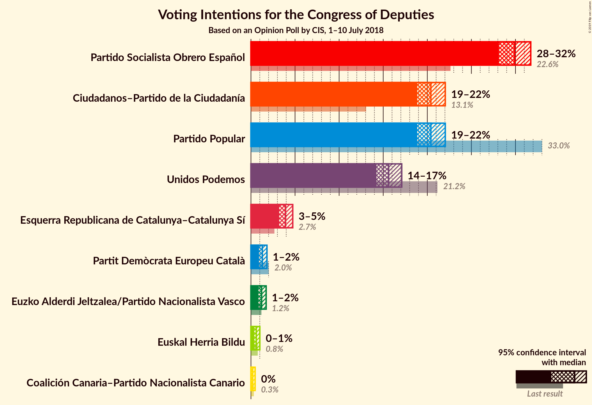
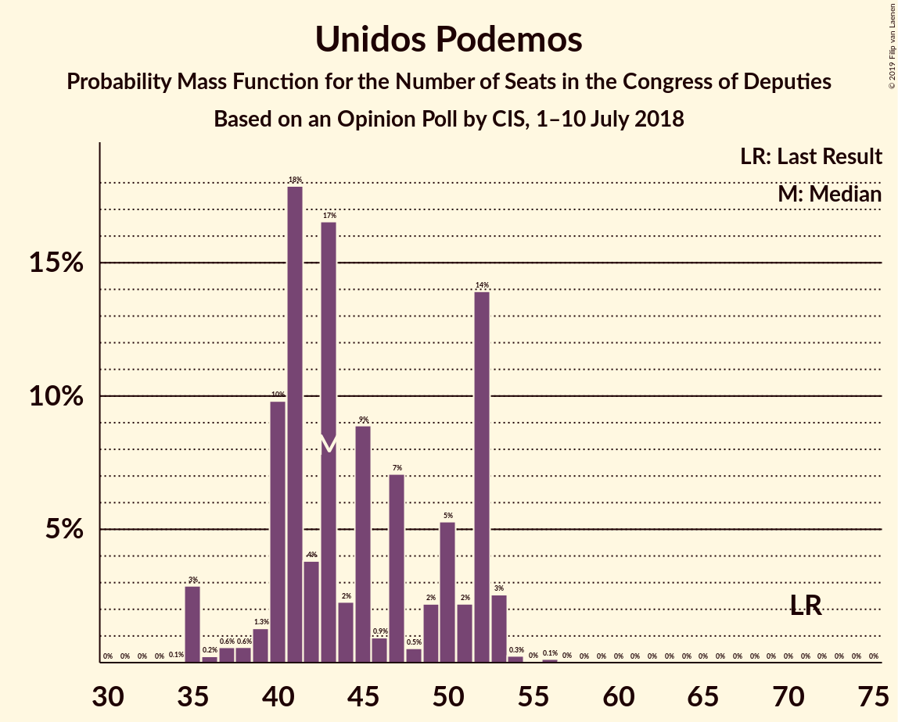
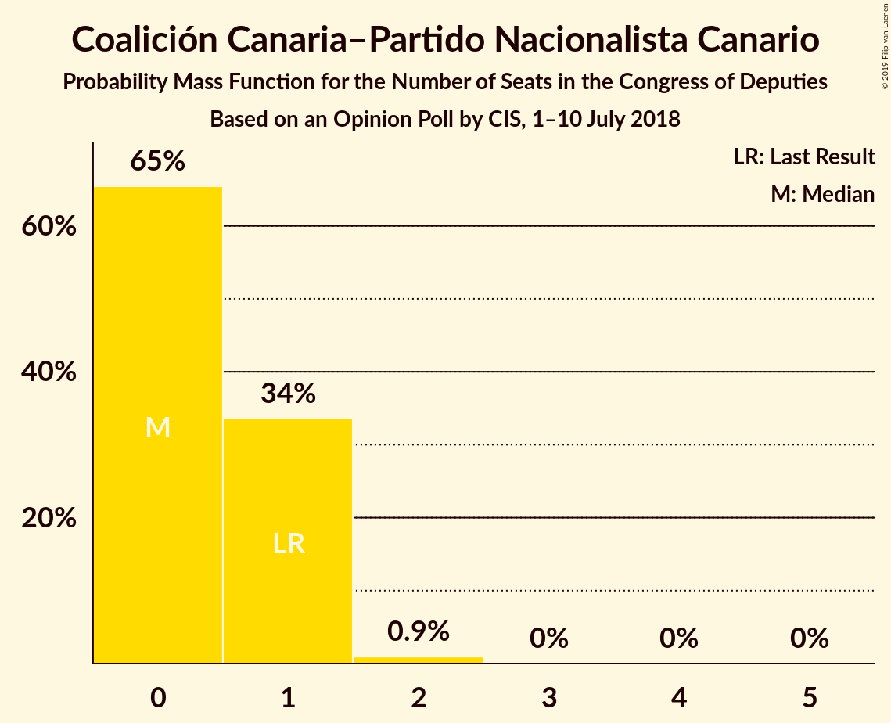
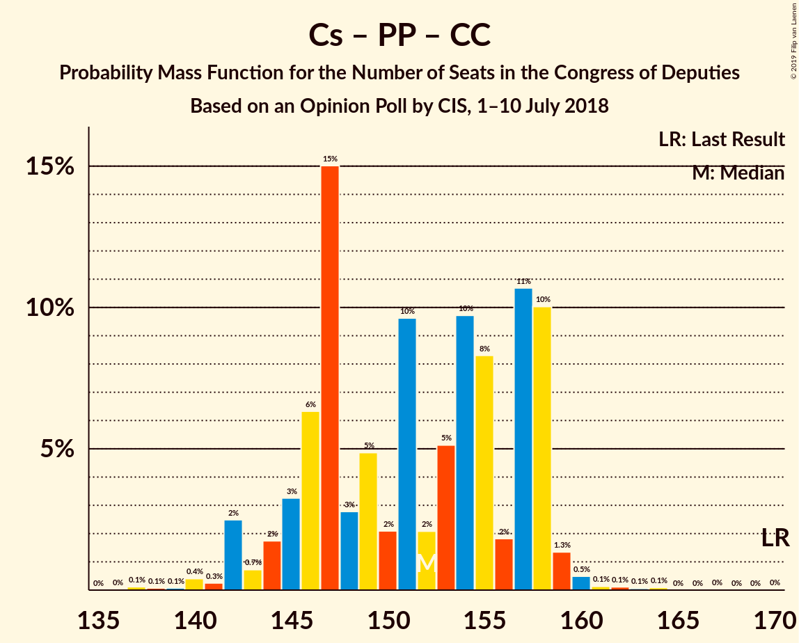
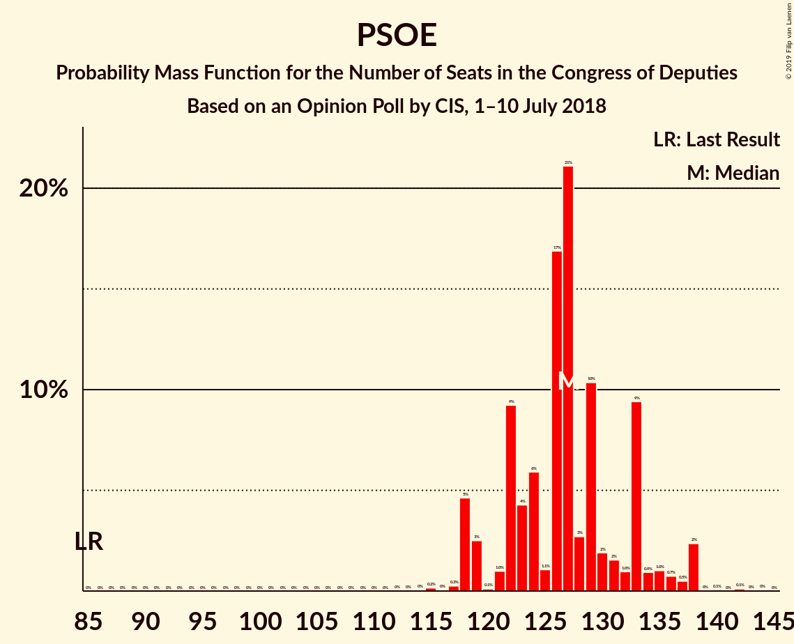

# Opinion Poll by CIS, 1–10 July 2018

<a href="#voting-intentions">Voting Intentions</a> | <a href="#seats">Seats</a> | <a href="#coalitions">Coalitions</a> | <a href="#technical-information">Technical Information</a>

## Voting Intentions

### Confidence Intervals

| Party | Last Result | Poll Result | 80% Confidence Interval | 90% Confidence Interval | 95% Confidence Interval | 99% Confidence Interval |
|:-----:|:-----------:|:-----------:|:-----------------------:|:-----------------------:|:-----------------------:|:-----------------------:|
| Partido Socialista Obrero Español | 22.6% | 29.9% | 28.7–31.1% |28.4–31.4% |28.1–31.7% |27.6–32.3% |
| Partido Popular | 33.0% | 20.4% | 19.4–21.5% |19.1–21.8% |18.9–22.0% |18.4–22.6% |
| Ciudadanos–Partido de la Ciudadanía | 13.1% | 20.4% | 19.4–21.5% |19.1–21.8% |18.9–22.0% |18.4–22.6% |
| Unidos Podemos | 21.2% | 15.6% | 14.7–16.6% |14.4–16.9% |14.2–17.1% |13.8–17.6% |
| Esquerra Republicana de Catalunya–Catalunya Sí | 2.7% | 3.9% | 3.4–4.5% |3.3–4.6% |3.2–4.7% |3.0–5.0% |
| Partit Demòcrata Europeu Català | 2.0% | 1.3% | 1.0–1.6% |1.0–1.7% |0.9–1.8% |0.8–2.0% |
| Euzko Alderdi Jeltzalea/Partido Nacionalista Vasco | 1.2% | 1.2% | 1.0–1.5% |0.9–1.6% |0.8–1.7% |0.7–1.9% |
| Euskal Herria Bildu | 0.8% | 0.6% | 0.4–0.9% |0.4–0.9% |0.4–1.0% |0.3–1.1% |
| Coalición Canaria–Partido Nacionalista Canario | 0.3% | 0.2% | 0.1–0.4% |0.1–0.4% |0.1–0.5% |0.1–0.6% |

*Note:* The poll result column reflects the actual value used in the calculations. Published results may vary slightly, and in addition be rounded to fewer digits.

## Seats

### Confidence Intervals

| Party | Last Result | Median | 80% Confidence Interval | 90% Confidence Interval | 95% Confidence Interval | 99% Confidence Interval |
|:-----:|:-----------:|:------:|:-----------------------:|:-----------------------:|:-----------------------:|:-----------------------:|
| <a href="#partido-socialista-obrero-español">Partido Socialista Obrero Español</a> | 85 | 127 | 122–133 |118–134 |118–138 |117–138 |
| <a href="#partido-popular">Partido Popular</a> | 137 | 81 | 74–88 |73–90 |73–90 |70–90 |
| <a href="#ciudadanos–partido-de-la-ciudadanía">Ciudadanos–Partido de la Ciudadanía</a> | 32 | 70 | 67–73 |67–76 |66–76 |64–78 |
| <a href="#unidos-podemos">Unidos Podemos</a> | 71 | 43 | 40–52 |39–52 |35–53 |35–53 |
| <a href="#esquerra-republicana-de-catalunya–catalunya-sí">Esquerra Republicana de Catalunya–Catalunya Sí</a> | 9 | 15 | 13–17 |13–17 |13–18 |12–19 |
| <a href="#partit-demòcrata-europeu-català">Partit Demòcrata Europeu Català</a> | 8 | 4 | 3–6 |3–6 |1–6 |1–7 |
| <a href="#euzko-alderdi-jeltzalea/partido-nacionalista-vasco">Euzko Alderdi Jeltzalea/Partido Nacionalista Vasco</a> | 5 | 6 | 5–8 |5–8 |4–8 |3–9 |
| <a href="#euskal-herria-bildu">Euskal Herria Bildu</a> | 2 | 2 | 1–3 |1–4 |0–4 |0–5 |
| <a href="#coalición-canaria–partido-nacionalista-canario">Coalición Canaria–Partido Nacionalista Canario</a> | 1 | 0 | 0–1 |0–1 |0–1 |0–2 |

### Partido Socialista Obrero Español

*For a full overview of the results for this party, see the [Partido Socialista Obrero Español](party-partidosocialistaobreroespañol.html) page.*

| Number of Seats | Probability | Accumulated | Special Marks |
|:---------------:|:-----------:|:-----------:|:-------------:|
| 85 | 0% | 100% | Last Result |
| 86 | 0% | 100% |  |
| 87 | 0% | 100% |  |
| 88 | 0% | 100% |  |
| 89 | 0% | 100% |  |
| 90 | 0% | 100% |  |
| 91 | 0% | 100% |  |
| 92 | 0% | 100% |  |
| 93 | 0% | 100% |  |
| 94 | 0% | 100% |  |
| 95 | 0% | 100% |  |
| 96 | 0% | 100% |  |
| 97 | 0% | 100% |  |
| 98 | 0% | 100% |  |
| 99 | 0% | 100% |  |
| 100 | 0% | 100% |  |
| 101 | 0% | 100% |  |
| 102 | 0% | 100% |  |
| 103 | 0% | 100% |  |
| 104 | 0% | 100% |  |
| 105 | 0% | 100% |  |
| 106 | 0% | 100% |  |
| 107 | 0% | 100% |  |
| 108 | 0% | 100% |  |
| 109 | 0% | 100% |  |
| 110 | 0% | 100% |  |
| 111 | 0% | 100% |  |
| 112 | 0% | 100% |  |
| 113 | 0% | 100% |  |
| 114 | 0% | 100% |  |
| 115 | 0.2% | 99.9% |  |
| 116 | 0% | 99.8% |  |
| 117 | 0.3% | 99.7% |  |
| 118 | 5% | 99.5% |  |
| 119 | 3% | 95% |  |
| 120 | 0.1% | 92% |  |
| 121 | 1.0% | 92% |  |
| 122 | 9% | 91% |  |
| 123 | 4% | 82% |  |
| 124 | 6% | 78% |  |
| 125 | 1.1% | 72% |  |
| 126 | 17% | 71% |  |
| 127 | 21% | 54% | Median |
| 128 | 3% | 33% |  |
| 129 | 10% | 30% |  |
| 130 | 2% | 20% |  |
| 131 | 2% | 18% |  |
| 132 | 1.0% | 16% |  |
| 133 | 9% | 15% |  |
| 134 | 0.9% | 6% |  |
| 135 | 1.0% | 5% |  |
| 136 | 0.7% | 4% |  |
| 137 | 0.5% | 3% |  |
| 138 | 2% | 3% |  |
| 139 | 0% | 0.3% |  |
| 140 | 0.1% | 0.2% |  |
| 141 | 0% | 0.2% |  |
| 142 | 0.1% | 0.2% |  |
| 143 | 0% | 0.1% |  |
| 144 | 0% | 0% |  |

### Partido Popular

*For a full overview of the results for this party, see the [Partido Popular](party-partidopopular.html) page.*

| Number of Seats | Probability | Accumulated | Special Marks |
|:---------------:|:-----------:|:-----------:|:-------------:|
| 68 | 0.1% | 100% |  |
| 69 | 0.1% | 99.9% |  |
| 70 | 0.4% | 99.8% |  |
| 71 | 0.5% | 99.5% |  |
| 72 | 0.5% | 98.9% |  |
| 73 | 7% | 98% |  |
| 74 | 4% | 92% |  |
| 75 | 5% | 88% |  |
| 76 | 1.1% | 83% |  |
| 77 | 3% | 82% |  |
| 78 | 8% | 79% |  |
| 79 | 17% | 71% |  |
| 80 | 4% | 54% |  |
| 81 | 10% | 50% | Median |
| 82 | 2% | 40% |  |
| 83 | 6% | 38% |  |
| 84 | 0.7% | 32% |  |
| 85 | 10% | 32% |  |
| 86 | 6% | 22% |  |
| 87 | 2% | 15% |  |
| 88 | 7% | 14% |  |
| 89 | 0.4% | 7% |  |
| 90 | 6% | 7% |  |
| 91 | 0.1% | 0.3% |  |
| 92 | 0% | 0.2% |  |
| 93 | 0.1% | 0.2% |  |
| 94 | 0% | 0% |  |
| 95 | 0% | 0% |  |
| 96 | 0% | 0% |  |
| 97 | 0% | 0% |  |
| 98 | 0% | 0% |  |
| 99 | 0% | 0% |  |
| 100 | 0% | 0% |  |
| 101 | 0% | 0% |  |
| 102 | 0% | 0% |  |
| 103 | 0% | 0% |  |
| 104 | 0% | 0% |  |
| 105 | 0% | 0% |  |
| 106 | 0% | 0% |  |
| 107 | 0% | 0% |  |
| 108 | 0% | 0% |  |
| 109 | 0% | 0% |  |
| 110 | 0% | 0% |  |
| 111 | 0% | 0% |  |
| 112 | 0% | 0% |  |
| 113 | 0% | 0% |  |
| 114 | 0% | 0% |  |
| 115 | 0% | 0% |  |
| 116 | 0% | 0% |  |
| 117 | 0% | 0% |  |
| 118 | 0% | 0% |  |
| 119 | 0% | 0% |  |
| 120 | 0% | 0% |  |
| 121 | 0% | 0% |  |
| 122 | 0% | 0% |  |
| 123 | 0% | 0% |  |
| 124 | 0% | 0% |  |
| 125 | 0% | 0% |  |
| 126 | 0% | 0% |  |
| 127 | 0% | 0% |  |
| 128 | 0% | 0% |  |
| 129 | 0% | 0% |  |
| 130 | 0% | 0% |  |
| 131 | 0% | 0% |  |
| 132 | 0% | 0% |  |
| 133 | 0% | 0% |  |
| 134 | 0% | 0% |  |
| 135 | 0% | 0% |  |
| 136 | 0% | 0% |  |
| 137 | 0% | 0% | Last Result |

### Ciudadanos–Partido de la Ciudadanía

*For a full overview of the results for this party, see the [Ciudadanos–Partido de la Ciudadanía](party-ciudadanos–partidodelaciudadanía.html) page.*

| Number of Seats | Probability | Accumulated | Special Marks |
|:---------------:|:-----------:|:-----------:|:-------------:|
| 32 | 0% | 100% | Last Result |
| 33 | 0% | 100% |  |
| 34 | 0% | 100% |  |
| 35 | 0% | 100% |  |
| 36 | 0% | 100% |  |
| 37 | 0% | 100% |  |
| 38 | 0% | 100% |  |
| 39 | 0% | 100% |  |
| 40 | 0% | 100% |  |
| 41 | 0% | 100% |  |
| 42 | 0% | 100% |  |
| 43 | 0% | 100% |  |
| 44 | 0% | 100% |  |
| 45 | 0% | 100% |  |
| 46 | 0% | 100% |  |
| 47 | 0% | 100% |  |
| 48 | 0% | 100% |  |
| 49 | 0% | 100% |  |
| 50 | 0% | 100% |  |
| 51 | 0% | 100% |  |
| 52 | 0% | 100% |  |
| 53 | 0% | 100% |  |
| 54 | 0% | 100% |  |
| 55 | 0% | 100% |  |
| 56 | 0% | 100% |  |
| 57 | 0% | 100% |  |
| 58 | 0% | 100% |  |
| 59 | 0% | 100% |  |
| 60 | 0% | 100% |  |
| 61 | 0.1% | 100% |  |
| 62 | 0% | 99.8% |  |
| 63 | 0.2% | 99.8% |  |
| 64 | 0.6% | 99.6% |  |
| 65 | 0.4% | 99.1% |  |
| 66 | 2% | 98.7% |  |
| 67 | 13% | 96% |  |
| 68 | 17% | 84% |  |
| 69 | 10% | 66% |  |
| 70 | 19% | 57% | Median |
| 71 | 5% | 38% |  |
| 72 | 14% | 33% |  |
| 73 | 10% | 20% |  |
| 74 | 0.8% | 9% |  |
| 75 | 1.0% | 8% |  |
| 76 | 6% | 7% |  |
| 77 | 0.3% | 1.1% |  |
| 78 | 0.5% | 0.8% |  |
| 79 | 0.1% | 0.3% |  |
| 80 | 0.1% | 0.2% |  |
| 81 | 0% | 0.1% |  |
| 82 | 0.1% | 0.1% |  |
| 83 | 0% | 0% |  |

### Unidos Podemos

*For a full overview of the results for this party, see the [Unidos Podemos](party-unidospodemos.html) page.*

| Number of Seats | Probability | Accumulated | Special Marks |
|:---------------:|:-----------:|:-----------:|:-------------:|
| 34 | 0.1% | 100% |  |
| 35 | 3% | 99.9% |  |
| 36 | 0.2% | 97% |  |
| 37 | 0.6% | 97% |  |
| 38 | 0.6% | 96% |  |
| 39 | 1.3% | 96% |  |
| 40 | 10% | 94% |  |
| 41 | 18% | 85% |  |
| 42 | 4% | 67% |  |
| 43 | 17% | 63% | Median |
| 44 | 2% | 46% |  |
| 45 | 9% | 44% |  |
| 46 | 0.9% | 35% |  |
| 47 | 7% | 34% |  |
| 48 | 0.5% | 27% |  |
| 49 | 2% | 27% |  |
| 50 | 5% | 24% |  |
| 51 | 2% | 19% |  |
| 52 | 14% | 17% |  |
| 53 | 3% | 3% |  |
| 54 | 0.3% | 0.5% |  |
| 55 | 0% | 0.2% |  |
| 56 | 0.1% | 0.2% |  |
| 57 | 0% | 0% |  |
| 58 | 0% | 0% |  |
| 59 | 0% | 0% |  |
| 60 | 0% | 0% |  |
| 61 | 0% | 0% |  |
| 62 | 0% | 0% |  |
| 63 | 0% | 0% |  |
| 64 | 0% | 0% |  |
| 65 | 0% | 0% |  |
| 66 | 0% | 0% |  |
| 67 | 0% | 0% |  |
| 68 | 0% | 0% |  |
| 69 | 0% | 0% |  |
| 70 | 0% | 0% |  |
| 71 | 0% | 0% | Last Result |

### Esquerra Republicana de Catalunya–Catalunya Sí

*For a full overview of the results for this party, see the [Esquerra Republicana de Catalunya–Catalunya Sí](party-esquerrarepublicanadecatalunya–catalunyasí.html) page.*

| Number of Seats | Probability | Accumulated | Special Marks |
|:---------------:|:-----------:|:-----------:|:-------------:|
| 9 | 0% | 100% | Last Result |
| 10 | 0% | 100% |  |
| 11 | 0% | 100% |  |
| 12 | 2% | 100% |  |
| 13 | 10% | 98% |  |
| 14 | 30% | 88% |  |
| 15 | 28% | 58% | Median |
| 16 | 14% | 30% |  |
| 17 | 12% | 16% |  |
| 18 | 3% | 4% |  |
| 19 | 0.5% | 0.8% |  |
| 20 | 0.3% | 0.3% |  |
| 21 | 0% | 0% |  |

### Partit Demòcrata Europeu Català

*For a full overview of the results for this party, see the [Partit Demòcrata Europeu Català](party-partitdemòcrataeuropeucatalà.html) page.*

| Number of Seats | Probability | Accumulated | Special Marks |
|:---------------:|:-----------:|:-----------:|:-------------:|
| 1 | 4% | 100% |  |
| 2 | 0.9% | 96% |  |
| 3 | 27% | 95% |  |
| 4 | 44% | 68% | Median |
| 5 | 10% | 24% |  |
| 6 | 13% | 13% |  |
| 7 | 0.4% | 0.6% |  |
| 8 | 0.2% | 0.2% | Last Result |
| 9 | 0% | 0% |  |

### Euzko Alderdi Jeltzalea/Partido Nacionalista Vasco

*For a full overview of the results for this party, see the [Euzko Alderdi Jeltzalea/Partido Nacionalista Vasco](party-euzkoalderdijeltzaleapartidonacionalistavasco.html) page.*

| Number of Seats | Probability | Accumulated | Special Marks |
|:---------------:|:-----------:|:-----------:|:-------------:|
| 3 | 2% | 100% |  |
| 4 | 3% | 98% |  |
| 5 | 8% | 95% | Last Result |
| 6 | 67% | 87% | Median |
| 7 | 7% | 20% |  |
| 8 | 11% | 13% |  |
| 9 | 2% | 2% |  |
| 10 | 0.3% | 0.3% |  |
| 11 | 0% | 0% |  |

### Euskal Herria Bildu

*For a full overview of the results for this party, see the [Euskal Herria Bildu](party-euskalherriabildu.html) page.*

| Number of Seats | Probability | Accumulated | Special Marks |
|:---------------:|:-----------:|:-----------:|:-------------:|
| 0 | 5% | 100% |  |
| 1 | 29% | 95% |  |
| 2 | 54% | 67% | Last Result, Median |
| 3 | 5% | 12% |  |
| 4 | 5% | 8% |  |
| 5 | 2% | 2% |  |
| 6 | 0.1% | 0.1% |  |
| 7 | 0% | 0% |  |

### Coalición Canaria–Partido Nacionalista Canario

*For a full overview of the results for this party, see the [Coalición Canaria–Partido Nacionalista Canario](party-coalicióncanaria–partidonacionalistacanario.html) page.*

| Number of Seats | Probability | Accumulated | Special Marks |
|:---------------:|:-----------:|:-----------:|:-------------:|
| 0 | 65% | 100% | Median |
| 1 | 34% | 35% | Last Result |
| 2 | 0.9% | 0.9% |  |
| 3 | 0% | 0% |  |

## Coalitions

### Confidence Intervals

| Coalition | Last Result | Median | Majority? | 80% Confidence Interval | 90% Confidence Interval | 95% Confidence Interval | 99% Confidence Interval |
|:---------:|:-----------:|:------:|:---------:|:-----------------------:|:-----------------------:|:-----------------------:|:-----------------------:|
| Partido Socialista Obrero Español – Ciudadanos–Partido de la Ciudadanía – Partido Popular | 254 | 279 | 100% | 271–283 | 270–283 | 268–285 | 268–288 |
| Partido Socialista Obrero Español – Ciudadanos–Partido de la Ciudadanía – Unidos Podemos | 188 | 242 | 100% | 234–250 | 233–251 | 233–252 | 232–253 |
| Partido Socialista Obrero Español – Partido Popular | 222 | 207 | 100% | 201–214 | 201–216 | 198–216 | 198–216 |
| Partido Socialista Obrero Español – Unidos Podemos – Esquerra Republicana de Catalunya–Catalunya Sí – Partit Demòcrata Europeu Català – Euzko Alderdi Jeltzalea/Partido Nacionalista Vasco – Euskal Herria Bildu | 180 | 198 | 100% | 192–204 | 192–206 | 192–208 | 190–210 |
| Partido Socialista Obrero Español – Ciudadanos–Partido de la Ciudadanía | 117 | 195 | 100% | 190–205 | 187–206 | 187–206 | 187–211 |
| Partido Socialista Obrero Español – Unidos Podemos – Esquerra Republicana de Catalunya–Catalunya Sí – Partit Demòcrata Europeu Català | 173 | 191 | 99.9% | 184–196 | 184–198 | 182–199 | 182–202 |
| Partido Socialista Obrero Español – Unidos Podemos – Esquerra Republicana de Catalunya–Catalunya Sí – Euskal Herria Bildu | 167 | 189 | 99.9% | 182–194 | 182–196 | 180–197 | 179–199 |
| Partido Socialista Obrero Español – Unidos Podemos – Euzko Alderdi Jeltzalea/Partido Nacionalista Vasco – Euskal Herria Bildu | 163 | 179 | 75% | 171–186 | 171–188 | 171–190 | 170–191 |
| Partido Socialista Obrero Español – Unidos Podemos – Euzko Alderdi Jeltzalea/Partido Nacionalista Vasco | 161 | 177 | 60% | 169–185 | 169–186 | 169–188 | 167–190 |
| Partido Socialista Obrero Español – Unidos Podemos | 156 | 171 | 30% | 163–179 | 163–180 | 163–180 | 161–183 |
| Ciudadanos–Partido de la Ciudadanía – Partido Popular – Euzko Alderdi Jeltzalea/Partido Nacionalista Vasco | 174 | 157 | 0% | 153–163 | 150–163 | 149–165 | 146–166 |
| Ciudadanos–Partido de la Ciudadanía – Partido Popular – Coalición Canaria–Partido Nacionalista Canario | 170 | 152 | 0% | 146–158 | 144–158 | 142–158 | 140–160 |
| Ciudadanos–Partido de la Ciudadanía – Partido Popular | 169 | 151 | 0% | 146–157 | 143–157 | 142–158 | 140–160 |
| Partido Socialista Obrero Español | 85 | 127 | 0% | 122–133 | 118–134 | 118–138 | 117–138 |
| Partido Popular | 137 | 81 | 0% | 74–88 | 73–90 | 73–90 | 70–90 |

### Partido Socialista Obrero Español – Ciudadanos–Partido de la Ciudadanía – Partido Popular

| Number of Seats | Probability | Accumulated | Special Marks |
|:---------------:|:-----------:|:-----------:|:-------------:|
| 254 | 0% | 100% | Last Result |
| 255 | 0% | 100% |  |
| 256 | 0% | 100% |  |
| 257 | 0% | 100% |  |
| 258 | 0% | 100% |  |
| 259 | 0% | 100% |  |
| 260 | 0% | 100% |  |
| 261 | 0% | 100% |  |
| 262 | 0% | 100% |  |
| 263 | 0% | 100% |  |
| 264 | 0% | 100% |  |
| 265 | 0% | 100% |  |
| 266 | 0.1% | 100% |  |
| 267 | 0.2% | 99.9% |  |
| 268 | 3% | 99.7% |  |
| 269 | 0.2% | 97% |  |
| 270 | 5% | 97% |  |
| 271 | 3% | 92% |  |
| 272 | 1.1% | 89% |  |
| 273 | 0.6% | 88% |  |
| 274 | 14% | 87% |  |
| 275 | 3% | 73% |  |
| 276 | 4% | 70% |  |
| 277 | 4% | 67% |  |
| 278 | 3% | 63% | Median |
| 279 | 14% | 60% |  |
| 280 | 17% | 45% |  |
| 281 | 13% | 29% |  |
| 282 | 2% | 16% |  |
| 283 | 8% | 13% |  |
| 284 | 1.3% | 5% |  |
| 285 | 2% | 4% |  |
| 286 | 0.1% | 2% |  |
| 287 | 1.1% | 2% |  |
| 288 | 0.7% | 0.7% |  |
| 289 | 0% | 0% |  |

### Partido Socialista Obrero Español – Ciudadanos–Partido de la Ciudadanía – Unidos Podemos

| Number of Seats | Probability | Accumulated | Special Marks |
|:---------------:|:-----------:|:-----------:|:-------------:|
| 188 | 0% | 100% | Last Result |
| 189 | 0% | 100% |  |
| 190 | 0% | 100% |  |
| 191 | 0% | 100% |  |
| 192 | 0% | 100% |  |
| 193 | 0% | 100% |  |
| 194 | 0% | 100% |  |
| 195 | 0% | 100% |  |
| 196 | 0% | 100% |  |
| 197 | 0% | 100% |  |
| 198 | 0% | 100% |  |
| 199 | 0% | 100% |  |
| 200 | 0% | 100% |  |
| 201 | 0% | 100% |  |
| 202 | 0% | 100% |  |
| 203 | 0% | 100% |  |
| 204 | 0% | 100% |  |
| 205 | 0% | 100% |  |
| 206 | 0% | 100% |  |
| 207 | 0% | 100% |  |
| 208 | 0% | 100% |  |
| 209 | 0% | 100% |  |
| 210 | 0% | 100% |  |
| 211 | 0% | 100% |  |
| 212 | 0% | 100% |  |
| 213 | 0% | 100% |  |
| 214 | 0% | 100% |  |
| 215 | 0% | 100% |  |
| 216 | 0% | 100% |  |
| 217 | 0% | 100% |  |
| 218 | 0% | 100% |  |
| 219 | 0% | 100% |  |
| 220 | 0% | 100% |  |
| 221 | 0% | 100% |  |
| 222 | 0% | 100% |  |
| 223 | 0% | 100% |  |
| 224 | 0% | 100% |  |
| 225 | 0% | 100% |  |
| 226 | 0% | 100% |  |
| 227 | 0% | 100% |  |
| 228 | 0% | 100% |  |
| 229 | 0% | 100% |  |
| 230 | 0.1% | 99.9% |  |
| 231 | 0.1% | 99.8% |  |
| 232 | 0.2% | 99.7% |  |
| 233 | 7% | 99.4% |  |
| 234 | 7% | 92% |  |
| 235 | 11% | 86% |  |
| 236 | 2% | 75% |  |
| 237 | 7% | 72% |  |
| 238 | 2% | 65% |  |
| 239 | 3% | 63% |  |
| 240 | 1.1% | 60% | Median |
| 241 | 2% | 59% |  |
| 242 | 12% | 56% |  |
| 243 | 4% | 44% |  |
| 244 | 1.2% | 40% |  |
| 245 | 2% | 39% |  |
| 246 | 8% | 37% |  |
| 247 | 13% | 29% |  |
| 248 | 3% | 16% |  |
| 249 | 2% | 13% |  |
| 250 | 2% | 11% |  |
| 251 | 6% | 9% |  |
| 252 | 3% | 4% |  |
| 253 | 0.3% | 0.6% |  |
| 254 | 0.1% | 0.2% |  |
| 255 | 0% | 0.1% |  |
| 256 | 0.1% | 0.1% |  |
| 257 | 0% | 0% |  |

### Partido Socialista Obrero Español – Partido Popular

| Number of Seats | Probability | Accumulated | Special Marks |
|:---------------:|:-----------:|:-----------:|:-------------:|
| 195 | 0.1% | 100% |  |
| 196 | 0.1% | 99.9% |  |
| 197 | 0.1% | 99.8% |  |
| 198 | 3% | 99.7% |  |
| 199 | 1.2% | 97% |  |
| 200 | 0.4% | 96% |  |
| 201 | 6% | 96% |  |
| 202 | 2% | 90% |  |
| 203 | 5% | 88% |  |
| 204 | 1.2% | 83% |  |
| 205 | 8% | 82% |  |
| 206 | 19% | 74% |  |
| 207 | 11% | 56% |  |
| 208 | 6% | 45% | Median |
| 209 | 0.6% | 38% |  |
| 210 | 12% | 38% |  |
| 211 | 3% | 25% |  |
| 212 | 3% | 22% |  |
| 213 | 4% | 19% |  |
| 214 | 8% | 15% |  |
| 215 | 0.2% | 7% |  |
| 216 | 7% | 7% |  |
| 217 | 0.1% | 0.4% |  |
| 218 | 0.1% | 0.3% |  |
| 219 | 0.1% | 0.2% |  |
| 220 | 0% | 0.1% |  |
| 221 | 0% | 0.1% |  |
| 222 | 0% | 0.1% | Last Result |
| 223 | 0% | 0% |  |

### Partido Socialista Obrero Español – Unidos Podemos – Esquerra Republicana de Catalunya–Catalunya Sí – Partit Demòcrata Europeu Català – Euzko Alderdi Jeltzalea/Partido Nacionalista Vasco – Euskal Herria Bildu

| Number of Seats | Probability | Accumulated | Special Marks |
|:---------------:|:-----------:|:-----------:|:-------------:|
| 180 | 0% | 100% | Last Result |
| 181 | 0% | 100% |  |
| 182 | 0% | 100% |  |
| 183 | 0% | 100% |  |
| 184 | 0% | 99.9% |  |
| 185 | 0% | 99.9% |  |
| 186 | 0.1% | 99.9% |  |
| 187 | 0.1% | 99.8% |  |
| 188 | 0.1% | 99.8% |  |
| 189 | 0.1% | 99.7% |  |
| 190 | 0.5% | 99.5% |  |
| 191 | 1.3% | 99.0% |  |
| 192 | 10% | 98% |  |
| 193 | 11% | 88% |  |
| 194 | 2% | 77% |  |
| 195 | 8% | 75% |  |
| 196 | 10% | 67% |  |
| 197 | 5% | 57% | Median |
| 198 | 2% | 52% |  |
| 199 | 10% | 50% |  |
| 200 | 2% | 40% |  |
| 201 | 5% | 38% |  |
| 202 | 3% | 33% |  |
| 203 | 15% | 31% |  |
| 204 | 6% | 16% |  |
| 205 | 3% | 9% |  |
| 206 | 2% | 6% |  |
| 207 | 0.7% | 4% |  |
| 208 | 2% | 3% |  |
| 209 | 0.3% | 1.0% |  |
| 210 | 0.4% | 0.7% |  |
| 211 | 0.1% | 0.3% |  |
| 212 | 0.1% | 0.3% |  |
| 213 | 0.1% | 0.2% |  |
| 214 | 0% | 0.1% |  |
| 215 | 0% | 0.1% |  |
| 216 | 0% | 0% |  |

### Partido Socialista Obrero Español – Ciudadanos–Partido de la Ciudadanía

| Number of Seats | Probability | Accumulated | Special Marks |
|:---------------:|:-----------:|:-----------:|:-------------:|
| 117 | 0% | 100% | Last Result |
| 118 | 0% | 100% |  |
| 119 | 0% | 100% |  |
| 120 | 0% | 100% |  |
| 121 | 0% | 100% |  |
| 122 | 0% | 100% |  |
| 123 | 0% | 100% |  |
| 124 | 0% | 100% |  |
| 125 | 0% | 100% |  |
| 126 | 0% | 100% |  |
| 127 | 0% | 100% |  |
| 128 | 0% | 100% |  |
| 129 | 0% | 100% |  |
| 130 | 0% | 100% |  |
| 131 | 0% | 100% |  |
| 132 | 0% | 100% |  |
| 133 | 0% | 100% |  |
| 134 | 0% | 100% |  |
| 135 | 0% | 100% |  |
| 136 | 0% | 100% |  |
| 137 | 0% | 100% |  |
| 138 | 0% | 100% |  |
| 139 | 0% | 100% |  |
| 140 | 0% | 100% |  |
| 141 | 0% | 100% |  |
| 142 | 0% | 100% |  |
| 143 | 0% | 100% |  |
| 144 | 0% | 100% |  |
| 145 | 0% | 100% |  |
| 146 | 0% | 100% |  |
| 147 | 0% | 100% |  |
| 148 | 0% | 100% |  |
| 149 | 0% | 100% |  |
| 150 | 0% | 100% |  |
| 151 | 0% | 100% |  |
| 152 | 0% | 100% |  |
| 153 | 0% | 100% |  |
| 154 | 0% | 100% |  |
| 155 | 0% | 100% |  |
| 156 | 0% | 100% |  |
| 157 | 0% | 100% |  |
| 158 | 0% | 100% |  |
| 159 | 0% | 100% |  |
| 160 | 0% | 100% |  |
| 161 | 0% | 100% |  |
| 162 | 0% | 100% |  |
| 163 | 0% | 100% |  |
| 164 | 0% | 100% |  |
| 165 | 0% | 100% |  |
| 166 | 0% | 100% |  |
| 167 | 0% | 100% |  |
| 168 | 0% | 100% |  |
| 169 | 0% | 100% |  |
| 170 | 0% | 100% |  |
| 171 | 0% | 100% |  |
| 172 | 0% | 100% |  |
| 173 | 0% | 100% |  |
| 174 | 0% | 100% |  |
| 175 | 0% | 100% |  |
| 176 | 0% | 100% | Majority |
| 177 | 0% | 100% |  |
| 178 | 0% | 100% |  |
| 179 | 0% | 100% |  |
| 180 | 0% | 100% |  |
| 181 | 0% | 100% |  |
| 182 | 0% | 100% |  |
| 183 | 0% | 100% |  |
| 184 | 0% | 100% |  |
| 185 | 0% | 100% |  |
| 186 | 0.2% | 100% |  |
| 187 | 5% | 99.8% |  |
| 188 | 0.2% | 95% |  |
| 189 | 3% | 94% |  |
| 190 | 2% | 92% |  |
| 191 | 0.4% | 90% |  |
| 192 | 0.6% | 89% |  |
| 193 | 12% | 89% |  |
| 194 | 13% | 76% |  |
| 195 | 15% | 64% |  |
| 196 | 4% | 48% |  |
| 197 | 4% | 44% | Median |
| 198 | 3% | 40% |  |
| 199 | 10% | 37% |  |
| 200 | 2% | 27% |  |
| 201 | 2% | 25% |  |
| 202 | 3% | 24% |  |
| 203 | 6% | 21% |  |
| 204 | 1.2% | 14% |  |
| 205 | 3% | 13% |  |
| 206 | 8% | 10% |  |
| 207 | 0.3% | 2% |  |
| 208 | 0.1% | 1.4% |  |
| 209 | 0.1% | 1.2% |  |
| 210 | 0.1% | 1.2% |  |
| 211 | 0.5% | 1.0% |  |
| 212 | 0.4% | 0.5% |  |
| 213 | 0% | 0.1% |  |
| 214 | 0% | 0% |  |

### Partido Socialista Obrero Español – Unidos Podemos – Esquerra Republicana de Catalunya–Catalunya Sí – Partit Demòcrata Europeu Català

| Number of Seats | Probability | Accumulated | Special Marks |
|:---------------:|:-----------:|:-----------:|:-------------:|
| 173 | 0% | 100% | Last Result |
| 174 | 0% | 100% |  |
| 175 | 0% | 100% |  |
| 176 | 0% | 99.9% | Majority |
| 177 | 0.1% | 99.9% |  |
| 178 | 0% | 99.9% |  |
| 179 | 0.1% | 99.8% |  |
| 180 | 0.1% | 99.7% |  |
| 181 | 0.1% | 99.7% |  |
| 182 | 2% | 99.6% |  |
| 183 | 1.0% | 97% |  |
| 184 | 9% | 96% |  |
| 185 | 10% | 88% |  |
| 186 | 7% | 78% |  |
| 187 | 3% | 71% |  |
| 188 | 11% | 68% |  |
| 189 | 6% | 57% | Median |
| 190 | 0.9% | 51% |  |
| 191 | 10% | 50% |  |
| 192 | 5% | 40% |  |
| 193 | 2% | 35% |  |
| 194 | 2% | 33% |  |
| 195 | 4% | 31% |  |
| 196 | 19% | 28% |  |
| 197 | 3% | 8% |  |
| 198 | 2% | 6% |  |
| 199 | 1.4% | 3% |  |
| 200 | 0.7% | 2% |  |
| 201 | 0.3% | 1.1% |  |
| 202 | 0.4% | 0.8% |  |
| 203 | 0.1% | 0.3% |  |
| 204 | 0.1% | 0.3% |  |
| 205 | 0% | 0.2% |  |
| 206 | 0.1% | 0.2% |  |
| 207 | 0% | 0.1% |  |
| 208 | 0% | 0% |  |

### Partido Socialista Obrero Español – Unidos Podemos – Esquerra Republicana de Catalunya–Catalunya Sí – Euskal Herria Bildu

| Number of Seats | Probability | Accumulated | Special Marks |
|:---------------:|:-----------:|:-----------:|:-------------:|
| 167 | 0% | 100% | Last Result |
| 168 | 0% | 100% |  |
| 169 | 0% | 100% |  |
| 170 | 0% | 100% |  |
| 171 | 0% | 100% |  |
| 172 | 0% | 100% |  |
| 173 | 0% | 100% |  |
| 174 | 0% | 99.9% |  |
| 175 | 0% | 99.9% |  |
| 176 | 0% | 99.9% | Majority |
| 177 | 0.1% | 99.9% |  |
| 178 | 0.2% | 99.8% |  |
| 179 | 2% | 99.6% |  |
| 180 | 0.5% | 98% |  |
| 181 | 0.5% | 97% |  |
| 182 | 10% | 97% |  |
| 183 | 9% | 87% |  |
| 184 | 9% | 78% |  |
| 185 | 11% | 69% |  |
| 186 | 6% | 59% |  |
| 187 | 1.2% | 52% | Median |
| 188 | 0.5% | 51% |  |
| 189 | 3% | 51% |  |
| 190 | 12% | 47% |  |
| 191 | 3% | 36% |  |
| 192 | 2% | 33% |  |
| 193 | 7% | 30% |  |
| 194 | 14% | 24% |  |
| 195 | 2% | 9% |  |
| 196 | 4% | 7% |  |
| 197 | 2% | 4% |  |
| 198 | 0.4% | 2% |  |
| 199 | 1.2% | 2% |  |
| 200 | 0.1% | 0.4% |  |
| 201 | 0.1% | 0.4% |  |
| 202 | 0.1% | 0.2% |  |
| 203 | 0.1% | 0.2% |  |
| 204 | 0% | 0.1% |  |
| 205 | 0% | 0.1% |  |
| 206 | 0% | 0.1% |  |
| 207 | 0% | 0% |  |

### Partido Socialista Obrero Español – Unidos Podemos – Euzko Alderdi Jeltzalea/Partido Nacionalista Vasco – Euskal Herria Bildu

| Number of Seats | Probability | Accumulated | Special Marks |
|:---------------:|:-----------:|:-----------:|:-------------:|
| 163 | 0% | 100% | Last Result |
| 164 | 0% | 100% |  |
| 165 | 0% | 100% |  |
| 166 | 0% | 99.9% |  |
| 167 | 0.1% | 99.9% |  |
| 168 | 0% | 99.8% |  |
| 169 | 0.2% | 99.8% |  |
| 170 | 1.3% | 99.6% |  |
| 171 | 9% | 98% |  |
| 172 | 0.5% | 89% |  |
| 173 | 2% | 89% |  |
| 174 | 10% | 87% |  |
| 175 | 0.7% | 76% |  |
| 176 | 14% | 75% | Majority |
| 177 | 2% | 61% |  |
| 178 | 10% | 60% | Median |
| 179 | 0.3% | 50% |  |
| 180 | 12% | 50% |  |
| 181 | 4% | 38% |  |
| 182 | 0.9% | 34% |  |
| 183 | 2% | 33% |  |
| 184 | 1.0% | 30% |  |
| 185 | 0.9% | 29% |  |
| 186 | 20% | 28% |  |
| 187 | 2% | 9% |  |
| 188 | 3% | 7% |  |
| 189 | 0.5% | 4% |  |
| 190 | 3% | 3% |  |
| 191 | 0.1% | 0.5% |  |
| 192 | 0.1% | 0.4% |  |
| 193 | 0.1% | 0.3% |  |
| 194 | 0.1% | 0.2% |  |
| 195 | 0% | 0.1% |  |
| 196 | 0% | 0.1% |  |
| 197 | 0% | 0.1% |  |
| 198 | 0% | 0% |  |

### Partido Socialista Obrero Español – Unidos Podemos – Euzko Alderdi Jeltzalea/Partido Nacionalista Vasco

| Number of Seats | Probability | Accumulated | Special Marks |
|:---------------:|:-----------:|:-----------:|:-------------:|
| 161 | 0% | 100% | Last Result |
| 162 | 0% | 100% |  |
| 163 | 0% | 100% |  |
| 164 | 0% | 99.9% |  |
| 165 | 0% | 99.9% |  |
| 166 | 0.1% | 99.9% |  |
| 167 | 0.7% | 99.8% |  |
| 168 | 0.9% | 99.0% |  |
| 169 | 10% | 98% |  |
| 170 | 0.6% | 88% |  |
| 171 | 1.4% | 87% |  |
| 172 | 10% | 86% |  |
| 173 | 2% | 76% |  |
| 174 | 13% | 74% |  |
| 175 | 0.7% | 61% |  |
| 176 | 10% | 60% | Median, Majority |
| 177 | 0.9% | 50% |  |
| 178 | 12% | 49% |  |
| 179 | 4% | 38% |  |
| 180 | 2% | 33% |  |
| 181 | 2% | 32% |  |
| 182 | 0.4% | 30% |  |
| 183 | 0.9% | 29% |  |
| 184 | 0.4% | 28% |  |
| 185 | 20% | 28% |  |
| 186 | 5% | 8% |  |
| 187 | 0.6% | 4% |  |
| 188 | 0.8% | 3% |  |
| 189 | 2% | 2% |  |
| 190 | 0.2% | 0.5% |  |
| 191 | 0.1% | 0.3% |  |
| 192 | 0.1% | 0.3% |  |
| 193 | 0.1% | 0.2% |  |
| 194 | 0% | 0.1% |  |
| 195 | 0% | 0.1% |  |
| 196 | 0% | 0% |  |

### Partido Socialista Obrero Español – Unidos Podemos

| Number of Seats | Probability | Accumulated | Special Marks |
|:---------------:|:-----------:|:-----------:|:-------------:|
| 156 | 0% | 100% | Last Result |
| 157 | 0% | 99.9% |  |
| 158 | 0% | 99.9% |  |
| 159 | 0% | 99.9% |  |
| 160 | 0.1% | 99.9% |  |
| 161 | 0.8% | 99.8% |  |
| 162 | 0.9% | 99.0% |  |
| 163 | 9% | 98% |  |
| 164 | 2% | 90% |  |
| 165 | 2% | 88% |  |
| 166 | 8% | 85% |  |
| 167 | 7% | 77% |  |
| 168 | 9% | 70% |  |
| 169 | 0.4% | 61% |  |
| 170 | 10% | 61% | Median |
| 171 | 2% | 51% |  |
| 172 | 12% | 49% |  |
| 173 | 4% | 37% |  |
| 174 | 2% | 33% |  |
| 175 | 2% | 32% |  |
| 176 | 0.4% | 30% | Majority |
| 177 | 0.2% | 29% |  |
| 178 | 8% | 29% |  |
| 179 | 14% | 21% |  |
| 180 | 6% | 8% |  |
| 181 | 0.7% | 2% |  |
| 182 | 0.6% | 1.2% |  |
| 183 | 0.1% | 0.6% |  |
| 184 | 0.1% | 0.5% |  |
| 185 | 0.2% | 0.4% |  |
| 186 | 0% | 0.2% |  |
| 187 | 0.1% | 0.2% |  |
| 188 | 0% | 0.1% |  |
| 189 | 0% | 0.1% |  |
| 190 | 0% | 0% |  |

### Ciudadanos–Partido de la Ciudadanía – Partido Popular – Euzko Alderdi Jeltzalea/Partido Nacionalista Vasco

| Number of Seats | Probability | Accumulated | Special Marks |
|:---------------:|:-----------:|:-----------:|:-------------:|
| 140 | 0% | 100% |  |
| 141 | 0% | 99.9% |  |
| 142 | 0% | 99.9% |  |
| 143 | 0.1% | 99.9% |  |
| 144 | 0.2% | 99.8% |  |
| 145 | 0% | 99.7% |  |
| 146 | 0.6% | 99.7% |  |
| 147 | 0.7% | 99.1% |  |
| 148 | 0.5% | 98% |  |
| 149 | 1.4% | 98% |  |
| 150 | 2% | 96% |  |
| 151 | 3% | 94% |  |
| 152 | 0.7% | 91% |  |
| 153 | 23% | 91% |  |
| 154 | 2% | 68% |  |
| 155 | 5% | 66% |  |
| 156 | 1.4% | 61% |  |
| 157 | 10% | 59% | Median |
| 158 | 6% | 49% |  |
| 159 | 4% | 43% |  |
| 160 | 11% | 39% |  |
| 161 | 1.0% | 28% |  |
| 162 | 9% | 27% |  |
| 163 | 14% | 18% |  |
| 164 | 2% | 5% |  |
| 165 | 1.3% | 3% |  |
| 166 | 1.4% | 2% |  |
| 167 | 0.1% | 0.4% |  |
| 168 | 0.1% | 0.3% |  |
| 169 | 0.1% | 0.2% |  |
| 170 | 0% | 0.1% |  |
| 171 | 0% | 0.1% |  |
| 172 | 0% | 0.1% |  |
| 173 | 0% | 0.1% |  |
| 174 | 0% | 0% | Last Result |

### Ciudadanos–Partido de la Ciudadanía – Partido Popular – Coalición Canaria–Partido Nacionalista Canario

| Number of Seats | Probability | Accumulated | Special Marks |
|:---------------:|:-----------:|:-----------:|:-------------:|
| 135 | 0% | 100% |  |
| 136 | 0% | 99.9% |  |
| 137 | 0.1% | 99.9% |  |
| 138 | 0.1% | 99.8% |  |
| 139 | 0.1% | 99.7% |  |
| 140 | 0.4% | 99.7% |  |
| 141 | 0.3% | 99.3% |  |
| 142 | 2% | 99.0% |  |
| 143 | 0.7% | 97% |  |
| 144 | 2% | 96% |  |
| 145 | 3% | 94% |  |
| 146 | 6% | 91% |  |
| 147 | 15% | 84% |  |
| 148 | 3% | 69% |  |
| 149 | 5% | 67% |  |
| 150 | 2% | 62% |  |
| 151 | 10% | 60% | Median |
| 152 | 2% | 50% |  |
| 153 | 5% | 48% |  |
| 154 | 10% | 43% |  |
| 155 | 8% | 33% |  |
| 156 | 2% | 25% |  |
| 157 | 11% | 23% |  |
| 158 | 10% | 12% |  |
| 159 | 1.3% | 2% |  |
| 160 | 0.5% | 1.0% |  |
| 161 | 0.1% | 0.5% |  |
| 162 | 0.1% | 0.3% |  |
| 163 | 0.1% | 0.2% |  |
| 164 | 0.1% | 0.2% |  |
| 165 | 0% | 0.1% |  |
| 166 | 0% | 0.1% |  |
| 167 | 0% | 0.1% |  |
| 168 | 0% | 0% |  |
| 169 | 0% | 0% |  |
| 170 | 0% | 0% | Last Result |

### Ciudadanos–Partido de la Ciudadanía – Partido Popular

| Number of Seats | Probability | Accumulated | Special Marks |
|:---------------:|:-----------:|:-----------:|:-------------:|
| 135 | 0% | 100% |  |
| 136 | 0% | 99.9% |  |
| 137 | 0.2% | 99.9% |  |
| 138 | 0.1% | 99.7% |  |
| 139 | 0% | 99.7% |  |
| 140 | 0.6% | 99.7% |  |
| 141 | 0.7% | 99.1% |  |
| 142 | 2% | 98% |  |
| 143 | 0.9% | 96% |  |
| 144 | 3% | 95% |  |
| 145 | 2% | 92% |  |
| 146 | 6% | 90% |  |
| 147 | 17% | 84% |  |
| 148 | 1.5% | 68% |  |
| 149 | 6% | 66% |  |
| 150 | 1.4% | 61% |  |
| 151 | 9% | 59% | Median |
| 152 | 7% | 50% |  |
| 153 | 4% | 43% |  |
| 154 | 8% | 39% |  |
| 155 | 8% | 31% |  |
| 156 | 4% | 23% |  |
| 157 | 14% | 19% |  |
| 158 | 3% | 5% |  |
| 159 | 1.0% | 2% |  |
| 160 | 0.2% | 0.6% |  |
| 161 | 0.1% | 0.3% |  |
| 162 | 0.1% | 0.3% |  |
| 163 | 0.1% | 0.2% |  |
| 164 | 0.1% | 0.1% |  |
| 165 | 0% | 0.1% |  |
| 166 | 0% | 0.1% |  |
| 167 | 0% | 0% |  |
| 168 | 0% | 0% |  |
| 169 | 0% | 0% | Last Result |

### Partido Socialista Obrero Español

| Number of Seats | Probability | Accumulated | Special Marks |
|:---------------:|:-----------:|:-----------:|:-------------:|
| 85 | 0% | 100% | Last Result |
| 86 | 0% | 100% |  |
| 87 | 0% | 100% |  |
| 88 | 0% | 100% |  |
| 89 | 0% | 100% |  |
| 90 | 0% | 100% |  |
| 91 | 0% | 100% |  |
| 92 | 0% | 100% |  |
| 93 | 0% | 100% |  |
| 94 | 0% | 100% |  |
| 95 | 0% | 100% |  |
| 96 | 0% | 100% |  |
| 97 | 0% | 100% |  |
| 98 | 0% | 100% |  |
| 99 | 0% | 100% |  |
| 100 | 0% | 100% |  |
| 101 | 0% | 100% |  |
| 102 | 0% | 100% |  |
| 103 | 0% | 100% |  |
| 104 | 0% | 100% |  |
| 105 | 0% | 100% |  |
| 106 | 0% | 100% |  |
| 107 | 0% | 100% |  |
| 108 | 0% | 100% |  |
| 109 | 0% | 100% |  |
| 110 | 0% | 100% |  |
| 111 | 0% | 100% |  |
| 112 | 0% | 100% |  |
| 113 | 0% | 100% |  |
| 114 | 0% | 100% |  |
| 115 | 0.2% | 99.9% |  |
| 116 | 0% | 99.8% |  |
| 117 | 0.3% | 99.7% |  |
| 118 | 5% | 99.5% |  |
| 119 | 3% | 95% |  |
| 120 | 0.1% | 92% |  |
| 121 | 1.0% | 92% |  |
| 122 | 9% | 91% |  |
| 123 | 4% | 82% |  |
| 124 | 6% | 78% |  |
| 125 | 1.1% | 72% |  |
| 126 | 17% | 71% |  |
| 127 | 21% | 54% | Median |
| 128 | 3% | 33% |  |
| 129 | 10% | 30% |  |
| 130 | 2% | 20% |  |
| 131 | 2% | 18% |  |
| 132 | 1.0% | 16% |  |
| 133 | 9% | 15% |  |
| 134 | 0.9% | 6% |  |
| 135 | 1.0% | 5% |  |
| 136 | 0.7% | 4% |  |
| 137 | 0.5% | 3% |  |
| 138 | 2% | 3% |  |
| 139 | 0% | 0.3% |  |
| 140 | 0.1% | 0.2% |  |
| 141 | 0% | 0.2% |  |
| 142 | 0.1% | 0.2% |  |
| 143 | 0% | 0.1% |  |
| 144 | 0% | 0% |  |

### Partido Popular

| Number of Seats | Probability | Accumulated | Special Marks |
|:---------------:|:-----------:|:-----------:|:-------------:|
| 68 | 0.1% | 100% |  |
| 69 | 0.1% | 99.9% |  |
| 70 | 0.4% | 99.8% |  |
| 71 | 0.5% | 99.5% |  |
| 72 | 0.5% | 98.9% |  |
| 73 | 7% | 98% |  |
| 74 | 4% | 92% |  |
| 75 | 5% | 88% |  |
| 76 | 1.1% | 83% |  |
| 77 | 3% | 82% |  |
| 78 | 8% | 79% |  |
| 79 | 17% | 71% |  |
| 80 | 4% | 54% |  |
| 81 | 10% | 50% | Median |
| 82 | 2% | 40% |  |
| 83 | 6% | 38% |  |
| 84 | 0.7% | 32% |  |
| 85 | 10% | 32% |  |
| 86 | 6% | 22% |  |
| 87 | 2% | 15% |  |
| 88 | 7% | 14% |  |
| 89 | 0.4% | 7% |  |
| 90 | 6% | 7% |  |
| 91 | 0.1% | 0.3% |  |
| 92 | 0% | 0.2% |  |
| 93 | 0.1% | 0.2% |  |
| 94 | 0% | 0% |  |
| 95 | 0% | 0% |  |
| 96 | 0% | 0% |  |
| 97 | 0% | 0% |  |
| 98 | 0% | 0% |  |
| 99 | 0% | 0% |  |
| 100 | 0% | 0% |  |
| 101 | 0% | 0% |  |
| 102 | 0% | 0% |  |
| 103 | 0% | 0% |  |
| 104 | 0% | 0% |  |
| 105 | 0% | 0% |  |
| 106 | 0% | 0% |  |
| 107 | 0% | 0% |  |
| 108 | 0% | 0% |  |
| 109 | 0% | 0% |  |
| 110 | 0% | 0% |  |
| 111 | 0% | 0% |  |
| 112 | 0% | 0% |  |
| 113 | 0% | 0% |  |
| 114 | 0% | 0% |  |
| 115 | 0% | 0% |  |
| 116 | 0% | 0% |  |
| 117 | 0% | 0% |  |
| 118 | 0% | 0% |  |
| 119 | 0% | 0% |  |
| 120 | 0% | 0% |  |
| 121 | 0% | 0% |  |
| 122 | 0% | 0% |  |
| 123 | 0% | 0% |  |
| 124 | 0% | 0% |  |
| 125 | 0% | 0% |  |
| 126 | 0% | 0% |  |
| 127 | 0% | 0% |  |
| 128 | 0% | 0% |  |
| 129 | 0% | 0% |  |
| 130 | 0% | 0% |  |
| 131 | 0% | 0% |  |
| 132 | 0% | 0% |  |
| 133 | 0% | 0% |  |
| 134 | 0% | 0% |  |
| 135 | 0% | 0% |  |
| 136 | 0% | 0% |  |
| 137 | 0% | 0% | Last Result |

## Technical Information

### Opinion Poll

+ **Polling firm:** CIS
+ **Commissioner(s):** —
+ **Fieldwork period:** 1–10 July 2018

### Calculations

+ **Sample size:** 2485
+ **Simulations done:** 131,072
+ **Error estimate:** 1.94%

