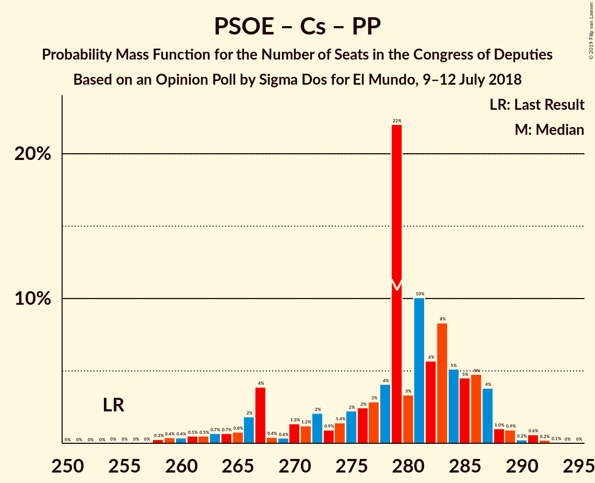

# Opinion Poll by Sigma Dos for El Mundo, 9–12 July 2018

<a href="#voting-intentions">Voting Intentions</a> | <a href="#seats">Seats</a> | <a href="#coalitions">Coalitions</a> | <a href="#technical-information">Technical Information</a>

## Voting Intentions

### Confidence Intervals

| Party | Last Result | Poll Result | 80% Confidence Interval | 90% Confidence Interval | 95% Confidence Interval | 99% Confidence Interval |
|:-----:|:-----------:|:-----------:|:-----------------------:|:-----------------------:|:-----------------------:|:-----------------------:|
| Partido Socialista Obrero Español | 22.6% | 26.3% | 24.6–28.2% |24.1–28.7% |23.7–29.1% |22.8–30.0% |
| Ciudadanos–Partido de la Ciudadanía | 13.1% | 24.2% | 22.5–26.0% |22.1–26.5% |21.6–27.0% |20.9–27.8% |
| Partido Popular | 33.0% | 22.3% | 20.7–24.1% |20.2–24.6% |19.8–25.0% |19.1–25.8% |
| Unidos Podemos | 21.2% | 16.1% | 14.7–17.7% |14.3–18.1% |13.9–18.5% |13.3–19.3% |
| Esquerra Republicana de Catalunya–Catalunya Sí | 2.7% | 3.2% | 2.6–4.0% |2.4–4.3% |2.3–4.5% |2.0–4.9% |
| Partit Demòcrata Europeu Català | 2.0% | 1.2% | 0.9–1.8% |0.8–1.9% |0.7–2.1% |0.5–2.4% |
| Euzko Alderdi Jeltzalea/Partido Nacionalista Vasco | 1.2% | 1.1% | 0.8–1.7% |0.7–1.8% |0.6–2.0% |0.5–2.3% |

*Note:* The poll result column reflects the actual value used in the calculations. Published results may vary slightly, and in addition be rounded to fewer digits.

## Seats

### Confidence Intervals

| Party | Last Result | Median | 80% Confidence Interval | 90% Confidence Interval | 95% Confidence Interval | 99% Confidence Interval |
|:-----:|:-----------:|:------:|:-----------------------:|:-----------------------:|:-----------------------:|:-----------------------:|
| <a href="#partido-socialista-obrero-español">Partido Socialista Obrero Español</a> | 85 | 106 | 95–114 |93–117 |90–118 |88–124 |
| <a href="#ciudadanos–partido-de-la-ciudadanía">Ciudadanos–Partido de la Ciudadanía</a> | 32 | 85 | 75–95 |74–98 |72–101 |71–105 |
| <a href="#partido-popular">Partido Popular</a> | 137 | 88 | 79–94 |77–97 |75–100 |73–104 |
| <a href="#unidos-podemos">Unidos Podemos</a> | 71 | 45 | 39–56 |37–60 |36–63 |34–66 |
| <a href="#esquerra-republicana-de-catalunya–catalunya-sí">Esquerra Republicana de Catalunya–Catalunya Sí</a> | 9 | 13 | 9–15 |9–15 |9–17 |8–18 |
| <a href="#partit-demòcrata-europeu-català">Partit Demòcrata Europeu Català</a> | 8 | 4 | 1–6 |1–6 |1–7 |1–8 |
| <a href="#euzko-alderdi-jeltzalea/partido-nacionalista-vasco">Euzko Alderdi Jeltzalea/Partido Nacionalista Vasco</a> | 5 | 6 | 3–8 |3–8 |2–8 |2–10 |

### Partido Socialista Obrero Español

*For a full overview of the results for this party, see the [Partido Socialista Obrero Español](party-partidosocialistaobreroespañol.html) page.*

| Number of Seats | Probability | Accumulated | Special Marks |
|:---------------:|:-----------:|:-----------:|:-------------:|
| 84 | 0.1% | 100% |  |
| 85 | 0% | 99.9% | Last Result |
| 86 | 0.1% | 99.9% |  |
| 87 | 0.1% | 99.8% |  |
| 88 | 0.4% | 99.6% |  |
| 89 | 0.6% | 99.3% |  |
| 90 | 1.5% | 98.7% |  |
| 91 | 0.6% | 97% |  |
| 92 | 2% | 97% |  |
| 93 | 2% | 95% |  |
| 94 | 3% | 94% |  |
| 95 | 1.2% | 91% |  |
| 96 | 1.3% | 89% |  |
| 97 | 3% | 88% |  |
| 98 | 2% | 86% |  |
| 99 | 5% | 84% |  |
| 100 | 4% | 79% |  |
| 101 | 3% | 75% |  |
| 102 | 2% | 72% |  |
| 103 | 9% | 70% |  |
| 104 | 3% | 61% |  |
| 105 | 4% | 58% |  |
| 106 | 4% | 54% | Median |
| 107 | 5% | 49% |  |
| 108 | 2% | 44% |  |
| 109 | 15% | 42% |  |
| 110 | 2% | 27% |  |
| 111 | 0.5% | 25% |  |
| 112 | 7% | 24% |  |
| 113 | 6% | 17% |  |
| 114 | 4% | 11% |  |
| 115 | 1.3% | 8% |  |
| 116 | 0.8% | 6% |  |
| 117 | 2% | 6% |  |
| 118 | 1.0% | 3% |  |
| 119 | 0.8% | 2% |  |
| 120 | 0.2% | 2% |  |
| 121 | 0.2% | 1.5% |  |
| 122 | 0.3% | 1.2% |  |
| 123 | 0.3% | 0.9% |  |
| 124 | 0.2% | 0.6% |  |
| 125 | 0.2% | 0.4% |  |
| 126 | 0% | 0.2% |  |
| 127 | 0% | 0.1% |  |
| 128 | 0.1% | 0.1% |  |
| 129 | 0% | 0% |  |

### Ciudadanos–Partido de la Ciudadanía

*For a full overview of the results for this party, see the [Ciudadanos–Partido de la Ciudadanía](party-ciudadanos–partidodelaciudadanía.html) page.*

| Number of Seats | Probability | Accumulated | Special Marks |
|:---------------:|:-----------:|:-----------:|:-------------:|
| 32 | 0% | 100% | Last Result |
| 33 | 0% | 100% |  |
| 34 | 0% | 100% |  |
| 35 | 0% | 100% |  |
| 36 | 0% | 100% |  |
| 37 | 0% | 100% |  |
| 38 | 0% | 100% |  |
| 39 | 0% | 100% |  |
| 40 | 0% | 100% |  |
| 41 | 0% | 100% |  |
| 42 | 0% | 100% |  |
| 43 | 0% | 100% |  |
| 44 | 0% | 100% |  |
| 45 | 0% | 100% |  |
| 46 | 0% | 100% |  |
| 47 | 0% | 100% |  |
| 48 | 0% | 100% |  |
| 49 | 0% | 100% |  |
| 50 | 0% | 100% |  |
| 51 | 0% | 100% |  |
| 52 | 0% | 100% |  |
| 53 | 0% | 100% |  |
| 54 | 0% | 100% |  |
| 55 | 0% | 100% |  |
| 56 | 0% | 100% |  |
| 57 | 0% | 100% |  |
| 58 | 0% | 100% |  |
| 59 | 0% | 100% |  |
| 60 | 0% | 100% |  |
| 61 | 0% | 100% |  |
| 62 | 0% | 100% |  |
| 63 | 0% | 100% |  |
| 64 | 0% | 100% |  |
| 65 | 0% | 100% |  |
| 66 | 0% | 100% |  |
| 67 | 0% | 100% |  |
| 68 | 0.1% | 99.9% |  |
| 69 | 0.1% | 99.8% |  |
| 70 | 0.1% | 99.8% |  |
| 71 | 0.2% | 99.6% |  |
| 72 | 3% | 99.4% |  |
| 73 | 1.4% | 97% |  |
| 74 | 4% | 95% |  |
| 75 | 2% | 91% |  |
| 76 | 2% | 89% |  |
| 77 | 2% | 87% |  |
| 78 | 4% | 85% |  |
| 79 | 2% | 81% |  |
| 80 | 5% | 79% |  |
| 81 | 2% | 74% |  |
| 82 | 1.5% | 72% |  |
| 83 | 16% | 70% |  |
| 84 | 2% | 55% |  |
| 85 | 10% | 52% | Median |
| 86 | 5% | 43% |  |
| 87 | 4% | 38% |  |
| 88 | 4% | 34% |  |
| 89 | 2% | 29% |  |
| 90 | 6% | 27% |  |
| 91 | 4% | 21% |  |
| 92 | 0.9% | 17% |  |
| 93 | 0.6% | 16% |  |
| 94 | 4% | 16% |  |
| 95 | 4% | 12% |  |
| 96 | 1.0% | 8% |  |
| 97 | 2% | 7% |  |
| 98 | 2% | 5% |  |
| 99 | 0.2% | 3% |  |
| 100 | 0.4% | 3% |  |
| 101 | 0.4% | 3% |  |
| 102 | 0.9% | 2% |  |
| 103 | 0.7% | 2% |  |
| 104 | 0.3% | 0.8% |  |
| 105 | 0.1% | 0.5% |  |
| 106 | 0.1% | 0.4% |  |
| 107 | 0.2% | 0.3% |  |
| 108 | 0% | 0.1% |  |
| 109 | 0% | 0.1% |  |
| 110 | 0% | 0% |  |

### Partido Popular

*For a full overview of the results for this party, see the [Partido Popular](party-partidopopular.html) page.*

| Number of Seats | Probability | Accumulated | Special Marks |
|:---------------:|:-----------:|:-----------:|:-------------:|
| 68 | 0% | 100% |  |
| 69 | 0% | 99.9% |  |
| 70 | 0.1% | 99.9% |  |
| 71 | 0.1% | 99.8% |  |
| 72 | 0.2% | 99.7% |  |
| 73 | 0.3% | 99.5% |  |
| 74 | 0.6% | 99.2% |  |
| 75 | 1.4% | 98.7% |  |
| 76 | 2% | 97% |  |
| 77 | 2% | 96% |  |
| 78 | 2% | 93% |  |
| 79 | 2% | 91% |  |
| 80 | 4% | 89% |  |
| 81 | 1.2% | 86% |  |
| 82 | 2% | 84% |  |
| 83 | 4% | 82% |  |
| 84 | 5% | 78% |  |
| 85 | 0.4% | 73% |  |
| 86 | 4% | 73% |  |
| 87 | 17% | 69% |  |
| 88 | 4% | 52% | Median |
| 89 | 4% | 48% |  |
| 90 | 2% | 44% |  |
| 91 | 2% | 42% |  |
| 92 | 6% | 40% |  |
| 93 | 16% | 34% |  |
| 94 | 9% | 18% |  |
| 95 | 2% | 9% |  |
| 96 | 0.8% | 6% |  |
| 97 | 1.1% | 5% |  |
| 98 | 1.1% | 4% |  |
| 99 | 0.3% | 3% |  |
| 100 | 0.7% | 3% |  |
| 101 | 0.3% | 2% |  |
| 102 | 0.9% | 2% |  |
| 103 | 0.4% | 1.2% |  |
| 104 | 0.3% | 0.7% |  |
| 105 | 0.1% | 0.4% |  |
| 106 | 0.1% | 0.4% |  |
| 107 | 0.1% | 0.3% |  |
| 108 | 0% | 0.3% |  |
| 109 | 0% | 0.2% |  |
| 110 | 0.1% | 0.2% |  |
| 111 | 0.1% | 0.1% |  |
| 112 | 0% | 0.1% |  |
| 113 | 0% | 0.1% |  |
| 114 | 0% | 0% |  |
| 115 | 0% | 0% |  |
| 116 | 0% | 0% |  |
| 117 | 0% | 0% |  |
| 118 | 0% | 0% |  |
| 119 | 0% | 0% |  |
| 120 | 0% | 0% |  |
| 121 | 0% | 0% |  |
| 122 | 0% | 0% |  |
| 123 | 0% | 0% |  |
| 124 | 0% | 0% |  |
| 125 | 0% | 0% |  |
| 126 | 0% | 0% |  |
| 127 | 0% | 0% |  |
| 128 | 0% | 0% |  |
| 129 | 0% | 0% |  |
| 130 | 0% | 0% |  |
| 131 | 0% | 0% |  |
| 132 | 0% | 0% |  |
| 133 | 0% | 0% |  |
| 134 | 0% | 0% |  |
| 135 | 0% | 0% |  |
| 136 | 0% | 0% |  |
| 137 | 0% | 0% | Last Result |

### Unidos Podemos

*For a full overview of the results for this party, see the [Unidos Podemos](party-unidospodemos.html) page.*

| Number of Seats | Probability | Accumulated | Special Marks |
|:---------------:|:-----------:|:-----------:|:-------------:|
| 31 | 0.1% | 100% |  |
| 32 | 0.1% | 99.9% |  |
| 33 | 0.1% | 99.8% |  |
| 34 | 0.6% | 99.7% |  |
| 35 | 0.9% | 99.1% |  |
| 36 | 0.9% | 98% |  |
| 37 | 3% | 97% |  |
| 38 | 3% | 95% |  |
| 39 | 3% | 92% |  |
| 40 | 9% | 89% |  |
| 41 | 8% | 81% |  |
| 42 | 9% | 73% |  |
| 43 | 5% | 64% |  |
| 44 | 1.0% | 59% |  |
| 45 | 15% | 58% | Median |
| 46 | 7% | 43% |  |
| 47 | 6% | 36% |  |
| 48 | 8% | 31% |  |
| 49 | 4% | 23% |  |
| 50 | 2% | 19% |  |
| 51 | 2% | 17% |  |
| 52 | 1.3% | 15% |  |
| 53 | 2% | 14% |  |
| 54 | 1.3% | 13% |  |
| 55 | 1.0% | 11% |  |
| 56 | 0.7% | 10% |  |
| 57 | 2% | 10% |  |
| 58 | 0.7% | 8% |  |
| 59 | 0.3% | 7% |  |
| 60 | 3% | 6% |  |
| 61 | 1.1% | 4% |  |
| 62 | 0.1% | 3% |  |
| 63 | 2% | 3% |  |
| 64 | 0.5% | 1.1% |  |
| 65 | 0.1% | 0.6% |  |
| 66 | 0.3% | 0.5% |  |
| 67 | 0.2% | 0.2% |  |
| 68 | 0% | 0.1% |  |
| 69 | 0% | 0% |  |
| 70 | 0% | 0% |  |
| 71 | 0% | 0% | Last Result |

### Esquerra Republicana de Catalunya–Catalunya Sí

*For a full overview of the results for this party, see the [Esquerra Republicana de Catalunya–Catalunya Sí](party-esquerrarepublicanadecatalunya–catalunyasí.html) page.*

| Number of Seats | Probability | Accumulated | Special Marks |
|:---------------:|:-----------:|:-----------:|:-------------:|
| 7 | 0.4% | 100% |  |
| 8 | 1.4% | 99.6% |  |
| 9 | 11% | 98% | Last Result |
| 10 | 4% | 88% |  |
| 11 | 6% | 84% |  |
| 12 | 23% | 78% |  |
| 13 | 29% | 54% | Median |
| 14 | 10% | 25% |  |
| 15 | 11% | 15% |  |
| 16 | 0.9% | 4% |  |
| 17 | 0.8% | 3% |  |
| 18 | 2% | 2% |  |
| 19 | 0.1% | 0.2% |  |
| 20 | 0.1% | 0.1% |  |
| 21 | 0% | 0% |  |

### Partit Demòcrata Europeu Català

*For a full overview of the results for this party, see the [Partit Demòcrata Europeu Català](party-partitdemòcrataeuropeucatalà.html) page.*

| Number of Seats | Probability | Accumulated | Special Marks |
|:---------------:|:-----------:|:-----------:|:-------------:|
| 0 | 0.1% | 100% |  |
| 1 | 11% | 99.9% |  |
| 2 | 5% | 89% |  |
| 3 | 20% | 84% |  |
| 4 | 36% | 64% | Median |
| 5 | 7% | 28% |  |
| 6 | 18% | 21% |  |
| 7 | 2% | 4% |  |
| 8 | 1.2% | 1.4% | Last Result |
| 9 | 0.1% | 0.2% |  |
| 10 | 0.1% | 0.2% |  |
| 11 | 0% | 0% |  |

### Euzko Alderdi Jeltzalea/Partido Nacionalista Vasco

*For a full overview of the results for this party, see the [Euzko Alderdi Jeltzalea/Partido Nacionalista Vasco](party-euzkoalderdijeltzaleapartidonacionalistavasco.html) page.*

| Number of Seats | Probability | Accumulated | Special Marks |
|:---------------:|:-----------:|:-----------:|:-------------:|
| 1 | 0.2% | 100% |  |
| 2 | 2% | 99.8% |  |
| 3 | 15% | 97% |  |
| 4 | 13% | 83% |  |
| 5 | 1.0% | 70% | Last Result |
| 6 | 51% | 69% | Median |
| 7 | 7% | 18% |  |
| 8 | 9% | 10% |  |
| 9 | 0.9% | 1.5% |  |
| 10 | 0.5% | 0.5% |  |
| 11 | 0% | 0% |  |

## Coalitions

### Confidence Intervals

| Coalition | Last Result | Median | Majority? | 80% Confidence Interval | 90% Confidence Interval | 95% Confidence Interval | 99% Confidence Interval |
|:---------:|:-----------:|:------:|:---------:|:-----------------------:|:-----------------------:|:-----------------------:|:-----------------------:|
| Partido Socialista Obrero Español – Ciudadanos–Partido de la Ciudadanía – Partido Popular | 254 | 279 | 100% | 268–286 | 266–287 | 263–288 | 259–291 |
| Partido Socialista Obrero Español – Ciudadanos–Partido de la Ciudadanía – Unidos Podemos | 188 | 236 | 100% | 229–245 | 226–248 | 224–250 | 219–253 |
| Partido Socialista Obrero Español – Partido Popular | 222 | 196 | 98% | 182–203 | 178–206 | 176–208 | 169–211 |
| Partido Socialista Obrero Español – Ciudadanos–Partido de la Ciudadanía | 117 | 192 | 96% | 180–201 | 176–204 | 172–206 | 166–211 |
| Ciudadanos–Partido de la Ciudadanía – Partido Popular | 169 | 172 | 40% | 164–183 | 161–187 | 159–188 | 155–193 |
| Partido Socialista Obrero Español – Unidos Podemos – Esquerra Republicana de Catalunya–Catalunya Sí – Partit Demòcrata Europeu Català | 173 | 170 | 13% | 158–177 | 155–180 | 152–182 | 148–186 |
| Partido Socialista Obrero Español – Unidos Podemos | 156 | 152 | 0.1% | 141–161 | 139–165 | 135–166 | 131–171 |
| Partido Socialista Obrero Español | 85 | 106 | 0% | 95–114 | 93–117 | 90–118 | 88–124 |
| Partido Popular | 137 | 88 | 0% | 79–94 | 77–97 | 75–100 | 73–104 |

### Partido Socialista Obrero Español – Ciudadanos–Partido de la Ciudadanía – Partido Popular

| Number of Seats | Probability | Accumulated | Special Marks |
|:---------------:|:-----------:|:-----------:|:-------------:|
| 254 | 0% | 100% | Last Result |
| 255 | 0% | 100% |  |
| 256 | 0% | 100% |  |
| 257 | 0% | 100% |  |
| 258 | 0.3% | 99.9% |  |
| 259 | 0.4% | 99.7% |  |
| 260 | 0.4% | 99.3% |  |
| 261 | 0.5% | 98.9% |  |
| 262 | 0.5% | 98% |  |
| 263 | 0.7% | 98% |  |
| 264 | 0.7% | 97% |  |
| 265 | 0.8% | 97% |  |
| 266 | 2% | 96% |  |
| 267 | 4% | 94% |  |
| 268 | 0.4% | 90% |  |
| 269 | 0.4% | 90% |  |
| 270 | 1.3% | 89% |  |
| 271 | 1.2% | 88% |  |
| 272 | 2% | 87% |  |
| 273 | 0.9% | 85% |  |
| 274 | 1.4% | 84% |  |
| 275 | 2% | 82% |  |
| 276 | 2% | 80% |  |
| 277 | 3% | 78% |  |
| 278 | 4% | 75% |  |
| 279 | 22% | 71% | Median |
| 280 | 3% | 49% |  |
| 281 | 10% | 45% |  |
| 282 | 6% | 35% |  |
| 283 | 8% | 30% |  |
| 284 | 5% | 21% |  |
| 285 | 5% | 16% |  |
| 286 | 5% | 12% |  |
| 287 | 4% | 7% |  |
| 288 | 1.0% | 3% |  |
| 289 | 0.9% | 2% |  |
| 290 | 0.2% | 1.2% |  |
| 291 | 0.6% | 0.9% |  |
| 292 | 0.2% | 0.3% |  |
| 293 | 0.1% | 0.1% |  |
| 294 | 0% | 0% |  |

### Partido Socialista Obrero Español – Ciudadanos–Partido de la Ciudadanía – Unidos Podemos

| Number of Seats | Probability | Accumulated | Special Marks |
|:---------------:|:-----------:|:-----------:|:-------------:|
| 188 | 0% | 100% | Last Result |
| 189 | 0% | 100% |  |
| 190 | 0% | 100% |  |
| 191 | 0% | 100% |  |
| 192 | 0% | 100% |  |
| 193 | 0% | 100% |  |
| 194 | 0% | 100% |  |
| 195 | 0% | 100% |  |
| 196 | 0% | 100% |  |
| 197 | 0% | 100% |  |
| 198 | 0% | 100% |  |
| 199 | 0% | 100% |  |
| 200 | 0% | 100% |  |
| 201 | 0% | 100% |  |
| 202 | 0% | 100% |  |
| 203 | 0% | 100% |  |
| 204 | 0% | 100% |  |
| 205 | 0% | 100% |  |
| 206 | 0% | 100% |  |
| 207 | 0% | 100% |  |
| 208 | 0% | 100% |  |
| 209 | 0% | 100% |  |
| 210 | 0% | 100% |  |
| 211 | 0% | 100% |  |
| 212 | 0% | 99.9% |  |
| 213 | 0% | 99.9% |  |
| 214 | 0.1% | 99.9% |  |
| 215 | 0.1% | 99.8% |  |
| 216 | 0.1% | 99.8% |  |
| 217 | 0% | 99.7% |  |
| 218 | 0.2% | 99.7% |  |
| 219 | 0.2% | 99.5% |  |
| 220 | 0.5% | 99.3% |  |
| 221 | 0.1% | 98.8% |  |
| 222 | 0.1% | 98.6% |  |
| 223 | 0.8% | 98.5% |  |
| 224 | 1.5% | 98% |  |
| 225 | 0.9% | 96% |  |
| 226 | 0.8% | 95% |  |
| 227 | 0.6% | 95% |  |
| 228 | 2% | 94% |  |
| 229 | 6% | 92% |  |
| 230 | 3% | 86% |  |
| 231 | 5% | 83% |  |
| 232 | 3% | 79% |  |
| 233 | 6% | 76% |  |
| 234 | 8% | 70% |  |
| 235 | 6% | 62% |  |
| 236 | 7% | 56% | Median |
| 237 | 12% | 48% |  |
| 238 | 8% | 36% |  |
| 239 | 2% | 29% |  |
| 240 | 1.0% | 27% |  |
| 241 | 2% | 26% |  |
| 242 | 7% | 24% |  |
| 243 | 1.2% | 18% |  |
| 244 | 3% | 16% |  |
| 245 | 3% | 13% |  |
| 246 | 2% | 10% |  |
| 247 | 2% | 8% |  |
| 248 | 2% | 6% |  |
| 249 | 0.8% | 4% |  |
| 250 | 1.0% | 3% |  |
| 251 | 0.2% | 2% |  |
| 252 | 0.5% | 2% |  |
| 253 | 1.3% | 2% |  |
| 254 | 0.1% | 0.4% |  |
| 255 | 0.1% | 0.3% |  |
| 256 | 0.2% | 0.3% |  |
| 257 | 0% | 0.1% |  |
| 258 | 0% | 0.1% |  |
| 259 | 0% | 0% |  |

### Partido Socialista Obrero Español – Partido Popular

| Number of Seats | Probability | Accumulated | Special Marks |
|:---------------:|:-----------:|:-----------:|:-------------:|
| 166 | 0.1% | 100% |  |
| 167 | 0.1% | 99.9% |  |
| 168 | 0.1% | 99.8% |  |
| 169 | 0.2% | 99.7% |  |
| 170 | 0.3% | 99.5% |  |
| 171 | 0.2% | 99.2% |  |
| 172 | 0.2% | 99.1% |  |
| 173 | 0% | 98.8% |  |
| 174 | 0.1% | 98.8% |  |
| 175 | 0.6% | 98.6% |  |
| 176 | 0.7% | 98% | Majority |
| 177 | 2% | 97% |  |
| 178 | 0.8% | 95% |  |
| 179 | 0.4% | 94% |  |
| 180 | 1.1% | 94% |  |
| 181 | 0.9% | 93% |  |
| 182 | 2% | 92% |  |
| 183 | 1.4% | 90% |  |
| 184 | 1.1% | 88% |  |
| 185 | 2% | 87% |  |
| 186 | 1.1% | 85% |  |
| 187 | 2% | 84% |  |
| 188 | 1.4% | 82% |  |
| 189 | 7% | 81% |  |
| 190 | 3% | 74% |  |
| 191 | 7% | 71% |  |
| 192 | 2% | 65% |  |
| 193 | 5% | 63% |  |
| 194 | 2% | 58% | Median |
| 195 | 2% | 56% |  |
| 196 | 22% | 54% |  |
| 197 | 4% | 32% |  |
| 198 | 2% | 28% |  |
| 199 | 2% | 26% |  |
| 200 | 7% | 25% |  |
| 201 | 0.7% | 17% |  |
| 202 | 7% | 17% |  |
| 203 | 1.3% | 10% |  |
| 204 | 0.5% | 9% |  |
| 205 | 3% | 8% |  |
| 206 | 1.5% | 5% |  |
| 207 | 1.3% | 4% |  |
| 208 | 1.3% | 3% |  |
| 209 | 0.1% | 1.3% |  |
| 210 | 0.5% | 1.1% |  |
| 211 | 0.2% | 0.6% |  |
| 212 | 0.2% | 0.5% |  |
| 213 | 0.1% | 0.3% |  |
| 214 | 0.1% | 0.2% |  |
| 215 | 0% | 0.1% |  |
| 216 | 0.1% | 0.1% |  |
| 217 | 0% | 0% |  |
| 218 | 0% | 0% |  |
| 219 | 0% | 0% |  |
| 220 | 0% | 0% |  |
| 221 | 0% | 0% |  |
| 222 | 0% | 0% | Last Result |

### Partido Socialista Obrero Español – Ciudadanos–Partido de la Ciudadanía

| Number of Seats | Probability | Accumulated | Special Marks |
|:---------------:|:-----------:|:-----------:|:-------------:|
| 117 | 0% | 100% | Last Result |
| 118 | 0% | 100% |  |
| 119 | 0% | 100% |  |
| 120 | 0% | 100% |  |
| 121 | 0% | 100% |  |
| 122 | 0% | 100% |  |
| 123 | 0% | 100% |  |
| 124 | 0% | 100% |  |
| 125 | 0% | 100% |  |
| 126 | 0% | 100% |  |
| 127 | 0% | 100% |  |
| 128 | 0% | 100% |  |
| 129 | 0% | 100% |  |
| 130 | 0% | 100% |  |
| 131 | 0% | 100% |  |
| 132 | 0% | 100% |  |
| 133 | 0% | 100% |  |
| 134 | 0% | 100% |  |
| 135 | 0% | 100% |  |
| 136 | 0% | 100% |  |
| 137 | 0% | 100% |  |
| 138 | 0% | 100% |  |
| 139 | 0% | 100% |  |
| 140 | 0% | 100% |  |
| 141 | 0% | 100% |  |
| 142 | 0% | 100% |  |
| 143 | 0% | 100% |  |
| 144 | 0% | 100% |  |
| 145 | 0% | 100% |  |
| 146 | 0% | 100% |  |
| 147 | 0% | 100% |  |
| 148 | 0% | 100% |  |
| 149 | 0% | 100% |  |
| 150 | 0% | 100% |  |
| 151 | 0% | 100% |  |
| 152 | 0% | 100% |  |
| 153 | 0% | 100% |  |
| 154 | 0% | 100% |  |
| 155 | 0% | 100% |  |
| 156 | 0% | 100% |  |
| 157 | 0% | 100% |  |
| 158 | 0% | 100% |  |
| 159 | 0% | 100% |  |
| 160 | 0% | 100% |  |
| 161 | 0% | 100% |  |
| 162 | 0% | 100% |  |
| 163 | 0% | 100% |  |
| 164 | 0.1% | 100% |  |
| 165 | 0.2% | 99.9% |  |
| 166 | 0.2% | 99.6% |  |
| 167 | 0.2% | 99.4% |  |
| 168 | 0.2% | 99.2% |  |
| 169 | 0.2% | 99.0% |  |
| 170 | 0.1% | 98.8% |  |
| 171 | 0.8% | 98.7% |  |
| 172 | 0.9% | 98% |  |
| 173 | 0.2% | 97% |  |
| 174 | 0.3% | 97% |  |
| 175 | 0.6% | 96% |  |
| 176 | 2% | 96% | Majority |
| 177 | 1.4% | 94% |  |
| 178 | 0.5% | 93% |  |
| 179 | 2% | 92% |  |
| 180 | 1.1% | 91% |  |
| 181 | 0.4% | 90% |  |
| 182 | 0.4% | 89% |  |
| 183 | 0.5% | 89% |  |
| 184 | 6% | 88% |  |
| 185 | 2% | 83% |  |
| 186 | 7% | 81% |  |
| 187 | 2% | 73% |  |
| 188 | 5% | 72% |  |
| 189 | 5% | 66% |  |
| 190 | 5% | 61% |  |
| 191 | 3% | 56% | Median |
| 192 | 20% | 52% |  |
| 193 | 4% | 33% |  |
| 194 | 4% | 29% |  |
| 195 | 4% | 25% |  |
| 196 | 2% | 21% |  |
| 197 | 1.5% | 19% |  |
| 198 | 0.7% | 18% |  |
| 199 | 2% | 17% |  |
| 200 | 3% | 15% |  |
| 201 | 4% | 12% |  |
| 202 | 0.3% | 8% |  |
| 203 | 2% | 8% |  |
| 204 | 1.3% | 6% |  |
| 205 | 0.7% | 5% |  |
| 206 | 2% | 4% |  |
| 207 | 0.7% | 2% |  |
| 208 | 0.2% | 1.2% |  |
| 209 | 0.3% | 1.0% |  |
| 210 | 0.2% | 0.7% |  |
| 211 | 0.1% | 0.5% |  |
| 212 | 0.2% | 0.4% |  |
| 213 | 0% | 0.1% |  |
| 214 | 0% | 0.1% |  |
| 215 | 0% | 0.1% |  |
| 216 | 0% | 0% |  |

### Ciudadanos–Partido de la Ciudadanía – Partido Popular

| Number of Seats | Probability | Accumulated | Special Marks |
|:---------------:|:-----------:|:-----------:|:-------------:|
| 149 | 0% | 100% |  |
| 150 | 0% | 99.9% |  |
| 151 | 0.1% | 99.9% |  |
| 152 | 0.1% | 99.8% |  |
| 153 | 0.1% | 99.7% |  |
| 154 | 0% | 99.6% |  |
| 155 | 0.2% | 99.6% |  |
| 156 | 0.4% | 99.4% |  |
| 157 | 0.1% | 99.0% |  |
| 158 | 1.0% | 98.8% |  |
| 159 | 1.3% | 98% |  |
| 160 | 0.8% | 97% |  |
| 161 | 1.0% | 96% |  |
| 162 | 1.0% | 95% |  |
| 163 | 1.4% | 94% |  |
| 164 | 3% | 92% |  |
| 165 | 3% | 90% |  |
| 166 | 1.4% | 87% |  |
| 167 | 6% | 85% |  |
| 168 | 2% | 80% |  |
| 169 | 5% | 77% | Last Result |
| 170 | 18% | 72% |  |
| 171 | 2% | 54% |  |
| 172 | 4% | 52% |  |
| 173 | 5% | 48% | Median |
| 174 | 2% | 43% |  |
| 175 | 2% | 41% |  |
| 176 | 0.7% | 40% | Majority |
| 177 | 4% | 39% |  |
| 178 | 10% | 35% |  |
| 179 | 4% | 25% |  |
| 180 | 5% | 21% |  |
| 181 | 1.4% | 15% |  |
| 182 | 2% | 14% |  |
| 183 | 3% | 12% |  |
| 184 | 1.2% | 9% |  |
| 185 | 0.4% | 8% |  |
| 186 | 2% | 8% |  |
| 187 | 3% | 6% |  |
| 188 | 1.2% | 3% |  |
| 189 | 0.4% | 2% |  |
| 190 | 0.2% | 2% |  |
| 191 | 0.6% | 2% |  |
| 192 | 0.1% | 1.2% |  |
| 193 | 0.6% | 1.1% |  |
| 194 | 0.1% | 0.5% |  |
| 195 | 0.1% | 0.4% |  |
| 196 | 0% | 0.3% |  |
| 197 | 0.2% | 0.3% |  |
| 198 | 0% | 0.1% |  |
| 199 | 0% | 0% |  |

### Partido Socialista Obrero Español – Unidos Podemos – Esquerra Republicana de Catalunya–Catalunya Sí – Partit Demòcrata Europeu Català

| Number of Seats | Probability | Accumulated | Special Marks |
|:---------------:|:-----------:|:-----------:|:-------------:|
| 143 | 0.1% | 100% |  |
| 144 | 0.1% | 99.9% |  |
| 145 | 0.1% | 99.7% |  |
| 146 | 0% | 99.7% |  |
| 147 | 0.1% | 99.6% |  |
| 148 | 0.6% | 99.6% |  |
| 149 | 0.2% | 98.9% |  |
| 150 | 0.6% | 98.8% |  |
| 151 | 0.1% | 98% |  |
| 152 | 0.6% | 98% |  |
| 153 | 0.6% | 97% |  |
| 154 | 0.9% | 97% |  |
| 155 | 3% | 96% |  |
| 156 | 2% | 93% |  |
| 157 | 0.7% | 91% |  |
| 158 | 3% | 90% |  |
| 159 | 2% | 87% |  |
| 160 | 2% | 86% |  |
| 161 | 4% | 83% |  |
| 162 | 5% | 79% |  |
| 163 | 7% | 74% |  |
| 164 | 2% | 67% |  |
| 165 | 4% | 65% |  |
| 166 | 2% | 61% |  |
| 167 | 4% | 59% |  |
| 168 | 3% | 55% | Median |
| 169 | 2% | 52% |  |
| 170 | 5% | 50% |  |
| 171 | 17% | 46% |  |
| 172 | 1.3% | 28% |  |
| 173 | 5% | 27% | Last Result |
| 174 | 4% | 21% |  |
| 175 | 5% | 17% |  |
| 176 | 1.0% | 13% | Majority |
| 177 | 2% | 12% |  |
| 178 | 1.3% | 10% |  |
| 179 | 3% | 8% |  |
| 180 | 0.9% | 6% |  |
| 181 | 0.9% | 5% |  |
| 182 | 2% | 4% |  |
| 183 | 0.2% | 2% |  |
| 184 | 0.1% | 1.3% |  |
| 185 | 0.5% | 1.2% |  |
| 186 | 0.3% | 0.7% |  |
| 187 | 0% | 0.4% |  |
| 188 | 0.1% | 0.4% |  |
| 189 | 0.1% | 0.3% |  |
| 190 | 0.1% | 0.3% |  |
| 191 | 0.1% | 0.2% |  |
| 192 | 0% | 0% |  |

### Partido Socialista Obrero Español – Unidos Podemos

| Number of Seats | Probability | Accumulated | Special Marks |
|:---------------:|:-----------:|:-----------:|:-------------:|
| 125 | 0% | 100% |  |
| 126 | 0% | 99.9% |  |
| 127 | 0% | 99.9% |  |
| 128 | 0.1% | 99.9% |  |
| 129 | 0% | 99.8% |  |
| 130 | 0.2% | 99.7% |  |
| 131 | 0.1% | 99.5% |  |
| 132 | 0.7% | 99.4% |  |
| 133 | 0.6% | 98.7% |  |
| 134 | 0.4% | 98% |  |
| 135 | 0.3% | 98% |  |
| 136 | 0.1% | 97% |  |
| 137 | 0.4% | 97% |  |
| 138 | 2% | 97% |  |
| 139 | 4% | 95% |  |
| 140 | 0.6% | 91% |  |
| 141 | 1.0% | 91% |  |
| 142 | 4% | 90% |  |
| 143 | 5% | 86% |  |
| 144 | 3% | 81% |  |
| 145 | 2% | 78% |  |
| 146 | 2% | 77% |  |
| 147 | 5% | 75% |  |
| 148 | 0.9% | 70% |  |
| 149 | 2% | 69% |  |
| 150 | 6% | 67% |  |
| 151 | 8% | 61% | Median |
| 152 | 3% | 53% |  |
| 153 | 2% | 50% |  |
| 154 | 18% | 48% |  |
| 155 | 9% | 31% |  |
| 156 | 2% | 22% | Last Result |
| 157 | 0.5% | 19% |  |
| 158 | 1.0% | 19% |  |
| 159 | 6% | 18% |  |
| 160 | 2% | 12% |  |
| 161 | 1.4% | 10% |  |
| 162 | 0.8% | 9% |  |
| 163 | 0.9% | 8% |  |
| 164 | 2% | 7% |  |
| 165 | 2% | 5% |  |
| 166 | 1.2% | 3% |  |
| 167 | 0.5% | 2% |  |
| 168 | 0.6% | 2% |  |
| 169 | 0.2% | 1.0% |  |
| 170 | 0.3% | 0.8% |  |
| 171 | 0.1% | 0.5% |  |
| 172 | 0% | 0.4% |  |
| 173 | 0.1% | 0.4% |  |
| 174 | 0.1% | 0.3% |  |
| 175 | 0.1% | 0.2% |  |
| 176 | 0% | 0.1% | Majority |
| 177 | 0% | 0% |  |

### Partido Socialista Obrero Español

| Number of Seats | Probability | Accumulated | Special Marks |
|:---------------:|:-----------:|:-----------:|:-------------:|
| 84 | 0.1% | 100% |  |
| 85 | 0% | 99.9% | Last Result |
| 86 | 0.1% | 99.9% |  |
| 87 | 0.1% | 99.8% |  |
| 88 | 0.4% | 99.6% |  |
| 89 | 0.6% | 99.3% |  |
| 90 | 1.5% | 98.7% |  |
| 91 | 0.6% | 97% |  |
| 92 | 2% | 97% |  |
| 93 | 2% | 95% |  |
| 94 | 3% | 94% |  |
| 95 | 1.2% | 91% |  |
| 96 | 1.3% | 89% |  |
| 97 | 3% | 88% |  |
| 98 | 2% | 86% |  |
| 99 | 5% | 84% |  |
| 100 | 4% | 79% |  |
| 101 | 3% | 75% |  |
| 102 | 2% | 72% |  |
| 103 | 9% | 70% |  |
| 104 | 3% | 61% |  |
| 105 | 4% | 58% |  |
| 106 | 4% | 54% | Median |
| 107 | 5% | 49% |  |
| 108 | 2% | 44% |  |
| 109 | 15% | 42% |  |
| 110 | 2% | 27% |  |
| 111 | 0.5% | 25% |  |
| 112 | 7% | 24% |  |
| 113 | 6% | 17% |  |
| 114 | 4% | 11% |  |
| 115 | 1.3% | 8% |  |
| 116 | 0.8% | 6% |  |
| 117 | 2% | 6% |  |
| 118 | 1.0% | 3% |  |
| 119 | 0.8% | 2% |  |
| 120 | 0.2% | 2% |  |
| 121 | 0.2% | 1.5% |  |
| 122 | 0.3% | 1.2% |  |
| 123 | 0.3% | 0.9% |  |
| 124 | 0.2% | 0.6% |  |
| 125 | 0.2% | 0.4% |  |
| 126 | 0% | 0.2% |  |
| 127 | 0% | 0.1% |  |
| 128 | 0.1% | 0.1% |  |
| 129 | 0% | 0% |  |

### Partido Popular

| Number of Seats | Probability | Accumulated | Special Marks |
|:---------------:|:-----------:|:-----------:|:-------------:|
| 68 | 0% | 100% |  |
| 69 | 0% | 99.9% |  |
| 70 | 0.1% | 99.9% |  |
| 71 | 0.1% | 99.8% |  |
| 72 | 0.2% | 99.7% |  |
| 73 | 0.3% | 99.5% |  |
| 74 | 0.6% | 99.2% |  |
| 75 | 1.4% | 98.7% |  |
| 76 | 2% | 97% |  |
| 77 | 2% | 96% |  |
| 78 | 2% | 93% |  |
| 79 | 2% | 91% |  |
| 80 | 4% | 89% |  |
| 81 | 1.2% | 86% |  |
| 82 | 2% | 84% |  |
| 83 | 4% | 82% |  |
| 84 | 5% | 78% |  |
| 85 | 0.4% | 73% |  |
| 86 | 4% | 73% |  |
| 87 | 17% | 69% |  |
| 88 | 4% | 52% | Median |
| 89 | 4% | 48% |  |
| 90 | 2% | 44% |  |
| 91 | 2% | 42% |  |
| 92 | 6% | 40% |  |
| 93 | 16% | 34% |  |
| 94 | 9% | 18% |  |
| 95 | 2% | 9% |  |
| 96 | 0.8% | 6% |  |
| 97 | 1.1% | 5% |  |
| 98 | 1.1% | 4% |  |
| 99 | 0.3% | 3% |  |
| 100 | 0.7% | 3% |  |
| 101 | 0.3% | 2% |  |
| 102 | 0.9% | 2% |  |
| 103 | 0.4% | 1.2% |  |
| 104 | 0.3% | 0.7% |  |
| 105 | 0.1% | 0.4% |  |
| 106 | 0.1% | 0.4% |  |
| 107 | 0.1% | 0.3% |  |
| 108 | 0% | 0.3% |  |
| 109 | 0% | 0.2% |  |
| 110 | 0.1% | 0.2% |  |
| 111 | 0.1% | 0.1% |  |
| 112 | 0% | 0.1% |  |
| 113 | 0% | 0.1% |  |
| 114 | 0% | 0% |  |
| 115 | 0% | 0% |  |
| 116 | 0% | 0% |  |
| 117 | 0% | 0% |  |
| 118 | 0% | 0% |  |
| 119 | 0% | 0% |  |
| 120 | 0% | 0% |  |
| 121 | 0% | 0% |  |
| 122 | 0% | 0% |  |
| 123 | 0% | 0% |  |
| 124 | 0% | 0% |  |
| 125 | 0% | 0% |  |
| 126 | 0% | 0% |  |
| 127 | 0% | 0% |  |
| 128 | 0% | 0% |  |
| 129 | 0% | 0% |  |
| 130 | 0% | 0% |  |
| 131 | 0% | 0% |  |
| 132 | 0% | 0% |  |
| 133 | 0% | 0% |  |
| 134 | 0% | 0% |  |
| 135 | 0% | 0% |  |
| 136 | 0% | 0% |  |
| 137 | 0% | 0% | Last Result |

## Technical Information

### Opinion Poll

+ **Polling firm:** Sigma Dos
+ **Commissioner(s):** El Mundo
+ **Fieldwork period:** 9–12 July 2018

### Calculations

+ **Sample size:** 1000
+ **Simulations done:** 131,072
+ **Error estimate:** 1.02%

