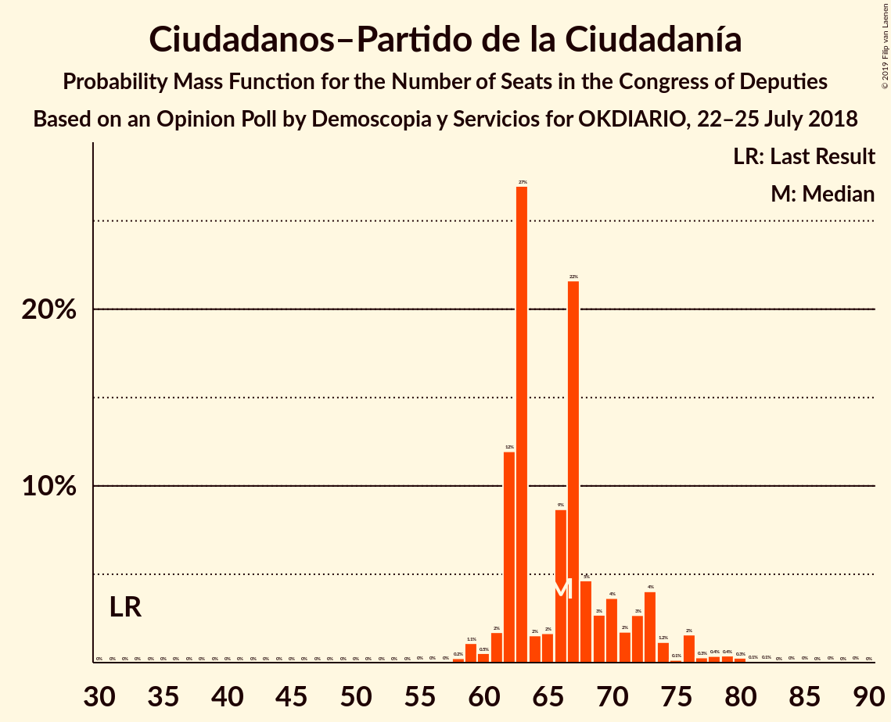
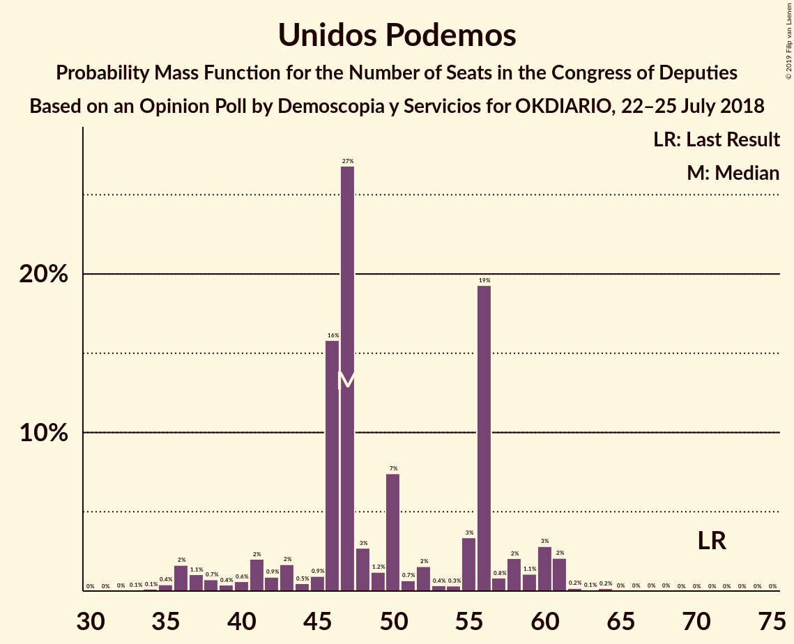
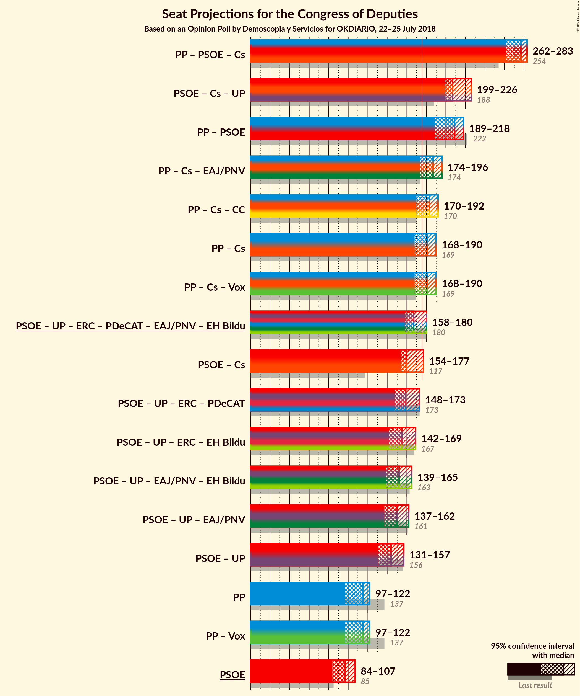
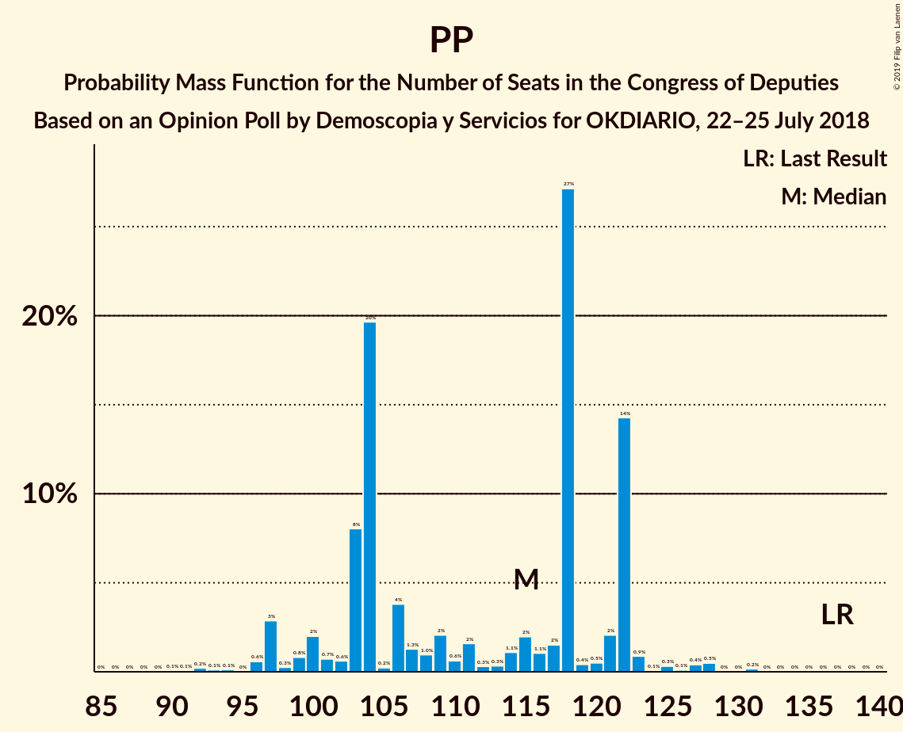

# Opinion Poll by Demoscopia y Servicios for OKDIARIO, 22–25 July 2018

<a href="#voting-intentions">Voting Intentions</a> | <a href="#seats">Seats</a> | <a href="#coalitions">Coalitions</a> | <a href="#technical-information">Technical Information</a>

## Voting Intentions

### Confidence Intervals

| Party | Last Result | Poll Result | 80% Confidence Interval | 90% Confidence Interval | 95% Confidence Interval | 99% Confidence Interval |
|:-----:|:-----------:|:-----------:|:-----------------------:|:-----------------------:|:-----------------------:|:-----------------------:|
| Partido Popular | 33.0% | 27.1% | 25.4–28.9% |25.0–29.4% |24.6–29.9% |23.8–30.7% |
| Partido Socialista Obrero Español | 22.6% | 25.3% | 23.6–27.0% |23.2–27.5% |22.8–28.0% |22.0–28.8% |
| Ciudadanos–Partido de la Ciudadanía | 13.1% | 20.8% | 19.3–22.5% |18.9–23.0% |18.5–23.4% |17.8–24.2% |
| Unidos Podemos | 21.2% | 16.8% | 15.4–18.3% |15.0–18.7% |14.6–19.1% |14.0–19.9% |
| Esquerra Republicana de Catalunya–Catalunya Sí | 2.7% | 2.5% | 2.0–3.2% |1.8–3.4% |1.7–3.6% |1.5–4.0% |
| Partit Demòcrata Europeu Català | 2.0% | 1.8% | 1.3–2.4% |1.2–2.6% |1.1–2.7% |1.0–3.1% |
| Euzko Alderdi Jeltzalea/Partido Nacionalista Vasco | 1.2% | 1.3% | 0.9–1.9% |0.9–2.0% |0.8–2.2% |0.6–2.5% |
| Euskal Herria Bildu | 0.8% | 0.7% | 0.5–1.2% |0.4–1.3% |0.4–1.5% |0.3–1.7% |
| Coalición Canaria–Partido Nacionalista Canario | 0.3% | 0.6% | 0.4–1.0% |0.3–1.1% |0.3–1.2% |0.2–1.4% |

*Note:* The poll result column reflects the actual value used in the calculations. Published results may vary slightly, and in addition be rounded to fewer digits.

## Seats

### Confidence Intervals

| Party | Last Result | Median | 80% Confidence Interval | 90% Confidence Interval | 95% Confidence Interval | 99% Confidence Interval |
|:-----:|:-----------:|:------:|:-----------------------:|:-----------------------:|:-----------------------:|:-----------------------:|
| <a href="#partido-popular">Partido Popular</a> | 137 | 115 | 103–122 |99–122 |97–122 |93–128 |
| <a href="#partido-socialista-obrero-español">Partido Socialista Obrero Español</a> | 85 | 97 | 88–105 |87–105 |84–107 |83–112 |
| <a href="#ciudadanos–partido-de-la-ciudadanía">Ciudadanos–Partido de la Ciudadanía</a> | 32 | 66 | 62–72 |62–73 |61–76 |59–80 |
| <a href="#unidos-podemos">Unidos Podemos</a> | 71 | 47 | 44–56 |40–60 |37–61 |35–61 |
| <a href="#esquerra-republicana-de-catalunya–catalunya-sí">Esquerra Republicana de Catalunya–Catalunya Sí</a> | 9 | 9 | 9–12 |8–13 |7–14 |6–15 |
| <a href="#partit-demòcrata-europeu-català">Partit Demòcrata Europeu Català</a> | 8 | 6 | 4–8 |4–8 |4–10 |3–10 |
| <a href="#euzko-alderdi-jeltzalea/partido-nacionalista-vasco">Euzko Alderdi Jeltzalea/Partido Nacionalista Vasco</a> | 5 | 6 | 6–7 |5–8 |3–8 |3–9 |
| <a href="#euskal-herria-bildu">Euskal Herria Bildu</a> | 2 | 2 | 1–4 |1–4 |1–5 |0–7 |
| <a href="#coalición-canaria–partido-nacionalista-canario">Coalición Canaria–Partido Nacionalista Canario</a> | 1 | 2 | 1–2 |1–3 |1–4 |1–4 |

### Partido Popular

*For a full overview of the results for this party, see the [Partido Popular](party-partidopopular.html) page.*

| Number of Seats | Probability | Accumulated | Special Marks |
|:---------------:|:-----------:|:-----------:|:-------------:|
| 89 | 0% | 100% |  |
| 90 | 0.1% | 99.9% |  |
| 91 | 0.1% | 99.9% |  |
| 92 | 0.2% | 99.8% |  |
| 93 | 0.1% | 99.6% |  |
| 94 | 0.1% | 99.5% |  |
| 95 | 0% | 99.3% |  |
| 96 | 0.6% | 99.3% |  |
| 97 | 3% | 98.7% |  |
| 98 | 0.3% | 96% |  |
| 99 | 0.8% | 96% |  |
| 100 | 2% | 95% |  |
| 101 | 0.7% | 93% |  |
| 102 | 0.6% | 92% |  |
| 103 | 8% | 91% |  |
| 104 | 20% | 83% |  |
| 105 | 0.2% | 64% |  |
| 106 | 4% | 63% |  |
| 107 | 1.3% | 60% |  |
| 108 | 1.0% | 58% |  |
| 109 | 2% | 57% |  |
| 110 | 0.6% | 55% |  |
| 111 | 2% | 55% |  |
| 112 | 0.3% | 53% |  |
| 113 | 0.3% | 53% |  |
| 114 | 1.1% | 53% |  |
| 115 | 2% | 51% | Median |
| 116 | 1.1% | 49% |  |
| 117 | 2% | 48% |  |
| 118 | 27% | 47% |  |
| 119 | 0.4% | 20% |  |
| 120 | 0.5% | 19% |  |
| 121 | 2% | 19% |  |
| 122 | 14% | 17% |  |
| 123 | 0.9% | 2% |  |
| 124 | 0.1% | 2% |  |
| 125 | 0.3% | 2% |  |
| 126 | 0.1% | 1.2% |  |
| 127 | 0.4% | 1.1% |  |
| 128 | 0.5% | 0.7% |  |
| 129 | 0% | 0.2% |  |
| 130 | 0% | 0.2% |  |
| 131 | 0.2% | 0.2% |  |
| 132 | 0% | 0% |  |
| 133 | 0% | 0% |  |
| 134 | 0% | 0% |  |
| 135 | 0% | 0% |  |
| 136 | 0% | 0% |  |
| 137 | 0% | 0% | Last Result |

### Partido Socialista Obrero Español

*For a full overview of the results for this party, see the [Partido Socialista Obrero Español](party-partidosocialistaobreroespañol.html) page.*

| Number of Seats | Probability | Accumulated | Special Marks |
|:---------------:|:-----------:|:-----------:|:-------------:|
| 79 | 0% | 100% |  |
| 80 | 0.1% | 99.9% |  |
| 81 | 0% | 99.9% |  |
| 82 | 0% | 99.9% |  |
| 83 | 0.9% | 99.9% |  |
| 84 | 2% | 99.0% |  |
| 85 | 0.1% | 97% | Last Result |
| 86 | 1.2% | 97% |  |
| 87 | 5% | 96% |  |
| 88 | 1.3% | 91% |  |
| 89 | 0.3% | 90% |  |
| 90 | 0.5% | 90% |  |
| 91 | 4% | 89% |  |
| 92 | 4% | 86% |  |
| 93 | 2% | 82% |  |
| 94 | 13% | 79% |  |
| 95 | 1.3% | 67% |  |
| 96 | 3% | 65% |  |
| 97 | 27% | 63% | Median |
| 98 | 20% | 36% |  |
| 99 | 2% | 16% |  |
| 100 | 0.3% | 14% |  |
| 101 | 2% | 14% |  |
| 102 | 0.4% | 12% |  |
| 103 | 0% | 12% |  |
| 104 | 0.4% | 12% |  |
| 105 | 8% | 11% |  |
| 106 | 0% | 3% |  |
| 107 | 1.0% | 3% |  |
| 108 | 0.2% | 2% |  |
| 109 | 0.4% | 2% |  |
| 110 | 0.9% | 2% |  |
| 111 | 0.1% | 0.8% |  |
| 112 | 0.3% | 0.6% |  |
| 113 | 0% | 0.4% |  |
| 114 | 0.1% | 0.3% |  |
| 115 | 0.1% | 0.3% |  |
| 116 | 0.1% | 0.2% |  |
| 117 | 0% | 0.1% |  |
| 118 | 0% | 0.1% |  |
| 119 | 0% | 0.1% |  |
| 120 | 0% | 0.1% |  |
| 121 | 0% | 0.1% |  |
| 122 | 0.1% | 0.1% |  |
| 123 | 0% | 0% |  |

### Ciudadanos–Partido de la Ciudadanía

*For a full overview of the results for this party, see the [Ciudadanos–Partido de la Ciudadanía](party-ciudadanos–partidodelaciudadanía.html) page.*

| Number of Seats | Probability | Accumulated | Special Marks |
|:---------------:|:-----------:|:-----------:|:-------------:|
| 32 | 0% | 100% | Last Result |
| 33 | 0% | 100% |  |
| 34 | 0% | 100% |  |
| 35 | 0% | 100% |  |
| 36 | 0% | 100% |  |
| 37 | 0% | 100% |  |
| 38 | 0% | 100% |  |
| 39 | 0% | 100% |  |
| 40 | 0% | 100% |  |
| 41 | 0% | 100% |  |
| 42 | 0% | 100% |  |
| 43 | 0% | 100% |  |
| 44 | 0% | 100% |  |
| 45 | 0% | 100% |  |
| 46 | 0% | 100% |  |
| 47 | 0% | 100% |  |
| 48 | 0% | 100% |  |
| 49 | 0% | 100% |  |
| 50 | 0% | 100% |  |
| 51 | 0% | 100% |  |
| 52 | 0% | 100% |  |
| 53 | 0% | 100% |  |
| 54 | 0% | 100% |  |
| 55 | 0% | 100% |  |
| 56 | 0% | 100% |  |
| 57 | 0% | 100% |  |
| 58 | 0.2% | 99.9% |  |
| 59 | 1.1% | 99.7% |  |
| 60 | 0.5% | 98.6% |  |
| 61 | 2% | 98% |  |
| 62 | 12% | 96% |  |
| 63 | 27% | 84% |  |
| 64 | 2% | 57% |  |
| 65 | 2% | 56% |  |
| 66 | 9% | 54% | Median |
| 67 | 22% | 46% |  |
| 68 | 5% | 24% |  |
| 69 | 3% | 19% |  |
| 70 | 4% | 17% |  |
| 71 | 2% | 13% |  |
| 72 | 3% | 11% |  |
| 73 | 4% | 9% |  |
| 74 | 1.2% | 4% |  |
| 75 | 0.1% | 3% |  |
| 76 | 2% | 3% |  |
| 77 | 0.3% | 2% |  |
| 78 | 0.4% | 1.3% |  |
| 79 | 0.4% | 0.9% |  |
| 80 | 0.3% | 0.5% |  |
| 81 | 0.1% | 0.3% |  |
| 82 | 0.1% | 0.2% |  |
| 83 | 0% | 0.1% |  |
| 84 | 0% | 0.1% |  |
| 85 | 0% | 0.1% |  |
| 86 | 0% | 0.1% |  |
| 87 | 0% | 0.1% |  |
| 88 | 0% | 0% |  |

### Unidos Podemos

*For a full overview of the results for this party, see the [Unidos Podemos](party-unidospodemos.html) page.*

| Number of Seats | Probability | Accumulated | Special Marks |
|:---------------:|:-----------:|:-----------:|:-------------:|
| 33 | 0.1% | 100% |  |
| 34 | 0.1% | 99.9% |  |
| 35 | 0.4% | 99.8% |  |
| 36 | 2% | 99.4% |  |
| 37 | 1.1% | 98% |  |
| 38 | 0.7% | 97% |  |
| 39 | 0.4% | 96% |  |
| 40 | 0.6% | 96% |  |
| 41 | 2% | 95% |  |
| 42 | 0.9% | 93% |  |
| 43 | 2% | 92% |  |
| 44 | 0.5% | 90% |  |
| 45 | 0.9% | 90% |  |
| 46 | 16% | 89% |  |
| 47 | 27% | 73% | Median |
| 48 | 3% | 46% |  |
| 49 | 1.2% | 44% |  |
| 50 | 7% | 42% |  |
| 51 | 0.7% | 35% |  |
| 52 | 2% | 34% |  |
| 53 | 0.4% | 33% |  |
| 54 | 0.3% | 32% |  |
| 55 | 3% | 32% |  |
| 56 | 19% | 29% |  |
| 57 | 0.8% | 9% |  |
| 58 | 2% | 9% |  |
| 59 | 1.1% | 6% |  |
| 60 | 3% | 5% |  |
| 61 | 2% | 3% |  |
| 62 | 0.2% | 0.5% |  |
| 63 | 0.1% | 0.3% |  |
| 64 | 0.2% | 0.2% |  |
| 65 | 0% | 0.1% |  |
| 66 | 0% | 0.1% |  |
| 67 | 0% | 0% |  |
| 68 | 0% | 0% |  |
| 69 | 0% | 0% |  |
| 70 | 0% | 0% |  |
| 71 | 0% | 0% | Last Result |

### Esquerra Republicana de Catalunya–Catalunya Sí

*For a full overview of the results for this party, see the [Esquerra Republicana de Catalunya–Catalunya Sí](party-esquerrarepublicanadecatalunya–catalunyasí.html) page.*

| Number of Seats | Probability | Accumulated | Special Marks |
|:---------------:|:-----------:|:-----------:|:-------------:|
| 6 | 0.8% | 100% |  |
| 7 | 2% | 99.2% |  |
| 8 | 5% | 97% |  |
| 9 | 51% | 92% | Last Result, Median |
| 10 | 2% | 41% |  |
| 11 | 20% | 39% |  |
| 12 | 12% | 18% |  |
| 13 | 4% | 6% |  |
| 14 | 1.3% | 3% |  |
| 15 | 1.2% | 2% |  |
| 16 | 0.3% | 0.4% |  |
| 17 | 0.1% | 0.1% |  |
| 18 | 0% | 0% |  |

### Partit Demòcrata Europeu Català

*For a full overview of the results for this party, see the [Partit Demòcrata Europeu Català](party-partitdemòcrataeuropeucatalà.html) page.*

| Number of Seats | Probability | Accumulated | Special Marks |
|:---------------:|:-----------:|:-----------:|:-------------:|
| 2 | 0.2% | 100% |  |
| 3 | 0.4% | 99.8% |  |
| 4 | 13% | 99.4% |  |
| 5 | 11% | 87% |  |
| 6 | 57% | 76% | Median |
| 7 | 8% | 19% |  |
| 8 | 7% | 10% | Last Result |
| 9 | 0.2% | 3% |  |
| 10 | 3% | 3% |  |
| 11 | 0.4% | 0.5% |  |
| 12 | 0% | 0.1% |  |
| 13 | 0% | 0% |  |

### Euzko Alderdi Jeltzalea/Partido Nacionalista Vasco

*For a full overview of the results for this party, see the [Euzko Alderdi Jeltzalea/Partido Nacionalista Vasco](party-euzkoalderdijeltzaleapartidonacionalistavasco.html) page.*

| Number of Seats | Probability | Accumulated | Special Marks |
|:---------------:|:-----------:|:-----------:|:-------------:|
| 2 | 0.4% | 100% |  |
| 3 | 4% | 99.5% |  |
| 4 | 0.1% | 96% |  |
| 5 | 5% | 95% | Last Result |
| 6 | 77% | 90% | Median |
| 7 | 6% | 13% |  |
| 8 | 6% | 7% |  |
| 9 | 1.4% | 2% |  |
| 10 | 0.5% | 0.5% |  |
| 11 | 0% | 0% |  |

### Euskal Herria Bildu

*For a full overview of the results for this party, see the [Euskal Herria Bildu](party-euskalherriabildu.html) page.*

| Number of Seats | Probability | Accumulated | Special Marks |
|:---------------:|:-----------:|:-----------:|:-------------:|
| 0 | 2% | 100% |  |
| 1 | 12% | 98% |  |
| 2 | 64% | 87% | Last Result, Median |
| 3 | 3% | 22% |  |
| 4 | 17% | 20% |  |
| 5 | 0.6% | 3% |  |
| 6 | 1.2% | 2% |  |
| 7 | 1.2% | 1.2% |  |
| 8 | 0% | 0% |  |

### Coalición Canaria–Partido Nacionalista Canario

*For a full overview of the results for this party, see the [Coalición Canaria–Partido Nacionalista Canario](party-coalicióncanaria–partidonacionalistacanario.html) page.*

| Number of Seats | Probability | Accumulated | Special Marks |
|:---------------:|:-----------:|:-----------:|:-------------:|
| 0 | 0.5% | 100% |  |
| 1 | 35% | 99.5% | Last Result |
| 2 | 56% | 65% | Median |
| 3 | 6% | 9% |  |
| 4 | 3% | 3% |  |
| 5 | 0.1% | 0.1% |  |
| 6 | 0% | 0% |  |

## Coalitions

### Confidence Intervals

| Coalition | Last Result | Median | Majority? | 80% Confidence Interval | 90% Confidence Interval | 95% Confidence Interval | 99% Confidence Interval |
|:---------:|:-----------:|:------:|:---------:|:-----------------------:|:-----------------------:|:-----------------------:|:-----------------------:|
| Partido Popular – Partido Socialista Obrero Español – Ciudadanos–Partido de la Ciudadanía | 254 | 277 | 100% | 267–278 | 265–282 | 262–283 | 261–284 |
| Partido Socialista Obrero Español – Ciudadanos–Partido de la Ciudadanía – Unidos Podemos | 188 | 207 | 100% | 202–221 | 201–225 | 199–226 | 193–230 |
| Partido Popular – Partido Socialista Obrero Español | 222 | 209 | 100% | 197–216 | 195–216 | 189–218 | 189–222 |
| Partido Popular – Ciudadanos–Partido de la Ciudadanía – Euzko Alderdi Jeltzalea/Partido Nacionalista Vasco | 174 | 187 | 87% | 175–193 | 174–196 | 174–196 | 168–201 |
| Partido Popular – Ciudadanos–Partido de la Ciudadanía – Coalición Canaria–Partido Nacionalista Canario | 170 | 183 | 62% | 170–188 | 170–191 | 170–192 | 164–196 |
| Partido Popular – Ciudadanos–Partido de la Ciudadanía | 169 | 181 | 61% | 169–187 | 169–190 | 168–190 | 163–194 |
| Partido Socialista Obrero Español – Unidos Podemos – Esquerra Republicana de Catalunya–Catalunya Sí – Partit Demòcrata Europeu Català – Euzko Alderdi Jeltzalea/Partido Nacionalista Vasco – Euskal Herria Bildu | 180 | 167 | 37% | 162–180 | 159–180 | 158–180 | 154–186 |
| Partido Socialista Obrero Español – Ciudadanos–Partido de la Ciudadanía | 117 | 160 | 3% | 156–171 | 155–171 | 154–177 | 151–182 |
| Partido Socialista Obrero Español – Unidos Podemos – Esquerra Republicana de Catalunya–Catalunya Sí – Partit Demòcrata Europeu Català | 173 | 159 | 0.7% | 153–172 | 151–172 | 148–173 | 144–177 |
| Partido Socialista Obrero Español – Unidos Podemos – Esquerra Republicana de Catalunya–Catalunya Sí – Euskal Herria Bildu | 167 | 155 | 0.4% | 148–169 | 146–169 | 142–169 | 140–174 |
| Partido Socialista Obrero Español – Unidos Podemos – Euzko Alderdi Jeltzalea/Partido Nacionalista Vasco – Euskal Herria Bildu | 163 | 152 | 0.1% | 143–163 | 141–163 | 139–165 | 136–169 |
| Partido Socialista Obrero Español – Unidos Podemos – Euzko Alderdi Jeltzalea/Partido Nacionalista Vasco | 161 | 150 | 0% | 141–161 | 139–161 | 137–162 | 134–167 |
| Partido Socialista Obrero Español – Unidos Podemos | 156 | 144 | 0% | 134–155 | 132–155 | 131–157 | 127–160 |
| Partido Popular | 137 | 115 | 0% | 103–122 | 99–122 | 97–122 | 93–128 |
| Partido Socialista Obrero Español | 85 | 97 | 0% | 88–105 | 87–105 | 84–107 | 83–112 |

### Partido Popular – Partido Socialista Obrero Español – Ciudadanos–Partido de la Ciudadanía

| Number of Seats | Probability | Accumulated | Special Marks |
|:---------------:|:-----------:|:-----------:|:-------------:|
| 254 | 0% | 100% | Last Result |
| 255 | 0% | 100% |  |
| 256 | 0% | 100% |  |
| 257 | 0% | 100% |  |
| 258 | 0% | 100% |  |
| 259 | 0% | 99.9% |  |
| 260 | 0% | 99.9% |  |
| 261 | 0.9% | 99.9% |  |
| 262 | 3% | 99.0% |  |
| 263 | 0% | 96% |  |
| 264 | 0.2% | 96% |  |
| 265 | 2% | 96% |  |
| 266 | 0.9% | 94% |  |
| 267 | 4% | 94% |  |
| 268 | 2% | 89% |  |
| 269 | 19% | 87% |  |
| 270 | 1.2% | 68% |  |
| 271 | 0.9% | 67% |  |
| 272 | 0.9% | 66% |  |
| 273 | 2% | 65% |  |
| 274 | 9% | 63% |  |
| 275 | 0.5% | 54% |  |
| 276 | 1.5% | 54% |  |
| 277 | 4% | 52% |  |
| 278 | 40% | 48% | Median |
| 279 | 1.2% | 8% |  |
| 280 | 0.9% | 7% |  |
| 281 | 0.4% | 6% |  |
| 282 | 1.3% | 5% |  |
| 283 | 2% | 4% |  |
| 284 | 2% | 2% |  |
| 285 | 0.3% | 0.4% |  |
| 286 | 0.1% | 0.1% |  |
| 287 | 0% | 0.1% |  |
| 288 | 0% | 0% |  |

### Partido Socialista Obrero Español – Ciudadanos–Partido de la Ciudadanía – Unidos Podemos

| Number of Seats | Probability | Accumulated | Special Marks |
|:---------------:|:-----------:|:-----------:|:-------------:|
| 188 | 0% | 100% | Last Result |
| 189 | 0% | 100% |  |
| 190 | 0% | 100% |  |
| 191 | 0% | 100% |  |
| 192 | 0.2% | 100% |  |
| 193 | 0.5% | 99.8% |  |
| 194 | 0% | 99.3% |  |
| 195 | 0.2% | 99.3% |  |
| 196 | 0.2% | 99.1% |  |
| 197 | 0.2% | 98.8% |  |
| 198 | 1.0% | 98.7% |  |
| 199 | 1.1% | 98% |  |
| 200 | 0.2% | 97% |  |
| 201 | 4% | 96% |  |
| 202 | 11% | 93% |  |
| 203 | 0.8% | 81% |  |
| 204 | 0.7% | 80% |  |
| 205 | 2% | 80% |  |
| 206 | 0.6% | 77% |  |
| 207 | 27% | 77% |  |
| 208 | 2% | 49% |  |
| 209 | 0.3% | 48% |  |
| 210 | 2% | 47% | Median |
| 211 | 0.3% | 46% |  |
| 212 | 0.2% | 45% |  |
| 213 | 0.2% | 45% |  |
| 214 | 2% | 45% |  |
| 215 | 1.2% | 43% |  |
| 216 | 3% | 41% |  |
| 217 | 2% | 39% |  |
| 218 | 0.8% | 37% |  |
| 219 | 0.2% | 36% |  |
| 220 | 1.2% | 36% |  |
| 221 | 27% | 34% |  |
| 222 | 1.1% | 8% |  |
| 223 | 0.4% | 7% |  |
| 224 | 0.4% | 6% |  |
| 225 | 2% | 6% |  |
| 226 | 2% | 4% |  |
| 227 | 0.3% | 1.4% |  |
| 228 | 0.4% | 1.0% |  |
| 229 | 0.2% | 0.7% |  |
| 230 | 0.2% | 0.5% |  |
| 231 | 0.1% | 0.3% |  |
| 232 | 0% | 0.2% |  |
| 233 | 0.1% | 0.2% |  |
| 234 | 0% | 0.1% |  |
| 235 | 0.1% | 0.1% |  |
| 236 | 0% | 0% |  |

### Partido Popular – Partido Socialista Obrero Español

| Number of Seats | Probability | Accumulated | Special Marks |
|:---------------:|:-----------:|:-----------:|:-------------:|
| 185 | 0% | 100% |  |
| 186 | 0% | 99.9% |  |
| 187 | 0.1% | 99.9% |  |
| 188 | 0.3% | 99.9% |  |
| 189 | 3% | 99.5% |  |
| 190 | 0.2% | 97% |  |
| 191 | 0.1% | 97% |  |
| 192 | 0.3% | 97% |  |
| 193 | 0.1% | 96% |  |
| 194 | 0.6% | 96% |  |
| 195 | 0.9% | 95% |  |
| 196 | 2% | 95% |  |
| 197 | 3% | 92% |  |
| 198 | 1.1% | 89% |  |
| 199 | 0.8% | 88% |  |
| 200 | 0.9% | 87% |  |
| 201 | 1.0% | 87% |  |
| 202 | 20% | 85% |  |
| 203 | 1.5% | 65% |  |
| 204 | 0.7% | 64% |  |
| 205 | 0.7% | 63% |  |
| 206 | 0.6% | 63% |  |
| 207 | 2% | 62% |  |
| 208 | 8% | 60% |  |
| 209 | 4% | 52% |  |
| 210 | 2% | 48% |  |
| 211 | 2% | 47% |  |
| 212 | 1.2% | 45% | Median |
| 213 | 1.0% | 44% |  |
| 214 | 1.3% | 43% |  |
| 215 | 26% | 41% |  |
| 216 | 12% | 15% |  |
| 217 | 0.8% | 4% |  |
| 218 | 0.9% | 3% |  |
| 219 | 0.4% | 2% |  |
| 220 | 0.7% | 2% |  |
| 221 | 0.2% | 0.9% |  |
| 222 | 0.3% | 0.7% | Last Result |
| 223 | 0.4% | 0.4% |  |
| 224 | 0% | 0.1% |  |
| 225 | 0% | 0.1% |  |
| 226 | 0% | 0% |  |

### Partido Popular – Ciudadanos–Partido de la Ciudadanía – Euzko Alderdi Jeltzalea/Partido Nacionalista Vasco

| Number of Seats | Probability | Accumulated | Special Marks |
|:---------------:|:-----------:|:-----------:|:-------------:|
| 163 | 0% | 100% |  |
| 164 | 0% | 99.9% |  |
| 165 | 0.1% | 99.9% |  |
| 166 | 0.1% | 99.8% |  |
| 167 | 0% | 99.7% |  |
| 168 | 0.2% | 99.7% |  |
| 169 | 0% | 99.5% |  |
| 170 | 0.2% | 99.4% |  |
| 171 | 0.2% | 99.3% |  |
| 172 | 0.1% | 99.1% |  |
| 173 | 0.5% | 99.0% |  |
| 174 | 4% | 98.5% | Last Result |
| 175 | 8% | 95% |  |
| 176 | 0.8% | 87% | Majority |
| 177 | 22% | 86% |  |
| 178 | 0.4% | 65% |  |
| 179 | 2% | 64% |  |
| 180 | 2% | 62% |  |
| 181 | 0.4% | 61% |  |
| 182 | 3% | 60% |  |
| 183 | 1.3% | 57% |  |
| 184 | 0.3% | 56% |  |
| 185 | 1.1% | 56% |  |
| 186 | 0.7% | 55% |  |
| 187 | 27% | 54% | Median |
| 188 | 0.4% | 27% |  |
| 189 | 2% | 26% |  |
| 190 | 13% | 25% |  |
| 191 | 0.4% | 12% |  |
| 192 | 1.4% | 12% |  |
| 193 | 0.7% | 10% |  |
| 194 | 0.6% | 10% |  |
| 195 | 1.2% | 9% |  |
| 196 | 6% | 8% |  |
| 197 | 0.2% | 2% |  |
| 198 | 0.6% | 2% |  |
| 199 | 0.3% | 1.1% |  |
| 200 | 0.1% | 0.8% |  |
| 201 | 0.5% | 0.8% |  |
| 202 | 0.2% | 0.3% |  |
| 203 | 0% | 0% |  |

### Partido Popular – Ciudadanos–Partido de la Ciudadanía – Coalición Canaria–Partido Nacionalista Canario

| Number of Seats | Probability | Accumulated | Special Marks |
|:---------------:|:-----------:|:-----------:|:-------------:|
| 160 | 0% | 100% |  |
| 161 | 0.1% | 99.9% |  |
| 162 | 0.1% | 99.9% |  |
| 163 | 0.1% | 99.7% |  |
| 164 | 0.2% | 99.6% |  |
| 165 | 0.1% | 99.4% |  |
| 166 | 0% | 99.3% |  |
| 167 | 0.2% | 99.3% |  |
| 168 | 0.1% | 99.1% |  |
| 169 | 1.5% | 99.0% |  |
| 170 | 9% | 98% | Last Result |
| 171 | 0.4% | 88% |  |
| 172 | 4% | 88% |  |
| 173 | 20% | 84% |  |
| 174 | 0.5% | 63% |  |
| 175 | 1.1% | 63% |  |
| 176 | 0.7% | 62% | Majority |
| 177 | 0.3% | 61% |  |
| 178 | 0.7% | 61% |  |
| 179 | 3% | 60% |  |
| 180 | 1.5% | 57% |  |
| 181 | 1.4% | 55% |  |
| 182 | 0.7% | 54% |  |
| 183 | 27% | 53% | Median |
| 184 | 2% | 26% |  |
| 185 | 12% | 25% |  |
| 186 | 1.1% | 13% |  |
| 187 | 0.9% | 12% |  |
| 188 | 1.1% | 11% |  |
| 189 | 0.6% | 10% |  |
| 190 | 2% | 9% |  |
| 191 | 4% | 7% |  |
| 192 | 2% | 4% |  |
| 193 | 0.5% | 2% |  |
| 194 | 0.2% | 2% |  |
| 195 | 0.3% | 2% |  |
| 196 | 1.1% | 1.4% |  |
| 197 | 0% | 0.3% |  |
| 198 | 0.2% | 0.3% |  |
| 199 | 0% | 0% |  |

### Partido Popular – Ciudadanos–Partido de la Ciudadanía

| Number of Seats | Probability | Accumulated | Special Marks |
|:---------------:|:-----------:|:-----------:|:-------------:|
| 159 | 0.1% | 100% |  |
| 160 | 0.1% | 99.9% |  |
| 161 | 0.1% | 99.8% |  |
| 162 | 0.1% | 99.7% |  |
| 163 | 0.2% | 99.6% |  |
| 164 | 0.2% | 99.4% |  |
| 165 | 0.1% | 99.2% |  |
| 166 | 0.1% | 99.1% |  |
| 167 | 0.4% | 99.0% |  |
| 168 | 1.4% | 98.6% |  |
| 169 | 9% | 97% | Last Result |
| 170 | 3% | 88% |  |
| 171 | 20% | 85% |  |
| 172 | 1.5% | 65% |  |
| 173 | 0.7% | 63% |  |
| 174 | 2% | 63% |  |
| 175 | 0.1% | 61% |  |
| 176 | 3% | 61% | Majority |
| 177 | 1.1% | 58% |  |
| 178 | 0.4% | 57% |  |
| 179 | 1.1% | 56% |  |
| 180 | 2% | 55% |  |
| 181 | 27% | 53% | Median |
| 182 | 1.2% | 26% |  |
| 183 | 1.3% | 25% |  |
| 184 | 11% | 24% |  |
| 185 | 1.4% | 12% |  |
| 186 | 0.3% | 11% |  |
| 187 | 2% | 11% |  |
| 188 | 1.4% | 9% |  |
| 189 | 0.7% | 7% |  |
| 190 | 5% | 7% |  |
| 191 | 0.3% | 2% |  |
| 192 | 0.6% | 2% |  |
| 193 | 0.2% | 1.0% |  |
| 194 | 0.5% | 0.8% |  |
| 195 | 0.1% | 0.3% |  |
| 196 | 0.2% | 0.2% |  |
| 197 | 0% | 0% |  |

### Partido Socialista Obrero Español – Unidos Podemos – Esquerra Republicana de Catalunya–Catalunya Sí – Partit Demòcrata Europeu Català – Euzko Alderdi Jeltzalea/Partido Nacionalista Vasco – Euskal Herria Bildu

| Number of Seats | Probability | Accumulated | Special Marks |
|:---------------:|:-----------:|:-----------:|:-------------:|
| 152 | 0.2% | 100% |  |
| 153 | 0% | 99.7% |  |
| 154 | 1.1% | 99.7% |  |
| 155 | 0.3% | 98.6% |  |
| 156 | 0.2% | 98% |  |
| 157 | 0.5% | 98% |  |
| 158 | 2% | 98% |  |
| 159 | 4% | 96% |  |
| 160 | 2% | 93% |  |
| 161 | 0.6% | 91% |  |
| 162 | 1.1% | 90% |  |
| 163 | 0.9% | 89% |  |
| 164 | 1.1% | 88% |  |
| 165 | 12% | 87% |  |
| 166 | 2% | 75% |  |
| 167 | 27% | 74% | Median |
| 168 | 0.7% | 47% |  |
| 169 | 1.4% | 46% |  |
| 170 | 1.5% | 45% |  |
| 171 | 3% | 43% |  |
| 172 | 0.7% | 40% |  |
| 173 | 0.3% | 39% |  |
| 174 | 0.7% | 39% |  |
| 175 | 1.1% | 38% |  |
| 176 | 0.5% | 37% | Majority |
| 177 | 20% | 37% |  |
| 178 | 4% | 16% |  |
| 179 | 0.4% | 12% |  |
| 180 | 9% | 12% | Last Result |
| 181 | 1.5% | 2% |  |
| 182 | 0.1% | 1.0% |  |
| 183 | 0.2% | 0.9% |  |
| 184 | 0% | 0.7% |  |
| 185 | 0.1% | 0.7% |  |
| 186 | 0.2% | 0.6% |  |
| 187 | 0.1% | 0.4% |  |
| 188 | 0.1% | 0.3% |  |
| 189 | 0.1% | 0.1% |  |
| 190 | 0% | 0.1% |  |
| 191 | 0% | 0% |  |

### Partido Socialista Obrero Español – Ciudadanos–Partido de la Ciudadanía

| Number of Seats | Probability | Accumulated | Special Marks |
|:---------------:|:-----------:|:-----------:|:-------------:|
| 117 | 0% | 100% | Last Result |
| 118 | 0% | 100% |  |
| 119 | 0% | 100% |  |
| 120 | 0% | 100% |  |
| 121 | 0% | 100% |  |
| 122 | 0% | 100% |  |
| 123 | 0% | 100% |  |
| 124 | 0% | 100% |  |
| 125 | 0% | 100% |  |
| 126 | 0% | 100% |  |
| 127 | 0% | 100% |  |
| 128 | 0% | 100% |  |
| 129 | 0% | 100% |  |
| 130 | 0% | 100% |  |
| 131 | 0% | 100% |  |
| 132 | 0% | 100% |  |
| 133 | 0% | 100% |  |
| 134 | 0% | 100% |  |
| 135 | 0% | 100% |  |
| 136 | 0% | 100% |  |
| 137 | 0% | 100% |  |
| 138 | 0% | 100% |  |
| 139 | 0% | 100% |  |
| 140 | 0% | 100% |  |
| 141 | 0% | 100% |  |
| 142 | 0% | 100% |  |
| 143 | 0% | 100% |  |
| 144 | 0% | 100% |  |
| 145 | 0% | 100% |  |
| 146 | 0% | 100% |  |
| 147 | 0% | 100% |  |
| 148 | 0.2% | 99.9% |  |
| 149 | 0% | 99.8% |  |
| 150 | 0% | 99.8% |  |
| 151 | 0.8% | 99.7% |  |
| 152 | 0.5% | 98.9% |  |
| 153 | 0.7% | 98% |  |
| 154 | 0.3% | 98% |  |
| 155 | 4% | 97% |  |
| 156 | 12% | 93% |  |
| 157 | 3% | 81% |  |
| 158 | 2% | 79% |  |
| 159 | 3% | 76% |  |
| 160 | 27% | 74% |  |
| 161 | 3% | 47% |  |
| 162 | 2% | 44% |  |
| 163 | 0.5% | 42% | Median |
| 164 | 0.4% | 41% |  |
| 165 | 23% | 41% |  |
| 166 | 1.1% | 18% |  |
| 167 | 0.4% | 17% |  |
| 168 | 1.0% | 16% |  |
| 169 | 2% | 15% |  |
| 170 | 0.2% | 13% |  |
| 171 | 8% | 13% |  |
| 172 | 0.5% | 5% |  |
| 173 | 0.3% | 4% |  |
| 174 | 0.5% | 4% |  |
| 175 | 0.2% | 3% |  |
| 176 | 0.2% | 3% | Majority |
| 177 | 1.3% | 3% |  |
| 178 | 0.3% | 2% |  |
| 179 | 0.1% | 1.3% |  |
| 180 | 0.1% | 1.2% |  |
| 181 | 0.5% | 1.1% |  |
| 182 | 0.2% | 0.6% |  |
| 183 | 0.2% | 0.4% |  |
| 184 | 0% | 0.2% |  |
| 185 | 0% | 0.2% |  |
| 186 | 0% | 0.2% |  |
| 187 | 0.1% | 0.2% |  |
| 188 | 0% | 0.1% |  |
| 189 | 0% | 0.1% |  |
| 190 | 0% | 0.1% |  |
| 191 | 0% | 0.1% |  |
| 192 | 0.1% | 0.1% |  |
| 193 | 0% | 0% |  |

### Partido Socialista Obrero Español – Unidos Podemos – Esquerra Republicana de Catalunya–Catalunya Sí – Partit Demòcrata Europeu Català

| Number of Seats | Probability | Accumulated | Special Marks |
|:---------------:|:-----------:|:-----------:|:-------------:|
| 141 | 0% | 100% |  |
| 142 | 0.1% | 99.9% |  |
| 143 | 0% | 99.9% |  |
| 144 | 0.7% | 99.8% |  |
| 145 | 0.5% | 99.1% |  |
| 146 | 0.7% | 98.6% |  |
| 147 | 0.1% | 98% |  |
| 148 | 0.4% | 98% |  |
| 149 | 0.7% | 97% |  |
| 150 | 1.1% | 97% |  |
| 151 | 5% | 96% |  |
| 152 | 0.7% | 91% |  |
| 153 | 0.3% | 90% |  |
| 154 | 2% | 90% |  |
| 155 | 11% | 88% |  |
| 156 | 1.1% | 77% |  |
| 157 | 2% | 76% |  |
| 158 | 0.6% | 74% |  |
| 159 | 27% | 73% | Median |
| 160 | 0.7% | 46% |  |
| 161 | 1.1% | 46% |  |
| 162 | 1.1% | 44% |  |
| 163 | 4% | 43% |  |
| 164 | 0.6% | 40% |  |
| 165 | 0.3% | 39% |  |
| 166 | 1.4% | 39% |  |
| 167 | 0.7% | 37% |  |
| 168 | 1.2% | 37% |  |
| 169 | 20% | 35% |  |
| 170 | 3% | 16% |  |
| 171 | 2% | 13% |  |
| 172 | 8% | 11% |  |
| 173 | 1.5% | 3% | Last Result |
| 174 | 0.9% | 2% |  |
| 175 | 0.2% | 0.8% |  |
| 176 | 0% | 0.7% | Majority |
| 177 | 0.2% | 0.7% |  |
| 178 | 0.1% | 0.4% |  |
| 179 | 0.1% | 0.4% |  |
| 180 | 0% | 0.3% |  |
| 181 | 0.1% | 0.3% |  |
| 182 | 0.1% | 0.2% |  |
| 183 | 0% | 0.1% |  |
| 184 | 0.1% | 0.1% |  |
| 185 | 0% | 0% |  |

### Partido Socialista Obrero Español – Unidos Podemos – Esquerra Republicana de Catalunya–Catalunya Sí – Euskal Herria Bildu

| Number of Seats | Probability | Accumulated | Special Marks |
|:---------------:|:-----------:|:-----------:|:-------------:|
| 137 | 0% | 100% |  |
| 138 | 0.2% | 99.9% |  |
| 139 | 0.2% | 99.7% |  |
| 140 | 0.5% | 99.5% |  |
| 141 | 0.7% | 99.0% |  |
| 142 | 1.1% | 98% |  |
| 143 | 0.1% | 97% |  |
| 144 | 1.0% | 97% |  |
| 145 | 0.5% | 96% |  |
| 146 | 4% | 96% |  |
| 147 | 0.8% | 92% |  |
| 148 | 2% | 91% |  |
| 149 | 0.3% | 89% |  |
| 150 | 2% | 89% |  |
| 151 | 0.4% | 87% |  |
| 152 | 0.6% | 87% |  |
| 153 | 2% | 86% |  |
| 154 | 1.0% | 84% |  |
| 155 | 38% | 83% | Median |
| 156 | 0.6% | 46% |  |
| 157 | 0.9% | 45% |  |
| 158 | 1.1% | 44% |  |
| 159 | 3% | 43% |  |
| 160 | 0.5% | 40% |  |
| 161 | 1.2% | 39% |  |
| 162 | 1.1% | 38% |  |
| 163 | 0.6% | 37% |  |
| 164 | 1.3% | 37% |  |
| 165 | 22% | 35% |  |
| 166 | 0.9% | 14% |  |
| 167 | 1.2% | 13% | Last Result |
| 168 | 0.4% | 12% |  |
| 169 | 10% | 11% |  |
| 170 | 0.1% | 1.0% |  |
| 171 | 0.1% | 0.9% |  |
| 172 | 0.2% | 0.8% |  |
| 173 | 0% | 0.6% |  |
| 174 | 0.2% | 0.6% |  |
| 175 | 0.1% | 0.4% |  |
| 176 | 0.2% | 0.4% | Majority |
| 177 | 0.1% | 0.2% |  |
| 178 | 0.1% | 0.1% |  |
| 179 | 0% | 0% |  |

### Partido Socialista Obrero Español – Unidos Podemos – Euzko Alderdi Jeltzalea/Partido Nacionalista Vasco – Euskal Herria Bildu

| Number of Seats | Probability | Accumulated | Special Marks |
|:---------------:|:-----------:|:-----------:|:-------------:|
| 134 | 0% | 100% |  |
| 135 | 0.2% | 99.9% |  |
| 136 | 0.5% | 99.8% |  |
| 137 | 0.2% | 99.3% |  |
| 138 | 0.8% | 99.1% |  |
| 139 | 1.2% | 98% |  |
| 140 | 0.3% | 97% |  |
| 141 | 4% | 97% |  |
| 142 | 1.0% | 93% |  |
| 143 | 2% | 92% |  |
| 144 | 0.7% | 90% |  |
| 145 | 0.5% | 89% |  |
| 146 | 1.4% | 89% |  |
| 147 | 1.1% | 87% |  |
| 148 | 0.7% | 86% |  |
| 149 | 0.3% | 85% |  |
| 150 | 11% | 85% |  |
| 151 | 2% | 74% |  |
| 152 | 27% | 72% | Median |
| 153 | 1.0% | 45% |  |
| 154 | 3% | 44% |  |
| 155 | 1.1% | 41% |  |
| 156 | 0.5% | 40% |  |
| 157 | 2% | 39% |  |
| 158 | 0.8% | 37% |  |
| 159 | 0.8% | 37% |  |
| 160 | 2% | 36% |  |
| 161 | 2% | 33% |  |
| 162 | 20% | 31% |  |
| 163 | 8% | 11% | Last Result |
| 164 | 0.2% | 3% |  |
| 165 | 0.7% | 3% |  |
| 166 | 2% | 2% |  |
| 167 | 0.1% | 0.7% |  |
| 168 | 0% | 0.6% |  |
| 169 | 0.2% | 0.6% |  |
| 170 | 0% | 0.4% |  |
| 171 | 0.1% | 0.4% |  |
| 172 | 0% | 0.2% |  |
| 173 | 0.1% | 0.2% |  |
| 174 | 0% | 0.1% |  |
| 175 | 0% | 0.1% |  |
| 176 | 0% | 0.1% | Majority |
| 177 | 0% | 0% |  |

### Partido Socialista Obrero Español – Unidos Podemos – Euzko Alderdi Jeltzalea/Partido Nacionalista Vasco

| Number of Seats | Probability | Accumulated | Special Marks |
|:---------------:|:-----------:|:-----------:|:-------------:|
| 129 | 0% | 100% |  |
| 130 | 0.1% | 99.9% |  |
| 131 | 0% | 99.9% |  |
| 132 | 0% | 99.8% |  |
| 133 | 0.3% | 99.8% |  |
| 134 | 1.0% | 99.5% |  |
| 135 | 0.4% | 98.5% |  |
| 136 | 0.1% | 98% |  |
| 137 | 0.6% | 98% |  |
| 138 | 1.4% | 97% |  |
| 139 | 4% | 96% |  |
| 140 | 1.2% | 92% |  |
| 141 | 0.6% | 91% |  |
| 142 | 1.3% | 90% |  |
| 143 | 2% | 89% |  |
| 144 | 0.6% | 87% |  |
| 145 | 0.5% | 87% |  |
| 146 | 12% | 86% |  |
| 147 | 0.3% | 75% |  |
| 148 | 1.1% | 74% |  |
| 149 | 1.3% | 73% |  |
| 150 | 28% | 72% | Median |
| 151 | 0.8% | 44% |  |
| 152 | 3% | 43% |  |
| 153 | 0.5% | 40% |  |
| 154 | 0.7% | 39% |  |
| 155 | 0.6% | 39% |  |
| 156 | 1.1% | 38% |  |
| 157 | 2% | 37% |  |
| 158 | 0.2% | 35% |  |
| 159 | 3% | 34% |  |
| 160 | 19% | 31% |  |
| 161 | 7% | 12% | Last Result |
| 162 | 3% | 4% |  |
| 163 | 0.5% | 2% |  |
| 164 | 0.3% | 1.1% |  |
| 165 | 0.1% | 0.8% |  |
| 166 | 0% | 0.6% |  |
| 167 | 0.2% | 0.6% |  |
| 168 | 0.1% | 0.4% |  |
| 169 | 0.1% | 0.3% |  |
| 170 | 0.1% | 0.2% |  |
| 171 | 0.1% | 0.2% |  |
| 172 | 0% | 0.1% |  |
| 173 | 0% | 0.1% |  |
| 174 | 0% | 0.1% |  |
| 175 | 0.1% | 0.1% |  |
| 176 | 0% | 0% | Majority |

### Partido Socialista Obrero Español – Unidos Podemos

| Number of Seats | Probability | Accumulated | Special Marks |
|:---------------:|:-----------:|:-----------:|:-------------:|
| 123 | 0% | 100% |  |
| 124 | 0% | 99.9% |  |
| 125 | 0% | 99.9% |  |
| 126 | 0% | 99.9% |  |
| 127 | 0.8% | 99.9% |  |
| 128 | 0.7% | 99.2% |  |
| 129 | 0.6% | 98.5% |  |
| 130 | 0.2% | 98% |  |
| 131 | 0.6% | 98% |  |
| 132 | 2% | 97% |  |
| 133 | 3% | 95% |  |
| 134 | 2% | 91% |  |
| 135 | 0.4% | 90% |  |
| 136 | 0.8% | 89% |  |
| 137 | 0.7% | 89% |  |
| 138 | 2% | 88% |  |
| 139 | 0.6% | 86% |  |
| 140 | 11% | 85% |  |
| 141 | 0.1% | 74% |  |
| 142 | 0.7% | 74% |  |
| 143 | 2% | 73% |  |
| 144 | 27% | 72% | Median |
| 145 | 2% | 45% |  |
| 146 | 3% | 44% |  |
| 147 | 0.9% | 40% |  |
| 148 | 0.3% | 39% |  |
| 149 | 1.3% | 39% |  |
| 150 | 0.2% | 37% |  |
| 151 | 0.9% | 37% |  |
| 152 | 4% | 36% |  |
| 153 | 2% | 33% |  |
| 154 | 20% | 30% |  |
| 155 | 7% | 11% |  |
| 156 | 0.3% | 4% | Last Result |
| 157 | 2% | 3% |  |
| 158 | 0.3% | 1.1% |  |
| 159 | 0.2% | 0.8% |  |
| 160 | 0.2% | 0.6% |  |
| 161 | 0.1% | 0.5% |  |
| 162 | 0% | 0.4% |  |
| 163 | 0.1% | 0.3% |  |
| 164 | 0% | 0.3% |  |
| 165 | 0.1% | 0.3% |  |
| 166 | 0% | 0.1% |  |
| 167 | 0% | 0.1% |  |
| 168 | 0% | 0.1% |  |
| 169 | 0.1% | 0.1% |  |
| 170 | 0% | 0% |  |

### Partido Popular

| Number of Seats | Probability | Accumulated | Special Marks |
|:---------------:|:-----------:|:-----------:|:-------------:|
| 89 | 0% | 100% |  |
| 90 | 0.1% | 99.9% |  |
| 91 | 0.1% | 99.9% |  |
| 92 | 0.2% | 99.8% |  |
| 93 | 0.1% | 99.6% |  |
| 94 | 0.1% | 99.5% |  |
| 95 | 0% | 99.3% |  |
| 96 | 0.6% | 99.3% |  |
| 97 | 3% | 98.7% |  |
| 98 | 0.3% | 96% |  |
| 99 | 0.8% | 96% |  |
| 100 | 2% | 95% |  |
| 101 | 0.7% | 93% |  |
| 102 | 0.6% | 92% |  |
| 103 | 8% | 91% |  |
| 104 | 20% | 83% |  |
| 105 | 0.2% | 64% |  |
| 106 | 4% | 63% |  |
| 107 | 1.3% | 60% |  |
| 108 | 1.0% | 58% |  |
| 109 | 2% | 57% |  |
| 110 | 0.6% | 55% |  |
| 111 | 2% | 55% |  |
| 112 | 0.3% | 53% |  |
| 113 | 0.3% | 53% |  |
| 114 | 1.1% | 53% |  |
| 115 | 2% | 51% | Median |
| 116 | 1.1% | 49% |  |
| 117 | 2% | 48% |  |
| 118 | 27% | 47% |  |
| 119 | 0.4% | 20% |  |
| 120 | 0.5% | 19% |  |
| 121 | 2% | 19% |  |
| 122 | 14% | 17% |  |
| 123 | 0.9% | 2% |  |
| 124 | 0.1% | 2% |  |
| 125 | 0.3% | 2% |  |
| 126 | 0.1% | 1.2% |  |
| 127 | 0.4% | 1.1% |  |
| 128 | 0.5% | 0.7% |  |
| 129 | 0% | 0.2% |  |
| 130 | 0% | 0.2% |  |
| 131 | 0.2% | 0.2% |  |
| 132 | 0% | 0% |  |
| 133 | 0% | 0% |  |
| 134 | 0% | 0% |  |
| 135 | 0% | 0% |  |
| 136 | 0% | 0% |  |
| 137 | 0% | 0% | Last Result |

### Partido Socialista Obrero Español

| Number of Seats | Probability | Accumulated | Special Marks |
|:---------------:|:-----------:|:-----------:|:-------------:|
| 79 | 0% | 100% |  |
| 80 | 0.1% | 99.9% |  |
| 81 | 0% | 99.9% |  |
| 82 | 0% | 99.9% |  |
| 83 | 0.9% | 99.9% |  |
| 84 | 2% | 99.0% |  |
| 85 | 0.1% | 97% | Last Result |
| 86 | 1.2% | 97% |  |
| 87 | 5% | 96% |  |
| 88 | 1.3% | 91% |  |
| 89 | 0.3% | 90% |  |
| 90 | 0.5% | 90% |  |
| 91 | 4% | 89% |  |
| 92 | 4% | 86% |  |
| 93 | 2% | 82% |  |
| 94 | 13% | 79% |  |
| 95 | 1.3% | 67% |  |
| 96 | 3% | 65% |  |
| 97 | 27% | 63% | Median |
| 98 | 20% | 36% |  |
| 99 | 2% | 16% |  |
| 100 | 0.3% | 14% |  |
| 101 | 2% | 14% |  |
| 102 | 0.4% | 12% |  |
| 103 | 0% | 12% |  |
| 104 | 0.4% | 12% |  |
| 105 | 8% | 11% |  |
| 106 | 0% | 3% |  |
| 107 | 1.0% | 3% |  |
| 108 | 0.2% | 2% |  |
| 109 | 0.4% | 2% |  |
| 110 | 0.9% | 2% |  |
| 111 | 0.1% | 0.8% |  |
| 112 | 0.3% | 0.6% |  |
| 113 | 0% | 0.4% |  |
| 114 | 0.1% | 0.3% |  |
| 115 | 0.1% | 0.3% |  |
| 116 | 0.1% | 0.2% |  |
| 117 | 0% | 0.1% |  |
| 118 | 0% | 0.1% |  |
| 119 | 0% | 0.1% |  |
| 120 | 0% | 0.1% |  |
| 121 | 0% | 0.1% |  |
| 122 | 0.1% | 0.1% |  |
| 123 | 0% | 0% |  |

## Technical Information

### Opinion Poll

+ **Polling firm:** Demoscopia y Servicios
+ **Commissioner(s):** OKDIARIO
+ **Fieldwork period:** 22–25 July 2018

### Calculations

+ **Sample size:** 1080
+ **Simulations done:** 131,072
+ **Error estimate:** 1.43%

