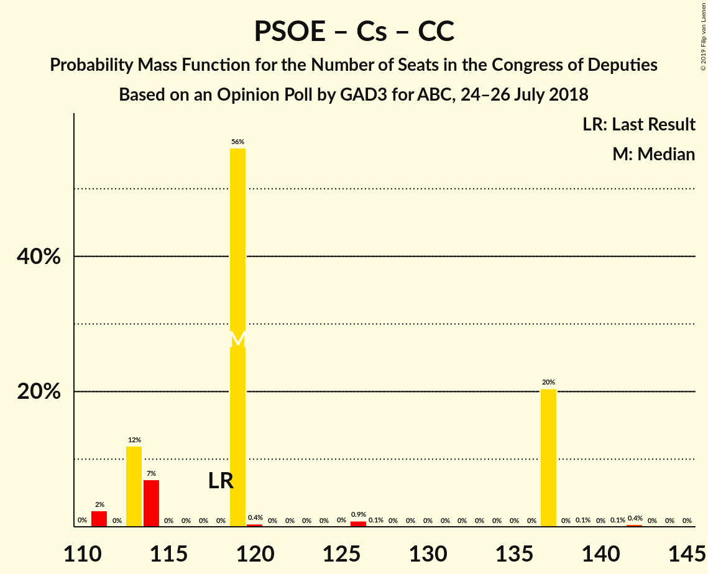

# Opinion Poll by GAD3 for ABC, 24–26 July 2018

<a href="#voting-intentions">Voting Intentions</a> | <a href="#seats">Seats</a> | <a href="#coalitions">Coalitions</a> | <a href="#technical-information">Technical Information</a>

## Voting Intentions

### Confidence Intervals

| Party | Last Result | Poll Result | 80% Confidence Interval | 90% Confidence Interval | 95% Confidence Interval | 99% Confidence Interval |
|:-----:|:-----------:|:-----------:|:-----------------------:|:-----------------------:|:-----------------------:|:-----------------------:|
| Partido Socialista Obrero Español | 22.6% | 27.9% | 25.9–30.0% |25.3–30.5% |24.9–31.1% |23.9–32.1% |
| Partido Popular | 33.0% | 26.2% | 24.3–28.3% |23.8–28.9% |23.3–29.4% |22.4–30.4% |
| Ciudadanos–Partido de la Ciudadanía | 13.1% | 19.7% | 17.9–21.6% |17.5–22.1% |17.0–22.5% |16.3–23.5% |
| Unidos Podemos | 21.2% | 15.0% | 13.5–16.8% |13.1–17.3% |12.7–17.7% |12.0–18.5% |
| Esquerra Republicana de Catalunya | 2.7% | 3.0% | 2.3–3.9% |2.2–4.2% |2.0–4.4% |1.7–4.9% |
| Partit Demòcrata Europeu Català | 2.0% | 1.9% | 1.4–2.6% |1.2–2.9% |1.1–3.1% |0.9–3.5% |
| Euzko Alderdi Jeltzalea/Partido Nacionalista Vasco | 1.2% | 1.1% | 0.8–1.8% |0.7–2.0% |0.6–2.1% |0.5–2.5% |
| Euskal Herria Bildu | 0.8% | 0.7% | 0.5–1.3% |0.4–1.5% |0.3–1.6% |0.2–1.9% |
| Coalición Canaria–Partido Nacionalista Canario | 0.3% | 0.2% | 0.1–0.7% |0.1–0.8% |0.1–0.9% |0.0–1.2% |

*Note:* The poll result column reflects the actual value used in the calculations. Published results may vary slightly, and in addition be rounded to fewer digits.

## Seats

### Confidence Intervals

| Party | Last Result | Median | 80% Confidence Interval | 90% Confidence Interval | 95% Confidence Interval | 99% Confidence Interval |
|:-----:|:-----------:|:------:|:-----------------------:|:-----------------------:|:-----------------------:|:-----------------------:|
| <a href="#partido-socialista-obrero-español">Partido Socialista Obrero Español</a> | 85 | 65 | 65–91 |65–91 |65–91 |64–91 |
| <a href="#partido-popular">Partido Popular</a> | 137 | 79 | 69–88 |69–89 |69–89 |68–90 |
| <a href="#ciudadanos–partido-de-la-ciudadanía">Ciudadanos–Partido de la Ciudadanía</a> | 32 | 54 | 37–54 |37–54 |37–54 |37–55 |
| <a href="#unidos-podemos">Unidos Podemos</a> | 71 | 34 | 21–34 |21–34 |21–34 |21–35 |
| <a href="#esquerra-republicana-de-catalunya">Esquerra Republicana de Catalunya</a> | 9 | 0 | 0 |0 |0 |0 |
| <a href="#partit-demòcrata-europeu-català">Partit Demòcrata Europeu Català</a> | 8 | 0 | 0 |0 |0 |0 |
| <a href="#euzko-alderdi-jeltzalea/partido-nacionalista-vasco">Euzko Alderdi Jeltzalea/Partido Nacionalista Vasco</a> | 5 | 6 | 3–6 |0–6 |0–6 |0–6 |
| <a href="#euskal-herria-bildu">Euskal Herria Bildu</a> | 2 | 0 | 0–7 |0–8 |0–8 |0–8 |
| <a href="#coalición-canaria–partido-nacionalista-canario">Coalición Canaria–Partido Nacionalista Canario</a> | 1 | 0 | 0 |0 |0 |0 |

### Partido Socialista Obrero Español

*For a full overview of the results for this party, see the [Partido Socialista Obrero Español](party-partidosocialistaobreroespañol.html) page.*

| Number of Seats | Probability | Accumulated | Special Marks |
|:---------------:|:-----------:|:-----------:|:-------------:|
| 63 | 0% | 100% |  |
| 64 | 2% | 99.9% |  |
| 65 | 56% | 98% | Median |
| 66 | 0.2% | 41% |  |
| 67 | 0% | 41% |  |
| 68 | 0% | 41% |  |
| 69 | 0.1% | 41% |  |
| 70 | 0% | 41% |  |
| 71 | 0.1% | 41% |  |
| 72 | 0% | 41% |  |
| 73 | 0% | 41% |  |
| 74 | 7% | 41% |  |
| 75 | 0% | 34% |  |
| 76 | 12% | 34% |  |
| 77 | 0% | 22% |  |
| 78 | 0% | 22% |  |
| 79 | 0% | 22% |  |
| 80 | 0% | 22% |  |
| 81 | 0% | 22% |  |
| 82 | 0% | 22% |  |
| 83 | 0.1% | 22% |  |
| 84 | 0% | 22% |  |
| 85 | 0% | 22% | Last Result |
| 86 | 0% | 22% |  |
| 87 | 0.9% | 22% |  |
| 88 | 0% | 21% |  |
| 89 | 0% | 21% |  |
| 90 | 0% | 21% |  |
| 91 | 21% | 21% |  |
| 92 | 0% | 0.4% |  |
| 93 | 0.1% | 0.4% |  |
| 94 | 0% | 0.3% |  |
| 95 | 0% | 0.3% |  |
| 96 | 0% | 0.3% |  |
| 97 | 0% | 0.3% |  |
| 98 | 0% | 0.3% |  |
| 99 | 0% | 0.3% |  |
| 100 | 0% | 0.3% |  |
| 101 | 0% | 0.3% |  |
| 102 | 0% | 0.3% |  |
| 103 | 0.3% | 0.3% |  |
| 104 | 0% | 0% |  |

### Partido Popular

*For a full overview of the results for this party, see the [Partido Popular](party-partidopopular.html) page.*

| Number of Seats | Probability | Accumulated | Special Marks |
|:---------------:|:-----------:|:-----------:|:-------------:|
| 61 | 0.1% | 100% |  |
| 62 | 0.1% | 99.9% |  |
| 63 | 0% | 99.8% |  |
| 64 | 0% | 99.8% |  |
| 65 | 0.1% | 99.8% |  |
| 66 | 0% | 99.7% |  |
| 67 | 0% | 99.7% |  |
| 68 | 0.8% | 99.7% |  |
| 69 | 20% | 98.9% |  |
| 70 | 0% | 78% |  |
| 71 | 0.3% | 78% |  |
| 72 | 0% | 78% |  |
| 73 | 0% | 78% |  |
| 74 | 0.1% | 78% |  |
| 75 | 0% | 78% |  |
| 76 | 0% | 78% |  |
| 77 | 0.7% | 78% |  |
| 78 | 0% | 77% |  |
| 79 | 56% | 77% | Median |
| 80 | 0% | 21% |  |
| 81 | 0% | 21% |  |
| 82 | 0% | 21% |  |
| 83 | 0% | 21% |  |
| 84 | 0% | 21% |  |
| 85 | 0% | 21% |  |
| 86 | 0% | 21% |  |
| 87 | 0% | 21% |  |
| 88 | 12% | 21% |  |
| 89 | 7% | 9% |  |
| 90 | 2% | 2% |  |
| 91 | 0% | 0.1% |  |
| 92 | 0% | 0.1% |  |
| 93 | 0% | 0% |  |
| 94 | 0% | 0% |  |
| 95 | 0% | 0% |  |
| 96 | 0% | 0% |  |
| 97 | 0% | 0% |  |
| 98 | 0% | 0% |  |
| 99 | 0% | 0% |  |
| 100 | 0% | 0% |  |
| 101 | 0% | 0% |  |
| 102 | 0% | 0% |  |
| 103 | 0% | 0% |  |
| 104 | 0% | 0% |  |
| 105 | 0% | 0% |  |
| 106 | 0% | 0% |  |
| 107 | 0% | 0% |  |
| 108 | 0% | 0% |  |
| 109 | 0% | 0% |  |
| 110 | 0% | 0% |  |
| 111 | 0% | 0% |  |
| 112 | 0% | 0% |  |
| 113 | 0% | 0% |  |
| 114 | 0% | 0% |  |
| 115 | 0% | 0% |  |
| 116 | 0% | 0% |  |
| 117 | 0% | 0% |  |
| 118 | 0% | 0% |  |
| 119 | 0% | 0% |  |
| 120 | 0% | 0% |  |
| 121 | 0% | 0% |  |
| 122 | 0% | 0% |  |
| 123 | 0% | 0% |  |
| 124 | 0% | 0% |  |
| 125 | 0% | 0% |  |
| 126 | 0% | 0% |  |
| 127 | 0% | 0% |  |
| 128 | 0% | 0% |  |
| 129 | 0% | 0% |  |
| 130 | 0% | 0% |  |
| 131 | 0% | 0% |  |
| 132 | 0% | 0% |  |
| 133 | 0% | 0% |  |
| 134 | 0% | 0% |  |
| 135 | 0% | 0% |  |
| 136 | 0% | 0% |  |
| 137 | 0% | 0% | Last Result |

### Ciudadanos–Partido de la Ciudadanía

*For a full overview of the results for this party, see the [Ciudadanos–Partido de la Ciudadanía](party-ciudadanos–partidodelaciudadanía.html) page.*

| Number of Seats | Probability | Accumulated | Special Marks |
|:---------------:|:-----------:|:-----------:|:-------------:|
| 32 | 0% | 100% | Last Result |
| 33 | 0% | 100% |  |
| 34 | 0% | 100% |  |
| 35 | 0% | 100% |  |
| 36 | 0% | 100% |  |
| 37 | 12% | 100% |  |
| 38 | 0% | 88% |  |
| 39 | 1.1% | 88% |  |
| 40 | 7% | 87% |  |
| 41 | 0% | 80% |  |
| 42 | 0% | 80% |  |
| 43 | 0% | 80% |  |
| 44 | 0.2% | 80% |  |
| 45 | 0% | 80% |  |
| 46 | 21% | 80% |  |
| 47 | 2% | 59% |  |
| 48 | 0% | 57% |  |
| 49 | 0% | 57% |  |
| 50 | 0.1% | 57% |  |
| 51 | 0% | 57% |  |
| 52 | 0% | 57% |  |
| 53 | 0.2% | 57% |  |
| 54 | 56% | 56% | Median |
| 55 | 0.6% | 0.6% |  |
| 56 | 0% | 0.1% |  |
| 57 | 0% | 0.1% |  |
| 58 | 0% | 0% |  |

### Unidos Podemos

*For a full overview of the results for this party, see the [Unidos Podemos](party-unidospodemos.html) page.*

| Number of Seats | Probability | Accumulated | Special Marks |
|:---------------:|:-----------:|:-----------:|:-------------:|
| 21 | 21% | 100% |  |
| 22 | 0% | 79% |  |
| 23 | 0.1% | 79% |  |
| 24 | 0% | 79% |  |
| 25 | 7% | 79% |  |
| 26 | 12% | 72% |  |
| 27 | 0.2% | 60% |  |
| 28 | 3% | 60% |  |
| 29 | 0% | 57% |  |
| 30 | 0% | 57% |  |
| 31 | 0% | 57% |  |
| 32 | 0% | 57% |  |
| 33 | 0% | 57% |  |
| 34 | 56% | 57% | Median |
| 35 | 0.8% | 0.8% |  |
| 36 | 0% | 0% |  |
| 37 | 0% | 0% |  |
| 38 | 0% | 0% |  |
| 39 | 0% | 0% |  |
| 40 | 0% | 0% |  |
| 41 | 0% | 0% |  |
| 42 | 0% | 0% |  |
| 43 | 0% | 0% |  |
| 44 | 0% | 0% |  |
| 45 | 0% | 0% |  |
| 46 | 0% | 0% |  |
| 47 | 0% | 0% |  |
| 48 | 0% | 0% |  |
| 49 | 0% | 0% |  |
| 50 | 0% | 0% |  |
| 51 | 0% | 0% |  |
| 52 | 0% | 0% |  |
| 53 | 0% | 0% |  |
| 54 | 0% | 0% |  |
| 55 | 0% | 0% |  |
| 56 | 0% | 0% |  |
| 57 | 0% | 0% |  |
| 58 | 0% | 0% |  |
| 59 | 0% | 0% |  |
| 60 | 0% | 0% |  |
| 61 | 0% | 0% |  |
| 62 | 0% | 0% |  |
| 63 | 0% | 0% |  |
| 64 | 0% | 0% |  |
| 65 | 0% | 0% |  |
| 66 | 0% | 0% |  |
| 67 | 0% | 0% |  |
| 68 | 0% | 0% |  |
| 69 | 0% | 0% |  |
| 70 | 0% | 0% |  |
| 71 | 0% | 0% | Last Result |

### Esquerra Republicana de Catalunya

*For a full overview of the results for this party, see the [Esquerra Republicana de Catalunya](party-esquerrarepublicanadecatalunya.html) page.*

| Number of Seats | Probability | Accumulated | Special Marks |
|:---------------:|:-----------:|:-----------:|:-------------:|
| 0 | 100% | 100% | Median |
| 1 | 0% | 0% |  |
| 2 | 0% | 0% |  |
| 3 | 0% | 0% |  |
| 4 | 0% | 0% |  |
| 5 | 0% | 0% |  |
| 6 | 0% | 0% |  |
| 7 | 0% | 0% |  |
| 8 | 0% | 0% |  |
| 9 | 0% | 0% | Last Result |

### Partit Demòcrata Europeu Català

*For a full overview of the results for this party, see the [Partit Demòcrata Europeu Català](party-partitdemòcrataeuropeucatalà.html) page.*

| Number of Seats | Probability | Accumulated | Special Marks |
|:---------------:|:-----------:|:-----------:|:-------------:|
| 0 | 100% | 100% | Median |
| 1 | 0% | 0% |  |
| 2 | 0% | 0% |  |
| 3 | 0% | 0% |  |
| 4 | 0% | 0% |  |
| 5 | 0% | 0% |  |
| 6 | 0% | 0% |  |
| 7 | 0% | 0% |  |
| 8 | 0% | 0% | Last Result |

### Euzko Alderdi Jeltzalea/Partido Nacionalista Vasco

*For a full overview of the results for this party, see the [Euzko Alderdi Jeltzalea/Partido Nacionalista Vasco](party-euzkoalderdijeltzaleapartidonacionalistavasco.html) page.*

| Number of Seats | Probability | Accumulated | Special Marks |
|:---------------:|:-----------:|:-----------:|:-------------:|
| 0 | 7% | 100% |  |
| 1 | 0.2% | 93% |  |
| 2 | 0.9% | 93% |  |
| 3 | 33% | 92% |  |
| 4 | 0% | 59% |  |
| 5 | 0.1% | 59% | Last Result |
| 6 | 59% | 59% | Median |
| 7 | 0.1% | 0.3% |  |
| 8 | 0.1% | 0.2% |  |
| 9 | 0% | 0.1% |  |
| 10 | 0.1% | 0.1% |  |
| 11 | 0% | 0% |  |

### Euskal Herria Bildu

*For a full overview of the results for this party, see the [Euskal Herria Bildu](party-euskalherriabildu.html) page.*

| Number of Seats | Probability | Accumulated | Special Marks |
|:---------------:|:-----------:|:-----------:|:-------------:|
| 0 | 56% | 100% | Median |
| 1 | 0.6% | 44% |  |
| 2 | 3% | 43% | Last Result |
| 3 | 0.1% | 41% |  |
| 4 | 0% | 40% |  |
| 5 | 0.1% | 40% |  |
| 6 | 21% | 40% |  |
| 7 | 12% | 19% |  |
| 8 | 7% | 7% |  |
| 9 | 0% | 0% |  |

### Coalición Canaria–Partido Nacionalista Canario

*For a full overview of the results for this party, see the [Coalición Canaria–Partido Nacionalista Canario](party-coalicióncanaria–partidonacionalistacanario.html) page.*

| Number of Seats | Probability | Accumulated | Special Marks |
|:---------------:|:-----------:|:-----------:|:-------------:|
| 0 | 100% | 100% | Median |
| 1 | 0% | 0% | Last Result |

## Coalitions

### Confidence Intervals

| Coalition | Last Result | Median | Majority? | 80% Confidence Interval | 90% Confidence Interval | 95% Confidence Interval | 99% Confidence Interval |
|:---------:|:-----------:|:------:|:---------:|:-----------------------:|:-----------------------:|:-----------------------:|:-----------------------:|
| Partido Socialista Obrero Español – Ciudadanos–Partido de la Ciudadanía – Coalición Canaria–Partido Nacionalista Canario | 118 | 119 | 0% | 113–137 | 113–137 | 113–137 | 111–141 |
| Partido Socialista Obrero Español – Ciudadanos–Partido de la Ciudadanía | 117 | 119 | 0% | 113–137 | 113–137 | 113–137 | 111–141 |
| Partido Popular – Ciudadanos–Partido de la Ciudadanía – Coalición Canaria–Partido Nacionalista Canario | 170 | 133 | 0% | 115–133 | 115–133 | 115–133 | 107–137 |
| Partido Popular – Ciudadanos–Partido de la Ciudadanía | 169 | 133 | 0% | 115–133 | 115–133 | 115–133 | 107–137 |
| Partido Socialista Obrero Español – Unidos Podemos | 156 | 99 | 0% | 99–112 | 99–112 | 95–112 | 92–122 |
| Partido Socialista Obrero Español – Coalición Canaria–Partido Nacionalista Canario | 86 | 65 | 0% | 65–91 | 65–91 | 65–91 | 64–91 |
| Partido Socialista Obrero Español | 85 | 65 | 0% | 65–91 | 65–91 | 65–91 | 64–91 |
| Partido Popular | 137 | 79 | 0% | 69–88 | 69–89 | 69–89 | 68–90 |

### Partido Socialista Obrero Español – Ciudadanos–Partido de la Ciudadanía – Coalición Canaria–Partido Nacionalista Canario

| Number of Seats | Probability | Accumulated | Special Marks |
|:---------------:|:-----------:|:-----------:|:-------------:|
| 111 | 2% | 100% |  |
| 112 | 0% | 98% |  |
| 113 | 12% | 98% |  |
| 114 | 7% | 86% |  |
| 115 | 0% | 79% |  |
| 116 | 0% | 79% |  |
| 117 | 0% | 79% |  |
| 118 | 0% | 79% | Last Result |
| 119 | 56% | 79% | Median |
| 120 | 0.4% | 23% |  |
| 121 | 0% | 22% |  |
| 122 | 0% | 22% |  |
| 123 | 0% | 22% |  |
| 124 | 0% | 22% |  |
| 125 | 0% | 22% |  |
| 126 | 0.9% | 22% |  |
| 127 | 0.1% | 21% |  |
| 128 | 0% | 21% |  |
| 129 | 0% | 21% |  |
| 130 | 0% | 21% |  |
| 131 | 0% | 21% |  |
| 132 | 0% | 21% |  |
| 133 | 0% | 21% |  |
| 134 | 0% | 21% |  |
| 135 | 0% | 21% |  |
| 136 | 0% | 21% |  |
| 137 | 20% | 21% |  |
| 138 | 0% | 0.6% |  |
| 139 | 0.1% | 0.6% |  |
| 140 | 0% | 0.5% |  |
| 141 | 0.1% | 0.5% |  |
| 142 | 0.4% | 0.4% |  |
| 143 | 0% | 0.1% |  |
| 144 | 0% | 0% |  |

### Partido Socialista Obrero Español – Ciudadanos–Partido de la Ciudadanía

| Number of Seats | Probability | Accumulated | Special Marks |
|:---------------:|:-----------:|:-----------:|:-------------:|
| 111 | 2% | 100% |  |
| 112 | 0% | 98% |  |
| 113 | 12% | 98% |  |
| 114 | 7% | 86% |  |
| 115 | 0% | 79% |  |
| 116 | 0% | 79% |  |
| 117 | 0% | 79% | Last Result |
| 118 | 0% | 79% |  |
| 119 | 56% | 79% | Median |
| 120 | 0.4% | 23% |  |
| 121 | 0% | 22% |  |
| 122 | 0% | 22% |  |
| 123 | 0% | 22% |  |
| 124 | 0% | 22% |  |
| 125 | 0% | 22% |  |
| 126 | 0.9% | 22% |  |
| 127 | 0.1% | 21% |  |
| 128 | 0% | 21% |  |
| 129 | 0% | 21% |  |
| 130 | 0% | 21% |  |
| 131 | 0% | 21% |  |
| 132 | 0% | 21% |  |
| 133 | 0% | 21% |  |
| 134 | 0% | 21% |  |
| 135 | 0% | 21% |  |
| 136 | 0% | 21% |  |
| 137 | 20% | 21% |  |
| 138 | 0% | 0.6% |  |
| 139 | 0.1% | 0.6% |  |
| 140 | 0% | 0.5% |  |
| 141 | 0.1% | 0.5% |  |
| 142 | 0.4% | 0.4% |  |
| 143 | 0% | 0.1% |  |
| 144 | 0% | 0% |  |

### Partido Popular – Ciudadanos–Partido de la Ciudadanía – Coalición Canaria–Partido Nacionalista Canario

| Number of Seats | Probability | Accumulated | Special Marks |
|:---------------:|:-----------:|:-----------:|:-------------:|
| 107 | 0.8% | 100% |  |
| 108 | 0% | 99.2% |  |
| 109 | 0% | 99.2% |  |
| 110 | 0.3% | 99.2% |  |
| 111 | 0.1% | 98.9% |  |
| 112 | 0.1% | 98.8% |  |
| 113 | 0% | 98.7% |  |
| 114 | 0% | 98.7% |  |
| 115 | 20% | 98.7% |  |
| 116 | 0.1% | 78% |  |
| 117 | 0% | 78% |  |
| 118 | 0.1% | 78% |  |
| 119 | 0% | 78% |  |
| 120 | 0% | 78% |  |
| 121 | 0% | 78% |  |
| 122 | 0% | 78% |  |
| 123 | 0% | 78% |  |
| 124 | 0% | 78% |  |
| 125 | 12% | 78% |  |
| 126 | 0% | 66% |  |
| 127 | 0% | 66% |  |
| 128 | 0% | 66% |  |
| 129 | 7% | 66% |  |
| 130 | 0.2% | 59% |  |
| 131 | 0% | 59% |  |
| 132 | 0.6% | 59% |  |
| 133 | 56% | 58% | Median |
| 134 | 0% | 2% |  |
| 135 | 0% | 2% |  |
| 136 | 0% | 2% |  |
| 137 | 2% | 2% |  |
| 138 | 0% | 0% |  |
| 139 | 0% | 0% |  |
| 140 | 0% | 0% |  |
| 141 | 0% | 0% |  |
| 142 | 0% | 0% |  |
| 143 | 0% | 0% |  |
| 144 | 0% | 0% |  |
| 145 | 0% | 0% |  |
| 146 | 0% | 0% |  |
| 147 | 0% | 0% |  |
| 148 | 0% | 0% |  |
| 149 | 0% | 0% |  |
| 150 | 0% | 0% |  |
| 151 | 0% | 0% |  |
| 152 | 0% | 0% |  |
| 153 | 0% | 0% |  |
| 154 | 0% | 0% |  |
| 155 | 0% | 0% |  |
| 156 | 0% | 0% |  |
| 157 | 0% | 0% |  |
| 158 | 0% | 0% |  |
| 159 | 0% | 0% |  |
| 160 | 0% | 0% |  |
| 161 | 0% | 0% |  |
| 162 | 0% | 0% |  |
| 163 | 0% | 0% |  |
| 164 | 0% | 0% |  |
| 165 | 0% | 0% |  |
| 166 | 0% | 0% |  |
| 167 | 0% | 0% |  |
| 168 | 0% | 0% |  |
| 169 | 0% | 0% |  |
| 170 | 0% | 0% | Last Result |

### Partido Popular – Ciudadanos–Partido de la Ciudadanía

| Number of Seats | Probability | Accumulated | Special Marks |
|:---------------:|:-----------:|:-----------:|:-------------:|
| 107 | 0.8% | 100% |  |
| 108 | 0% | 99.2% |  |
| 109 | 0% | 99.2% |  |
| 110 | 0.3% | 99.2% |  |
| 111 | 0.1% | 98.9% |  |
| 112 | 0.1% | 98.8% |  |
| 113 | 0% | 98.7% |  |
| 114 | 0% | 98.7% |  |
| 115 | 20% | 98.7% |  |
| 116 | 0.1% | 78% |  |
| 117 | 0% | 78% |  |
| 118 | 0.1% | 78% |  |
| 119 | 0% | 78% |  |
| 120 | 0% | 78% |  |
| 121 | 0% | 78% |  |
| 122 | 0% | 78% |  |
| 123 | 0% | 78% |  |
| 124 | 0% | 78% |  |
| 125 | 12% | 78% |  |
| 126 | 0% | 66% |  |
| 127 | 0% | 66% |  |
| 128 | 0% | 66% |  |
| 129 | 7% | 66% |  |
| 130 | 0.2% | 59% |  |
| 131 | 0% | 59% |  |
| 132 | 0.6% | 59% |  |
| 133 | 56% | 58% | Median |
| 134 | 0% | 2% |  |
| 135 | 0% | 2% |  |
| 136 | 0% | 2% |  |
| 137 | 2% | 2% |  |
| 138 | 0% | 0% |  |
| 139 | 0% | 0% |  |
| 140 | 0% | 0% |  |
| 141 | 0% | 0% |  |
| 142 | 0% | 0% |  |
| 143 | 0% | 0% |  |
| 144 | 0% | 0% |  |
| 145 | 0% | 0% |  |
| 146 | 0% | 0% |  |
| 147 | 0% | 0% |  |
| 148 | 0% | 0% |  |
| 149 | 0% | 0% |  |
| 150 | 0% | 0% |  |
| 151 | 0% | 0% |  |
| 152 | 0% | 0% |  |
| 153 | 0% | 0% |  |
| 154 | 0% | 0% |  |
| 155 | 0% | 0% |  |
| 156 | 0% | 0% |  |
| 157 | 0% | 0% |  |
| 158 | 0% | 0% |  |
| 159 | 0% | 0% |  |
| 160 | 0% | 0% |  |
| 161 | 0% | 0% |  |
| 162 | 0% | 0% |  |
| 163 | 0% | 0% |  |
| 164 | 0% | 0% |  |
| 165 | 0% | 0% |  |
| 166 | 0% | 0% |  |
| 167 | 0% | 0% |  |
| 168 | 0% | 0% |  |
| 169 | 0% | 0% | Last Result |

### Partido Socialista Obrero Español – Unidos Podemos

| Number of Seats | Probability | Accumulated | Special Marks |
|:---------------:|:-----------:|:-----------:|:-------------:|
| 91 | 0% | 100% |  |
| 92 | 2% | 99.9% |  |
| 93 | 0% | 98% |  |
| 94 | 0% | 98% |  |
| 95 | 0.1% | 98% |  |
| 96 | 0% | 97% |  |
| 97 | 0% | 97% |  |
| 98 | 0.1% | 97% |  |
| 99 | 63% | 97% | Median |
| 100 | 0.2% | 34% |  |
| 101 | 0% | 34% |  |
| 102 | 12% | 34% |  |
| 103 | 0% | 22% |  |
| 104 | 0% | 22% |  |
| 105 | 0% | 22% |  |
| 106 | 0% | 22% |  |
| 107 | 0% | 22% |  |
| 108 | 0% | 22% |  |
| 109 | 0% | 22% |  |
| 110 | 0.2% | 22% |  |
| 111 | 0% | 22% |  |
| 112 | 20% | 22% |  |
| 113 | 0% | 1.3% |  |
| 114 | 0.1% | 1.3% |  |
| 115 | 0% | 1.3% |  |
| 116 | 0% | 1.2% |  |
| 117 | 0% | 1.2% |  |
| 118 | 0% | 1.2% |  |
| 119 | 0.1% | 1.2% |  |
| 120 | 0% | 1.1% |  |
| 121 | 0% | 1.1% |  |
| 122 | 0.8% | 1.1% |  |
| 123 | 0% | 0.3% |  |
| 124 | 0.3% | 0.3% |  |
| 125 | 0% | 0% |  |
| 126 | 0% | 0% |  |
| 127 | 0% | 0% |  |
| 128 | 0% | 0% |  |
| 129 | 0% | 0% |  |
| 130 | 0% | 0% |  |
| 131 | 0% | 0% |  |
| 132 | 0% | 0% |  |
| 133 | 0% | 0% |  |
| 134 | 0% | 0% |  |
| 135 | 0% | 0% |  |
| 136 | 0% | 0% |  |
| 137 | 0% | 0% |  |
| 138 | 0% | 0% |  |
| 139 | 0% | 0% |  |
| 140 | 0% | 0% |  |
| 141 | 0% | 0% |  |
| 142 | 0% | 0% |  |
| 143 | 0% | 0% |  |
| 144 | 0% | 0% |  |
| 145 | 0% | 0% |  |
| 146 | 0% | 0% |  |
| 147 | 0% | 0% |  |
| 148 | 0% | 0% |  |
| 149 | 0% | 0% |  |
| 150 | 0% | 0% |  |
| 151 | 0% | 0% |  |
| 152 | 0% | 0% |  |
| 153 | 0% | 0% |  |
| 154 | 0% | 0% |  |
| 155 | 0% | 0% |  |
| 156 | 0% | 0% | Last Result |

### Partido Socialista Obrero Español – Coalición Canaria–Partido Nacionalista Canario

| Number of Seats | Probability | Accumulated | Special Marks |
|:---------------:|:-----------:|:-----------:|:-------------:|
| 63 | 0% | 100% |  |
| 64 | 2% | 99.9% |  |
| 65 | 56% | 98% | Median |
| 66 | 0.2% | 41% |  |
| 67 | 0% | 41% |  |
| 68 | 0% | 41% |  |
| 69 | 0.1% | 41% |  |
| 70 | 0% | 41% |  |
| 71 | 0.1% | 41% |  |
| 72 | 0% | 41% |  |
| 73 | 0% | 41% |  |
| 74 | 7% | 41% |  |
| 75 | 0% | 34% |  |
| 76 | 12% | 34% |  |
| 77 | 0% | 22% |  |
| 78 | 0% | 22% |  |
| 79 | 0% | 22% |  |
| 80 | 0% | 22% |  |
| 81 | 0% | 22% |  |
| 82 | 0% | 22% |  |
| 83 | 0.1% | 22% |  |
| 84 | 0% | 22% |  |
| 85 | 0% | 22% |  |
| 86 | 0% | 22% | Last Result |
| 87 | 0.9% | 22% |  |
| 88 | 0% | 21% |  |
| 89 | 0% | 21% |  |
| 90 | 0% | 21% |  |
| 91 | 21% | 21% |  |
| 92 | 0% | 0.4% |  |
| 93 | 0.1% | 0.4% |  |
| 94 | 0% | 0.3% |  |
| 95 | 0% | 0.3% |  |
| 96 | 0% | 0.3% |  |
| 97 | 0% | 0.3% |  |
| 98 | 0% | 0.3% |  |
| 99 | 0% | 0.3% |  |
| 100 | 0% | 0.3% |  |
| 101 | 0% | 0.3% |  |
| 102 | 0% | 0.3% |  |
| 103 | 0.3% | 0.3% |  |
| 104 | 0% | 0% |  |

### Partido Socialista Obrero Español

| Number of Seats | Probability | Accumulated | Special Marks |
|:---------------:|:-----------:|:-----------:|:-------------:|
| 63 | 0% | 100% |  |
| 64 | 2% | 99.9% |  |
| 65 | 56% | 98% | Median |
| 66 | 0.2% | 41% |  |
| 67 | 0% | 41% |  |
| 68 | 0% | 41% |  |
| 69 | 0.1% | 41% |  |
| 70 | 0% | 41% |  |
| 71 | 0.1% | 41% |  |
| 72 | 0% | 41% |  |
| 73 | 0% | 41% |  |
| 74 | 7% | 41% |  |
| 75 | 0% | 34% |  |
| 76 | 12% | 34% |  |
| 77 | 0% | 22% |  |
| 78 | 0% | 22% |  |
| 79 | 0% | 22% |  |
| 80 | 0% | 22% |  |
| 81 | 0% | 22% |  |
| 82 | 0% | 22% |  |
| 83 | 0.1% | 22% |  |
| 84 | 0% | 22% |  |
| 85 | 0% | 22% | Last Result |
| 86 | 0% | 22% |  |
| 87 | 0.9% | 22% |  |
| 88 | 0% | 21% |  |
| 89 | 0% | 21% |  |
| 90 | 0% | 21% |  |
| 91 | 21% | 21% |  |
| 92 | 0% | 0.4% |  |
| 93 | 0.1% | 0.4% |  |
| 94 | 0% | 0.3% |  |
| 95 | 0% | 0.3% |  |
| 96 | 0% | 0.3% |  |
| 97 | 0% | 0.3% |  |
| 98 | 0% | 0.3% |  |
| 99 | 0% | 0.3% |  |
| 100 | 0% | 0.3% |  |
| 101 | 0% | 0.3% |  |
| 102 | 0% | 0.3% |  |
| 103 | 0.3% | 0.3% |  |
| 104 | 0% | 0% |  |

### Partido Popular

| Number of Seats | Probability | Accumulated | Special Marks |
|:---------------:|:-----------:|:-----------:|:-------------:|
| 61 | 0.1% | 100% |  |
| 62 | 0.1% | 99.9% |  |
| 63 | 0% | 99.8% |  |
| 64 | 0% | 99.8% |  |
| 65 | 0.1% | 99.8% |  |
| 66 | 0% | 99.7% |  |
| 67 | 0% | 99.7% |  |
| 68 | 0.8% | 99.7% |  |
| 69 | 20% | 98.9% |  |
| 70 | 0% | 78% |  |
| 71 | 0.3% | 78% |  |
| 72 | 0% | 78% |  |
| 73 | 0% | 78% |  |
| 74 | 0.1% | 78% |  |
| 75 | 0% | 78% |  |
| 76 | 0% | 78% |  |
| 77 | 0.7% | 78% |  |
| 78 | 0% | 77% |  |
| 79 | 56% | 77% | Median |
| 80 | 0% | 21% |  |
| 81 | 0% | 21% |  |
| 82 | 0% | 21% |  |
| 83 | 0% | 21% |  |
| 84 | 0% | 21% |  |
| 85 | 0% | 21% |  |
| 86 | 0% | 21% |  |
| 87 | 0% | 21% |  |
| 88 | 12% | 21% |  |
| 89 | 7% | 9% |  |
| 90 | 2% | 2% |  |
| 91 | 0% | 0.1% |  |
| 92 | 0% | 0.1% |  |
| 93 | 0% | 0% |  |
| 94 | 0% | 0% |  |
| 95 | 0% | 0% |  |
| 96 | 0% | 0% |  |
| 97 | 0% | 0% |  |
| 98 | 0% | 0% |  |
| 99 | 0% | 0% |  |
| 100 | 0% | 0% |  |
| 101 | 0% | 0% |  |
| 102 | 0% | 0% |  |
| 103 | 0% | 0% |  |
| 104 | 0% | 0% |  |
| 105 | 0% | 0% |  |
| 106 | 0% | 0% |  |
| 107 | 0% | 0% |  |
| 108 | 0% | 0% |  |
| 109 | 0% | 0% |  |
| 110 | 0% | 0% |  |
| 111 | 0% | 0% |  |
| 112 | 0% | 0% |  |
| 113 | 0% | 0% |  |
| 114 | 0% | 0% |  |
| 115 | 0% | 0% |  |
| 116 | 0% | 0% |  |
| 117 | 0% | 0% |  |
| 118 | 0% | 0% |  |
| 119 | 0% | 0% |  |
| 120 | 0% | 0% |  |
| 121 | 0% | 0% |  |
| 122 | 0% | 0% |  |
| 123 | 0% | 0% |  |
| 124 | 0% | 0% |  |
| 125 | 0% | 0% |  |
| 126 | 0% | 0% |  |
| 127 | 0% | 0% |  |
| 128 | 0% | 0% |  |
| 129 | 0% | 0% |  |
| 130 | 0% | 0% |  |
| 131 | 0% | 0% |  |
| 132 | 0% | 0% |  |
| 133 | 0% | 0% |  |
| 134 | 0% | 0% |  |
| 135 | 0% | 0% |  |
| 136 | 0% | 0% |  |
| 137 | 0% | 0% | Last Result |

## Technical Information

### Opinion Poll

+ **Polling firm:** GAD3
+ **Commissioner(s):** ABC
+ **Fieldwork period:** 24–26 July 2018

### Calculations

+ **Sample size:** 804
+ **Simulations done:** 1,024
+ **Error estimate:** 6.10%

