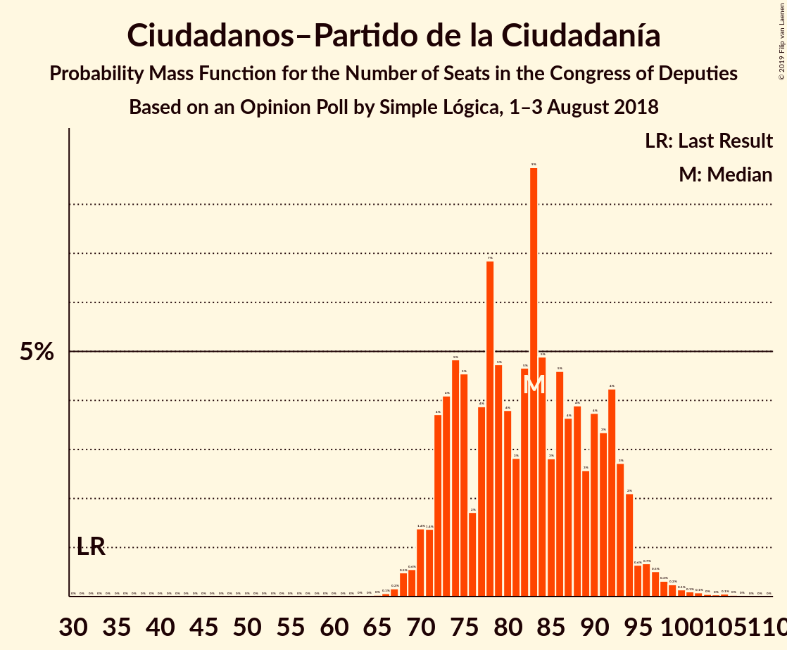

# Opinion Poll by Simple Lógica, 1–3 August 2018

<a href="#voting-intentions">Voting Intentions</a> | <a href="#seats">Seats</a> | <a href="#coalitions">Coalitions</a> | <a href="#technical-information">Technical Information</a>

## Voting Intentions

### Confidence Intervals

| Party | Last Result | Poll Result | 80% Confidence Interval | 90% Confidence Interval | 95% Confidence Interval | 99% Confidence Interval |
|:-----:|:-----------:|:-----------:|:-----------------------:|:-----------------------:|:-----------------------:|:-----------------------:|
| Partido Socialista Obrero Español | 22.6% | 25.5% | 23.8–27.3% |23.3–27.8% |22.9–28.2% |22.1–29.1% |
| Partido Popular | 33.0% | 24.4% | 22.7–26.2% |22.3–26.7% |21.9–27.1% |21.1–28.0% |
| Ciudadanos–Partido de la Ciudadanía | 13.1% | 23.4% | 21.8–25.2% |21.3–25.7% |20.9–26.1% |20.2–27.0% |
| Unidos Podemos | 21.2% | 15.3% | 13.9–16.8% |13.5–17.2% |13.2–17.6% |12.6–18.4% |

*Note:* The poll result column reflects the actual value used in the calculations. Published results may vary slightly, and in addition be rounded to fewer digits.

## Seats

### Confidence Intervals

| Party | Last Result | Median | 80% Confidence Interval | 90% Confidence Interval | 95% Confidence Interval | 99% Confidence Interval |
|:-----:|:-----------:|:------:|:-----------------------:|:-----------------------:|:-----------------------:|:-----------------------:|
| <a href="#partido-socialista-obrero-español">Partido Socialista Obrero Español</a> | 85 | 65 | 64–67 |64–68 |64–77 |64–86 |
| <a href="#partido-popular">Partido Popular</a> | 137 | 71 | 69–82 |69–82 |68–82 |59–82 |
| <a href="#ciudadanos–partido-de-la-ciudadanía">Ciudadanos–Partido de la Ciudadanía</a> | 32 | 62 | 56–62 |56–62 |56–62 |52–74 |
| <a href="#unidos-podemos">Unidos Podemos</a> | 71 | 32 | 26–32 |24–33 |21–33 |19–34 |

### Partido Socialista Obrero Español

*For a full overview of the results for this party, see the [Partido Socialista Obrero Español](party-partidosocialistaobreroespañol.html) page.*

| Number of Seats | Probability | Accumulated | Special Marks |
|:---------------:|:-----------:|:-----------:|:-------------:|
| 62 | 0.1% | 100% |  |
| 63 | 0.2% | 99.8% |  |
| 64 | 18% | 99.6% |  |
| 65 | 60% | 81% | Median |
| 66 | 8% | 22% |  |
| 67 | 7% | 14% |  |
| 68 | 2% | 6% |  |
| 69 | 0.2% | 4% |  |
| 70 | 1.2% | 4% |  |
| 71 | 0.1% | 3% |  |
| 72 | 0% | 3% |  |
| 73 | 0% | 3% |  |
| 74 | 0% | 3% |  |
| 75 | 0% | 3% |  |
| 76 | 0.1% | 3% |  |
| 77 | 0.2% | 3% |  |
| 78 | 0% | 2% |  |
| 79 | 0% | 2% |  |
| 80 | 0% | 2% |  |
| 81 | 0% | 2% |  |
| 82 | 0% | 2% |  |
| 83 | 0% | 2% |  |
| 84 | 0% | 2% |  |
| 85 | 0% | 2% | Last Result |
| 86 | 2% | 2% |  |
| 87 | 0.3% | 0.3% |  |
| 88 | 0% | 0% |  |

### Partido Popular

*For a full overview of the results for this party, see the [Partido Popular](party-partidopopular.html) page.*

| Number of Seats | Probability | Accumulated | Special Marks |
|:---------------:|:-----------:|:-----------:|:-------------:|
| 59 | 0.9% | 100% |  |
| 60 | 0.4% | 99.1% |  |
| 61 | 0% | 98.6% |  |
| 62 | 0% | 98.6% |  |
| 63 | 0% | 98.6% |  |
| 64 | 0% | 98.6% |  |
| 65 | 0% | 98.6% |  |
| 66 | 0% | 98.6% |  |
| 67 | 0% | 98.6% |  |
| 68 | 2% | 98.6% |  |
| 69 | 9% | 97% |  |
| 70 | 11% | 88% |  |
| 71 | 53% | 77% | Median |
| 72 | 0% | 24% |  |
| 73 | 0% | 24% |  |
| 74 | 0% | 24% |  |
| 75 | 0% | 24% |  |
| 76 | 0% | 24% |  |
| 77 | 0% | 24% |  |
| 78 | 0% | 24% |  |
| 79 | 0% | 24% |  |
| 80 | 0% | 24% |  |
| 81 | 9% | 24% |  |
| 82 | 15% | 15% |  |
| 83 | 0% | 0% |  |
| 84 | 0% | 0% |  |
| 85 | 0% | 0% |  |
| 86 | 0% | 0% |  |
| 87 | 0% | 0% |  |
| 88 | 0% | 0% |  |
| 89 | 0% | 0% |  |
| 90 | 0% | 0% |  |
| 91 | 0% | 0% |  |
| 92 | 0% | 0% |  |
| 93 | 0% | 0% |  |
| 94 | 0% | 0% |  |
| 95 | 0% | 0% |  |
| 96 | 0% | 0% |  |
| 97 | 0% | 0% |  |
| 98 | 0% | 0% |  |
| 99 | 0% | 0% |  |
| 100 | 0% | 0% |  |
| 101 | 0% | 0% |  |
| 102 | 0% | 0% |  |
| 103 | 0% | 0% |  |
| 104 | 0% | 0% |  |
| 105 | 0% | 0% |  |
| 106 | 0% | 0% |  |
| 107 | 0% | 0% |  |
| 108 | 0% | 0% |  |
| 109 | 0% | 0% |  |
| 110 | 0% | 0% |  |
| 111 | 0% | 0% |  |
| 112 | 0% | 0% |  |
| 113 | 0% | 0% |  |
| 114 | 0% | 0% |  |
| 115 | 0% | 0% |  |
| 116 | 0% | 0% |  |
| 117 | 0% | 0% |  |
| 118 | 0% | 0% |  |
| 119 | 0% | 0% |  |
| 120 | 0% | 0% |  |
| 121 | 0% | 0% |  |
| 122 | 0% | 0% |  |
| 123 | 0% | 0% |  |
| 124 | 0% | 0% |  |
| 125 | 0% | 0% |  |
| 126 | 0% | 0% |  |
| 127 | 0% | 0% |  |
| 128 | 0% | 0% |  |
| 129 | 0% | 0% |  |
| 130 | 0% | 0% |  |
| 131 | 0% | 0% |  |
| 132 | 0% | 0% |  |
| 133 | 0% | 0% |  |
| 134 | 0% | 0% |  |
| 135 | 0% | 0% |  |
| 136 | 0% | 0% |  |
| 137 | 0% | 0% | Last Result |

### Ciudadanos–Partido de la Ciudadanía

*For a full overview of the results for this party, see the [Ciudadanos–Partido de la Ciudadanía](party-ciudadanos–partidodelaciudadanía.html) page.*

| Number of Seats | Probability | Accumulated | Special Marks |
|:---------------:|:-----------:|:-----------:|:-------------:|
| 32 | 0% | 100% | Last Result |
| 33 | 0% | 100% |  |
| 34 | 0% | 100% |  |
| 35 | 0% | 100% |  |
| 36 | 0% | 100% |  |
| 37 | 0% | 100% |  |
| 38 | 0% | 100% |  |
| 39 | 0% | 100% |  |
| 40 | 0% | 100% |  |
| 41 | 0% | 100% |  |
| 42 | 0% | 100% |  |
| 43 | 0% | 100% |  |
| 44 | 0% | 100% |  |
| 45 | 0% | 100% |  |
| 46 | 0% | 100% |  |
| 47 | 0% | 100% |  |
| 48 | 0% | 100% |  |
| 49 | 0% | 100% |  |
| 50 | 0% | 100% |  |
| 51 | 0% | 100% |  |
| 52 | 0.9% | 100% |  |
| 53 | 1.2% | 99.1% |  |
| 54 | 0.4% | 98% |  |
| 55 | 0% | 98% |  |
| 56 | 15% | 98% |  |
| 57 | 8% | 83% |  |
| 58 | 1.5% | 75% |  |
| 59 | 0% | 74% |  |
| 60 | 0% | 74% |  |
| 61 | 0% | 74% |  |
| 62 | 73% | 74% | Median |
| 63 | 0.1% | 1.1% |  |
| 64 | 0% | 1.0% |  |
| 65 | 0% | 1.0% |  |
| 66 | 0% | 1.0% |  |
| 67 | 0% | 1.0% |  |
| 68 | 0% | 1.0% |  |
| 69 | 0% | 1.0% |  |
| 70 | 0% | 1.0% |  |
| 71 | 0.3% | 1.0% |  |
| 72 | 0% | 0.7% |  |
| 73 | 0.1% | 0.7% |  |
| 74 | 0.6% | 0.6% |  |
| 75 | 0% | 0% |  |

### Unidos Podemos

*For a full overview of the results for this party, see the [Unidos Podemos](party-unidospodemos.html) page.*

| Number of Seats | Probability | Accumulated | Special Marks |
|:---------------:|:-----------:|:-----------:|:-------------:|
| 19 | 1.2% | 100% |  |
| 20 | 0% | 98.7% |  |
| 21 | 1.3% | 98.7% |  |
| 22 | 1.1% | 97% |  |
| 23 | 1.3% | 96% |  |
| 24 | 3% | 95% |  |
| 25 | 0% | 92% |  |
| 26 | 18% | 92% |  |
| 27 | 0% | 74% |  |
| 28 | 0.7% | 74% |  |
| 29 | 0% | 73% |  |
| 30 | 0.4% | 73% |  |
| 31 | 2% | 73% |  |
| 32 | 64% | 71% | Median |
| 33 | 6% | 7% |  |
| 34 | 0.9% | 0.9% |  |
| 35 | 0% | 0% |  |
| 36 | 0% | 0% |  |
| 37 | 0% | 0% |  |
| 38 | 0% | 0% |  |
| 39 | 0% | 0% |  |
| 40 | 0% | 0% |  |
| 41 | 0% | 0% |  |
| 42 | 0% | 0% |  |
| 43 | 0% | 0% |  |
| 44 | 0% | 0% |  |
| 45 | 0% | 0% |  |
| 46 | 0% | 0% |  |
| 47 | 0% | 0% |  |
| 48 | 0% | 0% |  |
| 49 | 0% | 0% |  |
| 50 | 0% | 0% |  |
| 51 | 0% | 0% |  |
| 52 | 0% | 0% |  |
| 53 | 0% | 0% |  |
| 54 | 0% | 0% |  |
| 55 | 0% | 0% |  |
| 56 | 0% | 0% |  |
| 57 | 0% | 0% |  |
| 58 | 0% | 0% |  |
| 59 | 0% | 0% |  |
| 60 | 0% | 0% |  |
| 61 | 0% | 0% |  |
| 62 | 0% | 0% |  |
| 63 | 0% | 0% |  |
| 64 | 0% | 0% |  |
| 65 | 0% | 0% |  |
| 66 | 0% | 0% |  |
| 67 | 0% | 0% |  |
| 68 | 0% | 0% |  |
| 69 | 0% | 0% |  |
| 70 | 0% | 0% |  |
| 71 | 0% | 0% | Last Result |

## Coalitions

### Confidence Intervals

| Coalition | Last Result | Median | Majority? | 80% Confidence Interval | 90% Confidence Interval | 95% Confidence Interval | 99% Confidence Interval |
|:---------:|:-----------:|:------:|:---------:|:-----------------------:|:-----------------------:|:-----------------------:|:-----------------------:|
| Partido Socialista Obrero Español – Ciudadanos–Partido de la Ciudadanía | 117 | 127 | 0% | 120–129 | 120–130 | 120–139 | 120–143 |
| Partido Popular – Ciudadanos–Partido de la Ciudadanía | 169 | 133 | 0% | 131–138 | 131–138 | 130–138 | 120–139 |
| Partido Socialista Obrero Español – Unidos Podemos | 156 | 97 | 0% | 90–99 | 90–99 | 90–99 | 89–108 |
| Partido Popular | 137 | 71 | 0% | 69–82 | 69–82 | 68–82 | 59–82 |
| Partido Socialista Obrero Español | 85 | 65 | 0% | 64–67 | 64–68 | 64–77 | 64–86 |

### Partido Socialista Obrero Español – Ciudadanos–Partido de la Ciudadanía

| Number of Seats | Probability | Accumulated | Special Marks |
|:---------------:|:-----------:|:-----------:|:-------------:|
| 117 | 0% | 100% | Last Result |
| 118 | 0% | 100% |  |
| 119 | 0% | 100% |  |
| 120 | 11% | 100% |  |
| 121 | 8% | 89% |  |
| 122 | 3% | 82% |  |
| 123 | 1.3% | 79% |  |
| 124 | 0% | 77% |  |
| 125 | 0% | 77% |  |
| 126 | 0.1% | 77% |  |
| 127 | 60% | 77% | Median |
| 128 | 7% | 18% |  |
| 129 | 6% | 11% |  |
| 130 | 2% | 5% |  |
| 131 | 0% | 3% |  |
| 132 | 0% | 3% |  |
| 133 | 0% | 3% |  |
| 134 | 0% | 3% |  |
| 135 | 0% | 3% |  |
| 136 | 0% | 3% |  |
| 137 | 0.1% | 3% |  |
| 138 | 0.9% | 3% |  |
| 139 | 1.1% | 3% |  |
| 140 | 0.1% | 1.4% |  |
| 141 | 0.3% | 1.3% |  |
| 142 | 0.4% | 1.0% |  |
| 143 | 0.2% | 0.6% |  |
| 144 | 0% | 0.3% |  |
| 145 | 0% | 0.3% |  |
| 146 | 0% | 0.3% |  |
| 147 | 0.1% | 0.3% |  |
| 148 | 0.2% | 0.2% |  |
| 149 | 0% | 0% |  |

### Partido Popular – Ciudadanos–Partido de la Ciudadanía

| Number of Seats | Probability | Accumulated | Special Marks |
|:---------------:|:-----------:|:-----------:|:-------------:|
| 113 | 0.4% | 100% |  |
| 114 | 0% | 99.6% |  |
| 115 | 0% | 99.6% |  |
| 116 | 0% | 99.6% |  |
| 117 | 0% | 99.6% |  |
| 118 | 0% | 99.6% |  |
| 119 | 0% | 99.6% |  |
| 120 | 0.9% | 99.6% |  |
| 121 | 1.2% | 98.7% |  |
| 122 | 0% | 98% |  |
| 123 | 0% | 98% |  |
| 124 | 0% | 98% |  |
| 125 | 0% | 98% |  |
| 126 | 0% | 98% |  |
| 127 | 0% | 98% |  |
| 128 | 0% | 98% |  |
| 129 | 0% | 98% |  |
| 130 | 0.3% | 98% |  |
| 131 | 8% | 97% |  |
| 132 | 11% | 89% |  |
| 133 | 53% | 78% | Median |
| 134 | 0.4% | 24% |  |
| 135 | 0% | 24% |  |
| 136 | 0% | 24% |  |
| 137 | 0% | 24% |  |
| 138 | 22% | 24% |  |
| 139 | 1.3% | 1.5% |  |
| 140 | 0.1% | 0.2% |  |
| 141 | 0% | 0% |  |
| 142 | 0% | 0% |  |
| 143 | 0% | 0% |  |
| 144 | 0% | 0% |  |
| 145 | 0% | 0% |  |
| 146 | 0% | 0% |  |
| 147 | 0% | 0% |  |
| 148 | 0% | 0% |  |
| 149 | 0% | 0% |  |
| 150 | 0% | 0% |  |
| 151 | 0% | 0% |  |
| 152 | 0% | 0% |  |
| 153 | 0% | 0% |  |
| 154 | 0% | 0% |  |
| 155 | 0% | 0% |  |
| 156 | 0% | 0% |  |
| 157 | 0% | 0% |  |
| 158 | 0% | 0% |  |
| 159 | 0% | 0% |  |
| 160 | 0% | 0% |  |
| 161 | 0% | 0% |  |
| 162 | 0% | 0% |  |
| 163 | 0% | 0% |  |
| 164 | 0% | 0% |  |
| 165 | 0% | 0% |  |
| 166 | 0% | 0% |  |
| 167 | 0% | 0% |  |
| 168 | 0% | 0% |  |
| 169 | 0% | 0% | Last Result |

### Partido Socialista Obrero Español – Unidos Podemos

| Number of Seats | Probability | Accumulated | Special Marks |
|:---------------:|:-----------:|:-----------:|:-------------:|
| 88 | 0.1% | 100% |  |
| 89 | 1.3% | 99.8% |  |
| 90 | 22% | 98.5% |  |
| 91 | 0% | 76% |  |
| 92 | 0% | 76% |  |
| 93 | 0% | 76% |  |
| 94 | 0% | 76% |  |
| 95 | 0% | 76% |  |
| 96 | 0.4% | 76% |  |
| 97 | 53% | 76% | Median |
| 98 | 12% | 22% |  |
| 99 | 8% | 11% |  |
| 100 | 0% | 2% |  |
| 101 | 0% | 2% |  |
| 102 | 0% | 2% |  |
| 103 | 0% | 2% |  |
| 104 | 0% | 2% |  |
| 105 | 0% | 2% |  |
| 106 | 0% | 2% |  |
| 107 | 1.2% | 2% |  |
| 108 | 0.9% | 1.3% |  |
| 109 | 0% | 0.4% |  |
| 110 | 0% | 0.4% |  |
| 111 | 0% | 0.4% |  |
| 112 | 0% | 0.4% |  |
| 113 | 0% | 0.4% |  |
| 114 | 0% | 0.4% |  |
| 115 | 0% | 0.4% |  |
| 116 | 0% | 0.4% |  |
| 117 | 0.4% | 0.4% |  |
| 118 | 0% | 0% |  |
| 119 | 0% | 0% |  |
| 120 | 0% | 0% |  |
| 121 | 0% | 0% |  |
| 122 | 0% | 0% |  |
| 123 | 0% | 0% |  |
| 124 | 0% | 0% |  |
| 125 | 0% | 0% |  |
| 126 | 0% | 0% |  |
| 127 | 0% | 0% |  |
| 128 | 0% | 0% |  |
| 129 | 0% | 0% |  |
| 130 | 0% | 0% |  |
| 131 | 0% | 0% |  |
| 132 | 0% | 0% |  |
| 133 | 0% | 0% |  |
| 134 | 0% | 0% |  |
| 135 | 0% | 0% |  |
| 136 | 0% | 0% |  |
| 137 | 0% | 0% |  |
| 138 | 0% | 0% |  |
| 139 | 0% | 0% |  |
| 140 | 0% | 0% |  |
| 141 | 0% | 0% |  |
| 142 | 0% | 0% |  |
| 143 | 0% | 0% |  |
| 144 | 0% | 0% |  |
| 145 | 0% | 0% |  |
| 146 | 0% | 0% |  |
| 147 | 0% | 0% |  |
| 148 | 0% | 0% |  |
| 149 | 0% | 0% |  |
| 150 | 0% | 0% |  |
| 151 | 0% | 0% |  |
| 152 | 0% | 0% |  |
| 153 | 0% | 0% |  |
| 154 | 0% | 0% |  |
| 155 | 0% | 0% |  |
| 156 | 0% | 0% | Last Result |

### Partido Popular

| Number of Seats | Probability | Accumulated | Special Marks |
|:---------------:|:-----------:|:-----------:|:-------------:|
| 59 | 0.9% | 100% |  |
| 60 | 0.4% | 99.1% |  |
| 61 | 0% | 98.6% |  |
| 62 | 0% | 98.6% |  |
| 63 | 0% | 98.6% |  |
| 64 | 0% | 98.6% |  |
| 65 | 0% | 98.6% |  |
| 66 | 0% | 98.6% |  |
| 67 | 0% | 98.6% |  |
| 68 | 2% | 98.6% |  |
| 69 | 9% | 97% |  |
| 70 | 11% | 88% |  |
| 71 | 53% | 77% | Median |
| 72 | 0% | 24% |  |
| 73 | 0% | 24% |  |
| 74 | 0% | 24% |  |
| 75 | 0% | 24% |  |
| 76 | 0% | 24% |  |
| 77 | 0% | 24% |  |
| 78 | 0% | 24% |  |
| 79 | 0% | 24% |  |
| 80 | 0% | 24% |  |
| 81 | 9% | 24% |  |
| 82 | 15% | 15% |  |
| 83 | 0% | 0% |  |
| 84 | 0% | 0% |  |
| 85 | 0% | 0% |  |
| 86 | 0% | 0% |  |
| 87 | 0% | 0% |  |
| 88 | 0% | 0% |  |
| 89 | 0% | 0% |  |
| 90 | 0% | 0% |  |
| 91 | 0% | 0% |  |
| 92 | 0% | 0% |  |
| 93 | 0% | 0% |  |
| 94 | 0% | 0% |  |
| 95 | 0% | 0% |  |
| 96 | 0% | 0% |  |
| 97 | 0% | 0% |  |
| 98 | 0% | 0% |  |
| 99 | 0% | 0% |  |
| 100 | 0% | 0% |  |
| 101 | 0% | 0% |  |
| 102 | 0% | 0% |  |
| 103 | 0% | 0% |  |
| 104 | 0% | 0% |  |
| 105 | 0% | 0% |  |
| 106 | 0% | 0% |  |
| 107 | 0% | 0% |  |
| 108 | 0% | 0% |  |
| 109 | 0% | 0% |  |
| 110 | 0% | 0% |  |
| 111 | 0% | 0% |  |
| 112 | 0% | 0% |  |
| 113 | 0% | 0% |  |
| 114 | 0% | 0% |  |
| 115 | 0% | 0% |  |
| 116 | 0% | 0% |  |
| 117 | 0% | 0% |  |
| 118 | 0% | 0% |  |
| 119 | 0% | 0% |  |
| 120 | 0% | 0% |  |
| 121 | 0% | 0% |  |
| 122 | 0% | 0% |  |
| 123 | 0% | 0% |  |
| 124 | 0% | 0% |  |
| 125 | 0% | 0% |  |
| 126 | 0% | 0% |  |
| 127 | 0% | 0% |  |
| 128 | 0% | 0% |  |
| 129 | 0% | 0% |  |
| 130 | 0% | 0% |  |
| 131 | 0% | 0% |  |
| 132 | 0% | 0% |  |
| 133 | 0% | 0% |  |
| 134 | 0% | 0% |  |
| 135 | 0% | 0% |  |
| 136 | 0% | 0% |  |
| 137 | 0% | 0% | Last Result |

### Partido Socialista Obrero Español

| Number of Seats | Probability | Accumulated | Special Marks |
|:---------------:|:-----------:|:-----------:|:-------------:|
| 62 | 0.1% | 100% |  |
| 63 | 0.2% | 99.8% |  |
| 64 | 18% | 99.6% |  |
| 65 | 60% | 81% | Median |
| 66 | 8% | 22% |  |
| 67 | 7% | 14% |  |
| 68 | 2% | 6% |  |
| 69 | 0.2% | 4% |  |
| 70 | 1.2% | 4% |  |
| 71 | 0.1% | 3% |  |
| 72 | 0% | 3% |  |
| 73 | 0% | 3% |  |
| 74 | 0% | 3% |  |
| 75 | 0% | 3% |  |
| 76 | 0.1% | 3% |  |
| 77 | 0.2% | 3% |  |
| 78 | 0% | 2% |  |
| 79 | 0% | 2% |  |
| 80 | 0% | 2% |  |
| 81 | 0% | 2% |  |
| 82 | 0% | 2% |  |
| 83 | 0% | 2% |  |
| 84 | 0% | 2% |  |
| 85 | 0% | 2% | Last Result |
| 86 | 2% | 2% |  |
| 87 | 0.3% | 0.3% |  |
| 88 | 0% | 0% |  |

## Technical Information

### Opinion Poll

+ **Polling firm:** Simple Lógica
+ **Commissioner(s):** —
+ **Fieldwork period:** 1–3 August 2018

### Calculations

+ **Sample size:** 1029
+ **Simulations done:** 1,024
+ **Error estimate:** 2.93%

