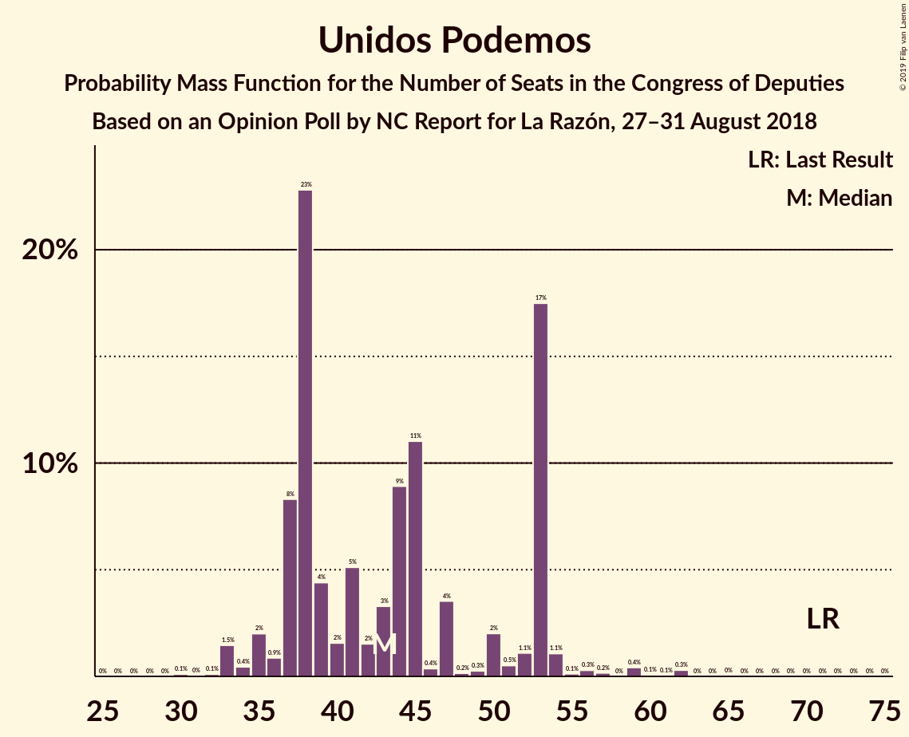
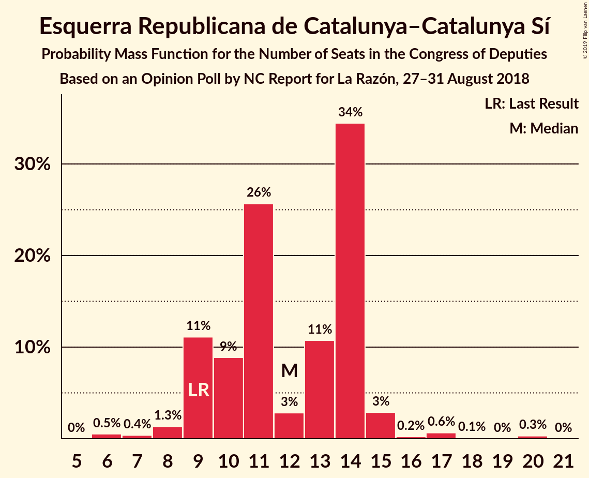
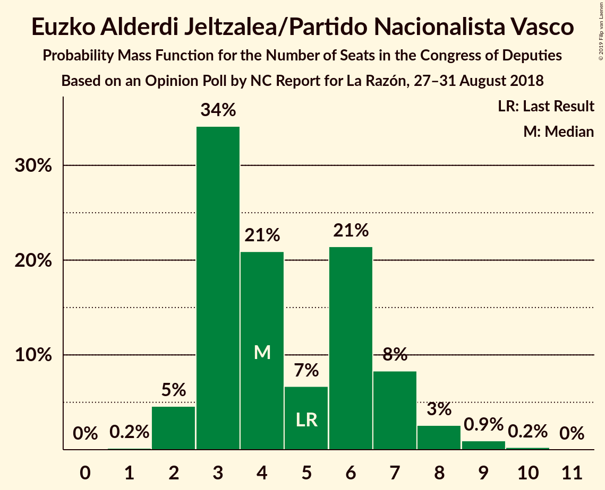
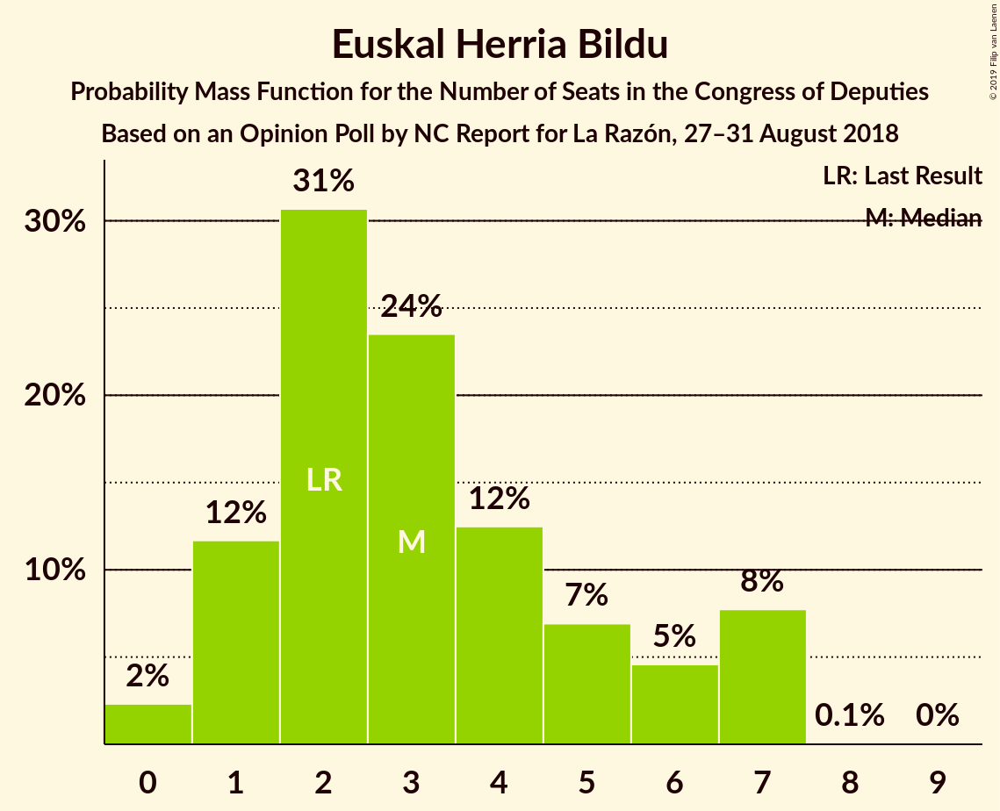
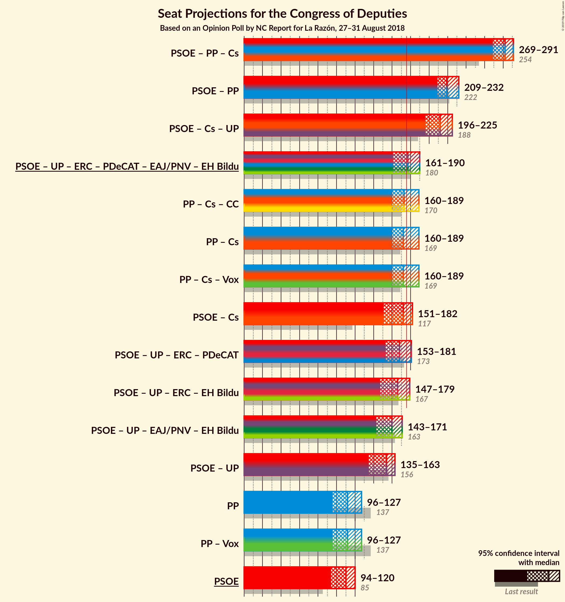
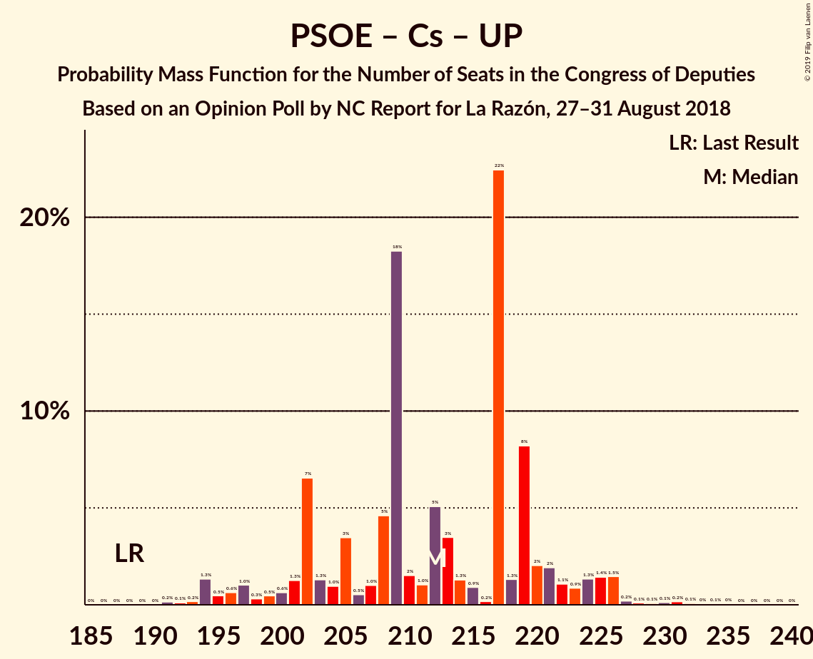
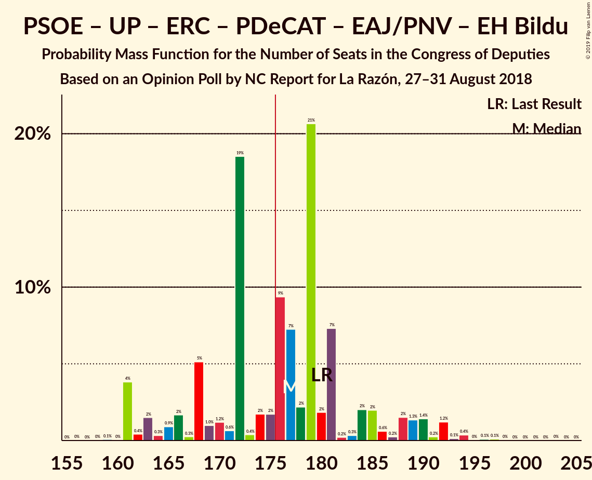
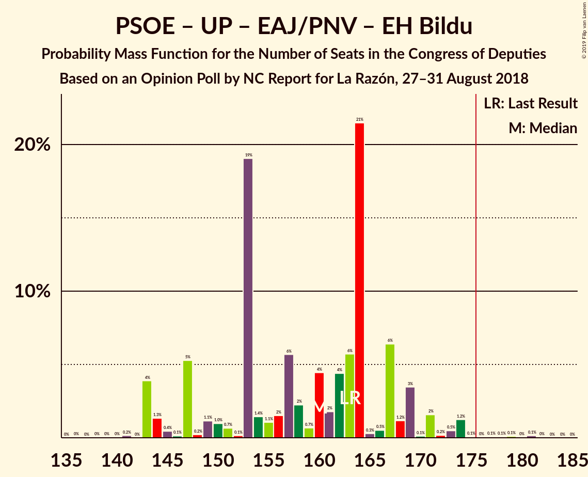

# Opinion Poll by NC Report for La Razón, 27–31 August 2018

<a href="#voting-intentions">Voting Intentions</a> | <a href="#seats">Seats</a> | <a href="#coalitions">Coalitions</a> | <a href="#technical-information">Technical Information</a>

## Voting Intentions

### Confidence Intervals

| Party | Last Result | Poll Result | 80% Confidence Interval | 90% Confidence Interval | 95% Confidence Interval | 99% Confidence Interval |
|:-----:|:-----------:|:-----------:|:-----------------------:|:-----------------------:|:-----------------------:|:-----------------------:|
| Partido Socialista Obrero Español | 22.6% | 27.8% | 26.0–29.7% |25.5–30.2% |25.1–30.7% |24.3–31.6% |
| Partido Popular | 33.0% | 27.5% | 25.7–29.4% |25.2–29.9% |24.8–30.4% |24.0–31.3% |
| Ciudadanos–Partido de la Ciudadanía | 13.1% | 18.8% | 17.3–20.5% |16.9–20.9% |16.5–21.4% |15.8–22.2% |
| Unidos Podemos | 21.2% | 16.0% | 14.6–17.6% |14.2–18.0% |13.9–18.4% |13.2–19.2% |
| Esquerra Republicana de Catalunya–Catalunya Sí | 2.7% | 3.0% | 2.4–3.8% |2.2–4.1% |2.1–4.3% |1.9–4.7% |
| Partit Demòcrata Europeu Català | 2.0% | 1.5% | 1.1–2.1% |1.0–2.3% |0.9–2.5% |0.7–2.8% |
| Euzko Alderdi Jeltzalea/Partido Nacionalista Vasco | 1.2% | 1.1% | 0.8–1.7% |0.7–1.8% |0.6–2.0% |0.5–2.3% |
| Euskal Herria Bildu | 0.8% | 0.8% | 0.5–1.3% |0.5–1.4% |0.4–1.6% |0.3–1.9% |
| Coalición Canaria–Partido Nacionalista Canario | 0.3% | 0.3% | 0.2–0.7% |0.1–0.8% |0.1–0.9% |0.1–1.1% |

*Note:* The poll result column reflects the actual value used in the calculations. Published results may vary slightly, and in addition be rounded to fewer digits.

## Seats

### Confidence Intervals

| Party | Last Result | Median | 80% Confidence Interval | 90% Confidence Interval | 95% Confidence Interval | 99% Confidence Interval |
|:-----:|:-----------:|:------:|:-----------------------:|:-----------------------:|:-----------------------:|:-----------------------:|
| <a href="#partido-socialista-obrero-español">Partido Socialista Obrero Español</a> | 85 | 110 | 94–120 |94–120 |94–120 |93–125 |
| <a href="#partido-popular">Partido Popular</a> | 137 | 112 | 103–121 |99–123 |96–127 |95–128 |
| <a href="#ciudadanos–partido-de-la-ciudadanía">Ciudadanos–Partido de la Ciudadanía</a> | 32 | 62 | 58–65 |54–67 |51–69 |48–72 |
| <a href="#unidos-podemos">Unidos Podemos</a> | 71 | 43 | 37–53 |36–53 |35–54 |33–60 |
| <a href="#esquerra-republicana-de-catalunya–catalunya-sí">Esquerra Republicana de Catalunya–Catalunya Sí</a> | 9 | 12 | 9–14 |9–14 |9–15 |6–17 |
| <a href="#partit-demòcrata-europeu-català">Partit Demòcrata Europeu Català</a> | 8 | 5 | 4–8 |3–8 |3–9 |1–10 |
| <a href="#euzko-alderdi-jeltzalea/partido-nacionalista-vasco">Euzko Alderdi Jeltzalea/Partido Nacionalista Vasco</a> | 5 | 4 | 3–7 |3–7 |2–8 |2–9 |
| <a href="#euskal-herria-bildu">Euskal Herria Bildu</a> | 2 | 3 | 1–6 |1–7 |1–7 |0–7 |
| <a href="#coalición-canaria–partido-nacionalista-canario">Coalición Canaria–Partido Nacionalista Canario</a> | 1 | 1 | 0–1 |0–2 |0–3 |0–4 |

### Partido Socialista Obrero Español

*For a full overview of the results for this party, see the [Partido Socialista Obrero Español](party-partidosocialistaobreroespañol.html) page.*

| Number of Seats | Probability | Accumulated | Special Marks |
|:---------------:|:-----------:|:-----------:|:-------------:|
| 85 | 0% | 100% | Last Result |
| 86 | 0% | 100% |  |
| 87 | 0% | 100% |  |
| 88 | 0% | 100% |  |
| 89 | 0.1% | 99.9% |  |
| 90 | 0.1% | 99.8% |  |
| 91 | 0.1% | 99.7% |  |
| 92 | 0.1% | 99.7% |  |
| 93 | 2% | 99.5% |  |
| 94 | 18% | 98% |  |
| 95 | 0.5% | 80% |  |
| 96 | 0.8% | 80% |  |
| 97 | 7% | 79% |  |
| 98 | 3% | 72% |  |
| 99 | 2% | 69% |  |
| 100 | 0.5% | 68% |  |
| 101 | 1.2% | 67% |  |
| 102 | 0.7% | 66% |  |
| 103 | 4% | 65% |  |
| 104 | 1.4% | 61% |  |
| 105 | 1.1% | 59% |  |
| 106 | 3% | 58% |  |
| 107 | 1.0% | 56% |  |
| 108 | 2% | 55% |  |
| 109 | 0.8% | 53% |  |
| 110 | 6% | 52% | Median |
| 111 | 2% | 46% |  |
| 112 | 1.0% | 43% |  |
| 113 | 4% | 42% |  |
| 114 | 4% | 38% |  |
| 115 | 1.3% | 34% |  |
| 116 | 2% | 32% |  |
| 117 | 6% | 31% |  |
| 118 | 2% | 25% |  |
| 119 | 1.3% | 22% |  |
| 120 | 20% | 21% |  |
| 121 | 0.4% | 2% |  |
| 122 | 0.2% | 1.1% |  |
| 123 | 0% | 0.9% |  |
| 124 | 0.2% | 0.9% |  |
| 125 | 0.4% | 0.7% |  |
| 126 | 0% | 0.2% |  |
| 127 | 0.1% | 0.2% |  |
| 128 | 0.1% | 0.1% |  |
| 129 | 0% | 0.1% |  |
| 130 | 0% | 0.1% |  |
| 131 | 0% | 0.1% |  |
| 132 | 0% | 0.1% |  |
| 133 | 0% | 0% |  |

### Partido Popular

*For a full overview of the results for this party, see the [Partido Popular](party-partidopopular.html) page.*

| Number of Seats | Probability | Accumulated | Special Marks |
|:---------------:|:-----------:|:-----------:|:-------------:|
| 89 | 0% | 100% |  |
| 90 | 0.1% | 99.9% |  |
| 91 | 0% | 99.8% |  |
| 92 | 0.1% | 99.8% |  |
| 93 | 0.1% | 99.7% |  |
| 94 | 0.1% | 99.6% |  |
| 95 | 0.1% | 99.5% |  |
| 96 | 3% | 99.4% |  |
| 97 | 0.3% | 97% |  |
| 98 | 0.4% | 96% |  |
| 99 | 1.4% | 96% |  |
| 100 | 0.6% | 95% |  |
| 101 | 2% | 94% |  |
| 102 | 0.1% | 92% |  |
| 103 | 2% | 92% |  |
| 104 | 0.9% | 89% |  |
| 105 | 0.2% | 88% |  |
| 106 | 2% | 88% |  |
| 107 | 3% | 87% |  |
| 108 | 2% | 83% |  |
| 109 | 7% | 82% |  |
| 110 | 9% | 75% |  |
| 111 | 0.3% | 66% |  |
| 112 | 20% | 66% | Median |
| 113 | 7% | 46% |  |
| 114 | 0.3% | 39% |  |
| 115 | 18% | 38% |  |
| 116 | 3% | 20% |  |
| 117 | 3% | 17% |  |
| 118 | 1.2% | 14% |  |
| 119 | 0.5% | 13% |  |
| 120 | 2% | 13% |  |
| 121 | 0.7% | 10% |  |
| 122 | 4% | 9% |  |
| 123 | 0.4% | 5% |  |
| 124 | 0.9% | 5% |  |
| 125 | 0.9% | 4% |  |
| 126 | 0.4% | 3% |  |
| 127 | 0.9% | 3% |  |
| 128 | 1.5% | 2% |  |
| 129 | 0.2% | 0.4% |  |
| 130 | 0.1% | 0.2% |  |
| 131 | 0% | 0.1% |  |
| 132 | 0% | 0.1% |  |
| 133 | 0% | 0% |  |
| 134 | 0% | 0% |  |
| 135 | 0% | 0% |  |
| 136 | 0% | 0% |  |
| 137 | 0% | 0% | Last Result |

### Ciudadanos–Partido de la Ciudadanía

*For a full overview of the results for this party, see the [Ciudadanos–Partido de la Ciudadanía](party-ciudadanos–partidodelaciudadanía.html) page.*

| Number of Seats | Probability | Accumulated | Special Marks |
|:---------------:|:-----------:|:-----------:|:-------------:|
| 32 | 0% | 100% | Last Result |
| 33 | 0% | 100% |  |
| 34 | 0% | 100% |  |
| 35 | 0% | 100% |  |
| 36 | 0% | 100% |  |
| 37 | 0% | 100% |  |
| 38 | 0% | 100% |  |
| 39 | 0% | 100% |  |
| 40 | 0% | 100% |  |
| 41 | 0% | 100% |  |
| 42 | 0% | 100% |  |
| 43 | 0% | 100% |  |
| 44 | 0% | 100% |  |
| 45 | 0.2% | 100% |  |
| 46 | 0.1% | 99.7% |  |
| 47 | 0% | 99.6% |  |
| 48 | 1.1% | 99.5% |  |
| 49 | 0.5% | 98% |  |
| 50 | 0.2% | 98% |  |
| 51 | 1.1% | 98% |  |
| 52 | 0.5% | 97% |  |
| 53 | 0.4% | 96% |  |
| 54 | 1.1% | 96% |  |
| 55 | 2% | 95% |  |
| 56 | 1.0% | 93% |  |
| 57 | 1.0% | 92% |  |
| 58 | 9% | 91% |  |
| 59 | 24% | 82% |  |
| 60 | 2% | 58% |  |
| 61 | 5% | 56% |  |
| 62 | 19% | 51% | Median |
| 63 | 5% | 33% |  |
| 64 | 14% | 28% |  |
| 65 | 7% | 14% |  |
| 66 | 0.6% | 7% |  |
| 67 | 4% | 7% |  |
| 68 | 0.4% | 3% |  |
| 69 | 1.5% | 3% |  |
| 70 | 0.3% | 1.1% |  |
| 71 | 0.1% | 0.7% |  |
| 72 | 0.4% | 0.7% |  |
| 73 | 0.1% | 0.2% |  |
| 74 | 0.1% | 0.1% |  |
| 75 | 0% | 0.1% |  |
| 76 | 0% | 0.1% |  |
| 77 | 0% | 0% |  |

### Unidos Podemos

*For a full overview of the results for this party, see the [Unidos Podemos](party-unidospodemos.html) page.*

| Number of Seats | Probability | Accumulated | Special Marks |
|:---------------:|:-----------:|:-----------:|:-------------:|
| 30 | 0.1% | 100% |  |
| 31 | 0% | 99.9% |  |
| 32 | 0.1% | 99.8% |  |
| 33 | 1.5% | 99.7% |  |
| 34 | 0.4% | 98% |  |
| 35 | 2% | 98% |  |
| 36 | 0.9% | 96% |  |
| 37 | 8% | 95% |  |
| 38 | 23% | 87% |  |
| 39 | 4% | 64% |  |
| 40 | 2% | 59% |  |
| 41 | 5% | 58% |  |
| 42 | 2% | 53% |  |
| 43 | 3% | 51% | Median |
| 44 | 9% | 48% |  |
| 45 | 11% | 39% |  |
| 46 | 0.4% | 28% |  |
| 47 | 4% | 28% |  |
| 48 | 0.2% | 24% |  |
| 49 | 0.3% | 24% |  |
| 50 | 2% | 24% |  |
| 51 | 0.5% | 22% |  |
| 52 | 1.1% | 21% |  |
| 53 | 17% | 20% |  |
| 54 | 1.1% | 3% |  |
| 55 | 0.1% | 2% |  |
| 56 | 0.3% | 1.4% |  |
| 57 | 0.2% | 1.1% |  |
| 58 | 0% | 0.9% |  |
| 59 | 0.4% | 0.9% |  |
| 60 | 0.1% | 0.5% |  |
| 61 | 0.1% | 0.4% |  |
| 62 | 0.3% | 0.4% |  |
| 63 | 0% | 0.1% |  |
| 64 | 0% | 0.1% |  |
| 65 | 0% | 0.1% |  |
| 66 | 0% | 0% |  |
| 67 | 0% | 0% |  |
| 68 | 0% | 0% |  |
| 69 | 0% | 0% |  |
| 70 | 0% | 0% |  |
| 71 | 0% | 0% | Last Result |

### Esquerra Republicana de Catalunya–Catalunya Sí

*For a full overview of the results for this party, see the [Esquerra Republicana de Catalunya–Catalunya Sí](party-esquerrarepublicanadecatalunya–catalunyasí.html) page.*

| Number of Seats | Probability | Accumulated | Special Marks |
|:---------------:|:-----------:|:-----------:|:-------------:|
| 6 | 0.5% | 100% |  |
| 7 | 0.4% | 99.5% |  |
| 8 | 1.3% | 99.1% |  |
| 9 | 11% | 98% | Last Result |
| 10 | 9% | 87% |  |
| 11 | 26% | 78% |  |
| 12 | 3% | 52% | Median |
| 13 | 11% | 49% |  |
| 14 | 34% | 39% |  |
| 15 | 3% | 4% |  |
| 16 | 0.2% | 1.3% |  |
| 17 | 0.6% | 1.0% |  |
| 18 | 0.1% | 0.4% |  |
| 19 | 0% | 0.3% |  |
| 20 | 0.3% | 0.3% |  |
| 21 | 0% | 0% |  |

### Partit Demòcrata Europeu Català

*For a full overview of the results for this party, see the [Partit Demòcrata Europeu Català](party-partitdemòcrataeuropeucatalà.html) page.*

| Number of Seats | Probability | Accumulated | Special Marks |
|:---------------:|:-----------:|:-----------:|:-------------:|
| 1 | 1.4% | 100% |  |
| 2 | 0% | 98.6% |  |
| 3 | 5% | 98.6% |  |
| 4 | 37% | 93% |  |
| 5 | 30% | 56% | Median |
| 6 | 10% | 27% |  |
| 7 | 1.4% | 17% |  |
| 8 | 12% | 15% | Last Result |
| 9 | 2% | 3% |  |
| 10 | 2% | 2% |  |
| 11 | 0% | 0% |  |

### Euzko Alderdi Jeltzalea/Partido Nacionalista Vasco

*For a full overview of the results for this party, see the [Euzko Alderdi Jeltzalea/Partido Nacionalista Vasco](party-euzkoalderdijeltzaleapartidonacionalistavasco.html) page.*

| Number of Seats | Probability | Accumulated | Special Marks |
|:---------------:|:-----------:|:-----------:|:-------------:|
| 1 | 0.2% | 100% |  |
| 2 | 5% | 99.8% |  |
| 3 | 34% | 95% |  |
| 4 | 21% | 61% | Median |
| 5 | 7% | 40% | Last Result |
| 6 | 21% | 34% |  |
| 7 | 8% | 12% |  |
| 8 | 3% | 4% |  |
| 9 | 0.9% | 1.2% |  |
| 10 | 0.2% | 0.3% |  |
| 11 | 0% | 0% |  |

### Euskal Herria Bildu

*For a full overview of the results for this party, see the [Euskal Herria Bildu](party-euskalherriabildu.html) page.*

| Number of Seats | Probability | Accumulated | Special Marks |
|:---------------:|:-----------:|:-----------:|:-------------:|
| 0 | 2% | 100% |  |
| 1 | 12% | 98% |  |
| 2 | 31% | 86% | Last Result |
| 3 | 24% | 55% | Median |
| 4 | 12% | 32% |  |
| 5 | 7% | 19% |  |
| 6 | 5% | 12% |  |
| 7 | 8% | 8% |  |
| 8 | 0.1% | 0.1% |  |
| 9 | 0% | 0% |  |

### Coalición Canaria–Partido Nacionalista Canario

*For a full overview of the results for this party, see the [Coalición Canaria–Partido Nacionalista Canario](party-coalicióncanaria–partidonacionalistacanario.html) page.*

| Number of Seats | Probability | Accumulated | Special Marks |
|:---------------:|:-----------:|:-----------:|:-------------:|
| 0 | 35% | 100% |  |
| 1 | 57% | 65% | Last Result, Median |
| 2 | 4% | 8% |  |
| 3 | 3% | 4% |  |
| 4 | 0.7% | 0.7% |  |
| 5 | 0% | 0% |  |

## Coalitions

### Confidence Intervals

| Coalition | Last Result | Median | Majority? | 80% Confidence Interval | 90% Confidence Interval | 95% Confidence Interval | 99% Confidence Interval |
|:---------:|:-----------:|:------:|:---------:|:-----------------------:|:-----------------------:|:-----------------------:|:-----------------------:|
| Partido Socialista Obrero Español – Partido Popular – Ciudadanos–Partido de la Ciudadanía | 254 | 282 | 100% | 271–291 | 271–291 | 269–291 | 264–291 |
| Partido Socialista Obrero Español – Partido Popular | 222 | 219 | 100% | 209–232 | 209–232 | 209–232 | 202–235 |
| Partido Socialista Obrero Español – Ciudadanos–Partido de la Ciudadanía – Unidos Podemos | 188 | 212 | 100% | 202–220 | 200–224 | 196–225 | 193–230 |
| Partido Socialista Obrero Español – Unidos Podemos – Esquerra Republicana de Catalunya–Catalunya Sí – Partit Demòcrata Europeu Català – Euzko Alderdi Jeltzalea/Partido Nacionalista Vasco – Euskal Herria Bildu | 180 | 177 | 61% | 168–184 | 163–189 | 161–190 | 161–194 |
| Partido Popular – Ciudadanos–Partido de la Ciudadanía – Coalición Canaria–Partido Nacionalista Canario | 170 | 173 | 38% | 166–182 | 161–187 | 160–189 | 156–189 |
| Partido Popular – Ciudadanos–Partido de la Ciudadanía | 169 | 172 | 36% | 164–181 | 160–186 | 160–189 | 155–189 |
| Partido Socialista Obrero Español – Ciudadanos–Partido de la Ciudadanía | 117 | 172 | 34% | 156–179 | 156–181 | 151–182 | 148–187 |
| Partido Socialista Obrero Español – Unidos Podemos – Esquerra Republicana de Catalunya–Catalunya Sí – Partit Demòcrata Europeu Català | 173 | 168 | 10% | 158–175 | 155–180 | 153–181 | 153–186 |
| Partido Socialista Obrero Español – Unidos Podemos – Esquerra Republicana de Catalunya–Catalunya Sí – Euskal Herria Bildu | 167 | 166 | 9% | 157–175 | 152–177 | 147–179 | 147–184 |
| Partido Socialista Obrero Español – Unidos Podemos – Euzko Alderdi Jeltzalea/Partido Nacionalista Vasco – Euskal Herria Bildu | 163 | 160 | 0.5% | 147–167 | 144–169 | 143–171 | 143–176 |
| Partido Socialista Obrero Español – Unidos Podemos | 156 | 154 | 0.1% | 140–159 | 136–162 | 135–163 | 135–168 |
| Partido Popular | 137 | 112 | 0% | 103–121 | 99–123 | 96–127 | 95–128 |
| Partido Socialista Obrero Español | 85 | 110 | 0% | 94–120 | 94–120 | 94–120 | 93–125 |

### Partido Socialista Obrero Español – Partido Popular – Ciudadanos–Partido de la Ciudadanía

| Number of Seats | Probability | Accumulated | Special Marks |
|:---------------:|:-----------:|:-----------:|:-------------:|
| 254 | 0% | 100% | Last Result |
| 255 | 0% | 100% |  |
| 256 | 0% | 100% |  |
| 257 | 0% | 100% |  |
| 258 | 0% | 100% |  |
| 259 | 0% | 100% |  |
| 260 | 0% | 99.9% |  |
| 261 | 0% | 99.9% |  |
| 262 | 0.3% | 99.9% |  |
| 263 | 0.1% | 99.7% |  |
| 264 | 0.1% | 99.5% |  |
| 265 | 0.4% | 99.5% |  |
| 266 | 1.1% | 99.1% |  |
| 267 | 0.3% | 98% |  |
| 268 | 0.2% | 98% |  |
| 269 | 1.0% | 98% |  |
| 270 | 0.4% | 97% |  |
| 271 | 17% | 96% |  |
| 272 | 0.7% | 79% |  |
| 273 | 2% | 78% |  |
| 274 | 0.3% | 76% |  |
| 275 | 2% | 76% |  |
| 276 | 0.6% | 73% |  |
| 277 | 6% | 73% |  |
| 278 | 4% | 67% |  |
| 279 | 5% | 62% |  |
| 280 | 2% | 58% |  |
| 281 | 3% | 56% |  |
| 282 | 5% | 53% |  |
| 283 | 8% | 48% |  |
| 284 | 2% | 39% | Median |
| 285 | 8% | 37% |  |
| 286 | 5% | 29% |  |
| 287 | 1.1% | 25% |  |
| 288 | 0.2% | 24% |  |
| 289 | 3% | 24% |  |
| 290 | 0.7% | 20% |  |
| 291 | 20% | 20% |  |
| 292 | 0% | 0% |  |

### Partido Socialista Obrero Español – Partido Popular

| Number of Seats | Probability | Accumulated | Special Marks |
|:---------------:|:-----------:|:-----------:|:-------------:|
| 194 | 0% | 100% |  |
| 195 | 0% | 99.9% |  |
| 196 | 0.1% | 99.9% |  |
| 197 | 0% | 99.8% |  |
| 198 | 0% | 99.8% |  |
| 199 | 0% | 99.7% |  |
| 200 | 0% | 99.7% |  |
| 201 | 0% | 99.7% |  |
| 202 | 0.3% | 99.7% |  |
| 203 | 0.2% | 99.4% |  |
| 204 | 0.2% | 99.2% |  |
| 205 | 0.1% | 99.0% |  |
| 206 | 0.6% | 98.9% |  |
| 207 | 0.1% | 98% |  |
| 208 | 0.3% | 98% |  |
| 209 | 18% | 98% |  |
| 210 | 0.6% | 80% |  |
| 211 | 0.3% | 79% |  |
| 212 | 3% | 79% |  |
| 213 | 0.4% | 76% |  |
| 214 | 8% | 75% |  |
| 215 | 4% | 67% |  |
| 216 | 4% | 64% |  |
| 217 | 3% | 60% |  |
| 218 | 0.8% | 57% |  |
| 219 | 11% | 56% |  |
| 220 | 3% | 45% |  |
| 221 | 4% | 42% |  |
| 222 | 0.7% | 39% | Last Result, Median |
| 223 | 0.6% | 38% |  |
| 224 | 5% | 37% |  |
| 225 | 1.1% | 32% |  |
| 226 | 2% | 31% |  |
| 227 | 4% | 29% |  |
| 228 | 0.3% | 26% |  |
| 229 | 0.1% | 25% |  |
| 230 | 3% | 25% |  |
| 231 | 0.3% | 22% |  |
| 232 | 20% | 22% |  |
| 233 | 0.3% | 2% |  |
| 234 | 0.1% | 2% |  |
| 235 | 1.3% | 2% |  |
| 236 | 0.1% | 0.3% |  |
| 237 | 0% | 0.2% |  |
| 238 | 0% | 0.1% |  |
| 239 | 0% | 0.1% |  |
| 240 | 0% | 0.1% |  |
| 241 | 0.1% | 0.1% |  |
| 242 | 0% | 0% |  |

### Partido Socialista Obrero Español – Ciudadanos–Partido de la Ciudadanía – Unidos Podemos

| Number of Seats | Probability | Accumulated | Special Marks |
|:---------------:|:-----------:|:-----------:|:-------------:|
| 188 | 0% | 100% | Last Result |
| 189 | 0% | 100% |  |
| 190 | 0% | 99.9% |  |
| 191 | 0.2% | 99.9% |  |
| 192 | 0.1% | 99.8% |  |
| 193 | 0.2% | 99.7% |  |
| 194 | 1.3% | 99.5% |  |
| 195 | 0.5% | 98% |  |
| 196 | 0.6% | 98% |  |
| 197 | 1.0% | 97% |  |
| 198 | 0.3% | 96% |  |
| 199 | 0.5% | 96% |  |
| 200 | 0.6% | 95% |  |
| 201 | 1.3% | 95% |  |
| 202 | 7% | 93% |  |
| 203 | 1.3% | 87% |  |
| 204 | 1.0% | 85% |  |
| 205 | 3% | 85% |  |
| 206 | 0.5% | 81% |  |
| 207 | 1.0% | 80% |  |
| 208 | 5% | 79% |  |
| 209 | 18% | 75% |  |
| 210 | 2% | 57% |  |
| 211 | 1.0% | 55% |  |
| 212 | 5% | 54% |  |
| 213 | 3% | 49% |  |
| 214 | 1.3% | 45% |  |
| 215 | 0.9% | 44% | Median |
| 216 | 0.2% | 43% |  |
| 217 | 22% | 43% |  |
| 218 | 1.3% | 21% |  |
| 219 | 8% | 19% |  |
| 220 | 2% | 11% |  |
| 221 | 2% | 9% |  |
| 222 | 1.1% | 7% |  |
| 223 | 0.9% | 6% |  |
| 224 | 1.3% | 5% |  |
| 225 | 1.4% | 4% |  |
| 226 | 1.5% | 2% |  |
| 227 | 0.2% | 1.0% |  |
| 228 | 0.1% | 0.8% |  |
| 229 | 0.1% | 0.7% |  |
| 230 | 0.1% | 0.6% |  |
| 231 | 0.2% | 0.5% |  |
| 232 | 0.1% | 0.3% |  |
| 233 | 0% | 0.2% |  |
| 234 | 0.1% | 0.2% |  |
| 235 | 0% | 0.1% |  |
| 236 | 0% | 0.1% |  |
| 237 | 0% | 0% |  |

### Partido Socialista Obrero Español – Unidos Podemos – Esquerra Republicana de Catalunya–Catalunya Sí – Partit Demòcrata Europeu Català – Euzko Alderdi Jeltzalea/Partido Nacionalista Vasco – Euskal Herria Bildu

| Number of Seats | Probability | Accumulated | Special Marks |
|:---------------:|:-----------:|:-----------:|:-------------:|
| 156 | 0% | 100% |  |
| 157 | 0% | 99.9% |  |
| 158 | 0% | 99.9% |  |
| 159 | 0.1% | 99.9% |  |
| 160 | 0% | 99.8% |  |
| 161 | 4% | 99.8% |  |
| 162 | 0.4% | 96% |  |
| 163 | 2% | 96% |  |
| 164 | 0.3% | 94% |  |
| 165 | 0.9% | 94% |  |
| 166 | 2% | 93% |  |
| 167 | 0.3% | 91% |  |
| 168 | 5% | 91% |  |
| 169 | 1.0% | 86% |  |
| 170 | 1.2% | 85% |  |
| 171 | 0.6% | 84% |  |
| 172 | 19% | 83% |  |
| 173 | 0.4% | 64% |  |
| 174 | 2% | 64% |  |
| 175 | 2% | 62% |  |
| 176 | 9% | 61% | Majority |
| 177 | 7% | 51% | Median |
| 178 | 2% | 44% |  |
| 179 | 21% | 42% |  |
| 180 | 2% | 21% | Last Result |
| 181 | 7% | 19% |  |
| 182 | 0.2% | 12% |  |
| 183 | 0.3% | 12% |  |
| 184 | 2% | 11% |  |
| 185 | 2% | 9% |  |
| 186 | 0.6% | 7% |  |
| 187 | 0.2% | 7% |  |
| 188 | 2% | 7% |  |
| 189 | 1.3% | 5% |  |
| 190 | 1.4% | 4% |  |
| 191 | 0.2% | 2% |  |
| 192 | 1.2% | 2% |  |
| 193 | 0.1% | 0.8% |  |
| 194 | 0.4% | 0.7% |  |
| 195 | 0% | 0.3% |  |
| 196 | 0.1% | 0.3% |  |
| 197 | 0.1% | 0.2% |  |
| 198 | 0% | 0.1% |  |
| 199 | 0% | 0.1% |  |
| 200 | 0% | 0.1% |  |
| 201 | 0% | 0% |  |

### Partido Popular – Ciudadanos–Partido de la Ciudadanía – Coalición Canaria–Partido Nacionalista Canario

| Number of Seats | Probability | Accumulated | Special Marks |
|:---------------:|:-----------:|:-----------:|:-------------:|
| 150 | 0% | 100% |  |
| 151 | 0% | 99.9% |  |
| 152 | 0% | 99.9% |  |
| 153 | 0.1% | 99.9% |  |
| 154 | 0.1% | 99.8% |  |
| 155 | 0% | 99.7% |  |
| 156 | 0.4% | 99.7% |  |
| 157 | 0.1% | 99.3% |  |
| 158 | 1.2% | 99.2% |  |
| 159 | 0.2% | 98% |  |
| 160 | 1.4% | 98% |  |
| 161 | 1.3% | 96% |  |
| 162 | 2% | 95% |  |
| 163 | 0.2% | 93% |  |
| 164 | 0.6% | 93% |  |
| 165 | 2% | 93% |  |
| 166 | 2% | 91% |  |
| 167 | 0.3% | 89% |  |
| 168 | 0.2% | 88% |  |
| 169 | 7% | 88% |  |
| 170 | 2% | 81% | Last Result |
| 171 | 21% | 79% |  |
| 172 | 2% | 58% |  |
| 173 | 7% | 56% |  |
| 174 | 9% | 49% |  |
| 175 | 2% | 39% | Median |
| 176 | 2% | 38% | Majority |
| 177 | 0.4% | 36% |  |
| 178 | 19% | 36% |  |
| 179 | 0.6% | 17% |  |
| 180 | 1.2% | 16% |  |
| 181 | 1.0% | 15% |  |
| 182 | 5% | 14% |  |
| 183 | 0.3% | 9% |  |
| 184 | 2% | 9% |  |
| 185 | 0.9% | 7% |  |
| 186 | 0.3% | 6% |  |
| 187 | 2% | 6% |  |
| 188 | 0.4% | 4% |  |
| 189 | 4% | 4% |  |
| 190 | 0% | 0.2% |  |
| 191 | 0.1% | 0.2% |  |
| 192 | 0% | 0.1% |  |
| 193 | 0% | 0.1% |  |
| 194 | 0% | 0.1% |  |
| 195 | 0% | 0% |  |

### Partido Popular – Ciudadanos–Partido de la Ciudadanía

| Number of Seats | Probability | Accumulated | Special Marks |
|:---------------:|:-----------:|:-----------:|:-------------:|
| 149 | 0% | 100% |  |
| 150 | 0% | 99.9% |  |
| 151 | 0% | 99.9% |  |
| 152 | 0.1% | 99.9% |  |
| 153 | 0% | 99.8% |  |
| 154 | 0.1% | 99.7% |  |
| 155 | 0.3% | 99.6% |  |
| 156 | 0.2% | 99.3% |  |
| 157 | 0.1% | 99.2% |  |
| 158 | 1.4% | 99.1% |  |
| 159 | 0.1% | 98% |  |
| 160 | 3% | 98% |  |
| 161 | 1.5% | 95% |  |
| 162 | 0.4% | 94% |  |
| 163 | 1.3% | 93% |  |
| 164 | 2% | 92% |  |
| 165 | 1.1% | 90% |  |
| 166 | 0.5% | 89% |  |
| 167 | 0.1% | 88% |  |
| 168 | 8% | 88% |  |
| 169 | 1.2% | 80% | Last Result |
| 170 | 1.5% | 79% |  |
| 171 | 21% | 77% |  |
| 172 | 9% | 57% |  |
| 173 | 6% | 48% |  |
| 174 | 5% | 42% | Median |
| 175 | 1.1% | 37% |  |
| 176 | 0.7% | 36% | Majority |
| 177 | 19% | 36% |  |
| 178 | 0.9% | 17% |  |
| 179 | 1.2% | 16% |  |
| 180 | 0.6% | 15% |  |
| 181 | 5% | 14% |  |
| 182 | 0.8% | 9% |  |
| 183 | 0.2% | 8% |  |
| 184 | 2% | 8% |  |
| 185 | 0.1% | 6% |  |
| 186 | 2% | 6% |  |
| 187 | 0.3% | 4% |  |
| 188 | 0.1% | 4% |  |
| 189 | 4% | 4% |  |
| 190 | 0% | 0.2% |  |
| 191 | 0.1% | 0.1% |  |
| 192 | 0% | 0.1% |  |
| 193 | 0% | 0% |  |

### Partido Socialista Obrero Español – Ciudadanos–Partido de la Ciudadanía

| Number of Seats | Probability | Accumulated | Special Marks |
|:---------------:|:-----------:|:-----------:|:-------------:|
| 117 | 0% | 100% | Last Result |
| 118 | 0% | 100% |  |
| 119 | 0% | 100% |  |
| 120 | 0% | 100% |  |
| 121 | 0% | 100% |  |
| 122 | 0% | 100% |  |
| 123 | 0% | 100% |  |
| 124 | 0% | 100% |  |
| 125 | 0% | 100% |  |
| 126 | 0% | 100% |  |
| 127 | 0% | 100% |  |
| 128 | 0% | 100% |  |
| 129 | 0% | 100% |  |
| 130 | 0% | 100% |  |
| 131 | 0% | 100% |  |
| 132 | 0% | 100% |  |
| 133 | 0% | 100% |  |
| 134 | 0% | 100% |  |
| 135 | 0% | 100% |  |
| 136 | 0% | 100% |  |
| 137 | 0% | 100% |  |
| 138 | 0% | 100% |  |
| 139 | 0% | 100% |  |
| 140 | 0% | 100% |  |
| 141 | 0% | 100% |  |
| 142 | 0% | 100% |  |
| 143 | 0% | 100% |  |
| 144 | 0% | 100% |  |
| 145 | 0.1% | 100% |  |
| 146 | 0% | 99.9% |  |
| 147 | 0% | 99.9% |  |
| 148 | 0.5% | 99.9% |  |
| 149 | 0.2% | 99.4% |  |
| 150 | 0.3% | 99.1% |  |
| 151 | 1.4% | 98.8% |  |
| 152 | 0.1% | 97% |  |
| 153 | 0.1% | 97% |  |
| 154 | 0.5% | 97% |  |
| 155 | 0.2% | 97% |  |
| 156 | 20% | 96% |  |
| 157 | 0.2% | 76% |  |
| 158 | 0.8% | 76% |  |
| 159 | 0.9% | 75% |  |
| 160 | 0.3% | 74% |  |
| 161 | 4% | 74% |  |
| 162 | 0.6% | 70% |  |
| 163 | 4% | 69% |  |
| 164 | 8% | 65% |  |
| 165 | 0.2% | 57% |  |
| 166 | 1.2% | 57% |  |
| 167 | 0.8% | 56% |  |
| 168 | 0.7% | 55% |  |
| 169 | 1.3% | 55% |  |
| 170 | 0.4% | 53% |  |
| 171 | 1.5% | 53% |  |
| 172 | 4% | 51% | Median |
| 173 | 0.9% | 47% |  |
| 174 | 9% | 46% |  |
| 175 | 3% | 37% |  |
| 176 | 4% | 34% | Majority |
| 177 | 0.2% | 30% |  |
| 178 | 3% | 30% |  |
| 179 | 21% | 27% |  |
| 180 | 0.5% | 6% |  |
| 181 | 2% | 6% |  |
| 182 | 2% | 3% |  |
| 183 | 0.4% | 2% |  |
| 184 | 0.1% | 1.3% |  |
| 185 | 0.1% | 1.2% |  |
| 186 | 0% | 1.1% |  |
| 187 | 0.7% | 1.0% |  |
| 188 | 0.1% | 0.3% |  |
| 189 | 0% | 0.2% |  |
| 190 | 0% | 0.2% |  |
| 191 | 0% | 0.2% |  |
| 192 | 0% | 0.2% |  |
| 193 | 0% | 0.1% |  |
| 194 | 0% | 0.1% |  |
| 195 | 0% | 0.1% |  |
| 196 | 0% | 0.1% |  |
| 197 | 0% | 0% |  |

### Partido Socialista Obrero Español – Unidos Podemos – Esquerra Republicana de Catalunya–Catalunya Sí – Partit Demòcrata Europeu Català

| Number of Seats | Probability | Accumulated | Special Marks |
|:---------------:|:-----------:|:-----------:|:-------------:|
| 147 | 0% | 100% |  |
| 148 | 0% | 99.9% |  |
| 149 | 0% | 99.9% |  |
| 150 | 0.1% | 99.9% |  |
| 151 | 0.1% | 99.8% |  |
| 152 | 0.2% | 99.8% |  |
| 153 | 4% | 99.6% |  |
| 154 | 0.5% | 96% |  |
| 155 | 2% | 95% |  |
| 156 | 0.8% | 93% |  |
| 157 | 0% | 92% |  |
| 158 | 4% | 92% |  |
| 159 | 0.3% | 88% |  |
| 160 | 0.3% | 88% |  |
| 161 | 1.4% | 88% |  |
| 162 | 3% | 86% |  |
| 163 | 1.3% | 83% |  |
| 164 | 0.2% | 81% |  |
| 165 | 2% | 81% |  |
| 166 | 22% | 79% |  |
| 167 | 4% | 57% |  |
| 168 | 6% | 53% |  |
| 169 | 0.8% | 47% |  |
| 170 | 4% | 47% | Median |
| 171 | 4% | 43% |  |
| 172 | 0.8% | 39% |  |
| 173 | 25% | 38% | Last Result |
| 174 | 2% | 12% |  |
| 175 | 0.4% | 10% |  |
| 176 | 2% | 10% | Majority |
| 177 | 0.1% | 8% |  |
| 178 | 1.4% | 8% |  |
| 179 | 0.4% | 7% |  |
| 180 | 1.4% | 6% |  |
| 181 | 2% | 5% |  |
| 182 | 0.1% | 2% |  |
| 183 | 1.5% | 2% |  |
| 184 | 0% | 0.9% |  |
| 185 | 0.1% | 0.8% |  |
| 186 | 0.3% | 0.8% |  |
| 187 | 0.2% | 0.4% |  |
| 188 | 0% | 0.3% |  |
| 189 | 0.1% | 0.2% |  |
| 190 | 0.1% | 0.2% |  |
| 191 | 0% | 0.1% |  |
| 192 | 0% | 0% |  |

### Partido Socialista Obrero Español – Unidos Podemos – Esquerra Republicana de Catalunya–Catalunya Sí – Euskal Herria Bildu

| Number of Seats | Probability | Accumulated | Special Marks |
|:---------------:|:-----------:|:-----------:|:-------------:|
| 144 | 0% | 100% |  |
| 145 | 0% | 99.9% |  |
| 146 | 0% | 99.9% |  |
| 147 | 4% | 99.9% |  |
| 148 | 0.3% | 96% |  |
| 149 | 0% | 96% |  |
| 150 | 0.3% | 96% |  |
| 151 | 0.2% | 96% |  |
| 152 | 2% | 95% |  |
| 153 | 0% | 94% |  |
| 154 | 0% | 94% |  |
| 155 | 2% | 94% |  |
| 156 | 0.9% | 92% |  |
| 157 | 6% | 91% |  |
| 158 | 1.4% | 85% |  |
| 159 | 0.5% | 84% |  |
| 160 | 0.6% | 83% |  |
| 161 | 1.3% | 83% |  |
| 162 | 0.7% | 82% |  |
| 163 | 1.1% | 81% |  |
| 164 | 20% | 80% |  |
| 165 | 6% | 60% |  |
| 166 | 5% | 54% |  |
| 167 | 3% | 48% | Last Result |
| 168 | 5% | 45% | Median |
| 169 | 0.3% | 40% |  |
| 170 | 1.4% | 39% |  |
| 171 | 19% | 38% |  |
| 172 | 0.5% | 19% |  |
| 173 | 0.8% | 19% |  |
| 174 | 7% | 18% |  |
| 175 | 2% | 11% |  |
| 176 | 2% | 9% | Majority |
| 177 | 3% | 6% |  |
| 178 | 0.5% | 4% |  |
| 179 | 0.9% | 3% |  |
| 180 | 0.1% | 2% |  |
| 181 | 1.3% | 2% |  |
| 182 | 0.1% | 0.9% |  |
| 183 | 0% | 0.7% |  |
| 184 | 0.4% | 0.7% |  |
| 185 | 0% | 0.3% |  |
| 186 | 0.1% | 0.3% |  |
| 187 | 0.1% | 0.2% |  |
| 188 | 0% | 0.1% |  |
| 189 | 0% | 0.1% |  |
| 190 | 0% | 0.1% |  |
| 191 | 0% | 0.1% |  |
| 192 | 0% | 0% |  |

### Partido Socialista Obrero Español – Unidos Podemos – Euzko Alderdi Jeltzalea/Partido Nacionalista Vasco – Euskal Herria Bildu

| Number of Seats | Probability | Accumulated | Special Marks |
|:---------------:|:-----------:|:-----------:|:-------------:|
| 138 | 0% | 100% |  |
| 139 | 0% | 99.9% |  |
| 140 | 0% | 99.9% |  |
| 141 | 0.2% | 99.9% |  |
| 142 | 0% | 99.7% |  |
| 143 | 4% | 99.7% |  |
| 144 | 1.3% | 96% |  |
| 145 | 0.4% | 94% |  |
| 146 | 0.1% | 94% |  |
| 147 | 5% | 94% |  |
| 148 | 0.2% | 89% |  |
| 149 | 1.1% | 88% |  |
| 150 | 1.0% | 87% |  |
| 151 | 0.7% | 86% |  |
| 152 | 0.1% | 86% |  |
| 153 | 19% | 85% |  |
| 154 | 1.4% | 66% |  |
| 155 | 1.1% | 65% |  |
| 156 | 2% | 64% |  |
| 157 | 6% | 62% |  |
| 158 | 2% | 57% |  |
| 159 | 0.7% | 54% |  |
| 160 | 4% | 54% | Median |
| 161 | 2% | 49% |  |
| 162 | 4% | 48% |  |
| 163 | 6% | 43% | Last Result |
| 164 | 21% | 37% |  |
| 165 | 0.3% | 16% |  |
| 166 | 0.5% | 16% |  |
| 167 | 6% | 15% |  |
| 168 | 1.2% | 9% |  |
| 169 | 3% | 8% |  |
| 170 | 0.1% | 4% |  |
| 171 | 2% | 4% |  |
| 172 | 0.2% | 2% |  |
| 173 | 0.5% | 2% |  |
| 174 | 1.2% | 2% |  |
| 175 | 0.1% | 0.6% |  |
| 176 | 0% | 0.5% | Majority |
| 177 | 0.1% | 0.5% |  |
| 178 | 0.1% | 0.4% |  |
| 179 | 0.1% | 0.4% |  |
| 180 | 0% | 0.3% |  |
| 181 | 0.1% | 0.2% |  |
| 182 | 0% | 0.1% |  |
| 183 | 0% | 0.1% |  |
| 184 | 0% | 0% |  |

### Partido Socialista Obrero Español – Unidos Podemos

| Number of Seats | Probability | Accumulated | Special Marks |
|:---------------:|:-----------:|:-----------:|:-------------:|
| 129 | 0% | 100% |  |
| 130 | 0% | 99.9% |  |
| 131 | 0.2% | 99.9% |  |
| 132 | 0% | 99.7% |  |
| 133 | 0% | 99.7% |  |
| 134 | 0% | 99.7% |  |
| 135 | 4% | 99.6% |  |
| 136 | 1.3% | 96% |  |
| 137 | 3% | 94% |  |
| 138 | 0.2% | 91% |  |
| 139 | 0% | 91% |  |
| 140 | 1.3% | 91% |  |
| 141 | 4% | 90% |  |
| 142 | 0.2% | 86% |  |
| 143 | 1.1% | 86% |  |
| 144 | 0.3% | 85% |  |
| 145 | 2% | 84% |  |
| 146 | 1.4% | 83% |  |
| 147 | 23% | 81% |  |
| 148 | 0.3% | 58% |  |
| 149 | 3% | 58% |  |
| 150 | 1.4% | 55% |  |
| 151 | 1.3% | 54% |  |
| 152 | 0.2% | 52% |  |
| 153 | 2% | 52% | Median |
| 154 | 10% | 50% |  |
| 155 | 6% | 41% |  |
| 156 | 0.4% | 35% | Last Result |
| 157 | 2% | 35% |  |
| 158 | 20% | 33% |  |
| 159 | 5% | 12% |  |
| 160 | 1.0% | 7% |  |
| 161 | 0.4% | 7% |  |
| 162 | 2% | 6% |  |
| 163 | 3% | 5% |  |
| 164 | 0.1% | 1.1% |  |
| 165 | 0.3% | 1.0% |  |
| 166 | 0% | 0.7% |  |
| 167 | 0% | 0.7% |  |
| 168 | 0.2% | 0.6% |  |
| 169 | 0% | 0.5% |  |
| 170 | 0.1% | 0.4% |  |
| 171 | 0.1% | 0.3% |  |
| 172 | 0% | 0.2% |  |
| 173 | 0% | 0.2% |  |
| 174 | 0.1% | 0.2% |  |
| 175 | 0% | 0.1% |  |
| 176 | 0% | 0.1% | Majority |
| 177 | 0% | 0% |  |

### Partido Popular

| Number of Seats | Probability | Accumulated | Special Marks |
|:---------------:|:-----------:|:-----------:|:-------------:|
| 89 | 0% | 100% |  |
| 90 | 0.1% | 99.9% |  |
| 91 | 0% | 99.8% |  |
| 92 | 0.1% | 99.8% |  |
| 93 | 0.1% | 99.7% |  |
| 94 | 0.1% | 99.6% |  |
| 95 | 0.1% | 99.5% |  |
| 96 | 3% | 99.4% |  |
| 97 | 0.3% | 97% |  |
| 98 | 0.4% | 96% |  |
| 99 | 1.4% | 96% |  |
| 100 | 0.6% | 95% |  |
| 101 | 2% | 94% |  |
| 102 | 0.1% | 92% |  |
| 103 | 2% | 92% |  |
| 104 | 0.9% | 89% |  |
| 105 | 0.2% | 88% |  |
| 106 | 2% | 88% |  |
| 107 | 3% | 87% |  |
| 108 | 2% | 83% |  |
| 109 | 7% | 82% |  |
| 110 | 9% | 75% |  |
| 111 | 0.3% | 66% |  |
| 112 | 20% | 66% | Median |
| 113 | 7% | 46% |  |
| 114 | 0.3% | 39% |  |
| 115 | 18% | 38% |  |
| 116 | 3% | 20% |  |
| 117 | 3% | 17% |  |
| 118 | 1.2% | 14% |  |
| 119 | 0.5% | 13% |  |
| 120 | 2% | 13% |  |
| 121 | 0.7% | 10% |  |
| 122 | 4% | 9% |  |
| 123 | 0.4% | 5% |  |
| 124 | 0.9% | 5% |  |
| 125 | 0.9% | 4% |  |
| 126 | 0.4% | 3% |  |
| 127 | 0.9% | 3% |  |
| 128 | 1.5% | 2% |  |
| 129 | 0.2% | 0.4% |  |
| 130 | 0.1% | 0.2% |  |
| 131 | 0% | 0.1% |  |
| 132 | 0% | 0.1% |  |
| 133 | 0% | 0% |  |
| 134 | 0% | 0% |  |
| 135 | 0% | 0% |  |
| 136 | 0% | 0% |  |
| 137 | 0% | 0% | Last Result |

### Partido Socialista Obrero Español

| Number of Seats | Probability | Accumulated | Special Marks |
|:---------------:|:-----------:|:-----------:|:-------------:|
| 85 | 0% | 100% | Last Result |
| 86 | 0% | 100% |  |
| 87 | 0% | 100% |  |
| 88 | 0% | 100% |  |
| 89 | 0.1% | 99.9% |  |
| 90 | 0.1% | 99.8% |  |
| 91 | 0.1% | 99.7% |  |
| 92 | 0.1% | 99.7% |  |
| 93 | 2% | 99.5% |  |
| 94 | 18% | 98% |  |
| 95 | 0.5% | 80% |  |
| 96 | 0.8% | 80% |  |
| 97 | 7% | 79% |  |
| 98 | 3% | 72% |  |
| 99 | 2% | 69% |  |
| 100 | 0.5% | 68% |  |
| 101 | 1.2% | 67% |  |
| 102 | 0.7% | 66% |  |
| 103 | 4% | 65% |  |
| 104 | 1.4% | 61% |  |
| 105 | 1.1% | 59% |  |
| 106 | 3% | 58% |  |
| 107 | 1.0% | 56% |  |
| 108 | 2% | 55% |  |
| 109 | 0.8% | 53% |  |
| 110 | 6% | 52% | Median |
| 111 | 2% | 46% |  |
| 112 | 1.0% | 43% |  |
| 113 | 4% | 42% |  |
| 114 | 4% | 38% |  |
| 115 | 1.3% | 34% |  |
| 116 | 2% | 32% |  |
| 117 | 6% | 31% |  |
| 118 | 2% | 25% |  |
| 119 | 1.3% | 22% |  |
| 120 | 20% | 21% |  |
| 121 | 0.4% | 2% |  |
| 122 | 0.2% | 1.1% |  |
| 123 | 0% | 0.9% |  |
| 124 | 0.2% | 0.9% |  |
| 125 | 0.4% | 0.7% |  |
| 126 | 0% | 0.2% |  |
| 127 | 0.1% | 0.2% |  |
| 128 | 0.1% | 0.1% |  |
| 129 | 0% | 0.1% |  |
| 130 | 0% | 0.1% |  |
| 131 | 0% | 0.1% |  |
| 132 | 0% | 0.1% |  |
| 133 | 0% | 0% |  |

## Technical Information

### Opinion Poll

+ **Polling firm:** NC Report
+ **Commissioner(s):** La Razón
+ **Fieldwork period:** 27–31 August 2018

### Calculations

+ **Sample size:** 1000
+ **Simulations done:** 131,072
+ **Error estimate:** 2.62%

