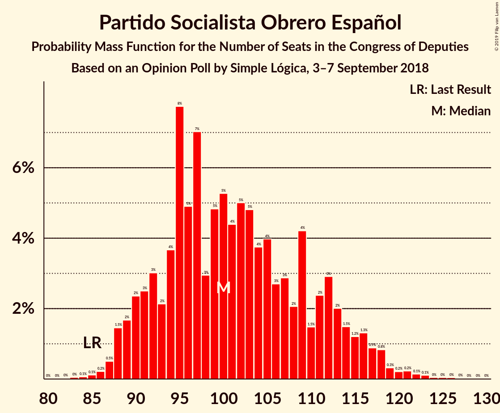
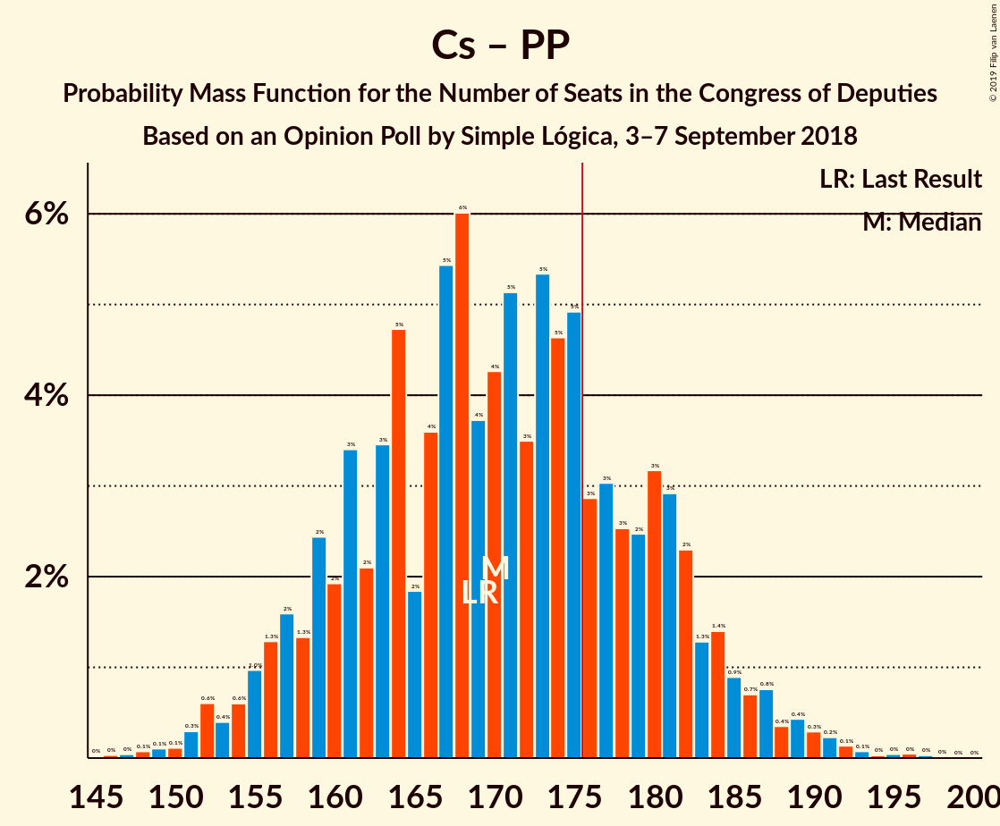

# Opinion Poll by Simple Lógica, 3–7 September 2018

<a href="#voting-intentions">Voting Intentions</a> | <a href="#seats">Seats</a> | <a href="#coalitions">Coalitions</a> | <a href="#technical-information">Technical Information</a>

## Voting Intentions

### Confidence Intervals

| Party | Last Result | Poll Result | 80% Confidence Interval | 90% Confidence Interval | 95% Confidence Interval | 99% Confidence Interval |
|:-----:|:-----------:|:-----------:|:-----------------------:|:-----------------------:|:-----------------------:|:-----------------------:|
| Partido Socialista Obrero Español | 22.6% | 24.8% | 23.1–26.6% |22.6–27.1% |22.2–27.5% |21.4–28.4% |
| Ciudadanos–Partido de la Ciudadanía | 13.1% | 23.2% | 21.5–24.9% |21.1–25.4% |20.7–25.9% |19.9–26.7% |
| Partido Popular | 33.0% | 21.1% | 19.5–22.8% |19.1–23.3% |18.7–23.7% |17.9–24.6% |
| Unidos Podemos | 21.2% | 16.6% | 15.2–18.2% |14.8–18.7% |14.5–19.1% |13.8–19.8% |

*Note:* The poll result column reflects the actual value used in the calculations. Published results may vary slightly, and in addition be rounded to fewer digits.

## Seats

### Confidence Intervals

| Party | Last Result | Median | 80% Confidence Interval | 90% Confidence Interval | 95% Confidence Interval | 99% Confidence Interval |
|:-----:|:-----------:|:------:|:-----------------------:|:-----------------------:|:-----------------------:|:-----------------------:|
| <a href="#partido-socialista-obrero-español">Partido Socialista Obrero Español</a> | 85 | 67 | 66–68 |65–84 |64–85 |61–87 |
| <a href="#ciudadanos–partido-de-la-ciudadanía">Ciudadanos–Partido de la Ciudadanía</a> | 32 | 60 | 59–61 |59–63 |59–76 |48–76 |
| <a href="#partido-popular">Partido Popular</a> | 137 | 66 | 62–66 |57–66 |56–66 |56–68 |
| <a href="#unidos-podemos">Unidos Podemos</a> | 71 | 37 | 28–38 |26–38 |25–39 |22–40 |

### Partido Socialista Obrero Español

*For a full overview of the results for this party, see the [Partido Socialista Obrero Español](party-partidosocialistaobreroespañol.html) page.*

| Number of Seats | Probability | Accumulated | Special Marks |
|:---------------:|:-----------:|:-----------:|:-------------:|
| 61 | 0.7% | 100% |  |
| 62 | 0.3% | 99.3% |  |
| 63 | 0.5% | 99.0% |  |
| 64 | 3% | 98% |  |
| 65 | 2% | 96% |  |
| 66 | 6% | 94% |  |
| 67 | 75% | 88% | Median |
| 68 | 3% | 12% |  |
| 69 | 1.0% | 9% |  |
| 70 | 0.1% | 8% |  |
| 71 | 0.2% | 8% |  |
| 72 | 0.1% | 8% |  |
| 73 | 0.3% | 8% |  |
| 74 | 0.7% | 8% |  |
| 75 | 0.1% | 7% |  |
| 76 | 0% | 7% |  |
| 77 | 0% | 7% |  |
| 78 | 0.1% | 7% |  |
| 79 | 0.1% | 7% |  |
| 80 | 0.1% | 7% |  |
| 81 | 0.6% | 7% |  |
| 82 | 0.7% | 6% |  |
| 83 | 0% | 5% |  |
| 84 | 2% | 5% |  |
| 85 | 1.3% | 3% | Last Result |
| 86 | 0.3% | 2% |  |
| 87 | 1.2% | 1.4% |  |
| 88 | 0% | 0.3% |  |
| 89 | 0.2% | 0.3% |  |
| 90 | 0% | 0% |  |

### Ciudadanos–Partido de la Ciudadanía

*For a full overview of the results for this party, see the [Ciudadanos–Partido de la Ciudadanía](party-ciudadanos–partidodelaciudadanía.html) page.*

| Number of Seats | Probability | Accumulated | Special Marks |
|:---------------:|:-----------:|:-----------:|:-------------:|
| 32 | 0% | 100% | Last Result |
| 33 | 0% | 100% |  |
| 34 | 0% | 100% |  |
| 35 | 0% | 100% |  |
| 36 | 0% | 100% |  |
| 37 | 0% | 100% |  |
| 38 | 0% | 100% |  |
| 39 | 0% | 100% |  |
| 40 | 0% | 100% |  |
| 41 | 0% | 100% |  |
| 42 | 0% | 100% |  |
| 43 | 0% | 100% |  |
| 44 | 0% | 100% |  |
| 45 | 0% | 100% |  |
| 46 | 0% | 100% |  |
| 47 | 0% | 100% |  |
| 48 | 0.5% | 100% |  |
| 49 | 0% | 99.5% |  |
| 50 | 1.3% | 99.5% |  |
| 51 | 0% | 98% |  |
| 52 | 0% | 98% |  |
| 53 | 0% | 98% |  |
| 54 | 0% | 98% |  |
| 55 | 0% | 98% |  |
| 56 | 0% | 98% |  |
| 57 | 0% | 98% |  |
| 58 | 0% | 98% |  |
| 59 | 38% | 98% |  |
| 60 | 50% | 60% | Median |
| 61 | 0.6% | 10% |  |
| 62 | 5% | 10% |  |
| 63 | 0.2% | 5% |  |
| 64 | 0% | 5% |  |
| 65 | 0% | 5% |  |
| 66 | 0% | 5% |  |
| 67 | 0% | 5% |  |
| 68 | 0% | 5% |  |
| 69 | 0% | 5% |  |
| 70 | 0% | 5% |  |
| 71 | 0% | 5% |  |
| 72 | 0.9% | 5% |  |
| 73 | 0.3% | 4% |  |
| 74 | 0.2% | 4% |  |
| 75 | 0.2% | 4% |  |
| 76 | 3% | 3% |  |
| 77 | 0% | 0% |  |

### Partido Popular

*For a full overview of the results for this party, see the [Partido Popular](party-partidopopular.html) page.*

| Number of Seats | Probability | Accumulated | Special Marks |
|:---------------:|:-----------:|:-----------:|:-------------:|
| 45 | 0.1% | 100% |  |
| 46 | 0% | 99.8% |  |
| 47 | 0% | 99.8% |  |
| 48 | 0% | 99.8% |  |
| 49 | 0% | 99.8% |  |
| 50 | 0% | 99.8% |  |
| 51 | 0% | 99.8% |  |
| 52 | 0% | 99.8% |  |
| 53 | 0% | 99.8% |  |
| 54 | 0% | 99.8% |  |
| 55 | 0% | 99.8% |  |
| 56 | 4% | 99.8% |  |
| 57 | 1.3% | 96% |  |
| 58 | 1.0% | 95% |  |
| 59 | 0.7% | 94% |  |
| 60 | 1.2% | 93% |  |
| 61 | 0% | 92% |  |
| 62 | 3% | 92% |  |
| 63 | 0.5% | 89% |  |
| 64 | 0.8% | 88% |  |
| 65 | 3% | 87% |  |
| 66 | 83% | 84% | Median |
| 67 | 0% | 1.0% |  |
| 68 | 0.7% | 1.0% |  |
| 69 | 0% | 0.3% |  |
| 70 | 0% | 0.3% |  |
| 71 | 0% | 0.3% |  |
| 72 | 0% | 0.3% |  |
| 73 | 0% | 0.3% |  |
| 74 | 0% | 0.3% |  |
| 75 | 0.1% | 0.3% |  |
| 76 | 0.1% | 0.2% |  |
| 77 | 0% | 0.1% |  |
| 78 | 0% | 0.1% |  |
| 79 | 0.1% | 0.1% |  |
| 80 | 0% | 0% |  |
| 81 | 0% | 0% |  |
| 82 | 0% | 0% |  |
| 83 | 0% | 0% |  |
| 84 | 0% | 0% |  |
| 85 | 0% | 0% |  |
| 86 | 0% | 0% |  |
| 87 | 0% | 0% |  |
| 88 | 0% | 0% |  |
| 89 | 0% | 0% |  |
| 90 | 0% | 0% |  |
| 91 | 0% | 0% |  |
| 92 | 0% | 0% |  |
| 93 | 0% | 0% |  |
| 94 | 0% | 0% |  |
| 95 | 0% | 0% |  |
| 96 | 0% | 0% |  |
| 97 | 0% | 0% |  |
| 98 | 0% | 0% |  |
| 99 | 0% | 0% |  |
| 100 | 0% | 0% |  |
| 101 | 0% | 0% |  |
| 102 | 0% | 0% |  |
| 103 | 0% | 0% |  |
| 104 | 0% | 0% |  |
| 105 | 0% | 0% |  |
| 106 | 0% | 0% |  |
| 107 | 0% | 0% |  |
| 108 | 0% | 0% |  |
| 109 | 0% | 0% |  |
| 110 | 0% | 0% |  |
| 111 | 0% | 0% |  |
| 112 | 0% | 0% |  |
| 113 | 0% | 0% |  |
| 114 | 0% | 0% |  |
| 115 | 0% | 0% |  |
| 116 | 0% | 0% |  |
| 117 | 0% | 0% |  |
| 118 | 0% | 0% |  |
| 119 | 0% | 0% |  |
| 120 | 0% | 0% |  |
| 121 | 0% | 0% |  |
| 122 | 0% | 0% |  |
| 123 | 0% | 0% |  |
| 124 | 0% | 0% |  |
| 125 | 0% | 0% |  |
| 126 | 0% | 0% |  |
| 127 | 0% | 0% |  |
| 128 | 0% | 0% |  |
| 129 | 0% | 0% |  |
| 130 | 0% | 0% |  |
| 131 | 0% | 0% |  |
| 132 | 0% | 0% |  |
| 133 | 0% | 0% |  |
| 134 | 0% | 0% |  |
| 135 | 0% | 0% |  |
| 136 | 0% | 0% |  |
| 137 | 0% | 0% | Last Result |

### Unidos Podemos

*For a full overview of the results for this party, see the [Unidos Podemos](party-unidospodemos.html) page.*

| Number of Seats | Probability | Accumulated | Special Marks |
|:---------------:|:-----------:|:-----------:|:-------------:|
| 22 | 0.7% | 100% |  |
| 23 | 0.3% | 99.3% |  |
| 24 | 0.5% | 99.0% |  |
| 25 | 1.3% | 98.5% |  |
| 26 | 3% | 97% |  |
| 27 | 0.3% | 94% |  |
| 28 | 4% | 93% |  |
| 29 | 0% | 90% |  |
| 30 | 0% | 90% |  |
| 31 | 0% | 90% |  |
| 32 | 0% | 90% |  |
| 33 | 0% | 90% |  |
| 34 | 0% | 90% |  |
| 35 | 0% | 90% |  |
| 36 | 1.2% | 90% |  |
| 37 | 50% | 89% | Median |
| 38 | 36% | 39% |  |
| 39 | 2% | 3% |  |
| 40 | 0.7% | 0.8% |  |
| 41 | 0% | 0.2% |  |
| 42 | 0% | 0.1% |  |
| 43 | 0% | 0.1% |  |
| 44 | 0% | 0.1% |  |
| 45 | 0% | 0.1% |  |
| 46 | 0% | 0.1% |  |
| 47 | 0% | 0.1% |  |
| 48 | 0% | 0.1% |  |
| 49 | 0% | 0.1% |  |
| 50 | 0% | 0.1% |  |
| 51 | 0% | 0.1% |  |
| 52 | 0% | 0.1% |  |
| 53 | 0.1% | 0.1% |  |
| 54 | 0% | 0% |  |
| 55 | 0% | 0% |  |
| 56 | 0% | 0% |  |
| 57 | 0% | 0% |  |
| 58 | 0% | 0% |  |
| 59 | 0% | 0% |  |
| 60 | 0% | 0% |  |
| 61 | 0% | 0% |  |
| 62 | 0% | 0% |  |
| 63 | 0% | 0% |  |
| 64 | 0% | 0% |  |
| 65 | 0% | 0% |  |
| 66 | 0% | 0% |  |
| 67 | 0% | 0% |  |
| 68 | 0% | 0% |  |
| 69 | 0% | 0% |  |
| 70 | 0% | 0% |  |
| 71 | 0% | 0% | Last Result |

## Coalitions

### Confidence Intervals

| Coalition | Last Result | Median | Majority? | 80% Confidence Interval | 90% Confidence Interval | 95% Confidence Interval | 99% Confidence Interval |
|:---------:|:-----------:|:------:|:---------:|:-----------------------:|:-----------------------:|:-----------------------:|:-----------------------:|
| Partido Socialista Obrero Español – Ciudadanos–Partido de la Ciudadanía | 117 | 127 | 0% | 126–138 | 125–144 | 124–146 | 121–147 |
| Ciudadanos–Partido de la Ciudadanía – Partido Popular | 169 | 126 | 0% | 125–126 | 118–128 | 118–138 | 107–138 |
| Partido Socialista Obrero Español – Unidos Podemos | 156 | 104 | 0% | 104–105 | 100–110 | 92–110 | 91–123 |
| Partido Socialista Obrero Español | 85 | 67 | 0% | 66–68 | 65–84 | 64–85 | 61–87 |
| Partido Popular | 137 | 66 | 0% | 62–66 | 57–66 | 56–66 | 56–68 |

### Partido Socialista Obrero Español – Ciudadanos–Partido de la Ciudadanía

| Number of Seats | Probability | Accumulated | Special Marks |
|:---------------:|:-----------:|:-----------:|:-------------:|
| 117 | 0% | 100% | Last Result |
| 118 | 0% | 100% |  |
| 119 | 0% | 100% |  |
| 120 | 0% | 100% |  |
| 121 | 0.7% | 100% |  |
| 122 | 0% | 99.3% |  |
| 123 | 0.1% | 99.3% |  |
| 124 | 2% | 99.2% |  |
| 125 | 6% | 97% |  |
| 126 | 30% | 91% |  |
| 127 | 45% | 61% | Median |
| 128 | 3% | 16% |  |
| 129 | 0.8% | 13% |  |
| 130 | 0.1% | 12% |  |
| 131 | 0% | 12% |  |
| 132 | 0.1% | 12% |  |
| 133 | 0.1% | 12% |  |
| 134 | 0% | 12% |  |
| 135 | 0.2% | 12% |  |
| 136 | 0.1% | 11% |  |
| 137 | 1.2% | 11% |  |
| 138 | 0.4% | 10% |  |
| 139 | 0.5% | 10% |  |
| 140 | 3% | 9% |  |
| 141 | 0% | 6% |  |
| 142 | 0.1% | 6% |  |
| 143 | 0.6% | 6% |  |
| 144 | 1.0% | 6% |  |
| 145 | 0.3% | 5% |  |
| 146 | 3% | 4% |  |
| 147 | 1.3% | 2% |  |
| 148 | 0.2% | 0.3% |  |
| 149 | 0% | 0% |  |

### Ciudadanos–Partido de la Ciudadanía – Partido Popular

| Number of Seats | Probability | Accumulated | Special Marks |
|:---------------:|:-----------:|:-----------:|:-------------:|
| 105 | 0.3% | 100% |  |
| 106 | 0% | 99.7% |  |
| 107 | 1.0% | 99.7% |  |
| 108 | 0.4% | 98.7% |  |
| 109 | 0% | 98% |  |
| 110 | 0% | 98% |  |
| 111 | 0% | 98% |  |
| 112 | 0% | 98% |  |
| 113 | 0% | 98% |  |
| 114 | 0% | 98% |  |
| 115 | 0% | 98% |  |
| 116 | 0% | 98% |  |
| 117 | 0.4% | 98% |  |
| 118 | 3% | 98% |  |
| 119 | 0% | 95% |  |
| 120 | 0.7% | 95% |  |
| 121 | 0.7% | 94% |  |
| 122 | 0% | 93% |  |
| 123 | 0.1% | 93% |  |
| 124 | 1.0% | 93% |  |
| 125 | 41% | 92% |  |
| 126 | 45% | 51% | Median |
| 127 | 0.1% | 6% |  |
| 128 | 0.7% | 6% |  |
| 129 | 0% | 5% |  |
| 130 | 0% | 5% |  |
| 131 | 0% | 5% |  |
| 132 | 0.9% | 5% |  |
| 133 | 0.3% | 4% |  |
| 134 | 0% | 4% |  |
| 135 | 0% | 4% |  |
| 136 | 0.2% | 4% |  |
| 137 | 0.2% | 4% |  |
| 138 | 3% | 3% |  |
| 139 | 0.3% | 0.3% |  |
| 140 | 0% | 0% |  |
| 141 | 0% | 0% |  |
| 142 | 0% | 0% |  |
| 143 | 0% | 0% |  |
| 144 | 0% | 0% |  |
| 145 | 0% | 0% |  |
| 146 | 0% | 0% |  |
| 147 | 0% | 0% |  |
| 148 | 0% | 0% |  |
| 149 | 0% | 0% |  |
| 150 | 0% | 0% |  |
| 151 | 0% | 0% |  |
| 152 | 0% | 0% |  |
| 153 | 0% | 0% |  |
| 154 | 0% | 0% |  |
| 155 | 0% | 0% |  |
| 156 | 0% | 0% |  |
| 157 | 0% | 0% |  |
| 158 | 0% | 0% |  |
| 159 | 0% | 0% |  |
| 160 | 0% | 0% |  |
| 161 | 0% | 0% |  |
| 162 | 0% | 0% |  |
| 163 | 0% | 0% |  |
| 164 | 0% | 0% |  |
| 165 | 0% | 0% |  |
| 166 | 0% | 0% |  |
| 167 | 0% | 0% |  |
| 168 | 0% | 0% |  |
| 169 | 0% | 0% | Last Result |

### Partido Socialista Obrero Español – Unidos Podemos

| Number of Seats | Probability | Accumulated | Special Marks |
|:---------------:|:-----------:|:-----------:|:-------------:|
| 90 | 0.3% | 100% |  |
| 91 | 0.5% | 99.7% |  |
| 92 | 3% | 99.2% |  |
| 93 | 0.2% | 97% |  |
| 94 | 0.2% | 96% |  |
| 95 | 0.3% | 96% |  |
| 96 | 0.9% | 96% |  |
| 97 | 0% | 95% |  |
| 98 | 0% | 95% |  |
| 99 | 0% | 95% |  |
| 100 | 0% | 95% |  |
| 101 | 0.7% | 95% |  |
| 102 | 0% | 94% |  |
| 103 | 0% | 94% |  |
| 104 | 53% | 94% | Median |
| 105 | 34% | 41% |  |
| 106 | 1.0% | 8% |  |
| 107 | 0.7% | 7% |  |
| 108 | 0.7% | 6% |  |
| 109 | 0% | 5% |  |
| 110 | 3% | 5% |  |
| 111 | 0.4% | 2% |  |
| 112 | 0% | 2% |  |
| 113 | 0% | 2% |  |
| 114 | 0% | 2% |  |
| 115 | 0% | 2% |  |
| 116 | 0% | 2% |  |
| 117 | 0% | 2% |  |
| 118 | 0% | 2% |  |
| 119 | 0% | 2% |  |
| 120 | 0% | 2% |  |
| 121 | 0% | 2% |  |
| 122 | 0.4% | 2% |  |
| 123 | 1.0% | 1.3% |  |
| 124 | 0% | 0.3% |  |
| 125 | 0.3% | 0.3% |  |
| 126 | 0% | 0% |  |
| 127 | 0% | 0% |  |
| 128 | 0% | 0% |  |
| 129 | 0% | 0% |  |
| 130 | 0% | 0% |  |
| 131 | 0% | 0% |  |
| 132 | 0% | 0% |  |
| 133 | 0% | 0% |  |
| 134 | 0% | 0% |  |
| 135 | 0% | 0% |  |
| 136 | 0% | 0% |  |
| 137 | 0% | 0% |  |
| 138 | 0% | 0% |  |
| 139 | 0% | 0% |  |
| 140 | 0% | 0% |  |
| 141 | 0% | 0% |  |
| 142 | 0% | 0% |  |
| 143 | 0% | 0% |  |
| 144 | 0% | 0% |  |
| 145 | 0% | 0% |  |
| 146 | 0% | 0% |  |
| 147 | 0% | 0% |  |
| 148 | 0% | 0% |  |
| 149 | 0% | 0% |  |
| 150 | 0% | 0% |  |
| 151 | 0% | 0% |  |
| 152 | 0% | 0% |  |
| 153 | 0% | 0% |  |
| 154 | 0% | 0% |  |
| 155 | 0% | 0% |  |
| 156 | 0% | 0% | Last Result |

### Partido Socialista Obrero Español

| Number of Seats | Probability | Accumulated | Special Marks |
|:---------------:|:-----------:|:-----------:|:-------------:|
| 61 | 0.7% | 100% |  |
| 62 | 0.3% | 99.3% |  |
| 63 | 0.5% | 99.0% |  |
| 64 | 3% | 98% |  |
| 65 | 2% | 96% |  |
| 66 | 6% | 94% |  |
| 67 | 75% | 88% | Median |
| 68 | 3% | 12% |  |
| 69 | 1.0% | 9% |  |
| 70 | 0.1% | 8% |  |
| 71 | 0.2% | 8% |  |
| 72 | 0.1% | 8% |  |
| 73 | 0.3% | 8% |  |
| 74 | 0.7% | 8% |  |
| 75 | 0.1% | 7% |  |
| 76 | 0% | 7% |  |
| 77 | 0% | 7% |  |
| 78 | 0.1% | 7% |  |
| 79 | 0.1% | 7% |  |
| 80 | 0.1% | 7% |  |
| 81 | 0.6% | 7% |  |
| 82 | 0.7% | 6% |  |
| 83 | 0% | 5% |  |
| 84 | 2% | 5% |  |
| 85 | 1.3% | 3% | Last Result |
| 86 | 0.3% | 2% |  |
| 87 | 1.2% | 1.4% |  |
| 88 | 0% | 0.3% |  |
| 89 | 0.2% | 0.3% |  |
| 90 | 0% | 0% |  |

### Partido Popular

| Number of Seats | Probability | Accumulated | Special Marks |
|:---------------:|:-----------:|:-----------:|:-------------:|
| 45 | 0.1% | 100% |  |
| 46 | 0% | 99.8% |  |
| 47 | 0% | 99.8% |  |
| 48 | 0% | 99.8% |  |
| 49 | 0% | 99.8% |  |
| 50 | 0% | 99.8% |  |
| 51 | 0% | 99.8% |  |
| 52 | 0% | 99.8% |  |
| 53 | 0% | 99.8% |  |
| 54 | 0% | 99.8% |  |
| 55 | 0% | 99.8% |  |
| 56 | 4% | 99.8% |  |
| 57 | 1.3% | 96% |  |
| 58 | 1.0% | 95% |  |
| 59 | 0.7% | 94% |  |
| 60 | 1.2% | 93% |  |
| 61 | 0% | 92% |  |
| 62 | 3% | 92% |  |
| 63 | 0.5% | 89% |  |
| 64 | 0.8% | 88% |  |
| 65 | 3% | 87% |  |
| 66 | 83% | 84% | Median |
| 67 | 0% | 1.0% |  |
| 68 | 0.7% | 1.0% |  |
| 69 | 0% | 0.3% |  |
| 70 | 0% | 0.3% |  |
| 71 | 0% | 0.3% |  |
| 72 | 0% | 0.3% |  |
| 73 | 0% | 0.3% |  |
| 74 | 0% | 0.3% |  |
| 75 | 0.1% | 0.3% |  |
| 76 | 0.1% | 0.2% |  |
| 77 | 0% | 0.1% |  |
| 78 | 0% | 0.1% |  |
| 79 | 0.1% | 0.1% |  |
| 80 | 0% | 0% |  |
| 81 | 0% | 0% |  |
| 82 | 0% | 0% |  |
| 83 | 0% | 0% |  |
| 84 | 0% | 0% |  |
| 85 | 0% | 0% |  |
| 86 | 0% | 0% |  |
| 87 | 0% | 0% |  |
| 88 | 0% | 0% |  |
| 89 | 0% | 0% |  |
| 90 | 0% | 0% |  |
| 91 | 0% | 0% |  |
| 92 | 0% | 0% |  |
| 93 | 0% | 0% |  |
| 94 | 0% | 0% |  |
| 95 | 0% | 0% |  |
| 96 | 0% | 0% |  |
| 97 | 0% | 0% |  |
| 98 | 0% | 0% |  |
| 99 | 0% | 0% |  |
| 100 | 0% | 0% |  |
| 101 | 0% | 0% |  |
| 102 | 0% | 0% |  |
| 103 | 0% | 0% |  |
| 104 | 0% | 0% |  |
| 105 | 0% | 0% |  |
| 106 | 0% | 0% |  |
| 107 | 0% | 0% |  |
| 108 | 0% | 0% |  |
| 109 | 0% | 0% |  |
| 110 | 0% | 0% |  |
| 111 | 0% | 0% |  |
| 112 | 0% | 0% |  |
| 113 | 0% | 0% |  |
| 114 | 0% | 0% |  |
| 115 | 0% | 0% |  |
| 116 | 0% | 0% |  |
| 117 | 0% | 0% |  |
| 118 | 0% | 0% |  |
| 119 | 0% | 0% |  |
| 120 | 0% | 0% |  |
| 121 | 0% | 0% |  |
| 122 | 0% | 0% |  |
| 123 | 0% | 0% |  |
| 124 | 0% | 0% |  |
| 125 | 0% | 0% |  |
| 126 | 0% | 0% |  |
| 127 | 0% | 0% |  |
| 128 | 0% | 0% |  |
| 129 | 0% | 0% |  |
| 130 | 0% | 0% |  |
| 131 | 0% | 0% |  |
| 132 | 0% | 0% |  |
| 133 | 0% | 0% |  |
| 134 | 0% | 0% |  |
| 135 | 0% | 0% |  |
| 136 | 0% | 0% |  |
| 137 | 0% | 0% | Last Result |

## Technical Information

### Opinion Poll

+ **Polling firm:** Simple Lógica
+ **Commissioner(s):** —
+ **Fieldwork period:** 3–7 September 2018

### Calculations

+ **Sample size:** 1010
+ **Simulations done:** 1,024
+ **Error estimate:** 5.12%

