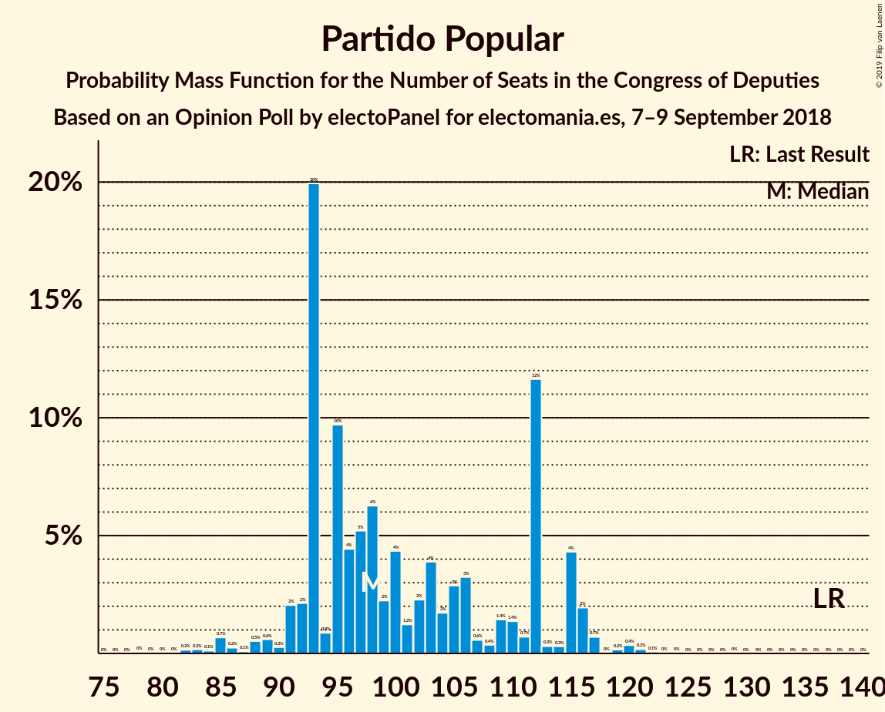
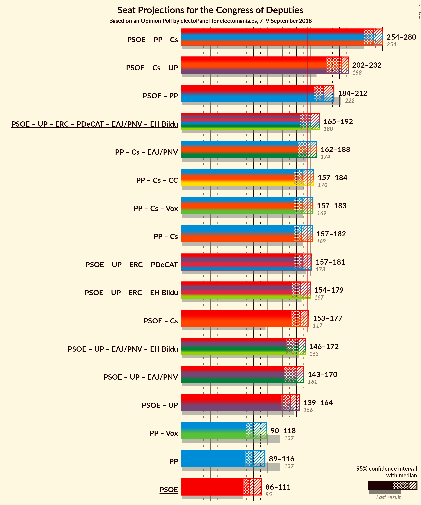
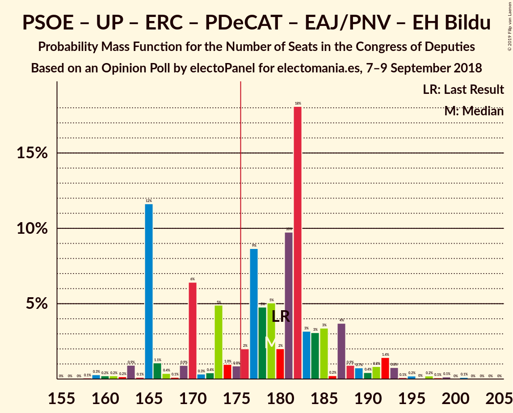
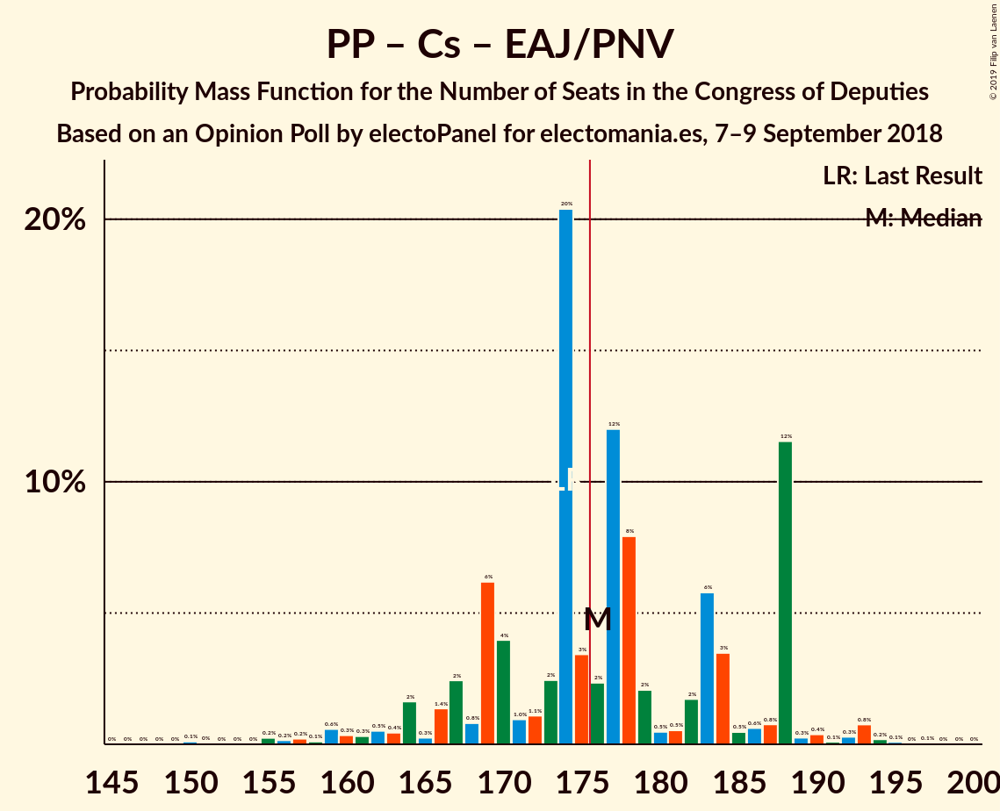
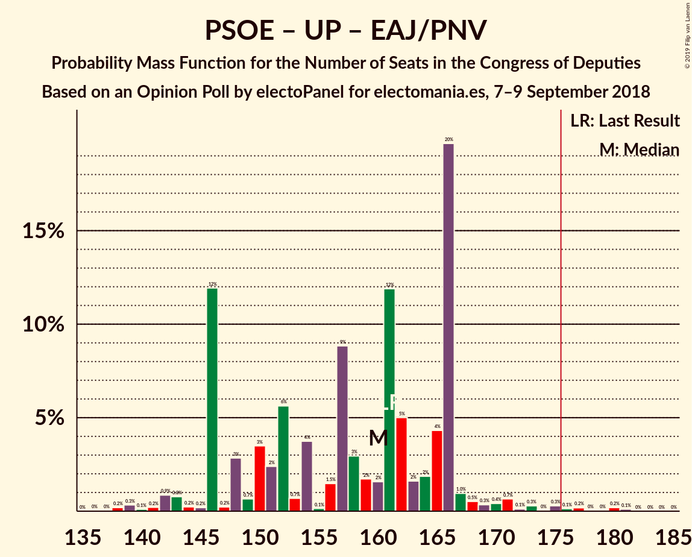

# Opinion Poll by electoPanel for electomania.es, 7–9 September 2018

<a href="#voting-intentions">Voting Intentions</a> | <a href="#seats">Seats</a> | <a href="#coalitions">Coalitions</a> | <a href="#technical-information">Technical Information</a>

## Voting Intentions

### Confidence Intervals

| Party | Last Result | Poll Result | 80% Confidence Interval | 90% Confidence Interval | 95% Confidence Interval | 99% Confidence Interval |
|:-----:|:-----------:|:-----------:|:-----------------------:|:-----------------------:|:-----------------------:|:-----------------------:|
| Partido Socialista Obrero Español | 22.6% | 24.9% | 23.2–26.6% |22.7–27.1% |22.3–27.6% |21.6–28.4% |
| Partido Popular | 33.0% | 24.6% | 22.9–26.3% |22.5–26.8% |22.1–27.3% |21.3–28.1% |
| Ciudadanos–Partido de la Ciudadanía | 13.1% | 19.8% | 18.3–21.5% |17.9–21.9% |17.5–22.3% |16.8–23.2% |
| Unidos Podemos | 21.2% | 17.8% | 16.4–19.4% |16.0–19.9% |15.6–20.3% |14.9–21.0% |
| Esquerra Republicana de Catalunya–Catalunya Sí | 2.7% | 3.0% | 2.5–3.9% |2.3–4.1% |2.2–4.3% |1.9–4.7% |
| Partit Demòcrata Europeu Català | 2.0% | 1.6% | 1.2–2.2% |1.1–2.4% |1.0–2.6% |0.9–2.9% |
| Partido Animalista Contra el Maltrato Animal | 1.2% | 1.6% | 1.2–2.2% |1.1–2.4% |1.0–2.6% |0.9–2.9% |
| Vox | 0.2% | 1.6% | 1.2–2.2% |1.1–2.4% |1.0–2.6% |0.9–2.9% |
| Euzko Alderdi Jeltzalea/Partido Nacionalista Vasco | 1.2% | 1.3% | 1.0–1.9% |0.9–2.1% |0.8–2.2% |0.7–2.5% |
| Euskal Herria Bildu | 0.8% | 0.8% | 0.5–1.2% |0.4–1.4% |0.4–1.5% |0.3–1.8% |
| Coalición Canaria–Partido Nacionalista Canario | 0.3% | 0.3% | 0.2–0.6% |0.1–0.7% |0.1–0.8% |0.1–1.1% |
| Bloque Nacionalista Galego–Nós Candidatura Galega | 0.2% | 0.3% | 0.2–0.6% |0.1–0.7% |0.1–0.8% |0.1–1.1% |

*Note:* The poll result column reflects the actual value used in the calculations. Published results may vary slightly, and in addition be rounded to fewer digits.

## Seats

### Confidence Intervals

| Party | Last Result | Median | 80% Confidence Interval | 90% Confidence Interval | 95% Confidence Interval | 99% Confidence Interval |
|:-----:|:-----------:|:------:|:-----------------------:|:-----------------------:|:-----------------------:|:-----------------------:|
| <a href="#partido-socialista-obrero-español">Partido Socialista Obrero Español</a> | 85 | 94 | 86–103 |86–107 |86–108 |83–112 |
| <a href="#partido-popular">Partido Popular</a> | 137 | 98 | 93–112 |93–112 |92–115 |85–120 |
| <a href="#ciudadanos–partido-de-la-ciudadanía">Ciudadanos–Partido de la Ciudadanía</a> | 32 | 71 | 65–73 |62–75 |60–75 |56–81 |
| <a href="#unidos-podemos">Unidos Podemos</a> | 71 | 57 | 47–64 |40–66 |40–66 |36–71 |
| <a href="#esquerra-republicana-de-catalunya–catalunya-sí">Esquerra Republicana de Catalunya–Catalunya Sí</a> | 9 | 12 | 12–15 |10–15 |9–15 |8–19 |
| <a href="#partit-demòcrata-europeu-català">Partit Demòcrata Europeu Català</a> | 8 | 5 | 4–7 |4–8 |3–8 |1–10 |
| <a href="#partido-animalista-contra-el-maltrato-animal">Partido Animalista Contra el Maltrato Animal</a> | 0 | 0 | 0 |0 |0–1 |0–1 |
| <a href="#vox">Vox</a> | 0 | 1 | 0–1 |0–2 |0–2 |0–2 |
| <a href="#euzko-alderdi-jeltzalea/partido-nacionalista-vasco">Euzko Alderdi Jeltzalea/Partido Nacionalista Vasco</a> | 5 | 7 | 6–8 |5–8 |3–9 |2–10 |
| <a href="#euskal-herria-bildu">Euskal Herria Bildu</a> | 2 | 2 | 0–4 |0–5 |0–6 |0–7 |
| <a href="#coalición-canaria–partido-nacionalista-canario">Coalición Canaria–Partido Nacionalista Canario</a> | 1 | 1 | 0–1 |0–3 |0–3 |0–4 |
| <a href="#bloque-nacionalista-galego–nós-candidatura-galega">Bloque Nacionalista Galego–Nós Candidatura Galega</a> | 0 | 0 | 0–2 |0–2 |0–2 |0–4 |

### Partido Socialista Obrero Español

*For a full overview of the results for this party, see the [Partido Socialista Obrero Español](party-partidosocialistaobreroespañol.html) page.*

| Number of Seats | Probability | Accumulated | Special Marks |
|:---------------:|:-----------:|:-----------:|:-------------:|
| 80 | 0.1% | 100% |  |
| 81 | 0.2% | 99.9% |  |
| 82 | 0.1% | 99.7% |  |
| 83 | 0.1% | 99.6% |  |
| 84 | 0.1% | 99.5% |  |
| 85 | 1.2% | 99.3% | Last Result |
| 86 | 19% | 98% |  |
| 87 | 0.7% | 79% |  |
| 88 | 0.9% | 78% |  |
| 89 | 8% | 78% |  |
| 90 | 2% | 70% |  |
| 91 | 1.0% | 68% |  |
| 92 | 5% | 66% |  |
| 93 | 3% | 62% |  |
| 94 | 30% | 59% | Median |
| 95 | 2% | 29% |  |
| 96 | 0.7% | 28% |  |
| 97 | 3% | 27% |  |
| 98 | 0.4% | 24% |  |
| 99 | 3% | 24% |  |
| 100 | 0.5% | 21% |  |
| 101 | 0.1% | 20% |  |
| 102 | 9% | 20% |  |
| 103 | 1.1% | 11% |  |
| 104 | 1.4% | 10% |  |
| 105 | 0.2% | 8% |  |
| 106 | 0.4% | 8% |  |
| 107 | 5% | 8% |  |
| 108 | 0.5% | 3% |  |
| 109 | 0.1% | 2% |  |
| 110 | 0.4% | 2% |  |
| 111 | 0.3% | 1.5% |  |
| 112 | 0.9% | 1.2% |  |
| 113 | 0.1% | 0.3% |  |
| 114 | 0% | 0.2% |  |
| 115 | 0% | 0.2% |  |
| 116 | 0% | 0.2% |  |
| 117 | 0% | 0.1% |  |
| 118 | 0% | 0.1% |  |
| 119 | 0% | 0.1% |  |
| 120 | 0% | 0.1% |  |
| 121 | 0% | 0% |  |

### Partido Popular

*For a full overview of the results for this party, see the [Partido Popular](party-partidopopular.html) page.*

| Number of Seats | Probability | Accumulated | Special Marks |
|:---------------:|:-----------:|:-----------:|:-------------:|
| 78 | 0.1% | 100% |  |
| 79 | 0% | 99.9% |  |
| 80 | 0% | 99.9% |  |
| 81 | 0% | 99.9% |  |
| 82 | 0% | 99.9% |  |
| 83 | 0.3% | 99.8% |  |
| 84 | 0% | 99.6% |  |
| 85 | 0.4% | 99.5% |  |
| 86 | 0.1% | 99.1% |  |
| 87 | 0.1% | 99.1% |  |
| 88 | 0.4% | 99.0% |  |
| 89 | 0.5% | 98.5% |  |
| 90 | 0.3% | 98% |  |
| 91 | 0.3% | 98% |  |
| 92 | 0.9% | 98% |  |
| 93 | 29% | 97% |  |
| 94 | 1.2% | 68% |  |
| 95 | 0.7% | 67% |  |
| 96 | 5% | 66% |  |
| 97 | 3% | 61% |  |
| 98 | 10% | 58% | Median |
| 99 | 3% | 48% |  |
| 100 | 6% | 45% |  |
| 101 | 0.7% | 39% |  |
| 102 | 2% | 38% |  |
| 103 | 6% | 37% |  |
| 104 | 2% | 31% |  |
| 105 | 3% | 29% |  |
| 106 | 0.4% | 27% |  |
| 107 | 0.2% | 26% |  |
| 108 | 0.5% | 26% |  |
| 109 | 0.9% | 25% |  |
| 110 | 2% | 25% |  |
| 111 | 0.5% | 23% |  |
| 112 | 19% | 23% |  |
| 113 | 0.4% | 3% |  |
| 114 | 0.2% | 3% |  |
| 115 | 0.9% | 3% |  |
| 116 | 0.7% | 2% |  |
| 117 | 0.1% | 1.3% |  |
| 118 | 0% | 1.2% |  |
| 119 | 0.2% | 1.2% |  |
| 120 | 0.5% | 1.0% |  |
| 121 | 0.2% | 0.4% |  |
| 122 | 0.1% | 0.2% |  |
| 123 | 0% | 0.1% |  |
| 124 | 0% | 0.1% |  |
| 125 | 0% | 0.1% |  |
| 126 | 0% | 0.1% |  |
| 127 | 0% | 0.1% |  |
| 128 | 0% | 0.1% |  |
| 129 | 0.1% | 0.1% |  |
| 130 | 0% | 0% |  |
| 131 | 0% | 0% |  |
| 132 | 0% | 0% |  |
| 133 | 0% | 0% |  |
| 134 | 0% | 0% |  |
| 135 | 0% | 0% |  |
| 136 | 0% | 0% |  |
| 137 | 0% | 0% | Last Result |

### Ciudadanos–Partido de la Ciudadanía

*For a full overview of the results for this party, see the [Ciudadanos–Partido de la Ciudadanía](party-ciudadanos–partidodelaciudadanía.html) page.*

| Number of Seats | Probability | Accumulated | Special Marks |
|:---------------:|:-----------:|:-----------:|:-------------:|
| 32 | 0% | 100% | Last Result |
| 33 | 0% | 100% |  |
| 34 | 0% | 100% |  |
| 35 | 0% | 100% |  |
| 36 | 0% | 100% |  |
| 37 | 0% | 100% |  |
| 38 | 0% | 100% |  |
| 39 | 0% | 100% |  |
| 40 | 0% | 100% |  |
| 41 | 0% | 100% |  |
| 42 | 0% | 100% |  |
| 43 | 0% | 100% |  |
| 44 | 0% | 100% |  |
| 45 | 0% | 100% |  |
| 46 | 0% | 100% |  |
| 47 | 0% | 100% |  |
| 48 | 0% | 100% |  |
| 49 | 0.1% | 100% |  |
| 50 | 0% | 99.9% |  |
| 51 | 0% | 99.9% |  |
| 52 | 0% | 99.9% |  |
| 53 | 0.1% | 99.9% |  |
| 54 | 0.2% | 99.8% |  |
| 55 | 0% | 99.7% |  |
| 56 | 0.2% | 99.6% |  |
| 57 | 0.7% | 99.4% |  |
| 58 | 0.6% | 98.7% |  |
| 59 | 0.1% | 98% |  |
| 60 | 1.4% | 98% |  |
| 61 | 1.3% | 97% |  |
| 62 | 1.0% | 95% |  |
| 63 | 2% | 94% |  |
| 64 | 0.5% | 92% |  |
| 65 | 2% | 91% |  |
| 66 | 5% | 89% |  |
| 67 | 5% | 84% |  |
| 68 | 5% | 79% |  |
| 69 | 1.5% | 74% |  |
| 70 | 21% | 73% |  |
| 71 | 2% | 51% | Median |
| 72 | 1.4% | 49% |  |
| 73 | 37% | 47% |  |
| 74 | 2% | 10% |  |
| 75 | 7% | 8% |  |
| 76 | 0.2% | 1.1% |  |
| 77 | 0.3% | 0.9% |  |
| 78 | 0% | 0.6% |  |
| 79 | 0% | 0.6% |  |
| 80 | 0.1% | 0.6% |  |
| 81 | 0.1% | 0.5% |  |
| 82 | 0.3% | 0.4% |  |
| 83 | 0.1% | 0.1% |  |
| 84 | 0% | 0% |  |

### Unidos Podemos

*For a full overview of the results for this party, see the [Unidos Podemos](party-unidospodemos.html) page.*

| Number of Seats | Probability | Accumulated | Special Marks |
|:---------------:|:-----------:|:-----------:|:-------------:|
| 36 | 1.3% | 100% |  |
| 37 | 0.2% | 98.7% |  |
| 38 | 0.3% | 98% |  |
| 39 | 0.3% | 98% |  |
| 40 | 5% | 98% |  |
| 41 | 0.2% | 93% |  |
| 42 | 0.4% | 93% |  |
| 43 | 0.3% | 93% |  |
| 44 | 0.2% | 92% |  |
| 45 | 2% | 92% |  |
| 46 | 0.2% | 90% |  |
| 47 | 0.7% | 90% |  |
| 48 | 10% | 89% |  |
| 49 | 0.2% | 80% |  |
| 50 | 0.3% | 80% |  |
| 51 | 0.5% | 79% |  |
| 52 | 3% | 79% |  |
| 53 | 2% | 76% |  |
| 54 | 20% | 74% |  |
| 55 | 0.5% | 54% |  |
| 56 | 0.6% | 53% |  |
| 57 | 5% | 53% | Median |
| 58 | 4% | 48% |  |
| 59 | 2% | 43% |  |
| 60 | 1.3% | 42% |  |
| 61 | 3% | 40% |  |
| 62 | 0.7% | 38% |  |
| 63 | 1.2% | 37% |  |
| 64 | 29% | 36% |  |
| 65 | 0.2% | 7% |  |
| 66 | 4% | 6% |  |
| 67 | 0.3% | 2% |  |
| 68 | 0.2% | 2% |  |
| 69 | 0.3% | 2% |  |
| 70 | 0.1% | 1.4% |  |
| 71 | 1.0% | 1.3% | Last Result |
| 72 | 0.1% | 0.3% |  |
| 73 | 0.1% | 0.2% |  |
| 74 | 0% | 0.1% |  |
| 75 | 0% | 0.1% |  |
| 76 | 0% | 0% |  |

### Esquerra Republicana de Catalunya–Catalunya Sí

*For a full overview of the results for this party, see the [Esquerra Republicana de Catalunya–Catalunya Sí](party-esquerrarepublicanadecatalunya–catalunyasí.html) page.*

| Number of Seats | Probability | Accumulated | Special Marks |
|:---------------:|:-----------:|:-----------:|:-------------:|
| 7 | 0.1% | 100% |  |
| 8 | 0.6% | 99.9% |  |
| 9 | 4% | 99.3% | Last Result |
| 10 | 0.6% | 96% |  |
| 11 | 2% | 95% |  |
| 12 | 60% | 93% | Median |
| 13 | 13% | 33% |  |
| 14 | 1.2% | 20% |  |
| 15 | 17% | 19% |  |
| 16 | 0.2% | 1.1% |  |
| 17 | 0.1% | 0.9% |  |
| 18 | 0.2% | 0.8% |  |
| 19 | 0.5% | 0.6% |  |
| 20 | 0.1% | 0.1% |  |
| 21 | 0% | 0% |  |

### Partit Demòcrata Europeu Català

*For a full overview of the results for this party, see the [Partit Demòcrata Europeu Català](party-partitdemòcrataeuropeucatalà.html) page.*

| Number of Seats | Probability | Accumulated | Special Marks |
|:---------------:|:-----------:|:-----------:|:-------------:|
| 1 | 2% | 100% |  |
| 2 | 0.4% | 98% |  |
| 3 | 2% | 98% |  |
| 4 | 45% | 96% |  |
| 5 | 31% | 51% | Median |
| 6 | 7% | 20% |  |
| 7 | 7% | 13% |  |
| 8 | 4% | 6% | Last Result |
| 9 | 0.5% | 2% |  |
| 10 | 1.3% | 1.3% |  |
| 11 | 0% | 0.1% |  |
| 12 | 0% | 0% |  |

### Partido Animalista Contra el Maltrato Animal

*For a full overview of the results for this party, see the [Partido Animalista Contra el Maltrato Animal](party-partidoanimalistacontraelmaltratoanimal.html) page.*

| Number of Seats | Probability | Accumulated | Special Marks |
|:---------------:|:-----------:|:-----------:|:-------------:|
| 0 | 95% | 100% | Last Result, Median |
| 1 | 4% | 5% |  |
| 2 | 0.2% | 0.2% |  |
| 3 | 0% | 0% |  |

### Vox

*For a full overview of the results for this party, see the [Vox](party-vox.html) page.*

| Number of Seats | Probability | Accumulated | Special Marks |
|:---------------:|:-----------:|:-----------:|:-------------:|
| 0 | 11% | 100% | Last Result |
| 1 | 79% | 89% | Median |
| 2 | 10% | 10% |  |
| 3 | 0.1% | 0.1% |  |
| 4 | 0% | 0% |  |

### Euzko Alderdi Jeltzalea/Partido Nacionalista Vasco

*For a full overview of the results for this party, see the [Euzko Alderdi Jeltzalea/Partido Nacionalista Vasco](party-euzkoalderdijeltzaleapartidonacionalistavasco.html) page.*

| Number of Seats | Probability | Accumulated | Special Marks |
|:---------------:|:-----------:|:-----------:|:-------------:|
| 2 | 0.5% | 100% |  |
| 3 | 2% | 99.4% |  |
| 4 | 2% | 97% |  |
| 5 | 2% | 95% | Last Result |
| 6 | 34% | 93% |  |
| 7 | 23% | 60% | Median |
| 8 | 34% | 37% |  |
| 9 | 0.7% | 3% |  |
| 10 | 2% | 2% |  |
| 11 | 0.1% | 0.1% |  |
| 12 | 0% | 0% |  |

### Euskal Herria Bildu

*For a full overview of the results for this party, see the [Euskal Herria Bildu](party-euskalherriabildu.html) page.*

| Number of Seats | Probability | Accumulated | Special Marks |
|:---------------:|:-----------:|:-----------:|:-------------:|
| 0 | 32% | 100% |  |
| 1 | 15% | 68% |  |
| 2 | 38% | 52% | Last Result, Median |
| 3 | 0.7% | 14% |  |
| 4 | 7% | 13% |  |
| 5 | 3% | 7% |  |
| 6 | 2% | 4% |  |
| 7 | 2% | 2% |  |
| 8 | 0% | 0% |  |

### Coalición Canaria–Partido Nacionalista Canario

*For a full overview of the results for this party, see the [Coalición Canaria–Partido Nacionalista Canario](party-coalicióncanaria–partidonacionalistacanario.html) page.*

| Number of Seats | Probability | Accumulated | Special Marks |
|:---------------:|:-----------:|:-----------:|:-------------:|
| 0 | 38% | 100% |  |
| 1 | 54% | 62% | Last Result, Median |
| 2 | 2% | 8% |  |
| 3 | 5% | 6% |  |
| 4 | 0.8% | 0.8% |  |
| 5 | 0% | 0% |  |

### Bloque Nacionalista Galego–Nós Candidatura Galega

*For a full overview of the results for this party, see the [Bloque Nacionalista Galego–Nós Candidatura Galega](party-bloquenacionalistagalego–nóscandidaturagalega.html) page.*

| Number of Seats | Probability | Accumulated | Special Marks |
|:---------------:|:-----------:|:-----------:|:-------------:|
| 0 | 65% | 100% | Last Result, Median |
| 1 | 0.7% | 35% |  |
| 2 | 34% | 34% |  |
| 3 | 0.3% | 0.8% |  |
| 4 | 0.4% | 0.5% |  |
| 5 | 0.1% | 0.1% |  |
| 6 | 0% | 0% |  |

## Coalitions

### Confidence Intervals

| Coalition | Last Result | Median | Majority? | 80% Confidence Interval | 90% Confidence Interval | 95% Confidence Interval | 99% Confidence Interval |
|:---------:|:-----------:|:------:|:---------:|:-----------------------:|:-----------------------:|:-----------------------:|:-----------------------:|
| Partido Socialista Obrero Español – Partido Popular – Ciudadanos–Partido de la Ciudadanía | 254 | 266 | 100% | 258–273 | 254–275 | 254–277 | 251–284 |
| Partido Socialista Obrero Español – Ciudadanos–Partido de la Ciudadanía – Unidos Podemos | 188 | 223 | 100% | 210–231 | 210–231 | 204–231 | 198–236 |
| Partido Socialista Obrero Español – Partido Popular | 222 | 194 | 100% | 187–207 | 187–208 | 185–210 | 180–215 |
| Partido Socialista Obrero Español – Unidos Podemos – Esquerra Republicana de Catalunya–Catalunya Sí – Partit Demòcrata Europeu Català – Euzko Alderdi Jeltzalea/Partido Nacionalista Vasco – Euskal Herria Bildu | 180 | 178 | 68% | 165–184 | 165–187 | 165–189 | 161–195 |
| Partido Popular – Ciudadanos–Partido de la Ciudadanía – Euzko Alderdi Jeltzalea/Partido Nacionalista Vasco | 174 | 175 | 49% | 170–188 | 169–188 | 164–189 | 158–193 |
| Partido Popular – Ciudadanos–Partido de la Ciudadanía – Coalición Canaria–Partido Nacionalista Canario | 170 | 170 | 30% | 165–182 | 162–182 | 159–184 | 153–187 |
| Partido Popular – Ciudadanos–Partido de la Ciudadanía – Vox | 169 | 170 | 29% | 164–183 | 162–183 | 159–184 | 153–187 |
| Partido Popular – Ciudadanos–Partido de la Ciudadanía | 169 | 168 | 29% | 164–182 | 161–182 | 158–183 | 152–186 |
| Partido Socialista Obrero Español – Unidos Podemos – Esquerra Republicana de Catalunya–Catalunya Sí – Partit Demòcrata Europeu Català | 173 | 169 | 9% | 157–175 | 157–178 | 155–180 | 152–184 |
| Partido Socialista Obrero Español – Ciudadanos–Partido de la Ciudadanía | 117 | 167 | 4% | 156–175 | 155–175 | 153–177 | 147–183 |
| Partido Socialista Obrero Español – Unidos Podemos – Esquerra Republicana de Catalunya–Catalunya Sí – Euskal Herria Bildu | 167 | 166 | 3% | 154–173 | 154–175 | 152–177 | 148–183 |
| Partido Socialista Obrero Español – Unidos Podemos – Euzko Alderdi Jeltzalea/Partido Nacionalista Vasco – Euskal Herria Bildu | 163 | 159 | 0.6% | 148–167 | 148–168 | 146–169 | 141–177 |
| Partido Socialista Obrero Español – Unidos Podemos – Euzko Alderdi Jeltzalea/Partido Nacionalista Vasco | 161 | 157 | 0.2% | 146–166 | 146–166 | 143–167 | 139–173 |
| Partido Socialista Obrero Español – Unidos Podemos | 156 | 150 | 0% | 140–158 | 140–158 | 137–160 | 133–168 |
| Partido Popular – Vox | 137 | 99 | 0% | 94–113 | 94–113 | 93–117 | 86–121 |
| Partido Popular | 137 | 98 | 0% | 93–112 | 93–112 | 92–115 | 85–120 |
| Partido Socialista Obrero Español | 85 | 94 | 0% | 86–103 | 86–107 | 86–108 | 83–112 |

### Partido Socialista Obrero Español – Partido Popular – Ciudadanos–Partido de la Ciudadanía

| Number of Seats | Probability | Accumulated | Special Marks |
|:---------------:|:-----------:|:-----------:|:-------------:|
| 246 | 0% | 100% |  |
| 247 | 0.1% | 99.9% |  |
| 248 | 0.1% | 99.9% |  |
| 249 | 0.1% | 99.8% |  |
| 250 | 0% | 99.7% |  |
| 251 | 0.4% | 99.7% |  |
| 252 | 0.5% | 99.3% |  |
| 253 | 0.3% | 98.8% |  |
| 254 | 6% | 98% | Last Result |
| 255 | 0.5% | 92% |  |
| 256 | 0.2% | 92% |  |
| 257 | 2% | 92% |  |
| 258 | 0.3% | 90% |  |
| 259 | 0.9% | 90% |  |
| 260 | 31% | 89% |  |
| 261 | 2% | 58% |  |
| 262 | 0.8% | 56% |  |
| 263 | 2% | 55% | Median |
| 264 | 1.0% | 53% |  |
| 265 | 0.9% | 52% |  |
| 266 | 2% | 51% |  |
| 267 | 7% | 50% |  |
| 268 | 21% | 43% |  |
| 269 | 1.0% | 22% |  |
| 270 | 0.2% | 21% |  |
| 271 | 0.4% | 20% |  |
| 272 | 1.0% | 20% |  |
| 273 | 10% | 19% |  |
| 274 | 1.1% | 9% |  |
| 275 | 4% | 8% |  |
| 276 | 0.6% | 4% |  |
| 277 | 0.8% | 3% |  |
| 278 | 0.3% | 2% |  |
| 279 | 0.2% | 2% |  |
| 280 | 0.2% | 2% |  |
| 281 | 0.3% | 2% |  |
| 282 | 0.4% | 2% |  |
| 283 | 0.1% | 1.2% |  |
| 284 | 1.1% | 1.1% |  |
| 285 | 0% | 0% |  |

### Partido Socialista Obrero Español – Ciudadanos–Partido de la Ciudadanía – Unidos Podemos

| Number of Seats | Probability | Accumulated | Special Marks |
|:---------------:|:-----------:|:-----------:|:-------------:|
| 188 | 0% | 100% | Last Result |
| 189 | 0% | 100% |  |
| 190 | 0% | 100% |  |
| 191 | 0.1% | 100% |  |
| 192 | 0% | 99.9% |  |
| 193 | 0% | 99.9% |  |
| 194 | 0% | 99.9% |  |
| 195 | 0% | 99.9% |  |
| 196 | 0% | 99.9% |  |
| 197 | 0.2% | 99.9% |  |
| 198 | 0.3% | 99.6% |  |
| 199 | 0.3% | 99.3% |  |
| 200 | 0% | 99.0% |  |
| 201 | 0.1% | 99.0% |  |
| 202 | 0.3% | 98.9% |  |
| 203 | 0.3% | 98.7% |  |
| 204 | 1.1% | 98% |  |
| 205 | 0.3% | 97% |  |
| 206 | 0.3% | 97% |  |
| 207 | 0.3% | 97% |  |
| 208 | 0.5% | 96% |  |
| 209 | 0% | 96% |  |
| 210 | 21% | 96% |  |
| 211 | 0.6% | 75% |  |
| 212 | 0.2% | 74% |  |
| 213 | 1.3% | 74% |  |
| 214 | 1.0% | 73% |  |
| 215 | 5% | 71% |  |
| 216 | 3% | 67% |  |
| 217 | 2% | 64% |  |
| 218 | 0.4% | 62% |  |
| 219 | 0.1% | 62% |  |
| 220 | 3% | 62% |  |
| 221 | 5% | 59% |  |
| 222 | 2% | 54% | Median |
| 223 | 11% | 51% |  |
| 224 | 5% | 41% |  |
| 225 | 0.9% | 36% |  |
| 226 | 2% | 35% |  |
| 227 | 1.0% | 33% |  |
| 228 | 0.2% | 32% |  |
| 229 | 0.2% | 32% |  |
| 230 | 2% | 32% |  |
| 231 | 29% | 30% |  |
| 232 | 0.1% | 1.1% |  |
| 233 | 0.1% | 1.0% |  |
| 234 | 0% | 1.0% |  |
| 235 | 0.2% | 1.0% |  |
| 236 | 0.4% | 0.8% |  |
| 237 | 0.2% | 0.4% |  |
| 238 | 0% | 0.2% |  |
| 239 | 0% | 0.2% |  |
| 240 | 0% | 0.1% |  |
| 241 | 0% | 0.1% |  |
| 242 | 0% | 0.1% |  |
| 243 | 0% | 0.1% |  |
| 244 | 0% | 0.1% |  |
| 245 | 0% | 0.1% |  |
| 246 | 0% | 0.1% |  |
| 247 | 0% | 0.1% |  |
| 248 | 0% | 0% |  |

### Partido Socialista Obrero Español – Partido Popular

| Number of Seats | Probability | Accumulated | Special Marks |
|:---------------:|:-----------:|:-----------:|:-------------:|
| 177 | 0.1% | 100% |  |
| 178 | 0.1% | 99.9% |  |
| 179 | 0.1% | 99.8% |  |
| 180 | 0.3% | 99.7% |  |
| 181 | 0.1% | 99.4% |  |
| 182 | 0.3% | 99.3% |  |
| 183 | 0.1% | 99.0% |  |
| 184 | 1.4% | 99.0% |  |
| 185 | 0.2% | 98% |  |
| 186 | 0.5% | 97% |  |
| 187 | 30% | 97% |  |
| 188 | 5% | 67% |  |
| 189 | 0.5% | 62% |  |
| 190 | 0.7% | 61% |  |
| 191 | 0.5% | 60% |  |
| 192 | 8% | 60% | Median |
| 193 | 2% | 52% |  |
| 194 | 1.0% | 50% |  |
| 195 | 0.2% | 49% |  |
| 196 | 0.6% | 49% |  |
| 197 | 0.7% | 48% |  |
| 198 | 19% | 48% |  |
| 199 | 2% | 29% |  |
| 200 | 9% | 26% |  |
| 201 | 1.1% | 17% |  |
| 202 | 1.0% | 16% |  |
| 203 | 1.0% | 15% |  |
| 204 | 2% | 14% |  |
| 205 | 0.5% | 11% |  |
| 206 | 0.1% | 11% |  |
| 207 | 5% | 11% |  |
| 208 | 0.7% | 5% |  |
| 209 | 2% | 5% |  |
| 210 | 0.5% | 3% |  |
| 211 | 0.2% | 2% |  |
| 212 | 0.2% | 2% |  |
| 213 | 0.2% | 2% |  |
| 214 | 0.5% | 1.5% |  |
| 215 | 0.8% | 1.0% |  |
| 216 | 0.1% | 0.3% |  |
| 217 | 0.1% | 0.2% |  |
| 218 | 0% | 0.1% |  |
| 219 | 0% | 0.1% |  |
| 220 | 0% | 0.1% |  |
| 221 | 0% | 0.1% |  |
| 222 | 0.1% | 0.1% | Last Result |
| 223 | 0% | 0% |  |

### Partido Socialista Obrero Español – Unidos Podemos – Esquerra Republicana de Catalunya–Catalunya Sí – Partit Demòcrata Europeu Català – Euzko Alderdi Jeltzalea/Partido Nacionalista Vasco – Euskal Herria Bildu

| Number of Seats | Probability | Accumulated | Special Marks |
|:---------------:|:-----------:|:-----------:|:-------------:|
| 159 | 0% | 100% |  |
| 160 | 0.3% | 99.9% |  |
| 161 | 0.3% | 99.6% |  |
| 162 | 0.2% | 99.3% |  |
| 163 | 1.4% | 99.0% |  |
| 164 | 0.1% | 98% |  |
| 165 | 19% | 98% |  |
| 166 | 0.9% | 78% |  |
| 167 | 0.6% | 78% |  |
| 168 | 0.1% | 77% |  |
| 169 | 0.2% | 77% |  |
| 170 | 5% | 77% |  |
| 171 | 0.4% | 71% |  |
| 172 | 0.5% | 71% |  |
| 173 | 0.5% | 70% |  |
| 174 | 0.8% | 70% |  |
| 175 | 0.9% | 69% |  |
| 176 | 3% | 68% | Majority |
| 177 | 12% | 65% | Median |
| 178 | 7% | 53% |  |
| 179 | 3% | 47% |  |
| 180 | 2% | 43% | Last Result |
| 181 | 0.8% | 42% |  |
| 182 | 29% | 41% |  |
| 183 | 2% | 12% |  |
| 184 | 1.4% | 10% |  |
| 185 | 0.2% | 9% |  |
| 186 | 0.2% | 9% |  |
| 187 | 5% | 9% |  |
| 188 | 0.3% | 4% |  |
| 189 | 0.9% | 3% |  |
| 190 | 0.1% | 2% |  |
| 191 | 1.3% | 2% |  |
| 192 | 0.1% | 1.0% |  |
| 193 | 0.2% | 0.9% |  |
| 194 | 0.1% | 0.7% |  |
| 195 | 0.2% | 0.5% |  |
| 196 | 0% | 0.3% |  |
| 197 | 0% | 0.3% |  |
| 198 | 0.1% | 0.2% |  |
| 199 | 0.1% | 0.1% |  |
| 200 | 0% | 0.1% |  |
| 201 | 0% | 0.1% |  |
| 202 | 0% | 0.1% |  |
| 203 | 0% | 0% |  |

### Partido Popular – Ciudadanos–Partido de la Ciudadanía – Euzko Alderdi Jeltzalea/Partido Nacionalista Vasco

| Number of Seats | Probability | Accumulated | Special Marks |
|:---------------:|:-----------:|:-----------:|:-------------:|
| 151 | 0.1% | 100% |  |
| 152 | 0% | 99.9% |  |
| 153 | 0% | 99.9% |  |
| 154 | 0% | 99.9% |  |
| 155 | 0.2% | 99.9% |  |
| 156 | 0.1% | 99.7% |  |
| 157 | 0% | 99.6% |  |
| 158 | 0.1% | 99.5% |  |
| 159 | 0.3% | 99.4% |  |
| 160 | 0.1% | 99.1% |  |
| 161 | 0.2% | 99.0% |  |
| 162 | 0.8% | 98.9% |  |
| 163 | 0.5% | 98% |  |
| 164 | 0.3% | 98% |  |
| 165 | 0.1% | 97% |  |
| 166 | 0.5% | 97% |  |
| 167 | 1.0% | 97% |  |
| 168 | 0.1% | 96% |  |
| 169 | 5% | 95% |  |
| 170 | 3% | 90% |  |
| 171 | 0.7% | 87% |  |
| 172 | 0.9% | 87% |  |
| 173 | 1.0% | 86% |  |
| 174 | 31% | 85% | Last Result |
| 175 | 5% | 54% |  |
| 176 | 4% | 49% | Median, Majority |
| 177 | 0.9% | 45% |  |
| 178 | 12% | 45% |  |
| 179 | 2% | 32% |  |
| 180 | 0.6% | 31% |  |
| 181 | 0.5% | 30% |  |
| 182 | 0.1% | 30% |  |
| 183 | 0.4% | 30% |  |
| 184 | 6% | 29% |  |
| 185 | 0.7% | 24% |  |
| 186 | 0.1% | 23% |  |
| 187 | 1.1% | 23% |  |
| 188 | 19% | 22% |  |
| 189 | 0.2% | 3% |  |
| 190 | 0.6% | 2% |  |
| 191 | 0.1% | 2% |  |
| 192 | 0% | 2% |  |
| 193 | 1.2% | 2% |  |
| 194 | 0.3% | 0.4% |  |
| 195 | 0.1% | 0.2% |  |
| 196 | 0% | 0% |  |

### Partido Popular – Ciudadanos–Partido de la Ciudadanía – Coalición Canaria–Partido Nacionalista Canario

| Number of Seats | Probability | Accumulated | Special Marks |
|:---------------:|:-----------:|:-----------:|:-------------:|
| 147 | 0% | 100% |  |
| 148 | 0% | 99.9% |  |
| 149 | 0% | 99.9% |  |
| 150 | 0.1% | 99.9% |  |
| 151 | 0.1% | 99.8% |  |
| 152 | 0.1% | 99.7% |  |
| 153 | 0.2% | 99.7% |  |
| 154 | 0.1% | 99.5% |  |
| 155 | 0.3% | 99.4% |  |
| 156 | 0.3% | 99.1% |  |
| 157 | 0.4% | 98.8% |  |
| 158 | 0.8% | 98% |  |
| 159 | 0.1% | 98% |  |
| 160 | 0.2% | 97% |  |
| 161 | 1.4% | 97% |  |
| 162 | 5% | 96% |  |
| 163 | 0.2% | 91% |  |
| 164 | 0.8% | 91% |  |
| 165 | 1.0% | 90% |  |
| 166 | 0.3% | 89% |  |
| 167 | 31% | 89% |  |
| 168 | 0.4% | 58% |  |
| 169 | 7% | 57% |  |
| 170 | 3% | 50% | Last Result, Median |
| 171 | 4% | 47% |  |
| 172 | 11% | 43% |  |
| 173 | 1.4% | 32% |  |
| 174 | 0.5% | 31% |  |
| 175 | 0.4% | 30% |  |
| 176 | 0.6% | 30% | Majority |
| 177 | 0.4% | 29% |  |
| 178 | 6% | 29% |  |
| 179 | 0.3% | 23% |  |
| 180 | 0.1% | 23% |  |
| 181 | 0.9% | 23% |  |
| 182 | 19% | 22% |  |
| 183 | 0.6% | 3% |  |
| 184 | 0.2% | 3% |  |
| 185 | 0.5% | 2% |  |
| 186 | 1.3% | 2% |  |
| 187 | 0.4% | 0.6% |  |
| 188 | 0.2% | 0.3% |  |
| 189 | 0% | 0.1% |  |
| 190 | 0% | 0% |  |

### Partido Popular – Ciudadanos–Partido de la Ciudadanía – Vox

| Number of Seats | Probability | Accumulated | Special Marks |
|:---------------:|:-----------:|:-----------:|:-------------:|
| 147 | 0% | 100% |  |
| 148 | 0% | 99.9% |  |
| 149 | 0% | 99.9% |  |
| 150 | 0% | 99.9% |  |
| 151 | 0.1% | 99.9% |  |
| 152 | 0.1% | 99.7% |  |
| 153 | 0.4% | 99.6% |  |
| 154 | 0.1% | 99.2% |  |
| 155 | 0.1% | 99.2% |  |
| 156 | 0.3% | 99.1% |  |
| 157 | 0.1% | 98.8% |  |
| 158 | 1.2% | 98.7% |  |
| 159 | 0.1% | 98% |  |
| 160 | 0.2% | 97% |  |
| 161 | 1.2% | 97% |  |
| 162 | 1.1% | 96% |  |
| 163 | 4% | 95% |  |
| 164 | 1.1% | 91% |  |
| 165 | 1.0% | 89% |  |
| 166 | 1.1% | 88% |  |
| 167 | 29% | 87% |  |
| 168 | 2% | 59% |  |
| 169 | 6% | 56% | Last Result |
| 170 | 3% | 51% | Median |
| 171 | 1.4% | 47% |  |
| 172 | 14% | 46% |  |
| 173 | 1.4% | 32% |  |
| 174 | 0.8% | 31% |  |
| 175 | 0.9% | 30% |  |
| 176 | 0.1% | 29% | Majority |
| 177 | 0.2% | 29% |  |
| 178 | 6% | 29% |  |
| 179 | 0.2% | 23% |  |
| 180 | 0.1% | 23% |  |
| 181 | 0.3% | 23% |  |
| 182 | 1.4% | 23% |  |
| 183 | 19% | 21% |  |
| 184 | 0.2% | 3% |  |
| 185 | 0.7% | 2% |  |
| 186 | 1.2% | 2% |  |
| 187 | 0.2% | 0.6% |  |
| 188 | 0.2% | 0.4% |  |
| 189 | 0.1% | 0.2% |  |
| 190 | 0% | 0% |  |

### Partido Popular – Ciudadanos–Partido de la Ciudadanía

| Number of Seats | Probability | Accumulated | Special Marks |
|:---------------:|:-----------:|:-----------:|:-------------:|
| 146 | 0% | 100% |  |
| 147 | 0% | 99.9% |  |
| 148 | 0.1% | 99.9% |  |
| 149 | 0% | 99.9% |  |
| 150 | 0.1% | 99.9% |  |
| 151 | 0.1% | 99.7% |  |
| 152 | 0.4% | 99.6% |  |
| 153 | 0.1% | 99.2% |  |
| 154 | 0.2% | 99.1% |  |
| 155 | 0.1% | 99.0% |  |
| 156 | 0.5% | 98.8% |  |
| 157 | 0.8% | 98% |  |
| 158 | 0.1% | 98% |  |
| 159 | 0.2% | 97% |  |
| 160 | 0.5% | 97% |  |
| 161 | 2% | 97% |  |
| 162 | 4% | 95% |  |
| 163 | 0.2% | 91% |  |
| 164 | 2% | 90% |  |
| 165 | 0.9% | 88% |  |
| 166 | 29% | 87% |  |
| 167 | 1.5% | 58% |  |
| 168 | 7% | 57% |  |
| 169 | 3% | 50% | Last Result, Median |
| 170 | 3% | 47% |  |
| 171 | 12% | 44% |  |
| 172 | 0.8% | 32% |  |
| 173 | 0.8% | 31% |  |
| 174 | 0.3% | 30% |  |
| 175 | 0.6% | 30% |  |
| 176 | 0.1% | 29% | Majority |
| 177 | 0.7% | 29% |  |
| 178 | 5% | 28% |  |
| 179 | 0.1% | 23% |  |
| 180 | 1.1% | 23% |  |
| 181 | 0% | 22% |  |
| 182 | 19% | 22% |  |
| 183 | 0.2% | 3% |  |
| 184 | 0.5% | 2% |  |
| 185 | 1.2% | 2% |  |
| 186 | 0.2% | 0.6% |  |
| 187 | 0.3% | 0.4% |  |
| 188 | 0% | 0.1% |  |
| 189 | 0% | 0% |  |

### Partido Socialista Obrero Español – Unidos Podemos – Esquerra Republicana de Catalunya–Catalunya Sí – Partit Demòcrata Europeu Català

| Number of Seats | Probability | Accumulated | Special Marks |
|:---------------:|:-----------:|:-----------:|:-------------:|
| 150 | 0.2% | 100% |  |
| 151 | 0.2% | 99.8% |  |
| 152 | 0.4% | 99.6% |  |
| 153 | 1.2% | 99.2% |  |
| 154 | 0.3% | 98% |  |
| 155 | 0.4% | 98% |  |
| 156 | 0.1% | 97% |  |
| 157 | 19% | 97% |  |
| 158 | 0.6% | 78% |  |
| 159 | 2% | 78% |  |
| 160 | 0.2% | 76% |  |
| 161 | 0.2% | 76% |  |
| 162 | 5% | 76% |  |
| 163 | 0.7% | 71% |  |
| 164 | 1.0% | 70% |  |
| 165 | 0.4% | 69% |  |
| 166 | 2% | 69% |  |
| 167 | 7% | 67% |  |
| 168 | 1.4% | 60% | Median |
| 169 | 10% | 58% |  |
| 170 | 2% | 48% |  |
| 171 | 2% | 46% |  |
| 172 | 2% | 44% |  |
| 173 | 2% | 41% | Last Result |
| 174 | 29% | 40% |  |
| 175 | 1.1% | 10% |  |
| 176 | 0.9% | 9% | Majority |
| 177 | 0.3% | 8% |  |
| 178 | 4% | 8% |  |
| 179 | 0.9% | 4% |  |
| 180 | 1.3% | 3% |  |
| 181 | 0.1% | 1.5% |  |
| 182 | 0.1% | 1.4% |  |
| 183 | 0.5% | 1.4% |  |
| 184 | 0.4% | 0.9% |  |
| 185 | 0.2% | 0.5% |  |
| 186 | 0.1% | 0.3% |  |
| 187 | 0% | 0.2% |  |
| 188 | 0% | 0.2% |  |
| 189 | 0% | 0.1% |  |
| 190 | 0.1% | 0.1% |  |
| 191 | 0% | 0.1% |  |
| 192 | 0% | 0% |  |

### Partido Socialista Obrero Español – Ciudadanos–Partido de la Ciudadanía

| Number of Seats | Probability | Accumulated | Special Marks |
|:---------------:|:-----------:|:-----------:|:-------------:|
| 117 | 0% | 100% | Last Result |
| 118 | 0% | 100% |  |
| 119 | 0% | 100% |  |
| 120 | 0% | 100% |  |
| 121 | 0% | 100% |  |
| 122 | 0% | 100% |  |
| 123 | 0% | 100% |  |
| 124 | 0% | 100% |  |
| 125 | 0% | 100% |  |
| 126 | 0% | 100% |  |
| 127 | 0% | 100% |  |
| 128 | 0% | 100% |  |
| 129 | 0% | 100% |  |
| 130 | 0% | 100% |  |
| 131 | 0% | 100% |  |
| 132 | 0% | 100% |  |
| 133 | 0% | 100% |  |
| 134 | 0% | 100% |  |
| 135 | 0% | 100% |  |
| 136 | 0% | 100% |  |
| 137 | 0% | 100% |  |
| 138 | 0.1% | 100% |  |
| 139 | 0% | 99.9% |  |
| 140 | 0% | 99.9% |  |
| 141 | 0% | 99.9% |  |
| 142 | 0% | 99.9% |  |
| 143 | 0% | 99.9% |  |
| 144 | 0.2% | 99.9% |  |
| 145 | 0% | 99.7% |  |
| 146 | 0.1% | 99.7% |  |
| 147 | 0.3% | 99.6% |  |
| 148 | 0.1% | 99.4% |  |
| 149 | 0.5% | 99.3% |  |
| 150 | 0.2% | 98.8% |  |
| 151 | 0.6% | 98.5% |  |
| 152 | 0.4% | 98% |  |
| 153 | 0.7% | 98% |  |
| 154 | 0.6% | 97% |  |
| 155 | 2% | 96% |  |
| 156 | 21% | 94% |  |
| 157 | 0.7% | 73% |  |
| 158 | 4% | 73% |  |
| 159 | 2% | 68% |  |
| 160 | 0.7% | 66% |  |
| 161 | 0.8% | 66% |  |
| 162 | 3% | 65% |  |
| 163 | 0.6% | 62% |  |
| 164 | 9% | 61% |  |
| 165 | 0.3% | 52% | Median |
| 166 | 0.9% | 52% |  |
| 167 | 30% | 51% |  |
| 168 | 1.3% | 22% |  |
| 169 | 0.4% | 20% |  |
| 170 | 0.3% | 20% |  |
| 171 | 1.0% | 20% |  |
| 172 | 0.1% | 19% |  |
| 173 | 0.4% | 18% |  |
| 174 | 1.1% | 18% |  |
| 175 | 13% | 17% |  |
| 176 | 0.4% | 4% | Majority |
| 177 | 2% | 3% |  |
| 178 | 0.6% | 2% |  |
| 179 | 0.1% | 1.1% |  |
| 180 | 0% | 1.0% |  |
| 181 | 0.1% | 1.0% |  |
| 182 | 0.2% | 0.9% |  |
| 183 | 0.3% | 0.7% |  |
| 184 | 0.1% | 0.4% |  |
| 185 | 0.1% | 0.3% |  |
| 186 | 0.1% | 0.3% |  |
| 187 | 0.1% | 0.2% |  |
| 188 | 0% | 0.1% |  |
| 189 | 0% | 0.1% |  |
| 190 | 0% | 0.1% |  |
| 191 | 0% | 0% |  |

### Partido Socialista Obrero Español – Unidos Podemos – Esquerra Republicana de Catalunya–Catalunya Sí – Euskal Herria Bildu

| Number of Seats | Probability | Accumulated | Special Marks |
|:---------------:|:-----------:|:-----------:|:-------------:|
| 146 | 0.1% | 100% |  |
| 147 | 0.2% | 99.9% |  |
| 148 | 0.5% | 99.7% |  |
| 149 | 0% | 99.1% |  |
| 150 | 1.1% | 99.1% |  |
| 151 | 0.4% | 98% |  |
| 152 | 0.1% | 98% |  |
| 153 | 0.4% | 97% |  |
| 154 | 20% | 97% |  |
| 155 | 0.4% | 77% |  |
| 156 | 0.4% | 77% |  |
| 157 | 0.3% | 77% |  |
| 158 | 0.7% | 76% |  |
| 159 | 1.2% | 75% |  |
| 160 | 6% | 74% |  |
| 161 | 0.6% | 69% |  |
| 162 | 2% | 68% |  |
| 163 | 1.5% | 66% |  |
| 164 | 6% | 65% |  |
| 165 | 0.7% | 59% | Median |
| 166 | 11% | 58% |  |
| 167 | 0.8% | 48% | Last Result |
| 168 | 1.3% | 47% |  |
| 169 | 1.4% | 46% |  |
| 170 | 31% | 44% |  |
| 171 | 2% | 13% |  |
| 172 | 0.1% | 11% |  |
| 173 | 3% | 11% |  |
| 174 | 0.3% | 8% |  |
| 175 | 5% | 8% |  |
| 176 | 0.1% | 3% | Majority |
| 177 | 1.0% | 3% |  |
| 178 | 0.1% | 2% |  |
| 179 | 0.8% | 2% |  |
| 180 | 0.2% | 1.4% |  |
| 181 | 0.4% | 1.3% |  |
| 182 | 0.2% | 0.9% |  |
| 183 | 0.4% | 0.7% |  |
| 184 | 0% | 0.3% |  |
| 185 | 0% | 0.3% |  |
| 186 | 0% | 0.3% |  |
| 187 | 0.1% | 0.2% |  |
| 188 | 0% | 0.1% |  |
| 189 | 0% | 0.1% |  |
| 190 | 0% | 0.1% |  |
| 191 | 0% | 0.1% |  |
| 192 | 0% | 0% |  |

### Partido Socialista Obrero Español – Unidos Podemos – Euzko Alderdi Jeltzalea/Partido Nacionalista Vasco – Euskal Herria Bildu

| Number of Seats | Probability | Accumulated | Special Marks |
|:---------------:|:-----------:|:-----------:|:-------------:|
| 140 | 0% | 100% |  |
| 141 | 0.4% | 99.9% |  |
| 142 | 0.1% | 99.5% |  |
| 143 | 0.1% | 99.4% |  |
| 144 | 0.3% | 99.3% |  |
| 145 | 1.5% | 99.0% |  |
| 146 | 1.0% | 98% |  |
| 147 | 0.1% | 97% |  |
| 148 | 19% | 96% |  |
| 149 | 0.4% | 78% |  |
| 150 | 1.0% | 77% |  |
| 151 | 0.3% | 76% |  |
| 152 | 0.3% | 76% |  |
| 153 | 0.1% | 76% |  |
| 154 | 7% | 76% |  |
| 155 | 0.5% | 69% |  |
| 156 | 0.4% | 68% |  |
| 157 | 1.2% | 68% |  |
| 158 | 14% | 67% |  |
| 159 | 4% | 53% |  |
| 160 | 2% | 49% | Median |
| 161 | 2% | 47% |  |
| 162 | 1.0% | 45% |  |
| 163 | 0.5% | 44% | Last Result |
| 164 | 2% | 43% |  |
| 165 | 2% | 41% |  |
| 166 | 28% | 39% |  |
| 167 | 5% | 11% |  |
| 168 | 2% | 6% |  |
| 169 | 1.4% | 4% |  |
| 170 | 0.2% | 2% |  |
| 171 | 0.2% | 2% |  |
| 172 | 0.5% | 2% |  |
| 173 | 0.3% | 1.5% |  |
| 174 | 0.3% | 1.2% |  |
| 175 | 0.3% | 0.9% |  |
| 176 | 0.1% | 0.6% | Majority |
| 177 | 0.2% | 0.5% |  |
| 178 | 0% | 0.3% |  |
| 179 | 0.1% | 0.3% |  |
| 180 | 0% | 0.1% |  |
| 181 | 0.1% | 0.1% |  |
| 182 | 0% | 0.1% |  |
| 183 | 0% | 0.1% |  |
| 184 | 0% | 0% |  |

### Partido Socialista Obrero Español – Unidos Podemos – Euzko Alderdi Jeltzalea/Partido Nacionalista Vasco

| Number of Seats | Probability | Accumulated | Special Marks |
|:---------------:|:-----------:|:-----------:|:-------------:|
| 136 | 0% | 100% |  |
| 137 | 0% | 99.9% |  |
| 138 | 0.3% | 99.9% |  |
| 139 | 0.5% | 99.6% |  |
| 140 | 0.1% | 99.2% |  |
| 141 | 0.3% | 99.1% |  |
| 142 | 0.1% | 98.7% |  |
| 143 | 1.2% | 98.6% |  |
| 144 | 0.2% | 97% |  |
| 145 | 0.3% | 97% |  |
| 146 | 20% | 97% |  |
| 147 | 0.3% | 77% |  |
| 148 | 0.5% | 77% |  |
| 149 | 1.0% | 77% |  |
| 150 | 0.3% | 76% |  |
| 151 | 0.2% | 75% |  |
| 152 | 7% | 75% |  |
| 153 | 0.2% | 68% |  |
| 154 | 5% | 68% |  |
| 155 | 0.1% | 63% |  |
| 156 | 2% | 63% |  |
| 157 | 13% | 61% |  |
| 158 | 0.8% | 48% | Median |
| 159 | 2% | 47% |  |
| 160 | 2% | 45% |  |
| 161 | 1.1% | 43% | Last Result |
| 162 | 1.3% | 42% |  |
| 163 | 2% | 40% |  |
| 164 | 0% | 38% |  |
| 165 | 6% | 38% |  |
| 166 | 29% | 32% |  |
| 167 | 1.3% | 3% |  |
| 168 | 0.2% | 2% |  |
| 169 | 0.3% | 2% |  |
| 170 | 0.1% | 1.4% |  |
| 171 | 0.6% | 1.3% |  |
| 172 | 0.1% | 0.8% |  |
| 173 | 0.1% | 0.6% |  |
| 174 | 0% | 0.5% |  |
| 175 | 0.3% | 0.4% |  |
| 176 | 0% | 0.2% | Majority |
| 177 | 0% | 0.1% |  |
| 178 | 0% | 0.1% |  |
| 179 | 0% | 0.1% |  |
| 180 | 0% | 0.1% |  |
| 181 | 0% | 0% |  |

### Partido Socialista Obrero Español – Unidos Podemos

| Number of Seats | Probability | Accumulated | Special Marks |
|:---------------:|:-----------:|:-----------:|:-------------:|
| 130 | 0% | 100% |  |
| 131 | 0.3% | 99.9% |  |
| 132 | 0.1% | 99.6% |  |
| 133 | 0.1% | 99.6% |  |
| 134 | 0% | 99.5% |  |
| 135 | 2% | 99.4% |  |
| 136 | 0.2% | 98% |  |
| 137 | 0.3% | 98% |  |
| 138 | 0.5% | 97% |  |
| 139 | 0.9% | 97% |  |
| 140 | 19% | 96% |  |
| 141 | 0.7% | 77% |  |
| 142 | 0.7% | 77% |  |
| 143 | 0.4% | 76% |  |
| 144 | 1.1% | 76% |  |
| 145 | 0.6% | 74% |  |
| 146 | 6% | 74% |  |
| 147 | 4% | 68% |  |
| 148 | 0.6% | 64% |  |
| 149 | 3% | 63% |  |
| 150 | 11% | 60% |  |
| 151 | 3% | 49% | Median |
| 152 | 0.2% | 46% |  |
| 153 | 0.9% | 46% |  |
| 154 | 1.5% | 45% |  |
| 155 | 0.6% | 44% |  |
| 156 | 2% | 43% | Last Result |
| 157 | 4% | 41% |  |
| 158 | 33% | 37% |  |
| 159 | 1.2% | 5% |  |
| 160 | 1.1% | 3% |  |
| 161 | 0.1% | 2% |  |
| 162 | 0.5% | 2% |  |
| 163 | 0.1% | 2% |  |
| 164 | 0.7% | 2% |  |
| 165 | 0.2% | 1.0% |  |
| 166 | 0.1% | 0.8% |  |
| 167 | 0.2% | 0.8% |  |
| 168 | 0.4% | 0.6% |  |
| 169 | 0% | 0.2% |  |
| 170 | 0% | 0.2% |  |
| 171 | 0% | 0.1% |  |
| 172 | 0% | 0.1% |  |
| 173 | 0% | 0.1% |  |
| 174 | 0% | 0.1% |  |
| 175 | 0% | 0% |  |

### Partido Popular – Vox

| Number of Seats | Probability | Accumulated | Special Marks |
|:---------------:|:-----------:|:-----------:|:-------------:|
| 79 | 0.1% | 100% |  |
| 80 | 0% | 99.9% |  |
| 81 | 0% | 99.9% |  |
| 82 | 0% | 99.9% |  |
| 83 | 0% | 99.9% |  |
| 84 | 0.2% | 99.8% |  |
| 85 | 0.1% | 99.6% |  |
| 86 | 0.3% | 99.5% |  |
| 87 | 0.1% | 99.2% |  |
| 88 | 0.1% | 99.1% |  |
| 89 | 0.3% | 99.0% |  |
| 90 | 0.5% | 98.7% |  |
| 91 | 0.3% | 98% |  |
| 92 | 0.1% | 98% |  |
| 93 | 1.1% | 98% |  |
| 94 | 29% | 97% |  |
| 95 | 0.7% | 68% |  |
| 96 | 0.4% | 67% |  |
| 97 | 7% | 67% |  |
| 98 | 2% | 60% |  |
| 99 | 10% | 58% | Median |
| 100 | 3% | 48% |  |
| 101 | 6% | 45% |  |
| 102 | 0.9% | 39% |  |
| 103 | 7% | 38% |  |
| 104 | 0.3% | 31% |  |
| 105 | 2% | 31% |  |
| 106 | 0.2% | 29% |  |
| 107 | 3% | 29% |  |
| 108 | 0% | 26% |  |
| 109 | 0.6% | 26% |  |
| 110 | 0.7% | 25% |  |
| 111 | 2% | 25% |  |
| 112 | 0% | 23% |  |
| 113 | 19% | 23% |  |
| 114 | 0.3% | 3% |  |
| 115 | 0.2% | 3% |  |
| 116 | 0.1% | 3% |  |
| 117 | 1.2% | 3% |  |
| 118 | 0.3% | 2% |  |
| 119 | 0.1% | 1.3% |  |
| 120 | 0.3% | 1.2% |  |
| 121 | 0.4% | 0.9% |  |
| 122 | 0.2% | 0.4% |  |
| 123 | 0.1% | 0.2% |  |
| 124 | 0% | 0.2% |  |
| 125 | 0.1% | 0.1% |  |
| 126 | 0% | 0.1% |  |
| 127 | 0% | 0.1% |  |
| 128 | 0% | 0.1% |  |
| 129 | 0% | 0.1% |  |
| 130 | 0.1% | 0.1% |  |
| 131 | 0% | 0% |  |
| 132 | 0% | 0% |  |
| 133 | 0% | 0% |  |
| 134 | 0% | 0% |  |
| 135 | 0% | 0% |  |
| 136 | 0% | 0% |  |
| 137 | 0% | 0% | Last Result |

### Partido Popular

| Number of Seats | Probability | Accumulated | Special Marks |
|:---------------:|:-----------:|:-----------:|:-------------:|
| 78 | 0.1% | 100% |  |
| 79 | 0% | 99.9% |  |
| 80 | 0% | 99.9% |  |
| 81 | 0% | 99.9% |  |
| 82 | 0% | 99.9% |  |
| 83 | 0.3% | 99.8% |  |
| 84 | 0% | 99.6% |  |
| 85 | 0.4% | 99.5% |  |
| 86 | 0.1% | 99.1% |  |
| 87 | 0.1% | 99.1% |  |
| 88 | 0.4% | 99.0% |  |
| 89 | 0.5% | 98.5% |  |
| 90 | 0.3% | 98% |  |
| 91 | 0.3% | 98% |  |
| 92 | 0.9% | 98% |  |
| 93 | 29% | 97% |  |
| 94 | 1.2% | 68% |  |
| 95 | 0.7% | 67% |  |
| 96 | 5% | 66% |  |
| 97 | 3% | 61% |  |
| 98 | 10% | 58% | Median |
| 99 | 3% | 48% |  |
| 100 | 6% | 45% |  |
| 101 | 0.7% | 39% |  |
| 102 | 2% | 38% |  |
| 103 | 6% | 37% |  |
| 104 | 2% | 31% |  |
| 105 | 3% | 29% |  |
| 106 | 0.4% | 27% |  |
| 107 | 0.2% | 26% |  |
| 108 | 0.5% | 26% |  |
| 109 | 0.9% | 25% |  |
| 110 | 2% | 25% |  |
| 111 | 0.5% | 23% |  |
| 112 | 19% | 23% |  |
| 113 | 0.4% | 3% |  |
| 114 | 0.2% | 3% |  |
| 115 | 0.9% | 3% |  |
| 116 | 0.7% | 2% |  |
| 117 | 0.1% | 1.3% |  |
| 118 | 0% | 1.2% |  |
| 119 | 0.2% | 1.2% |  |
| 120 | 0.5% | 1.0% |  |
| 121 | 0.2% | 0.4% |  |
| 122 | 0.1% | 0.2% |  |
| 123 | 0% | 0.1% |  |
| 124 | 0% | 0.1% |  |
| 125 | 0% | 0.1% |  |
| 126 | 0% | 0.1% |  |
| 127 | 0% | 0.1% |  |
| 128 | 0% | 0.1% |  |
| 129 | 0.1% | 0.1% |  |
| 130 | 0% | 0% |  |
| 131 | 0% | 0% |  |
| 132 | 0% | 0% |  |
| 133 | 0% | 0% |  |
| 134 | 0% | 0% |  |
| 135 | 0% | 0% |  |
| 136 | 0% | 0% |  |
| 137 | 0% | 0% | Last Result |

### Partido Socialista Obrero Español

| Number of Seats | Probability | Accumulated | Special Marks |
|:---------------:|:-----------:|:-----------:|:-------------:|
| 80 | 0.1% | 100% |  |
| 81 | 0.2% | 99.9% |  |
| 82 | 0.1% | 99.7% |  |
| 83 | 0.1% | 99.6% |  |
| 84 | 0.1% | 99.5% |  |
| 85 | 1.2% | 99.3% | Last Result |
| 86 | 19% | 98% |  |
| 87 | 0.7% | 79% |  |
| 88 | 0.9% | 78% |  |
| 89 | 8% | 78% |  |
| 90 | 2% | 70% |  |
| 91 | 1.0% | 68% |  |
| 92 | 5% | 66% |  |
| 93 | 3% | 62% |  |
| 94 | 30% | 59% | Median |
| 95 | 2% | 29% |  |
| 96 | 0.7% | 28% |  |
| 97 | 3% | 27% |  |
| 98 | 0.4% | 24% |  |
| 99 | 3% | 24% |  |
| 100 | 0.5% | 21% |  |
| 101 | 0.1% | 20% |  |
| 102 | 9% | 20% |  |
| 103 | 1.1% | 11% |  |
| 104 | 1.4% | 10% |  |
| 105 | 0.2% | 8% |  |
| 106 | 0.4% | 8% |  |
| 107 | 5% | 8% |  |
| 108 | 0.5% | 3% |  |
| 109 | 0.1% | 2% |  |
| 110 | 0.4% | 2% |  |
| 111 | 0.3% | 1.5% |  |
| 112 | 0.9% | 1.2% |  |
| 113 | 0.1% | 0.3% |  |
| 114 | 0% | 0.2% |  |
| 115 | 0% | 0.2% |  |
| 116 | 0% | 0.2% |  |
| 117 | 0% | 0.1% |  |
| 118 | 0% | 0.1% |  |
| 119 | 0% | 0.1% |  |
| 120 | 0% | 0.1% |  |
| 121 | 0% | 0% |  |

## Technical Information

### Opinion Poll

+ **Polling firm:** electoPanel
+ **Commissioner(s):** electomania.es
+ **Fieldwork period:** 7–9 September 2018

### Calculations

+ **Sample size:** 1050
+ **Simulations done:** 524,288
+ **Error estimate:** 3.22%

