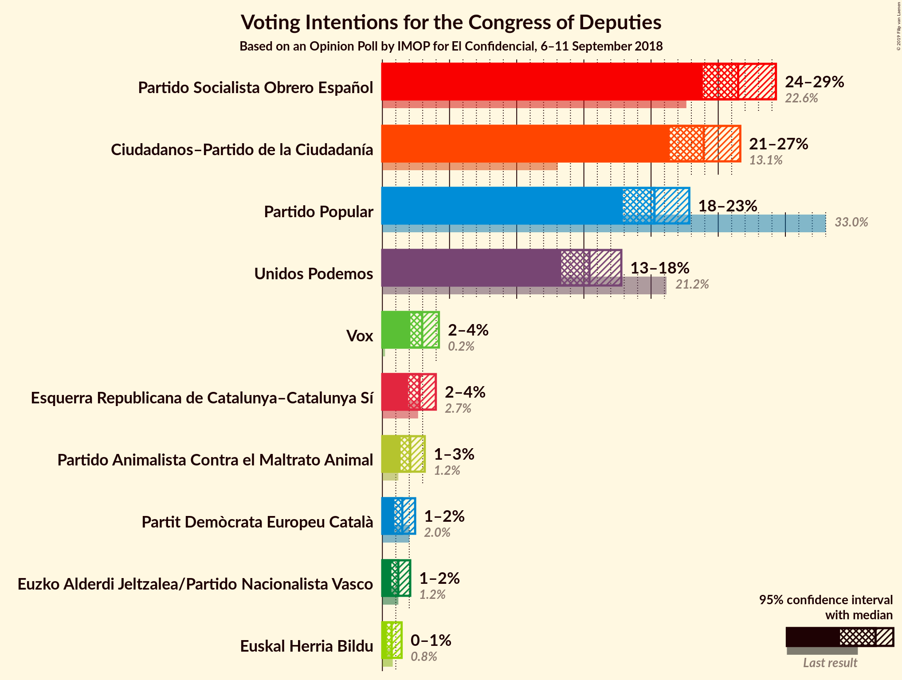
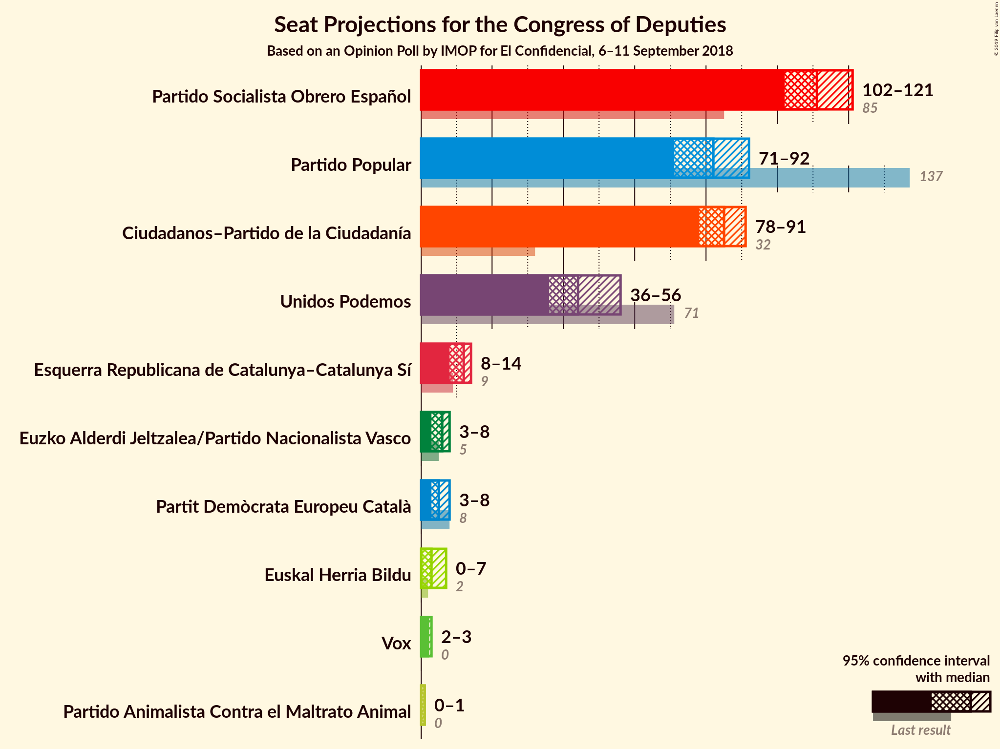
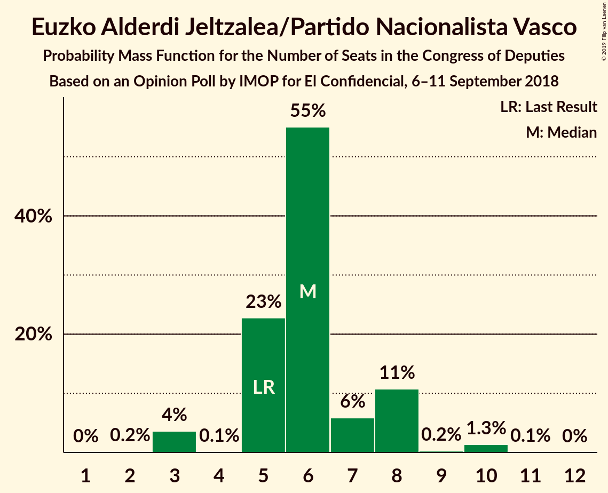
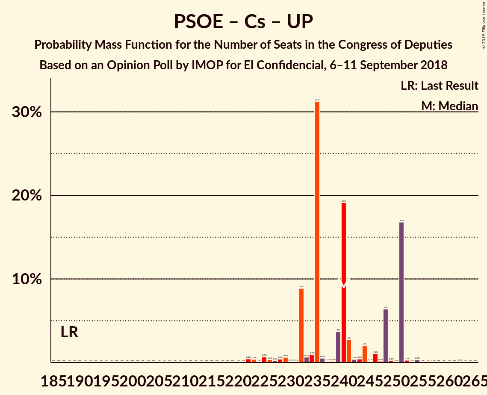

# Opinion Poll by IMOP for El Confidencial, 6–11 September 2018

<a href="#voting-intentions">Voting Intentions</a> | <a href="#seats">Seats</a> | <a href="#coalitions">Coalitions</a> | <a href="#technical-information">Technical Information</a>

## Voting Intentions

### Confidence Intervals

| Party | Last Result | Poll Result | 80% Confidence Interval | 90% Confidence Interval | 95% Confidence Interval | 99% Confidence Interval |
|:-----:|:-----------:|:-----------:|:-----------------------:|:-----------------------:|:-----------------------:|:-----------------------:|
| Partido Socialista Obrero Español | 22.6% | 26.5% | 24.8–28.3% |24.3–28.8% |23.9–29.3% |23.0–30.2% |
| Ciudadanos–Partido de la Ciudadanía | 13.1% | 23.9% | 22.3–25.7% |21.8–26.2% |21.4–26.6% |20.6–27.5% |
| Partido Popular | 33.0% | 20.3% | 18.7–21.9% |18.3–22.4% |17.9–22.8% |17.2–23.7% |
| Unidos Podemos | 21.2% | 15.4% | 14.0–17.0% |13.6–17.4% |13.3–17.8% |12.7–18.5% |
| Vox | 0.2% | 3.0% | 2.4–3.8% |2.2–4.0% |2.1–4.2% |1.8–4.6% |
| Esquerra Republicana de Catalunya–Catalunya Sí | 2.7% | 2.8% | 2.2–3.6% |2.0–3.8% |1.9–4.0% |1.7–4.4% |
| Partido Animalista Contra el Maltrato Animal | 1.2% | 2.1% | 1.6–2.8% |1.5–3.0% |1.4–3.2% |1.2–3.5% |
| Partit Demòcrata Europeu Català | 2.0% | 1.5% | 1.1–2.1% |1.0–2.3% |0.9–2.4% |0.7–2.8% |
| Euzko Alderdi Jeltzalea/Partido Nacionalista Vasco | 1.2% | 1.2% | 0.9–1.8% |0.7–1.9% |0.7–2.1% |0.5–2.4% |
| Euskal Herria Bildu | 0.8% | 0.7% | 0.5–1.2% |0.4–1.3% |0.3–1.4% |0.2–1.7% |

*Note:* The poll result column reflects the actual value used in the calculations. Published results may vary slightly, and in addition be rounded to fewer digits.

## Seats

### Confidence Intervals

| Party | Last Result | Median | 80% Confidence Interval | 90% Confidence Interval | 95% Confidence Interval | 99% Confidence Interval |
|:-----:|:-----------:|:------:|:-----------------------:|:-----------------------:|:-----------------------:|:-----------------------:|
| <a href="#partido-socialista-obrero-español">Partido Socialista Obrero Español</a> | 85 | 108 | 98–109 |98–114 |98–119 |87–129 |
| <a href="#ciudadanos–partido-de-la-ciudadanía">Ciudadanos–Partido de la Ciudadanía</a> | 32 | 79 | 76–89 |76–89 |68–102 |64–105 |
| <a href="#partido-popular">Partido Popular</a> | 137 | 79 | 67–88 |67–93 |67–96 |64–103 |
| <a href="#unidos-podemos">Unidos Podemos</a> | 71 | 58 | 35–58 |35–71 |33–71 |30–71 |
| <a href="#vox">Vox</a> | 0 | 2 | 2–6 |2–6 |1–6 |1–6 |
| <a href="#esquerra-republicana-de-catalunya–catalunya-sí">Esquerra Republicana de Catalunya–Catalunya Sí</a> | 9 | 14 | 9–14 |7–14 |7–14 |6–19 |
| <a href="#partido-animalista-contra-el-maltrato-animal">Partido Animalista Contra el Maltrato Animal</a> | 0 | 0 | 0–3 |0–3 |0–3 |0–3 |
| <a href="#partit-demòcrata-europeu-català">Partit Demòcrata Europeu Català</a> | 8 | 3 | 1–8 |1–8 |1–8 |1–10 |
| <a href="#euzko-alderdi-jeltzalea/partido-nacionalista-vasco">Euzko Alderdi Jeltzalea/Partido Nacionalista Vasco</a> | 5 | 2 | 2–6 |2–6 |1–6 |1–10 |
| <a href="#euskal-herria-bildu">Euskal Herria Bildu</a> | 2 | 6 | 1–9 |1–9 |1–9 |0–11 |

### Partido Socialista Obrero Español

*For a full overview of the results for this party, see the [Partido Socialista Obrero Español](party-partidosocialistaobreroespañol.html) page.*

| Number of Seats | Probability | Accumulated | Special Marks |
|:---------------:|:-----------:|:-----------:|:-------------:|
| 85 | 0% | 100% | Last Result |
| 86 | 0.2% | 100% |  |
| 87 | 1.0% | 99.8% |  |
| 88 | 0% | 98.7% |  |
| 89 | 0% | 98.7% |  |
| 90 | 0.4% | 98.7% |  |
| 91 | 0% | 98% |  |
| 92 | 0% | 98% |  |
| 93 | 0% | 98% |  |
| 94 | 0% | 98% |  |
| 95 | 0% | 98% |  |
| 96 | 0% | 98% |  |
| 97 | 0% | 98% |  |
| 98 | 16% | 98% |  |
| 99 | 0% | 83% |  |
| 100 | 0% | 83% |  |
| 101 | 0% | 83% |  |
| 102 | 0.1% | 83% |  |
| 103 | 8% | 83% |  |
| 104 | 0% | 74% |  |
| 105 | 0.4% | 74% |  |
| 106 | 0.2% | 74% |  |
| 107 | 3% | 74% |  |
| 108 | 47% | 71% | Median |
| 109 | 16% | 23% |  |
| 110 | 0% | 7% |  |
| 111 | 0% | 7% |  |
| 112 | 0.5% | 7% |  |
| 113 | 0.3% | 6% |  |
| 114 | 3% | 6% |  |
| 115 | 0% | 3% |  |
| 116 | 0% | 3% |  |
| 117 | 0.1% | 3% |  |
| 118 | 0% | 3% |  |
| 119 | 0.9% | 3% |  |
| 120 | 0.1% | 2% |  |
| 121 | 0% | 2% |  |
| 122 | 0% | 2% |  |
| 123 | 0% | 2% |  |
| 124 | 0% | 2% |  |
| 125 | 0.1% | 2% |  |
| 126 | 0% | 2% |  |
| 127 | 0.1% | 2% |  |
| 128 | 0% | 2% |  |
| 129 | 2% | 2% |  |
| 130 | 0% | 0% |  |

### Ciudadanos–Partido de la Ciudadanía

*For a full overview of the results for this party, see the [Ciudadanos–Partido de la Ciudadanía](party-ciudadanos–partidodelaciudadanía.html) page.*

| Number of Seats | Probability | Accumulated | Special Marks |
|:---------------:|:-----------:|:-----------:|:-------------:|
| 32 | 0% | 100% | Last Result |
| 33 | 0% | 100% |  |
| 34 | 0% | 100% |  |
| 35 | 0% | 100% |  |
| 36 | 0% | 100% |  |
| 37 | 0% | 100% |  |
| 38 | 0% | 100% |  |
| 39 | 0% | 100% |  |
| 40 | 0% | 100% |  |
| 41 | 0% | 100% |  |
| 42 | 0% | 100% |  |
| 43 | 0% | 100% |  |
| 44 | 0% | 100% |  |
| 45 | 0% | 100% |  |
| 46 | 0% | 100% |  |
| 47 | 0% | 100% |  |
| 48 | 0% | 100% |  |
| 49 | 0% | 100% |  |
| 50 | 0% | 100% |  |
| 51 | 0% | 100% |  |
| 52 | 0% | 100% |  |
| 53 | 0% | 100% |  |
| 54 | 0% | 100% |  |
| 55 | 0% | 100% |  |
| 56 | 0% | 100% |  |
| 57 | 0% | 100% |  |
| 58 | 0% | 100% |  |
| 59 | 0% | 100% |  |
| 60 | 0% | 100% |  |
| 61 | 0% | 100% |  |
| 62 | 0% | 100% |  |
| 63 | 0% | 100% |  |
| 64 | 2% | 100% |  |
| 65 | 0% | 98% |  |
| 66 | 0% | 98% |  |
| 67 | 0% | 98% |  |
| 68 | 1.4% | 98% |  |
| 69 | 0% | 96% |  |
| 70 | 0.3% | 96% |  |
| 71 | 0.1% | 96% |  |
| 72 | 0% | 96% |  |
| 73 | 0% | 96% |  |
| 74 | 0% | 96% |  |
| 75 | 0% | 96% |  |
| 76 | 16% | 96% |  |
| 77 | 0% | 79% |  |
| 78 | 0.3% | 79% |  |
| 79 | 47% | 79% | Median |
| 80 | 0% | 32% |  |
| 81 | 2% | 32% |  |
| 82 | 0.7% | 30% |  |
| 83 | 0% | 29% |  |
| 84 | 2% | 29% |  |
| 85 | 8% | 28% |  |
| 86 | 0.3% | 19% |  |
| 87 | 0.4% | 19% |  |
| 88 | 0% | 19% |  |
| 89 | 16% | 19% |  |
| 90 | 0% | 3% |  |
| 91 | 0% | 3% |  |
| 92 | 0% | 3% |  |
| 93 | 0% | 3% |  |
| 94 | 0% | 3% |  |
| 95 | 0.2% | 3% |  |
| 96 | 0% | 3% |  |
| 97 | 0% | 3% |  |
| 98 | 0% | 3% |  |
| 99 | 0.1% | 3% |  |
| 100 | 0.1% | 3% |  |
| 101 | 0% | 3% |  |
| 102 | 1.2% | 3% |  |
| 103 | 0% | 2% |  |
| 104 | 0% | 2% |  |
| 105 | 1.0% | 2% |  |
| 106 | 0% | 0.5% |  |
| 107 | 0% | 0.5% |  |
| 108 | 0.1% | 0.5% |  |
| 109 | 0% | 0.4% |  |
| 110 | 0.4% | 0.4% |  |
| 111 | 0% | 0% |  |

### Partido Popular

*For a full overview of the results for this party, see the [Partido Popular](party-partidopopular.html) page.*

| Number of Seats | Probability | Accumulated | Special Marks |
|:---------------:|:-----------:|:-----------:|:-------------:|
| 57 | 0.1% | 100% |  |
| 58 | 0.1% | 99.9% |  |
| 59 | 0% | 99.9% |  |
| 60 | 0% | 99.9% |  |
| 61 | 0% | 99.9% |  |
| 62 | 0% | 99.9% |  |
| 63 | 0% | 99.9% |  |
| 64 | 0.5% | 99.9% |  |
| 65 | 0% | 99.3% |  |
| 66 | 0% | 99.3% |  |
| 67 | 9% | 99.3% |  |
| 68 | 2% | 90% |  |
| 69 | 0.4% | 88% |  |
| 70 | 0% | 87% |  |
| 71 | 0% | 87% |  |
| 72 | 0% | 87% |  |
| 73 | 0.1% | 87% |  |
| 74 | 0% | 87% |  |
| 75 | 0.1% | 87% |  |
| 76 | 0% | 87% |  |
| 77 | 0% | 87% |  |
| 78 | 0.2% | 87% |  |
| 79 | 63% | 87% | Median |
| 80 | 0.1% | 24% |  |
| 81 | 0.1% | 24% |  |
| 82 | 0% | 24% |  |
| 83 | 0.3% | 24% |  |
| 84 | 0.2% | 23% |  |
| 85 | 0.9% | 23% |  |
| 86 | 0% | 22% |  |
| 87 | 0% | 22% |  |
| 88 | 16% | 22% |  |
| 89 | 0% | 7% |  |
| 90 | 0% | 7% |  |
| 91 | 0.4% | 7% |  |
| 92 | 0.1% | 6% |  |
| 93 | 1.0% | 6% |  |
| 94 | 0% | 5% |  |
| 95 | 0.3% | 5% |  |
| 96 | 2% | 5% |  |
| 97 | 0.2% | 2% |  |
| 98 | 0% | 2% |  |
| 99 | 0% | 2% |  |
| 100 | 0% | 2% |  |
| 101 | 0% | 2% |  |
| 102 | 0% | 2% |  |
| 103 | 2% | 2% |  |
| 104 | 0% | 0.2% |  |
| 105 | 0% | 0.2% |  |
| 106 | 0% | 0.2% |  |
| 107 | 0% | 0.2% |  |
| 108 | 0.2% | 0.2% |  |
| 109 | 0% | 0% |  |
| 110 | 0% | 0% |  |
| 111 | 0% | 0% |  |
| 112 | 0% | 0% |  |
| 113 | 0% | 0% |  |
| 114 | 0% | 0% |  |
| 115 | 0% | 0% |  |
| 116 | 0% | 0% |  |
| 117 | 0% | 0% |  |
| 118 | 0% | 0% |  |
| 119 | 0% | 0% |  |
| 120 | 0% | 0% |  |
| 121 | 0% | 0% |  |
| 122 | 0% | 0% |  |
| 123 | 0% | 0% |  |
| 124 | 0% | 0% |  |
| 125 | 0% | 0% |  |
| 126 | 0% | 0% |  |
| 127 | 0% | 0% |  |
| 128 | 0% | 0% |  |
| 129 | 0% | 0% |  |
| 130 | 0% | 0% |  |
| 131 | 0% | 0% |  |
| 132 | 0% | 0% |  |
| 133 | 0% | 0% |  |
| 134 | 0% | 0% |  |
| 135 | 0% | 0% |  |
| 136 | 0% | 0% |  |
| 137 | 0% | 0% | Last Result |

### Unidos Podemos

*For a full overview of the results for this party, see the [Unidos Podemos](party-unidospodemos.html) page.*

| Number of Seats | Probability | Accumulated | Special Marks |
|:---------------:|:-----------:|:-----------:|:-------------:|
| 30 | 2% | 100% |  |
| 31 | 0% | 98% |  |
| 32 | 0.1% | 98% |  |
| 33 | 1.5% | 98% |  |
| 34 | 0.1% | 96% |  |
| 35 | 16% | 96% |  |
| 36 | 0.1% | 81% |  |
| 37 | 3% | 81% |  |
| 38 | 0.2% | 78% |  |
| 39 | 0.3% | 77% |  |
| 40 | 0% | 77% |  |
| 41 | 0.1% | 77% |  |
| 42 | 0.4% | 77% |  |
| 43 | 0.2% | 77% |  |
| 44 | 0% | 76% |  |
| 45 | 0% | 76% |  |
| 46 | 0% | 76% |  |
| 47 | 2% | 76% |  |
| 48 | 0% | 74% |  |
| 49 | 0% | 74% |  |
| 50 | 0% | 74% |  |
| 51 | 2% | 74% |  |
| 52 | 0% | 72% |  |
| 53 | 0% | 72% |  |
| 54 | 0.1% | 72% |  |
| 55 | 0% | 72% |  |
| 56 | 0% | 72% |  |
| 57 | 16% | 72% |  |
| 58 | 47% | 56% | Median |
| 59 | 0% | 9% |  |
| 60 | 0.3% | 9% |  |
| 61 | 0% | 9% |  |
| 62 | 0% | 9% |  |
| 63 | 0% | 9% |  |
| 64 | 0.5% | 9% |  |
| 65 | 0% | 8% |  |
| 66 | 0% | 8% |  |
| 67 | 0% | 8% |  |
| 68 | 0% | 8% |  |
| 69 | 0% | 8% |  |
| 70 | 0% | 8% |  |
| 71 | 8% | 8% | Last Result |
| 72 | 0% | 0% |  |

### Vox

*For a full overview of the results for this party, see the [Vox](party-vox.html) page.*

| Number of Seats | Probability | Accumulated | Special Marks |
|:---------------:|:-----------:|:-----------:|:-------------:|
| 0 | 0% | 100% | Last Result |
| 1 | 3% | 100% |  |
| 2 | 68% | 97% | Median |
| 3 | 13% | 29% |  |
| 4 | 0% | 16% |  |
| 5 | 0% | 16% |  |
| 6 | 16% | 16% |  |
| 7 | 0% | 0% |  |

### Esquerra Republicana de Catalunya–Catalunya Sí

*For a full overview of the results for this party, see the [Esquerra Republicana de Catalunya–Catalunya Sí](party-esquerrarepublicanadecatalunya–catalunyasí.html) page.*

| Number of Seats | Probability | Accumulated | Special Marks |
|:---------------:|:-----------:|:-----------:|:-------------:|
| 6 | 0.6% | 100% |  |
| 7 | 8% | 99.4% |  |
| 8 | 0.4% | 91% |  |
| 9 | 16% | 91% | Last Result |
| 10 | 3% | 75% |  |
| 11 | 16% | 72% |  |
| 12 | 0.1% | 56% |  |
| 13 | 1.1% | 56% |  |
| 14 | 52% | 55% | Median |
| 15 | 1.2% | 2% |  |
| 16 | 0.1% | 1.2% |  |
| 17 | 0% | 1.0% |  |
| 18 | 0% | 1.0% |  |
| 19 | 0.9% | 1.0% |  |
| 20 | 0.1% | 0.1% |  |
| 21 | 0% | 0% |  |

### Partido Animalista Contra el Maltrato Animal

*For a full overview of the results for this party, see the [Partido Animalista Contra el Maltrato Animal](party-partidoanimalistacontraelmaltratoanimal.html) page.*

| Number of Seats | Probability | Accumulated | Special Marks |
|:---------------:|:-----------:|:-----------:|:-------------:|
| 0 | 57% | 100% | Last Result, Median |
| 1 | 17% | 43% |  |
| 2 | 9% | 26% |  |
| 3 | 17% | 17% |  |
| 4 | 0% | 0% |  |

### Partit Demòcrata Europeu Català

*For a full overview of the results for this party, see the [Partit Demòcrata Europeu Català](party-partitdemòcrataeuropeucatalà.html) page.*

| Number of Seats | Probability | Accumulated | Special Marks |
|:---------------:|:-----------:|:-----------:|:-------------:|
| 1 | 47% | 100% |  |
| 2 | 1.2% | 53% |  |
| 3 | 11% | 51% | Median |
| 4 | 1.1% | 41% |  |
| 5 | 2% | 40% |  |
| 6 | 18% | 37% |  |
| 7 | 0.3% | 19% |  |
| 8 | 18% | 19% | Last Result |
| 9 | 0% | 0.5% |  |
| 10 | 0.4% | 0.5% |  |
| 11 | 0% | 0.1% |  |
| 12 | 0% | 0.1% |  |
| 13 | 0% | 0.1% |  |
| 14 | 0% | 0.1% |  |
| 15 | 0.1% | 0.1% |  |
| 16 | 0% | 0% |  |

### Euzko Alderdi Jeltzalea/Partido Nacionalista Vasco

*For a full overview of the results for this party, see the [Euzko Alderdi Jeltzalea/Partido Nacionalista Vasco](party-euzkoalderdijeltzaleapartidonacionalistavasco.html) page.*

| Number of Seats | Probability | Accumulated | Special Marks |
|:---------------:|:-----------:|:-----------:|:-------------:|
| 1 | 5% | 100% |  |
| 2 | 47% | 95% | Median |
| 3 | 2% | 48% |  |
| 4 | 2% | 46% |  |
| 5 | 16% | 45% | Last Result |
| 6 | 26% | 28% |  |
| 7 | 0.9% | 2% |  |
| 8 | 0% | 1.4% |  |
| 9 | 0.9% | 1.4% |  |
| 10 | 0.1% | 0.5% |  |
| 11 | 0.1% | 0.4% |  |
| 12 | 0.3% | 0.3% |  |
| 13 | 0% | 0% |  |

### Euskal Herria Bildu

*For a full overview of the results for this party, see the [Euskal Herria Bildu](party-euskalherriabildu.html) page.*

| Number of Seats | Probability | Accumulated | Special Marks |
|:---------------:|:-----------:|:-----------:|:-------------:|
| 0 | 2% | 100% |  |
| 1 | 17% | 98% |  |
| 2 | 9% | 81% | Last Result |
| 3 | 2% | 73% |  |
| 4 | 2% | 71% |  |
| 5 | 0.1% | 69% |  |
| 6 | 48% | 69% | Median |
| 7 | 3% | 21% |  |
| 8 | 0% | 18% |  |
| 9 | 16% | 18% |  |
| 10 | 0% | 2% |  |
| 11 | 2% | 2% |  |
| 12 | 0% | 0% |  |

## Coalitions

### Confidence Intervals

| Coalition | Last Result | Median | Majority? | 80% Confidence Interval | 90% Confidence Interval | 95% Confidence Interval | 99% Confidence Interval |
|:---------:|:-----------:|:------:|:---------:|:-----------------------:|:-----------------------:|:-----------------------:|:-----------------------:|
| Partido Socialista Obrero Español – Ciudadanos–Partido de la Ciudadanía – Partido Popular | 254 | 266 | 100% | 264–275 | 255–278 | 255–287 | 254–294 |
| Partido Socialista Obrero Español – Ciudadanos–Partido de la Ciudadanía – Unidos Podemos | 188 | 245 | 100% | 222–254 | 222–259 | 222–259 | 221–260 |
| Partido Socialista Obrero Español – Ciudadanos–Partido de la Ciudadanía | 117 | 187 | 99.3% | 185–188 | 185–192 | 178–210 | 171–219 |
| Partido Socialista Obrero Español – Partido Popular | 222 | 187 | 90% | 174–188 | 170–204 | 170–210 | 170–210 |
| Partido Socialista Obrero Español – Unidos Podemos – Esquerra Republicana de Catalunya–Catalunya Sí – Partit Demòcrata Europeu Català – Euzko Alderdi Jeltzalea/Partido Nacionalista Vasco – Euskal Herria Bildu | 180 | 189 | 80% | 165–192 | 165–192 | 161–197 | 148–200 |
| Ciudadanos–Partido de la Ciudadanía – Partido Popular – Vox | 169 | 160 | 20% | 155–183 | 155–183 | 152–188 | 147–201 |
| Partido Socialista Obrero Español – Unidos Podemos – Esquerra Republicana de Catalunya–Catalunya Sí – Euskal Herria Bildu | 167 | 183 | 78% | 151–186 | 151–186 | 151–188 | 138–191 |
| Ciudadanos–Partido de la Ciudadanía – Partido Popular | 169 | 158 | 20% | 152–177 | 152–177 | 149–187 | 146–198 |
| Partido Socialista Obrero Español – Unidos Podemos – Esquerra Republicana de Catalunya–Catalunya Sí – Partit Demòcrata Europeu Català | 173 | 181 | 78% | 150–184 | 150–184 | 150–185 | 139–188 |
| Partido Socialista Obrero Español – Unidos Podemos – Euzko Alderdi Jeltzalea/Partido Nacionalista Vasco – Euskal Herria Bildu | 163 | 174 | 11% | 148–178 | 148–182 | 144–182 | 129–184 |
| Partido Socialista Obrero Español – Unidos Podemos | 156 | 166 | 0.1% | 133–166 | 133–174 | 133–174 | 120–174 |
| Partido Socialista Obrero Español | 85 | 108 | 0% | 98–109 | 98–114 | 98–119 | 87–129 |
| Partido Popular – Vox | 137 | 81 | 0% | 70–94 | 70–97 | 70–98 | 65–104 |
| Partido Popular | 137 | 79 | 0% | 67–88 | 67–93 | 67–96 | 64–103 |

### Partido Socialista Obrero Español – Ciudadanos–Partido de la Ciudadanía – Partido Popular

| Number of Seats | Probability | Accumulated | Special Marks |
|:---------------:|:-----------:|:-----------:|:-------------:|
| 251 | 0.3% | 100% |  |
| 252 | 0% | 99.7% |  |
| 253 | 0% | 99.7% |  |
| 254 | 0.5% | 99.7% | Last Result |
| 255 | 8% | 99.2% |  |
| 256 | 0% | 91% |  |
| 257 | 0.1% | 91% |  |
| 258 | 0% | 91% |  |
| 259 | 0% | 91% |  |
| 260 | 0.2% | 91% |  |
| 261 | 0% | 91% |  |
| 262 | 0% | 91% |  |
| 263 | 0.1% | 91% |  |
| 264 | 16% | 91% |  |
| 265 | 0% | 74% |  |
| 266 | 47% | 74% | Median |
| 267 | 0% | 27% |  |
| 268 | 0% | 27% |  |
| 269 | 0.2% | 27% |  |
| 270 | 0% | 27% |  |
| 271 | 0% | 27% |  |
| 272 | 1.0% | 27% |  |
| 273 | 0% | 26% |  |
| 274 | 3% | 26% |  |
| 275 | 16% | 23% |  |
| 276 | 1.4% | 8% |  |
| 277 | 0.1% | 6% |  |
| 278 | 2% | 6% |  |
| 279 | 0.2% | 4% |  |
| 280 | 0.2% | 4% |  |
| 281 | 0% | 4% |  |
| 282 | 0% | 4% |  |
| 283 | 0% | 4% |  |
| 284 | 0.1% | 4% |  |
| 285 | 1.2% | 4% |  |
| 286 | 0% | 3% |  |
| 287 | 0.3% | 3% |  |
| 288 | 0% | 2% |  |
| 289 | 0% | 2% |  |
| 290 | 0% | 2% |  |
| 291 | 0.4% | 2% |  |
| 292 | 0% | 2% |  |
| 293 | 0% | 2% |  |
| 294 | 2% | 2% |  |
| 295 | 0% | 0% |  |

### Partido Socialista Obrero Español – Ciudadanos–Partido de la Ciudadanía – Unidos Podemos

| Number of Seats | Probability | Accumulated | Special Marks |
|:---------------:|:-----------:|:-----------:|:-------------:|
| 188 | 0% | 100% | Last Result |
| 189 | 0% | 100% |  |
| 190 | 0% | 100% |  |
| 191 | 0% | 100% |  |
| 192 | 0% | 100% |  |
| 193 | 0% | 100% |  |
| 194 | 0% | 100% |  |
| 195 | 0% | 100% |  |
| 196 | 0% | 100% |  |
| 197 | 0% | 100% |  |
| 198 | 0% | 100% |  |
| 199 | 0% | 100% |  |
| 200 | 0% | 100% |  |
| 201 | 0% | 100% |  |
| 202 | 0% | 100% |  |
| 203 | 0% | 100% |  |
| 204 | 0% | 100% |  |
| 205 | 0% | 100% |  |
| 206 | 0% | 100% |  |
| 207 | 0% | 100% |  |
| 208 | 0% | 100% |  |
| 209 | 0% | 100% |  |
| 210 | 0% | 100% |  |
| 211 | 0% | 100% |  |
| 212 | 0% | 100% |  |
| 213 | 0% | 100% |  |
| 214 | 0.2% | 100% |  |
| 215 | 0% | 99.8% |  |
| 216 | 0% | 99.8% |  |
| 217 | 0% | 99.8% |  |
| 218 | 0% | 99.8% |  |
| 219 | 0% | 99.8% |  |
| 220 | 0% | 99.8% |  |
| 221 | 2% | 99.7% |  |
| 222 | 16% | 98% |  |
| 223 | 0.4% | 82% |  |
| 224 | 0.9% | 82% |  |
| 225 | 4% | 81% |  |
| 226 | 0% | 77% |  |
| 227 | 0% | 77% |  |
| 228 | 0.3% | 77% |  |
| 229 | 0% | 77% |  |
| 230 | 0.1% | 77% |  |
| 231 | 0.5% | 77% |  |
| 232 | 0% | 76% |  |
| 233 | 0.2% | 76% |  |
| 234 | 0% | 76% |  |
| 235 | 0.1% | 76% |  |
| 236 | 0.1% | 76% |  |
| 237 | 0.1% | 76% |  |
| 238 | 0% | 76% |  |
| 239 | 0% | 76% |  |
| 240 | 0% | 76% |  |
| 241 | 0% | 76% |  |
| 242 | 16% | 76% |  |
| 243 | 0% | 59% |  |
| 244 | 0% | 59% |  |
| 245 | 47% | 59% | Median |
| 246 | 0% | 13% |  |
| 247 | 2% | 13% |  |
| 248 | 0% | 10% |  |
| 249 | 0% | 10% |  |
| 250 | 0% | 10% |  |
| 251 | 0% | 10% |  |
| 252 | 0% | 10% |  |
| 253 | 0% | 10% |  |
| 254 | 0.5% | 10% |  |
| 255 | 0.4% | 10% |  |
| 256 | 0% | 9% |  |
| 257 | 0% | 9% |  |
| 258 | 0.1% | 9% |  |
| 259 | 8% | 9% |  |
| 260 | 1.3% | 1.3% |  |
| 261 | 0% | 0% |  |

### Partido Socialista Obrero Español – Ciudadanos–Partido de la Ciudadanía

| Number of Seats | Probability | Accumulated | Special Marks |
|:---------------:|:-----------:|:-----------:|:-------------:|
| 117 | 0% | 100% | Last Result |
| 118 | 0% | 100% |  |
| 119 | 0% | 100% |  |
| 120 | 0% | 100% |  |
| 121 | 0% | 100% |  |
| 122 | 0% | 100% |  |
| 123 | 0% | 100% |  |
| 124 | 0% | 100% |  |
| 125 | 0% | 100% |  |
| 126 | 0% | 100% |  |
| 127 | 0% | 100% |  |
| 128 | 0% | 100% |  |
| 129 | 0% | 100% |  |
| 130 | 0% | 100% |  |
| 131 | 0% | 100% |  |
| 132 | 0% | 100% |  |
| 133 | 0% | 100% |  |
| 134 | 0% | 100% |  |
| 135 | 0% | 100% |  |
| 136 | 0% | 100% |  |
| 137 | 0% | 100% |  |
| 138 | 0% | 100% |  |
| 139 | 0% | 100% |  |
| 140 | 0% | 100% |  |
| 141 | 0% | 100% |  |
| 142 | 0% | 100% |  |
| 143 | 0% | 100% |  |
| 144 | 0% | 100% |  |
| 145 | 0% | 100% |  |
| 146 | 0% | 100% |  |
| 147 | 0% | 100% |  |
| 148 | 0% | 100% |  |
| 149 | 0% | 100% |  |
| 150 | 0% | 100% |  |
| 151 | 0% | 100% |  |
| 152 | 0% | 100% |  |
| 153 | 0% | 100% |  |
| 154 | 0% | 100% |  |
| 155 | 0% | 100% |  |
| 156 | 0% | 100% |  |
| 157 | 0% | 100% |  |
| 158 | 0% | 100% |  |
| 159 | 0% | 100% |  |
| 160 | 0% | 100% |  |
| 161 | 0% | 100% |  |
| 162 | 0% | 100% |  |
| 163 | 0% | 100% |  |
| 164 | 0% | 100% |  |
| 165 | 0% | 100% |  |
| 166 | 0% | 100% |  |
| 167 | 0% | 100% |  |
| 168 | 0.3% | 100% |  |
| 169 | 0% | 99.7% |  |
| 170 | 0% | 99.7% |  |
| 171 | 0.2% | 99.7% |  |
| 172 | 0.2% | 99.5% |  |
| 173 | 0% | 99.3% |  |
| 174 | 0% | 99.3% |  |
| 175 | 0% | 99.3% |  |
| 176 | 0% | 99.3% | Majority |
| 177 | 0.1% | 99.2% |  |
| 178 | 2% | 99.1% |  |
| 179 | 0% | 97% |  |
| 180 | 0% | 97% |  |
| 181 | 0% | 97% |  |
| 182 | 0.2% | 97% |  |
| 183 | 0.4% | 96% |  |
| 184 | 0% | 96% |  |
| 185 | 16% | 96% |  |
| 186 | 0% | 80% |  |
| 187 | 63% | 80% | Median |
| 188 | 8% | 16% |  |
| 189 | 0.1% | 8% |  |
| 190 | 0.5% | 8% |  |
| 191 | 2% | 8% |  |
| 192 | 1.3% | 6% |  |
| 193 | 0% | 4% |  |
| 194 | 0% | 4% |  |
| 195 | 0% | 4% |  |
| 196 | 0.1% | 4% |  |
| 197 | 0% | 4% |  |
| 198 | 0% | 4% |  |
| 199 | 0% | 4% |  |
| 200 | 0% | 4% |  |
| 201 | 0.2% | 4% |  |
| 202 | 0% | 4% |  |
| 203 | 0.1% | 4% |  |
| 204 | 0% | 4% |  |
| 205 | 0% | 4% |  |
| 206 | 0.1% | 4% |  |
| 207 | 0% | 4% |  |
| 208 | 0% | 4% |  |
| 209 | 1.2% | 4% |  |
| 210 | 2% | 3% |  |
| 211 | 0% | 0.6% |  |
| 212 | 0% | 0.6% |  |
| 213 | 0% | 0.6% |  |
| 214 | 0% | 0.6% |  |
| 215 | 0% | 0.5% |  |
| 216 | 0% | 0.5% |  |
| 217 | 0% | 0.5% |  |
| 218 | 0% | 0.5% |  |
| 219 | 0% | 0.5% |  |
| 220 | 0.1% | 0.5% |  |
| 221 | 0% | 0.4% |  |
| 222 | 0.4% | 0.4% |  |
| 223 | 0% | 0% |  |

### Partido Socialista Obrero Español – Partido Popular

| Number of Seats | Probability | Accumulated | Special Marks |
|:---------------:|:-----------:|:-----------:|:-------------:|
| 164 | 0% | 100% |  |
| 165 | 0% | 99.9% |  |
| 166 | 0% | 99.9% |  |
| 167 | 0% | 99.9% |  |
| 168 | 0% | 99.9% |  |
| 169 | 0% | 99.9% |  |
| 170 | 8% | 99.9% |  |
| 171 | 0% | 92% |  |
| 172 | 0.5% | 92% |  |
| 173 | 0.3% | 91% |  |
| 174 | 1.2% | 91% |  |
| 175 | 0% | 90% |  |
| 176 | 0% | 90% | Majority |
| 177 | 0.1% | 90% |  |
| 178 | 0.1% | 90% |  |
| 179 | 0% | 90% |  |
| 180 | 1.0% | 90% |  |
| 181 | 0.4% | 89% |  |
| 182 | 0% | 88% |  |
| 183 | 0.2% | 88% |  |
| 184 | 0.1% | 88% |  |
| 185 | 0% | 88% |  |
| 186 | 16% | 88% |  |
| 187 | 47% | 72% | Median |
| 188 | 16% | 25% |  |
| 189 | 0% | 9% |  |
| 190 | 0.3% | 9% |  |
| 191 | 0.1% | 9% |  |
| 192 | 0.2% | 9% |  |
| 193 | 0% | 8% |  |
| 194 | 0% | 8% |  |
| 195 | 0.1% | 8% |  |
| 196 | 0.1% | 8% |  |
| 197 | 2% | 8% |  |
| 198 | 0% | 6% |  |
| 199 | 0% | 6% |  |
| 200 | 0.3% | 6% |  |
| 201 | 0% | 6% |  |
| 202 | 0% | 6% |  |
| 203 | 0% | 6% |  |
| 204 | 1.3% | 6% |  |
| 205 | 0% | 5% |  |
| 206 | 0% | 5% |  |
| 207 | 0% | 5% |  |
| 208 | 0% | 5% |  |
| 209 | 0.1% | 5% |  |
| 210 | 4% | 4% |  |
| 211 | 0.2% | 0.2% |  |
| 212 | 0% | 0% |  |
| 213 | 0% | 0% |  |
| 214 | 0% | 0% |  |
| 215 | 0% | 0% |  |
| 216 | 0% | 0% |  |
| 217 | 0% | 0% |  |
| 218 | 0% | 0% |  |
| 219 | 0% | 0% |  |
| 220 | 0% | 0% |  |
| 221 | 0% | 0% |  |
| 222 | 0% | 0% | Last Result |

### Partido Socialista Obrero Español – Unidos Podemos – Esquerra Republicana de Catalunya–Catalunya Sí – Partit Demòcrata Europeu Català – Euzko Alderdi Jeltzalea/Partido Nacionalista Vasco – Euskal Herria Bildu

| Number of Seats | Probability | Accumulated | Special Marks |
|:---------------:|:-----------:|:-----------:|:-------------:|
| 148 | 1.0% | 100% |  |
| 149 | 0% | 99.0% |  |
| 150 | 0% | 99.0% |  |
| 151 | 0% | 99.0% |  |
| 152 | 0% | 99.0% |  |
| 153 | 0% | 99.0% |  |
| 154 | 0% | 99.0% |  |
| 155 | 0% | 99.0% |  |
| 156 | 0% | 98.9% |  |
| 157 | 0% | 98.9% |  |
| 158 | 0% | 98.9% |  |
| 159 | 0% | 98.9% |  |
| 160 | 0% | 98.9% |  |
| 161 | 2% | 98.9% |  |
| 162 | 0.2% | 97% |  |
| 163 | 0.3% | 97% |  |
| 164 | 0% | 97% |  |
| 165 | 16% | 97% |  |
| 166 | 0.2% | 81% |  |
| 167 | 0% | 80% |  |
| 168 | 0% | 80% |  |
| 169 | 0% | 80% |  |
| 170 | 0.2% | 80% |  |
| 171 | 0% | 80% |  |
| 172 | 0.2% | 80% |  |
| 173 | 0% | 80% |  |
| 174 | 0% | 80% |  |
| 175 | 0% | 80% |  |
| 176 | 0% | 80% | Majority |
| 177 | 0% | 80% |  |
| 178 | 1.3% | 80% |  |
| 179 | 0% | 79% |  |
| 180 | 0% | 79% | Last Result |
| 181 | 0.1% | 79% |  |
| 182 | 0.6% | 78% |  |
| 183 | 0.1% | 78% |  |
| 184 | 0.1% | 78% |  |
| 185 | 0% | 78% |  |
| 186 | 0% | 78% |  |
| 187 | 2% | 78% |  |
| 188 | 0% | 75% |  |
| 189 | 63% | 75% |  |
| 190 | 0% | 12% |  |
| 191 | 0% | 12% | Median |
| 192 | 8% | 12% |  |
| 193 | 0.9% | 4% |  |
| 194 | 0% | 3% |  |
| 195 | 0% | 3% |  |
| 196 | 0% | 3% |  |
| 197 | 2% | 3% |  |
| 198 | 0.2% | 0.8% |  |
| 199 | 0% | 0.6% |  |
| 200 | 0.5% | 0.6% |  |
| 201 | 0% | 0.1% |  |
| 202 | 0% | 0.1% |  |
| 203 | 0% | 0.1% |  |
| 204 | 0% | 0.1% |  |
| 205 | 0% | 0.1% |  |
| 206 | 0% | 0.1% |  |
| 207 | 0.1% | 0.1% |  |
| 208 | 0% | 0% |  |

### Ciudadanos–Partido de la Ciudadanía – Partido Popular – Vox

| Number of Seats | Probability | Accumulated | Special Marks |
|:---------------:|:-----------:|:-----------:|:-------------:|
| 139 | 0.1% | 100% |  |
| 140 | 0% | 99.9% |  |
| 141 | 0% | 99.9% |  |
| 142 | 0% | 99.9% |  |
| 143 | 0% | 99.9% |  |
| 144 | 0% | 99.9% |  |
| 145 | 0% | 99.9% |  |
| 146 | 0% | 99.9% |  |
| 147 | 0.5% | 99.9% |  |
| 148 | 0% | 99.4% |  |
| 149 | 0.2% | 99.4% |  |
| 150 | 0% | 99.2% |  |
| 151 | 0% | 99.2% |  |
| 152 | 2% | 99.2% |  |
| 153 | 0% | 97% |  |
| 154 | 0% | 97% |  |
| 155 | 8% | 97% |  |
| 156 | 0.9% | 89% |  |
| 157 | 16% | 88% |  |
| 158 | 0% | 72% |  |
| 159 | 0% | 72% |  |
| 160 | 47% | 72% | Median |
| 161 | 0.1% | 25% |  |
| 162 | 2% | 25% |  |
| 163 | 0% | 22% |  |
| 164 | 0.1% | 22% |  |
| 165 | 0% | 22% |  |
| 166 | 0% | 22% |  |
| 167 | 0.6% | 22% |  |
| 168 | 0.1% | 22% |  |
| 169 | 0% | 21% | Last Result |
| 170 | 0% | 21% |  |
| 171 | 1.2% | 21% |  |
| 172 | 0% | 20% |  |
| 173 | 0% | 20% |  |
| 174 | 0% | 20% |  |
| 175 | 0% | 20% |  |
| 176 | 0.2% | 20% | Majority |
| 177 | 0% | 20% |  |
| 178 | 0.2% | 20% |  |
| 179 | 0% | 20% |  |
| 180 | 0% | 20% |  |
| 181 | 0.6% | 20% |  |
| 182 | 0% | 19% |  |
| 183 | 16% | 19% |  |
| 184 | 0% | 3% |  |
| 185 | 0% | 3% |  |
| 186 | 0.2% | 3% |  |
| 187 | 0% | 3% |  |
| 188 | 2% | 3% |  |
| 189 | 0% | 1.1% |  |
| 190 | 0% | 1.1% |  |
| 191 | 0% | 1.1% |  |
| 192 | 0% | 1.1% |  |
| 193 | 0% | 1.0% |  |
| 194 | 0% | 1.0% |  |
| 195 | 0% | 1.0% |  |
| 196 | 0% | 1.0% |  |
| 197 | 0% | 1.0% |  |
| 198 | 0% | 1.0% |  |
| 199 | 0% | 1.0% |  |
| 200 | 0% | 1.0% |  |
| 201 | 1.0% | 1.0% |  |
| 202 | 0% | 0% |  |

### Partido Socialista Obrero Español – Unidos Podemos – Esquerra Republicana de Catalunya–Catalunya Sí – Euskal Herria Bildu

| Number of Seats | Probability | Accumulated | Special Marks |
|:---------------:|:-----------:|:-----------:|:-------------:|
| 138 | 1.0% | 100% |  |
| 139 | 0% | 99.0% |  |
| 140 | 0% | 99.0% |  |
| 141 | 0% | 98.9% |  |
| 142 | 0% | 98.9% |  |
| 143 | 0% | 98.9% |  |
| 144 | 0% | 98.9% |  |
| 145 | 0.1% | 98.9% |  |
| 146 | 0% | 98.9% |  |
| 147 | 0% | 98.9% |  |
| 148 | 0% | 98.8% |  |
| 149 | 0% | 98.8% |  |
| 150 | 0.4% | 98.8% |  |
| 151 | 16% | 98% |  |
| 152 | 0% | 82% |  |
| 153 | 0.2% | 82% |  |
| 154 | 0% | 82% |  |
| 155 | 2% | 82% |  |
| 156 | 0.1% | 80% |  |
| 157 | 0.4% | 80% |  |
| 158 | 0% | 80% |  |
| 159 | 0% | 80% |  |
| 160 | 0% | 80% |  |
| 161 | 0% | 80% |  |
| 162 | 0% | 80% |  |
| 163 | 0% | 80% |  |
| 164 | 0% | 80% |  |
| 165 | 0% | 80% |  |
| 166 | 0.1% | 80% |  |
| 167 | 0% | 80% | Last Result |
| 168 | 0.1% | 80% |  |
| 169 | 0% | 80% |  |
| 170 | 0.4% | 80% |  |
| 171 | 0.1% | 79% |  |
| 172 | 1.2% | 79% |  |
| 173 | 0.1% | 78% |  |
| 174 | 0% | 78% |  |
| 175 | 0.3% | 78% |  |
| 176 | 0% | 78% | Majority |
| 177 | 0% | 78% |  |
| 178 | 19% | 78% |  |
| 179 | 0% | 59% |  |
| 180 | 0% | 59% |  |
| 181 | 0.9% | 59% |  |
| 182 | 0.2% | 58% |  |
| 183 | 8% | 58% |  |
| 184 | 0% | 50% |  |
| 185 | 0% | 50% |  |
| 186 | 47% | 50% | Median |
| 187 | 0% | 3% |  |
| 188 | 0.5% | 3% |  |
| 189 | 0% | 2% |  |
| 190 | 0% | 2% |  |
| 191 | 2% | 2% |  |
| 192 | 0% | 0.1% |  |
| 193 | 0% | 0.1% |  |
| 194 | 0% | 0.1% |  |
| 195 | 0% | 0.1% |  |
| 196 | 0.1% | 0.1% |  |
| 197 | 0% | 0% |  |

### Ciudadanos–Partido de la Ciudadanía – Partido Popular

| Number of Seats | Probability | Accumulated | Special Marks |
|:---------------:|:-----------:|:-----------:|:-------------:|
| 136 | 0.1% | 100% |  |
| 137 | 0% | 99.9% |  |
| 138 | 0% | 99.9% |  |
| 139 | 0% | 99.9% |  |
| 140 | 0% | 99.9% |  |
| 141 | 0% | 99.9% |  |
| 142 | 0% | 99.9% |  |
| 143 | 0% | 99.9% |  |
| 144 | 0% | 99.9% |  |
| 145 | 0% | 99.9% |  |
| 146 | 0.7% | 99.9% |  |
| 147 | 0% | 99.2% |  |
| 148 | 0% | 99.2% |  |
| 149 | 2% | 99.2% |  |
| 150 | 0% | 97% |  |
| 151 | 0% | 97% |  |
| 152 | 8% | 97% |  |
| 153 | 0.9% | 89% |  |
| 154 | 0% | 88% |  |
| 155 | 16% | 88% |  |
| 156 | 0% | 72% |  |
| 157 | 0% | 72% |  |
| 158 | 47% | 72% | Median |
| 159 | 0.1% | 25% |  |
| 160 | 2% | 25% |  |
| 161 | 0.7% | 22% |  |
| 162 | 0% | 22% |  |
| 163 | 0% | 22% |  |
| 164 | 0.1% | 22% |  |
| 165 | 0% | 21% |  |
| 166 | 0% | 21% |  |
| 167 | 0.1% | 21% |  |
| 168 | 0% | 21% |  |
| 169 | 1.2% | 21% | Last Result |
| 170 | 0% | 20% |  |
| 171 | 0% | 20% |  |
| 172 | 0% | 20% |  |
| 173 | 0% | 20% |  |
| 174 | 0.2% | 20% |  |
| 175 | 0.1% | 20% |  |
| 176 | 0.2% | 20% | Majority |
| 177 | 16% | 20% |  |
| 178 | 0% | 4% |  |
| 179 | 0.6% | 4% |  |
| 180 | 0% | 3% |  |
| 181 | 0% | 3% |  |
| 182 | 0.3% | 3% |  |
| 183 | 0.2% | 3% |  |
| 184 | 0% | 3% |  |
| 185 | 0% | 3% |  |
| 186 | 0% | 3% |  |
| 187 | 2% | 3% |  |
| 188 | 0% | 1.1% |  |
| 189 | 0.1% | 1.1% |  |
| 190 | 0% | 1.0% |  |
| 191 | 0% | 1.0% |  |
| 192 | 0% | 1.0% |  |
| 193 | 0% | 1.0% |  |
| 194 | 0% | 1.0% |  |
| 195 | 0% | 1.0% |  |
| 196 | 0% | 1.0% |  |
| 197 | 0% | 1.0% |  |
| 198 | 1.0% | 1.0% |  |
| 199 | 0% | 0% |  |

### Partido Socialista Obrero Español – Unidos Podemos – Esquerra Republicana de Catalunya–Catalunya Sí – Partit Demòcrata Europeu Català

| Number of Seats | Probability | Accumulated | Special Marks |
|:---------------:|:-----------:|:-----------:|:-------------:|
| 139 | 1.0% | 100% |  |
| 140 | 0% | 99.0% |  |
| 141 | 0% | 99.0% |  |
| 142 | 0% | 99.0% |  |
| 143 | 0% | 99.0% |  |
| 144 | 0% | 99.0% |  |
| 145 | 0% | 99.0% |  |
| 146 | 0% | 99.0% |  |
| 147 | 0% | 98.9% |  |
| 148 | 0% | 98.9% |  |
| 149 | 0% | 98.9% |  |
| 150 | 16% | 98.9% |  |
| 151 | 0% | 83% |  |
| 152 | 0% | 83% |  |
| 153 | 0.1% | 83% |  |
| 154 | 2% | 83% |  |
| 155 | 0% | 81% |  |
| 156 | 0.7% | 81% |  |
| 157 | 0.1% | 80% |  |
| 158 | 0% | 80% |  |
| 159 | 0% | 80% |  |
| 160 | 0.1% | 80% |  |
| 161 | 0% | 80% |  |
| 162 | 0.2% | 80% |  |
| 163 | 0% | 80% |  |
| 164 | 0% | 80% |  |
| 165 | 0% | 80% |  |
| 166 | 0% | 80% |  |
| 167 | 0% | 80% |  |
| 168 | 0% | 80% |  |
| 169 | 0% | 80% |  |
| 170 | 0% | 80% |  |
| 171 | 0.4% | 80% |  |
| 172 | 0.1% | 79% |  |
| 173 | 0% | 79% | Last Result |
| 174 | 2% | 79% |  |
| 175 | 0% | 78% |  |
| 176 | 0.1% | 78% | Majority |
| 177 | 0% | 78% |  |
| 178 | 0.1% | 78% |  |
| 179 | 2% | 78% |  |
| 180 | 0% | 75% |  |
| 181 | 48% | 75% |  |
| 182 | 0% | 27% |  |
| 183 | 16% | 27% | Median |
| 184 | 8% | 11% |  |
| 185 | 2% | 3% |  |
| 186 | 0.2% | 0.8% |  |
| 187 | 0% | 0.6% |  |
| 188 | 0.5% | 0.6% |  |
| 189 | 0% | 0.1% |  |
| 190 | 0% | 0.1% |  |
| 191 | 0% | 0.1% |  |
| 192 | 0% | 0.1% |  |
| 193 | 0% | 0.1% |  |
| 194 | 0% | 0.1% |  |
| 195 | 0.1% | 0.1% |  |
| 196 | 0% | 0% |  |

### Partido Socialista Obrero Español – Unidos Podemos – Euzko Alderdi Jeltzalea/Partido Nacionalista Vasco – Euskal Herria Bildu

| Number of Seats | Probability | Accumulated | Special Marks |
|:---------------:|:-----------:|:-----------:|:-------------:|
| 129 | 1.0% | 100% |  |
| 130 | 0% | 99.0% |  |
| 131 | 0% | 99.0% |  |
| 132 | 0% | 99.0% |  |
| 133 | 0% | 99.0% |  |
| 134 | 0% | 99.0% |  |
| 135 | 0% | 99.0% |  |
| 136 | 0% | 99.0% |  |
| 137 | 0% | 99.0% |  |
| 138 | 0% | 99.0% |  |
| 139 | 0% | 99.0% |  |
| 140 | 0% | 99.0% |  |
| 141 | 0% | 99.0% |  |
| 142 | 0% | 98.9% |  |
| 143 | 0% | 98.9% |  |
| 144 | 2% | 98.9% |  |
| 145 | 0% | 97% |  |
| 146 | 0% | 97% |  |
| 147 | 0% | 97% |  |
| 148 | 16% | 97% |  |
| 149 | 0.3% | 81% |  |
| 150 | 0.1% | 81% |  |
| 151 | 0.3% | 81% |  |
| 152 | 0% | 81% |  |
| 153 | 0% | 81% |  |
| 154 | 0.6% | 81% |  |
| 155 | 0% | 80% |  |
| 156 | 0.1% | 80% |  |
| 157 | 0% | 80% |  |
| 158 | 0.1% | 80% |  |
| 159 | 0% | 80% |  |
| 160 | 0% | 80% |  |
| 161 | 0.4% | 80% |  |
| 162 | 1.2% | 79% |  |
| 163 | 0.3% | 78% | Last Result |
| 164 | 0% | 78% |  |
| 165 | 0% | 78% |  |
| 166 | 0% | 78% |  |
| 167 | 0% | 78% |  |
| 168 | 0.9% | 78% |  |
| 169 | 2% | 77% |  |
| 170 | 0.1% | 74% |  |
| 171 | 0% | 74% |  |
| 172 | 16% | 74% |  |
| 173 | 0.1% | 58% |  |
| 174 | 47% | 58% | Median |
| 175 | 0% | 11% |  |
| 176 | 0% | 11% | Majority |
| 177 | 0.2% | 11% |  |
| 178 | 2% | 11% |  |
| 179 | 0% | 9% |  |
| 180 | 0% | 9% |  |
| 181 | 0% | 9% |  |
| 182 | 8% | 9% |  |
| 183 | 0% | 0.6% |  |
| 184 | 0.5% | 0.6% |  |
| 185 | 0% | 0.1% |  |
| 186 | 0% | 0.1% |  |
| 187 | 0% | 0.1% |  |
| 188 | 0% | 0.1% |  |
| 189 | 0% | 0.1% |  |
| 190 | 0% | 0.1% |  |
| 191 | 0% | 0.1% |  |
| 192 | 0% | 0.1% |  |
| 193 | 0.1% | 0.1% |  |
| 194 | 0% | 0% |  |

### Partido Socialista Obrero Español – Unidos Podemos

| Number of Seats | Probability | Accumulated | Special Marks |
|:---------------:|:-----------:|:-----------:|:-------------:|
| 120 | 1.0% | 100% |  |
| 121 | 0% | 99.0% |  |
| 122 | 0% | 99.0% |  |
| 123 | 0% | 99.0% |  |
| 124 | 0% | 99.0% |  |
| 125 | 0% | 99.0% |  |
| 126 | 0% | 99.0% |  |
| 127 | 0% | 99.0% |  |
| 128 | 0% | 99.0% |  |
| 129 | 0% | 99.0% |  |
| 130 | 0% | 99.0% |  |
| 131 | 0% | 99.0% |  |
| 132 | 0% | 99.0% |  |
| 133 | 16% | 98.9% |  |
| 134 | 0% | 83% |  |
| 135 | 0% | 83% |  |
| 136 | 0.2% | 83% |  |
| 137 | 2% | 83% |  |
| 138 | 0.1% | 81% |  |
| 139 | 0% | 81% |  |
| 140 | 0% | 81% |  |
| 141 | 0.1% | 81% |  |
| 142 | 0% | 81% |  |
| 143 | 0% | 81% |  |
| 144 | 0.3% | 81% |  |
| 145 | 0.4% | 80% |  |
| 146 | 0.2% | 80% |  |
| 147 | 0% | 80% |  |
| 148 | 0.1% | 80% |  |
| 149 | 0% | 80% |  |
| 150 | 0.4% | 80% |  |
| 151 | 0% | 79% |  |
| 152 | 0% | 79% |  |
| 153 | 0% | 79% |  |
| 154 | 0% | 79% |  |
| 155 | 0.3% | 79% |  |
| 156 | 0.9% | 79% | Last Result |
| 157 | 0% | 78% |  |
| 158 | 1.3% | 78% |  |
| 159 | 0.1% | 77% |  |
| 160 | 0% | 77% |  |
| 161 | 2% | 77% |  |
| 162 | 0% | 74% |  |
| 163 | 0% | 74% |  |
| 164 | 0% | 74% |  |
| 165 | 0.2% | 74% |  |
| 166 | 65% | 74% | Median |
| 167 | 0% | 9% |  |
| 168 | 0% | 9% |  |
| 169 | 0% | 9% |  |
| 170 | 0% | 9% |  |
| 171 | 0% | 9% |  |
| 172 | 0.5% | 9% |  |
| 173 | 0% | 8% |  |
| 174 | 8% | 8% |  |
| 175 | 0% | 0.1% |  |
| 176 | 0% | 0.1% | Majority |
| 177 | 0% | 0.1% |  |
| 178 | 0% | 0.1% |  |
| 179 | 0% | 0.1% |  |
| 180 | 0% | 0.1% |  |
| 181 | 0.1% | 0.1% |  |
| 182 | 0% | 0% |  |

### Partido Socialista Obrero Español

| Number of Seats | Probability | Accumulated | Special Marks |
|:---------------:|:-----------:|:-----------:|:-------------:|
| 85 | 0% | 100% | Last Result |
| 86 | 0.2% | 100% |  |
| 87 | 1.0% | 99.8% |  |
| 88 | 0% | 98.7% |  |
| 89 | 0% | 98.7% |  |
| 90 | 0.4% | 98.7% |  |
| 91 | 0% | 98% |  |
| 92 | 0% | 98% |  |
| 93 | 0% | 98% |  |
| 94 | 0% | 98% |  |
| 95 | 0% | 98% |  |
| 96 | 0% | 98% |  |
| 97 | 0% | 98% |  |
| 98 | 16% | 98% |  |
| 99 | 0% | 83% |  |
| 100 | 0% | 83% |  |
| 101 | 0% | 83% |  |
| 102 | 0.1% | 83% |  |
| 103 | 8% | 83% |  |
| 104 | 0% | 74% |  |
| 105 | 0.4% | 74% |  |
| 106 | 0.2% | 74% |  |
| 107 | 3% | 74% |  |
| 108 | 47% | 71% | Median |
| 109 | 16% | 23% |  |
| 110 | 0% | 7% |  |
| 111 | 0% | 7% |  |
| 112 | 0.5% | 7% |  |
| 113 | 0.3% | 6% |  |
| 114 | 3% | 6% |  |
| 115 | 0% | 3% |  |
| 116 | 0% | 3% |  |
| 117 | 0.1% | 3% |  |
| 118 | 0% | 3% |  |
| 119 | 0.9% | 3% |  |
| 120 | 0.1% | 2% |  |
| 121 | 0% | 2% |  |
| 122 | 0% | 2% |  |
| 123 | 0% | 2% |  |
| 124 | 0% | 2% |  |
| 125 | 0.1% | 2% |  |
| 126 | 0% | 2% |  |
| 127 | 0.1% | 2% |  |
| 128 | 0% | 2% |  |
| 129 | 2% | 2% |  |
| 130 | 0% | 0% |  |

### Partido Popular – Vox

| Number of Seats | Probability | Accumulated | Special Marks |
|:---------------:|:-----------:|:-----------:|:-------------:|
| 60 | 0.1% | 100% |  |
| 61 | 0% | 99.9% |  |
| 62 | 0% | 99.9% |  |
| 63 | 0% | 99.9% |  |
| 64 | 0.1% | 99.9% |  |
| 65 | 0.5% | 99.9% |  |
| 66 | 0% | 99.3% |  |
| 67 | 0% | 99.3% |  |
| 68 | 0% | 99.3% |  |
| 69 | 1.2% | 99.3% |  |
| 70 | 8% | 98% |  |
| 71 | 3% | 90% |  |
| 72 | 0% | 87% |  |
| 73 | 0% | 87% |  |
| 74 | 0% | 87% |  |
| 75 | 0.1% | 87% |  |
| 76 | 0% | 87% |  |
| 77 | 0.1% | 87% |  |
| 78 | 0% | 87% |  |
| 79 | 0% | 87% |  |
| 80 | 0% | 87% |  |
| 81 | 64% | 87% | Median |
| 82 | 0% | 24% |  |
| 83 | 0% | 24% |  |
| 84 | 0.1% | 24% |  |
| 85 | 0.1% | 24% |  |
| 86 | 0.2% | 24% |  |
| 87 | 0% | 23% |  |
| 88 | 0.9% | 23% |  |
| 89 | 0.3% | 22% |  |
| 90 | 0% | 22% |  |
| 91 | 0% | 22% |  |
| 92 | 0% | 22% |  |
| 93 | 0% | 22% |  |
| 94 | 16% | 22% |  |
| 95 | 0% | 6% |  |
| 96 | 1.3% | 6% |  |
| 97 | 0.4% | 5% |  |
| 98 | 2% | 5% |  |
| 99 | 0% | 2% |  |
| 100 | 0.2% | 2% |  |
| 101 | 0% | 2% |  |
| 102 | 0% | 2% |  |
| 103 | 0% | 2% |  |
| 104 | 2% | 2% |  |
| 105 | 0% | 0.2% |  |
| 106 | 0% | 0.2% |  |
| 107 | 0% | 0.2% |  |
| 108 | 0% | 0.2% |  |
| 109 | 0% | 0.2% |  |
| 110 | 0.2% | 0.2% |  |
| 111 | 0% | 0% |  |
| 112 | 0% | 0% |  |
| 113 | 0% | 0% |  |
| 114 | 0% | 0% |  |
| 115 | 0% | 0% |  |
| 116 | 0% | 0% |  |
| 117 | 0% | 0% |  |
| 118 | 0% | 0% |  |
| 119 | 0% | 0% |  |
| 120 | 0% | 0% |  |
| 121 | 0% | 0% |  |
| 122 | 0% | 0% |  |
| 123 | 0% | 0% |  |
| 124 | 0% | 0% |  |
| 125 | 0% | 0% |  |
| 126 | 0% | 0% |  |
| 127 | 0% | 0% |  |
| 128 | 0% | 0% |  |
| 129 | 0% | 0% |  |
| 130 | 0% | 0% |  |
| 131 | 0% | 0% |  |
| 132 | 0% | 0% |  |
| 133 | 0% | 0% |  |
| 134 | 0% | 0% |  |
| 135 | 0% | 0% |  |
| 136 | 0% | 0% |  |
| 137 | 0% | 0% | Last Result |

### Partido Popular

| Number of Seats | Probability | Accumulated | Special Marks |
|:---------------:|:-----------:|:-----------:|:-------------:|
| 57 | 0.1% | 100% |  |
| 58 | 0.1% | 99.9% |  |
| 59 | 0% | 99.9% |  |
| 60 | 0% | 99.9% |  |
| 61 | 0% | 99.9% |  |
| 62 | 0% | 99.9% |  |
| 63 | 0% | 99.9% |  |
| 64 | 0.5% | 99.9% |  |
| 65 | 0% | 99.3% |  |
| 66 | 0% | 99.3% |  |
| 67 | 9% | 99.3% |  |
| 68 | 2% | 90% |  |
| 69 | 0.4% | 88% |  |
| 70 | 0% | 87% |  |
| 71 | 0% | 87% |  |
| 72 | 0% | 87% |  |
| 73 | 0.1% | 87% |  |
| 74 | 0% | 87% |  |
| 75 | 0.1% | 87% |  |
| 76 | 0% | 87% |  |
| 77 | 0% | 87% |  |
| 78 | 0.2% | 87% |  |
| 79 | 63% | 87% | Median |
| 80 | 0.1% | 24% |  |
| 81 | 0.1% | 24% |  |
| 82 | 0% | 24% |  |
| 83 | 0.3% | 24% |  |
| 84 | 0.2% | 23% |  |
| 85 | 0.9% | 23% |  |
| 86 | 0% | 22% |  |
| 87 | 0% | 22% |  |
| 88 | 16% | 22% |  |
| 89 | 0% | 7% |  |
| 90 | 0% | 7% |  |
| 91 | 0.4% | 7% |  |
| 92 | 0.1% | 6% |  |
| 93 | 1.0% | 6% |  |
| 94 | 0% | 5% |  |
| 95 | 0.3% | 5% |  |
| 96 | 2% | 5% |  |
| 97 | 0.2% | 2% |  |
| 98 | 0% | 2% |  |
| 99 | 0% | 2% |  |
| 100 | 0% | 2% |  |
| 101 | 0% | 2% |  |
| 102 | 0% | 2% |  |
| 103 | 2% | 2% |  |
| 104 | 0% | 0.2% |  |
| 105 | 0% | 0.2% |  |
| 106 | 0% | 0.2% |  |
| 107 | 0% | 0.2% |  |
| 108 | 0.2% | 0.2% |  |
| 109 | 0% | 0% |  |
| 110 | 0% | 0% |  |
| 111 | 0% | 0% |  |
| 112 | 0% | 0% |  |
| 113 | 0% | 0% |  |
| 114 | 0% | 0% |  |
| 115 | 0% | 0% |  |
| 116 | 0% | 0% |  |
| 117 | 0% | 0% |  |
| 118 | 0% | 0% |  |
| 119 | 0% | 0% |  |
| 120 | 0% | 0% |  |
| 121 | 0% | 0% |  |
| 122 | 0% | 0% |  |
| 123 | 0% | 0% |  |
| 124 | 0% | 0% |  |
| 125 | 0% | 0% |  |
| 126 | 0% | 0% |  |
| 127 | 0% | 0% |  |
| 128 | 0% | 0% |  |
| 129 | 0% | 0% |  |
| 130 | 0% | 0% |  |
| 131 | 0% | 0% |  |
| 132 | 0% | 0% |  |
| 133 | 0% | 0% |  |
| 134 | 0% | 0% |  |
| 135 | 0% | 0% |  |
| 136 | 0% | 0% |  |
| 137 | 0% | 0% | Last Result |

## Technical Information

### Opinion Poll

+ **Polling firm:** IMOP
+ **Commissioner(s):** El Confidencial
+ **Fieldwork period:** 6–11 September 2018

### Calculations

+ **Sample size:** 1012
+ **Simulations done:** 1,024
+ **Error estimate:** 4.39%

