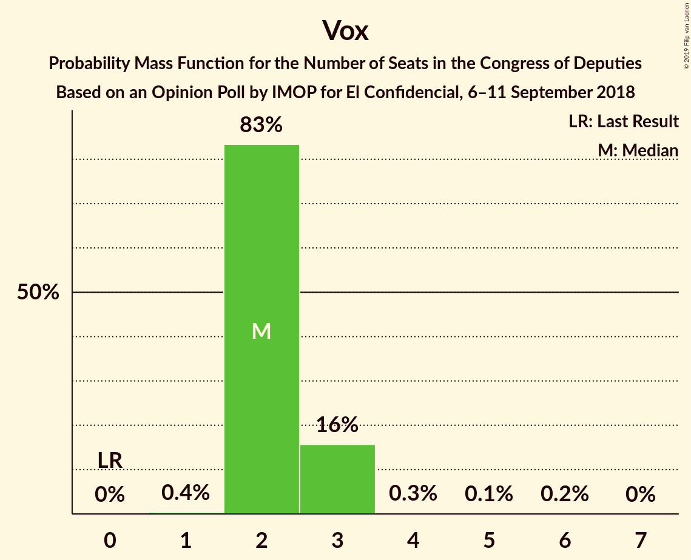
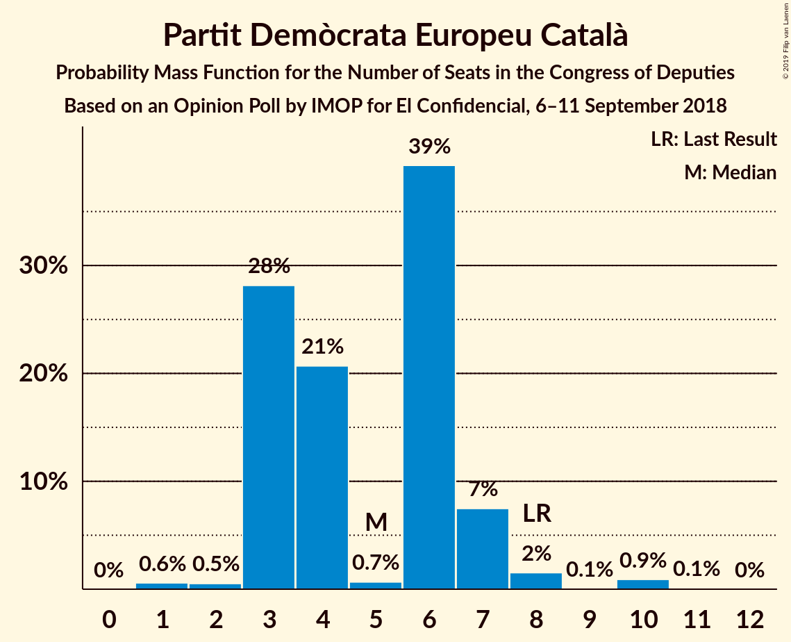
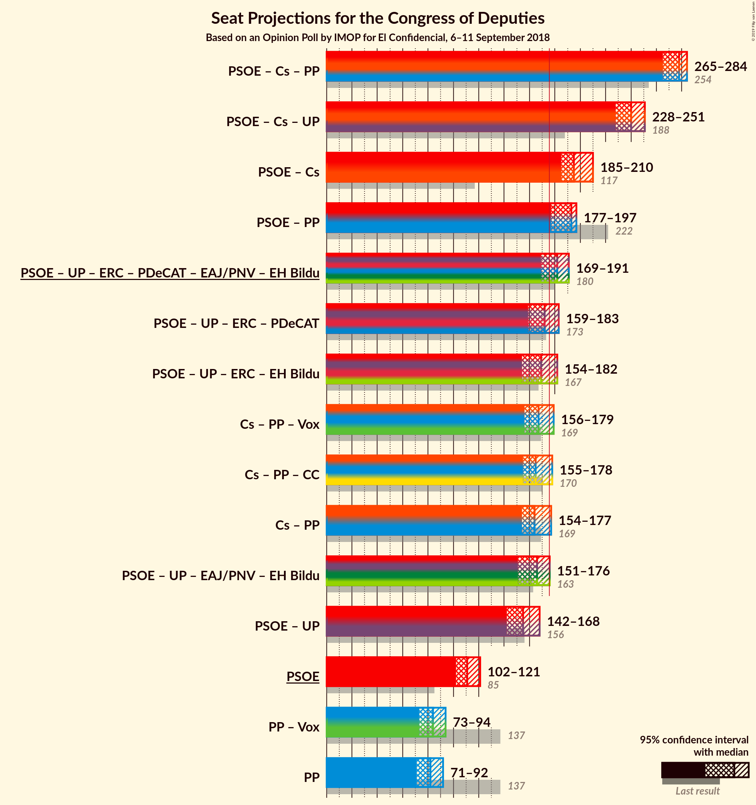

# Opinion Poll by IMOP for El Confidencial, 6–11 September 2018

<a href="#voting-intentions">Voting Intentions</a> | <a href="#seats">Seats</a> | <a href="#coalitions">Coalitions</a> | <a href="#technical-information">Technical Information</a>

## Voting Intentions

### Confidence Intervals

| Party | Last Result | Poll Result | 80% Confidence Interval | 90% Confidence Interval | 95% Confidence Interval | 99% Confidence Interval |
|:-----:|:-----------:|:-----------:|:-----------------------:|:-----------------------:|:-----------------------:|:-----------------------:|
| Partido Socialista Obrero Español | 22.6% | 26.5% | 24.8–28.3% |24.3–28.8% |23.9–29.3% |23.0–30.2% |
| Ciudadanos–Partido de la Ciudadanía | 13.1% | 23.9% | 22.3–25.7% |21.8–26.2% |21.4–26.6% |20.6–27.5% |
| Partido Popular | 33.0% | 20.3% | 18.7–21.9% |18.3–22.4% |17.9–22.8% |17.2–23.7% |
| Unidos Podemos | 21.2% | 15.4% | 14.0–17.0% |13.6–17.4% |13.3–17.8% |12.7–18.5% |
| Vox | 0.2% | 3.0% | 2.4–3.8% |2.2–4.0% |2.1–4.2% |1.8–4.6% |
| Esquerra Republicana de Catalunya | 2.7% | 2.8% | 2.2–3.6% |2.0–3.8% |1.9–4.0% |1.7–4.4% |
| Partido Animalista Contra el Maltrato Animal | 1.2% | 2.1% | 1.6–2.8% |1.5–3.0% |1.4–3.2% |1.2–3.5% |
| Partit Demòcrata Europeu Català | 2.0% | 1.5% | 1.1–2.1% |1.0–2.3% |0.9–2.4% |0.7–2.8% |
| Euzko Alderdi Jeltzalea/Partido Nacionalista Vasco | 1.2% | 1.2% | 0.9–1.8% |0.7–1.9% |0.7–2.1% |0.5–2.4% |
| Euskal Herria Bildu | 0.8% | 0.7% | 0.5–1.2% |0.4–1.3% |0.3–1.4% |0.2–1.7% |

*Note:* The poll result column reflects the actual value used in the calculations. Published results may vary slightly, and in addition be rounded to fewer digits.

## Seats

### Confidence Intervals

| Party | Last Result | Median | 80% Confidence Interval | 90% Confidence Interval | 95% Confidence Interval | 99% Confidence Interval |
|:-----:|:-----------:|:------:|:-----------------------:|:-----------------------:|:-----------------------:|:-----------------------:|
| <a href="#partido-socialista-obrero-español">Partido Socialista Obrero Español</a> | 85 | 76 | 72–76 |72–84 |72–85 |63–86 |
| <a href="#ciudadanos–partido-de-la-ciudadanía">Ciudadanos–Partido de la Ciudadanía</a> | 32 | 61 | 55–65 |55–66 |47–71 |46–78 |
| <a href="#partido-popular">Partido Popular</a> | 137 | 57 | 52–61 |52–66 |52–67 |48–74 |
| <a href="#unidos-podemos">Unidos Podemos</a> | 71 | 38 | 23–45 |23–47 |22–47 |20–47 |
| <a href="#vox">Vox</a> | 0 | 0 | 0–4 |0–4 |0–4 |0–4 |
| <a href="#esquerra-republicana-de-catalunya">Esquerra Republicana de Catalunya</a> | 9 | 0 | 0 |0 |0 |0 |
| <a href="#partido-animalista-contra-el-maltrato-animal">Partido Animalista Contra el Maltrato Animal</a> | 0 | 0 | 0–2 |0–2 |0–2 |0–2 |
| <a href="#partit-demòcrata-europeu-català">Partit Demòcrata Europeu Català</a> | 8 | 0 | 0 |0 |0 |0 |
| <a href="#euzko-alderdi-jeltzalea/partido-nacionalista-vasco">Euzko Alderdi Jeltzalea/Partido Nacionalista Vasco</a> | 5 | 1 | 1–5 |1–5 |1–6 |1–7 |
| <a href="#euskal-herria-bildu">Euskal Herria Bildu</a> | 2 | 5 | 1–6 |1–6 |1–6 |0–8 |

### Partido Socialista Obrero Español

*For a full overview of the results for this party, see the [Partido Socialista Obrero Español](party-partidosocialistaobreroespañol.html) page.*

| Number of Seats | Probability | Accumulated | Special Marks |
|:---------------:|:-----------:|:-----------:|:-------------:|
| 62 | 0.2% | 100% |  |
| 63 | 1.0% | 99.7% |  |
| 64 | 0% | 98.7% |  |
| 65 | 0% | 98.7% |  |
| 66 | 0% | 98.7% |  |
| 67 | 0.3% | 98.7% |  |
| 68 | 0.1% | 98% |  |
| 69 | 0% | 98% |  |
| 70 | 0% | 98% |  |
| 71 | 0% | 98% |  |
| 72 | 25% | 98% |  |
| 73 | 0.2% | 73% |  |
| 74 | 0.6% | 73% |  |
| 75 | 0.7% | 72% |  |
| 76 | 63% | 71% | Median |
| 77 | 1.2% | 8% |  |
| 78 | 0% | 7% |  |
| 79 | 0% | 7% |  |
| 80 | 0% | 7% |  |
| 81 | 0.4% | 7% |  |
| 82 | 0.4% | 6% |  |
| 83 | 0.1% | 6% |  |
| 84 | 3% | 6% |  |
| 85 | 0.9% | 3% | Last Result |
| 86 | 2% | 2% |  |
| 87 | 0% | 0.2% |  |
| 88 | 0.1% | 0.2% |  |
| 89 | 0% | 0.1% |  |
| 90 | 0% | 0.1% |  |
| 91 | 0.1% | 0.1% |  |
| 92 | 0% | 0% |  |

### Ciudadanos–Partido de la Ciudadanía

*For a full overview of the results for this party, see the [Ciudadanos–Partido de la Ciudadanía](party-ciudadanos–partidodelaciudadanía.html) page.*

| Number of Seats | Probability | Accumulated | Special Marks |
|:---------------:|:-----------:|:-----------:|:-------------:|
| 32 | 0% | 100% | Last Result |
| 33 | 0% | 100% |  |
| 34 | 0% | 100% |  |
| 35 | 0% | 100% |  |
| 36 | 0% | 100% |  |
| 37 | 0% | 100% |  |
| 38 | 0% | 100% |  |
| 39 | 0% | 100% |  |
| 40 | 0% | 100% |  |
| 41 | 0% | 100% |  |
| 42 | 0% | 100% |  |
| 43 | 0% | 100% |  |
| 44 | 0% | 100% |  |
| 45 | 0% | 100% |  |
| 46 | 2% | 100% |  |
| 47 | 0.2% | 98% |  |
| 48 | 0% | 97% |  |
| 49 | 0.3% | 97% |  |
| 50 | 0.1% | 97% |  |
| 51 | 1.2% | 97% |  |
| 52 | 0% | 96% |  |
| 53 | 0% | 96% |  |
| 54 | 0% | 96% |  |
| 55 | 17% | 96% |  |
| 56 | 0% | 79% |  |
| 57 | 0% | 79% |  |
| 58 | 0% | 79% |  |
| 59 | 0% | 79% |  |
| 60 | 9% | 79% |  |
| 61 | 47% | 71% | Median |
| 62 | 2% | 24% |  |
| 63 | 0.7% | 21% |  |
| 64 | 0% | 21% |  |
| 65 | 16% | 21% |  |
| 66 | 2% | 5% |  |
| 67 | 0% | 3% |  |
| 68 | 0.1% | 3% |  |
| 69 | 0.2% | 3% |  |
| 70 | 0% | 3% |  |
| 71 | 1.3% | 3% |  |
| 72 | 0% | 2% |  |
| 73 | 0.1% | 2% |  |
| 74 | 0% | 2% |  |
| 75 | 0% | 2% |  |
| 76 | 0% | 2% |  |
| 77 | 0.4% | 2% |  |
| 78 | 1.0% | 1.1% |  |
| 79 | 0% | 0.1% |  |
| 80 | 0% | 0% |  |

### Partido Popular

*For a full overview of the results for this party, see the [Partido Popular](party-partidopopular.html) page.*

| Number of Seats | Probability | Accumulated | Special Marks |
|:---------------:|:-----------:|:-----------:|:-------------:|
| 42 | 0.1% | 100% |  |
| 43 | 0.1% | 99.9% |  |
| 44 | 0% | 99.9% |  |
| 45 | 0% | 99.9% |  |
| 46 | 0% | 99.9% |  |
| 47 | 0% | 99.9% |  |
| 48 | 0.5% | 99.8% |  |
| 49 | 0.4% | 99.3% |  |
| 50 | 0% | 98.9% |  |
| 51 | 1.2% | 98.9% |  |
| 52 | 8% | 98% |  |
| 53 | 2% | 90% |  |
| 54 | 0.3% | 87% |  |
| 55 | 0% | 87% |  |
| 56 | 16% | 87% |  |
| 57 | 47% | 71% | Median |
| 58 | 0.2% | 24% |  |
| 59 | 0% | 24% |  |
| 60 | 0.1% | 24% |  |
| 61 | 17% | 24% |  |
| 62 | 0.5% | 7% |  |
| 63 | 0% | 7% |  |
| 64 | 0.6% | 7% |  |
| 65 | 0% | 6% |  |
| 66 | 1.0% | 6% |  |
| 67 | 3% | 5% |  |
| 68 | 0% | 2% |  |
| 69 | 0% | 2% |  |
| 70 | 0.3% | 2% |  |
| 71 | 0% | 2% |  |
| 72 | 0% | 2% |  |
| 73 | 0% | 2% |  |
| 74 | 2% | 2% |  |
| 75 | 0% | 0.2% |  |
| 76 | 0% | 0.2% |  |
| 77 | 0% | 0.2% |  |
| 78 | 0% | 0.2% |  |
| 79 | 0% | 0.2% |  |
| 80 | 0.2% | 0.2% |  |
| 81 | 0% | 0% |  |
| 82 | 0% | 0% |  |
| 83 | 0% | 0% |  |
| 84 | 0% | 0% |  |
| 85 | 0% | 0% |  |
| 86 | 0% | 0% |  |
| 87 | 0% | 0% |  |
| 88 | 0% | 0% |  |
| 89 | 0% | 0% |  |
| 90 | 0% | 0% |  |
| 91 | 0% | 0% |  |
| 92 | 0% | 0% |  |
| 93 | 0% | 0% |  |
| 94 | 0% | 0% |  |
| 95 | 0% | 0% |  |
| 96 | 0% | 0% |  |
| 97 | 0% | 0% |  |
| 98 | 0% | 0% |  |
| 99 | 0% | 0% |  |
| 100 | 0% | 0% |  |
| 101 | 0% | 0% |  |
| 102 | 0% | 0% |  |
| 103 | 0% | 0% |  |
| 104 | 0% | 0% |  |
| 105 | 0% | 0% |  |
| 106 | 0% | 0% |  |
| 107 | 0% | 0% |  |
| 108 | 0% | 0% |  |
| 109 | 0% | 0% |  |
| 110 | 0% | 0% |  |
| 111 | 0% | 0% |  |
| 112 | 0% | 0% |  |
| 113 | 0% | 0% |  |
| 114 | 0% | 0% |  |
| 115 | 0% | 0% |  |
| 116 | 0% | 0% |  |
| 117 | 0% | 0% |  |
| 118 | 0% | 0% |  |
| 119 | 0% | 0% |  |
| 120 | 0% | 0% |  |
| 121 | 0% | 0% |  |
| 122 | 0% | 0% |  |
| 123 | 0% | 0% |  |
| 124 | 0% | 0% |  |
| 125 | 0% | 0% |  |
| 126 | 0% | 0% |  |
| 127 | 0% | 0% |  |
| 128 | 0% | 0% |  |
| 129 | 0% | 0% |  |
| 130 | 0% | 0% |  |
| 131 | 0% | 0% |  |
| 132 | 0% | 0% |  |
| 133 | 0% | 0% |  |
| 134 | 0% | 0% |  |
| 135 | 0% | 0% |  |
| 136 | 0% | 0% |  |
| 137 | 0% | 0% | Last Result |

### Unidos Podemos

*For a full overview of the results for this party, see the [Unidos Podemos](party-unidospodemos.html) page.*

| Number of Seats | Probability | Accumulated | Special Marks |
|:---------------:|:-----------:|:-----------:|:-------------:|
| 18 | 0% | 100% |  |
| 19 | 0% | 99.9% |  |
| 20 | 2% | 99.9% |  |
| 21 | 0.1% | 98% |  |
| 22 | 0.6% | 98% |  |
| 23 | 17% | 97% |  |
| 24 | 0.1% | 81% |  |
| 25 | 0.6% | 81% |  |
| 26 | 2% | 80% |  |
| 27 | 0.9% | 78% |  |
| 28 | 0.1% | 77% |  |
| 29 | 0.3% | 77% |  |
| 30 | 0% | 77% |  |
| 31 | 0.3% | 77% |  |
| 32 | 0.2% | 76% |  |
| 33 | 0% | 76% |  |
| 34 | 2% | 76% |  |
| 35 | 0% | 74% |  |
| 36 | 0.1% | 74% |  |
| 37 | 1.4% | 74% |  |
| 38 | 47% | 72% | Median |
| 39 | 0.1% | 25% |  |
| 40 | 0% | 25% |  |
| 41 | 0% | 25% |  |
| 42 | 0.3% | 25% |  |
| 43 | 0% | 25% |  |
| 44 | 0% | 25% |  |
| 45 | 17% | 25% |  |
| 46 | 0% | 8% |  |
| 47 | 8% | 8% |  |
| 48 | 0% | 0% |  |
| 49 | 0% | 0% |  |
| 50 | 0% | 0% |  |
| 51 | 0% | 0% |  |
| 52 | 0% | 0% |  |
| 53 | 0% | 0% |  |
| 54 | 0% | 0% |  |
| 55 | 0% | 0% |  |
| 56 | 0% | 0% |  |
| 57 | 0% | 0% |  |
| 58 | 0% | 0% |  |
| 59 | 0% | 0% |  |
| 60 | 0% | 0% |  |
| 61 | 0% | 0% |  |
| 62 | 0% | 0% |  |
| 63 | 0% | 0% |  |
| 64 | 0% | 0% |  |
| 65 | 0% | 0% |  |
| 66 | 0% | 0% |  |
| 67 | 0% | 0% |  |
| 68 | 0% | 0% |  |
| 69 | 0% | 0% |  |
| 70 | 0% | 0% |  |
| 71 | 0% | 0% | Last Result |

### Vox

*For a full overview of the results for this party, see the [Vox](party-vox.html) page.*

| Number of Seats | Probability | Accumulated | Special Marks |
|:---------------:|:-----------:|:-----------:|:-------------:|
| 0 | 71% | 100% | Last Result, Median |
| 1 | 13% | 29% |  |
| 2 | 0.1% | 16% |  |
| 3 | 0.1% | 16% |  |
| 4 | 16% | 16% |  |
| 5 | 0.1% | 0.1% |  |
| 6 | 0% | 0% |  |

### Esquerra Republicana de Catalunya

*For a full overview of the results for this party, see the [Esquerra Republicana de Catalunya](party-esquerrarepublicanadecatalunya.html) page.*

| Number of Seats | Probability | Accumulated | Special Marks |
|:---------------:|:-----------:|:-----------:|:-------------:|
| 0 | 100% | 100% | Median |
| 1 | 0% | 0% |  |
| 2 | 0% | 0% |  |
| 3 | 0% | 0% |  |
| 4 | 0% | 0% |  |
| 5 | 0% | 0% |  |
| 6 | 0% | 0% |  |
| 7 | 0% | 0% |  |
| 8 | 0% | 0% |  |
| 9 | 0% | 0% | Last Result |

### Partido Animalista Contra el Maltrato Animal

*For a full overview of the results for this party, see the [Partido Animalista Contra el Maltrato Animal](party-partidoanimalistacontraelmaltratoanimal.html) page.*

| Number of Seats | Probability | Accumulated | Special Marks |
|:---------------:|:-----------:|:-----------:|:-------------:|
| 0 | 57% | 100% | Last Result, Median |
| 1 | 26% | 43% |  |
| 2 | 17% | 17% |  |
| 3 | 0% | 0% |  |

### Partit Demòcrata Europeu Català

*For a full overview of the results for this party, see the [Partit Demòcrata Europeu Català](party-partitdemòcrataeuropeucatalà.html) page.*

| Number of Seats | Probability | Accumulated | Special Marks |
|:---------------:|:-----------:|:-----------:|:-------------:|
| 0 | 100% | 100% | Median |
| 1 | 0% | 0% |  |
| 2 | 0% | 0% |  |
| 3 | 0% | 0% |  |
| 4 | 0% | 0% |  |
| 5 | 0% | 0% |  |
| 6 | 0% | 0% |  |
| 7 | 0% | 0% |  |
| 8 | 0% | 0% | Last Result |

### Euzko Alderdi Jeltzalea/Partido Nacionalista Vasco

*For a full overview of the results for this party, see the [Euzko Alderdi Jeltzalea/Partido Nacionalista Vasco](party-euzkoalderdijeltzaleapartidonacionalistavasco.html) page.*

| Number of Seats | Probability | Accumulated | Special Marks |
|:---------------:|:-----------:|:-----------:|:-------------:|
| 1 | 52% | 100% | Median |
| 2 | 3% | 48% |  |
| 3 | 26% | 45% |  |
| 4 | 0.2% | 19% |  |
| 5 | 16% | 19% | Last Result |
| 6 | 1.5% | 3% |  |
| 7 | 0.9% | 1.4% |  |
| 8 | 0.3% | 0.5% |  |
| 9 | 0.1% | 0.2% |  |
| 10 | 0.1% | 0.1% |  |
| 11 | 0% | 0% |  |

### Euskal Herria Bildu

*For a full overview of the results for this party, see the [Euskal Herria Bildu](party-euskalherriabildu.html) page.*

| Number of Seats | Probability | Accumulated | Special Marks |
|:---------------:|:-----------:|:-----------:|:-------------:|
| 0 | 2% | 100% |  |
| 1 | 17% | 98% |  |
| 2 | 9% | 81% | Last Result |
| 3 | 3% | 72% |  |
| 4 | 0.3% | 69% |  |
| 5 | 48% | 69% | Median |
| 6 | 19% | 21% |  |
| 7 | 0% | 2% |  |
| 8 | 2% | 2% |  |
| 9 | 0% | 0% |  |

## Coalitions

### Confidence Intervals

| Coalition | Last Result | Median | Majority? | 80% Confidence Interval | 90% Confidence Interval | 95% Confidence Interval | 99% Confidence Interval |
|:---------:|:-----------:|:------:|:---------:|:-----------------------:|:-----------------------:|:-----------------------:|:-----------------------:|
| Partido Socialista Obrero Español – Ciudadanos–Partido de la Ciudadanía | 117 | 137 | 0% | 131–137 | 131–141 | 130–148 | 122–156 |
| Ciudadanos–Partido de la Ciudadanía – Partido Popular | 169 | 118 | 0% | 111–126 | 111–126 | 111–140 | 108–144 |
| Ciudadanos–Partido de la Ciudadanía – Partido Popular – Vox | 169 | 118 | 0% | 111–130 | 111–130 | 111–140 | 108–145 |
| Partido Socialista Obrero Español – Unidos Podemos | 156 | 114 | 0% | 95–121 | 95–121 | 92–121 | 86–121 |
| Partido Socialista Obrero Español | 85 | 76 | 0% | 72–76 | 72–84 | 72–85 | 63–86 |
| Partido Popular – Vox | 137 | 57 | 0% | 53–65 | 53–67 | 53–68 | 48–74 |
| Partido Popular | 137 | 57 | 0% | 52–61 | 52–66 | 52–67 | 48–74 |

### Partido Socialista Obrero Español – Ciudadanos–Partido de la Ciudadanía

| Number of Seats | Probability | Accumulated | Special Marks |
|:---------------:|:-----------:|:-----------:|:-------------:|
| 117 | 0% | 100% | Last Result |
| 118 | 0% | 100% |  |
| 119 | 0% | 100% |  |
| 120 | 0% | 100% |  |
| 121 | 0.2% | 100% |  |
| 122 | 0.3% | 99.8% |  |
| 123 | 0% | 99.5% |  |
| 124 | 0% | 99.5% |  |
| 125 | 0.2% | 99.5% |  |
| 126 | 0% | 99.3% |  |
| 127 | 0% | 99.3% |  |
| 128 | 0% | 99.3% |  |
| 129 | 0% | 99.3% |  |
| 130 | 2% | 99.3% |  |
| 131 | 17% | 97% |  |
| 132 | 8% | 80% |  |
| 133 | 0% | 72% |  |
| 134 | 0.1% | 72% |  |
| 135 | 0.7% | 72% |  |
| 136 | 1.1% | 71% |  |
| 137 | 63% | 70% | Median |
| 138 | 2% | 7% |  |
| 139 | 0% | 6% |  |
| 140 | 0% | 5% |  |
| 141 | 1.1% | 5% |  |
| 142 | 0% | 4% |  |
| 143 | 0% | 4% |  |
| 144 | 0.2% | 4% |  |
| 145 | 0% | 4% |  |
| 146 | 0% | 4% |  |
| 147 | 0.1% | 4% |  |
| 148 | 3% | 4% |  |
| 149 | 0% | 0.6% |  |
| 150 | 0.1% | 0.6% |  |
| 151 | 0% | 0.6% |  |
| 152 | 0% | 0.6% |  |
| 153 | 0% | 0.5% |  |
| 154 | 0% | 0.5% |  |
| 155 | 0% | 0.5% |  |
| 156 | 0.1% | 0.5% |  |
| 157 | 0% | 0.4% |  |
| 158 | 0.4% | 0.4% |  |
| 159 | 0% | 0% |  |

### Ciudadanos–Partido de la Ciudadanía – Partido Popular

| Number of Seats | Probability | Accumulated | Special Marks |
|:---------------:|:-----------:|:-----------:|:-------------:|
| 104 | 0.1% | 100% |  |
| 105 | 0.2% | 99.9% |  |
| 106 | 0% | 99.7% |  |
| 107 | 0% | 99.7% |  |
| 108 | 0.5% | 99.7% |  |
| 109 | 0% | 99.2% |  |
| 110 | 0.1% | 99.2% |  |
| 111 | 16% | 99.1% |  |
| 112 | 9% | 83% |  |
| 113 | 3% | 74% |  |
| 114 | 0% | 71% |  |
| 115 | 2% | 71% |  |
| 116 | 0.1% | 69% |  |
| 117 | 0.3% | 69% |  |
| 118 | 47% | 69% | Median |
| 119 | 0.1% | 22% |  |
| 120 | 0% | 22% |  |
| 121 | 0% | 22% |  |
| 122 | 1.2% | 22% |  |
| 123 | 0% | 20% |  |
| 124 | 0.1% | 20% |  |
| 125 | 0% | 20% |  |
| 126 | 16% | 20% |  |
| 127 | 0.4% | 4% |  |
| 128 | 0% | 4% |  |
| 129 | 0.1% | 4% |  |
| 130 | 0.3% | 4% |  |
| 131 | 0.2% | 3% |  |
| 132 | 0% | 3% |  |
| 133 | 0.2% | 3% |  |
| 134 | 0% | 3% |  |
| 135 | 0% | 3% |  |
| 136 | 0% | 3% |  |
| 137 | 0% | 3% |  |
| 138 | 0% | 3% |  |
| 139 | 0.1% | 3% |  |
| 140 | 2% | 3% |  |
| 141 | 0% | 1.0% |  |
| 142 | 0% | 1.0% |  |
| 143 | 0% | 1.0% |  |
| 144 | 1.0% | 1.0% |  |
| 145 | 0% | 0% |  |
| 146 | 0% | 0% |  |
| 147 | 0% | 0% |  |
| 148 | 0% | 0% |  |
| 149 | 0% | 0% |  |
| 150 | 0% | 0% |  |
| 151 | 0% | 0% |  |
| 152 | 0% | 0% |  |
| 153 | 0% | 0% |  |
| 154 | 0% | 0% |  |
| 155 | 0% | 0% |  |
| 156 | 0% | 0% |  |
| 157 | 0% | 0% |  |
| 158 | 0% | 0% |  |
| 159 | 0% | 0% |  |
| 160 | 0% | 0% |  |
| 161 | 0% | 0% |  |
| 162 | 0% | 0% |  |
| 163 | 0% | 0% |  |
| 164 | 0% | 0% |  |
| 165 | 0% | 0% |  |
| 166 | 0% | 0% |  |
| 167 | 0% | 0% |  |
| 168 | 0% | 0% |  |
| 169 | 0% | 0% | Last Result |

### Ciudadanos–Partido de la Ciudadanía – Partido Popular – Vox

| Number of Seats | Probability | Accumulated | Special Marks |
|:---------------:|:-----------:|:-----------:|:-------------:|
| 105 | 0.1% | 100% |  |
| 106 | 0.2% | 99.9% |  |
| 107 | 0% | 99.7% |  |
| 108 | 0.5% | 99.7% |  |
| 109 | 0% | 99.2% |  |
| 110 | 0.1% | 99.2% |  |
| 111 | 16% | 99.1% |  |
| 112 | 0% | 83% |  |
| 113 | 11% | 83% |  |
| 114 | 0% | 71% |  |
| 115 | 0% | 71% |  |
| 116 | 2% | 71% |  |
| 117 | 0.3% | 69% |  |
| 118 | 47% | 69% | Median |
| 119 | 0.1% | 22% |  |
| 120 | 0% | 22% |  |
| 121 | 0.3% | 22% |  |
| 122 | 1.2% | 22% |  |
| 123 | 0% | 20% |  |
| 124 | 0.1% | 20% |  |
| 125 | 0% | 20% |  |
| 126 | 0.4% | 20% |  |
| 127 | 0.4% | 20% |  |
| 128 | 0% | 19% |  |
| 129 | 0.1% | 19% |  |
| 130 | 16% | 19% |  |
| 131 | 0.2% | 3% |  |
| 132 | 0.1% | 3% |  |
| 133 | 0% | 3% |  |
| 134 | 0.2% | 3% |  |
| 135 | 0% | 3% |  |
| 136 | 0% | 3% |  |
| 137 | 0% | 3% |  |
| 138 | 0% | 3% |  |
| 139 | 0% | 3% |  |
| 140 | 2% | 3% |  |
| 141 | 0% | 1.0% |  |
| 142 | 0% | 1.0% |  |
| 143 | 0% | 1.0% |  |
| 144 | 0% | 1.0% |  |
| 145 | 1.0% | 1.0% |  |
| 146 | 0% | 0% |  |
| 147 | 0% | 0% |  |
| 148 | 0% | 0% |  |
| 149 | 0% | 0% |  |
| 150 | 0% | 0% |  |
| 151 | 0% | 0% |  |
| 152 | 0% | 0% |  |
| 153 | 0% | 0% |  |
| 154 | 0% | 0% |  |
| 155 | 0% | 0% |  |
| 156 | 0% | 0% |  |
| 157 | 0% | 0% |  |
| 158 | 0% | 0% |  |
| 159 | 0% | 0% |  |
| 160 | 0% | 0% |  |
| 161 | 0% | 0% |  |
| 162 | 0% | 0% |  |
| 163 | 0% | 0% |  |
| 164 | 0% | 0% |  |
| 165 | 0% | 0% |  |
| 166 | 0% | 0% |  |
| 167 | 0% | 0% |  |
| 168 | 0% | 0% |  |
| 169 | 0% | 0% | Last Result |

### Partido Socialista Obrero Español – Unidos Podemos

| Number of Seats | Probability | Accumulated | Special Marks |
|:---------------:|:-----------:|:-----------:|:-------------:|
| 86 | 1.0% | 100% |  |
| 87 | 0% | 99.0% |  |
| 88 | 0% | 99.0% |  |
| 89 | 0% | 99.0% |  |
| 90 | 0% | 99.0% |  |
| 91 | 0% | 98.9% |  |
| 92 | 2% | 98.9% |  |
| 93 | 0% | 97% |  |
| 94 | 0.2% | 97% |  |
| 95 | 16% | 97% |  |
| 96 | 0% | 81% |  |
| 97 | 0.2% | 81% |  |
| 98 | 0.2% | 81% |  |
| 99 | 0.3% | 81% |  |
| 100 | 0% | 81% |  |
| 101 | 0% | 80% |  |
| 102 | 0% | 80% |  |
| 103 | 0.6% | 80% |  |
| 104 | 0% | 80% |  |
| 105 | 0% | 80% |  |
| 106 | 0% | 80% |  |
| 107 | 0.2% | 80% |  |
| 108 | 0.1% | 80% |  |
| 109 | 0.3% | 80% |  |
| 110 | 0% | 79% |  |
| 111 | 0% | 79% |  |
| 112 | 3% | 79% |  |
| 113 | 0.3% | 76% |  |
| 114 | 48% | 76% | Median |
| 115 | 0.1% | 28% |  |
| 116 | 0% | 28% |  |
| 117 | 0% | 28% |  |
| 118 | 2% | 28% |  |
| 119 | 8% | 25% |  |
| 120 | 0.5% | 17% |  |
| 121 | 17% | 17% |  |
| 122 | 0% | 0.1% |  |
| 123 | 0% | 0.1% |  |
| 124 | 0.1% | 0.1% |  |
| 125 | 0% | 0% |  |
| 126 | 0% | 0% |  |
| 127 | 0% | 0% |  |
| 128 | 0% | 0% |  |
| 129 | 0% | 0% |  |
| 130 | 0% | 0% |  |
| 131 | 0% | 0% |  |
| 132 | 0% | 0% |  |
| 133 | 0% | 0% |  |
| 134 | 0% | 0% |  |
| 135 | 0% | 0% |  |
| 136 | 0% | 0% |  |
| 137 | 0% | 0% |  |
| 138 | 0% | 0% |  |
| 139 | 0% | 0% |  |
| 140 | 0% | 0% |  |
| 141 | 0% | 0% |  |
| 142 | 0% | 0% |  |
| 143 | 0% | 0% |  |
| 144 | 0% | 0% |  |
| 145 | 0% | 0% |  |
| 146 | 0% | 0% |  |
| 147 | 0% | 0% |  |
| 148 | 0% | 0% |  |
| 149 | 0% | 0% |  |
| 150 | 0% | 0% |  |
| 151 | 0% | 0% |  |
| 152 | 0% | 0% |  |
| 153 | 0% | 0% |  |
| 154 | 0% | 0% |  |
| 155 | 0% | 0% |  |
| 156 | 0% | 0% | Last Result |

### Partido Socialista Obrero Español

| Number of Seats | Probability | Accumulated | Special Marks |
|:---------------:|:-----------:|:-----------:|:-------------:|
| 62 | 0.2% | 100% |  |
| 63 | 1.0% | 99.7% |  |
| 64 | 0% | 98.7% |  |
| 65 | 0% | 98.7% |  |
| 66 | 0% | 98.7% |  |
| 67 | 0.3% | 98.7% |  |
| 68 | 0.1% | 98% |  |
| 69 | 0% | 98% |  |
| 70 | 0% | 98% |  |
| 71 | 0% | 98% |  |
| 72 | 25% | 98% |  |
| 73 | 0.2% | 73% |  |
| 74 | 0.6% | 73% |  |
| 75 | 0.7% | 72% |  |
| 76 | 63% | 71% | Median |
| 77 | 1.2% | 8% |  |
| 78 | 0% | 7% |  |
| 79 | 0% | 7% |  |
| 80 | 0% | 7% |  |
| 81 | 0.4% | 7% |  |
| 82 | 0.4% | 6% |  |
| 83 | 0.1% | 6% |  |
| 84 | 3% | 6% |  |
| 85 | 0.9% | 3% | Last Result |
| 86 | 2% | 2% |  |
| 87 | 0% | 0.2% |  |
| 88 | 0.1% | 0.2% |  |
| 89 | 0% | 0.1% |  |
| 90 | 0% | 0.1% |  |
| 91 | 0.1% | 0.1% |  |
| 92 | 0% | 0% |  |

### Partido Popular – Vox

| Number of Seats | Probability | Accumulated | Special Marks |
|:---------------:|:-----------:|:-----------:|:-------------:|
| 43 | 0.1% | 100% |  |
| 44 | 0% | 99.9% |  |
| 45 | 0.1% | 99.9% |  |
| 46 | 0% | 99.9% |  |
| 47 | 0% | 99.9% |  |
| 48 | 0.5% | 99.8% |  |
| 49 | 0.4% | 99.3% |  |
| 50 | 0% | 98.9% |  |
| 51 | 1.3% | 98.9% |  |
| 52 | 0% | 98% |  |
| 53 | 8% | 98% |  |
| 54 | 2% | 90% |  |
| 55 | 0.2% | 87% |  |
| 56 | 16% | 87% |  |
| 57 | 47% | 71% | Median |
| 58 | 0.2% | 24% |  |
| 59 | 0.1% | 24% |  |
| 60 | 0.1% | 24% |  |
| 61 | 0% | 24% |  |
| 62 | 1.1% | 24% |  |
| 63 | 0% | 22% |  |
| 64 | 0.1% | 22% |  |
| 65 | 16% | 22% |  |
| 66 | 0.3% | 7% |  |
| 67 | 4% | 6% |  |
| 68 | 0.3% | 3% |  |
| 69 | 0.1% | 2% |  |
| 70 | 0% | 2% |  |
| 71 | 0.2% | 2% |  |
| 72 | 0% | 2% |  |
| 73 | 0% | 2% |  |
| 74 | 2% | 2% |  |
| 75 | 0% | 0.2% |  |
| 76 | 0% | 0.2% |  |
| 77 | 0% | 0.2% |  |
| 78 | 0% | 0.2% |  |
| 79 | 0% | 0.2% |  |
| 80 | 0.2% | 0.2% |  |
| 81 | 0% | 0% |  |
| 82 | 0% | 0% |  |
| 83 | 0% | 0% |  |
| 84 | 0% | 0% |  |
| 85 | 0% | 0% |  |
| 86 | 0% | 0% |  |
| 87 | 0% | 0% |  |
| 88 | 0% | 0% |  |
| 89 | 0% | 0% |  |
| 90 | 0% | 0% |  |
| 91 | 0% | 0% |  |
| 92 | 0% | 0% |  |
| 93 | 0% | 0% |  |
| 94 | 0% | 0% |  |
| 95 | 0% | 0% |  |
| 96 | 0% | 0% |  |
| 97 | 0% | 0% |  |
| 98 | 0% | 0% |  |
| 99 | 0% | 0% |  |
| 100 | 0% | 0% |  |
| 101 | 0% | 0% |  |
| 102 | 0% | 0% |  |
| 103 | 0% | 0% |  |
| 104 | 0% | 0% |  |
| 105 | 0% | 0% |  |
| 106 | 0% | 0% |  |
| 107 | 0% | 0% |  |
| 108 | 0% | 0% |  |
| 109 | 0% | 0% |  |
| 110 | 0% | 0% |  |
| 111 | 0% | 0% |  |
| 112 | 0% | 0% |  |
| 113 | 0% | 0% |  |
| 114 | 0% | 0% |  |
| 115 | 0% | 0% |  |
| 116 | 0% | 0% |  |
| 117 | 0% | 0% |  |
| 118 | 0% | 0% |  |
| 119 | 0% | 0% |  |
| 120 | 0% | 0% |  |
| 121 | 0% | 0% |  |
| 122 | 0% | 0% |  |
| 123 | 0% | 0% |  |
| 124 | 0% | 0% |  |
| 125 | 0% | 0% |  |
| 126 | 0% | 0% |  |
| 127 | 0% | 0% |  |
| 128 | 0% | 0% |  |
| 129 | 0% | 0% |  |
| 130 | 0% | 0% |  |
| 131 | 0% | 0% |  |
| 132 | 0% | 0% |  |
| 133 | 0% | 0% |  |
| 134 | 0% | 0% |  |
| 135 | 0% | 0% |  |
| 136 | 0% | 0% |  |
| 137 | 0% | 0% | Last Result |

### Partido Popular

| Number of Seats | Probability | Accumulated | Special Marks |
|:---------------:|:-----------:|:-----------:|:-------------:|
| 42 | 0.1% | 100% |  |
| 43 | 0.1% | 99.9% |  |
| 44 | 0% | 99.9% |  |
| 45 | 0% | 99.9% |  |
| 46 | 0% | 99.9% |  |
| 47 | 0% | 99.9% |  |
| 48 | 0.5% | 99.8% |  |
| 49 | 0.4% | 99.3% |  |
| 50 | 0% | 98.9% |  |
| 51 | 1.2% | 98.9% |  |
| 52 | 8% | 98% |  |
| 53 | 2% | 90% |  |
| 54 | 0.3% | 87% |  |
| 55 | 0% | 87% |  |
| 56 | 16% | 87% |  |
| 57 | 47% | 71% | Median |
| 58 | 0.2% | 24% |  |
| 59 | 0% | 24% |  |
| 60 | 0.1% | 24% |  |
| 61 | 17% | 24% |  |
| 62 | 0.5% | 7% |  |
| 63 | 0% | 7% |  |
| 64 | 0.6% | 7% |  |
| 65 | 0% | 6% |  |
| 66 | 1.0% | 6% |  |
| 67 | 3% | 5% |  |
| 68 | 0% | 2% |  |
| 69 | 0% | 2% |  |
| 70 | 0.3% | 2% |  |
| 71 | 0% | 2% |  |
| 72 | 0% | 2% |  |
| 73 | 0% | 2% |  |
| 74 | 2% | 2% |  |
| 75 | 0% | 0.2% |  |
| 76 | 0% | 0.2% |  |
| 77 | 0% | 0.2% |  |
| 78 | 0% | 0.2% |  |
| 79 | 0% | 0.2% |  |
| 80 | 0.2% | 0.2% |  |
| 81 | 0% | 0% |  |
| 82 | 0% | 0% |  |
| 83 | 0% | 0% |  |
| 84 | 0% | 0% |  |
| 85 | 0% | 0% |  |
| 86 | 0% | 0% |  |
| 87 | 0% | 0% |  |
| 88 | 0% | 0% |  |
| 89 | 0% | 0% |  |
| 90 | 0% | 0% |  |
| 91 | 0% | 0% |  |
| 92 | 0% | 0% |  |
| 93 | 0% | 0% |  |
| 94 | 0% | 0% |  |
| 95 | 0% | 0% |  |
| 96 | 0% | 0% |  |
| 97 | 0% | 0% |  |
| 98 | 0% | 0% |  |
| 99 | 0% | 0% |  |
| 100 | 0% | 0% |  |
| 101 | 0% | 0% |  |
| 102 | 0% | 0% |  |
| 103 | 0% | 0% |  |
| 104 | 0% | 0% |  |
| 105 | 0% | 0% |  |
| 106 | 0% | 0% |  |
| 107 | 0% | 0% |  |
| 108 | 0% | 0% |  |
| 109 | 0% | 0% |  |
| 110 | 0% | 0% |  |
| 111 | 0% | 0% |  |
| 112 | 0% | 0% |  |
| 113 | 0% | 0% |  |
| 114 | 0% | 0% |  |
| 115 | 0% | 0% |  |
| 116 | 0% | 0% |  |
| 117 | 0% | 0% |  |
| 118 | 0% | 0% |  |
| 119 | 0% | 0% |  |
| 120 | 0% | 0% |  |
| 121 | 0% | 0% |  |
| 122 | 0% | 0% |  |
| 123 | 0% | 0% |  |
| 124 | 0% | 0% |  |
| 125 | 0% | 0% |  |
| 126 | 0% | 0% |  |
| 127 | 0% | 0% |  |
| 128 | 0% | 0% |  |
| 129 | 0% | 0% |  |
| 130 | 0% | 0% |  |
| 131 | 0% | 0% |  |
| 132 | 0% | 0% |  |
| 133 | 0% | 0% |  |
| 134 | 0% | 0% |  |
| 135 | 0% | 0% |  |
| 136 | 0% | 0% |  |
| 137 | 0% | 0% | Last Result |

## Technical Information

### Opinion Poll

+ **Polling firm:** IMOP
+ **Commissioner(s):** El Confidencial
+ **Fieldwork period:** 6–11 September 2018

### Calculations

+ **Sample size:** 1012
+ **Simulations done:** 1,024
+ **Error estimate:** 4.39%

