# Opinion Poll by Instituto DYM for El Independiente, 17–19 September 2018

<a href="#voting-intentions">Voting Intentions</a> | <a href="#seats">Seats</a> | <a href="#coalitions">Coalitions</a> | <a href="#technical-information">Technical Information</a>

## Voting Intentions

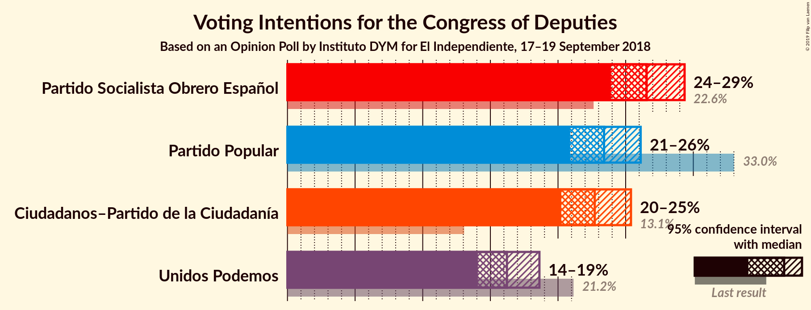

### Confidence Intervals

| Party | Last Result | Poll Result | 80% Confidence Interval | 90% Confidence Interval | 95% Confidence Interval | 99% Confidence Interval |
|:-----:|:-----------:|:-----------:|:-----------------------:|:-----------------------:|:-----------------------:|:-----------------------:|
| Partido Socialista Obrero Español | 22.6% | 26.5% | 24.8–28.4% |24.3–28.9% |23.9–29.4% |23.1–30.3% |
| Partido Popular | 33.0% | 23.4% | 21.8–25.2% |21.3–25.7% |20.9–26.1% |20.1–27.0% |
| Ciudadanos–Partido de la Ciudadanía | 13.1% | 22.7% | 21.1–24.5% |20.6–25.0% |20.2–25.4% |19.5–26.3% |
| Unidos Podemos | 21.2% | 16.2% | 14.8–17.8% |14.4–18.2% |14.1–18.6% |13.4–19.4% |

*Note:* The poll result column reflects the actual value used in the calculations. Published results may vary slightly, and in addition be rounded to fewer digits.

## Seats

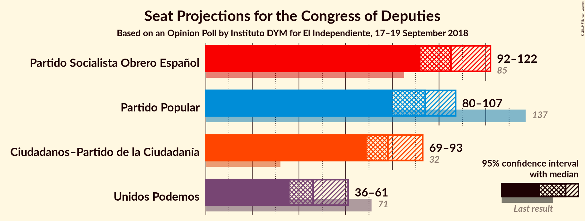

### Confidence Intervals

| Party | Last Result | Median | 80% Confidence Interval | 90% Confidence Interval | 95% Confidence Interval | 99% Confidence Interval |
|:-----:|:-----------:|:------:|:-----------------------:|:-----------------------:|:-----------------------:|:-----------------------:|
| <a href="#partido-socialista-obrero-español">Partido Socialista Obrero Español</a> | 85 | 78 | 68–80 |68–80 |65–80 |64–87 |
| <a href="#partido-popular">Partido Popular</a> | 137 | 69 | 60–76 |59–76 |59–76 |59–84 |
| <a href="#ciudadanos–partido-de-la-ciudadanía">Ciudadanos–Partido de la Ciudadanía</a> | 32 | 52 | 51–68 |51–68 |50–69 |48–69 |
| <a href="#unidos-podemos">Unidos Podemos</a> | 71 | 28 | 24–42 |24–42 |24–42 |23–42 |

### Partido Socialista Obrero Español

*For a full overview of the results for this party, see the [Partido Socialista Obrero Español](party-partidosocialistaobreroespañol.html) page.*

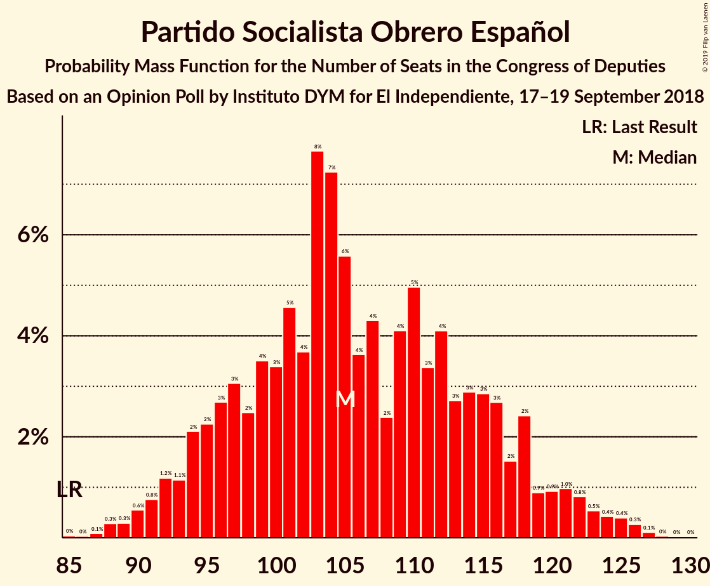

| Number of Seats | Probability | Accumulated | Special Marks |
|:---------------:|:-----------:|:-----------:|:-------------:|
| 63 | 0% | 100% |  |
| 64 | 2% | 99.9% |  |
| 65 | 0.8% | 98% |  |
| 66 | 0.6% | 97% |  |
| 67 | 0% | 97% |  |
| 68 | 12% | 97% |  |
| 69 | 0% | 85% |  |
| 70 | 19% | 85% |  |
| 71 | 1.3% | 66% |  |
| 72 | 0% | 64% |  |
| 73 | 0.8% | 64% |  |
| 74 | 9% | 63% |  |
| 75 | 0.3% | 54% |  |
| 76 | 0% | 54% |  |
| 77 | 1.1% | 54% |  |
| 78 | 33% | 53% | Median |
| 79 | 0% | 19% |  |
| 80 | 19% | 19% |  |
| 81 | 0.1% | 0.7% |  |
| 82 | 0% | 0.6% |  |
| 83 | 0% | 0.6% |  |
| 84 | 0% | 0.6% |  |
| 85 | 0% | 0.5% | Last Result |
| 86 | 0% | 0.5% |  |
| 87 | 0% | 0.5% |  |
| 88 | 0.1% | 0.5% |  |
| 89 | 0% | 0.4% |  |
| 90 | 0.4% | 0.4% |  |
| 91 | 0% | 0% |  |

### Partido Popular

*For a full overview of the results for this party, see the [Partido Popular](party-partidopopular.html) page.*

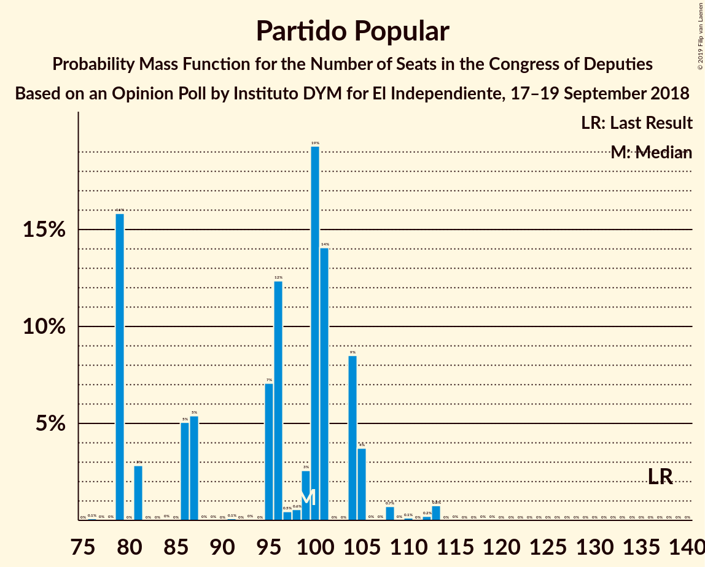

| Number of Seats | Probability | Accumulated | Special Marks |
|:---------------:|:-----------:|:-----------:|:-------------:|
| 55 | 0.1% | 100% |  |
| 56 | 0% | 99.9% |  |
| 57 | 0% | 99.9% |  |
| 58 | 0.1% | 99.8% |  |
| 59 | 7% | 99.8% |  |
| 60 | 22% | 93% |  |
| 61 | 0.1% | 71% |  |
| 62 | 0% | 71% |  |
| 63 | 0.4% | 71% |  |
| 64 | 0.1% | 71% |  |
| 65 | 0% | 71% |  |
| 66 | 0.1% | 71% |  |
| 67 | 17% | 70% |  |
| 68 | 2% | 53% |  |
| 69 | 2% | 51% | Median |
| 70 | 0% | 49% |  |
| 71 | 0% | 49% |  |
| 72 | 0.2% | 49% |  |
| 73 | 0.9% | 48% |  |
| 74 | 33% | 47% |  |
| 75 | 0% | 14% |  |
| 76 | 13% | 14% |  |
| 77 | 0% | 1.3% |  |
| 78 | 0.1% | 1.3% |  |
| 79 | 0% | 1.2% |  |
| 80 | 0% | 1.1% |  |
| 81 | 0% | 1.1% |  |
| 82 | 0% | 1.1% |  |
| 83 | 0% | 1.1% |  |
| 84 | 1.1% | 1.1% |  |
| 85 | 0% | 0% |  |
| 86 | 0% | 0% |  |
| 87 | 0% | 0% |  |
| 88 | 0% | 0% |  |
| 89 | 0% | 0% |  |
| 90 | 0% | 0% |  |
| 91 | 0% | 0% |  |
| 92 | 0% | 0% |  |
| 93 | 0% | 0% |  |
| 94 | 0% | 0% |  |
| 95 | 0% | 0% |  |
| 96 | 0% | 0% |  |
| 97 | 0% | 0% |  |
| 98 | 0% | 0% |  |
| 99 | 0% | 0% |  |
| 100 | 0% | 0% |  |
| 101 | 0% | 0% |  |
| 102 | 0% | 0% |  |
| 103 | 0% | 0% |  |
| 104 | 0% | 0% |  |
| 105 | 0% | 0% |  |
| 106 | 0% | 0% |  |
| 107 | 0% | 0% |  |
| 108 | 0% | 0% |  |
| 109 | 0% | 0% |  |
| 110 | 0% | 0% |  |
| 111 | 0% | 0% |  |
| 112 | 0% | 0% |  |
| 113 | 0% | 0% |  |
| 114 | 0% | 0% |  |
| 115 | 0% | 0% |  |
| 116 | 0% | 0% |  |
| 117 | 0% | 0% |  |
| 118 | 0% | 0% |  |
| 119 | 0% | 0% |  |
| 120 | 0% | 0% |  |
| 121 | 0% | 0% |  |
| 122 | 0% | 0% |  |
| 123 | 0% | 0% |  |
| 124 | 0% | 0% |  |
| 125 | 0% | 0% |  |
| 126 | 0% | 0% |  |
| 127 | 0% | 0% |  |
| 128 | 0% | 0% |  |
| 129 | 0% | 0% |  |
| 130 | 0% | 0% |  |
| 131 | 0% | 0% |  |
| 132 | 0% | 0% |  |
| 133 | 0% | 0% |  |
| 134 | 0% | 0% |  |
| 135 | 0% | 0% |  |
| 136 | 0% | 0% |  |
| 137 | 0% | 0% | Last Result |

### Ciudadanos–Partido de la Ciudadanía

*For a full overview of the results for this party, see the [Ciudadanos–Partido de la Ciudadanía](party-ciudadanos–partidodelaciudadanía.html) page.*

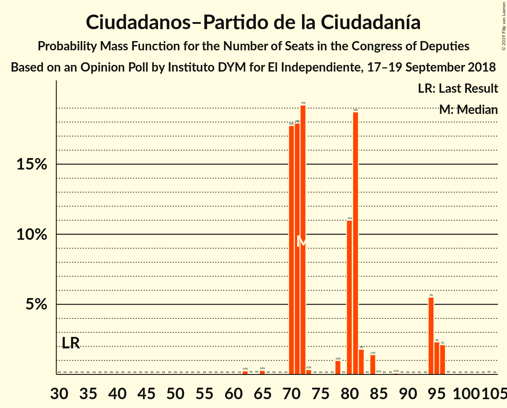

| Number of Seats | Probability | Accumulated | Special Marks |
|:---------------:|:-----------:|:-----------:|:-------------:|
| 32 | 0% | 100% | Last Result |
| 33 | 0% | 100% |  |
| 34 | 0% | 100% |  |
| 35 | 0% | 100% |  |
| 36 | 0% | 100% |  |
| 37 | 0% | 100% |  |
| 38 | 0% | 100% |  |
| 39 | 0% | 100% |  |
| 40 | 0% | 100% |  |
| 41 | 0% | 100% |  |
| 42 | 0% | 100% |  |
| 43 | 0% | 100% |  |
| 44 | 0.1% | 100% |  |
| 45 | 0.1% | 99.9% |  |
| 46 | 0.1% | 99.8% |  |
| 47 | 0% | 99.7% |  |
| 48 | 0.3% | 99.7% |  |
| 49 | 0.1% | 99.4% |  |
| 50 | 2% | 99.3% |  |
| 51 | 45% | 97% |  |
| 52 | 7% | 52% | Median |
| 53 | 0% | 44% |  |
| 54 | 0% | 44% |  |
| 55 | 0.2% | 44% |  |
| 56 | 0% | 44% |  |
| 57 | 0% | 44% |  |
| 58 | 0% | 44% |  |
| 59 | 0.1% | 44% |  |
| 60 | 31% | 44% |  |
| 61 | 2% | 13% |  |
| 62 | 0.8% | 11% |  |
| 63 | 0% | 10% |  |
| 64 | 0.1% | 10% |  |
| 65 | 0% | 10% |  |
| 66 | 0% | 10% |  |
| 67 | 0% | 10% |  |
| 68 | 6% | 10% |  |
| 69 | 4% | 4% |  |
| 70 | 0% | 0.1% |  |
| 71 | 0% | 0.1% |  |
| 72 | 0% | 0.1% |  |
| 73 | 0% | 0.1% |  |
| 74 | 0% | 0.1% |  |
| 75 | 0% | 0.1% |  |
| 76 | 0% | 0% |  |

### Unidos Podemos

*For a full overview of the results for this party, see the [Unidos Podemos](party-unidospodemos.html) page.*

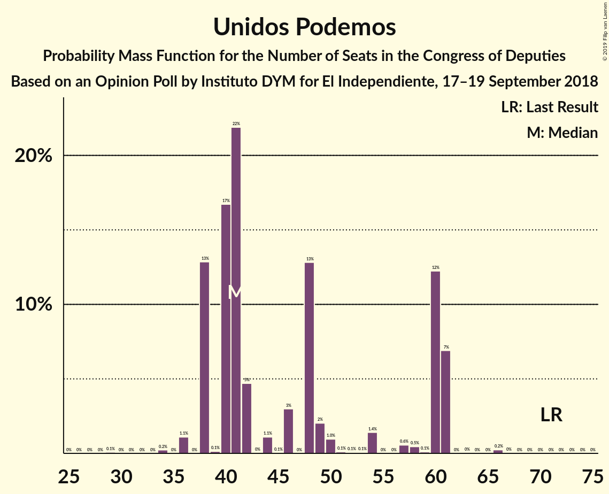

| Number of Seats | Probability | Accumulated | Special Marks |
|:---------------:|:-----------:|:-----------:|:-------------:|
| 20 | 0.3% | 100% |  |
| 21 | 0% | 99.7% |  |
| 22 | 0% | 99.7% |  |
| 23 | 0.6% | 99.6% |  |
| 24 | 13% | 99.0% |  |
| 25 | 0.1% | 86% |  |
| 26 | 0.6% | 86% |  |
| 27 | 33% | 86% |  |
| 28 | 10% | 52% | Median |
| 29 | 0.9% | 42% |  |
| 30 | 12% | 41% |  |
| 31 | 7% | 29% |  |
| 32 | 0% | 22% |  |
| 33 | 0% | 22% |  |
| 34 | 0.8% | 22% |  |
| 35 | 0.1% | 21% |  |
| 36 | 2% | 21% |  |
| 37 | 0% | 20% |  |
| 38 | 0% | 20% |  |
| 39 | 0% | 20% |  |
| 40 | 3% | 20% |  |
| 41 | 4% | 17% |  |
| 42 | 12% | 12% |  |
| 43 | 0.1% | 0.3% |  |
| 44 | 0.2% | 0.2% |  |
| 45 | 0% | 0% |  |
| 46 | 0% | 0% |  |
| 47 | 0% | 0% |  |
| 48 | 0% | 0% |  |
| 49 | 0% | 0% |  |
| 50 | 0% | 0% |  |
| 51 | 0% | 0% |  |
| 52 | 0% | 0% |  |
| 53 | 0% | 0% |  |
| 54 | 0% | 0% |  |
| 55 | 0% | 0% |  |
| 56 | 0% | 0% |  |
| 57 | 0% | 0% |  |
| 58 | 0% | 0% |  |
| 59 | 0% | 0% |  |
| 60 | 0% | 0% |  |
| 61 | 0% | 0% |  |
| 62 | 0% | 0% |  |
| 63 | 0% | 0% |  |
| 64 | 0% | 0% |  |
| 65 | 0% | 0% |  |
| 66 | 0% | 0% |  |
| 67 | 0% | 0% |  |
| 68 | 0% | 0% |  |
| 69 | 0% | 0% |  |
| 70 | 0% | 0% |  |
| 71 | 0% | 0% | Last Result |

## Coalitions

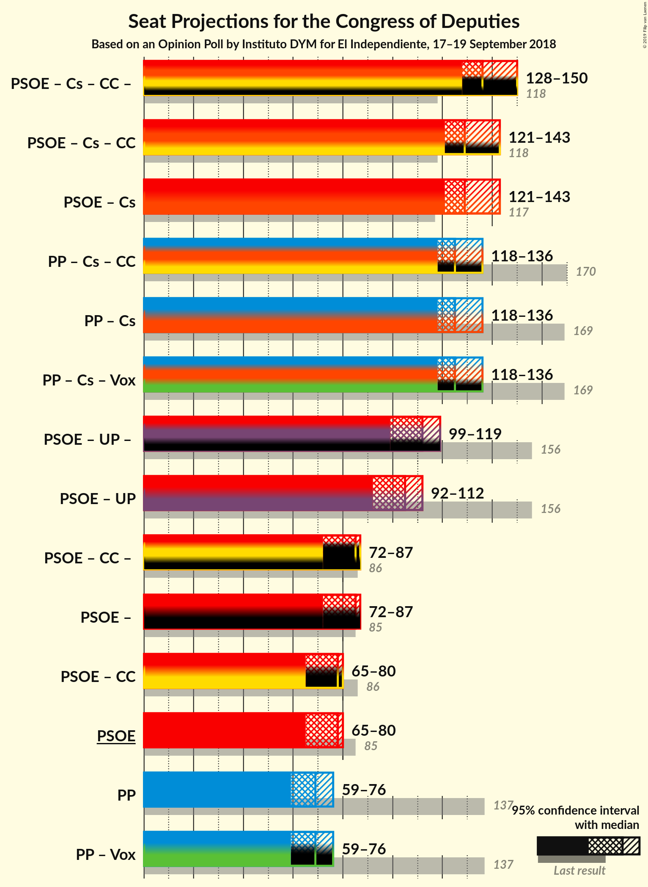

### Confidence Intervals

| Coalition | Last Result | Median | Majority? | 80% Confidence Interval | 90% Confidence Interval | 95% Confidence Interval | 99% Confidence Interval |
|:---------:|:-----------:|:------:|:---------:|:-----------------------:|:-----------------------:|:-----------------------:|:-----------------------:|
| Partido Socialista Obrero Español – Ciudadanos–Partido de la Ciudadanía | 117 | 129 | 0% | 121–142 | 121–142 | 121–143 | 120–143 |
| Partido Popular – Ciudadanos–Partido de la Ciudadanía | 169 | 125 | 0% | 118–136 | 118–136 | 118–136 | 112–136 |
| Partido Socialista Obrero Español – Unidos Podemos | 156 | 105 | 0% | 92–112 | 92–112 | 92–112 | 92–117 |
| Partido Socialista Obrero Español | 85 | 78 | 0% | 68–80 | 68–80 | 65–80 | 64–87 |
| Partido Popular | 137 | 69 | 0% | 60–76 | 59–76 | 59–76 | 59–84 |

### Partido Socialista Obrero Español – Ciudadanos–Partido de la Ciudadanía

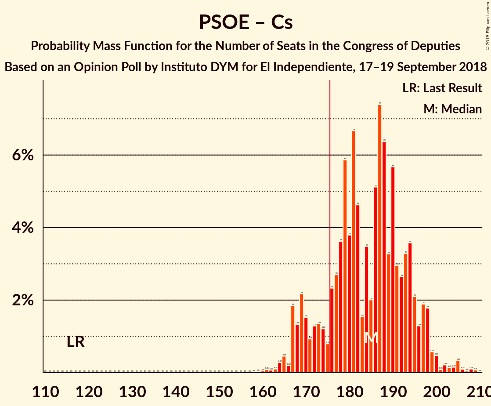

| Number of Seats | Probability | Accumulated | Special Marks |
|:---------------:|:-----------:|:-----------:|:-------------:|
| 117 | 0% | 100% | Last Result |
| 118 | 0% | 100% |  |
| 119 | 0% | 100% |  |
| 120 | 0.5% | 100% |  |
| 121 | 13% | 99.5% |  |
| 122 | 6% | 87% |  |
| 123 | 1.0% | 80% |  |
| 124 | 0.2% | 79% |  |
| 125 | 2% | 79% |  |
| 126 | 0.6% | 77% |  |
| 127 | 2% | 77% |  |
| 128 | 12% | 75% |  |
| 129 | 33% | 63% |  |
| 130 | 0% | 29% | Median |
| 131 | 0% | 29% |  |
| 132 | 0% | 29% |  |
| 133 | 0% | 29% |  |
| 134 | 0.1% | 29% |  |
| 135 | 0% | 29% |  |
| 136 | 0% | 29% |  |
| 137 | 0% | 29% |  |
| 138 | 0% | 29% |  |
| 139 | 0% | 29% |  |
| 140 | 19% | 29% |  |
| 141 | 0.1% | 10% |  |
| 142 | 7% | 10% |  |
| 143 | 3% | 3% |  |
| 144 | 0% | 0.3% |  |
| 145 | 0.2% | 0.2% |  |
| 146 | 0% | 0% |  |

### Partido Popular – Ciudadanos–Partido de la Ciudadanía

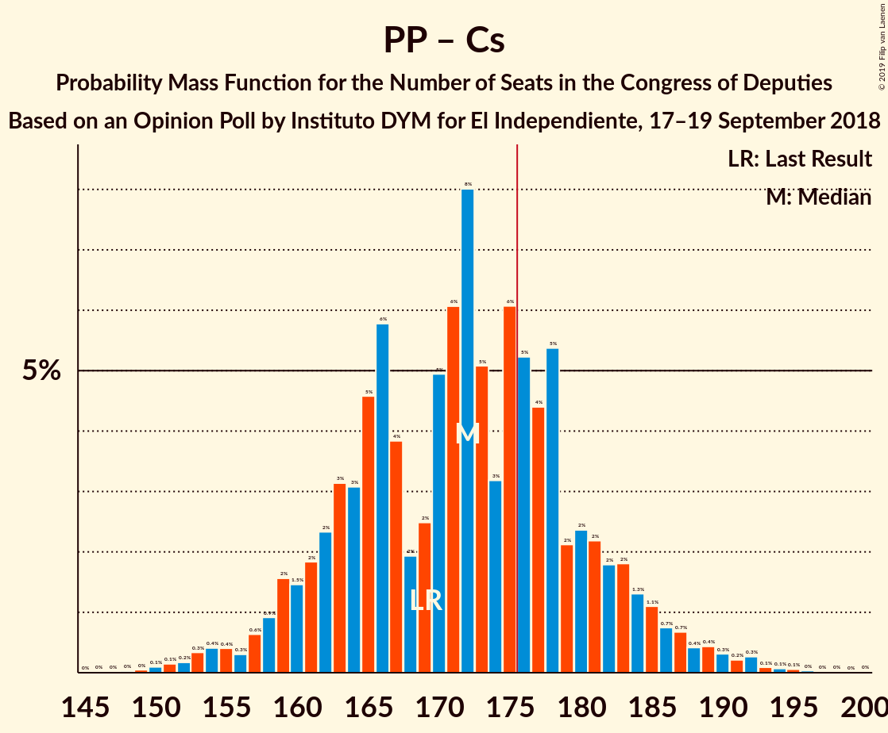

| Number of Seats | Probability | Accumulated | Special Marks |
|:---------------:|:-----------:|:-----------:|:-------------:|
| 105 | 0.1% | 100% |  |
| 106 | 0% | 99.9% |  |
| 107 | 0% | 99.9% |  |
| 108 | 0% | 99.9% |  |
| 109 | 0% | 99.9% |  |
| 110 | 0% | 99.9% |  |
| 111 | 0.2% | 99.9% |  |
| 112 | 0.2% | 99.6% |  |
| 113 | 0.1% | 99.5% |  |
| 114 | 0% | 99.4% |  |
| 115 | 0% | 99.4% |  |
| 116 | 0% | 99.4% |  |
| 117 | 0% | 99.4% |  |
| 118 | 12% | 99.4% |  |
| 119 | 12% | 87% |  |
| 120 | 14% | 75% |  |
| 121 | 0% | 61% | Median |
| 122 | 0.4% | 61% |  |
| 123 | 0.9% | 61% |  |
| 124 | 0% | 60% |  |
| 125 | 33% | 60% |  |
| 126 | 0% | 27% |  |
| 127 | 0% | 27% |  |
| 128 | 6% | 27% |  |
| 129 | 4% | 20% |  |
| 130 | 2% | 17% |  |
| 131 | 0.8% | 15% |  |
| 132 | 0% | 14% |  |
| 133 | 0% | 14% |  |
| 134 | 1.1% | 14% |  |
| 135 | 0% | 13% |  |
| 136 | 13% | 13% |  |
| 137 | 0% | 0.1% |  |
| 138 | 0% | 0.1% |  |
| 139 | 0% | 0.1% |  |
| 140 | 0% | 0% |  |
| 141 | 0% | 0% |  |
| 142 | 0% | 0% |  |
| 143 | 0% | 0% |  |
| 144 | 0% | 0% |  |
| 145 | 0% | 0% |  |
| 146 | 0% | 0% |  |
| 147 | 0% | 0% |  |
| 148 | 0% | 0% |  |
| 149 | 0% | 0% |  |
| 150 | 0% | 0% |  |
| 151 | 0% | 0% |  |
| 152 | 0% | 0% |  |
| 153 | 0% | 0% |  |
| 154 | 0% | 0% |  |
| 155 | 0% | 0% |  |
| 156 | 0% | 0% |  |
| 157 | 0% | 0% |  |
| 158 | 0% | 0% |  |
| 159 | 0% | 0% |  |
| 160 | 0% | 0% |  |
| 161 | 0% | 0% |  |
| 162 | 0% | 0% |  |
| 163 | 0% | 0% |  |
| 164 | 0% | 0% |  |
| 165 | 0% | 0% |  |
| 166 | 0% | 0% |  |
| 167 | 0% | 0% |  |
| 168 | 0% | 0% |  |
| 169 | 0% | 0% | Last Result |

### Partido Socialista Obrero Español – Unidos Podemos

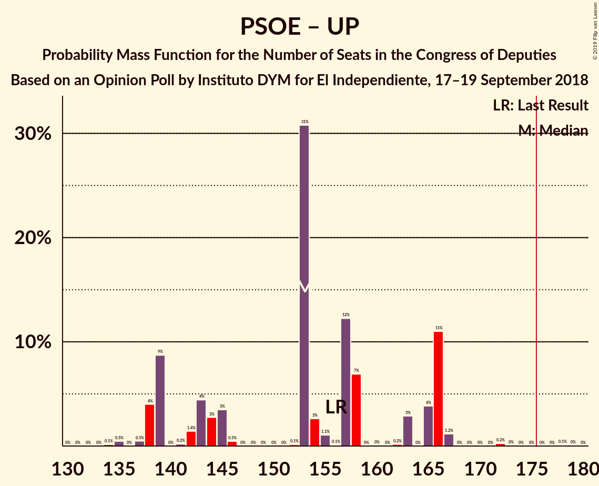

| Number of Seats | Probability | Accumulated | Special Marks |
|:---------------:|:-----------:|:-----------:|:-------------:|
| 90 | 0% | 100% |  |
| 91 | 0% | 99.9% |  |
| 92 | 13% | 99.9% |  |
| 93 | 0.1% | 87% |  |
| 94 | 1.1% | 87% |  |
| 95 | 0% | 86% |  |
| 96 | 0% | 86% |  |
| 97 | 0.1% | 86% |  |
| 98 | 0.1% | 86% |  |
| 99 | 0.8% | 86% |  |
| 100 | 2% | 85% |  |
| 101 | 0.8% | 83% |  |
| 102 | 9% | 83% |  |
| 103 | 0% | 73% |  |
| 104 | 0% | 73% |  |
| 105 | 33% | 73% |  |
| 106 | 0.9% | 40% | Median |
| 107 | 0.2% | 39% |  |
| 108 | 0.1% | 39% |  |
| 109 | 0% | 39% |  |
| 110 | 14% | 39% |  |
| 111 | 12% | 25% |  |
| 112 | 12% | 13% |  |
| 113 | 0% | 0.6% |  |
| 114 | 0% | 0.6% |  |
| 115 | 0% | 0.6% |  |
| 116 | 0% | 0.6% |  |
| 117 | 0.1% | 0.6% |  |
| 118 | 0.1% | 0.5% |  |
| 119 | 0.2% | 0.4% |  |
| 120 | 0% | 0.1% |  |
| 121 | 0% | 0.1% |  |
| 122 | 0% | 0.1% |  |
| 123 | 0% | 0.1% |  |
| 124 | 0% | 0.1% |  |
| 125 | 0.1% | 0.1% |  |
| 126 | 0% | 0% |  |
| 127 | 0% | 0% |  |
| 128 | 0% | 0% |  |
| 129 | 0% | 0% |  |
| 130 | 0% | 0% |  |
| 131 | 0% | 0% |  |
| 132 | 0% | 0% |  |
| 133 | 0% | 0% |  |
| 134 | 0% | 0% |  |
| 135 | 0% | 0% |  |
| 136 | 0% | 0% |  |
| 137 | 0% | 0% |  |
| 138 | 0% | 0% |  |
| 139 | 0% | 0% |  |
| 140 | 0% | 0% |  |
| 141 | 0% | 0% |  |
| 142 | 0% | 0% |  |
| 143 | 0% | 0% |  |
| 144 | 0% | 0% |  |
| 145 | 0% | 0% |  |
| 146 | 0% | 0% |  |
| 147 | 0% | 0% |  |
| 148 | 0% | 0% |  |
| 149 | 0% | 0% |  |
| 150 | 0% | 0% |  |
| 151 | 0% | 0% |  |
| 152 | 0% | 0% |  |
| 153 | 0% | 0% |  |
| 154 | 0% | 0% |  |
| 155 | 0% | 0% |  |
| 156 | 0% | 0% | Last Result |

### Partido Socialista Obrero Español

| Number of Seats | Probability | Accumulated | Special Marks |
|:---------------:|:-----------:|:-----------:|:-------------:|
| 63 | 0% | 100% |  |
| 64 | 2% | 99.9% |  |
| 65 | 0.8% | 98% |  |
| 66 | 0.6% | 97% |  |
| 67 | 0% | 97% |  |
| 68 | 12% | 97% |  |
| 69 | 0% | 85% |  |
| 70 | 19% | 85% |  |
| 71 | 1.3% | 66% |  |
| 72 | 0% | 64% |  |
| 73 | 0.8% | 64% |  |
| 74 | 9% | 63% |  |
| 75 | 0.3% | 54% |  |
| 76 | 0% | 54% |  |
| 77 | 1.1% | 54% |  |
| 78 | 33% | 53% | Median |
| 79 | 0% | 19% |  |
| 80 | 19% | 19% |  |
| 81 | 0.1% | 0.7% |  |
| 82 | 0% | 0.6% |  |
| 83 | 0% | 0.6% |  |
| 84 | 0% | 0.6% |  |
| 85 | 0% | 0.5% | Last Result |
| 86 | 0% | 0.5% |  |
| 87 | 0% | 0.5% |  |
| 88 | 0.1% | 0.5% |  |
| 89 | 0% | 0.4% |  |
| 90 | 0.4% | 0.4% |  |
| 91 | 0% | 0% |  |

### Partido Popular

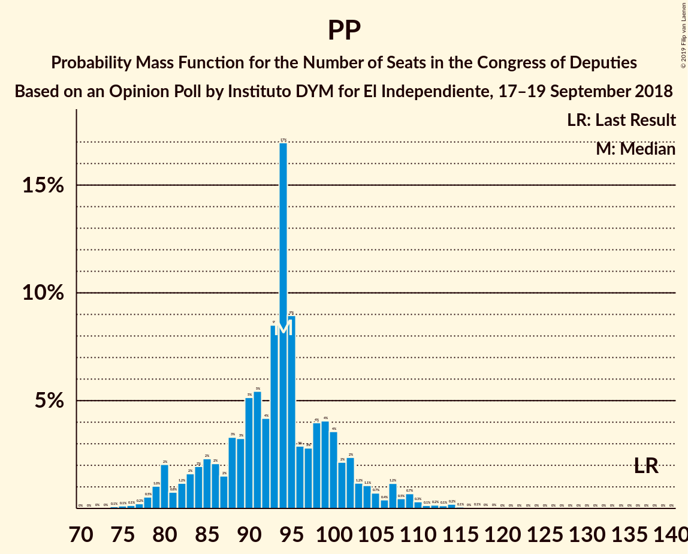

| Number of Seats | Probability | Accumulated | Special Marks |
|:---------------:|:-----------:|:-----------:|:-------------:|
| 55 | 0.1% | 100% |  |
| 56 | 0% | 99.9% |  |
| 57 | 0% | 99.9% |  |
| 58 | 0.1% | 99.8% |  |
| 59 | 7% | 99.8% |  |
| 60 | 22% | 93% |  |
| 61 | 0.1% | 71% |  |
| 62 | 0% | 71% |  |
| 63 | 0.4% | 71% |  |
| 64 | 0.1% | 71% |  |
| 65 | 0% | 71% |  |
| 66 | 0.1% | 71% |  |
| 67 | 17% | 70% |  |
| 68 | 2% | 53% |  |
| 69 | 2% | 51% | Median |
| 70 | 0% | 49% |  |
| 71 | 0% | 49% |  |
| 72 | 0.2% | 49% |  |
| 73 | 0.9% | 48% |  |
| 74 | 33% | 47% |  |
| 75 | 0% | 14% |  |
| 76 | 13% | 14% |  |
| 77 | 0% | 1.3% |  |
| 78 | 0.1% | 1.3% |  |
| 79 | 0% | 1.2% |  |
| 80 | 0% | 1.1% |  |
| 81 | 0% | 1.1% |  |
| 82 | 0% | 1.1% |  |
| 83 | 0% | 1.1% |  |
| 84 | 1.1% | 1.1% |  |
| 85 | 0% | 0% |  |
| 86 | 0% | 0% |  |
| 87 | 0% | 0% |  |
| 88 | 0% | 0% |  |
| 89 | 0% | 0% |  |
| 90 | 0% | 0% |  |
| 91 | 0% | 0% |  |
| 92 | 0% | 0% |  |
| 93 | 0% | 0% |  |
| 94 | 0% | 0% |  |
| 95 | 0% | 0% |  |
| 96 | 0% | 0% |  |
| 97 | 0% | 0% |  |
| 98 | 0% | 0% |  |
| 99 | 0% | 0% |  |
| 100 | 0% | 0% |  |
| 101 | 0% | 0% |  |
| 102 | 0% | 0% |  |
| 103 | 0% | 0% |  |
| 104 | 0% | 0% |  |
| 105 | 0% | 0% |  |
| 106 | 0% | 0% |  |
| 107 | 0% | 0% |  |
| 108 | 0% | 0% |  |
| 109 | 0% | 0% |  |
| 110 | 0% | 0% |  |
| 111 | 0% | 0% |  |
| 112 | 0% | 0% |  |
| 113 | 0% | 0% |  |
| 114 | 0% | 0% |  |
| 115 | 0% | 0% |  |
| 116 | 0% | 0% |  |
| 117 | 0% | 0% |  |
| 118 | 0% | 0% |  |
| 119 | 0% | 0% |  |
| 120 | 0% | 0% |  |
| 121 | 0% | 0% |  |
| 122 | 0% | 0% |  |
| 123 | 0% | 0% |  |
| 124 | 0% | 0% |  |
| 125 | 0% | 0% |  |
| 126 | 0% | 0% |  |
| 127 | 0% | 0% |  |
| 128 | 0% | 0% |  |
| 129 | 0% | 0% |  |
| 130 | 0% | 0% |  |
| 131 | 0% | 0% |  |
| 132 | 0% | 0% |  |
| 133 | 0% | 0% |  |
| 134 | 0% | 0% |  |
| 135 | 0% | 0% |  |
| 136 | 0% | 0% |  |
| 137 | 0% | 0% | Last Result |

## Technical Information

### Opinion Poll

+ **Polling firm:** Instituto DYM
+ **Commissioner(s):** El Independiente
+ **Fieldwork period:** 17–19 September 2018

### Calculations

+ **Sample size:** 1017
+ **Simulations done:** 1,024
+ **Error estimate:** 3.20%

