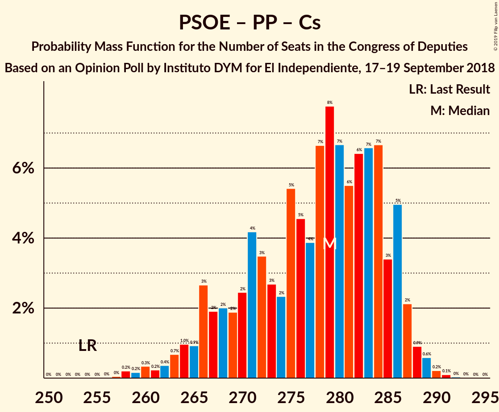
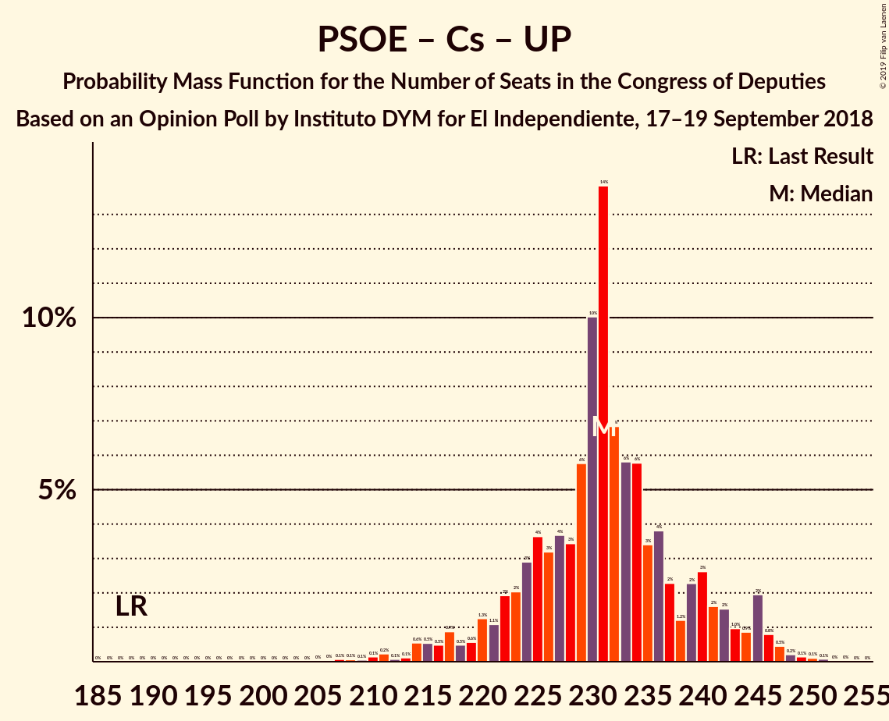

# Opinion Poll by Instituto DYM for El Independiente, 17–19 September 2018

<a href="#voting-intentions">Voting Intentions</a> | <a href="#seats">Seats</a> | <a href="#coalitions">Coalitions</a> | <a href="#technical-information">Technical Information</a>

## Voting Intentions

### Confidence Intervals

| Party | Last Result | Poll Result | 80% Confidence Interval | 90% Confidence Interval | 95% Confidence Interval | 99% Confidence Interval |
|:-----:|:-----------:|:-----------:|:-----------------------:|:-----------------------:|:-----------------------:|:-----------------------:|
| Partido Socialista Obrero Español | 22.6% | 26.5% | 24.8–28.4% |24.3–28.9% |23.9–29.4% |23.1–30.3% |
| Partido Popular | 33.0% | 23.4% | 21.8–25.2% |21.3–25.7% |20.9–26.1% |20.1–27.0% |
| Ciudadanos–Partido de la Ciudadanía | 13.1% | 22.7% | 21.1–24.5% |20.6–25.0% |20.2–25.4% |19.5–26.3% |
| Unidos Podemos | 21.2% | 16.2% | 14.8–17.8% |14.4–18.2% |14.1–18.6% |13.4–19.4% |

*Note:* The poll result column reflects the actual value used in the calculations. Published results may vary slightly, and in addition be rounded to fewer digits.

## Seats

### Confidence Intervals

| Party | Last Result | Median | 80% Confidence Interval | 90% Confidence Interval | 95% Confidence Interval | 99% Confidence Interval |
|:-----:|:-----------:|:------:|:-----------------------:|:-----------------------:|:-----------------------:|:-----------------------:|
| <a href="#partido-socialista-obrero-español">Partido Socialista Obrero Español</a> | 85 | 112 | 97–117 |97–118 |88–118 |88–121 |
| <a href="#partido-popular">Partido Popular</a> | 137 | 99 | 79–104 |79–105 |79–105 |79–113 |
| <a href="#ciudadanos–partido-de-la-ciudadanía">Ciudadanos–Partido de la Ciudadanía</a> | 32 | 72 | 70–94 |70–94 |70–95 |65–96 |
| <a href="#unidos-podemos">Unidos Podemos</a> | 71 | 41 | 38–60 |38–61 |38–61 |36–61 |

### Partido Socialista Obrero Español

*For a full overview of the results for this party, see the [Partido Socialista Obrero Español](party-partidosocialistaobreroespañol.html) page.*

| Number of Seats | Probability | Accumulated | Special Marks |
|:---------------:|:-----------:|:-----------:|:-------------:|
| 85 | 0% | 100% | Last Result |
| 86 | 0% | 100% |  |
| 87 | 0% | 100% |  |
| 88 | 2% | 100% |  |
| 89 | 0% | 97% |  |
| 90 | 0% | 97% |  |
| 91 | 0% | 97% |  |
| 92 | 0% | 97% |  |
| 93 | 0% | 97% |  |
| 94 | 0% | 97% |  |
| 95 | 0% | 97% |  |
| 96 | 0.1% | 97% |  |
| 97 | 20% | 97% |  |
| 98 | 0% | 78% |  |
| 99 | 0% | 78% |  |
| 100 | 4% | 78% |  |
| 101 | 11% | 74% |  |
| 102 | 3% | 63% |  |
| 103 | 3% | 60% |  |
| 104 | 3% | 57% |  |
| 105 | 0.1% | 54% |  |
| 106 | 0.3% | 54% |  |
| 107 | 0% | 54% |  |
| 108 | 0% | 54% |  |
| 109 | 0% | 54% |  |
| 110 | 0% | 54% |  |
| 111 | 1.1% | 54% |  |
| 112 | 17% | 53% | Median |
| 113 | 17% | 36% |  |
| 114 | 0% | 19% |  |
| 115 | 0.1% | 19% |  |
| 116 | 0.1% | 19% |  |
| 117 | 10% | 19% |  |
| 118 | 9% | 10% |  |
| 119 | 0% | 0.6% |  |
| 120 | 0% | 0.6% |  |
| 121 | 0.1% | 0.6% |  |
| 122 | 0% | 0.4% |  |
| 123 | 0% | 0.4% |  |
| 124 | 0% | 0.4% |  |
| 125 | 0% | 0.4% |  |
| 126 | 0% | 0.4% |  |
| 127 | 0.1% | 0.3% |  |
| 128 | 0.2% | 0.2% |  |
| 129 | 0.1% | 0.1% |  |
| 130 | 0% | 0% |  |

### Partido Popular

*For a full overview of the results for this party, see the [Partido Popular](party-partidopopular.html) page.*

| Number of Seats | Probability | Accumulated | Special Marks |
|:---------------:|:-----------:|:-----------:|:-------------:|
| 76 | 0.1% | 100% |  |
| 77 | 0% | 99.9% |  |
| 78 | 0% | 99.8% |  |
| 79 | 16% | 99.8% |  |
| 80 | 0% | 84% |  |
| 81 | 3% | 84% |  |
| 82 | 0% | 81% |  |
| 83 | 0% | 81% |  |
| 84 | 0% | 81% |  |
| 85 | 0% | 81% |  |
| 86 | 5% | 81% |  |
| 87 | 5% | 76% |  |
| 88 | 0% | 71% |  |
| 89 | 0% | 71% |  |
| 90 | 0% | 71% |  |
| 91 | 0.1% | 71% |  |
| 92 | 0% | 71% |  |
| 93 | 0% | 71% |  |
| 94 | 0% | 71% |  |
| 95 | 7% | 71% |  |
| 96 | 12% | 63% |  |
| 97 | 0.5% | 51% |  |
| 98 | 0.6% | 51% |  |
| 99 | 3% | 50% | Median |
| 100 | 19% | 47% |  |
| 101 | 14% | 28% |  |
| 102 | 0% | 14% |  |
| 103 | 0% | 14% |  |
| 104 | 9% | 14% |  |
| 105 | 4% | 6% |  |
| 106 | 0% | 2% |  |
| 107 | 0% | 2% |  |
| 108 | 0.7% | 2% |  |
| 109 | 0% | 1.1% |  |
| 110 | 0.1% | 1.1% |  |
| 111 | 0% | 1.0% |  |
| 112 | 0.2% | 1.0% |  |
| 113 | 0.8% | 0.8% |  |
| 114 | 0% | 0% |  |
| 115 | 0% | 0% |  |
| 116 | 0% | 0% |  |
| 117 | 0% | 0% |  |
| 118 | 0% | 0% |  |
| 119 | 0% | 0% |  |
| 120 | 0% | 0% |  |
| 121 | 0% | 0% |  |
| 122 | 0% | 0% |  |
| 123 | 0% | 0% |  |
| 124 | 0% | 0% |  |
| 125 | 0% | 0% |  |
| 126 | 0% | 0% |  |
| 127 | 0% | 0% |  |
| 128 | 0% | 0% |  |
| 129 | 0% | 0% |  |
| 130 | 0% | 0% |  |
| 131 | 0% | 0% |  |
| 132 | 0% | 0% |  |
| 133 | 0% | 0% |  |
| 134 | 0% | 0% |  |
| 135 | 0% | 0% |  |
| 136 | 0% | 0% |  |
| 137 | 0% | 0% | Last Result |

### Ciudadanos–Partido de la Ciudadanía

*For a full overview of the results for this party, see the [Ciudadanos–Partido de la Ciudadanía](party-ciudadanos–partidodelaciudadanía.html) page.*

| Number of Seats | Probability | Accumulated | Special Marks |
|:---------------:|:-----------:|:-----------:|:-------------:|
| 32 | 0% | 100% | Last Result |
| 33 | 0% | 100% |  |
| 34 | 0% | 100% |  |
| 35 | 0% | 100% |  |
| 36 | 0% | 100% |  |
| 37 | 0% | 100% |  |
| 38 | 0% | 100% |  |
| 39 | 0% | 100% |  |
| 40 | 0% | 100% |  |
| 41 | 0% | 100% |  |
| 42 | 0% | 100% |  |
| 43 | 0% | 100% |  |
| 44 | 0% | 100% |  |
| 45 | 0% | 100% |  |
| 46 | 0% | 100% |  |
| 47 | 0% | 100% |  |
| 48 | 0% | 100% |  |
| 49 | 0% | 100% |  |
| 50 | 0% | 100% |  |
| 51 | 0% | 100% |  |
| 52 | 0% | 100% |  |
| 53 | 0% | 100% |  |
| 54 | 0% | 100% |  |
| 55 | 0% | 100% |  |
| 56 | 0% | 100% |  |
| 57 | 0% | 100% |  |
| 58 | 0% | 100% |  |
| 59 | 0% | 100% |  |
| 60 | 0% | 100% |  |
| 61 | 0% | 100% |  |
| 62 | 0.3% | 100% |  |
| 63 | 0% | 99.7% |  |
| 64 | 0% | 99.7% |  |
| 65 | 0.3% | 99.7% |  |
| 66 | 0% | 99.4% |  |
| 67 | 0% | 99.4% |  |
| 68 | 0% | 99.4% |  |
| 69 | 0% | 99.4% |  |
| 70 | 18% | 99.4% |  |
| 71 | 18% | 82% |  |
| 72 | 19% | 64% | Median |
| 73 | 0.3% | 45% |  |
| 74 | 0% | 44% |  |
| 75 | 0% | 44% |  |
| 76 | 0% | 44% |  |
| 77 | 0% | 44% |  |
| 78 | 1.0% | 44% |  |
| 79 | 0% | 43% |  |
| 80 | 11% | 43% |  |
| 81 | 19% | 32% |  |
| 82 | 2% | 13% |  |
| 83 | 0% | 12% |  |
| 84 | 1.4% | 12% |  |
| 85 | 0.1% | 10% |  |
| 86 | 0% | 10% |  |
| 87 | 0% | 10% |  |
| 88 | 0.1% | 10% |  |
| 89 | 0% | 10% |  |
| 90 | 0% | 10% |  |
| 91 | 0% | 10% |  |
| 92 | 0% | 10% |  |
| 93 | 0% | 10% |  |
| 94 | 6% | 10% |  |
| 95 | 2% | 5% |  |
| 96 | 2% | 2% |  |
| 97 | 0% | 0.1% |  |
| 98 | 0% | 0.1% |  |
| 99 | 0% | 0.1% |  |
| 100 | 0% | 0.1% |  |
| 101 | 0% | 0.1% |  |
| 102 | 0% | 0.1% |  |
| 103 | 0% | 0.1% |  |
| 104 | 0% | 0.1% |  |
| 105 | 0% | 0% |  |

### Unidos Podemos

*For a full overview of the results for this party, see the [Unidos Podemos](party-unidospodemos.html) page.*

| Number of Seats | Probability | Accumulated | Special Marks |
|:---------------:|:-----------:|:-----------:|:-------------:|
| 29 | 0.1% | 100% |  |
| 30 | 0% | 99.9% |  |
| 31 | 0% | 99.9% |  |
| 32 | 0% | 99.9% |  |
| 33 | 0% | 99.9% |  |
| 34 | 0.2% | 99.9% |  |
| 35 | 0% | 99.6% |  |
| 36 | 1.1% | 99.6% |  |
| 37 | 0% | 98.5% |  |
| 38 | 13% | 98.5% |  |
| 39 | 0.1% | 86% |  |
| 40 | 17% | 86% |  |
| 41 | 22% | 69% | Median |
| 42 | 5% | 47% |  |
| 43 | 0% | 42% |  |
| 44 | 1.1% | 42% |  |
| 45 | 0.1% | 41% |  |
| 46 | 3% | 41% |  |
| 47 | 0% | 38% |  |
| 48 | 13% | 38% |  |
| 49 | 2% | 25% |  |
| 50 | 1.0% | 23% |  |
| 51 | 0.1% | 22% |  |
| 52 | 0.1% | 22% |  |
| 53 | 0.1% | 22% |  |
| 54 | 1.4% | 22% |  |
| 55 | 0% | 21% |  |
| 56 | 0% | 21% |  |
| 57 | 0.6% | 21% |  |
| 58 | 0.5% | 20% |  |
| 59 | 0.1% | 20% |  |
| 60 | 12% | 19% |  |
| 61 | 7% | 7% |  |
| 62 | 0% | 0.3% |  |
| 63 | 0% | 0.3% |  |
| 64 | 0% | 0.3% |  |
| 65 | 0% | 0.3% |  |
| 66 | 0.2% | 0.3% |  |
| 67 | 0% | 0% |  |
| 68 | 0% | 0% |  |
| 69 | 0% | 0% |  |
| 70 | 0% | 0% |  |
| 71 | 0% | 0% | Last Result |

## Coalitions

### Confidence Intervals

| Coalition | Last Result | Median | Majority? | 80% Confidence Interval | 90% Confidence Interval | 95% Confidence Interval | 99% Confidence Interval |
|:---------:|:-----------:|:------:|:---------:|:-----------------------:|:-----------------------:|:-----------------------:|:-----------------------:|
| Partido Socialista Obrero Español – Partido Popular – Ciudadanos–Partido de la Ciudadanía | 254 | 283 | 100% | 265–286 | 264–286 | 264–286 | 264–287 |
| Partido Socialista Obrero Español – Ciudadanos–Partido de la Ciudadanía – Unidos Podemos | 188 | 226 | 100% | 220–246 | 219–246 | 219–246 | 208–246 |
| Partido Socialista Obrero Español – Partido Popular | 222 | 198 | 100% | 190–213 | 189–213 | 187–213 | 185–215 |
| Partido Socialista Obrero Español – Ciudadanos–Partido de la Ciudadanía | 117 | 182 | 77% | 169–198 | 169–198 | 169–198 | 169–198 |
| Partido Popular – Ciudadanos–Partido de la Ciudadanía | 169 | 171 | 27% | 159–185 | 159–186 | 159–186 | 157–189 |
| Partido Socialista Obrero Español – Unidos Podemos | 156 | 153 | 0.1% | 139–166 | 138–166 | 138–166 | 135–167 |
| Partido Socialista Obrero Español | 85 | 112 | 0% | 97–117 | 97–118 | 88–118 | 88–121 |
| Partido Popular | 137 | 99 | 0% | 79–104 | 79–105 | 79–105 | 79–113 |

### Partido Socialista Obrero Español – Partido Popular – Ciudadanos–Partido de la Ciudadanía

| Number of Seats | Probability | Accumulated | Special Marks |
|:---------------:|:-----------:|:-----------:|:-------------:|
| 254 | 0% | 100% | Last Result |
| 255 | 0% | 100% |  |
| 256 | 0% | 100% |  |
| 257 | 0% | 100% |  |
| 258 | 0.2% | 100% |  |
| 259 | 0% | 99.7% |  |
| 260 | 0% | 99.7% |  |
| 261 | 0% | 99.7% |  |
| 262 | 0.1% | 99.7% |  |
| 263 | 0% | 99.7% |  |
| 264 | 7% | 99.7% |  |
| 265 | 12% | 93% |  |
| 266 | 0.1% | 81% |  |
| 267 | 0.4% | 80% |  |
| 268 | 0.6% | 80% |  |
| 269 | 0% | 79% |  |
| 270 | 0% | 79% |  |
| 271 | 1.4% | 79% |  |
| 272 | 0.1% | 78% |  |
| 273 | 0.1% | 78% |  |
| 274 | 1.0% | 78% |  |
| 275 | 0% | 77% |  |
| 276 | 2% | 77% |  |
| 277 | 13% | 75% |  |
| 278 | 0.2% | 62% |  |
| 279 | 3% | 62% |  |
| 280 | 1.1% | 59% |  |
| 281 | 0% | 58% |  |
| 282 | 3% | 58% |  |
| 283 | 16% | 55% | Median |
| 284 | 25% | 39% |  |
| 285 | 0.5% | 14% |  |
| 286 | 13% | 14% |  |
| 287 | 0.7% | 1.0% |  |
| 288 | 0.2% | 0.4% |  |
| 289 | 0.1% | 0.2% |  |
| 290 | 0% | 0.1% |  |
| 291 | 0% | 0.1% |  |
| 292 | 0% | 0.1% |  |
| 293 | 0% | 0.1% |  |
| 294 | 0.1% | 0.1% |  |
| 295 | 0% | 0% |  |

### Partido Socialista Obrero Español – Ciudadanos–Partido de la Ciudadanía – Unidos Podemos

| Number of Seats | Probability | Accumulated | Special Marks |
|:---------------:|:-----------:|:-----------:|:-------------:|
| 188 | 0% | 100% | Last Result |
| 189 | 0% | 100% |  |
| 190 | 0% | 100% |  |
| 191 | 0% | 100% |  |
| 192 | 0% | 100% |  |
| 193 | 0% | 100% |  |
| 194 | 0% | 100% |  |
| 195 | 0% | 100% |  |
| 196 | 0% | 100% |  |
| 197 | 0% | 100% |  |
| 198 | 0% | 100% |  |
| 199 | 0% | 100% |  |
| 200 | 0% | 100% |  |
| 201 | 0% | 100% |  |
| 202 | 0% | 100% |  |
| 203 | 0% | 100% |  |
| 204 | 0% | 100% |  |
| 205 | 0% | 100% |  |
| 206 | 0% | 100% |  |
| 207 | 0% | 100% |  |
| 208 | 0.5% | 100% |  |
| 209 | 0.3% | 99.5% |  |
| 210 | 0.2% | 99.2% |  |
| 211 | 0% | 99.0% |  |
| 212 | 0.1% | 99.0% |  |
| 213 | 0% | 98.9% |  |
| 214 | 0.1% | 98.9% |  |
| 215 | 0% | 98.8% |  |
| 216 | 0.6% | 98.8% |  |
| 217 | 0% | 98% |  |
| 218 | 0% | 98% |  |
| 219 | 4% | 98% |  |
| 220 | 8% | 94% |  |
| 221 | 0.7% | 87% |  |
| 222 | 0% | 86% |  |
| 223 | 14% | 86% |  |
| 224 | 19% | 72% |  |
| 225 | 1.1% | 52% | Median |
| 226 | 1.5% | 51% |  |
| 227 | 0.6% | 50% |  |
| 228 | 0.4% | 49% |  |
| 229 | 13% | 49% |  |
| 230 | 7% | 36% |  |
| 231 | 0% | 29% |  |
| 232 | 0.1% | 29% |  |
| 233 | 0% | 29% |  |
| 234 | 0% | 29% |  |
| 235 | 0.2% | 29% |  |
| 236 | 0.1% | 29% |  |
| 237 | 0.2% | 29% |  |
| 238 | 5% | 29% |  |
| 239 | 5% | 24% |  |
| 240 | 0% | 19% |  |
| 241 | 0% | 19% |  |
| 242 | 0% | 19% |  |
| 243 | 0% | 19% |  |
| 244 | 3% | 19% |  |
| 245 | 1.0% | 16% |  |
| 246 | 15% | 15% |  |
| 247 | 0% | 0.2% |  |
| 248 | 0% | 0.2% |  |
| 249 | 0.1% | 0.1% |  |
| 250 | 0% | 0% |  |

### Partido Socialista Obrero Español – Partido Popular

| Number of Seats | Probability | Accumulated | Special Marks |
|:---------------:|:-----------:|:-----------:|:-------------:|
| 177 | 0% | 100% |  |
| 178 | 0% | 99.9% |  |
| 179 | 0% | 99.9% |  |
| 180 | 0% | 99.9% |  |
| 181 | 0% | 99.9% |  |
| 182 | 0% | 99.9% |  |
| 183 | 0% | 99.9% |  |
| 184 | 0% | 99.9% |  |
| 185 | 0.5% | 99.9% |  |
| 186 | 0.6% | 99.4% |  |
| 187 | 4% | 98.9% |  |
| 188 | 0% | 95% |  |
| 189 | 2% | 95% |  |
| 190 | 6% | 93% |  |
| 191 | 0% | 87% |  |
| 192 | 7% | 87% |  |
| 193 | 13% | 80% |  |
| 194 | 0% | 68% |  |
| 195 | 0% | 68% |  |
| 196 | 7% | 68% |  |
| 197 | 9% | 61% |  |
| 198 | 3% | 52% |  |
| 199 | 0% | 49% |  |
| 200 | 0% | 49% |  |
| 201 | 0% | 49% |  |
| 202 | 0% | 49% |  |
| 203 | 0.1% | 49% |  |
| 204 | 0.2% | 49% |  |
| 205 | 13% | 49% |  |
| 206 | 0.1% | 36% |  |
| 207 | 0% | 36% |  |
| 208 | 0% | 36% |  |
| 209 | 0% | 36% |  |
| 210 | 1.1% | 36% |  |
| 211 | 0% | 35% | Median |
| 212 | 3% | 35% |  |
| 213 | 31% | 32% |  |
| 214 | 0.5% | 2% |  |
| 215 | 0.8% | 1.2% |  |
| 216 | 0.2% | 0.4% |  |
| 217 | 0% | 0.2% |  |
| 218 | 0% | 0.2% |  |
| 219 | 0% | 0.1% |  |
| 220 | 0% | 0.1% |  |
| 221 | 0.1% | 0.1% |  |
| 222 | 0% | 0% | Last Result |

### Partido Socialista Obrero Español – Ciudadanos–Partido de la Ciudadanía

| Number of Seats | Probability | Accumulated | Special Marks |
|:---------------:|:-----------:|:-----------:|:-------------:|
| 117 | 0% | 100% | Last Result |
| 118 | 0% | 100% |  |
| 119 | 0% | 100% |  |
| 120 | 0% | 100% |  |
| 121 | 0% | 100% |  |
| 122 | 0% | 100% |  |
| 123 | 0% | 100% |  |
| 124 | 0% | 100% |  |
| 125 | 0% | 100% |  |
| 126 | 0% | 100% |  |
| 127 | 0% | 100% |  |
| 128 | 0% | 100% |  |
| 129 | 0% | 100% |  |
| 130 | 0% | 100% |  |
| 131 | 0% | 100% |  |
| 132 | 0% | 100% |  |
| 133 | 0% | 100% |  |
| 134 | 0% | 100% |  |
| 135 | 0% | 100% |  |
| 136 | 0% | 100% |  |
| 137 | 0% | 100% |  |
| 138 | 0% | 100% |  |
| 139 | 0% | 100% |  |
| 140 | 0% | 100% |  |
| 141 | 0% | 100% |  |
| 142 | 0% | 100% |  |
| 143 | 0% | 100% |  |
| 144 | 0% | 100% |  |
| 145 | 0% | 100% |  |
| 146 | 0% | 100% |  |
| 147 | 0% | 100% |  |
| 148 | 0% | 100% |  |
| 149 | 0% | 100% |  |
| 150 | 0% | 100% |  |
| 151 | 0% | 100% |  |
| 152 | 0% | 100% |  |
| 153 | 0% | 100% |  |
| 154 | 0% | 100% |  |
| 155 | 0% | 100% |  |
| 156 | 0% | 100% |  |
| 157 | 0% | 100% |  |
| 158 | 0% | 100% |  |
| 159 | 0% | 100% |  |
| 160 | 0% | 100% |  |
| 161 | 0% | 100% |  |
| 162 | 0% | 100% |  |
| 163 | 0% | 100% |  |
| 164 | 0% | 100% |  |
| 165 | 0% | 100% |  |
| 166 | 0% | 100% |  |
| 167 | 0% | 100% |  |
| 168 | 0% | 100% |  |
| 169 | 19% | 100% |  |
| 170 | 1.1% | 81% |  |
| 171 | 0.3% | 80% |  |
| 172 | 2% | 79% |  |
| 173 | 0.4% | 78% |  |
| 174 | 0.2% | 77% |  |
| 175 | 0.1% | 77% |  |
| 176 | 0.2% | 77% | Majority |
| 177 | 0% | 77% |  |
| 178 | 0.6% | 77% |  |
| 179 | 0% | 76% |  |
| 180 | 0% | 76% |  |
| 181 | 5% | 76% |  |
| 182 | 24% | 71% |  |
| 183 | 0.8% | 47% |  |
| 184 | 17% | 46% | Median |
| 185 | 0% | 29% |  |
| 186 | 0% | 29% |  |
| 187 | 0% | 29% |  |
| 188 | 0% | 29% |  |
| 189 | 0% | 29% |  |
| 190 | 0% | 29% |  |
| 191 | 0% | 29% |  |
| 192 | 0% | 29% |  |
| 193 | 0% | 29% |  |
| 194 | 0% | 29% |  |
| 195 | 0.9% | 29% |  |
| 196 | 0% | 28% |  |
| 197 | 9% | 28% |  |
| 198 | 19% | 19% |  |
| 199 | 0.1% | 0.4% |  |
| 200 | 0% | 0.4% |  |
| 201 | 0.2% | 0.4% |  |
| 202 | 0.1% | 0.2% |  |
| 203 | 0.1% | 0.1% |  |
| 204 | 0% | 0% |  |

### Partido Popular – Ciudadanos–Partido de la Ciudadanía

| Number of Seats | Probability | Accumulated | Special Marks |
|:---------------:|:-----------:|:-----------:|:-------------:|
| 147 | 0.1% | 100% |  |
| 148 | 0% | 99.9% |  |
| 149 | 0% | 99.9% |  |
| 150 | 0% | 99.9% |  |
| 151 | 0% | 99.9% |  |
| 152 | 0.2% | 99.8% |  |
| 153 | 0% | 99.6% |  |
| 154 | 0% | 99.6% |  |
| 155 | 0% | 99.6% |  |
| 156 | 0% | 99.6% |  |
| 157 | 1.2% | 99.6% |  |
| 158 | 0% | 98% |  |
| 159 | 11% | 98% |  |
| 160 | 4% | 87% |  |
| 161 | 0% | 83% |  |
| 162 | 3% | 83% |  |
| 163 | 0% | 81% |  |
| 164 | 0% | 81% |  |
| 165 | 0% | 81% |  |
| 166 | 0% | 80% |  |
| 167 | 7% | 80% |  |
| 168 | 12% | 74% |  |
| 169 | 1.2% | 61% | Last Result |
| 170 | 3% | 60% |  |
| 171 | 31% | 57% | Median |
| 172 | 0% | 27% |  |
| 173 | 0% | 27% |  |
| 174 | 0% | 27% |  |
| 175 | 0% | 27% |  |
| 176 | 0% | 27% | Majority |
| 177 | 0% | 27% |  |
| 178 | 0% | 27% |  |
| 179 | 0.5% | 27% |  |
| 180 | 3% | 26% |  |
| 181 | 3% | 23% |  |
| 182 | 4% | 20% |  |
| 183 | 2% | 15% |  |
| 184 | 0.8% | 14% |  |
| 185 | 8% | 13% |  |
| 186 | 4% | 5% |  |
| 187 | 0% | 0.7% |  |
| 188 | 0% | 0.7% |  |
| 189 | 0.5% | 0.7% |  |
| 190 | 0.1% | 0.2% |  |
| 191 | 0% | 0.1% |  |
| 192 | 0% | 0.1% |  |
| 193 | 0% | 0% |  |

### Partido Socialista Obrero Español – Unidos Podemos

| Number of Seats | Probability | Accumulated | Special Marks |
|:---------------:|:-----------:|:-----------:|:-------------:|
| 132 | 0% | 100% |  |
| 133 | 0% | 99.9% |  |
| 134 | 0.1% | 99.9% |  |
| 135 | 0.5% | 99.8% |  |
| 136 | 0% | 99.3% |  |
| 137 | 0.5% | 99.3% |  |
| 138 | 4% | 98.8% |  |
| 139 | 9% | 95% |  |
| 140 | 0% | 86% |  |
| 141 | 0.2% | 86% |  |
| 142 | 1.4% | 86% |  |
| 143 | 4% | 85% |  |
| 144 | 3% | 80% |  |
| 145 | 3% | 77% |  |
| 146 | 0.5% | 74% |  |
| 147 | 0% | 73% |  |
| 148 | 0% | 73% |  |
| 149 | 0% | 73% |  |
| 150 | 0% | 73% |  |
| 151 | 0% | 73% |  |
| 152 | 0.1% | 73% |  |
| 153 | 31% | 73% | Median |
| 154 | 3% | 42% |  |
| 155 | 1.1% | 40% |  |
| 156 | 0.1% | 39% | Last Result |
| 157 | 12% | 39% |  |
| 158 | 7% | 26% |  |
| 159 | 0% | 20% |  |
| 160 | 0% | 20% |  |
| 161 | 0% | 19% |  |
| 162 | 0.2% | 19% |  |
| 163 | 3% | 19% |  |
| 164 | 0% | 16% |  |
| 165 | 4% | 16% |  |
| 166 | 11% | 13% |  |
| 167 | 1.2% | 2% |  |
| 168 | 0% | 0.4% |  |
| 169 | 0% | 0.4% |  |
| 170 | 0% | 0.4% |  |
| 171 | 0% | 0.4% |  |
| 172 | 0.2% | 0.4% |  |
| 173 | 0% | 0.2% |  |
| 174 | 0% | 0.1% |  |
| 175 | 0% | 0.1% |  |
| 176 | 0% | 0.1% | Majority |
| 177 | 0% | 0.1% |  |
| 178 | 0.1% | 0.1% |  |
| 179 | 0% | 0% |  |

### Partido Socialista Obrero Español

| Number of Seats | Probability | Accumulated | Special Marks |
|:---------------:|:-----------:|:-----------:|:-------------:|
| 85 | 0% | 100% | Last Result |
| 86 | 0% | 100% |  |
| 87 | 0% | 100% |  |
| 88 | 2% | 100% |  |
| 89 | 0% | 97% |  |
| 90 | 0% | 97% |  |
| 91 | 0% | 97% |  |
| 92 | 0% | 97% |  |
| 93 | 0% | 97% |  |
| 94 | 0% | 97% |  |
| 95 | 0% | 97% |  |
| 96 | 0.1% | 97% |  |
| 97 | 20% | 97% |  |
| 98 | 0% | 78% |  |
| 99 | 0% | 78% |  |
| 100 | 4% | 78% |  |
| 101 | 11% | 74% |  |
| 102 | 3% | 63% |  |
| 103 | 3% | 60% |  |
| 104 | 3% | 57% |  |
| 105 | 0.1% | 54% |  |
| 106 | 0.3% | 54% |  |
| 107 | 0% | 54% |  |
| 108 | 0% | 54% |  |
| 109 | 0% | 54% |  |
| 110 | 0% | 54% |  |
| 111 | 1.1% | 54% |  |
| 112 | 17% | 53% | Median |
| 113 | 17% | 36% |  |
| 114 | 0% | 19% |  |
| 115 | 0.1% | 19% |  |
| 116 | 0.1% | 19% |  |
| 117 | 10% | 19% |  |
| 118 | 9% | 10% |  |
| 119 | 0% | 0.6% |  |
| 120 | 0% | 0.6% |  |
| 121 | 0.1% | 0.6% |  |
| 122 | 0% | 0.4% |  |
| 123 | 0% | 0.4% |  |
| 124 | 0% | 0.4% |  |
| 125 | 0% | 0.4% |  |
| 126 | 0% | 0.4% |  |
| 127 | 0.1% | 0.3% |  |
| 128 | 0.2% | 0.2% |  |
| 129 | 0.1% | 0.1% |  |
| 130 | 0% | 0% |  |

### Partido Popular

| Number of Seats | Probability | Accumulated | Special Marks |
|:---------------:|:-----------:|:-----------:|:-------------:|
| 76 | 0.1% | 100% |  |
| 77 | 0% | 99.9% |  |
| 78 | 0% | 99.8% |  |
| 79 | 16% | 99.8% |  |
| 80 | 0% | 84% |  |
| 81 | 3% | 84% |  |
| 82 | 0% | 81% |  |
| 83 | 0% | 81% |  |
| 84 | 0% | 81% |  |
| 85 | 0% | 81% |  |
| 86 | 5% | 81% |  |
| 87 | 5% | 76% |  |
| 88 | 0% | 71% |  |
| 89 | 0% | 71% |  |
| 90 | 0% | 71% |  |
| 91 | 0.1% | 71% |  |
| 92 | 0% | 71% |  |
| 93 | 0% | 71% |  |
| 94 | 0% | 71% |  |
| 95 | 7% | 71% |  |
| 96 | 12% | 63% |  |
| 97 | 0.5% | 51% |  |
| 98 | 0.6% | 51% |  |
| 99 | 3% | 50% | Median |
| 100 | 19% | 47% |  |
| 101 | 14% | 28% |  |
| 102 | 0% | 14% |  |
| 103 | 0% | 14% |  |
| 104 | 9% | 14% |  |
| 105 | 4% | 6% |  |
| 106 | 0% | 2% |  |
| 107 | 0% | 2% |  |
| 108 | 0.7% | 2% |  |
| 109 | 0% | 1.1% |  |
| 110 | 0.1% | 1.1% |  |
| 111 | 0% | 1.0% |  |
| 112 | 0.2% | 1.0% |  |
| 113 | 0.8% | 0.8% |  |
| 114 | 0% | 0% |  |
| 115 | 0% | 0% |  |
| 116 | 0% | 0% |  |
| 117 | 0% | 0% |  |
| 118 | 0% | 0% |  |
| 119 | 0% | 0% |  |
| 120 | 0% | 0% |  |
| 121 | 0% | 0% |  |
| 122 | 0% | 0% |  |
| 123 | 0% | 0% |  |
| 124 | 0% | 0% |  |
| 125 | 0% | 0% |  |
| 126 | 0% | 0% |  |
| 127 | 0% | 0% |  |
| 128 | 0% | 0% |  |
| 129 | 0% | 0% |  |
| 130 | 0% | 0% |  |
| 131 | 0% | 0% |  |
| 132 | 0% | 0% |  |
| 133 | 0% | 0% |  |
| 134 | 0% | 0% |  |
| 135 | 0% | 0% |  |
| 136 | 0% | 0% |  |
| 137 | 0% | 0% | Last Result |

## Technical Information

### Opinion Poll

+ **Polling firm:** Instituto DYM
+ **Commissioner(s):** El Independiente
+ **Fieldwork period:** 17–19 September 2018

### Calculations

+ **Sample size:** 1017
+ **Simulations done:** 1,024
+ **Error estimate:** 3.20%

