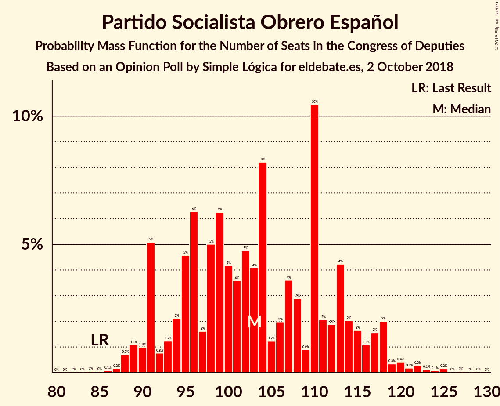
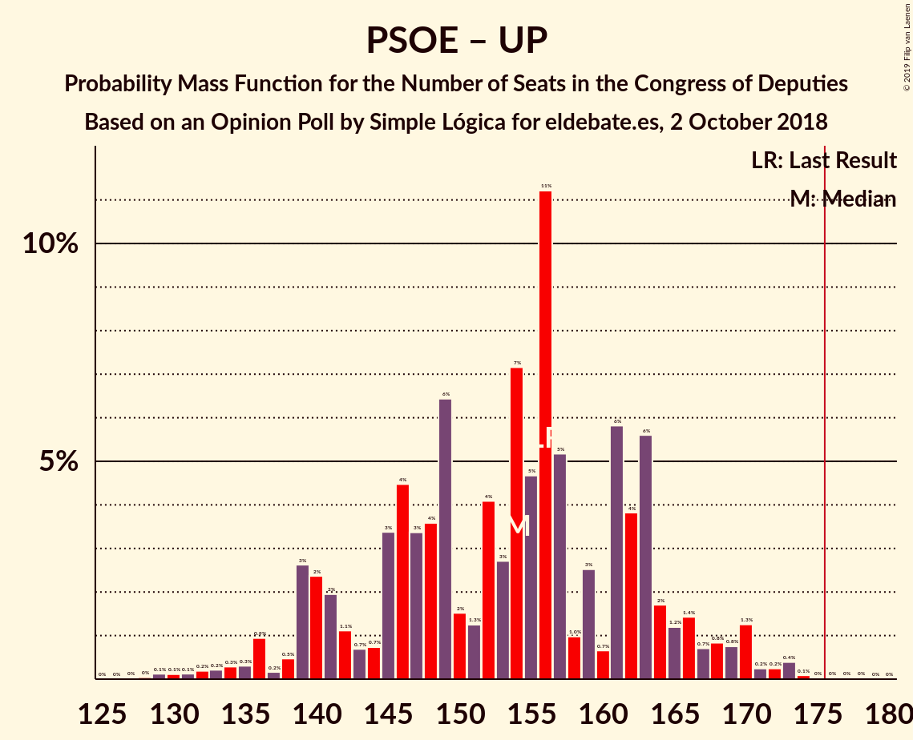

# Opinion Poll by Simple Lógica for eldebate.es, 2 October 2018

<a href="#voting-intentions">Voting Intentions</a> | <a href="#seats">Seats</a> | <a href="#coalitions">Coalitions</a> | <a href="#technical-information">Technical Information</a>

## Voting Intentions

### Confidence Intervals

| Party | Last Result | Poll Result | 80% Confidence Interval | 90% Confidence Interval | 95% Confidence Interval | 99% Confidence Interval |
|:-----:|:-----------:|:-----------:|:-----------------------:|:-----------------------:|:-----------------------:|:-----------------------:|
| Partido Socialista Obrero Español | 22.6% | 25.3% | 23.6–27.1% |23.1–27.6% |22.7–28.1% |21.9–29.0% |
| Ciudadanos–Partido de la Ciudadanía | 13.1% | 23.1% | 21.4–24.9% |21.0–25.4% |20.6–25.8% |19.8–26.7% |
| Partido Popular | 33.0% | 21.2% | 19.6–22.9% |19.2–23.4% |18.8–23.9% |18.0–24.7% |
| Unidos Podemos | 21.2% | 15.9% | 14.5–17.5% |14.1–17.9% |13.8–18.3% |13.1–19.1% |
| Partido Animalista Contra el Maltrato Animal | 1.2% | 2.2% | 1.7–2.9% |1.6–3.1% |1.4–3.3% |1.2–3.7% |
| Vox | 0.2% | 2.0% | 1.5–2.7% |1.4–2.9% |1.3–3.1% |1.1–3.4% |

*Note:* The poll result column reflects the actual value used in the calculations. Published results may vary slightly, and in addition be rounded to fewer digits.

## Seats

### Confidence Intervals

| Party | Last Result | Median | 80% Confidence Interval | 90% Confidence Interval | 95% Confidence Interval | 99% Confidence Interval |
|:-----:|:-----------:|:------:|:-----------------------:|:-----------------------:|:-----------------------:|:-----------------------:|
| <a href="#partido-socialista-obrero-español">Partido Socialista Obrero Español</a> | 85 | 67 | 66–70 |66–76 |66–78 |66–81 |
| <a href="#ciudadanos–partido-de-la-ciudadanía">Ciudadanos–Partido de la Ciudadanía</a> | 32 | 64 | 51–65 |51–68 |48–71 |47–71 |
| <a href="#partido-popular">Partido Popular</a> | 137 | 68 | 58–76 |58–76 |58–77 |47–77 |
| <a href="#unidos-podemos">Unidos Podemos</a> | 71 | 29 | 29–39 |22–39 |21–41 |21–43 |
| <a href="#partido-animalista-contra-el-maltrato-animal">Partido Animalista Contra el Maltrato Animal</a> | 0 | 1 | 1 |1 |0–1 |0–1 |
| <a href="#vox">Vox</a> | 0 | 1 | 0–1 |0–1 |0–1 |0–1 |

### Partido Socialista Obrero Español

*For a full overview of the results for this party, see the [Partido Socialista Obrero Español](party-partidosocialistaobreroespañol.html) page.*

| Number of Seats | Probability | Accumulated | Special Marks |
|:---------------:|:-----------:|:-----------:|:-------------:|
| 59 | 0% | 100% |  |
| 60 | 0% | 99.9% |  |
| 61 | 0% | 99.9% |  |
| 62 | 0.2% | 99.9% |  |
| 63 | 0% | 99.7% |  |
| 64 | 0% | 99.7% |  |
| 65 | 0% | 99.6% |  |
| 66 | 18% | 99.6% |  |
| 67 | 56% | 81% | Median |
| 68 | 4% | 25% |  |
| 69 | 0.6% | 21% |  |
| 70 | 13% | 20% |  |
| 71 | 0% | 7% |  |
| 72 | 0% | 7% |  |
| 73 | 0.2% | 7% |  |
| 74 | 0.1% | 7% |  |
| 75 | 0% | 6% |  |
| 76 | 4% | 6% |  |
| 77 | 0.1% | 3% |  |
| 78 | 0.5% | 3% |  |
| 79 | 0.4% | 2% |  |
| 80 | 0% | 2% |  |
| 81 | 2% | 2% |  |
| 82 | 0% | 0.1% |  |
| 83 | 0% | 0.1% |  |
| 84 | 0% | 0.1% |  |
| 85 | 0% | 0.1% | Last Result |
| 86 | 0% | 0.1% |  |
| 87 | 0% | 0.1% |  |
| 88 | 0% | 0.1% |  |
| 89 | 0% | 0.1% |  |
| 90 | 0% | 0.1% |  |
| 91 | 0% | 0.1% |  |
| 92 | 0% | 0% |  |

### Ciudadanos–Partido de la Ciudadanía

*For a full overview of the results for this party, see the [Ciudadanos–Partido de la Ciudadanía](party-ciudadanos–partidodelaciudadanía.html) page.*

| Number of Seats | Probability | Accumulated | Special Marks |
|:---------------:|:-----------:|:-----------:|:-------------:|
| 32 | 0% | 100% | Last Result |
| 33 | 0% | 100% |  |
| 34 | 0% | 100% |  |
| 35 | 0% | 100% |  |
| 36 | 0% | 100% |  |
| 37 | 0% | 100% |  |
| 38 | 0% | 100% |  |
| 39 | 0% | 100% |  |
| 40 | 0% | 100% |  |
| 41 | 0% | 100% |  |
| 42 | 0% | 100% |  |
| 43 | 0% | 100% |  |
| 44 | 0.2% | 100% |  |
| 45 | 0% | 99.8% |  |
| 46 | 0.1% | 99.8% |  |
| 47 | 0.4% | 99.7% |  |
| 48 | 2% | 99.3% |  |
| 49 | 0% | 97% |  |
| 50 | 1.1% | 97% |  |
| 51 | 17% | 96% |  |
| 52 | 0% | 79% |  |
| 53 | 0% | 79% |  |
| 54 | 0% | 79% |  |
| 55 | 0% | 79% |  |
| 56 | 0.1% | 79% |  |
| 57 | 0% | 79% |  |
| 58 | 0.2% | 79% |  |
| 59 | 0.1% | 79% |  |
| 60 | 0% | 79% |  |
| 61 | 0% | 79% |  |
| 62 | 9% | 79% |  |
| 63 | 10% | 70% |  |
| 64 | 49% | 60% | Median |
| 65 | 5% | 11% |  |
| 66 | 1.4% | 6% |  |
| 67 | 0% | 5% |  |
| 68 | 0.4% | 5% |  |
| 69 | 0.6% | 5% |  |
| 70 | 0.7% | 4% |  |
| 71 | 3% | 3% |  |
| 72 | 0% | 0% |  |

### Partido Popular

*For a full overview of the results for this party, see the [Partido Popular](party-partidopopular.html) page.*

| Number of Seats | Probability | Accumulated | Special Marks |
|:---------------:|:-----------:|:-----------:|:-------------:|
| 47 | 0.6% | 100% |  |
| 48 | 0.2% | 99.4% |  |
| 49 | 0% | 99.1% |  |
| 50 | 0% | 99.1% |  |
| 51 | 0% | 99.1% |  |
| 52 | 0% | 99.1% |  |
| 53 | 0% | 99.1% |  |
| 54 | 0.9% | 99.1% |  |
| 55 | 0.1% | 98% |  |
| 56 | 0% | 98% |  |
| 57 | 0% | 98% |  |
| 58 | 12% | 98% |  |
| 59 | 3% | 86% |  |
| 60 | 0.4% | 83% |  |
| 61 | 0% | 82% |  |
| 62 | 0% | 82% |  |
| 63 | 0% | 82% |  |
| 64 | 0% | 82% |  |
| 65 | 0% | 82% |  |
| 66 | 2% | 82% |  |
| 67 | 0.2% | 80% |  |
| 68 | 50% | 80% | Median |
| 69 | 8% | 29% |  |
| 70 | 0.1% | 21% |  |
| 71 | 0% | 21% |  |
| 72 | 0% | 21% |  |
| 73 | 3% | 21% |  |
| 74 | 0% | 18% |  |
| 75 | 0% | 18% |  |
| 76 | 15% | 18% |  |
| 77 | 3% | 3% |  |
| 78 | 0% | 0.1% |  |
| 79 | 0% | 0% |  |
| 80 | 0% | 0% |  |
| 81 | 0% | 0% |  |
| 82 | 0% | 0% |  |
| 83 | 0% | 0% |  |
| 84 | 0% | 0% |  |
| 85 | 0% | 0% |  |
| 86 | 0% | 0% |  |
| 87 | 0% | 0% |  |
| 88 | 0% | 0% |  |
| 89 | 0% | 0% |  |
| 90 | 0% | 0% |  |
| 91 | 0% | 0% |  |
| 92 | 0% | 0% |  |
| 93 | 0% | 0% |  |
| 94 | 0% | 0% |  |
| 95 | 0% | 0% |  |
| 96 | 0% | 0% |  |
| 97 | 0% | 0% |  |
| 98 | 0% | 0% |  |
| 99 | 0% | 0% |  |
| 100 | 0% | 0% |  |
| 101 | 0% | 0% |  |
| 102 | 0% | 0% |  |
| 103 | 0% | 0% |  |
| 104 | 0% | 0% |  |
| 105 | 0% | 0% |  |
| 106 | 0% | 0% |  |
| 107 | 0% | 0% |  |
| 108 | 0% | 0% |  |
| 109 | 0% | 0% |  |
| 110 | 0% | 0% |  |
| 111 | 0% | 0% |  |
| 112 | 0% | 0% |  |
| 113 | 0% | 0% |  |
| 114 | 0% | 0% |  |
| 115 | 0% | 0% |  |
| 116 | 0% | 0% |  |
| 117 | 0% | 0% |  |
| 118 | 0% | 0% |  |
| 119 | 0% | 0% |  |
| 120 | 0% | 0% |  |
| 121 | 0% | 0% |  |
| 122 | 0% | 0% |  |
| 123 | 0% | 0% |  |
| 124 | 0% | 0% |  |
| 125 | 0% | 0% |  |
| 126 | 0% | 0% |  |
| 127 | 0% | 0% |  |
| 128 | 0% | 0% |  |
| 129 | 0% | 0% |  |
| 130 | 0% | 0% |  |
| 131 | 0% | 0% |  |
| 132 | 0% | 0% |  |
| 133 | 0% | 0% |  |
| 134 | 0% | 0% |  |
| 135 | 0% | 0% |  |
| 136 | 0% | 0% |  |
| 137 | 0% | 0% | Last Result |

### Unidos Podemos

*For a full overview of the results for this party, see the [Unidos Podemos](party-unidospodemos.html) page.*

| Number of Seats | Probability | Accumulated | Special Marks |
|:---------------:|:-----------:|:-----------:|:-------------:|
| 21 | 4% | 100% |  |
| 22 | 3% | 96% |  |
| 23 | 0.2% | 93% |  |
| 24 | 0% | 93% |  |
| 25 | 0.3% | 93% |  |
| 26 | 0.2% | 92% |  |
| 27 | 0.8% | 92% |  |
| 28 | 0% | 91% |  |
| 29 | 58% | 91% | Median |
| 30 | 0% | 33% |  |
| 31 | 0% | 33% |  |
| 32 | 0% | 33% |  |
| 33 | 0.9% | 33% |  |
| 34 | 0% | 32% |  |
| 35 | 1.4% | 32% |  |
| 36 | 16% | 31% |  |
| 37 | 0.4% | 14% |  |
| 38 | 2% | 14% |  |
| 39 | 9% | 12% |  |
| 40 | 0% | 3% |  |
| 41 | 0% | 3% |  |
| 42 | 0% | 2% |  |
| 43 | 2% | 2% |  |
| 44 | 0.2% | 0.2% |  |
| 45 | 0% | 0% |  |
| 46 | 0% | 0% |  |
| 47 | 0% | 0% |  |
| 48 | 0% | 0% |  |
| 49 | 0% | 0% |  |
| 50 | 0% | 0% |  |
| 51 | 0% | 0% |  |
| 52 | 0% | 0% |  |
| 53 | 0% | 0% |  |
| 54 | 0% | 0% |  |
| 55 | 0% | 0% |  |
| 56 | 0% | 0% |  |
| 57 | 0% | 0% |  |
| 58 | 0% | 0% |  |
| 59 | 0% | 0% |  |
| 60 | 0% | 0% |  |
| 61 | 0% | 0% |  |
| 62 | 0% | 0% |  |
| 63 | 0% | 0% |  |
| 64 | 0% | 0% |  |
| 65 | 0% | 0% |  |
| 66 | 0% | 0% |  |
| 67 | 0% | 0% |  |
| 68 | 0% | 0% |  |
| 69 | 0% | 0% |  |
| 70 | 0% | 0% |  |
| 71 | 0% | 0% | Last Result |

### Partido Animalista Contra el Maltrato Animal

*For a full overview of the results for this party, see the [Partido Animalista Contra el Maltrato Animal](party-partidoanimalistacontraelmaltratoanimal.html) page.*

| Number of Seats | Probability | Accumulated | Special Marks |
|:---------------:|:-----------:|:-----------:|:-------------:|
| 0 | 4% | 100% | Last Result |
| 1 | 95% | 96% | Median |
| 2 | 0.4% | 0.4% |  |
| 3 | 0% | 0% |  |

### Vox

*For a full overview of the results for this party, see the [Vox](party-vox.html) page.*

| Number of Seats | Probability | Accumulated | Special Marks |
|:---------------:|:-----------:|:-----------:|:-------------:|
| 0 | 41% | 100% | Last Result |
| 1 | 59% | 59% | Median |
| 2 | 0% | 0% |  |

## Coalitions

### Confidence Intervals

| Coalition | Last Result | Median | Majority? | 80% Confidence Interval | 90% Confidence Interval | 95% Confidence Interval | 99% Confidence Interval |
|:---------:|:-----------:|:------:|:---------:|:-----------------------:|:-----------------------:|:-----------------------:|:-----------------------:|
| Partido Socialista Obrero Español – Ciudadanos–Partido de la Ciudadanía | 117 | 131 | 0% | 117–133 | 117–147 | 117–147 | 116–150 |
| Ciudadanos–Partido de la Ciudadanía – Partido Popular | 169 | 132 | 0% | 120–132 | 120–132 | 116–138 | 116–138 |
| Ciudadanos–Partido de la Ciudadanía – Partido Popular – Vox | 169 | 133 | 0% | 120–133 | 120–133 | 116–138 | 116–138 |
| Partido Socialista Obrero Español – Unidos Podemos | 156 | 96 | 0% | 96–109 | 96–109 | 90–113 | 89–114 |
| Partido Socialista Obrero Español | 85 | 67 | 0% | 66–70 | 66–76 | 66–78 | 66–81 |
| Partido Popular | 137 | 68 | 0% | 58–76 | 58–76 | 58–77 | 47–77 |
| Partido Popular – Vox | 137 | 69 | 0% | 58–76 | 58–76 | 58–77 | 47–77 |

### Partido Socialista Obrero Español – Ciudadanos–Partido de la Ciudadanía

| Number of Seats | Probability | Accumulated | Special Marks |
|:---------------:|:-----------:|:-----------:|:-------------:|
| 116 | 1.4% | 100% |  |
| 117 | 17% | 98.5% | Last Result |
| 118 | 2% | 81% |  |
| 119 | 0% | 80% |  |
| 120 | 0.1% | 79% |  |
| 121 | 0% | 79% |  |
| 122 | 0% | 79% |  |
| 123 | 0% | 79% |  |
| 124 | 0% | 79% |  |
| 125 | 0% | 79% |  |
| 126 | 0% | 79% |  |
| 127 | 0% | 79% |  |
| 128 | 0% | 79% |  |
| 129 | 0.5% | 79% |  |
| 130 | 7% | 79% |  |
| 131 | 49% | 71% | Median |
| 132 | 10% | 23% |  |
| 133 | 6% | 13% |  |
| 134 | 0.2% | 6% |  |
| 135 | 0% | 6% |  |
| 136 | 0.1% | 6% |  |
| 137 | 0% | 6% |  |
| 138 | 0% | 6% |  |
| 139 | 0% | 6% |  |
| 140 | 0% | 6% |  |
| 141 | 0% | 6% |  |
| 142 | 0% | 6% |  |
| 143 | 0% | 6% |  |
| 144 | 0% | 6% |  |
| 145 | 0.4% | 6% |  |
| 146 | 0.3% | 6% |  |
| 147 | 4% | 5% |  |
| 148 | 0.5% | 1.3% |  |
| 149 | 0.2% | 0.9% |  |
| 150 | 0.6% | 0.6% |  |
| 151 | 0% | 0% |  |

### Ciudadanos–Partido de la Ciudadanía – Partido Popular

| Number of Seats | Probability | Accumulated | Special Marks |
|:---------------:|:-----------:|:-----------:|:-------------:|
| 112 | 0.2% | 100% |  |
| 113 | 0.1% | 99.7% |  |
| 114 | 0% | 99.6% |  |
| 115 | 0% | 99.6% |  |
| 116 | 3% | 99.6% |  |
| 117 | 0.4% | 97% |  |
| 118 | 0% | 97% |  |
| 119 | 0% | 97% |  |
| 120 | 10% | 97% |  |
| 121 | 2% | 87% |  |
| 122 | 0% | 84% |  |
| 123 | 0.1% | 84% |  |
| 124 | 0.3% | 84% |  |
| 125 | 0% | 84% |  |
| 126 | 0.5% | 84% |  |
| 127 | 17% | 83% |  |
| 128 | 2% | 67% |  |
| 129 | 0.3% | 65% |  |
| 130 | 3% | 65% |  |
| 131 | 2% | 61% |  |
| 132 | 56% | 59% | Median |
| 133 | 0% | 3% |  |
| 134 | 0% | 3% |  |
| 135 | 0% | 3% |  |
| 136 | 0% | 3% |  |
| 137 | 0% | 3% |  |
| 138 | 3% | 3% |  |
| 139 | 0.1% | 0.3% |  |
| 140 | 0% | 0.2% |  |
| 141 | 0.2% | 0.2% |  |
| 142 | 0% | 0% |  |
| 143 | 0% | 0% |  |
| 144 | 0% | 0% |  |
| 145 | 0% | 0% |  |
| 146 | 0% | 0% |  |
| 147 | 0% | 0% |  |
| 148 | 0% | 0% |  |
| 149 | 0% | 0% |  |
| 150 | 0% | 0% |  |
| 151 | 0% | 0% |  |
| 152 | 0% | 0% |  |
| 153 | 0% | 0% |  |
| 154 | 0% | 0% |  |
| 155 | 0% | 0% |  |
| 156 | 0% | 0% |  |
| 157 | 0% | 0% |  |
| 158 | 0% | 0% |  |
| 159 | 0% | 0% |  |
| 160 | 0% | 0% |  |
| 161 | 0% | 0% |  |
| 162 | 0% | 0% |  |
| 163 | 0% | 0% |  |
| 164 | 0% | 0% |  |
| 165 | 0% | 0% |  |
| 166 | 0% | 0% |  |
| 167 | 0% | 0% |  |
| 168 | 0% | 0% |  |
| 169 | 0% | 0% | Last Result |

### Ciudadanos–Partido de la Ciudadanía – Partido Popular – Vox

| Number of Seats | Probability | Accumulated | Special Marks |
|:---------------:|:-----------:|:-----------:|:-------------:|
| 112 | 0.2% | 100% |  |
| 113 | 0.1% | 99.8% |  |
| 114 | 0% | 99.6% |  |
| 115 | 0% | 99.6% |  |
| 116 | 3% | 99.6% |  |
| 117 | 0.4% | 97% |  |
| 118 | 0% | 97% |  |
| 119 | 0% | 97% |  |
| 120 | 10% | 97% |  |
| 121 | 2% | 87% |  |
| 122 | 0% | 84% |  |
| 123 | 0.1% | 84% |  |
| 124 | 0.3% | 84% |  |
| 125 | 0% | 84% |  |
| 126 | 0.5% | 84% |  |
| 127 | 17% | 83% |  |
| 128 | 2% | 67% |  |
| 129 | 0.3% | 65% |  |
| 130 | 3% | 65% |  |
| 131 | 0% | 61% |  |
| 132 | 2% | 61% |  |
| 133 | 56% | 59% | Median |
| 134 | 0% | 3% |  |
| 135 | 0% | 3% |  |
| 136 | 0% | 3% |  |
| 137 | 0% | 3% |  |
| 138 | 3% | 3% |  |
| 139 | 0.1% | 0.3% |  |
| 140 | 0% | 0.2% |  |
| 141 | 0% | 0.2% |  |
| 142 | 0.2% | 0.2% |  |
| 143 | 0% | 0% |  |
| 144 | 0% | 0% |  |
| 145 | 0% | 0% |  |
| 146 | 0% | 0% |  |
| 147 | 0% | 0% |  |
| 148 | 0% | 0% |  |
| 149 | 0% | 0% |  |
| 150 | 0% | 0% |  |
| 151 | 0% | 0% |  |
| 152 | 0% | 0% |  |
| 153 | 0% | 0% |  |
| 154 | 0% | 0% |  |
| 155 | 0% | 0% |  |
| 156 | 0% | 0% |  |
| 157 | 0% | 0% |  |
| 158 | 0% | 0% |  |
| 159 | 0% | 0% |  |
| 160 | 0% | 0% |  |
| 161 | 0% | 0% |  |
| 162 | 0% | 0% |  |
| 163 | 0% | 0% |  |
| 164 | 0% | 0% |  |
| 165 | 0% | 0% |  |
| 166 | 0% | 0% |  |
| 167 | 0% | 0% |  |
| 168 | 0% | 0% |  |
| 169 | 0% | 0% | Last Result |

### Partido Socialista Obrero Español – Unidos Podemos

| Number of Seats | Probability | Accumulated | Special Marks |
|:---------------:|:-----------:|:-----------:|:-------------:|
| 85 | 0.2% | 100% |  |
| 86 | 0% | 99.8% |  |
| 87 | 0% | 99.8% |  |
| 88 | 0.1% | 99.8% |  |
| 89 | 0.7% | 99.7% |  |
| 90 | 2% | 99.0% |  |
| 91 | 0% | 97% |  |
| 92 | 0% | 97% |  |
| 93 | 0% | 97% |  |
| 94 | 0% | 97% |  |
| 95 | 0.5% | 97% |  |
| 96 | 56% | 97% | Median |
| 97 | 5% | 41% |  |
| 98 | 0.3% | 35% |  |
| 99 | 0.5% | 35% |  |
| 100 | 0% | 35% |  |
| 101 | 2% | 35% |  |
| 102 | 16% | 33% |  |
| 103 | 0.1% | 16% |  |
| 104 | 0% | 16% |  |
| 105 | 0% | 16% |  |
| 106 | 0.3% | 16% |  |
| 107 | 0.2% | 16% |  |
| 108 | 3% | 16% |  |
| 109 | 9% | 13% |  |
| 110 | 0% | 3% |  |
| 111 | 0% | 3% |  |
| 112 | 0.4% | 3% |  |
| 113 | 2% | 3% |  |
| 114 | 0.9% | 1.3% |  |
| 115 | 0% | 0.4% |  |
| 116 | 0% | 0.4% |  |
| 117 | 0.3% | 0.3% |  |
| 118 | 0% | 0% |  |
| 119 | 0% | 0% |  |
| 120 | 0% | 0% |  |
| 121 | 0% | 0% |  |
| 122 | 0% | 0% |  |
| 123 | 0% | 0% |  |
| 124 | 0% | 0% |  |
| 125 | 0% | 0% |  |
| 126 | 0% | 0% |  |
| 127 | 0% | 0% |  |
| 128 | 0% | 0% |  |
| 129 | 0% | 0% |  |
| 130 | 0% | 0% |  |
| 131 | 0% | 0% |  |
| 132 | 0% | 0% |  |
| 133 | 0% | 0% |  |
| 134 | 0% | 0% |  |
| 135 | 0% | 0% |  |
| 136 | 0% | 0% |  |
| 137 | 0% | 0% |  |
| 138 | 0% | 0% |  |
| 139 | 0% | 0% |  |
| 140 | 0% | 0% |  |
| 141 | 0% | 0% |  |
| 142 | 0% | 0% |  |
| 143 | 0% | 0% |  |
| 144 | 0% | 0% |  |
| 145 | 0% | 0% |  |
| 146 | 0% | 0% |  |
| 147 | 0% | 0% |  |
| 148 | 0% | 0% |  |
| 149 | 0% | 0% |  |
| 150 | 0% | 0% |  |
| 151 | 0% | 0% |  |
| 152 | 0% | 0% |  |
| 153 | 0% | 0% |  |
| 154 | 0% | 0% |  |
| 155 | 0% | 0% |  |
| 156 | 0% | 0% | Last Result |

### Partido Socialista Obrero Español

| Number of Seats | Probability | Accumulated | Special Marks |
|:---------------:|:-----------:|:-----------:|:-------------:|
| 59 | 0% | 100% |  |
| 60 | 0% | 99.9% |  |
| 61 | 0% | 99.9% |  |
| 62 | 0.2% | 99.9% |  |
| 63 | 0% | 99.7% |  |
| 64 | 0% | 99.7% |  |
| 65 | 0% | 99.6% |  |
| 66 | 18% | 99.6% |  |
| 67 | 56% | 81% | Median |
| 68 | 4% | 25% |  |
| 69 | 0.6% | 21% |  |
| 70 | 13% | 20% |  |
| 71 | 0% | 7% |  |
| 72 | 0% | 7% |  |
| 73 | 0.2% | 7% |  |
| 74 | 0.1% | 7% |  |
| 75 | 0% | 6% |  |
| 76 | 4% | 6% |  |
| 77 | 0.1% | 3% |  |
| 78 | 0.5% | 3% |  |
| 79 | 0.4% | 2% |  |
| 80 | 0% | 2% |  |
| 81 | 2% | 2% |  |
| 82 | 0% | 0.1% |  |
| 83 | 0% | 0.1% |  |
| 84 | 0% | 0.1% |  |
| 85 | 0% | 0.1% | Last Result |
| 86 | 0% | 0.1% |  |
| 87 | 0% | 0.1% |  |
| 88 | 0% | 0.1% |  |
| 89 | 0% | 0.1% |  |
| 90 | 0% | 0.1% |  |
| 91 | 0% | 0.1% |  |
| 92 | 0% | 0% |  |

### Partido Popular

| Number of Seats | Probability | Accumulated | Special Marks |
|:---------------:|:-----------:|:-----------:|:-------------:|
| 47 | 0.6% | 100% |  |
| 48 | 0.2% | 99.4% |  |
| 49 | 0% | 99.1% |  |
| 50 | 0% | 99.1% |  |
| 51 | 0% | 99.1% |  |
| 52 | 0% | 99.1% |  |
| 53 | 0% | 99.1% |  |
| 54 | 0.9% | 99.1% |  |
| 55 | 0.1% | 98% |  |
| 56 | 0% | 98% |  |
| 57 | 0% | 98% |  |
| 58 | 12% | 98% |  |
| 59 | 3% | 86% |  |
| 60 | 0.4% | 83% |  |
| 61 | 0% | 82% |  |
| 62 | 0% | 82% |  |
| 63 | 0% | 82% |  |
| 64 | 0% | 82% |  |
| 65 | 0% | 82% |  |
| 66 | 2% | 82% |  |
| 67 | 0.2% | 80% |  |
| 68 | 50% | 80% | Median |
| 69 | 8% | 29% |  |
| 70 | 0.1% | 21% |  |
| 71 | 0% | 21% |  |
| 72 | 0% | 21% |  |
| 73 | 3% | 21% |  |
| 74 | 0% | 18% |  |
| 75 | 0% | 18% |  |
| 76 | 15% | 18% |  |
| 77 | 3% | 3% |  |
| 78 | 0% | 0.1% |  |
| 79 | 0% | 0% |  |
| 80 | 0% | 0% |  |
| 81 | 0% | 0% |  |
| 82 | 0% | 0% |  |
| 83 | 0% | 0% |  |
| 84 | 0% | 0% |  |
| 85 | 0% | 0% |  |
| 86 | 0% | 0% |  |
| 87 | 0% | 0% |  |
| 88 | 0% | 0% |  |
| 89 | 0% | 0% |  |
| 90 | 0% | 0% |  |
| 91 | 0% | 0% |  |
| 92 | 0% | 0% |  |
| 93 | 0% | 0% |  |
| 94 | 0% | 0% |  |
| 95 | 0% | 0% |  |
| 96 | 0% | 0% |  |
| 97 | 0% | 0% |  |
| 98 | 0% | 0% |  |
| 99 | 0% | 0% |  |
| 100 | 0% | 0% |  |
| 101 | 0% | 0% |  |
| 102 | 0% | 0% |  |
| 103 | 0% | 0% |  |
| 104 | 0% | 0% |  |
| 105 | 0% | 0% |  |
| 106 | 0% | 0% |  |
| 107 | 0% | 0% |  |
| 108 | 0% | 0% |  |
| 109 | 0% | 0% |  |
| 110 | 0% | 0% |  |
| 111 | 0% | 0% |  |
| 112 | 0% | 0% |  |
| 113 | 0% | 0% |  |
| 114 | 0% | 0% |  |
| 115 | 0% | 0% |  |
| 116 | 0% | 0% |  |
| 117 | 0% | 0% |  |
| 118 | 0% | 0% |  |
| 119 | 0% | 0% |  |
| 120 | 0% | 0% |  |
| 121 | 0% | 0% |  |
| 122 | 0% | 0% |  |
| 123 | 0% | 0% |  |
| 124 | 0% | 0% |  |
| 125 | 0% | 0% |  |
| 126 | 0% | 0% |  |
| 127 | 0% | 0% |  |
| 128 | 0% | 0% |  |
| 129 | 0% | 0% |  |
| 130 | 0% | 0% |  |
| 131 | 0% | 0% |  |
| 132 | 0% | 0% |  |
| 133 | 0% | 0% |  |
| 134 | 0% | 0% |  |
| 135 | 0% | 0% |  |
| 136 | 0% | 0% |  |
| 137 | 0% | 0% | Last Result |

### Partido Popular – Vox

| Number of Seats | Probability | Accumulated | Special Marks |
|:---------------:|:-----------:|:-----------:|:-------------:|
| 47 | 0.6% | 100% |  |
| 48 | 0.2% | 99.4% |  |
| 49 | 0% | 99.1% |  |
| 50 | 0% | 99.1% |  |
| 51 | 0% | 99.1% |  |
| 52 | 0% | 99.1% |  |
| 53 | 0% | 99.1% |  |
| 54 | 0.9% | 99.1% |  |
| 55 | 0.1% | 98% |  |
| 56 | 0% | 98% |  |
| 57 | 0% | 98% |  |
| 58 | 12% | 98% |  |
| 59 | 3% | 86% |  |
| 60 | 0.4% | 83% |  |
| 61 | 0% | 82% |  |
| 62 | 0% | 82% |  |
| 63 | 0% | 82% |  |
| 64 | 0% | 82% |  |
| 65 | 0% | 82% |  |
| 66 | 0% | 82% |  |
| 67 | 2% | 82% |  |
| 68 | 2% | 80% |  |
| 69 | 49% | 78% | Median |
| 70 | 8% | 29% |  |
| 71 | 0% | 21% |  |
| 72 | 0% | 21% |  |
| 73 | 3% | 21% |  |
| 74 | 0.2% | 18% |  |
| 75 | 0% | 18% |  |
| 76 | 15% | 18% |  |
| 77 | 3% | 3% |  |
| 78 | 0% | 0.1% |  |
| 79 | 0% | 0% |  |
| 80 | 0% | 0% |  |
| 81 | 0% | 0% |  |
| 82 | 0% | 0% |  |
| 83 | 0% | 0% |  |
| 84 | 0% | 0% |  |
| 85 | 0% | 0% |  |
| 86 | 0% | 0% |  |
| 87 | 0% | 0% |  |
| 88 | 0% | 0% |  |
| 89 | 0% | 0% |  |
| 90 | 0% | 0% |  |
| 91 | 0% | 0% |  |
| 92 | 0% | 0% |  |
| 93 | 0% | 0% |  |
| 94 | 0% | 0% |  |
| 95 | 0% | 0% |  |
| 96 | 0% | 0% |  |
| 97 | 0% | 0% |  |
| 98 | 0% | 0% |  |
| 99 | 0% | 0% |  |
| 100 | 0% | 0% |  |
| 101 | 0% | 0% |  |
| 102 | 0% | 0% |  |
| 103 | 0% | 0% |  |
| 104 | 0% | 0% |  |
| 105 | 0% | 0% |  |
| 106 | 0% | 0% |  |
| 107 | 0% | 0% |  |
| 108 | 0% | 0% |  |
| 109 | 0% | 0% |  |
| 110 | 0% | 0% |  |
| 111 | 0% | 0% |  |
| 112 | 0% | 0% |  |
| 113 | 0% | 0% |  |
| 114 | 0% | 0% |  |
| 115 | 0% | 0% |  |
| 116 | 0% | 0% |  |
| 117 | 0% | 0% |  |
| 118 | 0% | 0% |  |
| 119 | 0% | 0% |  |
| 120 | 0% | 0% |  |
| 121 | 0% | 0% |  |
| 122 | 0% | 0% |  |
| 123 | 0% | 0% |  |
| 124 | 0% | 0% |  |
| 125 | 0% | 0% |  |
| 126 | 0% | 0% |  |
| 127 | 0% | 0% |  |
| 128 | 0% | 0% |  |
| 129 | 0% | 0% |  |
| 130 | 0% | 0% |  |
| 131 | 0% | 0% |  |
| 132 | 0% | 0% |  |
| 133 | 0% | 0% |  |
| 134 | 0% | 0% |  |
| 135 | 0% | 0% |  |
| 136 | 0% | 0% |  |
| 137 | 0% | 0% | Last Result |

## Technical Information

### Opinion Poll

+ **Polling firm:** Simple Lógica
+ **Commissioner(s):** eldebate.es
+ **Fieldwork period:** 2 October 2018

### Calculations

+ **Sample size:** 1000
+ **Simulations done:** 1,024
+ **Error estimate:** 3.08%

