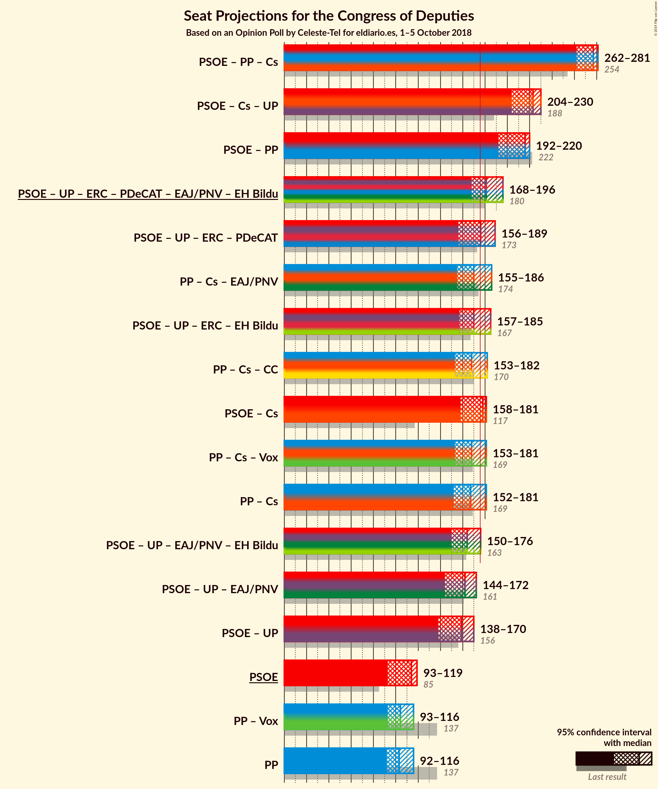
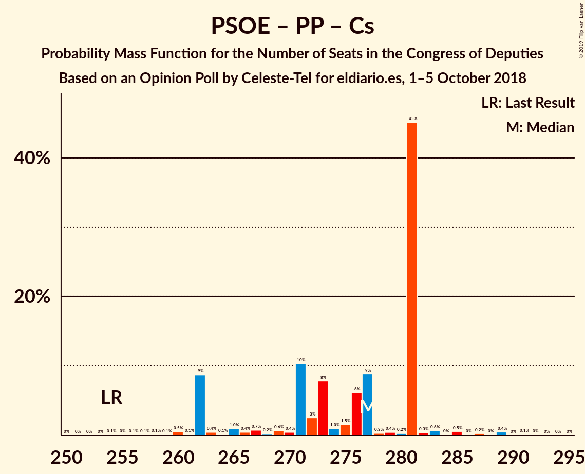
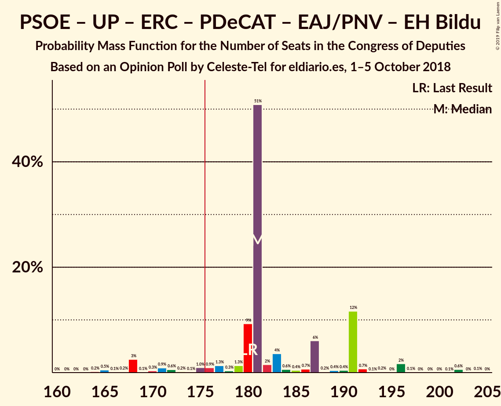
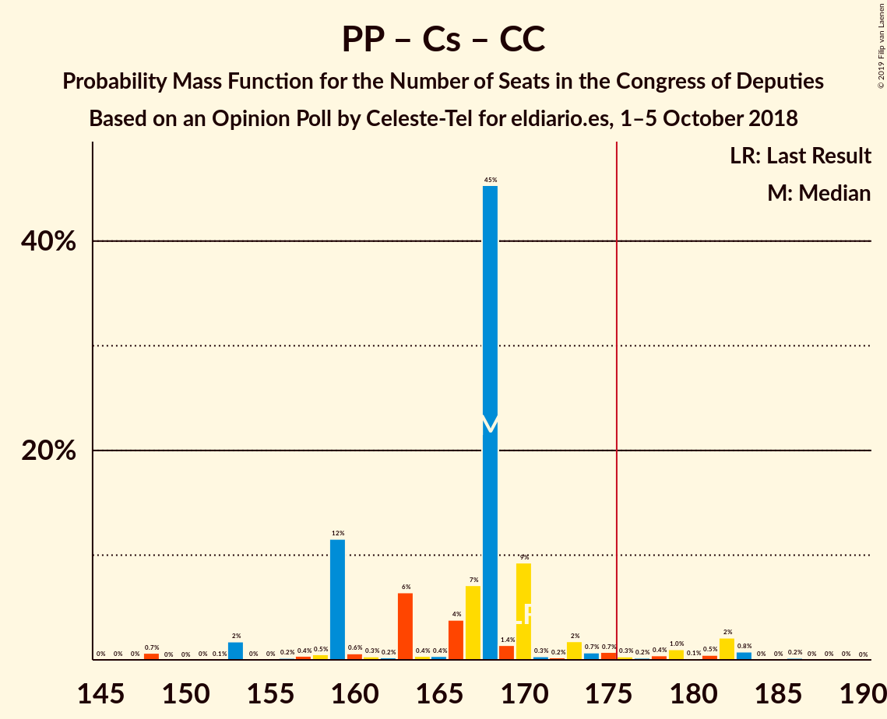
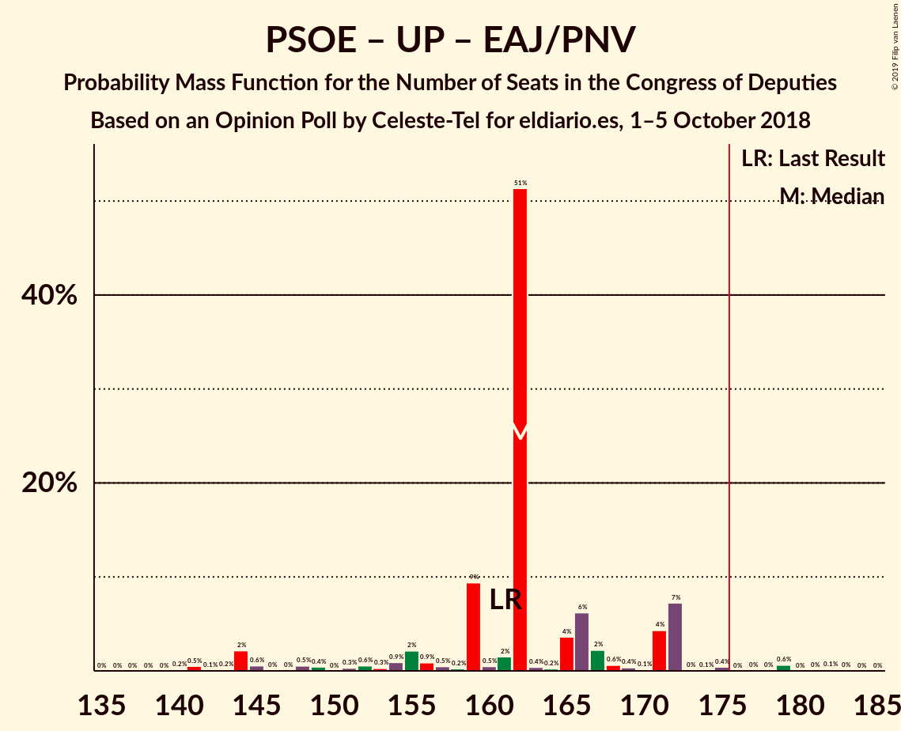
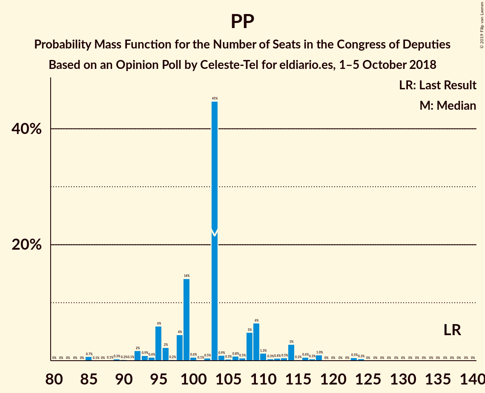

# Opinion Poll by Celeste-Tel for eldiario.es, 1–5 October 2018

<a href="#voting-intentions">Voting Intentions</a> | <a href="#seats">Seats</a> | <a href="#coalitions">Coalitions</a> | <a href="#technical-information">Technical Information</a>

## Voting Intentions

### Confidence Intervals

| Party | Last Result | Poll Result | 80% Confidence Interval | 90% Confidence Interval | 95% Confidence Interval | 99% Confidence Interval |
|:-----:|:-----------:|:-----------:|:-----------------------:|:-----------------------:|:-----------------------:|:-----------------------:|
| Partido Socialista Obrero Español | 22.6% | 27.7% | 26.0–29.5% |25.6–30.0% |25.1–30.5% |24.4–31.3% |
| Partido Popular | 33.0% | 26.3% | 24.6–28.0% |24.2–28.5% |23.7–29.0% |23.0–29.8% |
| Ciudadanos–Partido de la Ciudadanía | 13.1% | 19.3% | 17.8–20.9% |17.4–21.3% |17.0–21.7% |16.4–22.5% |
| Unidos Podemos | 21.2% | 17.4% | 16.0–18.9% |15.6–19.3% |15.2–19.7% |14.6–20.5% |
| Esquerra Republicana de Catalunya–Catalunya Sí | 2.7% | 3.0% | 2.4–3.8% |2.3–4.0% |2.1–4.2% |1.9–4.6% |
| Partit Demòcrata Europeu Català | 2.0% | 1.7% | 1.3–2.3% |1.2–2.5% |1.1–2.7% |0.9–3.0% |
| Euzko Alderdi Jeltzalea/Partido Nacionalista Vasco | 1.2% | 1.1% | 0.8–1.6% |0.7–1.8% |0.6–1.9% |0.5–2.2% |
| Vox | 0.2% | 1.0% | 0.7–1.5% |0.6–1.7% |0.6–1.8% |0.4–2.1% |
| Partido Animalista Contra el Maltrato Animal | 1.2% | 0.8% | 0.6–1.3% |0.5–1.4% |0.4–1.6% |0.3–1.8% |
| Euskal Herria Bildu | 0.8% | 0.8% | 0.6–1.3% |0.5–1.4% |0.4–1.6% |0.3–1.8% |
| Coalición Canaria–Partido Nacionalista Canario | 0.3% | 0.3% | 0.2–0.6% |0.1–0.7% |0.1–0.8% |0.1–1.0% |
| Bloque Nacionalista Galego–Nós Candidatura Galega | 0.2% | 0.2% | 0.1–0.5% |0.1–0.6% |0.0–0.7% |0.0–0.9% |

*Note:* The poll result column reflects the actual value used in the calculations. Published results may vary slightly, and in addition be rounded to fewer digits.

## Seats

### Confidence Intervals

| Party | Last Result | Median | 80% Confidence Interval | 90% Confidence Interval | 95% Confidence Interval | 99% Confidence Interval |
|:-----:|:-----------:|:------:|:-----------------------:|:-----------------------:|:-----------------------:|:-----------------------:|
| <a href="#partido-socialista-obrero-español">Partido Socialista Obrero Español</a> | 85 | 114 | 93–118 |93–119 |93–119 |91–123 |
| <a href="#partido-popular">Partido Popular</a> | 137 | 103 | 95–109 |95–114 |92–116 |85–123 |
| <a href="#ciudadanos–partido-de-la-ciudadanía">Ciudadanos–Partido de la Ciudadanía</a> | 32 | 64 | 58–70 |58–70 |58–70 |52–74 |
| <a href="#unidos-podemos">Unidos Podemos</a> | 71 | 45 | 45–59 |45–62 |40–62 |36–64 |
| <a href="#esquerra-republicana-de-catalunya–catalunya-sí">Esquerra Republicana de Catalunya–Catalunya Sí</a> | 9 | 9 | 9–14 |8–14 |8–15 |7–15 |
| <a href="#partit-demòcrata-europeu-català">Partit Demòcrata Europeu Català</a> | 8 | 8 | 5–8 |4–8 |3–8 |3–11 |
| <a href="#euzko-alderdi-jeltzalea/partido-nacionalista-vasco">Euzko Alderdi Jeltzalea/Partido Nacionalista Vasco</a> | 5 | 3 | 2–6 |2–7 |2–7 |2–8 |
| <a href="#vox">Vox</a> | 0 | 1 | 0–1 |0–1 |0–1 |0–1 |
| <a href="#partido-animalista-contra-el-maltrato-animal">Partido Animalista Contra el Maltrato Animal</a> | 0 | 0 | 0 |0 |0 |0 |
| <a href="#euskal-herria-bildu">Euskal Herria Bildu</a> | 2 | 2 | 2–5 |1–6 |1–6 |1–7 |
| <a href="#coalición-canaria–partido-nacionalista-canario">Coalición Canaria–Partido Nacionalista Canario</a> | 1 | 1 | 0–2 |0–2 |0–2 |0–3 |
| <a href="#bloque-nacionalista-galego–nós-candidatura-galega">Bloque Nacionalista Galego–Nós Candidatura Galega</a> | 0 | 0 | 0 |0–2 |0–2 |0–2 |

### Partido Socialista Obrero Español

*For a full overview of the results for this party, see the [Partido Socialista Obrero Español](party-partidosocialistaobreroespañol.html) page.*

| Number of Seats | Probability | Accumulated | Special Marks |
|:---------------:|:-----------:|:-----------:|:-------------:|
| 85 | 0% | 100% | Last Result |
| 86 | 0% | 100% |  |
| 87 | 0% | 100% |  |
| 88 | 0% | 100% |  |
| 89 | 0% | 100% |  |
| 90 | 0% | 99.9% |  |
| 91 | 2% | 99.9% |  |
| 92 | 0% | 98% |  |
| 93 | 9% | 98% |  |
| 94 | 0.4% | 89% |  |
| 95 | 0.9% | 88% |  |
| 96 | 1.1% | 87% |  |
| 97 | 0.2% | 86% |  |
| 98 | 0.7% | 86% |  |
| 99 | 0.3% | 85% |  |
| 100 | 0.1% | 85% |  |
| 101 | 1.2% | 85% |  |
| 102 | 0.4% | 84% |  |
| 103 | 2% | 83% |  |
| 104 | 0.1% | 81% |  |
| 105 | 3% | 81% |  |
| 106 | 7% | 78% |  |
| 107 | 0.2% | 71% |  |
| 108 | 0.5% | 71% |  |
| 109 | 2% | 70% |  |
| 110 | 0.3% | 68% |  |
| 111 | 0.4% | 68% |  |
| 112 | 0.9% | 67% |  |
| 113 | 6% | 67% |  |
| 114 | 44% | 61% | Median |
| 115 | 6% | 16% |  |
| 116 | 0.2% | 10% |  |
| 117 | 0.1% | 10% |  |
| 118 | 4% | 10% |  |
| 119 | 5% | 6% |  |
| 120 | 0% | 1.2% |  |
| 121 | 0.5% | 1.1% |  |
| 122 | 0% | 0.6% |  |
| 123 | 0.4% | 0.6% |  |
| 124 | 0.1% | 0.2% |  |
| 125 | 0% | 0.1% |  |
| 126 | 0% | 0.1% |  |
| 127 | 0% | 0.1% |  |
| 128 | 0% | 0.1% |  |
| 129 | 0% | 0% |  |

### Partido Popular

*For a full overview of the results for this party, see the [Partido Popular](party-partidopopular.html) page.*

| Number of Seats | Probability | Accumulated | Special Marks |
|:---------------:|:-----------:|:-----------:|:-------------:|
| 85 | 0.7% | 100% |  |
| 86 | 0.1% | 99.3% |  |
| 87 | 0% | 99.2% |  |
| 88 | 0.1% | 99.2% |  |
| 89 | 0.3% | 99.1% |  |
| 90 | 0.2% | 98.8% |  |
| 91 | 0.1% | 98.6% |  |
| 92 | 2% | 98% |  |
| 93 | 0.9% | 97% |  |
| 94 | 0.6% | 96% |  |
| 95 | 6% | 95% |  |
| 96 | 2% | 89% |  |
| 97 | 0.2% | 87% |  |
| 98 | 4% | 87% |  |
| 99 | 14% | 82% |  |
| 100 | 0.6% | 68% |  |
| 101 | 0.1% | 68% |  |
| 102 | 0.5% | 67% |  |
| 103 | 45% | 67% | Median |
| 104 | 0.9% | 22% |  |
| 105 | 0.3% | 21% |  |
| 106 | 0.8% | 21% |  |
| 107 | 0.5% | 20% |  |
| 108 | 5% | 20% |  |
| 109 | 6% | 15% |  |
| 110 | 1.3% | 8% |  |
| 111 | 0.3% | 7% |  |
| 112 | 0.4% | 7% |  |
| 113 | 0.5% | 6% |  |
| 114 | 3% | 6% |  |
| 115 | 0.2% | 3% |  |
| 116 | 0.6% | 3% |  |
| 117 | 0.3% | 2% |  |
| 118 | 1.0% | 2% |  |
| 119 | 0% | 1.1% |  |
| 120 | 0% | 1.0% |  |
| 121 | 0% | 1.0% |  |
| 122 | 0% | 0.9% |  |
| 123 | 0.5% | 0.9% |  |
| 124 | 0.3% | 0.4% |  |
| 125 | 0% | 0.1% |  |
| 126 | 0% | 0.1% |  |
| 127 | 0% | 0% |  |
| 128 | 0% | 0% |  |
| 129 | 0% | 0% |  |
| 130 | 0% | 0% |  |
| 131 | 0% | 0% |  |
| 132 | 0% | 0% |  |
| 133 | 0% | 0% |  |
| 134 | 0% | 0% |  |
| 135 | 0% | 0% |  |
| 136 | 0% | 0% |  |
| 137 | 0% | 0% | Last Result |

### Ciudadanos–Partido de la Ciudadanía

*For a full overview of the results for this party, see the [Ciudadanos–Partido de la Ciudadanía](party-ciudadanos–partidodelaciudadanía.html) page.*

| Number of Seats | Probability | Accumulated | Special Marks |
|:---------------:|:-----------:|:-----------:|:-------------:|
| 32 | 0% | 100% | Last Result |
| 33 | 0% | 100% |  |
| 34 | 0% | 100% |  |
| 35 | 0% | 100% |  |
| 36 | 0% | 100% |  |
| 37 | 0% | 100% |  |
| 38 | 0% | 100% |  |
| 39 | 0% | 100% |  |
| 40 | 0% | 100% |  |
| 41 | 0% | 100% |  |
| 42 | 0% | 100% |  |
| 43 | 0% | 100% |  |
| 44 | 0% | 100% |  |
| 45 | 0% | 100% |  |
| 46 | 0% | 100% |  |
| 47 | 0% | 100% |  |
| 48 | 0% | 100% |  |
| 49 | 0% | 100% |  |
| 50 | 0.3% | 99.9% |  |
| 51 | 0.1% | 99.6% |  |
| 52 | 0% | 99.5% |  |
| 53 | 0.1% | 99.5% |  |
| 54 | 0.1% | 99.4% |  |
| 55 | 0.1% | 99.4% |  |
| 56 | 0.2% | 99.3% |  |
| 57 | 0.8% | 99.1% |  |
| 58 | 12% | 98% |  |
| 59 | 6% | 87% |  |
| 60 | 4% | 81% |  |
| 61 | 6% | 77% |  |
| 62 | 4% | 71% |  |
| 63 | 1.0% | 67% |  |
| 64 | 45% | 66% | Median |
| 65 | 0.7% | 21% |  |
| 66 | 6% | 20% |  |
| 67 | 2% | 14% |  |
| 68 | 1.0% | 12% |  |
| 69 | 0.5% | 11% |  |
| 70 | 9% | 10% |  |
| 71 | 0.1% | 1.1% |  |
| 72 | 0.4% | 1.0% |  |
| 73 | 0.1% | 0.6% |  |
| 74 | 0.2% | 0.6% |  |
| 75 | 0.1% | 0.4% |  |
| 76 | 0.1% | 0.3% |  |
| 77 | 0.2% | 0.2% |  |
| 78 | 0% | 0% |  |

### Unidos Podemos

*For a full overview of the results for this party, see the [Unidos Podemos](party-unidospodemos.html) page.*

| Number of Seats | Probability | Accumulated | Special Marks |
|:---------------:|:-----------:|:-----------:|:-------------:|
| 35 | 0.5% | 100% |  |
| 36 | 0.2% | 99.5% |  |
| 37 | 0.2% | 99.3% |  |
| 38 | 0.3% | 99.1% |  |
| 39 | 0.8% | 98.8% |  |
| 40 | 1.4% | 98% |  |
| 41 | 0.7% | 97% |  |
| 42 | 0.2% | 96% |  |
| 43 | 0.1% | 96% |  |
| 44 | 0.5% | 96% |  |
| 45 | 56% | 95% | Median |
| 46 | 4% | 39% |  |
| 47 | 2% | 35% |  |
| 48 | 0.1% | 32% |  |
| 49 | 0.3% | 32% |  |
| 50 | 3% | 32% |  |
| 51 | 7% | 29% |  |
| 52 | 0.4% | 22% |  |
| 53 | 0.7% | 22% |  |
| 54 | 0.2% | 21% |  |
| 55 | 1.2% | 21% |  |
| 56 | 0.2% | 20% |  |
| 57 | 6% | 19% |  |
| 58 | 4% | 14% |  |
| 59 | 0.3% | 10% |  |
| 60 | 0.1% | 10% |  |
| 61 | 0.1% | 10% |  |
| 62 | 9% | 10% |  |
| 63 | 0.1% | 0.9% |  |
| 64 | 0.8% | 0.9% |  |
| 65 | 0% | 0.1% |  |
| 66 | 0.1% | 0.1% |  |
| 67 | 0% | 0% |  |
| 68 | 0% | 0% |  |
| 69 | 0% | 0% |  |
| 70 | 0% | 0% |  |
| 71 | 0% | 0% | Last Result |

### Esquerra Republicana de Catalunya–Catalunya Sí

*For a full overview of the results for this party, see the [Esquerra Republicana de Catalunya–Catalunya Sí](party-esquerrarepublicanadecatalunya–catalunyasí.html) page.*

| Number of Seats | Probability | Accumulated | Special Marks |
|:---------------:|:-----------:|:-----------:|:-------------:|
| 7 | 1.1% | 100% |  |
| 8 | 6% | 98.8% |  |
| 9 | 58% | 93% | Last Result, Median |
| 10 | 0.6% | 35% |  |
| 11 | 1.1% | 34% |  |
| 12 | 15% | 33% |  |
| 13 | 5% | 18% |  |
| 14 | 8% | 13% |  |
| 15 | 5% | 5% |  |
| 16 | 0.1% | 0.4% |  |
| 17 | 0.1% | 0.3% |  |
| 18 | 0.2% | 0.2% |  |
| 19 | 0% | 0% |  |

### Partit Demòcrata Europeu Català

*For a full overview of the results for this party, see the [Partit Demòcrata Europeu Català](party-partitdemòcrataeuropeucatalà.html) page.*

| Number of Seats | Probability | Accumulated | Special Marks |
|:---------------:|:-----------:|:-----------:|:-------------:|
| 1 | 0.2% | 100% |  |
| 2 | 0% | 99.8% |  |
| 3 | 4% | 99.8% |  |
| 4 | 1.5% | 95% |  |
| 5 | 5% | 94% |  |
| 6 | 15% | 89% |  |
| 7 | 10% | 74% |  |
| 8 | 62% | 64% | Last Result, Median |
| 9 | 0.3% | 1.2% |  |
| 10 | 0.3% | 0.9% |  |
| 11 | 0.1% | 0.6% |  |
| 12 | 0.5% | 0.5% |  |
| 13 | 0% | 0% |  |

### Euzko Alderdi Jeltzalea/Partido Nacionalista Vasco

*For a full overview of the results for this party, see the [Euzko Alderdi Jeltzalea/Partido Nacionalista Vasco](party-euzkoalderdijeltzaleapartidonacionalistavasco.html) page.*

| Number of Seats | Probability | Accumulated | Special Marks |
|:---------------:|:-----------:|:-----------:|:-------------:|
| 1 | 0.4% | 100% |  |
| 2 | 10% | 99.6% |  |
| 3 | 52% | 90% | Median |
| 4 | 10% | 38% |  |
| 5 | 8% | 28% | Last Result |
| 6 | 12% | 20% |  |
| 7 | 7% | 8% |  |
| 8 | 0.5% | 0.7% |  |
| 9 | 0.1% | 0.2% |  |
| 10 | 0% | 0.1% |  |
| 11 | 0% | 0% |  |

### Vox

*For a full overview of the results for this party, see the [Vox](party-vox.html) page.*

| Number of Seats | Probability | Accumulated | Special Marks |
|:---------------:|:-----------:|:-----------:|:-------------:|
| 0 | 47% | 100% | Last Result |
| 1 | 53% | 53% | Median |
| 2 | 0.2% | 0.2% |  |
| 3 | 0% | 0% |  |

### Partido Animalista Contra el Maltrato Animal

*For a full overview of the results for this party, see the [Partido Animalista Contra el Maltrato Animal](party-partidoanimalistacontraelmaltratoanimal.html) page.*

| Number of Seats | Probability | Accumulated | Special Marks |
|:---------------:|:-----------:|:-----------:|:-------------:|
| 0 | 99.8% | 100% | Last Result, Median |
| 1 | 0.2% | 0.2% |  |
| 2 | 0% | 0% |  |

### Euskal Herria Bildu

*For a full overview of the results for this party, see the [Euskal Herria Bildu](party-euskalherriabildu.html) page.*

| Number of Seats | Probability | Accumulated | Special Marks |
|:---------------:|:-----------:|:-----------:|:-------------:|
| 0 | 0.1% | 100% |  |
| 1 | 10% | 99.9% |  |
| 2 | 63% | 90% | Last Result, Median |
| 3 | 12% | 28% |  |
| 4 | 5% | 15% |  |
| 5 | 5% | 10% |  |
| 6 | 4% | 5% |  |
| 7 | 1.4% | 2% |  |
| 8 | 0% | 0.1% |  |
| 9 | 0.1% | 0.1% |  |
| 10 | 0% | 0% |  |

### Coalición Canaria–Partido Nacionalista Canario

*For a full overview of the results for this party, see the [Coalición Canaria–Partido Nacionalista Canario](party-coalicióncanaria–partidonacionalistacanario.html) page.*

| Number of Seats | Probability | Accumulated | Special Marks |
|:---------------:|:-----------:|:-----------:|:-------------:|
| 0 | 16% | 100% |  |
| 1 | 73% | 84% | Last Result, Median |
| 2 | 8% | 10% |  |
| 3 | 2% | 2% |  |
| 4 | 0.2% | 0.2% |  |
| 5 | 0% | 0% |  |

### Bloque Nacionalista Galego–Nós Candidatura Galega

*For a full overview of the results for this party, see the [Bloque Nacionalista Galego–Nós Candidatura Galega](party-bloquenacionalistagalego–nóscandidaturagalega.html) page.*

| Number of Seats | Probability | Accumulated | Special Marks |
|:---------------:|:-----------:|:-----------:|:-------------:|
| 0 | 90% | 100% | Last Result, Median |
| 1 | 0.9% | 10% |  |
| 2 | 9% | 9% |  |
| 3 | 0.1% | 0.1% |  |
| 4 | 0% | 0% |  |

## Coalitions

### Confidence Intervals

| Coalition | Last Result | Median | Majority? | 80% Confidence Interval | 90% Confidence Interval | 95% Confidence Interval | 99% Confidence Interval |
|:---------:|:-----------:|:------:|:---------:|:-----------------------:|:-----------------------:|:-----------------------:|:-----------------------:|
| Partido Socialista Obrero Español – Partido Popular – Ciudadanos–Partido de la Ciudadanía | 254 | 277 | 100% | 263–281 | 262–281 | 262–281 | 260–289 |
| Partido Socialista Obrero Español – Ciudadanos–Partido de la Ciudadanía – Unidos Podemos | 188 | 223 | 100% | 214–227 | 206–229 | 204–230 | 199–236 |
| Partido Socialista Obrero Español – Partido Popular | 222 | 216 | 100% | 198–217 | 192–217 | 192–220 | 192–229 |
| Partido Socialista Obrero Español – Unidos Podemos – Esquerra Republicana de Catalunya–Catalunya Sí – Partit Demòcrata Europeu Català – Euzko Alderdi Jeltzalea/Partido Nacionalista Vasco – Euskal Herria Bildu | 180 | 181 | 93% | 179–191 | 172–191 | 168–196 | 165–202 |
| Partido Socialista Obrero Español – Unidos Podemos – Esquerra Republicana de Catalunya–Catalunya Sí – Partit Demòcrata Europeu Català | 173 | 176 | 72% | 171–185 | 164–186 | 156–189 | 156–193 |
| Partido Popular – Ciudadanos–Partido de la Ciudadanía – Euzko Alderdi Jeltzalea/Partido Nacionalista Vasco | 174 | 170 | 9% | 161–175 | 160–182 | 155–186 | 151–187 |
| Partido Socialista Obrero Español – Unidos Podemos – Esquerra Republicana de Catalunya–Catalunya Sí – Euskal Herria Bildu | 167 | 170 | 20% | 165–181 | 161–182 | 157–185 | 154–191 |
| Partido Popular – Ciudadanos–Partido de la Ciudadanía – Coalición Canaria–Partido Nacionalista Canario | 170 | 168 | 6% | 159–170 | 159–178 | 153–182 | 148–183 |
| Partido Socialista Obrero Español – Ciudadanos–Partido de la Ciudadanía | 117 | 178 | 62% | 163–180 | 159–181 | 158–181 | 151–186 |
| Partido Popular – Ciudadanos–Partido de la Ciudadanía – Vox | 169 | 168 | 5% | 158–169 | 158–177 | 153–181 | 146–181 |
| Partido Popular – Ciudadanos–Partido de la Ciudadanía | 169 | 167 | 5% | 158–169 | 158–177 | 152–181 | 146–181 |
| Partido Socialista Obrero Español – Unidos Podemos – Euzko Alderdi Jeltzalea/Partido Nacionalista Vasco – Euskal Herria Bildu | 163 | 164 | 7% | 161–175 | 154–176 | 150–176 | 145–183 |
| Partido Socialista Obrero Español – Unidos Podemos – Euzko Alderdi Jeltzalea/Partido Nacionalista Vasco | 161 | 162 | 0.9% | 157–171 | 151–172 | 144–172 | 141–179 |
| Partido Socialista Obrero Español – Unidos Podemos | 156 | 159 | 0.1% | 154–164 | 146–170 | 138–170 | 136–174 |
| Partido Socialista Obrero Español | 85 | 114 | 0% | 93–118 | 93–119 | 93–119 | 91–123 |
| Partido Popular – Vox | 137 | 104 | 0% | 95–109 | 95–114 | 93–116 | 85–123 |
| Partido Popular | 137 | 103 | 0% | 95–109 | 95–114 | 92–116 | 85–123 |

### Partido Socialista Obrero Español – Partido Popular – Ciudadanos–Partido de la Ciudadanía

| Number of Seats | Probability | Accumulated | Special Marks |
|:---------------:|:-----------:|:-----------:|:-------------:|
| 254 | 0.1% | 100% | Last Result |
| 255 | 0% | 99.9% |  |
| 256 | 0.1% | 99.9% |  |
| 257 | 0.1% | 99.9% |  |
| 258 | 0.1% | 99.8% |  |
| 259 | 0.1% | 99.7% |  |
| 260 | 0.5% | 99.6% |  |
| 261 | 0.1% | 99.1% |  |
| 262 | 9% | 99.0% |  |
| 263 | 0.4% | 90% |  |
| 264 | 0.1% | 90% |  |
| 265 | 1.0% | 90% |  |
| 266 | 0.4% | 89% |  |
| 267 | 0.7% | 88% |  |
| 268 | 0.2% | 88% |  |
| 269 | 0.6% | 88% |  |
| 270 | 0.4% | 87% |  |
| 271 | 10% | 86% |  |
| 272 | 3% | 76% |  |
| 273 | 8% | 74% |  |
| 274 | 1.0% | 66% |  |
| 275 | 1.5% | 65% |  |
| 276 | 6% | 63% |  |
| 277 | 9% | 57% |  |
| 278 | 0.3% | 48% |  |
| 279 | 0.4% | 48% |  |
| 280 | 0.2% | 48% |  |
| 281 | 45% | 48% | Median |
| 282 | 0.3% | 2% |  |
| 283 | 0.6% | 2% |  |
| 284 | 0% | 1.4% |  |
| 285 | 0.5% | 1.4% |  |
| 286 | 0% | 0.9% |  |
| 287 | 0.2% | 0.8% |  |
| 288 | 0% | 0.6% |  |
| 289 | 0.4% | 0.6% |  |
| 290 | 0% | 0.1% |  |
| 291 | 0.1% | 0.1% |  |
| 292 | 0% | 0% |  |

### Partido Socialista Obrero Español – Ciudadanos–Partido de la Ciudadanía – Unidos Podemos

| Number of Seats | Probability | Accumulated | Special Marks |
|:---------------:|:-----------:|:-----------:|:-------------:|
| 188 | 0% | 100% | Last Result |
| 189 | 0% | 100% |  |
| 190 | 0% | 100% |  |
| 191 | 0% | 100% |  |
| 192 | 0% | 100% |  |
| 193 | 0% | 100% |  |
| 194 | 0% | 100% |  |
| 195 | 0.2% | 100% |  |
| 196 | 0% | 99.8% |  |
| 197 | 0% | 99.8% |  |
| 198 | 0.1% | 99.8% |  |
| 199 | 1.2% | 99.7% |  |
| 200 | 0.1% | 98% |  |
| 201 | 0% | 98% |  |
| 202 | 0% | 98% |  |
| 203 | 0.7% | 98% |  |
| 204 | 0.4% | 98% |  |
| 205 | 2% | 97% |  |
| 206 | 0.5% | 95% |  |
| 207 | 0.2% | 95% |  |
| 208 | 0.3% | 95% |  |
| 209 | 0.1% | 94% |  |
| 210 | 1.5% | 94% |  |
| 211 | 0.2% | 93% |  |
| 212 | 0.5% | 93% |  |
| 213 | 0.3% | 92% |  |
| 214 | 2% | 92% |  |
| 215 | 7% | 90% |  |
| 216 | 0.6% | 83% |  |
| 217 | 0.5% | 82% |  |
| 218 | 0.9% | 82% |  |
| 219 | 0.2% | 81% |  |
| 220 | 0.7% | 80% |  |
| 221 | 3% | 80% |  |
| 222 | 0.4% | 76% |  |
| 223 | 45% | 76% | Median |
| 224 | 0.1% | 31% |  |
| 225 | 13% | 31% |  |
| 226 | 8% | 18% |  |
| 227 | 0.1% | 10% |  |
| 228 | 0.1% | 10% |  |
| 229 | 7% | 10% |  |
| 230 | 0.7% | 3% |  |
| 231 | 0.4% | 2% |  |
| 232 | 0.1% | 2% |  |
| 233 | 0.1% | 2% |  |
| 234 | 0.3% | 2% |  |
| 235 | 0.7% | 1.3% |  |
| 236 | 0.1% | 0.6% |  |
| 237 | 0% | 0.5% |  |
| 238 | 0.1% | 0.5% |  |
| 239 | 0% | 0.4% |  |
| 240 | 0.1% | 0.4% |  |
| 241 | 0.3% | 0.3% |  |
| 242 | 0% | 0% |  |

### Partido Socialista Obrero Español – Partido Popular

| Number of Seats | Probability | Accumulated | Special Marks |
|:---------------:|:-----------:|:-----------:|:-------------:|
| 191 | 0% | 100% |  |
| 192 | 9% | 99.9% |  |
| 193 | 0.3% | 91% |  |
| 194 | 0.1% | 91% |  |
| 195 | 0.5% | 91% |  |
| 196 | 0.3% | 90% |  |
| 197 | 0% | 90% |  |
| 198 | 0.5% | 90% |  |
| 199 | 0.1% | 90% |  |
| 200 | 0.2% | 89% |  |
| 201 | 0.1% | 89% |  |
| 202 | 0.2% | 89% |  |
| 203 | 0.2% | 89% |  |
| 204 | 0.7% | 89% |  |
| 205 | 3% | 88% |  |
| 206 | 0.1% | 85% |  |
| 207 | 0.3% | 85% |  |
| 208 | 0.1% | 85% |  |
| 209 | 1.1% | 85% |  |
| 210 | 6% | 84% |  |
| 211 | 2% | 77% |  |
| 212 | 5% | 75% |  |
| 213 | 6% | 70% |  |
| 214 | 1.3% | 64% |  |
| 215 | 9% | 63% |  |
| 216 | 5% | 54% |  |
| 217 | 46% | 49% | Median |
| 218 | 0.1% | 3% |  |
| 219 | 0.5% | 3% |  |
| 220 | 0.4% | 3% |  |
| 221 | 0.6% | 2% |  |
| 222 | 0.3% | 2% | Last Result |
| 223 | 0.1% | 2% |  |
| 224 | 0.3% | 1.4% |  |
| 225 | 0.1% | 1.1% |  |
| 226 | 0.4% | 1.1% |  |
| 227 | 0.1% | 0.7% |  |
| 228 | 0% | 0.6% |  |
| 229 | 0.4% | 0.6% |  |
| 230 | 0.1% | 0.1% |  |
| 231 | 0% | 0% |  |

### Partido Socialista Obrero Español – Unidos Podemos – Esquerra Republicana de Catalunya–Catalunya Sí – Partit Demòcrata Europeu Català – Euzko Alderdi Jeltzalea/Partido Nacionalista Vasco – Euskal Herria Bildu

| Number of Seats | Probability | Accumulated | Special Marks |
|:---------------:|:-----------:|:-----------:|:-------------:|
| 161 | 0% | 100% |  |
| 162 | 0% | 99.9% |  |
| 163 | 0% | 99.9% |  |
| 164 | 0.2% | 99.9% |  |
| 165 | 0.5% | 99.7% |  |
| 166 | 0.1% | 99.2% |  |
| 167 | 0.2% | 99.0% |  |
| 168 | 3% | 98.9% |  |
| 169 | 0.1% | 96% |  |
| 170 | 0.3% | 96% |  |
| 171 | 0.9% | 96% |  |
| 172 | 0.6% | 95% |  |
| 173 | 0.2% | 94% |  |
| 174 | 0.1% | 94% |  |
| 175 | 1.0% | 94% |  |
| 176 | 0.9% | 93% | Majority |
| 177 | 1.3% | 92% |  |
| 178 | 0.3% | 91% |  |
| 179 | 1.3% | 91% |  |
| 180 | 9% | 89% | Last Result |
| 181 | 51% | 80% | Median |
| 182 | 2% | 29% |  |
| 183 | 4% | 28% |  |
| 184 | 0.6% | 24% |  |
| 185 | 0.4% | 23% |  |
| 186 | 0.7% | 23% |  |
| 187 | 6% | 22% |  |
| 188 | 0.2% | 16% |  |
| 189 | 0.4% | 16% |  |
| 190 | 0.4% | 16% |  |
| 191 | 12% | 15% |  |
| 192 | 0.7% | 4% |  |
| 193 | 0.1% | 3% |  |
| 194 | 0.2% | 3% |  |
| 195 | 0% | 3% |  |
| 196 | 2% | 3% |  |
| 197 | 0.1% | 0.9% |  |
| 198 | 0% | 0.8% |  |
| 199 | 0% | 0.8% |  |
| 200 | 0% | 0.8% |  |
| 201 | 0.1% | 0.8% |  |
| 202 | 0.6% | 0.7% |  |
| 203 | 0% | 0.1% |  |
| 204 | 0.1% | 0.1% |  |
| 205 | 0% | 0% |  |

### Partido Socialista Obrero Español – Unidos Podemos – Esquerra Republicana de Catalunya–Catalunya Sí – Partit Demòcrata Europeu Català

| Number of Seats | Probability | Accumulated | Special Marks |
|:---------------:|:-----------:|:-----------:|:-------------:|
| 152 | 0% | 100% |  |
| 153 | 0% | 99.9% |  |
| 154 | 0.2% | 99.9% |  |
| 155 | 0% | 99.7% |  |
| 156 | 3% | 99.7% |  |
| 157 | 0.3% | 97% |  |
| 158 | 0.4% | 97% |  |
| 159 | 0.1% | 96% |  |
| 160 | 0.3% | 96% |  |
| 161 | 0.1% | 96% |  |
| 162 | 0.7% | 96% |  |
| 163 | 0.2% | 95% |  |
| 164 | 0.3% | 95% |  |
| 165 | 1.1% | 95% |  |
| 166 | 0.5% | 94% |  |
| 167 | 0.5% | 93% |  |
| 168 | 0.4% | 93% |  |
| 169 | 1.4% | 92% |  |
| 170 | 0.3% | 91% |  |
| 171 | 1.5% | 91% |  |
| 172 | 0.3% | 89% |  |
| 173 | 0.5% | 89% | Last Result |
| 174 | 16% | 88% |  |
| 175 | 0.6% | 72% |  |
| 176 | 45% | 72% | Median, Majority |
| 177 | 0.9% | 27% |  |
| 178 | 4% | 26% |  |
| 179 | 5% | 22% |  |
| 180 | 6% | 18% |  |
| 181 | 0.4% | 12% |  |
| 182 | 0.1% | 11% |  |
| 183 | 0% | 11% |  |
| 184 | 0% | 11% |  |
| 185 | 2% | 11% |  |
| 186 | 5% | 9% |  |
| 187 | 0.3% | 3% |  |
| 188 | 0.3% | 3% |  |
| 189 | 2% | 3% |  |
| 190 | 0.1% | 0.9% |  |
| 191 | 0% | 0.8% |  |
| 192 | 0.1% | 0.8% |  |
| 193 | 0.6% | 0.7% |  |
| 194 | 0.1% | 0.1% |  |
| 195 | 0% | 0.1% |  |
| 196 | 0% | 0% |  |

### Partido Popular – Ciudadanos–Partido de la Ciudadanía – Euzko Alderdi Jeltzalea/Partido Nacionalista Vasco

| Number of Seats | Probability | Accumulated | Special Marks |
|:---------------:|:-----------:|:-----------:|:-------------:|
| 149 | 0.1% | 100% |  |
| 150 | 0.1% | 99.9% |  |
| 151 | 0.6% | 99.8% |  |
| 152 | 0% | 99.2% |  |
| 153 | 0% | 99.2% |  |
| 154 | 0% | 99.2% |  |
| 155 | 2% | 99.2% |  |
| 156 | 0% | 97% |  |
| 157 | 0.3% | 97% |  |
| 158 | 0% | 97% |  |
| 159 | 0.4% | 97% |  |
| 160 | 5% | 97% |  |
| 161 | 2% | 91% |  |
| 162 | 0.5% | 89% |  |
| 163 | 0.3% | 89% |  |
| 164 | 0.3% | 88% |  |
| 165 | 0.3% | 88% |  |
| 166 | 4% | 88% |  |
| 167 | 7% | 83% |  |
| 168 | 3% | 76% |  |
| 169 | 0.5% | 73% |  |
| 170 | 45% | 72% | Median |
| 171 | 0.3% | 27% |  |
| 172 | 7% | 27% |  |
| 173 | 9% | 20% |  |
| 174 | 0.2% | 11% | Last Result |
| 175 | 1.3% | 11% |  |
| 176 | 0.4% | 9% | Majority |
| 177 | 0.1% | 9% |  |
| 178 | 0.8% | 9% |  |
| 179 | 2% | 8% |  |
| 180 | 0.9% | 6% |  |
| 181 | 0.5% | 6% |  |
| 182 | 0.6% | 5% |  |
| 183 | 1.0% | 4% |  |
| 184 | 0.4% | 3% |  |
| 185 | 0.1% | 3% |  |
| 186 | 0.5% | 3% |  |
| 187 | 2% | 2% |  |
| 188 | 0% | 0.3% |  |
| 189 | 0% | 0.3% |  |
| 190 | 0% | 0.3% |  |
| 191 | 0% | 0.3% |  |
| 192 | 0% | 0.2% |  |
| 193 | 0.2% | 0.2% |  |
| 194 | 0% | 0% |  |

### Partido Socialista Obrero Español – Unidos Podemos – Esquerra Republicana de Catalunya–Catalunya Sí – Euskal Herria Bildu

| Number of Seats | Probability | Accumulated | Special Marks |
|:---------------:|:-----------:|:-----------:|:-------------:|
| 147 | 0% | 100% |  |
| 148 | 0% | 99.9% |  |
| 149 | 0.2% | 99.9% |  |
| 150 | 0% | 99.8% |  |
| 151 | 0% | 99.7% |  |
| 152 | 0% | 99.7% |  |
| 153 | 0% | 99.7% |  |
| 154 | 0.5% | 99.7% |  |
| 155 | 0.5% | 99.2% |  |
| 156 | 0% | 98.7% |  |
| 157 | 2% | 98.7% |  |
| 158 | 0.1% | 96% |  |
| 159 | 0.4% | 96% |  |
| 160 | 0.6% | 96% |  |
| 161 | 0.8% | 95% |  |
| 162 | 2% | 95% |  |
| 163 | 0.4% | 93% |  |
| 164 | 2% | 92% |  |
| 165 | 0.5% | 90% |  |
| 166 | 0.2% | 90% |  |
| 167 | 0.1% | 90% | Last Result |
| 168 | 7% | 90% |  |
| 169 | 9% | 83% |  |
| 170 | 44% | 74% | Median |
| 171 | 0.2% | 29% |  |
| 172 | 0.7% | 29% |  |
| 173 | 0.2% | 28% |  |
| 174 | 0.7% | 28% |  |
| 175 | 7% | 27% |  |
| 176 | 0.4% | 20% | Majority |
| 177 | 0.5% | 20% |  |
| 178 | 8% | 19% |  |
| 179 | 0.6% | 11% |  |
| 180 | 0.2% | 11% |  |
| 181 | 5% | 11% |  |
| 182 | 2% | 5% |  |
| 183 | 0.4% | 3% |  |
| 184 | 0.3% | 3% |  |
| 185 | 2% | 3% |  |
| 186 | 0% | 0.8% |  |
| 187 | 0% | 0.8% |  |
| 188 | 0% | 0.8% |  |
| 189 | 0% | 0.8% |  |
| 190 | 0% | 0.8% |  |
| 191 | 0.6% | 0.8% |  |
| 192 | 0.1% | 0.1% |  |
| 193 | 0% | 0.1% |  |
| 194 | 0% | 0% |  |

### Partido Popular – Ciudadanos–Partido de la Ciudadanía – Coalición Canaria–Partido Nacionalista Canario

| Number of Seats | Probability | Accumulated | Special Marks |
|:---------------:|:-----------:|:-----------:|:-------------:|
| 145 | 0% | 100% |  |
| 146 | 0% | 99.9% |  |
| 147 | 0% | 99.9% |  |
| 148 | 0.7% | 99.9% |  |
| 149 | 0% | 99.2% |  |
| 150 | 0% | 99.2% |  |
| 151 | 0% | 99.2% |  |
| 152 | 0.1% | 99.2% |  |
| 153 | 2% | 99.1% |  |
| 154 | 0% | 97% |  |
| 155 | 0% | 97% |  |
| 156 | 0.2% | 97% |  |
| 157 | 0.4% | 97% |  |
| 158 | 0.5% | 97% |  |
| 159 | 12% | 96% |  |
| 160 | 0.6% | 85% |  |
| 161 | 0.3% | 84% |  |
| 162 | 0.2% | 84% |  |
| 163 | 6% | 84% |  |
| 164 | 0.4% | 77% |  |
| 165 | 0.4% | 77% |  |
| 166 | 4% | 76% |  |
| 167 | 7% | 73% |  |
| 168 | 45% | 65% | Median |
| 169 | 1.4% | 20% |  |
| 170 | 9% | 19% | Last Result |
| 171 | 0.3% | 9% |  |
| 172 | 0.2% | 9% |  |
| 173 | 2% | 9% |  |
| 174 | 0.7% | 7% |  |
| 175 | 0.7% | 6% |  |
| 176 | 0.3% | 6% | Majority |
| 177 | 0.2% | 5% |  |
| 178 | 0.4% | 5% |  |
| 179 | 1.0% | 5% |  |
| 180 | 0.1% | 4% |  |
| 181 | 0.5% | 4% |  |
| 182 | 2% | 3% |  |
| 183 | 0.8% | 1.1% |  |
| 184 | 0% | 0.3% |  |
| 185 | 0% | 0.3% |  |
| 186 | 0.2% | 0.3% |  |
| 187 | 0% | 0.1% |  |
| 188 | 0% | 0.1% |  |
| 189 | 0% | 0% |  |

### Partido Socialista Obrero Español – Ciudadanos–Partido de la Ciudadanía

| Number of Seats | Probability | Accumulated | Special Marks |
|:---------------:|:-----------:|:-----------:|:-------------:|
| 117 | 0% | 100% | Last Result |
| 118 | 0% | 100% |  |
| 119 | 0% | 100% |  |
| 120 | 0% | 100% |  |
| 121 | 0% | 100% |  |
| 122 | 0% | 100% |  |
| 123 | 0% | 100% |  |
| 124 | 0% | 100% |  |
| 125 | 0% | 100% |  |
| 126 | 0% | 100% |  |
| 127 | 0% | 100% |  |
| 128 | 0% | 100% |  |
| 129 | 0% | 100% |  |
| 130 | 0% | 100% |  |
| 131 | 0% | 100% |  |
| 132 | 0% | 100% |  |
| 133 | 0% | 100% |  |
| 134 | 0% | 100% |  |
| 135 | 0% | 100% |  |
| 136 | 0% | 100% |  |
| 137 | 0% | 100% |  |
| 138 | 0% | 100% |  |
| 139 | 0% | 100% |  |
| 140 | 0% | 100% |  |
| 141 | 0% | 100% |  |
| 142 | 0% | 100% |  |
| 143 | 0% | 100% |  |
| 144 | 0% | 100% |  |
| 145 | 0% | 100% |  |
| 146 | 0% | 100% |  |
| 147 | 0% | 100% |  |
| 148 | 0.4% | 100% |  |
| 149 | 0% | 99.6% |  |
| 150 | 0% | 99.6% |  |
| 151 | 0.1% | 99.6% |  |
| 152 | 0.2% | 99.5% |  |
| 153 | 0.4% | 99.2% |  |
| 154 | 0.3% | 98.8% |  |
| 155 | 0% | 98.6% |  |
| 156 | 0.1% | 98.5% |  |
| 157 | 0.5% | 98% |  |
| 158 | 2% | 98% |  |
| 159 | 2% | 96% |  |
| 160 | 0.6% | 94% |  |
| 161 | 0.1% | 94% |  |
| 162 | 0% | 93% |  |
| 163 | 13% | 93% |  |
| 164 | 7% | 81% |  |
| 165 | 2% | 74% |  |
| 166 | 0.9% | 73% |  |
| 167 | 0.4% | 72% |  |
| 168 | 0.4% | 71% |  |
| 169 | 1.4% | 71% |  |
| 170 | 0.9% | 70% |  |
| 171 | 0.1% | 69% |  |
| 172 | 6% | 69% |  |
| 173 | 0.2% | 63% |  |
| 174 | 0.3% | 63% |  |
| 175 | 0.1% | 62% |  |
| 176 | 0.1% | 62% | Majority |
| 177 | 0.4% | 62% |  |
| 178 | 45% | 62% | Median |
| 179 | 6% | 17% |  |
| 180 | 1.2% | 11% |  |
| 181 | 8% | 10% |  |
| 182 | 0.2% | 2% |  |
| 183 | 0.5% | 2% |  |
| 184 | 0.5% | 1.1% |  |
| 185 | 0% | 0.7% |  |
| 186 | 0.2% | 0.6% |  |
| 187 | 0.2% | 0.5% |  |
| 188 | 0% | 0.3% |  |
| 189 | 0.2% | 0.3% |  |
| 190 | 0% | 0.1% |  |
| 191 | 0.1% | 0.1% |  |
| 192 | 0% | 0.1% |  |
| 193 | 0% | 0% |  |

### Partido Popular – Ciudadanos–Partido de la Ciudadanía – Vox

| Number of Seats | Probability | Accumulated | Special Marks |
|:---------------:|:-----------:|:-----------:|:-------------:|
| 145 | 0.1% | 100% |  |
| 146 | 0.6% | 99.9% |  |
| 147 | 0.1% | 99.3% |  |
| 148 | 0% | 99.2% |  |
| 149 | 0% | 99.2% |  |
| 150 | 0% | 99.2% |  |
| 151 | 0% | 99.2% |  |
| 152 | 0% | 99.2% |  |
| 153 | 2% | 99.1% |  |
| 154 | 0.2% | 97% |  |
| 155 | 0% | 97% |  |
| 156 | 0.1% | 97% |  |
| 157 | 0.7% | 97% |  |
| 158 | 8% | 96% |  |
| 159 | 5% | 89% |  |
| 160 | 0.4% | 84% |  |
| 161 | 6% | 84% |  |
| 162 | 0.5% | 78% |  |
| 163 | 0.3% | 77% |  |
| 164 | 0.2% | 77% |  |
| 165 | 1.1% | 77% |  |
| 166 | 0.8% | 76% |  |
| 167 | 10% | 75% |  |
| 168 | 46% | 65% | Median |
| 169 | 9% | 19% | Last Result |
| 170 | 0.6% | 10% |  |
| 171 | 0.4% | 9% |  |
| 172 | 2% | 9% |  |
| 173 | 0.5% | 7% |  |
| 174 | 1.0% | 7% |  |
| 175 | 0.4% | 6% |  |
| 176 | 0.2% | 5% | Majority |
| 177 | 0.4% | 5% |  |
| 178 | 1.0% | 5% |  |
| 179 | 0.1% | 4% |  |
| 180 | 0.4% | 4% |  |
| 181 | 3% | 3% |  |
| 182 | 0.2% | 0.5% |  |
| 183 | 0% | 0.3% |  |
| 184 | 0% | 0.3% |  |
| 185 | 0.2% | 0.3% |  |
| 186 | 0% | 0.1% |  |
| 187 | 0% | 0.1% |  |
| 188 | 0% | 0.1% |  |
| 189 | 0% | 0.1% |  |
| 190 | 0% | 0% |  |

### Partido Popular – Ciudadanos–Partido de la Ciudadanía

| Number of Seats | Probability | Accumulated | Special Marks |
|:---------------:|:-----------:|:-----------:|:-------------:|
| 144 | 0.1% | 100% |  |
| 145 | 0% | 99.9% |  |
| 146 | 0.7% | 99.9% |  |
| 147 | 0% | 99.2% |  |
| 148 | 0% | 99.2% |  |
| 149 | 0% | 99.2% |  |
| 150 | 0% | 99.2% |  |
| 151 | 0% | 99.2% |  |
| 152 | 2% | 99.1% |  |
| 153 | 0.1% | 97% |  |
| 154 | 0.2% | 97% |  |
| 155 | 0% | 97% |  |
| 156 | 0.4% | 97% |  |
| 157 | 0.5% | 97% |  |
| 158 | 7% | 96% |  |
| 159 | 5% | 89% |  |
| 160 | 0.3% | 84% |  |
| 161 | 6% | 84% |  |
| 162 | 0.2% | 77% |  |
| 163 | 0.3% | 77% |  |
| 164 | 0.5% | 77% |  |
| 165 | 0.9% | 76% |  |
| 166 | 4% | 76% |  |
| 167 | 51% | 71% | Median |
| 168 | 1.5% | 20% |  |
| 169 | 9% | 19% | Last Result |
| 170 | 0.7% | 10% |  |
| 171 | 0.3% | 9% |  |
| 172 | 2% | 9% |  |
| 173 | 0.4% | 7% |  |
| 174 | 0.7% | 6% |  |
| 175 | 0.5% | 6% |  |
| 176 | 0% | 5% | Majority |
| 177 | 0.5% | 5% |  |
| 178 | 1.0% | 5% |  |
| 179 | 0.1% | 4% |  |
| 180 | 0.4% | 4% |  |
| 181 | 3% | 3% |  |
| 182 | 0% | 0.3% |  |
| 183 | 0% | 0.3% |  |
| 184 | 0% | 0.3% |  |
| 185 | 0.2% | 0.3% |  |
| 186 | 0% | 0.1% |  |
| 187 | 0% | 0.1% |  |
| 188 | 0% | 0.1% |  |
| 189 | 0% | 0% |  |

### Partido Socialista Obrero Español – Unidos Podemos – Euzko Alderdi Jeltzalea/Partido Nacionalista Vasco – Euskal Herria Bildu

| Number of Seats | Probability | Accumulated | Special Marks |
|:---------------:|:-----------:|:-----------:|:-------------:|
| 144 | 0% | 100% |  |
| 145 | 0.5% | 99.9% |  |
| 146 | 0.1% | 99.4% |  |
| 147 | 0.3% | 99.4% |  |
| 148 | 0% | 99.0% |  |
| 149 | 0.3% | 99.0% |  |
| 150 | 2% | 98.7% |  |
| 151 | 0.1% | 97% |  |
| 152 | 1.0% | 97% |  |
| 153 | 0.4% | 96% |  |
| 154 | 0.6% | 95% |  |
| 155 | 0.4% | 95% |  |
| 156 | 2% | 94% |  |
| 157 | 0.3% | 92% |  |
| 158 | 0.3% | 92% |  |
| 159 | 0.5% | 92% |  |
| 160 | 0.3% | 91% |  |
| 161 | 9% | 91% |  |
| 162 | 2% | 82% |  |
| 163 | 0.7% | 80% | Last Result |
| 164 | 51% | 79% | Median |
| 165 | 0.7% | 28% |  |
| 166 | 0.5% | 27% |  |
| 167 | 6% | 27% |  |
| 168 | 4% | 20% |  |
| 169 | 0.3% | 17% |  |
| 170 | 3% | 17% |  |
| 171 | 0.4% | 14% |  |
| 172 | 0.1% | 13% |  |
| 173 | 0.1% | 13% |  |
| 174 | 0.2% | 13% |  |
| 175 | 6% | 13% |  |
| 176 | 6% | 7% | Majority |
| 177 | 0.2% | 1.4% |  |
| 178 | 0.3% | 1.2% |  |
| 179 | 0.1% | 0.9% |  |
| 180 | 0% | 0.8% |  |
| 181 | 0% | 0.8% |  |
| 182 | 0.1% | 0.8% |  |
| 183 | 0.6% | 0.7% |  |
| 184 | 0% | 0.1% |  |
| 185 | 0% | 0.1% |  |
| 186 | 0.1% | 0.1% |  |
| 187 | 0% | 0.1% |  |
| 188 | 0% | 0.1% |  |
| 189 | 0% | 0% |  |

### Partido Socialista Obrero Español – Unidos Podemos – Euzko Alderdi Jeltzalea/Partido Nacionalista Vasco

| Number of Seats | Probability | Accumulated | Special Marks |
|:---------------:|:-----------:|:-----------:|:-------------:|
| 140 | 0.2% | 100% |  |
| 141 | 0.5% | 99.8% |  |
| 142 | 0.1% | 99.3% |  |
| 143 | 0.2% | 99.2% |  |
| 144 | 2% | 99.0% |  |
| 145 | 0.6% | 97% |  |
| 146 | 0% | 96% |  |
| 147 | 0% | 96% |  |
| 148 | 0.5% | 96% |  |
| 149 | 0.4% | 96% |  |
| 150 | 0% | 95% |  |
| 151 | 0.3% | 95% |  |
| 152 | 0.6% | 95% |  |
| 153 | 0.3% | 94% |  |
| 154 | 0.9% | 94% |  |
| 155 | 2% | 93% |  |
| 156 | 0.9% | 91% |  |
| 157 | 0.5% | 90% |  |
| 158 | 0.2% | 90% |  |
| 159 | 9% | 90% |  |
| 160 | 0.5% | 80% |  |
| 161 | 2% | 80% | Last Result |
| 162 | 51% | 78% | Median |
| 163 | 0.4% | 27% |  |
| 164 | 0.2% | 26% |  |
| 165 | 4% | 26% |  |
| 166 | 6% | 22% |  |
| 167 | 2% | 16% |  |
| 168 | 0.6% | 14% |  |
| 169 | 0.4% | 13% |  |
| 170 | 0.1% | 13% |  |
| 171 | 4% | 13% |  |
| 172 | 7% | 9% |  |
| 173 | 0% | 1.4% |  |
| 174 | 0.1% | 1.4% |  |
| 175 | 0.4% | 1.3% |  |
| 176 | 0% | 0.9% | Majority |
| 177 | 0% | 0.9% |  |
| 178 | 0% | 0.9% |  |
| 179 | 0.6% | 0.8% |  |
| 180 | 0% | 0.2% |  |
| 181 | 0% | 0.2% |  |
| 182 | 0.1% | 0.2% |  |
| 183 | 0% | 0% |  |

### Partido Socialista Obrero Español – Unidos Podemos

| Number of Seats | Probability | Accumulated | Special Marks |
|:---------------:|:-----------:|:-----------:|:-------------:|
| 135 | 0% | 100% |  |
| 136 | 0.5% | 99.9% |  |
| 137 | 0.4% | 99.4% |  |
| 138 | 2% | 99.1% |  |
| 139 | 0.1% | 97% |  |
| 140 | 0.2% | 97% |  |
| 141 | 0.1% | 97% |  |
| 142 | 0.4% | 97% |  |
| 143 | 0.8% | 96% |  |
| 144 | 0.1% | 95% |  |
| 145 | 0.3% | 95% |  |
| 146 | 0.6% | 95% |  |
| 147 | 0.3% | 95% |  |
| 148 | 2% | 94% |  |
| 149 | 0.4% | 92% |  |
| 150 | 0.5% | 92% |  |
| 151 | 0.2% | 91% |  |
| 152 | 0.5% | 91% |  |
| 153 | 0.1% | 91% |  |
| 154 | 3% | 90% |  |
| 155 | 9% | 88% |  |
| 156 | 0.7% | 79% | Last Result |
| 157 | 7% | 78% |  |
| 158 | 0.9% | 72% |  |
| 159 | 44% | 71% | Median |
| 160 | 6% | 26% |  |
| 161 | 0.2% | 20% |  |
| 162 | 0.6% | 20% |  |
| 163 | 4% | 19% |  |
| 164 | 6% | 16% |  |
| 165 | 0.4% | 9% |  |
| 166 | 0.1% | 9% |  |
| 167 | 0.1% | 9% |  |
| 168 | 0% | 9% |  |
| 169 | 2% | 9% |  |
| 170 | 5% | 7% |  |
| 171 | 0.3% | 1.5% |  |
| 172 | 0% | 1.2% |  |
| 173 | 0.3% | 1.1% |  |
| 174 | 0.6% | 0.8% |  |
| 175 | 0% | 0.2% |  |
| 176 | 0% | 0.1% | Majority |
| 177 | 0% | 0.1% |  |
| 178 | 0% | 0.1% |  |
| 179 | 0.1% | 0.1% |  |
| 180 | 0% | 0% |  |

### Partido Socialista Obrero Español

| Number of Seats | Probability | Accumulated | Special Marks |
|:---------------:|:-----------:|:-----------:|:-------------:|
| 85 | 0% | 100% | Last Result |
| 86 | 0% | 100% |  |
| 87 | 0% | 100% |  |
| 88 | 0% | 100% |  |
| 89 | 0% | 100% |  |
| 90 | 0% | 99.9% |  |
| 91 | 2% | 99.9% |  |
| 92 | 0% | 98% |  |
| 93 | 9% | 98% |  |
| 94 | 0.4% | 89% |  |
| 95 | 0.9% | 88% |  |
| 96 | 1.1% | 87% |  |
| 97 | 0.2% | 86% |  |
| 98 | 0.7% | 86% |  |
| 99 | 0.3% | 85% |  |
| 100 | 0.1% | 85% |  |
| 101 | 1.2% | 85% |  |
| 102 | 0.4% | 84% |  |
| 103 | 2% | 83% |  |
| 104 | 0.1% | 81% |  |
| 105 | 3% | 81% |  |
| 106 | 7% | 78% |  |
| 107 | 0.2% | 71% |  |
| 108 | 0.5% | 71% |  |
| 109 | 2% | 70% |  |
| 110 | 0.3% | 68% |  |
| 111 | 0.4% | 68% |  |
| 112 | 0.9% | 67% |  |
| 113 | 6% | 67% |  |
| 114 | 44% | 61% | Median |
| 115 | 6% | 16% |  |
| 116 | 0.2% | 10% |  |
| 117 | 0.1% | 10% |  |
| 118 | 4% | 10% |  |
| 119 | 5% | 6% |  |
| 120 | 0% | 1.2% |  |
| 121 | 0.5% | 1.1% |  |
| 122 | 0% | 0.6% |  |
| 123 | 0.4% | 0.6% |  |
| 124 | 0.1% | 0.2% |  |
| 125 | 0% | 0.1% |  |
| 126 | 0% | 0.1% |  |
| 127 | 0% | 0.1% |  |
| 128 | 0% | 0.1% |  |
| 129 | 0% | 0% |  |

### Partido Popular – Vox

| Number of Seats | Probability | Accumulated | Special Marks |
|:---------------:|:-----------:|:-----------:|:-------------:|
| 85 | 0.6% | 100% |  |
| 86 | 0.2% | 99.4% |  |
| 87 | 0% | 99.2% |  |
| 88 | 0.1% | 99.2% |  |
| 89 | 0.3% | 99.1% |  |
| 90 | 0.1% | 98.8% |  |
| 91 | 0.2% | 98.7% |  |
| 92 | 0% | 98% |  |
| 93 | 2% | 98% |  |
| 94 | 1.3% | 97% |  |
| 95 | 6% | 95% |  |
| 96 | 2% | 89% |  |
| 97 | 0.2% | 87% |  |
| 98 | 5% | 87% |  |
| 99 | 14% | 82% |  |
| 100 | 0.5% | 68% |  |
| 101 | 0.2% | 68% |  |
| 102 | 0.4% | 68% |  |
| 103 | 0.4% | 67% |  |
| 104 | 45% | 67% | Median |
| 105 | 0.3% | 21% |  |
| 106 | 0.7% | 21% |  |
| 107 | 0.5% | 20% |  |
| 108 | 2% | 20% |  |
| 109 | 10% | 18% |  |
| 110 | 1.4% | 9% |  |
| 111 | 0.2% | 7% |  |
| 112 | 0.5% | 7% |  |
| 113 | 0.4% | 7% |  |
| 114 | 3% | 6% |  |
| 115 | 0.5% | 3% |  |
| 116 | 0.6% | 3% |  |
| 117 | 0.3% | 2% |  |
| 118 | 1.1% | 2% |  |
| 119 | 0% | 1.1% |  |
| 120 | 0% | 1.0% |  |
| 121 | 0% | 1.0% |  |
| 122 | 0% | 1.0% |  |
| 123 | 0.5% | 0.9% |  |
| 124 | 0.3% | 0.4% |  |
| 125 | 0% | 0.1% |  |
| 126 | 0% | 0.1% |  |
| 127 | 0% | 0% |  |
| 128 | 0% | 0% |  |
| 129 | 0% | 0% |  |
| 130 | 0% | 0% |  |
| 131 | 0% | 0% |  |
| 132 | 0% | 0% |  |
| 133 | 0% | 0% |  |
| 134 | 0% | 0% |  |
| 135 | 0% | 0% |  |
| 136 | 0% | 0% |  |
| 137 | 0% | 0% | Last Result |

### Partido Popular

| Number of Seats | Probability | Accumulated | Special Marks |
|:---------------:|:-----------:|:-----------:|:-------------:|
| 85 | 0.7% | 100% |  |
| 86 | 0.1% | 99.3% |  |
| 87 | 0% | 99.2% |  |
| 88 | 0.1% | 99.2% |  |
| 89 | 0.3% | 99.1% |  |
| 90 | 0.2% | 98.8% |  |
| 91 | 0.1% | 98.6% |  |
| 92 | 2% | 98% |  |
| 93 | 0.9% | 97% |  |
| 94 | 0.6% | 96% |  |
| 95 | 6% | 95% |  |
| 96 | 2% | 89% |  |
| 97 | 0.2% | 87% |  |
| 98 | 4% | 87% |  |
| 99 | 14% | 82% |  |
| 100 | 0.6% | 68% |  |
| 101 | 0.1% | 68% |  |
| 102 | 0.5% | 67% |  |
| 103 | 45% | 67% | Median |
| 104 | 0.9% | 22% |  |
| 105 | 0.3% | 21% |  |
| 106 | 0.8% | 21% |  |
| 107 | 0.5% | 20% |  |
| 108 | 5% | 20% |  |
| 109 | 6% | 15% |  |
| 110 | 1.3% | 8% |  |
| 111 | 0.3% | 7% |  |
| 112 | 0.4% | 7% |  |
| 113 | 0.5% | 6% |  |
| 114 | 3% | 6% |  |
| 115 | 0.2% | 3% |  |
| 116 | 0.6% | 3% |  |
| 117 | 0.3% | 2% |  |
| 118 | 1.0% | 2% |  |
| 119 | 0% | 1.1% |  |
| 120 | 0% | 1.0% |  |
| 121 | 0% | 1.0% |  |
| 122 | 0% | 0.9% |  |
| 123 | 0.5% | 0.9% |  |
| 124 | 0.3% | 0.4% |  |
| 125 | 0% | 0.1% |  |
| 126 | 0% | 0.1% |  |
| 127 | 0% | 0% |  |
| 128 | 0% | 0% |  |
| 129 | 0% | 0% |  |
| 130 | 0% | 0% |  |
| 131 | 0% | 0% |  |
| 132 | 0% | 0% |  |
| 133 | 0% | 0% |  |
| 134 | 0% | 0% |  |
| 135 | 0% | 0% |  |
| 136 | 0% | 0% |  |
| 137 | 0% | 0% | Last Result |

## Technical Information

### Opinion Poll

+ **Polling firm:** Celeste-Tel
+ **Commissioner(s):** eldiario.es
+ **Fieldwork period:** 1–5 October 2018

### Calculations

+ **Sample size:** 1100
+ **Simulations done:** 1,048,576
+ **Error estimate:** 3.37%

