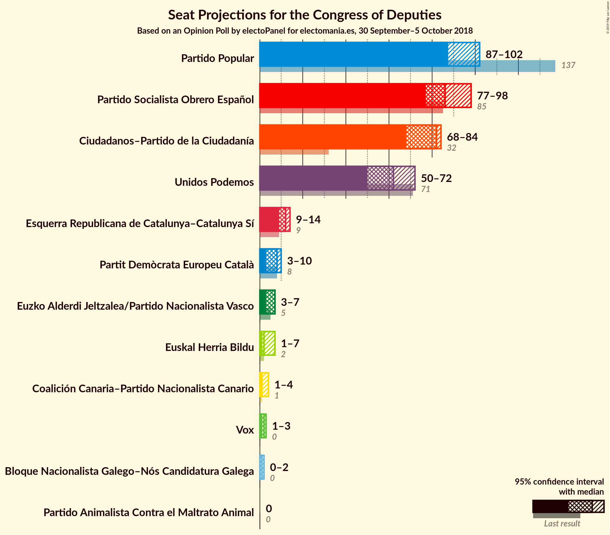
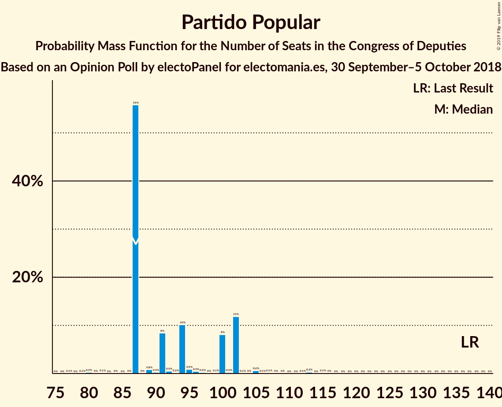
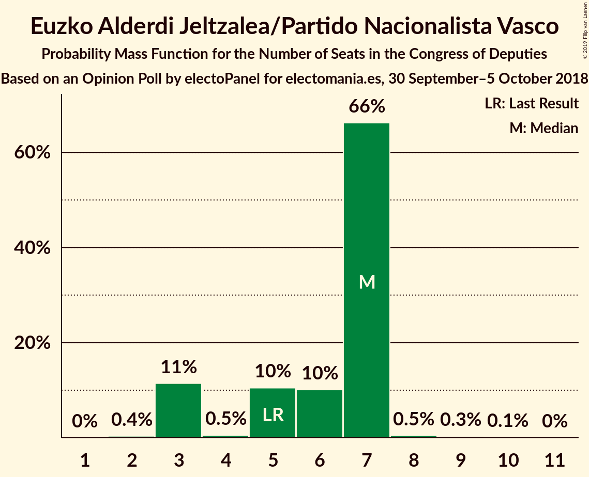
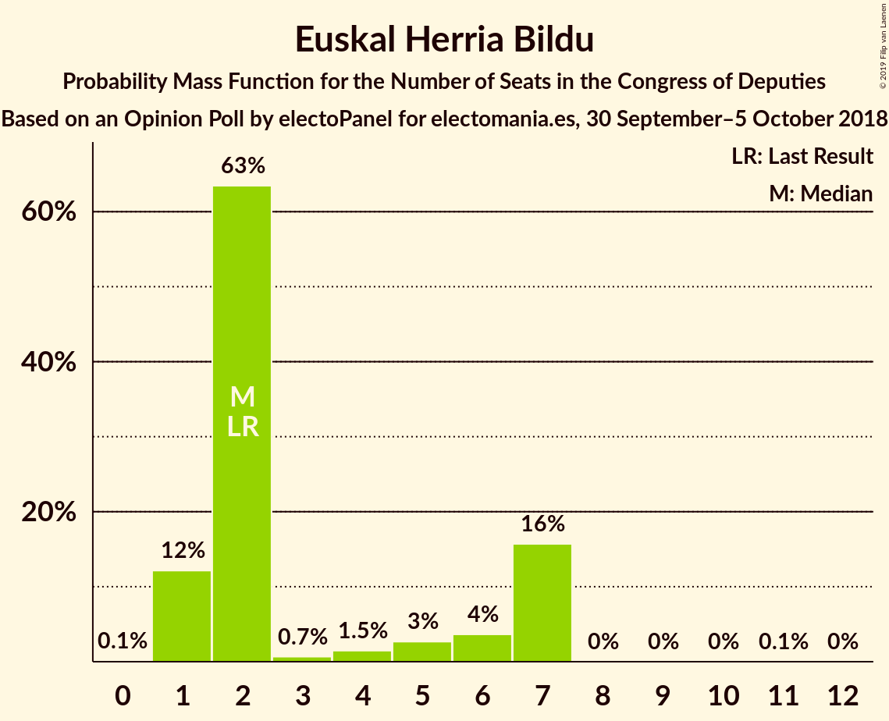
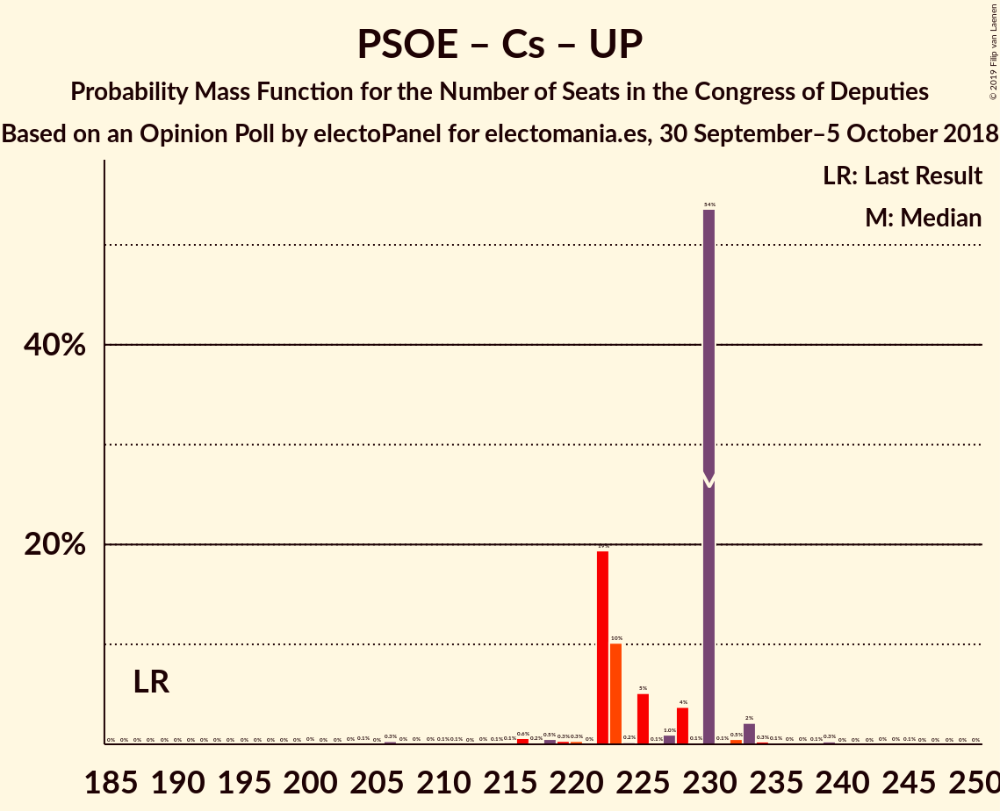
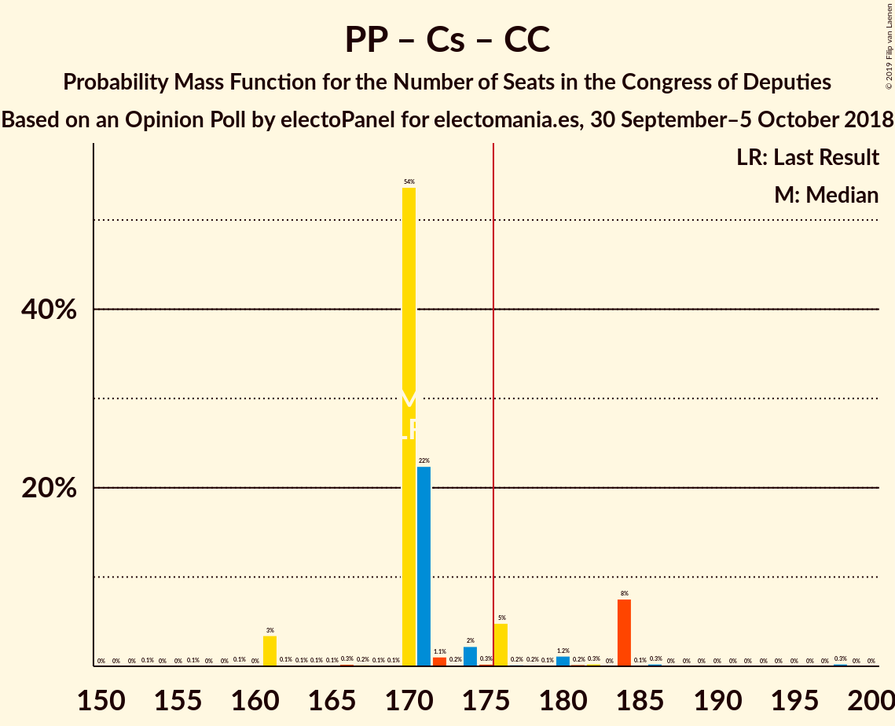
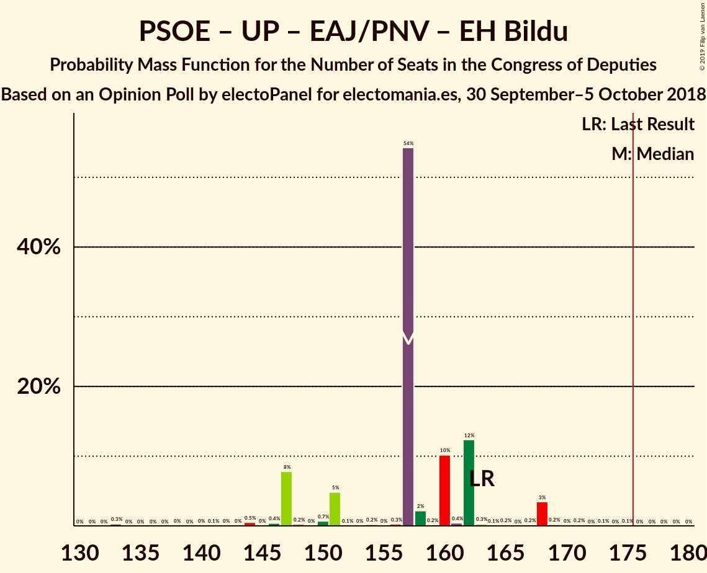
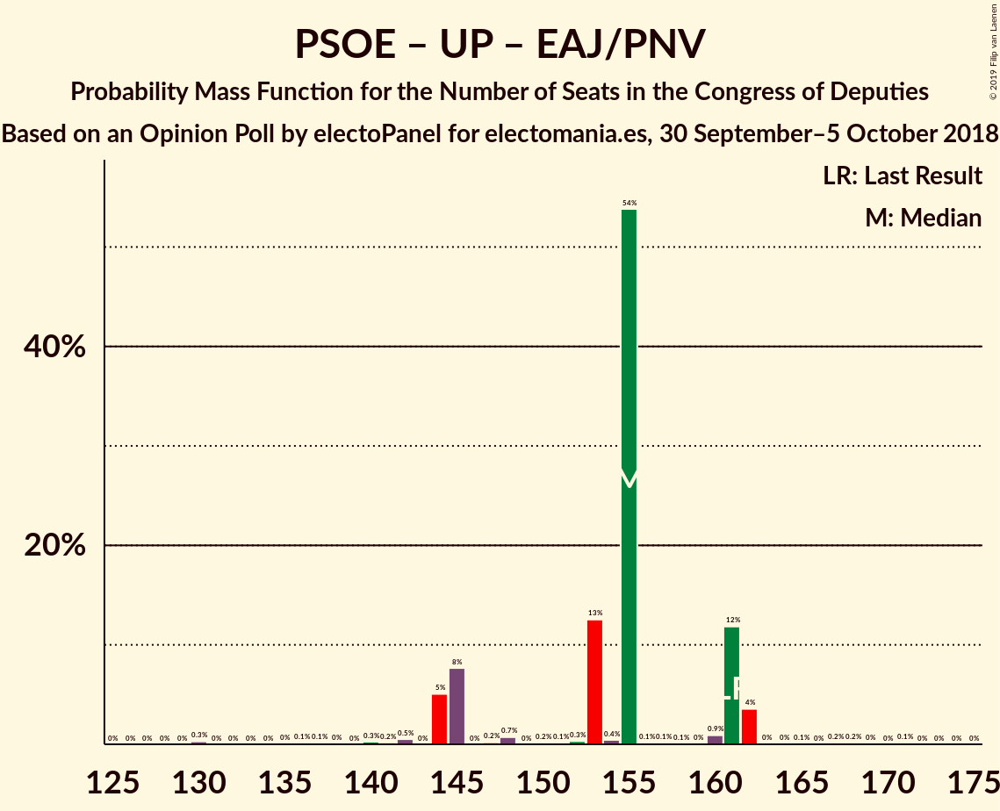

# Opinion Poll by electoPanel for electomania.es, 30 September–5 October 2018

<a href="#voting-intentions">Voting Intentions</a> | <a href="#seats">Seats</a> | <a href="#coalitions">Coalitions</a> | <a href="#technical-information">Technical Information</a>

## Voting Intentions

### Confidence Intervals

| Party | Last Result | Poll Result | 80% Confidence Interval | 90% Confidence Interval | 95% Confidence Interval | 99% Confidence Interval |
|:-----:|:-----------:|:-----------:|:-----------------------:|:-----------------------:|:-----------------------:|:-----------------------:|
| Partido Popular | 33.0% | 23.6% | 22.0–25.4% |21.5–25.9% |21.1–26.3% |20.4–27.2% |
| Partido Socialista Obrero Español | 22.6% | 22.4% | 20.8–24.1% |20.3–24.6% |19.9–25.0% |19.2–25.9% |
| Ciudadanos–Partido de la Ciudadanía | 13.1% | 22.2% | 20.6–23.9% |20.1–24.4% |19.8–24.8% |19.0–25.7% |
| Unidos Podemos | 21.2% | 18.7% | 17.2–20.3% |16.8–20.8% |16.4–21.2% |15.8–22.0% |
| Esquerra Republicana de Catalunya–Catalunya Sí | 2.7% | 3.1% | 2.5–3.9% |2.3–4.1% |2.2–4.3% |1.9–4.8% |
| Vox | 0.2% | 2.5% | 2.0–3.3% |1.8–3.5% |1.7–3.7% |1.5–4.0% |
| Partit Demòcrata Europeu Català | 2.0% | 1.5% | 1.1–2.2% |1.0–2.3% |0.9–2.5% |0.8–2.8% |
| Partido Animalista Contra el Maltrato Animal | 1.2% | 1.3% | 0.9–1.8% |0.8–2.0% |0.7–2.1% |0.6–2.5% |
| Euzko Alderdi Jeltzalea/Partido Nacionalista Vasco | 1.2% | 1.2% | 0.8–1.7% |0.7–1.9% |0.7–2.0% |0.5–2.3% |
| Euskal Herria Bildu | 0.8% | 0.8% | 0.5–1.2% |0.4–1.4% |0.4–1.5% |0.3–1.8% |
| Coalición Canaria–Partido Nacionalista Canario | 0.3% | 0.3% | 0.2–0.7% |0.1–0.7% |0.1–0.9% |0.1–1.1% |
| Bloque Nacionalista Galego–Nós Candidatura Galega | 0.2% | 0.3% | 0.2–0.7% |0.1–0.7% |0.1–0.9% |0.1–1.1% |

*Note:* The poll result column reflects the actual value used in the calculations. Published results may vary slightly, and in addition be rounded to fewer digits.

## Seats

### Confidence Intervals

| Party | Last Result | Median | 80% Confidence Interval | 90% Confidence Interval | 95% Confidence Interval | 99% Confidence Interval |
|:-----:|:-----------:|:------:|:-----------------------:|:-----------------------:|:-----------------------:|:-----------------------:|
| <a href="#partido-popular">Partido Popular</a> | 137 | 87 | 87–102 |87–102 |87–102 |82–111 |
| <a href="#partido-socialista-obrero-español">Partido Socialista Obrero Español</a> | 85 | 86 | 80–98 |77–98 |77–98 |74–98 |
| <a href="#ciudadanos–partido-de-la-ciudadanía">Ciudadanos–Partido de la Ciudadanía</a> | 32 | 82 | 68–83 |68–84 |68–84 |68–91 |
| <a href="#unidos-podemos">Unidos Podemos</a> | 71 | 62 | 50–68 |50–68 |50–72 |47–72 |
| <a href="#esquerra-republicana-de-catalunya–catalunya-sí">Esquerra Republicana de Catalunya–Catalunya Sí</a> | 9 | 12 | 9–13 |9–14 |9–14 |7–17 |
| <a href="#vox">Vox</a> | 0 | 2 | 2 |1–3 |1–3 |1–3 |
| <a href="#partit-demòcrata-europeu-català">Partit Demòcrata Europeu Català</a> | 8 | 8 | 3–8 |3–8 |3–10 |3–10 |
| <a href="#partido-animalista-contra-el-maltrato-animal">Partido Animalista Contra el Maltrato Animal</a> | 0 | 0 | 0 |0 |0 |0 |
| <a href="#euzko-alderdi-jeltzalea/partido-nacionalista-vasco">Euzko Alderdi Jeltzalea/Partido Nacionalista Vasco</a> | 5 | 7 | 3–7 |3–7 |3–7 |3–8 |
| <a href="#euskal-herria-bildu">Euskal Herria Bildu</a> | 2 | 2 | 1–7 |1–7 |1–7 |1–7 |
| <a href="#coalición-canaria–partido-nacionalista-canario">Coalición Canaria–Partido Nacionalista Canario</a> | 1 | 1 | 1–2 |1–2 |1–4 |0–4 |
| <a href="#bloque-nacionalista-galego–nós-candidatura-galega">Bloque Nacionalista Galego–Nós Candidatura Galega</a> | 0 | 1 | 0–1 |0–1 |0–2 |0–2 |

### Partido Popular

*For a full overview of the results for this party, see the [Partido Popular](party-partidopopular.html) page.*

| Number of Seats | Probability | Accumulated | Special Marks |
|:---------------:|:-----------:|:-----------:|:-------------:|
| 77 | 0.1% | 100% |  |
| 78 | 0% | 99.9% |  |
| 79 | 0.1% | 99.9% |  |
| 80 | 0.3% | 99.8% |  |
| 81 | 0% | 99.6% |  |
| 82 | 0.1% | 99.6% |  |
| 83 | 0% | 99.4% |  |
| 84 | 0% | 99.4% |  |
| 85 | 0% | 99.4% |  |
| 86 | 0% | 99.4% |  |
| 87 | 56% | 99.4% | Median |
| 88 | 0% | 44% |  |
| 89 | 0.8% | 44% |  |
| 90 | 0.3% | 43% |  |
| 91 | 8% | 42% |  |
| 92 | 0.5% | 34% |  |
| 93 | 0.2% | 34% |  |
| 94 | 10% | 33% |  |
| 95 | 0.9% | 23% |  |
| 96 | 0.5% | 22% |  |
| 97 | 0.2% | 22% |  |
| 98 | 0% | 22% |  |
| 99 | 0.1% | 22% |  |
| 100 | 8% | 22% |  |
| 101 | 0.2% | 13% |  |
| 102 | 12% | 13% |  |
| 103 | 0.1% | 1.4% |  |
| 104 | 0% | 1.3% |  |
| 105 | 0.6% | 1.3% |  |
| 106 | 0.1% | 0.7% |  |
| 107 | 0.1% | 0.6% |  |
| 108 | 0% | 0.5% |  |
| 109 | 0% | 0.5% |  |
| 110 | 0% | 0.5% |  |
| 111 | 0% | 0.5% |  |
| 112 | 0.1% | 0.5% |  |
| 113 | 0.3% | 0.4% |  |
| 114 | 0% | 0.2% |  |
| 115 | 0.1% | 0.2% |  |
| 116 | 0% | 0% |  |
| 117 | 0% | 0% |  |
| 118 | 0% | 0% |  |
| 119 | 0% | 0% |  |
| 120 | 0% | 0% |  |
| 121 | 0% | 0% |  |
| 122 | 0% | 0% |  |
| 123 | 0% | 0% |  |
| 124 | 0% | 0% |  |
| 125 | 0% | 0% |  |
| 126 | 0% | 0% |  |
| 127 | 0% | 0% |  |
| 128 | 0% | 0% |  |
| 129 | 0% | 0% |  |
| 130 | 0% | 0% |  |
| 131 | 0% | 0% |  |
| 132 | 0% | 0% |  |
| 133 | 0% | 0% |  |
| 134 | 0% | 0% |  |
| 135 | 0% | 0% |  |
| 136 | 0% | 0% |  |
| 137 | 0% | 0% | Last Result |

### Partido Socialista Obrero Español

*For a full overview of the results for this party, see the [Partido Socialista Obrero Español](party-partidosocialistaobreroespañol.html) page.*

| Number of Seats | Probability | Accumulated | Special Marks |
|:---------------:|:-----------:|:-----------:|:-------------:|
| 68 | 0.3% | 100% |  |
| 69 | 0% | 99.7% |  |
| 70 | 0% | 99.7% |  |
| 71 | 0% | 99.7% |  |
| 72 | 0% | 99.7% |  |
| 73 | 0.1% | 99.6% |  |
| 74 | 0% | 99.5% |  |
| 75 | 0% | 99.5% |  |
| 76 | 0.3% | 99.4% |  |
| 77 | 5% | 99.2% |  |
| 78 | 0.2% | 94% |  |
| 79 | 0.2% | 94% |  |
| 80 | 8% | 94% |  |
| 81 | 0.1% | 86% |  |
| 82 | 0.3% | 86% |  |
| 83 | 0.5% | 85% |  |
| 84 | 0.2% | 85% |  |
| 85 | 0% | 85% | Last Result |
| 86 | 65% | 85% | Median |
| 87 | 5% | 19% |  |
| 88 | 0.7% | 14% |  |
| 89 | 0.2% | 14% |  |
| 90 | 0% | 14% |  |
| 91 | 0% | 14% |  |
| 92 | 0.6% | 14% |  |
| 93 | 2% | 13% |  |
| 94 | 0.1% | 11% |  |
| 95 | 0% | 11% |  |
| 96 | 0% | 11% |  |
| 97 | 0.1% | 11% |  |
| 98 | 10% | 11% |  |
| 99 | 0.1% | 0.5% |  |
| 100 | 0% | 0.4% |  |
| 101 | 0% | 0.4% |  |
| 102 | 0% | 0.3% |  |
| 103 | 0% | 0.3% |  |
| 104 | 0% | 0.3% |  |
| 105 | 0% | 0.3% |  |
| 106 | 0% | 0.3% |  |
| 107 | 0% | 0.3% |  |
| 108 | 0% | 0.3% |  |
| 109 | 0% | 0.3% |  |
| 110 | 0.1% | 0.3% |  |
| 111 | 0% | 0.2% |  |
| 112 | 0.1% | 0.2% |  |
| 113 | 0.1% | 0.1% |  |
| 114 | 0% | 0% |  |

### Ciudadanos–Partido de la Ciudadanía

*For a full overview of the results for this party, see the [Ciudadanos–Partido de la Ciudadanía](party-ciudadanos–partidodelaciudadanía.html) page.*

| Number of Seats | Probability | Accumulated | Special Marks |
|:---------------:|:-----------:|:-----------:|:-------------:|
| 32 | 0% | 100% | Last Result |
| 33 | 0% | 100% |  |
| 34 | 0% | 100% |  |
| 35 | 0% | 100% |  |
| 36 | 0% | 100% |  |
| 37 | 0% | 100% |  |
| 38 | 0% | 100% |  |
| 39 | 0% | 100% |  |
| 40 | 0% | 100% |  |
| 41 | 0% | 100% |  |
| 42 | 0% | 100% |  |
| 43 | 0% | 100% |  |
| 44 | 0% | 100% |  |
| 45 | 0% | 100% |  |
| 46 | 0% | 100% |  |
| 47 | 0% | 100% |  |
| 48 | 0% | 100% |  |
| 49 | 0% | 100% |  |
| 50 | 0% | 100% |  |
| 51 | 0% | 100% |  |
| 52 | 0% | 100% |  |
| 53 | 0% | 100% |  |
| 54 | 0% | 100% |  |
| 55 | 0% | 100% |  |
| 56 | 0% | 100% |  |
| 57 | 0% | 100% |  |
| 58 | 0% | 100% |  |
| 59 | 0% | 100% |  |
| 60 | 0% | 100% |  |
| 61 | 0% | 100% |  |
| 62 | 0% | 100% |  |
| 63 | 0% | 100% |  |
| 64 | 0% | 100% |  |
| 65 | 0.1% | 100% |  |
| 66 | 0% | 99.8% |  |
| 67 | 0% | 99.8% |  |
| 68 | 12% | 99.8% |  |
| 69 | 3% | 88% |  |
| 70 | 0.5% | 85% |  |
| 71 | 0.2% | 84% |  |
| 72 | 0.6% | 84% |  |
| 73 | 1.0% | 83% |  |
| 74 | 0.7% | 82% |  |
| 75 | 11% | 82% |  |
| 76 | 0.2% | 71% |  |
| 77 | 0.2% | 71% |  |
| 78 | 0.1% | 71% |  |
| 79 | 0.1% | 70% |  |
| 80 | 0% | 70% |  |
| 81 | 0.1% | 70% |  |
| 82 | 54% | 70% | Median |
| 83 | 10% | 16% |  |
| 84 | 5% | 6% |  |
| 85 | 0% | 1.0% |  |
| 86 | 0% | 1.0% |  |
| 87 | 0.4% | 0.9% |  |
| 88 | 0% | 0.5% |  |
| 89 | 0% | 0.5% |  |
| 90 | 0% | 0.5% |  |
| 91 | 0% | 0.5% |  |
| 92 | 0.1% | 0.5% |  |
| 93 | 0% | 0.3% |  |
| 94 | 0% | 0.3% |  |
| 95 | 0% | 0.3% |  |
| 96 | 0% | 0.3% |  |
| 97 | 0% | 0.3% |  |
| 98 | 0.3% | 0.3% |  |
| 99 | 0% | 0% |  |

### Unidos Podemos

*For a full overview of the results for this party, see the [Unidos Podemos](party-unidospodemos.html) page.*

| Number of Seats | Probability | Accumulated | Special Marks |
|:---------------:|:-----------:|:-----------:|:-------------:|
| 43 | 0.1% | 100% |  |
| 44 | 0% | 99.9% |  |
| 45 | 0% | 99.9% |  |
| 46 | 0% | 99.9% |  |
| 47 | 0.6% | 99.9% |  |
| 48 | 0.1% | 99.3% |  |
| 49 | 0.1% | 99.2% |  |
| 50 | 11% | 99.1% |  |
| 51 | 0.1% | 88% |  |
| 52 | 0.1% | 88% |  |
| 53 | 0.1% | 88% |  |
| 54 | 0.1% | 88% |  |
| 55 | 0.1% | 88% |  |
| 56 | 0.2% | 88% |  |
| 57 | 3% | 88% |  |
| 58 | 0.3% | 85% |  |
| 59 | 8% | 85% |  |
| 60 | 0.2% | 77% |  |
| 61 | 0.1% | 77% |  |
| 62 | 54% | 77% | Median |
| 63 | 0.1% | 23% |  |
| 64 | 5% | 23% |  |
| 65 | 0% | 18% |  |
| 66 | 0.4% | 18% |  |
| 67 | 1.2% | 17% |  |
| 68 | 12% | 16% |  |
| 69 | 0.1% | 4% |  |
| 70 | 0% | 4% |  |
| 71 | 0.1% | 4% | Last Result |
| 72 | 4% | 4% |  |
| 73 | 0% | 0.4% |  |
| 74 | 0% | 0.4% |  |
| 75 | 0.1% | 0.4% |  |
| 76 | 0% | 0.2% |  |
| 77 | 0.2% | 0.2% |  |
| 78 | 0% | 0% |  |

### Esquerra Republicana de Catalunya–Catalunya Sí

*For a full overview of the results for this party, see the [Esquerra Republicana de Catalunya–Catalunya Sí](party-esquerrarepublicanadecatalunya–catalunyasí.html) page.*

| Number of Seats | Probability | Accumulated | Special Marks |
|:---------------:|:-----------:|:-----------:|:-------------:|
| 6 | 0.1% | 100% |  |
| 7 | 2% | 99.9% |  |
| 8 | 0% | 98% |  |
| 9 | 12% | 98% | Last Result |
| 10 | 4% | 86% |  |
| 11 | 0.4% | 82% |  |
| 12 | 56% | 82% | Median |
| 13 | 20% | 26% |  |
| 14 | 5% | 6% |  |
| 15 | 0.2% | 0.9% |  |
| 16 | 0.2% | 0.7% |  |
| 17 | 0.4% | 0.5% |  |
| 18 | 0.1% | 0.1% |  |
| 19 | 0% | 0% |  |

### Vox

*For a full overview of the results for this party, see the [Vox](party-vox.html) page.*

| Number of Seats | Probability | Accumulated | Special Marks |
|:---------------:|:-----------:|:-----------:|:-------------:|
| 0 | 0% | 100% | Last Result |
| 1 | 6% | 100% |  |
| 2 | 85% | 94% | Median |
| 3 | 9% | 9% |  |
| 4 | 0.1% | 0.1% |  |
| 5 | 0% | 0% |  |

### Partit Demòcrata Europeu Català

*For a full overview of the results for this party, see the [Partit Demòcrata Europeu Català](party-partitdemòcrataeuropeucatalà.html) page.*

| Number of Seats | Probability | Accumulated | Special Marks |
|:---------------:|:-----------:|:-----------:|:-------------:|
| 1 | 0.1% | 100% |  |
| 2 | 0.1% | 99.9% |  |
| 3 | 10% | 99.7% |  |
| 4 | 11% | 90% |  |
| 5 | 1.3% | 79% |  |
| 6 | 13% | 78% |  |
| 7 | 5% | 65% |  |
| 8 | 56% | 60% | Last Result, Median |
| 9 | 0% | 4% |  |
| 10 | 4% | 4% |  |
| 11 | 0% | 0% |  |

### Partido Animalista Contra el Maltrato Animal

*For a full overview of the results for this party, see the [Partido Animalista Contra el Maltrato Animal](party-partidoanimalistacontraelmaltratoanimal.html) page.*

| Number of Seats | Probability | Accumulated | Special Marks |
|:---------------:|:-----------:|:-----------:|:-------------:|
| 0 | 99.6% | 100% | Last Result, Median |
| 1 | 0.4% | 0.4% |  |
| 2 | 0% | 0% |  |

### Euzko Alderdi Jeltzalea/Partido Nacionalista Vasco

*For a full overview of the results for this party, see the [Euzko Alderdi Jeltzalea/Partido Nacionalista Vasco](party-euzkoalderdijeltzaleapartidonacionalistavasco.html) page.*

| Number of Seats | Probability | Accumulated | Special Marks |
|:---------------:|:-----------:|:-----------:|:-------------:|
| 2 | 0.4% | 100% |  |
| 3 | 11% | 99.6% |  |
| 4 | 0.5% | 88% |  |
| 5 | 10% | 88% | Last Result |
| 6 | 10% | 77% |  |
| 7 | 66% | 67% | Median |
| 8 | 0.5% | 0.9% |  |
| 9 | 0.3% | 0.4% |  |
| 10 | 0.1% | 0.1% |  |
| 11 | 0% | 0% |  |

### Euskal Herria Bildu

*For a full overview of the results for this party, see the [Euskal Herria Bildu](party-euskalherriabildu.html) page.*

| Number of Seats | Probability | Accumulated | Special Marks |
|:---------------:|:-----------:|:-----------:|:-------------:|
| 0 | 0.1% | 100% |  |
| 1 | 12% | 99.9% |  |
| 2 | 63% | 88% | Last Result, Median |
| 3 | 0.7% | 24% |  |
| 4 | 1.5% | 24% |  |
| 5 | 3% | 22% |  |
| 6 | 4% | 19% |  |
| 7 | 16% | 16% |  |
| 8 | 0% | 0.1% |  |
| 9 | 0% | 0.1% |  |
| 10 | 0% | 0.1% |  |
| 11 | 0.1% | 0.1% |  |
| 12 | 0% | 0% |  |

### Coalición Canaria–Partido Nacionalista Canario

*For a full overview of the results for this party, see the [Coalición Canaria–Partido Nacionalista Canario](party-coalicióncanaria–partidonacionalistacanario.html) page.*

| Number of Seats | Probability | Accumulated | Special Marks |
|:---------------:|:-----------:|:-----------:|:-------------:|
| 0 | 2% | 100% |  |
| 1 | 83% | 98% | Last Result, Median |
| 2 | 11% | 15% |  |
| 3 | 0.2% | 3% |  |
| 4 | 3% | 3% |  |
| 5 | 0% | 0% |  |

### Bloque Nacionalista Galego–Nós Candidatura Galega

*For a full overview of the results for this party, see the [Bloque Nacionalista Galego–Nós Candidatura Galega](party-bloquenacionalistagalego–nóscandidaturagalega.html) page.*

| Number of Seats | Probability | Accumulated | Special Marks |
|:---------------:|:-----------:|:-----------:|:-------------:|
| 0 | 44% | 100% | Last Result |
| 1 | 54% | 56% | Median |
| 2 | 2% | 3% |  |
| 3 | 0% | 0.3% |  |
| 4 | 0.1% | 0.3% |  |
| 5 | 0% | 0.2% |  |
| 6 | 0.2% | 0.2% |  |
| 7 | 0% | 0% |  |

## Coalitions

### Confidence Intervals

| Coalition | Last Result | Median | Majority? | 80% Confidence Interval | 90% Confidence Interval | 95% Confidence Interval | 99% Confidence Interval |
|:---------:|:-----------:|:------:|:---------:|:-----------------------:|:-----------------------:|:-----------------------:|:-----------------------:|
| Partido Popular – Partido Socialista Obrero Español – Ciudadanos–Partido de la Ciudadanía | 254 | 255 | 100% | 253–267 | 252–267 | 247–267 | 247–272 |
| Partido Socialista Obrero Español – Ciudadanos–Partido de la Ciudadanía – Unidos Podemos | 188 | 230 | 100% | 222–230 | 222–230 | 219–233 | 206–236 |
| Partido Popular – Partido Socialista Obrero Español | 222 | 173 | 40% | 173–192 | 168–192 | 168–192 | 160–197 |
| Partido Popular – Ciudadanos–Partido de la Ciudadanía – Euzko Alderdi Jeltzalea/Partido Nacionalista Vasco | 174 | 176 | 82% | 174–183 | 173–189 | 163–189 | 163–191 |
| Partido Socialista Obrero Español – Unidos Podemos – Esquerra Republicana de Catalunya–Catalunya Sí – Partit Demòcrata Europeu Català – Euzko Alderdi Jeltzalea/Partido Nacionalista Vasco – Euskal Herria Bildu | 180 | 177 | 81% | 168–177 | 163–177 | 163–188 | 161–188 |
| Partido Popular – Ciudadanos–Partido de la Ciudadanía – Vox | 169 | 171 | 15% | 171–180 | 169–186 | 161–186 | 161–187 |
| Partido Popular – Ciudadanos–Partido de la Ciudadanía – Coalición Canaria–Partido Nacionalista Canario | 170 | 170 | 15% | 170–180 | 170–184 | 161–184 | 161–186 |
| Partido Popular – Ciudadanos–Partido de la Ciudadanía | 169 | 169 | 10% | 169–178 | 168–183 | 160–183 | 160–185 |
| Partido Socialista Obrero Español – Unidos Podemos – Esquerra Republicana de Catalunya–Catalunya Sí – Partit Demòcrata Europeu Català | 173 | 168 | 4% | 159–169 | 155–169 | 155–179 | 151–179 |
| Partido Socialista Obrero Español – Ciudadanos–Partido de la Ciudadanía | 117 | 168 | 3% | 154–173 | 154–173 | 154–176 | 152–178 |
| Partido Socialista Obrero Español – Unidos Podemos – Esquerra Republicana de Catalunya–Catalunya Sí – Euskal Herria Bildu | 167 | 162 | 0.2% | 156–168 | 154–168 | 154–175 | 150–175 |
| Partido Socialista Obrero Español – Unidos Podemos – Euzko Alderdi Jeltzalea/Partido Nacionalista Vasco – Euskal Herria Bildu | 163 | 157 | 0% | 150–162 | 147–162 | 147–168 | 142–169 |
| Partido Socialista Obrero Español – Unidos Podemos – Euzko Alderdi Jeltzalea/Partido Nacionalista Vasco | 161 | 155 | 0% | 145–161 | 144–161 | 144–162 | 137–167 |
| Partido Socialista Obrero Español – Unidos Podemos | 156 | 148 | 0% | 141–154 | 139–154 | 139–159 | 132–160 |
| Partido Popular – Vox | 137 | 89 | 0% | 89–104 | 89–104 | 89–104 | 83–114 |
| Partido Popular | 137 | 87 | 0% | 87–102 | 87–102 | 87–102 | 82–111 |
| Partido Socialista Obrero Español | 85 | 86 | 0% | 80–98 | 77–98 | 77–98 | 74–98 |

### Partido Popular – Partido Socialista Obrero Español – Ciudadanos–Partido de la Ciudadanía

| Number of Seats | Probability | Accumulated | Special Marks |
|:---------------:|:-----------:|:-----------:|:-------------:|
| 246 | 0.4% | 100% |  |
| 247 | 4% | 99.6% |  |
| 248 | 0% | 96% |  |
| 249 | 0.1% | 96% |  |
| 250 | 0.2% | 96% |  |
| 251 | 0.2% | 96% |  |
| 252 | 5% | 95% |  |
| 253 | 0.3% | 90% |  |
| 254 | 0.1% | 90% | Last Result |
| 255 | 55% | 90% | Median |
| 256 | 12% | 35% |  |
| 257 | 0.1% | 24% |  |
| 258 | 0.6% | 24% |  |
| 259 | 0.6% | 23% |  |
| 260 | 0.3% | 22% |  |
| 261 | 0.4% | 22% |  |
| 262 | 0.1% | 22% |  |
| 263 | 10% | 22% |  |
| 264 | 0% | 12% |  |
| 265 | 0.1% | 12% |  |
| 266 | 0.1% | 12% |  |
| 267 | 10% | 12% |  |
| 268 | 0% | 1.4% |  |
| 269 | 0% | 1.4% |  |
| 270 | 0% | 1.4% |  |
| 271 | 0.7% | 1.4% |  |
| 272 | 0.3% | 0.7% |  |
| 273 | 0.1% | 0.4% |  |
| 274 | 0% | 0.3% |  |
| 275 | 0% | 0.3% |  |
| 276 | 0% | 0.3% |  |
| 277 | 0% | 0.3% |  |
| 278 | 0.3% | 0.3% |  |
| 279 | 0% | 0% |  |

### Partido Socialista Obrero Español – Ciudadanos–Partido de la Ciudadanía – Unidos Podemos

| Number of Seats | Probability | Accumulated | Special Marks |
|:---------------:|:-----------:|:-----------:|:-------------:|
| 188 | 0% | 100% | Last Result |
| 189 | 0% | 100% |  |
| 190 | 0% | 100% |  |
| 191 | 0% | 100% |  |
| 192 | 0% | 100% |  |
| 193 | 0% | 100% |  |
| 194 | 0% | 100% |  |
| 195 | 0% | 100% |  |
| 196 | 0% | 100% |  |
| 197 | 0% | 100% |  |
| 198 | 0% | 100% |  |
| 199 | 0% | 100% |  |
| 200 | 0% | 100% |  |
| 201 | 0% | 100% |  |
| 202 | 0% | 100% |  |
| 203 | 0% | 100% |  |
| 204 | 0.1% | 99.9% |  |
| 205 | 0% | 99.8% |  |
| 206 | 0.3% | 99.8% |  |
| 207 | 0% | 99.5% |  |
| 208 | 0% | 99.5% |  |
| 209 | 0% | 99.5% |  |
| 210 | 0.1% | 99.4% |  |
| 211 | 0.1% | 99.4% |  |
| 212 | 0% | 99.3% |  |
| 213 | 0% | 99.3% |  |
| 214 | 0.1% | 99.3% |  |
| 215 | 0.1% | 99.2% |  |
| 216 | 0.6% | 99.0% |  |
| 217 | 0.2% | 98% |  |
| 218 | 0.5% | 98% |  |
| 219 | 0.3% | 98% |  |
| 220 | 0.3% | 97% |  |
| 221 | 0% | 97% |  |
| 222 | 19% | 97% |  |
| 223 | 10% | 78% |  |
| 224 | 0.2% | 68% |  |
| 225 | 5% | 67% |  |
| 226 | 0.1% | 62% |  |
| 227 | 1.0% | 62% |  |
| 228 | 4% | 61% |  |
| 229 | 0.1% | 57% |  |
| 230 | 54% | 57% | Median |
| 231 | 0.1% | 4% |  |
| 232 | 0.5% | 4% |  |
| 233 | 2% | 3% |  |
| 234 | 0.3% | 0.9% |  |
| 235 | 0.1% | 0.7% |  |
| 236 | 0% | 0.5% |  |
| 237 | 0% | 0.5% |  |
| 238 | 0.1% | 0.5% |  |
| 239 | 0.3% | 0.4% |  |
| 240 | 0% | 0.1% |  |
| 241 | 0% | 0.1% |  |
| 242 | 0% | 0.1% |  |
| 243 | 0% | 0.1% |  |
| 244 | 0% | 0.1% |  |
| 245 | 0.1% | 0.1% |  |
| 246 | 0% | 0% |  |

### Partido Popular – Partido Socialista Obrero Español

| Number of Seats | Probability | Accumulated | Special Marks |
|:---------------:|:-----------:|:-----------:|:-------------:|
| 158 | 0% | 100% |  |
| 159 | 0.1% | 99.9% |  |
| 160 | 0.3% | 99.8% |  |
| 161 | 0% | 99.5% |  |
| 162 | 0% | 99.5% |  |
| 163 | 0% | 99.5% |  |
| 164 | 0% | 99.5% |  |
| 165 | 0% | 99.5% |  |
| 166 | 0% | 99.4% |  |
| 167 | 0% | 99.4% |  |
| 168 | 5% | 99.4% |  |
| 169 | 0% | 95% |  |
| 170 | 0.2% | 95% |  |
| 171 | 0.2% | 94% |  |
| 172 | 0% | 94% |  |
| 173 | 54% | 94% | Median |
| 174 | 0.1% | 40% |  |
| 175 | 0.1% | 40% |  |
| 176 | 0.5% | 40% | Majority |
| 177 | 0.4% | 40% |  |
| 178 | 3% | 39% |  |
| 179 | 0% | 36% |  |
| 180 | 10% | 36% |  |
| 181 | 0.1% | 25% |  |
| 182 | 0.9% | 25% |  |
| 183 | 0.5% | 24% |  |
| 184 | 0.2% | 24% |  |
| 185 | 0.1% | 24% |  |
| 186 | 0.1% | 24% |  |
| 187 | 0% | 24% |  |
| 188 | 12% | 23% |  |
| 189 | 0% | 12% |  |
| 190 | 0.2% | 12% |  |
| 191 | 0% | 12% |  |
| 192 | 10% | 12% |  |
| 193 | 0.1% | 1.3% |  |
| 194 | 0% | 1.2% |  |
| 195 | 0% | 1.2% |  |
| 196 | 0.1% | 1.2% |  |
| 197 | 0.6% | 1.1% |  |
| 198 | 0% | 0.5% |  |
| 199 | 0.2% | 0.5% |  |
| 200 | 0.3% | 0.3% |  |
| 201 | 0% | 0% |  |
| 202 | 0% | 0% |  |
| 203 | 0% | 0% |  |
| 204 | 0% | 0% |  |
| 205 | 0% | 0% |  |
| 206 | 0% | 0% |  |
| 207 | 0% | 0% |  |
| 208 | 0% | 0% |  |
| 209 | 0% | 0% |  |
| 210 | 0% | 0% |  |
| 211 | 0% | 0% |  |
| 212 | 0% | 0% |  |
| 213 | 0% | 0% |  |
| 214 | 0% | 0% |  |
| 215 | 0% | 0% |  |
| 216 | 0% | 0% |  |
| 217 | 0% | 0% |  |
| 218 | 0% | 0% |  |
| 219 | 0% | 0% |  |
| 220 | 0% | 0% |  |
| 221 | 0% | 0% |  |
| 222 | 0% | 0% | Last Result |

### Partido Popular – Ciudadanos–Partido de la Ciudadanía – Euzko Alderdi Jeltzalea/Partido Nacionalista Vasco

| Number of Seats | Probability | Accumulated | Special Marks |
|:---------------:|:-----------:|:-----------:|:-------------:|
| 158 | 0.1% | 100% |  |
| 159 | 0% | 99.9% |  |
| 160 | 0% | 99.9% |  |
| 161 | 0.1% | 99.9% |  |
| 162 | 0% | 99.8% |  |
| 163 | 4% | 99.8% |  |
| 164 | 0% | 96% |  |
| 165 | 0% | 96% |  |
| 166 | 0.4% | 96% |  |
| 167 | 0.1% | 96% |  |
| 168 | 0.2% | 96% |  |
| 169 | 0% | 96% |  |
| 170 | 0% | 96% |  |
| 171 | 0.1% | 96% |  |
| 172 | 0.2% | 95% |  |
| 173 | 2% | 95% |  |
| 174 | 11% | 93% | Last Result |
| 175 | 0.4% | 82% |  |
| 176 | 54% | 82% | Median, Majority |
| 177 | 12% | 28% |  |
| 178 | 5% | 16% |  |
| 179 | 0.8% | 11% |  |
| 180 | 0% | 11% |  |
| 181 | 0.5% | 11% |  |
| 182 | 0.1% | 10% |  |
| 183 | 0.1% | 10% |  |
| 184 | 0.2% | 10% |  |
| 185 | 0.8% | 10% |  |
| 186 | 0.6% | 9% |  |
| 187 | 0.1% | 8% |  |
| 188 | 0% | 8% |  |
| 189 | 8% | 8% |  |
| 190 | 0% | 0.7% |  |
| 191 | 0.3% | 0.7% |  |
| 192 | 0% | 0.4% |  |
| 193 | 0% | 0.4% |  |
| 194 | 0% | 0.4% |  |
| 195 | 0% | 0.4% |  |
| 196 | 0% | 0.3% |  |
| 197 | 0% | 0.3% |  |
| 198 | 0% | 0.3% |  |
| 199 | 0% | 0.3% |  |
| 200 | 0% | 0.3% |  |
| 201 | 0.3% | 0.3% |  |
| 202 | 0% | 0% |  |

### Partido Socialista Obrero Español – Unidos Podemos – Esquerra Republicana de Catalunya–Catalunya Sí – Partit Demòcrata Europeu Català – Euzko Alderdi Jeltzalea/Partido Nacionalista Vasco – Euskal Herria Bildu

| Number of Seats | Probability | Accumulated | Special Marks |
|:---------------:|:-----------:|:-----------:|:-------------:|
| 151 | 0.3% | 100% |  |
| 152 | 0% | 99.7% |  |
| 153 | 0% | 99.7% |  |
| 154 | 0% | 99.7% |  |
| 155 | 0% | 99.7% |  |
| 156 | 0% | 99.7% |  |
| 157 | 0% | 99.7% |  |
| 158 | 0% | 99.7% |  |
| 159 | 0% | 99.7% |  |
| 160 | 0% | 99.6% |  |
| 161 | 0.3% | 99.6% |  |
| 162 | 0.1% | 99.3% |  |
| 163 | 8% | 99.3% |  |
| 164 | 0.2% | 92% |  |
| 165 | 0.2% | 91% |  |
| 166 | 0.1% | 91% |  |
| 167 | 0.9% | 91% |  |
| 168 | 0.5% | 90% |  |
| 169 | 0.2% | 90% |  |
| 170 | 0% | 90% |  |
| 171 | 0% | 89% |  |
| 172 | 5% | 89% |  |
| 173 | 0.3% | 85% |  |
| 174 | 2% | 84% |  |
| 175 | 0.6% | 82% |  |
| 176 | 0.1% | 81% | Majority |
| 177 | 76% | 81% | Median |
| 178 | 0% | 5% |  |
| 179 | 0.1% | 5% |  |
| 180 | 0% | 5% | Last Result |
| 181 | 0.2% | 5% |  |
| 182 | 0.4% | 4% |  |
| 183 | 0% | 4% |  |
| 184 | 0% | 4% |  |
| 185 | 0% | 4% |  |
| 186 | 0.3% | 4% |  |
| 187 | 0% | 4% |  |
| 188 | 3% | 4% |  |
| 189 | 0% | 0.2% |  |
| 190 | 0% | 0.2% |  |
| 191 | 0% | 0.1% |  |
| 192 | 0.1% | 0.1% |  |
| 193 | 0% | 0.1% |  |
| 194 | 0% | 0.1% |  |
| 195 | 0% | 0.1% |  |
| 196 | 0.1% | 0.1% |  |
| 197 | 0% | 0% |  |

### Partido Popular – Ciudadanos–Partido de la Ciudadanía – Vox

| Number of Seats | Probability | Accumulated | Special Marks |
|:---------------:|:-----------:|:-----------:|:-------------:|
| 153 | 0.1% | 100% |  |
| 154 | 0% | 99.9% |  |
| 155 | 0% | 99.9% |  |
| 156 | 0% | 99.9% |  |
| 157 | 0% | 99.9% |  |
| 158 | 0.1% | 99.9% |  |
| 159 | 0% | 99.8% |  |
| 160 | 0% | 99.8% |  |
| 161 | 3% | 99.8% |  |
| 162 | 0.3% | 96% |  |
| 163 | 0.1% | 96% |  |
| 164 | 0% | 96% |  |
| 165 | 0.1% | 96% |  |
| 166 | 0.2% | 96% |  |
| 167 | 0.2% | 96% |  |
| 168 | 0% | 95% |  |
| 169 | 0.9% | 95% | Last Result |
| 170 | 0.1% | 94% |  |
| 171 | 64% | 94% | Median |
| 172 | 14% | 31% |  |
| 173 | 1.0% | 17% |  |
| 174 | 0% | 16% |  |
| 175 | 0.4% | 16% |  |
| 176 | 0% | 15% | Majority |
| 177 | 5% | 15% |  |
| 178 | 0.1% | 10% |  |
| 179 | 0% | 10% |  |
| 180 | 0.8% | 10% |  |
| 181 | 0.6% | 9% |  |
| 182 | 0.2% | 9% |  |
| 183 | 0.3% | 9% |  |
| 184 | 0% | 8% |  |
| 185 | 0% | 8% |  |
| 186 | 8% | 8% |  |
| 187 | 0.3% | 0.7% |  |
| 188 | 0% | 0.4% |  |
| 189 | 0% | 0.4% |  |
| 190 | 0% | 0.4% |  |
| 191 | 0% | 0.3% |  |
| 192 | 0% | 0.3% |  |
| 193 | 0% | 0.3% |  |
| 194 | 0% | 0.3% |  |
| 195 | 0% | 0.3% |  |
| 196 | 0% | 0.3% |  |
| 197 | 0% | 0.3% |  |
| 198 | 0% | 0.3% |  |
| 199 | 0.3% | 0.3% |  |
| 200 | 0% | 0% |  |

### Partido Popular – Ciudadanos–Partido de la Ciudadanía – Coalición Canaria–Partido Nacionalista Canario

| Number of Seats | Probability | Accumulated | Special Marks |
|:---------------:|:-----------:|:-----------:|:-------------:|
| 153 | 0.1% | 100% |  |
| 154 | 0% | 99.9% |  |
| 155 | 0% | 99.9% |  |
| 156 | 0.1% | 99.9% |  |
| 157 | 0% | 99.9% |  |
| 158 | 0% | 99.8% |  |
| 159 | 0.1% | 99.8% |  |
| 160 | 0% | 99.7% |  |
| 161 | 3% | 99.7% |  |
| 162 | 0.1% | 96% |  |
| 163 | 0.1% | 96% |  |
| 164 | 0.1% | 96% |  |
| 165 | 0.1% | 96% |  |
| 166 | 0.3% | 96% |  |
| 167 | 0.2% | 96% |  |
| 168 | 0.1% | 95% |  |
| 169 | 0.1% | 95% |  |
| 170 | 54% | 95% | Last Result, Median |
| 171 | 22% | 42% |  |
| 172 | 1.1% | 19% |  |
| 173 | 0.2% | 18% |  |
| 174 | 2% | 18% |  |
| 175 | 0.3% | 16% |  |
| 176 | 5% | 15% | Majority |
| 177 | 0.2% | 10% |  |
| 178 | 0.2% | 10% |  |
| 179 | 0.1% | 10% |  |
| 180 | 1.2% | 10% |  |
| 181 | 0.2% | 9% |  |
| 182 | 0.3% | 9% |  |
| 183 | 0% | 8% |  |
| 184 | 8% | 8% |  |
| 185 | 0.1% | 0.7% |  |
| 186 | 0.3% | 0.7% |  |
| 187 | 0% | 0.4% |  |
| 188 | 0% | 0.4% |  |
| 189 | 0% | 0.4% |  |
| 190 | 0% | 0.3% |  |
| 191 | 0% | 0.3% |  |
| 192 | 0% | 0.3% |  |
| 193 | 0% | 0.3% |  |
| 194 | 0% | 0.3% |  |
| 195 | 0% | 0.3% |  |
| 196 | 0% | 0.3% |  |
| 197 | 0% | 0.3% |  |
| 198 | 0.3% | 0.3% |  |
| 199 | 0% | 0% |  |

### Partido Popular – Ciudadanos–Partido de la Ciudadanía

| Number of Seats | Probability | Accumulated | Special Marks |
|:---------------:|:-----------:|:-----------:|:-------------:|
| 152 | 0.1% | 100% |  |
| 153 | 0% | 99.9% |  |
| 154 | 0% | 99.9% |  |
| 155 | 0% | 99.9% |  |
| 156 | 0.1% | 99.9% |  |
| 157 | 0% | 99.8% |  |
| 158 | 0% | 99.8% |  |
| 159 | 0.1% | 99.8% |  |
| 160 | 4% | 99.7% |  |
| 161 | 0.2% | 96% |  |
| 162 | 0.1% | 96% |  |
| 163 | 0.1% | 96% |  |
| 164 | 0.2% | 96% |  |
| 165 | 0.1% | 96% |  |
| 166 | 0.1% | 95% |  |
| 167 | 0.1% | 95% |  |
| 168 | 0.9% | 95% |  |
| 169 | 64% | 94% | Last Result, Median |
| 170 | 14% | 31% |  |
| 171 | 0.7% | 17% |  |
| 172 | 0.7% | 16% |  |
| 173 | 0% | 15% |  |
| 174 | 0.1% | 15% |  |
| 175 | 5% | 15% |  |
| 176 | 0.1% | 10% | Majority |
| 177 | 0% | 10% |  |
| 178 | 0.3% | 10% |  |
| 179 | 1.0% | 10% |  |
| 180 | 0.3% | 9% |  |
| 181 | 0% | 9% |  |
| 182 | 0.2% | 8% |  |
| 183 | 8% | 8% |  |
| 184 | 0% | 0.7% |  |
| 185 | 0.3% | 0.7% |  |
| 186 | 0% | 0.4% |  |
| 187 | 0% | 0.4% |  |
| 188 | 0% | 0.4% |  |
| 189 | 0% | 0.3% |  |
| 190 | 0% | 0.3% |  |
| 191 | 0% | 0.3% |  |
| 192 | 0% | 0.3% |  |
| 193 | 0% | 0.3% |  |
| 194 | 0% | 0.3% |  |
| 195 | 0% | 0.3% |  |
| 196 | 0% | 0.3% |  |
| 197 | 0% | 0.3% |  |
| 198 | 0.3% | 0.3% |  |
| 199 | 0% | 0% |  |

### Partido Socialista Obrero Español – Unidos Podemos – Esquerra Republicana de Catalunya–Catalunya Sí – Partit Demòcrata Europeu Català

| Number of Seats | Probability | Accumulated | Special Marks |
|:---------------:|:-----------:|:-----------:|:-------------:|
| 145 | 0.3% | 100% |  |
| 146 | 0% | 99.7% |  |
| 147 | 0% | 99.7% |  |
| 148 | 0% | 99.7% |  |
| 149 | 0% | 99.6% |  |
| 150 | 0% | 99.6% |  |
| 151 | 0.3% | 99.6% |  |
| 152 | 0.1% | 99.3% |  |
| 153 | 0.2% | 99.2% |  |
| 154 | 0.1% | 99.0% |  |
| 155 | 8% | 99.0% |  |
| 156 | 0.2% | 91% |  |
| 157 | 0.3% | 91% |  |
| 158 | 0.2% | 91% |  |
| 159 | 0.9% | 91% |  |
| 160 | 0.3% | 90% |  |
| 161 | 0.1% | 90% |  |
| 162 | 5% | 89% |  |
| 163 | 0.2% | 84% |  |
| 164 | 0.9% | 84% |  |
| 165 | 10% | 83% |  |
| 166 | 2% | 73% |  |
| 167 | 0.1% | 71% |  |
| 168 | 54% | 71% | Median |
| 169 | 13% | 17% |  |
| 170 | 0.1% | 5% |  |
| 171 | 0.1% | 5% |  |
| 172 | 0% | 4% |  |
| 173 | 0% | 4% | Last Result |
| 174 | 0% | 4% |  |
| 175 | 0.2% | 4% |  |
| 176 | 0% | 4% | Majority |
| 177 | 0.1% | 4% |  |
| 178 | 0.4% | 4% |  |
| 179 | 3% | 4% |  |
| 180 | 0% | 0.2% |  |
| 181 | 0% | 0.2% |  |
| 182 | 0% | 0.2% |  |
| 183 | 0.1% | 0.2% |  |
| 184 | 0% | 0.1% |  |
| 185 | 0% | 0.1% |  |
| 186 | 0% | 0.1% |  |
| 187 | 0% | 0.1% |  |
| 188 | 0.1% | 0.1% |  |
| 189 | 0% | 0% |  |

### Partido Socialista Obrero Español – Ciudadanos–Partido de la Ciudadanía

| Number of Seats | Probability | Accumulated | Special Marks |
|:---------------:|:-----------:|:-----------:|:-------------:|
| 117 | 0% | 100% | Last Result |
| 118 | 0% | 100% |  |
| 119 | 0% | 100% |  |
| 120 | 0% | 100% |  |
| 121 | 0% | 100% |  |
| 122 | 0% | 100% |  |
| 123 | 0% | 100% |  |
| 124 | 0% | 100% |  |
| 125 | 0% | 100% |  |
| 126 | 0% | 100% |  |
| 127 | 0% | 100% |  |
| 128 | 0% | 100% |  |
| 129 | 0% | 100% |  |
| 130 | 0% | 100% |  |
| 131 | 0% | 100% |  |
| 132 | 0% | 100% |  |
| 133 | 0% | 100% |  |
| 134 | 0% | 100% |  |
| 135 | 0% | 100% |  |
| 136 | 0% | 100% |  |
| 137 | 0% | 100% |  |
| 138 | 0.1% | 100% |  |
| 139 | 0% | 99.9% |  |
| 140 | 0% | 99.9% |  |
| 141 | 0% | 99.9% |  |
| 142 | 0% | 99.9% |  |
| 143 | 0% | 99.9% |  |
| 144 | 0% | 99.9% |  |
| 145 | 0% | 99.9% |  |
| 146 | 0% | 99.8% |  |
| 147 | 0% | 99.8% |  |
| 148 | 0.2% | 99.8% |  |
| 149 | 0% | 99.7% |  |
| 150 | 0% | 99.7% |  |
| 151 | 0.1% | 99.7% |  |
| 152 | 0% | 99.5% |  |
| 153 | 0% | 99.5% |  |
| 154 | 12% | 99.5% |  |
| 155 | 0.4% | 88% |  |
| 156 | 4% | 88% |  |
| 157 | 0.3% | 84% |  |
| 158 | 0.3% | 84% |  |
| 159 | 0.6% | 83% |  |
| 160 | 1.1% | 83% |  |
| 161 | 5% | 82% |  |
| 162 | 0.7% | 77% |  |
| 163 | 8% | 76% |  |
| 164 | 0.2% | 69% |  |
| 165 | 0.1% | 68% |  |
| 166 | 0.6% | 68% |  |
| 167 | 0.2% | 68% |  |
| 168 | 54% | 67% | Median |
| 169 | 0% | 14% |  |
| 170 | 0.4% | 14% |  |
| 171 | 0.1% | 13% |  |
| 172 | 0% | 13% |  |
| 173 | 10% | 13% |  |
| 174 | 0% | 3% |  |
| 175 | 0.1% | 3% |  |
| 176 | 2% | 3% | Majority |
| 177 | 0% | 0.8% |  |
| 178 | 0.4% | 0.8% |  |
| 179 | 0% | 0.3% |  |
| 180 | 0% | 0.3% |  |
| 181 | 0% | 0.3% |  |
| 182 | 0% | 0.3% |  |
| 183 | 0% | 0.3% |  |
| 184 | 0.2% | 0.3% |  |
| 185 | 0% | 0.1% |  |
| 186 | 0.1% | 0.1% |  |
| 187 | 0% | 0% |  |

### Partido Socialista Obrero Español – Unidos Podemos – Esquerra Republicana de Catalunya–Catalunya Sí – Euskal Herria Bildu

| Number of Seats | Probability | Accumulated | Special Marks |
|:---------------:|:-----------:|:-----------:|:-------------:|
| 142 | 0.3% | 100% |  |
| 143 | 0% | 99.7% |  |
| 144 | 0% | 99.7% |  |
| 145 | 0% | 99.7% |  |
| 146 | 0% | 99.6% |  |
| 147 | 0% | 99.6% |  |
| 148 | 0% | 99.6% |  |
| 149 | 0% | 99.6% |  |
| 150 | 0.4% | 99.5% |  |
| 151 | 0% | 99.1% |  |
| 152 | 0% | 99.1% |  |
| 153 | 0.1% | 99.1% |  |
| 154 | 8% | 99.0% |  |
| 155 | 0.1% | 91% |  |
| 156 | 1.0% | 91% |  |
| 157 | 0.5% | 90% |  |
| 158 | 0% | 89% |  |
| 159 | 0.2% | 89% |  |
| 160 | 0.1% | 89% |  |
| 161 | 0.4% | 89% |  |
| 162 | 59% | 89% | Median |
| 163 | 0.8% | 30% |  |
| 164 | 12% | 29% |  |
| 165 | 0% | 17% |  |
| 166 | 0.1% | 17% |  |
| 167 | 0% | 17% | Last Result |
| 168 | 12% | 17% |  |
| 169 | 0.2% | 5% |  |
| 170 | 0% | 5% |  |
| 171 | 0.2% | 4% |  |
| 172 | 0.2% | 4% |  |
| 173 | 0.1% | 4% |  |
| 174 | 0.1% | 4% |  |
| 175 | 4% | 4% |  |
| 176 | 0% | 0.2% | Majority |
| 177 | 0% | 0.2% |  |
| 178 | 0% | 0.2% |  |
| 179 | 0% | 0.2% |  |
| 180 | 0.1% | 0.2% |  |
| 181 | 0% | 0.1% |  |
| 182 | 0% | 0.1% |  |
| 183 | 0.1% | 0.1% |  |
| 184 | 0% | 0% |  |

### Partido Socialista Obrero Español – Unidos Podemos – Euzko Alderdi Jeltzalea/Partido Nacionalista Vasco – Euskal Herria Bildu

| Number of Seats | Probability | Accumulated | Special Marks |
|:---------------:|:-----------:|:-----------:|:-------------:|
| 133 | 0.3% | 100% |  |
| 134 | 0% | 99.7% |  |
| 135 | 0% | 99.7% |  |
| 136 | 0% | 99.7% |  |
| 137 | 0% | 99.7% |  |
| 138 | 0% | 99.7% |  |
| 139 | 0% | 99.7% |  |
| 140 | 0% | 99.7% |  |
| 141 | 0.1% | 99.6% |  |
| 142 | 0% | 99.5% |  |
| 143 | 0% | 99.5% |  |
| 144 | 0.5% | 99.5% |  |
| 145 | 0% | 99.0% |  |
| 146 | 0.4% | 98.9% |  |
| 147 | 8% | 98.5% |  |
| 148 | 0.2% | 91% |  |
| 149 | 0% | 90% |  |
| 150 | 0.7% | 90% |  |
| 151 | 5% | 90% |  |
| 152 | 0.1% | 85% |  |
| 153 | 0% | 85% |  |
| 154 | 0.2% | 85% |  |
| 155 | 0% | 85% |  |
| 156 | 0.3% | 85% |  |
| 157 | 54% | 84% | Median |
| 158 | 2% | 30% |  |
| 159 | 0.2% | 28% |  |
| 160 | 10% | 28% |  |
| 161 | 0.4% | 17% |  |
| 162 | 12% | 17% |  |
| 163 | 0.3% | 5% | Last Result |
| 164 | 0.1% | 4% |  |
| 165 | 0.2% | 4% |  |
| 166 | 0% | 4% |  |
| 167 | 0.2% | 4% |  |
| 168 | 3% | 4% |  |
| 169 | 0.2% | 0.5% |  |
| 170 | 0% | 0.3% |  |
| 171 | 0.2% | 0.3% |  |
| 172 | 0% | 0.1% |  |
| 173 | 0.1% | 0.1% |  |
| 174 | 0% | 0.1% |  |
| 175 | 0.1% | 0.1% |  |
| 176 | 0% | 0% | Majority |

### Partido Socialista Obrero Español – Unidos Podemos – Euzko Alderdi Jeltzalea/Partido Nacionalista Vasco

| Number of Seats | Probability | Accumulated | Special Marks |
|:---------------:|:-----------:|:-----------:|:-------------:|
| 130 | 0.3% | 100% |  |
| 131 | 0% | 99.7% |  |
| 132 | 0% | 99.7% |  |
| 133 | 0% | 99.7% |  |
| 134 | 0% | 99.7% |  |
| 135 | 0% | 99.7% |  |
| 136 | 0.1% | 99.7% |  |
| 137 | 0.1% | 99.5% |  |
| 138 | 0% | 99.4% |  |
| 139 | 0% | 99.4% |  |
| 140 | 0.3% | 99.4% |  |
| 141 | 0.2% | 99.1% |  |
| 142 | 0.5% | 99.0% |  |
| 143 | 0% | 98% |  |
| 144 | 5% | 98% |  |
| 145 | 8% | 93% |  |
| 146 | 0% | 86% |  |
| 147 | 0.2% | 86% |  |
| 148 | 0.7% | 85% |  |
| 149 | 0% | 85% |  |
| 150 | 0.2% | 85% |  |
| 151 | 0.1% | 85% |  |
| 152 | 0.3% | 84% |  |
| 153 | 13% | 84% |  |
| 154 | 0.4% | 72% |  |
| 155 | 54% | 71% | Median |
| 156 | 0.1% | 17% |  |
| 157 | 0.1% | 17% |  |
| 158 | 0.1% | 17% |  |
| 159 | 0% | 17% |  |
| 160 | 0.9% | 17% |  |
| 161 | 12% | 16% | Last Result |
| 162 | 4% | 4% |  |
| 163 | 0% | 0.7% |  |
| 164 | 0% | 0.6% |  |
| 165 | 0.1% | 0.6% |  |
| 166 | 0% | 0.5% |  |
| 167 | 0.2% | 0.5% |  |
| 168 | 0.2% | 0.3% |  |
| 169 | 0% | 0.2% |  |
| 170 | 0% | 0.1% |  |
| 171 | 0.1% | 0.1% |  |
| 172 | 0% | 0% |  |

### Partido Socialista Obrero Español – Unidos Podemos

| Number of Seats | Probability | Accumulated | Special Marks |
|:---------------:|:-----------:|:-----------:|:-------------:|
| 127 | 0.3% | 100% |  |
| 128 | 0% | 99.7% |  |
| 129 | 0% | 99.7% |  |
| 130 | 0.1% | 99.6% |  |
| 131 | 0% | 99.6% |  |
| 132 | 0% | 99.5% |  |
| 133 | 0% | 99.5% |  |
| 134 | 0.4% | 99.5% |  |
| 135 | 0.3% | 99.1% |  |
| 136 | 0.2% | 98.8% |  |
| 137 | 0% | 98.5% |  |
| 138 | 0.2% | 98.5% |  |
| 139 | 8% | 98% |  |
| 140 | 0% | 91% |  |
| 141 | 5% | 91% |  |
| 142 | 0.7% | 85% |  |
| 143 | 0% | 85% |  |
| 144 | 0.3% | 85% |  |
| 145 | 0.1% | 84% |  |
| 146 | 0.3% | 84% |  |
| 147 | 0.3% | 84% |  |
| 148 | 64% | 84% | Median |
| 149 | 0% | 20% |  |
| 150 | 3% | 20% |  |
| 151 | 0% | 17% |  |
| 152 | 0.1% | 17% |  |
| 153 | 0.1% | 17% |  |
| 154 | 12% | 17% |  |
| 155 | 0.1% | 5% |  |
| 156 | 0% | 4% | Last Result |
| 157 | 0% | 4% |  |
| 158 | 0.1% | 4% |  |
| 159 | 4% | 4% |  |
| 160 | 0.1% | 0.6% |  |
| 161 | 0.2% | 0.5% |  |
| 162 | 0% | 0.3% |  |
| 163 | 0.1% | 0.3% |  |
| 164 | 0% | 0.2% |  |
| 165 | 0.1% | 0.1% |  |
| 166 | 0.1% | 0.1% |  |
| 167 | 0% | 0% |  |

### Partido Popular – Vox

| Number of Seats | Probability | Accumulated | Special Marks |
|:---------------:|:-----------:|:-----------:|:-------------:|
| 79 | 0.1% | 100% |  |
| 80 | 0.1% | 99.9% |  |
| 81 | 0.1% | 99.9% |  |
| 82 | 0% | 99.8% |  |
| 83 | 0.3% | 99.8% |  |
| 84 | 0% | 99.5% |  |
| 85 | 0% | 99.5% |  |
| 86 | 0% | 99.4% |  |
| 87 | 0% | 99.4% |  |
| 88 | 0% | 99.4% |  |
| 89 | 56% | 99.4% | Median |
| 90 | 0.1% | 44% |  |
| 91 | 0.8% | 44% |  |
| 92 | 4% | 43% |  |
| 93 | 5% | 39% |  |
| 94 | 0.5% | 34% |  |
| 95 | 0.1% | 34% |  |
| 96 | 11% | 33% |  |
| 97 | 0% | 22% |  |
| 98 | 0.4% | 22% |  |
| 99 | 0.3% | 22% |  |
| 100 | 0% | 22% |  |
| 101 | 0.6% | 22% |  |
| 102 | 0% | 21% |  |
| 103 | 8% | 21% |  |
| 104 | 12% | 13% |  |
| 105 | 0% | 1.4% |  |
| 106 | 0.6% | 1.4% |  |
| 107 | 0.1% | 0.8% |  |
| 108 | 0.2% | 0.7% |  |
| 109 | 0% | 0.6% |  |
| 110 | 0% | 0.5% |  |
| 111 | 0% | 0.5% |  |
| 112 | 0% | 0.5% |  |
| 113 | 0% | 0.5% |  |
| 114 | 0% | 0.5% |  |
| 115 | 0.3% | 0.5% |  |
| 116 | 0% | 0.2% |  |
| 117 | 0.1% | 0.2% |  |
| 118 | 0% | 0% |  |
| 119 | 0% | 0% |  |
| 120 | 0% | 0% |  |
| 121 | 0% | 0% |  |
| 122 | 0% | 0% |  |
| 123 | 0% | 0% |  |
| 124 | 0% | 0% |  |
| 125 | 0% | 0% |  |
| 126 | 0% | 0% |  |
| 127 | 0% | 0% |  |
| 128 | 0% | 0% |  |
| 129 | 0% | 0% |  |
| 130 | 0% | 0% |  |
| 131 | 0% | 0% |  |
| 132 | 0% | 0% |  |
| 133 | 0% | 0% |  |
| 134 | 0% | 0% |  |
| 135 | 0% | 0% |  |
| 136 | 0% | 0% |  |
| 137 | 0% | 0% | Last Result |

### Partido Popular

| Number of Seats | Probability | Accumulated | Special Marks |
|:---------------:|:-----------:|:-----------:|:-------------:|
| 77 | 0.1% | 100% |  |
| 78 | 0% | 99.9% |  |
| 79 | 0.1% | 99.9% |  |
| 80 | 0.3% | 99.8% |  |
| 81 | 0% | 99.6% |  |
| 82 | 0.1% | 99.6% |  |
| 83 | 0% | 99.4% |  |
| 84 | 0% | 99.4% |  |
| 85 | 0% | 99.4% |  |
| 86 | 0% | 99.4% |  |
| 87 | 56% | 99.4% | Median |
| 88 | 0% | 44% |  |
| 89 | 0.8% | 44% |  |
| 90 | 0.3% | 43% |  |
| 91 | 8% | 42% |  |
| 92 | 0.5% | 34% |  |
| 93 | 0.2% | 34% |  |
| 94 | 10% | 33% |  |
| 95 | 0.9% | 23% |  |
| 96 | 0.5% | 22% |  |
| 97 | 0.2% | 22% |  |
| 98 | 0% | 22% |  |
| 99 | 0.1% | 22% |  |
| 100 | 8% | 22% |  |
| 101 | 0.2% | 13% |  |
| 102 | 12% | 13% |  |
| 103 | 0.1% | 1.4% |  |
| 104 | 0% | 1.3% |  |
| 105 | 0.6% | 1.3% |  |
| 106 | 0.1% | 0.7% |  |
| 107 | 0.1% | 0.6% |  |
| 108 | 0% | 0.5% |  |
| 109 | 0% | 0.5% |  |
| 110 | 0% | 0.5% |  |
| 111 | 0% | 0.5% |  |
| 112 | 0.1% | 0.5% |  |
| 113 | 0.3% | 0.4% |  |
| 114 | 0% | 0.2% |  |
| 115 | 0.1% | 0.2% |  |
| 116 | 0% | 0% |  |
| 117 | 0% | 0% |  |
| 118 | 0% | 0% |  |
| 119 | 0% | 0% |  |
| 120 | 0% | 0% |  |
| 121 | 0% | 0% |  |
| 122 | 0% | 0% |  |
| 123 | 0% | 0% |  |
| 124 | 0% | 0% |  |
| 125 | 0% | 0% |  |
| 126 | 0% | 0% |  |
| 127 | 0% | 0% |  |
| 128 | 0% | 0% |  |
| 129 | 0% | 0% |  |
| 130 | 0% | 0% |  |
| 131 | 0% | 0% |  |
| 132 | 0% | 0% |  |
| 133 | 0% | 0% |  |
| 134 | 0% | 0% |  |
| 135 | 0% | 0% |  |
| 136 | 0% | 0% |  |
| 137 | 0% | 0% | Last Result |

### Partido Socialista Obrero Español

| Number of Seats | Probability | Accumulated | Special Marks |
|:---------------:|:-----------:|:-----------:|:-------------:|
| 68 | 0.3% | 100% |  |
| 69 | 0% | 99.7% |  |
| 70 | 0% | 99.7% |  |
| 71 | 0% | 99.7% |  |
| 72 | 0% | 99.7% |  |
| 73 | 0.1% | 99.6% |  |
| 74 | 0% | 99.5% |  |
| 75 | 0% | 99.5% |  |
| 76 | 0.3% | 99.4% |  |
| 77 | 5% | 99.2% |  |
| 78 | 0.2% | 94% |  |
| 79 | 0.2% | 94% |  |
| 80 | 8% | 94% |  |
| 81 | 0.1% | 86% |  |
| 82 | 0.3% | 86% |  |
| 83 | 0.5% | 85% |  |
| 84 | 0.2% | 85% |  |
| 85 | 0% | 85% | Last Result |
| 86 | 65% | 85% | Median |
| 87 | 5% | 19% |  |
| 88 | 0.7% | 14% |  |
| 89 | 0.2% | 14% |  |
| 90 | 0% | 14% |  |
| 91 | 0% | 14% |  |
| 92 | 0.6% | 14% |  |
| 93 | 2% | 13% |  |
| 94 | 0.1% | 11% |  |
| 95 | 0% | 11% |  |
| 96 | 0% | 11% |  |
| 97 | 0.1% | 11% |  |
| 98 | 10% | 11% |  |
| 99 | 0.1% | 0.5% |  |
| 100 | 0% | 0.4% |  |
| 101 | 0% | 0.4% |  |
| 102 | 0% | 0.3% |  |
| 103 | 0% | 0.3% |  |
| 104 | 0% | 0.3% |  |
| 105 | 0% | 0.3% |  |
| 106 | 0% | 0.3% |  |
| 107 | 0% | 0.3% |  |
| 108 | 0% | 0.3% |  |
| 109 | 0% | 0.3% |  |
| 110 | 0.1% | 0.3% |  |
| 111 | 0% | 0.2% |  |
| 112 | 0.1% | 0.2% |  |
| 113 | 0.1% | 0.1% |  |
| 114 | 0% | 0% |  |

## Technical Information

### Opinion Poll

+ **Polling firm:** electoPanel
+ **Commissioner(s):** electomania.es
+ **Fieldwork period:** 30 September–5 October 2018

### Calculations

+ **Sample size:** 1037
+ **Simulations done:** 131,072
+ **Error estimate:** 3.49%

