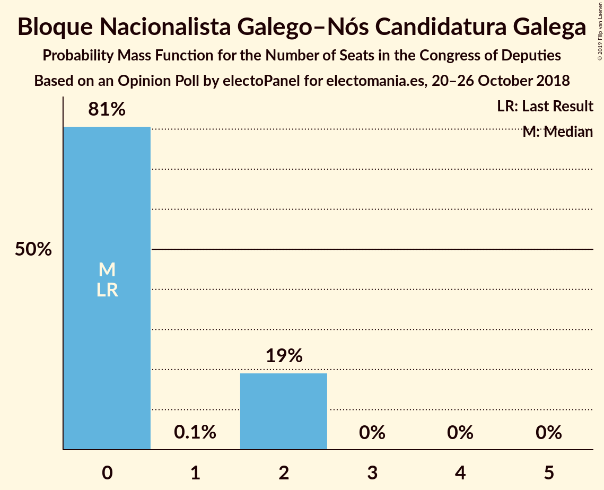
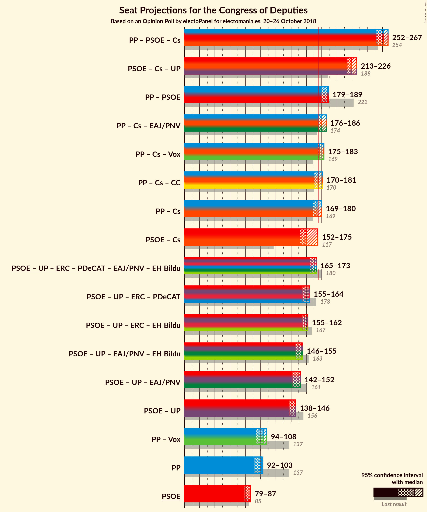
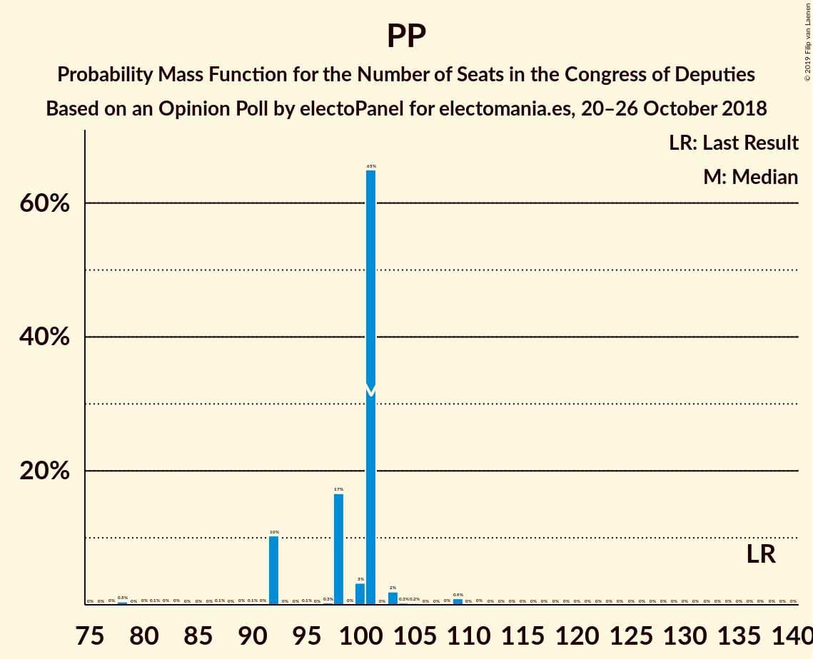

# Opinion Poll by electoPanel for electomania.es, 20–26 October 2018

<a href="#voting-intentions">Voting Intentions</a> | <a href="#seats">Seats</a> | <a href="#coalitions">Coalitions</a> | <a href="#technical-information">Technical Information</a>

## Voting Intentions

### Confidence Intervals

| Party | Last Result | Poll Result | 80% Confidence Interval | 90% Confidence Interval | 95% Confidence Interval | 99% Confidence Interval |
|:-----:|:-----------:|:-----------:|:-----------------------:|:-----------------------:|:-----------------------:|:-----------------------:|
| Partido Popular | 33.0% | 23.1% | 21.5–24.9% |21.1–25.4% |20.7–25.8% |19.9–26.7% |
| Partido Socialista Obrero Español | 22.6% | 22.0% | 20.4–23.7% |20.0–24.2% |19.6–24.6% |18.8–25.5% |
| Ciudadanos–Partido de la Ciudadanía | 13.1% | 21.9% | 20.3–23.6% |19.9–24.1% |19.5–24.5% |18.7–25.4% |
| Unidos Podemos | 21.2% | 18.5% | 17.0–20.1% |16.6–20.6% |16.3–21.0% |15.6–21.8% |
| Vox | 0.2% | 3.6% | 2.9–4.4% |2.7–4.7% |2.6–4.9% |2.3–5.3% |
| Esquerra Republicana de Catalunya | 2.7% | 3.1% | 2.5–3.9% |2.3–4.1% |2.2–4.3% |1.9–4.8% |
| Partit Demòcrata Europeu Català | 2.0% | 1.5% | 1.1–2.2% |1.0–2.3% |0.9–2.5% |0.8–2.8% |
| Euzko Alderdi Jeltzalea/Partido Nacionalista Vasco | 1.2% | 1.2% | 0.8–1.7% |0.7–1.9% |0.7–2.0% |0.5–2.3% |
| Partido Animalista Contra el Maltrato Animal | 1.2% | 1.2% | 0.8–1.7% |0.7–1.9% |0.7–2.0% |0.5–2.3% |
| Euskal Herria Bildu | 0.8% | 0.8% | 0.5–1.2% |0.4–1.4% |0.4–1.5% |0.3–1.8% |
| Coalición Canaria–Partido Nacionalista Canario | 0.3% | 0.3% | 0.2–0.7% |0.1–0.7% |0.1–0.9% |0.1–1.1% |
| Bloque Nacionalista Galego–Nós Candidatura Galega | 0.2% | 0.3% | 0.2–0.7% |0.1–0.7% |0.1–0.9% |0.1–1.1% |

*Note:* The poll result column reflects the actual value used in the calculations. Published results may vary slightly, and in addition be rounded to fewer digits.

## Seats

### Confidence Intervals

| Party | Last Result | Median | 80% Confidence Interval | 90% Confidence Interval | 95% Confidence Interval | 99% Confidence Interval |
|:-----:|:-----------:|:------:|:-----------------------:|:-----------------------:|:-----------------------:|:-----------------------:|
| <a href="#partido-popular">Partido Popular</a> | 137 | 57 | 57–73 |57–73 |56–73 |51–90 |
| <a href="#partido-socialista-obrero-español">Partido Socialista Obrero Español</a> | 85 | 74 | 59–74 |59–74 |57–74 |57–74 |
| <a href="#ciudadanos–partido-de-la-ciudadanía">Ciudadanos–Partido de la Ciudadanía</a> | 32 | 53 | 53–66 |52–66 |52–66 |44–66 |
| <a href="#unidos-podemos">Unidos Podemos</a> | 71 | 44 | 28–44 |28–44 |28–51 |28–54 |
| <a href="#vox">Vox</a> | 0 | 3 | 0–3 |0–4 |0–4 |0–4 |
| <a href="#esquerra-republicana-de-catalunya">Esquerra Republicana de Catalunya</a> | 9 | 0 | 0 |0 |0 |0 |
| <a href="#partit-demòcrata-europeu-català">Partit Demòcrata Europeu Català</a> | 8 | 0 | 0 |0 |0 |0 |
| <a href="#euzko-alderdi-jeltzalea/partido-nacionalista-vasco">Euzko Alderdi Jeltzalea/Partido Nacionalista Vasco</a> | 5 | 2 | 1–6 |1–6 |1–6 |1–6 |
| <a href="#partido-animalista-contra-el-maltrato-animal">Partido Animalista Contra el Maltrato Animal</a> | 0 | 0 | 0 |0 |0–1 |0–1 |
| <a href="#euskal-herria-bildu">Euskal Herria Bildu</a> | 2 | 3 | 3–6 |3–6 |1–6 |1–6 |
| <a href="#coalición-canaria–partido-nacionalista-canario">Coalición Canaria–Partido Nacionalista Canario</a> | 1 | 0 | 0 |0 |0 |0 |
| <a href="#bloque-nacionalista-galego–nós-candidatura-galega">Bloque Nacionalista Galego–Nós Candidatura Galega</a> | 0 | 2 | 0–2 |0–2 |0–2 |0–2 |

### Partido Popular

*For a full overview of the results for this party, see the [Partido Popular](party-partidopopular.html) page.*

| Number of Seats | Probability | Accumulated | Special Marks |
|:---------------:|:-----------:|:-----------:|:-------------:|
| 51 | 1.1% | 100% |  |
| 52 | 0% | 98.9% |  |
| 53 | 0% | 98.9% |  |
| 54 | 0% | 98.9% |  |
| 55 | 0% | 98.9% |  |
| 56 | 3% | 98.9% |  |
| 57 | 54% | 96% | Median |
| 58 | 0% | 42% |  |
| 59 | 0% | 42% |  |
| 60 | 0% | 42% |  |
| 61 | 0.1% | 42% |  |
| 62 | 0% | 42% |  |
| 63 | 18% | 42% |  |
| 64 | 0% | 25% |  |
| 65 | 0% | 25% |  |
| 66 | 0% | 25% |  |
| 67 | 0.1% | 25% |  |
| 68 | 0% | 25% |  |
| 69 | 5% | 25% |  |
| 70 | 0% | 20% |  |
| 71 | 0% | 20% |  |
| 72 | 0.3% | 20% |  |
| 73 | 18% | 20% |  |
| 74 | 0% | 1.3% |  |
| 75 | 0% | 1.3% |  |
| 76 | 0.4% | 1.3% |  |
| 77 | 0% | 0.8% |  |
| 78 | 0% | 0.8% |  |
| 79 | 0% | 0.8% |  |
| 80 | 0% | 0.8% |  |
| 81 | 0% | 0.8% |  |
| 82 | 0% | 0.8% |  |
| 83 | 0% | 0.8% |  |
| 84 | 0% | 0.8% |  |
| 85 | 0% | 0.8% |  |
| 86 | 0% | 0.8% |  |
| 87 | 0% | 0.8% |  |
| 88 | 0% | 0.8% |  |
| 89 | 0% | 0.8% |  |
| 90 | 0.8% | 0.8% |  |
| 91 | 0% | 0% |  |
| 92 | 0% | 0% |  |
| 93 | 0% | 0% |  |
| 94 | 0% | 0% |  |
| 95 | 0% | 0% |  |
| 96 | 0% | 0% |  |
| 97 | 0% | 0% |  |
| 98 | 0% | 0% |  |
| 99 | 0% | 0% |  |
| 100 | 0% | 0% |  |
| 101 | 0% | 0% |  |
| 102 | 0% | 0% |  |
| 103 | 0% | 0% |  |
| 104 | 0% | 0% |  |
| 105 | 0% | 0% |  |
| 106 | 0% | 0% |  |
| 107 | 0% | 0% |  |
| 108 | 0% | 0% |  |
| 109 | 0% | 0% |  |
| 110 | 0% | 0% |  |
| 111 | 0% | 0% |  |
| 112 | 0% | 0% |  |
| 113 | 0% | 0% |  |
| 114 | 0% | 0% |  |
| 115 | 0% | 0% |  |
| 116 | 0% | 0% |  |
| 117 | 0% | 0% |  |
| 118 | 0% | 0% |  |
| 119 | 0% | 0% |  |
| 120 | 0% | 0% |  |
| 121 | 0% | 0% |  |
| 122 | 0% | 0% |  |
| 123 | 0% | 0% |  |
| 124 | 0% | 0% |  |
| 125 | 0% | 0% |  |
| 126 | 0% | 0% |  |
| 127 | 0% | 0% |  |
| 128 | 0% | 0% |  |
| 129 | 0% | 0% |  |
| 130 | 0% | 0% |  |
| 131 | 0% | 0% |  |
| 132 | 0% | 0% |  |
| 133 | 0% | 0% |  |
| 134 | 0% | 0% |  |
| 135 | 0% | 0% |  |
| 136 | 0% | 0% |  |
| 137 | 0% | 0% | Last Result |

### Partido Socialista Obrero Español

*For a full overview of the results for this party, see the [Partido Socialista Obrero Español](party-partidosocialistaobreroespañol.html) page.*

| Number of Seats | Probability | Accumulated | Special Marks |
|:---------------:|:-----------:|:-----------:|:-------------:|
| 57 | 3% | 100% |  |
| 58 | 0% | 97% |  |
| 59 | 19% | 97% |  |
| 60 | 0% | 79% |  |
| 61 | 0.1% | 79% |  |
| 62 | 0.3% | 78% |  |
| 63 | 5% | 78% |  |
| 64 | 0% | 73% |  |
| 65 | 0% | 73% |  |
| 66 | 0% | 73% |  |
| 67 | 0.1% | 73% |  |
| 68 | 0.5% | 73% |  |
| 69 | 0% | 73% |  |
| 70 | 18% | 73% |  |
| 71 | 0% | 54% |  |
| 72 | 0% | 54% |  |
| 73 | 0.6% | 54% |  |
| 74 | 54% | 54% | Median |
| 75 | 0% | 0% |  |
| 76 | 0% | 0% |  |
| 77 | 0% | 0% |  |
| 78 | 0% | 0% |  |
| 79 | 0% | 0% |  |
| 80 | 0% | 0% |  |
| 81 | 0% | 0% |  |
| 82 | 0% | 0% |  |
| 83 | 0% | 0% |  |
| 84 | 0% | 0% |  |
| 85 | 0% | 0% | Last Result |

### Ciudadanos–Partido de la Ciudadanía

*For a full overview of the results for this party, see the [Ciudadanos–Partido de la Ciudadanía](party-ciudadanos–partidodelaciudadanía.html) page.*

| Number of Seats | Probability | Accumulated | Special Marks |
|:---------------:|:-----------:|:-----------:|:-------------:|
| 32 | 0% | 100% | Last Result |
| 33 | 0% | 100% |  |
| 34 | 0% | 100% |  |
| 35 | 0% | 100% |  |
| 36 | 0% | 100% |  |
| 37 | 0% | 100% |  |
| 38 | 0% | 100% |  |
| 39 | 0% | 100% |  |
| 40 | 0% | 100% |  |
| 41 | 0% | 100% |  |
| 42 | 0% | 100% |  |
| 43 | 0% | 100% |  |
| 44 | 0.8% | 100% |  |
| 45 | 0% | 99.2% |  |
| 46 | 0% | 99.2% |  |
| 47 | 0% | 99.1% |  |
| 48 | 0.5% | 99.1% |  |
| 49 | 0.4% | 98.7% |  |
| 50 | 0% | 98% |  |
| 51 | 0.1% | 98% |  |
| 52 | 5% | 98% |  |
| 53 | 54% | 93% | Median |
| 54 | 0% | 40% |  |
| 55 | 0% | 40% |  |
| 56 | 0.5% | 40% |  |
| 57 | 0% | 39% |  |
| 58 | 0% | 39% |  |
| 59 | 18% | 39% |  |
| 60 | 0% | 22% |  |
| 61 | 0.6% | 22% |  |
| 62 | 0% | 21% |  |
| 63 | 0% | 21% |  |
| 64 | 0% | 21% |  |
| 65 | 0% | 21% |  |
| 66 | 21% | 21% |  |
| 67 | 0% | 0% |  |

### Unidos Podemos

*For a full overview of the results for this party, see the [Unidos Podemos](party-unidospodemos.html) page.*

| Number of Seats | Probability | Accumulated | Special Marks |
|:---------------:|:-----------:|:-----------:|:-------------:|
| 28 | 18% | 100% |  |
| 29 | 0% | 82% |  |
| 30 | 0% | 82% |  |
| 31 | 0.8% | 82% |  |
| 32 | 0% | 81% |  |
| 33 | 0% | 81% |  |
| 34 | 0% | 81% |  |
| 35 | 0% | 81% |  |
| 36 | 0% | 81% |  |
| 37 | 0% | 81% |  |
| 38 | 5% | 81% |  |
| 39 | 18% | 76% |  |
| 40 | 0% | 59% |  |
| 41 | 0% | 59% |  |
| 42 | 0% | 59% |  |
| 43 | 0.6% | 59% |  |
| 44 | 54% | 58% | Median |
| 45 | 0% | 4% |  |
| 46 | 0.3% | 4% |  |
| 47 | 0% | 3% |  |
| 48 | 0% | 3% |  |
| 49 | 0% | 3% |  |
| 50 | 0% | 3% |  |
| 51 | 3% | 3% |  |
| 52 | 0.1% | 0.6% |  |
| 53 | 0% | 0.5% |  |
| 54 | 0.1% | 0.5% |  |
| 55 | 0.5% | 0.5% |  |
| 56 | 0% | 0% |  |
| 57 | 0% | 0% |  |
| 58 | 0% | 0% |  |
| 59 | 0% | 0% |  |
| 60 | 0% | 0% |  |
| 61 | 0% | 0% |  |
| 62 | 0% | 0% |  |
| 63 | 0% | 0% |  |
| 64 | 0% | 0% |  |
| 65 | 0% | 0% |  |
| 66 | 0% | 0% |  |
| 67 | 0% | 0% |  |
| 68 | 0% | 0% |  |
| 69 | 0% | 0% |  |
| 70 | 0% | 0% |  |
| 71 | 0% | 0% | Last Result |

### Vox

*For a full overview of the results for this party, see the [Vox](party-vox.html) page.*

| Number of Seats | Probability | Accumulated | Special Marks |
|:---------------:|:-----------:|:-----------:|:-------------:|
| 0 | 19% | 100% | Last Result |
| 1 | 19% | 81% |  |
| 2 | 0% | 62% |  |
| 3 | 54% | 62% | Median |
| 4 | 7% | 7% |  |
| 5 | 0% | 0% |  |

### Esquerra Republicana de Catalunya

*For a full overview of the results for this party, see the [Esquerra Republicana de Catalunya](party-esquerrarepublicanadecatalunya.html) page.*

| Number of Seats | Probability | Accumulated | Special Marks |
|:---------------:|:-----------:|:-----------:|:-------------:|
| 0 | 100% | 100% | Median |
| 1 | 0% | 0% |  |
| 2 | 0% | 0% |  |
| 3 | 0% | 0% |  |
| 4 | 0% | 0% |  |
| 5 | 0% | 0% |  |
| 6 | 0% | 0% |  |
| 7 | 0% | 0% |  |
| 8 | 0% | 0% |  |
| 9 | 0% | 0% | Last Result |

### Partit Demòcrata Europeu Català

*For a full overview of the results for this party, see the [Partit Demòcrata Europeu Català](party-partitdemòcrataeuropeucatalà.html) page.*

| Number of Seats | Probability | Accumulated | Special Marks |
|:---------------:|:-----------:|:-----------:|:-------------:|
| 0 | 100% | 100% | Median |
| 1 | 0% | 0% |  |
| 2 | 0% | 0% |  |
| 3 | 0% | 0% |  |
| 4 | 0% | 0% |  |
| 5 | 0% | 0% |  |
| 6 | 0% | 0% |  |
| 7 | 0% | 0% |  |
| 8 | 0% | 0% | Last Result |

### Euzko Alderdi Jeltzalea/Partido Nacionalista Vasco

*For a full overview of the results for this party, see the [Euzko Alderdi Jeltzalea/Partido Nacionalista Vasco](party-euzkoalderdijeltzaleapartidonacionalistavasco.html) page.*

| Number of Seats | Probability | Accumulated | Special Marks |
|:---------------:|:-----------:|:-----------:|:-------------:|
| 0 | 0.1% | 100% |  |
| 1 | 18% | 99.9% |  |
| 2 | 58% | 82% | Median |
| 3 | 0% | 24% |  |
| 4 | 0% | 24% |  |
| 5 | 0% | 24% | Last Result |
| 6 | 24% | 24% |  |
| 7 | 0% | 0% |  |

### Partido Animalista Contra el Maltrato Animal

*For a full overview of the results for this party, see the [Partido Animalista Contra el Maltrato Animal](party-partidoanimalistacontraelmaltratoanimal.html) page.*

| Number of Seats | Probability | Accumulated | Special Marks |
|:---------------:|:-----------:|:-----------:|:-------------:|
| 0 | 95% | 100% | Last Result, Median |
| 1 | 5% | 5% |  |
| 2 | 0% | 0% |  |

### Euskal Herria Bildu

*For a full overview of the results for this party, see the [Euskal Herria Bildu](party-euskalherriabildu.html) page.*

| Number of Seats | Probability | Accumulated | Special Marks |
|:---------------:|:-----------:|:-----------:|:-------------:|
| 1 | 4% | 100% |  |
| 2 | 0.8% | 96% | Last Result |
| 3 | 54% | 96% | Median |
| 4 | 23% | 42% |  |
| 5 | 1.1% | 19% |  |
| 6 | 18% | 18% |  |
| 7 | 0% | 0% |  |

### Coalición Canaria–Partido Nacionalista Canario

*For a full overview of the results for this party, see the [Coalición Canaria–Partido Nacionalista Canario](party-coalicióncanaria–partidonacionalistacanario.html) page.*

| Number of Seats | Probability | Accumulated | Special Marks |
|:---------------:|:-----------:|:-----------:|:-------------:|
| 0 | 100% | 100% | Median |
| 1 | 0% | 0% | Last Result |

### Bloque Nacionalista Galego–Nós Candidatura Galega

*For a full overview of the results for this party, see the [Bloque Nacionalista Galego–Nós Candidatura Galega](party-bloquenacionalistagalego–nóscandidaturagalega.html) page.*

| Number of Seats | Probability | Accumulated | Special Marks |
|:---------------:|:-----------:|:-----------:|:-------------:|
| 0 | 46% | 100% | Last Result |
| 1 | 0% | 54% |  |
| 2 | 54% | 54% | Median |
| 3 | 0% | 0% |  |

## Coalitions

### Confidence Intervals

| Coalition | Last Result | Median | Majority? | 80% Confidence Interval | 90% Confidence Interval | 95% Confidence Interval | 99% Confidence Interval |
|:---------:|:-----------:|:------:|:---------:|:-----------------------:|:-----------------------:|:-----------------------:|:-----------------------:|
| Partido Popular – Ciudadanos–Partido de la Ciudadanía – Vox | 169 | 113 | 0% | 113–140 | 113–140 | 113–140 | 112–140 |
| Partido Popular – Ciudadanos–Partido de la Ciudadanía – Coalición Canaria–Partido Nacionalista Canario | 170 | 110 | 0% | 110–139 | 110–139 | 110–139 | 110–139 |
| Partido Popular – Ciudadanos–Partido de la Ciudadanía | 169 | 110 | 0% | 110–139 | 110–139 | 110–139 | 110–139 |
| Partido Socialista Obrero Español – Ciudadanos–Partido de la Ciudadanía – Coalición Canaria–Partido Nacionalista Canario | 118 | 127 | 0% | 125–129 | 115–129 | 115–129 | 107–134 |
| Partido Socialista Obrero Español – Ciudadanos–Partido de la Ciudadanía | 117 | 127 | 0% | 125–129 | 115–129 | 115–129 | 107–134 |
| Partido Socialista Obrero Español – Unidos Podemos | 156 | 118 | 0% | 87–118 | 87–118 | 87–118 | 87–119 |
| Partido Popular – Vox | 137 | 60 | 0% | 60–74 | 60–74 | 60–74 | 54–90 |
| Partido Socialista Obrero Español – Coalición Canaria–Partido Nacionalista Canario | 86 | 74 | 0% | 59–74 | 59–74 | 57–74 | 57–74 |
| Partido Socialista Obrero Español | 85 | 74 | 0% | 59–74 | 59–74 | 57–74 | 57–74 |
| Partido Popular | 137 | 57 | 0% | 57–73 | 57–73 | 56–73 | 51–90 |

### Partido Popular – Ciudadanos–Partido de la Ciudadanía – Vox

| Number of Seats | Probability | Accumulated | Special Marks |
|:---------------:|:-----------:|:-----------:|:-------------:|
| 107 | 0.5% | 100% |  |
| 108 | 0% | 99.5% |  |
| 109 | 0% | 99.5% |  |
| 110 | 0% | 99.5% |  |
| 111 | 0% | 99.5% |  |
| 112 | 0.1% | 99.5% |  |
| 113 | 54% | 99.5% | Median |
| 114 | 0% | 46% |  |
| 115 | 0.6% | 46% |  |
| 116 | 0% | 45% |  |
| 117 | 0% | 45% |  |
| 118 | 0% | 45% |  |
| 119 | 0% | 45% |  |
| 120 | 0% | 45% |  |
| 121 | 0.3% | 45% |  |
| 122 | 18% | 45% |  |
| 123 | 0% | 27% |  |
| 124 | 0% | 27% |  |
| 125 | 5% | 27% |  |
| 126 | 3% | 22% |  |
| 127 | 0% | 19% |  |
| 128 | 0% | 19% |  |
| 129 | 0% | 19% |  |
| 130 | 0% | 19% |  |
| 131 | 0% | 19% |  |
| 132 | 0% | 19% |  |
| 133 | 0% | 19% |  |
| 134 | 0.8% | 19% |  |
| 135 | 0% | 18% |  |
| 136 | 0% | 18% |  |
| 137 | 0% | 18% |  |
| 138 | 0% | 18% |  |
| 139 | 0% | 18% |  |
| 140 | 18% | 18% |  |
| 141 | 0% | 0% |  |
| 142 | 0% | 0% |  |
| 143 | 0% | 0% |  |
| 144 | 0% | 0% |  |
| 145 | 0% | 0% |  |
| 146 | 0% | 0% |  |
| 147 | 0% | 0% |  |
| 148 | 0% | 0% |  |
| 149 | 0% | 0% |  |
| 150 | 0% | 0% |  |
| 151 | 0% | 0% |  |
| 152 | 0% | 0% |  |
| 153 | 0% | 0% |  |
| 154 | 0% | 0% |  |
| 155 | 0% | 0% |  |
| 156 | 0% | 0% |  |
| 157 | 0% | 0% |  |
| 158 | 0% | 0% |  |
| 159 | 0% | 0% |  |
| 160 | 0% | 0% |  |
| 161 | 0% | 0% |  |
| 162 | 0% | 0% |  |
| 163 | 0% | 0% |  |
| 164 | 0% | 0% |  |
| 165 | 0% | 0% |  |
| 166 | 0% | 0% |  |
| 167 | 0% | 0% |  |
| 168 | 0% | 0% |  |
| 169 | 0% | 0% | Last Result |

### Partido Popular – Ciudadanos–Partido de la Ciudadanía – Coalición Canaria–Partido Nacionalista Canario

| Number of Seats | Probability | Accumulated | Special Marks |
|:---------------:|:-----------:|:-----------:|:-------------:|
| 107 | 0.5% | 100% |  |
| 108 | 0% | 99.5% |  |
| 109 | 0% | 99.5% |  |
| 110 | 54% | 99.5% | Median |
| 111 | 0.1% | 46% |  |
| 112 | 0.7% | 46% |  |
| 113 | 0% | 45% |  |
| 114 | 0% | 45% |  |
| 115 | 0% | 45% |  |
| 116 | 0% | 45% |  |
| 117 | 0% | 45% |  |
| 118 | 0% | 45% |  |
| 119 | 0% | 45% |  |
| 120 | 0% | 45% |  |
| 121 | 5% | 45% |  |
| 122 | 20% | 40% |  |
| 123 | 0% | 20% |  |
| 124 | 0.5% | 20% |  |
| 125 | 0% | 19% |  |
| 126 | 0% | 19% |  |
| 127 | 0% | 19% |  |
| 128 | 0% | 19% |  |
| 129 | 0% | 19% |  |
| 130 | 0% | 19% |  |
| 131 | 0% | 19% |  |
| 132 | 0% | 19% |  |
| 133 | 0% | 19% |  |
| 134 | 0.8% | 19% |  |
| 135 | 0% | 18% |  |
| 136 | 0% | 18% |  |
| 137 | 0% | 18% |  |
| 138 | 0% | 18% |  |
| 139 | 18% | 18% |  |
| 140 | 0% | 0% |  |
| 141 | 0% | 0% |  |
| 142 | 0% | 0% |  |
| 143 | 0% | 0% |  |
| 144 | 0% | 0% |  |
| 145 | 0% | 0% |  |
| 146 | 0% | 0% |  |
| 147 | 0% | 0% |  |
| 148 | 0% | 0% |  |
| 149 | 0% | 0% |  |
| 150 | 0% | 0% |  |
| 151 | 0% | 0% |  |
| 152 | 0% | 0% |  |
| 153 | 0% | 0% |  |
| 154 | 0% | 0% |  |
| 155 | 0% | 0% |  |
| 156 | 0% | 0% |  |
| 157 | 0% | 0% |  |
| 158 | 0% | 0% |  |
| 159 | 0% | 0% |  |
| 160 | 0% | 0% |  |
| 161 | 0% | 0% |  |
| 162 | 0% | 0% |  |
| 163 | 0% | 0% |  |
| 164 | 0% | 0% |  |
| 165 | 0% | 0% |  |
| 166 | 0% | 0% |  |
| 167 | 0% | 0% |  |
| 168 | 0% | 0% |  |
| 169 | 0% | 0% |  |
| 170 | 0% | 0% | Last Result |

### Partido Popular – Ciudadanos–Partido de la Ciudadanía

| Number of Seats | Probability | Accumulated | Special Marks |
|:---------------:|:-----------:|:-----------:|:-------------:|
| 107 | 0.5% | 100% |  |
| 108 | 0% | 99.5% |  |
| 109 | 0% | 99.5% |  |
| 110 | 54% | 99.5% | Median |
| 111 | 0.1% | 46% |  |
| 112 | 0.7% | 46% |  |
| 113 | 0% | 45% |  |
| 114 | 0% | 45% |  |
| 115 | 0% | 45% |  |
| 116 | 0% | 45% |  |
| 117 | 0% | 45% |  |
| 118 | 0% | 45% |  |
| 119 | 0% | 45% |  |
| 120 | 0% | 45% |  |
| 121 | 5% | 45% |  |
| 122 | 20% | 40% |  |
| 123 | 0% | 20% |  |
| 124 | 0.5% | 20% |  |
| 125 | 0% | 19% |  |
| 126 | 0% | 19% |  |
| 127 | 0% | 19% |  |
| 128 | 0% | 19% |  |
| 129 | 0% | 19% |  |
| 130 | 0% | 19% |  |
| 131 | 0% | 19% |  |
| 132 | 0% | 19% |  |
| 133 | 0% | 19% |  |
| 134 | 0.8% | 19% |  |
| 135 | 0% | 18% |  |
| 136 | 0% | 18% |  |
| 137 | 0% | 18% |  |
| 138 | 0% | 18% |  |
| 139 | 18% | 18% |  |
| 140 | 0% | 0% |  |
| 141 | 0% | 0% |  |
| 142 | 0% | 0% |  |
| 143 | 0% | 0% |  |
| 144 | 0% | 0% |  |
| 145 | 0% | 0% |  |
| 146 | 0% | 0% |  |
| 147 | 0% | 0% |  |
| 148 | 0% | 0% |  |
| 149 | 0% | 0% |  |
| 150 | 0% | 0% |  |
| 151 | 0% | 0% |  |
| 152 | 0% | 0% |  |
| 153 | 0% | 0% |  |
| 154 | 0% | 0% |  |
| 155 | 0% | 0% |  |
| 156 | 0% | 0% |  |
| 157 | 0% | 0% |  |
| 158 | 0% | 0% |  |
| 159 | 0% | 0% |  |
| 160 | 0% | 0% |  |
| 161 | 0% | 0% |  |
| 162 | 0% | 0% |  |
| 163 | 0% | 0% |  |
| 164 | 0% | 0% |  |
| 165 | 0% | 0% |  |
| 166 | 0% | 0% |  |
| 167 | 0% | 0% |  |
| 168 | 0% | 0% |  |
| 169 | 0% | 0% | Last Result |

### Partido Socialista Obrero Español – Ciudadanos–Partido de la Ciudadanía – Coalición Canaria–Partido Nacionalista Canario

| Number of Seats | Probability | Accumulated | Special Marks |
|:---------------:|:-----------:|:-----------:|:-------------:|
| 105 | 0.1% | 100% |  |
| 106 | 0% | 99.9% |  |
| 107 | 0.4% | 99.9% |  |
| 108 | 0% | 99.5% |  |
| 109 | 0% | 99.5% |  |
| 110 | 0% | 99.5% |  |
| 111 | 0.3% | 99.4% |  |
| 112 | 0% | 99.1% |  |
| 113 | 0% | 99.1% |  |
| 114 | 0.8% | 99.1% |  |
| 115 | 5% | 98% |  |
| 116 | 0% | 94% |  |
| 117 | 0% | 94% |  |
| 118 | 0.1% | 94% | Last Result |
| 119 | 0% | 93% |  |
| 120 | 0% | 93% |  |
| 121 | 0% | 93% |  |
| 122 | 0% | 93% |  |
| 123 | 3% | 93% |  |
| 124 | 0.5% | 91% |  |
| 125 | 18% | 90% |  |
| 126 | 0% | 72% |  |
| 127 | 54% | 72% | Median |
| 128 | 0% | 18% |  |
| 129 | 18% | 18% |  |
| 130 | 0% | 0.6% |  |
| 131 | 0% | 0.6% |  |
| 132 | 0% | 0.6% |  |
| 133 | 0% | 0.6% |  |
| 134 | 0.6% | 0.6% |  |
| 135 | 0% | 0% |  |

### Partido Socialista Obrero Español – Ciudadanos–Partido de la Ciudadanía

| Number of Seats | Probability | Accumulated | Special Marks |
|:---------------:|:-----------:|:-----------:|:-------------:|
| 105 | 0.1% | 100% |  |
| 106 | 0% | 99.9% |  |
| 107 | 0.4% | 99.9% |  |
| 108 | 0% | 99.5% |  |
| 109 | 0% | 99.5% |  |
| 110 | 0% | 99.5% |  |
| 111 | 0.3% | 99.4% |  |
| 112 | 0% | 99.1% |  |
| 113 | 0% | 99.1% |  |
| 114 | 0.8% | 99.1% |  |
| 115 | 5% | 98% |  |
| 116 | 0% | 94% |  |
| 117 | 0% | 94% | Last Result |
| 118 | 0.1% | 94% |  |
| 119 | 0% | 93% |  |
| 120 | 0% | 93% |  |
| 121 | 0% | 93% |  |
| 122 | 0% | 93% |  |
| 123 | 3% | 93% |  |
| 124 | 0.5% | 91% |  |
| 125 | 18% | 90% |  |
| 126 | 0% | 72% |  |
| 127 | 54% | 72% | Median |
| 128 | 0% | 18% |  |
| 129 | 18% | 18% |  |
| 130 | 0% | 0.6% |  |
| 131 | 0% | 0.6% |  |
| 132 | 0% | 0.6% |  |
| 133 | 0% | 0.6% |  |
| 134 | 0.6% | 0.6% |  |
| 135 | 0% | 0% |  |

### Partido Socialista Obrero Español – Unidos Podemos

| Number of Seats | Probability | Accumulated | Special Marks |
|:---------------:|:-----------:|:-----------:|:-------------:|
| 87 | 18% | 100% |  |
| 88 | 0% | 82% |  |
| 89 | 0% | 82% |  |
| 90 | 0% | 82% |  |
| 91 | 0% | 82% |  |
| 92 | 0% | 82% |  |
| 93 | 0% | 82% |  |
| 94 | 0% | 82% |  |
| 95 | 0% | 82% |  |
| 96 | 0% | 82% |  |
| 97 | 0% | 82% |  |
| 98 | 0% | 82% |  |
| 99 | 0% | 82% |  |
| 100 | 0% | 82% |  |
| 101 | 6% | 82% |  |
| 102 | 0% | 76% |  |
| 103 | 0.4% | 76% |  |
| 104 | 0% | 76% |  |
| 105 | 0% | 76% |  |
| 106 | 0% | 76% |  |
| 107 | 0% | 76% |  |
| 108 | 3% | 76% |  |
| 109 | 18% | 73% |  |
| 110 | 0% | 55% |  |
| 111 | 0% | 55% |  |
| 112 | 0% | 55% |  |
| 113 | 0% | 55% |  |
| 114 | 0% | 55% |  |
| 115 | 0% | 55% |  |
| 116 | 0.6% | 55% |  |
| 117 | 0% | 54% |  |
| 118 | 54% | 54% | Median |
| 119 | 0.1% | 0.6% |  |
| 120 | 0% | 0.5% |  |
| 121 | 0% | 0.5% |  |
| 122 | 0% | 0.5% |  |
| 123 | 0.5% | 0.5% |  |
| 124 | 0% | 0% |  |
| 125 | 0% | 0% |  |
| 126 | 0% | 0% |  |
| 127 | 0% | 0% |  |
| 128 | 0% | 0% |  |
| 129 | 0% | 0% |  |
| 130 | 0% | 0% |  |
| 131 | 0% | 0% |  |
| 132 | 0% | 0% |  |
| 133 | 0% | 0% |  |
| 134 | 0% | 0% |  |
| 135 | 0% | 0% |  |
| 136 | 0% | 0% |  |
| 137 | 0% | 0% |  |
| 138 | 0% | 0% |  |
| 139 | 0% | 0% |  |
| 140 | 0% | 0% |  |
| 141 | 0% | 0% |  |
| 142 | 0% | 0% |  |
| 143 | 0% | 0% |  |
| 144 | 0% | 0% |  |
| 145 | 0% | 0% |  |
| 146 | 0% | 0% |  |
| 147 | 0% | 0% |  |
| 148 | 0% | 0% |  |
| 149 | 0% | 0% |  |
| 150 | 0% | 0% |  |
| 151 | 0% | 0% |  |
| 152 | 0% | 0% |  |
| 153 | 0% | 0% |  |
| 154 | 0% | 0% |  |
| 155 | 0% | 0% |  |
| 156 | 0% | 0% | Last Result |

### Partido Popular – Vox

| Number of Seats | Probability | Accumulated | Special Marks |
|:---------------:|:-----------:|:-----------:|:-------------:|
| 51 | 0.5% | 100% |  |
| 52 | 0% | 99.5% |  |
| 53 | 0% | 99.5% |  |
| 54 | 0.6% | 99.5% |  |
| 55 | 0% | 98.9% |  |
| 56 | 0% | 98.9% |  |
| 57 | 0% | 98.9% |  |
| 58 | 0% | 98.9% |  |
| 59 | 0% | 98.9% |  |
| 60 | 57% | 98.9% | Median |
| 61 | 0% | 42% |  |
| 62 | 0.1% | 42% |  |
| 63 | 18% | 42% |  |
| 64 | 0% | 25% |  |
| 65 | 0% | 25% |  |
| 66 | 0% | 25% |  |
| 67 | 0% | 25% |  |
| 68 | 0% | 25% |  |
| 69 | 0% | 25% |  |
| 70 | 0% | 25% |  |
| 71 | 0% | 25% |  |
| 72 | 0.3% | 25% |  |
| 73 | 5% | 24% |  |
| 74 | 18% | 20% |  |
| 75 | 0% | 1.3% |  |
| 76 | 0% | 1.3% |  |
| 77 | 0.4% | 1.3% |  |
| 78 | 0% | 0.8% |  |
| 79 | 0% | 0.8% |  |
| 80 | 0% | 0.8% |  |
| 81 | 0% | 0.8% |  |
| 82 | 0% | 0.8% |  |
| 83 | 0% | 0.8% |  |
| 84 | 0% | 0.8% |  |
| 85 | 0% | 0.8% |  |
| 86 | 0% | 0.8% |  |
| 87 | 0% | 0.8% |  |
| 88 | 0% | 0.8% |  |
| 89 | 0% | 0.8% |  |
| 90 | 0.8% | 0.8% |  |
| 91 | 0% | 0% |  |
| 92 | 0% | 0% |  |
| 93 | 0% | 0% |  |
| 94 | 0% | 0% |  |
| 95 | 0% | 0% |  |
| 96 | 0% | 0% |  |
| 97 | 0% | 0% |  |
| 98 | 0% | 0% |  |
| 99 | 0% | 0% |  |
| 100 | 0% | 0% |  |
| 101 | 0% | 0% |  |
| 102 | 0% | 0% |  |
| 103 | 0% | 0% |  |
| 104 | 0% | 0% |  |
| 105 | 0% | 0% |  |
| 106 | 0% | 0% |  |
| 107 | 0% | 0% |  |
| 108 | 0% | 0% |  |
| 109 | 0% | 0% |  |
| 110 | 0% | 0% |  |
| 111 | 0% | 0% |  |
| 112 | 0% | 0% |  |
| 113 | 0% | 0% |  |
| 114 | 0% | 0% |  |
| 115 | 0% | 0% |  |
| 116 | 0% | 0% |  |
| 117 | 0% | 0% |  |
| 118 | 0% | 0% |  |
| 119 | 0% | 0% |  |
| 120 | 0% | 0% |  |
| 121 | 0% | 0% |  |
| 122 | 0% | 0% |  |
| 123 | 0% | 0% |  |
| 124 | 0% | 0% |  |
| 125 | 0% | 0% |  |
| 126 | 0% | 0% |  |
| 127 | 0% | 0% |  |
| 128 | 0% | 0% |  |
| 129 | 0% | 0% |  |
| 130 | 0% | 0% |  |
| 131 | 0% | 0% |  |
| 132 | 0% | 0% |  |
| 133 | 0% | 0% |  |
| 134 | 0% | 0% |  |
| 135 | 0% | 0% |  |
| 136 | 0% | 0% |  |
| 137 | 0% | 0% | Last Result |

### Partido Socialista Obrero Español – Coalición Canaria–Partido Nacionalista Canario

| Number of Seats | Probability | Accumulated | Special Marks |
|:---------------:|:-----------:|:-----------:|:-------------:|
| 57 | 3% | 100% |  |
| 58 | 0% | 97% |  |
| 59 | 19% | 97% |  |
| 60 | 0% | 79% |  |
| 61 | 0.1% | 79% |  |
| 62 | 0.3% | 78% |  |
| 63 | 5% | 78% |  |
| 64 | 0% | 73% |  |
| 65 | 0% | 73% |  |
| 66 | 0% | 73% |  |
| 67 | 0.1% | 73% |  |
| 68 | 0.5% | 73% |  |
| 69 | 0% | 73% |  |
| 70 | 18% | 73% |  |
| 71 | 0% | 54% |  |
| 72 | 0% | 54% |  |
| 73 | 0.6% | 54% |  |
| 74 | 54% | 54% | Median |
| 75 | 0% | 0% |  |
| 76 | 0% | 0% |  |
| 77 | 0% | 0% |  |
| 78 | 0% | 0% |  |
| 79 | 0% | 0% |  |
| 80 | 0% | 0% |  |
| 81 | 0% | 0% |  |
| 82 | 0% | 0% |  |
| 83 | 0% | 0% |  |
| 84 | 0% | 0% |  |
| 85 | 0% | 0% |  |
| 86 | 0% | 0% | Last Result |

### Partido Socialista Obrero Español

| Number of Seats | Probability | Accumulated | Special Marks |
|:---------------:|:-----------:|:-----------:|:-------------:|
| 57 | 3% | 100% |  |
| 58 | 0% | 97% |  |
| 59 | 19% | 97% |  |
| 60 | 0% | 79% |  |
| 61 | 0.1% | 79% |  |
| 62 | 0.3% | 78% |  |
| 63 | 5% | 78% |  |
| 64 | 0% | 73% |  |
| 65 | 0% | 73% |  |
| 66 | 0% | 73% |  |
| 67 | 0.1% | 73% |  |
| 68 | 0.5% | 73% |  |
| 69 | 0% | 73% |  |
| 70 | 18% | 73% |  |
| 71 | 0% | 54% |  |
| 72 | 0% | 54% |  |
| 73 | 0.6% | 54% |  |
| 74 | 54% | 54% | Median |
| 75 | 0% | 0% |  |
| 76 | 0% | 0% |  |
| 77 | 0% | 0% |  |
| 78 | 0% | 0% |  |
| 79 | 0% | 0% |  |
| 80 | 0% | 0% |  |
| 81 | 0% | 0% |  |
| 82 | 0% | 0% |  |
| 83 | 0% | 0% |  |
| 84 | 0% | 0% |  |
| 85 | 0% | 0% | Last Result |

### Partido Popular

| Number of Seats | Probability | Accumulated | Special Marks |
|:---------------:|:-----------:|:-----------:|:-------------:|
| 51 | 1.1% | 100% |  |
| 52 | 0% | 98.9% |  |
| 53 | 0% | 98.9% |  |
| 54 | 0% | 98.9% |  |
| 55 | 0% | 98.9% |  |
| 56 | 3% | 98.9% |  |
| 57 | 54% | 96% | Median |
| 58 | 0% | 42% |  |
| 59 | 0% | 42% |  |
| 60 | 0% | 42% |  |
| 61 | 0.1% | 42% |  |
| 62 | 0% | 42% |  |
| 63 | 18% | 42% |  |
| 64 | 0% | 25% |  |
| 65 | 0% | 25% |  |
| 66 | 0% | 25% |  |
| 67 | 0.1% | 25% |  |
| 68 | 0% | 25% |  |
| 69 | 5% | 25% |  |
| 70 | 0% | 20% |  |
| 71 | 0% | 20% |  |
| 72 | 0.3% | 20% |  |
| 73 | 18% | 20% |  |
| 74 | 0% | 1.3% |  |
| 75 | 0% | 1.3% |  |
| 76 | 0.4% | 1.3% |  |
| 77 | 0% | 0.8% |  |
| 78 | 0% | 0.8% |  |
| 79 | 0% | 0.8% |  |
| 80 | 0% | 0.8% |  |
| 81 | 0% | 0.8% |  |
| 82 | 0% | 0.8% |  |
| 83 | 0% | 0.8% |  |
| 84 | 0% | 0.8% |  |
| 85 | 0% | 0.8% |  |
| 86 | 0% | 0.8% |  |
| 87 | 0% | 0.8% |  |
| 88 | 0% | 0.8% |  |
| 89 | 0% | 0.8% |  |
| 90 | 0.8% | 0.8% |  |
| 91 | 0% | 0% |  |
| 92 | 0% | 0% |  |
| 93 | 0% | 0% |  |
| 94 | 0% | 0% |  |
| 95 | 0% | 0% |  |
| 96 | 0% | 0% |  |
| 97 | 0% | 0% |  |
| 98 | 0% | 0% |  |
| 99 | 0% | 0% |  |
| 100 | 0% | 0% |  |
| 101 | 0% | 0% |  |
| 102 | 0% | 0% |  |
| 103 | 0% | 0% |  |
| 104 | 0% | 0% |  |
| 105 | 0% | 0% |  |
| 106 | 0% | 0% |  |
| 107 | 0% | 0% |  |
| 108 | 0% | 0% |  |
| 109 | 0% | 0% |  |
| 110 | 0% | 0% |  |
| 111 | 0% | 0% |  |
| 112 | 0% | 0% |  |
| 113 | 0% | 0% |  |
| 114 | 0% | 0% |  |
| 115 | 0% | 0% |  |
| 116 | 0% | 0% |  |
| 117 | 0% | 0% |  |
| 118 | 0% | 0% |  |
| 119 | 0% | 0% |  |
| 120 | 0% | 0% |  |
| 121 | 0% | 0% |  |
| 122 | 0% | 0% |  |
| 123 | 0% | 0% |  |
| 124 | 0% | 0% |  |
| 125 | 0% | 0% |  |
| 126 | 0% | 0% |  |
| 127 | 0% | 0% |  |
| 128 | 0% | 0% |  |
| 129 | 0% | 0% |  |
| 130 | 0% | 0% |  |
| 131 | 0% | 0% |  |
| 132 | 0% | 0% |  |
| 133 | 0% | 0% |  |
| 134 | 0% | 0% |  |
| 135 | 0% | 0% |  |
| 136 | 0% | 0% |  |
| 137 | 0% | 0% | Last Result |

## Technical Information

### Opinion Poll

+ **Polling firm:** electoPanel
+ **Commissioner(s):** electomania.es
+ **Fieldwork period:** 20–26 October 2018

### Calculations

+ **Sample size:** 1037
+ **Simulations done:** 1,024
+ **Error estimate:** 2.18%

