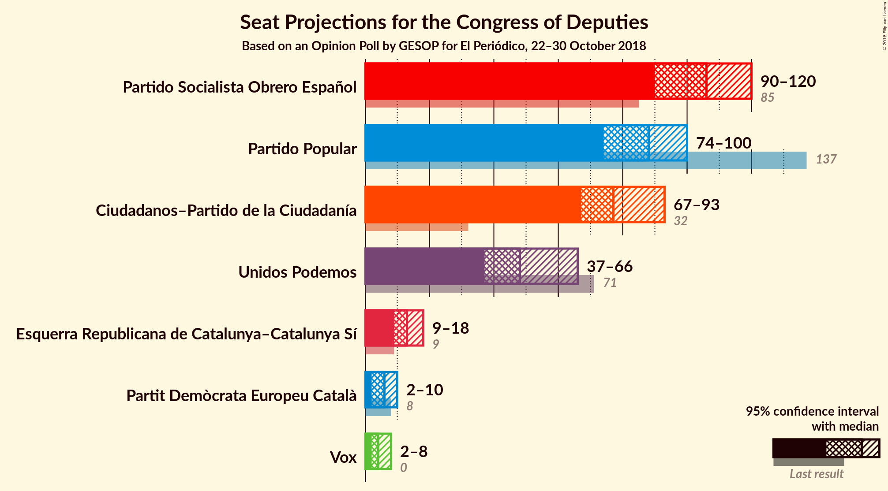
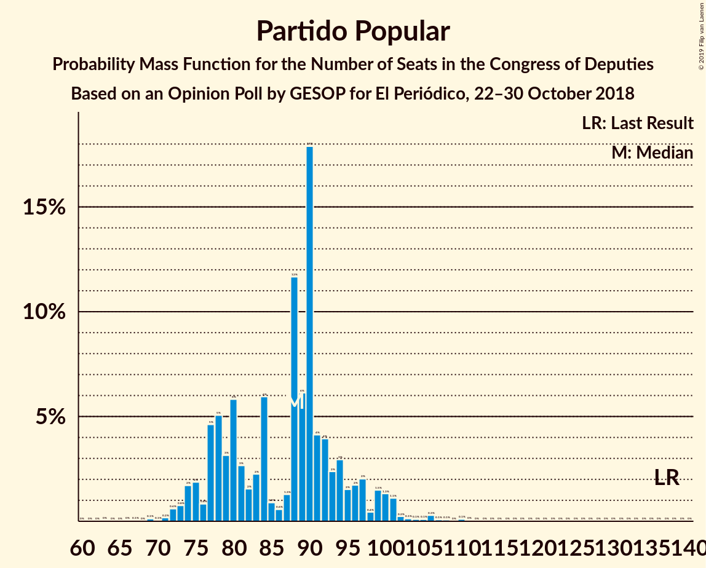
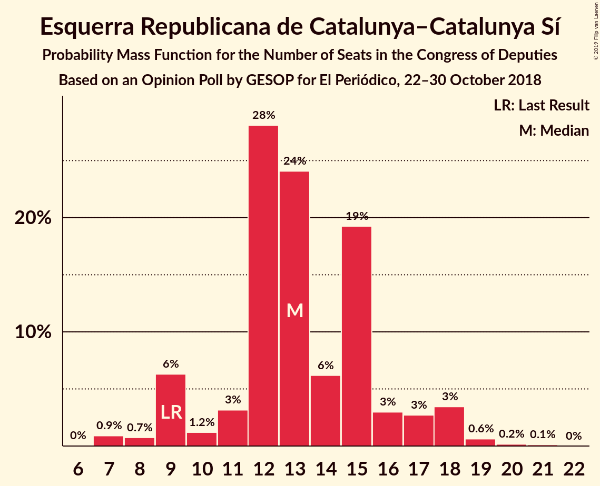

# Opinion Poll by GESOP for El Periódico, 22–30 October 2018

<a href="#voting-intentions">Voting Intentions</a> | <a href="#seats">Seats</a> | <a href="#coalitions">Coalitions</a> | <a href="#technical-information">Technical Information</a>

## Voting Intentions

### Confidence Intervals

| Party | Last Result | Poll Result | 80% Confidence Interval | 90% Confidence Interval | 95% Confidence Interval | 99% Confidence Interval |
|:-----:|:-----------:|:-----------:|:-----------------------:|:-----------------------:|:-----------------------:|:-----------------------:|
| Partido Socialista Obrero Español | 22.6% | 25.2% | 23.5–27.2% |23.0–27.7% |22.5–28.2% |21.7–29.1% |
| Ciudadanos–Partido de la Ciudadanía | 13.1% | 21.8% | 20.2–23.7% |19.7–24.2% |19.3–24.6% |18.5–25.5% |
| Partido Popular | 33.0% | 21.3% | 19.6–23.1% |19.2–23.6% |18.7–24.1% |18.0–25.0% |
| Unidos Podemos | 21.2% | 16.1% | 14.7–17.8% |14.2–18.3% |13.9–18.7% |13.2–19.5% |
| Vox | 0.2% | 4.3% | 3.5–5.3% |3.3–5.6% |3.1–5.8% |2.8–6.3% |
| Esquerra Republicana de Catalunya–Catalunya Sí | 2.7% | 3.3% | 2.7–4.2% |2.5–4.5% |2.3–4.7% |2.0–5.1% |
| Partit Demòcrata Europeu Català | 2.0% | 1.5% | 1.1–2.2% |1.0–2.4% |0.9–2.6% |0.7–2.9% |

*Note:* The poll result column reflects the actual value used in the calculations. Published results may vary slightly, and in addition be rounded to fewer digits.

## Seats

### Confidence Intervals

| Party | Last Result | Median | 80% Confidence Interval | 90% Confidence Interval | 95% Confidence Interval | 99% Confidence Interval |
|:-----:|:-----------:|:------:|:-----------------------:|:-----------------------:|:-----------------------:|:-----------------------:|
| <a href="#partido-socialista-obrero-español">Partido Socialista Obrero Español</a> | 85 | 98 | 97–98 |97–107 |97–107 |90–116 |
| <a href="#ciudadanos–partido-de-la-ciudadanía">Ciudadanos–Partido de la Ciudadanía</a> | 32 | 71 | 71–79 |71–79 |69–79 |64–84 |
| <a href="#partido-popular">Partido Popular</a> | 137 | 84 | 77–84 |77–84 |77–85 |76–93 |
| <a href="#unidos-podemos">Unidos Podemos</a> | 71 | 65 | 63–65 |63–65 |63–65 |41–68 |
| <a href="#vox">Vox</a> | 0 | 4 | 4–6 |4–6 |3–6 |3–6 |
| <a href="#esquerra-republicana-de-catalunya–catalunya-sí">Esquerra Republicana de Catalunya–Catalunya Sí</a> | 9 | 12 | 12 |7–12 |7–12 |7–15 |
| <a href="#partit-demòcrata-europeu-català">Partit Demòcrata Europeu Català</a> | 8 | 0 | 0 |0 |0 |0 |

### Partido Socialista Obrero Español

*For a full overview of the results for this party, see the [Partido Socialista Obrero Español](party-partidosocialistaobreroespañol.html) page.*

| Number of Seats | Probability | Accumulated | Special Marks |
|:---------------:|:-----------:|:-----------:|:-------------:|
| 85 | 0% | 100% | Last Result |
| 86 | 0% | 100% |  |
| 87 | 0% | 100% |  |
| 88 | 0.3% | 100% |  |
| 89 | 0% | 99.7% |  |
| 90 | 0.5% | 99.7% |  |
| 91 | 0% | 99.1% |  |
| 92 | 0% | 99.1% |  |
| 93 | 0% | 99.1% |  |
| 94 | 0% | 99.1% |  |
| 95 | 0% | 99.1% |  |
| 96 | 0% | 99.1% |  |
| 97 | 20% | 99.1% |  |
| 98 | 72% | 80% | Median |
| 99 | 0% | 8% |  |
| 100 | 0% | 8% |  |
| 101 | 0% | 8% |  |
| 102 | 0% | 8% |  |
| 103 | 0% | 8% |  |
| 104 | 0% | 8% |  |
| 105 | 1.1% | 8% |  |
| 106 | 0.1% | 7% |  |
| 107 | 6% | 7% |  |
| 108 | 0% | 1.0% |  |
| 109 | 0.3% | 1.0% |  |
| 110 | 0.1% | 0.6% |  |
| 111 | 0% | 0.5% |  |
| 112 | 0% | 0.5% |  |
| 113 | 0% | 0.5% |  |
| 114 | 0% | 0.5% |  |
| 115 | 0% | 0.5% |  |
| 116 | 0.5% | 0.5% |  |
| 117 | 0% | 0% |  |

### Ciudadanos–Partido de la Ciudadanía

*For a full overview of the results for this party, see the [Ciudadanos–Partido de la Ciudadanía](party-ciudadanos–partidodelaciudadanía.html) page.*

| Number of Seats | Probability | Accumulated | Special Marks |
|:---------------:|:-----------:|:-----------:|:-------------:|
| 32 | 0% | 100% | Last Result |
| 33 | 0% | 100% |  |
| 34 | 0% | 100% |  |
| 35 | 0% | 100% |  |
| 36 | 0% | 100% |  |
| 37 | 0% | 100% |  |
| 38 | 0% | 100% |  |
| 39 | 0% | 100% |  |
| 40 | 0% | 100% |  |
| 41 | 0% | 100% |  |
| 42 | 0% | 100% |  |
| 43 | 0% | 100% |  |
| 44 | 0% | 100% |  |
| 45 | 0% | 100% |  |
| 46 | 0% | 100% |  |
| 47 | 0% | 100% |  |
| 48 | 0% | 100% |  |
| 49 | 0% | 100% |  |
| 50 | 0% | 100% |  |
| 51 | 0% | 100% |  |
| 52 | 0% | 100% |  |
| 53 | 0% | 100% |  |
| 54 | 0% | 100% |  |
| 55 | 0% | 100% |  |
| 56 | 0% | 100% |  |
| 57 | 0% | 100% |  |
| 58 | 0% | 100% |  |
| 59 | 0% | 100% |  |
| 60 | 0% | 100% |  |
| 61 | 0% | 100% |  |
| 62 | 0% | 100% |  |
| 63 | 0% | 100% |  |
| 64 | 2% | 100% |  |
| 65 | 0% | 98% |  |
| 66 | 0% | 98% |  |
| 67 | 0.8% | 98% |  |
| 68 | 0% | 98% |  |
| 69 | 0.5% | 98% |  |
| 70 | 0% | 97% |  |
| 71 | 70% | 97% | Median |
| 72 | 0% | 27% |  |
| 73 | 6% | 27% |  |
| 74 | 0% | 21% |  |
| 75 | 0% | 21% |  |
| 76 | 0.3% | 21% |  |
| 77 | 0.4% | 20% |  |
| 78 | 0% | 20% |  |
| 79 | 19% | 20% |  |
| 80 | 0% | 1.0% |  |
| 81 | 0% | 1.0% |  |
| 82 | 0% | 1.0% |  |
| 83 | 0.4% | 1.0% |  |
| 84 | 0.1% | 0.6% |  |
| 85 | 0.4% | 0.5% |  |
| 86 | 0% | 0.1% |  |
| 87 | 0% | 0% |  |

### Partido Popular

*For a full overview of the results for this party, see the [Partido Popular](party-partidopopular.html) page.*

| Number of Seats | Probability | Accumulated | Special Marks |
|:---------------:|:-----------:|:-----------:|:-------------:|
| 71 | 0.4% | 100% |  |
| 72 | 0% | 99.6% |  |
| 73 | 0% | 99.6% |  |
| 74 | 0% | 99.6% |  |
| 75 | 0% | 99.6% |  |
| 76 | 0.1% | 99.6% |  |
| 77 | 25% | 99.5% |  |
| 78 | 0% | 74% |  |
| 79 | 0% | 74% |  |
| 80 | 0% | 74% |  |
| 81 | 0% | 74% |  |
| 82 | 0% | 74% |  |
| 83 | 0.1% | 74% |  |
| 84 | 70% | 74% | Median |
| 85 | 2% | 4% |  |
| 86 | 0% | 2% |  |
| 87 | 0% | 2% |  |
| 88 | 0% | 2% |  |
| 89 | 0.5% | 2% |  |
| 90 | 0% | 2% |  |
| 91 | 0% | 2% |  |
| 92 | 0% | 2% |  |
| 93 | 2% | 2% |  |
| 94 | 0% | 0% |  |
| 95 | 0% | 0% |  |
| 96 | 0% | 0% |  |
| 97 | 0% | 0% |  |
| 98 | 0% | 0% |  |
| 99 | 0% | 0% |  |
| 100 | 0% | 0% |  |
| 101 | 0% | 0% |  |
| 102 | 0% | 0% |  |
| 103 | 0% | 0% |  |
| 104 | 0% | 0% |  |
| 105 | 0% | 0% |  |
| 106 | 0% | 0% |  |
| 107 | 0% | 0% |  |
| 108 | 0% | 0% |  |
| 109 | 0% | 0% |  |
| 110 | 0% | 0% |  |
| 111 | 0% | 0% |  |
| 112 | 0% | 0% |  |
| 113 | 0% | 0% |  |
| 114 | 0% | 0% |  |
| 115 | 0% | 0% |  |
| 116 | 0% | 0% |  |
| 117 | 0% | 0% |  |
| 118 | 0% | 0% |  |
| 119 | 0% | 0% |  |
| 120 | 0% | 0% |  |
| 121 | 0% | 0% |  |
| 122 | 0% | 0% |  |
| 123 | 0% | 0% |  |
| 124 | 0% | 0% |  |
| 125 | 0% | 0% |  |
| 126 | 0% | 0% |  |
| 127 | 0% | 0% |  |
| 128 | 0% | 0% |  |
| 129 | 0% | 0% |  |
| 130 | 0% | 0% |  |
| 131 | 0% | 0% |  |
| 132 | 0% | 0% |  |
| 133 | 0% | 0% |  |
| 134 | 0% | 0% |  |
| 135 | 0% | 0% |  |
| 136 | 0% | 0% |  |
| 137 | 0% | 0% | Last Result |

### Unidos Podemos

*For a full overview of the results for this party, see the [Unidos Podemos](party-unidospodemos.html) page.*

| Number of Seats | Probability | Accumulated | Special Marks |
|:---------------:|:-----------:|:-----------:|:-------------:|
| 41 | 0.5% | 100% |  |
| 42 | 0% | 99.5% |  |
| 43 | 0% | 99.5% |  |
| 44 | 0% | 99.5% |  |
| 45 | 0.4% | 99.5% |  |
| 46 | 0% | 99.0% |  |
| 47 | 0% | 99.0% |  |
| 48 | 0% | 99.0% |  |
| 49 | 0% | 99.0% |  |
| 50 | 0% | 99.0% |  |
| 51 | 0% | 99.0% |  |
| 52 | 0% | 99.0% |  |
| 53 | 0% | 99.0% |  |
| 54 | 0% | 99.0% |  |
| 55 | 0% | 99.0% |  |
| 56 | 0% | 99.0% |  |
| 57 | 0% | 99.0% |  |
| 58 | 0% | 99.0% |  |
| 59 | 0% | 99.0% |  |
| 60 | 0% | 99.0% |  |
| 61 | 0.4% | 99.0% |  |
| 62 | 0% | 98.6% |  |
| 63 | 24% | 98.6% |  |
| 64 | 3% | 74% |  |
| 65 | 70% | 71% | Median |
| 66 | 0% | 0.8% |  |
| 67 | 0% | 0.8% |  |
| 68 | 0.8% | 0.8% |  |
| 69 | 0% | 0% |  |
| 70 | 0% | 0% |  |
| 71 | 0% | 0% | Last Result |

### Vox

*For a full overview of the results for this party, see the [Vox](party-vox.html) page.*

| Number of Seats | Probability | Accumulated | Special Marks |
|:---------------:|:-----------:|:-----------:|:-------------:|
| 0 | 0% | 100% | Last Result |
| 1 | 0% | 100% |  |
| 2 | 0% | 100% |  |
| 3 | 3% | 100% |  |
| 4 | 70% | 97% | Median |
| 5 | 3% | 27% |  |
| 6 | 24% | 24% |  |
| 7 | 0.1% | 0.1% |  |
| 8 | 0% | 0% |  |

### Esquerra Republicana de Catalunya–Catalunya Sí

*For a full overview of the results for this party, see the [Esquerra Republicana de Catalunya–Catalunya Sí](party-esquerrarepublicanadecatalunya–catalunyasí.html) page.*

| Number of Seats | Probability | Accumulated | Special Marks |
|:---------------:|:-----------:|:-----------:|:-------------:|
| 7 | 7% | 100% |  |
| 8 | 0% | 93% |  |
| 9 | 0.4% | 93% | Last Result |
| 10 | 0.1% | 92% |  |
| 11 | 0% | 92% |  |
| 12 | 91% | 92% | Median |
| 13 | 0.4% | 1.3% |  |
| 14 | 0% | 0.8% |  |
| 15 | 0.8% | 0.8% |  |
| 16 | 0% | 0% |  |

### Partit Demòcrata Europeu Català

*For a full overview of the results for this party, see the [Partit Demòcrata Europeu Català](party-partitdemòcrataeuropeucatalà.html) page.*

| Number of Seats | Probability | Accumulated | Special Marks |
|:---------------:|:-----------:|:-----------:|:-------------:|
| 0 | 100% | 100% | Median |
| 1 | 0% | 0% |  |
| 2 | 0% | 0% |  |
| 3 | 0% | 0% |  |
| 4 | 0% | 0% |  |
| 5 | 0% | 0% |  |
| 6 | 0% | 0% |  |
| 7 | 0% | 0% |  |
| 8 | 0% | 0% | Last Result |

## Coalitions

### Confidence Intervals

| Coalition | Last Result | Median | Majority? | 80% Confidence Interval | 90% Confidence Interval | 95% Confidence Interval | 99% Confidence Interval |
|:---------:|:-----------:|:------:|:---------:|:-----------------------:|:-----------------------:|:-----------------------:|:-----------------------:|
| Partido Socialista Obrero Español – Ciudadanos–Partido de la Ciudadanía – Partido Popular | 254 | 253 | 100% | 253–254 | 253–257 | 253–257 | 248–276 |
| Partido Socialista Obrero Español – Ciudadanos–Partido de la Ciudadanía – Unidos Podemos | 188 | 234 | 100% | 234–239 | 234–243 | 231–243 | 224–243 |
| Partido Socialista Obrero Español – Ciudadanos–Partido de la Ciudadanía | 117 | 169 | 26% | 169–176 | 169–180 | 169–180 | 159–200 |
| Partido Socialista Obrero Español – Unidos Podemos – Esquerra Republicana de Catalunya–Catalunya Sí – Partit Demòcrata Europeu Català | 173 | 175 | 6% | 172–175 | 172–177 | 172–177 | 167–177 |
| Partido Socialista Obrero Español – Unidos Podemos | 156 | 163 | 0% | 160–163 | 160–170 | 160–170 | 156–170 |
| Ciudadanos–Partido de la Ciudadanía – Partido Popular – Vox | 169 | 159 | 0% | 159–162 | 156–162 | 156–162 | 156–167 |
| Ciudadanos–Partido de la Ciudadanía – Partido Popular | 169 | 155 | 0% | 155–156 | 150–156 | 150–157 | 150–161 |
| Partido Socialista Obrero Español | 85 | 98 | 0% | 97–98 | 97–107 | 97–107 | 90–116 |
| Partido Popular – Vox | 137 | 88 | 0% | 83–88 | 83–88 | 82–91 | 82–97 |
| Partido Popular | 137 | 84 | 0% | 77–84 | 77–84 | 77–85 | 76–93 |

### Partido Socialista Obrero Español – Ciudadanos–Partido de la Ciudadanía – Partido Popular

| Number of Seats | Probability | Accumulated | Special Marks |
|:---------------:|:-----------:|:-----------:|:-------------:|
| 248 | 0.5% | 100% |  |
| 249 | 0.3% | 99.5% |  |
| 250 | 0% | 99.2% |  |
| 251 | 0% | 99.2% |  |
| 252 | 0% | 99.2% |  |
| 253 | 89% | 99.2% | Median |
| 254 | 1.0% | 10% | Last Result |
| 255 | 1.1% | 9% |  |
| 256 | 0% | 8% |  |
| 257 | 7% | 8% |  |
| 258 | 0% | 1.4% |  |
| 259 | 0.4% | 1.4% |  |
| 260 | 0% | 1.0% |  |
| 261 | 0% | 1.0% |  |
| 262 | 0% | 1.0% |  |
| 263 | 0% | 1.0% |  |
| 264 | 0% | 1.0% |  |
| 265 | 0% | 1.0% |  |
| 266 | 0% | 1.0% |  |
| 267 | 0% | 1.0% |  |
| 268 | 0% | 1.0% |  |
| 269 | 0% | 1.0% |  |
| 270 | 0.4% | 1.0% |  |
| 271 | 0% | 0.5% |  |
| 272 | 0% | 0.5% |  |
| 273 | 0% | 0.5% |  |
| 274 | 0% | 0.5% |  |
| 275 | 0% | 0.5% |  |
| 276 | 0.1% | 0.5% |  |
| 277 | 0% | 0.4% |  |
| 278 | 0.4% | 0.4% |  |
| 279 | 0% | 0% |  |

### Partido Socialista Obrero Español – Ciudadanos–Partido de la Ciudadanía – Unidos Podemos

| Number of Seats | Probability | Accumulated | Special Marks |
|:---------------:|:-----------:|:-----------:|:-------------:|
| 188 | 0% | 100% | Last Result |
| 189 | 0% | 100% |  |
| 190 | 0% | 100% |  |
| 191 | 0% | 100% |  |
| 192 | 0% | 100% |  |
| 193 | 0% | 100% |  |
| 194 | 0% | 100% |  |
| 195 | 0% | 100% |  |
| 196 | 0% | 100% |  |
| 197 | 0% | 100% |  |
| 198 | 0% | 100% |  |
| 199 | 0% | 100% |  |
| 200 | 0% | 100% |  |
| 201 | 0% | 100% |  |
| 202 | 0% | 100% |  |
| 203 | 0% | 100% |  |
| 204 | 0% | 100% |  |
| 205 | 0% | 100% |  |
| 206 | 0% | 100% |  |
| 207 | 0% | 100% |  |
| 208 | 0% | 100% |  |
| 209 | 0% | 100% |  |
| 210 | 0% | 100% |  |
| 211 | 0% | 100% |  |
| 212 | 0% | 100% |  |
| 213 | 0% | 100% |  |
| 214 | 0% | 100% |  |
| 215 | 0% | 100% |  |
| 216 | 0% | 100% |  |
| 217 | 0% | 100% |  |
| 218 | 0% | 100% |  |
| 219 | 0% | 100% |  |
| 220 | 0% | 100% |  |
| 221 | 0% | 100% |  |
| 222 | 0% | 100% |  |
| 223 | 0% | 100% |  |
| 224 | 0.5% | 100% |  |
| 225 | 1.2% | 99.5% |  |
| 226 | 0% | 98% |  |
| 227 | 0.5% | 98% |  |
| 228 | 0% | 98% |  |
| 229 | 0% | 98% |  |
| 230 | 0% | 98% |  |
| 231 | 0.4% | 98% |  |
| 232 | 0.4% | 97% |  |
| 233 | 0% | 97% |  |
| 234 | 70% | 97% | Median |
| 235 | 0.8% | 27% |  |
| 236 | 0% | 26% |  |
| 237 | 0% | 26% |  |
| 238 | 0% | 26% |  |
| 239 | 16% | 26% |  |
| 240 | 3% | 10% |  |
| 241 | 0.1% | 7% |  |
| 242 | 0.4% | 7% |  |
| 243 | 6% | 6% |  |
| 244 | 0% | 0.4% |  |
| 245 | 0% | 0.4% |  |
| 246 | 0% | 0.4% |  |
| 247 | 0% | 0.4% |  |
| 248 | 0% | 0.4% |  |
| 249 | 0.4% | 0.4% |  |
| 250 | 0% | 0% |  |

### Partido Socialista Obrero Español – Ciudadanos–Partido de la Ciudadanía

| Number of Seats | Probability | Accumulated | Special Marks |
|:---------------:|:-----------:|:-----------:|:-------------:|
| 117 | 0% | 100% | Last Result |
| 118 | 0% | 100% |  |
| 119 | 0% | 100% |  |
| 120 | 0% | 100% |  |
| 121 | 0% | 100% |  |
| 122 | 0% | 100% |  |
| 123 | 0% | 100% |  |
| 124 | 0% | 100% |  |
| 125 | 0% | 100% |  |
| 126 | 0% | 100% |  |
| 127 | 0% | 100% |  |
| 128 | 0% | 100% |  |
| 129 | 0% | 100% |  |
| 130 | 0% | 100% |  |
| 131 | 0% | 100% |  |
| 132 | 0% | 100% |  |
| 133 | 0% | 100% |  |
| 134 | 0% | 100% |  |
| 135 | 0% | 100% |  |
| 136 | 0% | 100% |  |
| 137 | 0% | 100% |  |
| 138 | 0% | 100% |  |
| 139 | 0% | 100% |  |
| 140 | 0% | 100% |  |
| 141 | 0% | 100% |  |
| 142 | 0% | 100% |  |
| 143 | 0% | 100% |  |
| 144 | 0% | 100% |  |
| 145 | 0% | 100% |  |
| 146 | 0% | 100% |  |
| 147 | 0% | 100% |  |
| 148 | 0% | 100% |  |
| 149 | 0% | 100% |  |
| 150 | 0% | 100% |  |
| 151 | 0% | 100% |  |
| 152 | 0% | 100% |  |
| 153 | 0% | 100% |  |
| 154 | 0% | 100% |  |
| 155 | 0% | 100% |  |
| 156 | 0% | 100% |  |
| 157 | 0% | 100% |  |
| 158 | 0% | 100% |  |
| 159 | 0.5% | 100% |  |
| 160 | 0% | 99.5% |  |
| 161 | 0.5% | 99.5% |  |
| 162 | 1.1% | 99.0% |  |
| 163 | 0% | 98% |  |
| 164 | 0.3% | 98% |  |
| 165 | 0% | 98% |  |
| 166 | 0% | 98% |  |
| 167 | 0% | 98% |  |
| 168 | 0% | 98% |  |
| 169 | 70% | 98% | Median |
| 170 | 0% | 27% |  |
| 171 | 0% | 27% |  |
| 172 | 0.8% | 27% |  |
| 173 | 0% | 26% |  |
| 174 | 0% | 26% |  |
| 175 | 0% | 26% |  |
| 176 | 19% | 26% | Majority |
| 177 | 0% | 7% |  |
| 178 | 0% | 7% |  |
| 179 | 0.1% | 7% |  |
| 180 | 6% | 7% |  |
| 181 | 0% | 1.4% |  |
| 182 | 0% | 1.4% |  |
| 183 | 0% | 1.4% |  |
| 184 | 0% | 1.4% |  |
| 185 | 0% | 1.4% |  |
| 186 | 0.3% | 1.4% |  |
| 187 | 0.1% | 1.0% |  |
| 188 | 0.4% | 0.9% |  |
| 189 | 0% | 0.6% |  |
| 190 | 0% | 0.5% |  |
| 191 | 0% | 0.5% |  |
| 192 | 0% | 0.5% |  |
| 193 | 0% | 0.5% |  |
| 194 | 0% | 0.5% |  |
| 195 | 0% | 0.5% |  |
| 196 | 0% | 0.5% |  |
| 197 | 0% | 0.5% |  |
| 198 | 0% | 0.5% |  |
| 199 | 0% | 0.5% |  |
| 200 | 0.1% | 0.5% |  |
| 201 | 0.4% | 0.4% |  |
| 202 | 0% | 0% |  |

### Partido Socialista Obrero Español – Unidos Podemos – Esquerra Republicana de Catalunya–Catalunya Sí – Partit Demòcrata Europeu Català

| Number of Seats | Probability | Accumulated | Special Marks |
|:---------------:|:-----------:|:-----------:|:-------------:|
| 163 | 0% | 100% |  |
| 164 | 0% | 99.9% |  |
| 165 | 0% | 99.9% |  |
| 166 | 0.4% | 99.9% |  |
| 167 | 0.5% | 99.5% |  |
| 168 | 0.1% | 99.1% |  |
| 169 | 0% | 99.0% |  |
| 170 | 0% | 99.0% |  |
| 171 | 0.2% | 99.0% |  |
| 172 | 17% | 98.7% |  |
| 173 | 5% | 82% | Last Result |
| 174 | 0% | 77% |  |
| 175 | 71% | 77% | Median |
| 176 | 0% | 6% | Majority |
| 177 | 6% | 6% |  |
| 178 | 0% | 0% |  |

### Partido Socialista Obrero Español – Unidos Podemos

| Number of Seats | Probability | Accumulated | Special Marks |
|:---------------:|:-----------:|:-----------:|:-------------:|
| 145 | 0% | 100% |  |
| 146 | 0% | 99.9% |  |
| 147 | 0% | 99.9% |  |
| 148 | 0% | 99.9% |  |
| 149 | 0% | 99.9% |  |
| 150 | 0% | 99.9% |  |
| 151 | 0% | 99.9% |  |
| 152 | 0% | 99.9% |  |
| 153 | 0% | 99.9% |  |
| 154 | 0.3% | 99.9% |  |
| 155 | 0.1% | 99.6% |  |
| 156 | 0.3% | 99.5% | Last Result |
| 157 | 0.5% | 99.2% |  |
| 158 | 0.5% | 98.7% |  |
| 159 | 0% | 98% |  |
| 160 | 17% | 98% |  |
| 161 | 4% | 82% |  |
| 162 | 0% | 77% |  |
| 163 | 70% | 77% | Median |
| 164 | 0% | 7% |  |
| 165 | 0% | 7% |  |
| 166 | 0.4% | 7% |  |
| 167 | 0% | 7% |  |
| 168 | 0.8% | 7% |  |
| 169 | 0% | 6% |  |
| 170 | 6% | 6% |  |
| 171 | 0% | 0% |  |

### Ciudadanos–Partido de la Ciudadanía – Partido Popular – Vox

| Number of Seats | Probability | Accumulated | Special Marks |
|:---------------:|:-----------:|:-----------:|:-------------:|
| 156 | 6% | 100% |  |
| 157 | 0% | 94% |  |
| 158 | 0.8% | 94% |  |
| 159 | 70% | 93% | Median |
| 160 | 1.5% | 23% |  |
| 161 | 4% | 21% |  |
| 162 | 16% | 17% |  |
| 163 | 0% | 1.3% |  |
| 164 | 0.3% | 1.3% |  |
| 165 | 0% | 1.0% |  |
| 166 | 0.1% | 1.0% |  |
| 167 | 0.5% | 0.9% |  |
| 168 | 0.4% | 0.5% |  |
| 169 | 0% | 0.1% | Last Result |
| 170 | 0% | 0.1% |  |
| 171 | 0% | 0.1% |  |
| 172 | 0% | 0.1% |  |
| 173 | 0% | 0% |  |

### Ciudadanos–Partido de la Ciudadanía – Partido Popular

| Number of Seats | Probability | Accumulated | Special Marks |
|:---------------:|:-----------:|:-----------:|:-------------:|
| 150 | 6% | 100% |  |
| 151 | 0% | 94% |  |
| 152 | 0.8% | 94% |  |
| 153 | 0% | 93% |  |
| 154 | 0.4% | 93% |  |
| 155 | 70% | 93% | Median |
| 156 | 20% | 23% |  |
| 157 | 2% | 3% |  |
| 158 | 0.5% | 2% |  |
| 159 | 0% | 1.3% |  |
| 160 | 0.2% | 1.3% |  |
| 161 | 0.6% | 1.1% |  |
| 162 | 0.4% | 0.5% |  |
| 163 | 0% | 0.1% |  |
| 164 | 0% | 0.1% |  |
| 165 | 0% | 0.1% |  |
| 166 | 0% | 0.1% |  |
| 167 | 0% | 0.1% |  |
| 168 | 0% | 0% |  |
| 169 | 0% | 0% | Last Result |

### Partido Socialista Obrero Español

| Number of Seats | Probability | Accumulated | Special Marks |
|:---------------:|:-----------:|:-----------:|:-------------:|
| 85 | 0% | 100% | Last Result |
| 86 | 0% | 100% |  |
| 87 | 0% | 100% |  |
| 88 | 0.3% | 100% |  |
| 89 | 0% | 99.7% |  |
| 90 | 0.5% | 99.7% |  |
| 91 | 0% | 99.1% |  |
| 92 | 0% | 99.1% |  |
| 93 | 0% | 99.1% |  |
| 94 | 0% | 99.1% |  |
| 95 | 0% | 99.1% |  |
| 96 | 0% | 99.1% |  |
| 97 | 20% | 99.1% |  |
| 98 | 72% | 80% | Median |
| 99 | 0% | 8% |  |
| 100 | 0% | 8% |  |
| 101 | 0% | 8% |  |
| 102 | 0% | 8% |  |
| 103 | 0% | 8% |  |
| 104 | 0% | 8% |  |
| 105 | 1.1% | 8% |  |
| 106 | 0.1% | 7% |  |
| 107 | 6% | 7% |  |
| 108 | 0% | 1.0% |  |
| 109 | 0.3% | 1.0% |  |
| 110 | 0.1% | 0.6% |  |
| 111 | 0% | 0.5% |  |
| 112 | 0% | 0.5% |  |
| 113 | 0% | 0.5% |  |
| 114 | 0% | 0.5% |  |
| 115 | 0% | 0.5% |  |
| 116 | 0.5% | 0.5% |  |
| 117 | 0% | 0% |  |

### Partido Popular – Vox

| Number of Seats | Probability | Accumulated | Special Marks |
|:---------------:|:-----------:|:-----------:|:-------------:|
| 77 | 0.4% | 100% |  |
| 78 | 0% | 99.6% |  |
| 79 | 0% | 99.6% |  |
| 80 | 0% | 99.6% |  |
| 81 | 0% | 99.6% |  |
| 82 | 3% | 99.6% |  |
| 83 | 23% | 97% |  |
| 84 | 0% | 74% |  |
| 85 | 0% | 74% |  |
| 86 | 0% | 74% |  |
| 87 | 0% | 74% |  |
| 88 | 71% | 74% | Median |
| 89 | 0.1% | 3% |  |
| 90 | 0.3% | 3% |  |
| 91 | 0.8% | 3% |  |
| 92 | 0.5% | 2% |  |
| 93 | 0% | 2% |  |
| 94 | 0% | 2% |  |
| 95 | 0% | 2% |  |
| 96 | 1.1% | 2% |  |
| 97 | 0.5% | 0.5% |  |
| 98 | 0% | 0% |  |
| 99 | 0% | 0% |  |
| 100 | 0% | 0% |  |
| 101 | 0% | 0% |  |
| 102 | 0% | 0% |  |
| 103 | 0% | 0% |  |
| 104 | 0% | 0% |  |
| 105 | 0% | 0% |  |
| 106 | 0% | 0% |  |
| 107 | 0% | 0% |  |
| 108 | 0% | 0% |  |
| 109 | 0% | 0% |  |
| 110 | 0% | 0% |  |
| 111 | 0% | 0% |  |
| 112 | 0% | 0% |  |
| 113 | 0% | 0% |  |
| 114 | 0% | 0% |  |
| 115 | 0% | 0% |  |
| 116 | 0% | 0% |  |
| 117 | 0% | 0% |  |
| 118 | 0% | 0% |  |
| 119 | 0% | 0% |  |
| 120 | 0% | 0% |  |
| 121 | 0% | 0% |  |
| 122 | 0% | 0% |  |
| 123 | 0% | 0% |  |
| 124 | 0% | 0% |  |
| 125 | 0% | 0% |  |
| 126 | 0% | 0% |  |
| 127 | 0% | 0% |  |
| 128 | 0% | 0% |  |
| 129 | 0% | 0% |  |
| 130 | 0% | 0% |  |
| 131 | 0% | 0% |  |
| 132 | 0% | 0% |  |
| 133 | 0% | 0% |  |
| 134 | 0% | 0% |  |
| 135 | 0% | 0% |  |
| 136 | 0% | 0% |  |
| 137 | 0% | 0% | Last Result |

### Partido Popular

| Number of Seats | Probability | Accumulated | Special Marks |
|:---------------:|:-----------:|:-----------:|:-------------:|
| 71 | 0.4% | 100% |  |
| 72 | 0% | 99.6% |  |
| 73 | 0% | 99.6% |  |
| 74 | 0% | 99.6% |  |
| 75 | 0% | 99.6% |  |
| 76 | 0.1% | 99.6% |  |
| 77 | 25% | 99.5% |  |
| 78 | 0% | 74% |  |
| 79 | 0% | 74% |  |
| 80 | 0% | 74% |  |
| 81 | 0% | 74% |  |
| 82 | 0% | 74% |  |
| 83 | 0.1% | 74% |  |
| 84 | 70% | 74% | Median |
| 85 | 2% | 4% |  |
| 86 | 0% | 2% |  |
| 87 | 0% | 2% |  |
| 88 | 0% | 2% |  |
| 89 | 0.5% | 2% |  |
| 90 | 0% | 2% |  |
| 91 | 0% | 2% |  |
| 92 | 0% | 2% |  |
| 93 | 2% | 2% |  |
| 94 | 0% | 0% |  |
| 95 | 0% | 0% |  |
| 96 | 0% | 0% |  |
| 97 | 0% | 0% |  |
| 98 | 0% | 0% |  |
| 99 | 0% | 0% |  |
| 100 | 0% | 0% |  |
| 101 | 0% | 0% |  |
| 102 | 0% | 0% |  |
| 103 | 0% | 0% |  |
| 104 | 0% | 0% |  |
| 105 | 0% | 0% |  |
| 106 | 0% | 0% |  |
| 107 | 0% | 0% |  |
| 108 | 0% | 0% |  |
| 109 | 0% | 0% |  |
| 110 | 0% | 0% |  |
| 111 | 0% | 0% |  |
| 112 | 0% | 0% |  |
| 113 | 0% | 0% |  |
| 114 | 0% | 0% |  |
| 115 | 0% | 0% |  |
| 116 | 0% | 0% |  |
| 117 | 0% | 0% |  |
| 118 | 0% | 0% |  |
| 119 | 0% | 0% |  |
| 120 | 0% | 0% |  |
| 121 | 0% | 0% |  |
| 122 | 0% | 0% |  |
| 123 | 0% | 0% |  |
| 124 | 0% | 0% |  |
| 125 | 0% | 0% |  |
| 126 | 0% | 0% |  |
| 127 | 0% | 0% |  |
| 128 | 0% | 0% |  |
| 129 | 0% | 0% |  |
| 130 | 0% | 0% |  |
| 131 | 0% | 0% |  |
| 132 | 0% | 0% |  |
| 133 | 0% | 0% |  |
| 134 | 0% | 0% |  |
| 135 | 0% | 0% |  |
| 136 | 0% | 0% |  |
| 137 | 0% | 0% | Last Result |

## Technical Information

### Opinion Poll

+ **Polling firm:** GESOP
+ **Commissioner(s):** El Periódico
+ **Fieldwork period:** 22–30 October 2018

### Calculations

+ **Sample size:** 911
+ **Simulations done:** 1,024
+ **Error estimate:** 2.23%

