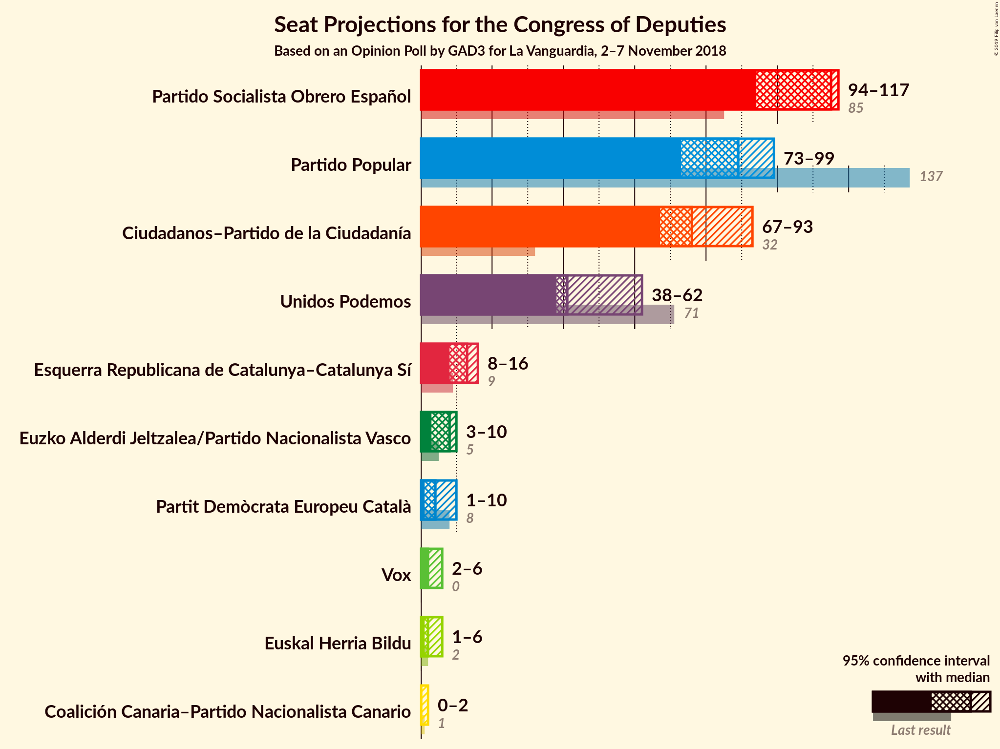
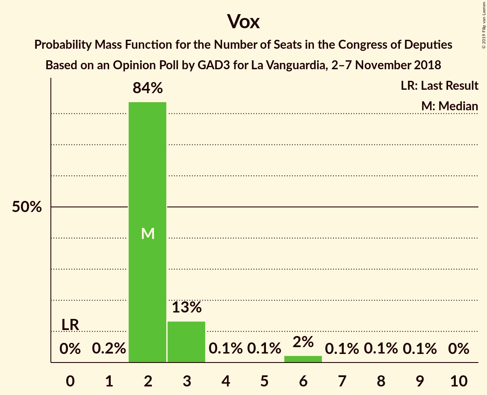
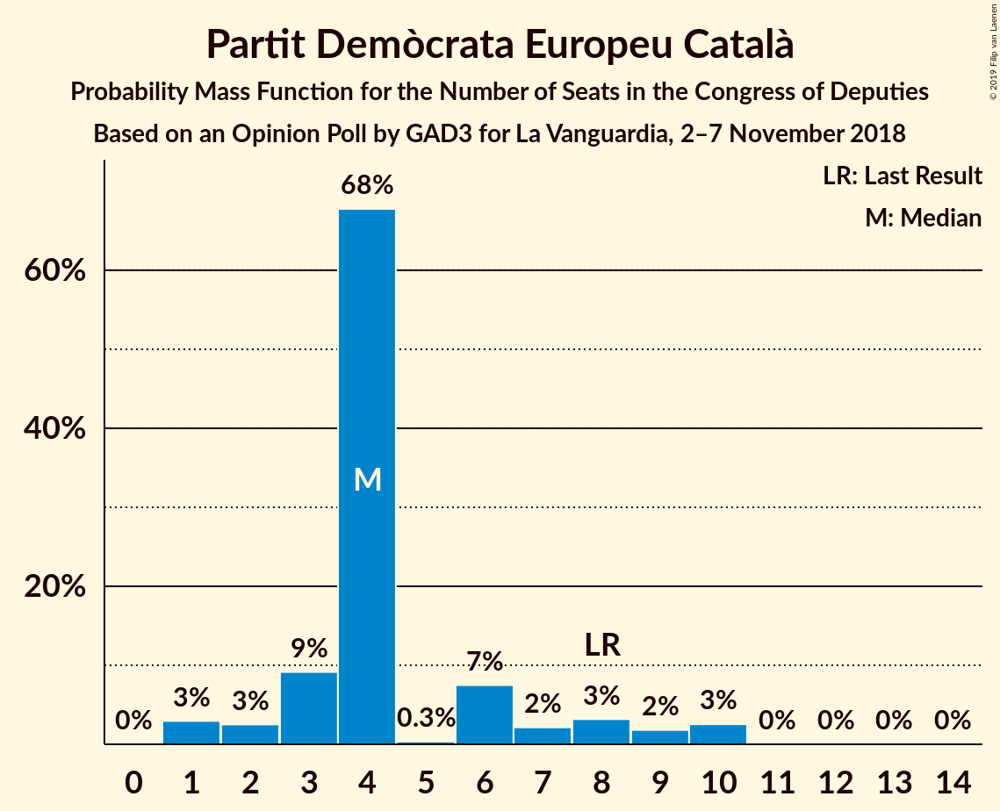
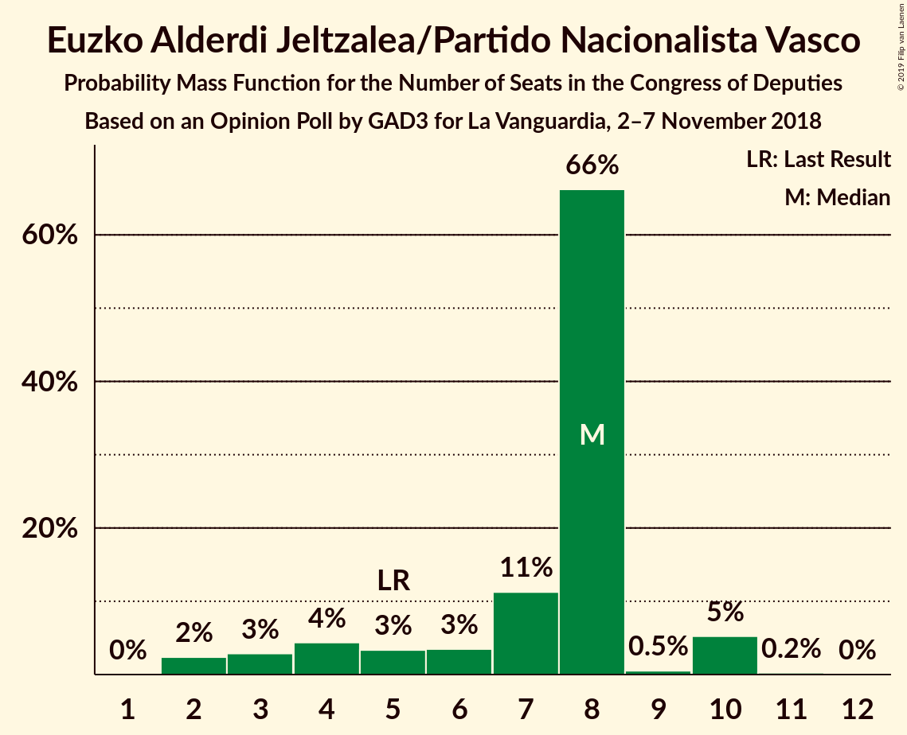
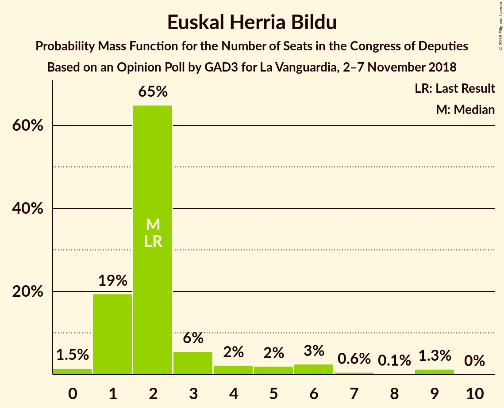
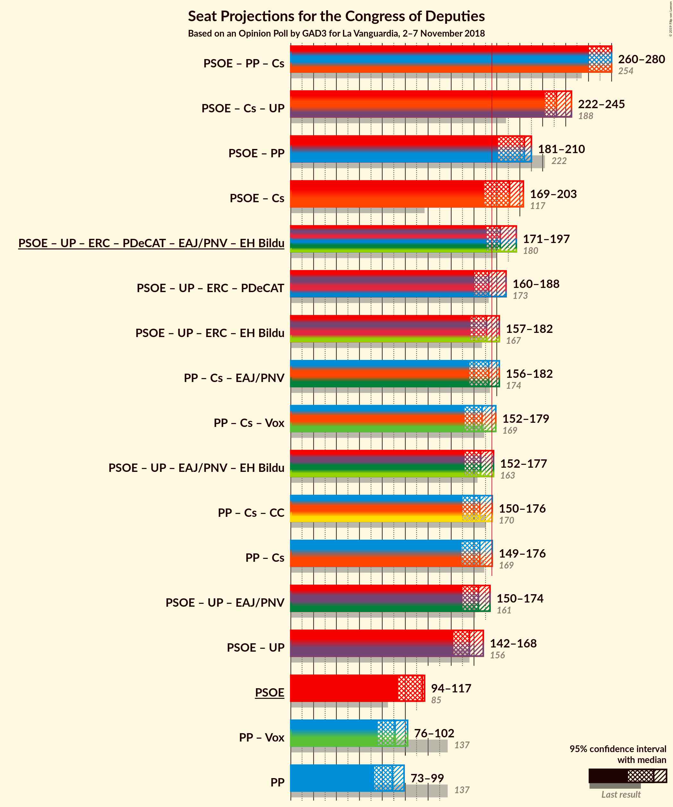
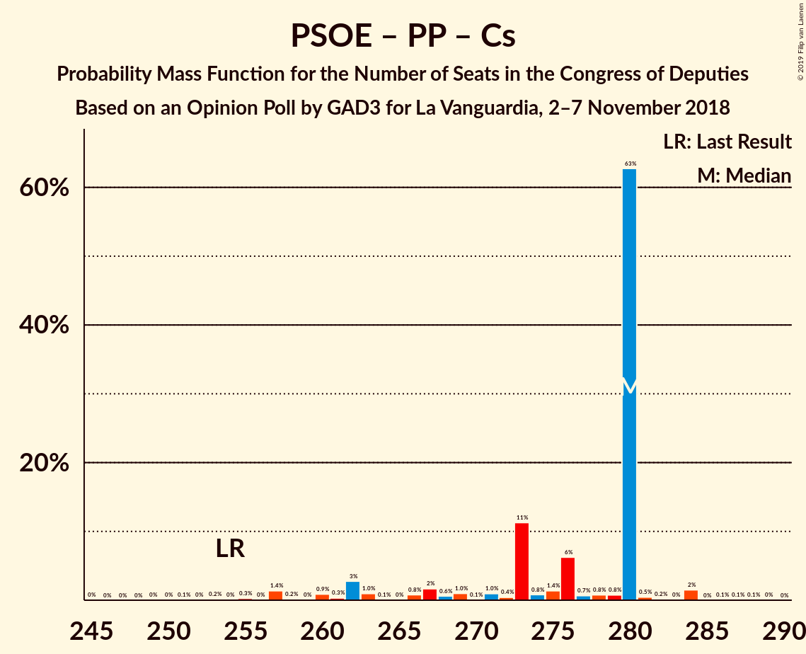
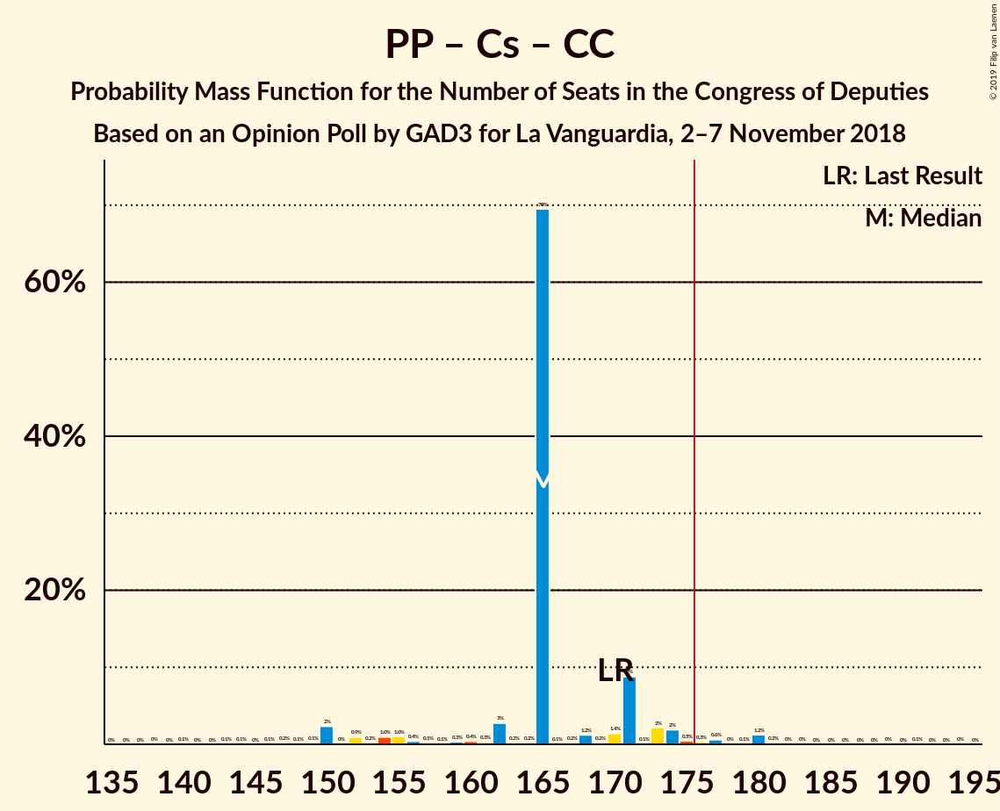
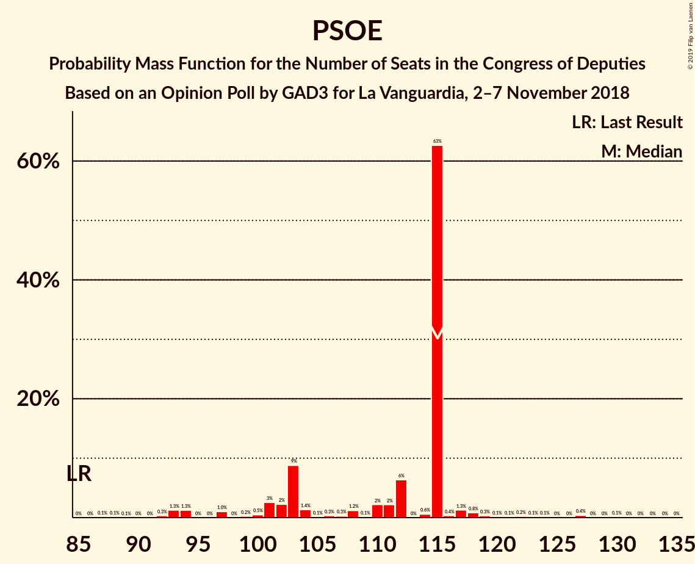
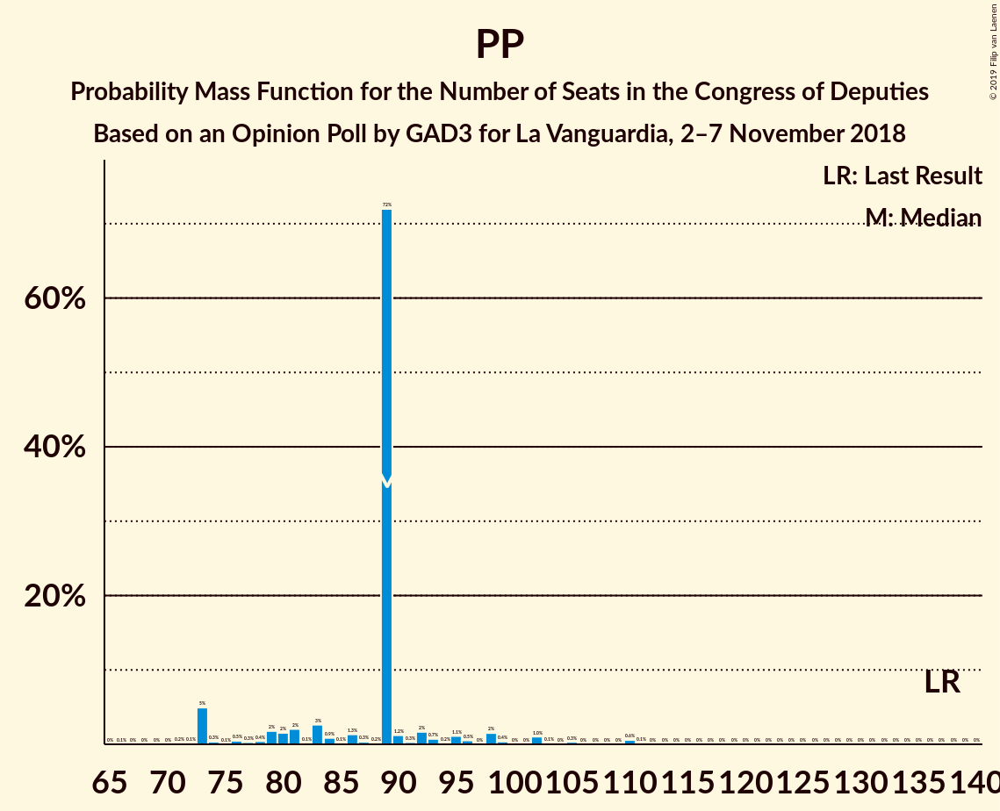

# Opinion Poll by GAD3 for La Vanguardia, 2–7 November 2018

<a href="#voting-intentions">Voting Intentions</a> | <a href="#seats">Seats</a> | <a href="#coalitions">Coalitions</a> | <a href="#technical-information">Technical Information</a>

## Voting Intentions

### Confidence Intervals

| Party | Last Result | Poll Result | 80% Confidence Interval | 90% Confidence Interval | 95% Confidence Interval | 99% Confidence Interval |
|:-----:|:-----------:|:-----------:|:-----------------------:|:-----------------------:|:-----------------------:|:-----------------------:|
| Partido Socialista Obrero Español | 22.6% | 26.6% | 24.7–28.7% |24.1–29.3% |23.7–29.8% |22.8–30.8% |
| Partido Popular | 33.0% | 22.2% | 20.4–24.2% |19.9–24.8% |19.5–25.3% |18.7–26.2% |
| Ciudadanos–Partido de la Ciudadanía | 13.1% | 21.9% | 20.1–23.8% |19.6–24.4% |19.1–24.9% |18.3–25.8% |
| Unidos Podemos | 21.2% | 16.6% | 15.0–18.4% |14.6–18.9% |14.2–19.4% |13.5–20.3% |
| Vox | 0.2% | 3.4% | 2.7–4.3% |2.5–4.6% |2.3–4.9% |2.0–5.4% |
| Esquerra Republicana de Catalunya–Catalunya Sí | 2.7% | 2.9% | 2.2–3.8% |2.1–4.1% |1.9–4.3% |1.7–4.8% |
| Partit Demòcrata Europeu Català | 2.0% | 1.4% | 1.0–2.1% |0.9–2.3% |0.8–2.5% |0.6–2.8% |
| Euzko Alderdi Jeltzalea/Partido Nacionalista Vasco | 1.2% | 1.2% | 0.9–1.9% |0.8–2.1% |0.7–2.3% |0.5–2.7% |
| Euskal Herria Bildu | 0.8% | 0.6% | 0.4–1.2% |0.3–1.3% |0.3–1.5% |0.2–1.8% |
| Coalición Canaria–Partido Nacionalista Canario | 0.3% | 0.1% | 0.1–0.5% |0.0–0.6% |0.0–0.7% |0.0–0.9% |

*Note:* The poll result column reflects the actual value used in the calculations. Published results may vary slightly, and in addition be rounded to fewer digits.

## Seats

### Confidence Intervals

| Party | Last Result | Median | 80% Confidence Interval | 90% Confidence Interval | 95% Confidence Interval | 99% Confidence Interval |
|:-----:|:-----------:|:------:|:-----------------------:|:-----------------------:|:-----------------------:|:-----------------------:|
| <a href="#partido-socialista-obrero-español">Partido Socialista Obrero Español</a> | 85 | 106 | 86–120 |86–120 |86–120 |86–120 |
| <a href="#partido-popular">Partido Popular</a> | 137 | 87 | 76–95 |76–103 |76–103 |76–103 |
| <a href="#ciudadanos–partido-de-la-ciudadanía">Ciudadanos–Partido de la Ciudadanía</a> | 32 | 75 | 69–95 |69–95 |69–95 |64–99 |
| <a href="#unidos-podemos">Unidos Podemos</a> | 71 | 47 | 40–58 |38–58 |32–58 |32–58 |
| <a href="#vox">Vox</a> | 0 | 3 | 2–6 |2–6 |2–6 |2–6 |
| <a href="#esquerra-republicana-de-catalunya–catalunya-sí">Esquerra Republicana de Catalunya–Catalunya Sí</a> | 9 | 11 | 7–15 |7–15 |7–15 |7–22 |
| <a href="#partit-demòcrata-europeu-català">Partit Demòcrata Europeu Català</a> | 8 | 7 | 6–10 |2–10 |2–10 |2–11 |
| <a href="#euzko-alderdi-jeltzalea/partido-nacionalista-vasco">Euzko Alderdi Jeltzalea/Partido Nacionalista Vasco</a> | 5 | 7 | 6–12 |4–12 |4–12 |4–12 |
| <a href="#euskal-herria-bildu">Euskal Herria Bildu</a> | 2 | 5 | 0–6 |0–6 |0–6 |0–6 |
| <a href="#coalición-canaria–partido-nacionalista-canario">Coalición Canaria–Partido Nacionalista Canario</a> | 1 | 1 | 0–4 |0–4 |0–4 |0–4 |

### Partido Socialista Obrero Español

*For a full overview of the results for this party, see the [Partido Socialista Obrero Español](party-partidosocialistaobreroespañol.html) page.*

| Number of Seats | Probability | Accumulated | Special Marks |
|:---------------:|:-----------:|:-----------:|:-------------:|
| 85 | 0% | 100% | Last Result |
| 86 | 33% | 100% |  |
| 87 | 0% | 67% |  |
| 88 | 0% | 67% |  |
| 89 | 0% | 67% |  |
| 90 | 0.1% | 67% |  |
| 91 | 2% | 67% |  |
| 92 | 0% | 65% |  |
| 93 | 0.1% | 65% |  |
| 94 | 0% | 65% |  |
| 95 | 0.2% | 65% |  |
| 96 | 0.1% | 65% |  |
| 97 | 0.9% | 65% |  |
| 98 | 0% | 64% |  |
| 99 | 4% | 64% |  |
| 100 | 0% | 60% |  |
| 101 | 0% | 60% |  |
| 102 | 1.5% | 60% |  |
| 103 | 0% | 58% |  |
| 104 | 0% | 58% |  |
| 105 | 0% | 58% |  |
| 106 | 28% | 58% | Median |
| 107 | 0% | 31% |  |
| 108 | 14% | 31% |  |
| 109 | 0.3% | 17% |  |
| 110 | 0.2% | 16% |  |
| 111 | 0% | 16% |  |
| 112 | 0% | 16% |  |
| 113 | 0% | 16% |  |
| 114 | 0% | 16% |  |
| 115 | 0% | 16% |  |
| 116 | 0% | 16% |  |
| 117 | 0% | 16% |  |
| 118 | 0% | 16% |  |
| 119 | 0% | 16% |  |
| 120 | 16% | 16% |  |
| 121 | 0% | 0.1% |  |
| 122 | 0% | 0.1% |  |
| 123 | 0% | 0.1% |  |
| 124 | 0% | 0% |  |

### Partido Popular

*For a full overview of the results for this party, see the [Partido Popular](party-partidopopular.html) page.*

| Number of Seats | Probability | Accumulated | Special Marks |
|:---------------:|:-----------:|:-----------:|:-------------:|
| 74 | 0% | 100% |  |
| 75 | 0% | 99.9% |  |
| 76 | 27% | 99.9% |  |
| 77 | 19% | 73% |  |
| 78 | 0.2% | 54% |  |
| 79 | 0% | 54% |  |
| 80 | 0% | 54% |  |
| 81 | 0% | 54% |  |
| 82 | 0% | 54% |  |
| 83 | 0% | 54% |  |
| 84 | 0% | 54% |  |
| 85 | 0.2% | 54% |  |
| 86 | 0% | 54% |  |
| 87 | 14% | 54% | Median |
| 88 | 0% | 39% |  |
| 89 | 0% | 39% |  |
| 90 | 0% | 39% |  |
| 91 | 0.1% | 39% |  |
| 92 | 0% | 39% |  |
| 93 | 4% | 39% |  |
| 94 | 0% | 35% |  |
| 95 | 28% | 35% |  |
| 96 | 0% | 7% |  |
| 97 | 0% | 7% |  |
| 98 | 0% | 7% |  |
| 99 | 2% | 7% |  |
| 100 | 0% | 6% |  |
| 101 | 0% | 6% |  |
| 102 | 0% | 6% |  |
| 103 | 6% | 6% |  |
| 104 | 0% | 0% |  |
| 105 | 0% | 0% |  |
| 106 | 0% | 0% |  |
| 107 | 0% | 0% |  |
| 108 | 0% | 0% |  |
| 109 | 0% | 0% |  |
| 110 | 0% | 0% |  |
| 111 | 0% | 0% |  |
| 112 | 0% | 0% |  |
| 113 | 0% | 0% |  |
| 114 | 0% | 0% |  |
| 115 | 0% | 0% |  |
| 116 | 0% | 0% |  |
| 117 | 0% | 0% |  |
| 118 | 0% | 0% |  |
| 119 | 0% | 0% |  |
| 120 | 0% | 0% |  |
| 121 | 0% | 0% |  |
| 122 | 0% | 0% |  |
| 123 | 0% | 0% |  |
| 124 | 0% | 0% |  |
| 125 | 0% | 0% |  |
| 126 | 0% | 0% |  |
| 127 | 0% | 0% |  |
| 128 | 0% | 0% |  |
| 129 | 0% | 0% |  |
| 130 | 0% | 0% |  |
| 131 | 0% | 0% |  |
| 132 | 0% | 0% |  |
| 133 | 0% | 0% |  |
| 134 | 0% | 0% |  |
| 135 | 0% | 0% |  |
| 136 | 0% | 0% |  |
| 137 | 0% | 0% | Last Result |

### Ciudadanos–Partido de la Ciudadanía

*For a full overview of the results for this party, see the [Ciudadanos–Partido de la Ciudadanía](party-ciudadanos–partidodelaciudadanía.html) page.*

| Number of Seats | Probability | Accumulated | Special Marks |
|:---------------:|:-----------:|:-----------:|:-------------:|
| 32 | 0% | 100% | Last Result |
| 33 | 0% | 100% |  |
| 34 | 0% | 100% |  |
| 35 | 0% | 100% |  |
| 36 | 0% | 100% |  |
| 37 | 0% | 100% |  |
| 38 | 0% | 100% |  |
| 39 | 0% | 100% |  |
| 40 | 0% | 100% |  |
| 41 | 0% | 100% |  |
| 42 | 0% | 100% |  |
| 43 | 0% | 100% |  |
| 44 | 0% | 100% |  |
| 45 | 0% | 100% |  |
| 46 | 0% | 100% |  |
| 47 | 0% | 100% |  |
| 48 | 0% | 100% |  |
| 49 | 0% | 100% |  |
| 50 | 0% | 100% |  |
| 51 | 0% | 100% |  |
| 52 | 0% | 100% |  |
| 53 | 0% | 100% |  |
| 54 | 0% | 100% |  |
| 55 | 0% | 100% |  |
| 56 | 0% | 100% |  |
| 57 | 0% | 100% |  |
| 58 | 0% | 100% |  |
| 59 | 0% | 100% |  |
| 60 | 0% | 100% |  |
| 61 | 0% | 100% |  |
| 62 | 0% | 100% |  |
| 63 | 0% | 100% |  |
| 64 | 2% | 100% |  |
| 65 | 0% | 98% |  |
| 66 | 0% | 98% |  |
| 67 | 0% | 98% |  |
| 68 | 0% | 98% |  |
| 69 | 28% | 98% |  |
| 70 | 0.1% | 71% |  |
| 71 | 0% | 71% |  |
| 72 | 14% | 71% |  |
| 73 | 2% | 56% |  |
| 74 | 0% | 55% |  |
| 75 | 6% | 55% | Median |
| 76 | 0% | 49% |  |
| 77 | 0% | 49% |  |
| 78 | 0% | 49% |  |
| 79 | 0% | 49% |  |
| 80 | 0% | 49% |  |
| 81 | 16% | 49% |  |
| 82 | 0% | 33% |  |
| 83 | 0% | 33% |  |
| 84 | 0% | 33% |  |
| 85 | 0% | 33% |  |
| 86 | 0% | 33% |  |
| 87 | 0% | 33% |  |
| 88 | 0% | 33% |  |
| 89 | 0% | 33% |  |
| 90 | 0% | 33% |  |
| 91 | 4% | 33% |  |
| 92 | 0.1% | 28% |  |
| 93 | 0% | 28% |  |
| 94 | 0% | 28% |  |
| 95 | 27% | 28% |  |
| 96 | 0% | 1.0% |  |
| 97 | 0% | 1.0% |  |
| 98 | 0% | 1.0% |  |
| 99 | 0.9% | 1.0% |  |
| 100 | 0% | 0.1% |  |
| 101 | 0.1% | 0.1% |  |
| 102 | 0% | 0% |  |

### Unidos Podemos

*For a full overview of the results for this party, see the [Unidos Podemos](party-unidospodemos.html) page.*

| Number of Seats | Probability | Accumulated | Special Marks |
|:---------------:|:-----------:|:-----------:|:-------------:|
| 32 | 4% | 100% |  |
| 33 | 0% | 96% |  |
| 34 | 0% | 96% |  |
| 35 | 0% | 96% |  |
| 36 | 0% | 96% |  |
| 37 | 0% | 96% |  |
| 38 | 0.9% | 96% |  |
| 39 | 0% | 95% |  |
| 40 | 30% | 95% |  |
| 41 | 0.3% | 65% |  |
| 42 | 0% | 64% |  |
| 43 | 0% | 64% |  |
| 44 | 0% | 64% |  |
| 45 | 0% | 64% |  |
| 46 | 0% | 64% |  |
| 47 | 28% | 64% | Median |
| 48 | 0% | 36% |  |
| 49 | 0% | 36% |  |
| 50 | 0% | 36% |  |
| 51 | 0% | 36% |  |
| 52 | 0% | 36% |  |
| 53 | 0% | 36% |  |
| 54 | 0% | 36% |  |
| 55 | 6% | 36% |  |
| 56 | 1.5% | 31% |  |
| 57 | 2% | 29% |  |
| 58 | 27% | 28% |  |
| 59 | 0% | 0.3% |  |
| 60 | 0% | 0.3% |  |
| 61 | 0.2% | 0.3% |  |
| 62 | 0% | 0.1% |  |
| 63 | 0% | 0.1% |  |
| 64 | 0% | 0.1% |  |
| 65 | 0.1% | 0.1% |  |
| 66 | 0% | 0% |  |
| 67 | 0% | 0% |  |
| 68 | 0% | 0% |  |
| 69 | 0% | 0% |  |
| 70 | 0% | 0% |  |
| 71 | 0% | 0% | Last Result |

### Vox

*For a full overview of the results for this party, see the [Vox](party-vox.html) page.*

| Number of Seats | Probability | Accumulated | Special Marks |
|:---------------:|:-----------:|:-----------:|:-------------:|
| 0 | 0% | 100% | Last Result |
| 1 | 0.1% | 100% |  |
| 2 | 17% | 99.9% |  |
| 3 | 38% | 82% | Median |
| 4 | 0% | 45% |  |
| 5 | 27% | 45% |  |
| 6 | 17% | 18% |  |
| 7 | 0.1% | 0.1% |  |
| 8 | 0% | 0% |  |

### Esquerra Republicana de Catalunya–Catalunya Sí

*For a full overview of the results for this party, see the [Esquerra Republicana de Catalunya–Catalunya Sí](party-esquerrarepublicanadecatalunya–catalunyasí.html) page.*

| Number of Seats | Probability | Accumulated | Special Marks |
|:---------------:|:-----------:|:-----------:|:-------------:|
| 6 | 0.1% | 100% |  |
| 7 | 28% | 99.9% |  |
| 8 | 16% | 72% |  |
| 9 | 0.3% | 56% | Last Result |
| 10 | 0% | 56% |  |
| 11 | 27% | 56% | Median |
| 12 | 6% | 28% |  |
| 13 | 0.3% | 22% |  |
| 14 | 0.3% | 22% |  |
| 15 | 19% | 22% |  |
| 16 | 0.9% | 2% |  |
| 17 | 0% | 1.5% |  |
| 18 | 0% | 1.5% |  |
| 19 | 0% | 1.5% |  |
| 20 | 0% | 1.5% |  |
| 21 | 0% | 1.5% |  |
| 22 | 1.5% | 1.5% |  |
| 23 | 0% | 0% |  |

### Partit Demòcrata Europeu Català

*For a full overview of the results for this party, see the [Partit Demòcrata Europeu Català](party-partitdemòcrataeuropeucatalà.html) page.*

| Number of Seats | Probability | Accumulated | Special Marks |
|:---------------:|:-----------:|:-----------:|:-------------:|
| 1 | 0.1% | 100% |  |
| 2 | 7% | 99.9% |  |
| 3 | 0% | 93% |  |
| 4 | 0% | 93% |  |
| 5 | 0% | 93% |  |
| 6 | 16% | 93% |  |
| 7 | 28% | 76% | Median |
| 8 | 0.4% | 48% | Last Result |
| 9 | 14% | 48% |  |
| 10 | 32% | 34% |  |
| 11 | 2% | 2% |  |
| 12 | 0.2% | 0.2% |  |
| 13 | 0% | 0% |  |

### Euzko Alderdi Jeltzalea/Partido Nacionalista Vasco

*For a full overview of the results for this party, see the [Euzko Alderdi Jeltzalea/Partido Nacionalista Vasco](party-euzkoalderdijeltzaleapartidonacionalistavasco.html) page.*

| Number of Seats | Probability | Accumulated | Special Marks |
|:---------------:|:-----------:|:-----------:|:-------------:|
| 3 | 0.1% | 100% |  |
| 4 | 6% | 99.9% |  |
| 5 | 1.5% | 94% | Last Result |
| 6 | 6% | 93% |  |
| 7 | 58% | 87% | Median |
| 8 | 0.1% | 29% |  |
| 9 | 0.9% | 29% |  |
| 10 | 0% | 28% |  |
| 11 | 0% | 28% |  |
| 12 | 28% | 28% |  |
| 13 | 0.2% | 0.2% |  |
| 14 | 0% | 0% |  |

### Euskal Herria Bildu

*For a full overview of the results for this party, see the [Euskal Herria Bildu](party-euskalherriabildu.html) page.*

| Number of Seats | Probability | Accumulated | Special Marks |
|:---------------:|:-----------:|:-----------:|:-------------:|
| 0 | 28% | 100% |  |
| 1 | 4% | 72% |  |
| 2 | 2% | 68% | Last Result |
| 3 | 7% | 66% |  |
| 4 | 0% | 60% |  |
| 5 | 44% | 60% | Median |
| 6 | 15% | 16% |  |
| 7 | 0% | 0.2% |  |
| 8 | 0.2% | 0.2% |  |
| 9 | 0% | 0% |  |

### Coalición Canaria–Partido Nacionalista Canario

*For a full overview of the results for this party, see the [Coalición Canaria–Partido Nacionalista Canario](party-coalicióncanaria–partidonacionalistacanario.html) page.*

| Number of Seats | Probability | Accumulated | Special Marks |
|:---------------:|:-----------:|:-----------:|:-------------:|
| 0 | 42% | 100% |  |
| 1 | 29% | 58% | Last Result, Median |
| 2 | 3% | 29% |  |
| 3 | 5% | 26% |  |
| 4 | 22% | 22% |  |
| 5 | 0% | 0% |  |

## Coalitions

### Confidence Intervals

| Coalition | Last Result | Median | Majority? | 80% Confidence Interval | 90% Confidence Interval | 95% Confidence Interval | 99% Confidence Interval |
|:---------:|:-----------:|:------:|:---------:|:-----------------------:|:-----------------------:|:-----------------------:|:-----------------------:|
| Partido Socialista Obrero Español – Partido Popular – Ciudadanos–Partido de la Ciudadanía | 254 | 267 | 100% | 257–278 | 257–278 | 254–283 | 252–283 |
| Partido Socialista Obrero Español – Ciudadanos–Partido de la Ciudadanía – Unidos Podemos | 188 | 222 | 100% | 220–241 | 216–241 | 216–241 | 212–241 |
| Partido Socialista Obrero Español – Partido Popular | 222 | 195 | 72% | 162–201 | 162–201 | 162–201 | 162–201 |
| Partido Socialista Obrero Español – Ciudadanos–Partido de la Ciudadanía | 117 | 180 | 63% | 175–201 | 161–201 | 161–201 | 155–201 |
| Partido Popular – Ciudadanos–Partido de la Ciudadanía – Euzko Alderdi Jeltzalea/Partido Nacionalista Vasco | 174 | 176 | 66% | 165–182 | 165–185 | 165–190 | 155–190 |
| Partido Popular – Ciudadanos–Partido de la Ciudadanía – Vox | 169 | 167 | 38% | 160–181 | 160–181 | 160–187 | 156–187 |
| Partido Popular – Ciudadanos–Partido de la Ciudadanía – Coalición Canaria–Partido Nacionalista Canario | 170 | 165 | 11% | 159–178 | 159–182 | 159–187 | 151–187 |
| Partido Socialista Obrero Español – Unidos Podemos – Esquerra Republicana de Catalunya–Catalunya Sí – Partit Demòcrata Europeu Català – Euzko Alderdi Jeltzalea/Partido Nacionalista Vasco – Euskal Herria Bildu | 180 | 182 | 62% | 166–186 | 165–186 | 160–186 | 160–193 |
| Partido Popular – Ciudadanos–Partido de la Ciudadanía | 169 | 164 | 11% | 158–178 | 158–178 | 158–184 | 150–184 |
| Partido Socialista Obrero Español – Unidos Podemos – Esquerra Republicana de Catalunya–Catalunya Sí – Partit Demòcrata Europeu Català | 173 | 170 | 2% | 158–174 | 158–174 | 153–174 | 153–182 |
| Partido Socialista Obrero Español – Unidos Podemos – Esquerra Republicana de Catalunya–Catalunya Sí – Euskal Herria Bildu | 167 | 160 | 2% | 159–173 | 154–173 | 144–173 | 144–186 |
| Partido Socialista Obrero Español – Unidos Podemos – Euzko Alderdi Jeltzalea/Partido Nacionalista Vasco – Euskal Herria Bildu | 163 | 161 | 0.1% | 148–172 | 147–172 | 138–172 | 138–172 |
| Partido Socialista Obrero Español – Unidos Podemos – Euzko Alderdi Jeltzalea/Partido Nacionalista Vasco | 161 | 155 | 0% | 145–167 | 144–167 | 137–167 | 137–167 |
| Partido Socialista Obrero Español – Unidos Podemos | 156 | 148 | 0% | 141–160 | 135–160 | 131–160 | 131–160 |
| Partido Socialista Obrero Español | 85 | 106 | 0% | 86–120 | 86–120 | 86–120 | 86–120 |
| Partido Popular – Vox | 137 | 93 | 0% | 79–98 | 79–106 | 79–106 | 79–106 |
| Partido Popular | 137 | 87 | 0% | 76–95 | 76–103 | 76–103 | 76–103 |

### Partido Socialista Obrero Español – Partido Popular – Ciudadanos–Partido de la Ciudadanía

| Number of Seats | Probability | Accumulated | Special Marks |
|:---------------:|:-----------:|:-----------:|:-------------:|
| 252 | 2% | 100% |  |
| 253 | 0% | 98% |  |
| 254 | 2% | 98% | Last Result |
| 255 | 0% | 97% |  |
| 256 | 0% | 97% |  |
| 257 | 27% | 97% |  |
| 258 | 0% | 69% |  |
| 259 | 0% | 69% |  |
| 260 | 0% | 69% |  |
| 261 | 0.1% | 69% |  |
| 262 | 0% | 69% |  |
| 263 | 0.2% | 69% |  |
| 264 | 6% | 69% |  |
| 265 | 0% | 63% |  |
| 266 | 0% | 63% |  |
| 267 | 14% | 63% |  |
| 268 | 0% | 50% | Median |
| 269 | 0.4% | 50% |  |
| 270 | 28% | 49% |  |
| 271 | 0.1% | 22% |  |
| 272 | 0% | 22% |  |
| 273 | 0.9% | 22% |  |
| 274 | 0% | 21% |  |
| 275 | 0% | 21% |  |
| 276 | 0% | 21% |  |
| 277 | 0% | 21% |  |
| 278 | 16% | 21% |  |
| 279 | 0% | 4% |  |
| 280 | 0% | 4% |  |
| 281 | 0% | 4% |  |
| 282 | 0% | 4% |  |
| 283 | 4% | 4% |  |
| 284 | 0% | 0% |  |

### Partido Socialista Obrero Español – Ciudadanos–Partido de la Ciudadanía – Unidos Podemos

| Number of Seats | Probability | Accumulated | Special Marks |
|:---------------:|:-----------:|:-----------:|:-------------:|
| 188 | 0% | 100% | Last Result |
| 189 | 0% | 100% |  |
| 190 | 0% | 100% |  |
| 191 | 0% | 100% |  |
| 192 | 0% | 100% |  |
| 193 | 0% | 100% |  |
| 194 | 0% | 100% |  |
| 195 | 0% | 100% |  |
| 196 | 0% | 100% |  |
| 197 | 0% | 100% |  |
| 198 | 0% | 100% |  |
| 199 | 0% | 100% |  |
| 200 | 0% | 100% |  |
| 201 | 0% | 100% |  |
| 202 | 0% | 100% |  |
| 203 | 0% | 100% |  |
| 204 | 0% | 100% |  |
| 205 | 0% | 100% |  |
| 206 | 0% | 100% |  |
| 207 | 0% | 100% |  |
| 208 | 0% | 100% |  |
| 209 | 0% | 100% |  |
| 210 | 0% | 100% |  |
| 211 | 0% | 100% |  |
| 212 | 2% | 100% |  |
| 213 | 0% | 98% |  |
| 214 | 0% | 98% |  |
| 215 | 0% | 98% |  |
| 216 | 6% | 98% |  |
| 217 | 0% | 93% |  |
| 218 | 0% | 93% |  |
| 219 | 0% | 93% |  |
| 220 | 14% | 93% |  |
| 221 | 0% | 79% |  |
| 222 | 32% | 79% |  |
| 223 | 0.3% | 47% |  |
| 224 | 0% | 47% |  |
| 225 | 0% | 47% |  |
| 226 | 0% | 47% |  |
| 227 | 0% | 47% |  |
| 228 | 0.2% | 47% | Median |
| 229 | 0.1% | 46% |  |
| 230 | 0% | 46% |  |
| 231 | 2% | 46% |  |
| 232 | 0.2% | 45% |  |
| 233 | 0% | 45% |  |
| 234 | 0.9% | 45% |  |
| 235 | 0% | 44% |  |
| 236 | 0% | 44% |  |
| 237 | 0% | 44% |  |
| 238 | 0% | 44% |  |
| 239 | 27% | 44% |  |
| 240 | 0% | 16% |  |
| 241 | 16% | 16% |  |
| 242 | 0% | 0.1% |  |
| 243 | 0% | 0.1% |  |
| 244 | 0% | 0.1% |  |
| 245 | 0% | 0.1% |  |
| 246 | 0% | 0.1% |  |
| 247 | 0% | 0.1% |  |
| 248 | 0% | 0.1% |  |
| 249 | 0.1% | 0.1% |  |
| 250 | 0% | 0% |  |

### Partido Socialista Obrero Español – Partido Popular

| Number of Seats | Probability | Accumulated | Special Marks |
|:---------------:|:-----------:|:-----------:|:-------------:|
| 162 | 27% | 100% |  |
| 163 | 0% | 73% |  |
| 164 | 0% | 73% |  |
| 165 | 0% | 73% |  |
| 166 | 0% | 73% |  |
| 167 | 0% | 73% |  |
| 168 | 0% | 73% |  |
| 169 | 0% | 73% |  |
| 170 | 0.1% | 73% |  |
| 171 | 0% | 73% |  |
| 172 | 0% | 73% |  |
| 173 | 0% | 73% |  |
| 174 | 0.9% | 73% |  |
| 175 | 0% | 72% |  |
| 176 | 0% | 72% | Majority |
| 177 | 0% | 72% |  |
| 178 | 0% | 72% |  |
| 179 | 1.5% | 72% |  |
| 180 | 0.2% | 70% |  |
| 181 | 0.1% | 70% |  |
| 182 | 0% | 70% |  |
| 183 | 0% | 70% |  |
| 184 | 0% | 70% |  |
| 185 | 0% | 70% |  |
| 186 | 0% | 70% |  |
| 187 | 0% | 70% |  |
| 188 | 0.2% | 70% |  |
| 189 | 6% | 70% |  |
| 190 | 2% | 64% |  |
| 191 | 0.1% | 63% |  |
| 192 | 4% | 62% |  |
| 193 | 0% | 58% | Median |
| 194 | 0% | 58% |  |
| 195 | 14% | 58% |  |
| 196 | 0.3% | 44% |  |
| 197 | 16% | 44% |  |
| 198 | 0% | 28% |  |
| 199 | 0% | 28% |  |
| 200 | 0% | 28% |  |
| 201 | 28% | 28% |  |
| 202 | 0% | 0% |  |
| 203 | 0% | 0% |  |
| 204 | 0% | 0% |  |
| 205 | 0% | 0% |  |
| 206 | 0% | 0% |  |
| 207 | 0% | 0% |  |
| 208 | 0% | 0% |  |
| 209 | 0% | 0% |  |
| 210 | 0% | 0% |  |
| 211 | 0% | 0% |  |
| 212 | 0% | 0% |  |
| 213 | 0% | 0% |  |
| 214 | 0% | 0% |  |
| 215 | 0% | 0% |  |
| 216 | 0% | 0% |  |
| 217 | 0% | 0% |  |
| 218 | 0% | 0% |  |
| 219 | 0% | 0% |  |
| 220 | 0% | 0% |  |
| 221 | 0% | 0% |  |
| 222 | 0% | 0% | Last Result |

### Partido Socialista Obrero Español – Ciudadanos–Partido de la Ciudadanía

| Number of Seats | Probability | Accumulated | Special Marks |
|:---------------:|:-----------:|:-----------:|:-------------:|
| 117 | 0% | 100% | Last Result |
| 118 | 0% | 100% |  |
| 119 | 0% | 100% |  |
| 120 | 0% | 100% |  |
| 121 | 0% | 100% |  |
| 122 | 0% | 100% |  |
| 123 | 0% | 100% |  |
| 124 | 0% | 100% |  |
| 125 | 0% | 100% |  |
| 126 | 0% | 100% |  |
| 127 | 0% | 100% |  |
| 128 | 0% | 100% |  |
| 129 | 0% | 100% |  |
| 130 | 0% | 100% |  |
| 131 | 0% | 100% |  |
| 132 | 0% | 100% |  |
| 133 | 0% | 100% |  |
| 134 | 0% | 100% |  |
| 135 | 0% | 100% |  |
| 136 | 0% | 100% |  |
| 137 | 0% | 100% |  |
| 138 | 0% | 100% |  |
| 139 | 0% | 100% |  |
| 140 | 0% | 100% |  |
| 141 | 0% | 100% |  |
| 142 | 0% | 100% |  |
| 143 | 0% | 100% |  |
| 144 | 0% | 100% |  |
| 145 | 0% | 100% |  |
| 146 | 0% | 100% |  |
| 147 | 0% | 100% |  |
| 148 | 0% | 100% |  |
| 149 | 0% | 100% |  |
| 150 | 0% | 100% |  |
| 151 | 0% | 100% |  |
| 152 | 0% | 100% |  |
| 153 | 0% | 100% |  |
| 154 | 0% | 100% |  |
| 155 | 2% | 100% |  |
| 156 | 0% | 98% |  |
| 157 | 0% | 98% |  |
| 158 | 0% | 98% |  |
| 159 | 0% | 98% |  |
| 160 | 0% | 98% |  |
| 161 | 6% | 98% |  |
| 162 | 0% | 93% |  |
| 163 | 0% | 93% |  |
| 164 | 0% | 93% |  |
| 165 | 0% | 93% |  |
| 166 | 0.1% | 93% |  |
| 167 | 0.2% | 93% |  |
| 168 | 0% | 93% |  |
| 169 | 0% | 93% |  |
| 170 | 0% | 93% |  |
| 171 | 0% | 93% |  |
| 172 | 0% | 93% |  |
| 173 | 0% | 93% |  |
| 174 | 0% | 93% |  |
| 175 | 29% | 93% |  |
| 176 | 0% | 63% | Majority |
| 177 | 0% | 63% |  |
| 178 | 0% | 63% |  |
| 179 | 0% | 63% |  |
| 180 | 14% | 63% |  |
| 181 | 27% | 50% | Median |
| 182 | 0.4% | 22% |  |
| 183 | 0% | 22% |  |
| 184 | 0% | 22% |  |
| 185 | 0.2% | 22% |  |
| 186 | 0% | 22% |  |
| 187 | 0% | 22% |  |
| 188 | 0% | 22% |  |
| 189 | 0% | 22% |  |
| 190 | 4% | 22% |  |
| 191 | 0% | 17% |  |
| 192 | 0% | 17% |  |
| 193 | 0% | 17% |  |
| 194 | 0.1% | 17% |  |
| 195 | 0% | 17% |  |
| 196 | 0.9% | 17% |  |
| 197 | 0% | 16% |  |
| 198 | 0% | 16% |  |
| 199 | 0% | 16% |  |
| 200 | 0% | 16% |  |
| 201 | 16% | 16% |  |
| 202 | 0% | 0% |  |

### Partido Popular – Ciudadanos–Partido de la Ciudadanía – Euzko Alderdi Jeltzalea/Partido Nacionalista Vasco

| Number of Seats | Probability | Accumulated | Special Marks |
|:---------------:|:-----------:|:-----------:|:-------------:|
| 152 | 0% | 100% |  |
| 153 | 0% | 99.9% |  |
| 154 | 0% | 99.9% |  |
| 155 | 1.5% | 99.9% |  |
| 156 | 0% | 98% |  |
| 157 | 0% | 98% |  |
| 158 | 0% | 98% |  |
| 159 | 0.2% | 98% |  |
| 160 | 0% | 98% |  |
| 161 | 0% | 98% |  |
| 162 | 0% | 98% |  |
| 163 | 0% | 98% |  |
| 164 | 0% | 98% |  |
| 165 | 16% | 98% |  |
| 166 | 14% | 82% |  |
| 167 | 0.4% | 68% |  |
| 168 | 0% | 68% |  |
| 169 | 2% | 68% | Median |
| 170 | 0.2% | 66% |  |
| 171 | 0.1% | 66% |  |
| 172 | 0% | 66% |  |
| 173 | 0% | 66% |  |
| 174 | 0% | 66% | Last Result |
| 175 | 0% | 66% |  |
| 176 | 28% | 66% | Majority |
| 177 | 0% | 38% |  |
| 178 | 27% | 38% |  |
| 179 | 0% | 11% |  |
| 180 | 0% | 11% |  |
| 181 | 0% | 11% |  |
| 182 | 6% | 11% |  |
| 183 | 0% | 5% |  |
| 184 | 0% | 5% |  |
| 185 | 0.9% | 5% |  |
| 186 | 0.1% | 4% |  |
| 187 | 0% | 4% |  |
| 188 | 0% | 4% |  |
| 189 | 0% | 4% |  |
| 190 | 4% | 4% |  |
| 191 | 0% | 0% |  |

### Partido Popular – Ciudadanos–Partido de la Ciudadanía – Vox

| Number of Seats | Probability | Accumulated | Special Marks |
|:---------------:|:-----------:|:-----------:|:-------------:|
| 155 | 0.2% | 100% |  |
| 156 | 1.5% | 99.8% |  |
| 157 | 0% | 98% |  |
| 158 | 0% | 98% |  |
| 159 | 0.3% | 98% |  |
| 160 | 16% | 98% |  |
| 161 | 0% | 82% |  |
| 162 | 0% | 82% |  |
| 163 | 0% | 82% |  |
| 164 | 0% | 82% |  |
| 165 | 14% | 82% | Median |
| 166 | 0.4% | 68% |  |
| 167 | 28% | 68% |  |
| 168 | 0% | 40% |  |
| 169 | 2% | 40% | Last Result |
| 170 | 0% | 38% |  |
| 171 | 0% | 38% |  |
| 172 | 0% | 38% |  |
| 173 | 0% | 38% |  |
| 174 | 0% | 38% |  |
| 175 | 0% | 38% |  |
| 176 | 27% | 38% | Majority |
| 177 | 0% | 11% |  |
| 178 | 0.9% | 11% |  |
| 179 | 0% | 10% |  |
| 180 | 0% | 10% |  |
| 181 | 6% | 10% |  |
| 182 | 0% | 4% |  |
| 183 | 0% | 4% |  |
| 184 | 0.1% | 4% |  |
| 185 | 0% | 4% |  |
| 186 | 0% | 4% |  |
| 187 | 4% | 4% |  |
| 188 | 0% | 0.1% |  |
| 189 | 0% | 0.1% |  |
| 190 | 0.1% | 0.1% |  |
| 191 | 0% | 0% |  |

### Partido Popular – Ciudadanos–Partido de la Ciudadanía – Coalición Canaria–Partido Nacionalista Canario

| Number of Seats | Probability | Accumulated | Special Marks |
|:---------------:|:-----------:|:-----------:|:-------------:|
| 151 | 1.5% | 100% |  |
| 152 | 0% | 98% |  |
| 153 | 0% | 98% |  |
| 154 | 0% | 98% |  |
| 155 | 0% | 98% |  |
| 156 | 0.2% | 98% |  |
| 157 | 0.3% | 98% |  |
| 158 | 0% | 98% |  |
| 159 | 14% | 98% |  |
| 160 | 0.3% | 84% |  |
| 161 | 0% | 84% |  |
| 162 | 16% | 84% |  |
| 163 | 0% | 68% | Median |
| 164 | 0% | 68% |  |
| 165 | 29% | 68% |  |
| 166 | 0.1% | 38% |  |
| 167 | 0% | 38% |  |
| 168 | 0% | 38% |  |
| 169 | 0% | 38% |  |
| 170 | 0% | 38% | Last Result |
| 171 | 27% | 38% |  |
| 172 | 0% | 11% |  |
| 173 | 0% | 11% |  |
| 174 | 0% | 11% |  |
| 175 | 0% | 11% |  |
| 176 | 0% | 11% | Majority |
| 177 | 0% | 11% |  |
| 178 | 1.0% | 11% |  |
| 179 | 0% | 10% |  |
| 180 | 0% | 10% |  |
| 181 | 0% | 10% |  |
| 182 | 6% | 10% |  |
| 183 | 0% | 4% |  |
| 184 | 0.1% | 4% |  |
| 185 | 0% | 4% |  |
| 186 | 0% | 4% |  |
| 187 | 4% | 4% |  |
| 188 | 0% | 0% |  |

### Partido Socialista Obrero Español – Unidos Podemos – Esquerra Republicana de Catalunya–Catalunya Sí – Partit Demòcrata Europeu Català – Euzko Alderdi Jeltzalea/Partido Nacionalista Vasco – Euskal Herria Bildu

| Number of Seats | Probability | Accumulated | Special Marks |
|:---------------:|:-----------:|:-----------:|:-------------:|
| 159 | 0.1% | 100% |  |
| 160 | 4% | 99.9% |  |
| 161 | 0% | 96% |  |
| 162 | 0% | 96% |  |
| 163 | 0% | 96% |  |
| 164 | 0% | 96% |  |
| 165 | 6% | 96% |  |
| 166 | 0.1% | 90% |  |
| 167 | 0% | 90% |  |
| 168 | 0% | 90% |  |
| 169 | 0% | 90% |  |
| 170 | 0.9% | 90% |  |
| 171 | 0% | 89% |  |
| 172 | 0% | 89% |  |
| 173 | 0% | 89% |  |
| 174 | 27% | 89% |  |
| 175 | 0% | 62% |  |
| 176 | 0% | 62% | Majority |
| 177 | 0% | 62% |  |
| 178 | 0% | 62% |  |
| 179 | 2% | 62% |  |
| 180 | 0% | 60% | Last Result |
| 181 | 0% | 60% |  |
| 182 | 28% | 60% |  |
| 183 | 0.1% | 32% | Median |
| 184 | 0.3% | 32% |  |
| 185 | 14% | 32% |  |
| 186 | 16% | 18% |  |
| 187 | 0% | 2% |  |
| 188 | 0% | 2% |  |
| 189 | 0% | 2% |  |
| 190 | 0% | 2% |  |
| 191 | 0.3% | 2% |  |
| 192 | 0.2% | 2% |  |
| 193 | 1.5% | 2% |  |
| 194 | 0% | 0% |  |

### Partido Popular – Ciudadanos–Partido de la Ciudadanía

| Number of Seats | Probability | Accumulated | Special Marks |
|:---------------:|:-----------:|:-----------:|:-------------:|
| 150 | 1.5% | 100% |  |
| 151 | 0% | 98% |  |
| 152 | 0% | 98% |  |
| 153 | 0.2% | 98% |  |
| 154 | 0% | 98% |  |
| 155 | 0% | 98% |  |
| 156 | 0% | 98% |  |
| 157 | 0.2% | 98% |  |
| 158 | 16% | 98% |  |
| 159 | 14% | 82% |  |
| 160 | 0.4% | 68% |  |
| 161 | 0% | 68% |  |
| 162 | 0% | 68% | Median |
| 163 | 2% | 68% |  |
| 164 | 28% | 66% |  |
| 165 | 0.1% | 38% |  |
| 166 | 0% | 38% |  |
| 167 | 0% | 38% |  |
| 168 | 0% | 38% |  |
| 169 | 0% | 38% | Last Result |
| 170 | 0% | 38% |  |
| 171 | 27% | 38% |  |
| 172 | 0% | 11% |  |
| 173 | 0% | 11% |  |
| 174 | 0% | 11% |  |
| 175 | 0% | 11% |  |
| 176 | 0.9% | 11% | Majority |
| 177 | 0% | 10% |  |
| 178 | 6% | 10% |  |
| 179 | 0% | 4% |  |
| 180 | 0% | 4% |  |
| 181 | 0% | 4% |  |
| 182 | 0% | 4% |  |
| 183 | 0.1% | 4% |  |
| 184 | 4% | 4% |  |
| 185 | 0% | 0% |  |

### Partido Socialista Obrero Español – Unidos Podemos – Esquerra Republicana de Catalunya–Catalunya Sí – Partit Demòcrata Europeu Català

| Number of Seats | Probability | Accumulated | Special Marks |
|:---------------:|:-----------:|:-----------:|:-------------:|
| 153 | 4% | 100% |  |
| 154 | 0% | 96% |  |
| 155 | 0% | 96% |  |
| 156 | 0% | 96% |  |
| 157 | 0% | 96% |  |
| 158 | 6% | 96% |  |
| 159 | 0% | 89% |  |
| 160 | 0% | 89% |  |
| 161 | 0% | 89% |  |
| 162 | 27% | 89% |  |
| 163 | 0% | 62% |  |
| 164 | 0% | 62% |  |
| 165 | 0% | 62% |  |
| 166 | 0% | 62% |  |
| 167 | 0% | 62% |  |
| 168 | 0% | 62% |  |
| 169 | 0% | 62% |  |
| 170 | 28% | 62% |  |
| 171 | 2% | 34% | Median |
| 172 | 14% | 32% |  |
| 173 | 0% | 18% | Last Result |
| 174 | 16% | 18% |  |
| 175 | 0.2% | 2% |  |
| 176 | 0.1% | 2% | Majority |
| 177 | 0% | 2% |  |
| 178 | 0.2% | 2% |  |
| 179 | 0% | 2% |  |
| 180 | 0% | 2% |  |
| 181 | 0% | 2% |  |
| 182 | 1.5% | 2% |  |
| 183 | 0% | 0.1% |  |
| 184 | 0% | 0.1% |  |
| 185 | 0% | 0.1% |  |
| 186 | 0% | 0% |  |

### Partido Socialista Obrero Español – Unidos Podemos – Esquerra Republicana de Catalunya–Catalunya Sí – Euskal Herria Bildu

| Number of Seats | Probability | Accumulated | Special Marks |
|:---------------:|:-----------:|:-----------:|:-------------:|
| 144 | 4% | 100% |  |
| 145 | 0% | 96% |  |
| 146 | 0.1% | 96% |  |
| 147 | 0% | 96% |  |
| 148 | 0% | 96% |  |
| 149 | 0% | 96% |  |
| 150 | 0% | 96% |  |
| 151 | 0% | 96% |  |
| 152 | 0% | 96% |  |
| 153 | 0% | 96% |  |
| 154 | 0.9% | 96% |  |
| 155 | 0% | 95% |  |
| 156 | 0% | 95% |  |
| 157 | 0.1% | 95% |  |
| 158 | 0% | 95% |  |
| 159 | 6% | 95% |  |
| 160 | 55% | 89% |  |
| 161 | 0% | 34% |  |
| 162 | 2% | 34% |  |
| 163 | 0% | 32% |  |
| 164 | 0% | 32% |  |
| 165 | 0% | 32% |  |
| 166 | 0% | 32% |  |
| 167 | 0% | 32% | Last Result |
| 168 | 0% | 32% |  |
| 169 | 14% | 32% | Median |
| 170 | 0% | 18% |  |
| 171 | 0% | 18% |  |
| 172 | 0.2% | 18% |  |
| 173 | 16% | 18% |  |
| 174 | 0.2% | 2% |  |
| 175 | 0% | 2% |  |
| 176 | 0% | 2% | Majority |
| 177 | 0% | 2% |  |
| 178 | 0% | 2% |  |
| 179 | 0% | 2% |  |
| 180 | 0% | 2% |  |
| 181 | 0% | 2% |  |
| 182 | 0% | 2% |  |
| 183 | 0% | 2% |  |
| 184 | 0% | 2% |  |
| 185 | 0% | 2% |  |
| 186 | 1.5% | 2% |  |
| 187 | 0% | 0% |  |

### Partido Socialista Obrero Español – Unidos Podemos – Euzko Alderdi Jeltzalea/Partido Nacionalista Vasco – Euskal Herria Bildu

| Number of Seats | Probability | Accumulated | Special Marks |
|:---------------:|:-----------:|:-----------:|:-------------:|
| 138 | 4% | 100% |  |
| 139 | 0% | 96% |  |
| 140 | 0% | 96% |  |
| 141 | 0% | 96% |  |
| 142 | 0% | 96% |  |
| 143 | 0.1% | 96% |  |
| 144 | 0% | 96% |  |
| 145 | 0% | 96% |  |
| 146 | 0% | 96% |  |
| 147 | 0.9% | 96% |  |
| 148 | 6% | 95% |  |
| 149 | 0% | 89% |  |
| 150 | 0% | 89% |  |
| 151 | 0% | 89% |  |
| 152 | 0% | 89% |  |
| 153 | 0% | 89% |  |
| 154 | 0% | 89% |  |
| 155 | 0% | 89% |  |
| 156 | 29% | 89% |  |
| 157 | 0% | 60% |  |
| 158 | 0% | 60% |  |
| 159 | 0% | 60% |  |
| 160 | 0% | 60% |  |
| 161 | 14% | 60% |  |
| 162 | 0.3% | 46% |  |
| 163 | 0% | 46% | Last Result |
| 164 | 0% | 46% |  |
| 165 | 28% | 46% | Median |
| 166 | 0% | 18% |  |
| 167 | 0% | 18% |  |
| 168 | 0.1% | 18% |  |
| 169 | 1.5% | 18% |  |
| 170 | 0% | 17% |  |
| 171 | 0.2% | 17% |  |
| 172 | 16% | 17% |  |
| 173 | 0% | 0.1% |  |
| 174 | 0% | 0.1% |  |
| 175 | 0% | 0.1% |  |
| 176 | 0% | 0.1% | Majority |
| 177 | 0% | 0% |  |

### Partido Socialista Obrero Español – Unidos Podemos – Euzko Alderdi Jeltzalea/Partido Nacionalista Vasco

| Number of Seats | Probability | Accumulated | Special Marks |
|:---------------:|:-----------:|:-----------:|:-------------:|
| 137 | 4% | 100% |  |
| 138 | 0% | 96% |  |
| 139 | 0% | 96% |  |
| 140 | 0.1% | 96% |  |
| 141 | 0% | 96% |  |
| 142 | 0% | 96% |  |
| 143 | 0% | 96% |  |
| 144 | 0.9% | 96% |  |
| 145 | 6% | 95% |  |
| 146 | 0% | 89% |  |
| 147 | 0% | 89% |  |
| 148 | 0% | 89% |  |
| 149 | 0% | 89% |  |
| 150 | 0% | 89% |  |
| 151 | 27% | 89% |  |
| 152 | 0% | 62% |  |
| 153 | 0% | 62% |  |
| 154 | 2% | 62% |  |
| 155 | 14% | 60% |  |
| 156 | 0.1% | 46% |  |
| 157 | 0.3% | 46% |  |
| 158 | 0% | 46% |  |
| 159 | 0% | 46% |  |
| 160 | 0% | 46% | Median |
| 161 | 0% | 46% | Last Result |
| 162 | 0% | 46% |  |
| 163 | 2% | 46% |  |
| 164 | 0% | 44% |  |
| 165 | 28% | 44% |  |
| 166 | 0% | 17% |  |
| 167 | 16% | 17% |  |
| 168 | 0% | 0.3% |  |
| 169 | 0.3% | 0.3% |  |
| 170 | 0% | 0.1% |  |
| 171 | 0% | 0.1% |  |
| 172 | 0% | 0.1% |  |
| 173 | 0% | 0.1% |  |
| 174 | 0% | 0.1% |  |
| 175 | 0% | 0% |  |

### Partido Socialista Obrero Español – Unidos Podemos

| Number of Seats | Probability | Accumulated | Special Marks |
|:---------------:|:-----------:|:-----------:|:-------------:|
| 131 | 4% | 100% |  |
| 132 | 0% | 96% |  |
| 133 | 0% | 96% |  |
| 134 | 0% | 96% |  |
| 135 | 0.9% | 96% |  |
| 136 | 0% | 95% |  |
| 137 | 0.1% | 95% |  |
| 138 | 0% | 95% |  |
| 139 | 0% | 95% |  |
| 140 | 0% | 95% |  |
| 141 | 6% | 95% |  |
| 142 | 0% | 89% |  |
| 143 | 0% | 89% |  |
| 144 | 27% | 89% |  |
| 145 | 0% | 62% |  |
| 146 | 0% | 62% |  |
| 147 | 0% | 62% |  |
| 148 | 16% | 62% |  |
| 149 | 0% | 46% |  |
| 150 | 0.3% | 46% |  |
| 151 | 0% | 46% |  |
| 152 | 0% | 46% |  |
| 153 | 28% | 46% | Median |
| 154 | 0% | 18% |  |
| 155 | 0% | 18% |  |
| 156 | 0.2% | 18% | Last Result |
| 157 | 0.2% | 18% |  |
| 158 | 1.5% | 18% |  |
| 159 | 0% | 16% |  |
| 160 | 16% | 16% |  |
| 161 | 0.1% | 0.1% |  |
| 162 | 0% | 0.1% |  |
| 163 | 0% | 0.1% |  |
| 164 | 0% | 0.1% |  |
| 165 | 0% | 0.1% |  |
| 166 | 0% | 0% |  |

### Partido Socialista Obrero Español

| Number of Seats | Probability | Accumulated | Special Marks |
|:---------------:|:-----------:|:-----------:|:-------------:|
| 85 | 0% | 100% | Last Result |
| 86 | 33% | 100% |  |
| 87 | 0% | 67% |  |
| 88 | 0% | 67% |  |
| 89 | 0% | 67% |  |
| 90 | 0.1% | 67% |  |
| 91 | 2% | 67% |  |
| 92 | 0% | 65% |  |
| 93 | 0.1% | 65% |  |
| 94 | 0% | 65% |  |
| 95 | 0.2% | 65% |  |
| 96 | 0.1% | 65% |  |
| 97 | 0.9% | 65% |  |
| 98 | 0% | 64% |  |
| 99 | 4% | 64% |  |
| 100 | 0% | 60% |  |
| 101 | 0% | 60% |  |
| 102 | 1.5% | 60% |  |
| 103 | 0% | 58% |  |
| 104 | 0% | 58% |  |
| 105 | 0% | 58% |  |
| 106 | 28% | 58% | Median |
| 107 | 0% | 31% |  |
| 108 | 14% | 31% |  |
| 109 | 0.3% | 17% |  |
| 110 | 0.2% | 16% |  |
| 111 | 0% | 16% |  |
| 112 | 0% | 16% |  |
| 113 | 0% | 16% |  |
| 114 | 0% | 16% |  |
| 115 | 0% | 16% |  |
| 116 | 0% | 16% |  |
| 117 | 0% | 16% |  |
| 118 | 0% | 16% |  |
| 119 | 0% | 16% |  |
| 120 | 16% | 16% |  |
| 121 | 0% | 0.1% |  |
| 122 | 0% | 0.1% |  |
| 123 | 0% | 0.1% |  |
| 124 | 0% | 0% |  |

### Partido Popular – Vox

| Number of Seats | Probability | Accumulated | Special Marks |
|:---------------:|:-----------:|:-----------:|:-------------:|
| 79 | 17% | 100% |  |
| 80 | 0.2% | 83% |  |
| 81 | 27% | 83% |  |
| 82 | 0% | 55% |  |
| 83 | 2% | 55% |  |
| 84 | 0% | 54% |  |
| 85 | 0% | 54% |  |
| 86 | 0% | 54% |  |
| 87 | 0.2% | 54% |  |
| 88 | 0% | 54% |  |
| 89 | 0% | 54% |  |
| 90 | 0% | 54% | Median |
| 91 | 0% | 54% |  |
| 92 | 0% | 54% |  |
| 93 | 14% | 54% |  |
| 94 | 0% | 39% |  |
| 95 | 0% | 39% |  |
| 96 | 4% | 39% |  |
| 97 | 0% | 35% |  |
| 98 | 28% | 35% |  |
| 99 | 0% | 7% |  |
| 100 | 0% | 7% |  |
| 101 | 0% | 7% |  |
| 102 | 0% | 7% |  |
| 103 | 0% | 7% |  |
| 104 | 0% | 7% |  |
| 105 | 2% | 7% |  |
| 106 | 6% | 6% |  |
| 107 | 0% | 0% |  |
| 108 | 0% | 0% |  |
| 109 | 0% | 0% |  |
| 110 | 0% | 0% |  |
| 111 | 0% | 0% |  |
| 112 | 0% | 0% |  |
| 113 | 0% | 0% |  |
| 114 | 0% | 0% |  |
| 115 | 0% | 0% |  |
| 116 | 0% | 0% |  |
| 117 | 0% | 0% |  |
| 118 | 0% | 0% |  |
| 119 | 0% | 0% |  |
| 120 | 0% | 0% |  |
| 121 | 0% | 0% |  |
| 122 | 0% | 0% |  |
| 123 | 0% | 0% |  |
| 124 | 0% | 0% |  |
| 125 | 0% | 0% |  |
| 126 | 0% | 0% |  |
| 127 | 0% | 0% |  |
| 128 | 0% | 0% |  |
| 129 | 0% | 0% |  |
| 130 | 0% | 0% |  |
| 131 | 0% | 0% |  |
| 132 | 0% | 0% |  |
| 133 | 0% | 0% |  |
| 134 | 0% | 0% |  |
| 135 | 0% | 0% |  |
| 136 | 0% | 0% |  |
| 137 | 0% | 0% | Last Result |

### Partido Popular

| Number of Seats | Probability | Accumulated | Special Marks |
|:---------------:|:-----------:|:-----------:|:-------------:|
| 74 | 0% | 100% |  |
| 75 | 0% | 99.9% |  |
| 76 | 27% | 99.9% |  |
| 77 | 19% | 73% |  |
| 78 | 0.2% | 54% |  |
| 79 | 0% | 54% |  |
| 80 | 0% | 54% |  |
| 81 | 0% | 54% |  |
| 82 | 0% | 54% |  |
| 83 | 0% | 54% |  |
| 84 | 0% | 54% |  |
| 85 | 0.2% | 54% |  |
| 86 | 0% | 54% |  |
| 87 | 14% | 54% | Median |
| 88 | 0% | 39% |  |
| 89 | 0% | 39% |  |
| 90 | 0% | 39% |  |
| 91 | 0.1% | 39% |  |
| 92 | 0% | 39% |  |
| 93 | 4% | 39% |  |
| 94 | 0% | 35% |  |
| 95 | 28% | 35% |  |
| 96 | 0% | 7% |  |
| 97 | 0% | 7% |  |
| 98 | 0% | 7% |  |
| 99 | 2% | 7% |  |
| 100 | 0% | 6% |  |
| 101 | 0% | 6% |  |
| 102 | 0% | 6% |  |
| 103 | 6% | 6% |  |
| 104 | 0% | 0% |  |
| 105 | 0% | 0% |  |
| 106 | 0% | 0% |  |
| 107 | 0% | 0% |  |
| 108 | 0% | 0% |  |
| 109 | 0% | 0% |  |
| 110 | 0% | 0% |  |
| 111 | 0% | 0% |  |
| 112 | 0% | 0% |  |
| 113 | 0% | 0% |  |
| 114 | 0% | 0% |  |
| 115 | 0% | 0% |  |
| 116 | 0% | 0% |  |
| 117 | 0% | 0% |  |
| 118 | 0% | 0% |  |
| 119 | 0% | 0% |  |
| 120 | 0% | 0% |  |
| 121 | 0% | 0% |  |
| 122 | 0% | 0% |  |
| 123 | 0% | 0% |  |
| 124 | 0% | 0% |  |
| 125 | 0% | 0% |  |
| 126 | 0% | 0% |  |
| 127 | 0% | 0% |  |
| 128 | 0% | 0% |  |
| 129 | 0% | 0% |  |
| 130 | 0% | 0% |  |
| 131 | 0% | 0% |  |
| 132 | 0% | 0% |  |
| 133 | 0% | 0% |  |
| 134 | 0% | 0% |  |
| 135 | 0% | 0% |  |
| 136 | 0% | 0% |  |
| 137 | 0% | 0% | Last Result |

## Technical Information

### Opinion Poll

+ **Polling firm:** GAD3
+ **Commissioner(s):** La Vanguardia
+ **Fieldwork period:** 2–7 November 2018

### Calculations

+ **Sample size:** 800
+ **Simulations done:** 1,024
+ **Error estimate:** 5.88%

