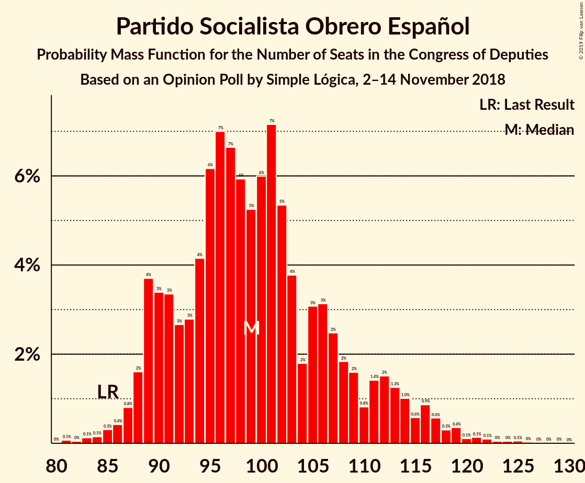

# Opinion Poll by Simple Lógica, 2–14 November 2018

<a href="#voting-intentions">Voting Intentions</a> | <a href="#seats">Seats</a> | <a href="#coalitions">Coalitions</a> | <a href="#technical-information">Technical Information</a>

## Voting Intentions

### Confidence Intervals

| Party | Last Result | Poll Result | 80% Confidence Interval | 90% Confidence Interval | 95% Confidence Interval | 99% Confidence Interval |
|:-----:|:-----------:|:-----------:|:-----------------------:|:-----------------------:|:-----------------------:|:-----------------------:|
| Partido Socialista Obrero Español | 22.6% | 24.1% | 22.5–25.9% |22.0–26.4% |21.6–26.9% |20.8–27.7% |
| Ciudadanos–Partido de la Ciudadanía | 13.1% | 22.4% | 20.8–24.1% |20.3–24.6% |19.9–25.0% |19.2–25.9% |
| Partido Popular | 33.0% | 19.6% | 18.1–21.3% |17.7–21.8% |17.3–22.2% |16.6–23.0% |
| Unidos Podemos | 21.2% | 18.1% | 16.6–19.7% |16.2–20.1% |15.8–20.5% |15.1–21.3% |

*Note:* The poll result column reflects the actual value used in the calculations. Published results may vary slightly, and in addition be rounded to fewer digits.

## Seats

### Confidence Intervals

| Party | Last Result | Median | 80% Confidence Interval | 90% Confidence Interval | 95% Confidence Interval | 99% Confidence Interval |
|:-----:|:-----------:|:------:|:-----------------------:|:-----------------------:|:-----------------------:|:-----------------------:|
| <a href="#partido-socialista-obrero-español">Partido Socialista Obrero Español</a> | 85 | 67 | 64–68 |63–68 |63–77 |63–81 |
| <a href="#ciudadanos–partido-de-la-ciudadanía">Ciudadanos–Partido de la Ciudadanía</a> | 32 | 57 | 57–59 |56–64 |56–68 |50–75 |
| <a href="#partido-popular">Partido Popular</a> | 137 | 60 | 58–61 |58–66 |57–69 |48–70 |
| <a href="#unidos-podemos">Unidos Podemos</a> | 71 | 46 | 44–47 |30–49 |28–49 |28–50 |

### Partido Socialista Obrero Español

*For a full overview of the results for this party, see the [Partido Socialista Obrero Español](party-partidosocialistaobreroespañol.html) page.*

| Number of Seats | Probability | Accumulated | Special Marks |
|:---------------:|:-----------:|:-----------:|:-------------:|
| 61 | 0.2% | 100% |  |
| 62 | 0% | 99.8% |  |
| 63 | 7% | 99.8% |  |
| 64 | 12% | 93% |  |
| 65 | 19% | 81% |  |
| 66 | 0.3% | 62% |  |
| 67 | 44% | 62% | Median |
| 68 | 14% | 19% |  |
| 69 | 0.1% | 4% |  |
| 70 | 0% | 4% |  |
| 71 | 0% | 4% |  |
| 72 | 0% | 4% |  |
| 73 | 0% | 4% |  |
| 74 | 0% | 4% |  |
| 75 | 0% | 4% |  |
| 76 | 0% | 4% |  |
| 77 | 2% | 4% |  |
| 78 | 0.5% | 2% |  |
| 79 | 0.3% | 1.5% |  |
| 80 | 0.7% | 1.2% |  |
| 81 | 0.1% | 0.5% |  |
| 82 | 0.2% | 0.4% |  |
| 83 | 0% | 0.2% |  |
| 84 | 0% | 0.2% |  |
| 85 | 0% | 0.2% | Last Result |
| 86 | 0% | 0.2% |  |
| 87 | 0.1% | 0.2% |  |
| 88 | 0% | 0.1% |  |
| 89 | 0% | 0.1% |  |
| 90 | 0% | 0% |  |

### Ciudadanos–Partido de la Ciudadanía

*For a full overview of the results for this party, see the [Ciudadanos–Partido de la Ciudadanía](party-ciudadanos–partidodelaciudadanía.html) page.*

| Number of Seats | Probability | Accumulated | Special Marks |
|:---------------:|:-----------:|:-----------:|:-------------:|
| 32 | 0% | 100% | Last Result |
| 33 | 0% | 100% |  |
| 34 | 0% | 100% |  |
| 35 | 0% | 100% |  |
| 36 | 0% | 100% |  |
| 37 | 0% | 100% |  |
| 38 | 0% | 100% |  |
| 39 | 0% | 100% |  |
| 40 | 0% | 100% |  |
| 41 | 0% | 100% |  |
| 42 | 0% | 100% |  |
| 43 | 0% | 100% |  |
| 44 | 0% | 100% |  |
| 45 | 0.1% | 100% |  |
| 46 | 0% | 99.9% |  |
| 47 | 0% | 99.9% |  |
| 48 | 0% | 99.9% |  |
| 49 | 0.2% | 99.9% |  |
| 50 | 0.6% | 99.6% |  |
| 51 | 0% | 99.0% |  |
| 52 | 0% | 99.0% |  |
| 53 | 0% | 99.0% |  |
| 54 | 0% | 99.0% |  |
| 55 | 0% | 99.0% |  |
| 56 | 9% | 99.0% |  |
| 57 | 50% | 90% | Median |
| 58 | 10% | 40% |  |
| 59 | 21% | 30% |  |
| 60 | 0.8% | 9% |  |
| 61 | 0% | 9% |  |
| 62 | 0.1% | 9% |  |
| 63 | 2% | 8% |  |
| 64 | 3% | 7% |  |
| 65 | 0% | 4% |  |
| 66 | 0.4% | 4% |  |
| 67 | 0% | 4% |  |
| 68 | 3% | 4% |  |
| 69 | 0% | 0.7% |  |
| 70 | 0% | 0.7% |  |
| 71 | 0% | 0.7% |  |
| 72 | 0% | 0.7% |  |
| 73 | 0% | 0.7% |  |
| 74 | 0% | 0.7% |  |
| 75 | 0.7% | 0.7% |  |
| 76 | 0% | 0% |  |

### Partido Popular

*For a full overview of the results for this party, see the [Partido Popular](party-partidopopular.html) page.*

| Number of Seats | Probability | Accumulated | Special Marks |
|:---------------:|:-----------:|:-----------:|:-------------:|
| 42 | 0.1% | 100% |  |
| 43 | 0% | 99.9% |  |
| 44 | 0% | 99.9% |  |
| 45 | 0% | 99.9% |  |
| 46 | 0% | 99.9% |  |
| 47 | 0% | 99.9% |  |
| 48 | 0.5% | 99.9% |  |
| 49 | 0.1% | 99.4% |  |
| 50 | 0% | 99.3% |  |
| 51 | 0% | 99.3% |  |
| 52 | 0% | 99.3% |  |
| 53 | 0.1% | 99.3% |  |
| 54 | 0.8% | 99.2% |  |
| 55 | 0.5% | 98% |  |
| 56 | 0.3% | 98% |  |
| 57 | 2% | 98% |  |
| 58 | 15% | 95% |  |
| 59 | 17% | 81% |  |
| 60 | 39% | 64% | Median |
| 61 | 20% | 25% |  |
| 62 | 0% | 5% |  |
| 63 | 0% | 5% |  |
| 64 | 0% | 5% |  |
| 65 | 0.3% | 5% |  |
| 66 | 0.2% | 5% |  |
| 67 | 0.2% | 5% |  |
| 68 | 0.2% | 5% |  |
| 69 | 4% | 4% |  |
| 70 | 0.3% | 0.6% |  |
| 71 | 0.3% | 0.4% |  |
| 72 | 0% | 0% |  |
| 73 | 0% | 0% |  |
| 74 | 0% | 0% |  |
| 75 | 0% | 0% |  |
| 76 | 0% | 0% |  |
| 77 | 0% | 0% |  |
| 78 | 0% | 0% |  |
| 79 | 0% | 0% |  |
| 80 | 0% | 0% |  |
| 81 | 0% | 0% |  |
| 82 | 0% | 0% |  |
| 83 | 0% | 0% |  |
| 84 | 0% | 0% |  |
| 85 | 0% | 0% |  |
| 86 | 0% | 0% |  |
| 87 | 0% | 0% |  |
| 88 | 0% | 0% |  |
| 89 | 0% | 0% |  |
| 90 | 0% | 0% |  |
| 91 | 0% | 0% |  |
| 92 | 0% | 0% |  |
| 93 | 0% | 0% |  |
| 94 | 0% | 0% |  |
| 95 | 0% | 0% |  |
| 96 | 0% | 0% |  |
| 97 | 0% | 0% |  |
| 98 | 0% | 0% |  |
| 99 | 0% | 0% |  |
| 100 | 0% | 0% |  |
| 101 | 0% | 0% |  |
| 102 | 0% | 0% |  |
| 103 | 0% | 0% |  |
| 104 | 0% | 0% |  |
| 105 | 0% | 0% |  |
| 106 | 0% | 0% |  |
| 107 | 0% | 0% |  |
| 108 | 0% | 0% |  |
| 109 | 0% | 0% |  |
| 110 | 0% | 0% |  |
| 111 | 0% | 0% |  |
| 112 | 0% | 0% |  |
| 113 | 0% | 0% |  |
| 114 | 0% | 0% |  |
| 115 | 0% | 0% |  |
| 116 | 0% | 0% |  |
| 117 | 0% | 0% |  |
| 118 | 0% | 0% |  |
| 119 | 0% | 0% |  |
| 120 | 0% | 0% |  |
| 121 | 0% | 0% |  |
| 122 | 0% | 0% |  |
| 123 | 0% | 0% |  |
| 124 | 0% | 0% |  |
| 125 | 0% | 0% |  |
| 126 | 0% | 0% |  |
| 127 | 0% | 0% |  |
| 128 | 0% | 0% |  |
| 129 | 0% | 0% |  |
| 130 | 0% | 0% |  |
| 131 | 0% | 0% |  |
| 132 | 0% | 0% |  |
| 133 | 0% | 0% |  |
| 134 | 0% | 0% |  |
| 135 | 0% | 0% |  |
| 136 | 0% | 0% |  |
| 137 | 0% | 0% | Last Result |

### Unidos Podemos

*For a full overview of the results for this party, see the [Unidos Podemos](party-unidospodemos.html) page.*

| Number of Seats | Probability | Accumulated | Special Marks |
|:---------------:|:-----------:|:-----------:|:-------------:|
| 28 | 3% | 100% |  |
| 29 | 0.8% | 97% |  |
| 30 | 4% | 96% |  |
| 31 | 0.1% | 92% |  |
| 32 | 0% | 92% |  |
| 33 | 0.5% | 92% |  |
| 34 | 0.3% | 92% |  |
| 35 | 0% | 91% |  |
| 36 | 0% | 91% |  |
| 37 | 0% | 91% |  |
| 38 | 0% | 91% |  |
| 39 | 0% | 91% |  |
| 40 | 0% | 91% |  |
| 41 | 0% | 91% |  |
| 42 | 0.2% | 91% |  |
| 43 | 0.4% | 91% |  |
| 44 | 8% | 91% |  |
| 45 | 6% | 82% |  |
| 46 | 40% | 77% | Median |
| 47 | 30% | 37% |  |
| 48 | 0% | 7% |  |
| 49 | 6% | 7% |  |
| 50 | 0% | 0.5% |  |
| 51 | 0% | 0.5% |  |
| 52 | 0% | 0.5% |  |
| 53 | 0% | 0.5% |  |
| 54 | 0% | 0.5% |  |
| 55 | 0.5% | 0.5% |  |
| 56 | 0% | 0% |  |
| 57 | 0% | 0% |  |
| 58 | 0% | 0% |  |
| 59 | 0% | 0% |  |
| 60 | 0% | 0% |  |
| 61 | 0% | 0% |  |
| 62 | 0% | 0% |  |
| 63 | 0% | 0% |  |
| 64 | 0% | 0% |  |
| 65 | 0% | 0% |  |
| 66 | 0% | 0% |  |
| 67 | 0% | 0% |  |
| 68 | 0% | 0% |  |
| 69 | 0% | 0% |  |
| 70 | 0% | 0% |  |
| 71 | 0% | 0% | Last Result |

## Coalitions

### Confidence Intervals

| Coalition | Last Result | Median | Majority? | 80% Confidence Interval | 90% Confidence Interval | 95% Confidence Interval | 99% Confidence Interval |
|:---------:|:-----------:|:------:|:---------:|:-----------------------:|:-----------------------:|:-----------------------:|:-----------------------:|
| Partido Socialista Obrero Español – Ciudadanos–Partido de la Ciudadanía | 117 | 124 | 0% | 121–127 | 120–131 | 120–145 | 120–148 |
| Ciudadanos–Partido de la Ciudadanía – Partido Popular | 169 | 117 | 0% | 117–118 | 117–125 | 117–133 | 111–133 |
| Partido Socialista Obrero Español – Unidos Podemos | 156 | 112 | 0% | 111–113 | 105–113 | 97–113 | 96–118 |
| Partido Socialista Obrero Español | 85 | 67 | 0% | 64–68 | 63–68 | 63–77 | 63–81 |
| Partido Popular | 137 | 60 | 0% | 58–61 | 58–66 | 57–69 | 48–70 |

### Partido Socialista Obrero Español – Ciudadanos–Partido de la Ciudadanía

| Number of Seats | Probability | Accumulated | Special Marks |
|:---------------:|:-----------:|:-----------:|:-------------:|
| 117 | 0% | 100% | Last Result |
| 118 | 0% | 100% |  |
| 119 | 0.2% | 100% |  |
| 120 | 7% | 99.8% |  |
| 121 | 19% | 93% |  |
| 122 | 10% | 74% |  |
| 123 | 0% | 63% |  |
| 124 | 22% | 63% | Median |
| 125 | 10% | 41% |  |
| 126 | 8% | 31% |  |
| 127 | 13% | 23% |  |
| 128 | 1.1% | 10% |  |
| 129 | 0.3% | 9% |  |
| 130 | 1.5% | 9% |  |
| 131 | 3% | 7% |  |
| 132 | 0.4% | 5% |  |
| 133 | 0.1% | 4% |  |
| 134 | 0% | 4% |  |
| 135 | 0% | 4% |  |
| 136 | 0.1% | 4% |  |
| 137 | 0% | 4% |  |
| 138 | 0.1% | 4% |  |
| 139 | 0.2% | 4% |  |
| 140 | 0.1% | 4% |  |
| 141 | 0% | 3% |  |
| 142 | 0% | 3% |  |
| 143 | 0.4% | 3% |  |
| 144 | 0% | 3% |  |
| 145 | 2% | 3% |  |
| 146 | 0.3% | 1.1% |  |
| 147 | 0.3% | 0.8% |  |
| 148 | 0.5% | 0.5% |  |
| 149 | 0% | 0% |  |

### Ciudadanos–Partido de la Ciudadanía – Partido Popular

| Number of Seats | Probability | Accumulated | Special Marks |
|:---------------:|:-----------:|:-----------:|:-------------:|
| 100 | 0.1% | 100% |  |
| 101 | 0% | 99.9% |  |
| 102 | 0% | 99.9% |  |
| 103 | 0% | 99.9% |  |
| 104 | 0% | 99.9% |  |
| 105 | 0% | 99.8% |  |
| 106 | 0% | 99.8% |  |
| 107 | 0% | 99.8% |  |
| 108 | 0% | 99.8% |  |
| 109 | 0% | 99.8% |  |
| 110 | 0.3% | 99.8% |  |
| 111 | 0.2% | 99.5% |  |
| 112 | 0% | 99.3% |  |
| 113 | 0% | 99.3% |  |
| 114 | 0.2% | 99.3% |  |
| 115 | 0.1% | 99.1% |  |
| 116 | 0.2% | 99.0% |  |
| 117 | 71% | 98.8% | Median |
| 118 | 19% | 28% |  |
| 119 | 0% | 9% |  |
| 120 | 0% | 9% |  |
| 121 | 0% | 9% |  |
| 122 | 0.5% | 9% |  |
| 123 | 1.1% | 8% |  |
| 124 | 0.5% | 7% |  |
| 125 | 2% | 6% |  |
| 126 | 0% | 5% |  |
| 127 | 0% | 5% |  |
| 128 | 0% | 5% |  |
| 129 | 0% | 5% |  |
| 130 | 0% | 5% |  |
| 131 | 0% | 5% |  |
| 132 | 1.4% | 5% |  |
| 133 | 3% | 3% |  |
| 134 | 0.3% | 0.3% |  |
| 135 | 0% | 0% |  |
| 136 | 0% | 0% |  |
| 137 | 0% | 0% |  |
| 138 | 0% | 0% |  |
| 139 | 0% | 0% |  |
| 140 | 0% | 0% |  |
| 141 | 0% | 0% |  |
| 142 | 0% | 0% |  |
| 143 | 0% | 0% |  |
| 144 | 0% | 0% |  |
| 145 | 0% | 0% |  |
| 146 | 0% | 0% |  |
| 147 | 0% | 0% |  |
| 148 | 0% | 0% |  |
| 149 | 0% | 0% |  |
| 150 | 0% | 0% |  |
| 151 | 0% | 0% |  |
| 152 | 0% | 0% |  |
| 153 | 0% | 0% |  |
| 154 | 0% | 0% |  |
| 155 | 0% | 0% |  |
| 156 | 0% | 0% |  |
| 157 | 0% | 0% |  |
| 158 | 0% | 0% |  |
| 159 | 0% | 0% |  |
| 160 | 0% | 0% |  |
| 161 | 0% | 0% |  |
| 162 | 0% | 0% |  |
| 163 | 0% | 0% |  |
| 164 | 0% | 0% |  |
| 165 | 0% | 0% |  |
| 166 | 0% | 0% |  |
| 167 | 0% | 0% |  |
| 168 | 0% | 0% |  |
| 169 | 0% | 0% | Last Result |

### Partido Socialista Obrero Español – Unidos Podemos

| Number of Seats | Probability | Accumulated | Special Marks |
|:---------------:|:-----------:|:-----------:|:-------------:|
| 94 | 0.3% | 100% |  |
| 95 | 0.1% | 99.7% |  |
| 96 | 0.3% | 99.6% |  |
| 97 | 4% | 99.4% |  |
| 98 | 0.1% | 96% |  |
| 99 | 0% | 95% |  |
| 100 | 0% | 95% |  |
| 101 | 0% | 95% |  |
| 102 | 0% | 95% |  |
| 103 | 0% | 95% |  |
| 104 | 0% | 95% |  |
| 105 | 2% | 95% |  |
| 106 | 0.8% | 93% |  |
| 107 | 0.6% | 93% |  |
| 108 | 0.5% | 92% |  |
| 109 | 0% | 91% |  |
| 110 | 0% | 91% |  |
| 111 | 11% | 91% |  |
| 112 | 33% | 80% |  |
| 113 | 46% | 47% | Median |
| 114 | 0.1% | 1.0% |  |
| 115 | 0.2% | 0.9% |  |
| 116 | 0.1% | 0.7% |  |
| 117 | 0% | 0.7% |  |
| 118 | 0.2% | 0.7% |  |
| 119 | 0.2% | 0.5% |  |
| 120 | 0.1% | 0.3% |  |
| 121 | 0% | 0.2% |  |
| 122 | 0% | 0.2% |  |
| 123 | 0% | 0.2% |  |
| 124 | 0% | 0.2% |  |
| 125 | 0% | 0.2% |  |
| 126 | 0% | 0.2% |  |
| 127 | 0% | 0.1% |  |
| 128 | 0% | 0.1% |  |
| 129 | 0.1% | 0.1% |  |
| 130 | 0.1% | 0.1% |  |
| 131 | 0% | 0% |  |
| 132 | 0% | 0% |  |
| 133 | 0% | 0% |  |
| 134 | 0% | 0% |  |
| 135 | 0% | 0% |  |
| 136 | 0% | 0% |  |
| 137 | 0% | 0% |  |
| 138 | 0% | 0% |  |
| 139 | 0% | 0% |  |
| 140 | 0% | 0% |  |
| 141 | 0% | 0% |  |
| 142 | 0% | 0% |  |
| 143 | 0% | 0% |  |
| 144 | 0% | 0% |  |
| 145 | 0% | 0% |  |
| 146 | 0% | 0% |  |
| 147 | 0% | 0% |  |
| 148 | 0% | 0% |  |
| 149 | 0% | 0% |  |
| 150 | 0% | 0% |  |
| 151 | 0% | 0% |  |
| 152 | 0% | 0% |  |
| 153 | 0% | 0% |  |
| 154 | 0% | 0% |  |
| 155 | 0% | 0% |  |
| 156 | 0% | 0% | Last Result |

### Partido Socialista Obrero Español

| Number of Seats | Probability | Accumulated | Special Marks |
|:---------------:|:-----------:|:-----------:|:-------------:|
| 61 | 0.2% | 100% |  |
| 62 | 0% | 99.8% |  |
| 63 | 7% | 99.8% |  |
| 64 | 12% | 93% |  |
| 65 | 19% | 81% |  |
| 66 | 0.3% | 62% |  |
| 67 | 44% | 62% | Median |
| 68 | 14% | 19% |  |
| 69 | 0.1% | 4% |  |
| 70 | 0% | 4% |  |
| 71 | 0% | 4% |  |
| 72 | 0% | 4% |  |
| 73 | 0% | 4% |  |
| 74 | 0% | 4% |  |
| 75 | 0% | 4% |  |
| 76 | 0% | 4% |  |
| 77 | 2% | 4% |  |
| 78 | 0.5% | 2% |  |
| 79 | 0.3% | 1.5% |  |
| 80 | 0.7% | 1.2% |  |
| 81 | 0.1% | 0.5% |  |
| 82 | 0.2% | 0.4% |  |
| 83 | 0% | 0.2% |  |
| 84 | 0% | 0.2% |  |
| 85 | 0% | 0.2% | Last Result |
| 86 | 0% | 0.2% |  |
| 87 | 0.1% | 0.2% |  |
| 88 | 0% | 0.1% |  |
| 89 | 0% | 0.1% |  |
| 90 | 0% | 0% |  |

### Partido Popular

| Number of Seats | Probability | Accumulated | Special Marks |
|:---------------:|:-----------:|:-----------:|:-------------:|
| 42 | 0.1% | 100% |  |
| 43 | 0% | 99.9% |  |
| 44 | 0% | 99.9% |  |
| 45 | 0% | 99.9% |  |
| 46 | 0% | 99.9% |  |
| 47 | 0% | 99.9% |  |
| 48 | 0.5% | 99.9% |  |
| 49 | 0.1% | 99.4% |  |
| 50 | 0% | 99.3% |  |
| 51 | 0% | 99.3% |  |
| 52 | 0% | 99.3% |  |
| 53 | 0.1% | 99.3% |  |
| 54 | 0.8% | 99.2% |  |
| 55 | 0.5% | 98% |  |
| 56 | 0.3% | 98% |  |
| 57 | 2% | 98% |  |
| 58 | 15% | 95% |  |
| 59 | 17% | 81% |  |
| 60 | 39% | 64% | Median |
| 61 | 20% | 25% |  |
| 62 | 0% | 5% |  |
| 63 | 0% | 5% |  |
| 64 | 0% | 5% |  |
| 65 | 0.3% | 5% |  |
| 66 | 0.2% | 5% |  |
| 67 | 0.2% | 5% |  |
| 68 | 0.2% | 5% |  |
| 69 | 4% | 4% |  |
| 70 | 0.3% | 0.6% |  |
| 71 | 0.3% | 0.4% |  |
| 72 | 0% | 0% |  |
| 73 | 0% | 0% |  |
| 74 | 0% | 0% |  |
| 75 | 0% | 0% |  |
| 76 | 0% | 0% |  |
| 77 | 0% | 0% |  |
| 78 | 0% | 0% |  |
| 79 | 0% | 0% |  |
| 80 | 0% | 0% |  |
| 81 | 0% | 0% |  |
| 82 | 0% | 0% |  |
| 83 | 0% | 0% |  |
| 84 | 0% | 0% |  |
| 85 | 0% | 0% |  |
| 86 | 0% | 0% |  |
| 87 | 0% | 0% |  |
| 88 | 0% | 0% |  |
| 89 | 0% | 0% |  |
| 90 | 0% | 0% |  |
| 91 | 0% | 0% |  |
| 92 | 0% | 0% |  |
| 93 | 0% | 0% |  |
| 94 | 0% | 0% |  |
| 95 | 0% | 0% |  |
| 96 | 0% | 0% |  |
| 97 | 0% | 0% |  |
| 98 | 0% | 0% |  |
| 99 | 0% | 0% |  |
| 100 | 0% | 0% |  |
| 101 | 0% | 0% |  |
| 102 | 0% | 0% |  |
| 103 | 0% | 0% |  |
| 104 | 0% | 0% |  |
| 105 | 0% | 0% |  |
| 106 | 0% | 0% |  |
| 107 | 0% | 0% |  |
| 108 | 0% | 0% |  |
| 109 | 0% | 0% |  |
| 110 | 0% | 0% |  |
| 111 | 0% | 0% |  |
| 112 | 0% | 0% |  |
| 113 | 0% | 0% |  |
| 114 | 0% | 0% |  |
| 115 | 0% | 0% |  |
| 116 | 0% | 0% |  |
| 117 | 0% | 0% |  |
| 118 | 0% | 0% |  |
| 119 | 0% | 0% |  |
| 120 | 0% | 0% |  |
| 121 | 0% | 0% |  |
| 122 | 0% | 0% |  |
| 123 | 0% | 0% |  |
| 124 | 0% | 0% |  |
| 125 | 0% | 0% |  |
| 126 | 0% | 0% |  |
| 127 | 0% | 0% |  |
| 128 | 0% | 0% |  |
| 129 | 0% | 0% |  |
| 130 | 0% | 0% |  |
| 131 | 0% | 0% |  |
| 132 | 0% | 0% |  |
| 133 | 0% | 0% |  |
| 134 | 0% | 0% |  |
| 135 | 0% | 0% |  |
| 136 | 0% | 0% |  |
| 137 | 0% | 0% | Last Result |

## Technical Information

### Opinion Poll

+ **Polling firm:** Simple Lógica
+ **Commissioner(s):** —
+ **Fieldwork period:** 2–14 November 2018

### Calculations

+ **Sample size:** 1019
+ **Simulations done:** 1,024
+ **Error estimate:** 4.30%

