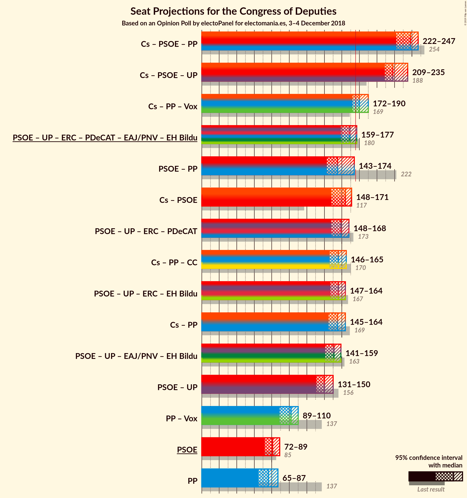
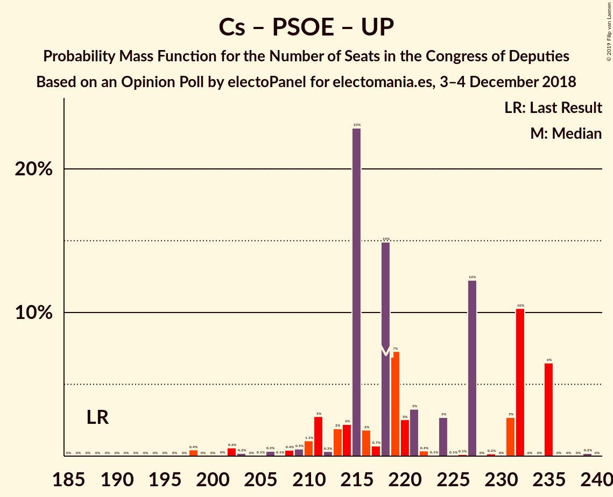
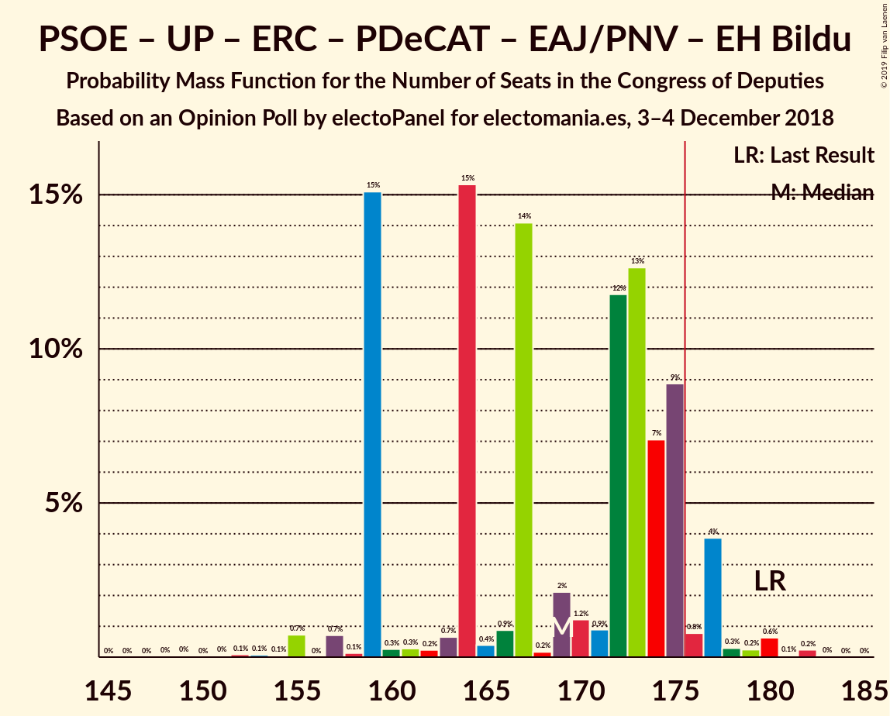

# Opinion Poll by electoPanel for electomania.es, 3–4 December 2018

<a href="#voting-intentions">Voting Intentions</a> | <a href="#seats">Seats</a> | <a href="#coalitions">Coalitions</a> | <a href="#technical-information">Technical Information</a>

## Voting Intentions

### Confidence Intervals

| Party | Last Result | Poll Result | 80% Confidence Interval | 90% Confidence Interval | 95% Confidence Interval | 99% Confidence Interval |
|:-----:|:-----------:|:-----------:|:-----------------------:|:-----------------------:|:-----------------------:|:-----------------------:|
| Ciudadanos–Partido de la Ciudadanía | 13.1% | 21.4% | 20.1–22.8% |19.7–23.2% |19.4–23.5% |18.8–24.2% |
| Partido Socialista Obrero Español | 22.6% | 19.3% | 18.0–20.6% |17.7–21.0% |17.4–21.3% |16.8–22.0% |
| Partido Popular | 33.0% | 19.1% | 17.8–20.4% |17.5–20.8% |17.2–21.1% |16.6–21.8% |
| Unidos Podemos | 21.2% | 17.6% | 16.4–18.9% |16.0–19.3% |15.7–19.6% |15.2–20.2% |
| Vox | 0.2% | 10.4% | 9.4–11.5% |9.2–11.8% |9.0–12.0% |8.5–12.6% |
| Esquerra Republicana de Catalunya–Catalunya Sí | 2.7% | 3.1% | 2.6–3.7% |2.4–3.9% |2.3–4.1% |2.1–4.4% |
| Partit Demòcrata Europeu Català | 2.0% | 1.6% | 1.2–2.1% |1.1–2.2% |1.1–2.3% |0.9–2.6% |
| Partido Animalista Contra el Maltrato Animal | 1.2% | 1.6% | 1.2–2.1% |1.1–2.2% |1.1–2.3% |0.9–2.6% |
| Euzko Alderdi Jeltzalea/Partido Nacionalista Vasco | 1.2% | 1.3% | 1.0–1.8% |0.9–1.9% |0.8–2.0% |0.7–2.3% |
| Euskal Herria Bildu | 0.8% | 0.8% | 0.6–1.2% |0.5–1.3% |0.4–1.4% |0.4–1.6% |

*Note:* The poll result column reflects the actual value used in the calculations. Published results may vary slightly, and in addition be rounded to fewer digits.

## Seats

### Confidence Intervals

| Party | Last Result | Median | 80% Confidence Interval | 90% Confidence Interval | 95% Confidence Interval | 99% Confidence Interval |
|:-----:|:-----------:|:------:|:-----------------------:|:-----------------------:|:-----------------------:|:-----------------------:|
| <a href="#ciudadanos–partido-de-la-ciudadanía">Ciudadanos–Partido de la Ciudadanía</a> | 32 | 82 | 73–87 |70–87 |68–89 |67–89 |
| <a href="#partido-socialista-obrero-español">Partido Socialista Obrero Español</a> | 85 | 81 | 77–89 |75–89 |72–89 |65–90 |
| <a href="#partido-popular">Partido Popular</a> | 137 | 76 | 65–82 |65–85 |65–87 |65–91 |
| <a href="#unidos-podemos">Unidos Podemos</a> | 71 | 59 | 48–68 |48–68 |48–68 |48–72 |
| <a href="#vox">Vox</a> | 0 | 26 | 21–28 |20–29 |19–32 |18–41 |
| <a href="#esquerra-republicana-de-catalunya–catalunya-sí">Esquerra Republicana de Catalunya–Catalunya Sí</a> | 9 | 13 | 10–14 |10–15 |10–16 |9–17 |
| <a href="#partit-demòcrata-europeu-català">Partit Demòcrata Europeu Català</a> | 8 | 6 | 4–8 |4–8 |4–8 |4–10 |
| <a href="#partido-animalista-contra-el-maltrato-animal">Partido Animalista Contra el Maltrato Animal</a> | 0 | 0 | 0–1 |0–1 |0–1 |0–1 |
| <a href="#euzko-alderdi-jeltzalea/partido-nacionalista-vasco">Euzko Alderdi Jeltzalea/Partido Nacionalista Vasco</a> | 5 | 6 | 6–7 |5–8 |5–10 |3–10 |
| <a href="#euskal-herria-bildu">Euskal Herria Bildu</a> | 2 | 3 | 2–6 |2–6 |1–6 |0–7 |

### Ciudadanos–Partido de la Ciudadanía

*For a full overview of the results for this party, see the [Ciudadanos–Partido de la Ciudadanía](party-ciudadanos–partidodelaciudadanía.html) page.*

| Number of Seats | Probability | Accumulated | Special Marks |
|:---------------:|:-----------:|:-----------:|:-------------:|
| 32 | 0% | 100% | Last Result |
| 33 | 0% | 100% |  |
| 34 | 0% | 100% |  |
| 35 | 0% | 100% |  |
| 36 | 0% | 100% |  |
| 37 | 0% | 100% |  |
| 38 | 0% | 100% |  |
| 39 | 0% | 100% |  |
| 40 | 0% | 100% |  |
| 41 | 0% | 100% |  |
| 42 | 0% | 100% |  |
| 43 | 0% | 100% |  |
| 44 | 0% | 100% |  |
| 45 | 0% | 100% |  |
| 46 | 0% | 100% |  |
| 47 | 0% | 100% |  |
| 48 | 0% | 100% |  |
| 49 | 0% | 100% |  |
| 50 | 0% | 100% |  |
| 51 | 0% | 100% |  |
| 52 | 0% | 100% |  |
| 53 | 0% | 100% |  |
| 54 | 0% | 100% |  |
| 55 | 0% | 100% |  |
| 56 | 0% | 100% |  |
| 57 | 0% | 100% |  |
| 58 | 0% | 100% |  |
| 59 | 0% | 100% |  |
| 60 | 0% | 100% |  |
| 61 | 0% | 100% |  |
| 62 | 0% | 100% |  |
| 63 | 0% | 100% |  |
| 64 | 0.1% | 100% |  |
| 65 | 0.1% | 99.8% |  |
| 66 | 0.1% | 99.7% |  |
| 67 | 2% | 99.6% |  |
| 68 | 1.2% | 98% |  |
| 69 | 0.7% | 97% |  |
| 70 | 3% | 96% |  |
| 71 | 1.3% | 93% |  |
| 72 | 1.0% | 92% |  |
| 73 | 2% | 91% |  |
| 74 | 1.1% | 89% |  |
| 75 | 8% | 88% |  |
| 76 | 1.4% | 80% |  |
| 77 | 0.7% | 79% |  |
| 78 | 9% | 78% |  |
| 79 | 0.5% | 69% |  |
| 80 | 10% | 68% |  |
| 81 | 3% | 58% |  |
| 82 | 16% | 55% | Median |
| 83 | 1.1% | 39% |  |
| 84 | 0.2% | 38% |  |
| 85 | 10% | 38% |  |
| 86 | 0.2% | 27% |  |
| 87 | 25% | 27% |  |
| 88 | 0% | 3% |  |
| 89 | 2% | 3% |  |
| 90 | 0% | 0.3% |  |
| 91 | 0.1% | 0.3% |  |
| 92 | 0% | 0.2% |  |
| 93 | 0% | 0.1% |  |
| 94 | 0% | 0.1% |  |
| 95 | 0% | 0.1% |  |
| 96 | 0% | 0.1% |  |
| 97 | 0.1% | 0.1% |  |
| 98 | 0% | 0% |  |

### Partido Socialista Obrero Español

*For a full overview of the results for this party, see the [Partido Socialista Obrero Español](party-partidosocialistaobreroespañol.html) page.*

| Number of Seats | Probability | Accumulated | Special Marks |
|:---------------:|:-----------:|:-----------:|:-------------:|
| 60 | 0% | 100% |  |
| 61 | 0% | 99.9% |  |
| 62 | 0.3% | 99.9% |  |
| 63 | 0% | 99.6% |  |
| 64 | 0% | 99.6% |  |
| 65 | 0.2% | 99.6% |  |
| 66 | 0% | 99.4% |  |
| 67 | 0.2% | 99.4% |  |
| 68 | 0.5% | 99.2% |  |
| 69 | 0% | 98.7% |  |
| 70 | 0.1% | 98.7% |  |
| 71 | 0.1% | 98.6% |  |
| 72 | 1.0% | 98% |  |
| 73 | 0.2% | 97% |  |
| 74 | 2% | 97% |  |
| 75 | 4% | 95% |  |
| 76 | 0.8% | 91% |  |
| 77 | 10% | 90% |  |
| 78 | 10% | 80% |  |
| 79 | 19% | 71% |  |
| 80 | 2% | 52% |  |
| 81 | 10% | 50% | Median |
| 82 | 1.1% | 40% |  |
| 83 | 0.2% | 39% |  |
| 84 | 2% | 39% |  |
| 85 | 21% | 36% | Last Result |
| 86 | 1.5% | 15% |  |
| 87 | 0.9% | 14% |  |
| 88 | 0.3% | 13% |  |
| 89 | 12% | 13% |  |
| 90 | 0.2% | 0.7% |  |
| 91 | 0.3% | 0.4% |  |
| 92 | 0.1% | 0.1% |  |
| 93 | 0% | 0% |  |

### Partido Popular

*For a full overview of the results for this party, see the [Partido Popular](party-partidopopular.html) page.*

| Number of Seats | Probability | Accumulated | Special Marks |
|:---------------:|:-----------:|:-----------:|:-------------:|
| 59 | 0.1% | 100% |  |
| 60 | 0% | 99.9% |  |
| 61 | 0% | 99.9% |  |
| 62 | 0% | 99.9% |  |
| 63 | 0% | 99.8% |  |
| 64 | 0.2% | 99.8% |  |
| 65 | 11% | 99.6% |  |
| 66 | 10% | 89% |  |
| 67 | 0.2% | 79% |  |
| 68 | 7% | 78% |  |
| 69 | 0% | 71% |  |
| 70 | 0.5% | 71% |  |
| 71 | 0.1% | 71% |  |
| 72 | 4% | 71% |  |
| 73 | 4% | 66% |  |
| 74 | 4% | 63% |  |
| 75 | 1.4% | 59% |  |
| 76 | 14% | 58% | Median |
| 77 | 26% | 44% |  |
| 78 | 2% | 18% |  |
| 79 | 0.2% | 16% |  |
| 80 | 0.4% | 16% |  |
| 81 | 0.9% | 15% |  |
| 82 | 9% | 14% |  |
| 83 | 0.3% | 6% |  |
| 84 | 0.4% | 5% |  |
| 85 | 2% | 5% |  |
| 86 | 0.1% | 3% |  |
| 87 | 0.9% | 3% |  |
| 88 | 0.4% | 2% |  |
| 89 | 0.6% | 2% |  |
| 90 | 0.3% | 1.0% |  |
| 91 | 0.1% | 0.6% |  |
| 92 | 0.2% | 0.5% |  |
| 93 | 0% | 0.3% |  |
| 94 | 0.1% | 0.3% |  |
| 95 | 0.1% | 0.2% |  |
| 96 | 0.2% | 0.2% |  |
| 97 | 0% | 0% |  |
| 98 | 0% | 0% |  |
| 99 | 0% | 0% |  |
| 100 | 0% | 0% |  |
| 101 | 0% | 0% |  |
| 102 | 0% | 0% |  |
| 103 | 0% | 0% |  |
| 104 | 0% | 0% |  |
| 105 | 0% | 0% |  |
| 106 | 0% | 0% |  |
| 107 | 0% | 0% |  |
| 108 | 0% | 0% |  |
| 109 | 0% | 0% |  |
| 110 | 0% | 0% |  |
| 111 | 0% | 0% |  |
| 112 | 0% | 0% |  |
| 113 | 0% | 0% |  |
| 114 | 0% | 0% |  |
| 115 | 0% | 0% |  |
| 116 | 0% | 0% |  |
| 117 | 0% | 0% |  |
| 118 | 0% | 0% |  |
| 119 | 0% | 0% |  |
| 120 | 0% | 0% |  |
| 121 | 0% | 0% |  |
| 122 | 0% | 0% |  |
| 123 | 0% | 0% |  |
| 124 | 0% | 0% |  |
| 125 | 0% | 0% |  |
| 126 | 0% | 0% |  |
| 127 | 0% | 0% |  |
| 128 | 0% | 0% |  |
| 129 | 0% | 0% |  |
| 130 | 0% | 0% |  |
| 131 | 0% | 0% |  |
| 132 | 0% | 0% |  |
| 133 | 0% | 0% |  |
| 134 | 0% | 0% |  |
| 135 | 0% | 0% |  |
| 136 | 0% | 0% |  |
| 137 | 0% | 0% | Last Result |

### Unidos Podemos

*For a full overview of the results for this party, see the [Unidos Podemos](party-unidospodemos.html) page.*

| Number of Seats | Probability | Accumulated | Special Marks |
|:---------------:|:-----------:|:-----------:|:-------------:|
| 43 | 0% | 100% |  |
| 44 | 0% | 99.9% |  |
| 45 | 0.2% | 99.9% |  |
| 46 | 0.1% | 99.8% |  |
| 47 | 0.2% | 99.7% |  |
| 48 | 14% | 99.5% |  |
| 49 | 0.8% | 86% |  |
| 50 | 0.3% | 85% |  |
| 51 | 2% | 85% |  |
| 52 | 16% | 83% |  |
| 53 | 0.2% | 67% |  |
| 54 | 0.6% | 67% |  |
| 55 | 8% | 66% |  |
| 56 | 2% | 58% |  |
| 57 | 0.6% | 56% |  |
| 58 | 0.1% | 56% |  |
| 59 | 10% | 56% | Median |
| 60 | 5% | 46% |  |
| 61 | 3% | 41% |  |
| 62 | 0.4% | 38% |  |
| 63 | 1.3% | 37% |  |
| 64 | 2% | 36% |  |
| 65 | 7% | 34% |  |
| 66 | 10% | 27% |  |
| 67 | 4% | 17% |  |
| 68 | 12% | 13% |  |
| 69 | 0.1% | 1.0% |  |
| 70 | 0.2% | 0.9% |  |
| 71 | 0.1% | 0.7% | Last Result |
| 72 | 0.5% | 0.6% |  |
| 73 | 0% | 0.1% |  |
| 74 | 0% | 0% |  |

### Vox

*For a full overview of the results for this party, see the [Vox](party-vox.html) page.*

| Number of Seats | Probability | Accumulated | Special Marks |
|:---------------:|:-----------:|:-----------:|:-------------:|
| 0 | 0% | 100% | Last Result |
| 1 | 0% | 100% |  |
| 2 | 0% | 100% |  |
| 3 | 0% | 100% |  |
| 4 | 0% | 100% |  |
| 5 | 0% | 100% |  |
| 6 | 0% | 100% |  |
| 7 | 0% | 100% |  |
| 8 | 0% | 100% |  |
| 9 | 0% | 100% |  |
| 10 | 0% | 100% |  |
| 11 | 0% | 100% |  |
| 12 | 0% | 100% |  |
| 13 | 0% | 100% |  |
| 14 | 0% | 100% |  |
| 15 | 0% | 100% |  |
| 16 | 0.4% | 100% |  |
| 17 | 0.1% | 99.6% |  |
| 18 | 0.6% | 99.6% |  |
| 19 | 2% | 99.0% |  |
| 20 | 7% | 97% |  |
| 21 | 0.6% | 90% |  |
| 22 | 10% | 90% |  |
| 23 | 14% | 79% |  |
| 24 | 0.6% | 65% |  |
| 25 | 9% | 65% |  |
| 26 | 15% | 55% | Median |
| 27 | 24% | 41% |  |
| 28 | 10% | 17% |  |
| 29 | 2% | 7% |  |
| 30 | 2% | 5% |  |
| 31 | 0.1% | 3% |  |
| 32 | 1.1% | 3% |  |
| 33 | 0.1% | 2% |  |
| 34 | 0.1% | 2% |  |
| 35 | 1.1% | 2% |  |
| 36 | 0% | 0.7% |  |
| 37 | 0% | 0.7% |  |
| 38 | 0% | 0.7% |  |
| 39 | 0% | 0.6% |  |
| 40 | 0% | 0.6% |  |
| 41 | 0.6% | 0.6% |  |
| 42 | 0% | 0% |  |

### Esquerra Republicana de Catalunya–Catalunya Sí

*For a full overview of the results for this party, see the [Esquerra Republicana de Catalunya–Catalunya Sí](party-esquerrarepublicanadecatalunya–catalunyasí.html) page.*

| Number of Seats | Probability | Accumulated | Special Marks |
|:---------------:|:-----------:|:-----------:|:-------------:|
| 7 | 0.2% | 100% |  |
| 8 | 0.2% | 99.8% |  |
| 9 | 2% | 99.6% | Last Result |
| 10 | 11% | 98% |  |
| 11 | 1.4% | 87% |  |
| 12 | 27% | 86% |  |
| 13 | 23% | 59% | Median |
| 14 | 30% | 36% |  |
| 15 | 3% | 6% |  |
| 16 | 2% | 3% |  |
| 17 | 1.1% | 1.3% |  |
| 18 | 0.1% | 0.1% |  |
| 19 | 0% | 0% |  |

### Partit Demòcrata Europeu Català

*For a full overview of the results for this party, see the [Partit Demòcrata Europeu Català](party-partitdemòcrataeuropeucatalà.html) page.*

| Number of Seats | Probability | Accumulated | Special Marks |
|:---------------:|:-----------:|:-----------:|:-------------:|
| 2 | 0.1% | 100% |  |
| 3 | 0.2% | 99.9% |  |
| 4 | 20% | 99.7% |  |
| 5 | 2% | 80% |  |
| 6 | 44% | 78% | Median |
| 7 | 21% | 34% |  |
| 8 | 13% | 14% | Last Result |
| 9 | 0.1% | 1.3% |  |
| 10 | 0.8% | 1.1% |  |
| 11 | 0.3% | 0.3% |  |
| 12 | 0% | 0% |  |

### Partido Animalista Contra el Maltrato Animal

*For a full overview of the results for this party, see the [Partido Animalista Contra el Maltrato Animal](party-partidoanimalistacontraelmaltratoanimal.html) page.*

| Number of Seats | Probability | Accumulated | Special Marks |
|:---------------:|:-----------:|:-----------:|:-------------:|
| 0 | 88% | 100% | Last Result, Median |
| 1 | 12% | 12% |  |
| 2 | 0% | 0% |  |

### Euzko Alderdi Jeltzalea/Partido Nacionalista Vasco

*For a full overview of the results for this party, see the [Euzko Alderdi Jeltzalea/Partido Nacionalista Vasco](party-euzkoalderdijeltzaleapartidonacionalistavasco.html) page.*

| Number of Seats | Probability | Accumulated | Special Marks |
|:---------------:|:-----------:|:-----------:|:-------------:|
| 3 | 1.3% | 100% |  |
| 4 | 1.0% | 98.7% |  |
| 5 | 6% | 98% | Last Result |
| 6 | 56% | 92% | Median |
| 7 | 29% | 36% |  |
| 8 | 2% | 6% |  |
| 9 | 1.5% | 5% |  |
| 10 | 3% | 3% |  |
| 11 | 0.1% | 0.1% |  |
| 12 | 0% | 0% |  |

### Euskal Herria Bildu

*For a full overview of the results for this party, see the [Euskal Herria Bildu](party-euskalherriabildu.html) page.*

| Number of Seats | Probability | Accumulated | Special Marks |
|:---------------:|:-----------:|:-----------:|:-------------:|
| 0 | 0.6% | 100% |  |
| 1 | 4% | 99.4% |  |
| 2 | 44% | 96% | Last Result |
| 3 | 15% | 52% | Median |
| 4 | 8% | 37% |  |
| 5 | 17% | 29% |  |
| 6 | 11% | 12% |  |
| 7 | 2% | 2% |  |
| 8 | 0% | 0% |  |

## Coalitions

### Confidence Intervals

| Coalition | Last Result | Median | Majority? | 80% Confidence Interval | 90% Confidence Interval | 95% Confidence Interval | 99% Confidence Interval |
|:---------:|:-----------:|:------:|:---------:|:-----------------------:|:-----------------------:|:-----------------------:|:-----------------------:|
| Ciudadanos–Partido de la Ciudadanía – Partido Socialista Obrero Español – Partido Popular | 254 | 238 | 100% | 226–246 | 226–246 | 222–247 | 219–247 |
| Ciudadanos–Partido de la Ciudadanía – Partido Socialista Obrero Español – Unidos Podemos | 188 | 218 | 100% | 214–232 | 211–235 | 209–235 | 198–235 |
| Ciudadanos–Partido de la Ciudadanía – Partido Popular – Vox | 169 | 180 | 77% | 173–190 | 172–190 | 172–190 | 169–194 |
| Partido Socialista Obrero Español – Unidos Podemos – Esquerra Republicana de Catalunya–Catalunya Sí – Partit Demòcrata Europeu Català – Euzko Alderdi Jeltzalea/Partido Nacionalista Vasco – Euskal Herria Bildu | 180 | 169 | 6% | 159–175 | 159–177 | 159–177 | 155–180 |
| Partido Socialista Obrero Español – Partido Popular | 222 | 155 | 0.1% | 143–171 | 143–171 | 143–174 | 142–174 |
| Ciudadanos–Partido de la Ciudadanía – Partido Socialista Obrero Español | 117 | 164 | 0.1% | 153–170 | 151–170 | 148–171 | 141–173 |
| Partido Socialista Obrero Español – Unidos Podemos – Esquerra Republicana de Catalunya–Catalunya Sí – Partit Demòcrata Europeu Català | 173 | 159 | 0% | 148–167 | 148–167 | 148–168 | 142–171 |
| Partido Socialista Obrero Español – Unidos Podemos – Esquerra Republicana de Catalunya–Catalunya Sí – Euskal Herria Bildu | 167 | 156 | 0% | 149–162 | 149–163 | 147–164 | 139–169 |
| Ciudadanos–Partido de la Ciudadanía – Partido Popular | 169 | 155 | 0.1% | 145–164 | 145–164 | 145–164 | 141–170 |
| Partido Socialista Obrero Español – Unidos Podemos – Euzko Alderdi Jeltzalea/Partido Nacionalista Vasco – Euskal Herria Bildu | 163 | 151 | 0% | 142–158 | 142–158 | 141–159 | 135–160 |
| Partido Socialista Obrero Español – Unidos Podemos | 156 | 140 | 0% | 131–149 | 131–150 | 131–150 | 122–152 |
| Partido Popular – Vox | 137 | 102 | 0% | 89–106 | 89–110 | 89–110 | 89–118 |
| Partido Socialista Obrero Español | 85 | 81 | 0% | 77–89 | 75–89 | 72–89 | 65–90 |
| Partido Popular | 137 | 76 | 0% | 65–82 | 65–85 | 65–87 | 65–91 |

### Ciudadanos–Partido de la Ciudadanía – Partido Socialista Obrero Español – Partido Popular

| Number of Seats | Probability | Accumulated | Special Marks |
|:---------------:|:-----------:|:-----------:|:-------------:|
| 215 | 0% | 100% |  |
| 216 | 0% | 99.9% |  |
| 217 | 0.1% | 99.9% |  |
| 218 | 0% | 99.8% |  |
| 219 | 0.7% | 99.8% |  |
| 220 | 0.6% | 99.1% |  |
| 221 | 0.4% | 98.5% |  |
| 222 | 1.1% | 98% |  |
| 223 | 0.4% | 97% |  |
| 224 | 0.4% | 97% |  |
| 225 | 0.7% | 96% |  |
| 226 | 9% | 96% |  |
| 227 | 0.1% | 87% |  |
| 228 | 1.2% | 87% |  |
| 229 | 0.2% | 86% |  |
| 230 | 10% | 85% |  |
| 231 | 2% | 75% |  |
| 232 | 4% | 73% |  |
| 233 | 13% | 69% |  |
| 234 | 2% | 56% |  |
| 235 | 0.8% | 54% |  |
| 236 | 3% | 53% |  |
| 237 | 0.3% | 50% |  |
| 238 | 7% | 50% |  |
| 239 | 0.6% | 43% | Median |
| 240 | 0.4% | 43% |  |
| 241 | 0.1% | 42% |  |
| 242 | 0.9% | 42% |  |
| 243 | 28% | 41% |  |
| 244 | 2% | 13% |  |
| 245 | 0.3% | 10% |  |
| 246 | 7% | 10% |  |
| 247 | 3% | 3% |  |
| 248 | 0.1% | 0.4% |  |
| 249 | 0.2% | 0.3% |  |
| 250 | 0% | 0.2% |  |
| 251 | 0% | 0.1% |  |
| 252 | 0.1% | 0.1% |  |
| 253 | 0% | 0% |  |
| 254 | 0% | 0% | Last Result |

### Ciudadanos–Partido de la Ciudadanía – Partido Socialista Obrero Español – Unidos Podemos

| Number of Seats | Probability | Accumulated | Special Marks |
|:---------------:|:-----------:|:-----------:|:-------------:|
| 188 | 0% | 100% | Last Result |
| 189 | 0% | 100% |  |
| 190 | 0% | 100% |  |
| 191 | 0% | 100% |  |
| 192 | 0% | 100% |  |
| 193 | 0% | 100% |  |
| 194 | 0% | 100% |  |
| 195 | 0% | 100% |  |
| 196 | 0% | 100% |  |
| 197 | 0% | 99.9% |  |
| 198 | 0.4% | 99.9% |  |
| 199 | 0% | 99.5% |  |
| 200 | 0% | 99.4% |  |
| 201 | 0% | 99.4% |  |
| 202 | 0.6% | 99.4% |  |
| 203 | 0.2% | 98.8% |  |
| 204 | 0% | 98.6% |  |
| 205 | 0.1% | 98.6% |  |
| 206 | 0.3% | 98.5% |  |
| 207 | 0.1% | 98% |  |
| 208 | 0.4% | 98% |  |
| 209 | 0.5% | 98% |  |
| 210 | 1.1% | 97% |  |
| 211 | 3% | 96% |  |
| 212 | 0.3% | 93% |  |
| 213 | 2% | 93% |  |
| 214 | 2% | 91% |  |
| 215 | 23% | 89% |  |
| 216 | 2% | 66% |  |
| 217 | 0.7% | 64% |  |
| 218 | 15% | 64% |  |
| 219 | 7% | 49% |  |
| 220 | 3% | 41% |  |
| 221 | 3% | 39% |  |
| 222 | 0.4% | 36% | Median |
| 223 | 0.1% | 35% |  |
| 224 | 3% | 35% |  |
| 225 | 0.1% | 32% |  |
| 226 | 0.1% | 32% |  |
| 227 | 12% | 32% |  |
| 228 | 0% | 20% |  |
| 229 | 0.2% | 20% |  |
| 230 | 0% | 20% |  |
| 231 | 3% | 20% |  |
| 232 | 10% | 17% |  |
| 233 | 0% | 7% |  |
| 234 | 0% | 7% |  |
| 235 | 6% | 7% |  |
| 236 | 0% | 0.2% |  |
| 237 | 0% | 0.2% |  |
| 238 | 0% | 0.2% |  |
| 239 | 0.2% | 0.2% |  |
| 240 | 0% | 0% |  |

### Ciudadanos–Partido de la Ciudadanía – Partido Popular – Vox

| Number of Seats | Probability | Accumulated | Special Marks |
|:---------------:|:-----------:|:-----------:|:-------------:|
| 166 | 0% | 100% |  |
| 167 | 0.2% | 99.9% |  |
| 168 | 0% | 99.7% |  |
| 169 | 0.6% | 99.6% | Last Result |
| 170 | 0.3% | 99.0% |  |
| 171 | 0.3% | 98.7% |  |
| 172 | 4% | 98% |  |
| 173 | 9% | 95% |  |
| 174 | 0.6% | 85% |  |
| 175 | 8% | 85% |  |
| 176 | 11% | 77% | Majority |
| 177 | 12% | 65% |  |
| 178 | 1.1% | 53% |  |
| 179 | 0.9% | 52% |  |
| 180 | 2% | 51% |  |
| 181 | 0.2% | 49% |  |
| 182 | 14% | 49% |  |
| 183 | 1.2% | 35% |  |
| 184 | 0.1% | 34% | Median |
| 185 | 15% | 34% |  |
| 186 | 0.7% | 18% |  |
| 187 | 0.3% | 18% |  |
| 188 | 0.3% | 17% |  |
| 189 | 0.1% | 17% |  |
| 190 | 15% | 17% |  |
| 191 | 0.1% | 2% |  |
| 192 | 0.7% | 2% |  |
| 193 | 0.2% | 1.1% |  |
| 194 | 0.5% | 0.8% |  |
| 195 | 0% | 0.3% |  |
| 196 | 0.1% | 0.3% |  |
| 197 | 0.1% | 0.2% |  |
| 198 | 0% | 0.1% |  |
| 199 | 0% | 0.1% |  |
| 200 | 0.1% | 0.1% |  |
| 201 | 0% | 0% |  |

### Partido Socialista Obrero Español – Unidos Podemos – Esquerra Republicana de Catalunya–Catalunya Sí – Partit Demòcrata Europeu Català – Euzko Alderdi Jeltzalea/Partido Nacionalista Vasco – Euskal Herria Bildu

| Number of Seats | Probability | Accumulated | Special Marks |
|:---------------:|:-----------:|:-----------:|:-------------:|
| 149 | 0% | 100% |  |
| 150 | 0% | 99.9% |  |
| 151 | 0% | 99.9% |  |
| 152 | 0.1% | 99.9% |  |
| 153 | 0.1% | 99.8% |  |
| 154 | 0.1% | 99.7% |  |
| 155 | 0.7% | 99.7% |  |
| 156 | 0% | 98.9% |  |
| 157 | 0.7% | 98.9% |  |
| 158 | 0.1% | 98% |  |
| 159 | 15% | 98% |  |
| 160 | 0.3% | 83% |  |
| 161 | 0.3% | 83% |  |
| 162 | 0.2% | 82% |  |
| 163 | 0.7% | 82% |  |
| 164 | 15% | 82% |  |
| 165 | 0.4% | 66% |  |
| 166 | 0.9% | 66% |  |
| 167 | 14% | 65% |  |
| 168 | 0.2% | 51% | Median |
| 169 | 2% | 51% |  |
| 170 | 1.2% | 49% |  |
| 171 | 0.9% | 47% |  |
| 172 | 12% | 46% |  |
| 173 | 13% | 35% |  |
| 174 | 7% | 22% |  |
| 175 | 9% | 15% |  |
| 176 | 0.8% | 6% | Majority |
| 177 | 4% | 5% |  |
| 178 | 0.3% | 2% |  |
| 179 | 0.2% | 1.2% |  |
| 180 | 0.6% | 1.0% | Last Result |
| 181 | 0.1% | 0.3% |  |
| 182 | 0.2% | 0.3% |  |
| 183 | 0% | 0.1% |  |
| 184 | 0% | 0% |  |

### Partido Socialista Obrero Español – Partido Popular

| Number of Seats | Probability | Accumulated | Special Marks |
|:---------------:|:-----------:|:-----------:|:-------------:|
| 136 | 0% | 100% |  |
| 137 | 0.1% | 99.9% |  |
| 138 | 0% | 99.9% |  |
| 139 | 0.2% | 99.8% |  |
| 140 | 0.1% | 99.6% |  |
| 141 | 0% | 99.5% |  |
| 142 | 0.7% | 99.5% |  |
| 143 | 10% | 98.9% |  |
| 144 | 0% | 89% |  |
| 145 | 0.1% | 89% |  |
| 146 | 8% | 88% |  |
| 147 | 4% | 80% |  |
| 148 | 0.1% | 76% |  |
| 149 | 0.8% | 76% |  |
| 150 | 0.2% | 75% |  |
| 151 | 1.4% | 75% |  |
| 152 | 3% | 74% |  |
| 153 | 8% | 70% |  |
| 154 | 4% | 63% |  |
| 155 | 10% | 59% |  |
| 156 | 15% | 49% |  |
| 157 | 0.8% | 34% | Median |
| 158 | 2% | 33% |  |
| 159 | 1.1% | 31% |  |
| 160 | 0.1% | 30% |  |
| 161 | 14% | 30% |  |
| 162 | 0.2% | 16% |  |
| 163 | 2% | 16% |  |
| 164 | 1.4% | 14% |  |
| 165 | 0.3% | 12% |  |
| 166 | 0.2% | 12% |  |
| 167 | 0.2% | 12% |  |
| 168 | 0.5% | 12% |  |
| 169 | 0.4% | 11% |  |
| 170 | 0.3% | 11% |  |
| 171 | 7% | 10% |  |
| 172 | 0.3% | 3% |  |
| 173 | 0.1% | 3% |  |
| 174 | 3% | 3% |  |
| 175 | 0.1% | 0.1% |  |
| 176 | 0% | 0.1% | Majority |
| 177 | 0% | 0% |  |
| 178 | 0% | 0% |  |
| 179 | 0% | 0% |  |
| 180 | 0% | 0% |  |
| 181 | 0% | 0% |  |
| 182 | 0% | 0% |  |
| 183 | 0% | 0% |  |
| 184 | 0% | 0% |  |
| 185 | 0% | 0% |  |
| 186 | 0% | 0% |  |
| 187 | 0% | 0% |  |
| 188 | 0% | 0% |  |
| 189 | 0% | 0% |  |
| 190 | 0% | 0% |  |
| 191 | 0% | 0% |  |
| 192 | 0% | 0% |  |
| 193 | 0% | 0% |  |
| 194 | 0% | 0% |  |
| 195 | 0% | 0% |  |
| 196 | 0% | 0% |  |
| 197 | 0% | 0% |  |
| 198 | 0% | 0% |  |
| 199 | 0% | 0% |  |
| 200 | 0% | 0% |  |
| 201 | 0% | 0% |  |
| 202 | 0% | 0% |  |
| 203 | 0% | 0% |  |
| 204 | 0% | 0% |  |
| 205 | 0% | 0% |  |
| 206 | 0% | 0% |  |
| 207 | 0% | 0% |  |
| 208 | 0% | 0% |  |
| 209 | 0% | 0% |  |
| 210 | 0% | 0% |  |
| 211 | 0% | 0% |  |
| 212 | 0% | 0% |  |
| 213 | 0% | 0% |  |
| 214 | 0% | 0% |  |
| 215 | 0% | 0% |  |
| 216 | 0% | 0% |  |
| 217 | 0% | 0% |  |
| 218 | 0% | 0% |  |
| 219 | 0% | 0% |  |
| 220 | 0% | 0% |  |
| 221 | 0% | 0% |  |
| 222 | 0% | 0% | Last Result |

### Ciudadanos–Partido de la Ciudadanía – Partido Socialista Obrero Español

| Number of Seats | Probability | Accumulated | Special Marks |
|:---------------:|:-----------:|:-----------:|:-------------:|
| 117 | 0% | 100% | Last Result |
| 118 | 0% | 100% |  |
| 119 | 0% | 100% |  |
| 120 | 0% | 100% |  |
| 121 | 0% | 100% |  |
| 122 | 0% | 100% |  |
| 123 | 0% | 100% |  |
| 124 | 0% | 100% |  |
| 125 | 0% | 100% |  |
| 126 | 0% | 100% |  |
| 127 | 0% | 100% |  |
| 128 | 0% | 100% |  |
| 129 | 0% | 100% |  |
| 130 | 0% | 100% |  |
| 131 | 0% | 100% |  |
| 132 | 0% | 100% |  |
| 133 | 0% | 100% |  |
| 134 | 0% | 100% |  |
| 135 | 0% | 100% |  |
| 136 | 0% | 100% |  |
| 137 | 0% | 100% |  |
| 138 | 0% | 99.9% |  |
| 139 | 0.2% | 99.9% |  |
| 140 | 0.1% | 99.7% |  |
| 141 | 0.3% | 99.7% |  |
| 142 | 0.1% | 99.3% |  |
| 143 | 0.1% | 99.2% |  |
| 144 | 0.5% | 99.1% |  |
| 145 | 0.1% | 98.6% |  |
| 146 | 0.6% | 98% |  |
| 147 | 0.4% | 98% |  |
| 148 | 1.2% | 98% |  |
| 149 | 0.6% | 96% |  |
| 150 | 0.2% | 96% |  |
| 151 | 1.4% | 96% |  |
| 152 | 3% | 94% |  |
| 153 | 1.4% | 91% |  |
| 154 | 0.7% | 90% |  |
| 155 | 0.6% | 89% |  |
| 156 | 9% | 89% |  |
| 157 | 1.2% | 79% |  |
| 158 | 0.8% | 78% |  |
| 159 | 2% | 77% |  |
| 160 | 8% | 75% |  |
| 161 | 9% | 67% |  |
| 162 | 0.1% | 58% |  |
| 163 | 0.2% | 58% | Median |
| 164 | 17% | 58% |  |
| 165 | 0.8% | 41% |  |
| 166 | 14% | 40% |  |
| 167 | 14% | 26% |  |
| 168 | 0.5% | 12% |  |
| 169 | 0% | 11% |  |
| 170 | 7% | 11% |  |
| 171 | 3% | 5% |  |
| 172 | 0% | 2% |  |
| 173 | 2% | 2% |  |
| 174 | 0% | 0.3% |  |
| 175 | 0.2% | 0.3% |  |
| 176 | 0.1% | 0.1% | Majority |
| 177 | 0% | 0% |  |

### Partido Socialista Obrero Español – Unidos Podemos – Esquerra Republicana de Catalunya–Catalunya Sí – Partit Demòcrata Europeu Català

| Number of Seats | Probability | Accumulated | Special Marks |
|:---------------:|:-----------:|:-----------:|:-------------:|
| 138 | 0% | 100% |  |
| 139 | 0% | 99.9% |  |
| 140 | 0% | 99.9% |  |
| 141 | 0% | 99.9% |  |
| 142 | 0.4% | 99.9% |  |
| 143 | 0% | 99.4% |  |
| 144 | 0.1% | 99.4% |  |
| 145 | 0.5% | 99.3% |  |
| 146 | 0.2% | 98.8% |  |
| 147 | 0.2% | 98.6% |  |
| 148 | 14% | 98% |  |
| 149 | 0.5% | 84% |  |
| 150 | 0.9% | 84% |  |
| 151 | 0.1% | 83% |  |
| 152 | 0.9% | 83% |  |
| 153 | 0.6% | 82% |  |
| 154 | 14% | 81% |  |
| 155 | 12% | 68% |  |
| 156 | 0.1% | 56% |  |
| 157 | 0.1% | 56% |  |
| 158 | 5% | 55% |  |
| 159 | 0.2% | 50% | Median |
| 160 | 1.2% | 50% |  |
| 161 | 6% | 49% |  |
| 162 | 1.0% | 43% |  |
| 163 | 7% | 42% |  |
| 164 | 2% | 34% |  |
| 165 | 11% | 33% |  |
| 166 | 8% | 22% |  |
| 167 | 9% | 13% |  |
| 168 | 3% | 4% |  |
| 169 | 0% | 1.3% |  |
| 170 | 0.4% | 1.2% |  |
| 171 | 0.5% | 0.9% |  |
| 172 | 0% | 0.3% |  |
| 173 | 0% | 0.3% | Last Result |
| 174 | 0.2% | 0.2% |  |
| 175 | 0% | 0% |  |

### Partido Socialista Obrero Español – Unidos Podemos – Esquerra Republicana de Catalunya–Catalunya Sí – Euskal Herria Bildu

| Number of Seats | Probability | Accumulated | Special Marks |
|:---------------:|:-----------:|:-----------:|:-------------:|
| 136 | 0% | 100% |  |
| 137 | 0% | 99.9% |  |
| 138 | 0% | 99.9% |  |
| 139 | 0.5% | 99.9% |  |
| 140 | 0% | 99.4% |  |
| 141 | 0.2% | 99.4% |  |
| 142 | 0.5% | 99.2% |  |
| 143 | 0.2% | 98.7% |  |
| 144 | 0% | 98% |  |
| 145 | 0.1% | 98% |  |
| 146 | 0.5% | 98% |  |
| 147 | 0.6% | 98% |  |
| 148 | 0.4% | 97% |  |
| 149 | 15% | 97% |  |
| 150 | 13% | 82% |  |
| 151 | 0.9% | 68% |  |
| 152 | 0.1% | 68% |  |
| 153 | 2% | 67% |  |
| 154 | 0.8% | 65% |  |
| 155 | 14% | 64% |  |
| 156 | 5% | 50% | Median |
| 157 | 0.3% | 45% |  |
| 158 | 0.2% | 45% |  |
| 159 | 9% | 45% |  |
| 160 | 2% | 36% |  |
| 161 | 19% | 34% |  |
| 162 | 8% | 15% |  |
| 163 | 4% | 7% |  |
| 164 | 1.3% | 4% |  |
| 165 | 0.7% | 2% |  |
| 166 | 0.3% | 2% |  |
| 167 | 0.3% | 1.3% | Last Result |
| 168 | 0.2% | 1.0% |  |
| 169 | 0.6% | 0.8% |  |
| 170 | 0% | 0.1% |  |
| 171 | 0% | 0.1% |  |
| 172 | 0% | 0% |  |

### Ciudadanos–Partido de la Ciudadanía – Partido Popular

| Number of Seats | Probability | Accumulated | Special Marks |
|:---------------:|:-----------:|:-----------:|:-------------:|
| 138 | 0.1% | 100% |  |
| 139 | 0.1% | 99.9% |  |
| 140 | 0% | 99.8% |  |
| 141 | 0.6% | 99.8% |  |
| 142 | 1.1% | 99.2% |  |
| 143 | 0.2% | 98% |  |
| 144 | 0.1% | 98% |  |
| 145 | 10% | 98% |  |
| 146 | 0.2% | 87% |  |
| 147 | 3% | 87% |  |
| 148 | 0.2% | 84% |  |
| 149 | 3% | 84% |  |
| 150 | 0.1% | 81% |  |
| 151 | 0.8% | 81% |  |
| 152 | 0.1% | 80% |  |
| 153 | 18% | 80% |  |
| 154 | 3% | 62% |  |
| 155 | 12% | 59% |  |
| 156 | 0.4% | 47% |  |
| 157 | 11% | 47% |  |
| 158 | 15% | 36% | Median |
| 159 | 0.3% | 21% |  |
| 160 | 2% | 21% |  |
| 161 | 0.1% | 19% |  |
| 162 | 0.1% | 18% |  |
| 163 | 2% | 18% |  |
| 164 | 15% | 16% |  |
| 165 | 0.5% | 2% |  |
| 166 | 0.2% | 1.4% |  |
| 167 | 0.2% | 1.2% |  |
| 168 | 0% | 1.0% |  |
| 169 | 0% | 1.0% | Last Result |
| 170 | 0.7% | 0.9% |  |
| 171 | 0% | 0.3% |  |
| 172 | 0.1% | 0.3% |  |
| 173 | 0.1% | 0.2% |  |
| 174 | 0% | 0.1% |  |
| 175 | 0% | 0.1% |  |
| 176 | 0% | 0.1% | Majority |
| 177 | 0% | 0% |  |

### Partido Socialista Obrero Español – Unidos Podemos – Euzko Alderdi Jeltzalea/Partido Nacionalista Vasco – Euskal Herria Bildu

| Number of Seats | Probability | Accumulated | Special Marks |
|:---------------:|:-----------:|:-----------:|:-------------:|
| 129 | 0% | 100% |  |
| 130 | 0% | 99.9% |  |
| 131 | 0% | 99.9% |  |
| 132 | 0.1% | 99.9% |  |
| 133 | 0% | 99.9% |  |
| 134 | 0% | 99.8% |  |
| 135 | 0.7% | 99.8% |  |
| 136 | 0.5% | 99.1% |  |
| 137 | 0.3% | 98.6% |  |
| 138 | 0.2% | 98% |  |
| 139 | 0.2% | 98% |  |
| 140 | 0.2% | 98% |  |
| 141 | 0.3% | 98% |  |
| 142 | 14% | 97% |  |
| 143 | 14% | 83% |  |
| 144 | 2% | 69% |  |
| 145 | 0.2% | 66% |  |
| 146 | 0.1% | 66% |  |
| 147 | 0.6% | 66% |  |
| 148 | 0.1% | 65% |  |
| 149 | 13% | 65% | Median |
| 150 | 0.8% | 53% |  |
| 151 | 8% | 52% |  |
| 152 | 1.3% | 44% |  |
| 153 | 19% | 43% |  |
| 154 | 3% | 24% |  |
| 155 | 8% | 22% |  |
| 156 | 0.8% | 13% |  |
| 157 | 0.1% | 12% |  |
| 158 | 10% | 12% |  |
| 159 | 0.3% | 3% |  |
| 160 | 2% | 2% |  |
| 161 | 0.2% | 0.4% |  |
| 162 | 0.1% | 0.2% |  |
| 163 | 0% | 0.1% | Last Result |
| 164 | 0% | 0.1% |  |
| 165 | 0% | 0.1% |  |
| 166 | 0% | 0% |  |

### Partido Socialista Obrero Español – Unidos Podemos

| Number of Seats | Probability | Accumulated | Special Marks |
|:---------------:|:-----------:|:-----------:|:-------------:|
| 119 | 0% | 100% |  |
| 120 | 0% | 99.9% |  |
| 121 | 0% | 99.9% |  |
| 122 | 0.6% | 99.9% |  |
| 123 | 0% | 99.3% |  |
| 124 | 0.1% | 99.3% |  |
| 125 | 0% | 99.2% |  |
| 126 | 0% | 99.2% |  |
| 127 | 0.5% | 99.1% |  |
| 128 | 0.7% | 98.6% |  |
| 129 | 0.1% | 98% |  |
| 130 | 0.2% | 98% |  |
| 131 | 14% | 98% |  |
| 132 | 0.7% | 84% |  |
| 133 | 14% | 83% |  |
| 134 | 0.8% | 69% |  |
| 135 | 2% | 68% |  |
| 136 | 0.3% | 66% |  |
| 137 | 10% | 66% |  |
| 138 | 0.1% | 55% |  |
| 139 | 2% | 55% |  |
| 140 | 4% | 53% | Median |
| 141 | 2% | 50% |  |
| 142 | 4% | 48% |  |
| 143 | 1.2% | 43% |  |
| 144 | 8% | 42% |  |
| 145 | 11% | 34% |  |
| 146 | 3% | 24% |  |
| 147 | 9% | 21% |  |
| 148 | 0.2% | 12% |  |
| 149 | 4% | 12% |  |
| 150 | 7% | 8% |  |
| 151 | 0.8% | 1.4% |  |
| 152 | 0.5% | 0.7% |  |
| 153 | 0% | 0.1% |  |
| 154 | 0% | 0.1% |  |
| 155 | 0% | 0.1% |  |
| 156 | 0% | 0% | Last Result |

### Partido Popular – Vox

| Number of Seats | Probability | Accumulated | Special Marks |
|:---------------:|:-----------:|:-----------:|:-------------:|
| 83 | 0.2% | 100% |  |
| 84 | 0% | 99.8% |  |
| 85 | 0% | 99.8% |  |
| 86 | 0% | 99.8% |  |
| 87 | 0% | 99.8% |  |
| 88 | 0% | 99.7% |  |
| 89 | 10% | 99.7% |  |
| 90 | 9% | 90% |  |
| 91 | 0% | 81% |  |
| 92 | 0.2% | 81% |  |
| 93 | 9% | 80% |  |
| 94 | 0.2% | 71% |  |
| 95 | 0.1% | 71% |  |
| 96 | 5% | 71% |  |
| 97 | 4% | 66% |  |
| 98 | 0.2% | 62% |  |
| 99 | 1.0% | 62% |  |
| 100 | 0.3% | 61% |  |
| 101 | 2% | 60% |  |
| 102 | 9% | 59% | Median |
| 103 | 29% | 50% |  |
| 104 | 10% | 21% |  |
| 105 | 0.3% | 11% |  |
| 106 | 0.5% | 10% |  |
| 107 | 0.2% | 10% |  |
| 108 | 1.3% | 10% |  |
| 109 | 2% | 8% |  |
| 110 | 4% | 6% |  |
| 111 | 0.1% | 2% |  |
| 112 | 0.1% | 2% |  |
| 113 | 0.2% | 2% |  |
| 114 | 0.1% | 2% |  |
| 115 | 0.3% | 2% |  |
| 116 | 0.3% | 1.2% |  |
| 117 | 0.2% | 0.9% |  |
| 118 | 0.6% | 0.7% |  |
| 119 | 0% | 0.1% |  |
| 120 | 0% | 0.1% |  |
| 121 | 0% | 0.1% |  |
| 122 | 0% | 0.1% |  |
| 123 | 0% | 0% |  |
| 124 | 0% | 0% |  |
| 125 | 0% | 0% |  |
| 126 | 0% | 0% |  |
| 127 | 0% | 0% |  |
| 128 | 0% | 0% |  |
| 129 | 0% | 0% |  |
| 130 | 0% | 0% |  |
| 131 | 0% | 0% |  |
| 132 | 0% | 0% |  |
| 133 | 0% | 0% |  |
| 134 | 0% | 0% |  |
| 135 | 0% | 0% |  |
| 136 | 0% | 0% |  |
| 137 | 0% | 0% | Last Result |

### Partido Socialista Obrero Español

| Number of Seats | Probability | Accumulated | Special Marks |
|:---------------:|:-----------:|:-----------:|:-------------:|
| 60 | 0% | 100% |  |
| 61 | 0% | 99.9% |  |
| 62 | 0.3% | 99.9% |  |
| 63 | 0% | 99.6% |  |
| 64 | 0% | 99.6% |  |
| 65 | 0.2% | 99.6% |  |
| 66 | 0% | 99.4% |  |
| 67 | 0.2% | 99.4% |  |
| 68 | 0.5% | 99.2% |  |
| 69 | 0% | 98.7% |  |
| 70 | 0.1% | 98.7% |  |
| 71 | 0.1% | 98.6% |  |
| 72 | 1.0% | 98% |  |
| 73 | 0.2% | 97% |  |
| 74 | 2% | 97% |  |
| 75 | 4% | 95% |  |
| 76 | 0.8% | 91% |  |
| 77 | 10% | 90% |  |
| 78 | 10% | 80% |  |
| 79 | 19% | 71% |  |
| 80 | 2% | 52% |  |
| 81 | 10% | 50% | Median |
| 82 | 1.1% | 40% |  |
| 83 | 0.2% | 39% |  |
| 84 | 2% | 39% |  |
| 85 | 21% | 36% | Last Result |
| 86 | 1.5% | 15% |  |
| 87 | 0.9% | 14% |  |
| 88 | 0.3% | 13% |  |
| 89 | 12% | 13% |  |
| 90 | 0.2% | 0.7% |  |
| 91 | 0.3% | 0.4% |  |
| 92 | 0.1% | 0.1% |  |
| 93 | 0% | 0% |  |

### Partido Popular

| Number of Seats | Probability | Accumulated | Special Marks |
|:---------------:|:-----------:|:-----------:|:-------------:|
| 59 | 0.1% | 100% |  |
| 60 | 0% | 99.9% |  |
| 61 | 0% | 99.9% |  |
| 62 | 0% | 99.9% |  |
| 63 | 0% | 99.8% |  |
| 64 | 0.2% | 99.8% |  |
| 65 | 11% | 99.6% |  |
| 66 | 10% | 89% |  |
| 67 | 0.2% | 79% |  |
| 68 | 7% | 78% |  |
| 69 | 0% | 71% |  |
| 70 | 0.5% | 71% |  |
| 71 | 0.1% | 71% |  |
| 72 | 4% | 71% |  |
| 73 | 4% | 66% |  |
| 74 | 4% | 63% |  |
| 75 | 1.4% | 59% |  |
| 76 | 14% | 58% | Median |
| 77 | 26% | 44% |  |
| 78 | 2% | 18% |  |
| 79 | 0.2% | 16% |  |
| 80 | 0.4% | 16% |  |
| 81 | 0.9% | 15% |  |
| 82 | 9% | 14% |  |
| 83 | 0.3% | 6% |  |
| 84 | 0.4% | 5% |  |
| 85 | 2% | 5% |  |
| 86 | 0.1% | 3% |  |
| 87 | 0.9% | 3% |  |
| 88 | 0.4% | 2% |  |
| 89 | 0.6% | 2% |  |
| 90 | 0.3% | 1.0% |  |
| 91 | 0.1% | 0.6% |  |
| 92 | 0.2% | 0.5% |  |
| 93 | 0% | 0.3% |  |
| 94 | 0.1% | 0.3% |  |
| 95 | 0.1% | 0.2% |  |
| 96 | 0.2% | 0.2% |  |
| 97 | 0% | 0% |  |
| 98 | 0% | 0% |  |
| 99 | 0% | 0% |  |
| 100 | 0% | 0% |  |
| 101 | 0% | 0% |  |
| 102 | 0% | 0% |  |
| 103 | 0% | 0% |  |
| 104 | 0% | 0% |  |
| 105 | 0% | 0% |  |
| 106 | 0% | 0% |  |
| 107 | 0% | 0% |  |
| 108 | 0% | 0% |  |
| 109 | 0% | 0% |  |
| 110 | 0% | 0% |  |
| 111 | 0% | 0% |  |
| 112 | 0% | 0% |  |
| 113 | 0% | 0% |  |
| 114 | 0% | 0% |  |
| 115 | 0% | 0% |  |
| 116 | 0% | 0% |  |
| 117 | 0% | 0% |  |
| 118 | 0% | 0% |  |
| 119 | 0% | 0% |  |
| 120 | 0% | 0% |  |
| 121 | 0% | 0% |  |
| 122 | 0% | 0% |  |
| 123 | 0% | 0% |  |
| 124 | 0% | 0% |  |
| 125 | 0% | 0% |  |
| 126 | 0% | 0% |  |
| 127 | 0% | 0% |  |
| 128 | 0% | 0% |  |
| 129 | 0% | 0% |  |
| 130 | 0% | 0% |  |
| 131 | 0% | 0% |  |
| 132 | 0% | 0% |  |
| 133 | 0% | 0% |  |
| 134 | 0% | 0% |  |
| 135 | 0% | 0% |  |
| 136 | 0% | 0% |  |
| 137 | 0% | 0% | Last Result |

## Technical Information

### Opinion Poll

+ **Polling firm:** electoPanel
+ **Commissioner(s):** electomania.es
+ **Fieldwork period:** 3–4 December 2018

### Calculations

+ **Sample size:** 1530
+ **Simulations done:** 131,072
+ **Error estimate:** 2.51%

