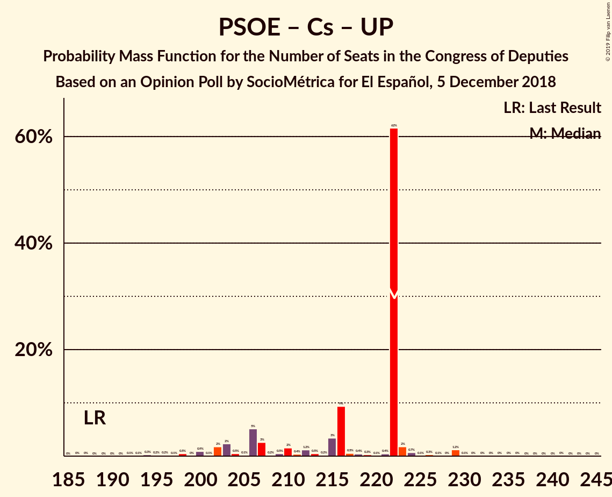
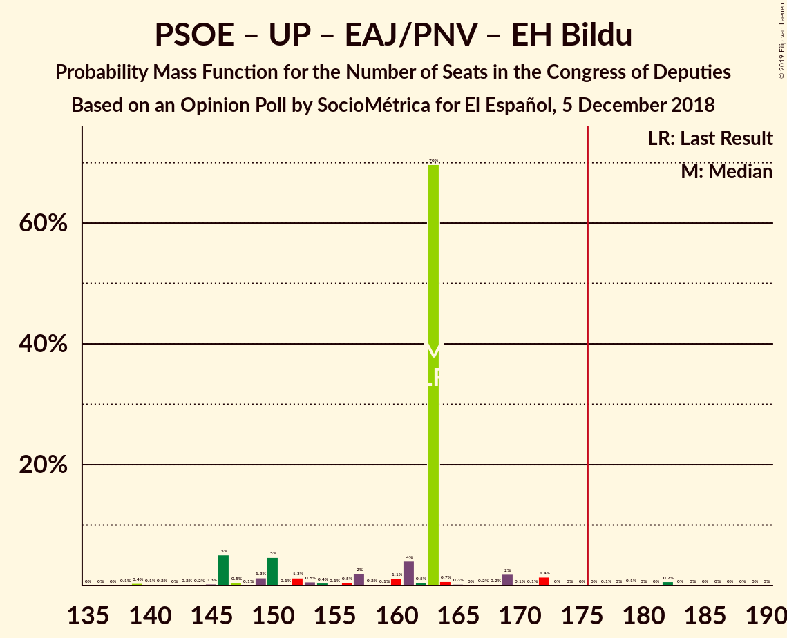
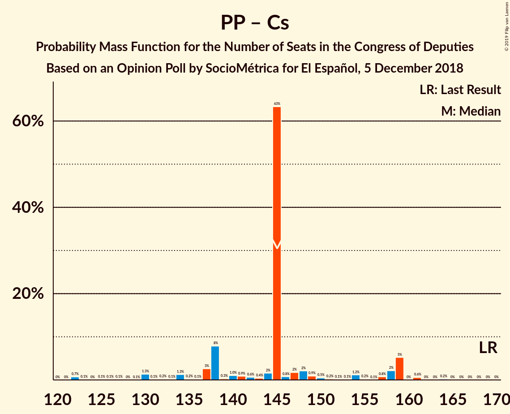

# Opinion Poll by SocioMétrica for El Español, 5 December 2018

<a href="#voting-intentions">Voting Intentions</a> | <a href="#seats">Seats</a> | <a href="#coalitions">Coalitions</a> | <a href="#technical-information">Technical Information</a>

## Voting Intentions

### Confidence Intervals

| Party | Last Result | Poll Result | 80% Confidence Interval | 90% Confidence Interval | 95% Confidence Interval | 99% Confidence Interval |
|:-----:|:-----------:|:-----------:|:-----------------------:|:-----------------------:|:-----------------------:|:-----------------------:|
| Partido Socialista Obrero Español | 22.6% | 25.0% | 23.2–26.9% |22.7–27.5% |22.3–27.9% |21.4–28.9% |
| Partido Popular | 33.0% | 20.3% | 18.7–22.1% |18.2–22.6% |17.8–23.1% |17.1–24.0% |
| Ciudadanos–Partido de la Ciudadanía | 13.1% | 18.8% | 17.2–20.5% |16.7–21.0% |16.4–21.5% |15.6–22.3% |
| Unidos Podemos | 21.2% | 16.0% | 14.5–17.7% |14.1–18.1% |13.7–18.5% |13.1–19.4% |
| Vox | 0.2% | 11.0% | 9.8–12.5% |9.4–12.9% |9.1–13.2% |8.6–13.9% |
| Esquerra Republicana de Catalunya–Catalunya Sí | 2.7% | 3.1% | 2.5–4.0% |2.3–4.2% |2.2–4.5% |1.9–4.9% |
| Partit Demòcrata Europeu Català | 2.0% | 1.6% | 1.1–2.2% |1.0–2.4% |0.9–2.6% |0.8–3.0% |
| Euzko Alderdi Jeltzalea/Partido Nacionalista Vasco | 1.2% | 1.1% | 0.8–1.7% |0.7–1.9% |0.6–2.0% |0.5–2.4% |
| Euskal Herria Bildu | 0.8% | 0.7% | 0.4–1.2% |0.4–1.3% |0.3–1.4% |0.2–1.7% |
| Coalición Canaria–Partido Nacionalista Canario | 0.3% | 0.3% | 0.2–0.7% |0.1–0.9% |0.1–1.0% |0.1–1.2% |

*Note:* The poll result column reflects the actual value used in the calculations. Published results may vary slightly, and in addition be rounded to fewer digits.

## Seats

### Confidence Intervals

| Party | Last Result | Median | 80% Confidence Interval | 90% Confidence Interval | 95% Confidence Interval | 99% Confidence Interval |
|:-----:|:-----------:|:------:|:-----------------------:|:-----------------------:|:-----------------------:|:-----------------------:|
| <a href="#partido-socialista-obrero-español">Partido Socialista Obrero Español</a> | 85 | 108 | 78–108 |76–108 |76–108 |76–108 |
| <a href="#partido-popular">Partido Popular</a> | 137 | 72 | 72–104 |72–104 |72–105 |72–105 |
| <a href="#ciudadanos–partido-de-la-ciudadanía">Ciudadanos–Partido de la Ciudadanía</a> | 32 | 71 | 56–71 |56–71 |50–71 |50–84 |
| <a href="#unidos-podemos">Unidos Podemos</a> | 71 | 48 | 42–48 |42–53 |39–53 |36–53 |
| <a href="#vox">Vox</a> | 0 | 27 | 27–35 |27–35 |22–35 |22–35 |
| <a href="#esquerra-republicana-de-catalunya–catalunya-sí">Esquerra Republicana de Catalunya–Catalunya Sí</a> | 9 | 12 | 12–15 |12–15 |12–16 |9–16 |
| <a href="#partit-demòcrata-europeu-català">Partit Demòcrata Europeu Català</a> | 8 | 7 | 7–9 |4–9 |4–10 |4–12 |
| <a href="#euzko-alderdi-jeltzalea/partido-nacionalista-vasco">Euzko Alderdi Jeltzalea/Partido Nacionalista Vasco</a> | 5 | 1 | 1–6 |1–9 |1–9 |1–9 |
| <a href="#euskal-herria-bildu">Euskal Herria Bildu</a> | 2 | 4 | 2–4 |2–4 |1–4 |1–7 |
| <a href="#coalición-canaria–partido-nacionalista-canario">Coalición Canaria–Partido Nacionalista Canario</a> | 1 | 0 | 0–3 |0–3 |0–3 |0–3 |

### Partido Socialista Obrero Español

*For a full overview of the results for this party, see the [Partido Socialista Obrero Español](party-partidosocialistaobreroespañol.html) page.*

| Number of Seats | Probability | Accumulated | Special Marks |
|:---------------:|:-----------:|:-----------:|:-------------:|
| 76 | 6% | 100% |  |
| 77 | 0% | 94% |  |
| 78 | 12% | 94% |  |
| 79 | 0% | 82% |  |
| 80 | 0% | 82% |  |
| 81 | 0% | 82% |  |
| 82 | 0% | 82% |  |
| 83 | 0% | 82% |  |
| 84 | 0.1% | 82% |  |
| 85 | 0% | 82% | Last Result |
| 86 | 0% | 82% |  |
| 87 | 0% | 82% |  |
| 88 | 0% | 82% |  |
| 89 | 0% | 82% |  |
| 90 | 1.2% | 82% |  |
| 91 | 0% | 81% |  |
| 92 | 0% | 81% |  |
| 93 | 0% | 81% |  |
| 94 | 0% | 81% |  |
| 95 | 0% | 81% |  |
| 96 | 0% | 81% |  |
| 97 | 0% | 80% |  |
| 98 | 0% | 80% |  |
| 99 | 0% | 80% |  |
| 100 | 0% | 80% |  |
| 101 | 3% | 80% |  |
| 102 | 0% | 77% |  |
| 103 | 0% | 77% |  |
| 104 | 0% | 77% |  |
| 105 | 0.3% | 77% |  |
| 106 | 0% | 77% |  |
| 107 | 0% | 77% |  |
| 108 | 77% | 77% | Median |
| 109 | 0% | 0.2% |  |
| 110 | 0.1% | 0.2% |  |
| 111 | 0% | 0.1% |  |
| 112 | 0% | 0.1% |  |
| 113 | 0% | 0.1% |  |
| 114 | 0% | 0.1% |  |
| 115 | 0% | 0.1% |  |
| 116 | 0% | 0.1% |  |
| 117 | 0% | 0.1% |  |
| 118 | 0% | 0.1% |  |
| 119 | 0% | 0.1% |  |
| 120 | 0% | 0.1% |  |
| 121 | 0% | 0% |  |

### Partido Popular

*For a full overview of the results for this party, see the [Partido Popular](party-partidopopular.html) page.*

| Number of Seats | Probability | Accumulated | Special Marks |
|:---------------:|:-----------:|:-----------:|:-------------:|
| 53 | 0.3% | 100% |  |
| 54 | 0% | 99.7% |  |
| 55 | 0% | 99.7% |  |
| 56 | 0% | 99.7% |  |
| 57 | 0% | 99.7% |  |
| 58 | 0.1% | 99.7% |  |
| 59 | 0% | 99.7% |  |
| 60 | 0% | 99.7% |  |
| 61 | 0% | 99.7% |  |
| 62 | 0% | 99.7% |  |
| 63 | 0% | 99.6% |  |
| 64 | 0% | 99.6% |  |
| 65 | 0% | 99.6% |  |
| 66 | 0% | 99.6% |  |
| 67 | 0% | 99.6% |  |
| 68 | 0% | 99.6% |  |
| 69 | 0% | 99.6% |  |
| 70 | 0% | 99.6% |  |
| 71 | 0% | 99.6% |  |
| 72 | 77% | 99.6% | Median |
| 73 | 0% | 23% |  |
| 74 | 0% | 23% |  |
| 75 | 0% | 23% |  |
| 76 | 0% | 23% |  |
| 77 | 0% | 23% |  |
| 78 | 0% | 23% |  |
| 79 | 0% | 23% |  |
| 80 | 0% | 23% |  |
| 81 | 0% | 23% |  |
| 82 | 0% | 23% |  |
| 83 | 0.1% | 23% |  |
| 84 | 0% | 23% |  |
| 85 | 1.2% | 23% |  |
| 86 | 6% | 22% |  |
| 87 | 0% | 16% |  |
| 88 | 0% | 16% |  |
| 89 | 0% | 16% |  |
| 90 | 0% | 16% |  |
| 91 | 0% | 16% |  |
| 92 | 0% | 16% |  |
| 93 | 0% | 16% |  |
| 94 | 0% | 16% |  |
| 95 | 0% | 16% |  |
| 96 | 0% | 16% |  |
| 97 | 0.2% | 16% |  |
| 98 | 0% | 16% |  |
| 99 | 0% | 16% |  |
| 100 | 0% | 16% |  |
| 101 | 0% | 16% |  |
| 102 | 0% | 16% |  |
| 103 | 0% | 16% |  |
| 104 | 12% | 16% |  |
| 105 | 3% | 3% |  |
| 106 | 0% | 0.1% |  |
| 107 | 0.1% | 0.1% |  |
| 108 | 0% | 0% |  |
| 109 | 0% | 0% |  |
| 110 | 0% | 0% |  |
| 111 | 0% | 0% |  |
| 112 | 0% | 0% |  |
| 113 | 0% | 0% |  |
| 114 | 0% | 0% |  |
| 115 | 0% | 0% |  |
| 116 | 0% | 0% |  |
| 117 | 0% | 0% |  |
| 118 | 0% | 0% |  |
| 119 | 0% | 0% |  |
| 120 | 0% | 0% |  |
| 121 | 0% | 0% |  |
| 122 | 0% | 0% |  |
| 123 | 0% | 0% |  |
| 124 | 0% | 0% |  |
| 125 | 0% | 0% |  |
| 126 | 0% | 0% |  |
| 127 | 0% | 0% |  |
| 128 | 0% | 0% |  |
| 129 | 0% | 0% |  |
| 130 | 0% | 0% |  |
| 131 | 0% | 0% |  |
| 132 | 0% | 0% |  |
| 133 | 0% | 0% |  |
| 134 | 0% | 0% |  |
| 135 | 0% | 0% |  |
| 136 | 0% | 0% |  |
| 137 | 0% | 0% | Last Result |

### Ciudadanos–Partido de la Ciudadanía

*For a full overview of the results for this party, see the [Ciudadanos–Partido de la Ciudadanía](party-ciudadanos–partidodelaciudadanía.html) page.*

| Number of Seats | Probability | Accumulated | Special Marks |
|:---------------:|:-----------:|:-----------:|:-------------:|
| 32 | 0% | 100% | Last Result |
| 33 | 0% | 100% |  |
| 34 | 0% | 100% |  |
| 35 | 0% | 100% |  |
| 36 | 0% | 100% |  |
| 37 | 0% | 100% |  |
| 38 | 0% | 100% |  |
| 39 | 0% | 100% |  |
| 40 | 0% | 100% |  |
| 41 | 0% | 100% |  |
| 42 | 0% | 100% |  |
| 43 | 0% | 100% |  |
| 44 | 0% | 100% |  |
| 45 | 0% | 100% |  |
| 46 | 0% | 100% |  |
| 47 | 0% | 100% |  |
| 48 | 0% | 100% |  |
| 49 | 0% | 100% |  |
| 50 | 3% | 100% |  |
| 51 | 0% | 97% |  |
| 52 | 0% | 97% |  |
| 53 | 0% | 97% |  |
| 54 | 0% | 97% |  |
| 55 | 0% | 97% |  |
| 56 | 12% | 97% |  |
| 57 | 0% | 85% |  |
| 58 | 0% | 85% |  |
| 59 | 0.1% | 85% |  |
| 60 | 0% | 84% |  |
| 61 | 0% | 84% |  |
| 62 | 0% | 84% |  |
| 63 | 0.2% | 84% |  |
| 64 | 0% | 84% |  |
| 65 | 0% | 84% |  |
| 66 | 0% | 84% |  |
| 67 | 0% | 84% |  |
| 68 | 0.3% | 84% |  |
| 69 | 0% | 84% |  |
| 70 | 6% | 84% |  |
| 71 | 77% | 78% | Median |
| 72 | 0% | 1.2% |  |
| 73 | 0% | 1.2% |  |
| 74 | 0% | 1.2% |  |
| 75 | 0% | 1.2% |  |
| 76 | 0% | 1.2% |  |
| 77 | 0% | 1.2% |  |
| 78 | 0% | 1.2% |  |
| 79 | 0% | 1.2% |  |
| 80 | 0% | 1.2% |  |
| 81 | 0% | 1.2% |  |
| 82 | 0% | 1.2% |  |
| 83 | 0% | 1.2% |  |
| 84 | 1.2% | 1.2% |  |
| 85 | 0% | 0% |  |

### Unidos Podemos

*For a full overview of the results for this party, see the [Unidos Podemos](party-unidospodemos.html) page.*

| Number of Seats | Probability | Accumulated | Special Marks |
|:---------------:|:-----------:|:-----------:|:-------------:|
| 35 | 0.1% | 100% |  |
| 36 | 1.2% | 99.8% |  |
| 37 | 0.2% | 98.7% |  |
| 38 | 0% | 98% |  |
| 39 | 3% | 98% |  |
| 40 | 0% | 95% |  |
| 41 | 0% | 95% |  |
| 42 | 12% | 95% |  |
| 43 | 0% | 83% |  |
| 44 | 0% | 83% |  |
| 45 | 0% | 83% |  |
| 46 | 0% | 83% |  |
| 47 | 0.1% | 83% |  |
| 48 | 77% | 83% | Median |
| 49 | 0% | 6% |  |
| 50 | 0% | 6% |  |
| 51 | 0% | 6% |  |
| 52 | 0% | 6% |  |
| 53 | 6% | 6% |  |
| 54 | 0% | 0.1% |  |
| 55 | 0% | 0.1% |  |
| 56 | 0% | 0% |  |
| 57 | 0% | 0% |  |
| 58 | 0% | 0% |  |
| 59 | 0% | 0% |  |
| 60 | 0% | 0% |  |
| 61 | 0% | 0% |  |
| 62 | 0% | 0% |  |
| 63 | 0% | 0% |  |
| 64 | 0% | 0% |  |
| 65 | 0% | 0% |  |
| 66 | 0% | 0% |  |
| 67 | 0% | 0% |  |
| 68 | 0% | 0% |  |
| 69 | 0% | 0% |  |
| 70 | 0% | 0% |  |
| 71 | 0% | 0% | Last Result |

### Vox

*For a full overview of the results for this party, see the [Vox](party-vox.html) page.*

| Number of Seats | Probability | Accumulated | Special Marks |
|:---------------:|:-----------:|:-----------:|:-------------:|
| 0 | 0% | 100% | Last Result |
| 1 | 0% | 100% |  |
| 2 | 0% | 100% |  |
| 3 | 0% | 100% |  |
| 4 | 0% | 100% |  |
| 5 | 0% | 100% |  |
| 6 | 0% | 100% |  |
| 7 | 0% | 100% |  |
| 8 | 0% | 100% |  |
| 9 | 0% | 100% |  |
| 10 | 0% | 100% |  |
| 11 | 0% | 100% |  |
| 12 | 0% | 100% |  |
| 13 | 0% | 100% |  |
| 14 | 0% | 100% |  |
| 15 | 0% | 100% |  |
| 16 | 0% | 100% |  |
| 17 | 0% | 100% |  |
| 18 | 0% | 100% |  |
| 19 | 0.1% | 100% |  |
| 20 | 0% | 99.9% |  |
| 21 | 0% | 99.9% |  |
| 22 | 4% | 99.9% |  |
| 23 | 0% | 95% |  |
| 24 | 0% | 95% |  |
| 25 | 0.1% | 95% |  |
| 26 | 0% | 95% |  |
| 27 | 77% | 95% | Median |
| 28 | 0% | 19% |  |
| 29 | 0% | 19% |  |
| 30 | 0% | 19% |  |
| 31 | 0% | 19% |  |
| 32 | 0% | 19% |  |
| 33 | 6% | 19% |  |
| 34 | 0.1% | 13% |  |
| 35 | 12% | 13% |  |
| 36 | 0% | 0.3% |  |
| 37 | 0% | 0.3% |  |
| 38 | 0% | 0.3% |  |
| 39 | 0.3% | 0.3% |  |
| 40 | 0% | 0% |  |

### Esquerra Republicana de Catalunya–Catalunya Sí

*For a full overview of the results for this party, see the [Esquerra Republicana de Catalunya–Catalunya Sí](party-esquerrarepublicanadecatalunya–catalunyasí.html) page.*

| Number of Seats | Probability | Accumulated | Special Marks |
|:---------------:|:-----------:|:-----------:|:-------------:|
| 6 | 0.2% | 100% |  |
| 7 | 0% | 99.8% |  |
| 8 | 0% | 99.8% |  |
| 9 | 1.2% | 99.7% | Last Result |
| 10 | 0% | 98.6% |  |
| 11 | 0% | 98.5% |  |
| 12 | 77% | 98.5% | Median |
| 13 | 0% | 22% |  |
| 14 | 0.1% | 22% |  |
| 15 | 18% | 22% |  |
| 16 | 3% | 4% |  |
| 17 | 0% | 0.1% |  |
| 18 | 0% | 0.1% |  |
| 19 | 0.1% | 0.1% |  |
| 20 | 0% | 0% |  |

### Partit Demòcrata Europeu Català

*For a full overview of the results for this party, see the [Partit Demòcrata Europeu Català](party-partitdemòcrataeuropeucatalà.html) page.*

| Number of Seats | Probability | Accumulated | Special Marks |
|:---------------:|:-----------:|:-----------:|:-------------:|
| 1 | 0.1% | 100% |  |
| 2 | 0% | 99.9% |  |
| 3 | 0% | 99.9% |  |
| 4 | 6% | 99.9% |  |
| 5 | 0.2% | 94% |  |
| 6 | 0.1% | 93% |  |
| 7 | 77% | 93% | Median |
| 8 | 0.1% | 17% | Last Result |
| 9 | 12% | 17% |  |
| 10 | 3% | 4% |  |
| 11 | 0% | 1.2% |  |
| 12 | 1.2% | 1.2% |  |
| 13 | 0% | 0% |  |

### Euzko Alderdi Jeltzalea/Partido Nacionalista Vasco

*For a full overview of the results for this party, see the [Euzko Alderdi Jeltzalea/Partido Nacionalista Vasco](party-euzkoalderdijeltzaleapartidonacionalistavasco.html) page.*

| Number of Seats | Probability | Accumulated | Special Marks |
|:---------------:|:-----------:|:-----------:|:-------------:|
| 1 | 77% | 100% | Median |
| 2 | 0% | 23% |  |
| 3 | 0% | 23% |  |
| 4 | 0% | 23% |  |
| 5 | 1.2% | 23% | Last Result |
| 6 | 16% | 22% |  |
| 7 | 0.1% | 6% |  |
| 8 | 0% | 6% |  |
| 9 | 6% | 6% |  |
| 10 | 0% | 0.3% |  |
| 11 | 0.3% | 0.3% |  |
| 12 | 0% | 0% |  |

### Euskal Herria Bildu

*For a full overview of the results for this party, see the [Euskal Herria Bildu](party-euskalherriabildu.html) page.*

| Number of Seats | Probability | Accumulated | Special Marks |
|:---------------:|:-----------:|:-----------:|:-------------:|
| 0 | 0.3% | 100% |  |
| 1 | 3% | 99.7% |  |
| 2 | 18% | 96% | Last Result |
| 3 | 0% | 78% |  |
| 4 | 77% | 78% | Median |
| 5 | 0% | 2% |  |
| 6 | 0.2% | 2% |  |
| 7 | 1.3% | 1.3% |  |
| 8 | 0% | 0% |  |

### Coalición Canaria–Partido Nacionalista Canario

*For a full overview of the results for this party, see the [Coalición Canaria–Partido Nacionalista Canario](party-coalicióncanaria–partidonacionalistacanario.html) page.*

| Number of Seats | Probability | Accumulated | Special Marks |
|:---------------:|:-----------:|:-----------:|:-------------:|
| 0 | 81% | 100% | Median |
| 1 | 0.5% | 19% | Last Result |
| 2 | 6% | 18% |  |
| 3 | 12% | 12% |  |
| 4 | 0% | 0.1% |  |
| 5 | 0% | 0% |  |

## Coalitions

### Confidence Intervals

| Coalition | Last Result | Median | Majority? | 80% Confidence Interval | 90% Confidence Interval | 95% Confidence Interval | 99% Confidence Interval |
|:---------:|:-----------:|:------:|:---------:|:-----------------------:|:-----------------------:|:-----------------------:|:-----------------------:|
| Partido Socialista Obrero Español – Partido Popular – Ciudadanos–Partido de la Ciudadanía | 254 | 251 | 100% | 238–251 | 232–251 | 232–256 | 232–259 |
| Partido Socialista Obrero Español – Ciudadanos–Partido de la Ciudadanía – Unidos Podemos | 188 | 227 | 100% | 176–227 | 176–227 | 176–227 | 176–227 |
| Partido Socialista Obrero Español – Partido Popular | 222 | 180 | 93% | 180–182 | 162–182 | 162–206 | 162–206 |
| Partido Popular – Ciudadanos–Partido de la Ciudadanía – Vox | 169 | 170 | 23% | 170–195 | 170–195 | 170–195 | 170–195 |
| Partido Socialista Obrero Español – Unidos Podemos – Esquerra Republicana de Catalunya–Catalunya Sí – Partit Demòcrata Europeu Català – Euzko Alderdi Jeltzalea/Partido Nacionalista Vasco – Euskal Herria Bildu | 180 | 180 | 77% | 152–180 | 152–180 | 152–180 | 152–180 |
| Partido Socialista Obrero Español – Ciudadanos–Partido de la Ciudadanía | 117 | 179 | 77% | 134–179 | 134–179 | 134–179 | 134–179 |
| Partido Socialista Obrero Español – Unidos Podemos – Esquerra Republicana de Catalunya–Catalunya Sí – Partit Demòcrata Europeu Català | 173 | 175 | 0.4% | 144–175 | 144–175 | 144–175 | 144–175 |
| Partido Socialista Obrero Español – Unidos Podemos – Esquerra Republicana de Catalunya–Catalunya Sí – Euskal Herria Bildu | 167 | 172 | 0.1% | 137–172 | 137–172 | 137–172 | 137–172 |
| Partido Popular – Ciudadanos–Partido de la Ciudadanía – Euzko Alderdi Jeltzalea/Partido Nacionalista Vasco | 174 | 144 | 0% | 144–166 | 144–166 | 144–166 | 144–174 |
| Partido Popular – Ciudadanos–Partido de la Ciudadanía – Coalición Canaria–Partido Nacionalista Canario | 170 | 143 | 0% | 143–163 | 143–163 | 143–163 | 143–169 |
| Partido Socialista Obrero Español – Unidos Podemos – Euzko Alderdi Jeltzalea/Partido Nacionalista Vasco – Euskal Herria Bildu | 163 | 161 | 0% | 128–161 | 128–161 | 128–161 | 128–161 |
| Partido Popular – Ciudadanos–Partido de la Ciudadanía | 169 | 143 | 0% | 143–160 | 143–160 | 143–160 | 143–169 |
| Partido Socialista Obrero Español – Unidos Podemos – Euzko Alderdi Jeltzalea/Partido Nacionalista Vasco | 161 | 157 | 0% | 126–157 | 126–157 | 126–157 | 126–157 |
| Partido Socialista Obrero Español – Unidos Podemos | 156 | 156 | 0% | 120–156 | 120–156 | 120–156 | 120–156 |
| Partido Popular – Vox | 137 | 99 | 0% | 99–139 | 99–139 | 99–139 | 99–139 |
| Partido Socialista Obrero Español | 85 | 108 | 0% | 78–108 | 76–108 | 76–108 | 76–108 |
| Partido Popular | 137 | 72 | 0% | 72–104 | 72–104 | 72–105 | 72–105 |

### Partido Socialista Obrero Español – Partido Popular – Ciudadanos–Partido de la Ciudadanía

| Number of Seats | Probability | Accumulated | Special Marks |
|:---------------:|:-----------:|:-----------:|:-------------:|
| 226 | 0.3% | 100% |  |
| 227 | 0% | 99.7% |  |
| 228 | 0% | 99.7% |  |
| 229 | 0% | 99.7% |  |
| 230 | 0% | 99.7% |  |
| 231 | 0% | 99.7% |  |
| 232 | 6% | 99.7% |  |
| 233 | 0% | 94% |  |
| 234 | 0% | 94% |  |
| 235 | 0% | 94% |  |
| 236 | 0% | 94% |  |
| 237 | 0% | 94% |  |
| 238 | 12% | 94% |  |
| 239 | 0% | 81% |  |
| 240 | 0% | 81% |  |
| 241 | 0% | 81% |  |
| 242 | 0% | 81% |  |
| 243 | 0% | 81% |  |
| 244 | 0% | 81% |  |
| 245 | 0% | 81% |  |
| 246 | 0% | 81% |  |
| 247 | 0% | 81% |  |
| 248 | 0% | 81% |  |
| 249 | 0% | 81% |  |
| 250 | 0.1% | 81% |  |
| 251 | 77% | 81% | Median |
| 252 | 0% | 5% |  |
| 253 | 0% | 5% |  |
| 254 | 0% | 5% | Last Result |
| 255 | 0% | 5% |  |
| 256 | 3% | 5% |  |
| 257 | 0% | 2% |  |
| 258 | 0% | 2% |  |
| 259 | 1.2% | 2% |  |
| 260 | 0% | 0.3% |  |
| 261 | 0.2% | 0.3% |  |
| 262 | 0% | 0.1% |  |
| 263 | 0.1% | 0.1% |  |
| 264 | 0% | 0% |  |

### Partido Socialista Obrero Español – Ciudadanos–Partido de la Ciudadanía – Unidos Podemos

| Number of Seats | Probability | Accumulated | Special Marks |
|:---------------:|:-----------:|:-----------:|:-------------:|
| 176 | 12% | 100% | Majority |
| 177 | 0% | 88% |  |
| 178 | 0% | 88% |  |
| 179 | 0% | 88% |  |
| 180 | 0% | 88% |  |
| 181 | 0% | 88% |  |
| 182 | 0% | 88% |  |
| 183 | 0% | 88% |  |
| 184 | 0% | 88% |  |
| 185 | 0% | 88% |  |
| 186 | 0% | 88% |  |
| 187 | 0% | 88% |  |
| 188 | 0% | 88% | Last Result |
| 189 | 0% | 88% |  |
| 190 | 3% | 88% |  |
| 191 | 0% | 84% |  |
| 192 | 0% | 84% |  |
| 193 | 0% | 84% |  |
| 194 | 0% | 84% |  |
| 195 | 0% | 84% |  |
| 196 | 0% | 84% |  |
| 197 | 0% | 84% |  |
| 198 | 0% | 84% |  |
| 199 | 6% | 84% |  |
| 200 | 0% | 79% |  |
| 201 | 0.2% | 79% |  |
| 202 | 0% | 78% |  |
| 203 | 0% | 78% |  |
| 204 | 0% | 78% |  |
| 205 | 0% | 78% |  |
| 206 | 0% | 78% |  |
| 207 | 0% | 78% |  |
| 208 | 0% | 78% |  |
| 209 | 0% | 78% |  |
| 210 | 1.2% | 78% |  |
| 211 | 0% | 77% |  |
| 212 | 0% | 77% |  |
| 213 | 0% | 77% |  |
| 214 | 0% | 77% |  |
| 215 | 0.1% | 77% |  |
| 216 | 0% | 77% |  |
| 217 | 0% | 77% |  |
| 218 | 0% | 77% |  |
| 219 | 0% | 77% |  |
| 220 | 0% | 77% |  |
| 221 | 0% | 77% |  |
| 222 | 0% | 77% |  |
| 223 | 0% | 77% |  |
| 224 | 0% | 77% |  |
| 225 | 0% | 77% |  |
| 226 | 0.3% | 77% |  |
| 227 | 77% | 77% | Median |
| 228 | 0% | 0.1% |  |
| 229 | 0% | 0.1% |  |
| 230 | 0% | 0.1% |  |
| 231 | 0% | 0.1% |  |
| 232 | 0% | 0.1% |  |
| 233 | 0% | 0.1% |  |
| 234 | 0% | 0.1% |  |
| 235 | 0% | 0.1% |  |
| 236 | 0% | 0.1% |  |
| 237 | 0% | 0.1% |  |
| 238 | 0% | 0.1% |  |
| 239 | 0% | 0% |  |

### Partido Socialista Obrero Español – Partido Popular

| Number of Seats | Probability | Accumulated | Special Marks |
|:---------------:|:-----------:|:-----------:|:-------------:|
| 154 | 0% | 100% |  |
| 155 | 0% | 99.9% |  |
| 156 | 0% | 99.9% |  |
| 157 | 0% | 99.9% |  |
| 158 | 0.3% | 99.9% |  |
| 159 | 0% | 99.7% |  |
| 160 | 0% | 99.7% |  |
| 161 | 0% | 99.7% |  |
| 162 | 6% | 99.6% |  |
| 163 | 0% | 94% |  |
| 164 | 0% | 94% |  |
| 165 | 0% | 94% |  |
| 166 | 0% | 94% |  |
| 167 | 0% | 94% |  |
| 168 | 0% | 94% |  |
| 169 | 0% | 94% |  |
| 170 | 0% | 94% |  |
| 171 | 0% | 94% |  |
| 172 | 0% | 94% |  |
| 173 | 0% | 94% |  |
| 174 | 0% | 94% |  |
| 175 | 1.2% | 94% |  |
| 176 | 0% | 93% | Majority |
| 177 | 0% | 93% |  |
| 178 | 0% | 93% |  |
| 179 | 0% | 93% |  |
| 180 | 77% | 92% | Median |
| 181 | 0% | 16% |  |
| 182 | 12% | 16% |  |
| 183 | 0% | 4% |  |
| 184 | 0% | 4% |  |
| 185 | 0% | 4% |  |
| 186 | 0% | 4% |  |
| 187 | 0% | 4% |  |
| 188 | 0% | 4% |  |
| 189 | 0% | 4% |  |
| 190 | 0% | 4% |  |
| 191 | 0.1% | 4% |  |
| 192 | 0% | 4% |  |
| 193 | 0.1% | 4% |  |
| 194 | 0% | 3% |  |
| 195 | 0% | 3% |  |
| 196 | 0% | 3% |  |
| 197 | 0% | 3% |  |
| 198 | 0.2% | 3% |  |
| 199 | 0% | 3% |  |
| 200 | 0% | 3% |  |
| 201 | 0% | 3% |  |
| 202 | 0% | 3% |  |
| 203 | 0% | 3% |  |
| 204 | 0% | 3% |  |
| 205 | 0% | 3% |  |
| 206 | 3% | 3% |  |
| 207 | 0% | 0% |  |
| 208 | 0% | 0% |  |
| 209 | 0% | 0% |  |
| 210 | 0% | 0% |  |
| 211 | 0% | 0% |  |
| 212 | 0% | 0% |  |
| 213 | 0% | 0% |  |
| 214 | 0% | 0% |  |
| 215 | 0% | 0% |  |
| 216 | 0% | 0% |  |
| 217 | 0% | 0% |  |
| 218 | 0% | 0% |  |
| 219 | 0% | 0% |  |
| 220 | 0% | 0% |  |
| 221 | 0% | 0% |  |
| 222 | 0% | 0% | Last Result |

### Partido Popular – Ciudadanos–Partido de la Ciudadanía – Vox

| Number of Seats | Probability | Accumulated | Special Marks |
|:---------------:|:-----------:|:-----------:|:-------------:|
| 156 | 0% | 100% |  |
| 157 | 0% | 99.9% |  |
| 158 | 0% | 99.9% |  |
| 159 | 0% | 99.9% |  |
| 160 | 0.3% | 99.9% |  |
| 161 | 0% | 99.6% |  |
| 162 | 0% | 99.6% |  |
| 163 | 0% | 99.6% |  |
| 164 | 0% | 99.6% |  |
| 165 | 0% | 99.6% |  |
| 166 | 0% | 99.6% |  |
| 167 | 0% | 99.6% |  |
| 168 | 0% | 99.6% |  |
| 169 | 0% | 99.6% | Last Result |
| 170 | 77% | 99.6% | Median |
| 171 | 0% | 23% |  |
| 172 | 0.1% | 23% |  |
| 173 | 0% | 23% |  |
| 174 | 0% | 23% |  |
| 175 | 0% | 23% |  |
| 176 | 0% | 23% | Majority |
| 177 | 3% | 23% |  |
| 178 | 0% | 20% |  |
| 179 | 0% | 20% |  |
| 180 | 0% | 20% |  |
| 181 | 0% | 20% |  |
| 182 | 0% | 20% |  |
| 183 | 0% | 20% |  |
| 184 | 0% | 20% |  |
| 185 | 0% | 20% |  |
| 186 | 0% | 20% |  |
| 187 | 0.2% | 20% |  |
| 188 | 0% | 19% |  |
| 189 | 6% | 19% |  |
| 190 | 0% | 14% |  |
| 191 | 1.3% | 14% |  |
| 192 | 0% | 12% |  |
| 193 | 0% | 12% |  |
| 194 | 0% | 12% |  |
| 195 | 12% | 12% |  |
| 196 | 0% | 0% |  |

### Partido Socialista Obrero Español – Unidos Podemos – Esquerra Republicana de Catalunya–Catalunya Sí – Partit Demòcrata Europeu Català – Euzko Alderdi Jeltzalea/Partido Nacionalista Vasco – Euskal Herria Bildu

| Number of Seats | Probability | Accumulated | Special Marks |
|:---------------:|:-----------:|:-----------:|:-------------:|
| 152 | 12% | 100% |  |
| 153 | 0% | 88% |  |
| 154 | 0% | 88% |  |
| 155 | 0% | 88% |  |
| 156 | 0% | 88% |  |
| 157 | 0% | 88% |  |
| 158 | 0% | 88% |  |
| 159 | 7% | 88% |  |
| 160 | 0% | 81% |  |
| 161 | 0.2% | 81% |  |
| 162 | 0% | 80% |  |
| 163 | 0% | 80% |  |
| 164 | 0% | 80% |  |
| 165 | 0% | 80% |  |
| 166 | 0% | 80% |  |
| 167 | 0% | 80% |  |
| 168 | 0% | 80% |  |
| 169 | 0% | 80% |  |
| 170 | 0% | 80% |  |
| 171 | 0% | 80% |  |
| 172 | 0% | 80% |  |
| 173 | 3% | 80% |  |
| 174 | 0% | 77% |  |
| 175 | 0% | 77% |  |
| 176 | 0% | 77% | Majority |
| 177 | 0.1% | 77% |  |
| 178 | 0% | 77% |  |
| 179 | 0% | 77% |  |
| 180 | 77% | 77% | Last Result, Median |
| 181 | 0% | 0.4% |  |
| 182 | 0% | 0.4% |  |
| 183 | 0% | 0.4% |  |
| 184 | 0% | 0.4% |  |
| 185 | 0% | 0.4% |  |
| 186 | 0% | 0.4% |  |
| 187 | 0% | 0.3% |  |
| 188 | 0% | 0.3% |  |
| 189 | 0.3% | 0.3% |  |
| 190 | 0% | 0.1% |  |
| 191 | 0% | 0.1% |  |
| 192 | 0% | 0% |  |

### Partido Socialista Obrero Español – Ciudadanos–Partido de la Ciudadanía

| Number of Seats | Probability | Accumulated | Special Marks |
|:---------------:|:-----------:|:-----------:|:-------------:|
| 117 | 0% | 100% | Last Result |
| 118 | 0% | 100% |  |
| 119 | 0% | 100% |  |
| 120 | 0% | 100% |  |
| 121 | 0% | 100% |  |
| 122 | 0% | 100% |  |
| 123 | 0% | 100% |  |
| 124 | 0% | 100% |  |
| 125 | 0% | 100% |  |
| 126 | 0% | 100% |  |
| 127 | 0% | 100% |  |
| 128 | 0% | 100% |  |
| 129 | 0% | 100% |  |
| 130 | 0% | 100% |  |
| 131 | 0% | 100% |  |
| 132 | 0% | 100% |  |
| 133 | 0% | 100% |  |
| 134 | 12% | 100% |  |
| 135 | 0% | 88% |  |
| 136 | 0% | 88% |  |
| 137 | 0% | 88% |  |
| 138 | 0% | 88% |  |
| 139 | 0% | 88% |  |
| 140 | 0% | 88% |  |
| 141 | 0% | 88% |  |
| 142 | 0% | 88% |  |
| 143 | 0.1% | 88% |  |
| 144 | 0% | 88% |  |
| 145 | 0% | 88% |  |
| 146 | 6% | 88% |  |
| 147 | 0% | 82% |  |
| 148 | 0% | 82% |  |
| 149 | 0% | 82% |  |
| 150 | 0% | 82% |  |
| 151 | 3% | 82% |  |
| 152 | 0% | 79% |  |
| 153 | 0% | 79% |  |
| 154 | 0% | 79% |  |
| 155 | 0% | 79% |  |
| 156 | 0% | 78% |  |
| 157 | 0% | 78% |  |
| 158 | 0% | 78% |  |
| 159 | 0% | 78% |  |
| 160 | 0% | 78% |  |
| 161 | 0% | 78% |  |
| 162 | 0% | 78% |  |
| 163 | 0% | 78% |  |
| 164 | 0.2% | 78% |  |
| 165 | 0% | 78% |  |
| 166 | 0% | 78% |  |
| 167 | 0% | 78% |  |
| 168 | 0% | 78% |  |
| 169 | 0% | 78% |  |
| 170 | 0% | 78% |  |
| 171 | 0% | 78% |  |
| 172 | 0% | 78% |  |
| 173 | 0.3% | 78% |  |
| 174 | 1.2% | 78% |  |
| 175 | 0% | 77% |  |
| 176 | 0% | 77% | Majority |
| 177 | 0% | 77% |  |
| 178 | 0% | 77% |  |
| 179 | 77% | 77% | Median |
| 180 | 0.1% | 0.2% |  |
| 181 | 0% | 0.1% |  |
| 182 | 0% | 0.1% |  |
| 183 | 0% | 0.1% |  |
| 184 | 0% | 0.1% |  |
| 185 | 0% | 0.1% |  |
| 186 | 0% | 0.1% |  |
| 187 | 0% | 0.1% |  |
| 188 | 0% | 0.1% |  |
| 189 | 0% | 0.1% |  |
| 190 | 0% | 0.1% |  |
| 191 | 0% | 0% |  |

### Partido Socialista Obrero Español – Unidos Podemos – Esquerra Republicana de Catalunya–Catalunya Sí – Partit Demòcrata Europeu Català

| Number of Seats | Probability | Accumulated | Special Marks |
|:---------------:|:-----------:|:-----------:|:-------------:|
| 144 | 12% | 100% |  |
| 145 | 0% | 88% |  |
| 146 | 0% | 88% |  |
| 147 | 1.2% | 88% |  |
| 148 | 6% | 87% |  |
| 149 | 0.2% | 81% |  |
| 150 | 0% | 80% |  |
| 151 | 0.1% | 80% |  |
| 152 | 0% | 80% |  |
| 153 | 0% | 80% |  |
| 154 | 0% | 80% |  |
| 155 | 0% | 80% |  |
| 156 | 0% | 80% |  |
| 157 | 0% | 80% |  |
| 158 | 0.1% | 80% |  |
| 159 | 0% | 80% |  |
| 160 | 0% | 80% |  |
| 161 | 0% | 80% |  |
| 162 | 0% | 80% |  |
| 163 | 0.1% | 80% |  |
| 164 | 0% | 80% |  |
| 165 | 0% | 80% |  |
| 166 | 3% | 80% |  |
| 167 | 0% | 77% |  |
| 168 | 0% | 77% |  |
| 169 | 0% | 77% |  |
| 170 | 0% | 77% |  |
| 171 | 0% | 77% |  |
| 172 | 0% | 77% |  |
| 173 | 0% | 77% | Last Result |
| 174 | 0% | 77% |  |
| 175 | 77% | 77% | Median |
| 176 | 0% | 0.4% | Majority |
| 177 | 0% | 0.4% |  |
| 178 | 0.3% | 0.4% |  |
| 179 | 0% | 0.1% |  |
| 180 | 0% | 0.1% |  |
| 181 | 0% | 0.1% |  |
| 182 | 0% | 0.1% |  |
| 183 | 0% | 0.1% |  |
| 184 | 0% | 0% |  |

### Partido Socialista Obrero Español – Unidos Podemos – Esquerra Republicana de Catalunya–Catalunya Sí – Euskal Herria Bildu

| Number of Seats | Probability | Accumulated | Special Marks |
|:---------------:|:-----------:|:-----------:|:-------------:|
| 137 | 12% | 100% |  |
| 138 | 0% | 88% |  |
| 139 | 0% | 88% |  |
| 140 | 0% | 88% |  |
| 141 | 0% | 88% |  |
| 142 | 1.2% | 88% |  |
| 143 | 0% | 87% |  |
| 144 | 0% | 87% |  |
| 145 | 0% | 87% |  |
| 146 | 6% | 87% |  |
| 147 | 0% | 81% |  |
| 148 | 0% | 81% |  |
| 149 | 0% | 81% |  |
| 150 | 0.2% | 81% |  |
| 151 | 0% | 80% |  |
| 152 | 0.2% | 80% |  |
| 153 | 0% | 80% |  |
| 154 | 0% | 80% |  |
| 155 | 0% | 80% |  |
| 156 | 0% | 80% |  |
| 157 | 3% | 80% |  |
| 158 | 0% | 77% |  |
| 159 | 0% | 77% |  |
| 160 | 0% | 77% |  |
| 161 | 0% | 77% |  |
| 162 | 0% | 77% |  |
| 163 | 0% | 77% |  |
| 164 | 0% | 77% |  |
| 165 | 0% | 77% |  |
| 166 | 0.1% | 77% |  |
| 167 | 0% | 77% | Last Result |
| 168 | 0% | 77% |  |
| 169 | 0% | 77% |  |
| 170 | 0% | 77% |  |
| 171 | 0% | 77% |  |
| 172 | 77% | 77% | Median |
| 173 | 0% | 0.4% |  |
| 174 | 0.3% | 0.4% |  |
| 175 | 0% | 0.1% |  |
| 176 | 0% | 0.1% | Majority |
| 177 | 0% | 0% |  |

### Partido Popular – Ciudadanos–Partido de la Ciudadanía – Euzko Alderdi Jeltzalea/Partido Nacionalista Vasco

| Number of Seats | Probability | Accumulated | Special Marks |
|:---------------:|:-----------:|:-----------:|:-------------:|
| 132 | 0.3% | 100% |  |
| 133 | 0% | 99.7% |  |
| 134 | 0% | 99.7% |  |
| 135 | 0% | 99.7% |  |
| 136 | 0% | 99.7% |  |
| 137 | 0% | 99.6% |  |
| 138 | 0% | 99.6% |  |
| 139 | 0% | 99.6% |  |
| 140 | 0% | 99.6% |  |
| 141 | 0% | 99.6% |  |
| 142 | 0% | 99.6% |  |
| 143 | 0% | 99.6% |  |
| 144 | 77% | 99.6% | Median |
| 145 | 0% | 23% |  |
| 146 | 0% | 23% |  |
| 147 | 0% | 23% |  |
| 148 | 0% | 23% |  |
| 149 | 0% | 23% |  |
| 150 | 0% | 23% |  |
| 151 | 0% | 23% |  |
| 152 | 0% | 23% |  |
| 153 | 0% | 23% |  |
| 154 | 0% | 23% |  |
| 155 | 0% | 23% |  |
| 156 | 0% | 23% |  |
| 157 | 0.1% | 23% |  |
| 158 | 0% | 23% |  |
| 159 | 0% | 23% |  |
| 160 | 0.1% | 23% |  |
| 161 | 3% | 23% |  |
| 162 | 0% | 20% |  |
| 163 | 0% | 20% |  |
| 164 | 0% | 20% |  |
| 165 | 6% | 20% |  |
| 166 | 12% | 14% |  |
| 167 | 0% | 1.3% |  |
| 168 | 0% | 1.3% |  |
| 169 | 0% | 1.3% |  |
| 170 | 0% | 1.3% |  |
| 171 | 0% | 1.3% |  |
| 172 | 0.1% | 1.3% |  |
| 173 | 0% | 1.2% |  |
| 174 | 1.2% | 1.2% | Last Result |
| 175 | 0% | 0% |  |

### Partido Popular – Ciudadanos–Partido de la Ciudadanía – Coalición Canaria–Partido Nacionalista Canario

| Number of Seats | Probability | Accumulated | Special Marks |
|:---------------:|:-----------:|:-----------:|:-------------:|
| 122 | 0.3% | 100% |  |
| 123 | 0% | 99.7% |  |
| 124 | 0% | 99.7% |  |
| 125 | 0% | 99.7% |  |
| 126 | 0% | 99.7% |  |
| 127 | 0% | 99.7% |  |
| 128 | 0% | 99.7% |  |
| 129 | 0% | 99.7% |  |
| 130 | 0% | 99.7% |  |
| 131 | 0% | 99.7% |  |
| 132 | 0% | 99.7% |  |
| 133 | 0% | 99.7% |  |
| 134 | 0% | 99.7% |  |
| 135 | 0% | 99.7% |  |
| 136 | 0% | 99.7% |  |
| 137 | 0% | 99.6% |  |
| 138 | 0% | 99.6% |  |
| 139 | 0% | 99.6% |  |
| 140 | 0% | 99.6% |  |
| 141 | 0% | 99.6% |  |
| 142 | 0% | 99.6% |  |
| 143 | 77% | 99.6% | Median |
| 144 | 0% | 23% |  |
| 145 | 0% | 23% |  |
| 146 | 0% | 23% |  |
| 147 | 0% | 23% |  |
| 148 | 0% | 23% |  |
| 149 | 0% | 23% |  |
| 150 | 0% | 23% |  |
| 151 | 0% | 23% |  |
| 152 | 0% | 23% |  |
| 153 | 0% | 23% |  |
| 154 | 0.1% | 23% |  |
| 155 | 3% | 23% |  |
| 156 | 0% | 20% |  |
| 157 | 0% | 20% |  |
| 158 | 6% | 20% |  |
| 159 | 0% | 14% |  |
| 160 | 0% | 14% |  |
| 161 | 0% | 14% |  |
| 162 | 0.2% | 14% |  |
| 163 | 12% | 14% |  |
| 164 | 0% | 1.3% |  |
| 165 | 0% | 1.3% |  |
| 166 | 0.1% | 1.3% |  |
| 167 | 0% | 1.2% |  |
| 168 | 0% | 1.2% |  |
| 169 | 1.2% | 1.2% |  |
| 170 | 0% | 0% | Last Result |

### Partido Socialista Obrero Español – Unidos Podemos – Euzko Alderdi Jeltzalea/Partido Nacionalista Vasco – Euskal Herria Bildu

| Number of Seats | Probability | Accumulated | Special Marks |
|:---------------:|:-----------:|:-----------:|:-------------:|
| 128 | 12% | 100% |  |
| 129 | 0% | 88% |  |
| 130 | 0% | 88% |  |
| 131 | 0% | 88% |  |
| 132 | 0% | 88% |  |
| 133 | 0% | 88% |  |
| 134 | 0% | 88% |  |
| 135 | 0% | 88% |  |
| 136 | 0% | 88% |  |
| 137 | 0% | 88% |  |
| 138 | 1.2% | 88% |  |
| 139 | 0.1% | 87% |  |
| 140 | 6% | 86% |  |
| 141 | 0% | 81% |  |
| 142 | 0% | 81% |  |
| 143 | 0% | 81% |  |
| 144 | 0% | 81% |  |
| 145 | 0% | 81% |  |
| 146 | 0% | 81% |  |
| 147 | 3% | 81% |  |
| 148 | 0% | 77% |  |
| 149 | 0% | 77% |  |
| 150 | 0.2% | 77% |  |
| 151 | 0% | 77% |  |
| 152 | 0% | 77% |  |
| 153 | 0% | 77% |  |
| 154 | 0% | 77% |  |
| 155 | 0% | 77% |  |
| 156 | 0% | 77% |  |
| 157 | 0% | 77% |  |
| 158 | 0% | 77% |  |
| 159 | 0.1% | 77% |  |
| 160 | 0% | 77% |  |
| 161 | 77% | 77% | Median |
| 162 | 0% | 0.4% |  |
| 163 | 0% | 0.4% | Last Result |
| 164 | 0% | 0.4% |  |
| 165 | 0% | 0.4% |  |
| 166 | 0% | 0.4% |  |
| 167 | 0% | 0.4% |  |
| 168 | 0% | 0.4% |  |
| 169 | 0.3% | 0.4% |  |
| 170 | 0% | 0.1% |  |
| 171 | 0% | 0% |  |

### Partido Popular – Ciudadanos–Partido de la Ciudadanía

| Number of Seats | Probability | Accumulated | Special Marks |
|:---------------:|:-----------:|:-----------:|:-------------:|
| 121 | 0.3% | 100% |  |
| 122 | 0% | 99.7% |  |
| 123 | 0% | 99.7% |  |
| 124 | 0% | 99.7% |  |
| 125 | 0% | 99.7% |  |
| 126 | 0% | 99.7% |  |
| 127 | 0% | 99.7% |  |
| 128 | 0% | 99.7% |  |
| 129 | 0% | 99.7% |  |
| 130 | 0% | 99.7% |  |
| 131 | 0% | 99.7% |  |
| 132 | 0% | 99.7% |  |
| 133 | 0% | 99.7% |  |
| 134 | 0% | 99.6% |  |
| 135 | 0% | 99.6% |  |
| 136 | 0% | 99.6% |  |
| 137 | 0% | 99.6% |  |
| 138 | 0% | 99.6% |  |
| 139 | 0% | 99.6% |  |
| 140 | 0% | 99.6% |  |
| 141 | 0% | 99.6% |  |
| 142 | 0% | 99.6% |  |
| 143 | 77% | 99.6% | Median |
| 144 | 0% | 23% |  |
| 145 | 0% | 23% |  |
| 146 | 0% | 23% |  |
| 147 | 0% | 23% |  |
| 148 | 0% | 23% |  |
| 149 | 0% | 23% |  |
| 150 | 0% | 23% |  |
| 151 | 0% | 23% |  |
| 152 | 0.1% | 23% |  |
| 153 | 0.1% | 23% |  |
| 154 | 0% | 23% |  |
| 155 | 3% | 23% |  |
| 156 | 6% | 20% |  |
| 157 | 0% | 14% |  |
| 158 | 0% | 14% |  |
| 159 | 0% | 14% |  |
| 160 | 12% | 14% |  |
| 161 | 0% | 1.3% |  |
| 162 | 0% | 1.3% |  |
| 163 | 0% | 1.3% |  |
| 164 | 0% | 1.3% |  |
| 165 | 0% | 1.3% |  |
| 166 | 0.1% | 1.3% |  |
| 167 | 0% | 1.2% |  |
| 168 | 0% | 1.2% |  |
| 169 | 1.2% | 1.2% | Last Result |
| 170 | 0% | 0% |  |

### Partido Socialista Obrero Español – Unidos Podemos – Euzko Alderdi Jeltzalea/Partido Nacionalista Vasco

| Number of Seats | Probability | Accumulated | Special Marks |
|:---------------:|:-----------:|:-----------:|:-------------:|
| 126 | 12% | 100% |  |
| 127 | 0% | 88% |  |
| 128 | 0% | 88% |  |
| 129 | 0% | 88% |  |
| 130 | 0% | 88% |  |
| 131 | 1.2% | 88% |  |
| 132 | 0% | 87% |  |
| 133 | 0% | 87% |  |
| 134 | 0% | 87% |  |
| 135 | 0% | 87% |  |
| 136 | 0% | 87% |  |
| 137 | 0.1% | 87% |  |
| 138 | 6% | 86% |  |
| 139 | 0% | 81% |  |
| 140 | 0% | 81% |  |
| 141 | 0% | 81% |  |
| 142 | 0% | 81% |  |
| 143 | 0% | 81% |  |
| 144 | 0.2% | 81% |  |
| 145 | 0% | 80% |  |
| 146 | 3% | 80% |  |
| 147 | 0% | 77% |  |
| 148 | 0% | 77% |  |
| 149 | 0% | 77% |  |
| 150 | 0% | 77% |  |
| 151 | 0% | 77% |  |
| 152 | 0.1% | 77% |  |
| 153 | 0% | 77% |  |
| 154 | 0% | 77% |  |
| 155 | 0% | 77% |  |
| 156 | 0% | 77% |  |
| 157 | 77% | 77% | Median |
| 158 | 0% | 0.4% |  |
| 159 | 0% | 0.4% |  |
| 160 | 0% | 0.4% |  |
| 161 | 0% | 0.4% | Last Result |
| 162 | 0% | 0.4% |  |
| 163 | 0% | 0.4% |  |
| 164 | 0% | 0.4% |  |
| 165 | 0% | 0.3% |  |
| 166 | 0% | 0.3% |  |
| 167 | 0% | 0.3% |  |
| 168 | 0% | 0.3% |  |
| 169 | 0.3% | 0.3% |  |
| 170 | 0% | 0% |  |

### Partido Socialista Obrero Español – Unidos Podemos

| Number of Seats | Probability | Accumulated | Special Marks |
|:---------------:|:-----------:|:-----------:|:-------------:|
| 120 | 12% | 100% |  |
| 121 | 0% | 88% |  |
| 122 | 0% | 88% |  |
| 123 | 0% | 88% |  |
| 124 | 0% | 88% |  |
| 125 | 0% | 88% |  |
| 126 | 1.2% | 88% |  |
| 127 | 0% | 87% |  |
| 128 | 0% | 87% |  |
| 129 | 6% | 87% |  |
| 130 | 0% | 81% |  |
| 131 | 0.1% | 81% |  |
| 132 | 0% | 81% |  |
| 133 | 0% | 81% |  |
| 134 | 0% | 81% |  |
| 135 | 0% | 81% |  |
| 136 | 0% | 81% |  |
| 137 | 0% | 81% |  |
| 138 | 0.2% | 81% |  |
| 139 | 0% | 80% |  |
| 140 | 3% | 80% |  |
| 141 | 0% | 77% |  |
| 142 | 0% | 77% |  |
| 143 | 0% | 77% |  |
| 144 | 0% | 77% |  |
| 145 | 0.1% | 77% |  |
| 146 | 0% | 77% |  |
| 147 | 0% | 77% |  |
| 148 | 0% | 77% |  |
| 149 | 0% | 77% |  |
| 150 | 0% | 77% |  |
| 151 | 0% | 77% |  |
| 152 | 0% | 77% |  |
| 153 | 0% | 77% |  |
| 154 | 0% | 77% |  |
| 155 | 0% | 77% |  |
| 156 | 77% | 77% | Last Result, Median |
| 157 | 0% | 0.4% |  |
| 158 | 0.3% | 0.4% |  |
| 159 | 0% | 0.1% |  |
| 160 | 0% | 0.1% |  |
| 161 | 0% | 0.1% |  |
| 162 | 0% | 0% |  |

### Partido Popular – Vox

| Number of Seats | Probability | Accumulated | Special Marks |
|:---------------:|:-----------:|:-----------:|:-------------:|
| 92 | 0.3% | 100% |  |
| 93 | 0% | 99.6% |  |
| 94 | 0% | 99.6% |  |
| 95 | 0% | 99.6% |  |
| 96 | 0% | 99.6% |  |
| 97 | 0% | 99.6% |  |
| 98 | 0% | 99.6% |  |
| 99 | 77% | 99.6% | Median |
| 100 | 0% | 23% |  |
| 101 | 0% | 23% |  |
| 102 | 0.1% | 23% |  |
| 103 | 0% | 23% |  |
| 104 | 0% | 23% |  |
| 105 | 0% | 23% |  |
| 106 | 0% | 23% |  |
| 107 | 1.2% | 23% |  |
| 108 | 0% | 22% |  |
| 109 | 0% | 22% |  |
| 110 | 0% | 22% |  |
| 111 | 0% | 22% |  |
| 112 | 0% | 22% |  |
| 113 | 0% | 22% |  |
| 114 | 0% | 22% |  |
| 115 | 0% | 22% |  |
| 116 | 0% | 22% |  |
| 117 | 0% | 22% |  |
| 118 | 0% | 22% |  |
| 119 | 6% | 22% |  |
| 120 | 0% | 16% |  |
| 121 | 0% | 16% |  |
| 122 | 0% | 16% |  |
| 123 | 0% | 16% |  |
| 124 | 0.2% | 16% |  |
| 125 | 0% | 16% |  |
| 126 | 0% | 16% |  |
| 127 | 3% | 16% |  |
| 128 | 0% | 12% |  |
| 129 | 0% | 12% |  |
| 130 | 0% | 12% |  |
| 131 | 0% | 12% |  |
| 132 | 0.1% | 12% |  |
| 133 | 0% | 12% |  |
| 134 | 0% | 12% |  |
| 135 | 0% | 12% |  |
| 136 | 0% | 12% |  |
| 137 | 0% | 12% | Last Result |
| 138 | 0% | 12% |  |
| 139 | 12% | 12% |  |
| 140 | 0% | 0% |  |

### Partido Socialista Obrero Español

| Number of Seats | Probability | Accumulated | Special Marks |
|:---------------:|:-----------:|:-----------:|:-------------:|
| 76 | 6% | 100% |  |
| 77 | 0% | 94% |  |
| 78 | 12% | 94% |  |
| 79 | 0% | 82% |  |
| 80 | 0% | 82% |  |
| 81 | 0% | 82% |  |
| 82 | 0% | 82% |  |
| 83 | 0% | 82% |  |
| 84 | 0.1% | 82% |  |
| 85 | 0% | 82% | Last Result |
| 86 | 0% | 82% |  |
| 87 | 0% | 82% |  |
| 88 | 0% | 82% |  |
| 89 | 0% | 82% |  |
| 90 | 1.2% | 82% |  |
| 91 | 0% | 81% |  |
| 92 | 0% | 81% |  |
| 93 | 0% | 81% |  |
| 94 | 0% | 81% |  |
| 95 | 0% | 81% |  |
| 96 | 0% | 81% |  |
| 97 | 0% | 80% |  |
| 98 | 0% | 80% |  |
| 99 | 0% | 80% |  |
| 100 | 0% | 80% |  |
| 101 | 3% | 80% |  |
| 102 | 0% | 77% |  |
| 103 | 0% | 77% |  |
| 104 | 0% | 77% |  |
| 105 | 0.3% | 77% |  |
| 106 | 0% | 77% |  |
| 107 | 0% | 77% |  |
| 108 | 77% | 77% | Median |
| 109 | 0% | 0.2% |  |
| 110 | 0.1% | 0.2% |  |
| 111 | 0% | 0.1% |  |
| 112 | 0% | 0.1% |  |
| 113 | 0% | 0.1% |  |
| 114 | 0% | 0.1% |  |
| 115 | 0% | 0.1% |  |
| 116 | 0% | 0.1% |  |
| 117 | 0% | 0.1% |  |
| 118 | 0% | 0.1% |  |
| 119 | 0% | 0.1% |  |
| 120 | 0% | 0.1% |  |
| 121 | 0% | 0% |  |

### Partido Popular

| Number of Seats | Probability | Accumulated | Special Marks |
|:---------------:|:-----------:|:-----------:|:-------------:|
| 53 | 0.3% | 100% |  |
| 54 | 0% | 99.7% |  |
| 55 | 0% | 99.7% |  |
| 56 | 0% | 99.7% |  |
| 57 | 0% | 99.7% |  |
| 58 | 0.1% | 99.7% |  |
| 59 | 0% | 99.7% |  |
| 60 | 0% | 99.7% |  |
| 61 | 0% | 99.7% |  |
| 62 | 0% | 99.7% |  |
| 63 | 0% | 99.6% |  |
| 64 | 0% | 99.6% |  |
| 65 | 0% | 99.6% |  |
| 66 | 0% | 99.6% |  |
| 67 | 0% | 99.6% |  |
| 68 | 0% | 99.6% |  |
| 69 | 0% | 99.6% |  |
| 70 | 0% | 99.6% |  |
| 71 | 0% | 99.6% |  |
| 72 | 77% | 99.6% | Median |
| 73 | 0% | 23% |  |
| 74 | 0% | 23% |  |
| 75 | 0% | 23% |  |
| 76 | 0% | 23% |  |
| 77 | 0% | 23% |  |
| 78 | 0% | 23% |  |
| 79 | 0% | 23% |  |
| 80 | 0% | 23% |  |
| 81 | 0% | 23% |  |
| 82 | 0% | 23% |  |
| 83 | 0.1% | 23% |  |
| 84 | 0% | 23% |  |
| 85 | 1.2% | 23% |  |
| 86 | 6% | 22% |  |
| 87 | 0% | 16% |  |
| 88 | 0% | 16% |  |
| 89 | 0% | 16% |  |
| 90 | 0% | 16% |  |
| 91 | 0% | 16% |  |
| 92 | 0% | 16% |  |
| 93 | 0% | 16% |  |
| 94 | 0% | 16% |  |
| 95 | 0% | 16% |  |
| 96 | 0% | 16% |  |
| 97 | 0.2% | 16% |  |
| 98 | 0% | 16% |  |
| 99 | 0% | 16% |  |
| 100 | 0% | 16% |  |
| 101 | 0% | 16% |  |
| 102 | 0% | 16% |  |
| 103 | 0% | 16% |  |
| 104 | 12% | 16% |  |
| 105 | 3% | 3% |  |
| 106 | 0% | 0.1% |  |
| 107 | 0.1% | 0.1% |  |
| 108 | 0% | 0% |  |
| 109 | 0% | 0% |  |
| 110 | 0% | 0% |  |
| 111 | 0% | 0% |  |
| 112 | 0% | 0% |  |
| 113 | 0% | 0% |  |
| 114 | 0% | 0% |  |
| 115 | 0% | 0% |  |
| 116 | 0% | 0% |  |
| 117 | 0% | 0% |  |
| 118 | 0% | 0% |  |
| 119 | 0% | 0% |  |
| 120 | 0% | 0% |  |
| 121 | 0% | 0% |  |
| 122 | 0% | 0% |  |
| 123 | 0% | 0% |  |
| 124 | 0% | 0% |  |
| 125 | 0% | 0% |  |
| 126 | 0% | 0% |  |
| 127 | 0% | 0% |  |
| 128 | 0% | 0% |  |
| 129 | 0% | 0% |  |
| 130 | 0% | 0% |  |
| 131 | 0% | 0% |  |
| 132 | 0% | 0% |  |
| 133 | 0% | 0% |  |
| 134 | 0% | 0% |  |
| 135 | 0% | 0% |  |
| 136 | 0% | 0% |  |
| 137 | 0% | 0% | Last Result |

## Technical Information

### Opinion Poll

+ **Polling firm:** SocioMétrica
+ **Commissioner(s):** El Español
+ **Fieldwork period:** 5 December 2018

### Calculations

+ **Sample size:** 900
+ **Simulations done:** 1,024
+ **Error estimate:** 6.43%

