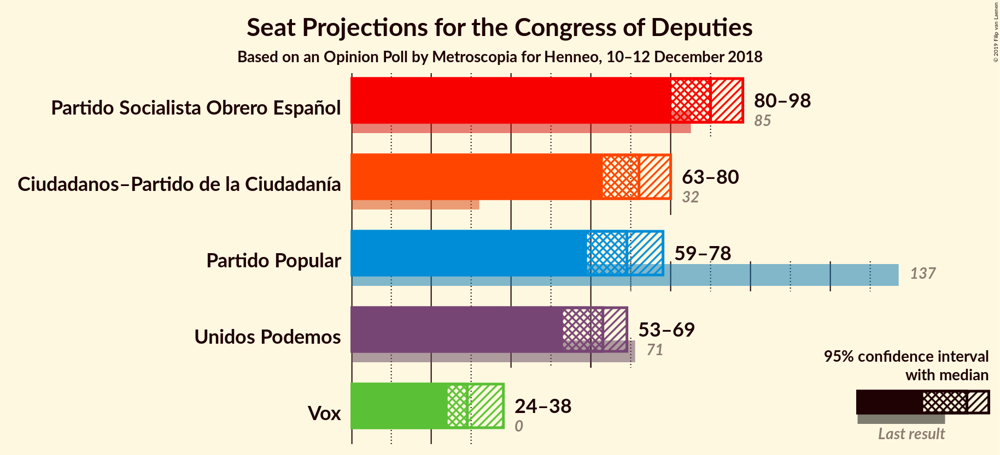

# Opinion Poll by Metroscopia for Henneo, 10–12 December 2018

<a href="#voting-intentions">Voting Intentions</a> | <a href="#seats">Seats</a> | <a href="#coalitions">Coalitions</a> | <a href="#technical-information">Technical Information</a>

## Voting Intentions

### Confidence Intervals

| Party | Last Result | Poll Result | 80% Confidence Interval | 90% Confidence Interval | 95% Confidence Interval | 99% Confidence Interval |
|:-----:|:-----------:|:-----------:|:-----------------------:|:-----------------------:|:-----------------------:|:-----------------------:|
| Partido Socialista Obrero Español | 22.6% | 22.2% | 21.0–23.5% |20.7–23.8% |20.4–24.2% |19.8–24.8% |
| Ciudadanos–Partido de la Ciudadanía | 13.1% | 20.5% | 19.3–21.7% |19.0–22.1% |18.7–22.4% |18.2–23.0% |
| Partido Popular | 33.0% | 18.0% | 16.9–19.2% |16.6–19.5% |16.3–19.8% |15.8–20.4% |
| Unidos Podemos | 21.2% | 17.9% | 16.8–19.1% |16.5–19.4% |16.2–19.7% |15.7–20.3% |
| Vox | 0.2% | 11.5% | 10.6–12.5% |10.3–12.8% |10.1–13.0% |9.7–13.5% |

*Note:* The poll result column reflects the actual value used in the calculations. Published results may vary slightly, and in addition be rounded to fewer digits.

## Seats

### Confidence Intervals

| Party | Last Result | Median | 80% Confidence Interval | 90% Confidence Interval | 95% Confidence Interval | 99% Confidence Interval |
|:-----:|:-----------:|:------:|:-----------------------:|:-----------------------:|:-----------------------:|:-----------------------:|
| <a href="#partido-socialista-obrero-español">Partido Socialista Obrero Español</a> | 85 | 90 | 84–96 |82–97 |80–98 |79–103 |
| <a href="#ciudadanos–partido-de-la-ciudadanía">Ciudadanos–Partido de la Ciudadanía</a> | 32 | 72 | 66–77 |65–79 |63–80 |62–84 |
| <a href="#partido-popular">Partido Popular</a> | 137 | 69 | 62–75 |60–77 |59–78 |57–82 |
| <a href="#unidos-podemos">Unidos Podemos</a> | 71 | 63 | 56–67 |54–68 |53–69 |48–71 |
| <a href="#vox">Vox</a> | 0 | 29 | 26–34 |24–36 |24–38 |22–42 |

### Partido Socialista Obrero Español

*For a full overview of the results for this party, see the [Partido Socialista Obrero Español](party-partidosocialistaobreroespañol.html) page.*

| Number of Seats | Probability | Accumulated | Special Marks |
|:---------------:|:-----------:|:-----------:|:-------------:|
| 77 | 0% | 100% |  |
| 78 | 0.1% | 99.9% |  |
| 79 | 0.9% | 99.8% |  |
| 80 | 2% | 99.0% |  |
| 81 | 2% | 97% |  |
| 82 | 2% | 96% |  |
| 83 | 2% | 94% |  |
| 84 | 3% | 91% |  |
| 85 | 3% | 89% | Last Result |
| 86 | 4% | 86% |  |
| 87 | 8% | 81% |  |
| 88 | 9% | 73% |  |
| 89 | 10% | 64% |  |
| 90 | 11% | 54% | Median |
| 91 | 9% | 43% |  |
| 92 | 7% | 33% |  |
| 93 | 5% | 26% |  |
| 94 | 5% | 21% |  |
| 95 | 5% | 16% |  |
| 96 | 5% | 11% |  |
| 97 | 3% | 7% |  |
| 98 | 2% | 4% |  |
| 99 | 0.9% | 2% |  |
| 100 | 0.5% | 2% |  |
| 101 | 0.5% | 1.1% |  |
| 102 | 0.2% | 0.7% |  |
| 103 | 0.1% | 0.5% |  |
| 104 | 0.1% | 0.4% |  |
| 105 | 0.1% | 0.3% |  |
| 106 | 0.1% | 0.2% |  |
| 107 | 0% | 0.1% |  |
| 108 | 0% | 0.1% |  |
| 109 | 0% | 0% |  |

### Ciudadanos–Partido de la Ciudadanía

*For a full overview of the results for this party, see the [Ciudadanos–Partido de la Ciudadanía](party-ciudadanos–partidodelaciudadanía.html) page.*

| Number of Seats | Probability | Accumulated | Special Marks |
|:---------------:|:-----------:|:-----------:|:-------------:|
| 32 | 0% | 100% | Last Result |
| 33 | 0% | 100% |  |
| 34 | 0% | 100% |  |
| 35 | 0% | 100% |  |
| 36 | 0% | 100% |  |
| 37 | 0% | 100% |  |
| 38 | 0% | 100% |  |
| 39 | 0% | 100% |  |
| 40 | 0% | 100% |  |
| 41 | 0% | 100% |  |
| 42 | 0% | 100% |  |
| 43 | 0% | 100% |  |
| 44 | 0% | 100% |  |
| 45 | 0% | 100% |  |
| 46 | 0% | 100% |  |
| 47 | 0% | 100% |  |
| 48 | 0% | 100% |  |
| 49 | 0% | 100% |  |
| 50 | 0% | 100% |  |
| 51 | 0% | 100% |  |
| 52 | 0% | 100% |  |
| 53 | 0% | 100% |  |
| 54 | 0% | 100% |  |
| 55 | 0% | 100% |  |
| 56 | 0% | 100% |  |
| 57 | 0% | 100% |  |
| 58 | 0% | 100% |  |
| 59 | 0% | 100% |  |
| 60 | 0% | 100% |  |
| 61 | 0.2% | 99.9% |  |
| 62 | 0.8% | 99.7% |  |
| 63 | 2% | 98.9% |  |
| 64 | 2% | 97% |  |
| 65 | 5% | 95% |  |
| 66 | 7% | 90% |  |
| 67 | 7% | 83% |  |
| 68 | 5% | 76% |  |
| 69 | 6% | 71% |  |
| 70 | 5% | 65% |  |
| 71 | 6% | 60% |  |
| 72 | 15% | 54% | Median |
| 73 | 13% | 39% |  |
| 74 | 7% | 26% |  |
| 75 | 3% | 19% |  |
| 76 | 4% | 16% |  |
| 77 | 4% | 12% |  |
| 78 | 2% | 8% |  |
| 79 | 2% | 6% |  |
| 80 | 2% | 4% |  |
| 81 | 0.8% | 2% |  |
| 82 | 0.6% | 1.4% |  |
| 83 | 0.3% | 0.9% |  |
| 84 | 0.3% | 0.5% |  |
| 85 | 0.1% | 0.3% |  |
| 86 | 0% | 0.1% |  |
| 87 | 0% | 0.1% |  |
| 88 | 0% | 0.1% |  |
| 89 | 0% | 0% |  |

### Partido Popular

*For a full overview of the results for this party, see the [Partido Popular](party-partidopopular.html) page.*

| Number of Seats | Probability | Accumulated | Special Marks |
|:---------------:|:-----------:|:-----------:|:-------------:|
| 54 | 0% | 100% |  |
| 55 | 0.1% | 99.9% |  |
| 56 | 0.2% | 99.8% |  |
| 57 | 0.3% | 99.6% |  |
| 58 | 1.1% | 99.3% |  |
| 59 | 1.4% | 98% |  |
| 60 | 4% | 97% |  |
| 61 | 2% | 93% |  |
| 62 | 3% | 91% |  |
| 63 | 5% | 88% |  |
| 64 | 5% | 83% |  |
| 65 | 7% | 78% |  |
| 66 | 6% | 71% |  |
| 67 | 7% | 65% |  |
| 68 | 5% | 59% |  |
| 69 | 7% | 54% | Median |
| 70 | 5% | 47% |  |
| 71 | 6% | 42% |  |
| 72 | 4% | 36% |  |
| 73 | 7% | 32% |  |
| 74 | 10% | 25% |  |
| 75 | 6% | 16% |  |
| 76 | 4% | 10% |  |
| 77 | 2% | 6% |  |
| 78 | 2% | 4% |  |
| 79 | 1.0% | 2% |  |
| 80 | 0.7% | 1.4% |  |
| 81 | 0.3% | 0.8% |  |
| 82 | 0.2% | 0.5% |  |
| 83 | 0.1% | 0.3% |  |
| 84 | 0.1% | 0.2% |  |
| 85 | 0% | 0.1% |  |
| 86 | 0% | 0.1% |  |
| 87 | 0% | 0.1% |  |
| 88 | 0% | 0% |  |
| 89 | 0% | 0% |  |
| 90 | 0% | 0% |  |
| 91 | 0% | 0% |  |
| 92 | 0% | 0% |  |
| 93 | 0% | 0% |  |
| 94 | 0% | 0% |  |
| 95 | 0% | 0% |  |
| 96 | 0% | 0% |  |
| 97 | 0% | 0% |  |
| 98 | 0% | 0% |  |
| 99 | 0% | 0% |  |
| 100 | 0% | 0% |  |
| 101 | 0% | 0% |  |
| 102 | 0% | 0% |  |
| 103 | 0% | 0% |  |
| 104 | 0% | 0% |  |
| 105 | 0% | 0% |  |
| 106 | 0% | 0% |  |
| 107 | 0% | 0% |  |
| 108 | 0% | 0% |  |
| 109 | 0% | 0% |  |
| 110 | 0% | 0% |  |
| 111 | 0% | 0% |  |
| 112 | 0% | 0% |  |
| 113 | 0% | 0% |  |
| 114 | 0% | 0% |  |
| 115 | 0% | 0% |  |
| 116 | 0% | 0% |  |
| 117 | 0% | 0% |  |
| 118 | 0% | 0% |  |
| 119 | 0% | 0% |  |
| 120 | 0% | 0% |  |
| 121 | 0% | 0% |  |
| 122 | 0% | 0% |  |
| 123 | 0% | 0% |  |
| 124 | 0% | 0% |  |
| 125 | 0% | 0% |  |
| 126 | 0% | 0% |  |
| 127 | 0% | 0% |  |
| 128 | 0% | 0% |  |
| 129 | 0% | 0% |  |
| 130 | 0% | 0% |  |
| 131 | 0% | 0% |  |
| 132 | 0% | 0% |  |
| 133 | 0% | 0% |  |
| 134 | 0% | 0% |  |
| 135 | 0% | 0% |  |
| 136 | 0% | 0% |  |
| 137 | 0% | 0% | Last Result |

### Unidos Podemos

*For a full overview of the results for this party, see the [Unidos Podemos](party-unidospodemos.html) page.*

| Number of Seats | Probability | Accumulated | Special Marks |
|:---------------:|:-----------:|:-----------:|:-------------:|
| 45 | 0.1% | 100% |  |
| 46 | 0.1% | 99.9% |  |
| 47 | 0.2% | 99.7% |  |
| 48 | 0.2% | 99.6% |  |
| 49 | 0.2% | 99.3% |  |
| 50 | 0.4% | 99.1% |  |
| 51 | 0.2% | 98.7% |  |
| 52 | 0.9% | 98.5% |  |
| 53 | 2% | 98% |  |
| 54 | 1.4% | 96% |  |
| 55 | 2% | 95% |  |
| 56 | 6% | 92% |  |
| 57 | 3% | 87% |  |
| 58 | 8% | 84% |  |
| 59 | 5% | 76% |  |
| 60 | 7% | 71% |  |
| 61 | 5% | 64% |  |
| 62 | 6% | 59% |  |
| 63 | 9% | 53% | Median |
| 64 | 6% | 44% |  |
| 65 | 12% | 39% |  |
| 66 | 9% | 27% |  |
| 67 | 10% | 17% |  |
| 68 | 4% | 8% |  |
| 69 | 3% | 4% |  |
| 70 | 0.4% | 0.9% |  |
| 71 | 0.2% | 0.5% | Last Result |
| 72 | 0.2% | 0.3% |  |
| 73 | 0.1% | 0.1% |  |
| 74 | 0% | 0.1% |  |
| 75 | 0% | 0% |  |

### Vox

*For a full overview of the results for this party, see the [Vox](party-vox.html) page.*

| Number of Seats | Probability | Accumulated | Special Marks |
|:---------------:|:-----------:|:-----------:|:-------------:|
| 0 | 0% | 100% | Last Result |
| 1 | 0% | 100% |  |
| 2 | 0% | 100% |  |
| 3 | 0% | 100% |  |
| 4 | 0% | 100% |  |
| 5 | 0% | 100% |  |
| 6 | 0% | 100% |  |
| 7 | 0% | 100% |  |
| 8 | 0% | 100% |  |
| 9 | 0% | 100% |  |
| 10 | 0% | 100% |  |
| 11 | 0% | 100% |  |
| 12 | 0% | 100% |  |
| 13 | 0% | 100% |  |
| 14 | 0% | 100% |  |
| 15 | 0% | 100% |  |
| 16 | 0% | 100% |  |
| 17 | 0% | 100% |  |
| 18 | 0% | 100% |  |
| 19 | 0% | 100% |  |
| 20 | 0.1% | 99.9% |  |
| 21 | 0.2% | 99.8% |  |
| 22 | 0.4% | 99.7% |  |
| 23 | 1.0% | 99.3% |  |
| 24 | 3% | 98% |  |
| 25 | 3% | 95% |  |
| 26 | 6% | 92% |  |
| 27 | 12% | 86% |  |
| 28 | 19% | 75% |  |
| 29 | 14% | 56% | Median |
| 30 | 12% | 42% |  |
| 31 | 9% | 30% |  |
| 32 | 7% | 20% |  |
| 33 | 3% | 13% |  |
| 34 | 3% | 11% |  |
| 35 | 2% | 8% |  |
| 36 | 1.2% | 5% |  |
| 37 | 1.3% | 4% |  |
| 38 | 0.7% | 3% |  |
| 39 | 0.9% | 2% |  |
| 40 | 0.5% | 1.2% |  |
| 41 | 0.2% | 0.8% |  |
| 42 | 0.2% | 0.5% |  |
| 43 | 0.2% | 0.3% |  |
| 44 | 0.1% | 0.2% |  |
| 45 | 0% | 0.1% |  |
| 46 | 0% | 0% |  |

## Coalitions

### Confidence Intervals

| Coalition | Last Result | Median | Majority? | 80% Confidence Interval | 90% Confidence Interval | 95% Confidence Interval | 99% Confidence Interval |
|:---------:|:-----------:|:------:|:---------:|:-----------------------:|:-----------------------:|:-----------------------:|:-----------------------:|
| Partido Socialista Obrero Español – Ciudadanos–Partido de la Ciudadanía – Partido Popular | 254 | 230 | 100% | 224–238 | 222–239 | 220–241 | 217–246 |
| Partido Socialista Obrero Español – Ciudadanos–Partido de la Ciudadanía – Unidos Podemos | 188 | 223 | 100% | 216–231 | 214–233 | 212–235 | 208–238 |
| Ciudadanos–Partido de la Ciudadanía – Partido Popular – Vox | 169 | 169 | 13% | 163–176 | 162–178 | 160–181 | 157–184 |
| Partido Socialista Obrero Español – Ciudadanos–Partido de la Ciudadanía | 117 | 161 | 0.5% | 154–168 | 152–170 | 149–172 | 147–175 |
| Partido Socialista Obrero Español – Partido Popular | 222 | 159 | 0.3% | 151–167 | 149–169 | 147–171 | 144–175 |
| Partido Socialista Obrero Español – Unidos Podemos | 156 | 152 | 0% | 145–159 | 143–161 | 141–162 | 137–165 |
| Ciudadanos–Partido de la Ciudadanía – Partido Popular | 169 | 140 | 0% | 133–147 | 132–149 | 130–151 | 127–154 |
| Partido Popular – Vox | 137 | 98 | 0% | 92–105 | 90–107 | 88–110 | 86–112 |
| Partido Socialista Obrero Español | 85 | 90 | 0% | 84–96 | 82–97 | 80–98 | 79–103 |
| Partido Popular | 137 | 69 | 0% | 62–75 | 60–77 | 59–78 | 57–82 |

### Partido Socialista Obrero Español – Ciudadanos–Partido de la Ciudadanía – Partido Popular

| Number of Seats | Probability | Accumulated | Special Marks |
|:---------------:|:-----------:|:-----------:|:-------------:|
| 214 | 0.1% | 100% |  |
| 215 | 0.1% | 99.9% |  |
| 216 | 0.2% | 99.8% |  |
| 217 | 0.4% | 99.6% |  |
| 218 | 0.6% | 99.2% |  |
| 219 | 0.7% | 98.6% |  |
| 220 | 1.3% | 98% |  |
| 221 | 1.4% | 97% |  |
| 222 | 2% | 95% |  |
| 223 | 3% | 93% |  |
| 224 | 4% | 90% |  |
| 225 | 6% | 86% |  |
| 226 | 5% | 80% |  |
| 227 | 9% | 75% |  |
| 228 | 7% | 66% |  |
| 229 | 7% | 59% |  |
| 230 | 6% | 52% |  |
| 231 | 7% | 45% | Median |
| 232 | 6% | 38% |  |
| 233 | 4% | 32% |  |
| 234 | 4% | 28% |  |
| 235 | 5% | 23% |  |
| 236 | 4% | 18% |  |
| 237 | 4% | 15% |  |
| 238 | 4% | 11% |  |
| 239 | 2% | 7% |  |
| 240 | 2% | 5% |  |
| 241 | 1.2% | 3% |  |
| 242 | 0.6% | 2% |  |
| 243 | 0.6% | 1.4% |  |
| 244 | 0.2% | 0.9% |  |
| 245 | 0.1% | 0.6% |  |
| 246 | 0.1% | 0.5% |  |
| 247 | 0.1% | 0.4% |  |
| 248 | 0.1% | 0.3% |  |
| 249 | 0.1% | 0.2% |  |
| 250 | 0% | 0.1% |  |
| 251 | 0% | 0.1% |  |
| 252 | 0% | 0% |  |
| 253 | 0% | 0% |  |
| 254 | 0% | 0% | Last Result |

### Partido Socialista Obrero Español – Ciudadanos–Partido de la Ciudadanía – Unidos Podemos

| Number of Seats | Probability | Accumulated | Special Marks |
|:---------------:|:-----------:|:-----------:|:-------------:|
| 188 | 0% | 100% | Last Result |
| 189 | 0% | 100% |  |
| 190 | 0% | 100% |  |
| 191 | 0% | 100% |  |
| 192 | 0% | 100% |  |
| 193 | 0% | 100% |  |
| 194 | 0% | 100% |  |
| 195 | 0% | 100% |  |
| 196 | 0% | 100% |  |
| 197 | 0% | 100% |  |
| 198 | 0% | 100% |  |
| 199 | 0% | 100% |  |
| 200 | 0% | 100% |  |
| 201 | 0% | 100% |  |
| 202 | 0% | 100% |  |
| 203 | 0% | 100% |  |
| 204 | 0% | 99.9% |  |
| 205 | 0% | 99.9% |  |
| 206 | 0% | 99.9% |  |
| 207 | 0.1% | 99.8% |  |
| 208 | 0.4% | 99.7% |  |
| 209 | 0.5% | 99.3% |  |
| 210 | 0.7% | 98.8% |  |
| 211 | 0.5% | 98% |  |
| 212 | 0.5% | 98% |  |
| 213 | 1.3% | 97% |  |
| 214 | 0.9% | 96% |  |
| 215 | 3% | 95% |  |
| 216 | 2% | 92% |  |
| 217 | 4% | 90% |  |
| 218 | 5% | 86% |  |
| 219 | 7% | 80% |  |
| 220 | 7% | 73% |  |
| 221 | 7% | 66% |  |
| 222 | 5% | 59% |  |
| 223 | 5% | 54% |  |
| 224 | 7% | 49% |  |
| 225 | 4% | 41% | Median |
| 226 | 6% | 37% |  |
| 227 | 6% | 31% |  |
| 228 | 6% | 25% |  |
| 229 | 4% | 19% |  |
| 230 | 4% | 14% |  |
| 231 | 3% | 10% |  |
| 232 | 1.4% | 7% |  |
| 233 | 2% | 6% |  |
| 234 | 1.3% | 4% |  |
| 235 | 0.9% | 3% |  |
| 236 | 0.6% | 2% |  |
| 237 | 0.5% | 1.2% |  |
| 238 | 0.3% | 0.6% |  |
| 239 | 0.2% | 0.3% |  |
| 240 | 0.1% | 0.1% |  |
| 241 | 0% | 0.1% |  |
| 242 | 0% | 0% |  |

### Ciudadanos–Partido de la Ciudadanía – Partido Popular – Vox

| Number of Seats | Probability | Accumulated | Special Marks |
|:---------------:|:-----------:|:-----------:|:-------------:|
| 155 | 0.1% | 100% |  |
| 156 | 0.1% | 99.9% |  |
| 157 | 0.2% | 99.7% |  |
| 158 | 0.4% | 99.5% |  |
| 159 | 0.8% | 99.1% |  |
| 160 | 1.2% | 98% |  |
| 161 | 2% | 97% |  |
| 162 | 3% | 95% |  |
| 163 | 4% | 93% |  |
| 164 | 4% | 88% |  |
| 165 | 4% | 84% |  |
| 166 | 6% | 80% |  |
| 167 | 10% | 74% |  |
| 168 | 8% | 64% |  |
| 169 | 7% | 56% | Last Result |
| 170 | 9% | 49% | Median |
| 171 | 7% | 40% |  |
| 172 | 3% | 34% |  |
| 173 | 6% | 30% |  |
| 174 | 7% | 24% |  |
| 175 | 4% | 17% |  |
| 176 | 3% | 13% | Majority |
| 177 | 3% | 10% |  |
| 178 | 2% | 7% |  |
| 179 | 0.9% | 4% |  |
| 180 | 0.9% | 4% |  |
| 181 | 1.1% | 3% |  |
| 182 | 0.4% | 1.5% |  |
| 183 | 0.4% | 1.1% |  |
| 184 | 0.2% | 0.7% |  |
| 185 | 0.2% | 0.5% |  |
| 186 | 0.1% | 0.2% |  |
| 187 | 0.1% | 0.1% |  |
| 188 | 0% | 0.1% |  |
| 189 | 0% | 0% |  |

### Partido Socialista Obrero Español – Ciudadanos–Partido de la Ciudadanía

| Number of Seats | Probability | Accumulated | Special Marks |
|:---------------:|:-----------:|:-----------:|:-------------:|
| 117 | 0% | 100% | Last Result |
| 118 | 0% | 100% |  |
| 119 | 0% | 100% |  |
| 120 | 0% | 100% |  |
| 121 | 0% | 100% |  |
| 122 | 0% | 100% |  |
| 123 | 0% | 100% |  |
| 124 | 0% | 100% |  |
| 125 | 0% | 100% |  |
| 126 | 0% | 100% |  |
| 127 | 0% | 100% |  |
| 128 | 0% | 100% |  |
| 129 | 0% | 100% |  |
| 130 | 0% | 100% |  |
| 131 | 0% | 100% |  |
| 132 | 0% | 100% |  |
| 133 | 0% | 100% |  |
| 134 | 0% | 100% |  |
| 135 | 0% | 100% |  |
| 136 | 0% | 100% |  |
| 137 | 0% | 100% |  |
| 138 | 0% | 100% |  |
| 139 | 0% | 100% |  |
| 140 | 0% | 100% |  |
| 141 | 0% | 100% |  |
| 142 | 0% | 100% |  |
| 143 | 0% | 100% |  |
| 144 | 0.1% | 100% |  |
| 145 | 0.1% | 99.9% |  |
| 146 | 0.2% | 99.8% |  |
| 147 | 0.5% | 99.6% |  |
| 148 | 0.6% | 99.1% |  |
| 149 | 1.1% | 98% |  |
| 150 | 0.9% | 97% |  |
| 151 | 0.8% | 96% |  |
| 152 | 1.1% | 96% |  |
| 153 | 2% | 95% |  |
| 154 | 3% | 93% |  |
| 155 | 3% | 90% |  |
| 156 | 5% | 87% |  |
| 157 | 4% | 82% |  |
| 158 | 5% | 78% |  |
| 159 | 6% | 73% |  |
| 160 | 9% | 67% |  |
| 161 | 10% | 58% |  |
| 162 | 8% | 48% | Median |
| 163 | 7% | 40% |  |
| 164 | 9% | 32% |  |
| 165 | 6% | 23% |  |
| 166 | 4% | 18% |  |
| 167 | 3% | 14% |  |
| 168 | 3% | 11% |  |
| 169 | 3% | 8% |  |
| 170 | 1.4% | 6% |  |
| 171 | 2% | 4% |  |
| 172 | 1.0% | 3% |  |
| 173 | 0.6% | 2% |  |
| 174 | 0.4% | 1.0% |  |
| 175 | 0.2% | 0.7% |  |
| 176 | 0.1% | 0.5% | Majority |
| 177 | 0.1% | 0.3% |  |
| 178 | 0.1% | 0.2% |  |
| 179 | 0.1% | 0.1% |  |
| 180 | 0% | 0.1% |  |
| 181 | 0% | 0.1% |  |
| 182 | 0% | 0% |  |

### Partido Socialista Obrero Español – Partido Popular

| Number of Seats | Probability | Accumulated | Special Marks |
|:---------------:|:-----------:|:-----------:|:-------------:|
| 142 | 0% | 100% |  |
| 143 | 0.3% | 99.9% |  |
| 144 | 0.2% | 99.7% |  |
| 145 | 0.5% | 99.5% |  |
| 146 | 0.3% | 98.9% |  |
| 147 | 1.2% | 98.6% |  |
| 148 | 2% | 97% |  |
| 149 | 2% | 95% |  |
| 150 | 2% | 93% |  |
| 151 | 3% | 90% |  |
| 152 | 3% | 87% |  |
| 153 | 4% | 84% |  |
| 154 | 4% | 80% |  |
| 155 | 9% | 75% |  |
| 156 | 4% | 66% |  |
| 157 | 4% | 62% |  |
| 158 | 7% | 58% |  |
| 159 | 7% | 51% | Median |
| 160 | 7% | 44% |  |
| 161 | 3% | 37% |  |
| 162 | 3% | 34% |  |
| 163 | 3% | 31% |  |
| 164 | 3% | 28% |  |
| 165 | 6% | 25% |  |
| 166 | 8% | 19% |  |
| 167 | 4% | 11% |  |
| 168 | 2% | 8% |  |
| 169 | 0.8% | 6% |  |
| 170 | 1.2% | 5% |  |
| 171 | 2% | 4% |  |
| 172 | 0.6% | 2% |  |
| 173 | 0.3% | 1.0% |  |
| 174 | 0.2% | 0.7% |  |
| 175 | 0.2% | 0.5% |  |
| 176 | 0.1% | 0.3% | Majority |
| 177 | 0% | 0.3% |  |
| 178 | 0.1% | 0.2% |  |
| 179 | 0.1% | 0.2% |  |
| 180 | 0.1% | 0.1% |  |
| 181 | 0% | 0.1% |  |
| 182 | 0% | 0% |  |
| 183 | 0% | 0% |  |
| 184 | 0% | 0% |  |
| 185 | 0% | 0% |  |
| 186 | 0% | 0% |  |
| 187 | 0% | 0% |  |
| 188 | 0% | 0% |  |
| 189 | 0% | 0% |  |
| 190 | 0% | 0% |  |
| 191 | 0% | 0% |  |
| 192 | 0% | 0% |  |
| 193 | 0% | 0% |  |
| 194 | 0% | 0% |  |
| 195 | 0% | 0% |  |
| 196 | 0% | 0% |  |
| 197 | 0% | 0% |  |
| 198 | 0% | 0% |  |
| 199 | 0% | 0% |  |
| 200 | 0% | 0% |  |
| 201 | 0% | 0% |  |
| 202 | 0% | 0% |  |
| 203 | 0% | 0% |  |
| 204 | 0% | 0% |  |
| 205 | 0% | 0% |  |
| 206 | 0% | 0% |  |
| 207 | 0% | 0% |  |
| 208 | 0% | 0% |  |
| 209 | 0% | 0% |  |
| 210 | 0% | 0% |  |
| 211 | 0% | 0% |  |
| 212 | 0% | 0% |  |
| 213 | 0% | 0% |  |
| 214 | 0% | 0% |  |
| 215 | 0% | 0% |  |
| 216 | 0% | 0% |  |
| 217 | 0% | 0% |  |
| 218 | 0% | 0% |  |
| 219 | 0% | 0% |  |
| 220 | 0% | 0% |  |
| 221 | 0% | 0% |  |
| 222 | 0% | 0% | Last Result |

### Partido Socialista Obrero Español – Unidos Podemos

| Number of Seats | Probability | Accumulated | Special Marks |
|:---------------:|:-----------:|:-----------:|:-------------:|
| 133 | 0% | 100% |  |
| 134 | 0% | 99.9% |  |
| 135 | 0.1% | 99.9% |  |
| 136 | 0.1% | 99.8% |  |
| 137 | 0.3% | 99.7% |  |
| 138 | 0.3% | 99.4% |  |
| 139 | 0.5% | 99.1% |  |
| 140 | 0.4% | 98.7% |  |
| 141 | 1.3% | 98% |  |
| 142 | 1.1% | 97% |  |
| 143 | 1.0% | 96% |  |
| 144 | 3% | 95% |  |
| 145 | 3% | 92% |  |
| 146 | 4% | 89% |  |
| 147 | 5% | 85% |  |
| 148 | 7% | 81% |  |
| 149 | 7% | 74% |  |
| 150 | 5% | 67% |  |
| 151 | 6% | 62% |  |
| 152 | 8% | 57% |  |
| 153 | 7% | 49% | Median |
| 154 | 10% | 42% |  |
| 155 | 7% | 32% |  |
| 156 | 5% | 26% | Last Result |
| 157 | 7% | 20% |  |
| 158 | 3% | 13% |  |
| 159 | 3% | 11% |  |
| 160 | 3% | 8% |  |
| 161 | 2% | 5% |  |
| 162 | 1.3% | 3% |  |
| 163 | 0.9% | 2% |  |
| 164 | 0.5% | 1.2% |  |
| 165 | 0.4% | 0.7% |  |
| 166 | 0.1% | 0.3% |  |
| 167 | 0.1% | 0.2% |  |
| 168 | 0.1% | 0.1% |  |
| 169 | 0% | 0% |  |

### Ciudadanos–Partido de la Ciudadanía – Partido Popular

| Number of Seats | Probability | Accumulated | Special Marks |
|:---------------:|:-----------:|:-----------:|:-------------:|
| 125 | 0.1% | 100% |  |
| 126 | 0.3% | 99.9% |  |
| 127 | 0.3% | 99.6% |  |
| 128 | 0.5% | 99.3% |  |
| 129 | 0.7% | 98.8% |  |
| 130 | 2% | 98% |  |
| 131 | 0.9% | 97% |  |
| 132 | 3% | 96% |  |
| 133 | 3% | 93% |  |
| 134 | 4% | 89% |  |
| 135 | 5% | 85% |  |
| 136 | 4% | 80% |  |
| 137 | 9% | 76% |  |
| 138 | 8% | 67% |  |
| 139 | 7% | 59% |  |
| 140 | 4% | 52% |  |
| 141 | 9% | 47% | Median |
| 142 | 5% | 39% |  |
| 143 | 5% | 34% |  |
| 144 | 4% | 29% |  |
| 145 | 5% | 25% |  |
| 146 | 6% | 20% |  |
| 147 | 4% | 14% |  |
| 148 | 3% | 10% |  |
| 149 | 2% | 7% |  |
| 150 | 2% | 5% |  |
| 151 | 0.9% | 3% |  |
| 152 | 0.4% | 2% |  |
| 153 | 0.5% | 1.4% |  |
| 154 | 0.4% | 0.9% |  |
| 155 | 0.2% | 0.5% |  |
| 156 | 0.1% | 0.2% |  |
| 157 | 0.1% | 0.1% |  |
| 158 | 0% | 0.1% |  |
| 159 | 0% | 0% |  |
| 160 | 0% | 0% |  |
| 161 | 0% | 0% |  |
| 162 | 0% | 0% |  |
| 163 | 0% | 0% |  |
| 164 | 0% | 0% |  |
| 165 | 0% | 0% |  |
| 166 | 0% | 0% |  |
| 167 | 0% | 0% |  |
| 168 | 0% | 0% |  |
| 169 | 0% | 0% | Last Result |

### Partido Popular – Vox

| Number of Seats | Probability | Accumulated | Special Marks |
|:---------------:|:-----------:|:-----------:|:-------------:|
| 83 | 0% | 100% |  |
| 84 | 0.1% | 99.9% |  |
| 85 | 0.3% | 99.9% |  |
| 86 | 0.3% | 99.5% |  |
| 87 | 0.8% | 99.2% |  |
| 88 | 1.2% | 98% |  |
| 89 | 2% | 97% |  |
| 90 | 2% | 96% |  |
| 91 | 3% | 94% |  |
| 92 | 3% | 91% |  |
| 93 | 4% | 88% |  |
| 94 | 6% | 83% |  |
| 95 | 8% | 77% |  |
| 96 | 7% | 69% |  |
| 97 | 6% | 63% |  |
| 98 | 8% | 56% | Median |
| 99 | 4% | 48% |  |
| 100 | 5% | 43% |  |
| 101 | 7% | 38% |  |
| 102 | 10% | 31% |  |
| 103 | 7% | 21% |  |
| 104 | 3% | 14% |  |
| 105 | 4% | 11% |  |
| 106 | 2% | 7% |  |
| 107 | 2% | 5% |  |
| 108 | 0.6% | 4% |  |
| 109 | 0.5% | 3% |  |
| 110 | 0.7% | 3% |  |
| 111 | 0.8% | 2% |  |
| 112 | 0.6% | 1.1% |  |
| 113 | 0.2% | 0.4% |  |
| 114 | 0.1% | 0.2% |  |
| 115 | 0.1% | 0.2% |  |
| 116 | 0% | 0.1% |  |
| 117 | 0% | 0.1% |  |
| 118 | 0% | 0.1% |  |
| 119 | 0% | 0% |  |
| 120 | 0% | 0% |  |
| 121 | 0% | 0% |  |
| 122 | 0% | 0% |  |
| 123 | 0% | 0% |  |
| 124 | 0% | 0% |  |
| 125 | 0% | 0% |  |
| 126 | 0% | 0% |  |
| 127 | 0% | 0% |  |
| 128 | 0% | 0% |  |
| 129 | 0% | 0% |  |
| 130 | 0% | 0% |  |
| 131 | 0% | 0% |  |
| 132 | 0% | 0% |  |
| 133 | 0% | 0% |  |
| 134 | 0% | 0% |  |
| 135 | 0% | 0% |  |
| 136 | 0% | 0% |  |
| 137 | 0% | 0% | Last Result |

### Partido Socialista Obrero Español

| Number of Seats | Probability | Accumulated | Special Marks |
|:---------------:|:-----------:|:-----------:|:-------------:|
| 77 | 0% | 100% |  |
| 78 | 0.1% | 99.9% |  |
| 79 | 0.9% | 99.8% |  |
| 80 | 2% | 99.0% |  |
| 81 | 2% | 97% |  |
| 82 | 2% | 96% |  |
| 83 | 2% | 94% |  |
| 84 | 3% | 91% |  |
| 85 | 3% | 89% | Last Result |
| 86 | 4% | 86% |  |
| 87 | 8% | 81% |  |
| 88 | 9% | 73% |  |
| 89 | 10% | 64% |  |
| 90 | 11% | 54% | Median |
| 91 | 9% | 43% |  |
| 92 | 7% | 33% |  |
| 93 | 5% | 26% |  |
| 94 | 5% | 21% |  |
| 95 | 5% | 16% |  |
| 96 | 5% | 11% |  |
| 97 | 3% | 7% |  |
| 98 | 2% | 4% |  |
| 99 | 0.9% | 2% |  |
| 100 | 0.5% | 2% |  |
| 101 | 0.5% | 1.1% |  |
| 102 | 0.2% | 0.7% |  |
| 103 | 0.1% | 0.5% |  |
| 104 | 0.1% | 0.4% |  |
| 105 | 0.1% | 0.3% |  |
| 106 | 0.1% | 0.2% |  |
| 107 | 0% | 0.1% |  |
| 108 | 0% | 0.1% |  |
| 109 | 0% | 0% |  |

### Partido Popular

| Number of Seats | Probability | Accumulated | Special Marks |
|:---------------:|:-----------:|:-----------:|:-------------:|
| 54 | 0% | 100% |  |
| 55 | 0.1% | 99.9% |  |
| 56 | 0.2% | 99.8% |  |
| 57 | 0.3% | 99.6% |  |
| 58 | 1.1% | 99.3% |  |
| 59 | 1.4% | 98% |  |
| 60 | 4% | 97% |  |
| 61 | 2% | 93% |  |
| 62 | 3% | 91% |  |
| 63 | 5% | 88% |  |
| 64 | 5% | 83% |  |
| 65 | 7% | 78% |  |
| 66 | 6% | 71% |  |
| 67 | 7% | 65% |  |
| 68 | 5% | 59% |  |
| 69 | 7% | 54% | Median |
| 70 | 5% | 47% |  |
| 71 | 6% | 42% |  |
| 72 | 4% | 36% |  |
| 73 | 7% | 32% |  |
| 74 | 10% | 25% |  |
| 75 | 6% | 16% |  |
| 76 | 4% | 10% |  |
| 77 | 2% | 6% |  |
| 78 | 2% | 4% |  |
| 79 | 1.0% | 2% |  |
| 80 | 0.7% | 1.4% |  |
| 81 | 0.3% | 0.8% |  |
| 82 | 0.2% | 0.5% |  |
| 83 | 0.1% | 0.3% |  |
| 84 | 0.1% | 0.2% |  |
| 85 | 0% | 0.1% |  |
| 86 | 0% | 0.1% |  |
| 87 | 0% | 0.1% |  |
| 88 | 0% | 0% |  |
| 89 | 0% | 0% |  |
| 90 | 0% | 0% |  |
| 91 | 0% | 0% |  |
| 92 | 0% | 0% |  |
| 93 | 0% | 0% |  |
| 94 | 0% | 0% |  |
| 95 | 0% | 0% |  |
| 96 | 0% | 0% |  |
| 97 | 0% | 0% |  |
| 98 | 0% | 0% |  |
| 99 | 0% | 0% |  |
| 100 | 0% | 0% |  |
| 101 | 0% | 0% |  |
| 102 | 0% | 0% |  |
| 103 | 0% | 0% |  |
| 104 | 0% | 0% |  |
| 105 | 0% | 0% |  |
| 106 | 0% | 0% |  |
| 107 | 0% | 0% |  |
| 108 | 0% | 0% |  |
| 109 | 0% | 0% |  |
| 110 | 0% | 0% |  |
| 111 | 0% | 0% |  |
| 112 | 0% | 0% |  |
| 113 | 0% | 0% |  |
| 114 | 0% | 0% |  |
| 115 | 0% | 0% |  |
| 116 | 0% | 0% |  |
| 117 | 0% | 0% |  |
| 118 | 0% | 0% |  |
| 119 | 0% | 0% |  |
| 120 | 0% | 0% |  |
| 121 | 0% | 0% |  |
| 122 | 0% | 0% |  |
| 123 | 0% | 0% |  |
| 124 | 0% | 0% |  |
| 125 | 0% | 0% |  |
| 126 | 0% | 0% |  |
| 127 | 0% | 0% |  |
| 128 | 0% | 0% |  |
| 129 | 0% | 0% |  |
| 130 | 0% | 0% |  |
| 131 | 0% | 0% |  |
| 132 | 0% | 0% |  |
| 133 | 0% | 0% |  |
| 134 | 0% | 0% |  |
| 135 | 0% | 0% |  |
| 136 | 0% | 0% |  |
| 137 | 0% | 0% | Last Result |

## Technical Information

### Opinion Poll

+ **Polling firm:** Metroscopia
+ **Commissioner(s):** Henneo
+ **Fieldwork period:** 10–12 December 2018

### Calculations

+ **Sample size:** 1895
+ **Simulations done:** 131,072
+ **Error estimate:** 0.34%

